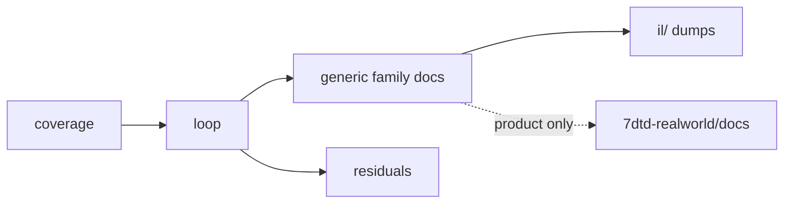

# 7DTD dedicated RE documentation (generic engine)

**Owns:** hub for **generic** dedicated engine RE narratives + dump index.  
**Not:** RealEarth product status/lessons (`7dtd-realworld`, private companion project, not published).  
**Game:** V3.1.0 (b14) dedicated `Assembly-CSharp.dll`.  
**Policy:** research only. Do not redistribute game IL or managed DLLs.  
**Coverage bar:** dedicated-relevant **managed** surfaces. Open leftovers: [`residuals.md`](residuals.md).

```text
docs/              generic engine narratives (this folder)
docs/inventories/  raw method/call inventories backing the narratives
il/                regenerable Mono.Cecil dumps only (local; not in git)
oss-tools/         survey notes on third-party server tools/mods
7dtd-realworld/    RealEarth product docs (sibling repo, private companion, not published)
```

---


## Version policy and IL citation convention

**Policy: track the latest stock release only.** The corpus is regenerated
against each new dedicated `Assembly-CSharp.dll` and the previous version's sets
are deleted in the same change, so a citation can never quietly refer to an old
build. Regenerate before deleting: an assembly that is no longer installed
cannot be dumped again.

**Current pin:** V **3.1.0 b14**. Every tracked set in [`../il/`](../il/) is
V3.1.0; the V3.0.1 sets were removed on 2026-08-06.

| Citation form | Means |
|---|---|
| `il/<set>-v3.1.0/...` | the tracked V3.1.0 dump sets |
| `asm.il:NNNN` | a V3.1.0 single-file dump kept outside the repo, identified by MD5 in [`../il/README.md`](../il/README.md) |

Mentions of V3.0.1 in these documents are deliberate history (what changed
between releases, what a prior corpus measured), not stale pins. Line numbers
written before 2026-08-06 may still be V3.0.1 numbers, which drift from the
V3.1.0 dump by roughly 3500 lines in the NetPackage region.

### V3.1.0 shipped delta map

The standalone `experimental-delta.md` doc was **retired** once Henpocalypse
shipped as stable V3.1.0 (b14). Facts live in the topic docs (not a separate
delta file):

| Topic | Home |
|---|---|
| Machine pin (version, TPS, census, TE widths) | [`../tools/data/stock_facts.json`](../tools/data/stock_facts.json), [coverage.md](coverage.md), [re-methodology.md](re-methodology.md) §1 |
| NetPackageTileEntity `teBlockId` + i32 length | [protocol-packages.md](protocol-packages.md) §6.12, [tile-entities-power.md](tile-entities-power.md) |
| Held entities / wild chicken grab | [items.md](items.md) § Held entities, [entity-ai.md](entity-ai.md) |
| WorldState.SaveLoad IL=926 / CurrentSaveVersion=23 | [save-region.md](save-region.md) §1 (full-file byte-exact round-trip; game-reader round-trip; shipped V4.0-tooled world skew) |
| Save codecs verified byte-exact on real saves | `make save-roundtrip-all` ([tools/save_roundtrip_check.py](../tools/save_roundtrip_check.py)): main.ttw (all nested blobs), region files, chunk bodies, decoration/multiblocks, id mappings, plus the shipped Navezgane world - 16 probe saves + shipped, 2026-08-12 |
| LiteNetLib wire pins: `ProtocolId` **13**, `MaxPacketSize` **1432**, `PossibleMtu` [1024..1432], PacketProperty ordinals 0-17 | [`../tools/data/stock_facts.json`](../tools/data/stock_facts.json) `litenet.*` (machine-checked; zdtd `max_packet_size` 1327 divergence flagged) |
| XML data pins: zombie HP ladder (healthSlim **125** ... infernal **1600**), trader economy (**3.0**/**0.2**), survival well-fed threshold **0.52** | [`../tools/data/xml_pins.json`](../tools/data/xml_pins.json) (machine-checked by `check_stock_facts`) |
| Behaviour pins: WaterLevel **62.88**, item-drop lifetime **300 s**, per-frame load budget **50 ms** | [`../tools/data/stock_facts.json`](../tools/data/stock_facts.json) `behaviour.*` (machine-checked by `check_stock_facts`; WaterLevel 62.88 also observed live in a real `main.ttw` save header, save-region.md §1) |
| Join analytics `PlayerJoinServerEventData` | [server-lifecycle.md](server-lifecycle.md) |
| Sandbox day/night density+respawn, chicken coop knobs, infection/hunger/thirst/stack | [sandbox-options.md](sandbox-options.md) §2 |
| EOS/browse filters, GSI sandbox fields | [server-browser-prefabs.md](server-browser-prefabs.md), [network.md](network.md) |
| Official product notes (content, not IL) | https://7daystodie.com/v3-1-0-henpocalypse-release-notes/ |

## Start here

Campaign audit (V3.1.0 evidence + residual map): [`../workspace/outputs/docs-research-audit-20260803.md`](../workspace/outputs/docs-research-audit-20260803.md).

Live scheduled-event evidence (2026-08-11, stock V3.1.0 dedicated runs):
[air drop](../workspace/notes/live-airdrop-verification-20260811.md),
[wandering horde](../workspace/notes/live-horde-verification-20260811.md),
[blood-moon start](../workspace/notes/live-bloodmoon-verification-20260811.md);
the method (boot/settime/join/observe) is in [re-methodology.md](re-methodology.md) 5e.


| # | Doc | Use when |
|---|---|---|
| 0 | [`architecture-map.md`](architecture-map.md) | **Start here.** Whole-system visual map: layers, boot, frame phases, sim core, wire, persistence |
| 1 | [`coverage.md`](coverage.md) | Is engine family X documented? Which dump? |
| 2 | [`engine-limitations.md`](engine-limitations.md) | What stock ceilings bind any dedicated server? (+ known stock defects) |
| 3 | [`loop.md`](loop.md) | How the dedicated frame/sim runs |
| 4 | [`protocol.md`](protocol.md) | Wire framing, join, golden package bodies |
| 5 | [`protocol-frames.md`](protocol-frames.md) | Visual RFC/Mermaid byte frames per package |
| 6 | [`ZIG_CLONE.md`](../../zdtd/docs/ZIG_CLONE.md) | Zig clone architecture from RE (companion `zdtd/docs/`) |
| 6b | [`PROVENANCE.md`](../../zdtd/docs/PROVENANCE.md) | zdtd provenance ledger: every behavior/perk/value -> stock source (file map 187/187, constants, divergences; gated by zdtd `tools/provenance_scan.py`) |
| 7 | [`residuals.md`](residuals.md) | What IL cannot close |
| 7b | [`completion-bar.md`](completion-bar.md) | What "100% documented" means (tiers A-D) |



---

## Reading paths

| Goal | Path |
|---|---|
| Whole engine map | coverage → loop → family docs → residuals |
| **Stock ceilings (any dedi)** | [engine-limitations.md](engine-limitations.md) → loop (scaling laws: optimizer `measured-scaling.md`) |
| **Zig / custom dedi clone** | [ZIG_CLONE.md](../../zdtd/docs/ZIG_CLONE.md) → [protocol.md](protocol.md) → loop → network → world-chunks → save-region |
| Wire / join / golden packages | protocol → **protocol-frames** → **protocol-packages** → network → loadgen PackageCodec |
| How to reverse-engineer | **re-methodology** → [`../tools/`](../tools) → coverage |
| Re-run the zdtd provenance review | [provenance-review-prompt.md](provenance-review-prompt.md) (copy-paste prompt: method, gates, honesty rules) |
| **Stock hardcode pin** | [`../tools/stock-sync.sh`](../tools/stock-sync.sh) → [`../tools/data/stock_facts.json`](../tools/data/stock_facts.json) (see re-methodology §5c) |
| Frame / gmUpdate | loop → loop-gmupdate → inventories/gmupdate-calls |
| Entities / AI / path | entity-ai → closed-gaps → aidirector |
| World / chunks / save | world-chunks → save-region → terrain-height |
| Net | network → closed-gaps |
| Light / mesh / water | light-mesh-water |
| **Tuned game constants (exact numbers)** | the owning topic doc (constants pinned by `tools/tests/test_tuned_constants.py`, 524 pins: horde geometry + airdrop schedule, block masks, entity ids, spawn rings, stealth, caps) |
| Managers / ModEvents | managers |
| **Live APM scale / bottlenecks / tuning** | optimization mod: `../../7dtd-optimizer/docs/` (measured-scaling, bottlenecks, runtime-tuning) |
| **RealEarth product limits** | `../../7dtd-realworld/docs/ENGINE_LIMITATIONS.md` |
| **RealEarth product hub** | `../../7dtd-realworld/docs/INDEX.md` |
| EfficientServer optim | [`../../7dtd-optimizer/docs/`](../../7dtd-optimizer/docs) |
| **Perf research → optim backlog** | [`../../7dtd-optimizer/docs/PERF_RESEARCH_BRIEF.md`](../../7dtd-optimizer/docs/PERF_RESEARCH_BRIEF.md) |

### Key engine state machines (generic)

| Lifecycle | Doc |
|---|---|
| gmUpdate phases A-J | [loop.md](loop.md) §2 |
| UpdateTick slice vs full | [loop.md](loop.md) §3 |
| AI LOD + path request | [entity-ai.md](entity-ai.md) |
| Chunk InProgress lifecycle | [world-chunks.md](world-chunks.md) §4 |
| Net package bands | [network.md](network.md) §2 |
| World save/load | [save-region.md](save-region.md) §1 |
| Origin FixedUpdate (dedi no-op) | [loop.md](loop.md) §1 / §12 |

Product Streamed state machines (tiles, inject gate, SoloSlide): see product ``realearth-runtime.md``.

---

## One home per topic

| Topic | File (this folder) |
|---|---|
| Coverage checklist | coverage.md |
| **Whole-assembly map + coverage ledger** | **full-surface.md** |
| **Stock engine ceilings** | **engine-limitations.md** |
| **Wire protocol (join + golden bodies)** | **protocol.md** |
| **Wire package bodies + metadata census** | **protocol-packages.md** |
| **Wire frames (visual)** | **protocol-frames.md** |
| **How to reverse-engineer (method)** | **re-methodology.md** |
| Non-IL residuals | residuals.md |
| Frame / sim loop | loop.md |
| gmUpdate phases | loop-gmupdate.md |
| Entity / AI / path | entity-ai.md |
| Closed IL gaps (timer, path, net bands) | closed-gaps.md |
| World tick / chunks | world-chunks.md |
| Save / WorldState / region | save-region.md |
| Terrain YDim / height APIs | terrain-height.md |
| Networking | network.md |
| Light / stability / mesh / water | light-mesh-water.md |
| Managers + ModEvents | managers.md |
| AIDirector types | aidirector.md |

Optimization-mod topics (bottlenecks, algorithm cost anatomy, APM scaling laws,
GC/FPS tuning, allocation reuse, aggressive levers) live in the **companion
`7dtd-optimizer/docs/`**, not this repo. See the table below. The **Zig clone
architecture** (module map, M0-M6 milestones) is reimplementation design and lives
in **`zdtd/docs/ZIG_CLONE.md`**, built from the wire/loop RE here.

| Topic | File (product `7dtd-realworld/docs/`, private, not published) |
|---|---|
| Streamed runtime lessons | `realearth-runtime.md` |
| Engine surfaces used by RealEarth | `realearth-surfaces.md` |
| Adversarial review catalog | `realearth-review.md` |
| Product status Done/Partial | `MODIFICATIONS.md` |
| Lon/lat dual coords | `LON_LAT.md` |
| Absolute → inject path | `ABSOLUTE_STREAMING.md` |
| Product hub | `INDEX.md` |

---

## Generic engine narratives

Grouped by subsystem. Each doc is the single home for its topic; inventories
(raw dumps) back them and are listed further down.

### A. Meta and method

| Doc | Role |
|---|---|
| [architecture-map.md](architecture-map.md) | Whole-system visual map and subsystem ownership index |
| [coverage.md](coverage.md) | Family → narrative → dump map; census numbers |
| [full-surface.md](full-surface.md) | Whole-assembly map (all 89 namespaces) + coverage ledger toward 100% |

| [residuals.md](residuals.md) | What managed IL cannot close (the only open-item list) |
| [out-of-scope-surface.md](out-of-scope-surface.md) | Reached-but-out-of-scope types classified by category (the boundary map) |
| [client-side-surface.md](client-side-surface.md) | Client-executed surface (XUi, client-only subsystems) narrated for the census; authoritative classification in out-of-scope-surface.md |
| [engine-limitations.md](engine-limitations.md) | Generic stock ceilings (sim, net, AI, height, GC, ops) |
| [re-methodology.md](re-methodology.md) | How to RE: toolchain, dumping, reading IL into wire layouts |

### B. Frame and simulation loop

| Doc | Role |
|---|---|
| [loop.md](loop.md) | Peers, gmUpdate, UpdateTick, subsystem scale |
| [loop-gmupdate.md](loop-gmupdate.md) | gmUpdate phase narrative (detail under loop.md §2) |
| [managers.md](managers.md) | Manager Update ILs + ModEvents fields |
| [sandbox-options.md](sandbox-options.md) | Sandbox/game-option type system + sandbox-code codec |
| [npc-dialog.md](npc-dialog.md) | Trader/NPC dialog tree + requirement gating + quest-data records |
| [signs.md](signs.md) | Writable signs (AuthoredText) + layered drawing model + moderation |
| [map-objects.md](map-objects.md) | Map/compass markers: MapObject + NavObject registries (client-derived) |
| [server-browser-prefabs.md](server-browser-prefabs.md) | GameServerInfo advertisement + prefab-instance persistence |

### C. Entities, AI and pathing

| Doc | Role |
|---|---|
| [entity-ai.md](entity-ai.md) | TickEntity → AI → path + thresholds |
| [raycast-pathing.md](raycast-pathing.md) | Raycast path generator + steering (junk-drone travel; A* handoff) |
| [dedicated-misc-systems.md](dedicated-misc-systems.md) | Grab-bag of small dedicated systems (gamestage groups, water apply, boss/companion, admin users, entitlements, AI tasks, ...) |
| [dedicated-leftovers.md](dedicated-leftovers.md) | Final leftovers batch (inventory manager, search paths, prefab volumes, physics bodies, infra types; AuthAndLoginManager verdict) |
| [aidirector.md](aidirector.md) | AIDirector type inventory |
| [closed-gaps.md](closed-gaps.md) | Timer 20 Hz, AIDirector install, ASP→A*, net bands |
| [uai.md](uai.md) | Utility AI (UseAIPackages branch): packages, considerations, tasks, decision cycle |
| [entity-stats.md](entity-stats.md) | Entity + survival stats: health/food/water/stamina over-time, damage |
| [stealth-smell.md](stealth-smell.md) | Stealth/noise/smell: server detection inputs driving zombie sensing |

### D. World, terrain, save

| Doc | Role |
|---|---|
| [world-chunks.md](world-chunks.md) | Gen, load/send, SetBlock, chunk flags |
| [terrain-height.md](terrain-height.md) | WorldConstants, height APIs, expand pin |
| [save-region.md](save-region.md) | WorldState, chunk write/read (incl. 64-layer loop), RegionFile* |
| [save-persistence.md](save-persistence.md) | Save path/slot model + SaveInfoProvider (dedicated runs the System.IO placeholder) |
| [chunk-providers.md](chunk-providers.md) | ChunkProvider* (dedicated = GenerateWorldFromRaw) + decoration layer |
| [light-mesh-water.md](light-mesh-water.md) | Light, stability, mesh, water, deco |
| [stability.md](stability.md) | Stability calculator / falling blocks: StabilityInitializer spread/clear, GetBlockStability BFS, EntityFallingBlock landing |
| [world-generation.md](world-generation.md) | RWG world create pipeline: WorldBuilder stages, threading, outputs |
| [blocks.md](blocks.md) | Block framework: BlockValue bitfield, virtual surface, damage/upgrade, block-change flow |
| [block-shapes.md](block-shapes.md) | BlockShape rotation model + BlockTrigger firing chain |
| [dynamic-mesh.md](dynamic-mesh.md) | Dynamic mesh: destroyed-geometry regen, threading, DynamicMeshes/ persistence, channel-1 streaming |

### E. Networking and wire protocol

| Doc | Role |
|---|---|
| [network.md](network.md) | ConnectionManager, NetEntity, NetPackage census, interest bands |
| [protocol.md](protocol.md) | LiteNet envelope, challenge, join, golden entity packages |
| [protocol-frames.md](protocol-frames.md) | RFC-style + Mermaid byte frames per package |
| [protocol-packages.md](protocol-packages.md) | Per-package body catalog, channel/compress/auth census, encryption handshake |

### F. Server services and gameplay systems

The dedicated server surface beyond the hot path, grouped by role. Verified
complete against a call-graph reachability pass ([re-methodology.md](re-methodology.md) discipline).

**Admin and ops**

| Doc | Role |
|---|---|
| [server-lifecycle.md](server-lifecycle.md) | Boot -> world load -> run -> save/shutdown; game state + game modes; player persistence + land claims |
| [platform-auth.md](platform-auth.md) | Platform identity + server join auth (Steam/EOS), EAC/EOS managed wrappers |
| [console-commands.md](console-commands.md) | Console/telnet command system: registry, dispatch + permissions, telnet auth |
| [webserver.md](webserver.md) | Web admin server: HTTP pipeline, auth/session, permissions, REST, SSE |
| [mod-loading.md](mod-loading.md) | Mod discovery + DLL load pipeline, EAC gate, ModEvents lifecycle |

**Gameplay systems**

| Doc | Role |
|---|---|
| [spawning.md](spawning.md) | Entity spawning: biome/dynamic/horde/scout sources, caps, spawn->despawn |
| [combat-damage.md](combat-damage.md) | Damage pipeline: DamageSource, armor/health apply, death + kill award |
| [buffs.md](buffs.md) | Buff system: EntityBuffs tick, BuffValue lifecycle, tag/death removal, net sync |
| [items.md](items.md) | Item framework: ItemValue packing, ItemClass/Actions, use lifecycle, inventory, durability |
| [crafting-recipes.md](crafting-recipes.md) | Recipe model, CanCraft validation, craft-queue lifecycle, unlock progression |
| [tile-entities-power.md](tile-entities-power.md) | Tile entities + power graph: storage, PowerManager tick, workstations/forges, traps |
| [loot-economy.md](loot-economy.md) | Loot generation + respawn, traders (restock/hours/pricing), vending rent |
| [vehicles-drones-turrets.md](vehicles-drones-turrets.md) | Vehicles (client-authoritative motion), drones + turrets (server behavior), waypoints |
| [weather-environment.md](weather-environment.md) | Server-authoritative weather sim, storm state machine, temperature survival |
| [progression.md](progression.md) | Player XP/level, skill points, perk purchase, calculated level |

**Content and scripting**

| Doc | Role |
|---|---|
| [game-events.md](game-events.md) | Scripted-event interpreter: sequences, actions, requirements, decisions, loops |
| [minevents.md](minevents.md) | Triggered-effect framework: FireEvent dispatch, action/requirement/target model |
| [quests-challenges.md](quests-challenges.md) | Quest + challenge template/instance lifecycles, objectives, rewards, QuestEventManager |

**Social and integration**

| Doc | Role |
|---|---|
| [chat.md](chat.md) | Chat: NetPackageChat wire, server channel routing, system messages |
| [parties-factions.md](parties-factions.md) | Parties (session), faction standing matrix, ally handshake |
| [twitch-integration.md](twitch-integration.md) | Twitch: server action/vote execution via game events (connection is client residual) |

### G. Optimization-mod companion (`7dtd-optimizer/docs/`, not this repo)

These consume the stock RE above and belong to the EfficientServer optimization
mod, not stock-game research. Cost measurements, lever catalogs, and tuning knobs
live with the mod that ships them.

| Doc | Role |
|---|---|
| [measured-scaling.md](../../7dtd-optimizer/docs/measured-scaling.md) | Live APM scaling laws |
| [bottlenecks.md](../../7dtd-optimizer/docs/bottlenecks.md) | Consolidated ranked bottleneck catalog (super-linear walls, bad data structures, serial stages) |
| [algorithms.md](../../7dtd-optimizer/docs/algorithms.md) | Every hot-subsystem algorithm + data structure (path scan, net interest, chunk RLE, Boehm GC, spatial queries) |
| [aggressive-optimizations.md](../../7dtd-optimizer/docs/aggressive-optimizations.md) | Unsafe/beyond-Harmony lever catalog: risk classes, per-cost targets, gain/risk hierarchy |
| [runtime-tuning.md](../../7dtd-optimizer/docs/runtime-tuning.md) | Process knobs: Boehm GC env, GC.Collect gate, ModEvents lifecycle, settargetfps |
| [allocation-reuse.md](../../7dtd-optimizer/docs/allocation-reuse.md) | Buffer reuse / preallocation to cut churn; what is pooled vs what still churns |

---

## Inventories (not primary reading)

| Doc | Prefer instead |
|---|---|
| [inventories/frame-entries.md](inventories/frame-entries.md) | loop.md |
| [inventories/gmupdate-calls.md](inventories/gmupdate-calls.md) | loop-gmupdate.md |
| [inventories/manager-updates.md](inventories/manager-updates.md) | managers.md |
| [inventories/loop-complete.md](inventories/loop-complete.md) | loop.md, save-region.md |
| [inventories/deeper.md](inventories/deeper.md) | entity-ai.md |
| [inventories/gaps.md](inventories/gaps.md) | closed-gaps.md |
| [inventories/opt-scan.md](inventories/opt-scan.md) | 7dtd-optimizer [OPTIMIZATION_CANDIDATES.md](../../7dtd-optimizer/docs/OPTIMIZATION_CANDIDATES.md) |
| [inventories/netpackages.md](inventories/netpackages.md) | protocol.md, protocol-packages.md, network.md |
| [inventories/netpackage-bodies.md](inventories/netpackage-bodies.md) | protocol-packages.md (auto-extracted wire bodies; regenerate with WireBodies.exe) |
| [inventories/coverage-report.md](inventories/coverage-report.md) | coverage.md (auto-generated reachability vs doc-mention coverage) |
| [inventories/state-machines.md](inventories/state-machines.md) | index of all 74 modelled lifecycles, grouped by cluster (generated) |
| [inventories/te-features.md](inventories/te-features.md) | tile-entities-power.md (11 TEFeatureAbs leaves) |
| [inventories/challenge-objectives.md](inventories/challenge-objectives.md) | challenges (28 objective leaves; client-tracked) |
| [inventories/sequence-actions.md](inventories/sequence-actions.md) | game-events.md (123 SequenceAction leaves) |
| [inventories/dedicated-leaves.md](inventories/dedicated-leaves.md) | small dedicated leaf types attributed to their owning subsystem (88) |
| [inventories/block-behaviors.md](inventories/block-behaviors.md) | blocks.md (65 Block leaves) |
| [inventories/item-actions.md](inventories/item-actions.md) | items.md (38 ItemAction leaves) |
| [inventories/minevent-actions.md](inventories/minevent-actions.md) | minevents.md (71 triggered-effect leaves) |
| [inventories/console-command-list.md](inventories/console-command-list.md) | console-commands.md (188 commands, with descriptions) |
| [inventories/xmlsToLoad.md](inventories/xmlsToLoad.md) | mod-loading.md (49 WorldStaticData XmlLoadInfo rows) |
| [inventories/entityclass-props.md](inventories/entityclass-props.md) | entity-ai.md D8.6-D8.7 (187 EntityClass prop-name constants from the cctor) |
| [inventories/gamestats-gameprefs.md](inventories/gamestats-gameprefs.md) | every doc that cites `GameStats[i]` / `GamePrefs.Get*(i)` (82 + 317 index rows) |
| [inventories/quest-objectives.md](inventories/quest-objectives.md) | quests-challenges.md (38 objectives) |
| [inventories/sequence-requirements.md](inventories/sequence-requirements.md) | game-events.md (37 concrete requirements) |

---

## Dump sets (`il/`)

Generic engine dumps plus surfaces dump consumed by RealEarth product docs.

| Directory | Focus | Used by |
|---|---|---|
| gmUpdate / frame-entries / deep / deeper / gaps / loop-complete / opt-scan / dedi-complete | Generic loop RE | research narratives |
| full-v3.1.0 | **Canonical whole-assembly IL dump** (7432 types; DumpAll, pipe-safe) | the IL-citation sweep, every `docs/*.md` claim |
| surface-v3.1.0 | FullSurface metadata (surface-types + surface-namespaces; whole-assembly IL totals) | full-surface.md, test_surface_wellformed |
| netpackages-v3.1.0 | NetPackage body dumps + protocol META | protocol-packages.md, RE_GAP_CLOSURE |
| stability-v3.1.0 | Stability calculator / falling blocks | stability.md |
| terrain-v3.1.0 | Stock vs expanded height | research + product |
| realearth-surfaces-v3.1.0 | Chunk, Origin, PPL, region | product realearth-surfaces.md |

Policy: [`../il/README.md`](../il/README.md).

---

## Tools

**All RE tooling lives in this repo:** [`../tools/`](../tools) (tracked). Full
catalog: [`../tools/README.md`](../tools/README.md). How to RE:
[`re-methodology.md`](re-methodology.md).

| Group | What |
|---|---|
| `tools/src/` | General maintained dumpers: `Census`, `DumpMethod`, `DumpType`, `DumpNetPackages`, `NetProtocolCensus`, `FullSurface` (whole-assembly metadata), `DumpAll` (full local IL) |
| `tools/legacy/` | 39 dumpers (12 canonical per-family + ad-hoc helpers) that generated the `il/` dump sets (`DumpDediComplete`, `DumpGmUpdate`, `DumpTerrain`, ...) |
| `tools/parity/` | Cross-version wire-surface snapshot + diff (steamcmd) |
| `tools/re-scratch/` | One-off Zig reversers for on-disk formats |
| `tools/tests/` | Dump-regen + coverage regression tests |

```bash
# Build once, then run (stop the game if targeting the live Managed DLL)
cd tools && ./build.sh
ASM="$HOME/.local/share/Steam/steamapps/common/7 Days to Die Dedicated Server/7DaysToDieServer_Data/Managed/Assembly-CSharp.dll"
mono bin/Census.exe "$ASM"
mono bin/DumpNetPackages.exe "$ASM" ../il/netpackages-v3.1.0
mono bin/legacy/DumpDediComplete.exe "$ASM" ../il/dedi-complete-v3.1.0
```

Gates: `make test` (full suite, needs the live DLL), `make test-docs` (DLL-free corpus invariants; runs in CI on every push), `make stock-check` (pins vs live DLL + siblings), `make regen-check` (dump-regeneration check), `make facts` (machine-checked stock pins).  
IL policy: [`../il/README.md`](../il/README.md).

Host topology (not IL): [`../../7dtd-optimizer/docs/HOST_TUNING.md`](../../7dtd-optimizer/docs/HOST_TUNING.md).  
Live scale laws: [measured-scaling.md](../../7dtd-optimizer/docs/measured-scaling.md).

---

## Changelog

- **2026-08-11:** Tools section now names both gates (`make test` full suite, `make test-docs` CI variant); research CI added (`.github/workflows/ci.yml`); reading-path table links the zdtd provenance ledger (`zdtd/docs/PROVENANCE.md`).
- **2026-08-10:** LiteNetLib join-churn race closed as a managed defect
  ([network.md](network.md) §4.0: `UnsyncedEvents=true` + receive-thread
  `Clients.List` enumeration; ramp workaround validated), `NetPackageMinEventFire`
  null-itemValue NRE documented + audited as the unique reachable instance-callvirt
  write defect ([protocol-packages.md](protocol-packages.md) §6.23), stock-defects
  section added to [engine-limitations.md](engine-limitations.md), ModEvents
  subscriber baseline pinned in [managers.md](managers.md) §2, stale
  native-LiteNetLib labels purged corpus-wide, regression test wired into
  `make test`.
- **2026-08-09:** Wiki cross-linking pass: added hub backlinks (`**Hub:**
  INDEX.md`) to the 5 docs missing one; fixed `client-side-surface.md` orphan
  (was 0 incoming, now INDEX row + narrated-twin links from out-of-scope-surface
  and coverage); linked every bare `doc.md` / `§N` prose reference; added
  Related docs sections to completion-bar, dedicated-leftovers,
  dedicated-misc-systems, out-of-scope-surface. Result: 0 orphans, every doc
  links INDEX, all 63 reachable from INDEX (BFS), 801 links / 12.7 per doc,
  no dead links.
- **2026-08-09:** Docs consistency pass: consolidated 22 docs' duplicate
  `## Changelog` runs into single sections (no content change); fixed the
  broken non-table row in the reading-paths table; repointed `zig-clone.md`
  links to the actual `ZIG_CLONE.md` (7 docs); normalized `## Related` ->
  `## Related docs`; removed stale git-ignored `coverage-report*.gaps.tsv`
  scratch from inventories/. Dead-link audit: all 1,611 links resolve.
- **2026-08-08:** Namespace count corrected to 89 in the full-surface row (7432 types / 53235 methods / 1,740,737 IL).
- **2026-08-06:** Nine dated addendums from a full V3.1.0 b14 re-dump (2026-08-05):
  quests (template inheritance, objective Write shapes, fail-soft Quest::Read),
  loot-economy (trader S2C delivery paths, ToServer-only TraderData, client-side
  pricing), aidirector (blood-moon window and party spawner, client-local FX),
  world-generation (prefab rotation direction, .blocks.nim id space, YOffset),
  spawning (AIDirectorConstants, SpawnManagerBiomes, gamestage indirection),
  items (stack defaults, fuel time, InventoryTransaction wire), progression
  (progressionData blob, XP curve, V3.1.0 death penalty), world-chunks (stability
  on clients, DamageBlock repair/upgrade, subbiome deco), network (package
  registry, direction gate, per-package channel/compress/reliability, GSI version
  format). Line numbers in those sections are from the 2026-08-05 dump and drift
  from the tracked `il/` V3.1.0 sets.

- **2026-08-06:** Corpus hygiene pass after research-docs-corpus audit: inventory titles
  (gmupdate-calls, netpackages) retitled to V3.1.0; vague "delta removed" pointers
  replaced by this § V3.1.0 shipped delta map + topic links; sandbox catalog names
  day/night density + chicken coop knobs; dynamic-mesh WriteRegion dead path re-closed
  with Xref (self-retry only).
- **2026-08-02:** Retarget hub to V3.1.0 (b14) Henpocalypse; experimental-delta promoted to shipped (later retired into topic docs + delta map above).

- **2026-07-23:** Narratives regrouped into topical clusters (A meta/method, B loop, C entities/AI, D world/terrain/save, E net/wire); fixed aidirector second H1.
- **2026-07-23:** zig-clone.md moved to `zdtd/docs/` (reimplementation design, not stock RE).
- **2026-07-23:** Scope split: optimization-mod docs (bottlenecks, algorithms, measured-scaling, runtime-tuning, allocation-reuse, aggressive-optimizations) moved to `7dtd-optimizer/docs/`; this repo keeps stock-game RE only (see [`../AGENTS.md`](../AGENTS.md) doc scope).
- **2026-07-23:** protocol-packages.md (per-package body catalog, channel/compress/auth census, encryption handshake); re-methodology.md (how to RE); RE tooling consolidated into tracked `../tools/`.
- **2026-07-20:** protocol-frames.md visual wire catalog (RFC + Mermaid).
- **2026-07-20:** protocol.md + zig-clone.md (wire RE + Zig high-perf clone architecture).
- **2026-07-19:** Added engine-limitations.md (generic dedi ceilings); reading path + topic table.
- **2026-07-19:** Related docs on family narratives; inventory Prefer headers completed.
- **2026-07-18:** Product RealEarth links as full paths; Tools section with regenerate example + test gate.
- **2026-07-18:** Split ownership: RealEarth docs moved to `7days-realworld/docs/`; research keeps generic engine only.
- **2026-07-18:** State machines, mermaid, kebab-case rename/merge of research narratives.
