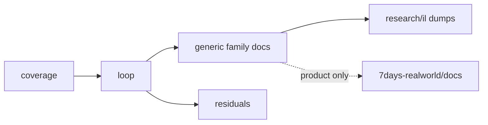

# 7DTD dedicated RE documentation (generic engine)

**Owns:** hub for **generic** dedicated engine RE narratives + dump index.  
**Not:** RealEarth product status/lessons (`7days-realworld/docs/`).  
**Game:** V3.0.1 dedicated `Assembly-CSharp.dll`.  
**Policy:** research only. Do not redistribute game IL or managed DLLs.  
**Coverage bar:** dedicated-relevant **managed** surfaces. Open leftovers: [`residuals.md`](residuals.md).

```text
research/docs/              generic engine narratives (this folder)
research/il/                regenerable Mono.Cecil dumps only
7days-realworld/docs/       RealEarth product docs (runtime, surfaces, review, …)
```

---

## Start here

| # | Doc | Use when |
|---|---|---|
| 1 | [`coverage.md`](coverage.md) | Is engine family X documented? Which dump? |
| 2 | [`engine-limitations.md`](engine-limitations.md) | What stock ceilings bind any dedicated server? |
| 3 | [`loop.md`](loop.md) | How the dedicated frame/sim runs |
| 4 | [`protocol.md`](protocol.md) | Wire framing, join, golden package bodies |
| 5 | [`protocol-frames.md`](protocol-frames.md) | Visual RFC/Mermaid byte frames per package |
| 6 | [`zig-clone.md`](zig-clone.md) | Zig high-perf clone architecture from RE |
| 7 | [`residuals.md`](residuals.md) | What IL cannot close |



---

## Reading paths

| Goal | Path |
|---|---|
| Whole engine map | coverage → loop → family docs → residuals |
| **Stock ceilings (any dedi)** | [engine-limitations.md](engine-limitations.md) → measured-scaling → loop |
| **Zig / custom dedi clone** | [zig-clone.md](zig-clone.md) → [protocol.md](protocol.md) → loop → network → world-chunks → save-region |
| Wire / join / golden packages | protocol → **protocol-frames** → network → loadgen PackageCodec |
| Frame / gmUpdate | loop → loop-gmupdate → inventory-gmupdate-calls |
| Entities / AI / path | entity-ai → closed-gaps → aidirector |
| World / chunks / save | world-chunks → save-region → terrain-height |
| Net | network → closed-gaps |
| Light / mesh / water | light-mesh-water |
| Managers / ModEvents | managers |
| Live APM scale | measured-scaling |
| What's slow + why (ranked) | bottlenecks |
| Process / GC / FPS knobs | runtime-tuning |
| **RealEarth product limits** | [`../../7days-realworld/docs/ENGINE_LIMITATIONS.md`](../../7days-realworld/docs/ENGINE_LIMITATIONS.md) |
| **RealEarth product hub** | [`../../7days-realworld/docs/INDEX.md`](../../7days-realworld/docs/INDEX.md) |
| EfficientServer optim | [`../../7dtd-optimizer/docs/`](../../7dtd-optimizer/docs/) |

### Key engine state machines (generic)

| Lifecycle | Doc |
|---|---|
| gmUpdate phases A-J | [loop.md](loop.md) §2 |
| UpdateTick slice vs full | [loop.md](loop.md) §3 |
| AI LOD + path request | [entity-ai.md](entity-ai.md) |
| Chunk InProgress lifecycle | [world-chunks.md](world-chunks.md) §4 |
| Net package bands | [network.md](network.md) §2 |
| World save/load | [save-region.md](save-region.md) §1 |
| Origin FixedUpdate (dedi no-op) | [loop.md](loop.md) §1 / §12 |

Product Streamed state machines (tiles, inject gate, SoloSlide): see product [`realearth-runtime.md`](../../7days-realworld/docs/realearth-runtime.md).

---

## One home per topic

| Topic | File (this folder) |
|---|---|
| Coverage checklist | coverage.md |
| **Stock engine ceilings** | **engine-limitations.md** |
| **Wire protocol (join + golden bodies)** | **protocol.md** |
| **Wire frames (visual)** | **protocol-frames.md** |
| **Zig clone architecture** | **zig-clone.md** |
| Non-IL residuals | residuals.md |
| Frame / sim loop | loop.md |
| gmUpdate phases | loop-gmupdate.md |
| Entity / AI / path | entity-ai.md |
| Closed IL gaps (timer, path, net bands) | closed-gaps.md |
| World tick / chunks | world-chunks.md |
| Save / WorldState / region | save-region.md |
| Terrain YDim / height APIs | terrain-height.md |
| Networking | network.md |
| Light / stability / mesh / water | light-mesh-water.md |
| Managers + ModEvents | managers.md |
| AIDirector types | aidirector.md |
| APM scaling measurements | measured-scaling.md |
| Runtime / GC / FPS knobs | runtime-tuning.md |

| Topic | File (product `7days-realworld/docs/`) |
|---|---|
| Streamed runtime lessons | [realearth-runtime.md](../../7days-realworld/docs/realearth-runtime.md) |
| Engine surfaces used by RealEarth | [realearth-surfaces.md](../../7days-realworld/docs/realearth-surfaces.md) |
| Adversarial review catalog | [realearth-review.md](../../7days-realworld/docs/realearth-review.md) |
| Product status Done/Partial | [MODIFICATIONS.md](../../7days-realworld/docs/MODIFICATIONS.md) |
| Lon/lat dual coords | [LON_LAT.md](../../7days-realworld/docs/LON_LAT.md) |
| Absolute → inject path | [ABSOLUTE_STREAMING.md](../../7days-realworld/docs/ABSOLUTE_STREAMING.md) |
| Product hub | [INDEX.md](../../7days-realworld/docs/INDEX.md) |

---

## Generic engine narratives

| Doc | Role |
|---|---|
| [engine-limitations.md](engine-limitations.md) | Generic stock ceilings (sim, net, AI, height, GC, ops) |
| [protocol.md](protocol.md) | LiteNet envelope, challenge, join, golden entity packages |
| [protocol-frames.md](protocol-frames.md) | RFC-style + Mermaid byte frames per package |
| [zig-clone.md](zig-clone.md) | High-perf Zig dedi module map + milestones |
| [loop.md](loop.md) | Peers, gmUpdate, UpdateTick, subsystem scale |
| [loop-gmupdate.md](loop-gmupdate.md) | gmUpdate phase narrative |
| [entity-ai.md](entity-ai.md) | TickEntity → AI → path + thresholds |
| [closed-gaps.md](closed-gaps.md) | Timer 20 Hz, AIDirector install, ASP→A*, net bands |
| [world-chunks.md](world-chunks.md) | Gen, load/send, SetBlock, chunk flags |
| [save-region.md](save-region.md) | WorldState, chunk write/read (incl. 64-layer loop), RegionFile* |
| [terrain-height.md](terrain-height.md) | WorldConstants, height APIs, expand pin |
| [network.md](network.md) | ConnectionManager, NetEntity, NetPackage census |
| [light-mesh-water.md](light-mesh-water.md) | Light, stability, mesh, water, deco |
| [managers.md](managers.md) | Manager Update ILs + ModEvents fields |
| [aidirector.md](aidirector.md) | AIDirector type inventory |
| [measured-scaling.md](measured-scaling.md) | Live APM scaling laws |
| [bottlenecks.md](bottlenecks.md) | Consolidated ranked bottleneck catalog (super-linear walls, bad data structures, serial stages) |
| [algorithms.md](algorithms.md) | Every hot-subsystem algorithm + data structure (path scan, net interest, chunk RLE, Boehm GC, spatial queries) |
| [aggressive-optimizations.md](aggressive-optimizations.md) | Unsafe/beyond-Harmony lever catalog: risk classes (desync/race/corruption/fidelity), per-cost targets, honest gain/risk hierarchy |
| [runtime-tuning.md](runtime-tuning.md) | Process-level knobs: Boehm GC symbols/env (incremental, EAC-safe path), GC.Collect gate, ModEvents lifecycle, settargetfps |
| [allocation-reuse.md](allocation-reuse.md) | Buffer reuse / preallocation to cut churn at source (trade RAM for zero-alloc); Boehm free-space knobs; what is already pooled vs what still churns |

---

## Inventories (not primary reading)

| Doc | Prefer instead |
|---|---|
| [inventory-frame-entries.md](inventory-frame-entries.md) | loop.md |
| [inventory-gmupdate-calls.md](inventory-gmupdate-calls.md) | loop-gmupdate.md |
| [inventory-manager-updates.md](inventory-manager-updates.md) | managers.md |
| [inventory-loop-complete.md](inventory-loop-complete.md) | loop.md, save-region.md |
| [inventory-deeper.md](inventory-deeper.md) | entity-ai.md |
| [inventory-gaps.md](inventory-gaps.md) | closed-gaps.md |
| [inventory-opt-scan.md](inventory-opt-scan.md) | optim OPTIMIZATION_CANDIDATES |
| [inventory-netpackages.md](inventory-netpackages.md) | protocol.md, network.md |

---

## Dump sets (`research/il/`)

Generic engine dumps plus surfaces dump consumed by RealEarth product docs.

| Directory | Focus | Used by |
|---|---|---|
| gmUpdate / frame-entries / deep / deeper / gaps / loop-complete / opt-scan / dedi-complete | Generic loop RE | research narratives |
| terrain-*-v3.0.1 | Stock vs expanded height | research + product |
| realearth-surfaces-v3.0.1 | Chunk, Origin, PPL, region | product realearth-surfaces.md |

Policy: [`../il/README.md`](../il/README.md).

---

## Tools

Mono.Cecil dumpers live under `7dtd-optimizer/tools/` (regenerate into `research/il/`):

```text
DumpGmUpdate  DumpFrameEntries  DumpDeep  DumpDeeper  DumpGaps
DumpLoopComplete  DumpAIDirector  DumpOptScan  DumpTerrain
DumpRealEarthSurfaces  DumpDediComplete  DumpSaveLight
```

```bash
# Example (paths on this machine; stop game first if targeting live Managed)
ASM="$HOME/.local/share/Steam/steamapps/common/7 Days to Die Dedicated Server/7DaysToDieServer_Data/Managed/Assembly-CSharp.dll"
cd 7dtd-optimizer/tools
mono DumpDediComplete.exe "$ASM" ../../research/il/dedi-complete-v3.0.1
```

Structural gate: `uv run python 7dtd-optimizer/tools/tests/test_dedi_coverage_docs.py`  
Dump regen helpers: `test_re_dump_regen.py` (same tests dir).  
IL policy: [`../il/README.md`](../il/README.md).

Host topology (not IL): [`../../7dtd-optimizer/docs/HOST_TUNING.md`](../../7dtd-optimizer/docs/HOST_TUNING.md).  
Live scale laws: [measured-scaling.md](measured-scaling.md).

---

## Changelog

- **2026-07-20:** protocol-frames.md visual wire catalog (RFC + Mermaid).
- **2026-07-20:** protocol.md + zig-clone.md (wire RE + Zig high-perf clone architecture).
- **2026-07-19:** Added engine-limitations.md (generic dedi ceilings); reading path + topic table.
- **2026-07-19:** Related docs on family narratives; inventory Prefer headers completed.
- **2026-07-18:** Product RealEarth links as full paths; Tools section with regenerate example + test gate.
- **2026-07-18:** Split ownership: RealEarth docs moved to `7days-realworld/docs/`; research keeps generic engine only.
- **2026-07-18:** State machines, mermaid, kebab-case rename/merge of research narratives.
