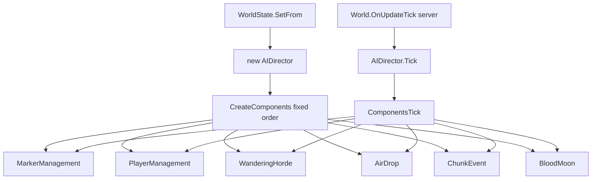

# AIDirector component types (V3.1.0)

**Owns:** AIDirector type inventory + player-state/horde targeting/chunk-event heat pipeline.  
**Tick path:** [`entity-ai.md`](entity-ai.md), [`loop.md`](loop.md) §5.  
**Install order detail:** [`closed-gaps.md`](closed-gaps.md).  
**Hub:** [`INDEX.md`](INDEX.md).

Registered components are ticked via `AIDirector.ComponentsTick` → each `AIDirectorComponent.Tick`.  
Constructed always from `CreateComponents` (fixed order) when `WorldState.SetFrom` builds `new AIDirector()`.

## AIDirector : Object

- `Tick(Double)` IL=6 → `ComponentsTick` IL=21 (plus `DebugTick` IL=7)
- `CreateComponents()` IL=31 (fixed install order, verified)
- `CanSpawn(Single)` IL=10
- `UpdatePlayerInventory(EntityPlayerLocal)` IL=5
- `UpdatePlayerInventory(Int32,AIDirectorPlayerInventory)` IL=6

**Caller:** `World.OnUpdateTick` → `AIDirector.Tick` (Xref=1, server path).

### CreateComponents order (IL=31, verified)

1. `AIDirectorMarkerManagementComponent`
2. `AIDirectorPlayerManagementComponent` (cached on `playerManagementComponent`)
3. `AIDirectorWanderingHordeComponent`
4. `AIDirectorAirDropComponent`
5. `AIDirectorChunkEventComponent` (cached on `chunkEventComponent`)
6. `AIDirectorBloodMoonComponent` (cached on `bloodMoonComponent`)

## AIDirectorAirDropComponent : AIDirectorComponent
- `Tick(Double)` IL=75
- `SpawnAirDrop()` IL=59
- `SpawnSupplyCrate(Vector3,ChunkObserver)` IL=77

## AIDirectorBloodMoonComponent : AIDirectorComponent
- `Tick(Double)` IL=170

**`Tick(dt)` (IL=170):** base component tick, then `isBloodMoon =
IsBloodMoonTime(world.worldTime)`; on a rising edge `StartBloodMoon()`, on a
falling edge `EndBloodMoon()`. When **not** blood moon it watches the GameStats
int **58** (blood-moon day): a change stores `bmDay` / `bmDayLast = bmDay - 1`
and warns `Blood Moon day stat changed {0}`. When blood moon **and** GameStats
bool **24** are active: `delay -= dt`; every tracked player without a
`bloodMoonParty` that `IsSpawned()` joins one via `AddPlayerToParty`; then the
`parties` list is walked round-robin from `nextParty` (wrapping at Count): an
empty party gets `KillPartyZombies()`; the primary party (index == `nextParty`)
ticks `party.Tick(world, dt, canSpawn = delay <= 0)`; when it ticks, `delay =
1 / parties.Count` and `nextParty++` (one party spawns per delay window).

## AIDirectorBloodMoonParty : Object
- `Tick(World,Double,Boolean)` IL=162
- `SpawnZombie(World,EntityPlayer,Vector3,Vector3)` IL=181
- `CalcSpawnPos(World,Vector3,Vector3,Vector3&)` IL=28

**`Tick(world, dt, canSpawn)` (IL=162):** `InitParty()` on first tick
(`partyLevel < 0`); then each `ManagedZombie` counts `updateDelay -= dt` and at
`<= 0` resets it to **1.8** s and re-runs `SeekTarget` (a failed seek removes
the zombie). `partySpawner.Tick(dt)` advances the gamestage spawner. With
`canSpawn && partySpawner.canSpawn && partyMembers.Count > 0 &&
AIDirector.CanSpawn(1.9)`: on a `groupIndex` change it syncs the index, rotates
`spawnBaseDir += 120` (degrees) and recalcs `CalcBestDir(spawnBasePos)`; the
alive cap is `FastMin(partySpawner.maxAlive, enemyActiveMax)`; while
`zombies.Count < cap`, up to `FastMin(memberCount, 3)` round-robin players from
`nextPlayer` get `SpawnZombie(world, player, player.position,
spawnDirectionV)` (only when `IsPlayerATarget`), stopping at the first
successful spawn.

**`SpawnZombie(world, target, focusPos, radiusV)` (IL=181):** `CalcSpawnPos`
fails → false. Class pick:
`EntityGroups.GetRandomEntityFromGroupMaxTier(partySpawner.spawnGroupName,
EntityFactory.MaxEntityTier, ref lastClassId, ...)`; when the pick is an
attached entity, 50% of the time it is overridden to
`animalZombieVultureRadiated`; a `-1` pick logs
`Could not spawn an entity from group {0} within Sandbox Options Max Tier
Limit {1}.` and returns false. Spawns via
`EntityFactory.CreateEntity(id, pos)` (cast `EntityEnemy`) +
`SetSpawnerSource(3)` (Dynamic) + `SpawnEntityInWorld`, then flags
`IsHordeZombie = IsBloodMoon = bIsChunkObserver = true` and cuts
`timeStayAfterDeath /= 3`. **Bonus loot:** `bonusLootSpawnCount++`; when it
reaches `partySpawner.bonusLootEvery` it resets and scales
`lootDropProb *= GameStageDefinition.LootBonusScale`. Registers a
`ManagedZombie`, `SeekTarget`, `partySpawner.IncSpawnCount()`,
`AstarManager.AddLocation(spawnPos, 40)`, and logs
`BloodMoonParty: SpawnZombie grp {0}, cnt {1}, {2}, loot {3}, at player {4},
day/time {5} {6:D2}:{7:D2}`.

**`CalcSpawnPos(world, focusPos, radiusV, out spawnPos)` (IL=28):** rotates
`_radiusV` around `up` by `(RandomFloat - 0.5) * 90` degrees (±45) and runs
`GetMobRandomSpawnPosWithWater(focusPos + rotatedRadius, 0, 10, 30, false,
out)` - the ring 10-30 m around the focus.

## AIDirectorChunkData : Object

Per-chunk heat / event bag used by the chunk-event horde path.

**Fields:** `activityLevel` (single), `events` (`List<AIDirectorChunkEvent>`),
`cooldownDelay`, plus static delay constants (`cDataDelay`, `cDataLongDelay`,
`cDataNeighborDelay`, `cDataNeighborLongDelay`), `cVersion`.

- `Tick(Single)` IL=23 (returns whether still alive in the map)
- Persistence: `Write` emits version **2**, `activityLevel`, event count + each
  `AIDirectorChunkEvent.Write`, then `cooldownDelay`.

## `AIDirectorChunkEvent` : Object

**Fields:** `EventType` (`EnumAIDirectorChunkEvent`), `Position` (`Vector3i`),
`Value`, `Duration`, `cVersion`.

**Wire (`Write` IL=32 / `Read` IL=39):**

| Order | Field | Type |
|---|---|---|
| 1 | version | `Int32` (**2** on write) |
| 2-4 | Position x,y,z | `Int32` each |
| 5 | Value | `Single` |
| 6 | EventType | `Byte` (enum) |
| 7 | Duration | `Single` |

## AIDirectorChunkEventComponent : `AIDirectorHordeComponent`

Scout / activity-driven hordes (see also [spawning.md](spawning.md)).

- `Tick(Double)` IL=79
- `TickActiveSpawns(Single)` IL=66
- `CheckToSpawn()` IL=18 / `CheckToSpawn(AIDirectorChunkData)` IL=46
- `SpawnScouts(Vector3)` IL=76
- nested `Horde` helper type (7 methods in method list)

**`Tick` body (verified):**

1. Base `AIDirectorComponent.Tick`.
2. Every **5 s** accumulated: `CheckToSpawn()`.
3. Walk `Dictionary<Int64, AIDirectorChunkData>`; `AIDirectorChunkData.Tick(dt)`;
   remove entries that expire.
4. `TickActiveSpawns(dt)`.

**`TickActiveSpawns` (IL=66):** reverse-iterate `scoutSpawnList`;
`AIScoutHordeSpawner.Update(world, dt)`; on true: log finished, `Cleanup`,
`RemoveAt`. Then reverse-iterate `hordeSpawnList`; `Horde.Tick(dt as double)`;
on true: log finished, `RemoveAt`. `HasAnySpawns` is only `hordeSpawnList.Count
> 0` (scouts not counted).

**`AIDirector.NotifyActivity` (IL=31):** no-op if `value <= 0`, or GameStats bool
**32** / **24** off, or `HeatMapSensitivityModifier <= 0`, or blood moon active, or
Twitch boss horde active. Else build `AIDirectorChunkEvent(type, pos,
value * HeatMapSensitivityModifier, duration)` and
`chunkEventComponent.NotifyEvent`.

**`CheckToSpawn()` (IL=18):** FIFO pop one entry from `checkChunks` and call
`CheckToSpawn(chunkData)` (one chunk per 5 s pulse).

**`CheckToSpawn(AIDirectorChunkData)` (IL=46):** require GameStats 32+24;
`ActivityLevel >= 25`; `FindBestEventAndReset`; with **20%** random (and not
playtest) set spawn flag, `StartCooldownOnNeighbors`, `SetLongDelay`,
`SpawnScouts`. Otherwise neighbor cooldown only.

**`NotifyEvent` (IL=22):** `GetChunkDataFromPosition(pos, create=true)`; if ready
`AddEvent` and enqueue into `checkChunks` if not already listed.

**`SpawnScouts` (IL=76):** `FindScoutStartPos`; closest player within **120** m;
`CalcGameStageAround` → group name: `Scouts1` (&lt;45), `Scouts2` (&lt;85),
`ScoutsFeral` (&lt;125), else `ScoutsRadiated`; queue `AIScoutHordeSpawner` on
`scoutSpawnList`.

**`AIScoutHordeSpawner.Update` (IL=22):** finished (true) if no players, or
`SpawnUpdate` returns true and `hordeList` empty; else `UpdateHorde` and keep
(false).

**`AIScoutHordeSpawner.SpawnUpdate` (IL=129):** require `CanSpawn(1)` and
`CurrentWave <= 0` else finished; `SpawnManually` (day, enemies on); for each
`EntityEnemy`: `IsHordeZombie`/`IsScoutZombie`/`bIsChunkObserver` true, BM flag
from spawner; `ZombieCommand` with `AttackDelay=**2**`, investigate
`CalcRandomPos(endPos, 6)` for **6000** ticks; clear `spawnedList`; finished
when `CurrentWave > 0`.

**`Horde.Tick` (IL=21):** if `_destroy` finished; else if nested
`AIHordeSpawner.Tick` finishes, `Cleanup` and clear `_horde`; never auto-finish
while spawner null (returns false).

**`UpdateHorde` (IL=229):** per command: dead scouts culled; if not attacking
and lost investigate / dead target, may `spawnHordeNear` then
`AttackDelay = **18**` s; investigate refresh uses **2000** / **6000** tick
lifetimes; when attacking, keep horde spawn pos on living scout.

**`spawnHordeNear` (IL=94):** ensure `IHorde` via
`AIDirectorChunkEventComponent.CreateHorde`; if `canSpawnMore`: base count **5**,
with **12%** chance reduce by 1 and either `SpawnUpdate` one extra wave or bump
`numberToSpawnThisWave`; `Horde.SpawnMore(count)`; play scout alert sound;
`SetSpawnPos(target)`.

**`CreateHorde` (IL=10):** `new Horde(this, startPos)` onto `hordeSpawnList`.

**`StartCooldownOnNeighbors` (IL=55):** map world pos to coarse cell
`toChunkXZ/5`; walk static `neighbors[]` pairs; ensure `activeChunks` entry;
`StartNeighborCooldown(isLong)` on each.

**`FindScoutStartPos` (IL=192):** random on unit circle × **80** with up to **15**
tries; radial band **16..40** from end; reject if any living player within
sqr **900** (30 m); require loaded chunks and `CanMobsSpawnAtPos`.

**`AIDirectorChunkData.Tick` (IL=23):** if `cooldownDelay > 0` subtract elapsed
and keep entry; else `DecayEvents`; keep entry while `EventCount > 0`.

**`AddEvent` (IL=46):** find existing event of same type (predicate); if none
append; else **add** `Value` and replace `Duration` with new event's duration;
always `activityLevel += event.Value`.

**`DecayEvents` (IL=61):** zero `activityLevel`; for each event:
`Value -= Value * (elapsed/Duration)`, `Duration -= elapsed`; remove if
Duration or Value ≤ 0; else re-sum Value into `activityLevel`.

**`FindBestEventAndReset` (IL=44):** pick max-`Value` event; set
`cooldownDelay = **240**` s; `ClearEvents()`; return best (may be null).

**Cooldown setters:**

| Method | IL | Delay |
|---|---:|---|
| `StartNeighborCooldown(false)` | 13 | max(current, **180** s) |
| `StartNeighborCooldown(true)` | 13 | max(current, **720** s) |
| `SetLongDelay` | 4 | **1320** s (hard set) |

## AIDirectorComponent : Object
- `Tick(Double)` IL=1 (virtual base)

## AIDirectorConstants : Object

## `AIDirectorData` : Object

Static noise table for smell / sound attraction.

**Fields:** `Dictionary<String, AIDirectorData/Noise> noisySounds`.

- `InitStatic()` IL=3
- `AddNoisySound(String, Noise)` IL=5
- `FindNoise(String, Noise&)` IL=11 (`TryGetValue`)

## AIDirectorEventsFromXml : MonoBehaviour
- `Update()` IL=1

## AIDirectorGameStagePartySpawner : Object
- `Tick(Double)` IL=52
- `CalcStageSpawnMax()` IL=30
- `IncSpawnCount()` / `DecSpawnCount` IL=7 / 15
- `get_canSpawn()` IL=11

Used by `AIHordeSpawner` and blood-moon party logic for stage-scaled counts.

**`Tick(Double)` (IL=52):** if no `spawnGroup`, return false (finished). Advance
stage when `worldTime >= nextStageTime` (if set) **or** when
`spawnCount >= numToSpawn` and `interval` countdown hits 0; then `groupIndex++`,
`SetupGroup()`. Return true while `spawnGroup != null` (still active).

**`get_canSpawn` (IL=11):** `spawnGroup != null && spawnCount < numToSpawn`.

**`IncSpawnCount` (IL=7):** `spawnCount++`.

**`SetupGroup` (IL=57):** `spawnGroup = stage.GetSpawnGroup(groupIndex)`; if
null, log groups done. Else `interval = spawnGroup.interval`;
`nextStageTime = duration>0 ? worldTime + duration*1000 : 0`;
`numToSpawn = ModifySpawnCountByGameDifficulty(spawnGroup.spawnCount)`;
`spawnCount = 0`.

**`get_maxAlive` (IL=9):** `spawnGroup.maxAlive` or **0** if no group.

**`ResetPartyLevel(mod)` (IL=13):** `level = CalcPartyLevel()`; if `mod != 0`,
`level %= mod`; `SetPartyLevel(level)`.

**`CalcPartyLevel` (instance IL=26):** collect each member `gameStage`; call
static `GameStageDefinition.CalcPartyLevel`.

**`GameStageDefinition.CalcPartyLevel(list)` (IL=35):** sort stages ascending;
from highest to lowest: `sum += stage * weight` then
`weight *= DiminishingReturns` (start `weight = StartingWeight`);
`FloorToInt(sum)`.

**`GameStageDefinition` static defaults (`.cctor` IL=12):**
`DifficultyBonus=1`, `StartingWeight=1`, `DiminishingReturns=0.5`,
`DaysAliveChangeWhenKilled=2` (then empty `gameStages` dict).

**`CalcStageSpawnMax` (IL=30):** sum every `SpawnGroup.spawnCount` in the stage
(walks groups 0..Count-1; clobbers field `spawnGroup` during walk).

**`SetPartyLevel(_partyLevel)` (IL=123):** store `partyLevel`; then
`partyLevel = (int)(partyLevel * gsScaling)`; reset `stageSpawnMax`/`groupIndex`/
`spawnCount`; `stage = def.GetStage(_partyLevel)` (original arg, not scaled);
`stageSpawnMax = CalcStageSpawnMax()`; `SetupGroup()`;
`bonusLootEvery = max(stageSpawnMax / LootBonusMaxCount, LootBonusEvery)`.

**`ModifySpawnCountByGameDifficulty(count)` (IL=6, static):** if
`!EntityFactory.EnemySpawnMode` return **0**; else return `count` unchanged
(name does not scale by difficulty).

**`AIDirector.CanSpawn(_priority)` (IL=10):**
`GameStats.EnemyCount (12) < GamePrefs.MaxSpawnedZombies (99) * _priority`
(true = under cap; same formula as [spawning.md](spawning.md)).

## `AIDirectorHordeComponent` : AIDirectorComponent

Shared placement helpers for scout/wandering/chunk hordes.

| Method | IL | Role |
|---|---:|---|
| `FindTargets` | **459** | pick living `AIDirectorPlayerState` targets; compute start / pitStop / end; ground checks via `FindOnGroundPos` + `Chunk.CanMobsSpawnAtPos` |
| `FindScoutStartPos` | 192 | back-away start from end position |
| `FindOnGroundPos` | 131 | snap candidate to spawnable ground |

`FindTargets` pulls the player list exclusively from
`AIDirectorPlayerManagementComponent` (not a raw world player scan).

## AIDirectorMarkerManagementComponent : AIDirectorComponent
- `Tick(Double)` IL=7

## AIDirectorPlayerInventory : ValueType

**Fields:** `List bag`, `List belt` (item id lists used for director interest).

Mirrored from clients via `AIDirector.UpdatePlayerInventory` /
`AIDirectorPlayerManagementComponent.UpdatePlayerInventory`.

## AIDirectorPlayerManagementComponent : AIDirectorComponent

- `Tick(Double)` IL=7 → `TickPlayerStates` IL=24 → per-state `TickPlayerState` IL=6
- `UpdatePlayerInventory(Int32, AIDirectorPlayerInventory)` IL=11
- `UpdatePlayerInventory(EntityPlayerLocal)` IL=7

Owns the live `DictionaryList` `trackedPlayers` that horde targeting reads.
`TickPlayerState` only mirrors `Player.IsDead()` into `set_Dead` (no inventory
or underground work on this path).

## `AIDirectorPlayerState` : Object

**Fields:** `EntityPlayer Player`, `AIDirectorPlayerInventory m_inventory`,
`Boolean m_dead`, plus underground-check constants
(`kCheckUndergroundTime`, `kNumBlocksUnderground`).

| Method | IL |
|---|---:|
| `Construct(EntityPlayer)` | 8 |
| `Reset` | 4 |
| `Cleanup` | 1 |
| `get/set Inventory` | 3 / 4 |
| `get/set Dead` | 3 / 4 |

`Dead` is consulted repeatedly inside `FindTargets` when building the living
target list.

## AIDirectorPooledMarker : MonoBehaviour
- `Update()` IL=1

## AIDirectorPrivateData : Object

## AIDirectorSmellMarker : Object
- `Tick(Double)` IL=71
- 22 methods in the type surface (pathing/smell bookkeeping); static noise names resolve through `AIDirectorData.FindNoise`

## AIDirectorWanderingHordeComponent : `AIDirectorHordeComponent`
- `Tick(Double)` IL=17
- `TickActiveSpawns(Single)` IL=43
- `TickNextTime(UInt64&, SpawnType)` IL=74
- `StartSpawning(SpawnType)` IL=124
- `get_HasAnySpawns()` IL=6

**`Tick` (IL=17):** playtest → return; base tick; `TickActiveSpawns`;
`TickNextTime(HordeNextTime, type=1)` (horde schedule; bandit is separate).

**`TickActiveSpawns` (IL=43):** reverse-iterate `spawners`;
`AIWanderingHordeSpawner.Update`; on finish log + `Cleanup` + `RemoveAt`.

**`TickNextTime(nextTime, spawnType)` (IL=74):** if GameStats **32** or **24**
off, zero `nextTime` and return. If `nextTime == 0` and `worldTime > 28000`,
`ChooseNextTime`. Else if remaining hours (`(next-now)/1000`) &lt; **7**: if
other hordes active, push `nextTime` by `(7 - hours)*1000`; else if due and
players present `StartSpawning`, else `ChooseNextTime`.

**`ChooseNextTime` (IL=40):** type 0 bandit: `BanditNextTime = now +
Random(12000..24000) + 2000`. Type 1 horde: `HordeNextTime = now +
Random(12000..24000)` (no +2000).

**`StartSpawning` (IL=124 high-level):** log; `CleanupType`; require living
tracked players; on fail delay +4000; `FindTargets` → on fail delay +1000 and
`ChooseNextTime`; else create `AIWanderingHordeSpawner` and add to list
(+12000 residual schedule in IL).

## AIHordeSpawner : Object

Screamer / event horde runner (not an `AIDirectorComponent`, but driven from
director/spawn paths; see [spawning.md](spawning.md)).

**`Tick(Double)` (IL=228):**

1. Finished (true) if no players **or** `!AIDirector.CanSpawn(1)`.
2. First tick only (`!isInited`): bounds = `targetPos ± playerSearchBounds`;
   `GetEntitiesInBounds(EntityPlayer)`; `AddMember` if not `IsIgnoredByAI`.
   If `partyMembers.Count == 0`, return **false** (wait). Else `isInited=true`,
   `ResetPartyLevel(0)`, `ClearMembers()` (level sampled while members present).
3. Every tick: if `spawner.Tick(dt)` is **false**, finished (true). Party Tick
   true means still active.
4. If `!canSpawn` or `numSpawned >= numToSpawn`, return false (idle hold).
5. Else one spawn attempt: day `GetMobRandomSpawnPosWithWater` **45/55/45** else
   **55/70/55**; `GetRandomEntityFromGroupMaxTier(spawnGroupName,
   MaxEntityTier)`; `CreateEntity` + `SetSpawnerSource(Dynamic=3)` +
   `SpawnEntityInWorld`; `IsHordeZombie`/`bIsChunkObserver`; investigate
   `RandomPos(target, 3)` for **2400** ticks; `hordeList.Add`;
   `IncSpawnCount`; `numSpawned++`; return false.

## AIDirectorZombieState : Object

## Network and save surfaces (verified)

### AIDirector save blob

`AIDirector.Save` (IL=7): writes version int **10**, then
`ComponentsSave` walks installed components and calls each `Write`.

`AIDirectorBloodMoonComponent.Write` (IL=20): base component write, then
`bmDayLast:i32`, `bmDay:i32`, `BloodMoonFrequency:i16`, `BloodMoonRange:i16`.
This blob rides `WorldState` nested `aiDirectorState` ([save-region.md](save-region.md)).

### Sleeper / bloodmoon packages

| Package | Wire | Process |
|---|---|---|
| `NetPackageSleeperWakeup` | `targetId:i32` | remote client: `EntityAlive.ConditionalTriggerSleeperWakeUp` |
| `NetPackageSleeperPose` | `targetId:i32`, `pose:u8` | sleeper pose sync |
| `NetPackageSleeperPassiveChange` | EntityTargeted id only (`Setup(targetId)`) | remote: `IsSleeperPassive=false` |
| `NetPackageBloodmoonMusic` | `IsBloodMoonMusicEligible:bool` | sets `World.dmsConductor.IsBloodmoonMusicEligible` |
| `NetPackageHordeEvent` | `m_event`, `m_maxDist` | client `HandleHordeEvent` if in range |
| `NetPackageGameStats` | `len:i16` + `GameStats.Write` blob of **persistent** property decls (int/float/string/base64-string/bool) | client `readStatsCo` coroutine |

## Blood-moon window, party spawner and client-side FX (2026-08-06)

Status: **verified** against a full V3.1.0 b14 disassembly (2026-08-05 dump; line
numbers are from that dump; the tracked `il/` sets are the V3.1.0 corpus).

### Time and the blood-moon window

`GameUtils::WorldTimeToDays` (1925943) is `worldTime / 24000 + 1`, so the wire day
is 1-based and day N spans `[(N-1)*24000, N*24000)`. `GameUtils::DayTimeToWorldTime`
(1926175) is the inverse: `(day - 1) * 0x5dc0 + hours * 0x3e8 + minutes * 1000 / 60`.
`WorldTimeToHours` (1925958) is `(wt / 1000) % 24`; `WorldTimeToMinutes` (1925972)
is `(wt / 1000.0 * 60) % 60`. Any server-side day counter must subtract 1 before
encoding.

`GameUtils::IsBloodMoonTime(duskDawn, hour, bmDay, day)` (1926341) returns true
when `day == bmDay && hour >= duskHour`, **or** when
`day > 1 && day == bmDay + 1 && hour < dawnHour`. The blood moon therefore spans
dusk on `bmDay` to dawn on `bmDay+1`, crossing the midnight day rollover.
`GameUtils::WorldTimeToElements(wt)` (1925958) = `(wt/24000 + 1,
(wt/1000) % 24, (int)(wt * 0.06) % 60)` - the `(day, hour, minute)` tuple used
by the time gates.

`GameUtils::CalcDuskDawnHours` (1926249): a `DayLightLength` of 0 or 24 returns
(dusk 22, dawn 4); otherwise dusk starts at 22, is clamped to `DayLightLength` when
`DayLightLength > 22`, becomes `12 + DayLightLength/2` when `DayLightLength < 18`,
and dawn is `clamp(dusk - DayLightLength, 0, 23)`.

### Schedule

`AIDirectorBloodMoonComponent::CalcNextDay` (412880) picks
`nextBM = bmDayLast + BloodMoonFrequency + GameRandom.RandomRange(0, BloodMoonRange+1)`.
The jitter is strictly **non-negative**, so a stock blood moon is never early
relative to the frequency multiple. `InitNewGame` (412068) seeds
`bmDayLast = ((currentDay - 1) / 7) * 7` with a literal 7, independent of
`BloodMoonFrequency`.

`Tick` (412099) also polls GameStats 58 while the blood moon is inactive and, if
the stat changed underneath it, resets `bmDay` and logs
`Blood Moon day stat changed {0}`: the server-side component itself follows an
externally set BloodMoonDay stat. It gates all party spawning on
`GameStats.GetBool(24)` (EnemySpawnMode).

There is **no `bloodmoon` console command in V3.1.0**. The only caller of
`SetForToday` is the gameevents sequence action
`GameEvent.SequenceActions.ActionSetHordeNight` (2573467), whose `keepBMDay`
property stashes the old `bmDay` into `bmDayNextOverride`.

### Start / end and the party spawner

**`IsBloodMoonTime(worldTime)` (IL=10):**
`GameUtils.IsBloodMoonTime(worldTime, (duskHour, dawnHour), bmDay)`.

**`StartBloodMoon` (IL=70):** log day; `ClearParties()`; clear
`IsBloodMoonDead` on every tracked player; `delay = 0`; for every world
`EntityEnemy` set `IsBloodMoon = true` and `timeStayAfterDeath /= 3`.

**`EndBloodMoon` (IL=73):** log; `isBloodMoon = false`; if `bmDayNextOverride > 0`
apply via `SetDay` and clear override; if current day &gt; `bmDay` stash
`bmDayLast` and `CalcNextDay(false)`; `ClearParties()`; for every `EntityEnemy`
clear `bIsChunkObserver`, `IsHordeZombie`, `IsBloodMoon` (no kill/despawn).

**`get_IsEmpty` (IL=9):** true when `partyMembers.Count == 0`.

**`KillPartyZombies` (IL=48):** `DecSpawnCount(zombies.Count)`; kill each live
non-despawned zombie with `DamageResponse.New(true)`; clear list.

**`ClearParties` (IL=25):** `nextParty = 0`; clear `parties` list; null every
player's `bloodMoonParty`.

**`SetDay(day)` (IL=45):** `GameStateManager.SetBloodMoonDay(day)` if present;
if day changed store `bmDay` and log freq/range.

**`CalcNextDay(isSeek)` (IL=82):** if `BloodMoonFrequency <= 0` set day **0**.
Else step = frequency + `RandomRange(0, range+1)`. Walk `bmDayLast` forward so
`bmDayLast + step` is after current day (clamp last ≥ 0). If `isSeek` and
current `bmDay` still in `[bmDayLast, bmDayLast+freq+range]` keep that day;
else `SetDay(computed)`.

`AIDirectorBloodMoonParty` constants (413090-413140): `cPartyJoinDistance` 80
(sq 6400), `cSightDist` 100, `cTeleportDist` 150 (sq 22500), `cSpawnPreferredArc`
120, `cSpawnAngle` 90, `cSpawnDistance` 40, `cSpawnMinRandDistance` 0,
`cSpawnMaxRandDistance` 10, `cSpawnMinPlayerDistance` 30. Component constants
(412041): `cPartyEnemyMax` 30, `cTimeStayAfterDeathScale` 3, `cSpawnDelay` 1.

**`AIDirector.AddEntity` / `RemoveEntity` (IL=10 each):** only players →
`AddPlayer` / `RemovePlayer`.

**`AIDirector.AddPlayer` (IL=9):**
`playerManagementComponent.AddPlayer` then `BloodMoonComponent.AddPlayer`.

**`PlayerManagement.AddPlayer` (IL=23):** if id not tracked, pool-alloc
`AIDirectorPlayerState.Construct` into `trackedPlayers`.

**`BloodMoonComponent.AddPlayer` (IL=5):** append component `players` list only.
Party attach is **`AddPlayerToParty` (IL=55):** if already member of a party
`AddPlayer`; else `TryAddPlayer` on each party (join if any member within
sqr **6400** = 80 m); else `CreateNewParty`.

**`TryAddPlayer` (IL=34):** walk `partyMembers`; if distSq ≤ **6400** call
`AddPlayer` (spawner `AddMember` + set `player.bloodMoonParty`) and true.

**`CreateNewParty` (IL=8):** `parties.Add(new BloodMoonParty(player, this,
BloodMoonEnemyCount))`.

**`BloodMoonParty..ctor` (IL=41):** zombies list; `spawnWorld`/`spawnBasePos` from
player; `partySpawner = new GameStagePartySpawner(world, "BloodMoonHorde")` +
`AddMember(player)`; set `player.bloodMoonParty`; random `spawnBaseDir` 0..359;
`groupIndex = -1`. Third ctor arg unused.

**`PlayerLoggedOut` (IL=16):** `RemoveMember(player, removeID=false)` (keeps id
in set); clamp `nextPlayer` into member count.

**`AIDirector.Tick` (IL=6):** `ComponentsTick` all components then `DebugTick`.

**`BloodMoonComponent.Tick` (IL=170):** base tick; recompute `isBloodMoon` via
`IsBloodMoonTime`; edge → `StartBloodMoon` / `EndBloodMoon`. If not BM, sync
`bmDay` from GameStats **58**. If BM and GameStats **24** (spawn enemies):
`delay -= dt`; ensure every spawned player has a party (`AddPlayerToParty`);
round-robin parties: empty → `KillPartyZombies` and maybe advance `nextParty`;
else `party.Tick(world, dt, canSpawn=(this==nextParty && delay<=0))`; on spawn
window success set `delay = 1/partyCount` and advance `nextParty`.

**`AIDirector.RemovePlayer` (IL=9):** PlayerManagement then BloodMoonComponent
remove.

**`PlayerManagement.RemovePlayer` (IL=21):** remove tracked state, `Reset`,
pool `Free`.

**`BloodMoonComponent.RemovePlayer` (IL=24):** remove from `players`; every
party `PlayerLoggedOut(player)`.

**`GameStagePartySpawner.AddMember` (IL=22):** ensure id in `memberIDs` and
player in `members` list.

**`RemoveMember(player, removeID)` (IL=14):** remove from `members`; if
`removeID` also drop from `memberIDs`.

`InitParty` (IL=49): `enemyActiveMax = min(30, BloodMoonEnemyCount *
partyMemberCount)`; scale factor `max(1, totalCount/enemyActiveMax)` then
`FastLerp(1, that, partyLevel/60)` into `SetScaling`; `SetPartyLevel(level)`;
`bonusLootSpawnCount = bonusLootEvery / 2`.

**`SetScaling(_scaling)` (IL=11):**
`gsScaling = FastLerp(1, 2.5, (_scaling - 1) / 3)` (clamps growth of stage
level via later `SetPartyLevel` multiply).

**`AIDirectorBloodMoonParty.Tick` (IL=162):** if `partyLevel < 0` `InitParty`.
Reverse walk zombies: `updateDelay -= dt`; when ≤0 reset to **1.8** and
`SeekTarget` (remove on false). Always `partySpawner.Tick(dt)`. If `_canSpawn`
and `canSpawn` and members &gt; 0 and `CanSpawn(1.9)`: on new `groupIndex`
add **120** to `spawnBaseDir` and `CalcBestDir(spawnBasePos)`. Cap alive at
`min(maxAlive, enemyActiveMax)`. Try up to `min(3, memberCount)` players via
rotating `nextPlayer`; first successful `SpawnZombie` stops the try loop.
Return true if a spawn attempt window ran.

**`CalcBestDir(basePos)` (IL=161):** score **16** directions at **22.5°** steps.
For each angle set `spawnDirectionV = forward*40` rotated; try **9**
`GetRandomSpawnPositionMinMaxToPosition(base+dir, 0, 10, 30, ...)` samples;
success count `s`; if `s > 0` score = `(s+2)/3`, and if
`|DeltaAngle(angle, spawnBaseDir)| <= 60` multiply score by **3**. Pick random
among max-score bins; store that bin's `spawnDirectionV`.

**`IsPlayerATarget(player)` (IL=29):** false if dead, not spawned, or
`entityId == -1`; false if `IsIgnoredByAI`; false if `Progression.Level <= 1`
or `IsBloodMoonDead`; else true (BM-valid living party member).

**`FindPartyTarget(fromPos)` (IL=46):** walk `partyMembers` reverse; among
`IsPlayerATarget` pick minimum `sqrMagnitude` to `fromPos`; null if none.

**`SeekTarget(ManagedZombie)` (IL=167):** false if zombie null/dead/despawned/no
GO. Prefer current `GetAttackTarget` player into `mz.player`; if not
`IsPlayerATarget`, `FindPartyTarget(zombie.pos)`. No player: if not
`IsPlayerAliveAndNear(pos, **60**)` → `Kill` false; else true (wander).
With player: horizontal distSq &gt; **22500** (150 m): `CalcSpawnPos` at player
with `spawnDirectionV`; if calc ok and zombie still not near any player **70** m:
50% → `DecSpawnCount(1)`, `lootDropProb=0`, `Kill` false; else teleport
`SetPosition` + `moveHelper.Stop`. Then if full distSq ≤ **10000** (100 m) **or**
attack target player differs from `mz.player`:
`SetAttackTarget(player, **1200**)` ticks; else clear old attack target and
`SetInvestigatePosition(player.pos, **1200**, true)`. Return true.

**`CalcSpawnPos` (IL=28):** rotate `_radiusV` by random yaw in **±45°**
(`(RandomFloat-0.5)*90` about up); focus+rotated radius into
`GetMobRandomSpawnPosWithWater(center, min=0, max=10, height=30, noWater=false)`.

`Tick` gates every spawn on `AIDirector::CanSpawn(1.9f)`: this is the 1.9x
`MaxSpawnedZombies` blood-moon budget the stock serverconfig comment refers to. On
each new spawn group it advances `spawnBaseDir` by +120 degrees and recomputes
`CalcBestDir`, which is why stock waves come from rotating directions.

**`get_BloodmoonZombiesRemain` (IL=6):** true if managed `zombies` list count
&gt; 0.

**`IsMemberOfParty(entityId)` (IL=5):** delegate to
`partySpawner.IsMemberOfParty` (`memberIDs` HashSet.Contains).

`SpawnZombie` (IL=181): `CalcSpawnPos` or fail. Pick class from
`GetRandomEntityFromGroupMaxTier(spawnGroupName, MaxEntityTier, lastClassId,
true, false, null)`. If target `AttachedToEntity` and `RandomFloat < 0.5`:
force class `animalZombieVultureRadiated` and skip bonus-loot counter path.
Missing class → log + false. Then `CreateEntity` → `SetSpawnerSource(3)`,
`SpawnEntityInWorld`, `IsHordeZombie=true`, `IsBloodMoon=true`,
`bIsChunkObserver=true`, `timeStayAfterDeath /= 3`. Non-vulture: increment
`bonusLootSpawnCount`; when `>= partySpawner.bonusLootEvery` reset counter and
`lootDropProb *= LootBonusScale`. Wrap `ManagedZombie`, `SeekTarget`,
`IncSpawnCount`, `AstarManager.AddLocation(pos, 40)`. Log day/time.
`bonusLootEvery = max(stageSpawnMax / LootBonusMaxCount, LootBonusEvery)`.

### Client-side FX: entirely local, driven by three values

`SkyManager::OnGameStatsChanged` (2042093) latches `SkyManager::bloodmoonDay` from
`EnumGameStats 58` (BloodMoonDay) and `duskTime`/`dawnTime` from
`EnumGameStats 42` (DayLightLength). `SkyManager::IsBloodMoonVisible` (2041922)
then tests `GameUtils::IsBloodMoonTime` with a **widened** window of
`(duskTime - 4, dawnTime + 2)`. The whole blood-moon sky FX is client-local: a
server only needs BloodMoonDay, DayLightLength and WorldTime to be correct.

The blood-moon warning is a pure client HUD effect with **no packet**:
`XUiC_CompassWindow` (~1574299) sets the clock text colour to FF0000 when
`GameStats[BloodMoonDay]` equals the client's current day and
`World::BloodMoonWarningHour <= hour`. `World::BloodMoonWarningHour` defaults to 8
in `World::.cctor` (1248240) and is otherwise set by
`SandboxOptionManager::SetupBloodMoonWarningTimes` (2502629) from SandboxOptions 50
to -1 (off), 8, or 18. `EnumGameStats.BloodMoonWarning` (61 / 0x3D) is read by
exactly one consumer, `GameSenseManager::SessionStarted` (1913041), the SteelSeries
LED integration: nothing in the HUD or sky reads it.

`DynamicMusic.Conductor.Update` (2593714/2593767/2593807) is the **only** sender of
`NetPackageBloodmoonMusic` in the whole assembly. Eligibility per player is
`(max gameStage across partyMembers > 1) AND (partySpawner not IsDone OR party
BloodmoonZombiesRemain)`; it is cached in `PlayerEligibleForBloodmoonCache` and
sent only on change, per-entity, with SendPackage flags 0xc0.
`NetPackageBloodmoonMusic::ProcessPackage` (807889) does nothing but assign
`World.dmsConductor.IsBloodmoonMusicEligible`.

The client applies `EntityAlive.IsBloodMoon` by dividing
`DismemberedPart.lifeTime` by 3 in `AvatarController` (59416 and 76551), but
`IsBloodMoon` is set only on the server-side entity and appears in **no** NetPackage
write, so on a dedicated server the client never learns it.

`NetPackageHordeEvent` now occupies 822185-822359 in this dump. There is still no
`GetPackage<NetPackageHordeEvent>()` anywhere, confirming the class is vestigial in
V3.1.0 b14.

### Where the options come from in V3.1.0

The shipped dedicated-server `serverconfig.xml` no longer exposes
`BloodMoonFrequency` / `BloodMoonRange` / `BloodMoonEnemyCount` as properties at
all: the only blood-moon line is `TwitchBloodMoonAllowed`. Those three come from
the `SandboxCode` string (default `AAAJABJACJADJARFBNC`) via
`SandboxOptionManager::UpdateInGameValuesWithSandboxOptions` (2501770), which
copies SandboxOptions 48/49/51 into the `AIDirectorBloodMoonComponent` statics.

`ConsoleCmdSetTime` (251838, help at 251877) accepts four forms: `settime day` =
day 1 12:00, `settime night` = day 2 00:00, `settime <time>` = raw world time where
1000 == one hour, and `settime <day> <hour> <minute>` with day>=1, hour<=23,
minute<=59.

---

## Related docs

| Doc | Role |
|---|---|
| [entity-ai.md](entity-ai.md) | AI throttle |
| [closed-gaps.md](closed-gaps.md) | Default components |
| [spawning.md](spawning.md) | Scout/screamer horde lifecycle |

## Changelog

- **2026-08-07:** BloodMoon component+party bodies: Tick (IL=170) edge
  Start/End + stat 58 day change + round-robin party spawn window 1/Count;
  Party.Tick (IL=162) 1.8 s seek cadence + groupIndex 120 dir rotate +
  maxAlive cap + 3-player round robin; SpawnZombie (IL=181) group pick with
  vulture override + bonus loot every + timeStayAfterDeath/3 + log;
  CalcSpawnPos (IL=28) +-45 ring 10-30 m.
- **2026-08-07:** BloodmoonZombiesRemain list count; IsMemberOfParty partySpawner.
- **2026-08-07:** Wandering TickNextTime 28000/7h; ChooseNextTime 12k-24k;
  ClearParties; CalcNextDay; Start/EndBloodMoon; KillPartyZombies.
- **2026-08-07:** get_maxAlive; BM Tick 1.8s SeekTarget + nextPlayer; SetScaling;
  CalcBestDir 16 bins; InitParty; IsPlayerATarget; SeekTarget 1200
  formula; CalcStageSpawnMax; SetPartyLevel gsScaling; CanSpawn cap.
- **2026-08-07:** CalcSpawnPos ±45° radius + GetMobRandomSpawnPosWithWater 0/10/30;
  SeekTarget 60/150/70 m; Scout SpawnUpdate 6000; UpdateHorde 18s.
  and spawnHordeNear path.
- **2026-08-07:** AddEvent value merge; DecayEvents; FindBestEventAndReset
  cooldown 240 s; Flow/Evap damage packing cross-ref liquid.
- **2026-08-07:** SpawnScouts gamestage bands + 120 m player; NotifyEvent queue;
  ChunkData.Tick cooldown/decay.
- **2026-08-07:** NotifyActivity gates (GameStats 32/24, heat sensitivity, BM/
  Twitch skip); CheckToSpawn ActivityLevel 25 and 20% SpawnScouts.
- **2026-08-06:** Blood-moon window spans dusk on bmDay to dawn on bmDay+1
  (`GameUtils::IsBloodMoonTime`); `WorldTimeToDays` is 1-based; CalcDuskDawnHours
  branches; CalcNextDay jitter is non-negative and InitNewGame seeds on a literal
  7; StartBloodMoon/EndBloodMoon entity flag sweeps; AIDirectorBloodMoonParty
  constants, InitParty formulas, CanSpawn(1.9f) budget and the +120 degree spawn
  arc; SpawnZombie bonus-loot and chunk-observer effects; SkyManager /
  XUiC_CompassWindow client-local FX driven by GameStats 58 + 42 with no packet;
  Conductor as the only BloodmoonMusic sender; SandboxCode as the V3.1.0 source of
  Frequency/Range/EnemyCount; ConsoleCmdSetTime four forms; no `bloodmoon` command.

- **2026-07-28:** AIDirector save v10; bloodmoon/sleeper/GameStats packages.

- **2026-07-28:** CreateComponents order from IL; player state fields; chunk-event tick cadence; chunk-event wire; FindTargets; AIHordeSpawner radii; AIDirectorData noise map.
- **2026-07-19:** Related docs table.
