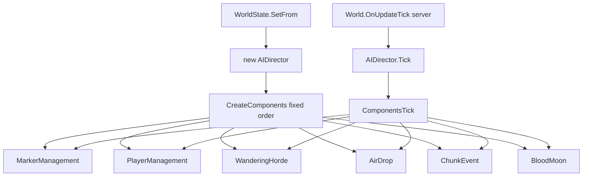

# AIDirector component types (V3.0.1)

**Owns:** AIDirector type inventory + player-state/horde targeting/chunk-event heat pipeline.  
**Tick path:** [`entity-ai.md`](entity-ai.md), [`loop.md`](loop.md) §5.  
**Install order detail:** [`closed-gaps.md`](closed-gaps.md).  
**Hub:** [`INDEX.md`](INDEX.md).

Registered components are ticked via `AIDirector.ComponentsTick` → each `AIDirectorComponent.Tick`.  
Constructed always from `CreateComponents` (fixed order) when `WorldState.SetFrom` builds `new AIDirector()`.

## AIDirector : Object

- `Tick(Double)` IL=6 → `ComponentsTick` IL=21 (plus `DebugTick` IL=7)
- `CreateComponents()` IL=31 (fixed install order, verified)
- `CanSpawn(Single)` IL=10
- `UpdatePlayerInventory(EntityPlayerLocal)` IL=5
- `UpdatePlayerInventory(Int32,AIDirectorPlayerInventory)` IL=6

**Caller:** `World.OnUpdateTick` → `AIDirector.Tick` (Xref=1, server path).

### CreateComponents order (IL=31, verified)

1. `AIDirectorMarkerManagementComponent`
2. `AIDirectorPlayerManagementComponent` (cached on `playerManagementComponent`)
3. `AIDirectorWanderingHordeComponent`
4. `AIDirectorAirDropComponent`
5. `AIDirectorChunkEventComponent` (cached on `chunkEventComponent`)
6. `AIDirectorBloodMoonComponent` (cached on `bloodMoonComponent`)

## AIDirectorAirDropComponent : AIDirectorComponent
- `Tick(Double)` IL=75
- `SpawnAirDrop()` IL=59
- `SpawnSupplyCrate(Vector3,ChunkObserver)` IL=77

## AIDirectorBloodMoonComponent : AIDirectorComponent
- `Tick(Double)` IL=170

## AIDirectorBloodMoonParty : Object
- `Tick(World,Double,Boolean)` IL=162
- `SpawnZombie(World,EntityPlayer,Vector3,Vector3)` IL=165
- `CalcSpawnPos(World,Vector3,Vector3,Vector3&)` IL=28

## AIDirectorChunkData : Object

Per-chunk heat / event bag used by the chunk-event horde path.

**Fields:** `activityLevel` (single), `events` (`List<AIDirectorChunkEvent>`),
`cooldownDelay`, plus static delay constants (`cDataDelay`, `cDataLongDelay`,
`cDataNeighborDelay`, `cDataNeighborLongDelay`), `cVersion`.

- `Tick(Single)` IL=23 (returns whether still alive in the map)
- Persistence: `Write` emits version **2**, `activityLevel`, event count + each
  `AIDirectorChunkEvent.Write`, then `cooldownDelay`.

## `AIDirectorChunkEvent` : Object

**Fields:** `EventType` (`EnumAIDirectorChunkEvent`), `Position` (`Vector3i`),
`Value`, `Duration`, `cVersion`.

**Wire (`Write` IL=32 / `Read` IL=39):**

| Order | Field | Type |
|---|---|---|
| 1 | version | `Int32` (**2** on write) |
| 2-4 | Position x,y,z | `Int32` each |
| 5 | Value | `Single` |
| 6 | EventType | `Byte` (enum) |
| 7 | Duration | `Single` |

## AIDirectorChunkEventComponent : `AIDirectorHordeComponent`

Scout / activity-driven hordes (see also [spawning.md](spawning.md)).

- `Tick(Double)` IL=79
- `TickActiveSpawns(Single)` IL=66
- `CheckToSpawn()` IL=18 / `CheckToSpawn(AIDirectorChunkData)` IL=46
- `SpawnScouts(Vector3)` IL=76
- nested `Horde` helper type (7 methods in method list)

**`Tick` body (verified):**

1. Base `AIDirectorComponent.Tick`.
2. Every **5 s** accumulated: `CheckToSpawn()`.
3. Walk `Dictionary<Int64, AIDirectorChunkData>`; `AIDirectorChunkData.Tick(dt)`;
   remove entries that expire.
4. `TickActiveSpawns(dt)`.

## AIDirectorComponent : Object
- `Tick(Double)` IL=1 (virtual base)

## AIDirectorConstants : Object

## `AIDirectorData` : Object

Static noise table for smell / sound attraction.

**Fields:** `Dictionary<String, AIDirectorData/Noise> noisySounds`.

- `InitStatic()` IL=3
- `AddNoisySound(String, Noise)` IL=5
- `FindNoise(String, Noise&)` IL=11 (`TryGetValue`)

## AIDirectorEventsFromXml : MonoBehaviour
- `Update()` IL=1

## AIDirectorGameStagePartySpawner : Object
- `Tick(Double)` IL=52
- `CalcStageSpawnMax()` IL=30
- `IncSpawnCount()` / `DecSpawnCount` IL=7 / 15
- `get_canSpawn()` IL=11

Used by `AIHordeSpawner` and blood-moon party logic for stage-scaled counts.

## `AIDirectorHordeComponent` : AIDirectorComponent

Shared placement helpers for scout/wandering/chunk hordes.

| Method | IL | Role |
|---|---:|---|
| `FindTargets` | **459** | pick living `AIDirectorPlayerState` targets; compute start / pitStop / end; ground checks via `FindOnGroundPos` + `Chunk.CanMobsSpawnAtPos` |
| `FindScoutStartPos` | 192 | back-away start from end position |
| `FindOnGroundPos` | 131 | snap candidate to spawnable ground |

`FindTargets` pulls the player list exclusively from
`AIDirectorPlayerManagementComponent` (not a raw world player scan).

## AIDirectorMarkerManagementComponent : AIDirectorComponent
- `Tick(Double)` IL=7

## AIDirectorPlayerInventory : ValueType

**Fields:** `List bag`, `List belt` (item id lists used for director interest).

Mirrored from clients via `AIDirector.UpdatePlayerInventory` /
`AIDirectorPlayerManagementComponent.UpdatePlayerInventory`.

## AIDirectorPlayerManagementComponent : AIDirectorComponent

- `Tick(Double)` IL=7 → `TickPlayerStates` IL=24 → per-state `TickPlayerState` IL=6
- `UpdatePlayerInventory(Int32, AIDirectorPlayerInventory)` IL=11
- `UpdatePlayerInventory(EntityPlayerLocal)` IL=7

Owns the live `List<AIDirectorPlayerState>` that horde targeting reads.

## `AIDirectorPlayerState` : Object

**Fields:** `EntityPlayer Player`, `AIDirectorPlayerInventory m_inventory`,
`Boolean m_dead`, plus underground-check constants
(`kCheckUndergroundTime`, `kNumBlocksUnderground`).

| Method | IL |
|---|---:|
| `Construct(EntityPlayer)` | 8 |
| `Reset` | 4 |
| `Cleanup` | 1 |
| `get/set Inventory` | 3 / 4 |
| `get/set Dead` | 3 / 4 |

`Dead` is consulted repeatedly inside `FindTargets` when building the living
target list.

## AIDirectorPooledMarker : MonoBehaviour
- `Update()` IL=1

## AIDirectorPrivateData : Object

## AIDirectorSmellMarker : Object
- `Tick(Double)` IL=71
- 22 methods in the type surface (pathing/smell bookkeeping); static noise names resolve through `AIDirectorData.FindNoise`

## AIDirectorWanderingHordeComponent : `AIDirectorHordeComponent`
- `Tick(Double)` IL=17
- `TickActiveSpawns(Single)` IL=43
- `TickNextTime(UInt64&, SpawnType)` IL=74
- `StartSpawning(SpawnType)` IL=124
- `get_HasAnySpawns()` IL=6

## AIHordeSpawner : Object

Screamer / event horde runner (not an `AIDirectorComponent`, but driven from
director/spawn paths; see [spawning.md](spawning.md)).

- `Tick(Double)` IL=**210**
- Uses `AIDirector.CanSpawn`, builds `AIDirectorGameStagePartySpawner` members
  from world players, `GetMobRandomSpawnPosWithWater` with radii **45..55**,
  `World.SpawnEntityInWorld`, marks `EnumSpawnerSource`, `IncSpawnCount`.

## AIDirectorZombieState : Object

## Network and save surfaces (verified)

### AIDirector save blob

`AIDirector.Save` (IL=7): writes version int **10**, then
`ComponentsSave` walks installed components and calls each `Write`.

`AIDirectorBloodMoonComponent.Write` (IL=20): base component write, then
`bmDayLast:i32`, `bmDay:i32`, `BloodMoonFrequency:i16`, `BloodMoonRange:i16`.
This blob rides `WorldState` nested `aiDirectorState` ([save-region.md](save-region.md)).

### Sleeper / bloodmoon packages

| Package | Wire | Process |
|---|---|---|
| `NetPackageSleeperWakeup` | `targetId:i32` | remote client: `EntityAlive.ConditionalTriggerSleeperWakeUp` |
| `NetPackageSleeperPose` | `targetId:i32`, `pose:u8` | sleeper pose sync |
| `NetPackageSleeperPassiveChange` | EntityTargeted id only (`Setup(targetId)`) | remote: `IsSleeperPassive=false` |
| `NetPackageBloodmoonMusic` | `IsBloodMoonMusicEligible:bool` | sets `World.dmsConductor.IsBloodmoonMusicEligible` |
| `NetPackageHordeEvent` | `m_event`, `m_maxDist` | client `HandleHordeEvent` if in range |
| `NetPackageGameStats` | `len:i16` + `GameStats.Write` blob of **persistent** property decls (int/float/string/base64-string/bool) | client `readStatsCo` coroutine |

## Related docs

| Doc | Role |
|---|---|
| [entity-ai.md](entity-ai.md) | AI throttle |
| [closed-gaps.md](closed-gaps.md) | Default components |
| [spawning.md](spawning.md) | Scout/screamer horde lifecycle |

## Changelog

- **2026-07-28:** AIDirector save v10; bloodmoon/sleeper/GameStats packages.

- **2026-07-28:** CreateComponents order from IL; player state fields; chunk-event tick cadence; chunk-event wire; FindTargets; AIHordeSpawner radii; AIDirectorData noise map.
- **2026-07-19:** Related docs table.
