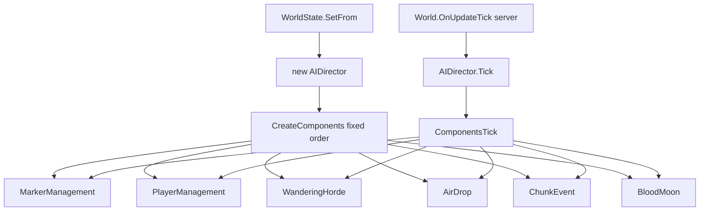

# AIDirector component types (V3.0.1)

**Owns:** AIDirector type inventory.  
**Tick path:** [`entity-ai.md`](entity-ai.md), [`loop.md`](loop.md) §5.  
**Install order detail:** [`closed-gaps.md`](closed-gaps.md).  
**Hub:** [`INDEX.md`](INDEX.md).

Registered components are ticked via `AIDirector.ComponentsTick` → each `AIDirectorComponent.Tick`.  
Constructed always from `CreateComponents` (fixed order) when `WorldState.SetFrom` builds `new AIDirector()`.

## AIDirector : Object
- `Tick(Double)` IL=6
- `CanSpawn(Single)` IL=10
- `UpdatePlayerInventory(EntityPlayerLocal)` IL=5
- `UpdatePlayerInventory(Int32,AIDirectorPlayerInventory)` IL=6

## AIDirectorAirDropComponent : AIDirectorComponent
- `Tick(Double)` IL=75
- `SpawnAirDrop()` IL=59
- `SpawnSupplyCrate(Vector3,ChunkObserver)` IL=77

## AIDirectorBloodMoonComponent : AIDirectorComponent
- `Tick(Double)` IL=170

## AIDirectorBloodMoonParty : Object
- `Tick(World,Double,Boolean)` IL=162
- `SpawnZombie(World,EntityPlayer,Vector3,Vector3)` IL=165
- `CalcSpawnPos(World,Vector3,Vector3,Vector3&)` IL=28

## AIDirectorChunkData : Object
- `Tick(Single)` IL=23

## AIDirectorChunkEvent : Object

## AIDirectorChunkEventComponent : AIDirectorHordeComponent
- `Tick(Double)` IL=79
- `TickActiveSpawns(Single)` IL=66
- `get_HasAnySpawns()` IL=6
- `CheckToSpawn()` IL=18
- `CheckToSpawn(AIDirectorChunkData)` IL=46
- `SpawnScouts(Vector3)` IL=76

## AIDirectorComponent : Object
- `Tick(Double)` IL=1

## AIDirectorConstants : Object

## AIDirectorData : Object

## AIDirectorEventsFromXml : MonoBehaviour
- `Update()` IL=1

## AIDirectorGameStagePartySpawner : Object
- `Tick(Double)` IL=52
- `CalcStageSpawnMax()` IL=30
- `IncSpawnCount()` IL=7
- `DecSpawnCount(Int32)` IL=15
- `get_canSpawn()` IL=11

## AIDirectorHordeComponent : AIDirectorComponent

## AIDirectorMarkerManagementComponent : AIDirectorComponent
- `Tick(Double)` IL=7

## AIDirectorPlayerInventory : ValueType

## AIDirectorPlayerManagementComponent : AIDirectorComponent
- `Tick(Double)` IL=7
- `UpdatePlayerInventory(Int32,AIDirectorPlayerInventory)` IL=11
- `UpdatePlayerInventory(EntityPlayerLocal)` IL=7

## AIDirectorPlayerState : Object

## AIDirectorPooledMarker : MonoBehaviour
- `Update()` IL=1

## AIDirectorPrivateData : Object

## AIDirectorSmellMarker : Object
- `Tick(Double)` IL=71

## AIDirectorWanderingHordeComponent : AIDirectorHordeComponent
- `Tick(Double)` IL=17
- `TickActiveSpawns(Single)` IL=43
- `StartSpawning(SpawnType)` IL=124
- `get_HasAnySpawns()` IL=6

## AIDirectorZombieState : Object

# IsDedicatedServer references in Entity* Update methods

- `EntityFallingBlock::Update` calls `get_IsDedicatedServer`
- `EntityFallingBlocks::Update` calls `get_IsDedicatedServer`
## Related docs

| Doc | Role |
|---|---|
| [entity-ai.md](entity-ai.md) | AI throttle |
| [closed-gaps.md](closed-gaps.md) | Default components |

## Changelog

- **2026-07-19:** Related docs table.
