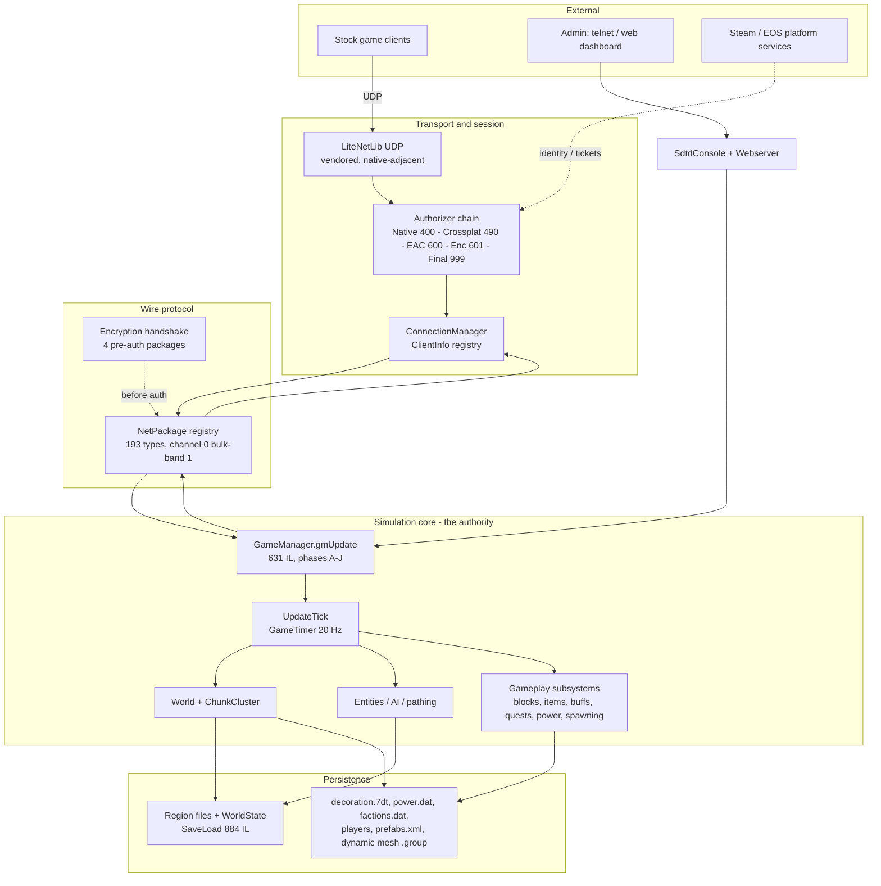
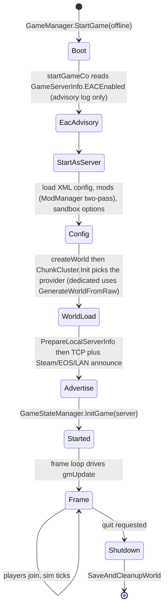
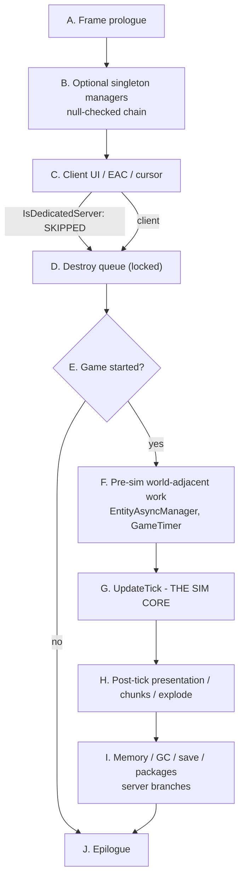
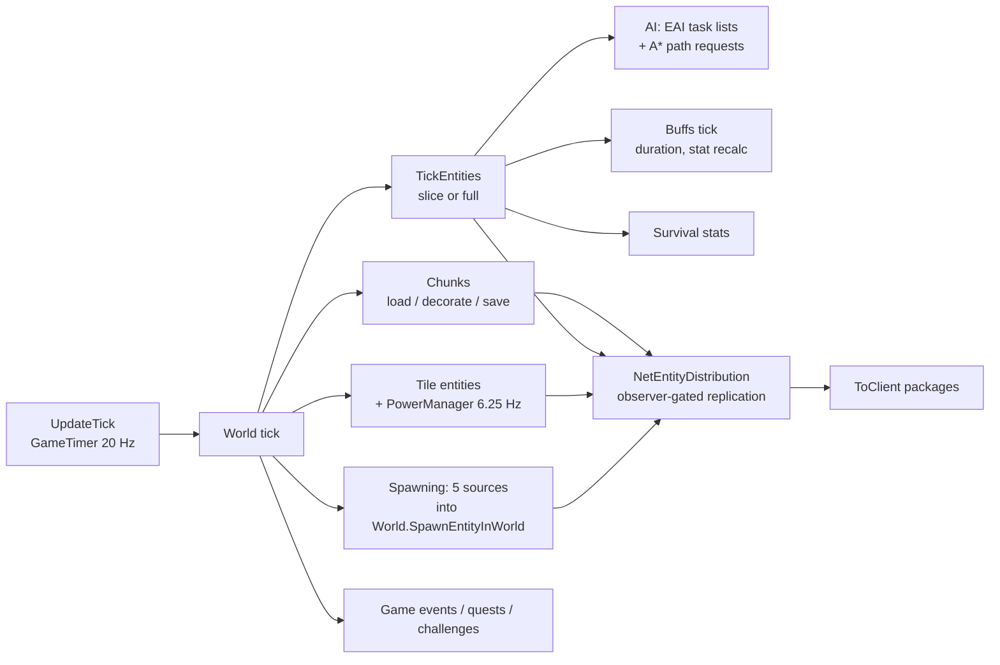
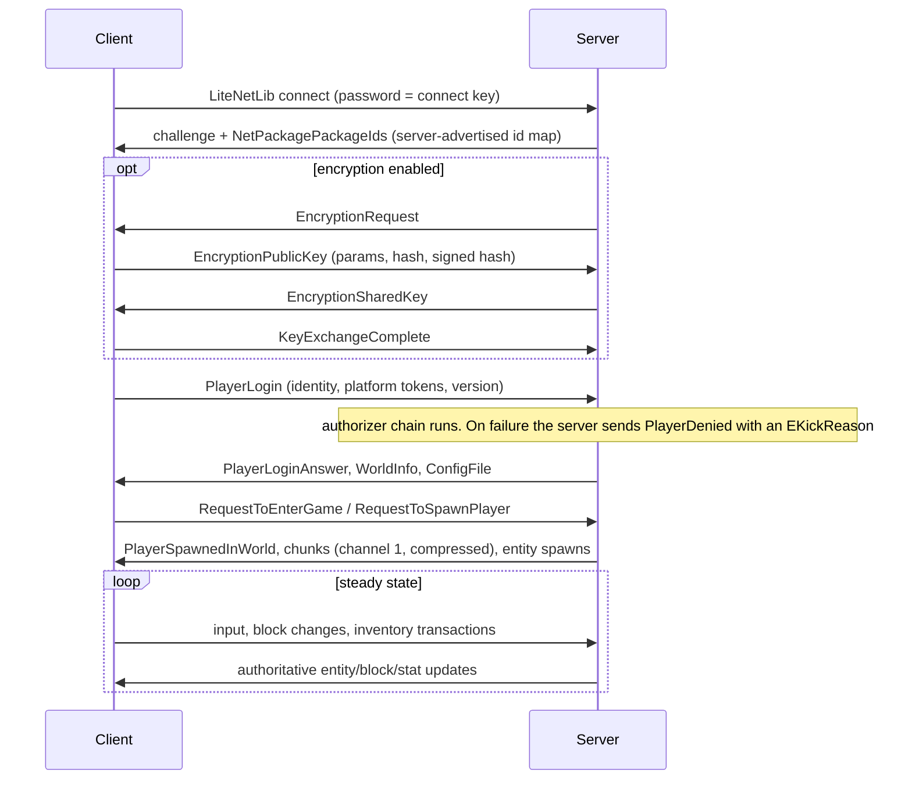
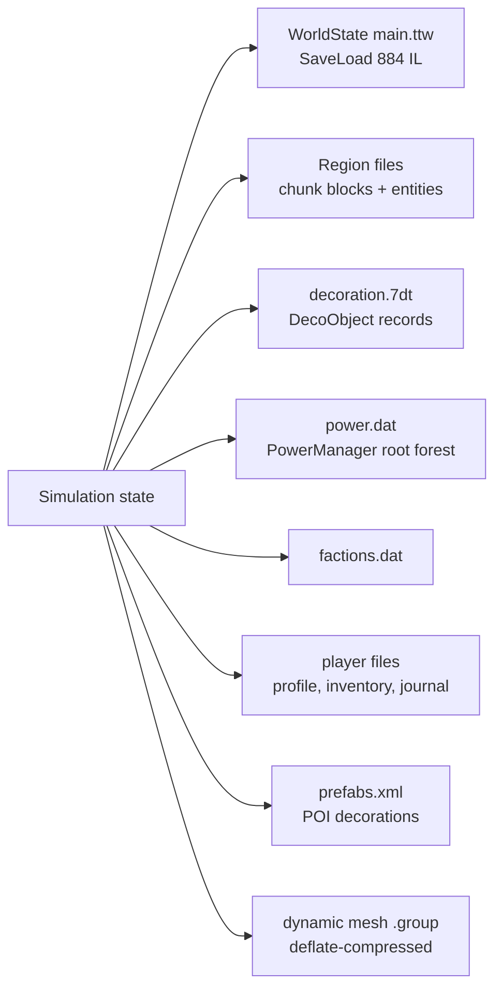
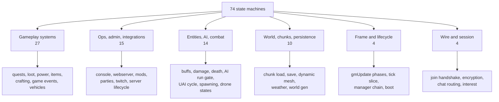

# Architecture map: the dedicated server at a glance (V3.0.1)

**Owns:** the visual, whole-system view of what a headless 7 Days to Die server is
and how its parts connect: process lifecycle, the frame, the simulation core, the
wire, and persistence. This is the map you read **first**, then follow into the
subsystem doc that owns each box.
**Not:** the detail behind any single box (each has its own doc, linked from every
diagram); measured performance ([`../../7dtd-optimizer/docs/`](../../7dtd-optimizer/docs)).
**Evidence:** every box and edge below is drawn from the narratives in this corpus,
which are IL-derived. Where a number appears (IL size, tick rate, channel) it comes
from the owning doc.
**Hub:** [`INDEX.md`](INDEX.md). **Method:** [`re-methodology.md`](re-methodology.md).

---

## 1. The whole server in one picture

Five layers. Everything a dedicated server does is somewhere in here.

**The one-line summary:** clients speak a versioned package protocol over
LiteNetLib; the server authenticates them through a staged authorizer chain, then
runs an authoritative 20 Hz simulation whose results are both replicated back over
the wire and flushed to region files.

---

## 2. Boot: process start to first tick

There is **no managed EAC integrity gate** on this path; the integrity-violation UI
lives in a client-only branch of `gmUpdate`
([`server-lifecycle.md`](server-lifecycle.md)).

---

## 3. The frame: gmUpdate phases A to J

Phase C is the load-bearing detail for a clone: it is where the client half lives,
and a dedicated server jumps straight over it.

Manager tick chain in phase B (each null-checked, so a disabled feature costs
nothing): `TwitchManager`, `DroneManager`, `VehicleManager`, `TriggerEffectManager`,
`QuestEventManager`, `TokenManager`, `PowerManager`, `DismembermentManager`,
`FactionManager`, `NavObjectManager`, `GameEventManager`, `TriggerManager`,
`RaycastPathManager`. `EntityAsyncManager` is **phase F**, not B
([`managers.md`](managers.md)).

---

## 4. Simulation core: what one tick actually does

The **authority rule**: the server owns block state, entity state, damage, loot, and
persistence. Clients predict movement and render. The notable exceptions the corpus
found are documented rather than smoothed over: crafting is **split authority**
(`CanCraft` runs client-side; the server validates the inventory transaction), and
client inventory is client-authoritative in practice.

---

## 5. Wire: how a client and this server converse

Two bands: **channel 0** for everything by default, **channel 1** for the six bulk
packages (`Chunk`, `ChunkRemove`, `MapChunks`, `DynamicMesh`, `POIAround`,
`WorldFolder`). Eight packages self-compress. Exactly ten are legal before auth,
which is the entire pre-auth attack surface
([`protocol-packages.md`](protocol-packages.md)).

---

## 6. Persistence: what lands on disk

Note the trap the corpus documents: the dynamic-mesh `.group` writer people expect
(`DynamicMeshFile.WriteRegion`, version 160) is **dead code**; the live path is
deflate-compressed through `DynamicMeshRegionDataStorage.SaveRegion`.

---

## 7. Subsystem ownership map

Which doc owns which box above. Use this as the navigation index.

```mermaid
flowchart TB
  subgraph M[Meta and method]
    m1[re-methodology] --- m2[coverage] --- m3[full-surface] --- m4[residuals]
  end
  subgraph L[Loop]
    l1[loop] --- l2[loop-gmupdate] --- l3[managers]
  end
  subgraph N[Wire]
    n1[protocol] --- n2[protocol-packages] --- n3[protocol-frames] --- n4[network] --- n5[platform-auth]
  end
  subgraph W[World]
    w1[world-chunks] --- w2[chunk-providers] --- w3[world-generation] --- w4[terrain-height]
    w5[save-region] --- w6[save-persistence] --- w7[light-mesh-water] --- w8[dynamic-mesh]
  end
  subgraph E[Entities]
    e1[entity-ai] --- e2[uai] --- e3[aidirector] --- e4[spawning]
    e5[entity-stats] --- e6[buffs] --- e7[combat-damage] --- e8[stealth-smell] --- e9[raycast-pathing]
  end
  subgraph G[Gameplay]
    g1[blocks] --- g2[block-shapes] --- g3[items] --- g4[crafting-recipes]
    g5[loot-economy] --- g6[quests-challenges] --- g7[progression] --- g8[minevents]
    g9[game-events] --- g10[tile-entities-power] --- g11[vehicles-drones-turrets] --- g12[npc-dialog]
  end
  subgraph O[Ops and edges]
    o1[server-lifecycle] --- o2[console-commands] --- o3[webserver] --- o4[mod-loading]
    o5[sandbox-options] --- o6[server-browser-prefabs] --- o7[chat] --- o8[parties-factions]
    o9[twitch-integration] --- o10[signs] --- o11[map-objects] --- o12[experimental-delta]
  end
```

Full per-doc index with audit status: [`coverage.md`](coverage.md). Leaf catalogs and
generated inventories: [`INDEX.md`](INDEX.md).

---

## 7b. Every modelled lifecycle

The diagrams above are the system's skeleton. The behaviour lives in **74 state
machines** spread across 42 docs, indexed in
[`inventories/state-machines.md`](inventories/state-machines.md) and grouped there by
the same clusters used below.

The index is regenerated by `tools/src/StateMachines`, so a new diagram appears in it
automatically and a removed one disappears. It indexes the docs rather than
re-deriving the machines, so each entry is only as good as its owning doc.

---

## 8. What is deliberately NOT on this map

A headless server never runs these, so they appear nowhere above even though the
assembly contains them: client UI (`XUi*`/NGUI), rendering and meshing for display,
audio and dynamic music, input, the Discord Social SDK, and the prefab/world editor.
The boundary is enumerated in
[`out-of-scope-surface.md`](out-of-scope-surface.md), and the reachability caveats
(why some of that code still shows up in a static call graph) are in
[`inventories/coverage-report.md`](inventories/coverage-report.md).

---

## Related docs

| Doc | Role |
|---|---|
| [INDEX.md](INDEX.md) | Hub: every doc, grouped |
| [coverage.md](coverage.md) | Per-doc audit status and family map |
| [loop.md](loop.md) | The frame in depth |
| [protocol.md](protocol.md) | Wire framing and join in depth |
| [full-surface.md](full-surface.md) | Whole-assembly namespace map |
| [out-of-scope-surface.md](out-of-scope-surface.md) | What the server does not run |

## Changelog

- **2026-07-26:** Initial whole-system visual map (layers, boot, frame phases, sim core, wire conversation, persistence, ownership index), drawn from the existing IL-derived narratives.
