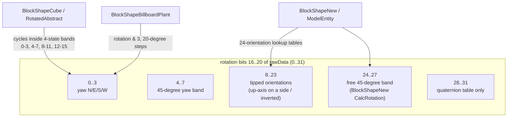
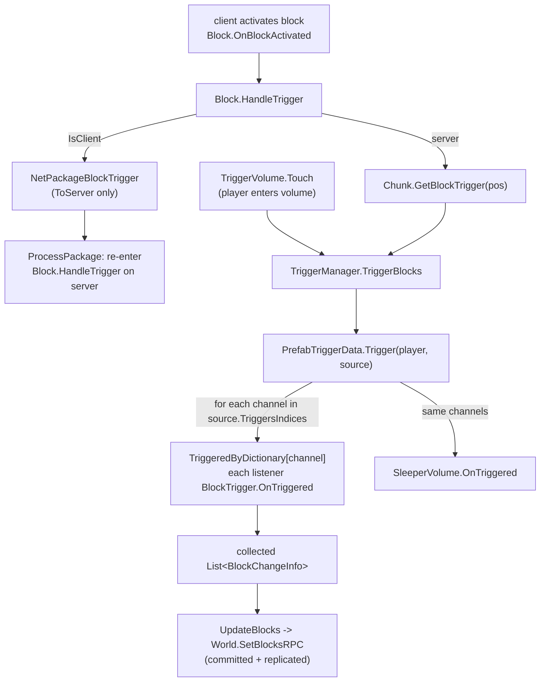
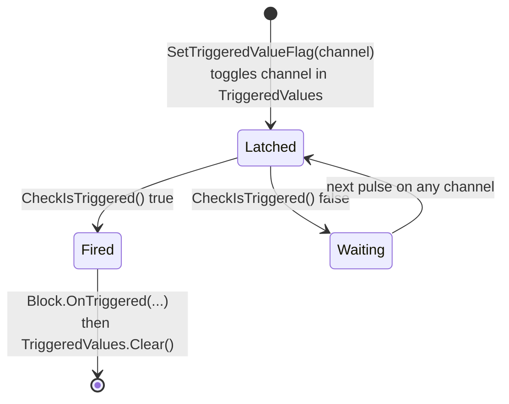

# Block shapes and block triggers (dedicated V3.1.0)

**Owns:** the `BlockShape` delegate family (the per-block geometry object that
answers rotation, bounds, movement blocking, and mesh-emission questions for a
`BlockValue`), the rotation-band model behind the `rawData` rotation bits, the
`BlockFace` / `BlockFaceFlags` face math, the `BlockEntityData` spawned-object
record, and the `BlockTrigger` POI wiring system (per-chunk trigger records,
`TriggerManager` / `PrefabTriggerData` fan-out, `NetPackageBlockTrigger`, and
the trigger-consuming `Block` virtuals).
**Not:** the `BlockValue` word layout, `Block` flyweight registry, and the
damage / upgrade / tick lifecycle (owned by [`blocks.md`](blocks.md)); the chunk
mesh/light/water pipeline that actually consumes `renderFull`/`renderFace`
(owned by [`light-mesh-water.md`](light-mesh-water.md)); sleeper volume ticking
(owned by [`spawning.md`](spawning.md)); wire framing (owned by
[`protocol-packages.md`](protocol-packages.md)); block XML content and client
rendering. The creative-mode `BlockTool*` types (`BlockToolSelection` etc.) are
client editor tools and are explicitly out of scope here.
**Evidence:** `BlockShape` + 17 subclasses, `BlockTrigger`, `TriggerManager`,
`PrefabTriggerData`, `NetPackageBlockTrigger`, `BlockFaceFlags`, `BlockFaces`,
`BlockEntityData`, and the trigger virtuals on `Block` and its subclasses; dump
locally with `tools/src/DumpMethod` (git-ignored).
**Hub:** [`INDEX.md`](INDEX.md). **Method:** [`re-methodology.md`](re-methodology.md).

Two systems share this doc because they meet in the same place: the shape
decides what a voxel *is* geometrically, and the trigger decides what a voxel
*does* when a POI's wiring fires. Both hang off the flyweight `Block` instance
described in [`blocks.md`](blocks.md).

---

## 1. What a BlockShape is

Every `Block` owns exactly one `BlockShape` instance (`BlockShape.block` back
reference, set in `BlockShape::Init`). It is the strategy object for geometry:

- `Block::.ctor` starts every block with a `new BlockShapeCube()`.
- `BlocksFromXml::CreateBlock` then replaces it from XML: the `Shape` property
  value is resolved by reflection as type `"BlockShape" + value`
  (`ReflectionHelpers.GetTypeWithPrefix("BlockShape", ...)` +
  `Activator.CreateInstance`); a block *without* a `Shape` property gets a
  `BlockShapeNew` with the default `Model` `@:Shapes/Cube.fbx`.

So, exactly like the block-class and placement-class lookups, the shape family
is an open reflection namespace: any type named `BlockShape*` is reachable from
`blocks.xml`.

The shape answers four questions for the engine:

| Question | Entry points |
|---|---|
| How do the `rawData` rotation bits (16..20, see [`blocks.md`](blocks.md)) map to an orientation, and what does "rotate" mean? | `GetRotation`, `RotateY`, `Rotate`, `MirrorY`, `GetRotatedBlockFace` |
| What physical extent does the cell have? | `GetBounds`, `GetStepHeight`, `IsMovementBlocked` |
| What mesh does the cell emit? | `renderFull`, `renderFace`, `renderDecorations`, `getFacesDrawnFullBitfield`, `isRenderFace` (consumed by the mesh generators in [`light-mesh-water.md`](light-mesh-water.md); `MeshPurpose` = `World/Drop/Hold/Local/Preview/SimplifiedCollisionOnly`) |
| Anything special on add/remove/load? | `OnBlockAdded/Removed/Loaded/Unloaded/ValueChanged`, `OnBlockEntityTransformBefore/AfterActivated` (forwarded from the `Block` lifecycle hooks) |

Shape-level flags set during `Init` from block properties: `IsSolidCube`,
`IsSolidSpace`, `IsRotatable`, `IsTerrain()`, `IsOmitTerrainSnappingUp`,
`IsNotifyOnLoadUnload`, `LightOpacity`, `SymmetryType`, `Has45DegreeRotations`,
plus the `bounds` / `boundsArr` AABBs.

## 2. The rotation model

The 5 rotation bits allow values 0..31, but shapes interpret them in **bands**,
and each shape family cycles a different subset. All rotation state lives in the
`BlockValue`; the shape only does arithmetic on it.



Observed per-family behavior (all from IL):

- **Base `BlockShape.RotateY`** is the dumb fallback: `rotation = (rotation +
  n) & 15`.
- **`BlockShapeCube.RotateY`** and **`BlockShapeRotatedAbstract.RotateY`**
  never leave the current band: they increment/decrement with wraparound inside
  0..3, 4..7, 8..11 (and 12..15 for `RotatedAbstract`). Placing decides the
  band; rotating in play only spins the yaw within it.
- **`BlockShapeNew`** owns the full 24-orientation model (4 yaw x 6 up-axis
  directions). `RotateY` is a table lookup, `rotations[n-1, rotation]`;
  `Rotate` **wraps** around the 0..23 cycle (`>23 -> 0`, `<0 -> 23`, not a clamp);
  `CalcRotation` treats rotation >= 24 as the free
  45-degree band and cycles 24..27. A static `Quaternion[32]`
  (`rotationsToQuats`) maps every rotation value to its quaternion
  (`GetRotationStatic`), and `convertRotationCached[rotation, face]` backs
  `GetRotatedBlockFace` (world face -> shape-local face).
- **`BlockShapeModelEntity`** reuses `BlockShapeNew.GetRotationStatic` for its
  quaternion, so model blocks share the same 24+4 rotation vocabulary.
- **`BlockShapeBillboardPlant`** masks rotation to 0..3 and renders at
  `AngleAxis(20 * rotation, up)`: four slightly-twisted plant orientations, not
  90-degree steps.
- **`BlockShape.MirrorY`** defaults to two `RotateY` steps (a 180-degree turn);
  only `BlockShapeModelEntity` implements a real mirror mapping.

`GetRotation` matters on the dedicated server even without rendering: it feeds
multiblock child layout, `BlockShapeModelEntity.GetRotatedOffset`, and the
face-flag rotation below.

## 3. Collision and movement (the server-relevant contract)

The dedicated server's AI consumes shapes through `Block.IsMovementBlocked` /
`GetStepHeight` (callers: `AstarVoxelGrid.CheckHeights/RecalculateCell`,
`EntityMoveHelper`, `RandomPositionGenerator`; multiblock children resolve to
their parent first). The shape defaults are:

```text
BlockShape::GetStepHeight    -> block.IsCollideMovement ? 1f : 0f
BlockShape::IsMovementBlocked -> GetStepHeight(bv, face) > 0.5f
```

`Block.get_IsCollideMovement` (IL=7) is the flag read: `(BlockingType & 2) != 0`
(bit 1 of the blocking-type mask selects "blocks movement").

**`Block.IsMovementBlocked` dispatch (V3.1.0 b14):** the single-face overload
(IL=70) resolves multi-block children first (`isMultiBlock && bv.ischild` ->
`GetParentPos` -> read the parent block; a parent that is itself a child logs
`IsMovementBlocked {0} at {1} has child parent, {2} at {3}` and returns true,
else recurses on the parent). A non-colliding block (`!IsCollideMovement`)
returns false. Then a zero `BlocksMovement` byte defers to
`shape.IsMovementBlocked(bv, face)` (`BlockShape` base IL=7:
`GetStepHeight(bv, face) > 0.5`, `BlockShapeGrass`/`Water`/`BillboardCross`
hard-false), while `BlocksMovement == 1` short-circuits true. The
`BlockFaceFlag` sides overload (IL=90) requires **every** flagged face to be
blocked (`sides == 0` means all 255); the `Vector3` entity-position overload
(IL=94) derives the sides from `BlockFaceFlags.FrontSidesFromPosition`; the
`IsMovementBlockedAny` twin (IL=94) flips the AND into an OR (any blocked
face). `FrontSidesFromPosition(blockPos, entityPos)` (IL=70) builds that
`BlockFaceFlag` mask from the entity's position relative to the block cell:
`entity < block` sets the low-side face bit (x=8, y=2, z=16), `entity >=
block+1` the high-side bit (x=32, y=1, z=4) - the faces the entity is
outside of and crossing into. Notable per-block overrides: liquids, mines,
motion sensors, pressure
plates, spotlights, stairs (unless a child) are never blocked; `BlockSpikes`
always; `BlockPoweredDoor` (IL=66) blocks when `!IsDoorOpen(meta)`; and
`BlockCompositeTileEntity` (IL=44) lets `IFeaturePhysicalCapabilities`
modules of the tile entity override the base result when
`OverridesPhysicalChecks` is set.

**Sight twin: `Block.IsSeeThrough` (IL=61) and `IsCollideSight`.**
`IsSeeThrough(world, pos, bv)` is the line-of-sight gate consumed by
`Voxel.raycastNew` (two sites) and `Voxel.GetNextBlockHit` - it decides which
blocks stop sight rays for AI / stealth. It mirrors the movement dispatch:
multiblock children resolve to the parent (a child parent logs
`IsSeeThrough {0} at {1} has child parent, {2} at {3}` and returns true),
then the base answer is `!IsCollideSight && !world.IsWater(pos)` - water
counts as *not* see-through (blocks sight), and `get_IsCollideSight` is the
flag read like its movement twin. Overrides: `BlockPoweredDoor` (IL=63)
resolves the multiblock parent (own error text, `should be a parent but is
not! (1)`) and answers `IsDoorOpen(meta)` - an open door is see-through;
`BlockCompositeTileEntity` (IL=42) ANDs all `IFeaturePhysicalCapabilities`
modules' `IsSeeThrough` when `OverridesPhysicalChecks` is set, else base.
Per-block collider testing inside the same ray walk is
`Block.intersectRayWithBlock` (IL=45, sole caller `Voxel.GetNextBlockHit`):
it fills a static bounds list via `GetCollisionAABB(bv, x, y, z, 0, list)`
and returns true on the first `Bounds.IntersectRay`, reporting the cell
origin as the hit point.

**Dead step-height helpers:** `Block.MaxStepHeight` / `Block.MinStepHeight`
(each a 2-arg IL=46 overload plus a 3-arg IL=9 overload) aggregate
`GetStepHeight` over the faces selected by a `BlockFaceFlag` mask (faces
2..5, bit test against `stepSides & 31`) with max / min aggregation and a
`>= 0` clamp; the 3-arg form derives the mask via
`BlockFaceFlags.FrontSidesFromPosition(blockPos, entityPos)`. Xref finds no
caller of either family outside its own overload delegation on V3.1.0 b14 -
the vehicle/entity step-height query they appear built for is not wired up
in the stock binary.

Overrides refine this: `BlockShapeGrass`, `BlockShapeWater`, and
`BlockShapeBillboardCross` hard-return not-blocked / step 0;
`BlockShapeRotatedAbstract` returns a per-rotation `maxAABB_Y[rotation]`;
`BlockShapeModelEntity` with custom bounds returns its AABB height.
`GetBounds` returns the shape's `Bounds[]`, with `BlockShapeNew` substituting a
per-rotation entry (`boundsRotations[rotation]`) and `BlockShapeRotatedAbstract`
computing rotated boxes per rotation value.

Mesh emission (`renderFull` / `renderFace` into `VoxelMesh[]`) is shared engine
code; the server runs it for chunk colliders (see
[`light-mesh-water.md`](light-mesh-water.md)), which is why every shape also
implements `CalculateCollisionHash` (folds collider geometry into an
`IncrementalHash` via `Block.GetCollisionCollisionHash`, using the
`IncrementalHashExtensions.AppendDataNoAlloc` helper; no in-assembly caller
beyond that, so treat the hash consumer as external/residual).

## 4. Shape subclass catalog

Full hierarchy as present in the dedicated assembly:

| Shape | Base | Role |
|---|---|---|
| `BlockShape` | (abstract root) | contract + flags + default full-cube answers (`getFacesDrawnFullBitfield` = 255) |
| `BlockShapeCube` | BlockShape | legacy plain cube; the pre-XML default from `Block::.ctor`; band-limited yaw (0..11) |
| `BlockShapeTerrain` | Cube | marching-cubes terrain; the only `IsTerrain() == true` shape; density-driven faces |
| `BlockShapeWater` | Cube | water cell; never blocks movement, step height 0, own face rules |
| `BlockShapeNew` | BlockShape | the model-driven shape library (XML `Model`/`ModelOffset`/`SymType`, fbx-sourced `MeshData`); 24+4 rotations, per-rotation bounds, per-face occlusion (`GetFaceInfo`, `EnumFaceOcclusionInfo`), collider-triangle to `BlockFace` mapping; despite the name, the standard shape for nearly all building blocks |
| `BlockShapeRotatedAbstract` | BlockShape | abstract base for hand-built vertex shapes; 16 rotation states, per-rotation AABBs (`createBoundingBoxes`, `rotateVertices`) |
| `BlockShapeBillboardRotatedAbstract` | RotatedAbstract | abstract; billboard with rotation support |
| `BlockShapeBillboardPlant` | BillboardRotatedAbstract | crops: grid/spin quad meshes, 4 x 20-degree rotations, tiny colliders |
| `BlockShapeBillboardAbstract` | BlockShape | abstract; draws no neighbor faces (`getFacesDrawnFullBitfield` = 0), decoration render path |
| `BlockShapeBillboardCross` / `Diagonal` / `Complex` | BillboardAbstract | crossed / diagonal / multi-quad decorative billboards; `Cross` never blocks movement |
| `BlockShapeGrass`, `BlockShapeGrassShort` | BillboardAbstract / Grass | grass tufts; never block movement, step height 0 |
| `BlockShapeInvisible` | BlockShape | no geometry at all; base for model entities |
| `BlockShapeModelEntity` | Invisible | whole-cell Unity prefab: `OnBlockAdded/OnBlockLoaded` create a `BlockEntityData` and hand it to `Chunk.AddEntityBlockStub`, plus `registerSleepers` -> `Prefab.TransientSleeperBlockIncrement`; damage-state model swapping (`GetDamageStateIndex`, `UpdateDamageState`, `UseRepairDamageState`); removal unhooks the stub and `SleeperVolumeToolManager.UnRegisterSleeperBlock` |
| `BlockShapeDistantDeco`, `BlockShapeDistantDecoTree` | ModelEntity | additionally register with `DecoManager` so the block exists as a distant decoration |

## 5. BlockFace and BlockFaceFlags

`BlockFace` enumerates `Top=0, Bottom=1, North=2, West=3, South=4, East=5,
Middle=6, None=255`. `BlockFaceFlag` is the bitmask twin: `Top=1, Bottom=2,
North=4, West=8, South=16, East=32`, with composites `All`/`Solid=63` and
`Axials=60`.

**Hit-face resolution (`GameUtils.GetBlockFaceFromHitInfo`, IL=385):** the
raycast-hit-to-face mapping: with a readable `MeshCollider` it fetches the
mesh vertices/triangles, computes the face center and the un-normalized
cross-product normal from the hit triangle, then shifts the three vertices
into block-local space (wrapping each axis by +/-16 across chunk borders,
accounting for multiblock parents), and for a `BlockShapeNew` block
rotates the vertices back by the inverse of `shape.GetRotation` before
`GetBlockFaceFromColliderTriangle` picks the face (255 = none). This is
the face the placement/`GetRotatedBlockFace` flows consume.

`BlockFaceFlags` is a static helper: face-to-offset vectors, opposite faces,
nearest-face-for-direction, yaw-for-face, and string (de)serialization via a
face character table. The server-relevant core is `RotateFlags(mask, rotation)`:
each of the six face bits is shifted through a `faceRotShiftValues[rotation * 6
+ face]` lookup so a per-face mask follows the block's rotation. `None`, `All`,
and rotations above 23 pass through unchanged (the free 45-degree band does not
remap faces). Its callers pin down what the masks are for: the **water flow
mask** (`BlockValue.rotatedWaterFlowMask`, `Chunk.SetBlockRaw`,
`WaterDataHandle.InitializeFromChunk`, `MeshGenerator.FacePermitsFlow`) and the
parsed cover/water masks from `StringParsers.ParseWaterFlowMask` /
`ParseCoverFaceMask`. `BlockFaces.RotateFace` does the same job geometrically:
face -> unit normal -> rotate by `BlockShapeNew.GetRotationStatic(rotation)` ->
rebucket to the nearest face.

## 6. BlockEntityData

`BlockEntityData` is the plain record that represents "this voxel has a spawned
GameObject": fields `blockValue`, `pos`, `transform`, `bHasTransform`,
`renderers` (+ lazy `GetRenderers`), a shared `MaterialPropertyBlock`, and a
temperature flag. It is created by `BlockShapeModelEntity` (and by door/model
block code paths), stored per chunk via `Chunk.AddEntityBlockStub`, and passed
back through `BlockShape.OnBlockEntityTransformBefore/AfterActivated` when the
engine activates the transform (the *after* hook is also where ground-align
registration happens via `ChunkManager.AddGroundAlignBlock`). On a dedicated
server the renderer/material half stays inert; the record is still the handle
that ties a cell to its stub and lets shape code find/destroy it.

## 7. The BlockTrigger system

### 7.1 Data model

A `BlockTrigger` is **wiring metadata for one voxel inside a POI**, stored per
chunk in a `DictionaryList<Vector3i, BlockTrigger>` (`Chunk.GetBlockTriggers`,
`GetBlockTrigger(localPos)`, `Add/RemoveBlockTrigger`), not inside the
`BlockValue` word. Fields:

| Field | Meaning |
|---|---|
| `LocalChunkPos`, `chunkKey`, `chunk` | position; `ToWorldPos()` = chunk origin (x*16, y*256, z*16) + local |
| `TriggersIndices : List<byte>` | channels this block **fires** when activated |
| `TriggeredByIndices : List<byte>` | channels this block **listens** on |
| `TriggeredValues : List<byte>` | channels currently toggled on (latched inputs) |
| `UseOrForMultipleTriggers` | OR vs AND combination of listened channels |

**Registry accessors (V3.1.0 b14):** `Chunk.AddBlockTrigger(td)` (IL=10)
stores into `triggerData` keyed by `LocalChunkPos` and marks `isModified`;
`GetBlockTriggers()` (IL=3) returns the `DictionaryList`; `GetBlockTrigger(pos)`
(IL=9) is the `triggerData.dict` `TryGetValue` (null when absent).
`BlockTrigger.HasAnyTriggers()` (IL=6) is `TriggersIndices.Count > 0` - the
gate in `TriggerManager.TriggerBlocks`.
| `NeedsTriggered : TriggeredStates` | `NotTriggered=0 / NeedsTriggered=1 / HasTriggered=2` deferred-fire latch |
| `ExcludeIcon`, `Unlock`, `TriggerDataOwner` | editor icon suppression, unlock flag, owning `PrefabTriggerData` |

Channel indices are bytes; the prefab editor presents them as trigger layers.

Persistence: triggers are authored into prefabs (`Prefab.readTriggerData` /
`writeTriggerData`), copied into world chunks when a POI is stamped
(`Prefab.CopyIntoRPC`, `CopyIntoLocal`, `CopyBlocksIntoChunkNoEntities`), and
saved with the chunk (`Chunk.read` / `Chunk.write` call `BlockTrigger.Read` /
`Write`; the record is versioned, current writer emits version 5). During
`Prefab.CopyIntoLocal` each trigger also gets
`Block.OnTriggerAddedFromPrefab`, which lets the block normalize its word (for
example `BlockActivateSwitch` sets meta bit 0 to "on" only when the trigger has
no `TriggeredBy` wiring, then `World.SetBlock`s the result).

### 7.2 Runtime registration

`World.triggerManager` (a `TriggerManager`) keys everything by POI:
`PrefabDataDict : Dictionary<PrefabInstance, PrefabTriggerData>`. When a player
ticks inside a POI (`EntityPlayer.PrefabTick` -> `AddPrefabData`), the
`PrefabTriggerData` scans the POI's occupied chunks and indexes every
`BlockTrigger` into `TriggeredByDictionary : channel -> List<BlockTrigger>`
(listeners), plus `TriggeredByVolumes : channel -> List<SleeperVolume>` for
sleeper volumes that listen on channels, and refreshes all triggers
(`BlockTrigger.Refresh` -> `Block.OnTriggerRefresh`).

### 7.3 Firing



**`TriggerManager.TriggerBlocks` dispatch (V3.1.0 b14):** the block-trigger
overload (IL=17) early-outs on `!trigger.HasAnyTriggers()`, then routes
`PrefabDataDict[instance].Trigger(player, trigger)`. The `TriggerVolume`
overload (IL=27) gates the same way, warns
`Cannot do {0} for TriggerVolume at {1}. No prefab instance assigned` for a
null instance, and otherwise routes
`PrefabDataDict[instance].Trigger(player, volume)`.

**`Block.HandleTrigger(player, world, pos, bv)` (IL=41)** is the server-side
entry: a client forwards `NetPackageBlockTrigger.Setup(pos, bv)`; the server
resolves `chunk.GetBlockTrigger(world.toBlock(pos))` and, when a trigger
exists and the player is valid, calls
`world.triggerManager.TriggerBlocks(player, player.prefab, trigger)`.

**`PrefabTriggerData.Trigger` fan-out (V3.1.0 b14):** all three overloads -
`(player, Byte index)` (IL=63), `(player, BlockTrigger source)` (IL=85), and
`(player, TriggerVolume volume)` (IL=90) - share one shape: for each fired
channel (the byte, the source's `TriggersIndices`, or the volume's), every
listener in `TriggeredByDictionary[channel]` gets
`BlockTrigger.OnTriggered(player, world, channel, changes, source)` (source
null for the byte/volume overloads), and every
`TriggeredByVolumes[channel]` sleeper gets
`SleeperVolume.OnTriggered(player, world, channel)` (only when the player is
valid); when the collected `BlockChangeInfo` list is non-empty,
`UpdateBlocks(changes)` commits + replicates. Support plumbing:
`set_NeedsTriggerUpdate(true)` (IL=26) registers the POI on the manager's
update list with a **3**-second timer (`HandleNeedTriggers` IL=33 then fires
triggers whose `NeedsTriggered == 1`, marking them 2);
`RefreshTriggers` / `RefreshTriggersForQuest(tags)` / `ResetTriggers`
(all IL=22) walk the `Triggers` list calling `BlockTrigger.Refresh` (with
`FastTags.none` or the quest tags) or zeroing `NeedsTriggered`;

**Manager list plumbing (`TriggerManager`):** `AddToUpdateList(data)`
(IL=10) dedupe-adds a `PrefabTriggerData` to the `UpdateList`;
`RemoveFromUpdateList` (IL=11 by data, IL=26 by `PrefabInstance`) removes
it (the instance overload sweeps backwards matching `PrefabInstance`);
`GetTriggerLayers` (IL=71) unions every data's `TriggeredLayers` +
`TriggeredByLayers` across `PrefabDataDict` (the editor layer list);
`HandleNavObjects(enabled)` (IL=25) calls
`SetupTriggerTestNavObjects` / `RemoveTriggerTestNavObjects` on every
data; `RemovePrefabData(instance)` (IL=16) removes the trigger-test nav
objects and the dict entry - the POI-teardown path.
`AddTriggeredBy(volume)` (IL=34) indexes a sleeper volume under each of its
`TriggeredByIndices` channels.

**`BlockTrigger.OnTriggered(player, world, index, changes, triggeredBy)`
(IL=27)** is the listener callback: it latches the fired channel
(`SetTriggeredValueFlag((byte)index)`), then `CheckIsTriggered()` combines the
latched channels (OR or AND per `UseOrForMultipleTriggers`); only when the
combination fires does it run
`chunk.GetBlock(LocalChunkPos).Block.OnTriggered(player, world, ToWorldPos(),
bv, changes, triggeredBy)` and then clear `TriggeredValues`.
`BlockTriggerDowngrade.OnTriggered` (IL=15) adds `HandleDowngrade` (the block
downgrades itself).

**`BlockTrigger.CheckIsTriggered()` (IL=59)** implements the channel
combination: in OR mode (`UseOrForMultipleTriggers`) it is true when **any**
`TriggeredByIndices` channel sits in `TriggeredValues`; in AND mode it is true
only when **all** of them do.

**Per-block `OnTriggered` behaviors (V3.1.0 b14, all call the empty base
IL=1 first):** `BlockActivateSwitch` (IL=24) toggles `meta` (`(meta & ~2) |
1`); `BlockGameEvent` (IL=60) requires the game event's target type to be
**Block** (else error log), runs
`GameEventManager.HandleAction(onTriggeredEvent, player, ...)` and, with
`destroyOnEvent`, `DamageBlock(MaxDamage - damage, ...)`; `BlockHazard`
(IL=49) toggles the hazard state with Start/StopSound at the block center;
`BlockLight` (IL=26) toggles the light (`SetLightState(world, pos, bv,
!IsLightOn)`); `BlockTrapDoor` (IL=26) destroys itself
(`DamageBlock(MaxDamage - damage)`); `BlockTriggerDowngrade` (IL=15) adds
`HandleDowngrade`; `BlockCompositeTileEntity` (IL=53) delegates into the
composite tile-entity modules. Every mutating variant appends a
`BlockChangeInfo` for the block position.

**Shared state bit:** `BlockHazard.IsHazardOn(world, pos, bv)` (IL=29, with
multiblock child-to-parent recursion) and `BlockLight.IsLightOn` both test
`(meta & 2) != 0`, and `BlockHazard.SetHazardState` (IL=15) / 
`BlockLight.SetLightState` both write `(meta & ~3) | (isOn ? 2 : 0)` - the
trigger, light, and hazard states all live in meta bit 1.

`BlockTrigger.OnTriggered(player, world, channel, changes, source)` is the
receiver-side state machine:



- `SetTriggeredValueFlag` **toggles**: a second pulse on the same channel
  un-latches it (a switch flipped back off).
- `CheckIsTriggered` in AND mode (default) requires every `TriggeredByIndices`
  channel to be present in `TriggeredValues`. In OR mode
  (`UseOrForMultipleTriggers`) the IL returns triggered as soon as at least one
  listened channel is *absent*, which for two-plus wired switches means any
  single pulse fires (the other channels are still off); read literally it also
  means a single-channel OR trigger fires on the *release* toggle. Documented
  as observed; the semantics are only sane for the multi-switch case the flag
  name implies.
- On fire, the block at the trigger's cell gets `Block.OnTriggered` and the
  latch clears, so wiring is re-armable.

Block-side consumers opt in with `AllowBlockTriggers` (base returns false):
`BlockActivate`, `BlockActivateSingle`, `BlockActivateSwitch`,
`BlockQuestActivate`, `BlockGameEvent`, `BlockHazard`, `BlockLight`,
`BlockTrapDoor`, `BlockTriggerDowngrade`, `BlockCompositeTileEntity`.
Representative `OnTriggered` overrides:

| Block | Reaction to a fired trigger |
|---|---|
| `BlockActivateSwitch` | sets meta bit 0 ("on") and appends a `BlockChangeInfo` |
| `BlockGameEvent` | fires its `onTriggeredEvent` through `GameEventManager` (target type must be `Block`, see [`game-events.md`](game-events.md)) |
| `BlockTriggerDowngrade` | `HandleDowngrade`: swap to the `DowngradeBlock` via the placeholder map, preserve rotation, copy paint faces with `SetBlockTextureServer`, `SpawnDowngradeFX`, emit `BlockChangeInfo` (density-aware for terrain) |
| `BlockHazard` / `BlockLight` / `BlockTrapDoor` | arm/toggle their meta state the same `BlockChangeInfo` way |

All changes are batched and committed once per firing via
`World.SetBlocksRPC`, so a single lever flip that opens three doors is one
replicated block-change list.

### 7.4 Deferred and reset paths

- **Deferred fire:** triggers saved with `NeedsTriggered=1` (used by the quest
  reset flow) are fired by the manager, not a player. `RefreshTriggers` puts
  the `PrefabTriggerData` on the manager's update list with a 3-second timer
  (`needsTriggerTimer`); `TriggerManager.Update` (ticked from
  `GameManager.gmUpdate`, see [`loop-gmupdate.md`](loop-gmupdate.md)) counts it
  down and `HandleNeedTriggers` calls `Trigger(null, blockTrigger)` for each,
  marking them `HasTriggered`. `Block.OnTriggered` implementations therefore
  tolerate a null player.
- **POI reset:** `World.ResetPOIS` and
  `QuestGeneratorController.SetGeneratorState` ->
  `PrefabInstance.RefreshTriggersInContainingPoi` ->
  `TriggerManager.RefreshTriggers`: reset all `NeedsTriggered` states, re-run
  `Block.OnTriggerRefresh` per trigger (e.g. `BlockActivateSwitch` re-derives
  its on/off meta from generator/switch power via the `CheckPowerState`
  coroutine; `BlockQuestActivate` schedules `resetTriggerLater`), then process
  deferred fires.
- **Scripted:** `MinScript.Tick` can pulse a raw channel via
  `TriggerManager.Trigger(player, prefab, byte)` (the MinEvent side, see
  [`minevents.md`](minevents.md)); the GameEvent actions named
  `ActionBlockTriggerFall` / `ActionBlockTriggerMines` are unrelated to this
  system despite the name (they belong to [`game-events.md`](game-events.md)).

## 8. Out of scope (client / editor)

Reached in the assembly but not part of dedicated gameplay, listed for
completeness: the `BlockTool*` creative/editor tools (`BlockToolSelection` and
friends), `XUiC_TriggerProperties` (the in-game prefab editor UI that edits
`TriggersIndices` / `TriggeredByIndices` and calls `BlockTrigger.TriggerUpdated`
-> `Block.OnTriggerChanged`, both no-ops on the base class),
`PrefabEditModeManager.HighlightBlockTriggers`, `ConsoleCmdPlaceBlockShapes`
(dev shape-gallery command), `CoverClippingTool.BlockShapeInfo`, and the
`NGuiWdwDebugPanels` face-debug readout.

## Related docs

| Doc | Role |
|---|---|
| [`blocks.md`](blocks.md) | `BlockValue` word (rotation bits), `Block` flyweight and lifecycle hooks that forward to the shape |
| [`light-mesh-water.md`](light-mesh-water.md) | The mesh/water pipeline that consumes `renderFull`/`renderFace` and the flow masks |
| [`world-chunks.md`](world-chunks.md) | Chunk storage the trigger dictionary and entity block stubs live in |
| [`save-region.md`](save-region.md) | Chunk read/write that persists `BlockTrigger` records |
| [`spawning.md`](spawning.md) | Sleeper volumes that listen on trigger channels |
| [`quests-challenges.md`](quests-challenges.md) | Quest reset flow that drives `RefreshTriggers` / `NeedsTriggered` |
| [`game-events.md`](game-events.md) | `BlockGameEvent.OnTriggered` target; the unrelated `ActionBlockTrigger*` actions |
| [`loop-gmupdate.md`](loop-gmupdate.md) | Ticks `TriggerManager.Update` |
| [`protocol-packages.md`](protocol-packages.md) | `NetPackageBlockTrigger` framing (ToServer only) |
| [`re-methodology.md`](re-methodology.md) | How this was reversed |

## Changelog

- **2026-08-08:** Named IncrementalHashExtensions.AppendDataNoAlloc in the collision-hash path.
- **2026-08-08:** Sight contract: Block.IsSeeThrough (IL=61) multiblock parent
  resolution + !IsCollideSight && !IsWater; BlockPoweredDoor (IL=63)
  IsDoorOpen(meta); BlockCompositeTileEntity (IL=42) module AND; consumed by
  Voxel.raycastNew / GetNextBlockHit; Block.intersectRayWithBlock (IL=45)
  GetCollisionAABB + Bounds.IntersectRay. Dead step-height helpers: MaxStepHeight
  / MinStepHeight (IL=46 + IL=9) aggregate GetStepHeight over
  FrontSidesFromPosition faces, no external callers on b14 (Xref).
- **2026-08-07:** BlockHazard state: IsHazardOn (IL=29) multiblock recursion +
  meta & 2; SetHazardState (IL=15) same bit-1 pattern - trigger/light/hazard
  share meta bit 1.
- **2026-08-07:** Per-block OnTriggered family: switch meta toggle (IL=24),
  game event + destroyOnEvent (IL=60), hazard toggle + sounds (IL=49), light
  toggle (IL=26), trapdoor destroy (IL=26), downgrade (IL=15), composite TE.
- **2026-08-07:** BlockTrigger.CheckIsTriggered (IL=59): OR = any channel
  latched, AND = all channels latched.
- **2026-08-07:** BlockTrigger.OnTriggered (IL=27): channel latch +
  CheckIsTriggered combination gate + block callback + latch reset;
  BlockTriggerDowngrade adds HandleDowngrade.
- **2026-08-07:** PrefabTriggerData.Trigger fan-out (IL=63/85/90): channel
  listeners + sleeper volumes, UpdateBlocks on changes; needs-trigger update
  list (3 s timer), Refresh/RefreshForQuest/Reset (IL=22), AddTriggeredBy
  (IL=34) volume indexing.
- **2026-08-07:** BlockTrigger.HasAnyTriggers (IL=6) = TriggersIndices.Count > 0
  - the TriggerBlocks gate.
- **2026-08-07:** Block.HandleTrigger (IL=41): client -> NetPackageBlockTrigger,
  server resolves chunk trigger + TriggerBlocks(player, player.prefab, trigger).
- **2026-08-07:** TriggerManager.TriggerBlocks dispatch (IL=17/27):
  HasAnyTriggers gate + PrefabDataDict route; volume variant null-instance
  warning.
- **2026-08-07:** BlockTrigger registry accessors: AddBlockTrigger (IL=10)
  Set + isModified, GetBlockTriggers (IL=3), GetBlockTrigger (IL=9)
  TryGetValue.
- **2026-08-07:** BlockFaceFlags.FrontSidesFromPosition (IL=70): entity
  relative to block cell sets face bits (low x=8/y=2/z=16, high x=32/y=1/z=4).
- **2026-08-07:** Block.IsMovementBlocked dispatch: multiblock child->parent
  resolve, BlocksMovement byte short-circuit vs shape deferral, sides/entity
  overloads (AND/OR), per-block overrides (liquids/mines/stairs/spikes/door/
  composite TE physical-capabilities modules).
- **2026-08-07:** Block.get_IsCollideMovement (IL=7) = (BlockingType & 2) != 0 -
  the flag behind the GetStepHeight / IsMovementBlocked defaults.
- **2026-07-24:** Initial reversal: shape factory and rotation-band model
  (Cube/RotatedAbstract 4-state bands, BlockShapeNew 24+4 lookup tables,
  billboard 20-degree rotations), collision/step-height contract and AI
  consumers, full shape subclass catalog, `BlockFaceFlags.RotateFlags` water
  flow/cover mask math, `BlockEntityData` stub record, and the complete
  `BlockTrigger` system (chunk storage, prefab persistence v5,
  `TriggerManager`/`PrefabTriggerData` channel fan-out, toggle-latch AND/OR
  firing semantics, deferred `NeedsTriggered` timer, POI reset path, consumer
  block table).
