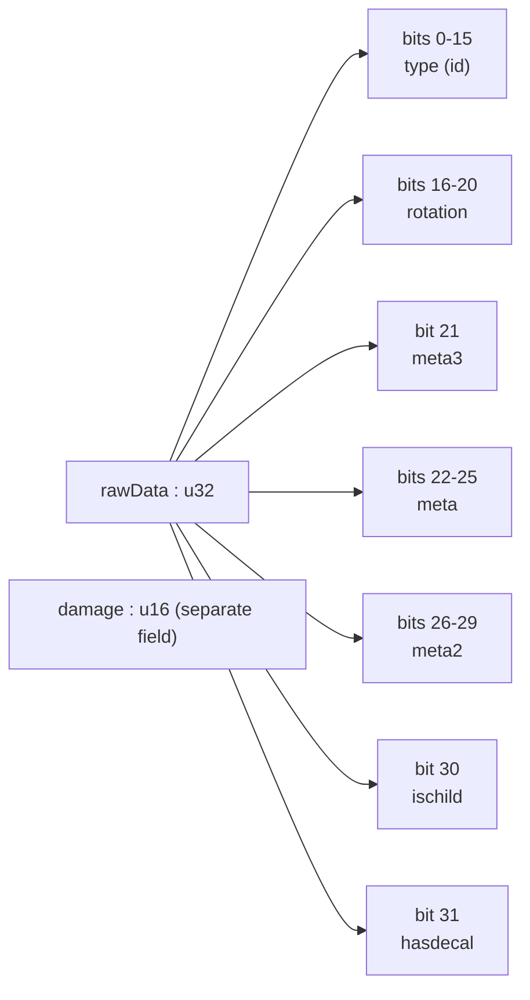
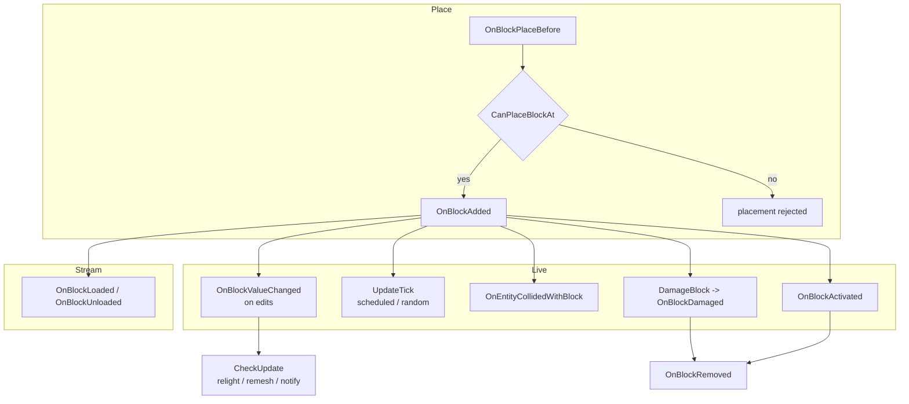
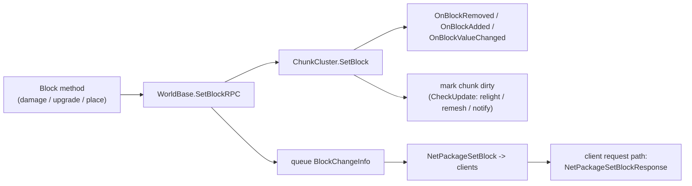
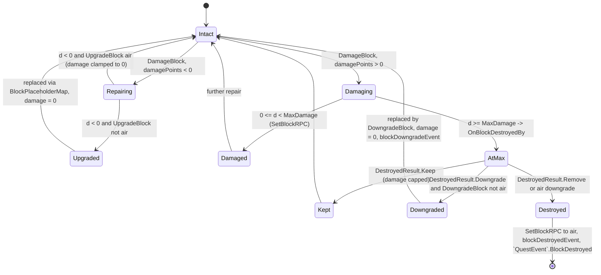
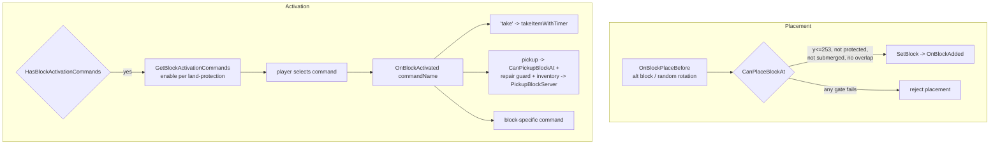
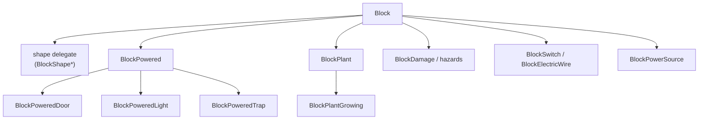

# Block framework (dedicated V3.1.0)

**Owns:** the `Block` base contract (the virtual-call surface every block type
overrides), the `BlockValue` packed voxel word, the block-change / damage /
upgrade / downgrade lifecycle, the block tick model, and the representative
behavior categories (powered, plant, hazard, shape, composite). This is the
**framework**, not a catalog of every leaf block.
**Not:** the per-chunk block storage arrays and the `ChunkCluster.SetBlock`
engine path (owned by [`world-chunks.md`](world-chunks.md)); chunk and region
persistence (owned by [`save-region.md`](save-region.md)); the `TileEntity` heap
objects and the power graph that back workstations, loot, and traps (owned by
[`tile-entities-power.md`](tile-entities-power.md)); the on-wire
`BlockChangeInfo` framing (owned by [`protocol-packages.md`](protocol-packages.md));
block XML content, meshes, and rendering (residual / client).
**Evidence:** `Block`, `BlockValue`, `BlockShape*`, and the `Block*` subclass IL
(~131 top-level `Block*` types by full-name prefix, of which 65 are concrete `Block` behavior subclasses (see catalog);
dump locally with `tools/src/DumpMethod`, git-ignored).
**Hub:** [`INDEX.md`](INDEX.md). **Method:** [`re-methodology.md`](re-methodology.md).

A block is not a per-voxel object. The world stores a compact `BlockValue` per
cell, and all behavior hangs off a single shared `Block` instance looked up by
id. Understanding the framework is understanding two things: how that word is
packed, and which virtual methods the engine calls on the shared instance.

---

## 1. The block registry and the flyweight model

`Block` is a **flyweight**: there is exactly one `Block` instance per block id,
held in a static `Block[] Block.list`. A cell's `BlockValue` carries only an id
(plus rotation, meta, damage); resolving the behavior is a single array index:

```text
BlockValue::get_Block()  ->  Block.list[ this.type ]
```

So a chunk holding a million stone cells holds a million 6-byte `BlockValue`s and
**one** shared `BlockStone`. Per-cell mutable state that will not fit in the word
(inventory, power link, owner) is promoted to a `TileEntity`
([`tile-entities-power.md`](tile-entities-power.md)); everything else lives in the
word.

Block ids are partitioned into fixed bands (static literals on `Block`):

| Band | Id range | Constant(s) |
|---|---:|---|
| Air | 0 | `cAirId` |
| Terrain materials | 1 .. 239 | `cTerrainStartId=1`, `cTerrainEndId=0xEF` |
| Water | 240 .. 242 | `cWaterId=0xF0`, `cWaterPOIId=0xF1`, `cWaterDataId=0xF2` |
| Reserved gap | 243 .. 255 | |
| General blocks | 256 .. | `cGeneralStartId=0x100` |

`MAX_BLOCKS` is a runtime-set static (the live length of `Block.list`), assigned
during load. The 16-bit type field (below) is the hard cap: ids cannot exceed
65535. Each `Block` builds itself from `blocks.xml` in `Init` (IL=2136) and
`LateInit` (IL=275); ids are handed out by `AssignIds` / `assignId`. The XML
content (hardness, drops, upgrade targets, tags) is a **residual**, not method IL
(see [`BlocksFromXml`], §9).

---

## 2. `BlockValue`: the packed voxel word

`BlockValue` is a value type built from a `uint rawData` bitfield plus a
**separate** `int damage` field. Both getters and setters are pure shift-and-mask
over `rawData`, so the layout is unambiguous:

| Bits | Field | Width | Mask | Accessor |
|---:|---|---:|---|---|
| 0..15 | **type** (block id) | 16 | `0x0000FFFF` | `get/set_type` |
| 16..20 | **rotation** | 5 (0..31) | `0x001F0000` | `get/set_rotation` |
| 21 | **meta3** | 1 | `0x00200000` | `get/set_meta3` |
| 22..25 | **meta** | 4 (0..15) | `0x03C00000` | `get/set_meta` |
| 26..29 | **meta2** | 4 (0..15) | `0x3C000000` | `get/set_meta2` |
| 30 | **ischild** | 1 | `0x40000000` | `get/set_ischild` |
| 31 | **hasdecal** | 1 | `0x80000000` | `get/set_hasdecal` |

`damage` is **not** in `rawData`. It is a distinct `int` clamped to the block's
`MaxDamage`. This matters for serialization: `BlockValue.Write` emits `rawData`
as a `u32` then `damage` as a `u16`, so a `BlockValue` on disk or wire is **6
bytes**, not 4. `Read` mirrors it (`ReadUInt32` then `ReadUInt16`).



Derived predicates read straight off `type`:

- `isair` = `type == 0`.
- `isTerrain` = `type` in `1 .. 239` (unsigned `type - 1 < 239`).
- `isWater` = `type` in `{240, 241, 242}`.

The `meta` bits are context-dependent. For a **multiblock child cell**
(`ischild == true`), `meta` encodes the parent offset: `get_parentx()` is
`meta - 8`, so a child knows where its parent word lives. When `hasdecal` is set,
`decalface` / `decaltex` occupy the meta space instead. `rotation` (0..31) is
interpreted against the block's `AllowedRotations` class, so not all 32 values are
legal for a given block.

---

## 3. The `Block` virtual-call surface (the contract)

The engine never inspects a block's fields directly; it calls virtuals on the
shared `Block` instance at fixed lifecycle points. A subclass implements a
behavior by overriding the relevant ones and leaving the rest as base no-ops.
The core surface, grouped by phase:

| Method | Called when | Base behavior | Authority |
|---|---|---|---|
| `CanPlaceBlockAt(world,pos,bv,omitCollide)` | before a placement commits | y, trader-protection, submerge, multiblock-bounds, overlap gates (§6) | both |
| `OnBlockPlaceBefore(world, ref Result, ea, rnd)` | mutate the placement result | alt-block selection, random rotation | both |
| `PlaceBlock` / `PlaceProp(world, Result, ea)` | build the placement `Result` | fills `Result.blockValue` / pos | both |
| `OnBlockAdded(world,chunk,pos,bv,addedBy)` | a block first appears in a cell | forward to `shape`, add multiblock children, register temporary-block cleanup | server |
| `OnBlockValueChanged(world,chunk,pos,oldBV,newBV)` | an existing cell's word is edited | forward to `shape`; re-lay multiblock children on rotation change | server |
| `OnBlockRemoved(world,chunk,pos,bv)` | a cell is cleared | forward to `shape`, remove multiblock children / parent | server |
| `OnBlockLoaded` / `OnBlockUnloaded(world,pos,bv)` | owning chunk streams in / out | no-op (powered blocks relink here) | server |
| `UpdateTick(world,pos,bv,bRandomTick,ticksIfLoaded,rnd)` | scheduled or random block tick (§7) | returns `false` (no-op) | server |
| `GetTickRate()` | how often to reschedule | `10` | server |
| `OnEntityCollidedWithBlock(world,pos,bv,entity)` | an entity overlaps the cell | returns `false` (hazards apply damage) | server |
| `DamageBlock(...)` -> `OnBlockDamaged(...)` | block takes damage or repair (§5) | the damage / upgrade / downgrade engine | server |
| `OnBlockDestroyedBy(...)` | damage reaches `MaxDamage` | returns `DestroyedResult.Downgrade` | server |
| `OnBlockActivated(cmd,world,pos,bv,player)` | player runs an activation command | dispatch per command | server |
| `HasBlockActivationCommands` / `GetBlockActivationCommands` / `GetActivationText` | building the interact menu | pickup command if `CanPickup` | both |
| `OnBlockPickedUp` / `PickupOrDrop` | block is taken into inventory | returns dropped `ItemStack` | server |
| `DropItemsOnEvent(world,bv,event,...)` | harvest / destroy drops | roll drop table (**IL=246**) | server |

**`DropItemsOnEvent` (IL=246)** order:

1. Clear static `itemsDropped`; lookup `itemsToDrop[event]`. If missing and
   `_bGetSameItemIfNoneFound`, push `block.ToItemValue` x1.
2. Per `SItemDropProb`: random count in `[minCount, maxCount+1)`; skip if 0;
   optional stick-chance early continue; special names resolve recipe scrap
   (half ingredient counts) or named items.
3. Per entry roll `prob` vs random; overall gate if `_overallProb < 0.999`.
4. Stick path: if not trader area and target cell air, `SetBlockRPC` place item
   block; else `ItemDropServer` with lifetime from arg or
   `ItemClass.GetLifetimeOnDrop()` when arg &lt; 0.001.
| `CheckUpdate(oldBV,newBV, out mesh, out notify, out light)` | after any word change | sets **all three true** (relight, remesh, notify neighbors) | both |



**Server authority.** Every mutating helper the block calls (`SetBlockRPC`,
`GameManager.SetBlockTextureServer`, `IGameManager.PickupBlockServer`,
`DynamicMeshManager.ChunkChanged`, `QuestEventManager.BlockDestroyed`,
`GameEventManager.HandleAction`) runs on the authority. The
`OnBlockActivated(...,EntityPlayerLocal _player)` overload is the client-side
entry point: it validates locally (land protection, repair state, inventory
room) then issues a server RPC (`PickupBlockServer`). The result is replicated,
not simulated on the client.

---

## 4. The block-change flow (`SetBlock` -> chunk -> wire)

A single block change is one story told at three levels.

1. **Engine mutation.** `ChunkCluster.SetBlock` (IL=828, owned by
   [`world-chunks.md`](world-chunks.md)) writes the new `BlockValue` into the
   chunk's block array, fires the `Block` callbacks (`OnBlockRemoved` for the old
   word, `OnBlockAdded` or `OnBlockValueChanged` for the new), then marks the
   chunk dirty. `CheckUpdate` decides which of relight / remesh / neighbor-notify
   the change needs (the base says all three).
2. **Authority helper.** The `Block` methods themselves call
   `WorldBase.SetBlockRPC(bvRef, bv[, density])`, the authority-side helper that
   both applies the change locally and queues it for replication. Terrain shapes
   take the density overload; non-terrain shapes take the plain one.
3. **Wire.** The queued change is serialized as a `BlockChangeInfo` inside
   `NetPackageSetBlock` (see [`protocol-packages.md`](protocol-packages.md) 6.1):
   a `BlockValueRef` (packed world position), `changedByEntityId`, then a
   **flags byte** selecting the payload.



`BlockChangeInfo` flags (bit-packed): `bChangeBlockValue`, `bChangeDensity`,
`bForceDensity`, `bUpdateLight`, `bChangeDamage`, `bChangeTexture`. The body then
carries only the selected parts: `BlockValue.Write` if the value changed, a
density `sbyte` if density changed, a texture array if texture changed. `SetBlock`
is **server-authoritative**: a client-originated change is a request, answered by
`NetPackageSetBlockResponse` (`0 Success`, `1 PowerBlockLimitExceeded`,
`2 StorageBlockLimitExceeded`).

---

## 5. Damage, upgrade, and downgrade lifecycle

`DamageBlock` is a one-line forward to `OnBlockDamaged(..., _recDepth: 0)`, which
is the entire engine (IL=497). It runs on the authority.

**Multiblock redirect.** If the hit cell is a child (`ischild`), the method
resolves the parent position (`MultiBlockArray.GetParentPos`), reads the parent
word, and recurses on the parent so damage always lands on the parent record.

**The damage number line.** New total `d = bv.damage + damagePoints`, where a
**negative** `damagePoints` is a repair. `ChunkCluster.InvokeOnBlockDamagedDelegates`
fires, then the outcome branches on `d`:

- **`d < 0` (repaired past pristine):** if `UpgradeBlock` is not air, the block is
  replaced by `UpgradeBlock` through `BlockPlaceholderMap.Replace`, carrying meta
  and a converted rotation, damage reset to 0, committed via `SetBlockRPC` (or the
  density overload for terrain). This is the frame-to-finished upgrade path. If
  `UpgradeBlock` is air, damage is just clamped to 0.
- **`0 <= d < MaxDamage`:** apply the damage and `SetBlockRPC`. `Stage2Health`, if
  set, caps the applied value at the stage-2 threshold.
- **`d >= MaxDamage`:** call `OnBlockDestroyedBy`, whose `DestroyedResult` decides
  the fate.

`Block/DestroyedResult` (exact enum): `None=0`, `Keep=1`, `Downgrade=2`,
`Remove=3`. The base `OnBlockDestroyedBy` returns `Downgrade`.

- **`Keep`:** the block survives; damage is capped at `MaxDamage` and returned.
- **`Downgrade` and `DowngradeBlock` not air:** `SpawnDowngradeFX`, replace with
  `DowngradeBlock` (placeholder map), preserve rotation and meta, reset damage,
  `AddPendingDowngradeBlock`, strip any faces in `RemovePaintOnDowngrade`, and
  fire `blockDowngradeEvent` through `GameEventManager.HandleAction`.
- **`Remove`, or `Downgrade` with an air downgrade target:** `QuestEventManager.BlockDestroyed`,
  `SpawnDestroyFX`, `SetBlockRPC` to the destroyed result (air), and fire
  `blockDestroyedEvent`.



---

## 6. Placement and activation flow

**Placement.** `OnBlockPlaceBefore` first mutates the `Result`: if
`SelectAlternates`, it picks the alt block for the held item's meta; if
`PlaceRandomRotation`, it rolls a rotation compatible with the block's
`AllowedRotations` class. `CanPlaceBlockAt` is then the gate. Its checks (in
order, mostly skipped in edit mode):

- `pos.y > 253` -> reject (world height ceiling).
- non-multiblock inside trader placing protection -> reject.
- multiblock bounds: top of the footprint must stay below `y = 254`.
- `bRestrictSubmergedPlacement` and `IsUnderwater` -> reject.
- `overlapsWithOtherBlock` (unless `_bOmitCollideCheck` or edit mode) -> reject.

Passing the gate, the change commits through the `SetBlock` path (§4) and
`OnBlockAdded` fires.

**Activation.** `HasBlockActivationCommands` -> `GetBlockActivationCommands`
returns a `BlockActivationCommand[]`; each entry's `enabled` is computed per
request (land protection, take-delay, and so on). The player selects one and
`OnBlockActivated(commandName, ...)` dispatches it. Example, `BlockPowered`: a
child cell forwards to its parent; the `take` command starts
`takeItemWithTimer`; anything else falls through. The base
`OnBlockActivated(..., EntityPlayerLocal)` is the pickup path: it checks
`CanPickup` (plus a `PassiveEffects` modifier), land protection
(`CanPickupBlockAt`), a "repair before pickup" guard when `damage > 0`, and
inventory room, then `OnBlockPickedUp` and the server RPC `PickupBlockServer`.



---

## 7. The block tick model

Block ticks are separate from `TileEntity` ticks. The per-chunk `TileEntity`
loop (`Chunk.UpdateTick`, [`tile-entities-power.md`](tile-entities-power.md)) walks
heap objects; the **block** ticker (`WorldBlockTicker`, driven from
`World.OnUpdateTick`, [`world-chunks.md`](world-chunks.md) §6) calls
`Block.UpdateTick` on the shared flyweight for scheduled and random ticks.

- Base `Block.UpdateTick` returns `false` (nothing to do); `GetTickRate` returns
  `10` (the reschedule interval in ticks).
- `_bRandomTick` distinguishes a random tick from a scheduled one. A block that
  wants deterministic growth reschedules itself with `addScheduledTick` instead
  of relying on random ticks.

`BlockPlantGrowing.UpdateTick` (IL=239) is the canonical example: it aborts if
`nextPlant` is air or the plant is not alive; on a random tick it reschedules and
returns; otherwise it checks the light level above (`lightLevelGrow`) and whether
anything blocks the cell above, then advances the cell by setting its `type` to
`nextPlant`. Growth is thus a chain of scheduled ticks, each swapping one word
for the next stage, entirely on the server.

---

## 8. Representative behavior categories

The subclass tree is wide but shallow. The framework matters more than the leaves;
these are the recurring shapes.



| Category | Representative class(es) | Overrides | Role |
|---|---|---|---|
| Terrain / shape | any cube; `BlockShape*` delegate | forwards `OnBlockAdded/Removed/ValueChanged` to `shape` | geometry and face rules live on the `BlockShape`, not the `Block` |
| Powered | `BlockPowered`, `BlockPoweredDoor/Light/Trap`, `BlockPowerSource`, `BlockSwitch` | `CreateTileEntity`, `GetBlockActivationCommands`, `OnBlockActivated`, `OnBlockLoaded` (relink) | create a `TileEntityPowered`, expose wire/activation commands (see [`tile-entities-power.md`](tile-entities-power.md)) |
| Plant | `BlockPlant`, `BlockPlantGrowing` | `UpdateTick`, `GetTickRate`, `CanPlaceBlockAt`, `OnBlockAdded` | scheduled multi-stage growth by swapping `type` |
| Hazard | `BlockDamage`, `BlockSpikes`, `BlockBarbed` | `OnEntityCollidedWithBlock` | apply `DamageEntity` to overlapping `EntityAlive` |
| Containers / doors / signs | (no standalone `Block` class) | expressed as `TileEntityComposite` features (`TEFeatureDoor`, loot, sign) | loot, secure loot, land claim, and doors are **composite tile-entity features**, not dedicated block classes ([`tile-entities-power.md`](tile-entities-power.md) 1.1) |
| Tools / placeholders | `BlockTool*`, `BlockPlaceholder*` | editor and world-gen hooks | not gameplay blocks; support the creative tools and prefab placeholder resolution |

The absence of `BlockLoot` / `BlockSecureLoot` / `BlockLandClaim` classes is
deliberate: those roles migrated onto `TileEntityComposite`, so the block only
carries the composite data template while the feature modules own the behavior.

---

## 9. Dedicated relevance and residuals

- **Authority.** All block mutation, damage, upgrade / downgrade, drops, and the
  pickup half of activation run on the dedicated server via `SetBlockRPC` and the
  `GameManager` / `IGameManager` server methods. Clients receive `BlockChangeInfo`
  updates; they do not simulate block state.
- **Two-phase change.** The engine `SetBlock` path (chunk storage, dirty flags)
  is [`world-chunks.md`](world-chunks.md); the block callbacks and the RPC helper
  are here. A block change is not complete until both the chunk word and the
  replication queue are updated.
- **Content (residual).** Block definitions (`MaxDamage`, `Stage2Health`,
  `UpgradeBlock`, `DowngradeBlock`, `GetTickRate` overrides, drop tables, tags,
  `AllowedRotations`) come from `blocks.xml` via `BlocksFromXml`, not from these
  method bodies.
- **Client-only (residual).** Meshing and rendering (`RenderDecorations`,
  `getUVRectFromSideAndMetadata`, `GetColorForSide`, `GetMapColor`), particles
  (`SpawnDestroyFX` visuals), `GroundAlign`, icons, and tooltip UI are skipped on
  a headless server. The server keeps only the state and the FX event dispatch,
  not the drawing.

---

## Related docs

| Doc | Role |
|---|---|
| [world-chunks.md](world-chunks.md) | Chunk block storage arrays and the `ChunkCluster.SetBlock` engine mutator |
| [save-region.md](save-region.md) | Where `BlockValue` words are written inside the chunk blob and region files |
| [tile-entities-power.md](tile-entities-power.md) | The `TileEntity` heap objects and power graph that back powered, loot, and composite blocks |
| [protocol-packages.md](protocol-packages.md) | `NetPackageSetBlock` and the `BlockChangeInfo` wire layout |
| [full-surface.md](full-surface.md) | Where this family sits in the whole-assembly map |
| [re-methodology.md](re-methodology.md) | How this was reversed |

**Leaf catalog:** every instance is enumerated in [`inventories/block-behaviors.md`](inventories/block-behaviors.md) (the 65 `Block` behavior leaves).

## Changelog

- **2026-08-07:** DropItemsOnEvent IL=246 (prob table, stick vs ItemDropServer,
  recipe scrap half ingredients, trader-area stick suppress).

- **2026-07-23:** Initial `Block` framework reversal (flyweight registry and id bands, the `BlockValue` 32-bit-plus-damage packing, the virtual-call contract, the `SetBlock`-to-`BlockChangeInfo` change flow, the damage / upgrade / downgrade lifecycle with `DestroyedResult`, placement and activation flows, the block tick model, and representative behavior categories) with state machines.
