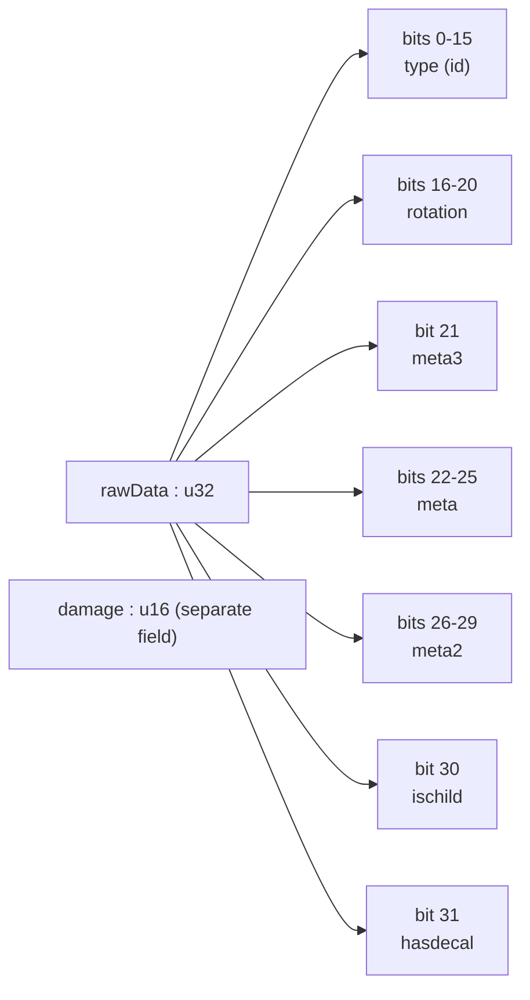
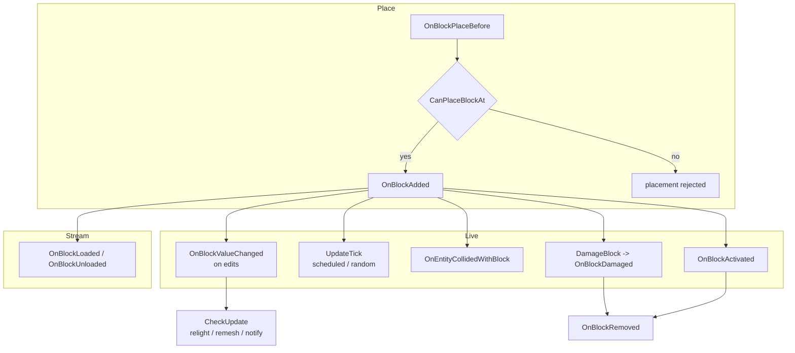
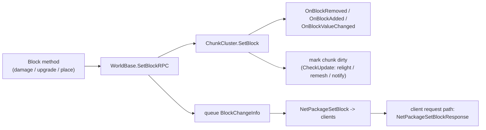
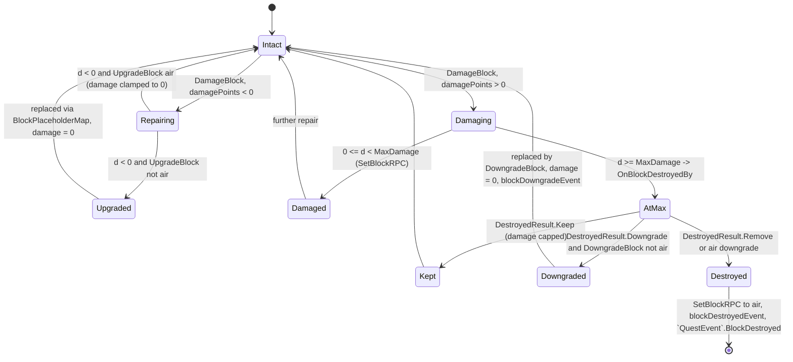
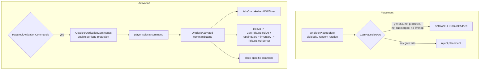
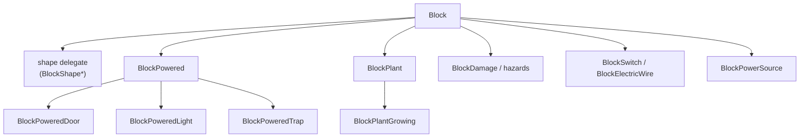

# Block framework (dedicated V3.1.0)

**Owns:** the `Block` base contract (the virtual-call surface every block type
overrides), the `BlockValue` packed voxel word, the block-change / damage /
upgrade / downgrade lifecycle, the block tick model, and the representative
behavior categories (powered, plant, hazard, shape, composite). This is the
**framework**, not a catalog of every leaf block.
**Not:** the per-chunk block storage arrays and the `ChunkCluster.SetBlock`
engine path (owned by [`world-chunks.md`](world-chunks.md)); chunk and region
persistence (owned by [`save-region.md`](save-region.md)); the `TileEntity` heap
objects and the power graph that back workstations, loot, and traps (owned by
[`tile-entities-power.md`](tile-entities-power.md)); the on-wire
`BlockChangeInfo` framing (owned by [`protocol-packages.md`](protocol-packages.md));
block XML content, meshes, and rendering (residual / client).
**Evidence:** `Block`, `BlockValue`, `BlockShape*`, and the `Block*` subclass IL
(~131 top-level `Block*` types by full-name prefix, of which 65 are concrete `Block` behavior subclasses (see catalog);
dump locally with `tools/src/DumpMethod`, git-ignored).
**Hub:** [`INDEX.md`](INDEX.md). **Method:** [`re-methodology.md`](re-methodology.md).

A block is not a per-voxel object. The world stores a compact `BlockValue` per
cell, and all behavior hangs off a single shared `Block` instance looked up by
id. Understanding the framework is understanding two things: how that word is
packed, and which virtual methods the engine calls on the shared instance.

---

## 1. The block registry and the flyweight model

`Block` is a **flyweight**: there is exactly one `Block` instance per block id,
held in a static `Block[] Block.list`. A cell's `BlockValue` carries only an id
(plus rotation, meta, damage); resolving the behavior is a single array index:

```text
BlockValue::get_Block()  ->  Block.list[ this.type ]
```

So a chunk holding a million stone cells holds a million 6-byte `BlockValue`s and
**one** shared `BlockStone`. Per-cell mutable state that will not fit in the word
(inventory, power link, owner) is promoted to a `TileEntity`
([`tile-entities-power.md`](tile-entities-power.md)); everything else lives in the
word.

**Load-time id assignment (the `Block.assignIds*` pipeline):**
`assignIdsFromMapping` (IL=42) assigns every block whose name is in the
`NameIdMapping` its mapped id, queueing the rest;
`assignLeftOverBlocks` (IL=107) first honors the `fixedBlockIds` map, then
fills terrain blocks by scanning **upward from id 0** for free ids and
non-terrain blocks **downward from 255**, logging
`Block IDs total {0}, terr {1}, last {2}` (the mirror of the ItemClass
pipeline, [items.md](items.md) §2). `AlternateBlockCount` (IL=5) /
`ContainsAlternateBlock(name)` (IL=24) read the `placeAltBlockNames` list;
`GetPathOffset(rotation)` (IL=11) returns `shape.GetPathOffset` when
`PathType == -1` (the `BlockShapeNew` variant indexes
`boundsPathOffsetRotations[rotation]`).
Combat properties: `GetExplosionResistance` (IL=4) is
`blockMaterial.ExplosionResistance`; `GetHardness` (IL=5) is
`blockMaterial.Hardness.Value`.

**Behavior query leaves (all IL-verified):** `ActivateBlockOnce` (IL=2) is
false (the base one-shot activation default); `GetPlaceAltBlockValue`
(IL=21) picks a random `placeAltBlockNames` entry via the world's
`GameRandom` (empty string when none); `HasItemsToDropForEvent(event)`
(IL=5) is the `itemsToDrop` dict `ContainsKey`; `IsPlant` (IL=9) is
`blockMaterial.IsPlant || bIsPlant`; `SupportsRotation` / `SupportsRotationFromMask`
and the `GetAutoShape*` / `GetMaterialForSide` family are the XML-driven
shape/config getters.

The property-application leaves behind those getters (called from the
`Init` / `LateInit` XML build): `SetSideTextureId(id, channel)` (IL=13)
stores `textureInfos[channel].singleTextureId` and clears the per-side flag;
the `string[]` overload (IL=39) parses every entry into `sideTextureIds` and
sets `bTextureForEachSide`. `SetLightValue(percent)` (IL=8) stores
`(byte)(15 * percent)` and returns `this` (fluent); `SetBlockName` /
`GetBlockName` (IL=4/3) wrap the `blockName` field; `StringToVector3(input)`
(IL=79) parses `"r,g,b"` (0..255, 255 defaults) into `Vector3 / 255` (the
color-style property parser); `GetBlockValueFromProperty(name)` (IL=40)
reads the property value and resolves it via `GetBlockValue(value, false)`,
throwing `You need to specify a property with name '{0}' for the block` on a
missing key and `Block with name '{0}' not found!` on an unknown block;
`BlockIdsByName()` (IL=26) folds `nameToBlock` into a name -> id dictionary;
`get_UnlockedBy()` (IL=55) lazily comma-splits `PropUnlockedBy` into cached
`RecipeUnlockData[]` (empty array when the prop is absent).
Query leaves: `GetShownMaxDamage()` (IL=15) returns `MaxDamagePlusDowngrades`
for a composite door (`TEFeatureDoor`) else `MaxDamage`;
`GetActivationDistanceSq()` (IL=14) squares `activationDistance`, falling
back to `cCollectItemDistance^2` when 0; `GetAlternateBlockIndex(name)`
(IL=24) is the `placeAltBlockNames` index or -1; `GetIconName()` (IL=8) is
`CustomIcon ?? GetBlockName()`; `GetCustomDescription` (IL=2) returns "";
`GetUVMode(side, channel)` (IL=18) unpacks the per-side UV-mode bits;
`CopyDroppedFrom(other)` (IL=89) merges the other block's `itemsToDrop`,
appending drop entries whose item name is not already present;
`HasCollidingAABB(...)` (IL=33) tests any `GetCollisionAABB` box against the
given bounds; `CacheStats()` (IL=7) forwards to
`DynamicPropertiesCache.Stats()`; `ForceAnimationState` (IL=1) is a base
no-op whose `BlockActivateSingle` override (IL=69) sets `AnimActivatedBool`
from meta bit 1 and CrossFades `AnimActivatedState` on the child animators.

The auto-shape (procedural RWG block) leaves: `GetAutoShapeType` /
`GetAutoShapeBlockName` / `GetAutoShapeShapeName` / `GetAutoShapeHelperBlock`
(IL=3 each) expose the `AutoShapeType` / `autoShapeBaseName` /
`autoShapeShapeName` / `autoShapeHelper` fields;
`AutoShapeAlternateShapeNameIndex(shapeName)` (IL=14) is, for
`AutoShapeType == 1`, `GetAlternateBlockIndex(autoShapeBaseName + ":" +
shapeName)` else -1; `AutoShapeSupportsShapeName(shapeName)` (IL=14) is the
same concatenation through `ContainsAlternateBlock`;
`GetLocalizedAutoShapeShapeName()` (IL=8) is
`Localization.Get("shape" + autoShapeShapeName)`;
`GetShapeCategories(altBlocks, target)` (IL=47) unions the alt blocks'
`ShapeCategories` lists (deduped) and sorts the result.

Block ids are partitioned into fixed bands (static literals on `Block`):

| Band | Id range | Constant(s) |
|---|---:|---|
| Air | 0 | `cAirId` |
| Terrain materials | 1 .. 239 | `cTerrainStartId=1`, `cTerrainEndId=0xEF` |
| Water | 240 .. 242 | `cWaterId=0xF0`, `cWaterPOIId=0xF1`, `cWaterDataId=0xF2` |
| Reserved gap | 243 .. 255 | |
| General blocks | 256 .. | `cGeneralStartId=0x100` |

`MAX_BLOCKS` is a runtime-set static (the live length of `Block.list`), assigned
during load. The 16-bit type field (below) is the hard cap: ids cannot exceed
65535. Each `Block` builds itself from `blocks.xml` in `Init` (IL=2136) and
`LateInit` (IL=275); ids are handed out by `AssignIds` / `assignId`. The XML
content (hardness, drops, upgrade targets, tags) is a **residual**, not method IL
(see [`BlocksFromXml`], §9).

---

## 2. `BlockValue`: the packed voxel word

`BlockValue` is a value type built from a `uint rawData` bitfield plus a
**separate** `int damage` field. Both getters and setters are pure shift-and-mask
over `rawData`, so the layout is unambiguous:

| Bits | Field | Width | Mask | Accessor |
|---:|---|---:|---|---|
| 0..15 | **type** (block id) | 16 | `0x0000FFFF` | `get/set_type` |
| 16..20 | **rotation** | 5 (0..31) | `0x001F0000` | `get/set_rotation` |
| 21 | **meta3** | 1 | `0x00200000` | `get/set_meta3` |
| 22..25 | **meta** | 4 (0..15) | `0x03C00000` | `get/set_meta` |
| 26..29 | **meta2** | 4 (0..15) | `0x3C000000` | `get/set_meta2` |
| 30 | **ischild** | 1 | `0x40000000` | `get/set_ischild` |
| 31 | **hasdecal** | 1 | `0x80000000` | `get/set_hasdecal` |

`damage` is **not** in `rawData`. It is a distinct `int` clamped to the block's
`MaxDamage`. This matters for serialization: `BlockValue.Write` emits `rawData`
as a `u32` then `damage` as a `u16`, so a `BlockValue` on disk or wire is **6
bytes**, not 4. `Read` mirrors it (`ReadUInt32` then `ReadUInt16`).

**`BlockValue.ToItemValue()` (IL=6)** converts to the item domain:
`new ItemValue { type = this.type }` (the block id becomes the item type id -
the same id space, `Block.ItemsStartHere` offset aside).

**`ItemValue.ToBlockValue(allowAlternates)` (IL=26)** is the reverse: an item
type at/above `Block.ItemsStartHere` yields `BlockValue.Air` (not a block);
otherwise the type is copied into a `BlockValue`, and with `allowAlternates`
and a `SelectAlternates` block the value becomes
`Block.GetAltBlockValue(Meta)` (the alternate variant selected by the item's
meta), else the plain value.

**Alternate-block resolution:** `Block.GetAltBlock(typeId)` (IL=19) returns
`placeAltBlockClasses[typeId]` when the array exists and is non-empty, else
`Block.list[0]` (the fallback). `GetAltBlocks()` (IL=39) lazily resolves the
`placeAltBlockNames` strings into the class array via
`GetBlockByName(name, false)`; `GetAltBlockValue(typeId)` (IL=5) wraps
`GetAltBlock(typeId).ToBlockValue()`; `GetAltBlockNames()` (IL=3) is the raw
field read.

**`Block.GetBlockByName(name, caseInsensitive)` (IL=19)** is the registry
lookup: a null `nameToBlock` (uninitialized registry) returns null; otherwise
the `nameToBlockCaseInsensitive` (or `nameToBlock`) dictionary
`TryGetValue`, null when absent.

**`Block.ToBlockValue()` (IL=8)** is the class→word conversion:
`new BlockValue { type = blockID }`. **`BlockLiquidv2.WaterDataToBlockValue`
(IL=28)** converts a water cell: with mass `> 195` it builds the water block
`type 240, damage 0, meta 2, meta2 = MAX_EMISSIONS, rotation 8`, else
`BlockValue.Air`.



Derived predicates read straight off `type`:

- `isair` = `type == 0`.
- `isTerrain` = `type` in `1 .. 239` (unsigned `type - 1 < 239`).
- `isWater` = `type` in `{240, 241, 242}`.

The `meta` bits are context-dependent. For a **multiblock child cell**
(`ischild == true`), `meta` encodes the parent offset: `get_parentx()` is
`meta - 8`, so a child knows where its parent word lives. When `hasdecal` is set,
`decalface` / `decaltex` occupy the meta space instead. `rotation` (0..31) is
interpreted against the block's `AllowedRotations` class, so not all 32 values are
legal for a given block.

---

## 3. The `Block` virtual-call surface (the contract)

The engine never inspects a block's fields directly; it calls virtuals on the
shared `Block` instance at fixed lifecycle points. A subclass implements a
behavior by overriding the relevant ones and leaving the rest as base no-ops.
The core surface, grouped by phase:

| Method | Called when | Base behavior | Authority |
|---|---|---|---|
| `CanPlaceBlockAt(world,pos,bv,omitCollide)` | before a placement commits | y, trader-protection, submerge, multiblock-bounds, overlap gates (§6) | both |
| `OnBlockPlaceBefore(world, ref Result, ea, rnd)` | mutate the placement result | alt-block selection, random rotation | both |
| `PlaceBlock` / `PlaceProp(world, Result, ea)` | build the placement `Result` | fills `Result.blockValue` / pos | both |
| `OnBlockAdded(world,chunk,pos,bv,addedBy)` | a block first appears in a cell | forward to `shape`, add multiblock children, register temporary-block cleanup | server |
| `OnBlockReset(world,chunk,pos,bv)` | a cell is re-seeded from the prefab (chunk stream-in / POI reset) | no-op (light / hazard restore state, below) | server |
| `OnBlockValueChanged(world,chunk,pos,oldBV,newBV)` | an existing cell's word is edited | forward to `shape`; re-lay multiblock children on rotation change | server |
| `OnBlockRemoved(world,chunk,pos,bv)` | a cell is cleared | forward to `shape`, remove multiblock children / parent | server |
| `OnBlockLoaded` / `OnBlockUnloaded(world,pos,bv)` | owning chunk streams in / out | no-op (powered blocks relink here) | server |
| `UpdateTick(world,pos,bv,bRandomTick,ticksIfLoaded,rnd)` | scheduled or random block tick (§7) | returns `false` (no-op) | server |
| `GetTickRate()` | how often to reschedule | `10` | server |
| `OnEntityCollidedWithBlock(world,pos,bv,entity)` | an entity overlaps the cell | returns `false` (hazards apply damage) | server |
| `DamageBlock(...)` -> `OnBlockDamaged(...)` | block takes damage or repair (§5) | the damage / upgrade / downgrade engine | server |
| `OnBlockDestroyedBy(...)` | damage reaches `MaxDamage` | returns `DestroyedResult.Downgrade` | server |
| `OnBlockActivated(cmd,world,pos,bv,player)` | player runs an activation command | dispatch per command | server |
| `HasBlockActivationCommands` / `GetBlockActivationCommands` / `GetActivationText` | building the interact menu | pickup command if `CanPickup` | both |
| `OnBlockPickedUp` / `PickupOrDrop` | block is taken into inventory | returns dropped `ItemStack` | server |
| `DropItemsOnEvent(world,bv,event,...)` | harvest / destroy drops | roll drop table (**IL=246**) | server |

**`DropItemsOnEvent` (IL=246)** order:

1. Clear static `itemsDropped`; lookup `itemsToDrop[event]`. If missing and
   `_bGetSameItemIfNoneFound`, push `block.ToItemValue` x1.
2. Per `SItemDropProb`: random count in `[minCount, maxCount+1)`; skip if 0;
   optional stick-chance early continue; special names resolve recipe scrap
   (half ingredient counts) or named items.
3. Per entry roll `prob` vs random; overall gate if `_overallProb < 0.999`.
4. Stick path: if not trader area and target cell air, `SetBlockRPC` place item
   block; else `ItemDropServer` with lifetime from arg or
   `ItemClass.GetLifetimeOnDrop()` when arg &lt; 0.001.
| `CheckUpdate(oldBV,newBV, out mesh, out notify, out light)` | after any word change | sets **all three true** (relight, remesh, notify neighbors) | both |



**`OnBlockReset` restores meta state (V3.1.0 b14).** The base is a no-op
(IL=1). `BlockHazard.OnBlockReset` (IL=33) and `BlockLight.OnBlockReset`
(IL=35) are both server-gated and skip multiblock children. The two share a
meta-bit split: **bit 0 = original (prefab) state, bit 1 = runtime state**
(`IsHazardOn` / `IsLightOn` read `meta & 2`; `OriginalHazardState` /
`OriginalLightState` read `meta & 1`, with `BlockLight.ignoreLightsOff`
forcing original off). On reset the hazard variant re-arms to the authored
state (`SetHazardState(bv, original)` writes `meta & ~3 | original*2`,
then `SetBlockRPC`), so a tripped mine snaps back to its prefab on/off
setting when the chunk re-seeds; the light variant instead **promotes the
runtime state into the original slot** (`meta = (meta & ~1) | (runtime ? 1 :
0)` via `SetBlockRPC`), persisting a toggled light across the reset.

**Server authority.** Every mutating helper the block calls (`SetBlockRPC`,
`GameManager.SetBlockTextureServer`, `IGameManager.PickupBlockServer`,
`DynamicMeshManager.ChunkChanged`, `QuestEventManager.BlockDestroyed`,
`GameEventManager.HandleAction`) runs on the authority. The
`OnBlockActivated(...,EntityPlayerLocal _player)` overload is the client-side
entry point: it validates locally (land protection, repair state, inventory
room) then issues a server RPC (`PickupBlockServer`). The result is replicated,
not simulated on the client.

---

## 4. The block-change flow (`SetBlock` -> chunk -> wire)

A single block change is one story told at three levels.

1. **Engine mutation.** `ChunkCluster.SetBlock` (IL=828, owned by
   [`world-chunks.md`](world-chunks.md)) writes the new `BlockValue` into the
   chunk's block array, fires the `Block` callbacks (`OnBlockRemoved` for the old
   word, `OnBlockAdded` or `OnBlockValueChanged` for the new), then marks the
   chunk dirty. `CheckUpdate` decides which of relight / remesh / neighbor-notify
   the change needs (the base says all three).
2. **Authority helper.** The `Block` methods themselves call
   `WorldBase.SetBlockRPC(bvRef, bv[, density])`, the authority-side helper that
   both applies the change locally and queues it for replication. Terrain shapes
   take the density overload; non-terrain shapes take the plain one.
3. **Wire.** The queued change is serialized as a `BlockChangeInfo` inside
   `NetPackageSetBlock` (see [`protocol-packages.md`](protocol-packages.md) 6.1):
   a `BlockValueRef` (packed world position), `changedByEntityId`, then a
   **flags byte** selecting the payload.



`BlockChangeInfo` flags (bit-packed): `bChangeBlockValue`, `bChangeDensity`,
`bForceDensity`, `bUpdateLight`, `bChangeDamage`, `bChangeTexture`. The body then
carries only the selected parts: `BlockValue.Write` if the value changed, a
density `sbyte` if density changed, a texture array if texture changed. The
exact wire form (`BlockChangeInfo.Write` IL=89 / `Read` IL=76): `BlockValueRef`,
`changedByEntityId : i32`, then the **flags byte** - bit 0 `bChangeBlockValue`
(1), bit 1 `bChangeDamage` (2), bit 2 `bChangeDensity` (4), bit 3
`bForceDensity` (8), bit 4 `bUpdateLight` (16), bit 5 `bChangeTexture` (32) -
followed by the flagged payloads in that order (`BlockValue.Write`, `sbyte
density`, `TextureFullArray.Write`). `bForceDensity` and `bUpdateLight` are
flags only (no payload). `SetBlock`
is **server-authoritative**: a client-originated change is a request, answered by
`NetPackageSetBlockResponse` (`0 Success`, `1 PowerBlockLimitExceeded`,
`2 StorageBlockLimitExceeded`).

**Entry chain (V3.1.0 b14):** `World.SetBlock(pos, bv, bNotify, updateLight)`
(IL=9) delegates straight to `ChunkCluster.SetBlock(BlockValueRef(pos), bv,
bNotify, updateLight)` (IL=13), which fills the defaults (change BV only, no
density) and calls the 10-arg dispatcher (IL=48). That dispatcher switches on
`BlockValueRef.Type`: a `BlockPosition` ref runs the main 828-IL body
([`world-chunks.md`](world-chunks.md)); a `PropReference` ref goes through
`SetBlockValue` (IL=32) to `ChunkCluster.SetProp(propRef, null pos/rot/scale,
bv)` instead. `SetBlockRaw(worldPos, bv)` (IL=25) is the low-level path:
`GetChunkSync(toChunkXZ(x), toChunkXZ(z))`, null chunk → no-op, else
`chunk.SetBlockRaw(toBlockXZ(x), y, toBlockXZ(z), bv)`.

**`BlockValueRef` wire form (Read IL=23):** the discriminant byte first -
`0 None`, `1 Block` (`StreamUtils.ReadVector3i` -> `BlockPosition`), `2 Prop`
(`PropRef.Read`) - anything else throws `ArgumentOutOfRangeException`. This
byte is the first field of every `BlockChangeInfo` on the wire, which is how
the batch commit machine picks the `SetBlockValue` vs position path.
`PropRef.Read` (IL=12) is `ChunkPos : Vector2i` + `PropId : i32` - a prop is
addressed by its prop chunk plus a per-chunk id.

**`World.blockToTransformPos` (the ref-to-position resolution):** the
`BlockValueRef` overload (IL=24) switches on `Type`: `None` returns
`Vector3.zero`, `BlockPosition` goes to the `Vector3i` overload (IL=15) which
returns the cell center `(x + 0.5, y, z + 0.5)`, and `PropReference` goes to
the `(WorldBase, PropRef)` overload (IL=17) which reads the prop value from
`GetChunkSync(propRef.ChunkPos)` and adds
`chunk.GetWorldPos().ToVector3CenterXZ() + propValue.transform.position`; an
unknown type throws `ArgumentOutOfRangeException`. The callers are the block
FX / voxel / terrain-alignment paths (`SpawnDestroyParticleEffect`, `SpawnFX`,
`Voxel.BlockHit`, `TerrainAlignmentUtils.AlignToTerrain`).

### 4.1 The batch commit machine (`SetBlocksRPC` -> `ChangeBlocks`)

`World.SetBlocksRPC(changes)` (IL=6) is a one-line delegator:
`gameManager.SetBlocksRPC(changes, null)`. `GameManager.SetBlocksRPC(changes,
persistentPlayerId)` (IL=29) runs the authoritative `ChangeBlocks(...)` first,
then builds `NetPackageSetBlock.Setup(persistentLocalPlayer, changes,
dedicated ? -1 : myPlayerId)` and, on the server, broadcasts it to clients
(`SetBlocksOnClients(-1, pkg)`); a non-server caller sends it to the server
instead (the client request path).

**`GameManager.ChangeBlocks(persistentPlayerId, changes)` (IL=530)** is the
batch commit machine (the destination of `PrefabTriggerData.UpdateBlocks`,
`QuestEventManager.UpdateBlocks`, and every `World.SetBlocksRPC` caller):

1. **Lock:** the whole pass runs under a `Monitor` on `ccChanged`
   (`List<ChunkCluster>`).
2. **Acting player:** a null id resolves to the local player
   (`persistentLocalPlayer` + `myEntityPlayerLocal`); otherwise
   `PersistentPlayerList.GetPlayerData(id)` and, when the data has a live
   `EntityId`, `world.GetEntity(EntityId)` (used by the sleeping-bag branch
   below).
3. **Per `BlockChangeInfo`:**
   - The owning `ChunkCluster` (`World.ChunkCache`) is added to `ccChanged`
     once and gets `ChunkPosNeedsRegeneration_DelayedStart()`.
   - **Density derivation:** with no explicit `bChangeDensity`, an air block
     in a negative-density cell is set to `MarchingCubes.DensityAir` and a
     terrain-shape block in a non-negative cell to `MarchingCubes.DensityTerrain`;
     an unchanged value cancels the density change.
   - **`bChangeDamage` guard:** a damage-only change whose old block type
     differs from the new type is skipped entirely.
   - **Ref type:** a `BlockValueRefType` value ref goes through
     `ChunkCluster.SetBlockValue(ref, bv)` directly (no mesh/light fallout);
     a position ref runs the full path.
   - **Position path:** resolve the `Chunk`; when the new block `IsTerrain()`
     and `y >= chunk.GetHeight(x, z)` the engine calls `SetTopSoilBroken` on
     the chunk and, for border cells, the 1-wide edge neighbor chunks
     (x/z == 0 or 15), then `World.UncullChunk(chunk)`. The old `TileEntity`
     (non-child new block) is captured, and
     `ChunkCluster.SetBlock(ref, bChangeBlockValue, blockValue,
     bChangeDensity, density, true, bUpdateLight, bForceDensity, false,
     changedByEntityId)` runs with the old value returned.
   - **TE lifecycle (server):** a replaced TE gets
     `oldTE.ReplacedBy(oldBV, newBV, newTE)`; a new air block runs
     `Chunk.RemoveTileEntityAt<TileEntity>`; a non-air swap runs
     `newTE.UpgradeDowngradeFrom(oldTE)`; a locked old TE is force-unlocked
     (`LockManager.ForceUnlockLockTarget`).
   - **Triggers and quests:** a new air block runs `Chunk.RemoveBlockTrigger`;
     a type change fires `QuestEventManager.BlockChanged(oldBlock, newBlock,
     pos)`; sleeping-bag edges update the acting player's spawn point
     (`EntityAlive.SpawnPoints.Set(pos)` when placed;
     `NavObjectManager.UnRegisterNavObjectByOwnerEntity("sleeping_bag")` +
     `PersistentPlayerList.SpawnPointRemoved(pos)` when removed) and flag a
     player-data save.
   - **Texture:** `bChangeTexture` applies `SetTextureFullArray(ref,
     textureFull)`; otherwise an old block with `CanBlocksReplace` clears the
     texture (`new TextureFullArray(0)`).
4. **Tail:** any sleeping-bag change on the server triggers
   `PersistentPlayerList.SavePersistentPlayerData()`; every newly tracked
   cluster gets `ChunkPosNeedsRegeneration_DelayedStop()` and is removed from
   `ccChanged`.

---

## 5. Damage, upgrade, and downgrade lifecycle

`DamageBlock` is a one-line forward to `OnBlockDamaged(..., _recDepth: 0)`, which
is the entire engine (IL=497). It runs on the authority.

**Multiblock redirect.** If the hit cell is a child (`ischild`), the method
resolves the parent position (`MultiBlockArray.GetParentPos`), reads the parent
word, and recurses on the parent so damage always lands on the parent record.

**The damage number line.** New total `d = bv.damage + damagePoints`, where a
**negative** `damagePoints` is a repair. `ChunkCluster.InvokeOnBlockDamagedDelegates`
fires, then the outcome branches on `d`:

- **`d < 0` (repaired past pristine):** if `UpgradeBlock` is not air, the block is
  replaced by `UpgradeBlock` through `BlockPlaceholderMap.Replace`, carrying meta
  and a converted rotation, damage reset to 0, committed via `SetBlockRPC` (or the
  density overload for terrain). This is the frame-to-finished upgrade path. If
  `UpgradeBlock` is air, damage is just clamped to 0.
- **`0 <= d < MaxDamage`:** apply the damage and `SetBlockRPC`. `Stage2Health`, if
  set, caps the applied value at the stage-2 threshold.
- **`d >= MaxDamage`:** call `OnBlockDestroyedBy`, whose `DestroyedResult` decides
  the fate.

**Explosion destruction (`OnBlockDestroyedByExplosion`, V3.1.0 b14):** the
base (IL=15) fires `ChunkCluster.InvokeOnBlockDamagedDelegates(bvRef, bv,
MaxDamage, playerThatStartedExpl)` and returns `DestroyedResult 2`. The
per-block overrides add the reactions: `BlockMine` (IL=14) rolls a **33%**
chain-explosion chance (`BlockMine.explode`, result 3, else 1);
`BlockModelTree` (IL=10) starts the tree fall (`startToFall(world, pos, bv,
-1)`); `BlockTNT` (IL=22) runs the base then `BlockTNT.explode(world, ref,
playerIdx, 0.3 + rand*0.5)` (the TNT fuse delay); `BlockTrapDoor` (IL=23)
fires `Block.HandleTrigger(player, world, pos, bv)` when the exploder is a
player (the trapdoor's wiring triggers) before the base;
`BlockCompositeTileEntity` (IL=54) clears its feature modules through the
normal destroy path. Both explosives end in the same forwarder:
`BlockTNT.explode` (IL=18) and `BlockMine.explode` (IL=18) call
`GameManager.ExplosionServer(center, blockPos, identity, explosion,
entityId, delay, true, null)` - the TNT with its fuse `delay`, the mine with
`-1` / `0.1` s (see [`protocol-packages.md`](protocol-packages.md) §6.14).
`BlockTNT.OnBlockDamaged` (IL=31) can detonate early: when
`rand.RandomFloat <= damagePoints / MaxDamage` it calls
`explode(world, bvRef, entityId, 0.1)` before the normal damage delegates -
any hit carries a damage-proportional chance to blow the TNT.

**`BlockMine.TriggerMine(entity, world, blockPos, useTrigger)` (IL=99)** is
the mine detonation: on a walker step (`useTrigger`) it plays the
`TriggerSound` at the position, derives `TriggerDelay` from passive **171**
and `explosion.EntityDamage` from passive **172** over
`BaseEntityDamage`, then schedules the mine's own block update at
`TriggerDelay * 20` sim ticks (`WorldBlockTicker.AddScheduledBlockUpdate`) -
the fuse - so `UpdateTick` fires the `explode`. A direct trigger
(`!useTrigger`) applies the same damage passive and
`explode(world, ref, -1)` immediately. The scheduled tick is the fuse:
`BlockMine.UpdateTick` (IL=8) simply calls `explode(world, ref, -1)` and
returns 1. `IsMovementBlocked` (IL=2) is always false - mines never block
movement, which is what lets walkers step on them. `OnBlockDamaged` (IL=44)
mirrors the TNT: positive damage rolls `RandomFloat <= clamp(damagePoints,
1, MaxDamage-1) / MaxDamage` for an immediate `explode(world, bvRef,
entityIdThatDamaged)`, while negative (repair) damage delegates to the base.
(The walker-side `LandMineImmunity` skip is the `OnEntityWalking` gate
above.)

**Collision damage (`BlockDamage.OnEntityCollidedWithBlock`, IL=126):** the
shared base behind spikes/barbed wire: for an alive `EntityAlive` it builds a
`DamageSourceEntity(damageType, -1)` with `AttackingItem` from the block
value, `BlockPosition`, and `SetIgnoreConsecutiveDamages(true)` (no tick
re-trigger), sets the `EntityHuman` hit-transform name, runs
`Entity.DamageEntity(source, damage, false, 1)`, then
`CalculateBlockDamage(this, damageReceived, ...)` (the block's own
collision wear) and the `MovementFactor` slow. `BlockSpikes.
OnEntityCollidedWithBlock` (IL=38) runs the base, then **retracts**: a
non-air `SiblingBlock` replaces the cell via `SetBlockRPC` (type swap,
damage 0), otherwise the cell is set to Air - the spikes are consumed by a
step. `BlockBarbed.OnEntityCollidedWithBlock` (IL=51) degrades instead:
after the base damage it increments the cell `meta` and, at `meta == 15`,
`DamageBlock(..., MaxDamage, entityId, ...)` destroys the wire, otherwise
commits the incremented word - barbed wire survives 15 collisions.

`Block/DestroyedResult` (exact enum): `None=0`, `Keep=1`, `Downgrade=2`,
`Remove=3`. The base `OnBlockDestroyedBy` returns `Downgrade`.

- **`Keep`:** the block survives; damage is capped at `MaxDamage` and returned.
- **`Downgrade` and `DowngradeBlock` not air:** `SpawnDowngradeFX`, replace with
  `DowngradeBlock` (placeholder map), preserve rotation and meta, reset damage,
  `AddPendingDowngradeBlock`, strip any faces in `RemovePaintOnDowngrade`, and
  fire `blockDowngradeEvent` through `GameEventManager.HandleAction`.
- **`Remove`, or `Downgrade` with an air downgrade target:** `QuestEventManager.BlockDestroyed`,
  `SpawnDestroyFX`, `SetBlockRPC` to the destroyed result (air), and fire
  `blockDestroyedEvent`.

**`BlockPlaceholderMap.Replace` (IL=292) is the substitution engine behind
"replace with `UpgradeBlock` / `DowngradeBlock`" above.** The map is a
`Dictionary<BlockValue, List<PlaceholderTarget>>`; a second dictionary
`questResetPlaceholders` holds `QuestPlaceholderEntry` lists for quest-driven
resets. Flow of the 9-arg core:

- **Registry miss:** if the incoming `BlockValue` is not a key, it is returned
  unchanged (the block stands as-is).
- **Alternate list:** with `useAlternate` and a matching key, the first
  `QuestPlaceholderEntry` whose `QuestTag.Test_AnySet(questTags)` is true
  supplies the target list. `FastTags.none` (what the plain wrappers pass)
  never matches, so the alternate branch only fires with real quest tags.
- **Target filtering:** a target passes iff its `biomeName` equals the cell
  biome (`Chunk.GetBiomeId` on `World.toBlockXZ` coords, resolved through
  `Biomes.GetBiome`, compared case-insensitively) and its `sandboxOption` is
  not a failing boolean gate: the sentinel `(SandboxOptions)165` always passes;
  an option of option type 4 must satisfy `GetBool(option) != invertSandbox`.
- **Weighted draw:** survivors land in a stack `Span<int>` while their `Prob`
  values accumulate; `roll = random.RandomFloat() * total` walks the span
  subtracting each `Prob` (the last survivor is the fallback pick), and the
  winner's `blockValue.type` is copied into the result.
- **Rotation:** with `allowRandomRotation && target.isRandomRotation`, a block
  whose shape `Has45DegreeRotations` rolls `RandomRange(8)` and maps rolls
  above 3 to +20 (the 45-degree band), otherwise `RandomRange(4)`; in every
  other case the original rotation is kept.
- **Air sentinel:** a replacement equal to the input collapses to
  `BlockValue.Air`, so a no-op substitution removes the block. An original
  `ischild`/`parent` is restored on the result.

The random source is the caller's `GameRandom`; when null, the core derives one
from `Utils.RandomFromSeedOnPos` at chunk origin plus block coords (plus parent
offset for children) with `World.Seed`, which makes the pick deterministic per
position, and returns it via `GameRandomManager.FreeGameRandom` on exit. The
5-arg wrapper (IL=19) resolves the chunk with `World.GetChunkFromWorldPos`,
forwards blockY 0, `FastTags.none`, and random rotation allowed; its callers
(plant growth, trigger downgrade) pass a live `WorldBase.GetGameRandom()`, so
the seeded branch does not run through it. The `BlockValueRef` overload (IL=36)
dispatches on `BlockValueRefType`: `Block` replaces at `BlockPosition`, while
`None` and `Prop` yield air and any other type throws
`ArgumentOutOfRangeException`. `IsReplaceableBlockType` (IL=10) is the registry
probe: false for air, else `placeholders.ContainsKey`.



---

## 6. Placement and activation flow

**Placement.** `OnBlockPlaceBefore` first mutates the `Result`: if
`SelectAlternates`, it picks the alt block for the held item's meta; if
`PlaceRandomRotation`, it rolls a rotation compatible with the block's
`AllowedRotations` class. `CanPlaceBlockAt` is then the gate. Its checks (in
order, mostly skipped in edit mode):

- `pos.y > 253` -> reject (world height ceiling).
- non-multiblock inside trader placing protection -> reject.
- multiblock bounds: top of the footprint must stay below `y = 254`.
- `bRestrictSubmergedPlacement` and `IsUnderwater` -> reject.
- `overlapsWithOtherBlock` (unless `_bOmitCollideCheck` or edit mode) -> reject.

Passing the gate, the change commits through the `SetBlock` path (§4) and
`OnBlockAdded` fires.

**`BlockPlant.CanPlantStay(world, pos, bv)` (IL=41) is the planted-crop
support check** (base `Block::CanPlantStay` IL=2 returns true). Edit mode
always passes. With a `lightLevelStay` configured, the cell and the cell
above must both read `GetBlockLightValue >= lightLevelStay`; failing that,
the spot still passes when `IsOpenSkyAbove(x, y, z)`. The final gate is
`CanGrowOn(world, pos - up, bv)` - the block directly below must be the
supported soil/farm block. The consumer is `BlockPlant.CheckPlantAlive`
(IL=20), which on a failed check commits `SetBlockRPC(pos -> Air)` - an
unsupported plant is destroyed, not merely flagged - and `BlockTallgrass`
(IL=4) reuses the same gate.

**`World.CanPlaceBlockAt` (IL=129)** is a separate land-claim / world gate used
by pickup and placement callers (not the Block virtual above):

1. If `!traderAllowed` and sandbox trader areas on and `IsWithinTraderArea`:
   deny.
2. If `InBoundsForPlayersPercent(centerXZ) < 0.5`: deny (map edge soft bound;
   soft ramp uses edge inset 50 / width 80; worlds &lt; 1024 wide always pass).
3. If land-claim GameStats index **1** != 1: allow (claims off).
4. Else scan chunks in claim half-extent (`GameStats` **44**, same ring math as
   `GetLandClaimOwner`); if any `IsLandProtectedBlock(..., forKeystone=false)`:
   deny. Self-owner claims allow; foreign valid claims deny; ally zone does not
   deny when `forKeystone=false` (see [server-lifecycle.md](server-lifecycle.md)
   §3.1).

**`World.CanPickupBlockAt` (IL=14):** deny in trader area when trader sandbox on;
else `CanPlaceBlockAt(pos, lp, traderAllowed=false)`.

**Activation.** `HasBlockActivationCommands` -> `GetBlockActivationCommands`
returns a `BlockActivationCommand[]`; each entry's `enabled` is computed per
request (land protection, take-delay, and so on). The player selects one and
`OnBlockActivated(commandName, ...)` dispatches it. Example, `BlockPowered`: a
child cell forwards to its parent; the `take` command starts
`takeItemWithTimer`; anything else falls through. The base
`OnBlockActivated(..., EntityPlayerLocal)` is the pickup path: it checks
`CanPickup` (plus a `PassiveEffects` modifier), land protection
(`CanPickupBlockAt`), a "repair before pickup" guard when `damage > 0`, and
inventory room, then `OnBlockPickedUp` and the server RPC `PickupBlockServer`.

**`GameManager.PickupBlockServer(pos, bv, playerId, persistentPlayerId)`
(IL=77):** client path sends `NetPackagePickupBlock` to the server. Server:
verify the world block type still matches the pickup (else drop); local player
→ `PickupBlockClient`, else send the pickup package to that player (flags
192). Replacement block = `Block.PickupSource` resolved (or `BlockValue.Air`
when the block has no PickupSource), applied via
`SetBlocksRPC([BlockChangeInfo(pos, replacement, true)], persistentPlayerId)`
- so a pickup can leave a different block (e.g. a dug-up plant) instead of
air.

**Timed take (`takeItemWithTimer`).** `Block.TakeItemWithTimer(pos, bv,
player, delay, canTakeCallback)` (IL=62) is the UI-timed pickup: it refuses
with the `ttRepairBeforePickup` tooltip while `bv.damage > 0`, consults the
callback (base `takeItemWithTimerCanTake` IL=2 returns true), then opens
`XUiC_Timer.OpenTimer(playerUI.xui, delay, timerData, -1, "", true)` where
`timerData.Data = {bv, pos, player}` and its `FullTimeFinishEvent` is
`TakeItemWithTimerDone`. The 4-arg `takeItemWithTimer` (IL=10) is the same
call with a null callback. `BlockCollector` and `BlockWorkstation` override
`takeItemWithTimerCanTake` (IL=24 each): the timed take is only allowed when
the block's `TileEntityCollector` / `TileEntityWorkstation` reports
`IsEmpty()`, otherwise the local player gets the `ttWorkstationNotEmpty` /
`ui_denied` tooltip.

`TakeItemWithTimerDone` (IL=106) re-validates at fire time: it re-reads the
world block at the stored position and denies with `ttRepairBeforePickup`
when it now has `damage > 0`, `ttBlockMissingPickup` when its type no longer
matches the original, and `ttCantPickupInUse` when the tile entity is
`IsUserAccessing()`. On success it adds `ItemStack(bv.ToItemValue(), 1)` to
the player inventory (dropping when full) and removes the block via
`World.SetBlockRPC(pos -> Air)`. The three denials and the timer UI are
client-side; the block removal is the RPC that reaches the server.

**`BlockPlacement*` rotation overrides (Auto mode):** base
`BlockPlacement.OnPlaceBlock` handles `ToFace` / `Simple` / `Advanced`; six
subclasses intercept only `EnumRotationMode.Auto` (3) and force the result
rotation from geometry, delegating every other mode to the base.

- **`BlockPlacementPlate` / `Spotlight` / `TowardsPlacer90` /
  `TowardsPlacerInverted`** (IL=91 each): build the `Result` with
  `rotation = 0`, then orient by where the placer stands relative to the hit
  point: `dx = entityPos.x - hitInfo.pos.x`, `dz = entityPos.z - hitInfo.pos.z`;
  the larger axis selects X vs Z, the sign picks the direction. Rotation
  constants per class:

| Class | `|dx|>|dz|, dx>0` | `|dx|>|dz|, dx<=0` | `|dz|>|dx|, dz>0` | `|dz|>|dx|, dz<=0` |
|---|---:|---:|---:|---:|
| `BlockPlacementPlate` | 5 | 7 | 4 | 6 |
| `BlockPlacementSpotlight` | 2 | 0 | 1 | 3 |
| `BlockPlacementTowardsPlacer90` | 0 | 2 | 3 | 1 |
| `BlockPlacementTowardsPlacerInverted` | 1 | 3 | 0 | 2 |

- **`BlockPlacementPineLeaves`** (IL=26): Auto forces `rotation = 0` (uniform
  foliage, no facing).
- **`BlockPlacementTorch`** (IL=53): Auto clears `meta`, keeps the block's own
  rotation on `Top` / `Bottom` faces, and re-rotates by the wall face:
  `North -> 0`, `West -> 3`, `South -> 2`, `East -> 1`.
- **`BlockPlacementDrawBridge`** (`LimitRotation` IL=35): Auto steps the
  rotation by ±1 (with `_bAdd`) and wraps the 0..3 range (4 rotations
  only); every other mode delegates to the base `BlockPlacement.
  LimitRotation`.

**`BlockSleepingBag` (the bedroll):** the two-tile bed. `rotationToAddVector`
(IL=25) maps rotation to the sibling offset (`0 -> (0,0,1)`, `1 -> (1,0,0)`,
`2 -> (0,0,-1)`, `3 -> (-1,0,0)`). `CanPlaceBlockAt` (IL=80) additionally
requires both cells' floors (`pos - up` and `siblingPos - up`) to be non-air
with `StabilitySupport` materials and the sibling cell to be air/replaceable.
`PlaceBlock` (IL=52) sets `selectedSpawnPointKey = entityId` on the placing
`EntityPlayerLocal` (the bedroll becomes the spawn point, [spawning.md](spawning.md)) and, for
a non-multiblock bed, places the `SiblingBlock` half via `SetBlockRPC` at the
rotation-adjusted position. `GetOwningPlayer(pos, out ownedByOther)` (IL=43)
scans `PersistentPlayerList.Players` for a matching `BedrollPos` and reports
whether the owner is another player; `OnBlockActivated` (IL=16) rejects
activation of someone else's bedroll (base otherwise).



---

## 7. The block tick model

Block ticks are separate from `TileEntity` ticks. The per-chunk `TileEntity`
loop (`Chunk.UpdateTick`, [`tile-entities-power.md`](tile-entities-power.md)) walks
heap objects; the **block** ticker (`WorldBlockTicker`, driven from
`World.OnUpdateTick`, [`world-chunks.md`](world-chunks.md) §6) calls
`Block.UpdateTick` on the shared flyweight for scheduled and random ticks.

- Base `Block.UpdateTick` returns `false` (nothing to do); `GetTickRate` returns
  `10` (the reschedule interval in ticks).
- `_bRandomTick` distinguishes a random tick from a scheduled one. A block that
  wants deterministic growth reschedules itself with `addScheduledTick` instead
  of relying on random ticks.

`BlockPlantGrowing.UpdateTick` (IL=239) is the canonical example:

1. Abort if `nextPlant` is air.
2. `CheckPlantAlive`; if dead return true (handled).
3. Random tick: `addScheduledTick` and return.
4. If light above (`GetLight` type 1) &lt; `lightLevelGrow`: reschedule, return.
5. If `isPlantGrowingIfAnythingOnTop` and cell above not air: fail grow.
6. `CanGrowOn` soil under next plant; set type to `nextPlant` (biome override
   dictionary may remap type); `BlockPlaceholderMap.Replace`; copy rotation/meta;
   optional `bGrowOnTopEnabled` bumps meta (cap 15); commit via SetBlock path.

Growth is a chain of scheduled ticks swapping one word for the next stage on the
server.

**`BlockPlantGrowing.addScheduledTick(world, pos)` (IL=63) is the
rescheduler.** Deterministic growth
(`!isPlantGrowingRandom`) registers `WBT.AddScheduledBlockUpdate(pos,
blockID, GetTickRate())`. Random-growth mode rolls
`RoundToInt(GetTickRate() * (1 + growthDeviation * RandomGaussian()))`,
clamped to `[GetTickRate()/2, GetTickRate()*3/2]` and re-rolled until it
lands inside that band, then schedules with the jittered tick count - so
crops with a `growthDeviation` mature on a gaussian-jittered schedule around
the base `GetTickRate()`, bounded to 0.5x-1.5x.

**`BlockTorchHeatMap.UpdateTick` (IL=35):** base UpdateTick; if
`HeatMapStrength > 0` and AIDirector present:
`NotifyActivity(enum 6, pos, strength*0.4, 720)` (chunk heat for scouts).

---

## 8. Representative behavior categories

The subclass tree is wide but shallow. The framework matters more than the leaves;
these are the recurring shapes.



| Category | Representative class(es) | Overrides | Role |
|---|---|---|---|
| Terrain / shape | any cube; `BlockShape*` delegate | forwards `OnBlockAdded/Removed/ValueChanged` to `shape` | geometry and face rules live on the `BlockShape`, not the `Block` |
| Powered | `BlockPowered`, `BlockPoweredDoor/Light/Trap`, `BlockPowerSource`, `BlockSwitch` | `CreateTileEntity`, `GetBlockActivationCommands`, `OnBlockActivated`, `OnBlockLoaded` (relink) | create a `TileEntityPowered`, expose wire/activation commands (see [`tile-entities-power.md`](tile-entities-power.md)) |
| Plant | `BlockPlant`, `BlockPlantGrowing` | `UpdateTick`, `GetTickRate`, `CanPlaceBlockAt`, `OnBlockAdded` | scheduled multi-stage growth by swapping `type` |
| Hazard | `BlockDamage`, `BlockSpikes`, `BlockBarbed` | `OnEntityCollidedWithBlock` | apply `DamageEntity` to overlapping `EntityAlive` |
| Containers / doors / signs | (no standalone `Block` class) | expressed as `TileEntityComposite` features (`TEFeatureDoor`, loot, sign) | loot, secure loot, land claim, and doors are **composite tile-entity features**, not dedicated block classes ([`tile-entities-power.md`](tile-entities-power.md) 1.1) |
| Tools / placeholders | `BlockTool*`, `BlockPlaceholder*` | editor and world-gen hooks | not gameplay blocks; support the creative tools and prefab placeholder resolution |

The absence of `BlockLoot` / `BlockSecureLoot` / `BlockLandClaim` classes is
deliberate: those roles migrated onto `TileEntityComposite`, so the block only
carries the composite data template while the feature modules own the behavior.

**Walk-trigger overrides (`Block.OnEntityWalking`, base IL=1 no-op; dispatched
from `EntityAlive.updateCurrentBlockPosAndValue`):**
- `BlockJumpPad` (IL=5): `entity.motion.y = 3` (launch).
- `BlockMine` (IL=113): skip when the walker has `PassiveEffects.LandMineImmunity
  (137) != 0` or is a spectator player; play `TriggerSound` at the block
  (Linear, count 5, entity id); `delay = GetValue(LandMineTriggerDelay 171,
  TriggerDelay)`; `explosion.EntityDamage = GetValue(TrapIncomingDamage 172,
  BaseEntityDamage)`; `world.GetWBT().AddScheduledBlockUpdate(pos, blockID,
  (ulong)(delay * 20))` (detonate after delay).

**Hazard contact (`BlockDamage.OnEntityCollidedWithBlock`, IL=126):** skip
non-`EntityAlive` or dead targets; build a `DamageSourceEntity(damageType,
-1)` with `AttackingItem = blockValue.ToItemValue()`, `BlockPosition = pos`,
`SetIgnoreConsecutiveDamages(true)` (spike hits bypass the consecutive-damage
gate); for `EntityHuman` record the `GetHitTransform(1).name`; apply
`target.DamageEntity(source, damage, false, 1)`, return true when it dealt
damage.

**Collision-box variants (`GetCollisionAABB`):**
- `BlockCactus` (IL=60): base `BlockDamage` AABB, then every bounds is
  expanded by `(0.15, 0.05, 0.15)` on both ends (min shrunk, max grown);
  a multiblock cactus with `multiBlockPos.dim.y == 1` instead uses
  `(0.15, -0.75, 0.15)` (the enlarged hitbox is what lets walkers touch
  the damage block from just outside the cell).
- `BlockHay` (IL=34): one bounds inset by 0.0625 (1/16) on x/z with full
  height, `(x + 0.0625, y, z + 0.0625)` to `(x + 0.9375, y + 1,
  z + 0.9375)`; `OnEntityCollidedWithBlock` (IL=10) cuts the entity's
  `fallDistance` by 5 (`max(0, fallDistance - 5)`), the hay-bale
  fall-cushion.

**Movement helpers:** `BlockLadder.IsElevator()` (IL=2) returns true and
`IsElevator(rotation)` (IL=6) tests `climbableRotations[rotation] != 0`
(which rotations are climbable). `BlockStairs.IsMovementBlocked` (IL=7,
both face overloads) is false for multiblock children, true otherwise.

**Placement trivia:** `BlockDeadgrass` sets `IsDecoration = true` in Init
(IL=6) and `OnBlockPlaceBefore` (IL=8) rolls a random `meta` in 0..15
(the 16 decoration variants). `BlockTrunk` is fields-only (tree-trunk
shape config); `BlockTrunkTip.RotateVerticesOnCollisionCheck` (IL=2)
returns false.

**Pair removal:** `BlockSiblingRemove` (base of `BlockSleepingBag`): Init
(IL=20) parses `SiblingDirection` (a Vector3). `OnBlockRemoved` (IL=177)
removes the paired block: with a zero direction it probes the four
horizontal neighbors (+x, +z, -x, -z) for the first block equal to
`SiblingBlock` and clears it; with a direction it rotates that vector by
the block rotation (rot 0 -> 180 deg, 1 -> 270 deg, 3 -> 90 deg around
up), rounds to a `Vector3i`, and clears the sibling at
`pos + rotatedDir` when it matches.

**Thin stubs worth knowing:** `BlockMusic.OnBlockAdded` / `OnBlockRemoved`
are IL=1 no-ops (the music behaviour is not on the block);
`BlockRanged.Init` (IL=16) only parses `AmmoItem` into `AmmoItemName`
(the powered-ranged-trap base, [tile-entities-power.md](tile-entities-power.md) §3.7);
`BlockCampfire` has no overrides at all (pure `BlockWorkstation` config, the
workstation TE owns the behavior).

**Forge visuals (`BlockForge`):** `checkParticles` (IL=15) runs base
`BlockWorkstation.checkParticles` then `MaterialUpdate` for non-child
positions. `MaterialUpdate` (IL=64) sets `_EmissionMultiply` on the forge's
first mesh-renderer material to **20** while the block `meta != 0`
(burning) and 0 otherwise, then shares that material instance across every
renderer of the block entity. `GetActivationText` (IL=29): with
`XUiM_Recipes.DisableSmelter` (smelter disabled in options) and a non-empty
workstation input it returns the `useForgeMaterials` string, else the
localized block name plus `useWorkstation`.

**Sign stack (`BlockSign`):** `Init` (IL=27) parses `UpwardsCount`
(default 1), sets `IsTerrainDecoration = true` and
`CanDecorateOnSlopes = false`. `OnBlockAdded` (IL=50), once (meta bit 1
unset), runs the base shape add, sets meta bit 1, and writes the same
block value into the `upwardsCount` rows above via `SetBlockRaw`.
`RenderDecorations` (IL=17) forwards to the shape only when meta bit 1 is
clear, so the top parent renders the decoration and the stacked boards do
not (the parent/child split of the vertical sign).

---

## 9. Dedicated relevance and residuals

- **Authority.** All block mutation, damage, upgrade / downgrade, drops, and the
  pickup half of activation run on the dedicated server via `SetBlockRPC` and the
  `GameManager` / `IGameManager` server methods. Clients receive `BlockChangeInfo`
  updates; they do not simulate block state.
- **Two-phase change.** The engine `SetBlock` path (chunk storage, dirty flags)
  is [`world-chunks.md`](world-chunks.md); the block callbacks and the RPC helper
  are here. A block change is not complete until both the chunk word and the
  replication queue are updated.
- **Content (residual).** Block definitions (`MaxDamage`, `Stage2Health`,
  `UpgradeBlock`, `DowngradeBlock`, `GetTickRate` overrides, drop tables, tags,
  `AllowedRotations`) come from `blocks.xml` via `BlocksFromXml`, not from these
  method bodies.
- **Client-only (residual).** Meshing and rendering (`RenderDecorations`,
  `getUVRectFromSideAndMetadata`, `GetColorForSide`, `GetMapColor`), particles
  (`SpawnDestroyFX` visuals), `GroundAlign`, icons, and tooltip UI are skipped on
  a headless server. The server keeps only the state and the FX event dispatch,
  not the drawing.

---

## Related docs

| Doc | Role |
|---|---|
| [world-chunks.md](world-chunks.md) | Chunk block storage arrays and the `ChunkCluster.SetBlock` engine mutator |
| [save-region.md](save-region.md) | Where `BlockValue` words are written inside the chunk blob and region files |
| [tile-entities-power.md](tile-entities-power.md) | The `TileEntity` heap objects and power graph that back powered, loot, and composite blocks |
| [protocol-packages.md](protocol-packages.md) | `NetPackageSetBlock` and the `BlockChangeInfo` wire layout |
| [full-surface.md](full-surface.md) | Where this family sits in the whole-assembly map |
| [re-methodology.md](re-methodology.md) | How this was reversed |

**Leaf catalog:** every instance is enumerated in [`inventories/block-behaviors.md`](inventories/block-behaviors.md) (the 65 `Block` behavior leaves).

**Catalogued-leaf index (narrated for the coverage census):**

| Leaf | base | key methods |
|---|---|---|
| `BlockData` |  |  |
| `BlockData` |  |  |
| `BlockInfo` | Block | GetActivationText, Init, GetBlockActivationCommands, OnBlockActivated |
| `BlockNodeMap` |  |  |
| `BlockParticle` | Block | Init, OnBlockLoaded, addParticles, OnNeighborBlockChange |
| `BlockPlacementTowardsPlacer` | BlockPlacement | OnPlaceBlock |
| `BlockPoweredLight` | BlockPowered | updateLightState, GetActivationText, OnBlockActivated, GetBlockActivationCommands |
| `BlockPoweredTrap` | BlockPowered | OnBlockEntityTransformAfterActivated, updateTrapState, OnBlockAdded, GetCollisionAABB |
| `BlockShapeBillboardComplex` | BlockShapeBillboardAbstract | renderFull |
| `BlockShapeBillboardDiagonal` | BlockShapeBillboardAbstract | renderFull |
| `BlockStatistics` |  |  |
| `BlockTorch` | BlockParticle | OnBlockPickedUp, getParticleOffset |

**Server-relevant classified leaves (re-narrated for the coverage census):**

| Leaf | base | key methods |
|---|---|---|
| `BlockHighlighter` | Object | AddBlock, EnforceTemplateLoaded, EnforceGo |
| `BlockParticleCreationData` | ValueType |  |
| `BlockToolTerrainAdjust` | Object | CheckKeys, GetLocalDensityMap, ExecuteUseAction |
| `BlockToolTerrainPaint` | Object | CheckKeys, GetLocalDensityMap, ExecuteUseAction |
| `BlockToolTerrainSmoothing` | Object | HasValidNeighbor, SnapTerrain45, SnapTerrain22 |
| `BlockTools` | Object | CubeRPC, HasValidNeighbor, CopyIntoStorage |
| `BlockUVRect` | ValueType | ToString |
| `BlockUtilityNavIcon` | Object | UpdateNavIcon, RemoveNavObject |
| `BlocksTexture` | Object | ToString |

## Changelog

- **2026-08-08:** Catalogued-leaf index added (narrates the family's remaining
  catalogued leaves for the coverage census).

- **2026-08-08:** BlockPlantGrowing.addScheduledTick (IL=63): deterministic
  GetTickRate schedule vs gaussian-jittered growthDeviation band 0.5x-1.5x.

- **2026-08-08:** BlockSleepingBag: rotationToAddVector sibling offsets;
  CanPlaceBlockAt dual-cell StabilitySupport floor + replaceable sibling;
  PlaceBlock selectedSpawnPointKey = entityId + SiblingBlock half placement;
  GetOwningPlayer scan + ownedByOther; OnBlockActivated rejects others' beds.
- **2026-08-08:** BlockPlacement* Auto-mode rotation overrides: Plate /
  Spotlight / TowardsPlacer90 / TowardsPlacerInverted (IL=91 each) orient by
  placer-vs-hit dx/dz with per-class rotation tables; PineLeaves (IL=26) forces
  rotation 0; Torch (IL=53) wall-face rotation North 0 / West 3 / South 2 /
  East 1, meta 0, Top/Bottom keep own rotation. Other modes delegate to base.
- **2026-08-08:** OnBlockReset meta-state restore: base IL=1 no-op;
  BlockHazard (IL=33) re-arms runtime bit 1 to authored bit 0 via
  SetHazardState + SetBlockRPC; BlockLight (IL=35) promotes runtime bit 1
  into bit 0 (ignoreLightsOff forces original off); BlockCompositeTileEntity
  (IL=44) debug log + TE OnBlockReset forward. BlockPlant.CanPlantStay
  (IL=41) lightLevelStay + open-sky + CanGrowOn below, CheckPlantAlive
  (IL=20) destroys unsupported plants (SetBlockRPC Air).
- **2026-08-08:** Timed take machine: Block.TakeItemWithTimer (IL=62) repair
  guard + callback + XUiC_Timer.OpenTimer with Data {bv, pos, player};
  TakeItemWithTimerDone (IL=106) re-validates damage/type/IsUserAccessing,
  adds stack + SetBlockRPC Air; takeItemWithTimerCanTake base IL=2 true,
  BlockCollector/BlockWorkstation IL=24 empty-gate with ttWorkstationNotEmpty.
- **2026-08-08:** BlockBarbed.OnEntityCollidedWithBlock IL=51: meta step
  counter, at 15 full DamageBlock destroy, else SetBlockRPC commit.
- **2026-08-08:** Collision damage base IL=126 (DamageSourceEntity build,
  DamageEntity, CalculateBlockDamage, MovementFactor slow);
  BlockSpikes.OnEntityCollidedWithBlock IL=38 retract (SiblingBlock replace
  or Air).
- **2026-08-08:** BlockMine.OnBlockDamaged IL=44: damage-proportional
  detonation (clamp(damagePoints,1,MaxDamage-1)/MaxDamage roll), repair
  delegates base.
- **2026-08-08:** BlockMine.IsMovementBlocked IL=2 always false (walkers
  step on mines).
- **2026-08-08:** BlockMine.UpdateTick IL=8: scheduled fuse fire ->
  explode(world, ref, -1) + 1.
- **2026-08-08:** BlockMine.TriggerMine IL=99: step -> trigger sound +
  passive 171 delay / 172 entity damage, WBT-scheduled fuse
  (TriggerDelay*20 ticks), direct trigger explodes immediately.
- **2026-08-08:** BlockTNT.OnBlockDamaged IL=31: damage-proportional
  detonation chance (RandomFloat <= damage/MaxDamage -> explode 0.1 s).
- **2026-08-08:** BlockTNT.explode IL=18 / BlockMine.explode IL=18:
  ExplosionServer forwarders (TNT fuse delay, mine -1/0.1 s).
- **2026-08-08:** Explosion destruction hooks: base OnBlockDestroyedByExplosion
  IL=15 (InvokeOnBlockDamagedDelegates MaxDamage + result 2); BlockMine 33%
  chain, BlockModelTree startToFall, BlockTNT fuse delay 0.3+rand*0.5,
  BlockTrapDoor HandleTrigger, composite TE clear.
- **2026-08-08:** BlockValueRef wire (Read IL=23): u8 discriminant 0 None /
  1 Block (Vector3i) / 2 Prop (PropRef.Read), else ArgumentOutOfRange.
- **2026-08-08:** BlockChangeInfo wire (Write IL=89 / Read IL=76):
  BlockValueRef + changedByEntityId i32 + flags byte (bit 0 value, 1 damage,
  2 density, 3 force-density, 4 update-light, 5 texture) + flagged payloads.
- **2026-08-08:** Batch commit machine (4.1): World.SetBlocksRPC IL=6
  delegate; GameManager.SetBlocksRPC IL=29 ChangeBlocks + NetPackageSetBlock
  broadcast/client request; GameManager.ChangeBlocks IL=530 (ccChanged lock,
  acting-player resolve, density derivation DensityAir/Terrain, bChangeDamage
  type guard, SetBlockValue vs position path, SetTopSoilBroken neighbor
  chunks + UncullChunk, TE ReplacedBy/RemoveTileEntityAt/UpgradeDowngradeFrom,
  LockManager force-unlock, RemoveBlockTrigger, QuestEventManager.BlockChanged,
  sleeping-bag spawn-point edges + player-data save, texture commit/clear).
- **2026-08-07:** Block.ToBlockValue (IL=8) blockID -> BlockValue;
  BlockLiquidv2.WaterDataToBlockValue (IL=28) mass > 195 -> water block
  type 240 meta2/rotation, else Air.
- **2026-08-07:** Block.GetBlockByName (IL=19): nameToBlock[CaseInsensitive]
  dict lookup, null registry -> null.
- **2026-08-07:** Alternate-block resolution: GetAltBlock (IL=19) indexed
  placeAltBlockClasses w/ Block.list[0] fallback, GetAltBlocks (IL=39) lazy
  name resolve, GetAltBlockValue (IL=5) wrap, GetAltBlockNames (IL=3).
- **2026-08-07:** ItemValue.ToBlockValue (IL=26): type >= ItemsStartHere ->
  Air, else type copy + SelectAlternates -> GetAltBlockValue(Meta).
- **2026-08-07:** BlockValue.ToItemValue (IL=6): type copy to ItemValue - the
  block-to-item conversion.
- **2026-08-07:** SetBlock entry chain: World.SetBlock (IL=9) -> ChunkCluster
  SetBlock IL=13/48 dispatch on BlockValueRefType (BlockPosition body vs
  SetProp), SetBlockValue (IL=32), SetBlockRaw (IL=25) GetChunkSync guard.
- **2026-08-07:** PlantGrowing light/CanGrowOn/biome remap; TorchHeatMap
  NotifyActivity enum 6 strength*0.4 duration 720.
- **2026-08-07:** IsLandProtectedBlock self/foreign/ally+keystone; bounds soft
  edge 50/80; CanPlaceBlockAt IL=129 trader/claim ring; CanPickupBlockAt wrap.
- **2026-08-07:** DropItemsOnEvent IL=246 (prob table, stick vs ItemDropServer,
  recipe scrap half ingredients, trader-area stick suppress).

- **2026-07-23:** Initial `Block` framework reversal (flyweight registry and id bands, the `BlockValue` 32-bit-plus-damage packing, the virtual-call contract, the `SetBlock`-to-`BlockChangeInfo` change flow, the damage / upgrade / downgrade lifecycle with `DestroyedResult`, placement and activation flows, the block tick model, and representative behavior categories) with state machines.
