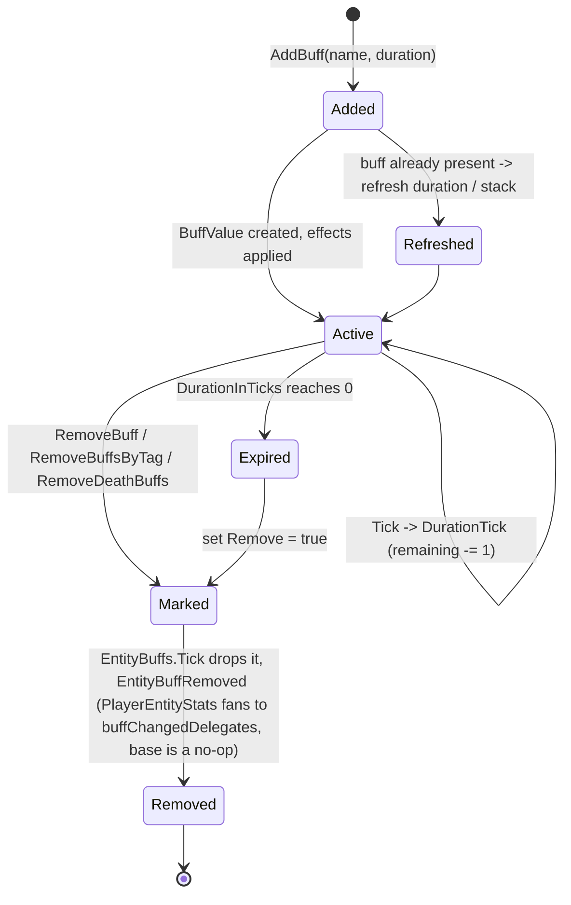
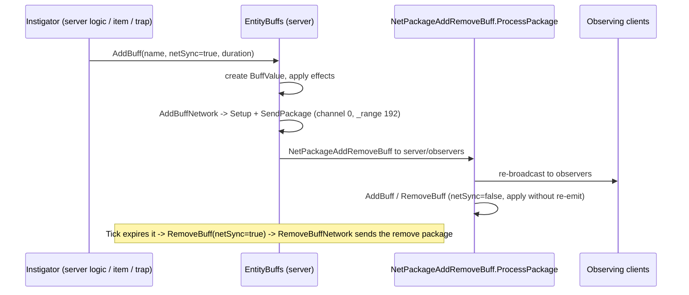

# Buffs and effects (dedicated V3.1.0)

**Owns:** the buff system that runs on server entities: `EntityBuffs` (per-entity
container + tick), `BuffValue` (a running instance), `BuffClass` (XML definition),
duration/stack/removal lifecycle, stat modifiers, and net sync.
**Not:** the individual buff/effect XML content (data); the `MinEvent` action
framework that triggers buffs (own doc / residual); stat math internals
(`EntityStats`).
**Evidence:** `EntityBuffs`, `BuffValue`, `BuffClass` IL (dump locally with
`tools/src/DumpMethod`, git-ignored). **Hub:** [`INDEX.md`](INDEX.md).
**Method:** [`re-methodology.md`](re-methodology.md).

Buffs tick on every alive server entity (players and zombies), so this is a
per-tick dedicated codepath ([entity-ai.md](entity-ai.md) calls into it via the
entity update).

---

## 1. Model

| Type | Role |
|---|---|
| `BuffClass` | The definition loaded from `buffs.xml`: `DurationMax`, effects/modifiers, tags, stack rule |
| `BuffValue` | A running instance on an entity: remaining `DurationInTicks`, `Update`/`Remove` flags, instigator |
| `EntityBuffs` | Per-`EntityAlive` container: the active `BuffValue` list, add/remove/query, and the `Tick` |
| `BuffManager` | Process-wide registry of `BuffClass` by name (case-insensitive) |
| custom vars | Named float variables (`AddCustomVar`/`GetCustomVar`) that buffs and MinEvents read/write (the "cvar" system) |

Each `EntityAlive` owns one `EntityBuffs`. Stat modifiers from active buffs are
applied through `GetModifiedValueData` (passive effects by `ValueSourceType` /
`PassiveEffects` + `FastTags`), which the stat system queries.

### 1.1 `BuffManager` (global definition table)

Static `BuffManager.Buffs` is a `CaseInsensitiveStringDictionary<BuffClass>`.

| Method | IL | Behaviour |
|---|---:|---|
| `AddBuff(BuffClass)` | 6 | `Buffs[buffClass.Name] = buffClass` |
| `GetBuff(String)` | 7 | `TryGetValue`; returns null if missing (pop success flag) |
| `Cleanup()` | 7 | `Clear` + null the static dictionary |

XML load (`BuffsFromXml`) fills this table; entity code resolves names through
`GetBuff` before constructing `BuffValue`s. Not per-entity; not per-tick.

---

## 2. Buff instance lifecycle (state machine)

`EntityBuffs.AddBuff` creates or refreshes a `BuffValue`.

**`AddBuff(name, instigatorPos, instigatorId, netSync, fromElectrical, duration)`
(IL=238) gates / `BuffStatus` returns:**

| Code | Meaning | When |
|---:|---|---|
| **0** | Success | applied or refreshed |
| **1** | Unknown buff | `BuffManager.GetBuff` null |
| **2** | Immune | `netSync` and `HasImmunity` |
| **3** | Friendly-fire block | damage-type buff fails `FriendlyFireCheck` |
| **4** | Editor reject | `!AllowInEditor` while world is editor |
| **5** | GameStat off | `RequiredGameStat != 81` and bool false |

**`HasImmunity(BuffClass)` (IL=63):** true if parent dead and buff
`RemoveOnDeath`; else if `EntityAlive.HasImmunity(buff)`; else roll against
passive **197** (`FastClamp01`, buff `NameTag`): immune when
`RandomFloat <= chance`. Infection-tagged buffs: if
`EntityPlayerLocal.InfectionChance == 0` force chance **1** (always immune);
else `chance *= (2 - InfectionChance)`.

**`EntityAlive.FriendlyFireCheck` (IL=2):** always **true**.

**`EntityPlayer.FriendlyFireCheck` (IL=77):** default true. If `other` is a
player and not self: read GameStats **23** (player-killing mode).

| Mode | Result for other players |
|---:|---|
| **0** | always **false** (block) |
| **1** | **true** iff ally (`PersistentPlayerData.IsAlly` or same party) |
| **2** | **true** iff **not** ally/party (strangers only) |
| other | leave default **true** |

Exceptions in the try path force **true**. Buff gate 3 / damage paths treat
**false** as block.

`fromElectrical` stashes original instigator into local and forces
`instigatorId = -1` for the rest of the path. Existing same-name buff: refresh
`DurationMax` / clear `Remove` / reset ticks; fire stack-related MinEvent
**4** (`onSelfBuffStack`) on duration/stack multiplier changes; optional
`AddBuffNetwork`. New buff: `new BuffValue(...)`, append `ActiveBuffs`, network
if requested. Start effects still land on next `Tick` via `Started` flag.

**`BuffValue.DurationTick` (IL=27):** `durationTicks++`; `updateTicks++`; when
`updateTicks >= BuffClass.UpdateRateTicks` set `Update=true` and zero
`updateTicks`.

**`BuffValue.Tick` (IL=13):** if class null mark `Remove`; else
`BuffClass.Tick(this)`.

**`BuffClass.Tick` (IL=15):** `DurationTick()`; if `DurationMax > 0` and
`DurationInSeconds >= DurationMax` set `Finished=true`.

**`BuffValue.get_DurationInSeconds` (IL=7):** `durationTicks / 20` (20 TPS).

Each server tick, `EntityBuffs.Tick` (**IL=179**) walks `ActiveBuffs`:

1. Drop `Invalid` entries via `RemoveAt`.
2. Bind `MinEventContext.Buff`; ensure `Other` = attack target if null.
3. If `Finished`: `FireEvent(MinEventTypes **2** = onSelfBuffFinish)`, set `Remove`.
4. If `Remove`: `FireEvent(**3** = onSelfBuffRemove)`; if not `Hidden`,
   `EntityStats.EntityBuffRemoved`; `RemoveAt`.
5. Else if not `Paused` and parent not dead:
   - if not `Started`: resolve instigator entity for context when id ≥ 0;
     `FireEvent(**0** = onSelfBuffStart)`; set `Started`; `EntityBuffAdded` +
     `EntityAlive.BuffAdded`.
   - `BuffValue.Tick()` (duration + update-rate).
   - if `Update`: `FireEvent(**1** = onSelfBuffUpdate)`; clear `Update`.

**`EntityBuffs.FireEvent(event, params)` (IL=30):** for each active buff with non-null
class and not `Paused`, `BuffClass.FireEvent`.

**`BuffClass.FireEvent` (IL=15):** no-op if `Effects` null; if `!canRun(params)`
return; else `Effects.FireEvent(eventType, params)`.

**`BuffClass.canRun` (IL=10):** same shape as action CanExecute: no Requirements
→ true; else `Requirements.IsValid(params)`.

**`MinEventActionBase.CanExecute` (IL=10):** if `Requirements` null → true; else
`Requirements.IsValid(params)`.

On the base `EntityStats`, `EntityBuffRemoved` is a **no-op** (`ret`); the real
work is in the `PlayerEntityStats` override, which fans the removal out to every
registered `IEntityBuffsChanged` in `buffChangedDelegates` (stat/UI recompute).



- **Instant buffs** apply their effect and expire immediately (zero/short
  duration); **timed buffs** count down at the sim rate.
- **`BuffValue.DurationTick` (IL=27):** `durationTicks++`; `updateTicks++`; when
  `updateTicks >= BuffClass.UpdateRateTicks`, set `Update=true` and reset
  `updateTicks` (drives periodic update MinEvents).
- **Death handling:** `OnDeath` runs `RemoveDeathBuffs(excludeTags)`, clearing
  buffs not tagged to persist through death.
- **Tag queries:** `HasBuffByTag` / `RemoveBuffsByTag` operate on `FastTags`, so
  effects and removals are tag-driven, not just name-driven.

---

## 3. Network sync

**`RemoveBuff(name, instigator, netSync)` (IL=56):** resolve class via
`BuffManager.GetBuff`; for each active with matching name set `Remove=true`;
if any marked and `netSync`, `RemoveBuffNetwork` (instigator defaults to
parent entityId when -1).

Buffs that matter to other clients are synced. `AddBuff`/`RemoveBuff` take a
`netSync` flag. **`AddBuffNetwork`/`RemoveBuffNetwork` are the send side, not the
receive side:** each builds a `NetPackageAddRemoveBuff` (`Setup(...)`) and calls
`ConnectionManager.SendPackage`/`SendToServer` (the literal `192` is the `_range`
argument, not a channel: the package has no `get_Channel` override so it rides
channel 0) without touching the
buff list itself (`EntityBuffs.AddBuffNetwork` IL=34). The **receive** path is
`NetPackageAddRemoveBuff.ProcessPackage`, which on the server **re-broadcasts** the
package to observers and then applies it via `AddBuff`/`RemoveBuff` with
`netSync=false` (so applying does not re-emit). So the server is authoritative: it
applies locally and relays to observers.



---

## 4. Dedicated relevance and residuals

- **Per-tick dedicated path:** every alive entity's `EntityBuffs.Tick` runs on the
  server; buff-driven stat changes are server-authoritative.
- **Residual / content:** `buffs.xml` effect definitions (data); the `MinEvent`
  action framework (`MinEventActionBuffModifierBase` and siblings) that triggers
  buffs from items/blocks/attacks (candidate for its own doc); `EntityStats` math.

---

## Network

Live buff replication uses `NetPackageEntityStatsBuff` (EntityBuffs.Write blob);
see [protocol-packages.md](protocol-packages.md) section 6.16 and
[entity-stats.md](entity-stats.md) section 5.

## Related docs

| Doc | Role |
|---|---|
| [entity-ai.md](entity-ai.md) | The entity update that ticks buffs |
| [server-lifecycle.md](server-lifecycle.md) | Player persistence (buffs saved with the profile) |
| [protocol-packages.md](protocol-packages.md) | Buff add/remove packages on the wire |
| [full-surface.md](full-surface.md) | Whole-assembly map |

## Changelog

- **2026-08-07:** DurationInSeconds ticks/20; BuffClass.Tick DurationMax Finished.
- **2026-08-07:** EntityPlayer FriendlyFireCheck GameStats 23 modes; HasImmunity
  passive 197; AddBuff status 0..5; Tick MinEvent 0/1/2/3.
- **2026-08-07:** `BuffManager` global registry (AddBuff/GetBuff/Cleanup) from IL.
- **2026-07-28:** NetPackageEntityStatsBuff pointer.

- **2026-07-23:** Initial buff-system reversal (EntityBuffs tick, BuffValue lifecycle, tag/death removal, net sync) with state machines.

## EntityBuffs.SetCustomVar signature (V3.1.0 b14)

```
EntityBuffs::SetCustomVar(String _name, Single _value, Boolean _netSync,
                          CVarOperation _operation, Boolean _forceSendToClients)  IL=130
```

`CVarOperation` (0 set, 1 setvalue, 2 add, 3 subtract, 4 multiply, 5 divide,
6 percentadd, 7 percentsubtract) and the `_operation` parameter are not new; they
exist on V3.0.1 too. The trailing `_forceSendToClients` net-sync control flag is
the V3.1.0 addition, which took the method from IL 126 to IL 130.
*Anchor:* `il/full-v3.1.0/_global/EntityBuffs.il.txt:1180`.

**Readers:** `EntityBuffs.GetCustomVar(name)` (IL=10) =
`CVars.TryGetValue` (case-insensitive dict) else **0**; `GetCustomVarId(name)`
(IL=3) = `name.GetHashCode()` (cvar ids are .NET string hash codes, like
`EntityClass.FromString`).
