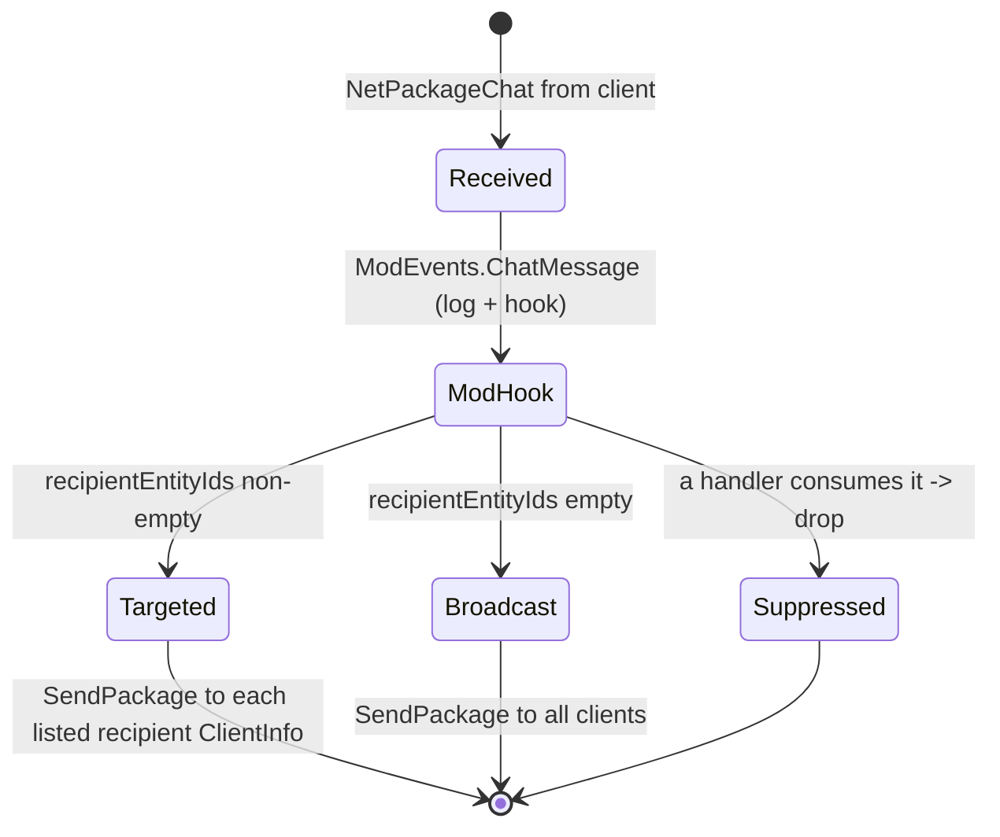

# Chat and system messages (dedicated V3.1.0)

**Owns:** the chat path on the server: the `NetPackageChat` wire body, channel
routing in `GameManager.ChatMessageServer`, the `EChatType` channels, and the
`EnumGameMessages` system-message types.
**Not:** the chat UI (client); Discord relay internals (external mod/integration);
console command execution ([console-commands.md](console-commands.md)).
**Evidence:** `NetPackageChat`, `GameManager.ChatMessageServer/Client`,
`EChatType`, `EnumGameMessages` IL (dump locally with `tools/src/DumpMethod`,
git-ignored). **Hub:** [`INDEX.md`](INDEX.md). **Method:** [`re-methodology.md`](re-methodology.md).

There is no separate `ChatManager`; chat is handled directly by `GameManager` plus
the `NetPackageChat` package, so this is a compact but genuine dedicated codepath.

---

## 1. Wire body (`NetPackageChat`)

`write` order (IL=63, little-endian; see [protocol-packages.md](protocol-packages.md) section 6.17 for
conventions):

```text
chatType          : u8    // EChatType
senderEntityId    : i32
msg               : string
msgSender         : u8    // EMessageSender
bbMode            : u8    // BbCodeSupportMode (rich-text policy)
recipientEntityIds: i32 count + count x i32
```

`Setup(chatType, senderEntityId, msg, recipientEntityIds, msgSender, bbMode)` fills
it. `ProcessPackage` on the server routes into `ChatMessageServer`; on a client it
routes into `ChatMessageClient` (display).

**EChatType channels:** `0 Global`, `1 Friends`, `2 Party`, `3 Whisper`,
`4 Discord`.

---

## 2. Server routing (state machine)

A client sends a chat `NetPackageChat`; `ChatMessageServer` (**IL=195**, server
only) escapes BB codes, runs interruptible `ModEvents.ChatMessage` (mods may
rewrite or suppress, "Chat handled by mod"), logs, then fans it out. The routing
decision is **recipient-list based, not channel based**: if the package carries a
non-empty `recipientEntityIds`, the server sends only to those clients' `ClientInfo`;
otherwise it broadcasts to all. The **`EChatType` value is carried through** for
the client to display the channel, but the server does **not** itself resolve
party/friends membership: the sender (client) supplies the recipient id list for
a party/whisper message. Non-server callers `SendToServer` the package.



The server carries `EChatType` and the sender-supplied `recipientEntityIds`
through; it does not re-derive channel membership. Command handling (a `/`-prefixed
message) is a separate path in the console system, not in `ChatMessageServer`
([console-commands.md](console-commands.md)); the Discord relay is external.

---

## 3. System messages (`EnumGameMessages`)

Non-chat notifications share the same display path with a message type:

| Value | Message |
|---|---|
| 0 | `PlainTextLocal` |
| 1 | `EntityWasKilled` (death notices) |
| 2 | `JoinedGame` |
| 3 | `LeftGame` |
| 4 | `ChangedTeam` |
| 5 | `Chat` |
| 6 | `BlockedPlayerAlert` |

Join/leave/kill notices are generated server-side (e.g. on
`PlayerSpawnedInWorld` / disconnect, see [server-lifecycle.md](server-lifecycle.md))
and delivered through the same client message path.

**`GameManager.GameMessage` (IL=61):** resolves entity names →
`GameMessageServer` → interruptible `ModEvents.GameMessage` →
`DisplayGameMessage` + `NetPackageGameMessage` fan-out (or log if mod handled).

---

## 4. Dedicated relevance and residuals

- **Dedicated path:** all routing and moderation happen on the server; the web
  dashboard and telnet can also inject/observe chat via the console.
- **Residual / external:** the Discord relay (external integration); the client
  chat UI and BbCode rendering; profanity/mute policy is config/mod-driven.

---

## Related docs

| Doc | Role |
|---|---|
| [console-commands.md](console-commands.md) | Command messages (chat starting with the command prefix) |
| [protocol-packages.md](protocol-packages.md) | Wire package conventions |
| [managers.md](managers.md) | `ModEvents` (the `ChatMessage` hook) |
| [server-lifecycle.md](server-lifecycle.md) | Join/leave system messages |

## Changelog

- **2026-08-07:** ChatMessageServer IL=195 + GameMessage IL=61 paths.

- **2026-07-28:** write IL=63 cross-link to protocol-packages 6.17.

- **2026-07-23:** Initial chat reversal (NetPackageChat wire body, server channel routing, system messages) with state machine.
