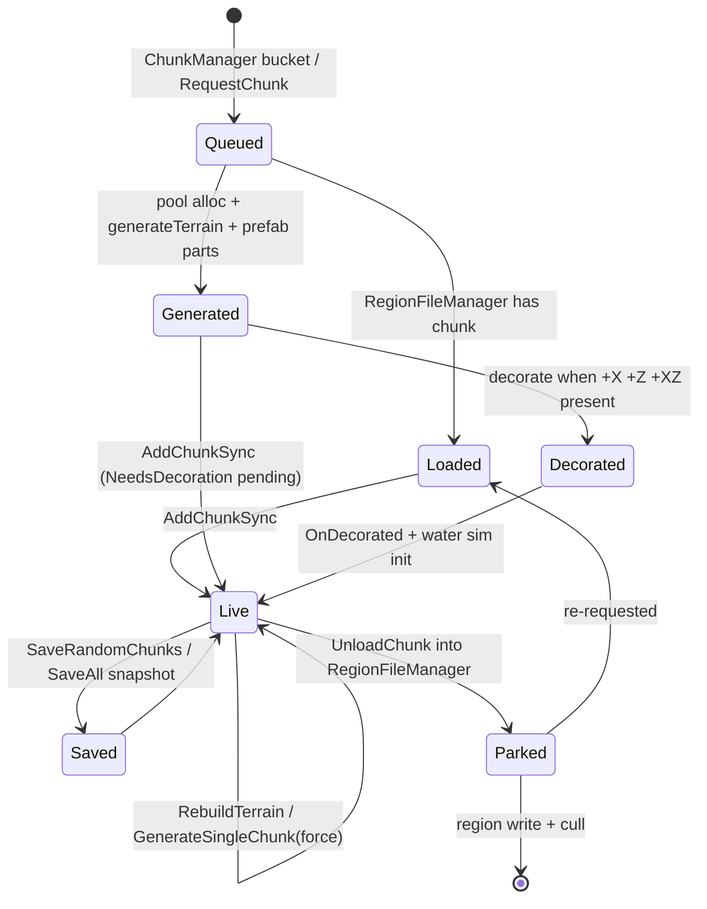
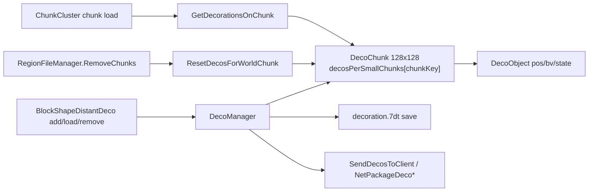

# Chunk providers and decoration (dedicated V3.1.0)

**Owns:** the `ChunkProviderAbstract` hierarchy (provider selection, the
GenerateChunks thread, chunk generate/decorate/save/unload driving) and the
decoration surfaces: in-chunk decorators via `DecoUtils`, plus the distant-deco
layer `DecoChunk` / `DecoObject`. Also the small support types
`ChunkCacheNeighborBlocks`, `ChunkBlockLayerLegacy`, `ChunkCoordinates`.
**Not:** the chunk cache / tick / send pipeline and the generateTerrain
trampoline internals ([`world-chunks.md`](world-chunks.md)); `RegionFileManager`
on-disk layout ([`save-region.md`](save-region.md)); RWG world creation
([`world-generation.md`](world-generation.md)); `DecoManager.UpdateTick` frame
cost ([`loop.md`](loop.md), [`loop-gmupdate.md`](loop-gmupdate.md)).
**Evidence:** `ChunkProvider*` IL (150 method bodies incl. nested coroutines and
`FromRaw/Bluff`), `DecoChunk`/`DecoObject`/`DecoUtils`/`ChunkCacheNeighborBlocks`/
`ChunkBlockLayerLegacy`/`ChunkCoordinates` (78 bodies), plus `ChunkCluster.Init`,
`World.LoadWorld`, `ChunkManager.GetNextChunkToProvide`,
`DecoManager.OnWorldLoaded`; dump locally with `tools/src/DumpMethod`
(git-ignored). **Hub:** [`INDEX.md`](INDEX.md).
**Method:** [`re-methodology.md`](re-methodology.md).

---

## 1. What a chunk provider is

`ChunkCluster` owns one `IChunkProvider` (field `ChunkCluster::ChunkProvider`).
The provider decides where chunk *contents* come from: read from region files,
generated from world data (heightmap + decorators), or received over the
network. Everything downstream (cache, lighting, stability, send) is
provider-agnostic and lives in [`world-chunks.md`](world-chunks.md).

`ChunkProviderAbstract` is a base of mostly no-op defaults, so each subclass
only implements what its source needs:

| Member | Base behavior (IL) | Meaning |
|---|---|---|
| `Init(World)` | empty coroutine | one-time async setup |
| `RequestChunk(x,z)` | `ret` (no-op) | ask for a chunk to exist |
| `Update()` / `StopUpdate()` | no-op | per-frame pump / thread stop |
| `UnloadChunk(Chunk)` | no-op | chunk leaves the live cache |
| `SaveAll()` / `SaveRandomChunks` | no-op | persistence flush / trickle save |
| `RebuildTerrain(...)` | no-op | regenerate terrain of live chunks |
| `ReloadAllChunks()` | no-op | drop and re-provide everything |
| `GetTerrainGenerator()` / `GetBiomeProvider()` | `ldnull` | height and biome oracles |
| `GetWorldExtent(out min,out max)` | returns false | authoritative bounds |
| `GetWorldBounds()` / `GetWorldSize()` | derived from `GetWorldExtent` | `BoundsInt` / `Vector2i(max-min+1)` |
| `GetChunkProtectionLevel(Vector3i)` | `ldc.i4.0` (None) | chunk-reset protection query |
| `FillOccupiedMap(...)` | empty coroutine | seeds the deco occupied map (§6.2) |
| `IsDecorationsEnabled` / `SetDecorationsEnabled` | `bDecorationsEnabled` field | gates POI/biome decoration |
| `GetProviderId()` | 0 (`None`) | persisted identity (§2) |

Interface-level call sites (FindCallers, dedicated-relevant):
`GameManager.gmUpdate → Update()`, `ChunkCluster.Init → Init()`,
`ChunkCluster.Save → SaveAll()`, `ChunkCluster.Cleanup → StopUpdate() + Cleanup()`,
`ChunkCluster.UnloadChunk → UnloadChunk()`, `GameManager.UpdateTick →
SaveRandomChunks(...)`, `World.RebuildTerrain → RebuildTerrain(...)` (reached
from `ConsoleCmdChunkReset`). Height/biome queries go through
`World.GetHeightAt → GetTerrainGenerator()` and `World.GetBiomeInWorld /
WorldEnvironment.DistantTerrain_GetBlockIdAt → GetBiomeProvider()`.

World-level consumers of the biome oracle: `World.IsPositionRadiated(pos)`
(IL=24) is `GetBiomeProvider().GetRadiationAt(x, z) > 0` (false when the
provider is null). `World.GetBiomeInWorld(x, z)` (IL=23) is
`GetBiomeProvider().GetBiomeAt(x, z)` (null without the cache/provider).
`World.GetBiomeIntensity(pos, out intensity)` (IL=28)
resolves the chunk and returns `chunk.GetBiomeIntensity(toBlockXZ(x),
toBlockXZ(z))` once the chunk exists and is not `NeedsLightCalculation`, else
`BiomeIntensity.Default` with false.

Chunk-side biome storage: `Chunk.GetBiomeIntensity(x, z)` (IL=16) reads the
`m_BiomeIntensities` byte array at the column offset `(x + z*16) * 6` (six
bytes per column; `BiomeIntensity.Default` when the array is null).
`ResetBiomeIntensity(v)` (IL=19) writes a value back at every 6-byte step.
`CalcDominantBiome()` (IL=55) histograms the 256 `m_Biomes` bytes into a
50-slot count array and stores the argmax as `DominantBiome`.
`Chunk.GetBiomeId(x, z)` (IL=9) / `SetBiomeId(x, z, id)` (IL=10) read and
write that per-column byte at `m_Biomes[x + z*16]`.
`Chunk.GetDecoAllowedSlopeAt(x, z)` (IL=6) reads the slope field of the deco
cell (`GetDecoAllowedAt(...).GetSlope()`);
`SetDecoAllowedSlopeAt(x, z, slope)` (IL=19) `EnsureDecoBiomeArray`s and
rewrites the cell with the new slope via `WithSlope`.
`EnsureDecoBiomeArray()` (IL=8) lazily allocates the 256-entry
`m_DecoBiomeArray` (one `EnumDecoAllowed` per column).
`GetDecoAllowedAt(x, z)` (IL=44) reads the cell and, when the cell allows big
deco but `DecoManager.GetDecoOccupiedAt` reports an occupied column (> 3 or 6),
downgrades the size field to 2. `SetDecoAllowedAt(x, z, val)` (IL=49) writes
after keeping the stricter slope / size / street-only fields of the old value.
The field readers `GetDecoAllowedSizeAt` / `GetDecoAllowedStreetOnlyAt` (IL=6
each) extract `GetSize()` / `GetStreetOnly()` from the cell. The field
writers `SetDecoAllowedSizeAt` / `SetDecoAllowedStreetOnlyAt` (IL=19 each)
`EnsureDecoBiomeArray` then read-modify-write through
`SetDecoAllowedAt(x, z, cell.WithSize(val))` / `.WithStreetOnly(val)`.

The `EnumDecoAllowed` cell is a packed byte: bits **0-1** = slope
(`GetSlope` IL=7: `v & 3`; `WithSlope` IL=7: `(v & -4) | slope`), bits
**2-3** = size (`GetSize` IL=7: `(v & 12) / 4`; `WithSize` IL=9:
`(v & -13) | (size * 4)`), bit **4** = street-only (`GetStreetOnly` IL=6;
`WithStreetOnly` IL=12 sets/clears bit 4). Size semantics: `AllowBigDeco`
(IL=5) is `size == 0`, `AllowSmallDeco` (IL=5) is `size < 2`, and
`IsNothing(EnumDecoAllowed)` (IL=10) is `slope >= 2 || size >= 2`.

Registry lookups: `WorldBiomes.GetBiome(Color32)` (IL=34) packs
`(r << 16) | (g << 8) | b` into the `m_Color2BiomeMap` key (null on miss);
`GetBiome(byte id)` (IL=5) indexes `m_Id2BiomeArr`; `GetBiome(string name)`
(IL=12) hits `m_Name2BiomeMap` (null on miss); `TryGetBiome(id, out bd)`
(IL=11) is the non-null test over the id array.

World-level bounds consumers: `World.IsPositionInBounds(pos)` (IL=66) builds a
`BoundsInt` from `GetWorldExtent` and answers `Contains(round(pos))`, with two
special cases: the shipped Navezgane map uses the fixed **±2900** block bounds
(`GamePrefs.GetString(33) == "Navezgane"`), and non-playtesting worlds inset
the extent by **90** blocks on x/z before testing. `ClampToValidWorldPos(pos)`
(IL=82) applies the same Navezgane / 90-inset bounds and clamps all three
components into them. `ClampToValidWorldPosForMap`
(IL=28) clamps a `Vector2` into the raw extent's x/z (no Navezgane / inset
special cases) and returns it as a `Vector3`.
`World.IsPositionWithinPOI(pos, offset)` (IL=15) is
`GetDynamicPrefabDecorator().GetPrefabFromWorldPosInsideWithOffset(x, z,
offset) != null`.

---

## 2. Provider selection

`EnumChunkProviderId`: `None=0, Disc=1, GenerateFromDtm=2, NetworkClient=3,
ChunkDataDriven=4, Random=5, Random2=6, FlatWorld=7`.

`World.LoadWorld` reads `WorldState.providerId` from `main.ttw` (the world
folder's header on first run, the save's copy afterwards; `WorldState..ctor`
defaults it to `Disc=1`). If this process is not the server it forces
`NetworkClient=3`. The id then goes to `World.CreateChunkCluster →
ChunkCluster.Init`, which switches on it:

| Id | Concrete type | Source | Dedicated relevance |
|---|---|---|---|
| 1 `Disc` | `ChunkProviderDisc` | world's own `/Region` files, fully preloaded | editor / playtest worlds; rare on dedi |
| 2 `GenerateFromDtm` | `ChunkProviderGenerateWorldFromImage` | `dtm.tga` image heightmap | legacy image worlds |
| 3 `NetworkClient` | `ChunkProviderGenerateWorldFromRaw(bClientMode=true)`, or `ChunkProviderDummy` when `ChunkCluster.IsFixedSize` | chunks arrive by net packages | **client only**, never on dedi |
| 4 `ChunkDataDriven` | `ChunkProviderGenerateWorldFromRaw` | `dtm.raw` + splats + biomes + POIs | **the dedicated workhorse** (Navezgane, RWG output) |
| 5/6 `Random`/`Random2` | none constructed | dead enum entries | vestigial |
| 7 `FlatWorld` | `ChunkProviderGenerateFlat` | procedurally flat chunks | `Empty`/`Flat` playtest worlds |

So a stock dedicated server hosting a real world always runs
`ChunkProviderGenerateWorldFromRaw`, which inherits nearly all behavior from
`ChunkProviderGenerateWorld` (§3). RWG creates the world files once
([`world-generation.md`](world-generation.md)); this provider then *consumes*
them at runtime forever after.

---

## 3. ChunkProviderGenerateWorld: the runtime engine

### 3.1 Init

`Init(World)` (coroutine `<Init>d__22`) creates the `DynamicPrefabDecorator`
and loads it from the world folder, creates and loads the `SpawnPointManager`,
then starts a dedicated thread named `GenerateChunks` via
`ThreadManager.StartThread(..., GenerateChunksThread, ...)`. Subclass Inits run
their file loading first and call this via `<>n__0` (§4). The constructor sets
`bDecorationsEnabled = true` and allocates `m_ChunkQueue`
(`HashSetList<long>`), `m_WaitHandle` (AutoResetEvent) and an empty
`m_Parameters` list (`ChunkProviderParameter` is never constructed anywhere;
`GetParameters` has no callers; both are vestigial).

`m_RegionFileManager` (created in the subclass Init over
`GameIO.GetSaveGameRegionDir()`) is both the save backend and a second
`WorldChunkCache`: chunks that leave the live cluster park there before being
written ([`save-region.md`](save-region.md)).

### 3.2 Request and generate

`RequestChunk(x,z)` only enqueues `WorldChunkCache.MakeChunkKey(x,z)` into
`m_ChunkQueue` under its sync root and sets `m_WaitHandle`; in `bClientMode` it
returns immediately. Almost nothing calls it: the only external caller is
`TerrainMapGenerator.GenerateTerrain` (map rendering). The real demand signal
is player-position streaming via `ChunkManager.GetNextChunkToProvide` (IL=102),
not `RequestChunk`. Algorithm (verified):

1. Under `lockObject`, copy `m_AllChunkPositions.list` into
   `allChunkPositionsCopy` and capture count (list is the ring-flattened order
   from `DetermineChunksToLoad`, [world-chunks.md](world-chunks.md) section 4.0.1).
2. Walk that snapshot in order; return the first key where
   `!ChunkCache.ContainsChunkSync(key)` (nearest rings first because
   `BucketHashSetList.Recalc` walks buckets 0..n).
3. Else, if the provider exposes `GetRequestedChunks()` as a non-null
   `HashSetList<long>`, under that list's lock: if non-empty, **pop the last**
   element (`Remove` + return), else fall through.
4. Else return sentinel `Int64.MaxValue` (`0x7FFFFFFFFFFFFFFF`).

`World.GetNextChunkToProvide` (IL=4) is a one-liner trampoline to the manager.

`GenerateChunksThread` (IL=36): until termination, call
`World.GetNextChunkToProvide()`; if sentinel, try
`DynamicMeshThread.GetNextChunkToLoad()` (IL=18): if `RequestThreadStop` or
`nextChunks` empty / dequeue fail → same `Int64.MaxValue` sentinel; else
`ConcurrentQueue<long>.TryDequeue`. If still sentinel, **return 15**
(ms sleep). Otherwise `GenerateSingleChunk(cc, key, forceRebuild=false)` and
return **0** (no sleep). Missing `m_RegionFileManager` also returns 15.
DynamicMesh enqueues into `nextChunks` from its generation thread
([dynamic-mesh.md](dynamic-mesh.md) `SetNextChunkToLoad`).

Each key goes to `GenerateSingleChunk(cc, key, _forceRebuild=false)` (IL=171):

1. Skip if the cluster already has the chunk.
2. If `m_RegionFileManager` has it parked, take that instance (region-loaded
   chunks re-enter the live cluster without regeneration).
3. Otherwise allocate from `MemoryPools.PoolChunks`, set X/Z, derive a
   `GameRandom` from `Utils.RandomFromSeedOnPos(x, z, world.Seed)` and call
   `generateTerrain(world, chunk, rnd)`, the trampoline into
   `ITerrainGenerator.GenerateTerrain` (heights + base blocks,
   [`world-chunks.md`](world-chunks.md) §3, [`terrain-height.md`](terrain-height.md)).
4. If decorations are enabled: set `NeedsDecoration` and
   `NeedsLightCalculation`, then `DynamicPrefabDecorator.DecorateChunk` copies
   any dynamic prefab parts overlapping this chunk. If disabled: clear both
   flags and mark `NeedsRegeneration`.
5. `AddChunkSync` into the cluster (with upgradeable lock in the rebuild case);
   on failure the pooled chunk is freed back.
6. On success: if already fully decorated, `OnChunkSyncedAndDecorated`
   (registers the chunk with `WaterSimulationNative`); then
   `updateDecorationsWherePossible(chunk)` which calls `tryToDecorate` on the
   chunk and its (x-1,z), (x,z-1), (x-1,z-1) neighbors. With
   `_forceRebuild=true` (chunk reset path) it additionally sets `isModified`.

### 3.3 Decoration of a generated chunk

`tryToDecorate` runs `decorate(chunk)` only when `NeedsDecoration` is set and
the chunk is not locked. `decorate` needs the +X, +Z and +X+Z neighbors to be
present (overlap-safe placement window); it then:

- flags all four chunks `InProgressDecorating`,
- `updateDecosAllowedForChunk`: per column computes sub-voxel corner heights
  from density, a terrain normal from the cross product of the X/Z tangents,
  writes `SetTerrainNormal`, and classifies slope:
  normal.y < 0.55 → `EnumDecoAllowedSlope.Steep`, < 0.65 → `Sloped`. Columns at
  terrain height ≥ 253, or with water at/above the surface, get
  `SetDecoAllowedAt(..., EnumDecoAllowed.Nothing)`,
- runs every `IWorldDecorator` in `m_Decorators` via
  `DecorateChunkOverlapping(world, chunk, +XZ neighbors, seed)`. For the
  FromRaw provider that list is `WorldDecoratorPOIFromImage` (stamps POI prefab
  blocks from `poi_processed` data) then `WorldDecoratorBlocksFromBiome`
  (biome-driven trees/rocks/plants, using `DecoUtils`, §6.1),
- `Chunk.OnDecorated`, `ResetStability`, `RefreshSunlight`, clears
  `NeedsDecoration`, sets `NeedsLightCalculation`, clears the four
  `InProgressDecorating` flags, and calls `OnChunkSyncedAndDecorated`.

`UpdateDecorations(Chunk)` is a public wrapper over `decorate` used by
`ChunkManager.task_Lighting`, so late-arriving neighbors get their pending
decoration on the lighting worker rather than only at generation time.

`WorldDecoratorBlocksFromBiome.DecorateChunkOverlapping` (IL=245) is the
biome-deco driver, guarded by its own `rwlock` write lock. It builds a
per-chunk seeded `GameRandom` via `Utils.RandomFromSeedOnPos(chunk.X, chunk.Z,
seed)`, lazily creates `resourceNoise = new PerlinNoise(seed)`, clears the
`biomePositions[biomeId]` cell buckets, then resolves a `BiomeDefinition` per
cell into the linear `chunkBiomes[x + z*16]` array: cells inside a trader area
(`prefabDecorator.IsWithinTraderArea` / `GetTraderAtPosition`) are stored as
null; a liquid `GetPOIBlockIdOverride` falls back to the `underwater` biome;
otherwise `biomeProvider.GetBiomeAt(wx, wz)` (a null biome aborts the whole
chunk), the cell is bucketed into `biomePositions`, and the sub-biome fold
runs `GetSubBiomeIdxAt(biome, wx, terrainHeight, wz)` when the index is >= 0.
`GetSubBiomeIdxAt` (IL=79) walks the biome's `subbiomes` and returns the first
index whose `noiseMin <= v < noiseMax`, where
`v = noiseGen.FBM(x + noiseOffset.x, z + noiseOffset.y, noiseFreq) * 0.5 +
0.5` (mapping the [-1, 1] noise to [0, 1]); the FBM result is cached per
`(noiseFreq, noiseOffset)` pair, and the `y` argument is unused (the field is
2D over x/z). No match returns -1. `GetBiomeOrSubAt(x, z)` (IL=24) is the
convenience wrapper: `GetBiomeAt(x, z)`, then `GetSubBiomeIdxAt(biome, x, 0,
z)` (the y slot hard-coded to 0) and the sub-biome substitution when the index
is >= 0.
It finishes with `decoratePrefabs` then `decorateSingleBlocks`, and logs
`DecorateChunkOverlapping` errors with the current `GameManager.frameCount`.
`decorateSingleBlocks` (IL=56) walks the 16x16 cells, skips null trader cells
and `terrainHeight + 1 >= 255` columns, and calls `decorateSingleBlock` at
`Vector3i(x, height + 1, z)`.

`decorateSingleBlock` (IL=139) is the per-cell gate that reaches
`decorateSingleBlockTryPlaceDeco` (§6.1): the cell must be air (the block
above must be air too, and the block below solid: air-above-with-air-below
returns), must not be `StreetOnly`, must not be `IsNothing` when dry, and a
wet cell requires water above as well. It reads
`chunkBiomes[x + z*16]`, `chunk.GetWorldPos()` and `GetTerrainNormalY(x, z)`,
then walks that biome's `m_DecoBlocks` entries, returning as soon as one
placement attempt succeeds.

`decoratePrefabs` (IL=403) is the biome-prefab path of the same decorator
(the `BiomePrefabDecoration` entries of each biome's `m_DecoPrefabs`). Per
cell bucketed in `biomePositions` it picks a random entry
(`RandomRange(Count)`), keeps it on `RandomFloat() <= prob`, and applies the
`IsNothing`/`StreetOnly`/slope gates (`slope >= 1` when not
`isDecorateOnSlopes`, `>= 2` when it is). It resolves the prefab via
`world.m_PrefabCache.GetPrefab(name, true, true, false, false)` (missing ->
`Log.Error("Prefab with name '<name>' not found!")` and skip), requires the
footprint origin plus `size/2` to stay inside the chunk, computes
`height = GetTerrainHeight(x + size.x/2, z + size.z/2) + 1`, applies the same
`checkResourceOffsetY` ore-noise gate (with `prefab.yOffset` on the floor
height), and requires the landing cell air with a solid, non-`water` block
below. The footprint is then validated cell-by-cell across the neighbor
chunks (routed by quadrant, local coords via `World.toBlockXZ`): any
`IsNothing`/`StreetOnly` cell fails, `!AllowBigDeco` fails for prefabs with
`size.x > 1 || size.z > 1`, per-cell slope gates apply, ground must match
`height - 1`, and `GetHeight + prefab.size.y` must stay below 255. A fit rolls
`rotation = RandomRange(4)` (clone + `RotateY(true, rot)` when non-zero) and
places via `prefab.CopyIntoLocal(world.ChunkCache, pos, false, false,
FastTags.none)` then `prefab.SnapTerrainToArea`.
`Prefab.SnapTerrainToArea(cluster, pos)` (IL=65) walks `dx`/`dz` from -1 to
`size.x`/`size.z` and calls
`cluster.SnapTerrainToPositionAtLocal(pos + (dx, -1, dz), true, perimeter)`
where `perimeter` marks the -1 and size+1 border cells, so the terrain is
snapped under the whole footprint plus a 1-cell rim. The local/RPC wrappers
are stubs; the engine is `ChunkCluster.snapTerrainToPosition(world, pos,
liftUp, halfDensity)` (IL=113): for a non-terrain cell it returns unless
`liftUp` and the cell is air with terrain below, then places the below block
and clamps the density; for a terrain cell it returns when the cell above is
`IsTerrainDecoration`, else raises the density. The density target is
`MarchingCubes.DensityTerrain` (or half when `useHalfDensity`), and a non-null
`world` routes writes through `SetBlockRPC`.
`SnapTerrainToPositionAroundRPC` (IL=49) requires the cell itself to be
terrain and then runs `snapTerrainToPosition` on the four cardinal neighbors
(`liftUp=false`, `halfDensity=true`), normalizing the border density around a
placed block.

`WorldDecoratorPOIFromImage.DecorateChunkOverlapping` (IL=472) is the static
POI stamping from the `poi_processed` color map. It warns and returns when any
neighbor chunk is missing, seeds a chunk-local `GameRandom` like the biome
decorator, and per non-trader cell whose `m_Poi.GetData(wx, wz)` color is
non-zero/non-255 resolves a `PoiMapElement` via `getPoiForColor`
(`m_PoiMap.TryGetValue`, null on miss; `AddPoiMapElement` registers it
first-wins by `m_uColorId`). Non-water
elements first stamp `SetDecoAllowedStreetOnlyAt(x, z, true)`; `yPos` defaults
to `m_YPos` (or the terrain height when negative). Air elements with a
non-empty `m_sModelName` take the prefab path
(`PrefabCache.GetPrefab(name, true, true, false, false)` +
`CopyIntoLocal(ChunkCache, (wx, yPos, wz), false, false, FastTags.none)`,
gated on `!IsNothing(decoAllowed)`). Block elements: a random decal is applied
(`GetRandomDecal`, only when `GetTerrainNormalY >= 0.98` and the face-adjacent
cell is air), the base `m_BlockValue` is written when the target is air or a
terrain-on-terrain match, water elements fill `yPos` down to `m_YPosFill`
with `SetWater(WaterValue.Full)` on `CanWaterFlowThrough` cells (non-water
fills with the block on air cells), `m_BlockBelow` replaces the base when the
existing shape is terrain, and with `bChangeWaterDensity` the fill also stamps
`SetDensity(MarchingCubes.DensityAir)` on non-terrain shapes. Finally
`GetRandomBlockOnTop` picks the top decoration: `offset == 0` requires the
cell above air, `BlockPlaceholderMap.Replace` (y=0, unless `IsEditor`)
resolves it, and it lands via `DecoUtils.CanPlaceDeco`/`ApplyDecoAllowed` +
`OnBlockPlaced` + `SetBlockRaw` (or `SetBlock` for tile-entity blocks).
`PoiMapElement.GetRandomBlockOnTop` / `GetRandomDecal` (IL=26 each) walk
their `blocksOnTop` / `decals` lists and return the first entry whose
`m_Prob > RandomFloat()` (null on miss); `GetDecal(index)` (IL=15) is a
bounds-checked accessor.

The provider's water support: `LoadWaterInfo(filename)` (IL=127) parses an XML
file of `<Water>` child elements (case-insensitive) into `WaterInfo { pos,
minX, maxX, minZ, maxZ }` (`pos` via `ParseVector3i`; bounds via `int.Parse`,
defaulting to `-intMax`/`intMax`), returning null when the file is missing.
`GetWaterChunks16x16` (IL=9) exposes the precomputed `water16x16Chunks` byte
map and its width (used by `World.LoadWorld`); `InitData()` (IL=6) is only a
coroutine stub returning the `<InitData>d__15` state machine.

The `<InitData>d__15` coroutine (MoveNext IL=774) builds the POI map and the
water mask: it allocates `poiCols : GridCompressedData<Byte>` at
`worldSizeX*scale` x `worldSizeZ*scale` (16x16 cells) plus
`water16x16Chunks = byte[(w/16) * (h/16)]` and `water16x16ChunksW`, loads
`water_info.xml` into the `waterSources` list, registers a default
`PoiMapElement` (id **5**, `terrDirt` blocks) via `AddPoiMapElement`, requires
`splat4Tex` to be `TextureFormat` 5 (else it throws
`splat4Tex was not in the correct format. Expected: {0}, Actual: {1}`), runs
`GameUtils.WaterFloodFill` over the poi grid into the water mask, loads
`splat3.png`/`.tga` (format error `World's splat3 file is not in the correct
format (needs to be either RGBA32 or ARGB32)!`), and finally wraps the result
as `m_Poi : WorldGridCompressedData<Byte>`.
`WorldGridCompressedData.Contains(x, y)` (IL=25) is the `MinPos`/`MaxPos`
bounds test; `GetData(x, y)` (IL=18) folds world coords through
`colors.GetValue(x + addXOffs + sizeXHalf, y + addYOffs + sizeYHalf)`.

`WaterFloodFill` (IL=196) is the BFS water-mask builder: a cell whose terrain
height is below `maxY + 1` is marked `cols.SetValue(x, z, colWater)` and its
16x16 chunk cell
`waterChunks16x16Height[(x/16) + (z/16) * (width/16)] = (byte)maxY` is
written; the queue expands to the four neighbors within the box, skipping
already-filled cells and stopping at a 100000-cell cap.

**`WorldBlockFiller`** is the per-chunk biome deco sprinkler invoked by
`WorldDecoratorBlocksFromBiome`. Its `m_BlocksToFill : Byte[]` is a flat
16x16x256 grid indexed `((x << 4) | z) << 8 | y`; **255** means "untouched".
`resetBlockInformation` (IL=41) fills the grid with 255 and inverts the bounds
(`m_iMinX/Z = 16`, `m_iMaxX/Z = 0`, `m_iMinY = 256`, `m_iMaxY = 0`), zeroing
`m_iFillCount`/`m_iAreaCount`. `setBlockToFill(x, y, z, top)` (IL=81) expands
the bounds to include the cell, stores `top`, bumps `m_iFillCount`, and bumps
`m_iAreaCount` only when `y == 0` (per-column registration; the caller passes
the surface height as the `top` byte). `fillChunk(chunk)` (IL=66) no-ops when
`m_iAreaCount == 0`, resolves the biome from `m_GenRules` by `m_iThisBiomeColorId`
(`TryGetValue`; no biome -> no-op), then runs `fillLevel(chunk, deco, -1, ref
available)` for every `BiomeDefinition.m_DecoBlocks` entry. The trailing walk
over `m_Layers` only reads each `m_Depth` and never calls `fillLevel`, so the
layer-resource fill is inert in this build.

`fillLevel(chunk, deco, layerDepth, ref availableCount)` (IL=192) computes
`areaCount = (int)(m_iAreaCount * deco.prob)` attempts. Each attempt picks a
random (x, z) in bounds and reads the y=0 column marker: an untouched column
(255) makes the **first** pick return immediately while later picks re-roll.
It then calls `setDecorationBlock(chunk, x, marker, layerDepth, z,
clusterProb, deco.blockValues[0])`, subtracts the returned placed count from
`availableCount` and `areaCount`, and keeps re-picking while both are >= 0;
it logs `did not find spot to place decoration` when the above-surface cell is
already filled. `setDecorationBlock(chunk, x, y, d, z, probability, blockValue)`
(IL=152) picks the placement depth `v = d < 0 ? d : RandomRange(0, d)` (so deco
blocks, `d = -1`, sit at `y + 1` = just above the surface marker, while layers
dig a random depth below it), bails out with 0 when `v >= y`, and with
`probability <= 0` writes only the center `SetBlockRaw(x, y - v, z, blockValue)`.
With `probability > 0` it first prob-gates a 3x3 (x z) neighborhood, extended
to three depth layers when `d > 1`, each cell clamped to the chunk and written
when `RandomDouble < probability`, then the unconditional center write (a gated
hit on the center therefore writes it twice). It returns the number of blocks
written and stamps every written cell back to 255.

### 3.4 Rebuild, reset, protection

`RebuildTerrain(chunks, areaStart, areaSize, stopStability, regen, fillEmpty,
isReset)` iterates live chunks by key and calls the 7-arg `generateTerrain`
with the same seeded `GameRandom`, optionally marking `NeedsRegeneration`.
Reached from `World.RebuildTerrain` (console `chunkreset`, editor tools).

Chunk reset is region-file based: `RequestChunkReset`, `ResetAllChunks`,
`ResetRegion`, `RemoveChunks`, `IterateChunkExpiryTimes` and
`GetChunkProtectionLevel` all forward to `m_RegionFileManager`.
`ChunkProtectionLevel` is a flag set (bedrolls, land claims, traders, vehicles,
backpacks, `CurrentlySynced`, ...). Dedicated callers:
`GameManager.ResetUnprotectedChunksOnLoad`, `ChunkResetCommandHelpers`,
`GameEvent ActionResetRegions`, `QuestEventManager.FinishTreasureQuest`
(resets the dug-up chunk), with `GameManager.UpdateTick` refreshing the
protected-position cache via `MainThreadCacheProtectedPositions`.
`ConsoleCmdChunkReset` and the reset helpers re-generate in place through
`GenerateSingleChunk(cc, key, true)`.

### 3.5 Save and unload

- `UnloadChunk(Chunk)`: server mode parks the chunk in `m_RegionFileManager`
  (`AddChunkSync`), whose own update/cull writes it out; client mode just frees
  it to the pool.
- `SaveAll()`: editor saves prefab decorator + spawn points; game mode
  `RegionFileManager.MakePersistent(ChunkCache, false)` + `WaitSaveDone`, then
  `EventPrefabs.Save`. Driven by `ChunkCluster.Save` from `GameManager.SaveWorld`
  ([`save-region.md`](save-region.md)).
- `SaveRandomChunks(count, worldTicks, activeSet)`: per tick from
  `GameManager.UpdateTick`; scans the active chunk set for chunks that need
  saving, are fully decorated and lit, were last saved more than 400 world
  ticks ago, and pass a 30 % random gate; snapshots via
  `RegionFileManager.SaveChunkSnapshot` under the chunk lock with
  `InProgressSaving` set.
- `Update()` pumps `m_RegionFileManager.Update()` each frame (from
  `gmUpdate`); `Cleanup()` stops the thread, then cleans spawn points, the
  region manager and `MultiBlockManager`.
- `ReloadAllChunks()` clears `m_ChunkQueue` and the region-manager cache;
  subclasses reload their heightmap first and re-`Init` their terrain
  generator (debug UI reload).

### 3.6 Lifecycle

---

## 4. The concrete providers

### 4.1 ChunkProviderGenerateWorldFromRaw (id 4, the dedicated one)

`Init` (coroutine `<Init>d__17`, which yields **base `Init` first**, as state 0 via
`<>n__0`, before its own work; the GenerateChunks thread's `m_RegionFileManager == null`
guard corroborates that ordering) is the world
load path a dedicated server runs at startup:

- `GameUtils.WorldInfo.LoadWorldInfo` from the world folder
  (`ChunkProviderAbstract.WorldInfo` property).
- Heightmap: prefers `dtm.raw`; converts `dtm.tga` (via
  `HeightMapUtils.ConvertDTMToHeightData`) or `dtm.png` on first run and saves
  a `.raw`; wraps it in a `HeightMap` (ushort backed array) consumed by
  `TerrainFromRaw.Init(heightMap, biomeProvider, seed)`.
- `calcWorldFileCrcs` + `filesNeedProcessing`/`processFiles`: CRC bookkeeping
  (also served to clients through `NetPackageWorldInfo.PrepareWorldHashes`).
  `calcWorldFileCrcs` (IL=9) is a coroutine stub; `filesNeedProcessing`
  (IL=32) returns true when the dtm filename does not end in `_processed`,
  when any of `splat3_processed.png` / `splat4_processed.png` /
  `splat3_half.png` / `splat4_half.png` is missing, or when
  `verifyFileHashes` fails.
  `generateHalfResTexture(tex)` (IL=27) builds a `width>>1` x `height>>1`
  texture from mip level 1 (error + source fallback when `mipmapCount < 1`);
  `GetProviderId()` returns **4**; `ARGB32ToColor` (IL=10) is a plain
  `Color32(r, g, b, a)` copy.
- `WorldBiomeProviderFromImage` from `biomes.png`, splat control textures
  (`splat3/splat4_processed.png`, half-res variants, Burst `RoadSmooth`),
  water data (`GetWaterChunks16x16` used by `World.LoadWorld`).
- `m_Decorators = [WorldDecoratorPOIFromImage, WorldDecoratorBlocksFromBiome]`.
- `RegionFileManager` over the save's region dir, `EventPrefabs`,
  `MultiBlockManager.Initialize`.

Overrides: `GetWorldExtent`/`GetWorldSize` from heightmap dimensions × scale
(world Y extent 0..255), `GetHeight` (used by `FlatAreaManager`),
`GetPOIBlockIdOverride`/`GetPOIHeightOverride` (POI color map lookups feeding
distant terrain), `GetChunkProtectionLevel` → region manager, and
`FillOccupiedMap` (§6.2) including nested `Bluff` heightmap stamps that
modify the terrain heightmap at biome-chosen spots.
`GetPOIBlockIdOverride(x, z)` (IL=51) resolves the `m_Poi` color (0 when the
decorator, cell, or element is missing; 255 = empty) to a `PoiMapElement`
and returns its `m_BlockValue.type`, except with `bFixedWaterLevel` where
liquid elements return 0. `GetPOIHeightOverride(x, z)` (IL=66) divides world
coords by `worldScale` for the lookup and returns `m_YPosFill` (the water
fill height) **only** for liquid elements, else 0.
`GetChunkProtectionLevel` (IL=5) delegates to
`m_RegionFileManager.GetChunkProtectionLevelForWorldPos`; `GetHeight(x, z)`
(IL=27) is `heightMap.GetAt` with a `Get Height Error x: {0} z: {1}` catch
falling back to 0; `GetWorldSize` (IL=12) is
`Vector2i(heightMapWidth * heightMapScale, heightMapHeight * heightMapScale)`.

`loadSplatMaps(levelName, worldWidth)` (IL=883) builds the surface-channel
map that `GetTopmostBlockValue` (§3.1) later switches on. It resolves the
world path and requires `splat1.png` (missing -> return), loads `splat1`
plus `splat2`/`splat3` when present (each texture adds **4** to
`cntSplatChannels`), sets `splatW = texture width` and
`splatScaleDiv = worldWidth / splatW`, and fills `splatMapMaxValue : Byte[]`
(pixel-count sized). Per pixel it reads the three textures' `Color32` and runs
a dominance chain assigning the channel whose byte is `>=` all other 11
channel bytes: 0..3 = `splat1` RGBA, 4..7 = `splat2` RGBA, 8..11 = `splat3`
RGBA (ties fall to the earliest channel; an all-zero pixel yields 0).
`ProcessColor(Color32/ColorARGB32)` (IL=22 each) is the same idea in
miniature: last non-zero channel, `g`->1, `b`->2, `r`->3, else 0. `InitData()`
(IL=6) is only a coroutine stub returning the `<InitData>d__23` state
machine; the actual deferred init runs there.

The `<InitData>d__23` coroutine (MoveNext IL=315) drives the map loads: it
loads `biomes.tga` else `biomes.png`, sets `biomeMapWidth/Height` and their
halves from the texture, logs `Biomes image size w=.., h = ..`, builds
`m_BiomeMap` via `new BiomeImageLoader(biomesTex, WorldBiomes.GetBiomeMap())
.Load()` (itself a coroutine), sets
`biomesScaleDiv = worldSize / biomesTex.width` (so `GetBiomeAt`'s fold is the
world scale over the image scale), destroys the texture, seeds
`noiseGen = new PerlinNoise(GetStableHashCode(worldName))`, then loads
`radiation.png` else `radiation.tga`: when present it sets
`radiationMapSize = texture width` and `radiationMapScale = worldSize /
radiationMapSize`. A texture within **512x512** fills
`radiationMapSmall : Byte[]` with the **red channel** of each pixel (the
array `GetRadiationAt` indexes); a wider texture is skipped with
`Log.Out("Radiation ignored {0}", radiationMapSize)` and destroyed. The
general tiled machinery (`LoadRadiationMap` IL=8 /
`LoadRadiationMapToFile` IL=24) instead builds a `TileArea`/`TileAreaCache`
of 512x512 tiles via `RadiationTileArrayFromTexture` (IL=50) /
`RadiationTileArrayFileFromTexture` (IL=37), per-pixel through the
`ProcessColor` channel fold and a `FileBackedArray`/`TileFile` backing, but
that path is not what the runtime InitData uses.
`FillRadiationResult` (IL=83) / `FillRadiationFileBackedArray` (IL=104) are
the fill loops: the first allocates a `byte[512,512]` per tile and writes
`processColor(radPixs[(tz*512+py) * radiationMapSize + tx*512+px])`; the
second lays tiles row-major in the file-backed array
(`offset = (tz*512*512*radiationTilesX + tx*512*512)`, span 262144) and fills
each `span[py*512+px]`.

`BiomeImageLoader` turns `biomesTex` into the byte map: `Load()` (IL=7) is a
coroutine stub for `<Load>d__11` (MoveNext IL=229), which resets `isError`/
`lastBiomeValue`/`biomeId` (255), grabs the pixels as a
`NativeArray<BiomePixel>` via `GetPixelData<BiomePixel>(0)`, and walks the
`GridCompressedData` block grid: per block it converts the corner pixel with
the `toBiomeValue` delegate (`BiomeValueFromARGB32` packs `(c2<<16)|(c3<<8)|c4`,
`BiomeValueFromRGBA32` packs `(c1<<16)|(c2<<8)|c3`), maps it through
`GetBiomeId` (a cached `TryGetValue` on the color-keyed biome dictionary that
keeps the last lookup's id on miss), then stamps `SetSameValue` for the whole
block and `SetValue` per pixel. The work is frame-sliced with a
`MicroStopwatch` and yields between blocks. `BiomeIdToColor32(value)` (IL=23)
unpacks a value into `Color32((value>>16)&255, (value>>8)&255, value&255, 0)`.

The splat/texture work runs on dedicated too (textures are loaded and
compressed); only their rendering is client work.

### 4.2 ChunkProviderGenerateWorldFromImage (id 2, legacy)

Same skeleton but `loadDTM` fills an `ArrayWithOffset<byte>` from `dtm.tga`
and drives `TerrainFromDTM`. Its `GetPOIHeightOverride` resolves POI colors via
`WorldBiomes.getPoiForColor` (fill height, liquid handling). Kept for old
image-based worlds; current worlds ship id 4.

### 4.3 ChunkProviderDisc (id 1)

Load-from-region, whole-world-resident: Init builds a `RegionFileManager` over
the world's own `/Region` folder (or the save copy), then loads *every* chunk
up front (`GetAllChunkKeys` loop, `FillBiomeId`, `AddChunkSync`), loads the
prefab decorator (`CopyAllPrefabsIntoWorld`) and spawn points; playtest mode
instead loads a single `Prefab` into a cleared cluster. No `RequestChunk`, no
generation, no streaming; `SaveAll` writes regions back (editor path also
exports to `Data/Worlds`). This is the world-editor / playtest provider; a
dedicated server only uses it for fixed-size worlds that ship regions.

### 4.4 ChunkProviderGenerateFlat (id 7)

Playtest flat world: generates uniform flat chunks (plus optional playtest
prefab) and implements `RebuildTerrain` directly (IL=210) without a region
manager. On Init it deletes only the stale **`decoration.7dt`**; the save region
directory is merely `Exists`-checked (to gate the playtest-prefab branch), never
deleted.

### 4.5 ChunkProviderDummy (id 3, client-only)

The network-client receiver for **fixed-size** clusters (`ChunkCluster.IsFixedSize`
from WorldInfo `fixedSizeCC=true`): no generation at all, `UnloadChunk` frees to
the pool, chunks arrive via net packages only. **Does not** load DTM, biomes, or
**splat control textures**. Together with `bClientMode=true` FromRaw (the
non-fixed-size client case) this branch never executes on a dedicated server.

**Terrain MicroSplat implication (zdtd 2026-08 playtest, V3.1.0 client):** if a
clone advertises `fixedSizeCC=true` for Navezgane, the client installs Dummy and
never fills `ChunkProviderGenerateWorldFromRaw.splats[]`.
`VoxelMeshTerrain.ConfigureTerrainMaterial` still runs when
`World.IsSplatMapAvailable` (level name set), binds null `_CustomControl0/1`, and
the terrain floor renders **uniform grey clay** despite correct block ids on the
wire. Stock maps with `splat*.png` under `Data/Worlds/<name>` need
`fixedSizeCC=false` so NetworkClient selects FromRaw(bClientMode) and loads
splats locally (client log: `GenWorldFromRaw splats took …ms`). See
`protocol-packages.md` §4.2 `fixedSizeCC`.

---

## 5. Distant decoration layer: DecoManager, DecoChunk, DecoObject

This layer is separate from §3.3 in-chunk decoration: certain blocks (shapes
`BlockShapeDistantDeco` / `BlockShapeDistantDecoTree`, i.e. trees and large
deco) also exist as lightweight records visible far beyond loaded chunks.

- `DecoChunk` covers a **128×128 block** area (`ToDecoChunkPos` divides by
  128; grid key `MakeKey16` packs x/z into 16 bits each). Inside, DecoObjects
  are bucketed per 16×16 world chunk: `decosPerSmallChunks :
  Dictionary<long chunkKey, List<DecoObject>>` keyed by
  `WorldChunkCache.MakeChunkKey(World.toChunkXZ(pos))`. That per-chunk bucket
  is exactly how decorations attach to chunks.
- `DecoObject` is `{Vector3i pos, float realYPos, BlockValue bv, DecoState
  state}`. Its `decoration.7dt` record is, in `Write` order:
  **`packedPos:u64`** (`GameUtils.Vector3iToUInt64(pos)`), **`realYPos:f32`**,
  **`bv.rawData:u32`**, **`state:u8`**, after which the block is registered in the
  save's `NameIdMapping` (bookkeeping, no bytes). The `realYPos` float is easy to
  miss: a parser that skips it misaligns by 4 bytes from the second field on.
  `DecoState`:
  `GeneratedActive`, `GeneratedInactive` (block currently realized in a loaded
  chunk, model hidden), `Dynamic` (player-placed).
  The `decoration.7dt` container (`DecoManager.Write` IL=56) is an `int32`
  count followed by one `DecoObject.Write` record per entry (list built under
  lock via `GenerateDecoWriteList`, then cleared); `WriteTask` (IL=38) copies
  the prepared `writeStream` to the file and truncates.
  `DecoObject.Write` (IL=43) logs `Writing DecoObject '{0}', no block!` for a
  null block before the `NameIdMapping.AddMapping(blockID, name, false)` bookkeeping.
- `DecoManager.OnWorldLoaded(w, h, world, chunkProvider)` (from
  `World.LoadWorld`; `IsEnabled = levelName != "Empty"`): builds the
  `DecoOccupiedMap`, runs `chunkProvider.FillOccupiedMap` (§6.2), creates the
  `DecoChunk` grid, loads `<save>/decoration.7dt` (`TryLoad` →
  `addLoadedDecoration` per DecoObject), and on the server seeds random decos
  per DecoChunk (`decorateChunkRandom` with `RandomFromSeedOnPos`), mirroring
  the map into a `FileBackedDecoOccupiedMap`.
  `decorateChunkRandom` (IL=243) is that seeding: a `bFixedSize` world skips
  the roll entirely (`isDecorated = true`); otherwise each random cell of the
  128x128 chunk must pass `occupiedMap.Get(x, z) <= 2` and
  `!CheckArea(x-2, z-2, 6, 5, 5)` (no `Stop_AnyDeco` in the 5x5 block), then
  the biome's `m_DistantDecoBlocks` are walked from the end, keeping an entry
  on `RandomFloat() <= prob * 2` plus the `checkResourceOffsetY` ore-noise
  gate at `terrainHeight + 1 + offsetY`, and the block is placed with
  `randomRotateMax` rotation.
  `GetDecoOccupiedAt(x, z)` (IL=87) is the query that drives the on-demand
  decorate: disabled -> 0, missing/out-of-bounds chunk -> 8, and an
  undecorated `DecoChunk` is decorated lazily under a lock
  (`RandomFromSeedOnPos(decoChunkX, decoChunkZ, world.Seed)`, error
  `Should not be decorating here!` on a race) before the value is read from
  the file-backed or in-memory map; `GetDecoOccupiedFromMap` (IL=26) is the
  plain map read (8 out of bounds).
- Runtime attach/detach: `BlockShapeDistantDeco.OnBlockAdded/OnBlockLoaded →
  DecoManager.AddDecorationAt`, `OnBlockRemoved → RemoveDecorationAt`;
  `ChunkCluster.SetBlock → DecoManager.SetBlock` keeps records in sync with
  edits. When a chunk loads, `ChunkCluster.addDistantDecorationBlocks` pulls
  `GetDecorationsOnChunk(chunkX, chunkZ, ...)` from the per-chunk buckets and
  realizes them as blocks; `DecoChunk.RestoreGeneratedDecos` flips
  `GeneratedInactive` back to active (and drops `Dynamic` entries) when a
  chunk region resets. `RegionFileManager.RemoveChunks` calls
  `DecoManager.ResetDecosForWorldChunk(chunkKey)` so chunk resets restore
  generated trees.
  `AddDecorationAt` (IL=142) is the attach: off-main calls queue into
  `addDecosFromThread` (`SAddDecoInfo`); on the main thread it snaps
  `realYPos` to `GetTerrainHeightAt(x, z) + 1` when the block below is terrain
  (unless `forceBlockYPos` or `pos.y <= 0`), sets `bDirty`, and skips a
  re-add when the chunk already holds a record with the same
  `realYPos`/`bv`/rotation.
  `RemoveDecorationAt(pos)` (IL=52) is the detach: disabled or missing
  DecoChunk -> false, off-main queues into `removeDecosFromThread`, and the
  main thread runs `chunk.RemoveDecoObject(pos)`.
  `GetDecorationsOnChunk` (IL=143) lazily decorates an undecorated DecoChunk
  under its lock (`Decorating chunk, should not happen at this point!` error),
  reads the 16x16 bucket, warns
  `DecoManager decosInChunk #{0} null at {1}, {2}` on null entries, and
  appends `SBlockPosValue(pos, bv)` for every `state != 1` record.
- Dedicated networking: `GameManager.RequestToEnterGame →
  DecoManager.SendDecosToClient(clientInfo)`; updates and resets flow through
  `NetPackageDecoUpdate` / `NetPackageDecoResetWorldChunk` /
  `NetPackageDecoResetWorldRect`. Saves: `World.SaveDecorations →
  DecoManager.Save()` (async `WriteTask`).
- Model side: `DecoChunk.AddDecoObject(_tryInstantiate)` calls
  `DecoObject.CreateGameObject` under the DecoChunk `rootObj` and feeds
  `OcclusionManager`; `UpdateModels`/`SetVisible` maintain them. These run
  wherever a `rootObj` exists; occlusion/culling and rendering are client
  concerns, but the record layer above is fully server-authoritative.
  `DecoManager.UpdateTick` cost on dedi is covered in [`loop.md`](loop.md).
  `AddDecoObject` (IL=67) buckets the record by its 16x16 chunk key
  (`decosPerSmallChunks`, capacity-64 lists), instantiates the model only on
  the main thread with a `rootObj` (else defers via `isModelsUpdated = false`),
  and registers the transform with `OcclusionManager` when culling is on.
  `GetDecoObjectAt` (IL=54) scans the bucket for a matching pos with
  `state != 1` (GeneratedInactive); `ToDecoChunkPos` (IL=15) is the 128-block
  grid fold with negative handling; `MakeKey16` (IL=8) packs
  `(x << 16) | (z & 0xFFFF)`.

---

## 6. Deco placement rules and the occupied map

### 6.1 DecoUtils (per-block placement tests)

Static helpers used by the §3.3 decorators when placing biome blocks and by
`Prefab` block import:

- `HasDecoAllowed(bv)` / `GetDecoRadius(bv, block)` / `IsBigDeco` read the
  block's decoration metadata (oversized bounds or `BlockDecorationRadius`).
  `HasDecoAllowed` (IL=29) is false for air and for `isMultiBlock` children
  (`ischild`), else true when `SmallDecorationRadius > 0 || BigDecorationRadius
  > 0 || isOversized`. `GetDecoRadius` (IL=29) starts at
  `max(SmallDecorationRadius, BigDecorationRadius)` and, for `isOversized`,
  folds in the larger of `(int)(oversizedBounds.extents.x + 0.5)` /
  `.z + 0.5` (round-half-up on each axis). `IsBigDeco` (IL=13) is the same
  radius-or-oversized test without the bounds fold.
- `CanPlaceDeco(chunk[, +X,+Z,+XZ neighbors], pos, bv, DecoAllowedTest)`
  checks every column in the deco footprint against the per-chunk
  `EnumDecoAllowed` map (`Everything`, slope/size bits, `StreetOnly`,
  `Nothing`), spanning chunk borders via the neighbor overloads.
  The 4-arg form (IL=134) rejects air and multi-block children, rebases
  `blockPos` to chunk-local `(x - chunk.X*16, z - chunk.Z*16)`, and for a
  **small** deco (`!IsBigDeco`) returns true when the cell is outside
  `[0,16)` (the neighbor chunk's own check decides, hence the 7-arg form),
  else `AllowSmallDeco(chunk.GetDecoAllowedAt(x, z))` AND the
  `additionalTest` delegate (when set). A **big** deco additionally requires
  the in-bounds `AllowBigDeco` test plus both
  `CanPlaceBigDecoForBlockDecorationRadius` and
  `CanPlaceBigDecoForBlockOversized` over the footprint span
  (`chunk.X*16 .. chunk.X*16 + 15`). The 7-arg form (IL=26) is simply the AND
  of the 4-arg form over the four chunks `(cX0Z0, cX1Z0, cX0Z1, cX1Z1)`.
- `ApplyDecoAllowed*` writes the footprint back so later decorations keep
  their distance; `Prefab.ApplyDecoAllowed` does the same for POIs. The 6-arg
  form (IL=17) runs the 3-arg form (IL=48) on all four chunks; the 3-arg form
  no-ops without `HasDecoAllowed`, computes the chunk span, and calls both
  footprint writers. `ApplyDecoAllowedForBlockDecorationRadius` (IL=116) takes
  `r = max(SmallDecorationRadius, BigDecorationRadius)`, skips when `r <= 0`
  or the `blockPos ± r` footprint misses the span, clamps the footprint cells
  into the chunk, and stamps `SetDecoAllowedSizeAt(cell, 2)` for cells inside
  the small radius (or when both radii are equal) and `1` otherwise.
  `ApplyDecoAllowedForBlockOversized` (IL=50) instead enumerates the rotated
  `oversizedBounds` cells (`OversizedBlockUtils.EnumerateOverlappingCells(
  blockPos, oversizedBounds, blockValue.rotation, spanBounds)`) and stamps
  each with flag `2`. The matching `CanPlaceBigDecoForBlock*` scanners
  (IL=109 / IL=65) use the same radius/oversized shapes but reject the cell
  when `!AllowBigDeco(dec)` and (`additionalTest == null` or it returns
  true), so a non-null `additionalTest` can rescue cells the size flags
  reject; a footprint missing the span passes (the neighbor chunk decides).
- `ApplyDecoAllowed*` writes the footprint back so later decorations keep
  their distance; `Prefab.ApplyDecoAllowed` does the same for POIs.

The per-column inputs (`EnumDecoAllowed`, `EnumDecoAllowedSlope`, terrain
normals) are produced by `updateDecosAllowedForChunk` (§3.3).

`WorldDecoratorBlocksFromBiome.decorateSingleBlockTryPlaceDeco` (IL=287) is the
per-cell gate that turns a deco entry into a placed block, in order:

1. `IsDistantDecoration` blocks return false while `DecoManager.IsEnabled`
   (they belong to the distant-deco layer, §5).
2. Slope gates: `!CanDecorateOnSlopes` with the column slope class >= 1 (from
   `EnumDecoAllowedExtensions.GetSlope(decoAllowed)`) returns false, and
   `SlopeMaxCos <= normalY` returns false.
3. For a plant at `blockPos.y > 0`, the block below must have
   `blockMaterial.FertileLevel != 0`.
4. A multi-block whose top would exceed y = 255 returns false.
5. `RandomFloat() >= deco.prob` returns false.
6. When `checkResourceOffsetY != int.MaxValue`, the ore-noise gate
   `GameUtils.CheckOreNoiseAt(resourceNoise, worldPos + (0, checkResourceOffsetY,
   0))` must pass.
7. `BlockPlaceholderMap.Replace(blockValue, random, chunk, chunkWorldPos.x +
   blockPos.x, 0, chunkWorldPos.z + blockPos.z, FastTags.none, false, true)`
   (note the literal **y = 0**); an air replacement returns true with nothing
   placed.
8. `randomRotateMax > 0` rolls the rotation via `GetRandomRotation(RandomFloat(),
   randomRotateMax)`.
9. `radius = DecoUtils.GetDecoRadius(bv, block)`; for `radius > 0` the origin is
   shifted `blockPos += (radius, 0, radius)` so the oversized footprint fits,
   requiring `blockPos.x < 16 && blockPos.z < 16`, then `blockPos.y` re-snaps to
   `chunk.GetTerrainHeight(x, z) + 1` and the plant-fertility and air checks are
   re-run at the shifted cell.
10. `DecoUtils.CanPlaceDeco(chunk, +X, +Z, +XZ neighbors, chunkWorldPos +
    blockPos, bv, <cached `<>c` DecoAllowedTest lambda>)`, then
    `DecoUtils.ApplyDecoAllowed` stamps the footprint.
11. `block.OnBlockPlaced(world, chunkWorldPos + blockPos, bv, random)` and
    `chunk.SetBlock(world, blockPos, placed, true, true, false, false, -1)`.
12. Unless `shape.IsOmitTerrainSnappingUp` or `IsTerrainDecoration`:
    `ChunkCache.SnapTerrainToPositionAroundLocal(worldPos - up)`.

The ore-noise gate shared by steps 6 and the `decoratePrefabs` path is
`GameUtils.GetOreNoiseAt(noise, x, y, z)` (IL=23):
`((float)noise.Noise(x*0.05, y*0.05, z*0.05) - 0.333f) * 3` — world coords
scaled by **0.05** into the noise field, rebased by 0.333 and amplified by 3.
`CheckOreNoiseAt` (IL=8) is just `GetOreNoiseAt(...) > 0`, so roughly the
positive half of the rebased field passes.

`PerlinNoise` itself is a classic gradient noise: `Lattice` (IL=34/48) dots
the fractional offset against one of the `_gradients` entries, selected by a
`_perm` byte hash (2D hashes `(iy + 225) & 255` then folds in `ix`; 3D folds
`iz & 255` then `iy` then `ix`, all masked, times 3 for the xyz gradient
triplet). `Smooth` (IL=10) is the `x*x*(3-2x)` smoothstep, `Lerp` (IL=8) is
`v0 + (v1-v0)*t`, and `Noise(x, y[, z])` (IL=104/205) interpolates the 4 (or
8) corner lattice dots, scales by `1/0.55`, and clamps to [-1, 1].
`Noise01` (IL=9) maps that to [0, 1] via `(n+1)*0.5`; `FBM(x, y, freq)`
(IL=45) sums 2 octaves with persistence 0.3 and frequency multiplier 2.1.

### 6.2 DecoOccupiedMap (world-level)

`DecoManager.OnWorldLoaded` allocates a world-sized `DecoOccupiedMap`
(`EnumDecoOccupied`: `Free`, `SmallSlope`, `Stop_BigDeco`, `Perimeter`,
`Stop_AnyDeco`, `Deco`, `POI`, `BigSlope`, `NoneAllowed`) and asks the chunk
provider to fill it. `ChunkProviderGenerateWorldFromRaw.FillOccupiedMap`
marks POI/road/water cells from the processed world data, stamps every
`DynamicPrefabDecorator` prefab footprint as `POI`, and rolls biome
`BiomeBluffDecoration` entries: loading `Bluff` heightmap stamps, checking
`CheckArea`, then editing the shared terrain heightmap through an
`IBackedArrayView<ushort>` and reserving the area. `Chunk.GetDecoAllowedAt`
and `FlatAreaManager` consult the map at runtime; console `decomgr` dumps it.

Accessors: `Get(x, z)` (IL=18) indexes via
`DecoManager.CheckPosition(width, height, x, z)`, returning the
`NoneAllowed` sentinel (8) out of bounds; `Set(x, z, v)` (IL=17) writes only
when in bounds. `SetArea(x, z, v, rx, rz)` (IL=70) walks the rect from
`(x + widthHalf) + (z + heightHalf) * width` with row wrap `width - rx`,
storing `v` only where the existing cell is `>= v` (more restrictive wins);
`CheckArea(x, z, v, rx, rz)` (IL=62) reports a conflict when the rect leaves
the map or any cell is `>= v`.
`DecoManager.CheckPosition(width, height, x, z)` (IL=34) is the index fold:
`(x + width/2) + (z + height/2) * width`, returning -1 outside the
`[-half, half)` world bounds.

---

## 7. Support types

- **`ChunkCacheNeighborBlocks`** (with `ChunkCacheNeighborChunks`): a cached
  2×2 chunk window around a block position. `Init(bX,bZ)` picks the -1/0
  neighbor per axis sign and caches until the center moves;
  `Get/GetStab/IsAir/IsWater` then answer cross-border block queries without
  cluster lookups. Constructed in `ChunkCluster.Init` for `MeshGeneratorMC2`
  (cleared by `ChunkCluster.RegenerateChunk`) and in
  `DynamicMeshChunkProcessor.Init` ([`dynamic-mesh.md`](dynamic-mesh.md)), so
  it is live on dedicated servers through the dynamic-mesh path.
- **`ChunkBlockLayerLegacy`**: the pre-`ChunkBlockChannel` 4-block-tall layer
  store. Its instance serialization (`Read`/`Write`) and
  `ChunkBlockChannel.Convert(ChunkBlockLayerLegacy[])` have **no callers**:
  dead legacy-format code (`ChunkBlockChannel.Read` handles old saves itself,
  gated on version ≤ 34). What *is* live are its static index helpers:
  `CalcOffset`/`OffsetX`/`OffsetY` are the canonical `x + z*16 + (y&3)*256`
  math used by `Chunk.SetBlockRaw`, `RecalcHeights`, water set paths,
  `MeshGenerator*` and `Prefab.PrefabChunk` ([`world-chunks.md`](world-chunks.md) §2).
- **`ChunkCoordinates`**: a misnomer; it stores a *block* position used as
  `EntityAlive`'s home/leash point (set in `EntityAlive.Awake`, consumed by
  `EAITerritorial`, `EntityVulture`, `RandomPositionGenerator`,
  `EntityCreationData`). It is entity-AI state, not part of the chunk
  pipeline; documented here only to close the name.
- **`ChunkProviderParameter`**: never constructed; vestigial (§3.1).

---

## Related docs

| Doc | Relationship |
|---|---|
| [`world-chunks.md`](world-chunks.md) | Chunk cache, tick, load/send, SetBlock; consumes what providers produce |
| [`world-generation.md`](world-generation.md) | RWG creates the world files this layer reads at runtime |
| [`save-region.md`](save-region.md) | `RegionFileManager` layout, WorldState/`main.ttw`, save chain |
| [`terrain-height.md`](terrain-height.md) | `ITerrainGenerator` height math behind `generateTerrain` |
| [`dynamic-mesh.md`](dynamic-mesh.md) | `DynamicMeshThread` feeds the GenerateChunks thread; neighbor block cache user |
| [`loop.md`](loop.md) / [`loop-gmupdate.md`](loop-gmupdate.md) | Frame cost of `provider.Update`, `DecoManager.UpdateTick`, `SaveRandomChunks` |
| [`light-mesh-water.md`](light-mesh-water.md) | Lighting/water stages that follow decoration |

## Changelog

- **2026-07-28:** `GetNextChunkToProvide` lock/snapshot/sentinel and GenerateChunksThread sleep codes.

- 2026-07-24: initial version. Provider hierarchy and selection, GenerateChunks
  thread and decoration pipeline, per-provider Init paths, distant-deco
  layer (DecoChunk/DecoObject), DecoUtils/occupied map, support types;
  `ChunkProviderDummy` and `bClientMode` flagged client-only;
  `ChunkBlockLayerLegacy` serialization and `ChunkProviderParameter`
  identified as dead code.
