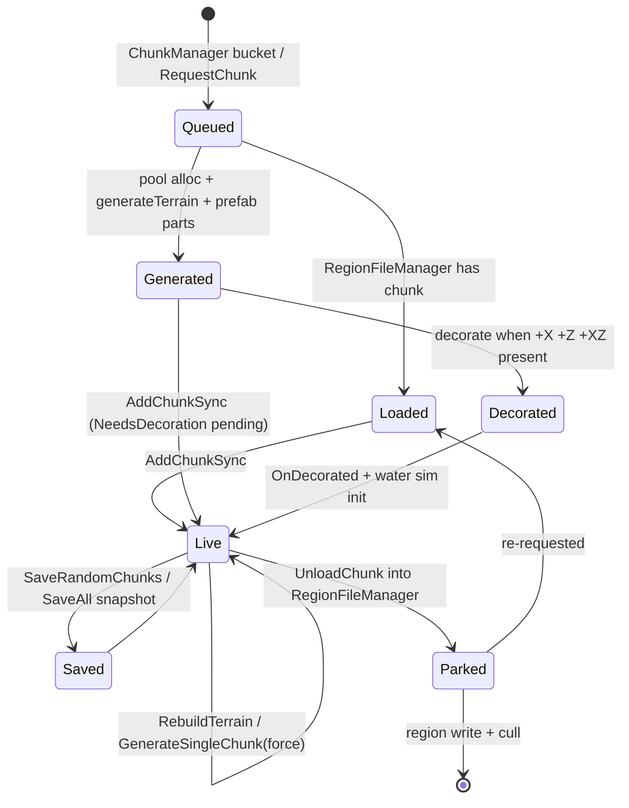
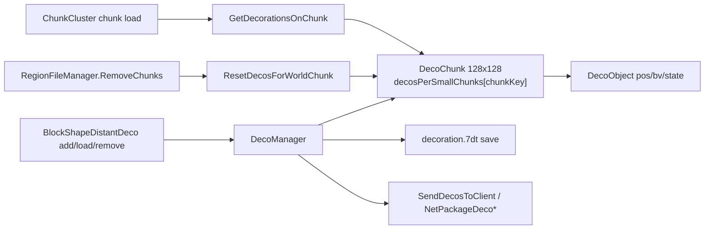

# Chunk providers and decoration (dedicated V3.1.0)

**Owns:** the `ChunkProviderAbstract` hierarchy (provider selection, the
GenerateChunks thread, chunk generate/decorate/save/unload driving) and the
decoration surfaces: in-chunk decorators via `DecoUtils`, plus the distant-deco
layer `DecoChunk` / `DecoObject`. Also the small support types
`ChunkCacheNeighborBlocks`, `ChunkBlockLayerLegacy`, `ChunkCoordinates`.
**Not:** the chunk cache / tick / send pipeline and the generateTerrain
trampoline internals ([`world-chunks.md`](world-chunks.md)); `RegionFileManager`
on-disk layout ([`save-region.md`](save-region.md)); RWG world creation
([`world-generation.md`](world-generation.md)); `DecoManager.UpdateTick` frame
cost ([`loop.md`](loop.md), [`loop-gmupdate.md`](loop-gmupdate.md)).
**Evidence:** `ChunkProvider*` IL (150 method bodies incl. nested coroutines and
`FromRaw/Bluff`), `DecoChunk`/`DecoObject`/`DecoUtils`/`ChunkCacheNeighborBlocks`/
`ChunkBlockLayerLegacy`/`ChunkCoordinates` (78 bodies), plus `ChunkCluster.Init`,
`World.LoadWorld`, `ChunkManager.GetNextChunkToProvide`,
`DecoManager.OnWorldLoaded`; dump locally with `tools/src/DumpMethod`
(git-ignored). **Hub:** [`INDEX.md`](INDEX.md).
**Method:** [`re-methodology.md`](re-methodology.md).

---

## 1. What a chunk provider is

`ChunkCluster` owns one `IChunkProvider` (field `ChunkCluster::ChunkProvider`).
The provider decides where chunk *contents* come from: read from region files,
generated from world data (heightmap + decorators), or received over the
network. Everything downstream (cache, lighting, stability, send) is
provider-agnostic and lives in [`world-chunks.md`](world-chunks.md).

`ChunkProviderAbstract` is a base of mostly no-op defaults, so each subclass
only implements what its source needs:

| Member | Base behavior (IL) | Meaning |
|---|---|---|
| `Init(World)` | empty coroutine | one-time async setup |
| `RequestChunk(x,z)` | `ret` (no-op) | ask for a chunk to exist |
| `Update()` / `StopUpdate()` | no-op | per-frame pump / thread stop |
| `UnloadChunk(Chunk)` | no-op | chunk leaves the live cache |
| `SaveAll()` / `SaveRandomChunks` | no-op | persistence flush / trickle save |
| `RebuildTerrain(...)` | no-op | regenerate terrain of live chunks |
| `ReloadAllChunks()` | no-op | drop and re-provide everything |
| `GetTerrainGenerator()` / `GetBiomeProvider()` | `ldnull` | height and biome oracles |
| `GetWorldExtent(out min,out max)` | returns false | authoritative bounds |
| `GetWorldBounds()` / `GetWorldSize()` | derived from `GetWorldExtent` | `BoundsInt` / `Vector2i(max-min+1)` |
| `GetChunkProtectionLevel(Vector3i)` | `ldc.i4.0` (None) | chunk-reset protection query |
| `FillOccupiedMap(...)` | empty coroutine | seeds the deco occupied map (§6.2) |
| `IsDecorationsEnabled` / `SetDecorationsEnabled` | `bDecorationsEnabled` field | gates POI/biome decoration |
| `GetProviderId()` | 0 (`None`) | persisted identity (§2) |

Interface-level call sites (FindCallers, dedicated-relevant):
`GameManager.gmUpdate → Update()`, `ChunkCluster.Init → Init()`,
`ChunkCluster.Save → SaveAll()`, `ChunkCluster.Cleanup → StopUpdate() + Cleanup()`,
`ChunkCluster.UnloadChunk → UnloadChunk()`, `GameManager.UpdateTick →
SaveRandomChunks(...)`, `World.RebuildTerrain → RebuildTerrain(...)` (reached
from `ConsoleCmdChunkReset`). Height/biome queries go through
`World.GetHeightAt → GetTerrainGenerator()` and `World.GetBiomeInWorld /
WorldEnvironment.DistantTerrain_GetBlockIdAt → GetBiomeProvider()`.

World-level consumers of the biome oracle: `World.IsPositionRadiated(pos)`
(IL=24) is `GetBiomeProvider().GetRadiationAt(x, z) > 0` (false when the
provider is null). `World.GetBiomeInWorld(x, z)` (IL=23) is
`GetBiomeProvider().GetBiomeAt(x, z)` (null without the cache/provider).
`World.GetBiomeIntensity(pos, out intensity)` (IL=28)
resolves the chunk and returns `chunk.GetBiomeIntensity(toBlockXZ(x),
toBlockXZ(z))` once the chunk exists and is not `NeedsLightCalculation`, else
`BiomeIntensity.Default` with false.

Chunk-side biome storage: `Chunk.GetBiomeIntensity(x, z)` (IL=16) reads the
`m_BiomeIntensities` byte array at the column offset `(x + z*16) * 6` (six
bytes per column; `BiomeIntensity.Default` when the array is null).
`ResetBiomeIntensity(v)` (IL=19) writes a value back at every 6-byte step.
`CalcDominantBiome()` (IL=55) histograms the 256 `m_Biomes` bytes into a
50-slot count array and stores the argmax as `DominantBiome`.
`Chunk.GetBiomeId(x, z)` (IL=9) / `SetBiomeId(x, z, id)` (IL=10) read and
write that per-column byte at `m_Biomes[x + z*16]`.

Registry lookups: `WorldBiomes.GetBiome(Color32)` (IL=34) packs
`(r << 16) | (g << 8) | b` into the `m_Color2BiomeMap` key (null on miss);
`GetBiome(byte id)` (IL=5) indexes `m_Id2BiomeArr`; `GetBiome(string name)`
(IL=12) hits `m_Name2BiomeMap` (null on miss); `TryGetBiome(id, out bd)`
(IL=11) is the non-null test over the id array.

World-level bounds consumers: `World.IsPositionInBounds(pos)` (IL=66) builds a
`BoundsInt` from `GetWorldExtent` and answers `Contains(round(pos))`, with two
special cases: the shipped Navezgane map uses the fixed **±2900** block bounds
(`GamePrefs.GetString(33) == "Navezgane"`), and non-playtesting worlds inset
the extent by **90** blocks on x/z before testing. `ClampToValidWorldPos(pos)`
(IL=82) applies the same Navezgane / 90-inset bounds and clamps all three
components into them. `ClampToValidWorldPosForMap`
(IL=28) clamps a `Vector2` into the raw extent's x/z (no Navezgane / inset
special cases) and returns it as a `Vector3`.
`World.IsPositionWithinPOI(pos, offset)` (IL=15) is
`GetDynamicPrefabDecorator().GetPrefabFromWorldPosInsideWithOffset(x, z,
offset) != null`.

---

## 2. Provider selection

`EnumChunkProviderId`: `None=0, Disc=1, GenerateFromDtm=2, NetworkClient=3,
ChunkDataDriven=4, Random=5, Random2=6, FlatWorld=7`.

`World.LoadWorld` reads `WorldState.providerId` from `main.ttw` (the world
folder's header on first run, the save's copy afterwards; `WorldState..ctor`
defaults it to `Disc=1`). If this process is not the server it forces
`NetworkClient=3`. The id then goes to `World.CreateChunkCluster →
ChunkCluster.Init`, which switches on it:

| Id | Concrete type | Source | Dedicated relevance |
|---|---|---|---|
| 1 `Disc` | `ChunkProviderDisc` | world's own `/Region` files, fully preloaded | editor / playtest worlds; rare on dedi |
| 2 `GenerateFromDtm` | `ChunkProviderGenerateWorldFromImage` | `dtm.tga` image heightmap | legacy image worlds |
| 3 `NetworkClient` | `ChunkProviderGenerateWorldFromRaw(bClientMode=true)`, or `ChunkProviderDummy` when `ChunkCluster.IsFixedSize` | chunks arrive by net packages | **client only**, never on dedi |
| 4 `ChunkDataDriven` | `ChunkProviderGenerateWorldFromRaw` | `dtm.raw` + splats + biomes + POIs | **the dedicated workhorse** (Navezgane, RWG output) |
| 5/6 `Random`/`Random2` | none constructed | dead enum entries | vestigial |
| 7 `FlatWorld` | `ChunkProviderGenerateFlat` | procedurally flat chunks | `Empty`/`Flat` playtest worlds |

So a stock dedicated server hosting a real world always runs
`ChunkProviderGenerateWorldFromRaw`, which inherits nearly all behavior from
`ChunkProviderGenerateWorld` (§3). RWG creates the world files once
([`world-generation.md`](world-generation.md)); this provider then *consumes*
them at runtime forever after.

---

## 3. ChunkProviderGenerateWorld: the runtime engine

### 3.1 Init

`Init(World)` (coroutine `<Init>d__22`) creates the `DynamicPrefabDecorator`
and loads it from the world folder, creates and loads the `SpawnPointManager`,
then starts a dedicated thread named `GenerateChunks` via
`ThreadManager.StartThread(..., GenerateChunksThread, ...)`. Subclass Inits run
their file loading first and call this via `<>n__0` (§4). The constructor sets
`bDecorationsEnabled = true` and allocates `m_ChunkQueue`
(`HashSetList<long>`), `m_WaitHandle` (AutoResetEvent) and an empty
`m_Parameters` list (`ChunkProviderParameter` is never constructed anywhere;
`GetParameters` has no callers; both are vestigial).

`m_RegionFileManager` (created in the subclass Init over
`GameIO.GetSaveGameRegionDir()`) is both the save backend and a second
`WorldChunkCache`: chunks that leave the live cluster park there before being
written ([`save-region.md`](save-region.md)).

### 3.2 Request and generate

`RequestChunk(x,z)` only enqueues `WorldChunkCache.MakeChunkKey(x,z)` into
`m_ChunkQueue` under its sync root and sets `m_WaitHandle`; in `bClientMode` it
returns immediately. Almost nothing calls it: the only external caller is
`TerrainMapGenerator.GenerateTerrain` (map rendering). The real demand signal
is player-position streaming via `ChunkManager.GetNextChunkToProvide` (IL=102),
not `RequestChunk`. Algorithm (verified):

1. Under `lockObject`, copy `m_AllChunkPositions.list` into
   `allChunkPositionsCopy` and capture count (list is the ring-flattened order
   from `DetermineChunksToLoad`, [world-chunks.md](world-chunks.md) section 4.0.1).
2. Walk that snapshot in order; return the first key where
   `!ChunkCache.ContainsChunkSync(key)` (nearest rings first because
   `BucketHashSetList.Recalc` walks buckets 0..n).
3. Else, if the provider exposes `GetRequestedChunks()` as a non-null
   `HashSetList<long>`, under that list's lock: if non-empty, **pop the last**
   element (`Remove` + return), else fall through.
4. Else return sentinel `Int64.MaxValue` (`0x7FFFFFFFFFFFFFFF`).

`World.GetNextChunkToProvide` (IL=4) is a one-liner trampoline to the manager.

`GenerateChunksThread` (IL=36): until termination, call
`World.GetNextChunkToProvide()`; if sentinel, try
`DynamicMeshThread.GetNextChunkToLoad()` (IL=18): if `RequestThreadStop` or
`nextChunks` empty / dequeue fail → same `Int64.MaxValue` sentinel; else
`ConcurrentQueue<long>.TryDequeue`. If still sentinel, **return 15**
(ms sleep). Otherwise `GenerateSingleChunk(cc, key, forceRebuild=false)` and
return **0** (no sleep). Missing `m_RegionFileManager` also returns 15.
DynamicMesh enqueues into `nextChunks` from its generation thread
([dynamic-mesh.md](dynamic-mesh.md) `SetNextChunkToLoad`).

Each key goes to `GenerateSingleChunk(cc, key, _forceRebuild=false)` (IL=171):

1. Skip if the cluster already has the chunk.
2. If `m_RegionFileManager` has it parked, take that instance (region-loaded
   chunks re-enter the live cluster without regeneration).
3. Otherwise allocate from `MemoryPools.PoolChunks`, set X/Z, derive a
   `GameRandom` from `Utils.RandomFromSeedOnPos(x, z, world.Seed)` and call
   `generateTerrain(world, chunk, rnd)`, the trampoline into
   `ITerrainGenerator.GenerateTerrain` (heights + base blocks,
   [`world-chunks.md`](world-chunks.md) §3, [`terrain-height.md`](terrain-height.md)).
4. If decorations are enabled: set `NeedsDecoration` and
   `NeedsLightCalculation`, then `DynamicPrefabDecorator.DecorateChunk` copies
   any dynamic prefab parts overlapping this chunk. If disabled: clear both
   flags and mark `NeedsRegeneration`.
5. `AddChunkSync` into the cluster (with upgradeable lock in the rebuild case);
   on failure the pooled chunk is freed back.
6. On success: if already fully decorated, `OnChunkSyncedAndDecorated`
   (registers the chunk with `WaterSimulationNative`); then
   `updateDecorationsWherePossible(chunk)` which calls `tryToDecorate` on the
   chunk and its (x-1,z), (x,z-1), (x-1,z-1) neighbors. With
   `_forceRebuild=true` (chunk reset path) it additionally sets `isModified`.

### 3.3 Decoration of a generated chunk

`tryToDecorate` runs `decorate(chunk)` only when `NeedsDecoration` is set and
the chunk is not locked. `decorate` needs the +X, +Z and +X+Z neighbors to be
present (overlap-safe placement window); it then:

- flags all four chunks `InProgressDecorating`,
- `updateDecosAllowedForChunk`: per column computes sub-voxel corner heights
  from density, a terrain normal from the cross product of the X/Z tangents,
  writes `SetTerrainNormal`, and classifies slope:
  normal.y < 0.55 → `EnumDecoAllowedSlope.Steep`, < 0.65 → `Sloped`. Columns at
  terrain height ≥ 253, or with water at/above the surface, get
  `SetDecoAllowedAt(..., EnumDecoAllowed.Nothing)`,
- runs every `IWorldDecorator` in `m_Decorators` via
  `DecorateChunkOverlapping(world, chunk, +XZ neighbors, seed)`. For the
  FromRaw provider that list is `WorldDecoratorPOIFromImage` (stamps POI prefab
  blocks from `poi_processed` data) then `WorldDecoratorBlocksFromBiome`
  (biome-driven trees/rocks/plants, using `DecoUtils`, §6.1),
- `Chunk.OnDecorated`, `ResetStability`, `RefreshSunlight`, clears
  `NeedsDecoration`, sets `NeedsLightCalculation`, clears the four
  `InProgressDecorating` flags, and calls `OnChunkSyncedAndDecorated`.

`UpdateDecorations(Chunk)` is a public wrapper over `decorate` used by
`ChunkManager.task_Lighting`, so late-arriving neighbors get their pending
decoration on the lighting worker rather than only at generation time.

### 3.4 Rebuild, reset, protection

`RebuildTerrain(chunks, areaStart, areaSize, stopStability, regen, fillEmpty,
isReset)` iterates live chunks by key and calls the 7-arg `generateTerrain`
with the same seeded `GameRandom`, optionally marking `NeedsRegeneration`.
Reached from `World.RebuildTerrain` (console `chunkreset`, editor tools).

Chunk reset is region-file based: `RequestChunkReset`, `ResetAllChunks`,
`ResetRegion`, `RemoveChunks`, `IterateChunkExpiryTimes` and
`GetChunkProtectionLevel` all forward to `m_RegionFileManager`.
`ChunkProtectionLevel` is a flag set (bedrolls, land claims, traders, vehicles,
backpacks, `CurrentlySynced`, ...). Dedicated callers:
`GameManager.ResetUnprotectedChunksOnLoad`, `ChunkResetCommandHelpers`,
`GameEvent ActionResetRegions`, `QuestEventManager.FinishTreasureQuest`
(resets the dug-up chunk), with `GameManager.UpdateTick` refreshing the
protected-position cache via `MainThreadCacheProtectedPositions`.
`ConsoleCmdChunkReset` and the reset helpers re-generate in place through
`GenerateSingleChunk(cc, key, true)`.

### 3.5 Save and unload

- `UnloadChunk(Chunk)`: server mode parks the chunk in `m_RegionFileManager`
  (`AddChunkSync`), whose own update/cull writes it out; client mode just frees
  it to the pool.
- `SaveAll()`: editor saves prefab decorator + spawn points; game mode
  `RegionFileManager.MakePersistent(ChunkCache, false)` + `WaitSaveDone`, then
  `EventPrefabs.Save`. Driven by `ChunkCluster.Save` from `GameManager.SaveWorld`
  ([`save-region.md`](save-region.md)).
- `SaveRandomChunks(count, worldTicks, activeSet)`: per tick from
  `GameManager.UpdateTick`; scans the active chunk set for chunks that need
  saving, are fully decorated and lit, were last saved more than 400 world
  ticks ago, and pass a 30 % random gate; snapshots via
  `RegionFileManager.SaveChunkSnapshot` under the chunk lock with
  `InProgressSaving` set.
- `Update()` pumps `m_RegionFileManager.Update()` each frame (from
  `gmUpdate`); `Cleanup()` stops the thread, then cleans spawn points, the
  region manager and `MultiBlockManager`.
- `ReloadAllChunks()` clears `m_ChunkQueue` and the region-manager cache;
  subclasses reload their heightmap first and re-`Init` their terrain
  generator (debug UI reload).

### 3.6 Lifecycle

---

## 4. The concrete providers

### 4.1 ChunkProviderGenerateWorldFromRaw (id 4, the dedicated one)

`Init` (coroutine `<Init>d__17`, which yields **base `Init` first**, as state 0 via
`<>n__0`, before its own work; the GenerateChunks thread's `m_RegionFileManager == null`
guard corroborates that ordering) is the world
load path a dedicated server runs at startup:

- `GameUtils.WorldInfo.LoadWorldInfo` from the world folder
  (`ChunkProviderAbstract.WorldInfo` property).
- Heightmap: prefers `dtm.raw`; converts `dtm.tga` (via
  `HeightMapUtils.ConvertDTMToHeightData`) or `dtm.png` on first run and saves
  a `.raw`; wraps it in a `HeightMap` (ushort backed array) consumed by
  `TerrainFromRaw.Init(heightMap, biomeProvider, seed)`.
- `calcWorldFileCrcs` + `filesNeedProcessing`/`processFiles`: CRC bookkeeping
  (also served to clients through `NetPackageWorldInfo.PrepareWorldHashes`).
- `WorldBiomeProviderFromImage` from `biomes.png`, splat control textures
  (`splat3/splat4_processed.png`, half-res variants, Burst `RoadSmooth`),
  water data (`GetWaterChunks16x16` used by `World.LoadWorld`).
- `m_Decorators = [WorldDecoratorPOIFromImage, WorldDecoratorBlocksFromBiome]`.
- `RegionFileManager` over the save's region dir, `EventPrefabs`,
  `MultiBlockManager.Initialize`.

Overrides: `GetWorldExtent`/`GetWorldSize` from heightmap dimensions × scale
(world Y extent 0..255), `GetHeight` (used by `FlatAreaManager`),
`GetPOIBlockIdOverride`/`GetPOIHeightOverride` (POI color map lookups feeding
distant terrain), `GetChunkProtectionLevel` → region manager, and
`FillOccupiedMap` (§6.2) including nested `Bluff` heightmap stamps that
modify the terrain heightmap at biome-chosen spots.

The splat/texture work runs on dedicated too (textures are loaded and
compressed); only their rendering is client work.

### 4.2 ChunkProviderGenerateWorldFromImage (id 2, legacy)

Same skeleton but `loadDTM` fills an `ArrayWithOffset<byte>` from `dtm.tga`
and drives `TerrainFromDTM`. Its `GetPOIHeightOverride` resolves POI colors via
`WorldBiomes.getPoiForColor` (fill height, liquid handling). Kept for old
image-based worlds; current worlds ship id 4.

### 4.3 ChunkProviderDisc (id 1)

Load-from-region, whole-world-resident: Init builds a `RegionFileManager` over
the world's own `/Region` folder (or the save copy), then loads *every* chunk
up front (`GetAllChunkKeys` loop, `FillBiomeId`, `AddChunkSync`), loads the
prefab decorator (`CopyAllPrefabsIntoWorld`) and spawn points; playtest mode
instead loads a single `Prefab` into a cleared cluster. No `RequestChunk`, no
generation, no streaming; `SaveAll` writes regions back (editor path also
exports to `Data/Worlds`). This is the world-editor / playtest provider; a
dedicated server only uses it for fixed-size worlds that ship regions.

### 4.4 ChunkProviderGenerateFlat (id 7)

Playtest flat world: generates uniform flat chunks (plus optional playtest
prefab) and implements `RebuildTerrain` directly (IL=210) without a region
manager. On Init it deletes only the stale **`decoration.7dt`**; the save region
directory is merely `Exists`-checked (to gate the playtest-prefab branch), never
deleted.

### 4.5 ChunkProviderDummy (id 3, client-only)

The network-client receiver for **fixed-size** clusters (`ChunkCluster.IsFixedSize`
from WorldInfo `fixedSizeCC=true`): no generation at all, `UnloadChunk` frees to
the pool, chunks arrive via net packages only. **Does not** load DTM, biomes, or
**splat control textures**. Together with `bClientMode=true` FromRaw (the
non-fixed-size client case) this branch never executes on a dedicated server.

**Terrain MicroSplat implication (zdtd 2026-08 playtest, V3.1.0 client):** if a
clone advertises `fixedSizeCC=true` for Navezgane, the client installs Dummy and
never fills `ChunkProviderGenerateWorldFromRaw.splats[]`.
`VoxelMeshTerrain.ConfigureTerrainMaterial` still runs when
`World.IsSplatMapAvailable` (level name set), binds null `_CustomControl0/1`, and
the terrain floor renders **uniform grey clay** despite correct block ids on the
wire. Stock maps with `splat*.png` under `Data/Worlds/<name>` need
`fixedSizeCC=false` so NetworkClient selects FromRaw(bClientMode) and loads
splats locally (client log: `GenWorldFromRaw splats took …ms`). See
`protocol-packages.md` §4.2 `fixedSizeCC`.

---

## 5. Distant decoration layer: DecoManager, DecoChunk, DecoObject

This layer is separate from §3.3 in-chunk decoration: certain blocks (shapes
`BlockShapeDistantDeco` / `BlockShapeDistantDecoTree`, i.e. trees and large
deco) also exist as lightweight records visible far beyond loaded chunks.

- `DecoChunk` covers a **128×128 block** area (`ToDecoChunkPos` divides by
  128; grid key `MakeKey16` packs x/z into 16 bits each). Inside, DecoObjects
  are bucketed per 16×16 world chunk: `decosPerSmallChunks :
  Dictionary<long chunkKey, List<DecoObject>>` keyed by
  `WorldChunkCache.MakeChunkKey(World.toChunkXZ(pos))`. That per-chunk bucket
  is exactly how decorations attach to chunks.
- `DecoObject` is `{Vector3i pos, float realYPos, BlockValue bv, DecoState
  state}`. Its `decoration.7dt` record is, in `Write` order:
  **`packedPos:u64`** (`GameUtils.Vector3iToUInt64(pos)`), **`realYPos:f32`**,
  **`bv.rawData:u32`**, **`state:u8`**, after which the block is registered in the
  save's `NameIdMapping` (bookkeeping, no bytes). The `realYPos` float is easy to
  miss: a parser that skips it misaligns by 4 bytes from the second field on.
  `DecoState`:
  `GeneratedActive`, `GeneratedInactive` (block currently realized in a loaded
  chunk, model hidden), `Dynamic` (player-placed).
- `DecoManager.OnWorldLoaded(w, h, world, chunkProvider)` (from
  `World.LoadWorld`; `IsEnabled = levelName != "Empty"`): builds the
  `DecoOccupiedMap`, runs `chunkProvider.FillOccupiedMap` (§6.2), creates the
  `DecoChunk` grid, loads `<save>/decoration.7dt` (`TryLoad` →
  `addLoadedDecoration` per DecoObject), and on the server seeds random decos
  per DecoChunk (`decorateChunkRandom` with `RandomFromSeedOnPos`), mirroring
  the map into a `FileBackedDecoOccupiedMap`.
- Runtime attach/detach: `BlockShapeDistantDeco.OnBlockAdded/OnBlockLoaded →
  DecoManager.AddDecorationAt`, `OnBlockRemoved → RemoveDecorationAt`;
  `ChunkCluster.SetBlock → DecoManager.SetBlock` keeps records in sync with
  edits. When a chunk loads, `ChunkCluster.addDistantDecorationBlocks` pulls
  `GetDecorationsOnChunk(chunkX, chunkZ, ...)` from the per-chunk buckets and
  realizes them as blocks; `DecoChunk.RestoreGeneratedDecos` flips
  `GeneratedInactive` back to active (and drops `Dynamic` entries) when a
  chunk region resets. `RegionFileManager.RemoveChunks` calls
  `DecoManager.ResetDecosForWorldChunk(chunkKey)` so chunk resets restore
  generated trees.
- Dedicated networking: `GameManager.RequestToEnterGame →
  DecoManager.SendDecosToClient(clientInfo)`; updates and resets flow through
  `NetPackageDecoUpdate` / `NetPackageDecoResetWorldChunk` /
  `NetPackageDecoResetWorldRect`. Saves: `World.SaveDecorations →
  DecoManager.Save()` (async `WriteTask`).
- Model side: `DecoChunk.AddDecoObject(_tryInstantiate)` calls
  `DecoObject.CreateGameObject` under the DecoChunk `rootObj` and feeds
  `OcclusionManager`; `UpdateModels`/`SetVisible` maintain them. These run
  wherever a `rootObj` exists; occlusion/culling and rendering are client
  concerns, but the record layer above is fully server-authoritative.
  `DecoManager.UpdateTick` cost on dedi is covered in [`loop.md`](loop.md).

---

## 6. Deco placement rules and the occupied map

### 6.1 DecoUtils (per-block placement tests)

Static helpers used by the §3.3 decorators when placing biome blocks and by
`Prefab` block import:

- `HasDecoAllowed(bv)` / `GetDecoRadius(bv, block)` / `IsBigDeco` read the
  block's decoration metadata (oversized bounds or `BlockDecorationRadius`).
- `CanPlaceDeco(chunk[, +X,+Z,+XZ neighbors], pos, bv, DecoAllowedTest)`
  checks every column in the deco footprint against the per-chunk
  `EnumDecoAllowed` map (`Everything`, slope/size bits, `StreetOnly`,
  `Nothing`), spanning chunk borders via the neighbor overloads.
- `ApplyDecoAllowed*` writes the footprint back so later decorations keep
  their distance; `Prefab.ApplyDecoAllowed` does the same for POIs.

The per-column inputs (`EnumDecoAllowed`, `EnumDecoAllowedSlope`, terrain
normals) are produced by `updateDecosAllowedForChunk` (§3.3).

### 6.2 DecoOccupiedMap (world-level)

`DecoManager.OnWorldLoaded` allocates a world-sized `DecoOccupiedMap`
(`EnumDecoOccupied`: `Free`, `SmallSlope`, `Stop_BigDeco`, `Perimeter`,
`Stop_AnyDeco`, `Deco`, `POI`, `BigSlope`, `NoneAllowed`) and asks the chunk
provider to fill it. `ChunkProviderGenerateWorldFromRaw.FillOccupiedMap`
marks POI/road/water cells from the processed world data, stamps every
`DynamicPrefabDecorator` prefab footprint as `POI`, and rolls biome
`BiomeBluffDecoration` entries: loading `Bluff` heightmap stamps, checking
`CheckArea`, then editing the shared terrain heightmap through an
`IBackedArrayView<ushort>` and reserving the area. `Chunk.GetDecoAllowedAt`
and `FlatAreaManager` consult the map at runtime; console `decomgr` dumps it.

---

## 7. Support types

- **`ChunkCacheNeighborBlocks`** (with `ChunkCacheNeighborChunks`): a cached
  2×2 chunk window around a block position. `Init(bX,bZ)` picks the -1/0
  neighbor per axis sign and caches until the center moves;
  `Get/GetStab/IsAir/IsWater` then answer cross-border block queries without
  cluster lookups. Constructed in `ChunkCluster.Init` for `MeshGeneratorMC2`
  (cleared by `ChunkCluster.RegenerateChunk`) and in
  `DynamicMeshChunkProcessor.Init` ([`dynamic-mesh.md`](dynamic-mesh.md)), so
  it is live on dedicated servers through the dynamic-mesh path.
- **`ChunkBlockLayerLegacy`**: the pre-`ChunkBlockChannel` 4-block-tall layer
  store. Its instance serialization (`Read`/`Write`) and
  `ChunkBlockChannel.Convert(ChunkBlockLayerLegacy[])` have **no callers**:
  dead legacy-format code (`ChunkBlockChannel.Read` handles old saves itself,
  gated on version ≤ 34). What *is* live are its static index helpers:
  `CalcOffset`/`OffsetX`/`OffsetY` are the canonical `x + z*16 + (y&3)*256`
  math used by `Chunk.SetBlockRaw`, `RecalcHeights`, water set paths,
  `MeshGenerator*` and `Prefab.PrefabChunk` ([`world-chunks.md`](world-chunks.md) §2).
- **`ChunkCoordinates`**: a misnomer; it stores a *block* position used as
  `EntityAlive`'s home/leash point (set in `EntityAlive.Awake`, consumed by
  `EAITerritorial`, `EntityVulture`, `RandomPositionGenerator`,
  `EntityCreationData`). It is entity-AI state, not part of the chunk
  pipeline; documented here only to close the name.
- **`ChunkProviderParameter`**: never constructed; vestigial (§3.1).

---

## Related docs

| Doc | Relationship |
|---|---|
| [`world-chunks.md`](world-chunks.md) | Chunk cache, tick, load/send, SetBlock; consumes what providers produce |
| [`world-generation.md`](world-generation.md) | RWG creates the world files this layer reads at runtime |
| [`save-region.md`](save-region.md) | `RegionFileManager` layout, WorldState/`main.ttw`, save chain |
| [`terrain-height.md`](terrain-height.md) | `ITerrainGenerator` height math behind `generateTerrain` |
| [`dynamic-mesh.md`](dynamic-mesh.md) | `DynamicMeshThread` feeds the GenerateChunks thread; neighbor block cache user |
| [`loop.md`](loop.md) / [`loop-gmupdate.md`](loop-gmupdate.md) | Frame cost of `provider.Update`, `DecoManager.UpdateTick`, `SaveRandomChunks` |
| [`light-mesh-water.md`](light-mesh-water.md) | Lighting/water stages that follow decoration |

## Changelog

- **2026-07-28:** `GetNextChunkToProvide` lock/snapshot/sentinel and GenerateChunksThread sleep codes.

- 2026-07-24: initial version. Provider hierarchy and selection, GenerateChunks
  thread and decoration pipeline, per-provider Init paths, distant-deco
  layer (DecoChunk/DecoObject), DecoUtils/occupied map, support types;
  `ChunkProviderDummy` and `bClientMode` flagged client-only;
  `ChunkBlockLayerLegacy` serialization and `ChunkProviderParameter`
  identified as dead code.
