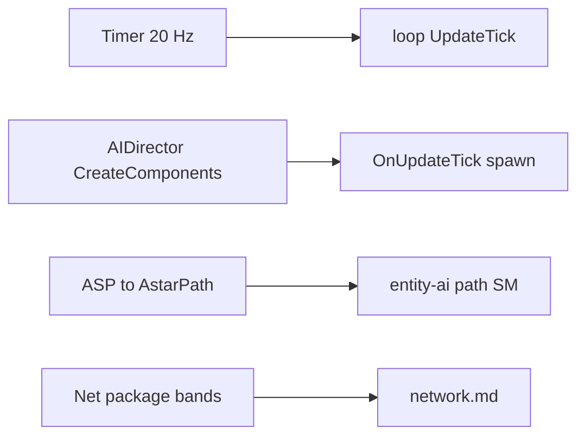
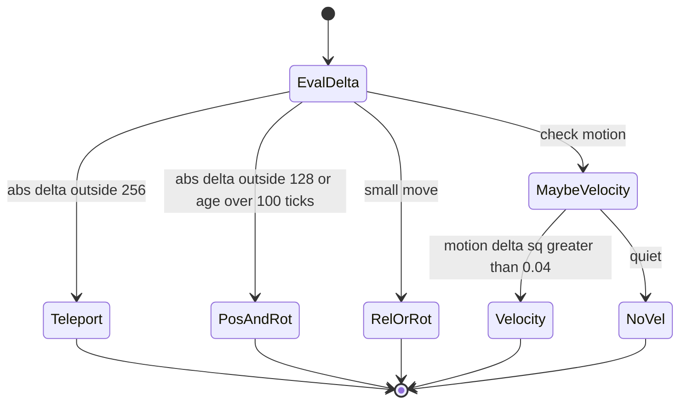

# Gap-closing synthesis (V3.1.0)

**Owns:** closed IL-solvable gaps (timer 20 Hz, AIDirector install, ASP→A*, net bands).
**Loop:** [`loop.md`](loop.md). **Auto:** [`inventories/gaps.md`](inventories/gaps.md).
**Hub:** [`INDEX.md`](INDEX.md).

Closes several **IL-solvable** open items from [`loop.md`](loop.md) §14.  
Raw notes: [`inventories/gaps.md`](inventories/gaps.md). Tool: `tools/legacy/DumpGaps.cs` (build via [`../tools/`](../tools/)).

---

## 0. Map of closed items



---

## 1. GameTimer.ticksPerSecond = **20**

`GameTimer.get_Instance` constructs `new GameTimer(20f)` (`ldc.r4 20` then `.ctor(Single)` storing `ticksPerSecond`).

```text
elapsedTicks ≈ floor( (elapsedMs * timeScale / 1000) * ticksPerSecond )
```

So default sim tick rate target is **20 Hz** of game ticks (not necessarily 20 Unity frames).  
`UpdateTick` still may **slice** entity work across multiple Unity frames between game ticks.

**Optim relevance:** host frame budget often discussed as 50 ms (20 FPS dedicated); aligns with stock timer design.

---

## 2. AIDirector default components (always installed)

`AIDirector..ctor` → `CreateComponents` → `Init`.

**CreateComponents order (always):**

1. `AIDirectorMarkerManagementComponent`  
2. `AIDirectorPlayerManagementComponent` (cached field)  
3. `AIDirectorWanderingHordeComponent`  
4. `AIDirectorAirDropComponent`  
5. `AIDirectorChunkEventComponent` (cached field)  
6. `AIDirectorBloodMoonComponent` (cached field)  

Constructed via `CreateComponent<T>()` → `Activator.CreateInstance` into `components` dictionary.  
`AIDirector` itself is `new` from **`WorldState.SetFrom`** (world load/setup).  
`AIDirector.Tick` called only from **`World.OnUpdateTick`**.

**Constants (static fields):**  
`cActivityDuration = 720`, `cActivityNoiseDuration = 240`, `cDebugSendNameInfoTickRate = 5`.

---

## 3. Path compute body (ASP / Aron Pathfinding)

```text
ASPPathFinderThread.FindPaths (≤8 / yield)
  → navigator.GetPathTo(PathInfo)
       ASPPathNavigate.GetPathTo:
         cancel prior ASPPathFinder
         canNavigate?
         CreatePath()
           new ASPPathFinder → PathFinder.Calculate / ASPPathFinder.Calculate (333 IL)
             builds Pathfinding.* path objects:
               XPath, ABPath, MultiTargetPath, RandomPath, FleePath
             AstarPath.StartPath(path, …)   // Aron Granberg A* Pathfinding Project
       result stored for GetPath on main
```

**Stack:** custom 7DTD queue/thread wrapper (**ASP**) + **third-party A\* graph** (`AstarPath`, `Pathfinding.*` namespace).

**pathFollow (160 IL):** waypoint advance, ground project, segment closest point, elevator handling, `EntityMoveHelper.SetMoveTo`.

**Drain re-pin (2026-08-07):** ASP `<FindPaths>d__8.MoveNext` IL=87: FIFO `entityWaitQueue.list[0]`, hard cap **`ldc.i4.8`**, yield, no priority sort ([entity-ai.md](entity-ai.md) §D3.7).

**Optim:** admission still at enqueue; compute cost is A* graph search (harder to Harmony cheaply than skipping FindPath). Measured BM-ish A/B with cap+far-drop did not improve lag (optimizer V310 baseline); keep admission default-off unless path-queue telemetry shows a different regime.

---

## 4. Net interest package selection (decoded)



From annotated `NetEntityDistributionEntry.updatePlayerList` (509 IL):

| Condition | Action |
|---|---|
| `firstUpdateDone` and distance from `lastTrackedEntityPos` **> 16** (raw `GetDistanceSq` vs 16) | `updatePlayerEntities` (rebuild interested player list) |
| Physics master entity | occasional `PhysicsMasterSetupBroadcast` send (channel/mask **192**) |
| Encoded **pos** delta any axis **abs ≥ 2** (or ground flag change) | consider movement package |
| Encoded pos delta outside **[-256, 256)** any axis | **`NetPackageEntityTeleport`** |
| Else if outside **[-128, 128)** or `sendFullUpdateAfterTicks > 100` | **`NetPackageEntityPosAndRot`** (absolute) |
| Else if movement replicated | **`NetPackageEntityRelPosAndRot`** (relative) or **`NetPackageEntityRotation`** only |
| Motion delta **sqrMagnitude > 0.04** (or zeroing) | **`NetPackageEntityVelocity`** |
| `bEntityAliveFlagsChanged` | **`NetPackageEntityAliveFlags`** |
| `bPlayerStatsChanged` | **`NetPackagePlayerStats`** (+ equipment/twitch variants later in method) |
| Priority levels | `switch` on `priorityLevel` with counters; one branch uses period **10** ticks |

**Scale levers for rate-LOD research:** thresholds **2 / 128 / 256 / 16 / 0.04 / 100 / 10**; fewer full PosAndRot / Teleport under load.

---

## 5. Entity Unity activity on dedicated

| Finding | Detail |
|---|---|
| `Entity.Update` / `EntityAlive.Update` | **No** `IsDedicatedServer` check in method bodies |
| Contents | Transform, network stats, progression, model fade (not AI) |
| Spawn `set_enabled` / `SetActive` | Few hits in factory/spawn paths (see inventories/gaps.md §5b); **not** a clear “disable all MB on dedi” pattern |

**Still open (runtime):** whether remote zombie GOs keep `enabled=true` on pure dedicated. IL does not prove cull. Dual-path cost remains a **measure** item.

---

## 6. Protocol / EAC surface

| Layer | Types |
|---|---|
| Game | `ConnectionManager`, `ProtocolManager` |
| Transport | `NetworkServerLiteNetLib`, `NetworkClientLiteNetLib`, `NetworkCommonLiteNetLib` |
| Platform AC | `Platform.EOS.AntiCheatServer`, `AntiCheatServerP2P`, client variants, encryption auth |

Not required for sim optim; documents where net terminates below packages.

---

## 7. MonoBehaviour Update classification (heuristic)

From name hints on 242 MB Update types:

- **Likely dedicated-relevant:** ~33 (GameManager, ConnectionManager, DynamicMeshManager, Entity*, turrets/traps, Origin, …)  
- **Likely client/editor:** majority (vp_*, UI, Avatar, Camera, LocalPlayer, …); debug/test helpers `MemoryTracker` (OnGUI memory dump), `GameGraphManager` (EntityPlayerLocal debug graphs), `StringParsersTests` (unit-test class), `NetworkMonitor`/`SIdCnt*` (NGuiWdwDebugPanels) are client/debug-only  
- **Unclassified:** remainder (see inventories/gaps.md §8)

Heuristic only; presence still depends on whether component exists in dedicated scene/world. **Superseded in part (2026-08-09/10, runtime):** the peer Update order for the components that *do* exist on a stock dedicated server is now observed, not heuristic - SdtdConsole -> ConnectionManager.Update -> GameManager.Update -> (WorldEnvironment/DynamicMeshManager) -> CM.LateUpdate -> GM.LateUpdate, with `ConnectionManager.Update` always before `GameManager.Update` (518 stable frames; [loop.md](loop.md) §1.1). Entity MBs also run (GO active + MB enabled, 17/17 observed). The heuristic remains useful only for *which* of the 242 types a dedicated scene instantiates.

---

## 8. Optim map updates from this pass

Merged into the optimizer project (do not keep optim narrative under `docs/` or `il/`):  
[`../../7dtd-optimizer/docs/OPTIMIZATION_CANDIDATES.md`](../../7dtd-optimizer/docs/OPTIMIZATION_CANDIDATES.md)

| Idea | New RE detail folded there |
|---|---|
| Path admission | Compute is **AstarPath.StartPath**; drain 8/slice |
| Net rate LOD | Teleport@±256 quanta, PosAndRot@±128 or 100 ticks, RelPos, vel@0.04 |
| Timer / frame budget | **20 game ticks/sec** stock |
| AIDirector | Always-on BM + wandering + chunk scouts + airdrop |

---

## 9. Remaining open (still)

Canonical open-item list is [`residuals.md`](residuals.md); this is a pointer for
the gap-closing context only. All items here are **non-IL** residuals.
**Updated 2026-08-12:** items 1, 2, 4 and 5 below are now **closed** (see
residuals.md for the closure evidence); the genuinely-open list is down to the
third-party / native items (3, 6, and the EAC/A* internals in residuals.md):

1. ~~Unity **script execution order** among peers~~ **Closed** (2026-08-09, runtime
   Harmony probe; see residuals.md).  
2. ~~Runtime **entity Behaviour.enabled** population on dedi~~ **Closed** (2026-08-10,
   runtime; see residuals.md).  
3. Full line-by-line **AstarPath** library (third-party; treat as black box).  
4. ~~Region sector payload byte codec~~ **Closed (2026-08-12, byte-exact):** the
   sector payload is fully decoded - V2 framing (len + 12-byte gap + data), the
   `ttc\0` + Chunk.CurrentSaveVersion preamble, raw Noemax deflate, and the whole
   `Chunk.save` body (layers, maps, channels, volumes) parse byte-exactly on 16
   probe saves; the stock server boots the saves back (game-reader round-trip).  
5. ~~ModEvents subscriber sets~~ **Closed** (2026-08-09/10, runtime; see residuals.md).  
6. Post-V3.0.1 IL drift (process residual).

---

## 10. Dead / inert paths swept (2026-08-08)

Body-verified (full IL dump + RefScan) closures that stop a clone from
implementing the wrong path. All narrated at their family docs:

- **`LiveStats`** survival-stat record: 0 external ctor call sites (only its
  own `Clone`), no entity holds one ([dedicated-leftovers.md](dedicated-leftovers.md)).
- **`DynamicMeshDataQueue<T>`** queue template: 0 external refs; the live
  storage is `DynamicMeshChunkDataStorage<T>`. **`DynamicMeshRegionBuilder`**:
  0 external refs. **`DynamicMeshThread.ServerUpdates`** channel: the producer
  has no callers and nothing dequeues ([dynamic-mesh.md](dynamic-mesh.md)).
- **`Prefab.Cells<T>`** sparse grid: 0 external refs
  ([world-generation.md](world-generation.md)).
- **`World.ClipBoundsMove`** (IL=573): 0 call sites; live clip is
  `BoundsUtils.ClipBoundsMove` ([entity-ai.md](entity-ai.md)).
- **Dead collections/noise**: `TList<T>`/`TQueue<T>`, `OneToOneDictionary<K,V>`,
  `CollectionDebugWrapper<T>`, `ParsingConverters`, `SimplexNoise`,
  `OpenSimplex2/2S`, `IEnumerableExtensions`, `BinaryReaderExtensions`
  ([dedicated-leftovers.md](dedicated-leftovers.md)). (`UniLinq` and
  `ObservableDictionary<K,V>` are **live**; the latter backs
  `PersistentPlayerList.Players`, [server-lifecycle.md](server-lifecycle.md).)
- **Wire-body corrections** from the regenerated catalog: `NetPackageDamageEntity`
  writes `bIgnorePartyShare` (IL=176, not 172); `EntityCreationData` writes a
  final `stressAmount : f32` for every entity (read gated on version >= 36);
  `NetPackageTileEntity` writes `teBlockId` + `i32` length ([protocol-packages.md](protocol-packages.md)).

---

## Related docs

| Doc | Role |
|---|---|
| [entity-ai.md](entity-ai.md) | AI path context |
| [network.md](network.md) | Net bands |
| [residuals.md](residuals.md) | What stays open |

## Changelog

- **2026-08-10:** §7 MB Update classification cross-referenced to the observed
  peer order (heuristic superseded in part by the runtime probe).
- **2026-08-08:** Dead/inert path sweep synthesis (section 10).
- **2026-07-19:** Related docs table.
- **2026-07-16:** Closed GameTimer=20, AIDirector CreateComponents list, ASP→AstarPath path body, net package thresholds, MB classification, EAC/LiteNet type map.
