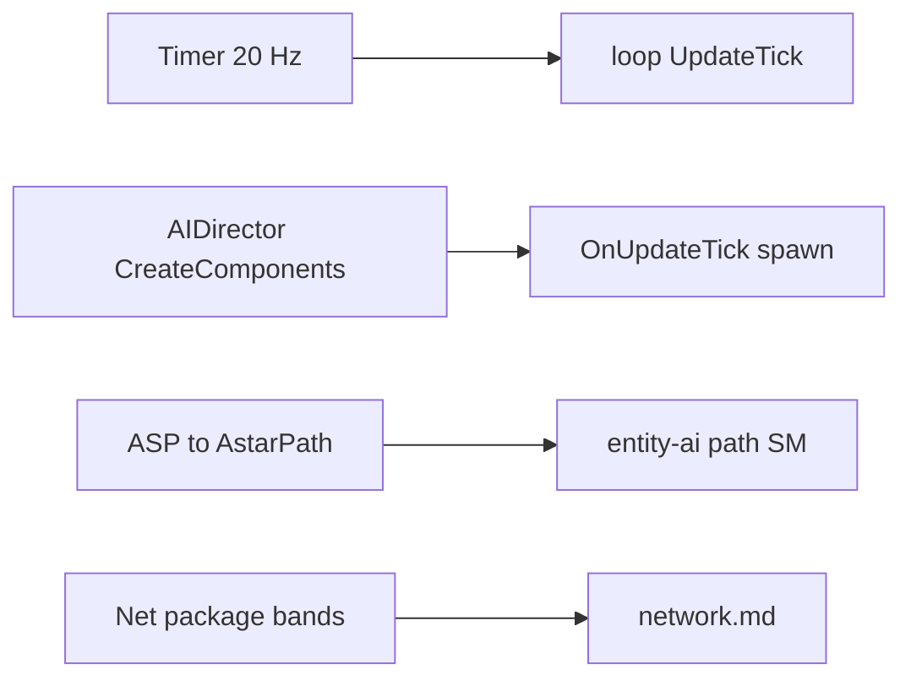
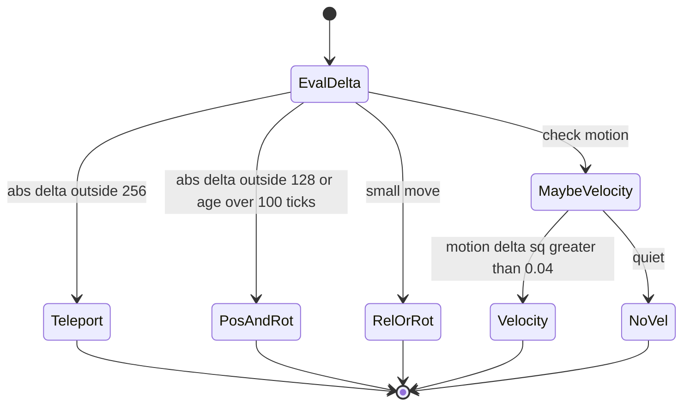

# Gap-closing synthesis (V3.0.1)

**Owns:** closed IL-solvable gaps (timer 20 Hz, AIDirector install, ASP→A*, net bands).
**Loop:** [`loop.md`](loop.md). **Auto:** [`inventories/gaps.md`](inventories/gaps.md).
**Hub:** [`INDEX.md`](INDEX.md).

Closes several **IL-solvable** open items from [`loop.md`](loop.md) §14.  
Raw notes: [`inventories/gaps.md`](inventories/gaps.md). Tool: `tools/DumpGaps.cs`.

---

## 0. Map of closed items



---

## 1. GameTimer.ticksPerSecond = **20**

`GameTimer.get_Instance` constructs `new GameTimer(20f)` (`ldc.r4 20` then `.ctor(Single)` storing `ticksPerSecond`).

```text
elapsedTicks ≈ floor( (elapsedMs * timeScale / 1000) * ticksPerSecond )
```

So default sim tick rate target is **20 Hz** of game ticks (not necessarily 20 Unity frames).  
`UpdateTick` still may **slice** entity work across multiple Unity frames between game ticks.

**Optim relevance:** host frame budget often discussed as 50 ms (20 FPS dedicated); aligns with stock timer design.

---

## 2. AIDirector default components (always installed)

`AIDirector..ctor` → `CreateComponents` → `Init`.

**CreateComponents order (always):**

1. `AIDirectorMarkerManagementComponent`  
2. `AIDirectorPlayerManagementComponent` (cached field)  
3. `AIDirectorWanderingHordeComponent`  
4. `AIDirectorAirDropComponent`  
5. `AIDirectorChunkEventComponent` (cached field)  
6. `AIDirectorBloodMoonComponent` (cached field)  

Constructed via `CreateComponent<T>()` → `Activator.CreateInstance` into `components` dictionary.  
`AIDirector` itself is `new` from **`WorldState.SetFrom`** (world load/setup).  
`AIDirector.Tick` called only from **`World.OnUpdateTick`**.

**Constants (static fields):**  
`cActivityDuration = 720`, `cActivityNoiseDuration = 240`, `cDebugSendNameInfoTickRate = 5`.

---

## 3. Path compute body (ASP / Aron Pathfinding)

```text
ASPPathFinderThread.FindPaths (≤8 / yield)
  → navigator.GetPathTo(PathInfo)
       ASPPathNavigate.GetPathTo:
         cancel prior ASPPathFinder
         canNavigate?
         CreatePath()
           new ASPPathFinder → PathFinder.Calculate / ASPPathFinder.Calculate (333 IL)
             builds Pathfinding.* path objects:
               XPath, ABPath, MultiTargetPath, RandomPath, FleePath
             AstarPath.StartPath(path, …)   // Aron Granberg A* Pathfinding Project
       result stored for GetPath on main
```

**Stack:** custom 7DTD queue/thread wrapper (**ASP**) + **third-party A\* graph** (`AstarPath`, `Pathfinding.*` namespace).

**pathFollow (160 IL):** waypoint advance, ground project, segment closest point, elevator handling, `EntityMoveHelper.SetMoveTo`.

**Optim:** admission still at enqueue; compute cost is A\* graph search (harder to Harmony cheaply than skipping FindPath).

---

## 4. Net interest package selection (decoded)



From annotated `NetEntityDistributionEntry.updatePlayerList` (509 IL):

| Condition | Action |
|---|---|
| `firstUpdateDone` and distance from `lastTrackedEntityPos` **> 16** (raw `GetDistanceSq` vs 16) | `updatePlayerEntities` (rebuild interested player list) |
| Physics master entity | occasional `PhysicsMasterSetupBroadcast` send (channel/mask **192**) |
| Encoded **pos** delta any axis **abs ≥ 2** (or ground flag change) | consider movement package |
| Encoded pos delta outside **[-256, 256)** any axis | **`NetPackageEntityTeleport`** |
| Else if outside **[-128, 128)** or `sendFullUpdateAfterTicks > 100` | **`NetPackageEntityPosAndRot`** (absolute) |
| Else if movement replicated | **`NetPackageEntityRelPosAndRot`** (relative) or **`NetPackageEntityRotation`** only |
| Motion delta **sqrMagnitude > 0.04** (or zeroing) | **`NetPackageEntityVelocity`** |
| `bEntityAliveFlagsChanged` | **`NetPackageEntityAliveFlags`** |
| `bPlayerStatsChanged` | **`NetPackagePlayerStats`** (+ equipment/twitch variants later in method) |
| Priority levels | `switch` on `priorityLevel` with counters; one branch uses period **10** ticks |

**Scale levers for rate-LOD research:** thresholds **2 / 128 / 256 / 16 / 0.04 / 100 / 10**; fewer full PosAndRot / Teleport under load.

---

## 5. Entity Unity activity on dedicated

| Finding | Detail |
|---|---|
| `Entity.Update` / `EntityAlive.Update` | **No** `IsDedicatedServer` check in method bodies |
| Contents | Transform, network stats, progression, model fade (not AI) |
| Spawn `set_enabled` / `SetActive` | Few hits in factory/spawn paths (see inventories/gaps.md §5b); **not** a clear “disable all MB on dedi” pattern |

**Still open (runtime):** whether remote zombie GOs keep `enabled=true` on pure dedicated. IL does not prove cull. Dual-path cost remains a **measure** item.

---

## 6. Protocol / EAC surface

| Layer | Types |
|---|---|
| Game | `ConnectionManager`, `ProtocolManager` |
| Transport | `NetworkServerLiteNetLib`, `NetworkClientLiteNetLib`, `NetworkCommonLiteNetLib` |
| Platform AC | `Platform.EOS.AntiCheatServer`, `AntiCheatServerP2P`, client variants, encryption auth |

Not required for sim optim; documents where net terminates below packages.

---

## 7. MonoBehaviour Update classification (heuristic)

From name hints on 242 MB Update types:

- **Likely dedicated-relevant:** ~33 (GameManager, ConnectionManager, DynamicMeshManager, Entity*, turrets/traps, Origin, …)  
- **Likely client/editor:** majority (vp_*, UI, Avatar, Camera, LocalPlayer, …)  
- **Unclassified:** remainder (see inventories/gaps.md §8)

Heuristic only; presence still depends on whether component exists in dedicated scene/world.

---

## 8. Optim map updates from this pass

Merged into the optimizer project (do not keep optim narrative under `research/docs/` or `research/il/`):  
[`../../7dtd-optimizer/docs/OPTIMIZATION_CANDIDATES.md`](../../7dtd-optimizer/docs/OPTIMIZATION_CANDIDATES.md)

| Idea | New RE detail folded there |
|---|---|
| Path admission | Compute is **AstarPath.StartPath**; drain 8/slice |
| Net rate LOD | Teleport@±256 quanta, PosAndRot@±128 or 100 ticks, RelPos, vel@0.04 |
| Timer / frame budget | **20 game ticks/sec** stock |
| AIDirector | Always-on BM + wandering + chunk scouts + airdrop |

---

## 9. Remaining open (still)

1. Unity **script execution order** among peers (not in IL).  
2. Runtime **entity Behaviour.enabled** population on dedi (needs runtime or deeper spawn).  
3. Full line-by-line **AstarPath** library (third-party; treat as black box).  
4. **Region/WorldState** binary formats.  
5. ModEvents subscriber sets.  
6. Post-V3.0.1 IL drift.

---

## Changelog

- **2026-07-16:** Closed GameTimer=20, AIDirector CreateComponents list, ASP→AstarPath path body, net package thresholds, MB classification, EAC/LiteNet type map.
## Related docs

| Doc | Role |
|---|---|
| [entity-ai.md](entity-ai.md) | AI path context |
| [network.md](network.md) | Net bands |
| [residuals.md](residuals.md) | What stays open |

## Changelog

- **2026-07-19:** Related docs table.
