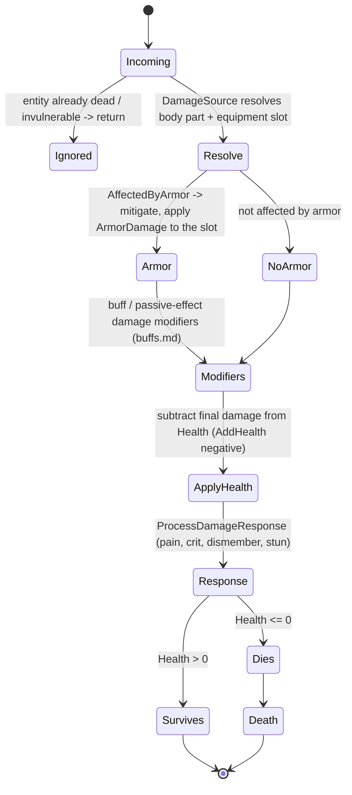
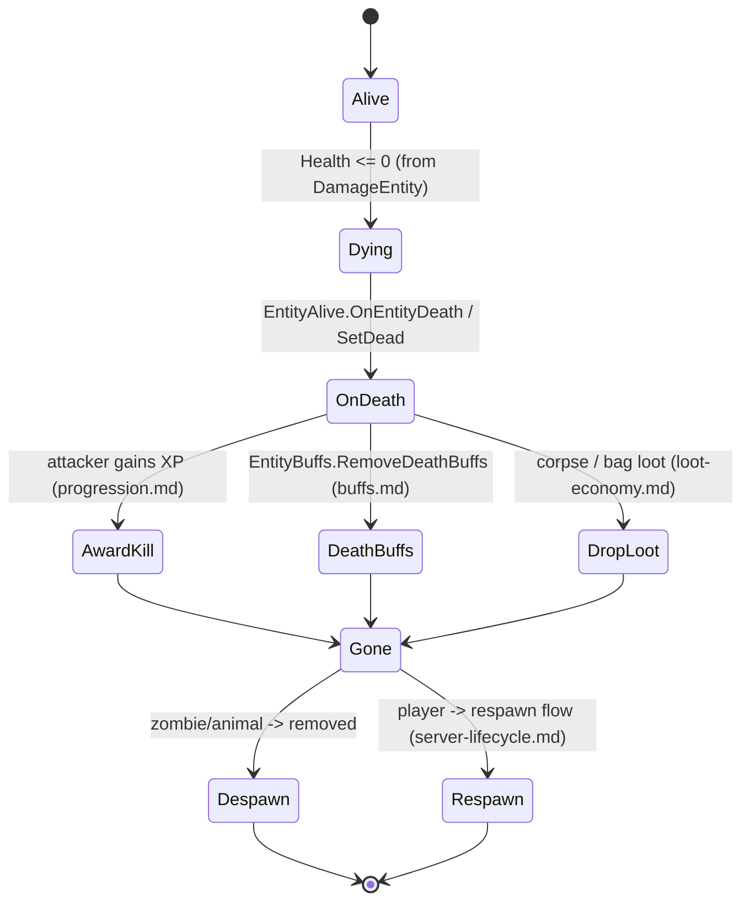

# Combat and damage application (dedicated V3.0.1)

**Owns:** the server-authoritative damage pipeline: `DamageSource` (the damage
descriptor), `EntityAlive.DamageEntity` (armor mitigation, modifiers, health,
crit/dismember), and the death/kill path. This consolidates the damage threads
that touch items, blocks, stats, buffs, and progression.
**Not:** the wire package ([protocol-packages.md](protocol-packages.md) §6.5,
`NetPackageDamageEntity`); item attack authoring ([items.md](items.md)); block
damage ([blocks.md](blocks.md)); the ragdoll/hit VFX (client).
**Evidence:** `DamageSource`, `EntityAlive.DamageEntity` /
`ProcessDamageResponse` IL (dump locally with `tools/src/DumpMethod`, git-ignored).
**Hub:** [`INDEX.md`](INDEX.md). **Method:** [`re-methodology.md`](re-methodology.md).

All damage is resolved on the authoritative server entity, so this is a core
dedicated codepath shared by melee, ranged, traps, explosions, and environment.

---

## 1. The damage descriptor (`DamageSource`)

A hit is described by a `DamageSource`: `EnumDamageSource` (only two members:
`External=0`, `Internal=1`), `EnumDamageTypes` (bashing, suffocation, ...; value 16 =
Suffocation, see [protocol.md](protocol.md) §6.5), direction, the attacker entity
id, and the hit transform. It resolves **where** a hit lands:
`GetEntityDamageBodyPart` / `GetEntityDamageBodyPartAndEquipmentSlot` map the hit
transform to an `EnumBodyPartHit` + `EquipmentSlots`, and `AffectedByArmor` decides
whether armor mitigates it.

Sources that build a `DamageSource`: melee/ranged item actions
([items.md](items.md)), powered traps and turrets
([tile-entities-power.md](tile-entities-power.md),
[vehicles-drones-turrets.md](vehicles-drones-turrets.md)), explosions, environment
(fall, suffocation, temperature), and MinEvent damage actions
([minevents.md](minevents.md)).

---

## 2. Damage application (state machine)

`EntityAlive.DamageEntity(damageSource, strength, criticalHit, impulseScale)` is
the server apply. It early-outs if already dead, mitigates by armor when
`AffectedByArmor` (damaging the equipment slot, `ArmorDamage`), applies buff /
passive modifiers, subtracts from `Health` ([entity-stats.md](entity-stats.md)),
and runs the response (pain, crit, dismember, stun) before the death check.

`ProcessDamageResponseLocal` (the larger response) applies the on-hit buffs, pain
hit reaction, dismemberment, and stun; the authoritative health change stays on the
server. Critical hits and dismemberment scale the effect.

---

## 3. Death and kill (state machine)

When health reaches zero the entity dies: it awards the kill (XP to the attacker,
[progression.md](progression.md)), clears death buffs
([buffs.md](buffs.md) `RemoveDeathBuffs`), drops loot
([loot-economy.md](loot-economy.md)), and for players enters the respawn path
([server-lifecycle.md](server-lifecycle.md)).

External kills (suicide, admin, environment) arrive as `NetPackageDamageEntity`
([protocol.md](protocol.md) §6.5) and funnel into the same `DamageEntity` path, so
the server validates and applies them uniformly.

---

## 4. Dedicated relevance and residuals

- **Server-authoritative:** all mitigation, health changes, death, and kill
  awards are computed on the server; clients send hit requests and animate results.
- **Residual / content:** damage/armor numbers and body-part maps are XML content;
  hit VFX, ragdoll, and gore are client; block damage has its own path
  ([blocks.md](blocks.md)).

---

## Related docs

| Doc | Role |
|---|---|
| [items.md](items.md) | Attack item actions that build a DamageSource |
| [entity-stats.md](entity-stats.md) | Health the damage is applied to |
| [buffs.md](buffs.md) | On-hit / death buffs, damage modifiers |
| [progression.md](progression.md) | Kill XP award |
| [protocol.md](protocol.md) | `NetPackageDamageEntity` wire body (§6.5) |
| [blocks.md](blocks.md) | Block damage (separate but parallel) |

## Changelog

- **2026-07-23:** Initial combat/damage reversal (DamageSource, DamageEntity apply, death/kill path) consolidating the cross-system damage flow, with state machines.
