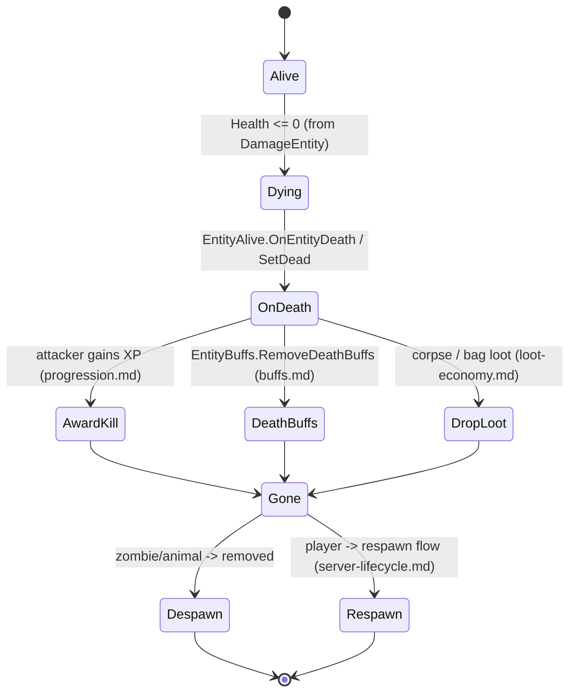

# Combat and damage application (dedicated V3.1.0)

**Owns:** the server-authoritative damage pipeline: `DamageSource` (the damage
descriptor), `EntityAlive.DamageEntity` (armor mitigation, modifiers, health,
crit/dismember), and the death/kill path. This consolidates the damage threads
that touch items, blocks, stats, buffs, and progression.
**Not:** the wire package body layout ([protocol-packages.md](protocol-packages.md)
section 6.11 / [protocol.md](protocol.md) section 6.5, `NetPackageDamageEntity`
write IL=172); item attack authoring ([items.md](items.md)); block
damage ([blocks.md](blocks.md)); the ragdoll/hit VFX (client).
**Evidence:** `DamageSource`, `EntityAlive.DamageEntity` /
`ProcessDamageResponse` IL (dump locally with `tools/src/DumpMethod`, git-ignored).
**Hub:** [`INDEX.md`](INDEX.md). **Method:** [`re-methodology.md`](re-methodology.md).

All damage is resolved on the authoritative server entity, so this is a core
dedicated codepath shared by melee, ranged, traps, explosions, and environment.

---

## 1. The damage descriptor (`DamageSource`)

A hit is described by a `DamageSource`: `EnumDamageSource` (only two members:
`External=0`, `Internal=1`), `EnumDamageTypes` (bashing, suffocation, ...; value 16 =
Suffocation, see [protocol.md](protocol.md) §6.5), direction, the attacker entity
id, and the hit transform. It resolves **where** a hit lands:
`GetEntityDamageBodyPart` / `GetEntityDamageBodyPartAndEquipmentSlot` map the hit
transform to an `EnumBodyPartHit` + `EquipmentSlots`, and `AffectedByArmor` decides
whether armor mitigates it.

Sources that build a `DamageSource`: melee/ranged item actions
([items.md](items.md)), powered traps and turrets
([tile-entities-power.md](tile-entities-power.md),
[vehicles-drones-turrets.md](vehicles-drones-turrets.md)), explosions, environment
(fall, suffocation, temperature), and MinEvent damage actions
([minevents.md](minevents.md)).

---

## 2. Damage application (state machine)

`EntityAlive.DamageEntity(damageSource, strength, criticalHit, impulseScale)`
(**IL=236**) is the server apply. Ordered gates from live IL:

1. If damageType **26**: zombie `AvatarZombieController.CleanupDismemberedLimbs`.
2. **Consecutive-damage ignore:** if `IsIgnoreConsecutiveDamages` and source is
   **not** `Internal` (1): if `damageSourceTimeouts[source]` exists and
   `GameTimer.ticks - last < **30**` return **-1**; else stamp ticks.
3. Resolve attacker; **FriendlyFireCheck** false → **-1**.
4. If damage type is **not** 6 and attacker shares `entityFlags & 2` with victim
   → **-1** (same-faction-ish block).
5. God mode → **-1**. (Dead still continues for some bonus paths.)
6. If not dead and attacker present: passive **161** on attacking item may set
   `DamageMultiplier` + `BonusDamageType = 1` when value &gt; 0.
7. Resistance: `min(1, passive **40**)` scales strength into
   `accumulatedDamageResisted` fractional bank; integer resisted subtracted from
   strength this hit.
8. Core apply: `damageEntityLocal(...)` builds `DamageResponse`.
9. Package `NetPackageDamageEntity`; remote world `SendToServer`; else fan-out
   to tracked (type-6 path uses different exclude id residual).

### 2.1 `damageEntityLocal` (IL=484) builds `DamageResponse`

Live IL order (V3.1.0 b14):

1. Init `DamageResponse`: Source, Strength, Critical, HitDirection default 5,
   MovementState, Random float, ImpulseScale; body part + ArmorSlot +
   ArmorSlotGroup from `DamageSource`.
2. If source has direction: set HitDirection via
   `Utils.Get4HitDirectionAsInt(dir, look)`.
3. If `AffectedByArmor`: `Equipment.CalcDamage` fills Strength and ArmorDamage.

   **`Equipment.CalcDamage` (IL=83):** start `armorDamageTaken = entityDamage`.
   Physical tags (`physicalDamageTypes`): armorRating =
   `GetTotalPhysicalArmorRating/100`; armor damage =
   `max(1 if rating>0 else 0, round(entityDmg * rating))`; entity damage
   reduced by that. Non-physical: entity damage scaled by
   `1 - passive **43**/100` (min 0); armor damage = max(0, original - new).

4. `GetDamageFraction(_damage)` (IL=6) = `_damage / GetMaxHealth()`; Fatal when
   Strength >= Health.
5. Head-part (`HitBodyPart & 2`) and damage-fraction thresholds feed
   dismember chance (source-dependent 0.2 / max(0.5,0.3) / 0.12 / max(0.5,0.5)
   bands in IL).
6. If `canDisintegrate` and fraction high enough: `Disintegrate()` (IL=7):
   `timeStayAfterDeath = 0`, `isDisintegrated = true`.
7. `CheckDismember(ref dr, chance)` (IL=125):
   - Leg hits while alive + (stunned or `sleepingOrWakingUp`): early return.
     **Note:** stock `get_sleepingOrWakingUp` (IL=3) returns only `IsSleeping`
     (name overclaims; no separate wake-state field).
   - `chance = GetDismemberChance(dr, damagePer)` (IL=128):
     primary hit → class mult head/arms/legs; passive **143** scales mult;
     if source `DismemberChance ≥ 100` use 100 else
     `sourceChance * damagePer * mult`; local player debug can force 1.
   - if chance > 0 and rand ≤ chance: set `Dismember`; leg also
     `TurnIntoCrawler`.
   - Else if leg: if `LegCrawlerThreshold > 0` and damage fraction ≥ threshold
     set `TurnIntoCrawler`. If not already crawler path and
     `LegCrippleScale > 0`: `p = fraction * LegCrippleScale`; if p ≥ 0.05 and
     corresponding leg flag not set (4096 left / 8192 right), rand < p sets
     `CrippleLegs`.

**`GetTotalPhysicalArmorRating` (IL=47):** tags = `coreDamageResist` OR
attacking item tags; passive **41** on wearer then passive **163** on attacker
item (armor penetration residual) returns rating percent.

**`ExecuteDismember(restoreState)` (IL=49):** require emodel+avatar. If
crippled leg hit while alive and walkType not 5 and &lt; 20: `SetWalkType(5)`.
`AvatarController.DismemberLimb(bodyDamage, restoreState)`; if
`ShouldBeCrawler` call `SetupCrawler`.

**`BodyDamage.IsAnyLegMissing`:** Flags & **480** != 0.
**`IsAnyArmOrLegMissing`:** Flags & **510** != 0.
**`IsCrippled`:** Flags & **12288** (4096|8192) != 0.

**`ApplyLocalBodyDamage` (IL=188 high-level):** store bodyPartHit + damageType;
on dismember (or debug body part) OR part bits into `Flags` (1/2/4/8/16/32/64/
128/256…); leg-loss paths set `ShouldBeCrawler`; `TurnIntoCrawler` forces it;
`CrippleLegs` ORs 4096 (left) / 8192 (right).

**`SetupCrawler` (IL=49):** if alive: `SetWalkType(21)`; `SetMaxHeight(0.5)`;
bare-hand item from class `PropHandItemCrawler` or default
`meleeHandZombie02`; `inventory.SetBareHandItem`; `TurnIntoCrawler()`.

**`EntityAlive.TurnIntoCrawler` / base `AvatarController.TurnIntoCrawler`:** empty
stubs (`ret` only). Real work is on human subclasses.

**`EntityHuman.TurnIntoCrawler` (IL=33):** if `BoxCollider` present, set
center `(0, 0.35, 0)` and size `(0.8, 0.8, 0.8)`; `SetupBounds()`; re-center
`boundingBox` at `position + center`; `bCanClimbLadders = false`.

**`AvatarHumanController.TurnIntoCrawler` (IL=23):** `isCrawler=true`;
`crawlerTime=Time.time`; `isSuppressPain=true`; animator int
`hitBodyPartHash=0`; `SetWalkType(21, false)`; trigger `toCrawlerTriggerHash`.

**`SetWalkType(w)` (IL=36):** no-op if already crawler (21). Setting **21**:
store walkType; avatar `TurnIntoCrawler`; clear `walkTypeBeforeCrouch`. Else if
`walkTypeBeforeCrouch` set, only update that field; else store walkType and
avatar `SetWalkType(w, true)`.

**Headshot/celebrate static modes:**
`IsHeadshotOnly` ⇔ `HeadshotMode==1`; `IsHeadshotFinisher` ⇔ `==2`.
`IsCelebrate` ⇔ `CelebrateMode==1`; `IsCelebrateHeadshot` ⇔ `==2`.
8. Stun accumulators: body-part mask `207` adds to `StunProne`; leg hits add
   Strength * (crit?2:1) to `StunKnee` when `CanStun` and walkType != 21 and
   not already prone-stun (2).
9. Prone knockdown if `GetDamageFraction(StunProne) >= KnockdownProneDamageThreshold`
   (threshold > 0): Stun=2, duration random in `KnockdownProneStunDuration`.
10. Else kneel if fraction(StunKnee) >= `KnockdownKneelDamageThreshold`:
    Stun=1, duration from `KnockdownKneelStunDuration`.
11. Effective impact score `Strength + ArmorDamage/2`; PainHit / remaining
    health gates; Fatal if post-health would be <= 0; may `AddHealth(-Strength)`
    and `FireEvent` on the local apply path.

### 2.2 `ProcessDamageResponse` (IL=86) net fan-out

1. If `time - lastAliveTime < 1`: return (1 s post-spawn immunity).
2. Base `Entity.ProcessDamageResponse` then `ProcessDamageResponseLocal`.
3. If world not remote:
   - Local attacker + remote player victim: `SendPacketToTrackedPlayers`
     (`NetPackageDamageEntity`).
   - Else if `DamageSource.BuffClass` set: same tracked-players send.
   - Else: `SendPacketToTrackedPlayersAndTrackedEntity` (includes attacker).

### 2.3 `ProcessDamageResponseLocal` (IL=903) apply side effects

High-signal gates from live IL:

- Null emodel: return.
- Local primary-player bonus UI: BonusDamageType 1 = sneak notify, 2 = mult notify.
- Attacker `SetDamagedTarget`; sleeper noise wake + `ConditionalTriggerSleeperWakeUp`.
- Armor wear: split `ArmorDamage` across `Equipment.GetArmor()` pieces
  (`UseTimes += EffectManager.GetValue(PassiveEffects=7, ...) * ItemDegradationModifier`).
- `ApplyLocalBodyDamage`; store `lastDamageResponse`.
- **`FireAttackedEvents` (IL=61):** base entity fire; if no `BuffClass` on source
  (or progression present): set `MinEventContext.DamageResponse`; mark
  `IsLocal` for local non-remote player attacker; fire MinEvent type **8**
  (`onOtherAttacked` path) via `FireEvent` or progression-only when buff-sourced;
  clear `IsLocal`.
- Dismember resist passives 175/176 can zero dismember; else impact force +
  `ExecuteDismember`.
- Enemy headshot-only / headshot-finisher: non-head hits can zero Strength/Fatal
  when `IsHeadshotOnly` / `IsHeadshotFinisher` and no `nohead` tag.
- Stun type 2 (prone): ragdoll if crit bashing or rand < 0.6; else `BeginStun`;
  duration full or *0.5 if already stunned differently.
- Stun type 1 (kneel): ragdoll upgrade on crit or rand < 0.25; else BeginStun.
- PainHit: accumulate `painResistPercent` (cap 3) from
  `EntityClass.PainResistPerHit` (+ low-health variant); drive
  `StartAnimationHit` with resist-scaled intensity.
- Health subtract (god mode skip); wounded FireEvent type 7; on death set
  `entityThatKilledMe` and `Entity.Kill`; electrocute if damage type 10;
  `SetRevengeTarget` (`revengeTimer = **500**` if non-null);
  `EAIManager.DamagedByEntity` stops any `EAIDestroyArea`; FireEvent 106 on
  player attacker and victim.

**`SetStun` / `ClearStun`:** set/clear `bodyDamage.CurrentStun` (+ zero duration
on clear); cvar `_stunned` = **1** / **0**.

**`DoRagdoll(dmResponse)`:** `emodel.DoRagdoll(dm, mode0, StunDuration)`.

**`Kill(dmResponse)` (IL=40):** `NotifySleeperDeath`; detach if attached; if
`deathUpdateTime==0` play death sound; if already dead `SetDead` ret; else
`ClientKill` then `Entity.Kill`.

**`AwardKill(killer)` (IL=66):** if killer is other player: count zombie
(entityType **2**) or player (**1**) kill; `GameManager.AwardKill`; if holding
`gunHandgunT2Magnum44` score flag **2**; `AddScoreServer(entityId, zKills,
pKills, team, scoreFlag)`.

```mermaid
stateDiagram-v2
  [*] --> Incoming
  Incoming --> Ignored: entity already dead / invulnerable -> return
  Incoming --> Resolve: DamageSource resolves body part + equipment slot
  Resolve --> Armor: AffectedByArmor -> mitigate, apply ArmorDamage to the slot
  Resolve --> NoArmor: not affected by armor
  Armor --> Modifiers: buff / passive-effect damage modifiers (buffs.md)
  NoArmor --> Modifiers
  Modifiers --> ApplyHealth: damageEntityLocal builds DR; health subtract in response
  ApplyHealth --> Response: ProcessDamageResponse (pain, crit, dismember, stun)
  Response --> Survives: Health > 0
  Response --> Dies: Health <= 0
  Survives --> [*]
  Dies --> Death
  Death --> [*]
```

---

## 3. Death and kill (state machine)

When health reaches zero the entity dies: it awards the kill (XP to the attacker,
[progression.md](progression.md)), clears death buffs
([buffs.md](buffs.md) `RemoveDeathBuffs`), drops loot
([loot-economy.md](loot-economy.md)), and for players enters the respawn path
([server-lifecycle.md](server-lifecycle.md)).

### 3.1 `OnEntityDeath` (IL=146) / `dropItemOnDeath` (IL=105)

**`OnEntityDeath` order:** score bump; stop audio; detach; **`AwardKill(attacker)`**;
death particle via `SpawnParticleEffectServer`; optional death game message;
kill log; **`ModEvents.SEntityKilled`**; **`dropItemOnDeath()`**.

**`dropItemOnDeath` (IL=105):** walk inventory slots; if `ItemClass.CanDrop`,
`ItemDropServer` at pos + (0.5,0,0.5) with lifetime
`Constants.cItemDroppedOnDeathLifetime` and clear slot; flashlight off;
`Equipment.DropItems()`. If `entityThatKilledMe` set:
`lootDropProb = EffectManager(passive **80**, killer.holdingItem,
lootDropProb, killer)`. Then `lootDropProb *= LootContainer.LootBagChance`.
If not `LootContainer.NoLoot` and `lootDropProb > RandomFloat`,
**`Entity.DropBagServer()`**.

**`Entity.DropBagServer` (IL=99, server only):** no-op if already
`EntityLootContainer`. Spawn pos = entity pos with **y+0.9**.

1. If `lootDropProb != 0` and class has `lootDrops`: `LootDropPick(rand)` →
   `CreateEntity` as `EntityLootContainer`, spawn, scale transform **1.25**,
   play `zpack_spawn`, **return** (class loot bag path; bag not used).
2. Else if bag non-empty: create `DroppedLootContainer` entity;
   `OverrideLootList = GetLootList()`; `SetContent(bag slots clone, SlotCount)`;
   copy `bag.Touched`; spawn.

**`EntityClass.LootDropPick` (IL=44):** if `lootDrops.Count < 2` return entry
**0** `entityClass`. Else cumulative weighted pick:
`r = RandomFloat`; walk entries adding `weight` until `r <= sum`; return that
`LootDrop.entityClass`.

**`SetDead` (IL=8):** base `Entity.SetDead` + force `Health.Value = 0`.

**`KillLootContainer` (IL=24):** if local, already dead, corpse block non-air, and
`deathUpdateTime < timeStayAfterDeath`: snap `deathUpdateTime =
timeStayAfterDeath - 1` (almost expire corpse linger). Then base
`Entity.KillLootContainer`.

**`AwardKill` (IL=66):** if killer is a distinct living player: count zombie vs
player kill by `entityType` (1 player / 2 zombie-ish); `GameManager.AwardKill`;
special score condition if holding `gunHandgunT2Magnum44`;
`GameManager.AddScoreServer(killerId, zombieKills, playerKills, team, conditions)`.

**`GameManager.AwardKill` (IL=27):** if killer remote →
`NetPackageEntityAwardKillServer` to killer (flags 192); else local
`QuestEventManager.EntityKilled`.

**`GameManager.AddScoreServer` (IL=56):** client →
`NetPackageEntityAddScoreServer` to server; server: if target remote →
`NetPackageEntityAddScoreClient` to that entity; else local
`EntityAlive.AddScore`.

**`EntityAlive.AddScore` (IL=97):** add to KilledZombies / KilledPlayers / Died;
`Score += zKills*GameStats[28] + pKills*GameStats[29] + died*GameStats[30]`;
if Score &lt; 0 clamp 0. Achievements: died→stat **10**, zombies→**6**, players→**7**;
if `_conditions & 2` (magnum path) achievement **14** += 1.

**`HandleClientDeath` (base IL=1):** empty `ret` (subclasses may override).

**`NotifySleeperDeath` (IL=11):** server + `IsSleeper` only →
`World.NotifySleeperVolumesEntityDied(this)`.

**`ClientKill` (IL=216 high-level):** set `lastHitDirection`; resolve
`entityThatKilledMe` from source if missing; if not already dead: `SetDead`;
`Buffs.OnDeath` (attacking item, is-crushing type **4**, damage tags default
`crushing`); `Progression.OnDeath`; analytics; `HandleClientDeath`;
`OnEntityDeath`; enemy killed by player may spawn celebrate FX via passive
**181** / celebrate flags.

**`OnDeathUpdate` (IL=76):** if `deathUpdateTime < timeStayAfterDeath`
increment by 1. If `DeadBodyHitPoints > 0` and `DeathHealth <= -DeadBodyHitPoints`,
force `deathUpdateTime = timeStayAfterDeath` (early corpse clear). When
`deathUpdateTime >= timeStayAfterDeath` and server not already unloading:
spawn `particleOnDestroy` at head with block light brightness (no explicit
unload in this method; unload is driven elsewhere once stay time elapsed).

**`FireEvent(type, useInventory)` (IL=57):** fan-out
`EntityClass.Effects` → `Progression` → `challengeJournal` → optional
`inventory` (if useInventory) → `equipment` → `Buffs` with `MinEventContext`.

**`SetCVar(name, value)` (IL=13):** `Buffs.SetCustomVar(name, value, netSync=true)`.

External kills (suicide, admin, environment) arrive as `NetPackageDamageEntity`
([protocol.md](protocol.md) §6.5) and funnel into the same `DamageEntity` path, so
the server validates and applies them uniformly.

---

## 4. Dedicated relevance and residuals

- **Server-authoritative:** all mitigation, health changes, death, and kill
  awards are computed on the server; clients send hit requests and animate results.
- **Residual / content:** damage/armor numbers and body-part maps are XML content;
  hit VFX, ragdoll, and gore are client; block damage has its own path
  ([blocks.md](blocks.md)).

---

## Combat leaf types

Leaf types on the edges of the damage flow above:

- **`AttackHitInfo`** (nested in `ItemActionAttack`): the mutable hit-result
  carrier an attack fills in as it resolves, with a block half
  (`blockBeingDamaged`, `hitRef`, `bBlockHit`, `hardnessScale`, `itemsToDrop`,
  `bHarvestTool`) and an entity half (`entityHit`, `damageGiven`, `bKilled`,
  `isCriticalHit`), plus `materialCategory` / `WeaponTypeTag` for surface
  effects; it is threaded through `Block.DamageBlock` / `OnBlockDamaged`, so
  traps (`BlockBarbed`, `BlockBladeTrap`, `BlockMine`) report through the same
  struct the server damage path reads.
- **`BodyParts`** (nested in `BodyAnimator`): a two-field holder (`BodyObj`
  model root + `RightHandT` transform) the avatar controllers use to attach
  held items and locate the active model
  (`AvatarMultiBodyController.GetRightHandTransform`); pure render-rig
  plumbing, **client-only** in practice.
- **`ApplyExplosionForce`**: a MonoBehaviour whose `Explode(pos, power, radius)`
  runs `Physics.OverlapSphereNonAlloc` (1024-collider cap) and applies
  `Rigidbody.AddExplosionForce` with power x20, radius x1.75, upwards
  modifier 3; its only caller is `GameManager.ExplosionClient`, so it is the
  cosmetic debris/ragdoll knockback, **client-only** (explosion damage itself
  is the server path in §2).
- **`StunBeamWeapon`** (nested in `DroneWeapons`, subclass of
  `DroneWeapons.Weapon`, not an `EModel` type): the robotic drone's stun-beam
  mod, constructed in `EntityDrone.LoadMods`; `Fire(target)` writes the
  target's `_droneStunDamage` cvar from the mod item's Quality and applies
  `buffShocked` (the server-relevant gameplay effect, resolved through
  [buffs.md](buffs.md)), then spawns muzzle flash/smoke particles and audio
  (the client render half).

---

## Related docs

| Doc | Role |
|---|---|
| [items.md](items.md) | Attack item actions that build a DamageSource |
| [entity-stats.md](entity-stats.md) | Health the damage is applied to |
| [buffs.md](buffs.md) | On-hit / death buffs, damage modifiers |
| [progression.md](progression.md) | Kill XP award |
| [protocol.md](protocol.md) | `NetPackageDamageEntity` wire body (§6.5) |
| [blocks.md](blocks.md) | Block damage (separate but parallel) |

## Changelog

- **2026-08-07:** damageEntityLocal IL=484 DR build (armor, dismember chance,
  StunProne/StunKnee thresholds, Fatal); ProcessDamageResponse net fan-out;
  ProcessDamageResponseLocal IL=903 (armor wear, headshot gates, stun/pain,
  kill/revenge/FireEvent).
- **2026-08-07:** LootDropPick weighted entityClass; DropBagServer dual path;
  dropItemOnDeath passive 80 + LootBagChance.
- **2026-08-07:** SetRevengeTarget 500; DamagedByEntity stops DestroyArea;
  SetStun/_stunned; Kill NotifySleeperDeath; AwardKill magnum score flag 2.
- **2026-08-07:** ClientKill buff/progression; OnDeathUpdate DeadBodyHitPoints;
  FireEvent fan-out; NotifySleeperDeath volumes.
- **2026-08-07:** AddScore GameStats 28/29/30 + ach 6/7/10/14; GetMaxAttackTime 10;
  SleeperVolume.EntityDied/ClearedUpdate pref 88.
- **2026-08-07:** DamageEntity gates: type26 cleanup; consecutive 30 ticks;
  flags&2 block; passive 161 bonus; passive 40 resist bank.
- **2026-08-07:** Equipment.CalcDamage physical vs passive 43; CheckDismember
  crawler/cripple; Disintegrate zeros corpse stay; FireAttackedEvents type 8.
- **2026-08-07:** GetDismemberChance head/arm/leg mult + passive 143; armor
  rating 41/163; ExecuteDismember walkType 5; Flags 480/510; sleepingOrWakingUp=IsSleeping.
- **2026-08-07:** SetupCrawler walkType 21 height 0.5; SetWalkType crawler lock;
  HeadshotMode/CelebrateMode enums; IsCrippled 12288.
- **2026-08-07:** EntityHuman.TurnIntoCrawler collider 0.8 cube; AvatarHuman
  isCrawler + walkType 21 trigger; base TurnIntoCrawler stubs.
- **2026-08-07:** KillLootContainer snaps deathUpdateTime near linger end.
- **2026-08-07:** DamageEntity IL=236 gate order (consecutive timeout, FF, god,
  dead, EffectManager mult, damageEntityLocal, S2C package).
- **2026-08-07:** NetPackageDamageEntity Process IL=172 local-player early outs
  (damageTyp 15 discard; ambient src0 + typ 1/25 + attacker -1 discard).
- **2026-07-28:** Wire pointer to protocol-packages 6.11; ProcessPackage apply entry.

- **2026-07-23:** Initial combat/damage reversal (DamageSource, DamageEntity apply, death/kill path) consolidating the cross-system damage flow, with state machines.
- **2026-07-24:** Added combat leaf narration (`AttackHitInfo`, `BodyParts`, `ApplyExplosionForce`, `StunBeamWeapon`); of these only `BodyParts` and `ApplyExplosionForce` are client-only (`AttackHitInfo` is server damage state and `StunBeamWeapon` applies a server buff).
