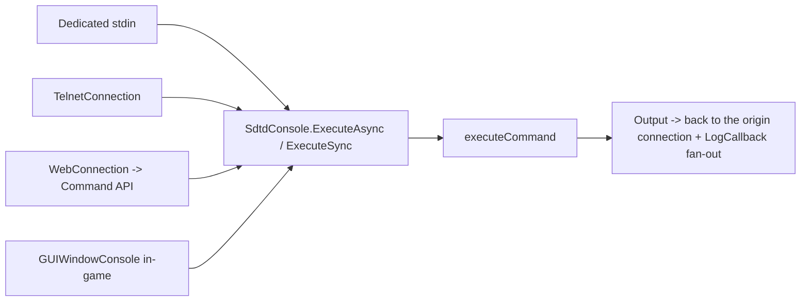
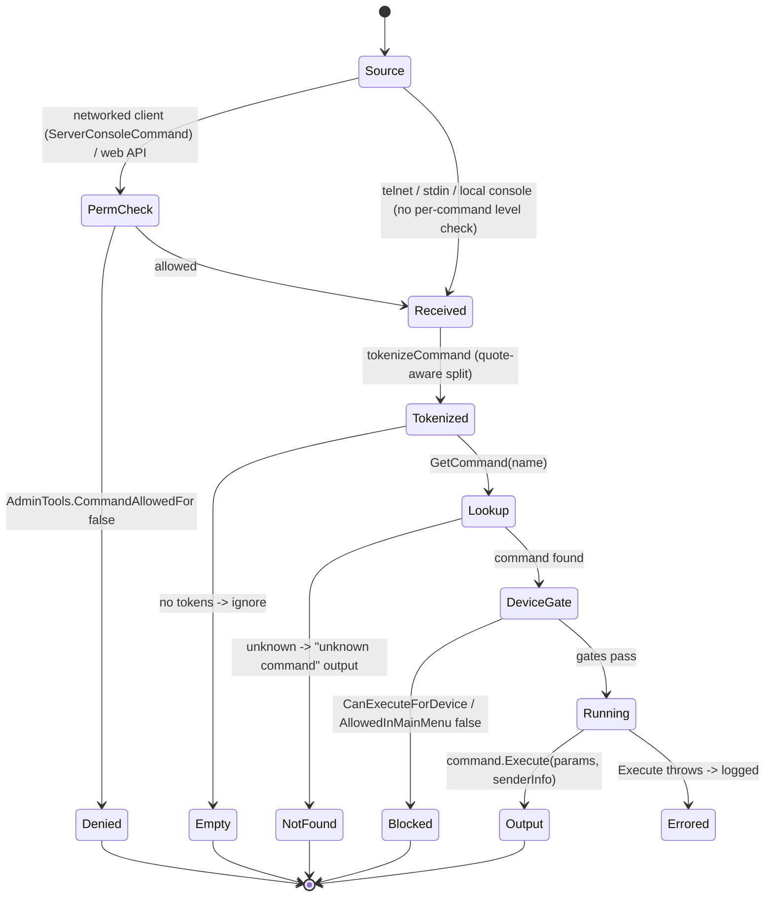
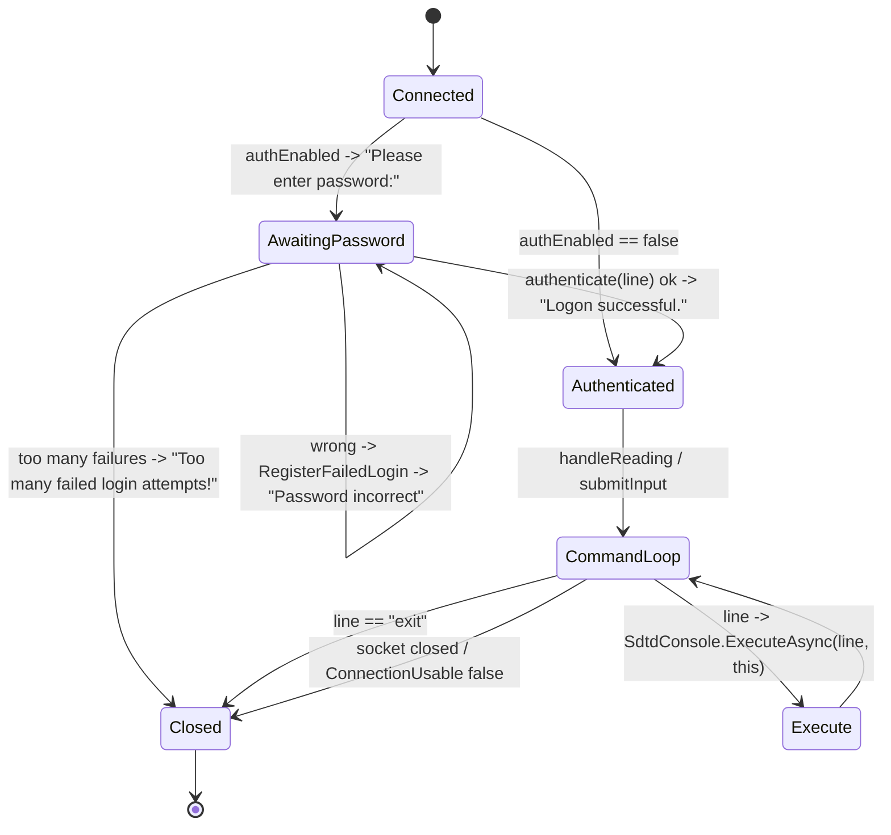

# Console and telnet command system (dedicated V3.1.0)

**Owns:** the server admin command surface: `SdtdConsole` (command registry +
dispatch), `ConsoleCmdAbstract` (the 187-command contract), the connection sources
(`TelnetConnection`, in-game console, and `WebConnection` from the web server), and
the permission gate.
**Not:** each command's own effect (187 leaf commands, content/feature specific);
the telnet TCP socket internals (native).
**Evidence:** `SdtdConsole`, `ConsoleCmdAbstract`, `ConsoleConnectionAbstract`,
`TelnetConnection` IL (dump locally with `tools/src/DumpMethod`, git-ignored).
**Hub:** [`INDEX.md`](INDEX.md). **Method:** [`re-methodology.md`](re-methodology.md).

The console is the primary way to administer a headless server (stdin, telnet, or
the web dashboard's Command API (`Webserver.WebAPI.APIs.Command`;
[webserver.md](webserver.md) section 6.0), so it is a core dedicated codepath.

---

## 1. Architecture

`SdtdConsole` is a singleton MonoBehaviour. At startup `RegisterCommands`
**reflection-discovers** every `IConsoleCommand` (i.e. `ConsoleCmdAbstract`
subclass) and registers each of its name aliases into a `SortedList<name, command>`
via `RegisterCommand`. A command's required access is its explicit entry in
`AdminCommands` (permissions) or, failing that, its `DefaultPermissionLevel`.

Multiple **connection sources** feed the same dispatcher (all implement
`IConsoleConnection` / extend `ConsoleConnectionAbstract`):



`RegisterServer(IConsoleServer)` lets the dedicated/telnet server attach; `Output`
+ `LogCallback` fan command results and log lines back to connected clients.
`Update` pumps queued async work each frame.

---

## 2. Command dispatch (state machine)

`ExecuteAsync`/`ExecuteSync` funnel into `executeCommand(line, senderInfo)`, which
tokenizes the line (quote-aware, `tokenizeCommand`), looks up the command by its
first token, gates on `CanExecuteForDevice` / `AllowedInMainMenu`, and runs
`Execute`. **`executeCommand` (IL=149) does not check the permission level** (it
has only the device/main-menu gates). The **per-command permission check lives
upstream** of it, at the trust boundary:

- **Networked client commands** go through
  `ConnectionManager.ServerConsoleCommand(cInfo, cmd)` (IL=125), which calls
  `AdminTools.CommandAllowedFor(cmdNames, clientInfo)` **before** reaching
  `executeCommand`. The web Command API applies the same `CommandAllowedFor` gate.
- **Telnet / stdin / dedicated-console input** call `executeCommand` directly and
  therefore **bypass per-command permission levels** (they are already a trusted
  local operator channel).



**Permission levels** follow the 7DTD admin convention (lower number = more
privileged; 0 is highest). `AdminCommands.IsPermissionDefined` decides whether a
command has an explicit level; otherwise its `DefaultPermissionLevel` applies. The
level is enforced by `AdminTools.CommandAllowedFor` on the networked/web path, not
inside `executeCommand`. `IsExecuteOnClient`, `AllowedInMainMenu`, and
`AllowedDeviceTypes` gate **where** a command may run (device/menu), independently
of **who** may run it.

---

## 3. Telnet connection (state machine)

`TelnetConsole` accepts TCP clients; each becomes a `TelnetConnection` with its own
`HandlerThread`. If telnet auth is enabled the connection must present the password
before any command runs; failed attempts are counted (`RegisterFailedLogin`) and the
connection is dropped after too many.



`HandlerThread` (IL=66) loops while usable: `handleReading` then
`handleWriting`, returns **25** (ms sleep) on success or **-1** to stop.
`handleReading` (IL=60) drains `TcpClient.Available` into a char buffer; CR/LF
ends a line via `submitInput`. `submitInput` sends the completed line to the
dispatcher (so a telnet client and the web Command API reach the exact same
`executeCommand`). `LoginMessage` emits the password prompt; `IsAuthenticated`
gates the command loop.

---

## 4. Network packages (verified)

Admin commands over the game connection (not telnet) use two packages.

**`NetPackageConsoleCmdServer` (ToServer, write IL=8):**

```text
cmd : string
```

`ProcessPackage` → `ConnectionManager.ServerConsoleCommand(Sender, cmd)` (IL=125):
length-guard long commands (log first 20 chars); resolve command; if missing or
not `CanExecuteForDevice`, push error lines via `NetPackageConsoleCmdClient`;
if `IsExecuteOnClient`, forward the cmd string to the client with `bExecute=true`;
else `AdminTools.CommandAllowedFor` then `SdtdConsole.ExecuteSync` and return
output lines with `bExecute=false`.

**`NetPackageConsoleCmdClient` (ToClient, write IL=31):**

```text
lineCount : i32
// lineCount x string
bExecute : bool
```

`ProcessPackage` (client): if `bExecute`, `SdtdConsole.ExecuteSync(lines[0])` and
show results; else only `GUIWindowConsole.AddLines(lines)` (server pushing
output).

Telnet/stdin bypass these packages (section 2).

## 5. The command contract (`ConsoleCmdAbstract`)

Every command subclasses `ConsoleCmdAbstract` and provides:

| Member | Role |
|---|---|
| `GetCommands()` | name + aliases (first is `PrimaryCommand`) |
| `Execute(params, senderInfo)` | the effect (abstract; per-command) |
| `DefaultPermissionLevel` | required access when not explicitly configured |
| `GetDescription()` / `GetHelp()` | `help` output |
| `IsExecuteOnClient` / `AllowedInMainMenu` / `AllowedDeviceTypes` | run-context gates |

There are 187 concrete commands (e.g. `admin`, `whitelist`, `help`, `cvar`,
`prefab`, `loot`, `visitmap`, `profiler`). This count includes the web-dashboard
commands (`webtokens`, `webpermission`, `invalidatecaches`, `createwebuser`,
`openiddebug`), which ship in the **base `Assembly-CSharp`**, not as a mod. Mods can
register additional commands at runtime, above this 187 baseline. The 187 are
enumerated in the [catalog](inventories/console-command-list.md); this doc owns the
framework, not each leaf command.

---

## 6. Dedicated relevance and residuals

- **Core dedicated surface:** stdin, telnet, and the web Command API all dispatch
  through `SdtdConsole.executeCommand` on the server.
- **Shared with the web server:** `WebConnection` (`Webserver`) is a console
  connection, so the web dashboard's Command endpoint is this system with an HTTP
  front (see [webserver.md](webserver.md) §3).
- **Residual:** telnet TCP socket internals; the in-game `GUIWindowConsole` UI
  (client-only); individual command effects (feature/content).

---

## Related docs

| Doc | Role |
|---|---|
| [webserver.md](webserver.md) | Web dashboard, whose Command API reuses this dispatcher |
| [managers.md](managers.md) | Other in-process managers |
| [full-surface.md](full-surface.md) | Where this sits in the whole-assembly map |
| [re-methodology.md](re-methodology.md) | How this was reversed |

**Leaf catalog:** every instance is enumerated in [`inventories/console-command-list.md`](inventories/console-command-list.md) (all 187 commands with descriptions).

## Changelog

- **2026-07-28:** WebAPI Command endpoint cross-link.

- **2026-07-28:** Telnet HandlerThread 25ms loop; ServerConsoleCommand permission/client-exec path.

- **2026-07-28:** NetPackageConsoleCmdServer/Client wire bodies.

- **2026-07-23:** Initial console/telnet command-system reversal (registry, dispatch + permission gate, telnet auth) with state machines.
