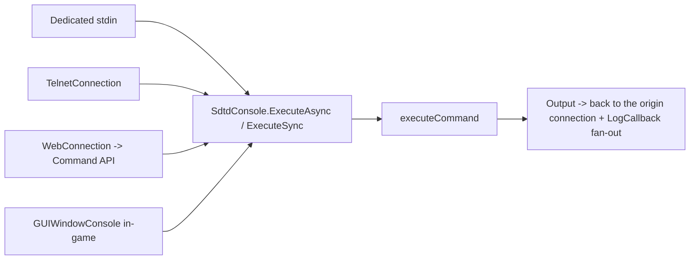
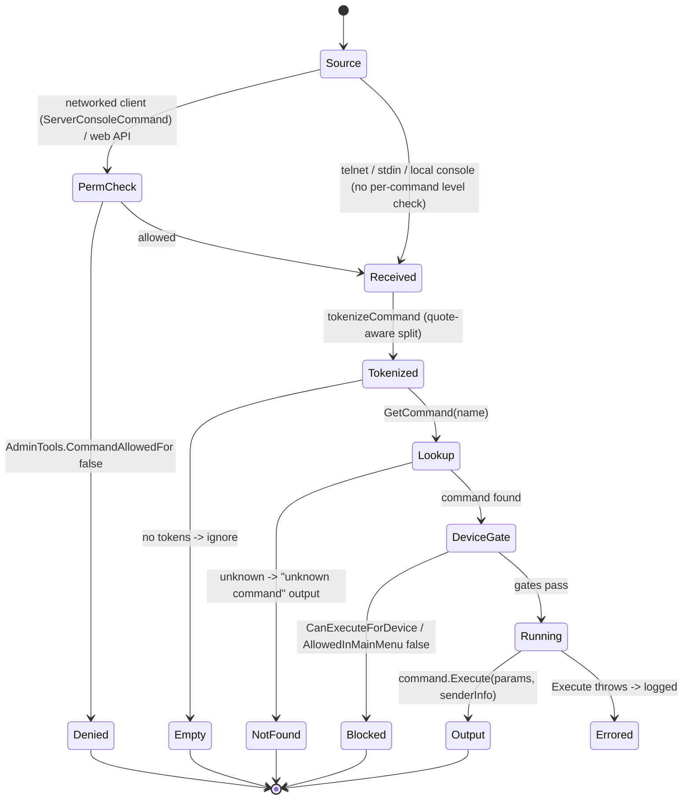
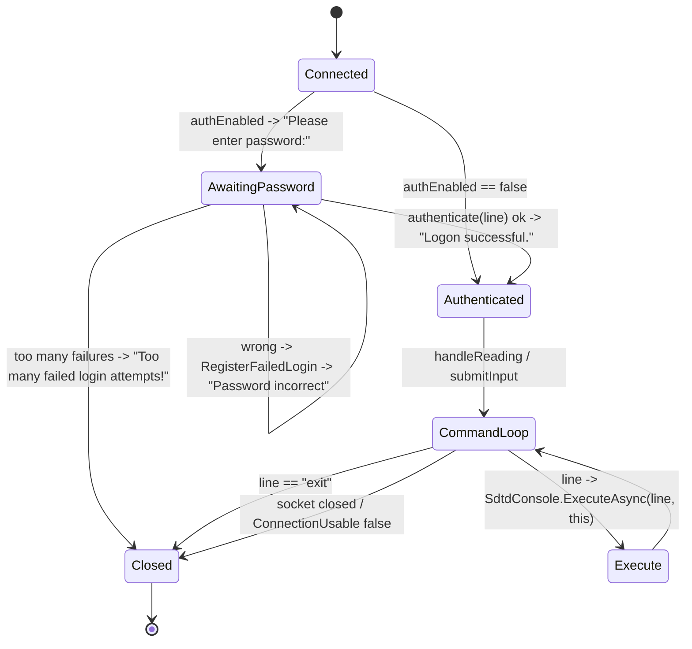

# Console and telnet command system (dedicated V3.1.0)

**Owns:** the server admin command surface: `SdtdConsole` (command registry +
dispatch), `ConsoleCmdAbstract` (the 187-command contract), the connection sources
(`TelnetConnection`, in-game console, and `WebConnection` from the web server), and
the permission gate.
**Not:** each command's own effect (187 leaf commands, content/feature specific);
the telnet TCP socket internals (native).
**Evidence:** `SdtdConsole`, `ConsoleCmdAbstract`, `ConsoleConnectionAbstract`,
`TelnetConnection` IL (dump locally with `tools/src/DumpMethod`, git-ignored).
**Hub:** [`INDEX.md`](INDEX.md). **Method:** [`re-methodology.md`](re-methodology.md).

The console is the primary way to administer a headless server (stdin, telnet, or
the web dashboard's Command API (`Webserver.WebAPI.APIs.Command`;
[webserver.md](webserver.md) section 6.0), so it is a core dedicated codepath.

---

## 1. Architecture

`SdtdConsole` is a singleton MonoBehaviour. At startup `RegisterCommands`
**reflection-discovers** every `IConsoleCommand` (i.e. `ConsoleCmdAbstract`
subclass) and registers each of its name aliases into a `SortedList<name, command>`
via `RegisterCommand`. A command's required access is its explicit entry in
`AdminCommands` (permissions) or, failing that, its `DefaultPermissionLevel`.

Multiple **connection sources** feed the same dispatcher (all implement
`IConsoleConnection` / extend `ConsoleConnectionAbstract`):



`RegisterServer(IConsoleServer)` lets the dedicated/telnet server attach; `Output`
+ `LogCallback` fan command results and log lines back to connected clients.

**`Update` pump (IL=60):** each frame, when `m_commandsToExecuteAsync` is
non-empty, executes **exactly one** queued async command under the list's
`Monitor` lock: builds a `CommandSenderInfo` (`IsLocalGame=false`,
`NetworkConnection = entry.sender`), runs
`executeCommand(command, senderInfo)` (exceptions logged via `Log.Exception`),
sends the result lines back through `entry.sender.SendLines`, and removes the
entry (`RemoveAt(0)`) - a FIFO one-per-frame drain, so N queued commands take N
frames on the main thread.

---

## 2. Command dispatch (state machine)

`ExecuteAsync`/`ExecuteSync` funnel into `executeCommand(line, senderInfo)`, which
tokenizes the line (quote-aware, `tokenizeCommand`), looks up the command by its
first token, gates on `CanExecuteForDevice` / `AllowedInMainMenu`, and runs
`Execute`. **`executeCommand` (IL=149) does not check the permission level** (it
has only the device/main-menu gates). The **per-command permission check lives
upstream** of it, at the trust boundary:

- **Networked client commands** go through
  `ConnectionManager.ServerConsoleCommand(cInfo, cmd)` (**IL=125**):
  1. If `cmd.Length > 300`: log warning (length + first 20 chars) and **return**
     (no package reply).
  2. Resolve command via `SdtdConsole.GetCommand`.
  3. If missing / `!CanExecuteForDevice`: reply `NetPackageConsoleCmdClient` error
     (`Unknown command` / device message).
  4. **`AdminTools.CommandAllowedFor(cmdNames, clientInfo)`** gate (null
     `adminTools` treated as deny).
  5. If `IsExecuteOnClient`: log and send command line back to client for local
     execute (`NetPackageConsoleCmdClient` with execute flag).
  6. Else `SdtdConsole.ExecuteSync(cmd, clientInfo)` and send output lines package.
  7. Denied: localized `msgServer25` permission error package.

`NetPackageConsoleCmdClient.ProcessPackage` (IL=19) is the client-side
executor: with the execute flag it runs `SdtdConsole.ExecuteSync(lines[0],
sender)` (the server-gated command re-executed locally, e.g. a UI command)
and shows the result via `GUIWindowConsole.AddLines`; without the flag it
just appends the carried output lines - the two halves of the round-trip.
  The web Command API applies the same `CommandAllowedFor` gate.
- **Telnet / stdin / dedicated-console input** call `executeCommand` directly and
  therefore **bypass per-command permission levels** (they are already a trusted
  local operator channel).



**Permission levels** follow the 7DTD admin convention (lower number = more
privileged; 0 is highest). `AdminCommands.IsPermissionDefined` decides whether a
command has an explicit level; otherwise its `DefaultPermissionLevel` applies. The
level is enforced by `AdminTools.CommandAllowedFor` on the networked/web path, not
inside `executeCommand`.

**`CommandAllowedFor` (IL=12):**  
`allowed = !(GetCommandPermissionLevel(cmdNames) < GetUserPermissionLevel(client))`  
i.e. user level must be **≤** command required level (lower/equal is more
privileged). `IsExecuteOnClient`, `AllowedInMainMenu`, and `AllowedDeviceTypes`
gate **where** a command may run (device/menu), independently of **who** may run it.

### 2.1 High-value admin `Execute` leaves (IL re-pin 2026-08-07)

Catalog of all names: [inventories/console-command-list.md](inventories/console-command-list.md).
Selected dedi-critical Execute bodies:

| Command type | Execute IL | Behaviour |
|---|---:|---|
| `ConsoleCmdKillAll` | 92 | Optional `alive` / `all` filters; walk world entities; `Entity.DamageEntity` with large strength; log damage lines |
| `ConsoleCmdSpawnEntity` | 280 | Lists players/entity numbers when short args; otherwise builds spawn near player/pos via entity class lookup (large help/list branch) |
| `ConsoleCmdTeleport` | 141 | **Client-only** for local player (`"use teleportplayer instead"` on remote); offset/player destination via `ConsoleCmdTeleportsAbs.ExecuteTeleport` |
| `ConsoleCmdSetTime` | 145 | `day` / `night` presets via `GameUtils.DayTimeToWorldTime`, or raw u64 parse; multi-arg day/hour/min variants |
| `ConsoleCmdSaveWorld` | 12 | If server: `SaveLocalPlayerData` + `SaveWorld`; output `World saved` |
| `ConsoleCmdShutdown` | 5 | Output `Shutting server down...` then `Application.Quit()` |
| `ConsoleCmdMem` | 480 | Subcommands: `gc` (GC stats / incremental collector), editor/mem dump branches (large) |
| `ConsoleCmdWeather` | 465 | Dumps biome weather / WeatherManager state; mutator subcommands for weather params |
| `ConsoleCmdGetGamePrefs` | 73 | Optional filter string; lists allowed prefs `GamePref.X = value` via `prefAccessAllowed` |
| `ConsoleCmdSetGamePref` | 58 | `GamePrefs.Parse` + `SetObject`; errors on bad pref/value |
| `ConsoleCmdCreateWebUser` | 96 | In-game console only; server builds registration token/URL for web dashboard user |
| `ConsoleCmdLogGameState` | 97 | 1-2 args; optional bool; client restriction on second param |
| `ConsoleCmdAdmin` | 70 | `add` / `remove` / `addgroup` / `removegroup` / `list` on `AdminTools.Users`: `ExecuteAdd` parses name/id via `ConsoleHelper.ParseParamPartialNameOrId` + int level -> `AdminUsers.AddUser(name, id, level)`; `ExecuteAddGroup` -> `AdminUsers.AddGroup(name, groupId, regularLevel, moderatorLevel)`; `ExecuteList` prints the `Defined User/Group Permissions:` tables |
| `ConsoleCmdWhitelist` | 70 | Same subcommand shape on `AdminTools.Whitelist` (`AdminWhitelist`): `ExecuteAdd` resolves an entity id / player name / user id (`" is not a valid entity id, player name or user id."`), group variant validates the steam group id |
| `ConsoleCmdPermissionsAllowed` | 134 | `i/info` / `g/grant` / `rev/revoke` / `res/resolve` subcommands over the permission table (span-based dispatch, `Unknown sub-command:` fallback) |
| `ConsoleCmdCVar` | 65 | `get` / `set` / `track` / `list` subcommands; `ExecuteGet` resolves the player by id (`Could not find player matching ID {0}.`) and reads a CVar |
| `ConsoleCmdGetSandboxOptions` | 20 | Optional bool arg; `LogOptions(GameStats.GetString(71), flag, LogType)` |
| `ConsoleCmdSaveDataManagerInfo` | 20 | Builds `AppendSaveDataManagerInfo` + `AppendSaveGameProviderInfo` text and `Log.Out`s it |
| `ConsoleCmdVisitPois` | 10 (+87) | Client-oriented POI tour: `start` / `pause` / `reset` subcommands teleport the local player through the decorator's prefabs (`No local player! (Are you in-game?)` on a dedi console) |
| `ConsoleCmdJunkDrone` | 289 | Player-owned drone control: `debuglog` / `help` / `log` (`logPlayerOwnedDrones`) / `unstuck` (teleport; falls back to `jds unstuck` server-side hint) / `clear` (`clearDronesForPlayer`) |
| `ConsoleCmdServerJunkDrone` | 289+ | The server-side twin of `ConsoleCmdJunkDrone` (same subcommand surface, operates on the server drone registry) |
| `ConsoleCmdPrefab` | 492 | Prefab-editor tool (`Command has to be run while in Prefab Editor!`): `load` / `save` / `simplify` / `simplify1` subcommands |
| `ConsoleCmdChallenges` | 65 | Client-only (`Cannot execute {0} on dedicated server, please execute as a client`): `list/l` / `complete/c` / `groups/g` subcommands |

Full per-command description strings remain in the inventory catalog; this table is
the **server-effect** pin for operators and clone fidelity.

---

## 3. Telnet connection (state machine)

`TelnetConsole` accepts TCP clients; each becomes a `TelnetConnection` with its own
`HandlerThread`. If telnet auth is enabled the connection must present the password
before any command runs; failed attempts are counted (`RegisterFailedLogin`) and the
connection is dropped after too many. The lockout is per endpoint:
`loginAttemptsPerIP` (`Dictionary<Int32, LoginAttempts>` keyed by the
connection's `EndPointHash`) with the console's `maxLoginAttempts` /
`blockTimeSeconds` settings. `LoginAttempts` (fields `count` / `lastAttempt`)
implements the window: `LogAttempt()` (IL=14) stamps `lastAttempt = Now`,
increments `count`, and returns `count < maxLoginAttempts` (still allowed);
`IsBanned()` (IL=20) resets `count = 0` when `(Now - lastAttempt).TotalSeconds`
exceeds `blockTimeSeconds` (the window expired), then returns
`count == maxLoginAttempts`. `AcceptClient` runs `IsBanned()` on the new
endpoint before creating the connection, so a banned IP is refused outright
until the window lapses.



`HandlerThread` (IL=66) loops while usable: `handleReading` then
`handleWriting`, returns **25** (ms sleep) on success or **-1** to stop.
`handleReading` (IL=60) drains `TcpClient.Available` into a char buffer; CR/LF
ends a line via `submitInput`. `submitInput` sends the completed line to the
dispatcher (so a telnet client and the web Command API reach the exact same
`executeCommand`). `LoginMessage` emits the password prompt; `IsAuthenticated`
gates the command loop.

---

## 4. Network packages (verified)

Admin commands over the game connection (not telnet) use two packages.

**`NetPackageConsoleCmdServer` (ToServer, write IL=8):**

```text
cmd : string
```

`ProcessPackage` → `ConnectionManager.ServerConsoleCommand(Sender, cmd)` (IL=125):
length-guard long commands (log first 20 chars); resolve command; if missing or
not `CanExecuteForDevice`, push error lines via `NetPackageConsoleCmdClient`;
if `IsExecuteOnClient`, forward the cmd string to the client with `bExecute=true`;
else `AdminTools.CommandAllowedFor` then `SdtdConsole.ExecuteSync` and return
output lines with `bExecute=false`.

**`NetPackageConsoleCmdClient` (ToClient, write IL=31):**

```text
lineCount : i32
// lineCount x string
bExecute : bool
```

`ProcessPackage` (client): if `bExecute`, `SdtdConsole.ExecuteSync(lines[0])` and
show results; else only `GUIWindowConsole.AddLines(lines)` (server pushing
output).

Telnet/stdin bypass these packages (section 2).

## 5. The command contract (`ConsoleCmdAbstract`)

Every command subclasses `ConsoleCmdAbstract` and provides:

| Member | Role |
|---|---|
| `GetCommands()` | name + aliases (first is `PrimaryCommand`) |
| `Execute(params, senderInfo)` | the effect (abstract; per-command) |
| `DefaultPermissionLevel` | required access when not explicitly configured |
| `GetDescription()` / `GetHelp()` | `help` output |
| `IsExecuteOnClient` / `AllowedInMainMenu` / `AllowedDeviceTypes` | run-context gates |

There are **188** concrete commands in the V3.1.0 catalog (e.g. `admin`, `whitelist`,
`help`, `cvar`, `logenv`, `prefab`, `loot`, `visitmap`, `profiler`). This count includes
the web-dashboard commands (`webtokens`, `webpermission`, `invalidatecaches`,
`createwebuser`, `openiddebug`), which ship in the **base `Assembly-CSharp`**, not as a
mod. Mods can register additional commands at runtime above this baseline. The catalog
enumerates every leaf ([inventories/console-command-list.md](inventories/console-command-list.md));
this doc owns the framework, not each leaf command's full prose.

---

## 6. Dedicated relevance and residuals

- **Core dedicated surface:** stdin, telnet, and the web Command API all dispatch
  through `SdtdConsole.executeCommand` on the server.
- **Shared with the web server:** `WebConnection` (`Webserver`) is a console
  connection, so the web dashboard's Command endpoint is this system with an HTTP
  front (see [webserver.md](webserver.md) §3).
- **Residual:** telnet TCP socket internals; the in-game `GUIWindowConsole` UI
  (client-only); individual command effects (feature/content).

## 7. Command index (catalogued leaves)

Every `ConsoleCmdAbstract` leaf is catalogued with its primary name and a one-line
effect in [inventories/console-command-list.md](inventories/console-command-list.md);
this index names the leaves for the coverage census. Dispatch/permission behaviour
is in the framework sections above; per-command effects are the catalog's role.

| Command type | Primary name | Effect |
|---|---|---|
| `ConsoleCmdAI` | `ai` | AI commands |
| `ConsoleCmdAIDirectorDebug` | `aiddebug` | Toggles AIDirector debug output. |
| `ConsoleCmdAIDirectorShowNextWanderingHordeTime` | `shownexthordetime` | Displays the wandering horde time |
| `ConsoleCmdAIDirectorSpawnAirDrop` | `spawnairdrop` | Spawns an air drop |
| `ConsoleCmdAIDirectorSpawnHorde` | `spawnwandering` | Spawn wandering entities |
| `ConsoleCmdAIDirectorSpawnScouts` | `spawnscouts` | Spawns zombie scouts |
| `ConsoleCmdAIDirectorSpawnSupplyCrate` | `spawnsupplycrate` | Spawns a supply crate where the player is |
| `ConsoleCmdAccDecay` | `AccDecay` | Accuracy Decay for guns, show/hide/reset/<Decimal value> |
| `ConsoleCmdAudioManager` | `audio` | Watch audio stats |
| `ConsoleCmdAutoMove` | `automove` | Player auto movement |
| `ConsoleCmdBents` | `bents` | Switches block entities on/off or counts them |
| `ConsoleCmdBuff` | `buff` | Applies a buff to the local player |
| `ConsoleCmdBuffPlayer` | `buffplayer` | Apply a buff to a player |
| `ConsoleCmdBugReportOcclusionManager` | `testoccreport` | Test the occlusion manager self reporting to backtrace, requires Backtrace to be enabled at build creation |
| `ConsoleCmdCamera` | `camera` | Lock/unlock camera movement or load/save a specific camera position |
| `ConsoleCmdCensor` | `testCensor` | Censorship testing toggle. |
| `ConsoleCmdChunkCache` | `chunkcache` | shows all loaded chunks in cache |
| `ConsoleCmdCommandPermissions` | `commandpermission` | Manage command permission levels |
| `ConsoleCmdConfig` | `config` | Import/export config data from/to external file |
| `ConsoleCmdCreativeMenu` | `creativemenu` | enables/disables the creativemenu |
| `ConsoleCmdDMS` | `dms` | Gives control over Dynamic Music functionality. |
| `ConsoleCmdDamageReset` | `damagereset` | Reset damage on all blocks in the currently loaded POI |
| `ConsoleCmdDebuff` | `debuff` | Removes a buff from the local player |
| `ConsoleCmdDebuffPlayer` | `debuffplayer` | Remove a buff from a player |
| `ConsoleCmdDebugGameStats` | `debuggamestats` | GameStats commands |
| `ConsoleCmdDebugJiggle` | `debugjiggle` | (no description) |
| `ConsoleCmdDebugMenu` | `debugmenu` | enables/disables the debugmenu |
| `ConsoleCmdDebugPanels` | `debugpanels` | allows usage of debug display panels (F3 menu) via command console |
| `ConsoleCmdDebugShot` | `debugshot` | Creates a screenshot with some debug information |
| `ConsoleCmdDebugWeather` | `debugweather` | Dumps internal weather state to the console. |
| `ConsoleCmdDecoMgr` | `decomgr` | "decomgr": Saves a debug texture visualising the DecoOccupiedMap. "decomgr state": Saves a debug texture visualising the location/state of all of the DecoObjects saved in decorations.7dtd. |
| `ConsoleCmdDiscord` | `discord` | Toggle Discord debug window |
| `ConsoleCmdDismemberment` | `testDismemberment` | Dismemberment testing toggle. |
| `ConsoleCmdDynamicProperties` | `dynamicproperties` | Dynamic Properties debugging |
| `ConsoleCmdExhausted` | `exhausted` | Makes the player exhausted. |
| `ConsoleCmdExportCurrentConfigs` | `exportcurrentconfigs` | Exports the current game config XMLs |
| `ConsoleCmdExportPrefab` | `exportprefab` | Exports a prefab from a world area |
| `ConsoleCmdFallingBlocks` | `fallingblocks` | FallingBlocks WIP Settings |
| `ConsoleCmdFloatingOrigin` | `floatingorigin` | (no description) |
| `ConsoleCmdFov` | `fov` | Camera field of view |
| `ConsoleCmdGameStage` | `gamestage` | Shows the gamestage of the local player |
| `ConsoleCmdGetGameStats` | `getgamestat` | Gets game stats |
| `ConsoleCmdGetLogfilePath` | `getlogpath` | Get the path of the logfile the game currently writes to |
| `ConsoleCmdGetOptions` | `getoptions` | Gets game options |
| `ConsoleCmdGetTime` | `gettime` | Get the current game time |
| `ConsoleCmdGiveQualityItem` | `giveself` | usage: giveself itemName [qualityLevel= |
| `ConsoleCmdGiveQuest` | `givequest` | Gives a quest to the player or add to quest tier |
| `ConsoleCmdGiveXp` | `givexp` | Give XP to a player |
| `ConsoleCmdGraph` | `graph` | Draws graphs on screen |
| `ConsoleCmdHelp` | `help` | Help on console and specific commands |
| `ConsoleCmdKick` | `kick` | Kicks user with optional reason. "kick playername reason" |
| `ConsoleCmdKickAll` | `kickall` | Kicks all users with optional reason. "kickall reason" |
| `ConsoleCmdKill` | `kill` | Kill a given entity |
| `ConsoleCmdLights` | `lights` | Light debugging |
| `ConsoleCmdListDLC` | `listdlc` | List the available DLC and their current entitlement status. |
| `ConsoleCmdListEntities` | `listents` | lists all entities |
| `ConsoleCmdListGameObjects` | `lgo` | List all active game objects |
| `ConsoleCmdListPlayerIds` | `listplayerids` | Lists all players with their IDs for ingame commands |
| `ConsoleCmdListPlayers` | `listplayers` | lists all players |
| `ConsoleCmdListThreads` | `listthreads` | lists all threads |
| `ConsoleCmdLogFellThroughWorldDebugInfo` | `ftw` | Log the fell through world debug information for testing purposes. |
| `ConsoleCmdLogLevel` | `loglevel` | Telnet/Web only: Select which types of log messages are shown |
| `ConsoleCmdLogOwnedEntities` | `playerOwnedEntities` | Lists player owned entities. |
| `ConsoleCmdLoot` | `loot` | Loot commands |
| `ConsoleCmdMapData` | `mapdata` | Writes some map data to an image |
| `ConsoleCmdMemCl` | `memcl` | Prints memory information on client and calls garbage collector |
| `ConsoleCmdMemoryProfiler` | `memprofile` | Toggles screen Memory Profiler UI |
| `ConsoleCmdMeshDataManager` | `meshdatamanager` | Toggle the MeshDataManager |
| `ConsoleCmdMumblePositionalAudio` | `mumblepositionalaudio` | Mumble Positional Audio related tools |
| `ConsoleCmdNetworkClient` | `networkclient` | Client side network commands |
| `ConsoleCmdNetworkServer` | `networkserver` | Server side network commands |
| `ConsoleCmdNewAvatarTest` | `na` | Test new HD stuff. |
| `ConsoleCmdNewWeatherSurvival` | `newweathersurvival` | Enables/disables new weather survival |
| `ConsoleCmdOcclusion` | `occlusion` | Control OcclusionManager |
| `ConsoleCmdOverlapRecovery` | `overlap` | Toggle LocalPlayer's Character Controller Overlap Recovery |
| `ConsoleCmdOverrideServerMaxPlayerCount` | `overridemaxplayercount` | Override Max Server Player Count |
| `ConsoleCmdPIRS` | `pirs` | tbd |
| `ConsoleCmdPOIWaypoints` | `poiwaypoints` | Adds waypoints for specified POIs. |
| `ConsoleCmdPPList` | `pplist` | Lists all PersistentPlayer data |
| `ConsoleCmdPathTest` | `pathtest` | enable a path testing utility mode |
| `ConsoleCmdPerformanceProfiler` | `performanceprofiler` | Performance Profiling Utility |
| `ConsoleCmdPlaceBlockRotations` | `placeblockrotations` | Places all rotations of the currently held block |
| `ConsoleCmdPlaceObserver` | `chunkobserver` | Place a chunk observer on a given position. |
| `ConsoleCmdPlayerVisitMap` | `playervisitmap` | Teleports the player through a rectangular area with optional memory logging |
| `ConsoleCmdPois` | `pois` | Switches distant POIs on/off |
| `ConsoleCmdPrefabEditor` | `prefabeditor` | Open the Prefab Editor |
| `ConsoleCmdPrefabUpdater` | `prefabupdater` | (no description) |
| `ConsoleCmdPrintChunkExpiryInfo` | `expiryinfo` | Prints location and expiry day/time for the next [x] chunks set to expire. |
| `ConsoleCmdProfiler` | `profiler` | Utilities for collection profiling data from a variety of sources |
| `ConsoleCmdProfiling` | `profiling` | Enable Unity profiling for 300 frames |
| `ConsoleCmdRegionReset` | `regionreset` | Resets chunks within a target region, or for the entire map. |
| `ConsoleCmdReloadEntityClasses` | `reloadentityclasses` | reloads entityclasses xml data. |
| `ConsoleCmdRemoveQuest` | `removequest` | usage: removequest questname |
| `ConsoleCmdRepairChunkDensity` | `repairchunkdensity` | check and optionally fix densities of a chunk |
| `ConsoleCmdResetAchievementStats` | `resetallstats` | Resets all achievement stats (and achievements when parameter is true) |
| `ConsoleCmdSDCS` | `sdcs` | Control entity sex, race, and variant |
| `ConsoleCmdSaveChunkAgeMap` | `agemap` | Output debug map for chunk age/protection/save status. |
| `ConsoleCmdScreenEffect` | `ScreenEffect` | Sets a screen effect |
| `ConsoleCmdSelfExp` | `giveselfxp` | usage: giveselfxp 10000 |
| `ConsoleCmdServerMessage` | `say` | Sends a message to all connected clients |
| `ConsoleCmdSetGameStat` | `setgamestat` | sets a game stat |
| `ConsoleCmdSetTargetFps` | `settargetfps` | Set the target FPS the game should run at (upper limit) |
| `ConsoleCmdSetWaterValue` | `setwatervalue` | Sets the water value for all flow-permitting blocks within the current selection area, specified in the range of 0 (empty) to 1 (full). |
| `ConsoleCmdShow` | `show` | Shows custom layers of rendering. |
| `ConsoleCmdShowAlbedo` | `showalbedo` | enables/disables display of albedo in gBuffer |
| `ConsoleCmdShowChunkData` | `showchunkdata` | shows some date of the current chunk |
| `ConsoleCmdShowClouds` | `showClouds` | Artist command to show one layer of clouds. |
| `ConsoleCmdShowHits` | `showhits` | Show hit entity info |
| `ConsoleCmdShowNormals` | `shownormals` | enables/disables display of normal maps in gBuffer |
| `ConsoleCmdShowSpecular` | `showspecular` | enables/disables display of specular values in gBuffer |
| `ConsoleCmdShowSwings` | `showswings` | Show melee swing arc rays |
| `ConsoleCmdShowTriggers` | `showtriggers` | Sets the visibility of the block triggers. |
| `ConsoleCmdSignTextureManager` | `signtexman` | Allows enabling/disabling the Sign Texture Manager and configuring various baking settings. |
| `ConsoleCmdSleep` | `sleep` | Makes the main thread sleep for the given number of seconds (allows decimals) |
| `ConsoleCmdSleeper` | `sleeper` | Drawn or list sleeper info |
| `ConsoleCmdSmoothPOI` | `smoothpoi` | Smoothens the POI |
| `ConsoleCmdSmoothWorldAll` | `smoothworldall` | Applies some batched smoothing commands. |
| `ConsoleCmdSpawnEntityAt` | `spawnentityat` | Spawns an entity at a give position |
| `ConsoleCmdSpawnScreen` | `SpawnScreen` | Display SpawnScreen |
| `ConsoleCmdSpectatorMode` | `spectator` | enables/disables spectator mode |
| `ConsoleCmdSpectrum` | `spectrum` | Force a particular lighting spectrum. |
| `ConsoleCmdSquareSpiral` | `squarespiral` | Move the player chunk by chunk in a square spiral. Will start off paused and required un-pausing. Also gives god mode and flying at the start. |
| `ConsoleCmdStab` | `stab` | stability |
| `ConsoleCmdStarve` | `starve` | Makes the player starve (optionally specify the amount of food you want to have in percent). |
| `ConsoleCmdSwitchView` | `switchview` | Switch between fpv and tpv |
| `ConsoleCmdSystemInfo` | `SystemInfo` | List SystemInfo |
| `ConsoleCmdTeleportPlayer` | `teleportplayer` | Teleport a given player |
| `ConsoleCmdTeleportPoi` | `tppoi` | Open POI Teleporter window |
| `ConsoleCmdTeleportPoiRelative` | `teleportpoirelative` | Teleport the local player within the current POI |
| `ConsoleCmdTestLoop` | `testloop` | Test code in a loop |
| `ConsoleCmdThirsty` | `thirsty` | Makes the player thirsty (optionally specify the amount of water you want to have in percent). |
| `ConsoleCmdTraderArea` | `traderarea` | ... |
| `ConsoleCmdTransformDebug` | `transformdebug` | Transform Debugging |
| `ConsoleCmdTrees` | `trees` | Switches trees on/off |
| `ConsoleCmdTwitchAdminCommand` | `twitchadmin` | Twitch Admin Commands |
| `ConsoleCmdTwitchCommand` | `twitch` | usage: twitch <command> <params> |
| `ConsoleCmdUIOptions` | `uioptions` | Allows overriding of some options that control the presentation of the UI |
| `ConsoleCmdVersion` | `version` | Get the currently running version of the game and loaded mods |
| `ConsoleCmdVersionUi` | `versionui` | Toggle version number display |
| `ConsoleCmdWorldChunkReset` | `worldchunkreset` | Resets all unprotected chunks across the world. |
| `ConsoleCmdXui` | `xui` | Execute XUi operations |

**`ConsoleCmdPIRS` (the `pirs` command) decoded from `Execute` IL=274:** the
stock `getDescription` is literally `tbd`, so the row above is faithful, but the
command is real. It drives the Player Input Recording System (a perf-testing
input recorder):
- `pirs reset <world>` - deletes `<saveDir>/auto.rec` ("Deleted auto.rec from X"
  / "Savegame had no recordings").
- `pirs play` - `PlayerInputRecordingSystem.Instance.Reset(false)` then
  `GameManager.bPlayRecordedSession = true`, `bRecordNextSession = false`
  ("Start playing").
- `pirs record` - `Reset(true)`, `bPlayRecordedSession = false`,
  `bRecordNextSession = true` ("Start recording").
- `pirs stop` - clears both `GameManager` flags ("Stop recording").
- `pirs save <name>` / `pirs load <name>` - `PlayerInputRecordingSystem`
  `Save` / `load` ("Saving to" / "Loading from").
- bare `pirs <saveName>` - refuses in a running game ("Please start recording
  from the main menu") and when connected to a server ("Recording only possible
  in SP"); otherwise copies `<saveDir>` to `<saveDir>_perftest` (deleting an
  existing copy), sets `GamePrefs.GameWorld` (33) to "Navezgane" and
  `GamePrefs.GameMode` (29) to `EnumGameMode.Survival` (member 1; the enum
  starts at 1 - Survival, Creative, Deathmatch, Horde, SurvivalPVP, SurvivalSP,
  SurvivalMP, EditWorld - there is no 0 member), so the recording session
  starts from a throwaway survival-mode copy. Only the Navezgane world is
  supported ("Only Navezgane is supported for now").

---

## Related docs

| Doc | Role |
|---|---|
| [webserver.md](webserver.md) | Web dashboard, whose Command API reuses this dispatcher |
| [managers.md](managers.md) | Other in-process managers |
| [full-surface.md](full-surface.md) | Where this sits in the whole-assembly map |
| [re-methodology.md](re-methodology.md) | How this was reversed |

**Leaf catalog:** every instance is enumerated in [`inventories/console-command-list.md`](inventories/console-command-list.md) (all 187 commands with descriptions).

## Changelog

- **2026-08-11:** `ConsoleCmdPIRS` (`pirs`) decoded from `Execute` IL=274: the Player Input Recording System (reset/play/record/stop/save/load + bare `pirs <saveName>` perftest-copy flow; stock getDescription is literally `tbd`).
- **2026-08-11:** Console IL re-verified: SdtdConsole.Update IL=60, executeCommand IL=149, ConnectionManager.ServerConsoleCommand IL=125, NetPackageConsoleCmdClient write IL=31 / ProcessPackage IL=19, NetPackageConsoleCmdServer write IL=8, CommandAllowedFor IL=12, TelnetConnection HandlerThread IL=66 / handleReading IL=60, LoginAttempts.LogAttempt IL=14 / IsBanned IL=20 (exact).
- **2026-08-10:** Console IL sizes re-verified: SdtdConsole.Update IL=60, executeCommand IL=149, ConnectionManager.ServerConsoleCommand IL=125, NetPackageConsoleCmdClient.ProcessPackage IL=19 (exact).
- **2026-08-08:** Command index section added (narrates the 141 catalogued
  `ConsoleCmdAbstract` leaves for the coverage census).

- **2026-08-08:** Telnet login lockout window: loginAttemptsPerIP + LoginAttempts count/window mechanics.
- **2026-08-07:** SdtdConsole.Update (IL=60) one-command-per-frame FIFO drain:
  Monitor lock, CommandSenderInfo from entry.sender, executeCommand +
  Log.Exception, SendLines, RemoveAt(0).
- **2026-08-07:** ServerConsoleCommand 300-char reject; null adminTools deny;
  msgServer25 deny string.
- **2026-08-07:** CommandAllowedFor IL=12 level compare; ServerConsoleCommand
  IL=125 step list.
- **2026-08-07:** §2.1 high-value admin Execute IL table (killall/spawn/teleport/
  settime/save/shutdown/mem/weather/gamepref/webuser/loggamestate).
- **2026-07-28:** WebAPI Command endpoint cross-link.

- **2026-07-28:** Telnet HandlerThread 25ms loop; ServerConsoleCommand permission/client-exec path.

- **2026-07-28:** NetPackageConsoleCmdServer/Client wire bodies.

- **2026-07-23:** Initial console/telnet command-system reversal (registry, dispatch + permission gate, telnet auth) with state machines.
