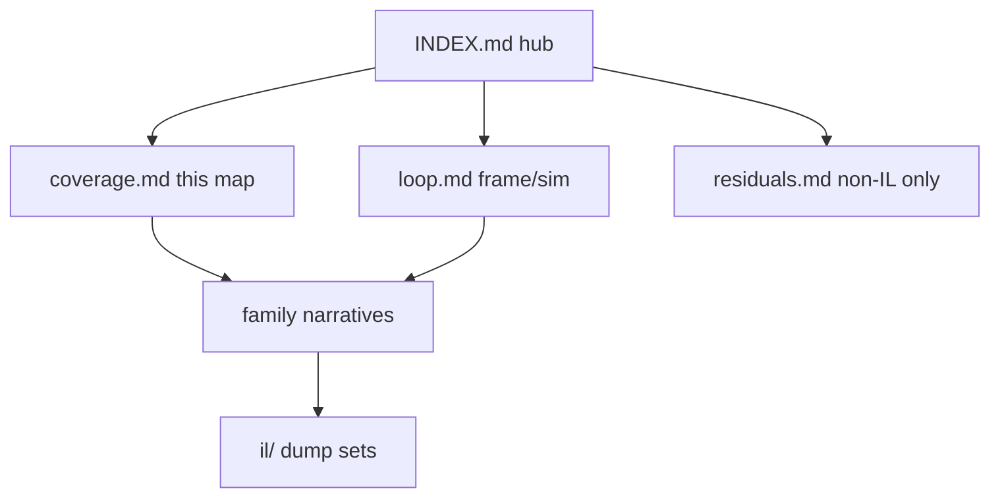

# Dedicated-server engine coverage map (V3.0.1)

**Owns:** family → narrative → dump checklist.  
**Hub:** [`INDEX.md`](INDEX.md).  
**Residuals:** [`residuals.md`](residuals.md).  
**Programmatic coverage:** [`inventories/coverage-report.md`](inventories/coverage-report.md) (auto-generated by `tools/src/Coverage`: call-graph reachability from the dedicated entry points cross-referenced against docs name-mentions; per-namespace split + top undocumented-reached gap list).

**Bar:** 100% of dedicated-relevant **managed** surfaces in `Assembly-CSharp.dll`.  
**Not in bar:** Unity native, native net plugins, EAC wire protocol, client-only UI.

**Live pin (2026-07-18 dedi):** stock `ChunkBlockYDim=256`, `ChunkBlockLayers=64`. Expanded dumps in `terrain-v3.0.1` are historical.  
**Runtime pin:** Unity 2022 Mono (Boehm `libmonobdwgc-2.0.so`, conservative non-generational STW GC), sim target 20 TPS. GC / FPS / lifecycle knobs: [`runtime-tuning.md`](../../7dtd-optimizer/docs/runtime-tuning.md).

---

## Family → narrative → dump

| # | Family | Narrative | Dump evidence | Status |
|---|---|---|---|---|
| 1 | Frame / gmUpdate | [loop.md](loop.md), [loop-gmupdate.md](loop-gmupdate.md) | il/gmUpdate-v3.0.1/, il/frame-entries-v3.0.1/ | Closed |
| 2 | Timers / dual entity tick | loop.md §3, [entity-ai.md](entity-ai.md), [closed-gaps.md](closed-gaps.md) | il/gaps-v3.0.1/, il/deep-v3.0.1/, il/dedi-complete-v3.0.1/ | Closed |
| 3 | World / chunks | [world-chunks.md](world-chunks.md) | il/dedi-complete-v3.0.1/, il/loop-complete-v3.0.1/, il/realearth-surfaces-v3.0.1/ | Closed |
| 4 | Terrain / height | [terrain-height.md](terrain-height.md), `realearth-surfaces.md` | il/terrain-*-v3.0.1/, il/realearth-surfaces-v3.0.1/ | Closed |
| 5 | Entities / AI / path | [entity-ai.md](entity-ai.md), [aidirector.md](aidirector.md) | il/deep-v3.0.1/, il/deeper-v3.0.1/, il/gaps-v3.0.1/ | Closed |
| 6 | Networking | [network.md](network.md), [protocol.md](protocol.md), [protocol-packages.md](protocol-packages.md), closed-gaps.md | il/gaps-v3.0.1/, il/netpackages-v3.0.1/, il/dedi-complete-v3.0.1/, loadgen golden wire | Closed (framing/join, metadata census for all 193, P0/P1 bodies + encryption handshake); residual tail: EntityCreationData per-class, DynamicMesh/POIAround, Quest/Party |
| 7 | Save / region | [save-region.md](save-region.md) | il/loop-complete-v3.0.1/, il/realearth-surfaces-v3.0.1/, il/dedi-complete-v3.0.1/ | Closed |
| 8 | Origin / claims | `7days-realworld/docs/realearth-surfaces.md` (private companion; no published narrative in this repo) | il/realearth-surfaces-v3.0.1/, il/dedi-complete-v3.0.1/ | Closed (dumped; narrative is product-owned) |
| 9 | Managers | [managers.md](managers.md) | il/dedi-complete-v3.0.1/, il/loop-complete-v3.0.1/ | Closed |
| 10 | Light / mesh / water | [light-mesh-water.md](light-mesh-water.md) | il/dedi-complete-v3.0.1/, il/realearth-surfaces-v3.0.1/ | Closed |
| 11 | ModEvents | [managers.md](managers.md) | il/dedi-complete-v3.0.1/ | Closed (names; subscribers residual) |

Families 1-11 are managed DLL surfaces (the coverage bar above). Runtime **cost/scaling
and process-tuning** are not managed surfaces; they are measured by the optimizer mod
and live outside this bar, in the companion docs:

| # | Topic (companion, not a managed surface) | Doc |
|---|---|---|
| 12 | Runtime APM scale (live measurement) | [measured-scaling.md](../../7dtd-optimizer/docs/measured-scaling.md) |
| 13 | Runtime / GC / FPS process knobs | [runtime-tuning.md](../../7dtd-optimizer/docs/runtime-tuning.md) |

**RealEarth product** (not generic research ownership): `7days-realworld/docs/INDEX.md` (`realearth-runtime`, `realearth-surfaces`, `realearth-review`, MODIFICATIONS).

**Stock limitation maps:** generic dedi ceilings → [engine-limitations.md](engine-limitations.md); RealEarth 1:1 Earth blockers → `7days-realworld/docs/ENGINE_LIMITATIONS.md`.

**Custom / Zig dedi clone:** architecture → [zig-clone.md](../../zdtd/docs/zig-clone.md); wire → [protocol.md](protocol.md).

---

## Census (live dedi)

| Metric | Value |
|---|---:|
| Top-level types | 4401 |
| Methods with body | 43901 |
| NetPackage* types | 194 name-prefixed (193 + `NetPackageManager`), from `Census.exe`; ~189 are registered wire packages (the rest are name-prefixed helpers: `NetPackageDirection` enum, `Logger`, `Metrics`). The exact "189 in live id-map" is a runtime observation from an earlier live join, not reproducible from static IL. |
| GameTimer Hz | 20 |
| gmUpdate IL | 631 |
| WorldState.SaveLoad(Stream) IL | 884 |

---

## Use / regenerate

1. Find family row above.  
2. Open the **narrative** for measured facts (many include Mermaid **flowcharts** and **state machines**).  
3. Open the cited `il/...` path for IL text.  
4. Anything still open → [residuals.md](residuals.md) with a **non-IL reason**.

### Diagram convention

| Kind | Use for |
|---|---|
| `flowchart` | Call graphs, peer Updates, data pipelines |
| `stateDiagram-v2` | Lifecycles: tiles, inject gate, SoloSlide, Origin, AI LOD, path, chunk flags, net packages, save |

Jump list of state machines: [INDEX.md](INDEX.md) (Key state machines).  
Dump tools and commands: [INDEX.md](INDEX.md) Tools section only.  
Product Streamed machines: `7days-realworld/docs/INDEX.md` (Key state machines).

## Related docs

| Doc | Role |
|---|---|
| [INDEX.md](INDEX.md) | Hub |
| [residuals.md](residuals.md) | Non-IL residuals |
| `7days-realworld/docs/INDEX.md` | Product RealEarth hub (private companion) |

## Changelog

- **2026-07-19:** Related docs table.
- **2026-07-18:** Origin/claims + ModEvents rows link full paths; product hub callout.
