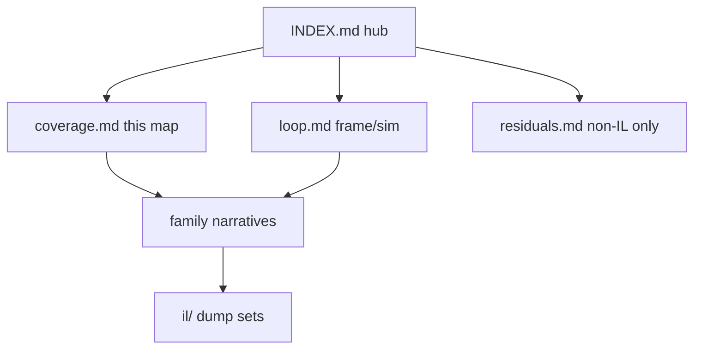

# Dedicated-server engine coverage map (V3.1.0)

**Current pin:** V **3.1.0 (b14)** Henpocalypse (Major=3 Minor=10 Build=14). Prior corpus was V3.0.1 (b4). Shipped-delta map (where V3.1 facts live after `experimental-delta.md` was retired): [INDEX.md](INDEX.md) § V3.1.0 shipped delta map.

**Owns:** family → narrative → dump checklist.  
**Hub:** [`INDEX.md`](INDEX.md).  
**Residuals:** [`residuals.md`](residuals.md).  
**Programmatic coverage:** [`inventories/coverage-report.md`](inventories/coverage-report.md) (auto-generated by `tools/src/Coverage`). It reports four separate tiers (narrated / catalogued only / classified out-of-scope / unaccounted) and deliberately does **not** sum them into a headline: the base over-includes client UI and under-includes reflection-reached code, so it is documentation-mention overlap on a static call graph, not a coverage measurement. Read its caveat section before quoting a number.

**Bar:** 100% of dedicated-relevant **managed** surfaces in `Assembly-CSharp.dll`.  
**Not in bar:** Unity native, native net plugins, EAC wire protocol, client-only UI.

**Live pin (2026-08-08 re-verified dedi V3.1.0):** stock `ChunkBlockYDim=256`, `ChunkBlockLayers=64`. Expanded dumps in `terrain-v3.1.0` are historical.  
**Runtime pin:** Unity 2022 Mono (Boehm `libmonobdwgc-2.0.so`, conservative non-generational STW GC), sim target 20 TPS. GC / FPS / lifecycle knobs: [`runtime-tuning.md`](../../7dtd-server-optimizer/docs/runtime-tuning.md).

---

## Family → narrative → dump

| # | Family | Narrative | Dump evidence | Status |
|---|---|---|---|---|
| 1 | Frame / gmUpdate | [loop.md](loop.md), [loop-gmupdate.md](loop-gmupdate.md) | il/loop-complete-v3.1.0/, il/frame-entries-v3.1.0/ | Closed |
| 2 | Timers / dual entity tick | loop.md §3, [entity-ai.md](entity-ai.md), [closed-gaps.md](closed-gaps.md) | il/gaps-v3.1.0/, il/deep-v3.1.0/, il/dedi-complete-v3.1.0/ | Closed |
| 3 | World / chunks | [world-chunks.md](world-chunks.md) | il/dedi-complete-v3.1.0/, il/loop-complete-v3.1.0/, il/realearth-surfaces-v3.1.0/ | Closed |
| 4 | Terrain / height | [terrain-height.md](terrain-height.md), `realearth-surfaces.md` | il/terrain-v3.1.0/, il/realearth-surfaces-v3.1.0/ | Closed |
| 5 | Entities / AI / path | [entity-ai.md](entity-ai.md), [aidirector.md](aidirector.md) | il/deep-v3.1.0/, il/deeper-v3.1.0/, il/gaps-v3.1.0/ | Closed |
| 6 | Networking | [network.md](network.md), [protocol.md](protocol.md), [protocol-packages.md](protocol-packages.md), closed-gaps.md | il/gaps-v3.1.0/, il/netpackages-v3.1.0/, il/dedi-complete-v3.1.0/, loadgen golden wire | Closed (framing/join, metadata census for all 193, P0/P1 bodies + encryption handshake, per-flag framing for all 37 conditional-heavy packages in protocol-packages.md §6.23, LiteNetLib join-churn race in network.md §4.0); high-traffic + residual bulk catalog in protocol-packages.md 1-6.22; full flat write sequences in inventories/netpackage-bodies.md |
| 7 | Save / region | [save-region.md](save-region.md) | il/loop-complete-v3.1.0/, il/realearth-surfaces-v3.1.0/, il/dedi-complete-v3.1.0/ | Closed |
| 8 | Origin / claims | `7dtd-realearth/docs/realearth-surfaces.md` (private companion; no published narrative in this repo) | il/realearth-surfaces-v3.1.0/, il/dedi-complete-v3.1.0/ | Closed (dumped; narrative is product-owned) |
| 9 | Managers | [managers.md](managers.md) | il/dedi-complete-v3.1.0/, il/loop-complete-v3.1.0/ | Closed |
| 10 | Light / mesh / water | [light-mesh-water.md](light-mesh-water.md) | il/dedi-complete-v3.1.0/, il/realearth-surfaces-v3.1.0/ | Closed |
| 11 | ModEvents | [managers.md](managers.md) | il/dedi-complete-v3.1.0/ | Closed (names; subscriber sets observed stock + mod delta, managers.md §2) |

Families 1-11 are managed DLL surfaces (the coverage bar above). Runtime **cost/scaling
and process-tuning** are not managed surfaces; they are measured by the optimizer mod
and live outside this bar, in the companion docs:

| # | Topic (companion, not a managed surface) | Doc |
|---|---|---|
| 12 | Runtime APM scale (live measurement) | [measured-scaling.md](../../7dtd-server-optimizer/docs/measured-scaling.md) |
| 13 | Runtime / GC / FPS process knobs | [runtime-tuning.md](../../7dtd-server-optimizer/docs/runtime-tuning.md) |

**RealEarth product** (not generic research ownership): `7dtd-realearth/docs/INDEX.md` (`realearth-runtime`, `realearth-surfaces`, `realearth-review`, MODIFICATIONS).

**Stock limitation maps:** generic dedi ceilings → [engine-limitations.md](engine-limitations.md); RealEarth 1:1 Earth blockers → `7dtd-realearth/docs/ENGINE_LIMITATIONS.md`.

**Custom / Zig dedi clone:** architecture → [ZIG_CLONE.md](../../zdtd-server-server-server-server/docs/ZIG_CLONE.md); wire → [protocol.md](protocol.md).

---

## Census (live dedi V3.1.0)

From `Census.exe` / `tools/data/stock_facts.json` on dedicated V **3.1.0 (b14)**.
Prior V3.0.1 baseline was types 4401, methods 43901, SaveLoad IL 884 (see [re-methodology.md](re-methodology.md) §1).

| Metric | Value |
|---|---:|
| Top-level types | 4414 |
| Methods with body | 44107 |
| NetPackage* types | 194 name-prefixed (193 + `NetPackageManager`), from `Census.exe`; ~189 are registered wire packages (the rest are name-prefixed helpers: `NetPackageDirection` enum, `Logger`, `Metrics`). The "189 in live id-map" was a runtime observation, **re-confirmed live 2026-08-10** (`PackageIdsReceived: maps=189` on a stock V3.1.0 join). |
| GameTimer Hz | 20 |
| gmUpdate IL | 631 |
| WorldState.SaveLoad(Stream) IL | 926 |
| CurrentSaveVersion | 23 |
| Machine-checked behaviour pins (WaterLevel 62.88, item-drop 300 s, load budget 50 ms, ...) | `make facts` (extracted by StockFacts.exe, asserted by `check_stock_facts`) |
| Machine-checked wire + data pins (LiteNetLib protocol/MTU, XML hp ladder, enum sizes) | `make facts` (`litenet.*`, `xml_pins.json`, `enums.*` sections) |

---

## Use / regenerate

1. Find family row above.  
2. Open the **narrative** for measured facts (many include Mermaid **flowcharts** and **state machines**).  
3. Open the cited `il/...` path for IL text.  
4. Anything still open → [residuals.md](residuals.md) with a **non-IL reason**.

### Diagram convention

| Kind | Use for |
|---|---|
| `flowchart` | Call graphs, peer Updates, data pipelines |
| `stateDiagram-v2` | Lifecycles: tiles, inject gate, SoloSlide, Origin, AI LOD, path, chunk flags, net packages, save |

Jump list of state machines: [INDEX.md](INDEX.md) (Key state machines).  
Dump tools and commands: [INDEX.md](INDEX.md) Tools section only.  
Product Streamed machines: `7dtd-realearth/docs/INDEX.md` (Key state machines).

---

## Audit status per doc

Two independent adversarial audit passes were run over this corpus, and a third
review audited the metric tooling. They mattered: the **second** pass, over docs that
had already been written carefully, still found 3 critical and 8 major errors,
including a wire-breaking one. Treat the tier below as an evidence weight, not a
quality label. Anything marked not-independently-audited is first-draft prose and
should be re-checked against IL before you rely on it.

| Doc | Audit tier |
|---|---|
| [aidirector.md](aidirector.md) | audited (pass 1) |
| [architecture-map.md](architecture-map.md) | map of corpus narratives (no direct IL claims) |
| [block-shapes.md](block-shapes.md) | audited (pass 2) |
| [blocks.md](blocks.md) | audited (pass 1) |
| [buffs.md](buffs.md) | audited (pass 1) |
| [chat.md](chat.md) | audited (pass 1) |
| [chunk-providers.md](chunk-providers.md) | audited (pass 2) |
| [closed-gaps.md](closed-gaps.md) | audited (pass 1) |
| [combat-damage.md](combat-damage.md) | audited (pass 1) |
| [completion-bar.md](completion-bar.md) | completion-bar definition (census refs to verified claims) |
| [console-commands.md](console-commands.md) | audited (pass 1) |
| [coverage.md](coverage.md) | audited (pass 1) |
| [crafting-recipes.md](crafting-recipes.md) | audited (pass 1) |
| [dedicated-leftovers.md](dedicated-leftovers.md) | audited (pass 2) |
| [dedicated-misc-systems.md](dedicated-misc-systems.md) | audited (pass 2) |
| [dynamic-mesh.md](dynamic-mesh.md) | audited (pass 1) |
| [engine-limitations.md](engine-limitations.md) | audited (pass 1) |
| [entity-ai.md](entity-ai.md) | audited (pass 1) |
| [entity-movement.md](entity-movement.md) | audited (2026-08-20, movement chain + physics surface) |
| [entity-stats.md](entity-stats.md) | audited (pass 1) |
| [INDEX.md](INDEX.md) V3.1.0 shipped delta map (replaces retired experimental-delta) | audited (pass 1; map refreshed 2026-08-06) |
| [full-surface.md](full-surface.md) | audited (pass 1) |
| [game-events.md](game-events.md) | audited (pass 1) |
| [items.md](items.md) | audited (pass 1) |
| [light-mesh-water.md](light-mesh-water.md) | audited (pass 1) |
| [loop-gmupdate.md](loop-gmupdate.md) | audited (pass 1) |
| [loop.md](loop.md) | audited (pass 1) |
| [loot-economy.md](loot-economy.md) | audited (pass 1) |
| [managers.md](managers.md) | audited (pass 1) |
| [map-objects.md](map-objects.md) | audited (pass 2) |
| [minevents.md](minevents.md) | audited (pass 1) |
| [mod-loading.md](mod-loading.md) | audited (pass 1) |
| [network.md](network.md) | audited (pass 1) |
| [npc-dialog.md](npc-dialog.md) | audited (pass 2) |
| [out-of-scope-surface.md](out-of-scope-surface.md) | generated + hand-corrected |
| [client-side-surface.md](client-side-surface.md) | census narration of the client-executed surface (role lines for 100% narrated) |
| [parties-factions.md](parties-factions.md) | audited (pass 1) |
| [platform-auth.md](platform-auth.md) | audited (pass 1) |
| [progression.md](progression.md) | audited (pass 1) |
| [protocol-frames.md](protocol-frames.md) | audited (pass 1) |
| [protocol-packages.md](protocol-packages.md) | audited (pass 1) |
| [protocol.md](protocol.md) | audited (pass 1) |
| [quests-challenges.md](quests-challenges.md) | audited (pass 1) |
| [raycast-pathing.md](raycast-pathing.md) | audited (pass 2) |
| [re-methodology.md](re-methodology.md) | audited (pass 1) |
| [residuals.md](residuals.md) | audited (pass 1) |
| [sandbox-options.md](sandbox-options.md) | audited (pass 2) |
| [save-persistence.md](save-persistence.md) | audited (pass 2) |
| [save-region.md](save-region.md) | audited (pass 1) |
| [server-browser-prefabs.md](server-browser-prefabs.md) | audited (pass 2) |
| [server-lifecycle.md](server-lifecycle.md) | audited (pass 1) |
| [signs.md](signs.md) | audited (pass 2) |
| [spawning.md](spawning.md) | audited (pass 1) |
| [stability.md](stability.md) | IL re-verified 2026-08-11 sweep (not in audit passes) |
| [stealth-smell.md](stealth-smell.md) | audited (pass 1) |
| [terrain-height.md](terrain-height.md) | audited (pass 1) |
| [texture-atlas.md](texture-atlas.md) | not-independently-audited |
| [texture-atlas-unityfs.md](texture-atlas-unityfs.md) | not-independently-audited |
| [tile-entities-power.md](tile-entities-power.md) | audited (pass 1) |
| [twitch-integration.md](twitch-integration.md) | audited (pass 1) |
| [uai.md](uai.md) | audited (pass 1) |
| [vehicles-drones-turrets.md](vehicles-drones-turrets.md) | audited (pass 1) |
| [weather-environment.md](weather-environment.md) | audited (pass 1) |
| [webserver.md](webserver.md) | audited (pass 1) |
| [world-chunks.md](world-chunks.md) | audited (pass 1) |
| [world-generation.md](world-generation.md) | audited (pass 1) |

Generated inventories (`inventories/*.md`) are regenerable from the committed tools;
their correctness is the tool's, not prose. `inventories/dedicated-leaves.md` and
`out-of-scope-surface.md` are generated **and then hand-corrected** (see
`tools/data/promoted-types.txt`).

## Related docs

| Doc | Role |
|---|---|
| [INDEX.md](INDEX.md) | Hub |
| [residuals.md](residuals.md) | Non-IL residuals |
| [`../../zdtd-server-server-server-server/docs/PROVENANCE.md`](../../zdtd-server-server-server-server/docs/PROVENANCE.md) | zdtd provenance ledger: every clone behavior/perk/value -> stock source |
| `7dtd-realearth/docs/INDEX.md` | Product RealEarth hub (private companion) |

## Changelog

- **2026-08-22:** Audit table adds the texture-atlas docs (texture-atlas, texture-atlas-unityfs; not-independently-audited).
- **2026-08-11:** Census table notes the machine-checked behaviour pins (`make facts`).
- **2026-08-11:** Related docs links the zdtd provenance ledger.
- **2026-08-11:** Census table re-verified against live `Census.exe` + `stock_facts.json` (4414 / 44107 / 193+manager / 20 / 631 / 926 / 23, all exact); audit-status table completed with the three post-pass docs (architecture-map, completion-bar, stability).
- **2026-07-19:** Related docs table.
- **2026-07-18:** Origin/claims + ModEvents rows link full paths; product hub callout.
