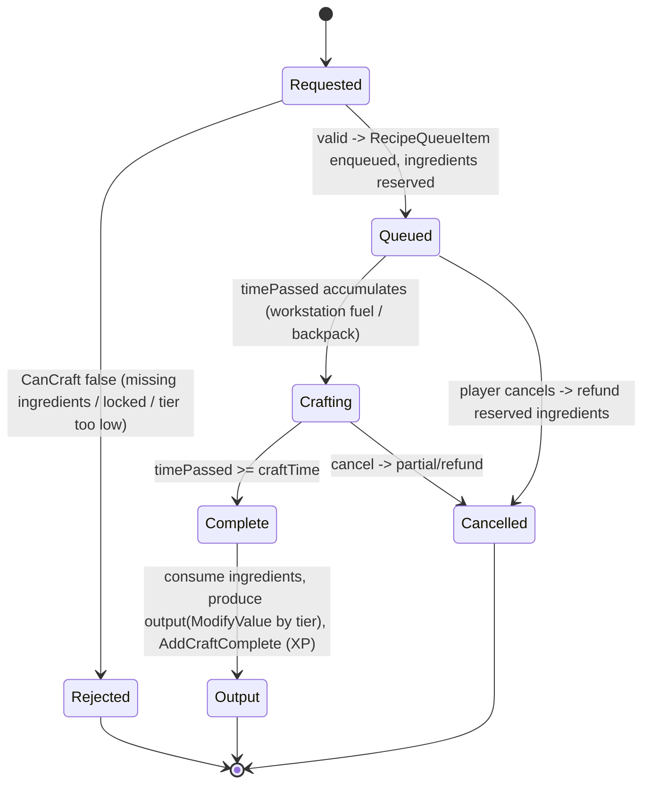
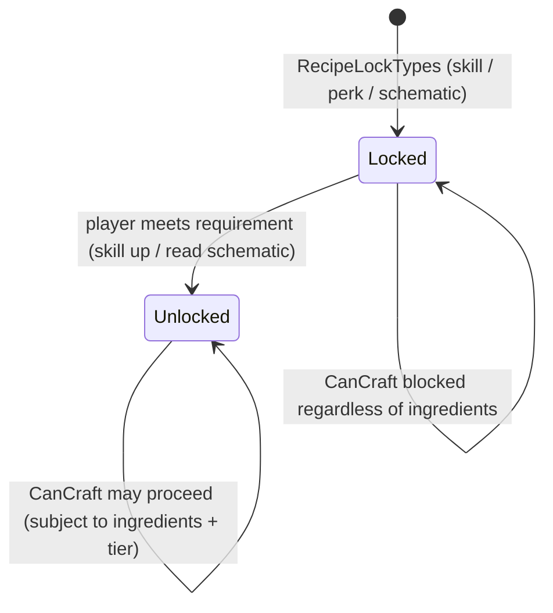

# Crafting and recipes (dedicated V3.1.0)

**Owns:** the recipe model: `Recipe` (ingredients, output, crafting tier, unlock),
`CanCraft` validation, the `RecipeQueueItem` craft queue, and recipe unlock
progression.
**Not:** the workstation tile entity that hosts a server-ticked queue (that is
[tile-entities-power.md](tile-entities-power.md)); the crafting UI (client); XML
recipe content.
**Evidence:** `Recipe`, `RecipeQueueItem`, `CraftingManager`, `RecipesFromXml`,
`RecipeUnlockData` IL (dump locally with `tools/src/DumpMethod`, git-ignored).
**Hub:** [`INDEX.md`](INDEX.md). **Method:** [`re-methodology.md`](re-methodology.md).

**Authority (corrected):** crafting is **not** fully server-authoritative.
`Recipe.CanCraft` is invoked from the **client** crafting UI (`XUiC_ItemActionList`),
and **backpack** crafting runs its `RecipeQueueItem` queue client-side; the server's
authority is (1) the **inventory transaction** the craft produces, validated by
`TransactionalInventory` (the anti-dupe gate, [items.md](items.md)), and (2)
**workstation** crafting, whose queue ticks inside the server-owned
`TileEntityWorkstation` ([tile-entities-power.md](tile-entities-power.md)). So the
recipe model is the same everywhere, but the *tick* is client (backpack) or server
(workstation), and the server gates the resulting item movement.

---

## 1. The recipe model

`Recipe` is the definition loaded from `recipes.xml` (`RecipesFromXml`):

| Member | Role |
|---|---|
| `AddIngredient(itemValue, count)` / `ContainsIngredients` | the input requirements ([RecipeIngredient](#) = item + count) |
| `GetOutputItemClass` / output count | what is produced |
| `craftingTier` + `GetCraftingTier(player)` | tool/skill tier gate; higher tier improves output quality (`ModifyValue`) |
| `IsLearnable` / `IsUnlocked(player)` | progression gate (schematic / skill), see [§3](#3-recipe-unlock-progression) |
| `CanCraft(itemStacks, entity, tier)` / `CanCraftAny` | the full validation predicate |
| `Write` / `Read` | serialization (recipes can cross the wire) |

`ModifyValue(passiveEffect, ..., craftingTier)` applies crafting-tier passive
effects to the output, so the same recipe yields higher-quality output at a higher
tier (shared with the passive-effect/buff math, [buffs.md](buffs.md)).

---

## 2. Craft lifecycle (state machine)

A craft is requested (player backpack or a workstation), validated by `CanCraft`,
queued as a `RecipeQueueItem` with a craft time, and completed when the time
elapses: the server consumes the ingredients, produces the output at the tier
quality, and grants crafting XP (`AddCraftComplete`).

`CanCraft` checks three things: the ingredient stacks contain the required items
and counts, the recipe is unlocked for the entity, and the available crafting tier
meets the recipe's requirement. Workstation crafting runs the same queue inside the
workstation tile entity (`HandleRecipeQueue`, see
[tile-entities-power.md](tile-entities-power.md)); backpack crafting runs it on the
player.

---

## 3. Recipe unlock progression

Recipes may be locked until learned. `RecipeUnlockData` / `RecipeLockTypes` define
how a recipe is unlocked (skill level, perk, or a learned schematic item), and
`IsUnlocked(player)` resolves it against the player's progression.

Always-available recipes are simply not locked. Unlock state is part of player
progression, saved with the player profile ([server-lifecycle.md](server-lifecycle.md)).

---

## 4. Dedicated relevance and residuals

- **Split authority (see header):** `CanCraft` and the backpack craft queue run on
  the client; the server owns the workstation TE queue and validates the resulting
  inventory transaction (`TransactionalInventory` anti-dupe). Crafting is not fully
  server-authoritative.
- **Residual / content:** `recipes.xml` (data); the crafting UI; skill/perk trees
  are progression content.

---

## Related docs

| Doc | Role |
|---|---|
| [tile-entities-power.md](tile-entities-power.md) | Workstation/forge that hosts a craft queue |
| [items.md](items.md) | ItemValue/ItemClass (ingredients + output) |
| [buffs.md](buffs.md) | Passive-effect math (crafting-tier quality) |
| [server-lifecycle.md](server-lifecycle.md) | Player progression / unlock persistence |

## Changelog

- **2026-07-23:** Initial crafting/recipe reversal (Recipe model, CanCraft validation, craft-queue lifecycle, unlock progression) with state machines.
