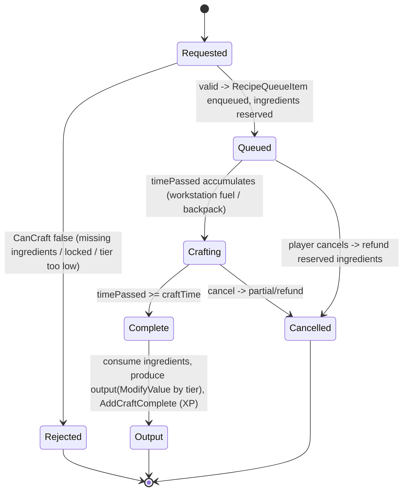
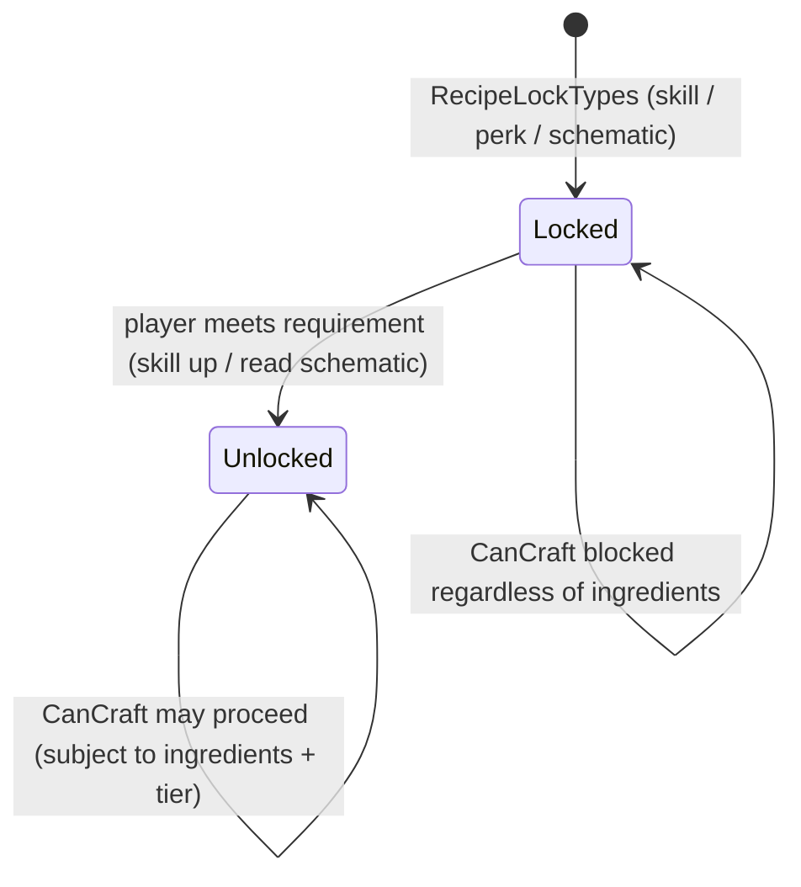

# Crafting and recipes (dedicated V3.1.0)

**Owns:** the recipe model: `Recipe` (ingredients, output, crafting tier, unlock),
`CanCraft` validation, the `RecipeQueueItem` craft queue, and recipe unlock
progression.
**Not:** the workstation tile entity that hosts a server-ticked queue (that is
[tile-entities-power.md](tile-entities-power.md)); the crafting UI (client); XML
recipe content.
**Evidence:** `Recipe`, `RecipeQueueItem`, `CraftingManager`, `RecipesFromXml`,
`RecipeUnlockData` IL (dump locally with `tools/src/DumpMethod`, git-ignored).
**Hub:** [`INDEX.md`](INDEX.md). **Method:** [`re-methodology.md`](re-methodology.md).

**Authority (corrected):** crafting is **not** fully server-authoritative.
`Recipe.CanCraft` is invoked from the **client** crafting UI (`XUiC_ItemActionList`),
and **backpack** crafting runs its `RecipeQueueItem` queue client-side; the server's
authority is (1) the **inventory transaction** the craft produces, validated by
`TransactionalInventory` (the anti-dupe gate, [items.md](items.md)), and (2)
**workstation** crafting, whose queue ticks inside the server-owned
`TileEntityWorkstation` ([tile-entities-power.md](tile-entities-power.md)). So the
recipe model is the same everywhere, but the *tick* is client (backpack) or server
(workstation), and the server gates the resulting item movement.

---

## 1. The recipe model

`Recipe` is the definition loaded from `recipes.xml` (`RecipesFromXml`):

| Member | Role |
|---|---|
| `AddIngredient(itemValue, count)` / `ContainsIngredients` | the input requirements ([RecipeIngredient](#) = item + count) |
| `GetOutputItemClass` / output count | what is produced |
| `craftingTier` + `GetCraftingTier(player)` | tool/skill tier gate; higher tier improves output quality (`ModifyValue`) |
| `IsLearnable` / `IsUnlocked(player)` | progression gate (schematic / skill), see [§3](#3-recipe-unlock-progression) |
| `CanCraft(itemStacks, entity, tier)` / `CanCraftAny` | the full validation predicate |
| `Write` / `Read` | serialization (recipes can cross the wire) |

`ModifyValue(passiveEffect, ..., craftingTier)` applies crafting-tier passive
effects to the output, so the same recipe yields higher-quality output at a higher
tier (shared with the passive-effect/buff math, [buffs.md](buffs.md)).

**`recipes.xml` loader (`RecipesFromXml.<LoadRecipies>d__1.MoveNext`,
IL=436).** The load is a frame-budgeted coroutine: it yields back to the
frame loop whenever its `MicroStopwatch` exceeds
`Constants.cMaxLoadTimePerFrameMillis`, so a large `recipes.xml` streams in
over several frames. Each `<recipe>` requires a `name` (an unknown item
throws `No item/block with name '...' existing`) and parses: `count` (1),
`material_based` (false), `tags` or `tag`
(`FastTags.Parse(attr + "," + recipeName)`), `tooltip`, `craft_area` (""),
`craft_tool` (looks up the item and sets `ItemClass.list[type].bCraftingTool
= true`), `craft_time` (-1), `learn_exp_gain` (20 on parse failure, -1
absent), `craft_exp_gain` (1, -1 absent), `is_trackable` (true),
`use_ingredient_modifier` (true), and a `MinEffectController.ParseXml`
block for recipe-level effects. Child elements are `<ingredient name count>`
(appended via `AddIngredient`; an unknown name throws) and
`<wildcard_forge_category>` (sets `wildcardForgeCategory`). Each recipe ends
with `Recipe.Init()` then `CraftingManager.AddRecipe(recipe)`; the whole load
finishes with `CraftingManager.PostInit()`. The editor export twin
`RecipesFromXml.SaveRecipes` (IL=123) writes `CraftingManager.GetAllRecipes()`
back to `<recipes>` XML and has no production callers on b14.

**`Recipe.Init` (IL=79)** derives the defaults left at -1 from the
ingredients: it sums each ingredient's `ItemClass.CraftComponentExp` and
`CraftComponentTime` times its count, then sets `unlockExpGain = 2 *
totalExp` (when < 0), `craftExpGain = totalExp` (when < 0),
`craftingTime = totalTime` (when < 0), and
`IsLearnable = tags.Test_AnySet(LearnableRecipe)`. `RecipeUnlockData.Init`
(IL=56) resolves an unlock text against `Progression.ProgressionClasses`
(perk), then `ChallengeGroup.GetGroup` / `ChallengeClass.GetChallenge`
(challenge), then `ItemClass.GetItemClass` (item), and falls back to
`UnlockTypes` 0 (7 in edit mode) when nothing matches.

**Registry (`CraftingManager`).** `AddRecipe` (IL=6) appends and clears the
lazy-sort flag `bSorted`; `PostInit` (IL=6) builds
`cacheNonScrapableRecipes()` and, when backpack crafting is enabled
(`XUiM_Recipes.BackpackCrafting == 1`), refreshes
`UpdateRecipesforBackpackCrafting()`. `GetScrapableRecipe(itemValue, count)`
(IL=77) resolves the forge scrap target: the item's `MadeOfMaterial` must
carry a `ForgeCategory` and the item class must not be `NoScrapping`, then
the first `wildcardForgeCategory` recipe whose output material shares the
same `ForgeCategory` (output type != item type) and whose output weight is
`<= itemWeight * count` wins.

**Registry accessors (all IL-verified):** `GetRecipe(name)` (IL=24) is a
linear scan by `Recipe.GetName` (null on miss); `GetRecipes()` (IL=3)
returns a copy of the list; `GetRecipes(name)` (IL=27) filters by name.
`ClearAllRecipes` (IL=3) clears the list (the `ReloadRecipes` reset).
`ClearAllGeneralRecipes()` (IL=30) removes every recipe whose `craftingArea`
is null or empty (the non-workstation recipes); `ClearCraftAreaRecipes(
craftArea, craftTool)` (IL=36) removes recipes whose `craftingArea` equals
the area and whose `craftingToolType` equals the tool's item type;
`ClearRecipe(recipe)` (IL=5) is the single-entry `Remove`.
`InitForNewGame()` (IL=10) resets the whole registry for a fresh game:
`ClearAllRecipes()` plus clearing `UnlockedRecipeList` /
`AlreadyCraftedList` / `FavoriteRecipeList` / `craftingAreaData`.
Favorites: `RecipeIsFavorite(recipe)` (IL=5) is `FavoriteRecipeList.
Contains(name)`; `ToggleFavoriteRecipe` (IL=17) adds/removes the name;
`GetFavoriteRecipesFromList(ref list)` (IL=31) filters the list in place.
`ClearLockedData` (IL=5) clears `lockedRecipeNames` + `lockedRecipeTypes`.
Workstation config: `AddWorkstationData(data)` (IL=17) upserts into
`craftingAreaData` by `WorkstationName`; `GetWorkstationData(name)`
(IL=12) is the lookup (null on miss).

---

## 2. Craft lifecycle (state machine)

A craft is requested (player backpack or a workstation), validated by `CanCraft`,
queued as a `RecipeQueueItem` with a craft time, and completed when the time
elapses: the server consumes the ingredients, produces the output at the tier
quality, and grants crafting XP (`AddCraftComplete`).

`CanCraft` checks three things: the ingredient stacks contain the required items
and counts, the recipe is unlocked for the entity, and the available crafting tier
meets the recipe's requirement. Workstation crafting runs the same queue inside the
workstation tile entity (`HandleRecipeQueue`, see
[tile-entities-power.md](tile-entities-power.md)); backpack crafting runs it on the
player.

**Craft-complete XP (`EntityPlayerLocal.GiveExp(CraftCompleteData)`, IL=54):**
the `_craftCount_{recipeName}` custom var accumulates `RecipeUsedCount` per
craft, and the grant is `Progression.AddLevelExp(CraftExpGain / total,
"_xpFromCrafting", XPTypes 3, ...)` - the recipe's exp divided by the
cumulative craft count, so repeated crafts of the same recipe yield
diminishing XP. It also bumps `totalItemsCrafted`, fires
`QuestEventManager.CraftedItem(stack)`, and notifies the recipe UI
(`XUiC_RecipeStack.HandleCraftXPGained`).

**`Progression` leaves (V3.1.0 b14):** `AddLevelExp(exp, cvarXPName, xpType,
useBonus, notifyUI, instigatorID, itemValue)` (IL=161) is the XP grant: a
non-player parent returns the amount untouched; the instigator is resolved into
`MinEventContext`, `amount = exp * XPGain` then
`EffectManager.GetValue(XP = 87, itemValue, amount, parent, ..., <xpType name>
tag, ...)` when `useBonus`, clamped to 2^31-1, a `GameSparksCollector`
counter is bumped, the local player gets an XP icon notification, and the
amount is applied by `AddLevelExpRecursive` (IL=179). A level-up logs
`{0} made level {1} (was {2}), exp for next level {3}`. `getExpForLevel(level)`
(IL=10) is `min(BaseExpToLevel * ExpMultiplier^level, int.MaxValue)`;
`getLevelFloat` (IL=14) is `Level + 1 - ExpToNextLevel / GetExpForNextLevel()`.
`AddXPDeficit` (IL=65) adds `GetValue(97) * nextLevelExp` then clamps the
deficit via `GetValue(96)` (death XP-loss). `SpendSkillPoints(points, name)`
(IL=16) routes `SkillPoints`-currency perks through
`addProgressionCurrency` (IL=85), which clamps to `MaxLevel` and scales the
grant by `GetValue(SkillPoints = 86, ...)` for the point-type class.
`GetPerkList(list, skillName)` (IL=40) collects the perk/quest-class values
whose parent matches. Persistence: `Write(bw, isNetwork)` (IL=51) emits version
**3** + `Level` u16 + `ExpToNextLevel` i32 + `SkillPoints` u16 + count + per
`ProgressionValue`; `Read(br, parent)` (IL=100) warns `Progression Read {0},
new` and builds a fresh `Progression` when the entity has none.
`SetupData` (IL=144) instantiates every `ProgressionClass` registry entry into a
`ProgressionValue` (level + `CalculatedCostForLevel`) and rebuilds the quick
list + passive-keys index.

**`ProgressionValue` (the per-player entry):** `set_Level` (IL=24) invalidates
the frame cache and pins skills to `MaxLevel` (skills are always maxed).
`GetCalculatedLevel(ea)` (IL=79) is frame-cached: `Level` plus a bonus from
`EffectManager.GetValue` over the type's passive (perk 83, skill 84, quest 85)
when the class has one. `get_PercToNextLevel` (IL=15) is
`1 - CostForNextLevel / CalculatedCostForLevel(level + 1)`; `CanPurchase(ea,
level)` (IL=9) is `level <= MaxLevel`; `IsLocked(ea)` (IL=6) is
`GetCalculatedMaxLevel(ea, this) == 0`. Wire: `Write` (IL=17) is version **1**
+ `name` + `level` (u8) + `costForNextLevel` (i32); `Read` (IL=16) mirrors it.

**`ProgressionClass` (the definition):** `ModifyValue(ea, pv, effect, ...)`
(IL=17) applies the class's `Effects` with `pv.GetCalculatedLevel(ea)` as the
level - the perk-level-driven effect chain. `CalculatedCostForLevel(level)`
(IL=31) is `(int)(CostMultiplier^level * BaseCostToLevel)` unless an
`OverrideCost` array exists, then `OverrideCost[level - 1]` (0 out of range).
`GetCalculatedMaxLevel(ea, pv)` (IL=78) binary-searches the `LevelRequirements`
list for the last level whose `RequirementGroup` passes `canRun` (IL=8:
null-gated `IsValid`), clamped to `[MinLevel, MaxLevel]`; with no requirements
attributes default to 20 and everything else to `MaxLevel`. `AddLevelRequirement`
(IL=7) keys by level; `GetRequirementsForLevel(level)` (IL=20) falls back to a
fresh `LevelRequirement(level)`; `PostInit` (IL=14) sorts the requirements by
level. `FireEvent` / `HasEvents` (IL=9 each) forward to the class `Effects`.

**Validation predicates (V3.1.0 b14).** `Recipe.CanCraft(stacks, ea,
craftingTier)` (IL=128) starts by caching `GetCraftingTier(player)` into the
shared recipe's `craftingTier` field, clamped down when the passed
`_craftingTier >= 0` is lower (a caller may force a lower tier). Each
ingredient's required count is then resolved: with `UseIngredientModifier`,
`count = EffectManager.GetValue(CraftingIngredientCount = 198, itemValue,
count, ea, this, FastTags.Parse(itemName), ...)`, multiplied by
`XUiM_Recipes.GetCraftingInputModifier(this)` and clamped to at least 1.
The player's stacks are then scanned; a stack counts toward the ingredient
only when it is **not** a modded item (`HasModSlots && HasMods` skips it)
and its `type` matches - a modded weapon never serves as craft fodder.
`count` is decremented by matching stacks' counts and any ingredient left
unsatisfied returns false. `CanCraftAny` (IL=134) repeats the scan per tier,
walking `GetCraftingTier(player)` down to 0, and returns true when any tier
satisfies all ingredients (the UI "can craft" flag). `ContainsIngredients`
(IL=39) is the loose filter: true when any ingredient's `type` matches any
of the given item types, ignoring counts.

**Wire frames.** `Recipe.Write` (IL=56):
`Version:u16, itemValueType:i32, count:i32, IsScrap:bool, craftingTime:f32,
craftExpGain:i32, craftingArea:string` (null -> ""), then
`ingredientCount:i32` and that many `ItemStack.Write` bodies. The craft-
queue record `RecipeQueueItem.Write` (IL=82, version 2) is:
`Multiplier:i16, IsCrafting:bool, CraftingTimeLeft:f32`, optional
`RepairItem` (`hasRepair:bool` + `ItemValue.Write` + `AmountToRepair:u16`),
`Quality:u8, StartingEntityId:i32, OneItemCraftTime:f32`, then optional
`Recipe` (full frame above). Recipes and queue items ride the workstation /
backpack UI sync packages ([protocol.md](protocol.md)).

`RecipeQueueItem.Read` (IL=116) mirrors it: version **u16** (below 2, one i32 is
read and discarded), then the same fields; at version >= **2** the trailing
recipe uses the full `Recipe.Read` frame, below it the inline legacy shape
(`itemValueType`, `count`, ingredients count + `ItemStack.Read` each,
`craftingTime`, `craftExpGain`, `IsScrap`). A missing trailing recipe with a
non-zero discarded value warns
`[RecipeQueueItem] In-progress recipe has outdata data and has been discarded.`
`ReadLegacy` (IL=101) is the header-less v1 shape; `Clear` (IL=32) nulls the
recipe, resets the fields (`OneItemCraftTime = -1`,
`StartingEntityId = -1`) and clears the repair item.

---

## 3. Recipe unlock progression

Recipes may be locked until learned. `RecipeUnlockData` / `RecipeLockTypes` define
how a recipe is unlocked (skill level, perk, or a learned schematic item), and
`IsUnlocked(player)` resolves it against the player's progression.

Always-available recipes are simply not locked. Unlock state is part of player
progression, saved with the player profile ([server-lifecycle.md](server-lifecycle.md)).

**Unlock and tier evaluation (IL-pinned).** `IsUnlocked(player)` (IL=31)
short-circuits true when `XUiM_Recipes.CraftingProgression` is off or the
recipe is not learnable; otherwise it computes
`EffectManager.GetValue(RecipeTagUnlocked = 73, null,
player.GetCVar(GetName()), this, this.tags, ...)` and requires `> 0` - the
unlock gate is passive **73** seeded by a player cvar named after the recipe
(the learned-schematic marker). `GetCraftingTier(player)` (IL=22) returns
flat **6** when `CraftingProgression` is off, else
`EffectManager.GetValue(CraftingTier = 91, null, 1, player, this,
this.tags, ...)` - the per-recipe tier comes from passive **91** modulated by
the recipe's tags. `ModifyValue` (IL=15) delegates to the recipe's
`MinEffectController.ModifyValue(...)`, so output quality can carry
recipe-level effects on top of the caller's base/percent pair.

**The unlock write path closes the loop.** `CraftingManager.UnlockRecipe(recipe,
player)` (IL=21, plus the name-only overload IL=18) adds `GetName()` to the
`UnlockedRecipeList` hash set, fires the `RecipeUnlocked` event, and - when a
player is passed - `SetCVar(recipeName, 1)`. That is exactly the cvar
`Recipe.IsUnlocked` reads: `GetCVar(GetName())` seeds passive `RecipeTagUnlocked`
(73). `LockRecipe(name, locktype)` (IL=40) ORs the `RecipeLockTypes` flag into
the parallel `lockedRecipeNames` / `lockedRecipeTypes` list entry (case-
insensitive name match), and `GetLockedRecipeCount` / `GetUnlockedRecipeCount`
report the sizes for the UI.

---

## 4. Dedicated relevance and residuals

- **Split authority (see header):** `CanCraft` and the backpack craft queue run on
  the client; the server owns the workstation TE queue and validates the resulting
  inventory transaction (`TransactionalInventory` anti-dupe). Crafting is not fully
  server-authoritative.
- **Residual / content:** `recipes.xml` (data); the crafting UI; skill/perk trees
  are progression content.

---

## Related docs

| Doc | Role |
|---|---|
| [tile-entities-power.md](tile-entities-power.md) | Workstation/forge that hosts a craft queue |
| [items.md](items.md) | ItemValue/ItemClass (ingredients + output) |
| [buffs.md](buffs.md) | Passive-effect math (crafting-tier quality) |
| [server-lifecycle.md](server-lifecycle.md) | Player progression / unlock persistence |

## Changelog

- **2026-08-11:** Recipe IL re-verified: <LoadRecipies>d__1.MoveNext IL=436, SaveRecipes IL=123, Recipe.Init IL=79, RecipeUnlockData.Init IL=56, CraftingManager AddRecipe IL=6, PostInit IL=6, GetScrapableRecipe IL=77, GetRecipe IL=24, GetRecipes IL=3/27, ClearAllRecipes IL=3, ClearAllGeneralRecipes IL=30, ClearCraftAreaRecipes IL=36, ClearRecipe IL=5, InitForNewGame IL=10, RecipeIsFavorite IL=5, ToggleFavoriteRecipe IL=17, GetFavoriteRecipesFromList IL=31, ClearLockedData IL=5, AddWorkstationData IL=17, GetWorkstationData IL=12 (exact).
- **2026-08-11:** Progression IL re-verified: GiveExp(CraftCompleteData) IL=54, AddLevelExp IL=161, AddLevelExpRecursive IL=179, getExpForLevel IL=10, getLevelFloat IL=14, AddXPDeficit IL=65 (exact).
- **2026-08-10:** CraftingManager IL re-verified: AddRecipe IL=6, PostInit IL=6, GetRecipe IL=24, GetRecipes IL=3 (exact).
- **2026-08-10:** RecipesFromXml.SaveRecipes IL=123, Recipe.Init IL=79 re-verified (exact).
- **2026-08-08:** EntityPlayerLocal.GiveExp (IL=54): _craftCount_ recipe var
  accumulation, AddLevelExp(CraftExpGain / total, _xpFromCrafting), quest
  CraftedItem hook.

- **2026-08-08:** RecipeQueueItem read side: Read (IL=116) version u16 +
  legacy inline recipe below v2 + outdata warning; ReadLegacy (IL=101)
  header-less v1; Clear (IL=32) field resets.
- **2026-08-08:** ProgressionClass: ModifyValue with calculated level;
  CalculatedCostForLevel multiplier/override; GetCalculatedMaxLevel
  requirement binary search + clamp (attribute 20 default); AddLevelRequirement/
  GetRequirementsForLevel; PostInit sort; FireEvent/HasEvents.
- **2026-08-08:** ProgressionValue: set_Level frame-cache invalidation + skill
  pin; GetCalculatedLevel frame-cached + type passive 83/84/85 bonus;
  PercToNextLevel; CanPurchase MaxLevel; IsLocked; Write v1 / Read.
- **2026-08-08:** Progression leaves: AddLevelExp (IL=161) XPGain + XP(87)
  bonus + clamp + GameSparks counter + recursive apply + level-up log;
  getExpForLevel/getLevelFloat; AddXPDeficit 97/96; SpendSkillPoints +
  addProgressionCurrency (SkillPoints 86, MaxLevel clamp); GetPerkList;
  Write v3 / Read new-if-missing; SetupData registry instantiation.
- **2026-08-08:** CraftingManager registry: AddRecipe lazy sort, PostInit
  cacheNonScrapable + backpack refresh, GetScrapableRecipe (IL=77) forge
  category + weight gate, UnlockRecipe (IL=21) sets the IsUnlocked cvar
  (passive 73 seed), LockRecipe OR-flag, count getters.
- **2026-08-08:** recipes.xml loader (LoadRecipies MoveNext IL=436):
  frame-budgeted coroutine, full attribute parse, craft_tool bCraftingTool
  side effect, wildcard_forge_category, PostInit; Recipe.Init (IL=79)
  component exp/time defaults + LearnableRecipe tag; RecipeUnlockData.Init
  (IL=56) perk/challenge/item resolution order; SaveRecipes (IL=123) editor
  export, no callers.
- **2026-08-08:** IL-pinned validation: CanCraft (IL=128) tier cache + clamp,
  CraftingIngredientCount (198) count modifier, modded-item exclusion, per-
  ingredient scan; CanCraftAny (IL=134) tier loop; GetCraftingTier (IL=22)
  flat 6 off / CraftingTier (91); IsUnlocked (IL=31) RecipeTagUnlocked (73)
  seeded by recipe-name cvar; ContainsIngredients (IL=39) type-only;
  ModifyValue (IL=15) MinEffectController; wire frames Recipe.Write (IL=56)
  and RecipeQueueItem.Write (IL=82 v2).
- **2026-07-23:** Initial crafting/recipe reversal (Recipe model, CanCraft validation, craft-queue lifecycle, unlock progression) with state machines.
