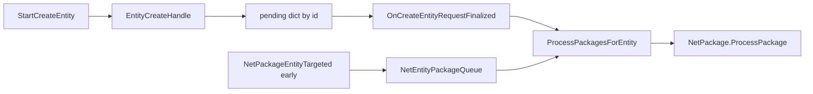

# Dedicated leftovers (V3.2.0)

**Owns:** the final batch of reached-but-undocumented server types: the
transactional-inventory orchestrator (`InventoryManager` + `LockEntry`), the
item-framework leaves that run server-side (`ItemClassBlock`, `ItemClassQuest`,
`ItemClassWaterContainer`), the `PrefabVolumes.*` list types, the
`PathAbstractions` search-path family, `BlockValueV3`, `AesEncryptAndMac`,
`EnumBodyPartHitExtensions`, `BaseOperationLootEntryRequirement`,
`PlayerInteractions`, `CraftCompleteData`, `EntityAsyncManager/EntityCreateHandle`, `NetEntityPackageQueue`,
entity/trader/vending `*LockContext` wire bags, `Prefab/PrefabChunk`,
`ShapesFromXml/ShapeCategory`, `DynamicPropertiesCache`, the `PhysicsBody*`
collider layout family, and the infra types `SdFileSystemInfo`,
`TrackedDataMap/SubsetAccessor`, `UpdateListenerMap`, `DynamicObserver`,
`PooledExpandableMemoryStream`. Also settles `DiscordManager/AuthAndLoginManager`.
**Not:** the owning systems (each section cross-links its family doc); anything
whose entire caller set is UI, editor, avatar, or client render code (listed at
the end); dead config (`EntityVBlimp`).
**Evidence:** IL of the types above plus their caller sets (`FindCallers` walked
back to server systems, world lifecycle, or net packages for every documented
type; that tool is since retired for `Xref`; dump locally with
`tools/src/DumpMethod`, git-ignored), and the stock
`Data/Config` XML shipped with the dedicated server where reachability depends
on config. **Hub:** [`INDEX.md`](INDEX.md).
**Method:** [`re-methodology.md`](re-methodology.md).

Every type below was confirmed dedicated-relevant by walking its callers back
to server-side code, not just by existing in the assembly. Several types the
tasking expected to be client-only turned out to be dedicated (`PhysicsBody*`,
`SdFileSystemInfo`, `SubsetAccessor`, `UpdateListenerMap`, `DynamicObserver`,
`PooledExpandableMemoryStream`), and several expected-dedicated types turned out
to be client or dead and are reclassified at the end.

---

## 1. AuthAndLoginManager: the login manager that is not server login

The tasking flagged `AuthAndLoginManager` (34 methods) as "server-side login
orchestration sequencing the authorizer chain". The IL says otherwise: it is a
**nested type of `DiscordManager`** and orchestrates the local user's Discord
Social SDK sign-in, not player joins. Its surface is `LoginDiscordUser` (PC and
console variants), `LoginProvisionalAccount`, `LoginWithPlatformDefaultAccountType`,
`loginWithStoredTokens` / `refreshToken` (token exchange callbacks),
`UnmergeAccount`, `AbortAuth` and `Disconnect`, tracked through
`DiscordManager.Status` (`EDiscordStatus`: `NotInitialized`, `Disconnected`,
`Ready`, `Connecting`, `Disconnecting`) and `IsLoggingInWith`
(`EDiscordAccountType`: `None` / `Regular` / `Provisional`).

On a dedicated server none of it runs. Every login entry point is client UI
(`XUiC_DiscordWindow`, `XUiC_OptionsAudio`, `XUiC_DiscordLogin`) or one of two
`DiscordManager` hooks that both gate out headless:

```text
DiscordManager::.ctor      IL_00DD: call GameManager::get_IsDedicatedServer()
                           IL_00E2: brtrue.s IL_00FE   // skip Init(false)
DiscordManager::gameStarting IL_0034: call GameManager::get_IsDedicatedServer()
                           IL_0039: brtrue.s IL_0049   // skip Init + AutoLogin
```

So the `Discord.Sdk.Client` is never constructed server-side and `AutoLogin` is
never invoked. What a dedicated server *does* run in this area is already
documented: `ClientInfo.DiscordUserId` is recorded during login and relayed by
`NetPackageDiscordIdMappings.ProcessPackage` (which validates the sender via
`ValidEntityIdForSender` and, `IsServer`, stamps the sender's `ClientInfo`), and
`FriendsAuthorizer.Authorize` consults `DiscordManager.GetUser(DiscordUserId)`
for friend checks in the authorizer chain. See
[platform-auth.md](platform-auth.md) §authorizers and
[protocol.md](protocol.md) §5 for where that sits in the join sequence;
join/kick orchestration itself is `AuthorizationManager`, already covered.
`AuthAndLoginManager` is therefore listed as client-only below.

---

## 2. InventoryManager and LockEntry

`InventoryManager` is the server-side registry for the `TransactionalInventory`
anti-dupe system ([items.md](items.md) §container moves): a lazy singleton
mapping `Guid` tokens to inventories (`TryGetTransactionalInventory`,
`ValidateToken`), creating them server-side (`CreateInventoryServer`), and
serializing them (`ReadInventory` / `WriteInventory` with `StreamMode`
versioning). Its wire endpoints run in server package handlers:
`NetPackageInventoryTransactionRequest.ProcessPackage` calls
`TransactionRequestServer(transaction, senderEntityId)` and
`NetPackageInventoryDataRequest/Response` resolve tokens for full-state sync;
`TransactionRequestLocal` short-circuits to the server path in single player.
`LockEntry` is the small value key of the related `LockManager` (ticked from
`GameManager.gmUpdate`, [loop-gmupdate.md](loop-gmupdate.md) §10): an
`ILockTarget` plus a `ushort` lock type with equality operators, used to hold
per-target access locks (vending machines, workstations, power blocks; trading
uses a shared lock, [loot-economy.md](loot-economy.md)). `ConnectionManager`
releases a client's locks on disconnect.

### 2.1 `ILockContext` bags (entity / trader / vending)

`LockManager` does not serialize locks as opaque tokens only: successful lock
acquisition carries a typed **`ILockContext`** payload that rides the lock
request/response path and is applied in `OnLockedServer` / `OnLockedLocal`.

| Nested type | Owner | Fields | Wire (`Write`/`Read`) |
|---|---|---|---|
| `Entity/EntityLockContext` | `Entity` | `Command` (string), `Bag`, `FirstTimeTouched` | string command; bool firstTouch; bool hasBag + optional `Bag.Write`/`Bag.Read` |
| `EntityTrader/EntityTraderLockContext` | `EntityTrader` | `Command`, `TraderData` (cloned on construct) | string command; bool hasTraderData + optional `TraderData.Write`/`Read` |
| `TileEntityVendingMachine/VendingMachineLockContext` | vending TE | `TraderData` only | always `TraderData.Write`/`Read` (construct clones) |

**Server apply (`OnLockedServer`, verified call patterns):**

- Generic entity: set `FirstTimeTouched`, attach `Bag`, `LootManager.LootBagOpened`.
- `EntityTrader`: `SetupActiveQuestsForPlayer`, `NetPackageNPCQuestList.SendQuestPacketsToPlayer`, `TraderManager.TraderInventoryRequested`, clone `TraderData` into the context.
- `TileEntityVendingMachine`: same trader-inventory request + clone into context.

**Local apply (`OnLockedLocal`)** opens client UI (`XUiC_BagStorageWindowGroup`,
trader window transitions, drone/vehicle `StartInteraction`) and always ends in
`LockManager.UnlockRequestLocal` when the interaction closes. Dedicated care is
the server half + the wire shape of the context; the UI open is client-only.

### 2.2 Lock packages (verified)

**`NetPackageLockRequest` (ToServer, write IL=62):**

```text
locking : bool              // true=lock, false=unlock
channel : u16
targetCount : i32
// targetCount x ILockTarget.WriteIdentifyingInfo
contextTypeFullName : string  // empty if no context
// if non-empty: ILockContext.Write body
```

`ProcessPackage` (IL=24): if locking →
`LockManager.LockRequestServer(targets, sender.entityId, context, channel)`;
else `UnlockRequestServer(sender.entityId, force=false)`.

**`LockRequestServer` (IL=239)** ordered gates (server-only):

1. If player already has `singleLocks` / `sharedLocks` / `keepOpenTimes` entry:
   warn + `ForceUnlockByPlayer` then continue (self-heal stale lock state).
2. Reject null targets; reject span length **> 5** (hard cap).
3. For each target: build `LockEntry(target, channel)`; if not shared and
   `singleLocks.ContainsValue(entry)` → fail "already locked by another".
4. For each: `target.CanLockOnServer(playerId, context, channel)` must pass.
5. On full success: add to `sharedLocks` or `singleLocks` by channel;
   `RefreshPlayerActive`; stamp `keepOpenTimes[player] = UtcNow`;
   `OnLockedServer(true, playerId, context, channel)` per target.
6. Reply: non-primary-player → `NetPackageLockResponse` flags **192** to
   player; primary/local → `LockResponse` in-process.

**`ForceUnlockLockTarget` (IL=124):** server-only; collect all player ids that
hold the target in single or shared maps; `UnlockRequestServer(id, force=true)`
each (trader close path).

**`NetPackageLockResponse` (ToClient, write IL=74):**

```text
locking : bool
success : bool
errorMsg : string
isForceUnlocked : bool
channel : u16
targetCount : i32 + targets as above
contextTypeFullName : string + optional ILockContext.Write
```

Client `ProcessPackage` (IL=27): `locking` true →
`LockManager.LockResponse(success, errorMsg, targets.AsSpan(), context,
channel)` (then the local UI/open via the existing `OnLockedLocal` table);
else → `LockManager.UnlockResponse(success, errorMsg, isForceUnlocked)`.

**`ForceUnlockByPlayer` (IL=11):** server-only; calls
`UnlockRequestServer(playerId, force=true)` (used after failed inventory
transactions and disconnect cleanup).

Complements [items.md](items.md) (bag), [loot-economy.md](loot-economy.md)
(trader lock), [npc-dialog.md](npc-dialog.md) (quest list on trader open).

## 3. ItemClass leaves: ItemClassBlock, ItemClassQuest, ItemClassWaterContainer

`ItemClassBlock` is the block-as-item bridge: `ItemClassesFromXml.CreateItemsFromBlocks`
constructs one per `Block` during config load (dedicated included), so every
block occupies an item id and can sit in inventories, loot, and creative lists.
`GetBlockValueFromItemValue` converts back for placement; the mesh/hold members
only matter client-side, but the id mapping and `ItemBlockInventoryData` are
load-bearing everywhere. `ItemClassQuest` is created per quest item by
`QuestsFromXml.ParseQuestItems` and registered in a static id table;
`ItemValue.ItemClass` redirects quest-item ids through `GetItemQuestById`, so
any server code resolving such an `ItemValue` hits it; its overrides pin the
policy bits (`CanStack` false, `KeepOnDeath`, container rules).
`ItemClassWaterContainer` adds a `MaxMass` property and overrides
`GetInitialMetadata`, which the server calls whenever such items are minted
(`ItemClass.CreateItemStacks` in loot, `TraderInfo.applyRandomDegradation`), so
freshly spawned water containers carry correct fill metadata. Complements
[items.md](items.md); `ItemClassTorch` did not make the cut (see out of scope).

## 4. PrefabVolumes list types (Wall / Trigger / Teleport / Info / Sleeper)

All five are `PrefabVolumeListAbs<TList, TVolume>` subclasses constructed in
`Prefab..ctor` for **every** loaded prefab, filled by `ReadFromProperties` from
the prefab's XML properties, and stamped into live chunks server-side via
`CopyVolumesIntoWorld` when the decorator places the POI. Confirmed server
consumers: `PrefabSleeperVolumeList` backs `Prefab.FindSleeperVolume`,
`CalcSleeperInfo` and `SleeperEventData.SetupData` (sleeper spawning,
[spawning.md](spawning.md)); `PrefabTriggerVolumeList` and
`PrefabSleeperVolumeList` are re-stamped by `World.ResetPOIS` on quest resets;
`PrefabTeleportVolumeList` is read/written by `TraderArea` (trader closing-time
teleport-out); `PrefabInfoVolumeList` backs `PrefabInstance.IsWithinInfoArea`;
`PrefabWallVolumeList` is load/copy only in the dedicated path. The
`AddNewVolume`/`SelectionBox` members are the editor half. Complements
[server-browser-prefabs.md](server-browser-prefabs.md) (prefab load pipeline).

**`PrefabVolumeManager` server leaves (all IL-verified):**
`AddVolumeServer(volumeType, startPos, size)` (IL=115) is the
server-authoritative add: a client forwards
`NetPackageEditorAddVolumeFromClient`; on the server it resolves the prefab
under the box center (`GetPrefabFromWorldPosInside`), runs
`CanCreateVolume` + `AddNewVolume` on the type's volume list
(`VolumeList for Type {0} not found` throws), broadcasts
`NetPackageEditorUpdateVolume.Setup(0, prefabId, volIdx, volume)` (channel
192), and flags `PrefabEditModeManager.NeedsSaving` when the editor is on
the prefab. `CloneVolumeServer(volumeType, prefabInstanceId, existingIndex,
offset)` (IL=76) is the clone twin (`CloneVolume` + the same broadcast).
`GetPrefabIdAndVolumeId(name, out volumeId, out prefabInstance)` (IL=76)
parses the `prefabId_volumeId` selection-box name and resolves the instance
via `PrefabInstanceClientManager`; `TryGetSelectedVolume(category, out box,
out volume, out prefabInstance, out volumeIndex)` (IL=50) resolves the
current `SelectionBoxManager.Selection` into a volume;
`getBoxVolumeType(box)` (IL=27) maps the selection category to
`EVolumeType` (1 trader teleport, 2 info, 3 wall; `Invalid box category`
throws).

`TraderArea.Write` (IL=111) is the blob: `Position` (3x int32), `PrefabSize`
(3x int16), `GetProtectPadding()` (3x sbyte, = `ProtectSize - PrefabSize` with
2 removed on x/z), teleport-volume count (byte), then per volume
`startPos` (3x sbyte) + `size` (3x byte); `Read` (IL=91) mirrors it and
rebuilds each volume via `Use(start, size)` +
`AddExistingVolume`. `GetReadWriteSize` (IL=10) is `22 + count * 6`;
`IsWithinProtectArea` (IL=59) is the `ProtectBounds` AABB test.
`SetClosed(world, closed, trader, playSound)` (IL=224) stores
`owningTrader`/`IsClosed`, requires every chunk of the prefab span to be
loaded, then per chunk walks `IndexedBlocks["TraderOnOff"]`: non-child blocks
inside `ProtectBounds` resolve their `TileEntityComposite` and toggle the
`TEFeatureDoor` feature (plus the teleport/sound side).
`Overlaps(min, max)` (IL=38) is the 2D AABB test against
`ProtectPosition + ProtectSize`; `IsWithinTeleportArea(pos, ref tpVolume)`
(IL=93) AABB-tests each teleport volume's world box
(`Position + startPos .. + size`), returning the matching volume (disabled in
sandbox trader mode).

## 5. PathAbstractions: SearchDefinition, SearchPathBasic/Saves/Mods/UserData

The static `PathAbstractions` class builds one `SearchDefinition` per asset
family in its `.cctor` (`WorldsSearchPaths`, `PrefabsSearchPaths`,
`PrefabImpostersSearchPaths`, stamps, and more), each an ordered array of
`SearchPath` strategies: `SearchPathSaves` (the save folder, e.g. `World`),
`SearchPathUserData` (platform user storage, e.g. `GeneratedWorlds`),
`SearchPathMods` (each loaded mod's subfolder, e.g. `Worlds`), and
`SearchPathBasic` (a fixed base like `Data/Worlds`). `SearchDefinition` resolves
names to `AbstractedLocation`s (`GetLocation`, `GetAvailablePathsList`,
`BuildLocation`) with a populate-on-demand cache (`PopulateCache` /
`InvalidateCache`) and mod-aware `EAbstractedLocationType`. Dedicated callers
are core: `GameManager`/`GameUtils` world resolution, `ChunkProviderDisc`,
`DynamicPrefabDecorator`, `BiomeIntensityMap`, and the prefab console commands.
Complements [save-persistence.md](save-persistence.md) and
[world-generation.md](world-generation.md), which already use these statics.

## 6. BlockValueV3

A `uint`-wrapping struct that preserves the **old** raw block-value bit layout
(type mask via `GetTypeMasked`, `rotation`, `meta`/`meta2`/`meta3`, decal bits,
child/parent link bits, water flags). Its one live consumer is
`Prefab.readBlockData`: for `.tts` prefab files with `_version < 18` each raw
word passes through `BlockValueV3.ConvertOldRawData(uint)` to be re-packed into
the current `BlockValue` layout. Since prefab block data is parsed server-side
when POIs are placed, this legacy shim is dedicated code on any world using
older prefabs. Complements [blocks.md](blocks.md) (current `BlockValue` layout)
and [server-browser-prefabs.md](server-browser-prefabs.md) (.tts reader).

**Legacy V3 bit layout (IL consts):** type `15` bits (mask `TypeMask` =
0x7FFF = **32767**), rotation `5` bits at shift **15** (`RotationShift`), meta
`4` bits at shift **20** (`MetadataShift`), meta2 `4` bits at shift **24**
(`Metadata2Shift`), meta3 `2` bits at shift **28** (`Metadata3Shift`, max 3),
child shift **30** (`ChildShift`), hasdecal shift **31** (`HasDecalShift`) -
versus the current layout's 16-bit type at shift 0, rotation 16, meta3 21,
meta 22, meta2 26.

## 7. AesEncryptAndMac

The managed symmetric channel cipher behind the join key exchange: `Aes.Create()`
plus `HMACSHA256`, exposing `EncryptionKey`/`IntegrityKey` and
`EncryptStream`/`DecryptStream` over `PooledExpandableMemoryStream` buffers
under a lock. `AntiCheatEncryptionAuthServer.SendSharedKey` news one per
joining client, RSA-encrypts (`RSAEncryptionPadding.Pkcs1`) the two keys with
the client's platform public key, ships them in
`NetPackageEncryptionSharedKey`, and parks the instance in
`pendingEncryptionModules` as the client's `IEncryptionModule`. The interface is
then invoked per message by `NetConnectionAbs.Encrypt/Decrypt`, which is why
direct callers of `EncryptStream` do not appear: it is pure interface dispatch.
Complements [protocol-packages.md](protocol-packages.md) §2 and
[platform-auth.md](platform-auth.md) §4.4 (handshake sequencing) and
[network.md](network.md) §4.5 (EncryptStream/DecryptStream layout).

## 8. EnumBodyPartHitExtensions

Static helpers over the `EnumBodyPartHit` flags enum: `IsLeg`/`IsLeftLeg`/
`IsRightLeg`/`IsArm`, `IsMultiHit`, and the conversions `ToPrimary` /
`ToFlag` / `LowerToUpperLimb` between the flag form and `BodyPrimaryHit`.
Dedicated-relevant because the authoritative damage path uses them:
`EntityAlive.damageEntityLocal` and `ProcessDamageResponseLocal` branch on
`IsLeg` (leg-cripple logic) and `GetDismemberChance` keys its table on
`ToPrimary`. The same helpers also serve client avatar controllers, but the
server-side damage math is the reason they are in scope. Complements
[combat-damage.md](combat-damage.md).

## 9. BaseOperationLootEntryRequirement

Abstract comparison node for loot-entry gating: `Init(XElement)` parses an
operation, `LeftSide(EntityPlayer)`/`RightSide(EntityPlayer)` produce operands,
and `CheckRequirement(EntityPlayer)` applies the operator. Its concrete users
are the `LootEntryRequirement*` classes (`CVar`, `Progression`, `RandomRoll`,
`SandboxOption`) which the server evaluates against the opening player when
rolling loot group entries. Runs wherever loot lists are materialized, i.e. the
dedicated loot spawn path. Complements [loot-economy.md](loot-economy.md).

## 10. PlayerInteractions

Singleton that turns persistent-player events into `Platform.PlayerInteraction`
records for platform compliance ("played with" lists). On a dedicated server
`GameManager.StartAsServer` calls `JoinedMultiplayerServer(persistentPlayers)`
(it logs `[PlayerInteractions] JoinedMultplayerServer`, sic) and
`GameManager.PlayerSpawnedInWorld` calls `PlayerSpawnedInMultiplayerServer`;
`SaveAndCleanupWorld` unhooks and calls `Shutdown`. Each event fans out to
`PlatformManager.MultiPlatform.PlayerInteractionsRecorder` (null-guarded; a
no-op recorder on a Linux Steam dedicated) and raises `OnNewPlayerInteraction`,
which `Platform.BlockedPlayerList` subscribes to for blocked-player
resolution. Complements [platform-auth.md](platform-auth.md) (platform
abstraction) and [server-lifecycle.md](server-lifecycle.md) (StartAsServer /
SaveAndCleanupWorld hooks).

**`Platform.BlockedPlayerList` constants (IL):** `TimeoutHours` = **168** (7
days), `MaxBlockedPlayerEntries` = **500**, `MaxRecentPlayerEntries` = **100**,
`Version` = 1 (the persisted list file version).

## 11. CraftCompleteData

Persistence record for a finished workstation craft: written and read only by
`TileEntityWorkstation` (`writeCraftCompleteData` / `readCraftCompleteData`,
with a `ReadLegacy` shim for old saves) and appended by
`TileEntityWorkstation.AddCraftComplete` / consumed by `CheckForCraftComplete`.
Because workstation tile entities live and persist server-side (crafting
continues while the owner is away), these records ride the tile-entity
read/write path on the dedicated. Complements
[tile-entities-power.md](tile-entities-power.md) and
[crafting-recipes.md](crafting-recipes.md).

## 12. EntityAsyncManager/`EntityCreateHandle` + `NetEntityPackageQueue`

The completion handle of the async entity-create pipeline: wraps a
`CreateEntityOperation` plus a callback, with `TryComplete` polled by
`EntityAsyncManager.Update` (phase F of the server loop,
[loop-gmupdate.md](loop-gmupdate.md) §2 / [managers.md](managers.md)) and a
blocking `WaitForComplete` for teardown. Server producers: `Chunk.SpawnEntityAsync`
tracks a `HashSet` of pending handles per chunk and `Chunk.OnUnload` drains
them via `WaitForComplete` so unload never races creation; `SleeperVolume`
spawns sleepers through it; `NetPackageEntitySpawn.ProcessPackage` uses it for
package-driven spawns.

**Create path (IL-pinned):** `StartCreateEntity(EntityCreationData, onComplete)`
(IL=29) builds `EntityFactory.CreateEntityAsync`, allocates `EntityCreateHandle`,
stores it in a pending `Dictionary<Int32, EntityCreateHandle>` by entity id, and enqueues
the handle for `Update` polling.

**Package hold-back:** entity-targeted packages can arrive before the entity
exists. `NetPackageEntityTargeted.ShouldProcess` asks
`NetEntityPackageQueue.HasPackagesForEntity` (IL=5); if the entity is still pending,
`HandleSkipped` calls `EnqueueNetPackageForEntity`. When create finishes,
`EntityAsyncManager.OnCreateEntityRequestFinalized(id)` (IL=10) removes the handle and
calls `NetEntityPackageQueue.ProcessPackagesForEntity(id)` (IL=20), which dequeues each
held `NetPackage`, runs `ProcessPackage(world, GameManager)`, and
`NetPackageManager.FreePackage`. The polled completion handle is
`EntityCreateHandle.TryComplete` (IL=38).

`NetEntityPackageQueue` itself:

| Method | IL | Behavior |
|---|---:|---|
| ctor | 10 | `Dictionary<int, Queue<NetPackage>>(64)` |
| `EnqueueNetPackageForEntity` | 18 | create per-entity queue capacity **10** if missing |
| `ProcessPackagesForEntity` | 20 | remove queue, drain + process + free |
| `Cleanup` | 28 | free all queued packages (world cleanup / load) |



Complements [spawning.md](spawning.md) and [network.md](network.md).

## 13. ShapesFromXml/ShapeCategory

Small record (name, localized label, order) parsed from `shapes.xml` by
`ShapesFromXml` into a static category dictionary during config load, which the
dedicated performs like any XML. `Block.Init` resolves each block's
`ShapeCategories` list from it, so the data is populated and attached
server-side; the only runtime consumers beyond that are the client shape-menu
windows (`XUiC_ShapesWindow`, `XUiC_Creative2Window`). In scope as loaded
config metadata, with that caveat. Complements [block-shapes.md](block-shapes.md).

## 14. DynamicPropertiesCache

Memory optimization behind `Block.Properties`: `Block.InitStatic` creates the
cache, `Block.LateInit` calls `Store(id, props)` to intern each block's
`DynamicProperties`, `Block.get_Properties` retrieves through `Cache(id)` /
`Retrieve`, and `Block.OnWorldUnloaded` calls `Cleanup`. Entirely inside the
server-side block registry lifecycle (`Stats` exists for diagnostics).
Complements [blocks.md](blocks.md).

## 15. PhysicsBodyLayout, PhysicsBodyInstance, PhysicsBodyColliderBase

Flagged "likely client ragdoll", but the callers say dedicated:
`physicsbodies.xml` is loaded via `WorldStaticData` (with `PhysicsBodyLayout.Reset`
on reload), `EntityClass.Init` resolves each entity's `PhysicsBody` layout by
name, and `EModelBase.SwitchModelAndView` (called from `EModelBase.InitCommon`
for every entity, server included) news a `PhysicsBodyInstance(transform,
layout, EnumColliderMode)` and drives `SetColliderMode`. These colliders are
the entity hitboxes the server's raycasts and damage code hit, not just ragdoll
dressing. `PhysicsBodyColliderBase` and its `Box/Capsule/Sphere/Null` subclasses
are the parsed collider definitions inside a layout. Complements
[combat-damage.md](combat-damage.md) (hit resolution) and
[entity-ai.md](entity-ai.md).

## 16. SdFileSystemInfo

The wrapper behind the `SdFile`/`SdDirectory`/`SdFileInfo` facade of
[save-persistence.md](save-persistence.md): holds a `FileSystemInfo` plus the
`IsManaged` flag and `SaveDataManagedPath` that route an entry through the
managed `ISaveDataManager` providers instead of raw `System.IO`. Dedicated
callers include `SaveDataManager`/`SaveDataManagerBase`, `GameIO`,
`PathAbstractions/SearchPath` cache population, `SaveInfoProvider`,
`MapChunkDatabaseByRegion`, `RegionFileAccessMultipleChunks`, and
`DynamicMeshManager` file scans; `Refresh`/`Reinitialize` support pooled reuse
during directory listing.

## 17. TrackedDataMap/SubsetAccessor

The "typed subset accessors" of `MultiBlockManager.TrackedDataMap`
([dedicated-misc-systems.md](dedicated-misc-systems.md) §TrackedDataMap) as a
concrete type: a struct enumerator/view over the shared
`Dictionary<Vector3i, TrackedBlockData>` restricted to one `HashSet<Vector3i>`
subset (oversized, cross-chunk, POI, terrain-aligned), exposing `ContainsKey`,
`TryGetValue`, indexer and enumeration without copying. Lives entirely inside
the server's multi-block tracking (`MultiBlockManager.MainThreadUpdate` in the
main loop, [loop.md](loop.md)). Complements [blocks.md](blocks.md).

## 18. UpdateListenerMap

Bidirectional registry inside `SignDataManager` mapping `GlobalSignId` to
`ISignRenderingDataUpdateListener`s (`RegisterListener`, `GetListeners`,
`GetIds`, `HasListeners`, `Clear`). The manager that owns and consults it on
sign-data updates is the dedicated-side sign library
([signs.md](signs.md)); the listeners themselves are client renderers, so on a
dedicated server the map is constructed and checked but stays empty
(`HasListeners` false). In scope as server-owned plumbing with that caveat.

## 19. DynamicObserver

Server-side helper of `DynamicMeshManager` ([dynamic-mesh.md](dynamic-mesh.md)
§CheckFallingObservers): `Start(position)` opens an observation volume after an
imposter-area update, `ContainsPoint(Vector3i)` filters block events, and
`HasFallingBlocks` reports whether unsupported blocks began falling inside it,
letting the manager defer work until physics settles; `Stop` releases it. Part
of the dedicated dynamic-mesh regeneration path (the manager is server-owned).

## 20. PooledExpandableMemoryStream

The pooled `MemoryStream` subclass handed out by
`MemoryPools.poolMemoryStream.AllocSync` all over the server hot path:
serializers for net packages (`NetPackageBag`, `NetPackageDecoUpdate`,
`NetPackageEntityStatsBuff`, drone data sync and more), `AesEncryptAndMac`
crypto buffers, `ChunkAreaBiomeSpawnData`, `NameIdMapping`, `FactionManager`,
`BlockLimitTracker`, `EventPrefabs`. `Reset`/`Cleanup` rewind and return the
buffer to the pool instead of freeing, and `Close`/`Dispose` are overridden to
route into the pool. Complements [protocol-packages.md](protocol-packages.md)
(package serialization) and [network.md](network.md).

---

## 21. Prefab/PrefabChunk

`PrefabChunk` is a nested **`IChunk`-shaped view** over a loaded `Prefab`
template (not a world chunk). `Prefab.GetChunk(x,z)` caches
`Dictionary<Int64, PrefabChunk>` keyed by `WorldChunkCache.MakeChunkKey`;
`GetChunks` materializes the full list for placement/copy paths.

Surface (54 methods): `GetBlock` / `GetWater` / `GetDensity` / `IsAir` /
`IsWater` / `GetTerrainHeight` / `GetBlockFaceTexture` / `GetTextureFull` /
`GetBlockColumn`, with `checkCoordinates` clamping local indices. Used when the
server copies prefab volumes into the world (`CopyIntoLocal` and friends in the
prefab/chunk provider path; see [chunk-providers.md](chunk-providers.md) and
[server-browser-prefabs.md](server-browser-prefabs.md)).

Complements [world-chunks.md](world-chunks.md) (real chunks) by making clear
this type is **template addressing**, not region persistence.

---

## Out of scope (verified client-only)

- **DiscordManager/AuthAndLoginManager**: Discord Social SDK sign-in for the
  local user; both dedicated-side triggers gate out on `IsDedicatedServer` and
  the SDK client is never initialized headless. Full verification in §1.
- **ItemClassTorch**: instantiated at `items.xml` parse (`meleeToolTorch`), but
  every override is held-item behavior on the holding client
  (`StartHolding`/`OnHoldingUpdate`/`StopHolding`, and `OnConvertToBlockValue`
  packing `ItemValue.UseTimes` into block `meta`/`meta2` inside the client-run
  `ItemActionPlaceAsBlock.ExecuteAction`); the server only sees the resulting
  block change ([items.md](items.md)).
- **EntityVBlimp**: dead in stock config. The `EntityVehicle` subclass exists
  (buoyant `PhysicsInputMove`, wheel force/steering stubs), and `vehicles.xml`
  still ships a `vehicleJokeblimp` tuning entry, but the matching
  `entity_class` in `entityclasses.xml` is commented out ("Kinda sorta works
  but is buggy"), so `EntityFactory` can never instantiate it. Modders can
  re-enable it; stock dedicated never reaches it
  ([vehicles-drones-turrets.md](vehicles-drones-turrets.md)).
- **`BlockSwitchController` / `BlockSwitchSingleController`**: MonoBehaviours on
  block-entity prefabs syncing lever/light visuals (`Start`, `UpdateLights`).
  The one server-side toucher, `TriggerManager.CheckPowerState`, fetches them
  via `Chunk.GetBlockEntity(...).transform.GetComponent<...>()`, which is
  null-guarded and null on a dedicated (no block-entity GameObjects). The
  authoritative trigger state lives in `TriggerManager` itself
  ([block-shapes.md](block-shapes.md) §triggers).
- **TimerEventData**: the hold-to-interact timer payload; every creation site
  (`Block.TakeItemWithTimer`, `BlockGameEvent`/`BlockQuestActivate.OnBlockActivated`,
  `Entity.ActivateEntityCommand`, `TEFeatureLockPickable`) immediately opens
  `XUiC_Timer.OpenTimer` on the interacting player's client; the server only
  sees the follow-up packages.
- **ChatTarget**: nested in `XUiC_Chat`; client chat-target dropdown records
  (`Send`, `IsValid`). Server chat routing is in [chat.md](chat.md).
- **GameOptionValue**: nested in `XUiC_GamePrefSelector` and the
  `XUiC_ServerBrowserGamePref*` controls; client option-UI value records
  ([sandbox-options.md](sandbox-options.md) covers the server side).
- **SandboxOptionValue / SandboxPresetInfo / SandboxPresetGroupData**: UI
  records nested in or consumed only by `XUiC_SandBoxOptionEntry` and
  `XUiC_SandboxPresetSelector`. The server-side option/preset model
  (`SandboxOptions.*`, `SandboxOptionValueSet`, `SandboxOptionPreset`,
  `LoadPresets` on dedicated) is already documented in
  [sandbox-options.md](sandbox-options.md).
- **POIBoundsSideHelper**: trigger-collider walls spawned by `POIBoundsHelper`
  for `ObjectivePOIStayWithin`, a quest objective that runs on the owning
  player's client ([quests-challenges.md](quests-challenges.md) §5).
- **PoiSizeInfo**: `XUiC_CreatePoi` editor UI record.
- **PrefabMarkerEntry**: `XUiC_PrefabMarkerList` editor UI record.
- **ChunkPreviewData / ChunkPreviewManager**: prefab-preview visualization
  (`SetChunkGoVisiblity`, preview GameObjects) fed by
  `DynamicMeshPrefabPreviewThread`; editor/console preview tooling beside the
  dynamic-mesh code, not the server regeneration path of
  [dynamic-mesh.md](dynamic-mesh.md).
- **FlatArea / FlatAreaManager**: flat-area records over the deco occupied map.
  The only runtime consumer is `ObjectiveRandomGoto.CalculateRandomPositionFromFlatAreas`
  (client quest objective); no caller of `DefineFlatAreas` exists in the
  dedicated assembly and the server touches it only via `World.Cleanup` and a
  `DecoManager` debug texture dump.
- **AutomationRunner / AutomationScript**: QA scripting harness
  (`ExecutePerfSession`, `GetPlayer`, script steps). Dedicated touchpoints are
  `GameEntrypoint.FirstFrameInit -> AutomationRunner.InitialiseLogging` and
  `ConsoleCmdAutomation`; dev-only tooling, no gameplay role.
- **NGuiAction / MessageButton**: legacy NGUI action wrappers and
  `XUiC_MessageBoxWindowGroup` button records; UI. **EventDelegate** is not
  even in `Assembly-CSharp` (it lives in `NGUI.dll`).
- **BuffEntityUINotification**: HUD buff notification record. Note it **is**
  constructed server-side, unconditionally, in `PlayerEntityStats.EntityBuffAdded`
  off the server buff tick ([buffs.md](buffs.md)); the allocation is simply inert
  there because only the client HUD reads it. Listed here as no-server-behavior
  rather than never-server-executed.
- **SaveDataLimitUIHelper**: save-allowance display helper for `XUiC_NewGame` /
  `XUiC_WorldGenerationWindow`; the enforcement lives in
  [save-persistence.md](save-persistence.md).

## Dedicated stragglers (brief)

Small dedicated-relevant types that extend an already-owned subsystem:

- **`VariableState*` family** (`VariableStateAbs` base + `VariableStateCVar`,
  `VariableStateGameStat`, `VariableStateGamePref`, `VariableStateGameInfoBool/Int/String`,
  `VariableStateBinding`, `VariableStateParamBinding`, `VariableStateSimpleLookupAbs`,
  `VariableStateLegacyBinding`): a value-binding abstraction that resolves a named
  value from a **server-authoritative source** (a CVar, a `GameStats` entry, a
  `GamePrefs` entry, or a `GameInfo` string/int/bool). Used by the game-event /
  sequence system (and the data-binding UI) to read live game state; the state
  sources are owned by [game-events.md](game-events.md), [entity-stats.md](entity-stats.md),
  and [sandbox-options.md](sandbox-options.md).
- **`Archetype`** (10 methods): entity archetype record (the character-preset model
  behind `PlayerProfile` / entity variant selection at spawn), tied to
  [protocol-packages.md](protocol-packages.md) §5.1 (EntityCreationData) and
  [spawning.md](spawning.md).
- **`WorldRayHitInfo`** (4): the result struct of a server world raycast (hit
  block/entity/transform), used by the damage/interaction paths in
  [combat-damage.md](combat-damage.md).
- **`TurretInventory` / `VehicleInventory`**: the specialized inventory holders for
  turrets and vehicles ([vehicles-drones-turrets.md](vehicles-drones-turrets.md)),
  built on the same `Bag`/`ItemStack` shapes as [items.md](items.md).
- **`ThreadRegion`**: the per-thread region work unit of the dynamic-mesh save
  pipeline ([dynamic-mesh.md](dynamic-mesh.md) §4).
- **`PathNodePool`** (`WorldGenerationEngineFinal`): a pooled path-node allocator
  used during RWG road/path routing ([world-generation.md](world-generation.md)).
- **`World.IsMaterialInBounds(aabb, material)`** (IL=79): a brute-force scan of
  every integer cell inside the bounds (`Fastfloor(min)` .. `Fastfloor(max + 1)`
  per axis) returning true when any `GetBlock(x, y, z).Block.blockMaterial`
  matches; **0 call sites on b9** (an unused world-query leaf).
- **`Utils` server leaves (all IL-verified):** the wrap trio `WrapFloat` /
  `WrapInt` (IL=21/22, wrap into `[min, max]`) and `WrapIndex` (IL=18, wrap
  into `[0, arraySize)`); `FastAbsInt` (IL=13, with the `int.MinValue`
  clamp); `FastLerpUnclamped` (IL=8, `a + (b-a)*t`); `Saturate` (IL=44,
  per-channel Color clamp 0..1); `FastRoundToIntAndMod(f, mod)` (IL=25, 0
  when mod is 0); `ToCelsius` / `ToRelativeCelsius` (IL=6/4, `(f-32)*5/9`
  and `f*5/9`); `get_CurrentUnixTime()` (IL=13,
  `(UtcNow - 1970-01-01).TotalSeconds` as uint); `get_StandardCulture()`
  (IL=2, the static invariant CultureInfo); `ArrayEquals` (IL=43 each for
  `byte[]` / `int[]`: reference-equal, length, element-wise);
  `MaskIp(input)` (IL=46) replaces everything before the first and after the
  last separator character with `*`; `EncryptOrDecrypt(text, key)` (IL=30)
  XORs each char with `key[i % key.Length]` (reversible);
  `CreateGameMessage(sender, message)` (IL=10) prefixes `sender: ` when a
  sender is set.
  Block-face math: `BlockFaceToRotation(face)` (IL=27) maps
  Top=identity, Bottom=180° about forward, North=90° right, South=90°
  forward, West=-90° right, East=-90° forward;
  `BlockFaceToVector(face)` (IL=35) is `Top (0,1,0)`, `Bottom (0,-1,0)`,
  `North (0,0,1)`, `South (-1,0,0)`, `West (0,0,-1)`, `East (1,0,0)`;
  `MoveInBlockFaceDirection(vertices, face, d)` (IL=64) offsets every vertex
  by the face direction times `d`; `Get6HitDirectionAsInt(direction, look)`
  (IL=46) buckets the `GetAngleBetween` value into front (1) / right (2) /
  left (3) / back-right (4) / back-left (5) / back (0) by angle bands;
  `GetHitDirection4Sides(fwd, targetDir, up)` (IL=63) is the 4-side variant
  (right 2 / left 3 / up 1 / front-back 0-1 via the atan2 difference).
- **`Extensions` leaves (all IL-verified):** `EqualsCaseInsensitive(a, b)`
  (IL=5) is `string.Equals(a, b, OrdinalIgnoreCase)`; `ContainsInclusive`
  (IL=53) is the inclusive `BoundsInt` containment test;
  `ContainsWithComparer(list, item, comparer)` (IL=31) is a linear scan with
  the given comparer (default when null, `ArgumentNullException` on a null
  list); `NormalizeReturnMagnitude(value, out magnitude)` (IL=19) returns
  the normalized vector (zero for magnitudes below 1e-5);
  `CalculatePersistableHash(bounds, hash)` (IL=31) appends the bounds
  center and size floats (no-alloc) to an `IncrementalHash`;
  `WriteToBuffer(guid, dest, offset)` (IL=49) copies the 16 Guid bytes via
  two i64 stores (`buffer too small` on overflow); `ToUnicodeCodepoints`
  (IL=28) renders `\uXXXX` per char; `GetOrAddComponent<T>` (IL=13) is
  GetComponent-else-AddComponent; `UppercaseFirst` (IL=17) uppercases the
  first char; `RemoveLineBreaks` (IL=11) strips `\r\n` / `\n` / `\r`;
  `SeparateCamelCase` (IL=6) and `Unindent` (IL=24) are regex-driven text
  transforms; `TrimStart` / `TrimEnd` (IL=33/38) trim `StringBuilder`
  whitespace.
- **`GameUtils` server leaves (all IL-verified):** `FindPrefabForBlockPos
  (prefabs, pos)` (IL=61) is the first prefab whose XZ bbox contains the
  block position; `GetBlockPlacementBounds(block)` (IL=23) returns
  `oversizedBounds` for oversized blocks, `Bounds(dim +
  GetMultiBlockBoundsOffset, dim)` for multi-blocks, else a unit bounds at
  the origin; `GetMultiBlockBoundsOffset(dim)` (IL=26) is
  `(even ? -0.5 : 0, dim.y/2 - 0.5, even ? -0.5 : 0)`.
  `GetLaunchArgument(name)` (IL=79) lazily parses `-key=value` /
  `-key` from `GameStartupHelper.GetCommandLineArgs()` into the
  case-insensitive `arguments` dict (null on a miss); `IsWorldEditor()`
  (IL=12) is GamePref 29 == `GameModeEditWorld.TypeName` and GamePref 31 ==
  `WorldEditor`. `ColorToUInt(color, includeAlpha)` (IL=33) packs RGBA
  (alpha in the high byte) or RGB; `UIntToColor` (IL=32) is the reverse
  (alpha 255 when not included); `FindPaintIdForBlockFace(bv, face, out
  name, channel)` (IL=42) scans `BlockTextureData.list` for the side
  texture id; `WriteItemValueArray` / `ReadItemValueArray` (IL=35/30) are
  the `u16 count` + per-entry `bool` + `ItemValue.Write/Read` wire pair.
  `GetNormalFromHitInfo(blockPos, collider, triIdx, out faceCenter)`
  (IL=98) reads the hit triangle of a readable `MeshCollider` and returns
  its cross-product normal with the vertex-average face center (world
  space); `GetUpdatedNormalAtPosition(worldPos, saveNrmToChunk)` (IL=178)
  recomputes the terrain normal from the height + density samples at the
  position and its +x / +z neighbors (near-1 densities clamped to 0.5).
- **`XmlExtensions` XML helper leaves (all IL-verified):** attribute accessors
  on `XElement`: `GetAttribute` (IL=11) is the attribute value or `""` on a
  miss; `TryGetAttribute` (IL=16 each, `XElement`/`XName` and
  `XmlElement`/`String` overloads) fills the out ref and returns presence;
  `HasAttribute` (IL=6) is a null-check on `Attribute()`. `ParseAttribute`
  (8 overloads: int, short, string, float, Vector2, Vector3, ulong, bool) is
  `TryGetAttribute` + the matching `Parse` (float via
  `StringParsers.ParseFloat` with NumberStyles 511, Vector2/Vector3 via the
  `StringParsers` parsers). `GetElementString` (IL=57) renders
  `<name attr="value" ...>` into a StringBuilder; `GetXPath` (IL=6/20) builds
  the `/a/b` chain via the recursive `getXPath` (IL=17) and appends `[@name]`
  for attributes. DOM writers (used by the settings save paths):
  `AddXmlElement` (IL=21) creates the element from the owner document (or the
  node itself when it is a document); `SetAttrib` (IL=6) is `SetAttribute`;
  `AddXmlKeyValueProperty` (IL=10) is `<property name value>`; `AddXmlComment`
  (IL=21) appends a comment; `CreateXmlDeclaration` (IL=13) inserts
  `<?xml version="1.0" encoding="UTF-8"?>` before the document element.
- **`LiveStats`** (18 methods): a survival-stat record (int `liveLevel`,
  `maxLiveLevel`, `oversaturationLevel`; float `saturationLevel`,
  `exhaustionLevel`; int `timer`) carrying the hunger/thirst drain simulation:
  `OnUpdate(EntityPlayer)` burns `exhaustionLevel` at 1/sec while above 1,
  consuming `saturationLevel` first and `liveLevel` when saturation is empty;
  `AddStats(v)` converts life-level overflow into saturation capped at
  `oversaturationLevel`; `AddExhaustion(v)` clamps at 40; the
  `Read`/`Write` wire pair is `i16 liveLevel, i16 timer, f32 saturation,
  f32 exhaustion`. **Dead in b9**: Xref shows the only call site of the
  constructor is its own `Clone`, and no entity type holds an instance, so
  the drain simulation never runs (the live system is
  [entity-stats.md](entity-stats.md)).
- **Dead collection/utility families (no in-assembly references outside their
  own family on b9, verified against the full IL dump):** the
  `TList<T>` / `TQueue<T>` pair (self-contained, 78 methods together with
  their iterator state machines); `OneToOneDictionary<K,V>` (10, only its own
  `_get_Keys/_get_Values` iterators reference it); `CollectionDebugWrapper<T>`
  (5) with its `ListDebugWrapper` / `DictionaryDebugWrapper` subclasses;
  `ParsingConverters` (7, color/action/string-list parsers) with its
  `ParsingMethodCache` singleton; `SimplexNoise` (6) and the vendored
  `OpenSimplex2` / `OpenSimplex2S` noise stack (33 methods, with the
  field-only `LatticeVertex4D` helper); `IEnumerableExtensions` (3,
  `IsEmpty` / `Join`); `BinaryReaderExtensions` (1, `TryReadAllBytes`);
  `IdPalette` (3, a palette MonoBehaviour with `OnEnable`/`ResetStatic`).
  None are constructed or
  called by live server (or client) code; do not model them as part of any
  wire/file contract. (`UtilList<T>` is not dead but is reachable only from
  the client `DistantTerrain` render path.)

**`AdminBlacklist`** (AdminSectionAbs): the ban list - `AddBan` / `RemoveBan` /
`IsBanned` / `GetBanned` over the admin XML, with `Save`.

## Related docs

| Doc | Role |
|---|---|
| [dedicated-misc-systems.md](dedicated-misc-systems.md) | Sibling grab-bag of small dedicated systems |
| [out-of-scope-surface.md](out-of-scope-surface.md) | The client/out-of-scope classification boundary |
| [closed-gaps.md](closed-gaps.md) | Lock-request and other gap closes |
| [INDEX.md](INDEX.md) | Hub |

## Changelog

- **2026-08-11:** Lock IL re-verified: NetPackageLockRequest write IL=62 / ProcessPackage IL=24, LockRequestServer IL=239, ForceUnlockLockTarget IL=124, NetPackageLockResponse write IL=74 / ProcessPackage IL=27, ForceUnlockByPlayer IL=11 (exact).
- **2026-08-11:** Volume/util IL re-verified: AddVolumeServer IL=115, CloneVolumeServer IL=76, GetPrefabIdAndVolumeId IL=76, TryGetSelectedVolume IL=50, getBoxVolumeType IL=27, TraderArea Write IL=111 / Read IL=91 / GetReadWriteSize IL=10 / SetClosed IL=222 / Overlaps IL=38 / IsWithinTeleportArea IL=93, World.IsMaterialInBounds IL=79, Utils WrapFloat IL=21 / WrapInt IL=22 / WrapIndex IL=18 / FastAbsInt IL=13 / FastLerpUnclamped IL=8 / Saturate IL=44 / FastRoundToIntAndMod IL=25 / ToCelsius IL=6 / ToRelativeCelsius IL=4 (exact).
- **2026-08-10:** LockManager IL re-verified: LockRequestServer IL=239, ForceUnlockLockTarget IL=124 (exact).
- **2026-08-10:** EntityVBlimp dead-config claim re-verified: 0 external ctor call sites (only its own dump, no newobj refs elsewhere).
- **2026-08-08:** XmlExtensions XML helpers, LiveStats dead survival-stat record, body-verified dead collection/noise families (TList/TQueue, OneToOneDictionary, CollectionDebugWrapper, ParsingConverters, SimplexNoise, OpenSimplex2/2S, IEnumerableExtensions, BinaryReaderExtensions, IdPalette), ObservableDictionary live backing note.
- **2026-08-07:** LockRequestServer IL=239 (5-target cap, single/shared maps, CanLockOnServer, OnLockedServer, response 192); ForceUnlockLockTarget multi-player unlock.

- **2026-07-28:** NetPackageLockRequest/Response wire + ForceUnlockByPlayer.

- **2026-07-28:** ILockContext bags; EntityCreateHandle + NetEntityPackageQueue hold-back; PrefabChunk IChunk view.

- **2026-07-24:** Final leftovers batch: 19 dedicated sections covering ~30
  types (caller-verified), `AuthAndLoginManager` investigated and reclassified as
  client-only Discord SDK login, `EntityVBlimp` confirmed dead in stock config,
  `PhysicsBody*` and five infra types reclassified into dedicated scope.
