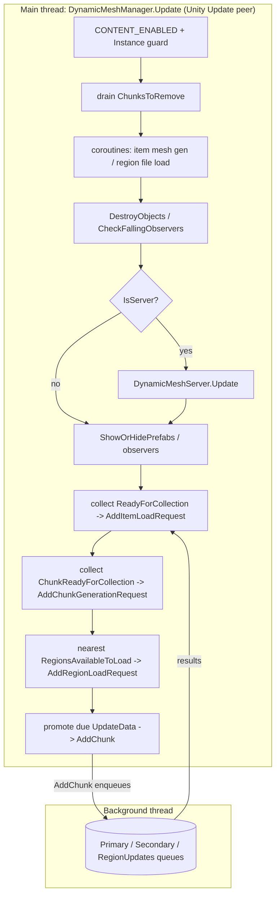
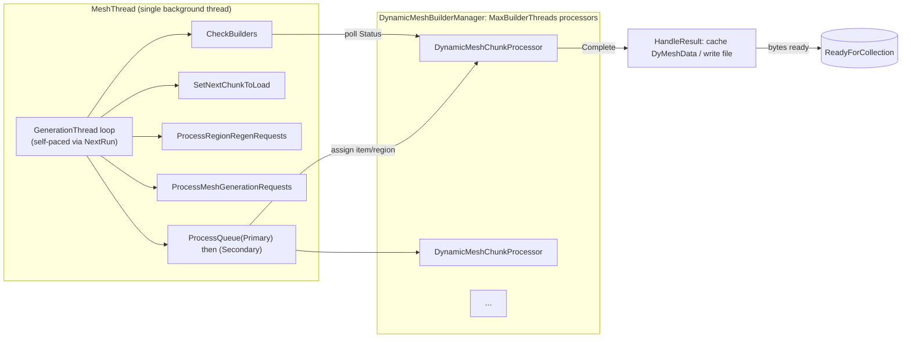
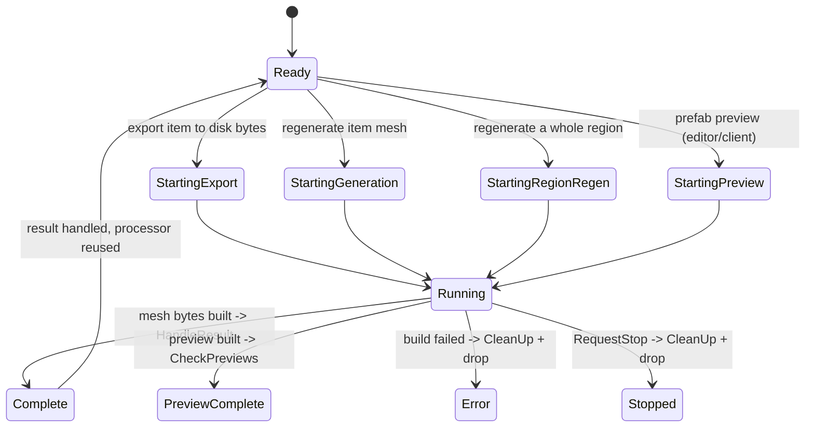
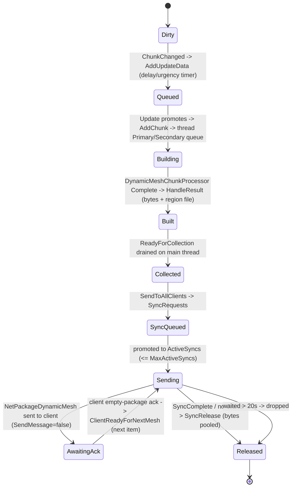

# Dynamic mesh subsystem (dedicated V3.1.0)

**Owns:** the server-authoritative regeneration, persistence, and streaming of
deformed and destroyed block geometry, the geometry that diverges from the base
chunk voxel mesh once players carve, damage, or blow up terrain and structures.
Covers the `DynamicMeshManager` main-thread frame peer, the `DynamicMeshThread`
background generation loop, the `DynamicMeshBuilderManager` worker pool, the
`DynamicMeshServer` send/sync coordinator, on-disk region files, and the two wire
packages (`NetPackageDynamicMesh`, `NetPackageDynamicClientArrive`).
**Not:** the native/Unity `Mesh` and `VoxelMesh` object construction and GPU
upload (client render, residual); the block texture and UV tiling tables
(content); the base chunk terrain mesh and the block store itself (owned by
[`world-chunks.md`](world-chunks.md) and [`save-region.md`](save-region.md)).
**Evidence:** `DynamicMesh*` IL (`DynamicMeshManager` 91 methods,
`DynamicMeshThread` 40, `DynamicMeshFile` 40, `DynamicMeshRegion` 98,
`DynamicMeshServer` + pooled types 35, `DynamicMeshBuilderManager` 18, plus the
two `NetPackage*` bodies; dump locally with `tools/src/DumpMethod`, git-ignored).
**Hub:** [`INDEX.md`](INDEX.md). **Method:** [`re-methodology.md`](re-methodology.md).

This is a real dedicated-server codepath. The server owns the regeneration, the
disk cache, and the fan-out to clients; a client only renders what it is sent (or
loads from its own local cache). The subsystem is gated by a content flag
(`DynamicMeshManager.CONTENT_ENABLED`) and by `IsValidGameMode`, so it does no
work when disabled or in an unsupported mode.

---

## 1. The model

When a block is partially damaged or destroyed, the visible surface (a chipped
cube, a hole, a sheared beam, falling debris) no longer matches the clean voxel
mesh the chunk was built with. The dynamic mesh subsystem is a **second geometry
layer** that regenerates only these deformed regions, stores them separately from
the chunk save, and ships them to clients so every peer sees the same damage
without each recomputing it.

The unit hierarchy, all rooted on `DynamicMeshContainer` (which carries a
`Vector3i WorldPosition` and an `Int64 Key`):

| Type | Role |
|---|---|
| `DynamicMeshItem` | one chunk-sized patch of dynamic geometry, keyed by chunk key (`WorldChunkCache.MakeChunkKey`) |
| `DynamicMeshRegion` | a group of items sharing one on-disk file, the load/unload/regen unit |
| `DynamicMeshData` / `DyMeshData` | the raw byte payload a builder produces for one item |
| `DynamicMeshUpdateData` | a pending dirty request with a delay/urgency timer |

`DynamicMeshManager` is a `SingletonMonoBehaviour` (its `Instance` is the live
component). `DynamicMeshThread`, `DynamicMeshBuilderManager`, `DynamicMeshServer`,
and `DynamicMeshFile` are static coordinators it drives. The manager keeps items
in a `ConcurrentDictionary<Int64, DynamicMeshItem> ItemsDictionary` and pending
dirties in `List<DynamicMeshUpdateData> UpdateData`.

The block edit that starts everything is `DynamicMeshManager.ChunkChanged`
(`BlockValueRef`, `entityId`, `blockType`). It filters to valid, non-air block
swaps (`DynamicMeshBlockSwap.IsValidBlock`), and on the server resolves the world
position and calls `AddUpdateData`, which parks a `DynamicMeshUpdateData` in the
`UpdateData` list with a delay. Edits on chunk borders (the low 4 bits of the
position at 0 or 15) additionally dirty the neighbouring chunk so the seam is
regenerated on both sides.

---

## 2. `DynamicMeshManager.Update`: the main-thread frame peer

`DynamicMeshManager.Update` (IL=404) is a **Unity `Update` peer, not called from
`gmUpdate`**. Its absolute order relative to `GameManager.Update` and
`ConnectionManager.Update` is set by Unity script execution order, so treat the
three as peers in the same player-loop phase (see [`loop.md`](loop.md) §1.1). It
does no mesh math itself; it is the **marshalling point** between the main thread
and the background generation thread. It collects finished work off the thread's
concurrent queues and pushes newly dirtied work down, in this order:

| Step | Work | Structure |
|---|---|---|
| Guard | `CONTENT_ENABLED` and `Instance != null` else return; `time = Time.time` | - |
| 1 | drain chunk removals to `RemoveItem` | `ChunksToRemove` (`ConcurrentQueue<Vector2i>`) |
| 2 | if item load ready or forced-after-delay, coroutine `ProcessItemMeshGeneration` | `ProcessItemLoadReady`, `ForceNextItemLoad` |
| 3 | if region file load requests pending, coroutine `ProcessChunkRegionRequests` | `RegionFileLoadRequests` (`ConcurrentQueue`) |
| 4 | `DestroyObjects`, `CheckFallingObservers` | GameObject teardown, falling-block observers |
| 5 | **if `ConnectionManager.IsServer`, call `DynamicMeshServer.Update`** | the send/sync loop (§5) |
| 6 | observer stop timing; `ShowOrHidePrefabs` + `CheckGameObjects` on `nextShowHide` | prefab visibility |
| 7 | collect built meshes back to main thread | `DynamicMeshThread.ReadyForCollection` (`ConcurrentQueue<DynamicMeshData>`) |
| 8 | collect ready chunk-gen requests | `DynamicMeshThread.ChunkReadyForCollection` (`ConcurrentHashSet<Vector2i>`) |
| 9 | pick nearest loadable region, push a load request to the thread | `RegionsAvailableToLoad` (`LinkedList<Int64>`), `AvailableRegionLoadRequests` budget |
| 10 | promote due dirties from `UpdateData` to `AddChunk` (thread queue) | `UpdateData` (delay/urgency/max-time timers) |

Step 10 is where a dirty becomes real work: each `DynamicMeshUpdateData` fires
when its `UpdateTime` passes, or immediately if `IsUrgent`, or at latest when its
`MaxTime` is reached, and `AddChunk(key, addToThread, primary, region)` hands it
to the background thread. Steps 7 and 8 pull the results back. The whole method is
lock-light: cross-thread handoff uses `ConcurrentQueue` / `ConcurrentHashSet`, and
the main thread only touches Unity objects (coroutines, GameObjects, `Time.time`).

---

## 3. Threading: one generation thread, a pool of builders

Generation runs entirely off the main thread on a **single dedicated worker
thread** plus a **pool of builder threads**.

`DynamicMeshThread.StartThread` creates one `System.Threading.Thread`
(`MeshThread`) whose body waits (100 ms sleeps) for `GameManager` and `World` to
come up, then loops `while (!RequestThreadStop) GenerationThread()`.
`GenerationThread` **self-paces** with a `NextRun` timestamp: it sleeps to
`NextRun` if it is in the future, backs off 500 ms when the manager is null or
paused, and 300 ms when every queue is empty, otherwise it runs one pipeline pass:

1. `HandleRegionLoads`, then `DynamicMeshBuilderManager.CheckBuilders`.
2. If a builder thread is available and there is queued work: `SetNextChunkToLoad` (feeds `nextChunks` for `GetNextChunkToLoad` / GenerateChunksThread),
   `ProcessRegionRegenRequests`, `ProcessMeshGenerationRequests`.
3. Drain `PrimaryQueue` then `SecondaryQueue` via `ProcessQueue`
   (`ConcurrentDictionary<Int64, DynamicMeshItem>` each), staging chunks for build.

The heavy voxel-to-geometry work is done by `DynamicMeshBuilderManager`, which
starts `MaxBuilderThreads` `DynamicMeshChunkProcessor` threads. The count is
`min(max(SystemInfo.processorCount - 2, 1), 8)` then further clamped to
`DynamicMeshSettings.MaxDyMeshData + 1` (`SetDefaultThreads`). Each processor
takes an item or region, builds the mesh bytes, and exposes a `Status`. The
generation thread polls them in `CheckBuilders`.

### 3.1 Builder processor lifecycle

`DynamicMeshChunkProcessor.Status` is a `DynamicMeshBuilderStatus` enum. The
generation thread advances a processor from `Ready` into one of the four start
states, waits while it is `Running`, and reacts to the terminal states in
`CheckBuilders`: `Complete` triggers `HandleResult`, while `Stopped` and `Error`
trigger `CleanUp` and removal from the pool.

`HandleResult` is where a finished build becomes a sendable/persistable payload.
On a dedicated server it caches the produced `DyMeshData` bytes (`DyMeshData.AddToCache`)
rather than instantiating a renderable Unity `Mesh`; the item key is then surfaced
to the main thread through `ReadyForCollection` for the server to send.

**Load-request and copy helpers:** `DyMeshRegionLoadRequest.CreateMeshSync`
(IL=52) builds the client-side region GameObject: it pools a mesh-renderer
GameObject named `"R:" + region.ToDebugLocation()` at the origin (inactive),
fills `OpaqueMesh` via `CreateOpaqueMeshSync` and `TerrainMesh` via
`CreateTerrainGoSync`, each budgeted by
`DynamicMeshSettings.MaxRegionLoadMsPerFrame`, then installs
`RegionObject`, sets `IsMeshLoaded = true`, repositions the region and
`SetVisibleNew(VisibleChunks != 0 && !InBuffer, "create mesh sync
finished", true)`.
`DynamicMeshVoxelLoad.CopyTerrain(terrain, mesh, filter, timing, item)`
(IL=209) is the voxel-mesh-to-Unity copy job: `MeshUnsafeCopyHelper` copies
vertices / uv / uv2 / uv3 / uv4 / colors, each stage timed into `MeshTiming`
(CopyVerts, CopyUv..CopyUv4, CopyColours); triangles copy through
`CopyTriangles` with per-`TerrainSubMesh` submeshes when the main index list
is empty; normals copy or fall back to `Mesh.RecalculateNormals`; then
`GameUtils.SetMeshVertexAttributes(mesh, true)` and `UploadMeshData(false)`.
Materials come from the `DynamicMeshFile.TerrainSharedMaterials` cache keyed
by submesh count, built from `MeshDescription.meshes[5].material` (see the
[light-mesh-water.md](light-mesh-water.md) §3 terrain-mesh note).

---

## 4. Region persistence

Dynamic meshes are saved **outside the chunk region files**, in their own
directory. `DynamicMeshManager.Awake` sets `DynamicMeshFile.MeshLocation` to
`GameIO.GetSaveGameDir() + "/DynamicMeshes/"` on the server (and
`GetSaveGameLocalDir() + "/DynamicMeshes/"` on a client, which caches what it is
sent). File naming is derived from the region/chunk key:

| File | Path | Producer (live) |
|---|---|---|
| Region group | `<MeshLocation><key>.group` | `DynamicMeshRegion.Path` (path); written by `DynamicMeshRegionDataStorage.SaveRegion` |
| Region raw | `<MeshLocation><key>.raw` | `DynamicMeshRegionDataWrapper.RawPath` |
| Per-item mesh | `<MeshLocation><X>,<Z>.mesh` | client `NetPackageDynamicMesh.read` cache path |

**Live save path (deflate-compressed, no version tag).** Persistence is driven by
`DynamicMeshChunkProcessor.RegenerateRegion -> DynamicMeshRegionDataStorage.SaveRegion(region, worldPos, opaque, terrain)`.
`SaveRegion` (IL=69) opens `DynamicMeshRegionDataWrapper.Path()` (the `.group` file)
via `SdFile.Open`, wraps it in a `Noemax.GZip.DeflateOutputStream` (IL_0032), then
calls `DynamicMeshVoxelRegionLoad.SaveRegionToFile(bw, ...)` (IL=7), which is just
`WriteOpaqueMesh(bw, opaque)` followed by `WriteTerrainVoxelMeshesToDisk(bw, terrain)`.
There is **no version-`160` tag and no chunk-position table** in the live format;
the stream is deflate-compressed opaque-mesh + terrain-mesh payload. Per-item chunk
metadata is serialized by `DynamicMeshChunkData.Write` (IL=201): `X:i32, OffsetY:i32,
Z:i32, EndY:i32, MinTerrainHeight:i32, ...` then packed `byte`/`i32` fields, `UpdateTime:u32`,
a trailing `i64`, and `ChunkNeighbourData.Write`.

**Read side:** `DynamicMeshRegionDataStorage.LoadRegion` (IL=167) opens the file via
`SdFile.OpenRead` and calls `DynamicMeshVoxelRegionLoad.LoadRegionFromFile`. The
"`Deleting corrupted file.`" log lives in `LoadRegion`; the "`Corrupted region.
Adding for regen`" log is `DynamicMeshRegion.OnCorrupted`. On a headless server the
byte-level load is what matters, the actual `Mesh`/GameObject build is client render.

**Chunk-data access layer:** `DynamicMeshChunkDataWrapper` is the locked
handle to a chunk's `DynamicMeshChunkData` on the generation threads:
`TryGetData(out data, debug)` (IL=15) is `TryTakeLock(debug)` then out the
`Data` (null + false when the lock is held elsewhere); `GetLock` (IL=73) /
`ReleaseLock` (IL=4) / `ThreadHasLock` (IL=4) and `IsReadyForRelease`
(IL=49) manage the lifecycle, while `Path` (IL=13) / `RawPath` (IL=13) /
`Exists` (IL=4) give the on-disk file handles; `Reset` (IL=4) drops the
payload for reuse.

**The chunk-data queue (`DynamicMeshChunkDataStorage<T>`):** the generic
storage behind `DynamicMeshThread.ChunkDataQueue` (a
`DynamicMeshChunkDataStorage<DynamicMeshItem>`). The generation thread uses
`IsUpdating` / `MarkAsUpdating` / `MarkAsUpdated` / `MarkAsGenerating`
(IL=11-15 each) to track per-item load/generate state, `ClearQueues`
(IL=15) / `IsReadyThreaded` (IL=13) for shutdown pacing, and
`TryLoadItem(wrapper, releaseLock)` (IL=192) for the disk-read path: it
takes the wrapper's lock, reads the chunk bytes (`Stream.ReadByte` /
`PooledBinaryWriter.SetBaseStream` decode into `DynamicMeshChunkData`),
then `TryExit` / `ReleaseLock` under the wrapper's lock discipline.

**Dead legacy path (not executed from live producers).** `DynamicMeshFile.WriteRegion`
(IL=159) / `WriteRegionHeaderData` (IL=133) / `Write16BitVoxelMeshes` /
`LoadRegionGameObjectSync` are an older version-`160` region format. On V3.1.0 b14,
`tools/bin/Xref.exe` reports **exactly one** call site for `WriteRegion` and for
`WriteRegionHeaderData`: each method's own catch-path **self-retry** (`tryCount++`,
`Thread.Sleep`, recurse). There is **no external caller** from
`RegenerateRegion` / `SaveRegion` / manager Update. Live persistence is only the
`SaveRegion` deflate path above. Do not implement a clone against the version-160
writers. (For the record the dead `WriteRegion` body still contains the old field
layout and retry guards 5 / 10, but nothing outside the method invokes it.)

---

## 5. Streaming to clients

Sending is the server-only half, driven from `DynamicMeshServer.Update` (IL=452),
which the manager calls in step 5 of its frame only when `ConnectionManager.IsServer`.

### 5.1 Wire packages

The heavy payload package rides **channel 1** (the bulk terrain/map band) while
the client inventory package rides channel 0, and **both are LZ-compressed**; see
[`protocol-packages.md`](protocol-packages.md) §1.1 and §1.2 and
[`network.md`](network.md).

`NetPackageDynamicMesh` (Channel **1**, Compress **1**, Direction **Both**,
`MaxMessageSize` 2 MiB). The `write` body, authoritative for byte order:

| Order | Field | Width | Note |
|---|---|---|---|
| 1 | `X` | `i32` | region/item world X |
| 2 | `Z` | `i32` | region/item world Z |
| 3 | `UpdateTime` | `i32` | version stamp used for dedup |
| 4 | `len` | `i32` | payload length (`PresumedLength`, clamped) |
| 5 | `bytes` | `len` bytes | the compressed mesh payload |

`read` mirrors this. Because the direction is `Both`, the same package type flows
both ways: server to client it carries the mesh body; **client to server it is the
empty acknowledgement** that drives flow control. `NetPackageDynamicMesh.ProcessPackage`
branches on `IsServer`: on the server an inbound package means "client ready for
next" (`ClientReadyForNextMesh`); on the client a valid update calls
`AddDataFromServer(X, Z)` to load the freshly received mesh, then sends an empty
`NetPackageDynamicMesh` back to the server as the ack.

`NetPackageDynamicClientArrive` (Channel **0**, Compress **1**, Direction
**ToServer**). On connect the client enumerates every dynamic mesh item it already
holds and sends `count` then per item `X:i32, Z:i32, UpdateTime:i32`. The server
(`ClientMessageRecieved` -> `DynamicMeshClientConnection.UpdateItemsToSend`)
reconciles those `UpdateTime` stamps against its own, so it only streams meshes the
client is missing or has a stale version of. This is the "I have arrived, here is
my inventory, send me the deltas" handshake.

### 5.2 The server send loop

`DynamicMeshServer` keeps a `Dictionary<entityId, DynamicMeshClientConnection>`
(`ClientData`, maintained by `OnClientConnect` / `OnClientDisconnect`). A completed
mesh enters the pipeline via `SendToAllClients(item, isDelete)`, which enqueues a
`DynamicMeshSyncRequest` on the `SyncRequests` `ConcurrentQueue`. Each
`DynamicMeshServer.Update`:

1. Drains `SyncReleaseQueue`, marking the matching `ActiveSyncs` entry
   `SyncComplete` and returning its pooled bytes.
2. Promotes queued `SyncRequests` into `ActiveSyncs` up to `MaxActiveSyncs` (10),
   stamping `Initiated`.
3. Walks `ActiveSyncs`: an entry that is `SyncComplete` or has no clients is
   released and removed; otherwise, if it `HasData` (or `TryGetData` loads it), it
   builds a `NetPackageDynamicMesh` via `Setup(item, data)`, sets `PresumedLength`,
   and `SendPackage`s it to the target client (or all clients when `ClientId == -1`).
   An entry waiting more than 20 s is dropped with a warning.
4. Per client, `ItemsToSend` is a `ConcurrentDictionary<(X,Z), ConcurrentQueue<SyncRequest>>`
   keyed by region. The server picks the region **nearest the player**
   (`OrderBy` distance), dequeues its next item, re-enqueues it to `SyncRequests`,
   and records `LastSend`. A per-client `SendMessage` / `TriggerSend` flag gates
   whether the next item may go out.

Flow control is the `SendMessage` flag: it is only set true again when the client
returns its empty `NetPackageDynamicMesh` ack (`ClientReadyForNextMesh`), so the
server sends at most one outstanding mesh per client at a time and never floods a
joining client that is downloading a large deformed area.

---

## 6. Dedicated relevance and residuals

- **Authority and save run on the server.** The generation thread, the builder
  pool, the `DynamicMeshes/` disk cache, and the `DynamicMeshServer` send/sync loop
  are all server-side. The `IsServer` branch in `DynamicMeshManager.Update` is what
  activates the send half; a client only receives, caches, renders, and acks.
- **Two independent stores.** Dynamic meshes live in their own `DynamicMeshes/`
  directory keyed by chunk key, separate from the chunk region save
  ([`save-region.md`](save-region.md)). Deleting a `.group` file loses that
  region's deformation geometry (regenerated on next edit), not the blocks
  themselves, which are authoritative in the chunk store.
- **Residual (native / client render).** The actual Unity `Mesh` / `VoxelMesh`
  construction, vertex/normal/UV math, GPU upload, LOD and imposter rendering, and
  the `CreateMeshObject` GameObject path are client render. On a headless server the
  build produces and caches serialized byte payloads (`DyMeshData`) and never
  instantiates renderable meshes (consistent with `CopyChunksToUnity` being skipped
  on dedicated, [`loop.md`](loop.md) phase H).
- **Residual (content).** Block texture indices and UV tiling tables consumed by
  the mesh writers come from block data, not from these method bodies.
- **Compression codec.** The channel-1 payload compression flag is known; the
  concrete LZ byte codec lives in `StreamUtils`/native (protocol residual, see
  [`protocol-packages.md`](protocol-packages.md)).

---

## Related docs

| Doc | Role |
|---|---|
| [loop.md](loop.md) | Frame peers; `DynamicMeshManager.Update` is a Unity Update peer, not under `gmUpdate` |
| [network.md](network.md) | Channel bands; `NetPackageDynamicMesh` on the dynamic mesh server |
| [protocol-packages.md](protocol-packages.md) | Channel-1 set and the compressed-package set this belongs to |
| [world-chunks.md](world-chunks.md) | The base chunk mesh and block store the dynamic layer diverges from |
| [save-region.md](save-region.md) | Chunk region files, separate from the `DynamicMeshes/` cache |
| [re-methodology.md](re-methodology.md) | How this was reversed |

## Changelog

- **2026-07-28:** `GetNextChunkToLoad` queue sentinel contract for GenerateChunksThread.

- **2026-07-23:** Initial dynamic mesh reversal: the item/region model, the
  `DynamicMeshManager.Update` main-thread marshalling peer, the single generation
  thread plus builder-processor pool and status lifecycle, region file persistence
  (`.group`/`.raw`/`.mesh`, version 160), and the server send/sync loop with
  `NetPackageDynamicMesh` (channel 1, compressed, Both) flow control and
  `NetPackageDynamicClientArrive` reconciliation.
