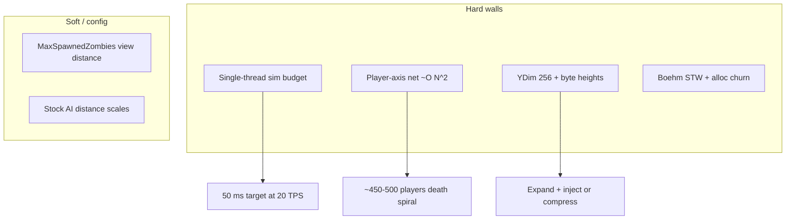

# Stock dedicated engine limitations (V3.1.0)

**Owns:** generic stock engine ceilings and structural limits for dedicated multiplayer (sim, net, world, memory, process).  
**Not:** RealEarth product attack plan (`product ENGINE_LIMITATIONS`), optim backlog ([OPTIMIZATION_CANDIDATES](../../7dtd-optimizer/docs/OPTIMIZATION_CANDIDATES.md)), permanent non-IL residuals only ([residuals.md](residuals.md)).  
**Hub:** [INDEX.md](INDEX.md).  
**Live scale numbers:** [measured-scaling.md](../../7dtd-optimizer/docs/measured-scaling.md).  
**Loop map:** [loop.md](loop.md).

This is a **limitation map** for anyone running or modding dedicated V3.1.0. It does not re-list every IL detail; each row points at the narrative that owns the evidence.

**Severity**

| Tag | Meaning |
|---|---|
| **Hard** | Structural; needs design change, major Harmony, or accept lower capacity |
| **Soft** | Workable with config, content policy, or partial patches |
| **Ops** | Host / install / process, not gameplay code |
| **Residual** | Cannot fully close from managed IL alone (see residuals.md) |



---

## 1. Frame and sim architecture

| Limit (stock) | Evidence | Why it matters | Severity | What you can do |
|---|---|---|---|---|
| **Single-thread-dominated sim** | [loop.md](loop.md), [ARCHITECTURE](../../7dtd-optimizer/docs/ARCHITECTURE.md) | Extra cores do not parallelize `gmUpdate` / `UpdateTick` | **Hard** | Starve work (LOD, caps); host pin one L3 ([HOST_TUNING](../../7dtd-optimizer/docs/HOST_TUNING.md)); do not invent full MT sim in a Harmony mod |
| **Target ~20 game ticks/s** | [closed-gaps.md](closed-gaps.md) `GameTimer(20)` | ~50 ms budget per tick under load | **Hard** | Measure tick p99; reduce sim volume before chasing topology |
| **Net and mesh are peer Updates** | ConnectionManager / DynamicMeshManager **not** children of gmUpdate | Hijacking only `gmUpdate` does not own packages or dynamic mesh | **Hard** | Patch the real owners; APM by section |
| **Peer script order** | **Closed 2026-08-09 (runtime)** | SdtdConsole -> ConnectionManager.Update -> GameManager.Update -> (WorldEnvironment/DynamicMeshManager) -> CM.LateUpdate -> GM.LateUpdate; CM always precedes GM (518 frames, [loop.md](loop.md) §1.1) | **Closed** | Treat as same-phase peers |
| **Dual entity paths** | [loop.md](loop.md) §3, [entity-ai.md](entity-ai.md) | Authority is `World.TickEntity`; Unity `Entity.Update` may still run if GO enabled | **Hard** | Optim must not assume one path; measure dual cost |
| **Entity work is sliced** | UpdateTick slice/flush | Not every entity runs every Unity frame | **Soft** | LOD/stride interact with slice budget |
| **Entities observer-gated** | [measured-scaling.md](../../7dtd-optimizer/docs/measured-scaling.md) §2 | Zero players → zombies exist but barely tick | **Soft** | Load tests need observer bots; empty server is not AI cost |
| **`Origin.FixedUpdate` dedi no-op** | early `IsDedicatedServer` ret | Floating origin cost is client/listen, not pure dedi FixedUpdate | **Soft** | Product SoloSlide must not assume stock Origin does dedi work |
| **Manager chain always walked** | gmUpdate phase B | Twitch, SpeedTree, edit managers null-checked but still call chain | **Soft** | EfficientServer dedicated skips for known dead presentation |

---

## 2. Scaling walls (measured)

Live APM + loadgen ladders (2026-07-17/18). Detail: [measured-scaling.md](../../7dtd-optimizer/docs/measured-scaling.md).

| Limit | Measured shape | Why it matters | Severity | Levers |
|---|---|---|---|---|
| **Player axis** | `ConnectionManager.Update` ~**O(N^2.27)** per-call; `NetEntityDistribution.OnUpdateEntities` ~**O(N^2.26)** | Death spiral near **~450-500** bots (gmUpdate multi-second) | **Hard** | Spatial interest cull, batch serialize, lower player count, EfficientServer net work |
| **Entity axis** | TickEntities / AI ~**O(N)** | Volume wall, not bad complexity | **Hard** | MaxSpawnedZombies, AI LOD, path admission, blood-moon shape |
| **Chunk load/send vs players** | DetermineChunks / SendChunks super-linear in player ladder | Spread players open more chunks and bandwidth | **Hard** | View distance, world choice, mesh budgets |
| **Path / graph rebuild churn** | Top alloc sites under heavy load (`AstarVoxelGrid.InitScan`, …) | GC STW follows alloc, not just entity count | **Hard** | Path throttle, graph budgets; GC guard only helps moderate churn |
| **No free lunch from cores** | Single main loop | Dual-socket / huge core counts do not buy TPS | **Ops** | Prefer high clock + one CCD + multi-channel RAM |

**Implication:** player ceiling and zombie ceiling are different problems. Fixing AI LOD does not fix O(N²) connection cost.

---

## 3. Networking

| Limit (stock) | Evidence | Why it matters | Severity | What you can do |
|---|---|---|---|---|
| **LiteNetLib + managed wrappers** | [network.md](network.md) | Protocol pump on main peer Update | **Hard** | Measure package cost; do not reimplement combat net |
| **LiteNetLib event dispatch (managed)** | **Closed 2026-08-10** | `UnsyncedEvents=true`; receive-thread `ConnectionRequestCheck` races `Clients.List` under join churn ([network.md](network.md) §4.0) | **Closed** | Ramp bot joins (`--ramp-ms`); fix direction documented |
| **Entity interest + package bands** | distSq interest **16**; teleport ±**256**; pos/rot ±**128**; age **100** | Wrong assumptions break optim or custom entities | **Soft** | Document thresholds; measure under loadgen |
| **194 NetPackage* types** (193 wire + manager) | dedi-complete census | Large surface; many client-only | **Soft** | Touch only hot packages |
| **Chunk transfer bandwidth** | SendChunksToClients; kernel UDP | Join burst + tall columns + dense urban | **Hard** | View distance, density caps; RealEarth small host |
| **EAC / anti-cheat** | NetPackageEAC, EOS types | C# mods and loadgen bots require EAC off | **Ops** | Document; never claim EAC-on for DLL mods |
| **SteamNetworking optional** | serverconfig disable list | Extra path complexity | **Soft** | Dedicated usually LiteNet only |

Combat across chunks **already works** if coordinates are shared. Per-player private origins break hits/claims (product design rule).

---

## 4. Entities, AI, pathfinding

| Limit (stock) | Evidence | Why it matters | Severity | What you can do |
|---|---|---|---|---|
| **Stock AI distance scales** | updateTasks: full &lt;64, mid &lt;225, far 0.1 scale (approx distSq bands) | Far zombies still cost; not zero | **Soft** | EfficientServer AI LOD can tighten further |
| **Path enqueue off main, drain ≤8** | ASPPathFinderThread | Path backlog under horde pressure | **Hard** | Path admission / skip distant FindPath |
| **A\* is third-party** | `AstarPath.StartPath` / `Pathfinding.*` | Internals not 7DTD-owned | **Residual** | Throttle at 7DTD ASP wrapper |
| **AIDirector always installed** | CreateComponents full set | Blood moon, wandering horde, airdrop always present | **Soft** | Config/content; measure BM separately |
| **World mutation is main-thread culture** | [SIM_PARALLELISM](../../7dtd-optimizer/docs/SIM_PARALLELISM.md) | Random `Task.Run` into EntityAlive races | **Hard** | Starve work; do not evacuate stock sim |
| **Prefabs / sleepers expect RWG Y** | content | Floating/buried on tall DEM | **Soft→Hard** | Surface Y stamps after inject (RealEarth) |

---

## 5. World, chunks, height, save

| Limit (stock) | Evidence | Why it matters | Severity | What you can do |
|---|---|---|---|---|
| **`ChunkBlockYDim = 256`** | [terrain-height.md](terrain-height.md) | ~0-255 playable columns | **Hard** | RealEarth expand **or** accept compress / short peaks |
| **`cMaxHeight` / heightmaps byte** | GetTerrainHeight → **byte** | Peaks clamp even after expand unless inject bypasses | **Hard** | Float/int inject + block density; not field SetValue alone |
| **Literals inlined in IL** | ldc sites | Runtime field rewrite cannot raise ceiling | **Hard** | Mono.Cecil expand; re-apply after Steam |
| **256 means Y and XZ map area** | patcher notes | Blind replace corrupts 16×16 maps | **Hard** | Vertical-only site list |
| **Chunk write/read layer loop `i < 64`** | [save-region.md](save-region.md) IL hardcoded | Expand must rewrite save/load loops, not only WorldConstants | **Hard** | Patcher sites + soak |
| **`World.toBlockY` = `y & 255`** | light-mesh-water / surfaces | Mask clips tall Y | **Hard** | Expand Y-bound methods |
| **Light / stability / mesh start at 255/256** | [light-mesh-water.md](light-mesh-water.md) | Tall columns wrong sun/mesh without expand | **Hard** | Expand checklist (`realearth-surfaces` §7.1) |
| **Static full-column RAM** | design | Tall expand × many chunks = RAM death | **Hard** | Near-term accept cost; long-term sparse Y |
| **Practical loaded edge ~8k-16k** | ops + engine practice | Not a planet; gen/save weight | **Hard** | Stream / small host (RealEarth) or finite bake |
| **Flat rectangle world** | no sphere topology | No over-pole paths | **Soft** | Equirectangular policy (product LON_LAT) |
| **Region / `.7rg` / `.ttc`** | save-region §3 | Tall worlds may bloat; location headers packed (Raw i32 pairs; sector LE u16+u8) | **Hard** | Expand both ends; measure save size; clone must match §3.5 packing |
| **ItemStack.Clone fan-out** | [items.md](items.md) Clone triage | 162 sites; ~56 client UI; dedi mass is TE + inventory + few net Setups | **Soft** (alloc) | Do not Harmony XUi for dedi STW; any share-not-clone needs identity proof |
| **Chunk encode ownership** | world-chunks / Xref | `SendChunksToClients` sole caller = `GameManager.UpdateTick`; `NetPackageChunk.Setup` from SendChunks + terrain rebuild | **Hard** (serial main) | View distance / join throttle; encode not a free side thread under stock Unity main loop |
| **Unload regenerates stock terrain** | world-chunks | Edits lost without delta policy | **Hard** | Persist deltas (product Needed) |

---

## 6. Memory, GC, process runtime

| Limit (stock) | Evidence | Why it matters | Severity | What you can do |
|---|---|---|---|---|
| **Boehm Mono GC** (conservative, non-generational STW) | [runtime-tuning.md](../../7dtd-optimizer/docs/runtime-tuning.md) | Cannot swap collector under stock Unity | **Hard** | Cut alloc; optional incremental env (EAC-safe); measure STW |
| **Forced `GC.Collect` ~every 120 s** in gmUpdate | [runtime-tuning](../../7dtd-optimizer/docs/runtime-tuning.md), A7 | Self-inflicted hitch under moderate load | **Soft** | EfficientServer GcGuardPatch (skip + heap safety) |
| **GC tuning ≠ alloc cut** | measured-scaling | At heavy churn, Boehm collects anyway | **Hard** | Fix path/net alloc sites first |
| **`settargetfps` not in serverconfig** | ConsoleCmdSetTargetFps | FPS target ephemeral over telnet | **Ops** | Document ops; not a mod feature |
| **DynamicMesh still runs on dedi** | DynamicMeshManager.Update IL=404 | Mesh pipeline cost without client GPU | **Hard** | Mesh budgets (EfficientServer); disable where safe |
| **Large managed heaps** | tile stream + entities | GC and RSS growth | **Hard** | Unload policy, density caps, host RAM |

---

## 7. Content and stock config ceilings

| Limit (stock) | Why it matters | Severity | What you can do |
|---|---|---|---|
| **`MaxSpawnedZombies` / animals** | Linear AI volume | **Soft** | Primary capacity knob |
| **View / simulation distance** | Chunk load × players | **Soft** | Cap for public servers |
| **Blood moon / sleeper density** | Spikes on top of baseline | **Soft** | Content schedule; measure BM separate |
| **SandboxCode / XML mods** | Can reintroduce work | **Soft** | Audit heavy inject mods |
| **Prefabs authored for ~255 roofs** | Tall peaks look wrong | **Soft** | Surface-relative stamp |
| **Biome / climate bands** | Not real-Earth climate | **Soft** | Landcover map (product) |
| **Water systems shallow** | No true hydrology | **Hard** | Limited column fill / overlays |
| **Quest / trader / RWG layout** | Expect RWG, not real cities | **Soft** | Accept stamp kits ≠ OSM |

---

## 8. Modding surface limits

| Limit | Why it matters | Severity | What you can do |
|---|---|---|---|
| **Harmony targets drift every TFP patch** | Breaks optim and RealEarth inject | **Ops** | Retarget checklist; soft-fail patches |
| **Steam Verify restores stock DLL** | Undoes expand | **Ops** | Backup + re-expand |
| **Client + dedicated two trees** | YDim / DLL mismatch | **Ops** | Always patch both |
| **ModEvents names closed; subscribers not** | Who runs is content | **Residual** | Inventory hooks; measure live |
| **No safe full sim evacuation to workers** | World state races | **Hard** | Starve main-thread work only |
| **EAC-off for C# mods** | Console crossplay vs modded | **Ops** | Policy + docs |
| **Publicizer / override visibility** | build rules of the pinned release | **Ops** | Build against live Managed |

---

## 9. What stock already does well (do not re-fight)

| Capability | Stance |
|---|---|
| Chunk load/unload by view/sim | Reuse |
| Shared multiplayer combat coords | Reuse; one origin story |
| Entity package interest bands | Reuse; optim around them |
| Harmony + ModAPI + ModEvents | Primary extension points |
| 20 Hz GameTimer design | Align budgets to it |
| Path offload to ASP thread (bounded) | Throttle; do not rewrite A\* |

---

## 10. Map: product vs generic

| Concern | Generic (this doc) | RealEarth product |
|---|---|---|
| YDim / byte height | §5 | `ENGINE_LIMITATIONS` §1, `HEIGHT_LIMITS` |
| Planet XZ / stream | Practical 8k-16k | Stream absolute + LocalWindow |
| Player O(N²) | §2 | Density caps still required in cities |
| Origin slide | Dedi Origin no-op | SoloSlide / SharedFixed product policy |
| Status Done/Partial | Never here | `MODIFICATIONS` only |

```text
Generic ceilings (this file)
  → measure (APM + loadgen)
  → starve work (EfficientServer / config)
  → host topology (HOST_TUNING)
  → RealEarth only for Earth geography + expand product path
```

---

## Stock defects (2026-08-10, IL + runtime)

Two genuine stock-engine bugs found under loadgen churn; both are
`Assembly-CSharp` managed code, so a clone should fix rather than reproduce
them (the Zig clone's clean-room stack avoids the first by construction, ADR
0013):

| Defect | Evidence | Consequence | Workaround / fix direction |
|---|---|---|---|
| LiteNetLib join-churn race | `NetworkCommonLiteNetLib.InitConfig` sets `UnsyncedEvents=true`; `ConnectionRequestCheck` (IL=86) enumerates `ConnectionManager.Clients.List` on the socket-receive thread while the main thread mutates it | `Collection was modified` -> `RemoteConnectionClose` bursts under >12-bot join churn (302 drops in one 28-bot run) | `--ramp-ms` join staggering (validated: 24 bots @ 3 s -> 0 drops); fix: main-thread duplicate-IP check or copy IP set under lock ([network.md](network.md) §4.0) |
| `NetPackageMinEventFire.write` null `itemValue` | ItemEvent branch callvirt-writes `ItemValue::Write(BinaryWriter)` with no null guard (IL_0048); `EntityZombieCop` explosions pass null (`ExplosionServer` ldnull) | Serialize-thread NRE, lost MinEvent (108 in one run); graceful - package dropped, connection survives | Guard `itemValue` before the callvirt, or use the static null-safe `ItemValue::Write(ItemValue,BinaryWriter)` ([protocol-packages.md](protocol-packages.md) §6.23) |

## Related docs

| Doc | Role |
|---|---|
| [loop.md](loop.md) | Frame / peers / phases |
| [entity-ai.md](entity-ai.md) | AI / path onion |
| [network.md](network.md) | Packages / bands |
| [terrain-height.md](terrain-height.md) | YDim / height APIs |
| [save-region.md](save-region.md) | Save 64 / WorldState |
| [light-mesh-water.md](light-mesh-water.md) | 255 light/mesh sites |
| [measured-scaling.md](../../7dtd-optimizer/docs/measured-scaling.md) | Live O(N) laws |
| [runtime-tuning.md](../../7dtd-optimizer/docs/runtime-tuning.md) | GC / FPS knobs |
| [residuals.md](residuals.md) | Non-IL permanent gaps |
| `product ENGINE_LIMITATIONS` | 1:1 Earth blockers + attack path |
| [protocol.md](protocol.md) | Wire framing (clone / custom dedi) |
| [ZIG_CLONE.md](../../zdtd/docs/ZIG_CLONE.md) | Zig redesign that avoids these walls |
| [HOST_TUNING](../../7dtd-optimizer/docs/HOST_TUNING.md) | CCD / NUMA / disk |
| [ARCHITECTURE](../../7dtd-optimizer/docs/ARCHITECTURE.md) | Optim-oriented hot path |
| [SIM_PARALLELISM](../../7dtd-optimizer/docs/SIM_PARALLELISM.md) | Why not MT sim in a mod |

## Changelog

- **2026-08-10:** Stock-defects section added (join-churn race + MinEventFire
  null-itemValue NRE, both IL + runtime evidenced).
- **2026-07-19:** Initial generic dedicated limitation map (sim, scale, net, AI, height, GC, content, modding).
