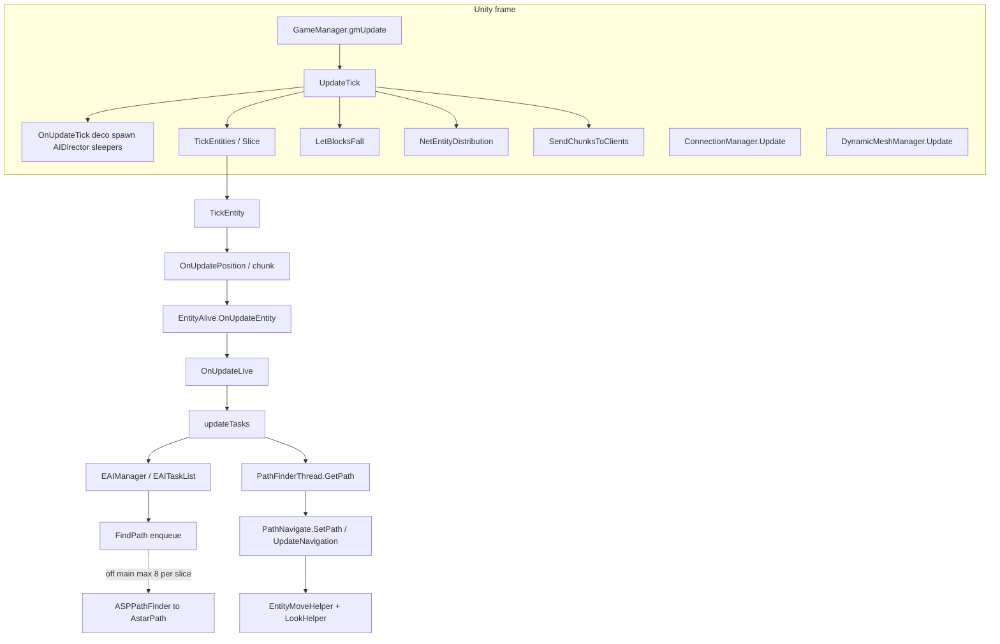
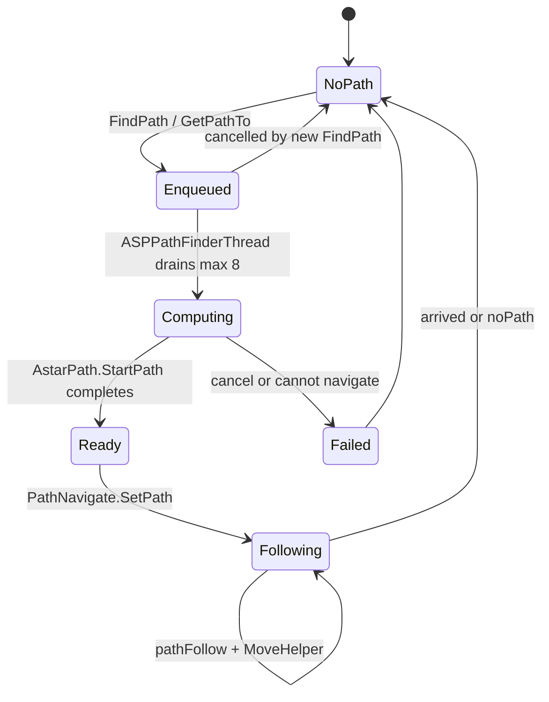
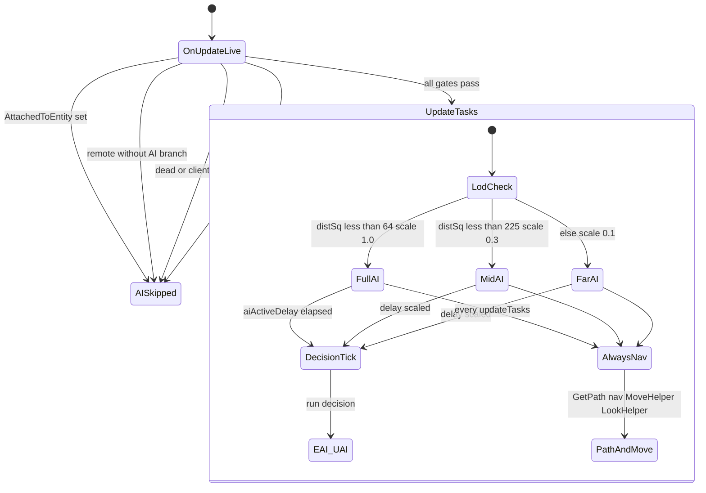

# Entity, AI, and path (dedicated V3.1.0)

**Owns:** authority entity tick chain, AI/path onion, thresholds (merged deep + deeper synthesis).  
**Loop context:** [`loop.md`](loop.md), [`loop-gmupdate.md`](loop-gmupdate.md).  
**Ceiling map:** [`engine-limitations.md`](engine-limitations.md) §4 (AI volume, path ≤8, dual paths).  
**Auto inventory:** [`inventories/deeper.md`](inventories/deeper.md).  
**Dumps:** `il/deep-v3.1.0/`, `il/deeper-v3.1.0/`.  
**Hub:** [`INDEX.md`](INDEX.md).

Do not redistribute game IL.

---

## 1. Call stack from frame to AI (authoritative)



### Path request lifecycle



---

## 2. When AI actually runs (`OnUpdateLive` → `updateTasks`)

### 2.0a `OnEntityUnload` (IL=29)

If not `EntityPlayerLocal`: `OcclusionManager.RemoveEntity`. Clear navigator path
(`SetPath(null,0)`) and null `navigator`, `lookHelper`, `moveHelper`, `seeCache`;
then base `Entity.OnEntityUnload`.

**`Entity.MarkToUnload` (IL=4):** `markedForUnload = true`.
`EntityAlive.MarkToUnload` also copies `timeStayAfterDeath` into
`deathUpdateTime` (corpse linger clock).

**`World.RemoveEntity(id, reason)` (IL=16):** if entity exists: `MarkToUnload` +
`unloadEntity(entity, reason)`; return entity (or null).

**`World.unloadEntity` (IL=216):** store `unloadReason`; fire
`EntityUnloadedDelegates`; `OnEntityUnload`; remove from entity dict +
`TickEntityRemove` + `EntityAlives`; `RemoveEntityFromMap`; chunk remove if
still marked; vehicle/drone/turret tracker remove; server:
`NetEntityDistribution.Remove`, `PathFinderThread.RemovePathsFor`, player
disconnect path, `AIDirector.RemoveEntity`; always audio/weather/light entity
removed hooks.

**`NetPackageEntityRemove.ProcessPackage` (IL=24):** log if missing; always
`RemoveEntity(entityId, reason)` (reason is u8 enum).

### 2.0 Parent chain: `OnUpdateEntity` (IL=457) then `OnUpdateLive` (IL=363)

**`OnUpdateEntity` high-level (IL=457):** base `Entity.OnUpdateEntity`;
`Buffs.SetCustomVar` / `Buffs.Tick`; optional class `PickupStressBuff` add;
**`OnUpdateLive()`**; `inventory.OnUpdate()` when present; death / hurt sound;
radiation-sensitive path can `DamageEntity` (e.g. **20** under biome flags);
more equipment / held-item / animation residual in later IL.

`EntityAlive.OnUpdateEntity` (before Live):

1. Base `Entity.OnUpdateEntity`.
2. Buff cvar / `EntityBuffs.Tick`.
3. Optional weather/biome buffs via `AddBuff` / `SetCVar`.
4. **`OnUpdateLive()`**.
5. `Inventory.OnUpdate`.
6. Health/death paths: radiation / environmental `DamageEntity`, hurt sounds,
   sleeper pose, alert/random sounds, investigate clear, `OnDeathUpdate`,
   revenge target set.

`OnUpdateLive` (AI-relevant):

1. Stat regen zeroing; if not dead: `EntityStats.Tick`.
2. Attack-target net: may send `NetPackageSetAttackTarget` to tracked players.
3. `updateCurrentBlockPosAndValue` (detail below).
4. Movement / jump / headed move for non-AI branches.
5. **AI gate** then `updateTasks()` (detail below).
6. Stun clear/set via avatar controller; can-see updates; dynamic ragdoll;
   trader-area teleport check.

**`updateCurrentBlockPosAndValue` (IL=318):** foot block = entity block pos, or
y-1 if air; resolve child to parent. If pos/value changed **or** landed this
tick (`onGround && !wasOnGround`): store standing pos/value; server sets
`blockStandingOnChanged`; biome change → `onNewBiomeEntered`. Always
`CalcIfInElevator`. Walk-buff blocks (`UseBuffsWhenWalkedOn`): workstation
burning path can re-add timed buffs; passive **153** residual; call
`Block.OnEntityWalking` when appropriate. Falling-block stability residual
logs when stab 0.

**`isRadiationSensitive` (IL=2):** always **true** (base).

**`onNewBiomeEntered` (IL=4):** `biomeStandingOn = _biome`.

**`CalcIfInElevator` (IL=59):** if `!bCanClimbLadders` force `bInElevator=false`.
Else sample block at (standX, floor(bbox.min.y), standZ) and y+1; `bInElevator`
= either block `IsElevator(rotation)`.

From `EntityAlive.OnUpdateLive` IL (gate before `updateTasks`):



Text form of the same gates: `AttachedToEntity` null, not remote (or RootMotion remote without AI), health paths, `!world.IsRemote()`, `!IsDead()`, `!IsClientControlled()`, `hasAI == true`.

Dedicated zombies: typically `hasAI`, not client-controlled, not remote → **`updateTasks` runs** when this entity is ticked by the slice.

**EfficientServer** can still skip `updateTasks` via Harmony for far non-alert (leaf patch). That is coarser than stock `aiActiveScale`.

---

## 3. `EntityAlive.updateTasks` (125 IL): the AI throttle

### 3.1 Early out: “AI disabled” pref

If `GamePrefs.GetBool(enum 46)` and entity is **not** `EntityDrone`:

- zero move forward  
- optional `EAIManager.UpdateDebugName`  
- **`ret`** (no EAI, no path follow)

### 3.2 Always (when not early-out)

1. `CheckDespawn`  
2. `seeCache.ClearIfExpired`  
3. Read `EntityClass.UseAIPackages` → choose **EAI** vs **UAI**

### 3.3 LOD gate (only covers decision AI)

```text
aiActiveDelay -= aiActiveScale
if aiActiveDelay <= 0:
    aiActiveDelay = 1.0
    if !UseAIPackages:  aiManager.Update()      // classic EAI
    else:               UAIBase.Update(context) // utility AI packages
```

| Field | Role |
|---|---|
| `aiActiveScale` | Written in `World.EntityActivityUpdate` from closest-player dist² |
| `aiActiveDelay` | Countdown; full EAI/UAI only when it hits ≤ 0 |

**Critical:** after the delay gate, **path apply + navigation + move + look always run** on every `updateTasks` invocation:

```text
pathInfo = PathFinderThread.Instance.GetPath(entityId)
if path present:
    [EAI] CheckPath(pathInfo) may reject
    navigator.SetPath(pathInfo, speed)
navigator.UpdateNavigation()
moveHelper.UpdateMoveHelper()
lookHelper.onUpdateLook()
// distraction cleanup…
```

So stock LOD **slows how often EAI tasks re-decide**, not how often an entity follows an existing path or updates move helpers when `updateTasks` is entered.

**Implication for optim:**

- Tightening `aiActiveScale` → fewer `EAIManager.Update` / path **requests** from tasks.  
- Skipping entire `updateTasks` (EfficientServer far skip) → also stops path follow / move helper for that tick (stronger than stock).  
- Path **admission** should target `EntityAlive.FindPath` / `PathFinderThread.FindPath` enqueue, not only EAI Update.

---

## 4. `aiActiveScale` bands (EntityActivityUpdate IL=229)

1. Clear every player's `aiClosest` list.
2. For each `EntityAlives`: `GetClosestPlayer(pos, -1, dead=false)`; push entity
   into that player's `aiClosest`; store `aiClosestPlayer` +
   `aiClosestPlayerDistSq` (or null / +inf if none).
3. Per player: sort `aiClosest` by distSq ascending.
4. `N = FastClamp(60 / playerCount, **4**, **20**)` (top-N full AI quota).
5. For each entity in that list:

| Condition on `aiClosestPlayerDistSq` | `aiActiveScale` | Jiggle |
|---|---|---|
| index &lt; **N** **or** dist² **&lt; 64** (~8 m) | **1.0** | On if dist² **&lt; 36** (~6 m) |
| dist² **&lt; 225** (~15 m) | **0.3** | Off |
| else | **0.1** | Off |

**Cloth sim (local player only):** radius² **625** (25 m) default; **3025** (55 m)
when `AimingGun`. For each *other* player: if not attached and distSq &lt; radius²
enable cloth; attached → off. Local player cloth also set from camera vs attach.

Only **`World.EntityActivityUpdate` stores** `aiActiveScale`; only **`updateTasks` loads** it (plus EfficientServer patches).

---

## 5. EAI stack

### 5.1 `EAIManager.Update` (16 IL)

```text
interestDistance = FastMoveTowards(interestDistance, 10, 0.008333334)  // ease toward 10
targetTasks.OnUpdateTasks()
tasks.OnUpdateTasks()
UpdateDebugName()
```

Two task lists: **target** tasks and **general** tasks. Very thin wrapper.

### 5.1b Attack target + see cache (IL re-pin)

**`SetAttackTarget` (IL=70):** same target only refreshes `attackTargetTime`; else
stash `attackTargetLast`, set `targetAlertChanged` + random `soundDelayTicks`
5..20 when new target, clear investigate ticks; if not remote, send
`NetPackageSetAttackTarget` via `SendPacketToTrackedPlayersAndTrackedEntity`;
store target + time.

**`SetRevengeTarget(other)` (IL=14):** store `revengeEntity`; if non-null
`revengeTimer = **500**` else **0** (ticks of revenge focus).

**`IsInFrontOfMe(pos)` (IL=28):** angle between head→pos and forward vs half of
`GetMaxViewAngle()` (inclusive).

**`EntitySeeCache.ClearIfExpired` (IL=17):** every **30** ticks `Clear()` the
see cache (called from OnUpdateLive before AI).

**`EntitySeeCache.CanSee(entity)` (IL=49):** null → false; hit in
`positiveCache` → true; hit in `negativeCache` → false; else
`CanEntityBeSeen(e, true)`: on success add positive (and if client-controlled,
`lastTimeSeenAPlayer = Time.time`); on fail add negative.

**`CanEntityBeSeen(other, checkViewCone)` (IL=133):**

1. Head→head vector; `maxDist = GetSeeDistance()`; if other is player,
   `maxDist *= other.DetectUsScale(this)`.
2. If distance &gt; maxDist → false.
3. If `checkViewCone` and `!IsInViewCone(otherHead)` → false.
4. Temp `SetModelLayer(2)` on self; ray from head along dir (origin pulled back
   **0.1**), length maxDist, mask **`-1612492829`**, hit flag **64**.
5. Hit `E_Vehicle` and vehicle `IsAttached(other)` → true; `E_Enemy` may
   `EntityDrone.IgnoreCollisionEntity`; `E_BP_*` root transform equals other →
   true.
6. Restore model layer; return hit flag.

**`GetSeeDistance` (IL=41):** reset `senseScale = 1`. If sleeping: use
`sleeperSightRange` as `sightRange` and return it. Else start from
`sightRangeBase`; if `aiManager` present:
`senseScale = 1 + CalcSenseScale() * feralSense`, then
`sightRange = sightRangeBase * senseScale`. Return `sightRange`.

**`CanSee(Vector3 pos)` (IL=62):** head→pos; if magnitude &gt; `GetSeeDistance()`
false; if `!IsInViewCone` false; ray origin head + **0.2** along dir;
`SetModelLayer(2)` self; `Voxel.Raycast(world, ray, maxDist, false, false)` →
false if hit (blocked); restore layer; true if clear.

**`CanSeeStealth(dist, lightLevel)` (IL=21):**
`t = dist / sightRange`; threshold =
`FastLerp(sightLightThreshold.x, .y, t)`; true if `lightLevel > threshold`.

**`Attack(isReleased)` (IL=5):** `UseHoldingItem(0, isReleased)`.

**`UseHoldingItem(actionIndex, isReleased)` (IL=64):**
- Press (`!isReleased`): if actionIndex 0 and attack anim playing → false;
  if `!IsAttackValid` → false.
- Release of action 0: play `GetSoundAttack` one-shot if present.
- Always (success path): `attackingTime = 60`; if action slot non-null
  `ItemAction.ExecuteAction(actionData[index], isReleased)`; return true.

**`GetAttackTimeoutTicks` (IL=10):** day → `attackTimeoutDay`; dark →
`attackTimeoutNight`.

**`GetMaxAttackTime` (IL=2):** constant **10** (sets `hasBeenAttackedTime` on
pain hits; gates `IsAttackValid`).

**`GetTargetIfAttackedNow` (IL=98):** null if `!IsAttackValid`. Holding action 0
`GetExecuteActionTarget`; require valid hit + transform; range =
`ItemAction.Range` or passive **11** on item; allow +**0.3** m; require
`distanceSq ≤ range²`. `E_BP_*` → root transform entity component; `E_Vehicle`
→ `EntityVehicle.FindCollisionEntity`; else null.

**`EAIManager.CalcSenseScale` (static IL=23):** switch on static `FeralSense`
(sandbox `ZombieFeralSense`):

| FeralSense | Returns **1** when | Else |
|---:|---|---|
| **1** | `World.IsDaytime()` | **0** |
| **2** | `World.IsDark()` | **0** |
| **3** | always | |
| other / 0 | always **0** | |

**`DetectUsScale(entity)` (IL=26):** default **1**. If player is in a prefab with
`DifficultyTier ≥ 1`, has been inside **&gt; 60** s (`Time.time - prefabTimeIn`),
and the observer is a Dynamic-spawn (`GetSpawnerSource()==1`) `EntityEnemy`:
return **0.3** (POI stealth vs wandering AI).

**`IsInViewCone(position)` (IL=40):** if sleeping use `sleeperLookDir` +
`sleeperViewAngle`; else `GetLookVector` + `GetMaxViewAngle`. Half-angle cone
via `Utils.GetAngleBetween` (same half-angle test as `IsInFrontOfMe`).

**`EntityAlive.HasImmunity(BuffClass)` (IL=2):** always **false** (immunity from
`EntityBuffs.HasImmunity` passive path / death only unless subclassed).

**`EntityPlayer.CheckSleeperTriggers` (IL=16):** server + alive only:
`World.CheckSleeperVolumeTouching` then `CheckTriggerVolumeTrigger`.

**`World.CheckSleeperVolumeTouching` (IL=57):** no-op if GameStats **24**
(EnemySpawnMode) false. Else lock `sleeperVolumes` and for each volume id on the
player's chunk call `SleeperVolume.CheckTouching`.

**`SleeperVolume.CheckTouching` (IL=165):** no-op if `IsTriggerAndNoRespawn` or
player spectator. Sample point = player pos with **y+0.8**. `flags & 7` is the
trigger mode nibble.

- If `hasPassives`: AABB test with **0.3** pad on XZ (min-0.3 / max-0.3); skip
  when mode == **1**; else `TouchGroup(world, player, true)`.
- Else if mode is **2** or **3** and `triggerState != mode`: AABB with **0.1**
  pad on XZ; on hit `TouchGroup(..., true)`.
- If `playerTouchedToUpdate` still null and `CheckTrigger` at sample point:
  `TouchGroup(..., false)` (delayed update latch).

**`World.CheckTriggerVolumeTrigger` (IL=53):** same pattern on
`triggerVolumes` / `TriggerVolume.CheckTouching` (no EnemySpawnMode gate).

**`TriggerVolume.CheckTouching` (IL=61):** if already `isTriggered` return. Point
= player pos **y+0.8**; strict AABB against `BoxMin`/`BoxMax` (no pad); on hit
`Touch(world, player)`.

**`TriggerVolume.Touch` (IL=11):** `isTriggered = true`;
`TriggerManager.TriggerBlocks(player, prefabInstance, this)`.

**`SleeperVolume.TouchGroup` (IL=52):** `mode = flags & 7`. If no `groupId` or no
prefab: `Touch(world, player, setActive, mode)`. Else for each volume in
`prefabInstance.sleeperVolumes` with same `groupId` and not
`IsTriggerAndNoRespawn`: same `Touch`.

**`SleeperVolume.Touch` (IL=112):**

- If `setActive`: for each live entity in `respawnMap`:
  - trigger **2/3** and player present: if
    `PlayerStealth.CanSleeperAttackDetect(sleeper)` then
    `ConditionalTriggerSleeperWakeUp` + `SetAttackTarget(player, **400**)`;
  - trigger **4**: always wake;
  - else: every **10** group touches (`wanderingCountdown`) wake, else
    `SetSleeperActive` only.
  Then `hasPassives = false`, store `triggerState`.
- If not `setActive` (deferred latch): set `playerTouchedToUpdate`,
  `ticksUntilDespawn = **900**` (or **200** if still `hasPassives`); if
  `wasCleared` and `worldTime < respawnTime`, bump `respawnTime` to at least
  `worldTime + 1000`.

**`SleeperVolume.CheckTrigger` (IL=136):** if already `isSpawned`: AABB with
static `unpadding` expand → true/false. Else AABB with `triggerPaddingMin/Max`;
if `wasCleared` and any player home in box (`CheckForAnyPlayerHome`) bump
`respawnTime` by **24000** and false; else if prefab present `UncullPOI`; true.

**`World.GetClosestPlayer(pos, distMax, isDead)` (IL=57):** if `distMax < 0` use
+inf. Walk players reverse; require `IsDead() == isDead` and `Spawned`; pick min
`GetDistanceSq` within `distMax²`.

**`World.GetClosestPlayerSeen(entity, distMax, lightMin)` (IL=68):** same distance
scan, require not dead + spawned, `Stealth.lightLevel >= lightMin`, and
`entity.CanSee(player)`.

### D8.4 Sleeper wake / stealth / triggers

**`PlayerStealth.CanSleeperAttackDetect` (IL=20):** if not crouching → true. If
crouching: max dist = `FastLerp(3, 15, lightAttackPercent)`; false when
`GetDistance(player) > max` (stealth close-range only).

**`EntityAlive.ConditionalTriggerSleeperWakeUp` (IL=55):** only if `IsSleeping`
and not dead: clear `IsSleeping`/`IsSleeperPassive`; avatar pose **-1** (stand)
or **-2** (crawl if short and not crawl walk); `EAIManager.SleeperWokeUp` if
present; server sends `NetPackageSleeperWakeup` flags **192**.

**`EntityAlive.SetSleeperActive` (IL=26):** if was passive: clear
`IsSleeperPassive`; server sends `NetPackageSleeperPassiveChange` flags **192**
(does not fully wake).

**`TriggerSleeperPose(pose, returningToSleep)` (IL=52):** dead → return. If
avatar present: `AvatarController.TriggerSleeperPose`; clear
`pendingSleepTrigger`; if pose != **5** set `physicsHeight = 0.85` (pose 5 keeps
height). Else store `pendingSleepTrigger = pose`. Always:
`lastSleeperPose = pose`; `IsSleeping = true`;
`SleeperSupressLivingSounds = true`;
`sleeperLookDir = AngleAxis(rotation.y, up) * SleeperSpawnLookDir`.

**`ResumeSleeperPose` (IL=6):**
`TriggerSleeperPose(lastSleeperPose, returningToSleep=true)`.

**`TriggerManager.TriggerBlocks`:** BlockTrigger overload (IL=17) requires
`HasAnyTriggers` then `PrefabTriggerData.Trigger(player, blockTrigger)`.
TriggerVolume overload (IL=27) same with prefab required (warn if null).

**`EAIManager.SleeperWokeUp` (IL=21):** for each entry in `targetTasks`, set
`executeTime = 0` (force immediate re-evaluate of target AI on wake).

**`NetPackageSleeperWakeup.ProcessPackage` (IL=20):** remote worlds only; resolve
`EntityAlive` by `m_targetId` and call `ConditionalTriggerSleeperWakeUp`.

**`NetPackageSleeperPassiveChange.ProcessPackage` (IL=21):** remote only; set
`IsSleeperPassive = false` on target (no full wake).

**`PlayerStealth.TickServer` (IL=432) (high level):**

1. `speedAverage` lerp toward `sqrt(speedForward²+speedStrafe²)` at 0.2 when
   moving, else decay `*0.5`.
2. `LightManager.GetStealthLightLevel` → ambient/boost ratio clamped
   **0.5..3.2**; crouch multiplies light by **0.6**.
3. Cvar `_lightlevel = light * 100` (netSync true).
4. Scale light by `(1 + speedAverage * 0.15)`; passive **89** for
   `lightAttackPercent` (if ambient &lt; 0.1 use passive else 1).
5. `lightLevel = clamp((light * (0.32 + 0.68*passive89)) * 100, 0, 200)`.
6. `NoiseCleanup` + `CalcVolume` → cvar `_noiselevel`.
7. Decay `sleeperNoiseVolume` by **2.5** when wait ticks hit 0; noise fan-out
   uses `CalcSenseScale` scaled radius `min(vol*0.6*(1+sense*1.6), 40+15*sense)`
   (remainder of method walks nearby sleepers).

**`PlayerStealth.NoiseCleanup` (IL=43):** for each `noises` entry: if `ticks > 1`
decrement ticks; else `RemoveAt`.

**`PlayerStealth.AddNoise` (IL=35):** insert `NoiseData(volume, ticks)` into list
sorted **descending by volume** (first slot with existing vol ≤ new vol).

**`PlayerStealth.NotifyNoise(volume, duration)` (IL=71):** if volume ≤ 0 false.
`AddNoise(noises, volume, duration*20 ticks)`. If volume ≥ **11** set
`sleeperNoiseWaitTicks = 20`. Soft-cap volume for sleeper accumulate: if &gt;
**60**, `60 + (v-60)^1.4`; then `* passive 88`; add into `sleeperNoiseVolume`
clamped at **360**; return true only when clamp hit (loud enough to force
sleeper path).

**`PlayerStealth.CalcVolume` (IL=68):** weighted sum of noise volumes with decay
factor **0.6** per successive entry (`sum += vol * weight; weight *= 0.6`);
`noiseVolume = (sum * 2.35)^0.86 * 1.5 * EffectManager(passive **88**)`; return
raw sum (noiseVolume field is the scaled value used by TickServer).

**`AIDirector.OnSoundPlayedAtPosition` (IL=17):** resolve entity if id ≠ -1;
`NotifyNoise(entity, pos, clipName, volumeScale)`.

**`AIDirector.NotifyNoise` (IL=84):** `AIDirectorData.FindNoise(clipName)` or
return; ignore if instigator is `EntityEnemy` or `IsIgnoredByAI` or throwable
decoy item. If tracked player and crouching: `volumeScale *=
muffledWhenCrouched`. `PlayerStealth.NotifyNoise(noise.volume*scale,
noise.duration)`; on true `World.CheckSleeperVolumeNoise(pos)`. If
`heatMapStrength > 0`: `NotifyActivity(type=3, blockPos, strength*scale,
duration=**240**)`.

**`AIDirectorData.FindNoise` (IL=11):** null name → false; else
`noisySounds.TryGetValue(name, out noise)`.

**`World.CheckSleeperVolumeNoise` (IL=62):** no-op if GameStats **24** false.
Bump pos.y by **0.1**; lock chunk sleeper list and call each
`SleeperVolume.CheckNoise`.

**`SleeperVolume.CheckNoise` (IL=69):** only if `hasPassives`; AABB with **0.9**
pad on all axes; skip if `(flags&7)==1`; else `TouchGroup(world, null, true)`
(noise-driven active touch, no player).

**`PlayerStealth.AttractTickServer` (IL=106):** every **40** ticks if cvar
`ItemClassHeldEntity.CVarEntityStress` &gt; 0: radius =
`stress * (1 + CalcSenseScale())`; `GetEntitiesAround(flags=14, pos, radius)`;
for each with 20% roll and `DetectUsScale >= 1`, set closer
`attractPlayer` / distance / `attractPlayerTimeoutTicks = **80**`.

**`PlayerStealth.SmellTickServer` (IL=259) (outline):** spectator/smell-disabled
clears; `SmellTickWet`; every **40** ticks `SmellUpdateItemsAndBlood`; ease
`smellRadius` toward target (sheltered path uses 0.05 / floor 10); every **20**
ticks publish cvar `smell`; every **40** ticks emit to nearby entities
(flags **6**, radius `smellRadius*(1+sense)`) with 20% roll and DetectUsScale
gate (blood/item smell attract path).

**`SmellTickWet` (IL=19):** `smellWetRate = cvar _wetnessrate`; if rate ≥ **0.01**
accumulate `smellWet += rate`.

**`SmellClear` (IL=19):** zero `smellRadiusTarget/Radius/EatRadius`, `smellEatTicks`,
`smellSheltered`, `smellWet`.

**`SmellUpdateItemsAndBlood` (IL=79):** if `smellWet ≥ 3` or player dead:
`SmellClear` and client may send `NetPackageEntityStealth` (-1,0,sheltered) to
server; return. Else if cvar `.dysenterySmell > 0`: remove cvar and
`SetSmellEat(35)`. `itemCount = SmellCountItems()` (forced 0 if wet rate ≥ 0.01);
`smellRadiusTarget = max(SmellCountToRadius(itemCount), smellEatRadius)`; if
local `shelterPercent > 0`: `smellRadiusTarget *= 0.2` and `smellSheltered =
true`.

**`SmellCountItems` (IL=110):** sum `ItemClass.Smell * count` over drag-drop
current stack + inventory slots + bag slots; `FastMin(sum, **50**)` then cast to
int.

**`SmellCountToRadius(count)` (IL=18):** `count -= 5`; if count &lt; 0 return **0**;
else `FastLerp(10, 100, count/45)` (5 items → 0 radius start; ~50 → 100 m).

**`SetSmellEat(distance)` (IL=21):** `smellEatRadius = min(eatRadius+distance,
**100**)`; `smellEatTicks = **1800**`; force `smellRadius = max(smellRadius, 1)`;
reset `smellUpdateItemsTicks = 0`.

**`NetPackageEntityStealth.ProcessPackage` (IL=92):** validate sender entity id.
Server: if `data & 2` then
`SetSmellRadiusTarget((data>>8)-1, (data&4)!=0, (data&8)!=0)`; else
`set_Crouching((data&1)!=0)`. Client:
`SetClientLevels(data as u8, (data>>8)&127, (data&0x8000)!=0)` (light/noise
bar sync).

**`SetSmellRadiusTarget(radius, eating, sheltered)` (IL=21):** store
`smellRadiusTarget = radius`; if eating force `smellRadius = max(smellRadius,1)`;
store `smellSheltered`; if radius &lt; 0 call `SmellClear`.

**`SetClientLevels(light, noise, isAlert)` (IL=13):** store light/noise levels and
`alertEnemy`; `SetBarColor(isAlert)` (UI bar green **50,135** or alert
**180,180**).

**`SpawnPointIsHidden` (IL=139):** spawn sample at block center xz **+0.5**;
pose **5** selects second offset table from `isHiddenOffsets`. For every player:
temp model layer **2**, ray from player head through each offset pair
(horizontal side offset + vertical lift); `Voxel.Raycast` layer **71**. Any clear
LOS returns **false** (visible); all rays blocked for all players → **true**
(hidden).

**`LightManager.GetStealthLightLevel` (IL=30):** if no `myServer` return 0. Else
sample at entity pos **y+1.68**:
`clamp01(GetLightLevel(pos) + GetLightLevelFromMovingLights(id, pos))` and out
`selfLight = entity.GetLightLevel()`.

**`BlockTrigger.OnTriggered` (IL=27):** `SetTriggeredValueFlag(index)`; if
`CheckIsTriggered` then `Block.OnTriggered(...)` and clear `TriggeredValues`.

**`PrefabTriggerData.Trigger(player, BlockTrigger)` (IL=85):** for each index in
`TriggersIndices`: fire all `TriggeredByDictionary[index]` via
`BlockTrigger.OnTriggered`; if player non-null also
`SleeperVolume.OnTriggered` for `TriggeredByVolumes[index]`; if any block
changes, `UpdateBlocks(list)`. TriggerVolume overload (IL=90) same pattern
over `TriggersIndices`.

**`SetLastTimePlayerSeen` (IL=4):** `lastTimeSeenAPlayer = Time.time`.

**`IsInFrontOfMe` (IL=28):** angle between head→pos and forward vs
`GetMaxViewAngle() * 0.5` (half-angle cone). `GetMaxViewAngle` returns field
`maxViewAngle`.

**`CheckDespawn` (IL=198):** remote → return. If `!CanUpdateEntity` and
`bIsChunkObserver` and no closest living player → `MarkToUnload`. If
`!canDespawn` return. Every call increments `despawnDelayCounter`; real work
only every **20** ticks (then counter reset, `ticksNoPlayerAdjacent += 20`).

**Spawner-source early paths** (`GetSpawnerSource`):

| Source | Early |
|---:|---|
| **3** (Dynamic) | no living closest: if also no dead closest → `Despawn`; return |
| **1** | no living within **130** m: if dead within **20** m set
`isDespawnWhenPlayerFar`; else if flag already set → `Despawn` |
| other | fall through |

If living closest exists and distSq &lt; **6400** (80 m): zero
`ticksNoPlayerAdjacent`. `lastSeenSec` from `seeCache.GetLastTimePlayerSeen`
(0 if never). Then switch on `source - 1`:

| Source | Despawn when |
|---:|---|
| **3** Dynamic | attack target forces lastSeen=0; sleeper awake: distSq &gt;
**9216** (96 m) and lastSeen &gt; **80** s; else distSq &gt; **2304** (48 m) and
lastSeen &gt; **60** s and no investigate; else `ticksNoPlayerAdjacent` &gt;
**1800** |
| **1** | `ticksNoPlayerAdjacent` &gt; **100** and distSq &gt; **16384** (128 m);
or ticks &gt; **1800** |
| **2** Static | no extra (switch fall-through ret) |

Called from `updateTasks` every AI tick (and other unload paths).

**`canDespawn` (IL=14):** false if client-controlled, or spawner source == **2**
(Dynamic), or sleeping; else true. **`EntityEnemy.canDespawn` (IL=13):** horde
zombies (`IsHordeZombie`) never despawn while any player is online; else base.

**`Despawn` (IL=6):** `IsDespawned = true` then `MarkToUnload`.
`ForceDespawn` (IL=3) just calls `Despawn`.

**`World.NotifySleeperVolumesEntityDied` (IL=32):** `Monitor` on
`sleeperVolumes`; every volume `EntityDied(entity)`.

**`SleeperVolume.EntityDied` (IL=31):** if id not in `respawnMap` return; remove
from map and `respawnList`; if not `isSpawning` call `ClearedUpdate`.

**`ClearedUpdate` (IL=33):** if already `wasCleared` or `respawnMap` still non-empty
return. Pref **88** (sleeper respawn days): if &gt; 0 set
`respawnTime = worldTime + days*24000`; else `-1`. Set `wasCleared = true`.

**`IsAttackValid` (IL=70):** non-player: false if electrocuted or stun type
**1** or **2**. Any: false if avatar `IsAttackPrevented` or dead. If
`painResistPercent >= 1` → true (pain-resist free attack). Else false while
`hasBeenAttackedTime > 0`; else true if no avatar or hit anim not running.

**`GetAttackTarget` / `GetAttackTargetLocal`:** server field `attackTarget`;
remote reads `attackTargetClient`. Hit aim uses `getChestPosition()`.

**`ResetDespawnTime` (IL=7):** `ticksNoPlayerAdjacent = 0` and
`seeCache.SetLastTimePlayerSeen()` (clears far-despawn pressure after investigate
clear / combat attention).

**`World.unloadEntity` (IL=216):** set `unloadReason`; `EntityUnloadedDelegates`;
nav-object unregister; `OnEntityUnload`; remove from `Entities` +
`TickEntityRemove` + `EntityAlives`; `RemoveEntityFromMap`; remove from chunk if
added; if not remote, untrack vehicle/drone/turret as applicable; net remove
package fan-out (remainder of method).

**`EntityPlayer.OnUpdateLive` (IL=13):** zero stamina regen amount; base
`EntityAlive.OnUpdateLive`; **force-clear** see cache; `CheckSleeperTriggers`
(player always re-evaluates sleeper volumes).

### 5.1b `EntityAlive.updateTasks` (IL=125) and `EAIManager.Update` (IL=16)

**`updateTasks` order:**

1. If `GamePrefs` bool index **46** and entity is not `EntityDrone`: zero move
   modifiers and return (AI freeze / debug gate; only refresh debug name).
2. `CheckDespawn`; `seeCache.ClearIfExpired`.
3. `aiActiveDelay -= aiActiveScale`; when delay ≤ 0 reset to **1** and run either
   `EAIManager.Update` or `UAIBase.Update` (`UseAIPackages`).
4. `PathFinderThread.GetPath(entityId)`; if path present and EAI `CheckPath`
   (or UAI always) accepts: `navigator.SetPath`.
5. Always: `navigator.UpdateNavigation`, `moveHelper.UpdateMoveHelper`,
   `lookHelper.onUpdateLook`.
6. Clear dead/unloading `distraction` / `pendingDistraction`.

**`EAIManager.Update`:** `interestDistance = FastMoveTowards(interestDistance,
10, 0.008333334)` (~1/120 per call toward 10); then
`targetTasks.OnUpdateTasks()` then `tasks.OnUpdateTasks()`; debug name.

### 5.2 `EAITaskList.OnUpdateTasks` (137 IL)

Classic priority AI list (same shape IceCoffee tried to Parallel.ForEach):

1. Clear `startedTasks`  
2. For each entry in `allTasks`:  
   - If executing: `isBestTask` + `Continue` or remove + `Reset` + re-arm `executeTime = executeDelay * executeDelayScale`  
   - `executeTime -= 0.05`; `executeWaitTime += 0.05`  
   - If `executeTime ≤ 0`: re-arm delay; if `isBestTask` && `CanExecute` → mark start  
3. For started: `Start()`  
4. For executing: **`EAIBase.Update()`**

**`areTasksCompatible(a,b)` (IL=10):** `(a.MutexBits & b.MutexBits) == 0`.

**`isBestTask(task)` (IL=38):** for each other in `executingTasks` (skip self):
- if other.priority &gt; task.priority and other is **not** continuous → false;
- if other.priority ≤ task.priority and not compatible → false;
- else keep scanning. Empty list or all pass → true.

**0.05** is a fixed step (independent of `deltaTime` in this method), i.e. assumes ~20 Hz task list cadence when ticked.

Path requests originate inside individual `EAIBase` / UAI task `Update`/`Start` methods via `EntityAlive.FindPath`.

### 5.3 UAI package path (`UAIBase`, when `UseAIPackages`)

Entities with `EntityClass.UseAIPackages` call `UAI.UAIBase.Update(context)` on
the same LOD gate as EAI (not every tick unless `aiActiveDelay` elapsed).

**`UAIBase.Update` (IL=18):**

1. If `context.updateTimer <= 0`: set timer to static `ActionChoiceDelay`, call
   `chooseAction(context)`.
2. Always: `updateAction(context)`.
3. `updateTimer -= Time.deltaTime`.

**`chooseAction` (IL=97):**

1. Clear `ConsiderationData.EntityTargets` and `WaypointTargets`.
2. `addEntityTargetsToConsider` + `addWaypointTargetsToConsider`.
3. For each package name in `context.AIPackages` present in static
   `UAIBase.AIPackages`:
   - `score = package.DecideAction(context, out action, out target) * package.Weight`
   - Keep best score; if new action differs from current, `Stop`/`Reset` current
     task if started/initialized, then install `ActionData.Action`, `Target`,
     `TaskIndex = 0`.

**`updateAction` (IL=63):**

1. No current task -> ret.
2. If not `Initialized`: `CurrentTask.Init(context)`.
3. If not `Started`: `CurrentTask.Start(context)`.
4. If `Executing`: `CurrentTask.Update(context)` and return.
5. Else (task finished): `Reset`; advance `TaskIndex`; if past last task in
   `Action.GetTasks()`, clear `ActionData.Action`.

So UAI is a **utility-scored action chooser** on a timer, then a **linear task
list** inside the chosen action. Path requests still come from individual
`UAITaskBase` Start/Update via `FindPath`, same ASP queue as EAI.

**Concrete UAI task types in V3.1.0 b14** (only these five subclasses exist):
`MoveToTarget`, `Wander`, `AttackTargetEntity`, `AttackTargetBlock`, `FleeFromTarget`.

| Task | Start IL | Update IL | Start behaviour | Update behaviour |
|---|---:|---:|---|---|
| `UAITaskMoveToTarget` | 90 | 12 | Target as EntityAlive: path to entity with speed = walk / aggro if alert / panic if `run`; `shouldBreakWalls` into FindPath. Target as Vector3: same with walk/panic only. Else Stop. | noPathAndNotPlanningOne -> Stop |
| `UAITaskWander` | 19 | 12 | `CalcAround(self, 10, 10)` + `FindPath` at `GetMoveSpeed` | noPathAndNotPlanningOne -> Stop |
| `UAITaskAttackTargetEntity` | 53 | 71 | Convert target; look at head if `CanSee` else zero; `RotateTo` 30/30 if limbs; seed `attackTimeout = GetAttackTimeoutTicks`. Missing target -> Stop. | same look/rotate; countdown timeout; when 0: `Attack(false)` then on success reload timeout + `Attack(true)` + Stop |
| `UAITaskAttackTargetBlock` | 53 | 72 | Target must be Vector3 else Stop; seed timeout; look/rotate at block pos if `CanSee(pos)` | countdown; look/rotate; `Attack(false)` then success path same as entity attack |
| `UAITaskFleeFromTarget` | 41 | 20 | Convert target; `detachHome`; `CalcAway` with `maxFleeDistance` both min/max radii; `FindPath` at `GetMoveSpeedPanic`. Missing target -> `ActionData.Failed = true`. | no path: `setHomeArea(pos, 10)` then Stop |

All pathing still hits `EntityAlive.FindPath` -> ASP queue (same as EAI).

---

## 6. Pathfinding (production path)

### 6.1 Which implementation is live?

`AstarManager.Init` (server, non-empty world):

```text
AddComponent<AstarManager>()
new ASPPathFinderThread()     // sets PathFinderThread.Instance in ctor
StartWorkerThreads()
```

**Live type: `ASPPathFinderThread`**, not `AStarPathFinderThread`.

| Type | Worker model | FindPath |
|---|---|---|
| **ASPPathFinderThread** | `StartCoroutine(FindPaths)` on AstarManager MB | Queue entity id + `PathInfo` into dict/hashset (**no lock** in FindPath IL) |
| AStarPathFinderThread | `ThreadManager.StartThread(..., thread_Pathfinder)` + `AutoResetEvent` | Queue under **Monitor** on `finishedPaths`, pulse wait handle |
| PathFinderThread base | stubs (`ret` / null) | abstract-ish |

Both queue work off the caller; **AStar** is classic OS thread; **ASP** is Unity coroutine driver (`FindPaths` state machine). Admission still matters: unbounded enqueue under blood moon fills `entityWaitQueue` / `finishedPaths`.

**AStar `FindPath` (IL=42):** `Monitor.Enter(finishedPaths)`; add entityId to
`entityWaitQueue` if missing; `finishedPaths[id] = PathInfoSingleTarget(...)`;
exit lock; `writerThreadWaitHandle.Set()`.

**ASP `FindPath` (IL=17):** **no lock**; always `entityWaitQueue.Add` +
`finishedPaths[id] = PathInfoSingleTarget` (overwrites prior).

### 6.2 `EntityAlive.FindPath` (49 IL)

Verified clamps before enqueue:

1. Horizontal distSq = dx*dx + dz*dz. If **&gt; 1225** (35²):
   - if dy &gt; **45**: clamp target.y to `position.y + 45`
   - if dy &lt; **-45**: clamp target.y to `position.y - 45`
2. Then:

```text
PathFinderThread.Instance.FindPath(this, target, speed, canBreak, aiTask)
```

Base `PathFinderThread.FindPath` is a **no-op** (`ret` IL=1). Production instance
is `ASPPathFinderThread` (or legacy `AStarPathFinderThread`).

### 6.3 Enqueue (`ASPPathFinderThread.FindPath`)

Single-target (IL=17) and start+target (IL=22) both:

```text
entityWaitQueue.Add(entityId)
finishedPaths[entityId] = new PathInfoSingleTarget(entity, target, canBreak, speed, aiTask)
// start+target overload also PathInfo.SetStartPos(start)
```

Same entity id **replaces** any prior `finishedPaths` entry (coalesce). Optional
`FindPath(PathInfo)` overload stores a prebuilt info (multi-target path).

`AStarPathFinderThread.FindPath` (IL=42) is the older worker-queue variant: under
`finishedPaths` lock, add to wait queue if new, set dict entry, pulse
`writerThreadWaitHandle`. Prefer documenting ASP as production
([closed-gaps.md](closed-gaps.md) path narrative).

### 6.4 Dequeue on main (`GetPath` from `updateTasks`)

```text
if finishedPaths.TryGetValue(id) && path ready:
    remove from dict
    return PathInfo
else null
```

**Worker computes** into `PathInfo`; **main applies** via `PathNavigate`.

### 6.5 Who requests paths (sample xref)

EAI: ApproachAndAttack, ApproachDistraction, ApproachSpot, DestroyArea, RunAway, Territorial, Wander, PathTest…  
UAI: FleeFromTarget, MoveToTarget, Wander…  
Also `EntityDrone.GetProjectedPath`.

---

## 7. `TickEntity` body (IL=148)

Ordered when entity spawned and not unload-marked:

1. `SetLastTickPos` / `OnUpdatePosition` / `CheckPosition`.
2. Chunk membership: if chunk coords changed, `RemoveEntityFromChunk` old +
   `AddEntityToChunk` new (via `GetChunkSync` / `toChunkXZ`).
3. If `IsChunkAreaLoaded` and `CanUpdateEntity` → **`OnUpdateEntity()`**
   (buffs/live/AI chain §2.0).
4. Else: `CheckDespawn` (and attack-target clear paths on EntityAlive).
5. If `IsMarkedForUnload` → `unloadEntity(entity, reason)`.

Falling block **entities** go through same `OnUpdateEntity` chain (`EntityFallingBlock` overrides).

### 7.1 Path apply helpers (always after decision AI in updateTasks)

| Method | IL | Behaviour |
|---|---:|---|
| `EntityLookHelper.onUpdateLook` | 32 | Damp pitch (`rotation.x`) toward 0 by **1°/tick** if \|x\| &gt; 1 |
| `ASPPathNavigate.UpdateNavigation` | 21 | if path: `pathFollow()`; then `moveHelper.SetMoveTo(path, speed, canBreak)` |
| `ASPPathNavigate.SetPath` | 46 | Destruct old path; install new; empty path fails; else `ImprovePath()`, store speed/canBreak |
| `EntityMoveHelper.UpdateMoveHelper` | **1236** | Largest common walker cost: stuck checks, jump/elevator, root-motion gates, blocked clear, moveToPos pursuit (full line-level residual) |
| `EntityAlive.GetSpeedModifier` | 3 | returns field `speedModifier` (set by AI/tasks elsewhere) |
| `EntityAlive.MoveEntityHeaded` | 292 | apply headed motion from AI/player direction |

---

## 8. `World.LetBlocksFall` (220 IL)

Called once per full `UpdateTick` after entities.

```text
if fallingBlocks queue empty: ret
if EntityFallingBlocks.Enabled: GroupFallingBlocks()  // IL=292
// process fallingGroups: CreateFallingBlockGroup (IL=107), clear hashset entries
// process fallingBlocks queue: skip if still in hashset pending group
GetBlock / TE canvas clone for signs / OnBlockStartsToFall
DynamicMeshManager.ChunkChanged
if ShowModelOnFall: EntityFactory "fallingBlock" + random motion → spawn
```

**`GroupFallingBlocks` (IL=292):** BFS from each ungrouped falling cell; 6-neighbor
expand while neighbor is falling and not terrain; group size clamped by
`GroupBounds.IsWithinSize`; enqueue finished groups.

**`CreateFallingBlockGroup` (IL=107):** snapshot block values + texture full arrays;
per pos `OnBlockStartsToFall` + `ChunkChanged(-1)`; remove from `groupedBlocks`;
if first block `ShowModelOnFall`: spawn entity class `"fallingBlocks"` at pos +
(0.5, random Y -0.1..0.1, 0.5) with arrays; `SetBlockGroupData`.

**`AddFallingBlock(pos, includeOversized)` (IL=38):** skip if already in
`fallingBlockSet`; skip child / `StabilityIgnore` / air / oversized (unless
includeOversized); `DynamicMeshManager.AddFallingBlockObserver`; enqueue +
hashset add.

**`OnBlockStartsToFall` (IL=6):** `SetBlockRPC(pos, Air)` (tree/composite
overrides may destroy/particles first).

**`EntityFallingBlock.OnUpdateEntity` (IL=344)** (group variant similar IL=302):

1. If dead: ret; else `fallTimeInTicks++`.
2. While falling (`fallTimeInTicks > 1` and velocity): bounds hit test (expand
   0/0.2/0); per entity if hits &lt; **3** and `CanCollideWith` and head below
   faller by 0.8: damage =
   `min(40, massKg * max(0, -vy) * 0.05)` * passive **164**; `DamageEntity`
   with `DamageSource.fallingBlock`; record hit count.
3. Land path (vel sq &lt; **0.0625** or timeout ~60): particle/audio; if not terrain
   and has drop event, `DropItemsOnEvent` with overallProb **1** (and sometimes
   **0.7** second pass); `SetDead`.

**Queue-driven.** Spikes when many blocks lose support (base collapse). Matches ServerTools/IceCoffee fall-to-air trade: empty the problem at `AddFallingBlock` before this method invents entities.

---

## 9. `NetEntityDistribution.OnUpdateEntities` (322 IL)

Server-only from `UpdateTick`. Heavy list/enumerator work:

- Clear working lists; partition distribution entries (`IntHashMap` by entity id) into enemies vs players
- Optional prioritization (`enableNetworkdPrioritization`): airborne enemies get
  `priorityLevel` from nearest-player distSq bands (**25** / **324** / **625**)
  with a **16384** (128^2) view-cone gate; see [network.md](network.md) section 2.1
- Per entry: `updatePlayerList` (motion package state machine, IL=509)
- Per player × entry: `updatePlayerEntity` (interest enter → spawn packet)

Encode: pos `*32+0.5`, rot `*256/360` (network.md). Cost scales with
**players × tracked entities**. Separate from LiteNetLib
`ConnectionManager.Update` package pump.

---

## 10. World systems (sizes)

| Method | IL | Notes |
|---|---:|---|
| `WorldBlockTicker.Tick` | 20 | If not remote: `tickScheduled` + `tickRandom(activeChunks)` |
| `AIDirector.Tick` | 6 | `ComponentsTick` + `DebugTick` |
| `World.TickSleeperVolumes` | 34 | Iterates sleeper volumes |
| `SleeperVolume.Tick` | **137** | MinScript, UpdateSpawn, respawn map, player touch, Despawn |
| `DecoManager.UpdateTick` | **330** | Significant always-on world work before server gate |
| `PowerManager.Update` | 106 | From gmUpdate manager chain |
| `VehicleManager.Update` | **297** | Waypoints etc. |
| `DroneManager.Update` | **305** | Waypoints |
| `TurretTracker.Update` | 45 | |

Deco (330) + vehicle/drone managers are non-trivial even with few players.

---

## 11. Per-entity / per-frame cost model (structure)

Per **ticked** AI entity roughly:

```text
TickEntity fixed overhead (position, chunks)
+ OnUpdateEntity (buffs, inventory hooks, sounds…)
+ OnUpdateLive (stats, movement)
+ updateTasks:
    every time: GetPath + nav + move + look
    every 1/aiActiveScale-ish EAI ticks: full EAITaskList ×2 + possible FindPath enqueue
```

Per **frame** additionally:

```text
gmUpdate manager fan-out (power, vehicles, drones, twitch, …)
+ UpdateTick world (deco 330 IL method, block walk @20, sleepers, block ticker)
+ LetBlocksFall if queue non-empty
+ NetEntityDistribution (player×entity interest)
+ ConnectionManager + DynamicMeshManager peer Updates
+ path workers/coroutines draining queue
```

---

## 12. Interception points and path-queue RE notes

Where a patcher/clone could hook, and what stock already does there, is a
structural fact; which of these is worth a lever (and its measured payoff/risk) is
optimizer-owned: see [`../../7dtd-optimizer/docs/OPTIMIZATION_CANDIDATES.md`](../../7dtd-optimizer/docs/OPTIMIZATION_CANDIDATES.md)
and [`../../7dtd-optimizer/docs/SIM_PARALLELISM.md`](../../7dtd-optimizer/docs/SIM_PARALLELISM.md).

RE facts relevant to any such hook:

**Path queue:** `finishedPaths[entityId] = …` means a repeated FindPath for the same
entity **replaces** pending work (natural coalesce by id). Many distinct entities
each requesting once per EAI pulse still all enqueue.

**ASP vs AStar:** production uses **ASP + coroutine** (`ASPPathFinderThread`). Do not
assume `ThreadManager` path workers unless RE shows AStar installed (mods/old
versions).

---

## 13. IceCoffee parallel EAI vs stock

Stock `EAITaskList.OnUpdateTasks` is exactly the serial loop IceCoffee wrapped in `Parallel.ForEach`. Confirmed structure: shared `executingTasks`, `isBestTask`, `Continue`/`CanExecute`/`Start`/`Update`. Parallelizing this without pure tasks + locks was correctly abandoned open-source.

---

## 14. See also

| Doc | Why |
|---|---|
| [loop.md](loop.md) | Frame / UpdateTick context |
| [closed-gaps.md](closed-gaps.md) | Timer, path ASP, net bands |
| [aidirector.md](aidirector.md) | Component inventory |
| [network.md](network.md) | Entity replication cost |
| [measured-scaling.md](../../7dtd-optimizer/docs/measured-scaling.md) | Live AI vs player exponents |

Graded optim candidates + APM probe list: [`../../7dtd-optimizer/docs/OPTIMIZATION_CANDIDATES.md`](../../7dtd-optimizer/docs/OPTIMIZATION_CANDIDATES.md).

## 15. Regenerate

```bash
cd tools && ./build.sh
mono bin/legacy/DumpDeep.exe "$DS/7DaysToDieServer_Data/Managed/Assembly-CSharp.dll" \
  ../il/deep-v3.1.0
```

Also keep [`../il/loop-complete-v3.1.0/`](../il/loop-complete-v3.1.0) for frame-level dump.

---

## Deeper synthesis (thresholds and scale)

Companion detail formerly in entity-ai. Raw auto: [`inventories/deeper.md`](inventories/deeper.md).


## D1. Per-entity cost onion (when a zombie is ticked)

```text
TickEntity
  OnUpdatePosition (EntityAlive override 107 IL)
  chunk membership
  OnUpdateEntity (417)           // buffs, inventory tick, sounds, death, → OnUpdateLive
    OnUpdateLive (363)           // stats, attack target net, move, gates → updateTasks
      updateTasks (125)
        [gate] aiActiveDelay / scale → EAI or UAI decision
        [always] GetPath + nav + MoveHelper + LookHelper
          ASPPathNavigate.UpdateNavigation → pathFollow (160 IL)
          EntityMoveHelper.UpdateMoveHelper (1236 IL)  ★ largest common AI cost
```

**Interpretation:** for any entity that enters `updateTasks`, the dominant pure-size hotspot is **MoveHelper**, then path follow, then (less often) full EAI. Stock LOD only reduces EAI frequency.

### Entity type outliers (updateTasks / live)

| Type | Method | IL | Note |
|---|---|---:|---|
| **EntityVulture** | updateTasks | **1344** | Flying special case; own world |
| EntityMoveHelper | UpdateMoveHelper | **1236** | Shared by walkers |
| EntityFallingBlock | OnUpdateEntity | 344 | Collapse path |
| EntityFallingBlocks | OnUpdateEntity | 302 | Group fall |
| EntityTrader | OnUpdateLive | 315 | NPC |
| EntityTurret | OnUpdateEntity | 414 | TE-like entity |
| EntityDrone | updateTasks | 139 | Drone AI |
| EntityEnemyAnimal | updateTasks | 26 | thin override |
| EntityBandit | updateTasks | 12 | thin |
| EntityVehicle | updateTasks | 1 | nop-ish |
| EntityZombieDog | OnUpdateLive | 16 | thin |

Most zombies use **base** `EntityAlive` paths (not a fat zombie-specific updateTasks).

---

## D2. EAI task cost ranking (method size)

Top decision tasks (when EAI Update runs):

| IL | Method | Role |
|---:|---|---|
| **846** | `EAIApproachAndAttackTarget.Update` | Primary chase/attack; home/eat; **3× FindPath** (phases below) |
| 317 | `EAIDestroyArea.Continue` | Destroy |
| 281 | `EAISetNearestEntityAsTarget.FindTarget` | See-distance; player noise/breadcrumb 15/24 m; bounds +4 `GetEntitiesInBounds` |
| 184 | `FindTargetPlayer` | Player targeting |
| 172 | `GetMoveToLocation` | Approach helper |
| 166 | `EAIRunawayFromEntity.FindEnemy` | Bounds from GetSeeDistance; CanSee/stealth pick nearest |
| 137 | `EAITaskList.OnUpdateTasks` | Scheduler |
| 118 | `EAIBreakBlock.AttackBlock` | Ally boost +0.2/zombie in 1.7×1.5×1.7 box; delay formula below |
| **107** | `EAIRangedAttackTarget.Update` | +0.05 time; look/SeekYaw 30; anim state then `UseHoldingItem` |
| **105** | `EAIRunAway.Update` | path end distSq **1.21** re-pick; pathTicks **60** FindPath; panic speed subclasses |
| **94** | `EAIWander.CanExecute` | sleep/stun/lookTime; no-player 120 ticks; executePercent; CalcInDir 90 |
| **70** | `EAIApproachAndAttackTarget.CanExecute` | sleep/stun/jump-swim; targetClasses + chaseTimeMax |
| **170** | `EAISetAsTargetIfHurt.CanExecute` | revenge≠attack; type filters; 66% keep attack; else investigate |
| **60** | `EAIDestroyArea.Update` | state 6 Attack + hitDelegate |
| **40** | `EAIApproachSpot.Update` | pathCounter 20..40 |
| **27** | `EAIDodge.Update` | look at head if in front |
| **21** | `EAIBreakBlock.Update` | attackDelay then AttackBlock |
| **7** | `EAIWander.Update` / `EAILeap.Update` | thin |

**`EAITarget.check(e)` (IL=71):** false if null/self/dead/`IsIgnoredByAI` / not
`isWithinHomeDistance` of e's block. If `bNeedToSee` require `CanSee(e)`. If
player: also `CanSeeStealth(manager.GetSeeDistance(player), lightLevel)`.

**`EAIApproachAndAttackTarget.CanExecute` (IL=70):** false if
`sleepingOrWakingUp`, any stun, or (`Jumping` and not swimming). Load
`GetAttackTarget` into `entityTarget`; null → false. Walk `targetClasses`: first
assignable type wins and sets `chaseTimeMax` from that class; no match → false.

**`EAIWander.CanExecute` (IL=94):** false if sleeping/waking, `lookTime > 0`,
stun. If `fade == 1` and `GetTicksNoPlayerAdjacent() >= 120` false (despawn-ish
idle). If not alert: require
`executePercent * executeWaitTime > RandomFloat`. Then pick dir: 60%
`RandomOnUnitCircleXZ` else forward; `CalcInDir(entity, y=1or2, xz=interest
or 2*interest when alert, dir, 90°)`; y==0 fail; store `position`.

**`EAIWander.Start` (IL=19):** `FindPath(position, GetMoveSpeed, canBreak=false)`;
`renderFadeMax = fade`.

**`EAIRangedAttackTarget.CanExecute` (IL=69):** false if dancing; while
`cooldown > 0` subtract `executeWaitTime` and false; require `IsAttackValid`,
living attack target, no missing leg (and no arm/leg if `startAnimType >= 0`);
`InRange()` and `CanSee(target)`.

**`EAIRangedAttackTarget.Update` (IL=107):** `elapsedTime += 0.05`. First half of
`attackDuration`: look/yaw to target head (SeekYaw 30). State machine: wait anim
action 2 → `ContinueAnimAction(startAnimType+1+3000)` + release sound; after
`releaseDelay` → `UseHoldingItem(itemActionType, false)`; if item not in use
force `elapsedTime = +inf` (end).

**`EAIBreakBlock.AttackBlock` (IL=118):** zero look. Require action0
`ItemActionAttackData`. If zombie: allies in Bounds center±**(1.7,1.5,1.7)**;
per other zombie `damageBoostPercent += 0.2`. `Attack(false)`; on success
`IsBreakingBlocks=true`; delay ticks =
`(0.25 + RandomFloat*0.8 [×0.5 if unreachableAbove] + 0.75) * 20`
(~15..36 ticks); install `GetHitInfo` hitDelegate; `Attack(true)`.

**`EAIBreakBlock.Update` (IL=21):** countdown `attackDelay`; when 0 call
`AttackBlock`.

**`EAIRunawayFromEntity.FindEnemy` (IL=166):** for each enemy type in list,
`GetEntitiesInBounds` around self using see-distance-sized box; prefer seen
(CanSee / player CanSeeStealth) non-ignored; pick min `GetDistanceSq`.

**`EAIRunAway.Update` (IL=105):** if near path end (planar sq &lt; **1.21**)
re-pick flee; `pathTicks` countdown; when 0 set **60** and `FindPath` at
panic/run speed.

**`EAIDestroyArea.CanExecute` (IL=209):** require `moveHelper.CanBreakBlocks`,
living attack target, no stun. Set `isLookFar` from unreachable try roll
(`UnreachablePercent` halves after roll) or from long path (nodes &gt; **18** and
target distSq ≤ **81**) when `pathCostScale < 0.65`. Require `isLookFar` **or**
`IsUnreachableAbove`. Sample destroy focus around self/unreachable pos (random
±5 xz, y toward target via `FastMoveTowards` 2 m step).

**`EAIDestroyArea.Start` (IL=10):** `delayTime = 3`; clear path-end/timeout.

**`EAIApproachSpot.CanExecute` (IL=27):** need investigate position and not
sleeping; `seekPos = world.FindSupportingBlockPos(investigate)`.

**`EAIApproachSpot.Update` / `updatePath`:** look at investigate **y+0.8**;
`pathRecalculateTicks` countdown; scout zombies
`AstarManager.AddLocationLine(self, seek, 32)`; if not calculating path set
ticks **40+Random(20)** and `FindPath(seek, GetMoveSpeedAggro, canBreak=true)`.

**`EAIDodge.CanExecute` (IL=89):** not dancing; cooldown drain; scan tags in
bounds expand `(maxXZ, 8, maxXZ)` for living entity with
`IsAnimationToDodge`; require `InRange` + `CanSee`.

**`EAIDodge.Update` (IL=27):** first half of action duration look at target head
if in front.

**`isWithinHomeDistance(x,y,z)` (IL=20):** if `maximumHomeDistance < 0` always
true; else `homePosition.distSq < max²`.

**`setHomeArea(pos, maxDistance)` (IL=8):** store `homePosition.position` and
`maximumHomeDistance`.

**`EAILeap.CanExecute` (IL=136):** not dancing; has attack target; not jumping;
limbs ok (`IsAnyLegMissing` or arm/leg if `legCount > 2`); `BlockedFlags == 0`;
have path. `leapV = pathEnd - pos`; reject if `y < -5` or `y > 0.5 + 0.5*jumpMaxDistance`.
Horizontal `leapDist` must be in **[2.8, jumpMaxDistance]**. Physics ray from
pos **y+1.5** along leap for `leapDist-0.5` (layer mask) must be clear.

**`EAILeap.Start` (IL=19):** `abortTime = 5`; `moveHelper.Stop()`; `leapYaw` from
Atan2 xz * rad2deg. **`Update`:** `abortTime -= 0.05`.

**`EntityMoveHelper.Stop` (IL=7):** `StopMove` + `navigator.clearPath`.
`StopMove`: clear active; if not (jumping and not swimming) zero forward and
stop turning; clear blocked/expiry.

**`get_IsAlert` (IL=9):** remote → `bReplicatedAlertFlag`; else local `isAlert`.
**`SetAlertTicks(ticks)` (IL=4):** store `alertTicks` only.

**`SetMoveTo(pos, canBreak)` (IL=29):** store pos; speed = `GetMoveSpeedAggro`;
clear focus/temp/climb; `CanBreakBlocks`; `IsActive`; `expiryTicks = **10**`;
reset stuck. Speed overload same with explicit speed.
**`SetMoveTo(path, speed, canBreak)` (IL=78):** current path point
`AdjustedPositionForEntity`; if already active and move delta sqr &lt; **0.01**,
skip focus/temp reset; optional `nextMoveToPos` from next point (`hasNextPos`);
`expiryTicks = **40**`; `IsActive=true`.

**`CalcIfUnreachablePos` (IL=105):** from path geometry set
`IsUnreachableAbove` (dy large / far), `IsUnreachableSide`,
`IsUnreachableSideJump` (blocked jump window).

**`RandomPositionGenerator` wrappers:** `CalcInDir` / `CalcAround` call core with
`canSwim=false`, retry `canSwim=true` if swimming. `CalcAway` =
`CalcInDir` away from threat with **80°** angle. `CalcAround` core: up to **30**
tries random offsets; air cell; optional home clamp; ground within **10** down
for non-swim.

**`EAIManager.CheckPath` (IL=27):** for each executing task, if
`IsPathUsageBlocked(path)` return false (reject apply); else true.

**`EAIManager.GetSeeDistance(seeEntity)` (IL=8):**
`entity.GetDistance(seeEntity) - seeOffset` (used by stealth threshold path).

**`GetMoveSpeed` (IL=45):** if blood moon or dark → passive **133** on
`moveSpeedNight`; else passive **135** on `moveSpeed`.

**`GetMoveSpeedAggro` (IL=45):** if blood moon or dark → passive **134** on
`moveSpeedAggroMax`; else passive **133** on `moveSpeedAggro`.

**`GetMoveSpeedPanic` (IL=19):** always passive **134** on `moveSpeedPanic`.

**`ASPPathNavigate.SetPath` (IL=46):** null path → destruct current, false. Else
destruct old; install; empty length → true (no Improve); else `ImprovePath()`,
store speed + `canBreakBlocks`.

**`ASPPathNavigate.UpdateNavigation` (IL=21):** if no path ret; `pathFollow()`;
if still path `moveHelper.SetMoveTo(currentPath, speed, canBreak)`.

**`EAISetAsTargetIfHurt.CanExecute` (IL=170):** need revenge target ≠ current
attack target and different `entityType` than self. Optional `targetClasses`
type filter (must match revenge). If living attack target and
`RandomFloat < 0.66`: clear revenge and false (prefer keep current fight).
If `EAITarget.check(revenge)` true → true (will promote). Else: sample
investigate point = revenge.pos + dir*(SearchRadius*0.35) + unitCircle*SearchRadius;
snap y to heightmap; `SetInvestigatePosition(pos, CalcInvestigateTicks(1200,
revenge), alert=true)`; clear revenge; false.

**`CalcInvestigateTicks(ticks, investigateEntity)` (IL=26):**
`ticks / EffectManager(passive **183**, base 1, self.Tags)` (integer div;
higher passive shortens investigate duration).

**`EAIApproachAndAttackTarget.Update` (IL=846) phases:**

1. **Home return** (`isGoingHome`): near home (planar sq &lt; 0.16, |dy| &lt; 2)
   snap + `ResumeSleeperPose`; else FindPath home at aggro*0.8, pathCounter 60;
   `homeTimeout -= 0.05` then give-up + clear attack target.
2. **Null target:** abort.
3. **Relocate:** focus moveHelper; target pos/vel EMA 0.7/0.3 (eat uses belly).
4. **Attack/eat timeout:** RotateTo 8/5; on 0: rand delay 10..35; eat path
   DamageEntity **35** + impulse.
5. **Chase:** GetMoveToLocation + FindPath; CanSee head look; moveHelper;
   eat sets `IsEating`.

UAI package path also present (`UAIBase`, considerations, MoveToTarget, etc.).

**Combat path pressure:** ApproachAndAttack alone can enqueue **multiple** FindPaths per EAI pulse per zombie. Admission at `EntityAlive.FindPath` catches all of them.

---

## D3. Documented thresholds (from IL constants)

### D3.1 AI LOD (`EntityActivityUpdate`)

| Constant | Meaning (research interpretation) |
|---|---|
| dist² **64** (~8 m) | Full `aiActiveScale = 1.0` band |
| dist² **225** (~15 m) | Mid band → scale **0.3** |
| else | Far → scale **0.1** |
| dist² **36** (~6 m) | Jiggle on |
| dist² **625** / **3025** | Cloth sim radii (~25 m / ~55 m) |
| ints **20**, **60**, **4** | Related to `aiClosest` list sizing / FastClamp (player-count aware) |

### D3.2 Path request (`EntityAlive.FindPath`)

| Constant | Meaning |
|---|---|
| xz dist² **1225** (~35 m) | Below: skip vertical clamp; **still always enqueues** path |
| **±45** m Y | Clamp target height when far horizontally |

### D3.3 EAI timing

| Constant | Where | Meaning |
|---|---|---|
| **0.05** | `EAITaskList.OnUpdateTasks` | Per-task countdown step when list is updated |
| **1.0** | `updateTasks` | Reset `aiActiveDelay` after EAI/UAI runs |
| **10** / **0.008333334** | `EAIManager.Update` | `interestDistance` ease toward 10 |

### D3.4 Path follow (`ASPPathNavigate.pathFollow`, 160 IL)

1. Project current waypoint to ground; closest point of entity segment
   (prevPos→pos) onto path segment; measure planar distance to waypoint.
2. Horizontal arrive radius = `max(0.15 or mid-path 0.33/0.49, radius*0.6)`;
   mid-path uses **0.33** if no side-step angle else **0.49**; swimming uses
   **0.9** arrive and **0.7** vertical; elevator vertical **0.2** (else **2**).
3. If next point exists: if near current (sq &lt; **0.04**) or plane same-side
   past waypoint → advance index.
4. Otherwise advance when planar dist &lt; arrive radius and |dy| ok.

**`ImprovePath` (IL=56):** `ProjectToGround` every point; if ≥2 points and
point1.y - point0.y &lt; **0.6**, snap point0 projected to closest on segment
from entity pos (smooth first step).

**`EAIBase.IsPathUsageBlocked` (IL=2):** default **false** (subclasses can veto).

**`hasHome` (IL=7):** `maximumHomeDistance >= 0`. **`detachHome` (IL=4):** set
`maximumHomeDistance = -1`.

### D3.5 Net interest (`NetEntityDistributionEntry.updatePlayerList`)

| Constant | Likely role (hypothesis from encode context) |
|---|---|
| **0.04** | Small threshold (velocity/zero compare area) |
| **2**, **16** | Distance bands for package choice |
| **128 / 192 / 256** | Encoded pos/rot quantize ranges |
| Package set | RelPosAndRot, PosAndRot, Teleport, Rotation, Velocity, AliveFlags, PlayerStats, TwitchStats, Equipment |

### D3.6 Spawn (`SpawnUpdate`)

Full cycle narrative: [spawning.md](spawning.md) §2 (IL=441). Re-pin numbers:

| Gate / band | Value |
|---|---|
| `AIDirector.CanSpawn` probe | **1.0** f (enemy path) |
| Blood moon | demotes enemy request to animals-only |
| Player overlap rect | player pos **-40**, size **80x80** vs area rect |
| Enemy placement ring | **28..54** m to players |
| Animal placement ring | **48..70** m to players |
| Anti-stack box | **4 x 2.5 x 4** around spawn pos |
| Groups scanned | `min(5, groupCount)` from random start |
| GameStats / Prefs | int ids **13** and **129** in cap path (see spawning.md) |

### D3.7 Path worker budget (critical)

**Re-pinned V3.1.0 b14** (`DumpMethod` filter `FindPaths>d__8` / `MoveNext`, IL=87).

`GamePath.ASPPathFinderThread/<FindPaths>d__8.MoveNext`:

```text
// state 0 entry:
counter = 0
while counter < 8:                    // IL_00C0..00C2: ldloc.2; ldc.i4.8; blt
  if entityWaitQueue.list.Count == 0: break
  id = entityWaitQueue.list[0]        // FIFO head (index 0), not priority
  entityWaitQueue.Remove(id)
  if !finishedPaths.TryGetValue(id, out pathInfo):
    Log.Warning("{0} path dup id {1}", frameCount, id)
  else:
    pathInfo.entity.navigator.GetPathTo(pathInfo)
    if pathInfo.state == 0: finishedPaths.Remove(id)
  counter++
yield return null                     // <>1__state = 1; next resume loops again
// state 1: reset to state -1 and jump back to counter=0 loop
```

| Fact | Evidence |
|---|---|
| Drain cap | **`ldc.i4.8`** only bound; no distance/priority sort in this method |
| Queue order | **FIFO** via `list[0]` + `HashSetList.Remove` |
| Coalesce | Enqueue path (elsewhere) keys `finishedPaths` by entityId; drain pops wait list |
| Yield | After ≤8 starts, coroutine yields; infinite outer loop |

### D3.8 Investigate position (scout / noise)

| Method | IL | Behaviour |
|---|---:|---|
| `SetInvestigatePosition(pos, ticks, isAlert)` | 10 | store `investigatePos`, `investigatePositionTicks`, `isInvestigateAlert` |
| `get_HasInvestigatePosition` | 5 | `investigatePositionTicks > 0` |
| `ClearInvestigatePosition` | 28 | zero pos/ticks; `ResetDespawnTime`; `SetAlertTicks(Random(20,35)*20)` (entityType 2 zombie halves that) |

Scout path uses ticks **2000** / **6000** (see [aidirector.md](aidirector.md)).

**Production pathfinder drains ≤ 8 path computations per coroutine slice**, then yields.  
Under blood moon, queue depth grows; main still enqueues unbounded FindPaths.  
**Admission on enqueue complements this fixed drain of 8.** There is **no** priority
queue in the drain: combat pathing is preserved only if admission prefixes keep
alert/attack enqueues (or the wait list happens to still hold them when FIFO reaches them).

---

## D4. MoveHelper anatomy (why 1236 IL matters)

**`UpdateMoveHelper` early order (IL=1236, verified prefix):**

1. Optional `destroyRefreshTicks` / destroy path residual.
2. If `!IsActive` → late residual only (jump to end).
3. `expiryTicks--`; at 0 `StopMove`.
4. Cache controller height/radius; temp-move blocked → `ResetStuckCheck`.
5. Jumping (non-swim) / elevator+ladder residual.
6. Forced root motion → `SetMoveForwardWithModifiers` + clear stuck/blocked/temp
   and **return**.
7. Digging / anim-with-motion / sleeping / stun-cant-move / ragdoll → zero
   forward, clear stuck/blocked, continue or return.
8. Ground dig start/update when blocked flags warrant.
9. Compute yaw to `moveToPos` (`Atan2`); `MoveTowardsAngle`; optional look clear;
   next-pos blend (lerp xz); jump yaw; pursuit remainder (block break, side-step,
   climb, attack assist, random) fills the rest of the method.

Call themes in the bulk: stuck / jump / dig / blocked clear / Attack ×2 / angle
lerp / RandomFloat ×9. Full **locomotion + dig + combat assist**. Far skip of
`updateTasks` avoids this entirely.

**`ClearBlocked` (IL=10):** zero `BlockedFlags`, `BlockedFlagsAfterCrouch`,
`BlockedTime`.

**`ResetStuckCheck` (IL=22):** zero `SideStepAngle`, `moveToTicks`,
`moveToFailCnt`; recompute `moveToDistance` via `CalcTempMoveDist` or
`CalcMoveDist`.

**`StartJump(calcYaw, distance, heightDiff)` (IL=66):** require not already
jumping; on ground or elevator; not electrocuted. Store `JumpToPos = moveToPos`;
yaw from entity or Atan2 to moveTo; `Jumping=true`; `SetJumpDistance`;
`ClearBlocked`.

**`CheckBlocked(pos, endPos, baseY, checkSlope, hitInfo)` (IL=192):** lower end
y by **0.01**; dir = end-pos, len = |dir|+0.001, unit dir. Ray origin = pos −
unit×**0.375**. Cap ray length to `ccRadius+0.35` when longer (temp move adds
**0.4**); if dir.y ≥ **0.2** add **0.21**. `Voxel.Raycast` mask
**1082195968**/128 radius **0.125**. On hit:

- If `checkSlope` and `BlockedFlags==0` and hit normal.y &gt; **0.643** and
  horizontal normal·dir &lt; **−0.7**: return (walkable slope, not a block).
- `BlockDamage` → return without latch.
- Else copy hit into `hitInfo`; OR `BlockedFlags` with bit `(1 << (baseY&31))`;
  if closer than `blockedDistSq`: set dist, `tempMoveToPos` = hit + dir×(ccRadius+0.4)
  scaled, y MoveTowards moveTo.y by 1; `isTempMove=true`.

**`CheckBlockedUp(pos)` (IL=75):** clear `BlockedFlags`; ray from head xz at
head.y−**0.625** upward length **1** same mask. Ignore `BlockDamage`; else copy
hit, `BlockedFlags=4`, maybe set `blockedDistSq`, `obstacleCheckTickDelay=12`,
`ResetStuckCheck`.

**`CheckEntityBlocked(pos, endPos)` (IL=79):** pos.y += **0.7**; sphere-cast from
`pos - Origin.position` radius **0.15** along end-pos dir max **0.8** layer
**524288**. Hit transform → parent `Find("GameObject")` → `EntityAlive` other
than self; if dist² &lt; `(ccRadius + otherRadius + 0.16 + 0.25)²` set
`BlockedEntity` + `blockedEntityDistSq`.

**`CheckForDoorAndOpen` (IL=66):** need unfinished path with current point;
block at path block pos must `HasTag(2)` and be `BlockCompositeTileEntity`; TE
must expose `TEFeatureDoor` not open; if `TEFeatureLockable` locked skip; else
`SetOpen(true, true)` (zombies open unlocked doors on path).

**`AttackPush(blocker)` (IL=44):** damage source from self→blocker dir
(`EnumDamageSource 0`, type **3**); if holding `ItemActionAttackData`, install
`GetAttackHitInfo` hit delegate and `Attack(false)` then `Attack(true)`.

**`StartSwimStroke` (IL=50):** if already jumping return; store `JumpToPos`;
`jumpYaw` Atan2 to moveTo; `Jumping=true`; `SetSwimValues(swimStrokeDelayTicks,
moveTo−pos)`.

**`FindDestroyPos` (IL=21):** zero destroyPosition.y; `SearchForDestroyPos`; on
success `destroyRefreshTicks=**500**` and store pos.

**`SelectBestHit` (IL=35):** remaining HP = MaxDamage−damage on HitInfo vs
HitInfo2; if HitInfo2 remaining &lt; HitInfo remaining × **0.7**, copy HitInfo2
over HitInfo (prefer weaker block).

**`Push(blocker)` (IL=40):** damage type **3** toward blocker; Strength =
`(int)(MassKg * 0.05)`; StunDuration 0; `blocker.DoRagdoll(damageResponse)`
(mass shove, not weapon Attack).

**`ResetStuckCheck` (IL=22):** clear `SideStepAngle`, `moveToTicks`,
`moveToFailCnt`; recompute `moveToDistance` from temp or normal move dist.

**`IsMoveToAbove` (IL=14):** true if `moveToPos.y - position.y > **1.9**`.

**`SetFocusPos(pos)` (IL=7):** store `focusPos`; `focusTicks = **5**`.

**`EntityAlive.SetSwimValues(durationTicks, motion)` (IL=15):**
`jumpSwimDurationTicks = Clamp(durationTicks/swimSpeed - 6, 3, 20)`;
store `jumpSwimMotion`.

**`CheckAreaBlocked` (IL=130):** clear flags; head xz at feet y; dir to moveTo;
sample edge offsets from `checkEdgeXs` (3 columns) stepping height down from
`ccHeight-0.125` by **0.25** until ≤ **0.225**; each sample `CheckBlocked` no
slope; stop when any `BlockedFlags`.

**`CalcObstacleSideStep` (IL=146):** if dy ≥ **0.6** or planar dist ≤
`ccRadius+0.05` → 0. Probe arcs via `CalcObstacleSideStepArc` at ±8..20 then
±48..20; return preferred side-step angle (or 0 if none).

**`CheckWorldBlocked` (IL=300 high-level):** multi-height `CheckBlocked` fan
around head/moveTo with HitInfo/HitInfo2; `SelectBestHit`; may set temp move
when blocked.

**`GetAttackHitInfo(ref damageMpy)` (IL=49):** if `BlockedEntity` present: 30%
chance stun **0.5** + Strength `MassKg*0.4`, else Strength `MassKg*0.2` no stun;
`DoRagdoll` on blocker. Always set `damageMpy=0` and return **null** (block hit
path not used from this delegate when entity-blocked).

**`IsABlockSideOpen(pos, chunk)` (IL=69):** for 4 cardinal offsets from
`blockOpenOffsets` (pairs in int array length 8): if neighbor not
`IsMovementBlocked(..., face 255)` return true; else false (fully enclosed).

**`SearchForDestroyPos(ref pos, radius, isLookFar)` (IL=325):** random start
radius (lookFar: Random(radius/2, radius), y−2, scan inward); walk
`destroyData[]` offset patterns; `GetBlockColumn` of 7 cells; score breakable
non-air non-terrain with open side (`IsABlockSideOpen`); need score ≥ **2** or
radius ≥ **5**; write best block center xz into `destroyPos`.

**`GetExistingDestroyPos(ref pos)` (IL=47):** require `destroyRefreshTicks > 0`
and `destroyPosition.y > 0`; block at pos still movement-blocked and
`StabilitySupport`; else zero y and false.

**`FindExistingDestroyPos(ref pos)` (IL=66):** try own `GetExistingDestroyPos`;
else `GetEntitiesAround` flags **6** within **20** m; scan other entities'
moveHelpers for a still-valid destroy pos (share ally dig target).

**`CheckJumpBlocked(position, moveToDistXZSq)` (IL=85):** block at floor
(pos.y+**2.35**); if movement-blocked: sphere-cast upward (and slerp toward
moveTo if xz dist² &gt; **0.25**) to test headroom; returns blocked state for
jump abort.

**`CalcBlockedDistanceSq` (IL=27):** planar (xz) sqr distance entity →
`HitInfo.hit.pos`.

**`get_IsTriggerAndNoRespawn` (IL=14):** true only when `(flags&7)==**3**` and
`respawnMap` empty.

**`WakeAttackLater(ea, player)` (IL=9):** returns async state machine iterator
(deferred wake+attack; not a synchronous body).

**`AddEnemyToWorld` (IL=47):** null entity → log error. `SetSpawnerSource(3)`;
`IsSleeperPassive=true`; store spawn pos/look; `SetSleeper` + `TriggerSleeperPose`;
`SpawnEntityInWorld`; `hasPassives=true`; `SpawnParticle("sleeperSpawn")`. If
`playerTouchedTrigger` set, start coroutine `WakeAttackLater`.

**`AddSpawnPoint` (IL=19):** cap list at **255**; append
`SpawnPoint(pos, sleeperRotation, blockType)`.

**`PlayerStealth.get_ValuePercentUI` (IL=40):**
`stress = Buffs.CVar(CVarEntityStress)/100`; `smell = smellRadius/100`;
`raw = lightLevel + noiseVolume*0.5 + (stress+smell)*50 + (alertEnemy?5:0)`;
`FastClamp01(raw*0.01 + 0.005)`.

**`CanNavigatePath` (IL=14):** true if on ground, swimming, in elevator, or
climbing; else false (airborne without those supports cannot repath).

**`CalcIfSwimming` (IL=17):** threshold = **0.5** if air and not jumping, else
**0.7**; swimming ⇔ `inWaterPercent >= threshold`.

**`BeginDynamicRagdoll(flags, stunRange)` (IL=13):** store flags; zero root
motion; `_dynamicRagdollStunTime = stunRange.Random(rand)`.

**`FaceJumpTo` (IL=27):** yaw to `moveHelper.JumpToPos` snapped to nearest **90°**
via Atan2/Round; `SeekYaw`.

**`ApplySpawnState` (IL=15):** if Health ≤ 0 and remote → `ClientKill(New)`;
always `ExecuteDismember(true)` (restore dismember visuals on spawn).

**`ClearDamagedTarget` (IL=4):** `damagedTarget = null`.
**`ClearDistressed` (IL=1):** empty ret.
**`CanBePushed` (IL=5):** true iff not dead.
**`CanEntityJump` (IL=2):** always true.
**`CalculateBlockDamage(block, default, ref bypass)` (IL=17):** if
`stompsSpikes` and block has tag **6**: `bypass=true`, return **999**; else
`bypass=false`, return default.

**`get_Electrocuted` (IL=20):** true if avatar
`GetAnimationElectrocuteRemaining() > 0`.
**`set_Electrocuted(value)` (IL=41):** if value differs from remaining &gt; **0.4**:
mark `bPlayerStatsChanged` when local; if value true:
`StartAnimationElectrocute(0.6)` + `Electrocute(true)`.

**`AddStamina(v)` (IL=17):** if Stamina stat exists and Health &gt; 0, add to
value. **`AddWater(v)` (IL=9):** add to Water stat.
**`get_HarvestingAnimation` (IL=13):** avatar `IsAnimationHarvestingPlaying`.
**`get_IsEating` / `get_IsDancing` / `get_Climbing` / `get_HasAI`:** field
reads. **`SetDamagedTarget`:** store field.

**`set_IsBreakingBlocks(value)` (IL=17):** on change store field; OR
`bPlayerStatsChanged` with local-entity (alive flags dirty for net).

**`ForceHoldingWeaponUpdate` (IL=39):** require connected. Server:
`NetPackageHoldingItem.Setup(this)` SendPackage flags **192** excluding self.
Client local player with entityId &gt; 0: same package `SendToServer`.

**`EnqueueNetworkHoldingData(stack, index)` (IL=18):** queue
`NetworkStatChange` carrying `EntityNetworkHoldingData` on
`networkStatsUpdateQueue`.

**`AllowActivationCommand("grab", player)` (IL=25):** for grab: require alive,
bare hands, non-empty `EntityClass.PickupItem`; else base
`Entity.AllowActivationCommand`.

**`CollectActivatableItems(pool)` (IL=32):** holding item value + each equipment
slot via `GetActivatableItems`.

**`DigStart(forTicks)` (IL=49):** store `digStartPos`. If already digging extend
`digForTicks = max(old, forTicks)`. Else require `CanBreakBlocks`; set
`digForTicks`, `digTicks=0`, `digActionTicks=18`, clear digAttacked/forward;
cancel `EndTrigger`, fire `DigStartTrigger`; `isDigging=true`.

**`DigUpdate` (IL=261):** each call `digForTicks--`; at ≤0 `DigStop` and return.
Force `SetMoveForward(0)`. If `world.IsDark()` set `expiryTicks=5`.
`digTicks++`; until `digTicks >= digActionTicks` return.

1. If dig anim not running: `isDigging=false` return.
2. If sqr distance from `digStartPos` ≥ **0.25** (0.5 m): `DigStop`.
3. If not yet `digAttacked`: fire `DigTrigger`; reset `digTicks=0`,
   `digActionTicks=4`; set `digAttacked`; return.
4. Else: `digActionTicks=14`; clear `digAttacked`. Sample pos y+**0.6**.
   - If `digForwardCount > 0`: decrement; yaw seek random ±**120°** around
     current yaw; ray length **1.1** along forward.
   - Else: jitter xz by ±0.15; ray toward `moveToPos` length **1.4**.
   `Voxel.Raycast` (mask **1082195968**, 128, radius 0.15). On hit:
   damage from holding `ItemActionAttack.GetDamageBlock` (else 1);
   `ItemActionAttack.Hit(..., EnumDamageTypes **3**, …, "organic", …)`.
   On miss: if `digForwardCount==0` set it to **2**, else clear to 0.

**`EntityBuffs.FireEvent(type, params)` (IL=30):** for each non-paused active
buff with class, `BuffClass.FireEvent`.

**`DigStop` (IL=13):** if digging: `isDigging=false`; avatar `EndTrigger`.

**`ClearTempMove` (IL=4):** `isTempMove=false`.

**`CalcMoveDist` / `CalcTempMoveDist` (IL=36 each):** Euclidean distance entity
pos → `moveToPos` or `tempMoveToPos` (full 3D, not planar).

**`SetJumpDistance(distance, heightDiff)` (IL=7):** store `jumpDistance` /
`jumpHeightDiff`.

**`set_Jumping` (IL=46):** on change: true → `StartJump`, clear idle tag, set
jumping movement tag; false → `EndJump`, clear jumping tag, force
`bJumping=false`. Set `bEntityAliveFlagsChanged` if already dirty or local.

**`get_Jumping` (IL=27):** if `!bJumping` false; else true only when passive
**132** (jump enable) is non-zero.

**`StartJump` (IL=45):** `jumpState=2`, `jumpStateTicks=0`, default
`jumpDistance=1` / `jumpHeightDiff=0`, `disableFallBehaviorUntilOnGround=true`.
If swimming: `jumpState=5` + avatar `SetSwim(true)`; else
`StartAnimationJump(mode0)`.

**`UpdateDynamicRagdoll` (IL=50):** if flag bit **1**: capture root motion into
`_dynamicRagdollRootMotion`; if bit **4**: copy cur→prev ragdoll positions and
`CaptureRagdollPositions`; if bit **2** and not on ground: `ActivateDynamicRagdoll`.

**`ActivateDynamicRagdoll` (IL=80):** require bit **1**; clear flags; impulse =
root motion × **20**; set stun duration from `_dynamicRagdollStunTime`;
`DoRagdoll`; if bit **4** and prev/cur counts match, apply per-bone velocities
(delta × 20) via `ApplyRagdollVelocities`.

**`StartJumpMotion` (IL=45):** airborne; ticks ≈ `5 + (jumpDistance*8)^0.5`;
motion xz = forward * (jumpDistance/ticks); motion y from gravity/2 and
heightDiff/ticks.

**`StartJumpSwimMotion` (IL=131):** if `inWaterPercent ≤ 0.65`, zero motion.y and
return. Else horizontal speed `s = sqrt(jumpSwimMotion.xz²) + 0.001`; clamp
swim motion.y to `[lerp(-0.6,-0.05, s*0.8), 1]`. With duration `T =
jumpSwimDurationTicks`:

- gravity term `g = (T-1) * world.Gravity * 0.025 * 0.4999` then
  `g /= 0.91^((T-3)*0.91*0.115)`
- scale `u = (T-1)/15`; `k = lerpUnclamped(0.46, 0.4186, u)`;
  `pow = 0.91^((T-1)*k)`; `scale = (1/T) / pow`
- motion.y = `g + jumpSwimMotion.y * scale`; xz = jumpSwimMotion.xz *
  (`scale / max(1, s)`)

**`IsWalkTypeACrawl` (IL=7):** `walkType >= 20` (true for crawler **21** and any
walk type at or above 20).

**`EndJump` (IL=21):** `jumpState=0`, `jumpIsMoving=false`; local avatar
`StartAnimationJump(mode1)` (land).

**`UpdateJump` (IL=110):** fly mode forces `Jumping=false`. Else
`jumpStateTicks++`. Switch on `jumpState` (after sub 2):

| state | meaning | transition |
|---:|---|---|
| 2 | windup | rootMotion.y &gt; 0.005 **or** ticks ≥ `jumpDelay` → `StartJumpMotion`, `jumpTicks=200`, state **3**, moving |
| 3 | airborne | onGround **or** motionMult &lt; 0.45 **or** ticks &gt; 40 → state **4**, stop moving |
| 4 | land hold | ticks &gt; 5 → `Jumping=false` |
| 5 | swim start | ticks &gt; 6 → `jumpTicks=100`, state **6**, `StartJumpSwimMotion` |
| 6 | swim hold | not swimming **or** ticks ≥ `jumpSwimDurationTicks` → `Jumping=false` |

**`fallHitGround(distance, fallMotion)` (IL=66):** base fall; if distance &gt;
**2**: damage = `(-fallMotion.y - 0.85) * 160` (int); if &gt; 0
`DamageEntity(DamageSource.fall, dmg)`; `PlayHitGroundSound(1)`. If alive and
not ragdoll: unless `disableFallBehaviorUntilOnGround`, try
`ChooseFallBehavior`; else land jump anim. `aiManager.FallHitGround(distance)`.

**`ChooseFallBehavior` (IL=113):** empty list → false. Filter
`fallBehaviors` by height range and difficulty range (hardcoded difficulty
probe **1**); weighted pick via cumulative weights; `ExecuteFallBehavior`.

**`ExecuteFallBehavior` (IL=2):** always returns **false** (stub; weighted
selection currently never applies a special fall action on dedi).

**`OnUpdatePosition(_partialTicks)` (IL=107):** yaw delta vs prev; base
`Entity.OnUpdatePosition`. Average xz displacement over `lastTickPos` ring +
current pos. If not attached: `updateStepSound(dx,dz,yawDelta)`. If not root
motion and not remote: `updateSpeedForwardAndStrafe(avgDist, partial)`.

**`updateSpeedForwardAndStrafe(dist, partial)` (IL=101):** remote with
partial &gt; 1 scales dist by 1/partial. Decay forward/strafe/vertical **×0.5**.
If planar |dist| &gt; 0.001: rotate into entity yaw (sin/cos) and accumulate
forward/strafe. Vertical |dy| &gt; 0.001 accumulates `speedVertical`.
`SetMovementState()`.

**`updateStepSound` (IL=107 high-level):** skip if underfoot air. Track
planar distance and yaw rotation budgets; when remaining ≤ 0 play step
(`internalPlayStepSound`) and refill from `getNextStepSoundDistance()` or **90°**
yaw threshold; small moves may use 0.25 distance budget.

**`getNextStepSoundDistance` (IL=2):** constant **1.5** m.

**`SetMovementState` (IL=45):** if `speedStrafe ≥ 1234` treat as 0 (sentinel).
`s2 = speedForward² + speedStrafe²`:

| condition | MovementState |
|---|---:|
| s2 &gt; moveSpeedAggro² | **3** (sprint/aggro) |
| s2 &gt; moveSpeed² | **2** (run) |
| s2 &gt; 0.001 | **1** (walk) |
| else | **0** (idle) |

**`internalPlayStepSound(volume)` (IL=197 high-level):** skip air underfoot.
Elevator + local player in water → `player_swim`. Else resolve standing / below
block materials for surface step sound; passive **165** can mute; play material
or default step at volume.

**`MoveEntityHeaded(dir, absolute)` (IL=292 high-level):** if jumping
`JumpMove`. Root-motion path: hit/ragdoll gates; apply
`accumulatedRootMotion` via `Move` with passive speed modifiers (run scale
0.12/0.35 residual); collision; friction 0.546; may
`DefaultMoveEntity`. Non-root falls into DefaultMoveEntity.

**`DefaultMoveEntity` (IL=290 high-level):** ground friction **0.91** / air
**0.546**; dead residual; underfoot block checks; jumpTicks uses
`jumpMovementFactor` **0.163** path into `Move`; climb zeros some motion;
`entityCollision`; gravity `World.Gravity * 0.025` on y; repeated 0.91 damp.

**`JumpMove` (IL=82):** clear root motion; `entityCollision(motion)` then restore
xz (and y if non-zero). If jumpState **3** (airborne): `motion.y -= Gravity`.
Else: xz `*= 0.91`; `motion.y -= Gravity*0.025` then `*= 0.91`.

**`get_MaxVelocity` (IL=2):** constant **5**.

**`GetPassiveEffectSpeedModifier` (IL=81):**

| crouch | running | passive | base constant |
|:---:|:---:|---:|---|
| yes | yes | **133** | `cPlayerSpeedModifierWalking` |
| yes | no | **135** | `cPlayerSpeedModifierCrouching` |
| no | yes | **134** | `cPlayerSpeedModifierRunning` |
| no | no | **133** | `cPlayerSpeedModifierWalking` |

**`ccEntityCollision` (IL=12):** `canCCMove=true`;
`ccEntityCollisionStart(vel)`; if not delayed `ccEntityCollisionResults`.
Start scales ySize by 0.4 physics constant; applies `motionMultiplier` when
slowed; stores `hitMove`.

**`entityCollision(motion)` (IL=91):** if ragdoll movement + pelvis RB: track
fall distance from pelvis y; on upward vel after fall set onGround and
`UpdateFall`. Else `ApplyFixedUpdate`; if character controller
`ccEntityCollision` else `aabbEntityCollision`.

**`Entity.Move(dir, absolute, velocity, maxVelocity)` (IL=138):** skip if not
client-controlled and (AI disabled pref 46 **or** GameStats0==2). Zero y on
dir and normalize. Absolute: remaining speed = clamp(maxV - max(0,dot(motion,dir)),
0, velocity) added via `ConditionalScalePhysicsAddConstant`. Relative: transform
forward/right/up composition into motion.

**`ConditionalScalePhysicsMulConstant` (IL=2):** identity (returns arg).

**`get_IsCrouching` (IL=8):** `Crouching || CrouchingLocked`.

**`get_Crouching` (IL=3):** `bCrouching` field.

**`set_Crouching` (IL=50):** on change: store; avatar `SetCrouching`;
`CurrentStanceTag` standing/crouching; cvar `_crouching` 0/1 netSync; dirty
alive flags if local.

**`set_Climbing` (IL=39):** on change store flag; dirty player stats if local;
set/clear `MovementTagClimbing` (clear idle when climbing).

**`UpdateFall(mY)` (IL=43):** if onGround and `fallDistance > 0`:
`fallHitGround(fallDistance, fallLastMotion)` then zero distance. Else if
`mY < 0` accumulate `fallDistance` from `fallLastY - pos.y`, store
`fallLastMotion = motion`.

**`ApplyFixedUpdate` (IL=77):** if `wasFixedUpdate` and physics RB moved
&gt; 0.0001 sq: `SetPosition` from physics RB vs base; track
`physicsPosMoveDistance`; if rotation angle &gt; 0.1° sync euler/qrotation.

**`aabbEntityCollision(vel)` (IL=392 high-level):** expand/move bounds with
`World.GetCollidingBounds` + `BoundsUtils.ClipBoundsMove` (and Y clip);
update center; set onGround from vertical resolution; step/slide residual;
apply transform if displacement sq &gt; 0.0001.

**`ConditionalScalePhysicsAddConstant` (IL=2):** identity (returns arg).

**`PlayHitGroundSound(impactSpeed)` (IL=42):** volume =
`Lerp(0.3, 1, impactSpeed)`; play `soundLand` else `soundLandThump` else
`"entityhitsground"`.

**`EAIManager.FallHitGround` (IL=96):** if distance ≥ **0.8** wake sleeper. If
≥ **2.5** and moveHelper active and (unreachable side **or** move-to-above):
clear `EAIDestroyArea` delay; `UnreachablePercent += 0.3`;
`IsDestroyAreaTryUnreachable=true`. If ≥ **3** humans in **20×10×20** box,
pick 2 random allies and add **0.12** unreachable each.

**`SetMoveForward(v)` (IL=41):** `moveDirection=(0,0,v)`; not absolute; not
climbing; `lerpForwardSpeed`; zero motion xz and root xz; elevator zeros y.

**`SetMoveForwardWithModifiers(speedMod, scale, strafeAngle, climb)` (IL=64):**
rotate forward by strafe yaw into `moveDirection`; `speedModifier =
speedMod*scale`; if prior speed &gt; 0.2 scale root xz by ratio.

---

## D5. Path system fields (ASP vs AStar)

Both concrete types share:

- `entityWaitQueue` : `HashSetList<int>`  
- `finishedPaths` : `Dictionary<int, PathInfo>`  

ASP also: `coroutine`  
AStar also: `threadInfo`, `writerThreadWaitHandle`  

**Init installs ASP only** (`AstarManager.Init` → `new ASPPathFinderThread` + `StartCoroutine`).

---

## D6. GameTimer (authoritative ticks)

`updateTimer(bool _bServerIsStopped)` (**IL=74**):

- If stopped (gmUpdate idle when no players): `Reset(ticks)` and return.
- Else: `dtMs = ElapsedMilliseconds - lastMillis`;
  `elapsedTicksD += (timeScale * dtMs / 1000) * ticksPerSecond`;
  `elapsedTicks = (int)elapsedTicksD`; fractional remainder kept in
  `elapsedPartialTicks` / `elapsedTicksD`; `ticks += elapsedTicks`;
  `ticksSincePlayfieldLoaded += elapsedTicks`.

`UpdateTick` uses game timer readiness (`elapsedTicks > 0`) to choose **slice-only**
vs **full tick**. Partial ticks feed entity partials.

**`EntityEnemyAnimal.updateTasks` (IL=26):** if electrocuted, zero move + disable
animator and return; else re-enable animator and call base `updateTasks`.

---

## D7. Spatial query surface (optim relevance)

### GetClosestPlayer callers (few but hot)

- `World.EntityActivityUpdate` (primary scale path)  
- `EntityAlive.CheckDespawn`  
- Vulture, AIDirector scouts, quests  

### GetEntitiesInBounds callers (many)

Push physics, turrets, traps, EAI target find, break block, falling entities, spawn, UAI considerations, traders, items distraction, horde spawner, …

**Density cost:** combat + traps + spawn all pile on bounds queries independent of AI LOD.

---

## D8. Falling / sleeper / deco (world systems)

| System | Notes |
|---|---|
| AddFallingBlock | Dedupe hashset, mesh observer, enqueue |
| GroupFallingBlocks | 292 IL |
| LetBlocksFall | Spawn falling entities |
| SleeperVolume.Tick | MinScript, UpdateSpawn, Despawn, player touch (detail below) |
| DecoManager.UpdateTick | Locked lists, Add/Remove deco, starts `UpdateDecorationsCo` |
| WaterSplashCubes | 185 IL always on OnUpdateTick |

### D8.1 `SleeperVolume.Tick` (IL=137, closed 2026-08-07)

Driven from `World.TickSleeperVolumes` each OnUpdateTick. Ordered phases from live IL:

1. **If `isSpawning`:**
   - If `minScript` present and `IsRunning`: walk `respawnMap`; if any key is
     **not** in `pendingSpawnMap` and `GetEntity` is **null** (entity gone),
     clear `respawnMap` + `respawnList` + `groupCountList`, zero `numSpawned`,
     `minScript.Restart()` (wave reset when a mapped sleeper vanished mid-wave).
   - Then `minScript.Tick(this)` when minScript non-null.
   - **Spawn budget:** call `UpdateSpawn` only while static `TickSpawnCount < 2`
     (at most two volume spawn attempts share this global counter per frame
     window; exact reset site is `TickSleeperVolumes` residual).
2. **If still `isSpawning` after that:** return (no touch / despawn work while
   spawning).
3. **Else if `isSpawned`:** if `respawnMap` empty, clear `isSpawned`; else walk
   map and clear `isSpawned` when any non-pending mapped entity is missing.
4. **Player touch:** if `playerTouchedToUpdate != null`, `UpdatePlayerTouched` then
   clear field and **return** (skips despawn same tick).
5. **Despawn timer:** `ticksUntilDespawn--`; when it reaches 0, `Despawn(world)`.

### D8.1b `World.TickSleeperVolumes` (IL=34)

Under `Monitor` on `World.sleeperVolumes`: set static `SleeperVolume.TickSpawnCount = 0`,
then `Tick(world)` every volume value. That is the per-frame reset for the
`TickSpawnCount < 2` gate inside each volume's spawning branch.

### D8.2 `UpdateSpawn` (IL=516)

Per-call spawn pacing and entity create:

1. Decrement `spawnDelay`; when it hits 0 set delay to **2**. Fresh-group path
   also requires `AIDirector.CanSpawn(2.1f)`. `GameStats.GetInt` index **12** is
   loaded into a local used only in log format strings (enemy count label), **not**
   as a hard spawn gate in this method.
2. **Respawn list first:** pop last id from `respawnList`; if still pending or live,
   skip; else resolve `RespawnData` (spawnPointIndex + className), `FindSpawnIndex`
   / `CheckSpawnPos`, `EntityClass.FromString`; if enemy and `!EnemySpawnMode`, drop
   from map; else `Spawn(world, entityClassId, spawnPointIndex, BlockSleeper)` and
   remove from `respawnMap` on success. At most **one** spawn attempt per tick path
   before returning in the respawn branch.
3. **Fresh group path:** if `groupCountList` / `spawnsAvailable` remain, pick group
   via `GameStageGroup.TryGet` (fallback name `GroupGenericZombie`), allocate spawn
   points, same `Spawn` helper. `minScript.IsRunning` can force a spawn-allowed flag
   for scripted waves.

**`CheckSpawnPos` (IL=26):** always true when recording/playback; else require a live
chunk that is not internal-culled, not `NeedsCopying`, not `NeedsRegeneration`.

**`FindSpawnIndex` (IL=68):** if `spawnsAvailable` empty, `ResetSpawnsAvailable`;
pick random start index; walk candidates requiring
`World.CanSleeperSpawnAtPos(pos, true)` **and** `SpawnPointIsHidden`; on success
remove from available and return index; if none, `FindFathestSpawnFromPlayers`
(typo in stock method name).

**`ResetSpawnsAvailable` (IL=48):** rebuild `spawnsAvailable` as all spawn-point
indices. If prefab `LastRefreshType` has `infestedTag`, include every point;
else skip points whose `BlockSleeper.spawnMode == 2` (infested-only / excluded
mode).

**`FindFathestSpawnFromPlayers` (IL=108):** among `spawnsAvailable`, keep only
`CanSleeperSpawnAtPos(pos, checkBelow = minScript==null)`; score each by
**minimum** sqr distance to any player (center +0.5 xz); pick the **maximum** of
those minima (farthest-from-nearest-player); remove from available and return
spawn-point index (or **-1** if none).

**`World.CanSleeperSpawnAtPos` (IL=25):** resolve chunk; else false;
`Chunk.CanSleeperSpawnAtPos(localX,Y,Z, checkBelow)`.

**`Chunk.CanSleeperSpawnAtPos` (IL=36):** if `_checkBelow`, block at y-1 must
`IsCollideMovement` (need floor). At (x,y,z): fail if `IsCollideMovement` **or**
`shape.IsSolidSpace`; else true (air/non-solid sleeper cell).

**`GetGameStageAround` (IL=3):**
`GameStageDefinition.CalcGameStageAround(player)`.

**`CalcGameStageAround` (IL=38):** `GetPlayersAround(pos, **100**)`; collect
`gameStage` only for players sharing the same `prefab` instance as the anchor;
`CalcPartyLevel(list)` (empty list → 0).

**`CalcPartyLevel(playerGameStages)` (IL=35):** sort ascending; weight starts at
`StartingWeight` (**1.0**); walk from highest stage down:
`sum += stage * weight`, then `weight *= DiminishingReturns` (**0.5**);
`FloorToInt(sum)`. Highest stage gets full weight; each lower stage half of the
previous.

**`AddSpawnCount(groupName, min, max)` (IL=50):** if max == 0 return. Sample
`RandomRange(min, max)` with fractional ceil (same pattern as loot
`RandomSpawnCount`); if min &gt; 0 and result 0 force **1**; append
`GroupCount{name, count}` when count &gt; 0.

**`RemoveSpawnAvailable(index)` (IL=24):** linear search remove first matching
spawn-point index from `spawnsAvailable`.

**`SleeperVolume.Spawn` (IL=139):** spawn pos = block + **(0.502, 0, 0.501)**.
Missing class → fallback `zombieArlene`. If `BlockSleeper.ExcludesWalkType` for
entity walk type → fail. `EntityFactory.SetupEntityCreationData` + async
`EntityAsyncManager.StartCreateEntity` with callback; enqueue handle in
`pendingSpawnOps`, id in `pendingSpawnMap`; write `respawnMap[id] =
{className, spawnPointIndex}`; `TickSpawnCount++`.

**`CompletePendingSpawns` (IL=18):** drain queue `WaitForComplete` on each handle;
clear `pendingSpawnMap`.

**`CancelPendingSpawns` (IL=22):** same drain but `Destroy(RootTransform)` on
completed entities; clear map.

**`SpawnParticle(name, zombie)` (IL=61):** sample at entity pos with **y+0.5**;
block pos y+1; if that cell is **air**, return (no FX). Else y-1, read
`GetLightBrightness`, build `ParticleEffect(name, pos, light, white, …)` and
`SpawnParticleEffectServer(effect, entityId, false, false)`.

**`Despawn` (IL=48):** `triggerState = 1`; clear `playerTouchedTrigger`;
`CompletePendingSpawns`; for each `respawnMap` live **sleeping** entity set
`IsDespawned` + `MarkToUnload` (awake entities kept). `DespawnAndReset` =
`Despawn` + `Reset`.

### D8.5 Entity sleeper init helpers

**`EntityAlive.SetSleeper` (IL=11):** `IsSleeper = true`;
`aiManager.pathCostScale += 0.2`.

**`SetSleeperSight(angle, range)` (IL=23):** angle &lt; 0 → use `maxViewAngle`;
range &lt; 0 → `max(3, sightRangeBase * 0.2)`; store `sleeperViewAngle` /
`sleeperSightRange`.

**`SetSleeperHearing(percent)` (IL=22):** clamp percent ≥ **0.001**; store
`1/percent` into local then
`sleeperNoiseToSense/Wake *= percent` (hearing scale).

### D8.2b `OnTriggered` (IL=14)

`triggerState = flags & 7`; store `playerTouchedTrigger`; call
`UpdatePlayerTouched(world, player)` (same entry as touch latch).

### D8.2c `Reset` (IL=40)

Clear `playerTouchedToUpdate` / `playerTouchedTrigger`; `respawnTime = -1`;
`isSpawning = isSpawned = wasCleared = false`; null `groupCountList`;
`numSpawned = 0`; clear `respawnMap`; null `respawnList`;
`CancelPendingSpawns()`; `minScript.Reset()` if present.

### D8.3 `UpdatePlayerTouched` (IL=172)

Called once when a player is latched on the volume:

1. **Early return:** if `isSpawned` **or** (`worldTime < respawnTime` and
   `wasCleared`) → return (still-active or post-clear cooldown without respawn
   window).
2. If `worldTime >= respawnTime`: `Reset()` first.
3. Always then: `CancelPendingSpawns()`; set `isSpawning = isSpawned = true`.
4. **Count multiplier** starts at **1**. If prefab present:
   - `SpawnMultiplier` from `LastQuestClass` (else 1);
   - times `difficultyTierScale[DifficultyTier]` (clamp to last of 7-element
     static array when tier out of range);
   - if `LastRefreshType` has `banditTag` force multiplier **0.2**.
5. If spawn points exist: `gameStage = max(0, GetGameStageAround(player))`;
   rebuild `respawnList` from `respawnMap` keys; `ResetSpawnsAvailable()`;
   clear `groupCountList`; if min/max count &lt; 0 default **5..6**;
   `AddSpawnCount(groupName, min*mult, max*mult)`; `spawnDelay = 0`.
6. If `minScript` present: `minScript.Run(volume, player, mult)`.

**`MinScript.Run` (IL=17):** no-op if no `commandList`; store `player` and
`countScale`; `curIndex = 0`; `sleep = 0` (starts interpreter).

**`MinScript.IsRunning` (IL=7):** `curIndex >= 0`.

**`MinScript.FindLabel(name)` (IL=32):** first command with `command == 2` and
`parameters == name`; else **-1** (cmd 2 doubles as label marker).

**`SleeperVolume.GetAliveCount` (IL=34):**
`sum(groupCountList.counts) - numSpawned + respawnMap.Count` (remaining planned
plus mapped entities, not a live world entity walk).

**`MinScript.Tick` (IL=261):** if `curIndex < 0` stop. While `sleep > 0`:
subtract **0.05** per call and return until sleep ends. Switch on
`CmdLine.command`:

| cmd | effect |
|---:|---|
| 1 | log `"MinScript"+parameters` |
| 2 | no-op (advance only; label placeholder) |
| 3 | loop: parse `"label count"`; `FindLabel`; set `loopCount`; while count &gt; 0 jump `curIndex = loopToIndex` |
| 4 | sleep: parse seconds (default **1**) into `sleep` |
| 40 | `PlaySoundAtPositionServer(Center, params, Linear, 100, playerId, 1)` |
| 50 | `AddSpawnCount(group, min*scale, max*scale)` from `"group [min [max]]"` defaults 1,1 |
| 51 | wait until `GetAliveCount() <= N` (default 0); else return without advancing |
| 52 | `TriggerManager.Trigger(player, prefab, byte param)` |

After each non-blocking cmd: `curIndex++`; if past end set `curIndex = -1`;
if sleep still &gt; 0 return else continue same tick.

**Static padding (`.cctor` IL=48):** `chunkPadding=(12,1,12)`;
`triggerPaddingMin/Max=(8,0.7,8)` as Vector3i from floats;
`unpadding=(14,16,14)`; `wanderingCountdown=5`; `difficultyTierScale` length **7**
(blob init); `isHiddenOffsets` two float[12] tables for pose rays.

### D8.4 `Despawn` (IL=48) / `DespawnAndReset` (IL=6)

`Despawn`:

1. `triggerState = 1` (enum), clear `playerTouchedTrigger`.
2. `CompletePendingSpawns()`.
3. For each `respawnMap` entity: if `EntityAlive` still exists **and** `IsSleeping`,
   set `IsDespawned = true` and `MarkToUnload()` (awake entities are left alone).

`DespawnAndReset` = `Despawn` + `Reset()`.

Related S2C packages (wakeup / pose / passive): [protocol-packages.md](protocol-packages.md)
§6.19. Volume graph itself is prefab/world data, not a NetPackage stream.

---

## D9. Manager chain sizes (gmUpdate every frame if instance)

| Manager | Update IL |
|---|---:|
| DroneManager | 305 |
| VehicleManager | 297 |
| QuestEventManager | 127 |
| PowerManager | 106 |
| TurretTracker | 45 |
| FactionManager | 43 |
| GameEventManager.Update | 25 (+ larger Handle* helpers) |

---

## D10. Dynamic mesh server

`DynamicMeshServer.Update` (452): concurrent queues, client count, `NetPackageDynamicMesh`, send, connection map. Separate from entity AI; competes for main frame with gmUpdate peer order.

---

## D11. Chunk load determination

`DetermineChunksToLoad` (448): bucket hash sets, locks, union/except chunk key sets, unload, free chunk GOs. Driven by player positions / view. Ops lever: view distance. Harmony rare.

---

## D12. Optim ideas derived here

Graded candidates and experiment order live in the optimizer project (not under `docs/` or `il/`):  
[`../../7dtd-optimizer/docs/OPTIMIZATION_CANDIDATES.md`](../../7dtd-optimizer/docs/OPTIMIZATION_CANDIDATES.md)

---

## D13. APM / loadgen scenarios to pair with dumps

| Scenario | Expect stacks |
|---|---|
| Blood moon pile | MoveHelper, ApproachAndAttack, FindPath, path queue, EAITaskList |
| Spread players, quiet AI | DetermineChunksToLoad, SendChunks, deco, mesh |
| Base collapse / explosive | LetBlocksFall, GroupFalling, FallingBlock OnUpdateEntity |
| Many turrets/traps | GetEntitiesInBounds from controllers |
| Many vehicles/drones | VehicleManager / DroneManager Update |
| Empty server | updateTimer idle Reset path; reduced chunk work |

---

## D14. File map in this dump

- `inventories/deeper.md`, auto narrative + lists  
- `*_il.txt` / `*_calls.md`, per-method  
- this file  
- Parent index: [`INDEX.md`](INDEX.md)  

Regenerate: `tools/legacy/DumpDeeper.cs` (build via [`../tools/`](../tools/)).

---

## Addendum (2026-07-21): server-side zombie animators

`EModelBase.Init` strips animators on dedicated (`AvatarControllerDummy` + disabled
Animators) ONLY for entities without `RootMotion || HasRagdoll` - all zombies have
both, so every server zombie runs a real `AvatarZombieController` with enabled
animators at `AlwaysAnimate` (plus a forced `SetVisible(true)`). Gameplay reads the
animator three ways (root-motion displacement into `Entity.motion`, attack-cadence
tag-hash in `IsAnimationAttackPlaying`, stun state), so the strip cannot simply be
extended (any mitigation, e.g. animator LOD, is an optimizer lever, not stock RE).
Engine-side cost hides in unsymbolized UnityPlayer.so CPU (~22% all-thread at heavy
load; sized via the optimizer's `es animoff/animon` diagnostic).
Zombie anim params are never netsynced (`SyncAnimParameters` is player-only) -
clients animate zombies locally.

**Measured (2026-07-21):** the animator slice is **19.9 ms/frame (28% of the loaded
frame) at ~380 endgame zombies** (24 players, `es animoff` A/B). At 64 players the
frame is additionally WAIT-bound: the main thread is only ~52% busy at 166 ms
frames (~550 voluntary switch-outs/s = engine job-fence ping-pong), and disabling
animators sends it to 95% busy - the animation jobs' FENCES, not just their
compute, dominate the 64p engine mass. GC stop-the-world is exonerated (179 ms per
120 s window). Lever status (which mitigations help, and when) is optimizer-owned:
see [`../../7dtd-optimizer/docs/RESULTS.md`](../../7dtd-optimizer/docs/RESULTS.md) §3m-3o.

**Per-zombie tick cost, fully attributed (2026-07-21, 8p + ~224z):** OnUpdateLive
is 22.1 us/zombie/tick (vs 36 at 64p - the delta is player-linked fence share):
**MoveEntityHeaded (movement + collision integration) 54%**, updateTasks (EAI +
path follow) 27%, CanSee 6%, block-pos 6%, stats 4%. The largest single piece is the
collision/movement integration. At 8 players there is NO CPU ceiling: frame pinned at 50 ms through ~250
standing zombies (93.7% headroom); the horde caps at spawn equilibrium (exploder
chains), not the server. See RESULTS §3q.

---

## Addendum (2026-07-23): root-motion delivery + the enabled-toggle wedge

Measured live (`es animstate` probe, optimizer RESULTS 3s):

- **Server zombie locomotion is root-motion-driven.** The chain is
  `AvatarRootMotion.OnAnimatorMove` (MonoBehaviour beside the Animator) ->
  `AvatarController.NotifyAnimatorMove` -> `EntityAlive.NotifyRootMotion`
  (`accumulatedRootMotion += animator.deltaPosition`). With the animator dead a
  zombie only shuffles on the supplementary displacement path.
- **`Animator.enabled` off->on permanently kills the delta on these rigs.** The
  state machine resumes (state hash advances, `applyRootMotion=true`, forwarder
  enabled) but `deltaPosition` reads 0.0000 forever (healthy: 0.17-0.28 per
  eval). `Rebind()` + re-pushing one-shot params (`SetAlive`,
  `SetWalkType`/`TurnIntoCrawler`) does not revive it.
- **One-shot animator params:** `WalkType` (per-class 1-8) and `IsAlive` are
  written at spawn only; the AI rewrites `MovementState` continuously. `Rebind`
  wipes all of them; only the one-shots stay wrong afterward.
- **Culling correction:** live healthy zombies sit at `cullingMode =
  CullUpdateTransforms` (the earlier "forced AlwaysAnimate" note is not the
  steady state), and the wight class runs `applyRootMotion=false` entirely.
- **Spawn init (IL, V3.1.0 b14):** `BodyAnimator.initBodyAnimator` stores
  `defaultCullingMode = ldc.i4.0` (**Unity `AnimatorCullingMode.AlwaysAnimate`**)
  and grabs the child `Animator` from `BodyParts.BodyObj`. That is the **stored
  default field**, not proof of the live runtime mode. Three call sites write
  `Animator.set_cullingMode` (Xref): `AvatarController.ResetAnimations`,
  `BodyAnimator.set_RagdollActive`, `EModelBase.StartRagdoll`. Steady-state
  `CullUpdateTransforms` is therefore applied on a **later** path (ragdoll/
  reset/runtime), consistent with live `es animstate` probes. EfficientServer
  CullCompletely enter/exit must save/restore the **live** `animator.cullingMode`,
  not assume AlwaysAnimate from `defaultCullingMode` alone.
- **Corpses stay in `world.Entities.list`** with death-disabled animators -
  any naive animator sweep must skip `IsDead()` entities or dead bodies pose
  back upright as statues.

---

## Focus + target-selection leaves

Small leaf types orbiting the EAI stack, reversed from IL. The `AIFocus*`
structs live in per-priority arrays inside the generic holder `AIFocus<T>`
(`FocusTargets[]` indexed by `FocusPriority`: Highest=0, Gameplay, Move,
Default); the Get methods scan from index 0, so the highest-priority live
entry wins.

- **`AIFocusAim`** (struct in `AIFocus<AIFocusAim>`): resolves a world-space
  **aim point**. `GetActiveFocus` walks the priority slots, skips entries whose
  `Target` is gone or whose distance condition fires, and returns the target's
  belly/chest/head position (or raw `position`) per its `AIAimFocusOffset`
  switch. Consumed only by `EntityBandit` (`GetAimTarget`, `GetHeadLookTarget`,
  `updateTasks`).
- **`AIFocusBody`** (struct in `AIFocus<AIFocusBody>`): resolves a **body yaw**
  (float). `TryGetValue` returns a fixed `TargetYaw` if set, else
  `EntityAlive.YawForTarget(TargetYawEntity)`; `GetActiveFocus` runs the same
  priority scan. Consumed by `EntityBandit.CalcStrafeYawOffset`, set by the
  debug task `EAIPathTest`.
- **`AIFocusConditionDistance`** (struct embedded in both focus entries): an
  expiry condition. `IsFocusDisabled` returns true when the entity is farther
  from the anchor (stored `Vector3`, entity, or `Transform`) than
  `ConditionalDistanceSq` (ctors square the passed distance); 0 disables the
  check, and a dead anchor never disables.
- **`EAIBlockingTargetTask`** (EAIBase, `MutexBits=1`, 16 IL total): a no-op
  latch in the target-task list; `CanExecute`/`Continue` just return its
  `canExecute` field. `EAIApproachAndAttackTarget.Update` sets it true when the
  chase gives up (`homeTimeout` expiry: attack target cleared, give-up sound)
  and false when the target damages the entity again. While latched it holds
  the mutex above `SetNearestEntityAsTarget` (stock lists slot it at
  `AITarget-2`, and `AITarget-3` or a pipe-separated task list on others),
  suppressing instant re-acquisition during the walk home.
- **`EAISetNearestEntityAsTargetSorter`** (`IComparer<Entity>`, 22 IL):
  `Compare` orders candidates ascending by `GetDistanceSq` from the owner, so
  index 0 is nearest. Built in `EAISetNearestEntityAsTarget.Init`,
  `EAISetNearestCorpseAsTarget.Init`, and `EntityVulture.SetSleeper`.

Server relevance: the latch task and the sorter run for every stock
zombie/animal (`entityclasses.xml` wires `BlockingTargetTask` +
`SetNearestEntityAsTarget` into the AITarget lists). The `AIFocus*` trio is
bandit-only (plus `EAIPathTest`), so like UAI ([`uai.md`](uai.md) §9) it is
live code but dormant in stock content; NPC mods exercise it.

---

## Entity net packages (extras)

Also on the wire (see [protocol-packages.md](protocol-packages.md) section 6.21):
`NetPackageEntityRemove`, `NetPackageEntityPhysics`, `NetPackageEntityAttach`,
`NetPackageEntityRagdoll`, `NetPackageEntityCollect`, `NetPackageSetAttackTarget`,
`NetPackageOwnedEntitySync`, `NetPackageEntitySpeeds`, `NetPackageEntityStealth`.


## Activation / grab (V3.1.0)

`EntityAlive.InitLocalActivationCommands` registers `"grab"` / `"hand"` on the
base class (moved up from rabbit-only, which is where V3.0.1 had it). Full held-entity feature:
[items.md](items.md) (held-entity item types).

## Changelog

- **2026-08-07:** AddEnemyToWorld sleeper spawn; ValuePercentUI stealth bar formula.
- **2026-08-07:** CanNavigatePath; CalcIfSwimming 0.5/0.7; BeginDynamicRagdoll; FaceJumpTo; stompsSpikes 999.
- **2026-08-07:** Electrocuted remaining; AddStamina health gate; HarvestingAnimation.
- **2026-08-07:** FindExistingDestroyPos ally share; CheckJumpBlocked y+2.35; IsTriggerAndNoRespawn mode 3.
- **2026-08-07:** AddFallingBlock gates; OnBlockStartsToFall air; FallingBlock
  crush damage mass*vy cap 40 + passive 164; land drop events.
- **2026-08-07:** CalcIfInElevator ladder+IsElevator; onNewBiomeEntered store;
  updateCurrentBlockPosAndValue; radiation true; UpdateFall; crouch; AABB.
- **2026-08-07:** updateTasks GamePrefs 46 freeze; EAIManager interestDistance
  toward 10; GroupFallingBlocks BFS + CreateFallingBlockGroup spawn.
- **2026-08-07:** EAI leaf re-pins: BreakBlock ally +0.2, RunAway 1.21/pathTicks
  60, Wander 120 ticks, Ranged UseHoldingItem, FindTarget bounds +4.
- **2026-08-07:** EAIApproachAndAttackTarget Update phases (home/relocate/eat/
  chase, FindPath x3, CanExecute gates).
- **2026-08-07:** Full UAI task table (5 concrete types) Start+Update IL for
  Move/Wander/AttackEntity/AttackBlock/Flee.
- **2026-08-07:** Sleeper TickSpawnCount budget + TickSleeperVolumes reset;
  CheckSpawnPos / FindSpawnIndex; Tick phase entity-gone restart correction.
- **2026-08-07:** GameTimer.updateTimer formula; EnemyAnimal electrocute gate;
  canDespawn/unload; CheckDespawn; player OnUpdateLive; EAI leaves.
- **2026-08-07:** OnUpdateEntity IL=457 / OnUpdateLive IL=363 ordered phases;
  UAI task leaves MoveToTarget/Wander/AttackTargetEntity; UAIBase package path.
- **2026-08-07:** SleeperVolume UpdateSpawn/Despawn/UpdatePlayerTouched IL phases;
  Tick phase order (MinScript / UpdateSpawn / player touch / despawn timer).
- **2026-08-07:** UpdateSpawn: GameStats 12 log-only (not a gate); SpawnParticle
  air-above skip + light brightness.
- **2026-08-07:** UpdateDynamicRagdoll / ActivateDynamicRagdoll flag bits 1/2/4.
- **2026-08-07:** StartJumpSwimMotion water 0.65 gate + gravity/pow formula;
  IsWalkTypeACrawl walkType≥20.
- **2026-08-07:** DigUpdate phases digActionTicks 18/4/14; ray 1.1/1.4;
  digForwardCount; organic Hit type 3.
- **2026-08-07:** CheckBlocked slope gate normal.y 0.643 / dot -0.7; tempMove;
  CheckBlockedUp flags=4 delay 12.
- **2026-08-07:** CheckEntityBlocked / CheckForDoorAndOpen / AttackPush /
  StartSwimStroke / FindDestroyPos / SelectBestHit.
- **2026-08-07:** Push MassKg*0.05 ragdoll; CheckAreaBlocked edges; side-step
  arcs; SetSwimValues clamp 3..20; IsMoveToAbove 1.9.
- **2026-08-07:** Re-pin ASP `<FindPaths>d__8.MoveNext` (FIFO `list[0]`, hard `ldc.i4.8`, no priority); BodyAnimator `defaultCullingMode=AlwaysAnimate` vs live CullUpdateTransforms note.
- **2026-08-02:** V3.1.0 grab activation on EntityAlive base.

- **2026-07-28:** FindPath distSq 1225 / Y ±45 clamps; ASP enqueue coalesce; base FindPath no-op.

- **2026-07-24:** Focus + target-selection leaf narration (`AIFocus*` structs, `EAIBlockingTargetTask` give-up latch, nearest-entity sorter).
- **2026-07-23:** Root-motion delivery chain + enabled-toggle wedge addendum.
- **2026-07-16:** Link opt-scan candidates.
- **2026-07-16:** Deep dump: updateTasks LOD vs always-on nav; EAITaskList; ASPPathFinderThread production path; LetBlocksFall; NetEntityDistribution; manager IL sizes; optim hook table.
- **2026-07-16:** Initial deeper synthesis: onion costs, EAI rank, thresholds, path drain 8, MoveHelper themes, net packages, scenarios.
