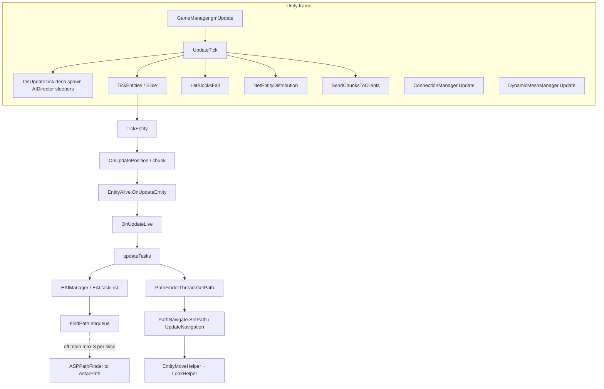
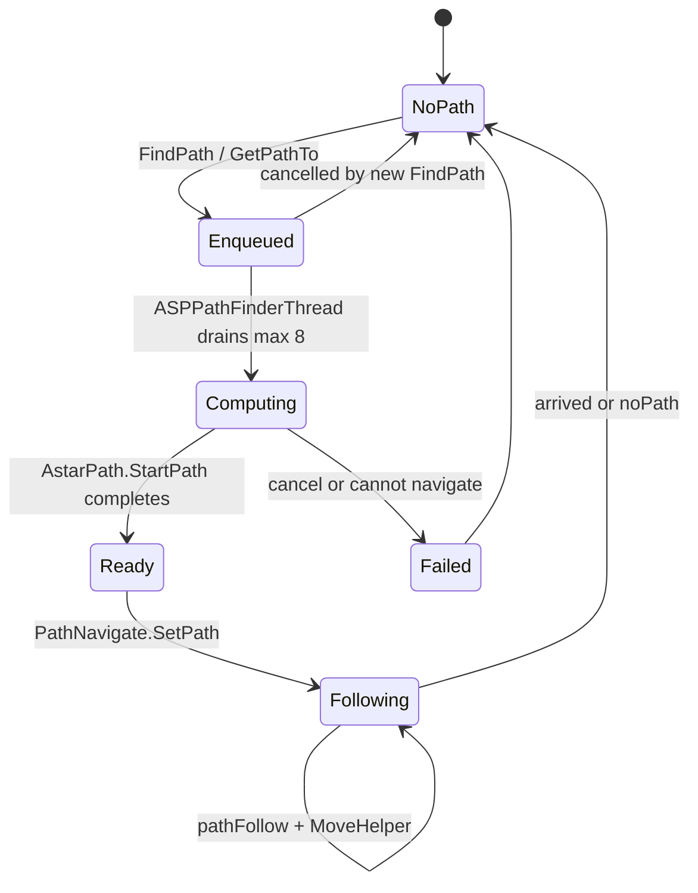
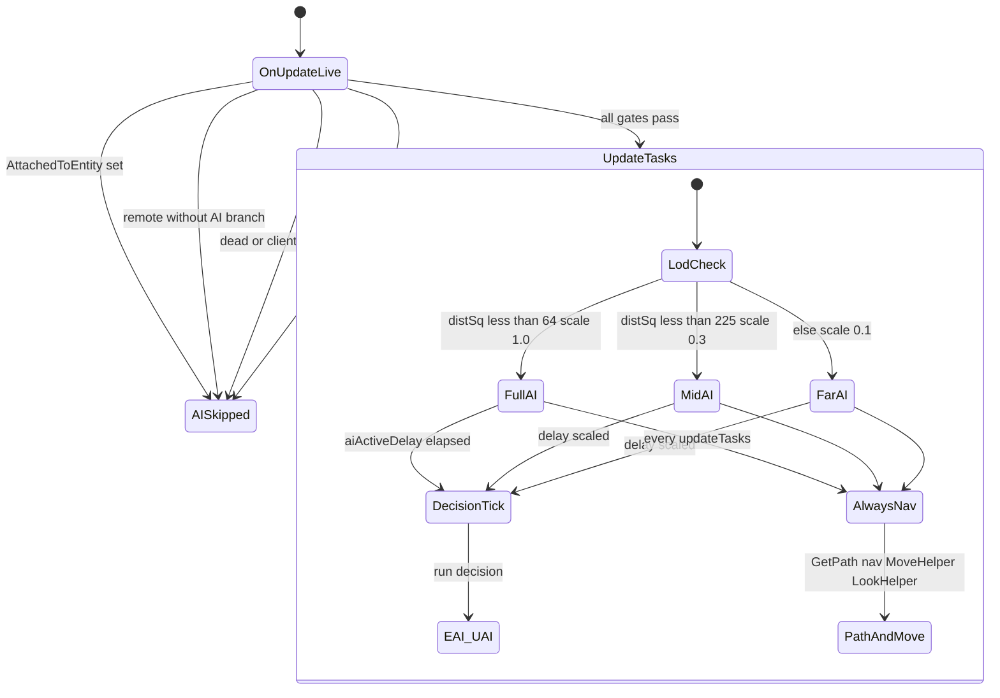

# Entity, AI, and path (dedicated V3.0.1)

**Owns:** authority entity tick chain, AI/path onion, thresholds (merged deep + deeper synthesis).  
**Loop context:** [`loop.md`](loop.md), [`loop-gmupdate.md`](loop-gmupdate.md).  
**Ceiling map:** [`engine-limitations.md`](engine-limitations.md) §4 (AI volume, path ≤8, dual paths).  
**Auto inventory:** [`inventory-deeper.md`](inventory-deeper.md).  
**Dumps:** `il/deep-v3.0.1/`, `il/deeper-v3.0.1/`.  
**Hub:** [`INDEX.md`](INDEX.md).

Do not redistribute game IL.

---

## 1. Call stack from frame to AI (authoritative)



### Path request lifecycle



---

## 2. When AI actually runs (`OnUpdateLive` → `updateTasks`)

From `EntityAlive.OnUpdateLive` IL (gate before `updateTasks`):



Text form of the same gates: `AttachedToEntity` null, not remote (or RootMotion remote without AI), health paths, `!world.IsRemote()`, `!IsDead()`, `!IsClientControlled()`, `hasAI == true`.

Dedicated zombies: typically `hasAI`, not client-controlled, not remote → **`updateTasks` runs** when this entity is ticked by the slice.

**EfficientServer** can still skip `updateTasks` via Harmony for far non-alert (leaf patch). That is coarser than stock `aiActiveScale`.

---

## 3. `EntityAlive.updateTasks` (125 IL): the AI throttle

### 3.1 Early out: “AI disabled” pref

If `GamePrefs.GetBool(enum 46)` and entity is **not** `EntityDrone`:

- zero move forward  
- optional `EAIManager.UpdateDebugName`  
- **`ret`** (no EAI, no path follow)

### 3.2 Always (when not early-out)

1. `CheckDespawn`  
2. `seeCache.ClearIfExpired`  
3. Read `EntityClass.UseAIPackages` → choose **EAI** vs **UAI**

### 3.3 LOD gate (only covers decision AI)

```text
aiActiveDelay -= aiActiveScale
if aiActiveDelay <= 0:
    aiActiveDelay = 1.0
    if !UseAIPackages:  aiManager.Update()      // classic EAI
    else:               UAIBase.Update(context) // utility AI packages
```

| Field | Role |
|---|---|
| `aiActiveScale` | Written in `World.EntityActivityUpdate` from closest-player dist² |
| `aiActiveDelay` | Countdown; full EAI/UAI only when it hits ≤ 0 |

**Critical:** after the delay gate, **path apply + navigation + move + look always run** on every `updateTasks` invocation:

```text
pathInfo = PathFinderThread.Instance.GetPath(entityId)
if path present:
    [EAI] CheckPath(pathInfo) may reject
    navigator.SetPath(pathInfo, speed)
navigator.UpdateNavigation()
moveHelper.UpdateMoveHelper()
lookHelper.onUpdateLook()
// distraction cleanup…
```

So stock LOD **slows how often EAI tasks re-decide**, not how often an entity follows an existing path or updates move helpers when `updateTasks` is entered.

**Implication for optim:**

- Tightening `aiActiveScale` → fewer `EAIManager.Update` / path **requests** from tasks.  
- Skipping entire `updateTasks` (EfficientServer far skip) → also stops path follow / move helper for that tick (stronger than stock).  
- Path **admission** should target `EntityAlive.FindPath` / `PathFinderThread.FindPath` enqueue, not only EAI Update.

---

## 4. `aiActiveScale` bands (EntityActivityUpdate IL)

Per player, build `EntityPlayer.aiClosest` lists via `GetClosestPlayer` + sqr magnitude, sort, then:

| Condition on `aiClosestPlayerDistSq` | `aiActiveScale` | Jiggle |
|---|---|---|
| index in first `N` closest **or** dist² **&lt; 64** (~8 m) | **1.0** | On if dist² **&lt; 36** (~6 m) |
| dist² **&lt; 225** (~15 m) | **0.3** | Off |
| else | **0.1** | Off |

Also cloth sim toggles involving local player attach/distance (constants **625** / **3025** appear earlier in method for cloth radii).

Only **`World.EntityActivityUpdate` stores** `aiActiveScale`; only **`updateTasks` loads** it (plus EfficientServer patches).

---

## 5. EAI stack

### 5.1 `EAIManager.Update` (16 IL)

```text
interestDistance = FastMoveTowards(interestDistance, 10, 0.008333334)  // ease toward 10
targetTasks.OnUpdateTasks()
tasks.OnUpdateTasks()
UpdateDebugName()
```

Two task lists: **target** tasks and **general** tasks. Very thin wrapper.

### 5.2 `EAITaskList.OnUpdateTasks` (137 IL)

Classic priority AI list (same shape IceCoffee tried to Parallel.ForEach):

1. Clear `startedTasks`  
2. For each entry in `allTasks`:  
   - If executing: `isBestTask` + `Continue` or remove + `Reset` + re-arm `executeTime = executeDelay * executeDelayScale`  
   - `executeTime -= 0.05`; `executeWaitTime += 0.05`  
   - If `executeTime ≤ 0`: re-arm delay; if `isBestTask` && `CanExecute` → mark start  
3. For started: `Start()`  
4. For executing: **`EAIBase.Update()`**

Mutex/priority via `isBestTask` / `areTasksCompatible` (not fully dumped here; present in type).

**0.05** is a fixed step (independent of `deltaTime` in this method), i.e. assumes ~20 Hz task list cadence when ticked.

Path requests originate inside individual `EAIBase` / UAI task `Update`/`Start` methods via `EntityAlive.FindPath`.

---

## 6. Pathfinding (V3.0.1 production path)

### 6.1 Which implementation is live?

`AstarManager.Init` (server, non-empty world):

```text
AddComponent<AstarManager>()
new ASPPathFinderThread()     // sets PathFinderThread.Instance in ctor
StartWorkerThreads()
```

**Live type: `ASPPathFinderThread`**, not `AStarPathFinderThread`.

| Type | Worker model | FindPath |
|---|---|---|
| **ASPPathFinderThread** | `StartCoroutine(FindPaths)` on AstarManager MB | Queue entity id + `PathInfo` into dict/hashset (**no lock** in FindPath IL) |
| AStarPathFinderThread | `ThreadManager.StartThread(..., thread_Pathfinder)` + `AutoResetEvent` | Queue under **Monitor** on `finishedPaths`, pulse wait handle |
| PathFinderThread base | stubs (`ret` / null) | abstract-ish |

Both queue work off the caller; **AStar** is classic OS thread; **ASP** is Unity coroutine driver (`FindPaths` state machine). Admission still matters: unbounded enqueue under blood moon fills `entityWaitQueue` / `finishedPaths`.

### 6.2 `EntityAlive.FindPath` (49 IL)

Distance / throttle checks (subtract positions, several `ble`/`bge` thresholds), then:

```text
PathFinderThread.Instance.FindPath(this, target, speed, canBreak, aiTask)
```

### 6.3 Enqueue (`ASPPathFinderThread.FindPath`)

```text
entityWaitQueue.Add(entityId)
finishedPaths[entityId] = new PathInfoSingleTarget(...)
```

### 6.4 Dequeue on main (`GetPath` from `updateTasks`)

```text
if finishedPaths.TryGetValue(id) && path ready:
    remove from dict
    return PathInfo
else null
```

**Worker computes** into `PathInfo`; **main applies** via `PathNavigate`.

### 6.5 Who requests paths (sample xref)

EAI: ApproachAndAttack, ApproachDistraction, ApproachSpot, DestroyArea, RunAway, Territorial, Wander, PathTest…  
UAI: FleeFromTarget, MoveToTarget, Wander…  
Also `EntityDrone.GetProjectedPath`.

---

## 7. `TickEntity` body (reminder)

Before AI:

- position update, chunk tracking add/remove  
- if area loaded + `CanUpdateEntity` → `OnUpdateEntity`  
- else despawn checks  
- unload if marked  

Falling block **entities** go through same `OnUpdateEntity` chain (`EntityFallingBlock` overrides).

---

## 8. `World.LetBlocksFall` (220 IL)

Called once per full `UpdateTick` after entities.

```text
if fallingBlocks queue empty: ret
if EntityFallingBlocks.Enabled: GroupFallingBlocks()
// process fallingGroups and/or per-block queue
GetBlock / OnBlockStartsToFall / DynamicMeshManager.ChunkChanged
EntityFactory.CreateEntity → EntityFallingBlock (or group)
Spawn into world…
```

**Queue-driven.** Spikes when many blocks lose support (base collapse). Matches ServerTools/IceCoffee “fall → air” trade: empty the problem at `AddFallingBlock` before this method invents entities.

---

## 9. `NetEntityDistribution.OnUpdateEntities` (322 IL)

Server-only from `UpdateTick`. Heavy list/enumerator work:

- Clear working lists  
- Walk enemies/players, `IntHashMap` lookup of distribution entries  
- Distance / **view angle** (`Vector3.Angle` with player forward) to decide tracking sets  
- `NetEntityDistributionEntry.updatePlayerList` / `updatePlayerEntity`  

This is **interest management for entity replication**, already local-ish. Cost scales with **players × tracked entities** density. Separate from LiteNetLib `ConnectionManager.Update` package pump.

---

## 10. World systems (sizes)

| Method | IL | Notes |
|---|---:|---|
| `WorldBlockTicker.Tick` | 20 | If not remote: `tickScheduled` + `tickRandom(activeChunks)` |
| `AIDirector.Tick` | 6 | `ComponentsTick` + `DebugTick` |
| `World.TickSleeperVolumes` | 34 | Iterates sleeper volumes |
| `SleeperVolume.Tick` | (dumped) | Per-volume logic |
| `DecoManager.UpdateTick` | **330** | Significant always-on world work before server gate |
| `PowerManager.Update` | 106 | From gmUpdate manager chain |
| `VehicleManager.Update` | **297** | Waypoints etc. |
| `DroneManager.Update` | **305** | Waypoints |
| `TurretTracker.Update` | 45 | |

Deco (330) + vehicle/drone managers are non-trivial even with few players.

---

## 11. Cost model (for optim / conductor)

Per **ticked** AI entity roughly:

```text
TickEntity fixed overhead (position, chunks)
+ OnUpdateEntity (buffs, inventory hooks, sounds…)
+ OnUpdateLive (stats, movement)
+ updateTasks:
    every time: GetPath + nav + move + look
    every 1/aiActiveScale-ish EAI ticks: full EAITaskList ×2 + possible FindPath enqueue
```

Per **frame** additionally:

```text
gmUpdate manager fan-out (power, vehicles, drones, twitch, …)
+ UpdateTick world (deco 330 IL method, block walk @20, sleepers, block ticker)
+ LetBlocksFall if queue non-empty
+ NetEntityDistribution (player×entity interest)
+ ConnectionManager + DynamicMeshManager peer Updates
+ path workers/coroutines draining queue
```

---

## 12. EfficientServer / conductor hooks (refined)

| Hook | What you control | Stock already |
|---|---|---|
| `EntityActivityUpdate` / scale writes | Who gets 1.0 / 0.3 / 0.1 | Bands above |
| `updateTasks` Prefix | Skip all AI+nav for far (stronger than scale) | ES far skip |
| `EAIManager.Update` / `EAITaskList` | Decision frequency only | Delay scale inside list |
| `EntityAlive.FindPath` / `PathFinderThread.FindPath` | **Admission** on enqueue | Queue per entity id (last write wins in dict) |
| `TickEntities` / slice count | Who enters TickEntity at all | EMA slice |
| `AddFallingBlock` / `LetBlocksFall` | Collapse storms | Queue + entities |
| `NetEntityDistribution.OnUpdateEntities` | Interest CPU (high risk) | Angle/distance filters |
| `DecoManager.UpdateTick` | Always-on 330 IL | ES may skip music; deco separate |
| Peer `ConnectionManager` / `DynamicMeshManager` | Not under gmUpdate | Own Updates |

**Path queue note:** `finishedPaths[entityId] = …` means repeated FindPath for same entity **replaces** pending work (natural coalesce by id). Admission still needed when **many entities** each request once per EAI pulse.

**ASP vs AStar:** production uses **ASP + coroutine**. Do not assume `ThreadManager` path workers unless RE shows AStar installed (mods/old versions).

---

## 13. IceCoffee parallel EAI vs stock

Stock `EAITaskList.OnUpdateTasks` is exactly the serial loop IceCoffee wrapped in `Parallel.ForEach`. Confirmed structure: shared `executingTasks`, `isBestTask`, `Continue`/`CanExecute`/`Start`/`Update`. Parallelizing this without pure tasks + locks was correctly abandoned open-source.

---

## 14. See also

| Doc | Why |
|---|---|
| [loop.md](loop.md) | Frame / UpdateTick context |
| [closed-gaps.md](closed-gaps.md) | Timer, path ASP, net bands |
| [aidirector.md](aidirector.md) | Component inventory |
| [network.md](network.md) | Entity replication cost |
| [measured-scaling.md](measured-scaling.md) | Live AI vs player exponents |

## 15. Regenerate

```bash
cd 7dtd-optimizer/tools
mcs -r:Mono.Cecil.dll -out:DumpDeep.exe DumpDeep.cs
mono DumpDeep.exe "$DS/7DaysToDieServer_Data/Managed/Assembly-CSharp.dll" \
  ../../research/il/deep-VERSION
```

Also keep [`../il/gmUpdate-v3.0.1/`](../il/gmUpdate-v3.0.1/) for frame-level dump.

---

## See also

Graded optim candidates + APM probe list: [`../../7dtd-optimizer/docs/OPTIMIZATION_CANDIDATES.md`](../../7dtd-optimizer/docs/OPTIMIZATION_CANDIDATES.md).

## Changelog
- **2026-07-16:** Link opt-scan candidates.
- **2026-07-16:** Deep dump: updateTasks LOD vs always-on nav; EAITaskList; ASPPathFinderThread production path; LetBlocksFall; NetEntityDistribution; manager IL sizes; optim hook table.

---

# Deeper synthesis (thresholds and scale)

Companion detail formerly in entity-ai. Raw auto: [`inventory-deeper.md`](inventory-deeper.md).


## 1. Per-entity cost onion (when a zombie is ticked)

```text
TickEntity
  OnUpdatePosition (EntityAlive override 107 IL)
  chunk membership
  OnUpdateEntity (417)           // buffs, inventory tick, sounds, death, → OnUpdateLive
    OnUpdateLive (363)           // stats, attack target net, move, gates → updateTasks
      updateTasks (125)
        [gate] aiActiveDelay / scale → EAI or UAI decision
        [always] GetPath + nav + MoveHelper + LookHelper
          ASPPathNavigate.UpdateNavigation → pathFollow (160 IL)
          EntityMoveHelper.UpdateMoveHelper (1236 IL)  ★ largest common AI cost
```

**Interpretation:** for any entity that enters `updateTasks`, the dominant pure-size hotspot is **MoveHelper**, then path follow, then (less often) full EAI. Stock LOD only reduces EAI frequency.

### Entity type outliers (updateTasks / live)

| Type | Method | IL | Note |
|---|---|---:|---|
| **EntityVulture** | updateTasks | **1344** | Flying special case; own world |
| EntityMoveHelper | UpdateMoveHelper | **1236** | Shared by walkers |
| EntityFallingBlock | OnUpdateEntity | 344 | Collapse path |
| EntityFallingBlocks | OnUpdateEntity | 302 | Group fall |
| EntityTrader | OnUpdateLive | 315 | NPC |
| EntityTurret | OnUpdateEntity | 414 | TE-like entity |
| EntityDrone | updateTasks | 139 | Drone AI |
| EntityEnemyAnimal | updateTasks | 26 | thin override |
| EntityBandit | updateTasks | 12 | thin |
| EntityVehicle | updateTasks | 1 | nop-ish |
| EntityZombieDog | OnUpdateLive | 16 | thin |

Most zombies use **base** `EntityAlive` paths (not a fat zombie-specific updateTasks).

---

## 2. EAI task cost ranking (method size)

Top decision tasks (when EAI Update runs):

| IL | Method | Role |
|---:|---|---|
| **846** | `EAIApproachAndAttackTarget.Update` | Primary chase/attack; **3× FindPath** calls in one Update |
| 317 | `EAIDestroyArea.Continue` | Destroy |
| 281 | `EAISetNearestEntityAsTarget.FindTarget` | Target acquisition + bounds queries |
| 184 | `FindTargetPlayer` | Player targeting |
| 172 | `GetMoveToLocation` | Approach helper |
| 166 | `EAIRunawayFromEntity.FindEnemy` | Flee scan |
| 137 | `EAITaskList.OnUpdateTasks` | Scheduler |
| 118 | `EAIBreakBlock.AttackBlock` | Break |
| 107 | Melee / Ranged attack Update | Attacks |
| 105 | `EAIRunAway.Update` | Flee |
| 94 | ApproachDistraction / Wander.CanExecute | |

UAI package path also present (`UAIBase`, considerations, MoveToTarget, etc.).

**Combat path pressure:** ApproachAndAttack alone can enqueue **multiple** FindPaths per EAI pulse per zombie. Admission at `EntityAlive.FindPath` catches all of them.

---

## 3. Documented thresholds (from IL constants)

### 3.1 AI LOD (`EntityActivityUpdate`)

| Constant | Meaning (research interpretation) |
|---|---|
| dist² **64** (~8 m) | Full `aiActiveScale = 1.0` band |
| dist² **225** (~15 m) | Mid band → scale **0.3** |
| else | Far → scale **0.1** |
| dist² **36** (~6 m) | Jiggle on |
| dist² **625** / **3025** | Cloth sim radii (~25 m / ~55 m) |
| ints **20**, **60**, **4** | Related to `aiClosest` list sizing / FastClamp (player-count aware) |

### 3.2 Path request (`EntityAlive.FindPath`)

| Constant | Meaning |
|---|---|
| xz dist² **1225** (~35 m) | Below: skip vertical clamp; **still always enqueues** path |
| **±45** m Y | Clamp target height when far horizontally |

### 3.3 EAI timing

| Constant | Where | Meaning |
|---|---|---|
| **0.05** | `EAITaskList.OnUpdateTasks` | Per-task countdown step when list is updated |
| **1.0** | `updateTasks` | Reset `aiActiveDelay` after EAI/UAI runs |
| **10** / **0.008333334** | `EAIManager.Update` | `interestDistance` ease toward 10 |

### 3.4 Path follow (`ASPPathNavigate.pathFollow`, 160 IL)

Floats seen: **0.04, 0.15, 0.2, 0.33, 0.49, 0.6, 0.7, 0.9, 2** (waypoint / progress thresholds; exact semantics need line-level read of dump).

### 3.5 Net interest (`NetEntityDistributionEntry.updatePlayerList`)

| Constant | Likely role (hypothesis from encode context) |
|---|---|
| **0.04** | Small threshold (velocity/zero compare area) |
| **2**, **16** | Distance bands for package choice |
| **128 / 192 / 256** | Encoded pos/rot quantize ranges |
| Package set | RelPosAndRot, PosAndRot, Teleport, Rotation, Velocity, AliveFlags, PlayerStats, TwitchStats, Equipment |

### 3.6 Spawn (`SpawnUpdate`)

Floats **1, 2.5, 4, 40, 80** (ranges / multipliers). Many GameStats/Prefs int ids in method.

### 3.7 Path worker budget (critical)

`ASPPathFinderThread/<FindPaths>d__8.MoveNext`:

```text
for i in 0 .. 7:          // ldc.i4.8  → at most 8 paths
  pop entityWaitQueue
  navigator.GetPathTo(pathInfo)
  maybe remove unfinished from finishedPaths
yield return null         // resume next coroutine step
loop forever
```

**Production pathfinder drains ≤ 8 path computations per coroutine slice**, then yields.  
Under blood moon, queue depth grows; main still enqueues unbounded FindPaths.  
**Admission on enqueue complements this fixed drain of 8.**

---

## 4. MoveHelper anatomy (why 1236 IL matters)

Call breakdown themes:

- Stuck detection / `ResetStuckCheck`  
- **Jump** (`StartJump` ×4 sites)  
- **Dig** (`DigStart`, `DigUpdate`)  
- Blocked clearing  
- Attack from move helper (`EntityAlive.Attack` ×2)  
- Angle lerp, sin/cos, random (9× RandomFloat)  
- Sleeping/stun/ragdoll early-outs  

This is full **locomotion + dig + combat assist**, not a thin “apply velocity.”  
Any far entity still running `updateTasks` pays this. Far skip of updateTasks avoids it entirely.

---

## 5. Path system fields (ASP vs AStar)

Both concrete types share:

- `entityWaitQueue` : `HashSetList<int>`  
- `finishedPaths` : `Dictionary<int, PathInfo>`  

ASP also: `coroutine`  
AStar also: `threadInfo`, `writerThreadWaitHandle`  

**Init installs ASP only** (`AstarManager.Init` → `new ASPPathFinderThread` + `StartCoroutine`).

---

## 6. GameTimer (authoritative ticks)

`updateTimer(bool)`:

- If bool true (dedicated idle path from gmUpdate when no players): `Reset` and return  
- Else: advance from stopwatch ms × `timeScale` × `ticksPerSecond` → `elapsedTicks` + `elapsedPartialTicks`  
- Bump `ticks` and `ticksSincePlayfieldLoaded`  

`UpdateTick` uses game timer readiness to choose **slice-only** vs **full tick** (entities + world). Partial ticks feed entity partials.

---

## 7. Spatial query surface (optim relevance)

### GetClosestPlayer callers (few but hot)

- `World.EntityActivityUpdate` (primary scale path)  
- `EntityAlive.CheckDespawn`  
- Vulture, AIDirector scouts, quests  

### GetEntitiesInBounds callers (many)

Push physics, turrets, traps, EAI target find, break block, falling entities, spawn, UAI considerations, traders, items distraction, horde spawner, …

**Density cost:** combat + traps + spawn all pile on bounds queries independent of AI LOD.

---

## 8. Falling / sleeper / deco (world systems)

| System | Notes |
|---|---|
| AddFallingBlock | Dedupe hashset, mesh observer, enqueue |
| GroupFallingBlocks | 292 IL |
| LetBlocksFall | Spawn falling entities |
| SleeperVolume.Tick | MinScript, UpdateSpawn, Despawn, player touch |
| DecoManager.UpdateTick | Locked lists, Add/Remove deco, starts `UpdateDecorationsCo` |
| WaterSplashCubes | 185 IL always on OnUpdateTick |

---

## 9. Manager chain sizes (gmUpdate every frame if instance)

| Manager | Update IL |
|---|---:|
| DroneManager | 305 |
| VehicleManager | 297 |
| QuestEventManager | 127 |
| PowerManager | 106 |
| TurretTracker | 45 |
| FactionManager | 43 |
| GameEventManager.Update | 25 (+ larger Handle* helpers) |

---

## 10. Dynamic mesh server

`DynamicMeshServer.Update` (452): concurrent queues, client count, `NetPackageDynamicMesh`, send, connection map. Separate from entity AI; competes for main frame with gmUpdate peer order.

---

## 11. Chunk load determination

`DetermineChunksToLoad` (448): bucket hash sets, locks, union/except chunk key sets, unload, free chunk GOs. Driven by player positions / view. Ops lever: view distance. Harmony rare.

---

## 12. Optim ideas derived here

Graded candidates and experiment order live in the optimizer project (not under `research/docs/` or `research/il/`):  
[`../../7dtd-optimizer/docs/OPTIMIZATION_CANDIDATES.md`](../../7dtd-optimizer/docs/OPTIMIZATION_CANDIDATES.md)

---

## 13. APM / loadgen scenarios to pair with dumps

| Scenario | Expect stacks |
|---|---|
| Blood moon pile | MoveHelper, ApproachAndAttack, FindPath, path queue, EAITaskList |
| Spread players, quiet AI | DetermineChunksToLoad, SendChunks, deco, mesh |
| Base collapse / explosive | LetBlocksFall, GroupFalling, FallingBlock OnUpdateEntity |
| Many turrets/traps | GetEntitiesInBounds from controllers |
| Many vehicles/drones | VehicleManager / DroneManager Update |
| Empty server | updateTimer idle Reset path; reduced chunk work |

---

## 14. File map in this dump

- `inventory-deeper.md`, auto narrative + lists  
- `*_il.txt` / `*_calls.md`, per-method  
- `SYNTHESIS.md`, this file  
- Parent index: [`INDEX.md`](INDEX.md)  

Regenerate: `tools/DumpDeeper.cs`.

---

## Changelog (merged source 2)
- **2026-07-16:** Initial deeper synthesis: onion costs, EAI rank, thresholds, path drain 8, MoveHelper themes, net packages, scenarios.

## Addendum (2026-07-21): server-side zombie animators

`EModelBase.Init` strips animators on dedicated (`AvatarControllerDummy` + disabled
Animators) ONLY for entities without `RootMotion || HasRagdoll` - all zombies have
both, so every server zombie runs a real `AvatarZombieController` with enabled
animators at `AlwaysAnimate` (plus a forced `SetVisible(true)`). Gameplay reads the
animator three ways (root-motion displacement into `Entity.motion`, attack-cadence
tag-hash in `IsAnimationAttackPlaying`, stun state), so the strip cannot simply be
extended - the viable lever is animator LOD (manual low-rate `Animator.Update` for
calm/distant zombies). Engine-side cost hides in unsymbolized UnityPlayer.so CPU
(~22% all-thread at heavy load); sizing via the `es animoff/animon` diagnostic.
Zombie anim params are never netsynced (`SyncAnimParameters` is player-only) -
clients animate zombies locally.

**Measured (2026-07-21):** the animator slice is **19.9 ms/frame (28% of the loaded
frame) at ~380 endgame zombies** (24 players, `es animoff` A/B). At 64 players the
frame is additionally WAIT-bound: the main thread is only ~52% busy at 166 ms
frames (~550 voluntary switch-outs/s = engine job-fence ping-pong), and disabling
animators sends it to 95% busy - the animation jobs' FENCES, not just their
compute, dominate the 64p engine mass. GC stop-the-world is exonerated (179 ms per
120 s window). The animator-LOD lever (v1.15.0) helps only dispersed populations:
during clustered sieges the correctness exemptions (near/attacking) cover the
horde. See `7dtd-optimizer/docs/RESULTS.md` §3m-3o.

**Per-zombie tick cost, fully attributed (2026-07-21, 8p + ~224z):** OnUpdateLive
is 22.1 us/zombie/tick (vs 36 at 64p - the delta is player-linked fence share):
**MoveEntityHeaded (movement + collision integration) 54%**, updateTasks (EAI +
path follow) 27%, CanSee 6%, block-pos 6%, stats 4%. The biggest reducible piece
is the collision/movement integration - crowd-collision LOD is the ranked next
lever. At 8 players there is NO CPU ceiling: frame pinned at 50 ms through ~250
standing zombies (93.7% headroom); the horde caps at spawn equilibrium (exploder
chains), not the server. See RESULTS §3q.
