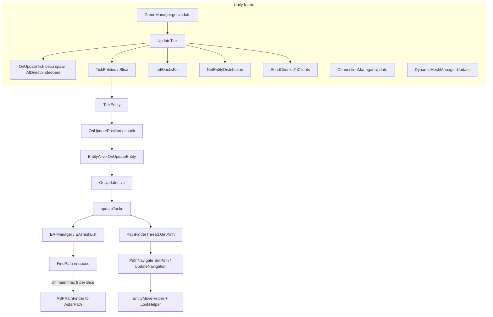
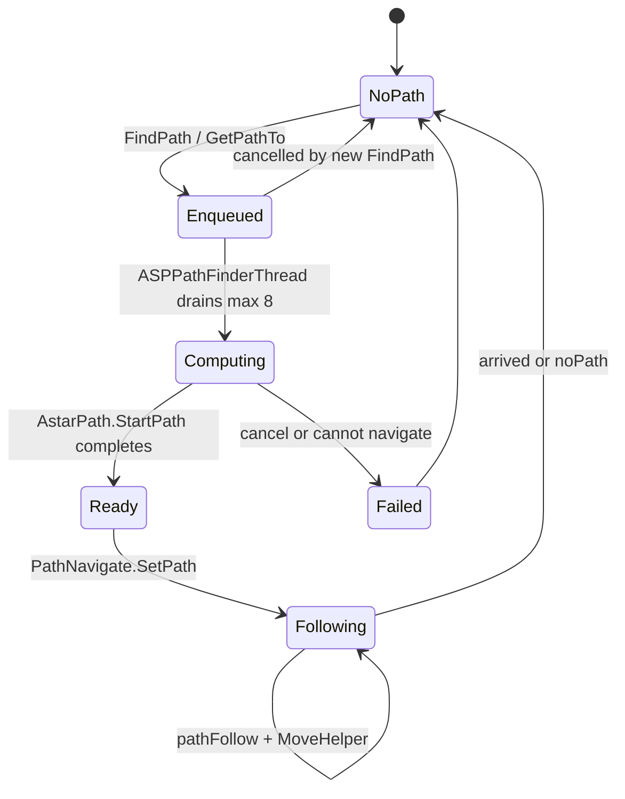
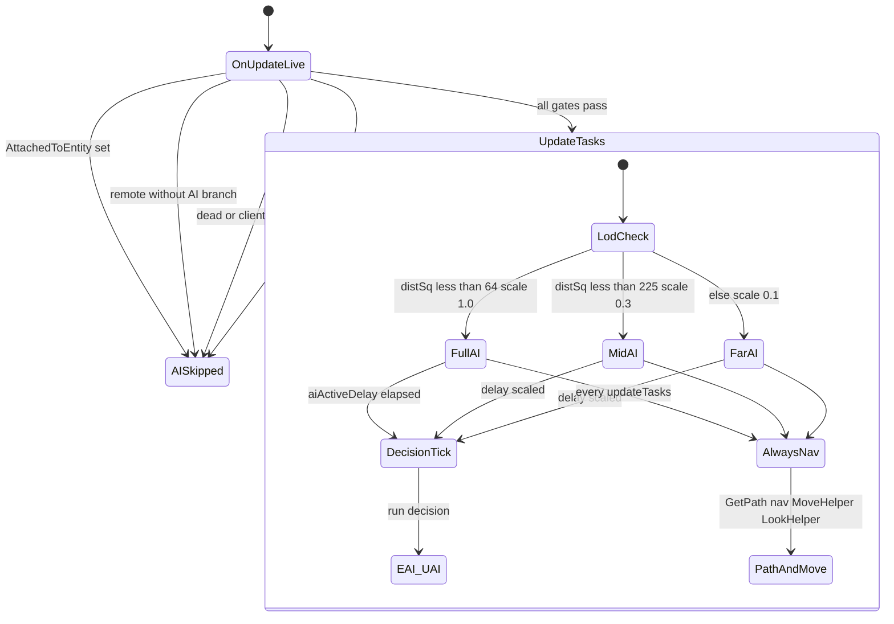

# Entity, AI, and path (dedicated V3.2.0)

**Owns:** authority entity tick chain, AI/path onion, thresholds (merged deep + deeper synthesis).  
**Loop context:** [`loop.md`](loop.md), [`loop-gmupdate.md`](loop-gmupdate.md).  
**Ceiling map:** [`engine-limitations.md`](engine-limitations.md) §4 (AI volume, path ≤8, dual paths).  
**Auto inventory:** [`inventories/deeper.md`](inventories/deeper.md).  
**Dumps:** `il/deep-v3.2.0/`, `il/deeper-v3.2.0/`.  
**Hub:** [`INDEX.md`](INDEX.md).

Do not redistribute game IL.

---

## 1. Call stack from frame to AI (authoritative)



### Path request lifecycle



---

## 2. When AI actually runs (`OnUpdateLive` → `updateTasks`)

### 2.0a `OnEntityUnload` (IL=29)

If not `EntityPlayerLocal`: `OcclusionManager.RemoveEntity`. Clear navigator path
(`SetPath(null,0)`) and null `navigator`, `lookHelper`, `moveHelper`, `seeCache`;
then base `Entity.OnEntityUnload`.

**`Entity.MarkToUnload` (IL=4):** `markedForUnload = true`.
`EntityAlive.MarkToUnload` also copies `timeStayAfterDeath` into
`deathUpdateTime` (corpse linger clock).

**`World.RemoveEntity(id, reason)` (IL=16):** if entity exists: `MarkToUnload` +
`unloadEntity(entity, reason)`; return entity (or null).

**`World.unloadEntity` (IL=216):** store `unloadReason`; fire
`EntityUnloadedDelegates`; `OnEntityUnload`; remove from entity dict +
`TickEntityRemove` + `EntityAlives`; `RemoveEntityFromMap`; chunk remove if
still marked; vehicle/drone/turret tracker remove; server:
`NetEntityDistribution.Remove`, `PathFinderThread.RemovePathsFor`, player
disconnect path, `AIDirector.RemoveEntity`; always audio/weather/light entity
removed hooks.

**`NetPackageEntityRemove.ProcessPackage` (IL=24):** log if missing; always
`RemoveEntity(entityId, reason)` (reason is u8 enum).

### 2.0 Parent chain: `OnUpdateEntity` (IL=457) then `OnUpdateLive` (IL=363)

**`OnUpdateEntity` high-level (IL=457):** base `Entity.OnUpdateEntity`;
`Buffs.SetCustomVar` / `Buffs.Tick`; optional class `PickupStressBuff` add;
**`OnUpdateLive()`**; `inventory.OnUpdate()` when present; death / hurt sound;
radiation-sensitive path can `DamageEntity` (e.g. **20** under biome flags);
more equipment / held-item / animation residual in later IL.

`EntityAlive.OnUpdateEntity` (before Live):

1. Base `Entity.OnUpdateEntity`.
2. Buff cvar / `EntityBuffs.Tick`.
3. Optional weather/biome buffs via `AddBuff` / `SetCVar`.
4. **`OnUpdateLive()`**.
5. `Inventory.OnUpdate`.
6. Health/death paths: radiation / environmental `DamageEntity`, hurt sounds,
   sleeper pose, alert/random sounds, investigate clear, `OnDeathUpdate`,
   revenge target set.

`OnUpdateLive` (AI-relevant):

1. Stat regen zeroing; if not dead: `EntityStats.Tick`.
2. Attack-target net: may send `NetPackageSetAttackTarget` to tracked players.
3. `updateCurrentBlockPosAndValue` (detail below).
4. Movement / jump / headed move for non-AI branches.
5. **AI gate** then `updateTasks()` (detail below).
6. Stun clear/set via avatar controller; can-see updates; dynamic ragdoll;
   trader-area teleport check.

**`EntityAlive` tuning constants (IL):** `cTraderTeleportCheckTime` = **0.1** s,
`cDamageImmunityOnRespawnSeconds` = **1**, `cSoundRandomMaxDist` = **20**,
`kSnoreGroanMinCD` = **20** s, swim `cSwimGravityPer` **0.025** / `cSwimDrag` &
`cSwimDragY` **0.91** / `cSwimAnimDelay` **6**, `CLIMB_LADDER_SPEED` = **1234**
(internal speed units). Walk-type ids (`cWalkType*`): `Fat` 1, `Cripple` 5,
`Crouch` 8, `Bandit` 15, `CrawlFirst` 20, `Crawler` 21, `Spider` 22,
`Swim` -1.

**`EntityVulture` tuning constants (IL):** `cTargetDistanceClose` = **0.9** m /
`cTargetDistanceMax` = **80** m, `cTargetAttackOffsetY` = **-0.1**,
`cFlyingMinimumSpeed` = **0.02**, `cVomitMinRange` = **3** m, `cAttackDelay` =
**18** s, battle fatigue `cBattleFatigueMin` **30** / `cBattleFatigueMax` **60** /
`cBattleFatigueCooldownMin` **80** / `cBattleFatigueCooldownMax` **180** s,
`cCollisionMask` **1082195968**.

**`EntityStats` tick + sync:** `Init` (base IL=40) builds the `Health` `Stat`
with `MaxPassive = MaxHealth (104)`, `GainPassive 106`, `LossPassive 107` and
max seeded from `EffectManager.GetValue(104, null, 100, entity, ...)`.
`PlayerEntityStats.Init` (IL=166) adds `Stamina` (MaxPassive 109, Gain 111,
Loss 112), `Water` (122/124/125), `Food` (114/116/117) plus the UI-notification
lists. `Tick` (IL=27) skips remote/dead entities and runs a 10-tick phase wheel
via `TickWait`: base (IL=75) at phase 1 runs `UpdateNPCStatsOverTime(0.5)` +
`Health.Tick(0.5)`, phase 2 sends `NetPackageEntityStatChanged` for a changed
Health, and phase 6 (every 10 ticks, throttled by `netSyncWaitTicks`) sends
`NetPackageEntityStatsBuff` (server broadcasts on 192, client sends to server).
The player variant (IL=133) runs the four `Update*OT` regen passes at phases
1-4, per-stat change packets at phase 5 (Health 0, Stamina 1, Water 8, Food 7),
and the same stats-buff sync. Wire: base `Write`/`Read` (IL=8 each) are version
**11** + the Health stat only; the player form (27/38) adds Stamina, Water,
Food and `CoreTemp` as `sbyte(CoreTemp / 2)` (read back `* 2`, version >= 11);
`NetPackageEntityStatsBuff` is `entityId i32 + length i32 + raw bytes`.

**`Stat` (the per-stat record):** ctor (IL=36) stores the type, entity, value
and base max. `Tick(dt)` (IL=301) is the regen pass: re-evaluates the max via
`EffectManager.GetValue(MaxPassive, ..., originalBaseMax)`, adds
`GetValue(GainPassive) * dt` when below the last value and subtracts
`GetValue(LossPassive) * dt` above it, clamps to `[0, baseMax]`, applies
`regenAmount`, and flags `Changed` when the value moved. `Write` (IL=24) is
version **6** + `m_value, m_maxModifier, m_baseMax, m_originalBaseMax,
m_originalValue` (f32 x5); `Read` (IL=32) mirrors it, pops an extra f32 at
version <= **5**, and syncs `m_lastValue = m_value`.
`GodModeEntity` (IL=19) and `SetChangedFlag(new, old)` (IL=15) round out the
changed-tracking; the max accessors combine `baseMax` + `maxModifier`
(`ModifiedMax`), and `ValuePercent` is `value / max`.

**`EntityAnimal.OnUpdateLive` (IL=57) override:** `EntitySeeCache.Clear()`
(animals keep no see cache), then base `OnUpdateLive`. While `isDistressed`
and alive: `timer -= deltaTime`; at ≤ 0 rearm with
`rand(minStressTime, maxStressTime)` and
`PlaySoundAtPositionServer(position, GetSoundDistressed(), Linear, 1,
entityId, 1)`. With a local player present,
`Waypoints.UpdateEntityAnimalWayPoint(this, true)`.

**`EntityAnimal.SetDistressed(isDistressed, minTime, maxTime, playerId)`
(IL=16)** is the distress entry: it stores the flag, the `minStressTime` /
`maxStressTime` bounds, the offending `playerId`, and seeds `timer = 2.5`
(the first panic sound fires almost immediately).
`getEntityPlayerLocal` (IL=16) returns the primary player only when its id
matches the stored `playerId`; `isGameMessageOnDeath` (IL=2) is false (animals
produce no death message).

**`EntityPlayer.OnUpdateLive` (IL=13) override:** zero the stamina stat's
`RegenerationAmount` (player stamina does not use the stat's passive regen),
then base `OnUpdateLive`, `EntitySeeCache.Clear()` (no see cache for players),
`CheckSleeperTriggers()` (server + alive only, see the sleeper section).

**`EntityPlayer.SetAlive` (IL=31):** base `EntityAlive.SetAlive`, then if the
player was dead the game-stage birth time moves forward on respawn:
`delta = GameStageDefinition.DaysAliveChangeWhenKilled * 24000` game ticks;
when `worldTime - gameStageBornAtWorldTime < delta` the birth time snaps to
the current `worldTime`, otherwise it shifts forward by `delta`.
**`EntityPlayerLocal.SetAlive` (IL=38) override:** on top of the base,
re-layers `PhysicsTransform.gameObject` to layer 20, stops the first-person
`Dead` activity (`Player.Dead.Stop(0)`), runs
`SetModelLayer(24, false, null)` + `ShowHoldingItemLayer(true)`, and sets
`bPlayerStatsChanged` and `bPlayerEquipmentChanged`.

**`EntityPlayer.TurnOffLightFlares` (IL=4):** forwards to
`inventory.TurnOffLightFlares()`.

**`EntityPlayer.DetectUsScale(entity)` (IL=26):** the zombie-scale check for
the local player's threat display. Returns 0.3 when the player's spawn
`prefab` has `DifficultyTier >= 1`, the player has been inside the prefab
longer than 60 seconds (`Time.time - prefabTimeIn > 60`), and the target is an
`EntityEnemy` spawned by the biome (`GetSpawnerSource() == Biome`); otherwise
1.

**`ThreatLevelConstants` (IL):** `cMinThreatLevel` = **0**,
`cSuspenseThreshold` = **0.25**, `cCombatReadyThreshold` = **0.5**,
`cCombatThreshold` = **0.75**, `cMaxThreatLevel` = **1** (the threat-level
band thresholds).

**`ThreatLevelTracker` increments (IL):** `cBaseIncrement` = **0.0015**,
`cInactiveIncrement` = **0.0625**, `cSleeperIncrement` = **0.03125**,
`cAlertIncrement` = **0.125**, `cTargetIncrement` = **0.25** (the per-tick
threat accumulation rates).

**`ThreatLevelUtility` (IL):** `LOOKBACK` = **300** ticks, `THREAT_PER_ENEMY` =
**0.03333334** (1/30), `ZOMBIE_COMBAT_QUANTITY` = **4**, 
`PLAYER_HOME_MINIMUM_DISTANCE` = **50** m.

**`EntityPlayer.getHeadPosition()` (IL=32):** `emodel.GetHeadTransform().
position + Origin.position` when the model and head transform exist, else
`transform.position + (0, height - 0.15, 0) + Origin.position`.

**`EntityAnimal.OnEntityDeath` (IL=24) override:** disable the
`PhysicsTransform` GameObject, base `OnEntityDeath`, then remove the animal's
last-known-position waypoint from the local player (`TryRemoveLastKnown
PositionWaypoint(entityId)`).

**`updateCurrentBlockPosAndValue` (IL=318):** foot block = entity block pos, or
y-1 if air; resolve child to parent. If pos/value changed **or** landed this
tick (`onGround && !wasOnGround`): store standing pos/value; server sets
`blockStandingOnChanged`; biome change → `onNewBiomeEntered`. Always
`CalcIfInElevator`. Walk-buff blocks (`UseBuffsWhenWalkedOn`): workstation
burning path can re-add timed buffs; passive **153** residual; call
`Block.OnEntityWalking` when appropriate. If standing block non-air with
`GetStability==0` and `CanFallBelow`: log warning and `World.AddFallingBlock`.
Also walks y+1 neighbor for `OnEntityWalking`; ends with
`HandleLootStageMaxCheck()`.

**`ForceBigHead` (IL=22):** only `EntityAnimal` / `EntityEnemy` / `EntityTrader`
with `CanBigHead` and `HeadState==0` → set `HeadState=**2**`.
**`ForceResetHead` (IL=28):** same type filter; if HeadState is **1** or **2**
set **0**.
**`EntityAnimalSnake.GetAttackTargetHitPosition` (IL=13):** the snake aims at
`attackTarget.position` with `y + 0.5` (body center, not the feet).
**`InitInventory` (IL=9):** if inventory null, `new Inventory(GameManager, this)`.

**`isRadiationSensitive` (IL=2):** always **true** (base).

**`onNewBiomeEntered` (IL=4):** `biomeStandingOn = _biome`.

**`CalcIfInElevator` (IL=59):** if `!bCanClimbLadders` force `bInElevator=false`.
Else sample block at (standX, floor(bbox.min.y), standZ) and y+1; `bInElevator`
= either block `IsElevator(rotation)`.

**`Entity.CheckDistance` family:** all overloads funnel to
`(A - B).magnitude < 1.0f` (the default 1-block proximity test); the
entity/vector/id variants resolve the position via transform or the world's
entity registry, and `(listener, source)` (IL=8) forwards the two transform
positions.

From `EntityAlive.OnUpdateLive` IL (gate before `updateTasks`):



Text form of the same gates: `AttachedToEntity` null, not remote (or RootMotion remote without AI), health paths, `!world.IsRemote()`, `!IsDead()`, `!IsClientControlled()`, `hasAI == true`.

Dedicated zombies: typically `hasAI`, not client-controlled, not remote → **`updateTasks` runs** when this entity is ticked by the slice.

**EfficientServer** can still skip `updateTasks` via Harmony for far non-alert (leaf patch). That is coarser than stock `aiActiveScale`.

---

## 3. `EntityAlive.updateTasks` (125 IL): the AI throttle

### 3.1 Early out: “AI disabled” pref

If `GamePrefs.GetBool(enum 46)` and entity is **not** `EntityDrone`:

- zero move forward  
- optional `EAIManager.UpdateDebugName`  
- **`ret`** (no EAI, no path follow)

### 3.2 Always (when not early-out)

1. `CheckDespawn`  
2. `seeCache.ClearIfExpired`  
3. Read `EntityClass.UseAIPackages` → choose **EAI** vs **UAI**

### 3.3 LOD gate (only covers decision AI)

```text
aiActiveDelay -= aiActiveScale
if aiActiveDelay <= 0:
    aiActiveDelay = 1.0
    if !UseAIPackages:  aiManager.Update()      // classic EAI
    else:               UAIBase.Update(context) // utility AI packages
```

| Field | Role |
|---|---|
| `aiActiveScale` | Written in `World.EntityActivityUpdate` from closest-player dist² |
| `aiActiveDelay` | Countdown; full EAI/UAI only when it hits ≤ 0 |

**Critical:** after the delay gate, **path apply + navigation + move + look always run** on every `updateTasks` invocation:

```text
pathInfo = PathFinderThread.Instance.GetPath(entityId)
if path present:
    [EAI] CheckPath(pathInfo) may reject
    navigator.SetPath(pathInfo, speed)
navigator.UpdateNavigation()
moveHelper.UpdateMoveHelper()
lookHelper.onUpdateLook()
// distraction cleanup…
```

So stock LOD **slows how often EAI tasks re-decide**, not how often an entity follows an existing path or updates move helpers when `updateTasks` is entered.

**Implication for optim:**

- Tightening `aiActiveScale` → fewer `EAIManager.Update` / path **requests** from tasks.  
- Skipping entire `updateTasks` (EfficientServer far skip) → also stops path follow / move helper for that tick (stronger than stock).  
- Path **admission** should target `EntityAlive.FindPath` / `PathFinderThread.FindPath` enqueue, not only EAI Update.

---

## 4. `aiActiveScale` bands (EntityActivityUpdate IL=229)

1. Clear every player's `aiClosest` list.
2. For each `EntityAlives`: `GetClosestPlayer(pos, -1, dead=false)`; push entity
   into that player's `aiClosest`; store `aiClosestPlayer` +
   `aiClosestPlayerDistSq` (or null / +inf if none).
3. Per player: sort `aiClosest` by distSq ascending.
4. `N = FastClamp(60 / playerCount, **4**, **20**)` (top-N full AI quota).
5. For each entity in that list:

| Condition on `aiClosestPlayerDistSq` | `aiActiveScale` | Jiggle |
|---|---|---|
| index &lt; **N** **or** dist² **&lt; 64** (~8 m) | **1.0** | On if dist² **&lt; 36** (~6 m) |
| dist² **&lt; 225** (~15 m) | **0.3** | Off |
| else | **0.1** | Off |

**Cloth sim (local player only):** radius² **625** (25 m) default; **3025** (55 m)
when `AimingGun`. For each *other* player: if not attached and distSq &lt; radius²
enable cloth; attached → off. Local player cloth also set from camera vs attach.

Only **`World.EntityActivityUpdate` stores** `aiActiveScale`; only **`updateTasks` loads** it (plus EfficientServer patches).

---

## 5. EAI stack

### 5.1 `EAIManager.Update` (16 IL)

```text
interestDistance = FastMoveTowards(interestDistance, 10, 0.008333334)  // ease toward 10
targetTasks.OnUpdateTasks()
tasks.OnUpdateTasks()
UpdateDebugName()
```

Two task lists: **target** tasks and **general** tasks. Very thin wrapper.

### 5.1b Attack target + see cache (IL re-pin)

**`SetAttackTarget` (IL=70):** same target only refreshes `attackTargetTime`; else
stash `attackTargetLast`, set `targetAlertChanged` + random `soundDelayTicks`
5..20 when new target, clear investigate ticks; if not remote, send
`NetPackageSetAttackTarget` via `SendPacketToTrackedPlayersAndTrackedEntity`
(target id, or **-1** when clearing); store target + time.

**`SetAttackTargetClient(target)` (IL=4):** store `attackTargetClient` (the
remote-mirror field used by `GetAttackTargetLocal` on clients).

**`SetRevengeTarget(other)` (IL=14):** store `revengeEntity`; if non-null
`revengeTimer = **500**` else **0** (ticks of revenge focus).

**`IsInFrontOfMe(pos)` (IL=28):** angle between head→pos and forward vs half of
`GetMaxViewAngle()` (inclusive).

**`EntitySeeCache.ClearIfExpired` (IL=17):** every **30** ticks `Clear()` the
see cache (called from OnUpdateLive before AI).

**`EntitySeeCache.CanSee(entity)` (IL=49):** null → false; hit in
`positiveCache` → true; hit in `negativeCache` → false; else
`CanEntityBeSeen(e, true)`: on success add positive (and if client-controlled,
`lastTimeSeenAPlayer = Time.time`); on fail add negative.

**Leaf getters / small state hooks (all IL-verified):**
- Sense: `GetEntitySenses` (IL=3) = `seeCache`; `SetCanSee(other)` (IL=5)
  forwards to `seeCache.SetCanSee`; `GetDamagedTarget` (IL=3) =
  `damagedTarget`; `GetRevengeTarget` (IL=3) = `revengeEntity`;
  `SetRevengeTimer(ticks)` (IL=4) stores `revengeTimer`.
- Home: `getHomePosition` (IL=3) = `homePosition` (ChunkCoordinates);
  `getMaximumHomeDistance` (IL=3) = `maximumHomeDistance`;
  `isWithinHomeDistanceCurrentPosition` (IL=15) floors the entity position
  and delegates to `isWithinHomeDistance(x, y, z)`.
- Alert/sound: `GetAlertTicks` / `GetInvestigatePositionTicks` (IL=3 each)
  read `alertTicks` / `investigatePositionTicks`;
  `GetSoundAlertTicks` (IL=10) is
  `rand.RandomRange(soundAlertTicks / 2, soundAlertTicks)`.
- Death: `GetTimeStayAfterDeath` (IL=3) = `timeStayAfterDeath`;
  `ClearEntityThatKilledMe` (IL=4) nulls `entityThatKilledMe`.
- Stats/derived: `GetMaxStamina` / `GetMaxWater` (IL=6 each) are
  `(int)Stats.Stamina/Water.Max`; `GetPushFactor` (IL=3) = `pushFactor`;
  `GetOwnedEntities(classId)` (IL=28) filters `ownedEntities` by
  `OwnedEntityData.ClassId` into a fresh list; `GetOwnedEntity(entityId)`
  (IL=12) is the `Find` by id; `getNavigator` (IL=3) = `navigator`.
- Stat/count accessors (IL=3-6 each): `get_Health()` (IL=6) is
  `(int)Stats.Health.Value`; `get_Water()` (IL=5) is `Stats.Water.Value`;
  `get_Score` / `get_KilledPlayers` / `get_KilledZombies` / `get_DeathHealth`
  / `get_Died` / `get_TeamNumber` read the `score` / `killedPlayers` /
  `killedZombies` / `deathHealth` / `died` / `teamNumber` fields.
  `SetInventorySlots(handItemName)` (IL=69) fills slots 1+ from a
  comma-separated item list (`ItemStack.FromString` per entry, empty for
  blank entries, `HandItem missing` error on an unresolvable name) via
  `inventory.SetSlots(stacks, true)`; `AnalyticsSendDeath` (IL=1) is the
  base telemetry no-op.
- Movement/combat: `GetStaminaMultiplier` (IL=2) is 1 (base);
  `GetWalkType` (IL=3) = `walkType`; `IsAttackImpact` (IL=16) is the
  avatar controller's attack-impact flag; `GetMaxViewAngle` (IL=3) =
  `maxViewAngle` (the `IsInFrontOfMe` cone half-angle); the full move
  chain (MoveHelper -> Entity::Move -> CharacterController, friction,
  gravity, collision) is [entity-movement.md](entity-movement.md);
  `GetForwardVector` (IL=32) is the yaw-derived 3D forward
  (`cos(rotation.y * 0.0175 - pi), 0, -sin(...)` shape), with the 2D
  variant `GetForwardVector2` (IL=12); `GetHandItem` (IL=3) =
  `handItem`.
- Item-hold hooks: `OnFired` (IL=11) / `OnReloadStart` (IL=11) run
  `AvatarController.StartAnimationFiring` / `StartAnimationReloading` (the
  item-action to animation bridge, only when the avatar controller is
  attached); `OnReloadEnd` (IL=1) is a no-op; `SetSightLightThreshold`
  (IL=4) stores the `sightLightThreshold` Vector2; `GetModelLayer` (IL=6)
  is the model transform's GameObject layer.
- Spawn/misc: `SetSpawnByData(id, name)` (IL=16) stores `spawnById` /
  `spawnByName` and sets `bPlayerStatsChanged |= !isEntityRemote`;
  `WillForceToFollow` (IL=2) is false; `CycleActivatableItems` (IL=1) is a
  no-op.

**`CanEntityBeSeen(other, checkViewCone)` (IL=133):**

1. Head→head vector; `maxDist = GetSeeDistance()`; if other is player,
   `maxDist *= other.DetectUsScale(this)`.
2. If distance &gt; maxDist → false.
3. If `checkViewCone` and `!IsInViewCone(otherHead)` → false.
4. Temp `SetModelLayer(2)` on self (`EntityAlive.SetModelLayer` IL=7 =
   `Utils.SetLayerRecursively(modelTransform.gameObject, layer)`); ray from
   head along dir (origin pulled back
   **0.1**), length maxDist, mask **`-1612492829`**, hit flag **64**.
5. Hit `E_Vehicle` and vehicle `IsAttached(other)` → true; `E_Enemy` may
   `EntityDrone.IgnoreCollisionEntity`; `E_BP_*` root transform equals other →
   true.
6. Restore model layer; return hit flag.

**`GetSeeDistance` (IL=41):** reset `senseScale = 1`. If sleeping: use
`sleeperSightRange` as `sightRange` and return it. Else start from
`sightRangeBase`; if `aiManager` present:
`senseScale = 1 + CalcSenseScale() * feralSense`, then
`sightRange = sightRangeBase * senseScale`. Return `sightRange`.

**`CanSee(Vector3 pos)` (IL=62):** head→pos; if magnitude &gt; `GetSeeDistance()`
false; if `!IsInViewCone` false; ray origin head + **0.2** along dir;
`SetModelLayer(2)` self; `Voxel.Raycast(world, ray, maxDist, false, false)` →
false if hit (blocked); restore layer; true if clear.

**`CanEntityBeSeen(other, checkViewCone)` (IL=133):** the entity-targeted
visibility check (UAI `TargetVisible`, vulture/stealth paths). Head-to-head
vector; `seeDist = GetSeeDistance()` is **scaled by the target's
`DetectUsScale(self)`** when the target is a player (stealth shrinks how far
you are seen); distance beyond it or (with `checkViewCone`) outside the view
cone returns false. The ray starts `-0.1` behind the self head

**`PlayerStealth` constants (IL):** smell `cSmellRadiusMin` **10** /
`cSmellRadiusMax` **100** / `cSmellBleedRadius` **25** / `cSmellDysenteryRadius`
**35**, emit `cSmellEmitChance` **0.2** / `cSmellEmitRate` **2** /
`cSmellCountMin` **5** / `cSmellCountMax` **50**, decay `cSmellRadiusPerSecondUp`
**5** / `cSmellRadiusPerSecondDown` **2** / `cSmellEatRadiusPerSecondDown`
**0.1428571** / `cSmellDuration` **90**; sound `cAttractEmitChance` **0.2** /
`cAttractEmitRate` **2** / `cAttractRadiusMax` **100**, sleeper noise
`cSleeperNoiseHear` **360** / `cSleeperNoiseDecay` **50** /
`cSleeperNoiseWaitTicks` **20**; light `cLightMpyBase` **0.32** /
`cLightLevelMax` **200**, `cNextSoundPercent` **0.6**.

**Sense defaults (IL):** `EntityAlive` cctor (full-v3.2.0 `EntityAlive.il.txt`)
seeds `maxViewAngle` to **180** (`ldc.r4 180; stfld maxViewAngle`) then
`DynamicProperties.ParseFloat(PropMaxViewAngle, ref maxViewAngle)` lets
entityclasses.xml `MaxViewAngle` override it (so the default cone is 180 full
= only strictly-behind is out; `IsInFrontOfMe` compares against half). Its
`sightLightThreshold` Vector2 is copied from `EntityClass.sightLightThreshold`,
whose default is **(30, 100)** (`ldc.r4 30; ldc.r4 100; newobj Vector2` in the
`EntityClass` cctor) overridden by the entityclasses `SightLightThreshold`
property via `StringParsers.ParseMinMaxCount`. Consumed by the zdtd sense gate
(LOS + view cone + hearing + smell, `ecs/systems.zig`); the `CanSeeStealth`
light-level leg IS evaluated server-side (corrected 2026-08-26): the dedi's
`PlayerStealth::TickServer` (IL=432) computes `lightLevel` every tick from
`LightManager.GetStealthLightLevel` (IL=30: world light at head +1.68 +
moving lights + held-item light, FastClamp01) with dark adaptation, crouch
x0.6, movement visibility, passive 89 and the final FastClamp(...,0,200);
the AI targets read it (`EAITarget.check` IL=71). The world-light leg needs
the sky-luma/block-light model (SkyManager.GetLuma + the light-entity
dictionary) - a clone-side subsystem, not RE-blocked.
(`origin + dir*-0.1`), the self model layer is temporarily switched to **2**
and restored after, and `Voxel.Raycast(world, ray, seeDist, -1612492829, 64,
0)` runs. Hit handling: an `E_Vehicle` hit resolves via
`EntityVehicle.FindCollisionEntity` and counts as seen only when that vehicle
has the target **attached**; an `E_Enemy` hit consults
`EntityDrone.FindCollisionEntity` / `IgnoreCollisionEntity` (drone
pass-through); an `E_BP_` (body part) hit is re-rooted via
`GameUtils.GetHitRootTransform`; the target is seen iff the final hit
transform equals `other.transform`.

**`GameUtils.GetHitRootTransform(tag, hitTransform)` (IL=29)** is that
re-rooting: an `E_BP_`-prefixed tag resolves the owning entity root via
`RootTransformRefEntity` (component `RootTransform`, else
`FindEntityUpwards`); an `E_Vehicle` tag resolves
`CollisionCallForward.FindEntity(hitTransform).transform`; any other tag
returns the hit transform unchanged.

**`EntityVehicle.FindCollisionEntity(t)` (IL=18)** (used by the vehicle-hit
branch of the visibility ray) checks `t.GetComponent<EntityVehicle>()` and,
failing that, `t.GetComponentInParent<CollisionCallForward>()`'s `Entity`
cast to `EntityVehicle` - the static resolve for a vehicle collision mesh.

**`EntityDrone.IgnoreCollisionEntity(ray, seeDist)` (IL=38)** implements the
drone pass-through in the same ray: it records the drone GameObject's layer
and its `PhysicsTransform` layer, temporarily sets both to **2** (the
self-model layer the ray skips), re-runs `Voxel.Raycast(world, ray, seeDist,
-1612492829, 64, 0)`, restores both layers, and returns whether the ray still
hit anything - i.e. whether something *behind* the drone blocks the view.
`EntityDrone.FindCollisionEntity(t)` (IL=13) is the null-guarded
`t.GetComponent<EntityDrone>()` resolve used by the `E_Enemy` hit branch.

**`CanSeeStealth(dist, lightLevel)` (IL=21):**
`t = dist / sightRange`; threshold =
`FastLerp(sightLightThreshold.x, .y, t)`; true if `lightLevel > threshold`.

**`Attack(isReleased)` (IL=5):** `UseHoldingItem(0, isReleased)`.

**`UseHoldingItem(actionIndex, isReleased)` (IL=64):**
- Press (`!isReleased`): if actionIndex 0 and attack anim playing → false;
  if `!IsAttackValid` → false.
- Release of action 0: play `GetSoundAttack` one-shot if present.
- Always (success path): `attackingTime = 60`; if action slot non-null
  `ItemAction.ExecuteAction(actionData[index], isReleased)`; return true.

**`GetAttackTimeoutTicks` (IL=10):** if world not dark → `attackTimeoutDay`;
else `attackTimeoutNight`.

**`GetMaxAttackTime` (IL=2):** constant **10** (sets `hasBeenAttackedTime` on
pain hits; gates `IsAttackValid`).

**`GetTargetIfAttackedNow` (IL=98):** null if `!IsAttackValid`. Holding action 0
`GetExecuteActionTarget`; require valid hit + transform; range =
`ItemAction.Range` or passive **11** on item; allow +**0.3** m; require
`distanceSq ≤ range²`. `E_BP_*` → root transform entity component; `E_Vehicle`
→ `EntityVehicle.FindCollisionEntity`; else null.

**`EAIManager.CalcSenseScale` (static IL=23):** switch on static `FeralSense`
(sandbox `ZombieFeralSense`):

| FeralSense | Returns **1** when | Else |
|---:|---|---|
| **1** | `World.IsDaytime()` | **0** |
| **2** | `World.IsDark()` | **0** |
| **3** | always | |
| other / 0 | always **0** | |

**`DetectUsScale(entity)` (IL=26):** default **1**. If player is in a prefab with
`DifficultyTier ≥ 1`, has been inside **&gt; 60** s (`Time.time - prefabTimeIn`),
and the observer is a Dynamic-spawn (`GetSpawnerSource()==1`) `EntityEnemy`:
return **0.3** (POI stealth vs wandering AI).

**`IsInViewCone(position)` (IL=40):** if sleeping use `sleeperLookDir` +
`sleeperViewAngle`; else `GetLookVector` + `GetMaxViewAngle` (IL=5: the
`maxViewAngle` field, default 180). `GetLookVector` (IL=40) derives the facing
from rotation with `yaw = rot.y·0.0175 − π`, `pitch = rot.x·0.0175`:
`(-sin(yaw)·cos(pitch), sin(pitch), -cos(yaw)·cos(pitch))`. Half-angle cone
via `Utils.GetAngleBetween` (same half-angle test as `IsInFrontOfMe`).

**`Utils.GetAngleBetween(dir1, dir2)` (IL=34)** is the horizontal yaw-angle
difference: `Atan2(dir.z, dir.x) * 57.29578` for each, difference wrapped to
`[-180, 180]` (subtract 360 above 180, add 360 below -180).

**`EntityAlive.HasImmunity(BuffClass)` (IL=2):** always **false** (immunity from
`EntityBuffs.HasImmunity` passive path / death only unless subclassed).

**`EntityPlayer.CheckSleeperTriggers` (IL=16):** server + alive only:
`World.CheckSleeperVolumeTouching` then `CheckTriggerVolumeTrigger`.

**`World.CheckSleeperVolumeTouching` (IL=57):** no-op if GameStats **24**
`IsSpawnEnemies` false. Else lock `sleeperVolumes` and for each volume id on the
player's chunk call `SleeperVolume.CheckTouching`.

**`SleeperVolume.CheckTouching` (IL=165):** no-op if `IsTriggerAndNoRespawn` or
player spectator. Sample point = player pos with **y+0.8**. `flags & 7` is the
trigger mode nibble.

- If `hasPassives`: AABB test with **0.3** pad on XZ (min-0.3 / max-0.3); skip
  when mode == **1**; else `TouchGroup(world, player, true)`.
- Else if mode is **2** or **3** and `triggerState != mode`: AABB with **0.1**
  pad on XZ; on hit `TouchGroup(..., true)`.
- If `playerTouchedToUpdate` still null and `CheckTrigger` at sample point:
  `TouchGroup(..., false)` (delayed update latch).

**`World.CheckTriggerVolumeTrigger` (IL=53):** same pattern on
`triggerVolumes` / `TriggerVolume.CheckTouching` (no EnemySpawnMode gate).

**`TriggerVolume.CheckTouching` (IL=61):** if already `isTriggered` return. Point
= player pos **y+0.8**; strict AABB against `BoxMin`/`BoxMax` (no pad); on hit
`Touch(world, player)`.

**`TriggerVolume.Touch` (IL=11):** `isTriggered = true`;
`TriggerManager.TriggerBlocks(player, prefabInstance, this)`.

**World trigger registry:** `triggerVolumes` is a locked
`Dictionary<int, TriggerVolume>` plus a `VolumeKey`-keyed
`triggerVolumeMap`. `AddTriggerVolume(volume)` (IL=49) assigns the next id and
`TryAdd`s the `VolumeKey(volume)`; a duplicate key logs
`TriggerVolume already exists at {0}` and returns **-1**. `GetTriggerVolume
(index)` (IL=30) throws `TriggerVolume id {0} not found` on a miss (like the
sleeper lookup); `FindTriggerVolume(mins, maxs)` (IL=29) returns the mapped id
or **-1**. The chunk-side link mirrors the sleepers:
`Chunk.AddTriggerVolumeId(id)` (IL=18) dedupes into `triggerVolumes` with the
same **255** cap error; `GetTriggerVolumes` (IL=3) exposes the list.

**Wall volumes are the third mirror** with one extra: `World.AddWallVolume`
(IL=69) assigns the next id and, on the server, broadcasts
`NetPackageWallVolume.Setup(id, volume)` (channel 192) after registering;
`AddWallVolumeAt(index, volume)` (IL=50) registers at an explicit id with
duplicate-id errors; `GetWallVolume(index)` (IL=30) throws on miss;
`FindWallVolume(mins, maxs)` (IL=29) maps the `VolumeKey` (or **-1**);
`GetAllWallVolumes()` (IL=49) copies the tuples.

**World-load volume registration:** `World.SetupSleeperVolumes` /
`SetupTriggerVolumes` / `SetupWallVolumes` (IL=19 each) iterate their dict
values and call `AddToPrefabInstance()` on every volume - the load-time
link that attaches each volume to its `PrefabInstance` so prefab-relative
triggers resolve. `World.SetupTraders` (IL=30) clears and re-adds every
`traderAreas` entry through the chunk provider's `DynamicPrefabDecorator`
(`ClearTraders` + `AddTrader` each), then clears the static list - the
trader-compound registration at world load.

**Volume read-back (`World.ReadSleeperVolumes` / `ReadTriggerVolumes` /
`ReadWallVolumes`, IL=144 each):** the world-save load side: each clears
its id + `VolumeKey` maps, then reads the count; version < 1 assigns
sequential ids (`next*VolumeId = count`), version >= 1 reads per-volume
`(id, Volume.Read)` pairs plus a trailing `next*VolumeId`. A duplicate
`VolumeKey` logs `Read*Volumes #{0} dup key ({1}) ({2}) {3}` and skips
the record.

**Volume write-out (`World.WriteTriggerVolumes` / `WriteWallVolumes`,
IL=52 each):** the client-sync side: under the dict lock, write the
count, then per entry `(id, TriggerVolume/WallVolume.Write(bw))`, then a
trailing `nextTriggerVolumeId` / `nextWallVolumeId` (the mirror of the
read-back layout). `World.ResetTriggerVolumes(chunkKey)` (IL=47) extracts
the chunk XZ, builds the chunk AABB via `Chunk.CalculateAABB(x, 0, z)`,
and under the lock calls `TriggerVolume.Reset()` on every volume whose
bounds intersect it - the re-arm when a chunk reloads so triggers fire
again.

**Volume registry removal / client sync leaves:** the `Remove*VolumesFor`
trio drops every volume owned by a `PrefabInstance` under the dict lock,
removing the `VolumeKey(volume)` from the `*VolumeMap` and the id from the
`*Volumes` dict. `RemoveTriggerVolumesFor` (IL=46) additionally tells
`triggerManager.RemoveFromUpdateList(prefabInstance)` first;
`RemoveWallVolumesFor` (IL=61) additionally, on the server, broadcasts
`NetPackageWallVolumeRemove.Setup(id)` (channel 192) per removed volume.
`HasWallVolumes(ids)` (IL=41) is true only when every id exists in
`wallVolumes`; `SetWallVolumesForClient(wallVolumeData)` (IL=37) clears
both wall dicts and re-adds the `(id, WallVolume)` tuples (the client-side
bulk replace from `NetPackageWallVolumes`).

**`SleeperVolume.TouchGroup` (IL=52):** `mode = flags & 7`. If no `groupId` or no
prefab: `Touch(world, player, setActive, mode)`. Else for each volume in
`prefabInstance.sleeperVolumes` with same `groupId` and not
`IsTriggerAndNoRespawn`: same `Touch`.

**`SleeperVolume.Touch` (IL=112):**

- If `setActive`: for each live entity in `respawnMap`:
  - trigger **2/3** and player present: if
    `PlayerStealth.CanSleeperAttackDetect(sleeper)` then
    `ConditionalTriggerSleeperWakeUp` + `SetAttackTarget(player, **400**)`;
  - trigger **4**: always wake;
  - else: every **10** group touches (`wanderingCountdown`) wake, else
    `SetSleeperActive` only.
  Then `hasPassives = false`, store `triggerState`.
- If not `setActive` (deferred latch): set `playerTouchedToUpdate`,
  `ticksUntilDespawn = **900**` (or **200** if still `hasPassives`); if
  `wasCleared` and `worldTime < respawnTime`, bump `respawnTime` to at least
  `worldTime + 1000`.

**`SleeperVolume.CheckTrigger` (IL=136):** if already `isSpawned`: AABB with
static `unpadding` expand → true/false. Else AABB with `triggerPaddingMin/Max`;
if `wasCleared` and any player home in box (`CheckForAnyPlayerHome`) bump
`respawnTime` by **24000** and false; else if prefab present `UncullPOI`; true.

**`World.GetClosestPlayer(pos, distMax, isDead)` (IL=57):** if `distMax < 0` use
+inf. Walk players reverse; require `IsDead() == isDead` and `Spawned`; pick min
`GetDistanceSq` within `distMax²`.

**`SleeperVolume` leaf accessors:** `SetMinMax(boxMin, boxMax)` (IL=19) stores
`BoxMin`/`BoxMax` and derives `Center = (BoxMin + BoxMax).ToVector3() * 0.5`.
`GetPlayerTouchedToUpdateId` / `GetPlayerTouchedTriggerId` (IL=13 each) return
the `playerTouchedToUpdate` / `playerTouchedTrigger` entity id, **-1** when
null. `GetSpawnPoints` (IL=3) exposes `spawnPointList`; `SetScript(script)`
(IL=15) nulls `minScript` for an empty script, else builds a fresh `MinScript`
and `SetText`s it.

**World sleeper registry:** `sleeperVolumes` is a locked
`Dictionary<int, SleeperVolume>`. `World.GetSleeperVolume(index)` (IL=30) does
a `TryGetValue` under the lock and **throws** `SleeperVolume id {0} not found`
on a miss (a hard-fail lookup, not a null return);
`GetAllSleeperVolumes(volumes)` (IL=43) copies every `(id, volume)` tuple into
the caller's list under the same lock.
`RemoveSleeperVolumesFor(prefabInstance)` (IL=45) is the prefab-removal path:
under the same lock it walks `prefabInstance.sleeperVolumes`, calls
`SleeperVolume.DespawnAndReset(world)` on each, removes the
`VolumeKey(volume)` from `sleeperVolumeMap`, and drops the id from
`sleeperVolumes`.

**Chunk-side links:** `Chunk.sleeperVolumes` is a `List<int>` of volume ids;
`AddSleeperVolumeId(id)` (IL=18) dedupes and appends, logging
`Chunk AddSleeperVolumeId at max` once the list hits **255** entries (the
per-chunk cap); `GetSleeperVolumes` (IL=3) exposes the list.

**`World.GetClosestPlayerSeen(entity, distMax, lightMin)` (IL=68):** same distance
scan, require not dead + spawned, `Stealth.lightLevel >= lightMin`, and
`entity.CanSee(player)`.

### Sleeper wake / stealth / triggers

**`PlayerStealth.CanSleeperAttackDetect` (IL=20):** if not crouching → true. If
crouching: max dist = `FastLerp(3, 15, lightAttackPercent)`; false when
`GetDistance(player) > max` (stealth close-range only).

**`EntityAlive.GetSleeperDisturbedLevel(dist, lightLevel)` (IL=38):**
`pct = dist / sightRangeBase`; `pct > 1` → **0**. Else
`wake = Lerp(sightWakeThresholdAtRange.x, .y, pct)`: `lightLevel > wake` → **2**
(wake); `groan = Lerp(sightGroanThresholdAtRange.x, .y, pct)`:
`lightLevel > groan` → **1** (groan); else **0**. (The thresholds are the
per-entity random ranges rolled in `CopyPropertiesFromEntityClass`, D8.6 step 5;
used by the vulture wake scan and sleeper volumes.)

**`EntityAlive.ConditionalTriggerSleeperWakeUp` (IL=55):** only if `IsSleeping`
and not dead: clear `IsSleeping`/`IsSleeperPassive`; avatar pose **-1** (stand)
or **-2** (crawl if short and not crawl walk); `EAIManager.SleeperWokeUp` if
present; server sends `NetPackageSleeperWakeup` flags **192**.

**`EntityAlive.SetSleeperActive` (IL=26):** if was passive: clear
`IsSleeperPassive`; server sends `NetPackageSleeperPassiveChange` flags **192**
(does not fully wake).

**`TriggerSleeperPose(pose, returningToSleep)` (IL=52):** dead → return. If
avatar present: `AvatarController.TriggerSleeperPose`; clear
`pendingSleepTrigger`; if pose != **5** set `physicsHeight = 0.85` (pose 5 keeps
height). Else store `pendingSleepTrigger = pose`. Always:
`lastSleeperPose = pose`; `IsSleeping = true`;
`SleeperSupressLivingSounds = true`;
`sleeperLookDir = AngleAxis(rotation.y, up) * SleeperSpawnLookDir`.

**`ResumeSleeperPose` (IL=6):**
`TriggerSleeperPose(lastSleeperPose, returningToSleep=true)`.

**`TriggerManager.TriggerBlocks`:** BlockTrigger overload (IL=17) requires
`HasAnyTriggers` then `PrefabTriggerData.Trigger(player, blockTrigger)`.

**Chunk trigger store:** `Chunk.triggerData` is a
`DictionaryList<Vector3i, BlockTrigger>`; `GetBlockTriggers()` (IL=3) exposes
it and `GetBlockTrigger(localPos)` (IL=9) is the per-position
`TryGetValue` (null when absent).
TriggerVolume overload (IL=27) same with prefab required (warn if null).

**`EAIManager.SleeperWokeUp` (IL=21):** for each entry in `targetTasks`, set
`executeTime = 0` (force immediate re-evaluate of target AI on wake).

**`NetPackageSleeperWakeup.ProcessPackage` (IL=20):** remote worlds only; resolve
`EntityAlive` by `m_targetId` and call `ConditionalTriggerSleeperWakeUp`.

**`NetPackageSleeperPassiveChange.ProcessPackage` (IL=21):** remote only; set
`IsSleeperPassive = false` on target (no full wake).

**`PlayerStealth.TickServer` (IL=432) (high level; exact chain re-pinned
2026-08-26 from the full-v3.2.0 dump):**

1. `speedAverage` lerp toward `sqrt(speedForward²+speedStrafe²)` at 0.2 when
   moving, else decay `*0.5`.
2. `light = GetStealthLightLevel(player, out selfLight)` (world light at head
   +1.68; `selfLight` = the held-item light). Ratio =
   `FastClamp(selfLight / (light + 0.05), 0.5, 3.2)`; `light += selfLight ×
   ratio` (IL_0078-0097). Without a held light the ratio is unused (0 × t).
3. Crouch multiplies light by **0.6** (IL_00A6); cvar `_lightlevel =
   light * 100` (netSync true); light ×= `(1 + speedAverage * 0.15)`
   (IL_00CD-00E0, movement visibility).
4. `passive89 = EffectManager.GetValue(PassiveEffects 89, ...)` (IL_00E2);
   `lightAttackPercent = selfLight < 0.1 ? passive89 : 1` (IL_010A-011C, the
   check is on the **held-item light**, not the day/night ambient).
5. `lightLevel = FastClamp(light * (0.32 + 0.68 × passive89) * 100, 0, 200)`
   (IL_0121-014F). Standing with no held item: lightLevel = ambient ×
   92.52. This field feeds both the S2C light byte
   (`NetPackageEntityStealth.Setup(player, lightLevel, noiseVolume, alert)`
   IL=26: `data = (byte)lightLevel | (noiseVolume&127)<<8 | alert<<15`) and
   `CanSeeStealth`.
6. `NoiseCleanup` + `CalcVolume` → cvar `_noiselevel`.
7. Decay `sleeperNoiseVolume` by **2.5** when wait ticks hit 0; noise fan-out
   uses `CalcSenseScale` scaled radius `min(vol*0.6*(1+sense*1.6), 40+15*sense)`
   (remainder of method walks nearby sleepers).

**`PlayerStealth.NoiseCleanup` (IL=43):** for each `noises` entry: if `ticks > 1`
decrement ticks; else `RemoveAt`.

**`PlayerStealth.AddNoise` (IL=35):** insert `NoiseData(volume, ticks)` into list
sorted **descending by volume** (first slot with existing vol ≤ new vol).

**`PlayerStealth.NotifyNoise(volume, duration)` (IL=71):** if volume ≤ 0 false.
`AddNoise(noises, volume, duration*20 ticks)`. If volume ≥ **11** set
`sleeperNoiseWaitTicks = 20`. Soft-cap volume for sleeper accumulate: if &gt;
**60**, `60 + (v-60)^1.4`; then `* passive 88`; add into `sleeperNoiseVolume`
clamped at **360**; return true only when clamp hit (loud enough to force
sleeper path).

**`PlayerStealth.CalcVolume` (IL=68):** weighted sum of noise volumes with decay
factor **0.6** per successive entry (`sum += vol * weight; weight *= 0.6`);
`noiseVolume = (sum * 2.35)^0.86 * 1.5 * EffectManager(passive **88**)`; return
raw sum (noiseVolume field is the scaled value used by TickServer).

**`AIDirector.OnSoundPlayedAtPosition` (IL=17):** resolve entity if id ≠ -1;
`NotifyNoise(entity, pos, clipName, volumeScale)`.

**`AIDirector.NotifyNoise` (IL=84):** `AIDirectorData.FindNoise(clipName)` or
return; ignore if instigator is `EntityEnemy` or `IsIgnoredByAI` or throwable
decoy item. If tracked player and crouching: `volumeScale *=
muffledWhenCrouched`. `PlayerStealth.NotifyNoise(noise.volume*scale,
noise.duration)`; on true `World.CheckSleeperVolumeNoise(pos)`. If
`heatMapStrength > 0`: `NotifyActivity(type=3, blockPos, strength*scale,
duration=**240**)`.

**`AIDirectorData.FindNoise` (IL=11):** null name → false; else
`noisySounds.TryGetValue(name, out noise)`.

**EntityPhysics physics-master pin (2026-08-26):** the dedi sends
`NetPackageEntityPhysics` from `Entity.PhysicsMasterSetupBroadcast` (IL=31),
called by `NetEntityDistributionEntry.updatePlayerList` when an entity enters
a player's view - but only when the entity moved > 0.05 units or rotated > 1
degree since the last send (the threshold gate IL_0019-0036). The receiving
client becomes the physics master for that entity (runs its physics, sends
`PhysicsMasterSendToServer` updates back). It is a client-interpolation
optimization, not an authoritative sim channel: the PosAndRot frames already
carry the motion; without it, non-master clients interpolate the frames.

**Noise-table source (pinned 2026-08-26):** `AIDirectorData.noisySounds` is
populated from **`Data/Config/sounds.xml`**: `SoundsFromXml.Parse` builds one
`Audio.XmlData` per `SoundDataNode name`, and `Audio.Manager.AddAudioData`
(IL=85) pushes `AIDirectorData.AddNoisySound(soundGroupName, Noise(volume,
time, muffledWhenCrouched, heatMapStrength, heatMapTime*10))` (the *10 = IL
`ldc.i4.s 10; mul`). V3.1.4 ships **1312** `<Noise>` rows (footsteps
`stepdirt` 5/1/0.507, `stepbush` 11/3/0.507; gunfire `pipe_pistol_fire`
62/2/0.8/heat 0.75/180s; `Auger_Fire_Start` 60/2/heat 1.0/90s; explosions
120). The key is the SoundDataNode name, the same value the client sends as
`NetPackageSoundAtPosition.audioClipName`, so `NotifyNoise(clipName)` resolves
by group name. `items.xml` `<noise>` elements (ItemClassesFromXml.parseNoise)
are a **second, empty** feed in V3.1.4 (0 rows); the real table is
sounds.xml.

**Dedicated-server emission map (pinned 2026-08-26):** `NotifyNoise` is
reached only from server-side sound sources on a dedi:
- `GameManager.PlaySoundAtPositionServer` (IL=60): the `IsDedicatedServer`
  branch **skips** `BroadcastPlay` + `NotifyNoise` and only fans out
  `NetPackageSoundAtPosition` to the other clients, so the **C2S sound relay
  never feeds AI noise on a dedicated server** (callers: BlockMine
  walking/trigger, BlockTrapDoor collision, EntityAnimal.OnUpdateLive,
  MinScript.Tick).
- `Audio.Manager.SignalAI` (IL=25, called from `Play`/`PlaySequence`/
  `Audio.Server.Play`): entity-attributed, only for `EntityPlayer`
  instigators → `OnSoundPlayedAtPosition(entityId, pos, clip, volumeScale)`.
- `GameManager.explode` (IL_01DA) and `ParticleEffect.PlaySoundInServer`
  (IL_0027) → `OnSoundPlayedAtPosition` → `NotifyNoise` (player-caused
  explosions/decoys carry the noise; EntityEnemy blasts early-return).
- `NetPackageEntityStealth.ProcessPackage` (IL=92): the server branch applies
  only the crouch bit (1) and smell bits (2); the client-sent
  light/noise levels (SetClientLevels) are **ignored server-side**, so the
  server recomputes each remote player's stealth itself and client noise
  never feeds dedi AI.

So on a stock dedicated server the movement-noise volume model runs with
server-side inputs only; player movement/gunfire sounds are audio-only for
other clients.

**`World.CheckSleeperVolumeNoise` (IL=62):** no-op if GameStats **24** false.
Bump pos.y by **0.1**; lock chunk sleeper list and call each
`SleeperVolume.CheckNoise`.

**`SleeperVolume.CheckNoise` (IL=69):** only if `hasPassives`; AABB with **0.9**
pad on all axes; skip if `(flags&7)==1`; else `TouchGroup(world, null, true)`
(noise-driven active touch, no player).

**`PlayerStealth.AttractTickServer` (IL=106):** every **40** ticks if cvar
`ItemClassHeldEntity.CVarEntityStress` &gt; 0: radius =
`stress * (1 + CalcSenseScale())`; `GetEntitiesAround(flags=14, pos, radius)`;
for each with 20% roll and `DetectUsScale >= 1`, set closer
`attractPlayer` / distance / `attractPlayerTimeoutTicks = **80**`.

**`PlayerStealth.SmellTickServer` (IL=259) (outline):** spectator/smell-disabled
clears; `SmellTickWet`; every **40** ticks `SmellUpdateItemsAndBlood`; ease
`smellRadius` toward target (sheltered path uses 0.05 / floor 10); every **20**
ticks publish cvar `smell`; every **40** ticks emit to nearby entities
(flags **6**, radius `smellRadius*(1+sense)`) with 20% roll and DetectUsScale
gate (blood/item smell attract path).

**`SmellTickWet` (IL=19):** `smellWetRate = cvar _wetnessrate`; if rate ≥ **0.01**
accumulate `smellWet += rate`.

**`SmellClear` (IL=19):** zero `smellRadiusTarget/Radius/EatRadius`, `smellEatTicks`,
`smellSheltered`, `smellWet`.

**`SmellUpdateItemsAndBlood` (IL=79):** if `smellWet ≥ 3` or player dead:
`SmellClear` and client may send `NetPackageEntityStealth` (-1,0,sheltered) to
server; return. Else if cvar `.dysenterySmell > 0`: remove cvar and
`SetSmellEat(35)`. `itemCount = SmellCountItems()` (forced 0 if wet rate ≥ 0.01);
`smellRadiusTarget = max(SmellCountToRadius(itemCount), smellEatRadius)`; if
local `shelterPercent > 0`: `smellRadiusTarget *= 0.2` and `smellSheltered =
true`.

**`SmellCountItems` (IL=110):** sum `ItemClass.Smell * count` over drag-drop
current stack + inventory slots + bag slots; `FastMin(sum, **50**)` then cast to
int.

**`SmellCountToRadius(count)` (IL=18):** `count -= 5`; if count &lt; 0 return **0**;
else `FastLerp(10, 100, count/45)` (5 items → 0 radius start; ~50 → 100 m).

**`SetSmellEat(distance)` (IL=21):** `smellEatRadius = min(eatRadius+distance,
**100**)`; `smellEatTicks = **1800**`; force `smellRadius = max(smellRadius, 1)`;
reset `smellUpdateItemsTicks = 0`.

**`NetPackageEntityStealth.ProcessPackage` (IL=92):** validate sender entity id.
Server: if `data & 2` then
`SetSmellRadiusTarget((data>>8)-1, (data&4)!=0, (data&8)!=0)`; else
`set_Crouching((data&1)!=0)`. Client:
`SetClientLevels(data as u8, (data>>8)&127, (data&0x8000)!=0)` (light/noise
bar sync).

**`SetSmellRadiusTarget(radius, eating, sheltered)` (IL=21):** store
`smellRadiusTarget = radius`; if eating force `smellRadius = max(smellRadius,1)`;
store `smellSheltered`; if radius &lt; 0 call `SmellClear`.

**`SetClientLevels(light, noise, isAlert)` (IL=13):** store light/noise levels and
`alertEnemy`; `SetBarColor(isAlert)` (UI bar green **50,135** or alert
**180,180**).

**`SpawnPointIsHidden` (IL=139):** spawn sample at block center xz **+0.5**;
pose **5** selects second offset table from `isHiddenOffsets`. For every player:
temp model layer **2**, ray from player head through each offset pair
(horizontal side offset + vertical lift); `Voxel.Raycast` layer **71**. Any clear
LOS returns **false** (visible); all rays blocked for all players → **true**
(hidden).

**`LightManager.GetStealthLightLevel` (IL=30):** if no `myServer` return 0. Else
sample at entity pos **y+1.68**:
`clamp01(GetLightLevel(pos) + GetLightLevelFromMovingLights(id, pos))` and out
`selfLight = entity.GetLightLevel()`.

**`EntityAlive.GetLightLevel()` (IL=14):** an entity attached to another
`EntityAlive` (a vehicle rider) delegates to the host's light level; a free
entity reads `inventory.GetLightLevel()` - the held item's light
(flashlight/glowstick) - which is the `selfLight` the stealth model blends
in.

**`Inventory.GetLightLevel()` (IL=76, pinned 2026-08-27):** collects the
entity's activatable items, then: if the holding item's `AlwaysActive`
DataItem is true, `selfLight = clamp01(Parse(holdingItemItemValue.
GetPropertyOverride("LightValue", "")))`; otherwise the active torch in the
toolbelt contributes its LightValue. The stock LightValue items:
`meleeToolTorch` .35 (AlwaysActive), `meleeToolFlashlight02` .55,
handgun-mounted lights .45 (gunHandgunT0PipePistol etc.). zdtd parses
LightValue into the item defs and folds the held item's value into the
stealth light blend + the lightAttackPercent crouch-reach switch
(2026-08-27).

**Sky day/night model (`SkyManager` + `LightManager.GetLightLevel`, pinned
2026-08-26, clone-side `world/sky.zig`):** the world-light leg of the stealth
model (see the CanSeeEntity note above). Slice 1 (day/night ambient) ships;
the position-dependent terms are recorded as slices.

- `SkyManager.TimeOfDay`: `(timeOfDay % 24000) / 1000` → hour 0..24.
- `SkyManager.UpdateSunMoonAngles` (IL=348): with stock dawn 4 / dusk 22
  (cctor IL_002C-0034):
  `dawn <= hour < dusk` → `target = (hour - dawn) / (dusk - dawn)`;
  else (night) `V5 = 24 - dusk; V6 = V5 + dawn; hour < dawn → (V5 + hour)/V6,
  else (hour - dusk)/V6; target += 1`. Then `target = Clamp01(target × 0.5)`
  (so worldRotation: 0 at dawn, 0.5 at dusk, 1.0 at the next dawn);
  `worldRotation = Lerp(worldRotation, target, 0.05)` per frame, wrapped;
  `dayPercent = CalcDayPercent(worldRotation)`.
- `SkyManager.CalcDayPercent` (IL=54): `isAllTimeNight` → 1; else
  `worldRotation < 0.5` → `dayPct = (1 - |0.25 - rot|×4)^0.6 × 0.68 + 0.5`
  capped 1; `>= 0.5` → `dayPct = 0.5 - (1 - |0.75 - rot|×4)^0.6 × 0.68`
  floored 0. Curve: 0.5 at dawn/dusk, 1.0 at 13:00, 0.0 at ~1:00.
- `LightManager.GetLightLevel(pos)` (IL=117): `light = Σ GetLightLevel(light,
  pos, false)` over the light-entity dictionary (not ported); `light +=
  AmbientTotal^0.6 × 0.5`; `light += BlockLight(pos) × AmbientTotal^0.6 ×
  0.5`; plus `CalcShadeLight` and `GetMoonBrightness` terms; FastClamp01.
  `BlockLight(pos)` = `max(chunk.GetLight(cell), chunk.GetLight(cell +
  (0,1,0))) / 15` (chunk light array - not ported, slice 2).
- `AmbientTotal` (`WorldEnvironment.AmbientSpectrumFrameUpdate` tail): sky
  luma = `GetLuma(skyColor) × skyScale × dayNightBrightness × moonScale` etc.
  (complex, `dataAmbient*` constants); slice 1 collapses it to the
  `dayPercent` curve (documented simplification in `world/sky.zig
  ambientLuma`).
- `LightManager.GetStealthLightLevel` (IL=30) consumes the above at head
  height +1.68 (see its pin above); `PlayerStealth.TickServer` (IL=432)
  packs `lightLevel` into the S2C stealth byte.

**`BlockTrigger.OnTriggered` (IL=27):** `SetTriggeredValueFlag(index)`; if
`CheckIsTriggered` then `Block.OnTriggered(...)` and clear `TriggeredValues`.

**`PrefabTriggerData.Trigger(player, BlockTrigger)` (IL=85):** for each index in
`TriggersIndices`: fire all `TriggeredByDictionary[index]` via
`BlockTrigger.OnTriggered`; if player non-null also
`SleeperVolume.OnTriggered` for `TriggeredByVolumes[index]`; if any block
changes, `UpdateBlocks(list)`. TriggerVolume overload (IL=90) same pattern
over `TriggersIndices`.

**`SetLastTimePlayerSeen` (IL=4):** `lastTimeSeenAPlayer = Time.time`.

**`IsInFrontOfMe` (IL=28):** angle between head→pos and forward vs
`GetMaxViewAngle() * 0.5` (half-angle cone). `GetMaxViewAngle` returns field
`maxViewAngle`.

**`CheckDespawn` (IL=198):** remote → return. If `!CanUpdateEntity` and
`bIsChunkObserver` and no closest living player → `MarkToUnload`. If
`!canDespawn` return. Every call increments `despawnDelayCounter`; real work
only every **20** ticks (then counter reset, `ticksNoPlayerAdjacent += 20`).

**Spawner-source early paths** (`GetSpawnerSource`):

| Source | Early |
|---:|---|
| **3** (Dynamic) | no living closest: if also no dead closest → `Despawn`; return |
| **1** | no living within **130** m: if dead within **20** m set
`isDespawnWhenPlayerFar`; else if flag already set → `Despawn` |
| other | fall through |

If living closest exists and distSq &lt; **6400** (80 m): zero
`ticksNoPlayerAdjacent`. `lastSeenSec` from `seeCache.GetLastTimePlayerSeen`
(0 if never). Then switch on `source - 1`:

| Source | Despawn when |
|---:|---|
| **3** Dynamic | attack target forces lastSeen=0; sleeper awake: distSq &gt;

**9216** (96 m) and lastSeen &gt; **80** s; else distSq &gt; **2304** (48 m) and
lastSeen &gt; **60** s and no investigate; else `ticksNoPlayerAdjacent` &gt;
**1800** |
| **1** | `ticksNoPlayerAdjacent` &gt; **100** and distSq &gt; **16384** (128 m);
or ticks &gt; **1800** |
| **2** Static | no extra (switch fall-through ret) |

Called from `updateTasks` every AI tick (and other unload paths).

**`canDespawn` (IL=14):** false if client-controlled, or spawner source == **2**
(Dynamic), or sleeping; else true. **`EntityEnemy.canDespawn` (IL=13):** horde
zombies (`IsHordeZombie`) never despawn while any player is online; else base.

**`Despawn` (IL=6):** `IsDespawned = true` then `MarkToUnload`.
`ForceDespawn` (IL=3) just calls `Despawn`.

**`World.NotifySleeperVolumesEntityDied` (IL=32):** `Monitor` on
`sleeperVolumes`; every volume `EntityDied(entity)`.

**`SleeperVolume.EntityDied` (IL=31):** if id not in `respawnMap` return; remove
from map and `respawnList`; if not `isSpawning` call `ClearedUpdate`.

**`ClearedUpdate` (IL=33):** if already `wasCleared` or `respawnMap` still non-empty
return. Pref **88** (sleeper respawn days): if &gt; 0 set
`respawnTime = worldTime + days*24000`; else `-1`. Set `wasCleared = true`.

**`IsAttackValid` (IL=70):** non-player: false if electrocuted or stun type
**1** or **2**. Any: false if avatar `IsAttackPrevented` or dead. If
`painResistPercent >= 1` → true (pain-resist free attack). Else false while
`hasBeenAttackedTime > 0`; else true if no avatar or hit anim not running.

**`GetAttackTarget` / `GetAttackTargetLocal`:** server field `attackTarget`;
remote reads `attackTargetClient`. Hit aim uses `getChestPosition()`.

**`ResetDespawnTime` (IL=7):** `ticksNoPlayerAdjacent = 0` and
`seeCache.SetLastTimePlayerSeen()` (clears far-despawn pressure after investigate
clear / combat attention).

**`World.unloadEntity` (IL=216):** set `unloadReason`; `EntityUnloadedDelegates`;
nav-object unregister; `OnEntityUnload`; remove from `Entities` +
`TickEntityRemove` + `EntityAlives`; `RemoveEntityFromMap`; remove from chunk if
added; if not remote, untrack vehicle/drone/turret as applicable; net remove
package fan-out (remainder of method).

**`EntityPlayer.OnUpdateLive` (IL=13):** zero stamina regen amount; base
`EntityAlive.OnUpdateLive`; **force-clear** see cache; `CheckSleeperTriggers`
(player always re-evaluates sleeper volumes).

### 5.1c `EntityAlive.updateTasks` (IL=125) and `EAIManager.Update` (IL=16)

**`updateTasks` order:**

1. If `GamePrefs` bool index **46** and entity is not `EntityDrone`: zero move
   modifiers and return (AI freeze / debug gate; only refresh debug name).
2. `CheckDespawn`; `seeCache.ClearIfExpired`.
3. `aiActiveDelay -= aiActiveScale`; when delay ≤ 0 reset to **1** and run either
   `EAIManager.Update` or `UAIBase.Update` (`UseAIPackages`).
4. `PathFinderThread.GetPath(entityId)`; if path present and EAI `CheckPath`
   (or UAI always) accepts: `navigator.SetPath`.
5. Always: `navigator.UpdateNavigation`, `moveHelper.UpdateMoveHelper`,
   `lookHelper.onUpdateLook`.
6. Clear dead/unloading `distraction` / `pendingDistraction`.

**`EAIManager.Update`:** `interestDistance = FastMoveTowards(interestDistance,
10, 0.008333334)` (~1/120 per call toward 10); then
`targetTasks.OnUpdateTasks()` then `tasks.OnUpdateTasks()`; debug name.

### 5.2 `EAITaskList.OnUpdateTasks` (137 IL)

Classic priority AI list (same shape IceCoffee tried to Parallel.ForEach):

1. Clear `startedTasks`  
2. For each entry in `allTasks`:  
   - If executing: `isBestTask` + `Continue` or remove + `Reset` + re-arm `executeTime = executeDelay * executeDelayScale`  
   - `executeTime -= 0.05`; `executeWaitTime += 0.05`  
   - If `executeTime ≤ 0`: re-arm delay; if `isBestTask` && `CanExecute` → mark start  
3. For started: `Start()`  
4. For executing: **`EAIBase.Update()`**

**`areTasksCompatible(a,b)` (IL=10):** `(a.MutexBits & b.MutexBits) == 0`.

**`isBestTask(task)` (IL=38):** for each other in `executingTasks` (skip self):
- if other.priority &gt; task.priority and other is **not** continuous → false;
- if other.priority ≤ task.priority and not compatible → false;
- else keep scanning. Empty list or all pass → true.

**`EAITaskEntry`** is the list record (fields `action: EAIBase`, `priority`,
`isExecuting`, `executeTime`; ctor IL=9 stores priority + action): the
per-task slot the `EAITaskList` loop above drives, and the unit the
`executingTasks` / `allTasks` collections hold.

**0.05** is a fixed step (independent of `deltaTime` in this method), i.e. assumes ~20 Hz task list cadence when ticked.

**`EAIBase` contract surface (all IL-verified):** `IsContinuous` (IL=2)
marks a task that does not block others (checked by `isBestTask`); the
targeting contract is `GetTargetPos` (IL=12) / `EntityHasTarget` (IL=10);
`get_Random` (IL=4) / `get_RandomFloat` (IL=5) hand the shared `GameRandom`
to tasks for their rolls.

Path requests originate inside individual `EAIBase` / UAI task `Update`/`Start` methods via `EntityAlive.FindPath`.

### 5.3 UAI package path (`UAIBase`, when `UseAIPackages`)

Entities with `EntityClass.UseAIPackages` call `UAI.UAIBase.Update(context)` on
the same LOD gate as EAI (not every tick unless `aiActiveDelay` elapsed).

**`UAIBase.Update` (IL=18):**

1. If `context.updateTimer <= 0`: set timer to static `ActionChoiceDelay`, call
   `chooseAction(context)`.
2. Always: `updateAction(context)`.
3. `updateTimer -= Time.deltaTime`.

**`chooseAction` (IL=97):**

1. Clear `ConsiderationData.EntityTargets` and `WaypointTargets`.
2. `addEntityTargetsToConsider` + `addWaypointTargetsToConsider`.
3. For each package name in `context.AIPackages` present in static
   `UAIBase.AIPackages`:
   - `score = package.DecideAction(context, out action, out target) * package.Weight`
   - Keep best score; if new action differs from current, `Stop`/`Reset` current
     task if started/initialized, then install `ActionData.Action`, `Target`,
     `TaskIndex = 0`.

**`updateAction` (IL=63):**

1. No current task -> ret.
2. If not `Initialized`: `CurrentTask.Init(context)`.
3. If not `Started`: `CurrentTask.Start(context)`.
4. If `Executing`: `CurrentTask.Update(context)` and return.
5. Else (task finished): `Reset`; advance `TaskIndex`; if past last task in
   `Action.GetTasks()`, clear `ActionData.Action`.

So UAI is a **utility-scored action chooser** on a timer, then a **linear task
list** inside the chosen action. Path requests still come from individual
`UAITaskBase` Start/Update via `FindPath`, same ASP queue as EAI.

**Concrete UAI task types in V3.2.0 b9** (only these five subclasses exist):
`MoveToTarget`, `Wander`, `AttackTargetEntity`, `AttackTargetBlock`, `FleeFromTarget`.

| Task | Start IL | Update IL | Start behaviour | Update behaviour |
|---|---:|---:|---|---|
| `UAITaskMoveToTarget` | 90 | 12 | Target as EntityAlive: path to entity with speed = walk / aggro if alert / panic if `run`; `shouldBreakWalls` into FindPath. Target as Vector3: same with walk/panic only. Else Stop. | noPathAndNotPlanningOne -> Stop |
| `UAITaskWander` | 19 | 12 | `CalcAround(self, 10, 10)` + `FindPath` at `GetMoveSpeed` | noPathAndNotPlanningOne -> Stop |
| `UAITaskAttackTargetEntity` | 53 | 71 | Convert target; look at head if `CanSee` else zero; `RotateTo` 30/30 if limbs; seed `attackTimeout = GetAttackTimeoutTicks`. Missing target -> Stop. | same look/rotate; countdown timeout; when 0: `Attack(false)` then on success reload timeout + `Attack(true)` + Stop |
| `UAITaskAttackTargetBlock` | 53 | 72 | Target must be Vector3 else Stop; seed timeout; look/rotate at block pos if `CanSee(pos)` | countdown; look/rotate; `Attack(false)` then success path same as entity attack |
| `UAITaskFleeFromTarget` | 41 | 20 | Convert target; `detachHome`; `CalcAway` with `maxFleeDistance` both min/max radii; `FindPath` at `GetMoveSpeedPanic`. Missing target -> `ActionData.Failed = true`. | no path: `setHomeArea(pos, 10)` then Stop |

All pathing still hits `EntityAlive.FindPath` -> ASP queue (same as EAI).

**Utility consideration leaves (`UAIConsideration*`, dormant in stock):** the
scoring primitives exist but no stock UAI action wires them into a task; a mod
would build utility AI from them. All return 0 for a target that is neither an
`EntityAlive` nor a `Vector3` block position.

| Consideration | Score formula (GetScore) |
|---|---|
| `SelfHealth` (IL=24) | `(Self.Health - min) / (max - min)`; `max` defaults NaN and is lazily resolved to `GetMaxHealth()` on first score |
| `SelfVisible` (IL=41) | `(1 - headDistSqr / GetSeeDistance()^2) * (CanEntityBeSeen(target, true) ? 1 : 0)` |
| `TargetDistance` (IL=59) | `Clamp01(Max(0, distSqr - min) / (max - min))`; `Init` squares the `min` / `max` params (the score works in squared distance) |
| `TargetHealth` (IL=45) | entity: `Health / MaxHealth`; block target: `(MaxDamage - damage) / MaxDamage` (remaining HP fraction) |
| `TargetType` (IL=49) | 1 if any comma-split `type` name has `Type.GetType(name).IsAssignableFrom(targetType)` (block targets compared via the block's type); else 0 |
| `TargetVisible` (IL=37) | `CanEntityBeSeen(target, true)` for entities, `CanSee(pos)` for block targets; else 0 |

`Init` parses the `min` / `max` / `type` string parameters with
`StringParsers.ParseFloat` (start 0, length -1, styles 511) / `Split(',')` +
`Trim` respectively.

---

## 6. Pathfinding (production path)

### 6.1 Which implementation is live?

`AstarManager.Init` (server, non-empty world):

```text
AddComponent<AstarManager>()
new ASPPathFinderThread()     // sets PathFinderThread.Instance in ctor
StartWorkerThreads()
```

**Live type: `ASPPathFinderThread`**, not `AStarPathFinderThread`.

| Type | Worker model | FindPath |
|---|---|---|
| **ASPPathFinderThread** | `StartCoroutine(FindPaths)` on AstarManager MB | Queue entity id + `PathInfo` into dict/hashset (**no lock** in FindPath IL) |
| AStarPathFinderThread | `ThreadManager.StartThread(..., thread_Pathfinder)` + `AutoResetEvent` | Queue under **Monitor** on `finishedPaths`, pulse wait handle |
| PathFinderThread base | stubs (`ret` / null) | abstract-ish |

Both queue work off the caller; **AStar** is classic OS thread; **ASP** is Unity coroutine driver (`FindPaths` state machine). Admission still matters: unbounded enqueue under blood moon fills `entityWaitQueue` / `finishedPaths`.

**AStar `FindPath` (IL=42):** `Monitor.Enter(finishedPaths)`; add entityId to
`entityWaitQueue` if missing; `finishedPaths[id] = PathInfoSingleTarget(...)`;
exit lock; `writerThreadWaitHandle.Set()`.

**ASP `FindPath` (IL=17):** **no lock**; always `entityWaitQueue.Add` +
`finishedPaths[id] = PathInfoSingleTarget` (overwrites prior).

### 6.2 `EntityAlive.FindPath` (49 IL)

Verified clamps before enqueue:

1. Horizontal distSq = dx*dx + dz*dz. If **&gt; 1225** (35²):
   - if dy &gt; **45**: clamp target.y to `position.y + 45`
   - if dy &lt; **-45**: clamp target.y to `position.y - 45`
2. Then:

```text
PathFinderThread.Instance.FindPath(this, target, speed, canBreak, aiTask)
```

Base `PathFinderThread.FindPath` is a **no-op** (`ret` IL=1). Production instance
is `ASPPathFinderThread` (or legacy `AStarPathFinderThread`).

### 6.3 Enqueue (`ASPPathFinderThread.FindPath`)

Single-target (IL=17) and start+target (IL=22) both:

```text
entityWaitQueue.Add(entityId)
finishedPaths[entityId] = new PathInfoSingleTarget(entity, target, canBreak, speed, aiTask)
// start+target overload also PathInfo.SetStartPos(start)
```

Same entity id **replaces** any prior `finishedPaths` entry (coalesce). Optional
`FindPath(PathInfo)` overload stores a prebuilt info (multi-target path).

`AStarPathFinderThread.FindPath` (IL=42) is the older worker-queue variant: under
`finishedPaths` lock, add to wait queue if new, set dict entry, pulse
`writerThreadWaitHandle`. Prefer documenting ASP as production
([closed-gaps.md](closed-gaps.md) path narrative).

### 6.4 Dequeue on main (`GetPath` from `updateTasks`)

```text
if finishedPaths.TryGetValue(id) && path ready:
    remove from dict
    return PathInfo
else null
```

**Worker computes** into `PathInfo`; **main applies** via `PathNavigate`.

### 6.5 Who requests paths (sample xref)

EAI: ApproachAndAttack, ApproachDistraction, ApproachSpot, DestroyArea, RunAway, Territorial, Wander, PathTest…  
UAI: FleeFromTarget, MoveToTarget, Wander…  
Also `EntityDrone.GetProjectedPath`.

---

## 7. `TickEntity` body (IL=148)

Ordered when entity spawned and not unload-marked:

1. `SetLastTickPos` / `OnUpdatePosition` / `CheckPosition`.
2. Chunk membership: if chunk coords changed, `RemoveEntityFromChunk` old +
   `AddEntityToChunk` new (via `GetChunkSync` / `toChunkXZ`).
3. If `IsChunkAreaLoaded` and `CanUpdateEntity` → **`OnUpdateEntity()`**
   (buffs/live/AI chain §2.0).
4. Else: `CheckDespawn` (and attack-target clear paths on EntityAlive).
5. If `IsMarkedForUnload` → `unloadEntity(entity, reason)`.

Falling block **entities** go through same `OnUpdateEntity` chain (`EntityFallingBlock` overrides). `EntityFallingBlock.SetStartVelocity(vel, angularVel)` (IL=7) stores `startVel` / `startAngularVel` (the launch impulse from `World.AddFallingBlock`), and `SetCanvasState(state)` (IL=4) stores `pendingCanvasState` (applied on the render pass). `EntityCar.updateDamageModel` (IL=53) picks the damage model child: `modelIdx = floor((1 - max(0, health/maxHealth)) * (modelCount - 1))`, activating the new child and deactivating the old (`UpdateLightOnAllMaterials.Reset` after the swap).

**Chunk membership (V3.2.0 b9):** `Chunk.AddEntityToChunk(entity)` (IL=116)
sets the volatile `hasEntities` flag, derives the entity's chunk coords from
`position` and logs `Wrong entity chunk position! {entity} x={x} z={z}/{chunk}`
when they mismatch this chunk (the add still proceeds), maps the entity to the
Y-slice `clamp(Fastfloor(pos.y / 16), 0, 15)`, stamps
`entity.addedToChunk = true` + `chunkPosAddedEntityTo = (m_X, slice, m_Z)`, and
appends to `entityLists[slice]`. `Chunk.RemoveEntityFromChunk(entity)` (IL=41)
removes from `entityLists[chunkPosAddedEntityTo.y]`, marks `isModified`, and
recomputes the volatile `hasEntities` from whether any of the 16 slices still
holds an entity.

### 7.1 Path apply helpers (always after decision AI in updateTasks)

| Method | IL | Behaviour |
|---|---:|---|
| `EntityLookHelper.onUpdateLook` | 32 | Damp pitch (`rotation.x`) toward 0 by **1°/tick** if \|x\| &gt; 1 |
| `ASPPathNavigate.UpdateNavigation` | 21 | if path: `pathFollow()`; then `moveHelper.SetMoveTo(path, speed, canBreak)` |
| `ASPPathNavigate.SetPath` | 46 | Destruct old path; install new; empty path fails; else `ImprovePath()`, store speed/canBreak |
| `EntityMoveHelper.UpdateMoveHelper` | **1236** | Largest common walker cost: stuck checks, jump/elevator, root-motion gates, blocked clear, moveToPos pursuit (full line-level residual) |
| `EntityAlive.GetSpeedModifier` | 3 | returns field `speedModifier` (set by AI/tasks elsewhere) |
| `EntityAlive.MoveEntityHeaded` | 292 | apply headed motion from AI/player direction |

---

## 8. `World.LetBlocksFall` (220 IL)

Called once per full `UpdateTick` after entities.

```text
if fallingBlocks queue empty: ret
if EntityFallingBlocks.Enabled: GroupFallingBlocks()  // IL=292
// process fallingGroups: CreateFallingBlockGroup (IL=107), clear hashset entries
// process fallingBlocks queue: skip if still in hashset pending group
GetBlock / TE canvas clone for signs / OnBlockStartsToFall
DynamicMeshManager.ChunkChanged
if ShowModelOnFall: EntityFactory "fallingBlock" + random motion → spawn
```

`Block.ShowModelOnFall` (Block.il.txt 1876-18A2): `bShowModelOnFall` defaults
to **true** when the blocks.xml property is absent; explicit
`<property name="ShowModelOnFall" value="false"/>` disables the falling model
for that block (stock blocks.xml: 13 explicit true / 67 explicit false; all
other blocks default true). The singular spawn is `EntityFactory "fallingBlock"`
at the cell center + (0.5, random Y -0.1..0.1, 0.5) with a random motion
impulse; group mode is opt-in (`EntityFallingBlocks.Enabled` cctor default
false).

**`GroupFallingBlocks` (IL=292):** BFS from each ungrouped falling cell; 6-neighbor
expand while neighbor is falling and not terrain; group size clamped by
`GroupBounds.IsWithinSize`; enqueue finished groups.

**`CreateFallingBlockGroup` (IL=107):** snapshot block values + texture full arrays;
per pos `OnBlockStartsToFall` + `ChunkChanged(-1)`; remove from `groupedBlocks`;
if first block `ShowModelOnFall`: spawn entity class `"fallingBlocks"` at pos +
(0.5, random Y -0.1..0.1, 0.5) with arrays; `SetBlockGroupData`.

**`AddFallingBlock(pos, includeOversized)` (IL=38):** skip if already in
`fallingBlockSet`; skip child / `StabilityIgnore` / air / oversized (unless
includeOversized); `DynamicMeshManager.AddFallingBlockObserver`; enqueue +
hashset add.

**`OnBlockStartsToFall` (IL=6):** `SetBlockRPC(pos, Air)` (tree/composite
overrides may destroy/particles first).

**`EntityFallingBlock.SetBlockValue(bv)` (IL=32):** store the block value;
`isTerrain = block.shape.IsTerrain()`; terrain blocks get
`terrainScale = rand(0.3, 0.98)` and keep the `SphereCollider`, non-terrain
keep their collider (setup for the land/crush path).

**`EntityFallingBlock.OnUpdateEntity` (IL=344)** (group variant similar IL=302):

1. If dead: ret; else `fallTimeInTicks++`; server-only after that point.
2. Damage pass every other tick: `GetEntitiesInBounds(this, ExpandBounds(
   ExpandDirectional(boundingBox, motion), 0, 0.2, 0))`; per entity skip when
   `entityHits[id] >= 3`, `!CanCollideWith`, faller center below the target's
   head, or `vel.y >= -0.8` (too slow). Raw damage =
   `FastMin(massKg * vel.y * -0.05, 40)` (upward as `|vy|`), then modified by
   `EffectManager.GetValue(PassiveEffects **164**, null, raw, entity as
   EntityAlive, ...)` (target armor reduction); `DamageEntity(
   DamageSource.fallingBlock, dmg, false, 1)`; hit counts above 0 bump
   `entityHits[id]`; every hit logs
   `"{0} EntityFallingBlock {1} hit {2}, vel {3}, for {4}"`.
3. Land path: once `fallTimeInTicks >= 60` and `velocity.sqrMagnitude <= 0.0625`
   (settled), `notMovingCount` accumulates; when it exceeds **3** and the block
   below (`worldToBlockPos(position + down)`) is non-air with
   `GetStability(pos) > 0`: landing audio `<surface>destroy` at that block
   (throttled **0.15s** via `lastTimeEndParticleSpawned`, gated on the block
   having a destroy particle), then item drops (below) and `SetDead()`.

### 9.x Demolition (EntityZombieCop) prime-and-explode

`EntityZombieCop.OnUpdateEntity` (IL=190, full-v3.2.0) - the Demolition
zombie (`zombieCop` class, `explosionData` from EntityClass):

1. Server-side only (`isEntityRemote` ret), skip while sleeping, `buffShocked`,
   or dead.
2. Not primed and `Health < MaxHealth * explodeHealthThreshold` -> PRIME:
   `isPrimed = true`; `ticksToStartToExplode = explodeDelay * 20`; play the
   `warnSoundName` one-shot (local entity audio, no wire).
3. Primed and alive: `ticksToStartToExplode--`; at 0 -> `SpecialAttack2 =
   true`, `ticksToExplode = (explodeDelay / 5) * 1.5 * 20`. Then
   `ticksToExplode--`; at 0 -> `NotifySleeperDeath`, `SetModelLayer(2)`,
   `GameManager.ExplosionServer(GetPosition(), worldToBlockPos(GetPosition()),
   transform.rotation, EntityClass.list[entityClass].explosionData,
   entityId, 0, false, null)`, `timeStayAfterDeath = 0`, `SetDead()`.
4. `CopyPropertiesFromEntityClass` (IL=69) parses `ExplodeDelay` and
   `ExplodeHealthThreshold` from entityclasses.xml (DynamicProperties.ParseFloat
   via `PropExplodeDelay` / `PropExplodeHealthThreshold`); `explosionData`
   itself is parsed in the `EntityClass` ctor from the `ExplosionData`
   property (`newobj ExplosionData(DynamicProperties, MinEffectController)`,
   EntityClass.il.txt:4581-4585). **The blast data is a nested `<property
   class="Explosion">` block** (not a flat string): `RadiusBlocks`,
   `RadiusEntities`, `BlockDamage`, `EntityDamage` plus a nested
   `<property class="DamageBonus">` of damage_category multipliers.
   V3.2.0 b9 stock values (ConfigsDump entityclasses.xml, zombieFatCop
   chain): base ships RadiusBlocks 5 / RadiusEntities 6 / BlockDamage 500 /
   EntityDamage 150 and DamageBonus `earth → 0`; the feral tier overrides
   BlockDamage 650 / EntityDamage 200, radiated 750 / 250, infernal
   1000 (radius + bonus inherited via Extends). Other Explosion carriers:
   a 5/6 block with 5000/800 (earth → 0.1) and vehicle/entity variants with
   radius 1-5 and low damages.
   Death during the countdown does NOT explode via this path (the `IsDead`
   check skips the countdown); a death-time explosion, if any, is elsewhere.
   Consumed by zdtd `ecs/systems.zig` (prime + countdown, explode request
   ring drained by the Game: entity AoE + block damage via the
   `addBlockDamage` choke point).


**`Update()` (IL=147) client mesh + server mass:** non-dedicated clients lazily
call `CreateMesh()` and enable `meshRenderer`; terrain blocks get
`localScale = (terrainScale, terrainScale, terrainScale)` plus a
`MaterialPropertyBlock` with `_MainTex` / `_BumpMap` from
`MeshDescription.meshes[5].textureAtlas` using `GetSideTextureId(blockValue, 0,
0)`. When the collider is still disabled it is enabled and
`massKg = FastMin(Hardness * Mass, 10) * 8`, refined by
`* (isTerrain ? terrainScale^2 * 1.5 : (isMultiBlock ? 2.2 : 1))`. Server-only:
`rigidBody.mass = FastMax(10, massKg)`, `velocity = startVel`,
`angularVelocity = rand.RandomOnUnitSphere() * startAngularVel` (default 0.5).

**`Awake` (IL=27) / `InitLocation` (IL=45) / registry:** `Awake` sets
`yOffset = 0.15`, caches `rigidBody`, destroys it on remote clients (they
interpolate instead), and disables the box/sphere colliders. `InitLocation`
registers the entity in the static `fallingBlocksByChunk[chunkKey]` list
(`WorldChunkCache.MakeChunkKey(toChunkXZ(pos))`); server places the RB at
`pos - Origin.position` / `Euler(rot)`. `SetDead` (IL=20) cleans up the sign
canvas and removes the entity from that list. The static
`ClearFallingBlocksForChunks(chunks)` (IL=111) kills every in-flight falling
block whose `chunkKey` is in the set (chunk-clear / unload path).

**`CreateMesh` (IL=172):** resolves `ItemClass.GetForId(blockValue.ToItemType())`;
terrain blocks instantiate the `@:Entities/Debris/Falling/Terrain1.prefab`,
others `itemClass.CloneModel(world, ToItemValue(), position, transform,
MeshPurpose 3, textureFull)`; failures log and `SetDead`. Non-terrain meshes get
shadow casting off, all child colliders and animators disabled, and
`Utils.SetColliderLayerRecursively(gameObject, 13)`; a pending sign canvas is
reapplied (`SignCanvas.State` + `Initialize(null)`).

**Landing drops, no re-placement:** the falling block is never written back into
the world. With `OptionsStabSpawnBlocksOnGround` (GamePrefs 148) set:
`DropItemsOnEvent(world, blockValue, EnumDropEvent.Fall, prob, GetPosition(),
(1.5, 0, 1.5), cItemExplosionLifetime, -1, false)` where `prob` is the first
`itemsToDrop[Fall][0].prob` (default 1); plus a second `EnumDropEvent.Destroy`
pass at **0.7** when `fallTimeInTicks < 16`; terrain blocks only drop when
landing on terrain-shape ground. `SetDead()` also fires on `fallTimeInTicks >
300` or world-y below 2. Impact visuals come from `OnContactEvent` (IL=77,
server-only until `isGroundHit`): `ParticleEffect("impact_stone_on_" +
groundSurfaceCategory, ...)` with material `<blockSurface>hit<groundSurface>`
at the entity position.

**Group variant (`EntityFallingBlocks`):** static defaults in the cctor:
`Enabled = false` (group mode opt-in), `MaxGroupSize = 3`, `renderOffsetV =
(-0.5, -0.5, -0.5)`. `Update` (IL=117) enables the per-block `BoxCollider`s when
the first is still off and sums `massKg += FastMin(hardness * mass, 10) * 8`
over `blockValues`, then server RB mass/vel/angular as in the singular.
`CreateMesh` (IL=295) builds one merged mesh: `VoxelMesh.Create(meshIndex, ...)`
from `blockValues[0].MeshIndex`, per block `shape.renderFull` (skipping
`BlockShapeTerrain`) into a new `Block_<type>` GameObject with
`UpdateLightOnChunkMesh`, then one `blockCollider{i}` GameObject per block with
a 0.9-size `BoxCollider` at `worldToBlockPos(bp) - basePos`, sharing the
entity's collider material. `OnContactEvent` (IL=79) and `SetDead` match the
singular using `blockValues[0]`.

**`EntityFallingTree` impact damage (Collide IL=101 / collidedWith IL=58):**
Trees spawned through `RequestToSpawnEntityServer` (spawning.md §5) fall as a
physics body. Each `Collision` event:

1. Server-only (`isEntityRemote` gate) and needs `contactCount > 0`.
2. If `relativeVelocity.magnitude > 1`: `collidedWith(collision.gameObject.transform)`.
3. If `relativeVelocity.magnitude > 0.2` and
   `impulse.magnitude / treeRB.mass > **1.5**`: scan `GetContact(i)` for the
   contact with the largest impulse, `Audio.Manager.BroadcastPlay(this,
   "treefallimpact", false, 1)`, and spawn `ParticleEffect("treefall",
   contactPoint + Origin.position, rotation * AngleAxis(90, forward), 1,
   white, ...)` via `GameManager.SpawnParticleEffectServer(pe, entityId,
   false, false)`.

**`collidedWith(_other)` (IL=58):** skips while `timeToEnableDamage > 0` (grace
after spawn). A hit tagged `E_BP_` resolves to its root via
`GameUtils.GetHitRootTransform`; requires an `E_` tag and a live `Entity`
component. `treeCanDamageEntity(entity)` (IL=20) then gates: false for ids
already in `hitEntities`, for `EntityPlayer`, and for `EntitySupplyCrate`. On the
first valid hit: `hitEntities.Add(id)` and
`damage = (int)(treeRB.mass * 0.36)` via `StartCoroutine(onEntityDamageLater(...))`.
Each tree damages each entity once; players and supply crates are never hit.

**Spawn side (`Awake` IL=19 / `SetBlockPos` IL=111):** `Awake` grabs
`treeRB = GetComponent<Rigidbody>()` and makes it `useGravity = !isEntityRemote`,
`isKinematic = isEntityRemote`, so the server's tree is a dynamic body and remote
clients see a kinematic copy. `SetBlockPos` stores `treeBlockPos` / `fallTreeDir`,
server-side calls `SetAirBorne(true)`, reads `treeBV = chunk.GetBlock(toBlock(pos))`,
then steals the visual transform: `DecoManager.GetDecorationTransform(pos, true)`
for `IsDistantDecoration` trees, else the chunk's `BlockEntityData.transform`
(clearing `bHasTransform`). It disables every child collider and records the
largest `CapsuleCollider` height as `collHeight` (min 3, then `*= 0.9`).

**Fall tick (`OnUpdateEntity` IL=91):** server-only. Decrements
`timeToEnableDamage` by 0.05/tick; while `lifetime > 0` it decrements too and
stops early. When `timeToRemoveTree < 0` and the RB has settled
(`angularVelocity.sqrMagnitude < 0.1` and `velocity.sqrMagnitude < 0.1`):
`timeToRemoveTree = 1`, `targetFade = 0`, and a `NetPackageTreeFade` is broadcast
(channel 192). When the 1s countdown expires, `DestroyTree()` runs; it also runs
immediately if the mesh exists and world-y drops below 1.

**`DestroyTree()` (IL=37):** `SetDead()`; server-only, clears the stump with
`SetBlockRPC(treeBlockPos, Air)` when the block there still matches `treeBV.type`;
destroys `treeTransform.gameObject` and nulls the field.

**Client fade (`NetPackageTreeFade`):** direction `ToClient` (2), body is one
`int32` entityId (GetLength 4). `ProcessPackage` (IL=17) looks up the entity and,
if it is an `EntityFallingTree`, sets `targetFade = 0` to start the client-side
fade-out.

**Damage coroutine (`onEntityDamageLater`, MoveNext IL=46):** waits 0.05s, then
skips dead entities and damage <= 10; otherwise
`entity.DamageEntity(new DamageSource(External, Crushing), damage, false, 1)`.
With the tree's rigidbody mass, `(int)(mass * 0.36)` clears the 10-point floor
for normal trees.

**Mesh + fall kick (`CreateMesh` IL=292):** server-side, if the block at
`treeBlockPos` still matches `treeBV.type` it is replaced with air
(`SetBlockRPC`), detaching the tree from the world. The stolen visual transform
is reparented under the entity (`SetParent(this, false)`, zero local transform);
the `rootBall` child is activated with shadows off. The tree's RB is set up:
`mass = (15 + 7 * collHeight) * 5`, capsule collider `height = collHeight` /
`center = (0, collHeight * 0.5 - groundOffset, 0)` with `enabled = true`, and
`centerOfMass = (0, collHeight * 0.3 - groundOffset, 0)` where `groundOffset`
comes from a downward `SphereCast` (radius 0.25, distance 5) or a
`BlockShapeModelEntity` offset. Server-only kick: zero velocity/angular
velocity, solver iterations 10/3, then
`AddForceAtPosition(fallTreeDir * (80 + collHeight * 8) * 5, up * (collHeight * 0.65 - groundOffset), Impulse)`;
`SpawnDestroyParticleEffect`, `lifetime = 3`, `timeToEnableDamage = 1.5`.
Finally `rendererList` is rebuilt from child `MeshRenderer`s for the fade path.

**Transform sync / fade (`updateTransform` IL=147):** lazily calls `CreateMesh`
on first sight of the transform. `fade = MoveTowards(fade, targetFade, dt)`; while
`fade < 1`, per renderer: shadow-only renderers deactivate once `fade < 0.5`, and
each material gets keyword `ENABLE_FADEOUT` (enabled while fading) plus
`_FadeOut = fade` (`targetFade = 0` from `NetPackageTreeFade` drives the fade).
Server applies `SetPosition(pos + Origin.position)` / `SetRotation(euler)`;
remote clients instead lerp position and Slerp rotation toward `targetPos` /
`targetQRot` at `dt * 20`.

**ctor / getters:** ctor defaults `fade = targetFade = 1`, `timeToRemoveTree = -1`,
allocates `rendererList` / `hitEntities` / `mats`. `IsQRotationUsed` true (the
remote rotation slerp), `IsSavedToFile` false (falling trees never persist).

**Queue-driven.** Spikes when many blocks lose support (base collapse). Matches ServerTools/IceCoffee fall-to-air trade: empty the problem at `AddFallingBlock` before this method invents entities.

---

## 9. `NetEntityDistribution.OnUpdateEntities` (322 IL)

Server-only from `UpdateTick`. Heavy list/enumerator work:

- Clear working lists; partition distribution entries (`IntHashMap` by entity id) into enemies vs players
- Optional prioritization (`enableNetworkdPrioritization`): airborne enemies get
  `priorityLevel` from nearest-player distSq bands (**25** / **324** / **625**)
  with a **16384** (128^2) view-cone gate; see [network.md](network.md) section 2.1
- Per entry: `updatePlayerList` (motion package state machine, IL=509)
- Per player × entry: `updatePlayerEntity` (interest enter → spawn packet)

Encode: pos `*32+0.5`, rot `*256/360` (network.md). Cost scales with
**players × tracked entities**. Separate from LiteNetLib
`ConnectionManager.Update` package pump.

---

## 10. World systems (sizes)

| Method | IL | Notes |
|---|---:|---|
| `WorldBlockTicker.Tick` | 20 | If not remote: `tickScheduled` + `tickRandom(activeChunks)` |
| `AIDirector.Tick` | 6 | `ComponentsTick` + `DebugTick` |
| `World.TickSleeperVolumes` | 34 | Iterates sleeper volumes |
| `SleeperVolume.Tick` | **137** | MinScript, UpdateSpawn, respawn map, player touch, Despawn |
| `DecoManager.UpdateTick` | **330** | Significant always-on world work before server gate |
| `PowerManager.Update` | 106 | From gmUpdate manager chain |
| `VehicleManager.Update` | **297** | Waypoints etc. |
| `DroneManager.Update` | **305** | Waypoints |
| `TurretTracker.Update` | 45 | |

Deco (330) + vehicle/drone managers are non-trivial even with few players.

---

## 11. Per-entity / per-frame cost model (structure)

Per **ticked** AI entity roughly:

```text
TickEntity fixed overhead (position, chunks)
+ OnUpdateEntity (buffs, inventory hooks, sounds…)
+ OnUpdateLive (stats, movement)
+ updateTasks:
    every time: GetPath + nav + move + look
    every 1/aiActiveScale-ish EAI ticks: full EAITaskList ×2 + possible FindPath enqueue
```

Per **frame** additionally:

```text
gmUpdate manager fan-out (power, vehicles, drones, twitch, …)
+ UpdateTick world (deco 330 IL method, block walk @20, sleepers, block ticker)
+ LetBlocksFall if queue non-empty
+ NetEntityDistribution (player×entity interest)
+ ConnectionManager + DynamicMeshManager peer Updates
+ path workers/coroutines draining queue
```

---

## 12. Interception points and path-queue RE notes

Where a patcher/clone could hook, and what stock already does there, is a
structural fact; which of these is worth a lever (and its measured payoff/risk) is
optimizer-owned: see [`../../7dtd-server-optimizer/docs/OPTIMIZATION_CANDIDATES.md`](../../7dtd-server-optimizer/docs/OPTIMIZATION_CANDIDATES.md)
and [`../../7dtd-server-optimizer/docs/SIM_PARALLELISM.md`](../../7dtd-server-optimizer/docs/SIM_PARALLELISM.md).

RE facts relevant to any such hook:

**Path queue:** `finishedPaths[entityId] = …` means a repeated FindPath for the same
entity **replaces** pending work (natural coalesce by id). Many distinct entities
each requesting once per EAI pulse still all enqueue.

**ASP vs AStar:** production uses **ASP + coroutine** (`ASPPathFinderThread`). Do not
assume `ThreadManager` path workers unless RE shows AStar installed (mods/old
versions).

---

## 13. IceCoffee parallel EAI vs stock

Stock `EAITaskList.OnUpdateTasks` is exactly the serial loop IceCoffee wrapped in `Parallel.ForEach`. Confirmed structure: shared `executingTasks`, `isBestTask`, `Continue`/`CanExecute`/`Start`/`Update`. Parallelizing this without pure tasks + locks was correctly abandoned open-source.

---

## 14. See also

| Doc | Why |
|---|---|
| [loop.md](loop.md) | Frame / UpdateTick context |
| [closed-gaps.md](closed-gaps.md) | Timer, path ASP, net bands |
| [aidirector.md](aidirector.md) | Component inventory |
| [network.md](network.md) | Entity replication cost |
| [measured-scaling.md](../../7dtd-server-optimizer/docs/measured-scaling.md) | Live AI vs player exponents |

Graded optim candidates + APM probe list: [`../../7dtd-server-optimizer/docs/OPTIMIZATION_CANDIDATES.md`](../../7dtd-server-optimizer/docs/OPTIMIZATION_CANDIDATES.md).

## 15. Regenerate

```bash
cd tools && ./build.sh
mono bin/legacy/DumpDeep.exe "$DS/7DaysToDieServer_Data/Managed/Assembly-CSharp.dll" \
  ../il/deep-v3.2.0
```

Also keep [`../il/loop-complete-v3.2.0/`](../il/loop-complete-v3.2.0) for frame-level dump.

---

## Deeper synthesis (thresholds and scale)

Companion detail formerly in entity-ai. Raw auto: [`inventories/deeper.md`](inventories/deeper.md).

## D1. Per-entity cost onion (when a zombie is ticked)

```text
TickEntity
  OnUpdatePosition (EntityAlive override 107 IL)
  chunk membership
  OnUpdateEntity (417)           // buffs, inventory tick, sounds, death, → OnUpdateLive
    OnUpdateLive (363)           // stats, attack target net, move, gates → updateTasks
      updateTasks (125)
        [gate] aiActiveDelay / scale → EAI or UAI decision
        [always] GetPath + nav + MoveHelper + LookHelper
          ASPPathNavigate.UpdateNavigation → pathFollow (160 IL)
          EntityMoveHelper.UpdateMoveHelper (1236 IL)  ★ largest common AI cost
```

**Interpretation:** for any entity that enters `updateTasks`, the dominant pure-size hotspot is **MoveHelper**, then path follow, then (less often) full EAI. Stock LOD only reduces EAI frequency.

### Entity type outliers (updateTasks / live)

| Type | Method | IL | Note |
|---|---|---:|---|
| **EntityVulture** | updateTasks | **1344** | Flying special case; own world (D15) |
| EntityMoveHelper | UpdateMoveHelper | **1236** | Shared by walkers |
| EntityFallingBlock | OnUpdateEntity | 344 | Collapse path |
| EntityFallingBlocks | OnUpdateEntity | 302 | Group fall |
| EntityTrader | OnUpdateLive | 315 | NPC |
| EntityTurret | OnUpdateEntity | 414 | TE-like entity |
| EntityDrone | updateTasks | 139 | Drone AI |
| EntityEnemyAnimal | updateTasks | 26 | thin override |
| EntityBandit | updateTasks | 12 | thin |
| EntityVehicle | updateTasks | 1 | nop-ish |
| EntityZombieDog | OnUpdateLive | 16 | thin |

Most zombies use **base** `EntityAlive` paths (not a fat zombie-specific updateTasks).

---

## D2. EAI task cost ranking (method size)

Top decision tasks (when EAI Update runs):

| IL | Method | Role |
|---:|---|---|
| **846** | `EAIApproachAndAttackTarget.Update` | Primary chase/attack; home/eat; **3× FindPath** (phases below) |
| 317 | `EAIDestroyArea.Continue` | Destroy |
| 281 | `EAISetNearestEntityAsTarget.FindTarget` | See-distance; player noise/breadcrumb 15/24 m; bounds +4 `GetEntitiesInBounds` |
| 184 | `FindTargetPlayer` | Player targeting |
| 172 | `GetMoveToLocation` | Approach helper |
| 166 | `EAIRunawayFromEntity.FindEnemy` | Bounds from GetSeeDistance; CanSee/stealth pick nearest |
| 137 | `EAITaskList.OnUpdateTasks` | Scheduler |
| 118 | `EAIBreakBlock.AttackBlock` | Ally boost +0.2/zombie in 1.7×1.5×1.7 box; delay formula below |
| **107** | `EAIRangedAttackTarget.Update` | +0.05 time; look/SeekYaw 30; anim state then `UseHoldingItem` |
| **105** | `EAIRunAway.Update` | path end distSq **1.21** re-pick; pathTicks **60** FindPath; panic speed subclasses |
| **94** | `EAIWander.CanExecute` | sleep/stun/lookTime; no-player 120 ticks; executePercent; CalcInDir 90 |
| **70** | `EAIApproachAndAttackTarget.CanExecute` | sleep/stun/jump-swim; targetClasses + chaseTimeMax |
| **170** | `EAISetAsTargetIfHurt.CanExecute` | revenge≠attack; type filters; 66% keep attack; else investigate |
| **60** | `EAIDestroyArea.Update` | state 6 Attack + hitDelegate |
| **40** | `EAIApproachSpot.Update` | pathCounter 20..40 |
| **27** | `EAIDodge.Update` | look at head if in front |
| **21** | `EAIBreakBlock.Update` | attackDelay then AttackBlock |
| **7** | `EAIWander.Update` / `EAILeap.Update` | thin |

**`EAITarget.check(e)` (IL=71):** false if null/self/dead/`IsIgnoredByAI` / not
`isWithinHomeDistance` of e's block. If `bNeedToSee` require `CanSee(e)`. If
player: also `CanSeeStealth(manager.GetSeeDistance(player), lightLevel)`.

**`Entity.IsIgnoredByAI()` (IL=3)** reads the `isIgnoredByAI` field;
`EntityDrone.IsIgnoredByAI()` (IL=2) hard-returns **true** (drones are never
AI targets - the flag behind `EAITarget.check`, `NotifyNoise`, and the horde
member scan).

**`EAIApproachAndAttackTarget.CanExecute` (IL=70):** false if
`sleepingOrWakingUp`, any stun, or (`Jumping` and not swimming). Load
`GetAttackTarget` into `entityTarget`; null → false. Walk `targetClasses`: first
assignable type wins and sets `chaseTimeMax` from that class; no match → false.

**`EAIWander.CanExecute` (IL=94):** false if sleeping/waking, `lookTime > 0`,
stun. If `fade == 1` and `GetTicksNoPlayerAdjacent() >= 120` false (despawn-ish
idle). If not alert: require
`executePercent * executeWaitTime > RandomFloat`. Then pick dir: 60%
`RandomOnUnitCircleXZ` else forward; `CalcInDir(entity, y=1or2, xz=interest
or 2*interest when alert, dir, 90°)`; y==0 fail; store `position`.

**`EAIWander.Start` (IL=19):** `FindPath(position, GetMoveSpeed, canBreak=false)`;
`renderFadeMax = fade`.

**`EAIRangedAttackTarget.CanExecute` (IL=69):** false if dancing; while
`cooldown > 0` subtract `executeWaitTime` and false; require `IsAttackValid`,
living attack target, no missing leg (and no arm/leg if `startAnimType >= 0`);
`InRange()` and `CanSee(target)`.

**`EAIRangedAttackTarget.Update` (IL=107):** `elapsedTime += 0.05`. First half of
`attackDuration`: look/yaw to target head (SeekYaw 30). State machine: wait anim
action 2 → `ContinueAnimAction(startAnimType+1+3000)` + release sound; after
`releaseDelay` → `UseHoldingItem(itemActionType, false)`; if item not in use
force `elapsedTime = +inf` (end).

**`EAIBreakBlock.AttackBlock` (IL=118):** zero look. Require action0
`ItemActionAttackData`. If zombie: allies in Bounds center±**(1.7,1.5,1.7)**;
per other zombie `damageBoostPercent += 0.2`. `Attack(false)`; on success
`IsBreakingBlocks=true`; delay ticks =
`(0.25 + RandomFloat*0.8 [×0.5 if unreachableAbove] + 0.75) * 20`
(~15..36 ticks); install `GetHitInfo` hitDelegate; `Attack(true)`.

**`EAIBreakBlock.Update` (IL=21):** countdown `attackDelay`; when 0 call
`AttackBlock`.

**`EAIRunawayFromEntity.FindEnemy` (IL=136 on V3.2.0, was 166):** V3.1.0
matched a `targetClasses` list (entity-class names parsed from the `class`
property). V3.2.0 reworked it to **`EntityFlags` matching**: fields
`flags`/`safeFlags` (e.g. `Timid`), `safeDistance` + new `dangerDistance`,
`entityList`; the `class` property parsing and `minSneakDistance` are gone.
`SetData` (IL=34) now reads `safeDistance` + `dangerDistance` floats only.
`EntityFlags.Timid = 32` was added in V3.2.0 (was absent); the flag-based
threat filter is what drives the "timid animals have improved threat
detection" change. Full IL in `il/full-v3.2.0/_global/EAIRunawayFromEntity.il.txt`.

**`EAIRunAway.Update` (IL=105):** if near path end (planar sq &lt; **1.21**)
re-pick flee; `pathTicks` countdown; when 0 set **60** and `FindPath` at
panic/run speed.

**`EAIDestroyArea.CanExecute` (IL=209):** require `moveHelper.CanBreakBlocks`,
living attack target, no stun. Set `isLookFar` from unreachable try roll
(`UnreachablePercent` halves after roll) or from long path (nodes &gt; **18** and
target distSq ≤ **81**) when `pathCostScale < 0.65`. Require `isLookFar` **or**
`IsUnreachableAbove`. Sample destroy focus around self/unreachable pos (random
±5 xz, y toward target via `FastMoveTowards` 2 m step).

**`EAIDestroyArea.Start` (IL=10):** `delayTime = 3`; clear path-end/timeout.

**`EAIApproachSpot.CanExecute` (IL=27):** need investigate position and not
sleeping; `seekPos = world.FindSupportingBlockPos(investigate)`.

**`EAIApproachSpot.Update` / `updatePath`:** look at investigate **y+0.8**;
`pathRecalculateTicks` countdown; scout zombies
`AstarManager.AddLocationLine(self, seek, 32)`; if not calculating path set
ticks **40+Random(20)** and `FindPath(seek, GetMoveSpeedAggro, canBreak=true)`.

**`EAIDodge.CanExecute` (IL=89):** not dancing; cooldown drain; scan tags in
bounds expand `(maxXZ, 8, maxXZ)` for living entity with
`IsAnimationToDodge`; require `InRange` + `CanSee`.

**`EAIDodge.Update` (IL=27):** first half of action duration look at target head
if in front.

**`EAIMeleeAttackTarget` (the melee swing task, V3.2.0 b9):** `CanExecute`
(IL=69) gates on: not dancing; cooldown drain (subtract `executeWaitTime` per
check, false while `cooldown > 0`); `IsAttackValid()`; caches
`entityTarget = GetAttackTarget()`; rejects null / dead targets; rejects when
`IsAnyLegMissing`, and when `startAnimType >= 0` but `IsAnyArmOrLegMissing`
(arm-based swing anims need an arm); then requires `InRange()` and
`CanSee(entityTarget)`. `SetData` (IL=70) reads the tuning keys `slot` →
`inventorySlot`, `itemType` → `itemActionType`, `startAnimType`,
`releaseDelay`, `cooldown` → `baseCooldown`, `duration` → `attackDuration`,
`minRange`, `maxRange`, `unreachableRange`, plus `sndStart` /
`sndRelease` sound names. `Update` (IL=107) is the swing state machine with
**0.05 s** per-tick accumulators: wind-up while `elapsedTime <
attackDuration * 0.5` (look at the target head when in front,
`SeekYawToPos(target.position, 30)`); state 0 waits for anim action state
**2** then `ContinueAnimAction(startAnimType + 1 + 3000)` into the swing,
plays `sndRelease` (`Audio.Manager.BroadcastPlay`), state 1; state 1 waits
`stateTime >= releaseDelay` → state 2; state 2 calls
`UseHoldingItem(itemActionType, false)` and, when `IsHoldingItemInUse` turns
false, signals completion by setting `elapsedTime = float.MaxValue`.

**`isWithinHomeDistance(x,y,z)` (IL=20):** if `maximumHomeDistance < 0` always
true; else `homePosition.distSq < max²`.

**`setHomeArea(pos, maxDistance)` (IL=8):** store `homePosition.position` and
`maximumHomeDistance`.

**`EAILeap.CanExecute` (IL=136):** not dancing; has attack target; not jumping;
limbs ok (`IsAnyLegMissing` or arm/leg if `legCount > 2`); `BlockedFlags == 0`;
have path. `leapV = pathEnd - pos`; reject if `y < -5` or `y > 0.5 + 0.5*jumpMaxDistance`.
Horizontal `leapDist` must be in **[2.8, jumpMaxDistance]**. Physics ray from
pos **y+1.5** along leap for `leapDist-0.5` (layer mask) must be clear.

**`EAILeap.Start` (IL=19):** `abortTime = 5`; `moveHelper.Stop()`; `leapYaw` from
Atan2 xz * rad2deg. **`Update`:** `abortTime -= 0.05`.

**`EntityMoveHelper.Stop` (IL=7):** `StopMove` + `navigator.clearPath`.
`StopMove`: clear active; if not (jumping and not swimming) zero forward and
stop turning; clear blocked/expiry.

**`get_IsAlert` (IL=9):** remote → `bReplicatedAlertFlag`; else local `isAlert`.
**`SetAlertTicks(ticks)` (IL=4):** store `alertTicks` only.

**`SetMoveTo(pos, canBreak)` (IL=29):** store pos; speed = `GetMoveSpeedAggro`;
clear focus/temp/climb; `CanBreakBlocks`; `IsActive`; `expiryTicks = **10**`;
reset stuck. Speed overload same with explicit speed.
**`SetMoveTo(path, speed, canBreak)` (IL=78):** current path point
`AdjustedPositionForEntity`; if already active and move delta sqr &lt; **0.01**,
skip focus/temp reset; optional `nextMoveToPos` from next point (`hasNextPos`);
`expiryTicks = **40**`; `IsActive=true`.

**`CalcIfUnreachablePos` (IL=105):** from path geometry set
`IsUnreachableAbove` (dy large / far), `IsUnreachableSide`,
`IsUnreachableSideJump` (blocked jump window).

**`RandomPositionGenerator` wrappers:** `CalcInDir` / `CalcAround` call core with
`canSwim=false`, retry `canSwim=true` if swimming. `CalcAway` =
`CalcInDir` away from threat with **80°** angle. `CalcAround` core: up to **30**
tries random offsets; air cell; optional home clamp; ground within **10** down
for non-swim.

**`EAIManager.CheckPath` (IL=27):** for each executing task, if
`IsPathUsageBlocked(path)` return false (reject apply); else true.

**`EAIManager.GetSeeDistance(seeEntity)` (IL=8):**
`entity.GetDistance(seeEntity) - seeOffset` (used by stealth threshold path).

**`GetMoveSpeed` (IL=45):** if blood moon or dark → passive **133** on
`moveSpeedNight`; else passive **135** on `moveSpeed`.

**`GetMoveSpeedAggro` (IL=45):** if blood moon or dark → passive **134** on
`moveSpeedAggroMax`; else passive **133** on `moveSpeedAggro`.

**`GetMoveSpeedPanic` (IL=19):** always passive **134** on `moveSpeedPanic`.

**`ASPPathNavigate.SetPath` (IL=46):** null path → destruct current, false. Else
destruct old; install; empty length → true (no Improve); else `ImprovePath()`,
store speed + `canBreakBlocks`.

**`ASPPathNavigate.UpdateNavigation` (IL=21):** if no path ret; `pathFollow()`;
if still path `moveHelper.SetMoveTo(currentPath, speed, canBreak)`.

**`EAISetAsTargetIfHurt.CanExecute` (IL=170):** need revenge target ≠ current
attack target and different `entityType` than self. Optional `targetClasses`
type filter (must match revenge). If living attack target and
`RandomFloat < 0.66`: clear revenge and false (prefer keep current fight).
If `EAITarget.check(revenge)` true → true (will promote). Else: sample
investigate point = revenge.pos + dir*(SearchRadius*0.35) + unitCircle*SearchRadius;
snap y to heightmap; `SetInvestigatePosition(pos, CalcInvestigateTicks(1200,
revenge), alert=true)`; clear revenge; false.

**`CalcInvestigateTicks(ticks, investigateEntity)` (IL=26):**
`ticks / EffectManager(passive **183**, base 1, self.Tags)` (integer div;
higher passive shortens investigate duration).

**`EAILook.Continue` (IL=116)** (the ambient "look around" task): returns
false while stunned (`bodyDamage.CurrentStun`); while `IsAlert()` runs two
periodic timers - every **14** ticks re-arms a yaw seek
`SeekYaw(rotation.y + RandomFloat*120 - 60, 0, 35)` (random ±60 degrees, slow
below 35) and every **40** ticks re-picks a look point
`SetLookPosition(headPosition + Euler(rand*60-30, rand*120-60, 0) *
(forwardVector * 20))` (20 m ahead, ±30 pitch, ±60 yaw); ends (returns false)
when `waitTicks` expires.

**`EntityAlive.SetLookPosition(pos)` (IL=43):** the look-target setter behind
`EAILook`, ranged tasks, and the vomit action. Early-outs when the new point
moved less than **4 cm** (`sqrMagnitude < 0.0016`); otherwise stores
`lookAtPosition`, broadcasts `NetPackageEntityLookAt(entityId, pos)` to the
entity's tracked players (`SendPacketToTrackedPlayers(entityId,
primaryPlayerId, pkg, false)`), and forwards to
`avatarController.SetLookPosition(pos)` (cosmetic aim only, per
[protocol-packages.md](protocol-packages.md)).

**`EAIApproachAndAttackTarget.Update` (IL=846) phases:**

1. **Home return** (`isGoingHome`): near home (planar sq &lt; 0.16, |dy| &lt; 2)
   snap + `ResumeSleeperPose`; else FindPath home at aggro*0.8, pathCounter 60;
   `homeTimeout -= 0.05` then give-up + clear attack target.
2. **Null target:** abort.
3. **Relocate:** focus moveHelper; target pos/vel EMA 0.7/0.3 (eat uses belly).
4. **Attack/eat timeout:** RotateTo 8/5; on 0: rand delay 10..35; eat path
   DamageEntity **35** + impulse.
5. **Chase:** GetMoveToLocation + FindPath; CanSee head look; moveHelper;
   eat sets `IsEating`.

UAI package path also present (`UAIBase`, considerations, MoveToTarget, etc.).

**Combat path pressure:** ApproachAndAttack alone can enqueue **multiple** FindPaths per EAI pulse per zombie. Admission at `EntityAlive.FindPath` catches all of them.

---

## D3. Documented thresholds (from IL constants)

### D3.1 AI LOD (`EntityActivityUpdate`)

| Constant | Meaning (research interpretation) |
|---|---|
| dist² **64** (~8 m) | Full `aiActiveScale = 1.0` band |
| dist² **225** (~15 m) | Mid band → scale **0.3** |
| else | Far → scale **0.1** |
| dist² **36** (~6 m) | Jiggle on |
| dist² **625** / **3025** | Cloth sim radii (~25 m / ~55 m) |
| ints **20**, **60**, **4** | Related to `aiClosest` list sizing / FastClamp (player-count aware) |

### D3.2 Path request (`EntityAlive.FindPath`)

| Constant | Meaning |
|---|---|
| xz dist² **1225** (~35 m) | Below: skip vertical clamp; **still always enqueues** path |
| **±45** m Y | Clamp target height when far horizontally |

### D3.3 EAI timing

| Constant | Where | Meaning |
|---|---|---|
| **0.05** | `EAITaskList.OnUpdateTasks` | Per-task countdown step when list is updated |
| **1.0** | `updateTasks` | Reset `aiActiveDelay` after EAI/UAI runs |
| **10** / **0.008333334** | `EAIManager.Update` | `interestDistance` ease toward 10 |

### D3.4 Path follow (`ASPPathNavigate.pathFollow`, 160 IL)

1. Project current waypoint to ground; closest point of entity segment
   (prevPos→pos) onto path segment; measure planar distance to waypoint.
2. Horizontal arrive radius = `max(0.15 or mid-path 0.33/0.49, radius*0.6)`;
   mid-path uses **0.33** if no side-step angle else **0.49**; swimming uses
   **0.9** arrive and **0.7** vertical; elevator vertical **0.2** (else **2**).
3. If next point exists: if near current (sq &lt; **0.04**) or plane same-side
   past waypoint → advance index.
4. Otherwise advance when planar dist &lt; arrive radius and |dy| ok.

**`ImprovePath` (IL=56):** `ProjectToGround` every point; if ≥2 points and
point1.y - point0.y &lt; **0.6**, snap point0 projected to closest on segment
from entity pos (smooth first step).

**`EAIBase.IsPathUsageBlocked` (IL=2):** default **false** (subclasses can veto).

**`hasHome` (IL=7):** `maximumHomeDistance >= 0`. **`detachHome` (IL=4):** set
`maximumHomeDistance = -1`.

### D3.5 Net interest (`NetEntityDistributionEntry.updatePlayerList`)

| Constant | Likely role (hypothesis from encode context) |
|---|---|
| **0.04** | Small threshold (velocity/zero compare area) |
| **2**, **16** | Distance bands for package choice |
| **128 / 192 / 256** | Encoded pos/rot quantize ranges |
| Package set | RelPosAndRot, PosAndRot, Teleport, Rotation, Velocity, AliveFlags, PlayerStats, TwitchStats, Equipment |

### D3.6 Spawn (`SpawnUpdate`)

Full cycle narrative: [spawning.md](spawning.md) §2 (IL=441). Re-pin numbers:

| Gate / band | Value |
|---|---|
| `AIDirector.CanSpawn` probe | **1.0** f (enemy path) |
| Blood moon | demotes enemy request to animals-only |
| Player overlap rect | player pos **-40**, size **80x80** vs area rect |
| Enemy placement ring | **28..54** m to players |
| Animal placement ring | **48..70** m to players |
| Anti-stack box | **4 x 2.5 x 4** around spawn pos |
| Groups scanned | `min(5, groupCount)` from random start |
| GameStats / Prefs | int ids **13** and **129** in cap path (see spawning.md) |

### D3.7 Path worker budget (critical)

**Re-pinned V3.2.0 b9** (`DumpMethod` filter `FindPaths>d__8` / `MoveNext`, IL=87).

`GamePath.ASPPathFinderThread/<FindPaths>d__8.MoveNext`:

```text
// state 0 entry:
counter = 0
while counter < 8:                    // IL_00C0..00C2: ldloc.2; ldc.i4.8; blt
  if entityWaitQueue.list.Count == 0: break
  id = entityWaitQueue.list[0]        // FIFO head (index 0), not priority
  entityWaitQueue.Remove(id)
  if !finishedPaths.TryGetValue(id, out pathInfo):
    Log.Warning("{0} path dup id {1}", frameCount, id)
  else:
    pathInfo.entity.navigator.GetPathTo(pathInfo)
    if pathInfo.state == 0: finishedPaths.Remove(id)
  counter++
yield return null                     // <>1__state = 1; next resume loops again
// state 1: reset to state -1 and jump back to counter=0 loop
```

| Fact | Evidence |
|---|---|
| Drain cap | **`ldc.i4.8`** only bound; no distance/priority sort in this method |
| Queue order | **FIFO** via `list[0]` + `HashSetList.Remove` |
| Coalesce | Enqueue path (elsewhere) keys `finishedPaths` by entityId; drain pops wait list |
| Yield | After ≤8 starts, coroutine yields; infinite outer loop |

### D3.8 Investigate position (scout / noise)

| Method | IL | Behaviour |
|---|---:|---|
| `SetInvestigatePosition(pos, ticks, isAlert)` | 10 | store `investigatePos`, `investigatePositionTicks`, `isInvestigateAlert` |
| `get_HasInvestigatePosition` | 5 | `investigatePositionTicks > 0` |
| `ClearInvestigatePosition` | 28 | zero pos/ticks; `ResetDespawnTime`; `SetAlertTicks(Random(20,35)*20)` (entityType 2 zombie halves that) |

Scout path uses ticks **2000** / **6000** (see [aidirector.md](aidirector.md)).

**Production pathfinder drains ≤ 8 path computations per coroutine slice**, then yields.  
Under blood moon, queue depth grows; main still enqueues unbounded FindPaths.  
**Admission on enqueue complements this fixed drain of 8.** There is **no** priority
queue in the drain: combat pathing is preserved only if admission prefixes keep
alert/attack enqueues (or the wait list happens to still hold them when FIFO reaches them).

---

## D4. MoveHelper anatomy (why 1236 IL matters)

**`UpdateMoveHelper` early order (IL=1236, verified prefix):**

1. Optional `destroyRefreshTicks` / destroy path residual.
2. If `!IsActive` → late residual only (jump to end).
3. `expiryTicks--`; at 0 `StopMove`.
4. Cache controller height/radius; temp-move blocked → `ResetStuckCheck`.
5. Jumping (non-swim) / elevator+ladder residual.
6. Forced root motion → `SetMoveForwardWithModifiers` + clear stuck/blocked/temp
   and **return**.
7. Digging / anim-with-motion / sleeping / stun-cant-move / ragdoll → zero
   forward, clear stuck/blocked, continue or return.
8. Ground dig start/update when blocked flags warrant.
9. Compute yaw to `moveToPos` (`Atan2`); `MoveTowardsAngle`; optional look clear;
   next-pos blend (lerp xz); jump yaw; pursuit remainder (block break, side-step,
   climb, attack assist, random) fills the rest of the method.

Call themes in the bulk: stuck / jump / dig / blocked clear / Attack ×2 / angle
lerp / RandomFloat ×9. Full **locomotion + dig + combat assist**. Far skip of
`updateTasks` avoids this entirely.

**`EntityMoveHelper` tuning constants (IL):** done-distance `cDoneXZDistSq` =
**0.0009** (0.03 m), movement thresholds `cTempMoveDist` **0.4** / `cMoveSlowDist`
**0.6** / `cMoveDirectDist` **0.65**, blocked/sidestep checks `cCheckBlockedDist`
**0.35** / `cCheckBlockedRadius` **0.125** / `cCheckSidestepDist` **0.35** /
`cCheckSidestepRadius` **0.1**, dig `cDigAngleCos` **0.86** / `cDigXZDistSq` **0.01** /
`cDigDiagonalXZDistSq` **2.25** / `cDigMovedDist` **0.5**, jump `cJumpUpXZDistSq`
**0.16** / `cUnreachJumpMin` **1.2**, ladder `cLadderXZDistSq` **0.1089**, yaw
`cYawNextDist` **1.5**, other-AI destroy `cDestroyOtherAIDist` **20** /
`cDestroyRefreshAfter` **25**, `cCollisionMask` **1082195968**.

**`ClearBlocked` (IL=10):** zero `BlockedFlags`, `BlockedFlagsAfterCrouch`,
`BlockedTime`.

**`ResetStuckCheck` (IL=22):** zero `SideStepAngle`, `moveToTicks`,
`moveToFailCnt`; recompute `moveToDistance` via `CalcTempMoveDist` or
`CalcMoveDist`.

**`StartJump(calcYaw, distance, heightDiff)`:** require not already
jumping; on ground or elevator; not electrocuted. Store `JumpToPos = moveToPos`;
yaw from entity or Atan2 to moveTo; `Jumping=true`; `SetJumpDistance(distance,
heightDiff)` (IL=7); `ClearBlocked`. (Entry via `set_Jumping` IL=46; body
`StartJump()` IL=45.)

**`CheckBlocked(pos, endPos, baseY, checkSlope, hitInfo)` (IL=192):** lower end
y by **0.01**; dir = end-pos, len = |dir|+0.001, unit dir. Ray origin = pos −
unit×**0.375**. Cap ray length to `ccRadius+0.35` when longer (temp move adds
**0.4**); if dir.y ≥ **0.2** add **0.21**. `Voxel.Raycast` mask
**1082195968**/128 radius **0.125**. On hit:

- If `checkSlope` and `BlockedFlags==0` and hit normal.y &gt; **0.643** and
  horizontal normal·dir &lt; **−0.7**: return (walkable slope, not a block).
- `BlockDamage` → return without latch.
- Else copy hit into `hitInfo`; OR `BlockedFlags` with bit `(1 << (baseY&31))`;
  if closer than `blockedDistSq`: set dist, `tempMoveToPos` = hit + dir×(ccRadius+0.4)
  scaled, y MoveTowards moveTo.y by 1; `isTempMove=true`.

**`CheckBlockedUp(pos)` (IL=75):** clear `BlockedFlags`; ray from head xz at
head.y−**0.625** upward length **1** same mask. Ignore `BlockDamage`; else copy
hit, `BlockedFlags=4`, maybe set `blockedDistSq`, `obstacleCheckTickDelay=12`,
`ResetStuckCheck`.

**`CheckEntityBlocked(pos, endPos)` (IL=79):** pos.y += **0.7**; sphere-cast from
`pos - Origin.position` radius **0.15** along end-pos dir max **0.8** layer
**524288**. Hit transform → parent `Find("GameObject")` → `EntityAlive` other
than self; if dist² &lt; `(ccRadius + otherRadius + 0.16 + 0.25)²` set
`BlockedEntity` + `blockedEntityDistSq`.

**`CheckForDoorAndOpen` (IL=66):** need unfinished path with current point;
block at path block pos must `HasTag(2)` and be `BlockCompositeTileEntity`; TE
must expose `TEFeatureDoor` not open; if `TEFeatureLockable` locked skip; else
`SetOpen(true, true)` (zombies open unlocked doors on path).

**`AttackPush(blocker)` (IL=44):** damage source from self→blocker dir
(`EnumDamageSource 0`, type **3**); if holding `ItemActionAttackData`, install
`GetAttackHitInfo` hit delegate and `Attack(false)` then `Attack(true)`.

**`StartSwimStroke` (IL=50):** if already jumping return; store `JumpToPos`;
`jumpYaw` Atan2 to moveTo; `Jumping=true`; `SetSwimValues(swimStrokeDelayTicks,
moveTo−pos)`.

**Swim/underwater state (V3.2.0 b9):** `OnHeadUnderwaterStateChanged(
bUnderwater)` (IL=15) runs the base then fires MinEvent **81** (underwater)
or **80** (surfaced) on the entity - the drowning/breath hooks. `SwimChanged()`
(IL=12) pushes `isSwimming` into the avatar (`SetSwim`). `SetSwimValues`
(IL=15) clamps the stroke duration: `Clamp(durationTicks/swimSpeed - 6, 3,
20)` with `jumpSwimMotion` stored. `updatePlayerLandSound(distXZ, diffY)`
(IL=51) is the water-landing splash: it skips on air or a near-zero impact
(`distXZ < 0.025 && |diffY| < 0.015`), tracks the smoothed water level
(`landWaterLevel = inWaterPercent * 2`), and when the impact distance is
`>= 0.02` plays `player_swim` at `FastMin(dist * 2.2 + 0.01, 1)` volume.
`Entity.TickInWater` (IL=50, called from `OnUpdateEntity`) is the driver of
all three water flags: `inWaterLevel = CalcWaterLevel()`,
`inWaterPercent = inWaterLevel / (GetHeight() * 1.1)`,
`isInWater = inWaterPercent >= 0.25`, then `CalcIfSwimming()` ->
`SwimChanged()` on change, then `IsHeadUnderwater()` ->
`OnHeadUnderwaterStateChanged()` on change.
`EntityPlayerLocal.SwimModeTick` (IL=151) is the client-side swim controller
(the `vp_FPController` input side): on entering swim (MinEvent **76**, avatar
`SetSwim(true)`, fall-speed scale 0.2) it switches the controller to free-fly
with `MotorAcceleration = 0.00032` and zero jump forces; idle in water sinks
slowly (gravity 0.003) and fires MinEvent **79** when leaving swim; moving
sets gravity 0 with acceleration 0.0024 while sprinting (MinEvent **78**);
and with `Stamina <= 0` an exhausted window of **60** ticks forces gravity
0.004 (0.08 with the head above water) and acceleration 0.00025 - the
client-side exhaustion slow. `SwimModeUpdateThrottle` (IL=258) is the
companion water probe: it ducks the camera when
`vp_FPCamera.HasOverheadSpace` fails and raycasts forward from the hip
(`Voxel.Raycast`, mask, 0.45, 65, 0.165) to set `swimClimbing` when a steep
surface blocks the stroke - the swim-out-of-water / surface-climb latch.

**`FindDestroyPos` (IL=21):** zero destroyPosition.y; `SearchForDestroyPos`; on
success `destroyRefreshTicks=**500**` and store pos.

**`SelectBestHit` (IL=35):** remaining HP = MaxDamage−damage on HitInfo vs
HitInfo2; if HitInfo2 remaining &lt; HitInfo remaining × **0.7**, copy HitInfo2
over HitInfo (prefer weaker block).

**`Push(blocker)` (IL=40):** damage type **3** toward blocker; Strength =
`(int)(MassKg * 0.05)`; StunDuration 0; `blocker.DoRagdoll(damageResponse)`
(mass shove, not weapon Attack).

**`ResetStuckCheck` (IL=22):** clear `SideStepAngle`, `moveToTicks`,
`moveToFailCnt`; recompute `moveToDistance` from temp or normal move dist.

**`IsMoveToAbove` (IL=14):** true if `moveToPos.y - position.y > **1.9**`.

**`SetFocusPos(pos)` (IL=7):** store `focusPos`; `focusTicks = **5**`.

**`EntityAlive.SetSwimValues(durationTicks, motion)` (IL=15):**
`jumpSwimDurationTicks = Clamp(durationTicks/swimSpeed - 6, 3, 20)`;
store `jumpSwimMotion`.

**`CheckAreaBlocked` (IL=130):** clear flags; head xz at feet y; dir to moveTo;
sample edge offsets from `checkEdgeXs` (3 columns) stepping height down from
`ccHeight-0.125` by **0.25** until ≤ **0.225**; each sample `CheckBlocked` no
slope; stop when any `BlockedFlags`.

**`CalcObstacleSideStep` (IL=146):** if dy ≥ **0.6** or planar dist ≤
`ccRadius+0.05` → 0. Probe arcs via `CalcObstacleSideStepArc` at ±8..20 then
±48..20; return preferred side-step angle (or 0 if none).

**`CheckWorldBlocked` (IL=300 high-level):** multi-height `CheckBlocked` fan
around head/moveTo with HitInfo/HitInfo2; `SelectBestHit`; may set temp move
when blocked.

**`GetAttackHitInfo(ref damageMpy)` (IL=49):** if `BlockedEntity` present: 30%
chance stun **0.5** + Strength `MassKg*0.4`, else Strength `MassKg*0.2` no stun;
`DoRagdoll` on blocker. Always set `damageMpy=0` and return **null** (block hit
path not used from this delegate when entity-blocked).

**`IsABlockSideOpen(pos, chunk)` (IL=69):** for 4 cardinal offsets from
`blockOpenOffsets` (pairs in int array length 8): if neighbor not
`IsMovementBlocked(..., face 255)` return true; else false (fully enclosed).

**`SearchForDestroyPos(ref pos, radius, isLookFar)` (IL=325):** random start
radius (lookFar: Random(radius/2, radius), y−2, scan inward); walk
`destroyData[]` offset patterns; `GetBlockColumn` of 7 cells; score breakable
non-air non-terrain with open side (`IsABlockSideOpen`); need score ≥ **2** or
radius ≥ **5**; write best block center xz into `destroyPos`.

**`GetExistingDestroyPos(ref pos)` (IL=47):** require `destroyRefreshTicks > 0`
and `destroyPosition.y > 0`; block at pos still movement-blocked and
`StabilitySupport`; else zero y and false.

**`FindExistingDestroyPos(ref pos)` (IL=66):** try own `GetExistingDestroyPos`;
else `GetEntitiesAround` flags **6** within **20** m; scan other entities'
moveHelpers for a still-valid destroy pos (share ally dig target).

**`CheckJumpBlocked(position, moveToDistXZSq)` (IL=85):** block at floor
(pos.y+**2.35**); if movement-blocked: sphere-cast upward (and slerp toward
moveTo if xz dist² &gt; **0.25**) to test headroom; returns blocked state for
jump abort.

**`CalcBlockedDistanceSq` (IL=27):** planar (xz) sqr distance entity →
`HitInfo.hit.pos`.

**`get_IsTriggerAndNoRespawn` (IL=14):** true only when `(flags&7)==**3**` and
`respawnMap` empty.

**`WakeAttackLater(ea, player)` (IL=9):** returns async state machine iterator
(deferred wake+attack; not a synchronous body).

**`AddEnemyToWorld` (IL=47):** null entity → log error. `SetSpawnerSource(3)`;
`IsSleeperPassive=true`; store spawn pos/look; `SetSleeper` + `TriggerSleeperPose`;
`SpawnEntityInWorld`; `hasPassives=true`; `SpawnParticle("sleeperSpawn")`. If
`playerTouchedTrigger` set, start coroutine `WakeAttackLater`.

**`AddSpawnPoint` (IL=19):** cap list at **255**; append
`SpawnPoint(pos, sleeperRotation, blockType)`.

**`PlayerStealth.get_ValuePercentUI` (IL=40):**
`stress = Buffs.CVar(CVarEntityStress)/100`; `smell = smellRadius/100`;
`raw = lightLevel + noiseVolume*0.5 + (stress+smell)*50 + (alertEnemy?5:0)`;
`FastClamp01(raw*0.01 + 0.005)`.

**`CanNavigatePath` (IL=14):** true if on ground, swimming, in elevator, or
climbing; else false (airborne without those supports cannot repath).

**`CalcIfSwimming` (IL=17):** threshold = **0.5** if air and not jumping, else
**0.7**; swimming ⇔ `inWaterPercent >= threshold`.

**`CalcWaterLevel()` (Entity, IL=157)** computes that `inWaterPercent`: it scans the
entity's vertical span from `floor(pos.y) - 2` up to `floor(pos.y +
GetHeight())`, sampling `World.GetWaterPercent` per column with an 8-direction
horizontal offset (`waterLevelDirOffsets * 0.28`) for cells at/above the feet,
capping the surface cell's contribution at **0.6** when the cell above is dry.
`CalcIfSwimming` thresholds then classify the result.

**`BeginDynamicRagdoll(flags, stunRange)` (IL=13):** store flags; zero root
motion; `_dynamicRagdollStunTime = stunRange.Random(rand)`.

**`FaceJumpTo` (IL=27):** yaw to `moveHelper.JumpToPos` snapped to nearest **90°**
via Atan2/Round; `SeekYaw`.

**`ApplySpawnState` (IL=15):** if Health ≤ 0 and remote → `ClientKill(New)`;
always `ExecuteDismember(true)` (restore dismember visuals on spawn).

**`ClearDamagedTarget` (IL=4):** `damagedTarget = null`.
**`ClearDistressed` (IL=1):** empty ret.
**`CanBePushed` (IL=5):** true iff not dead.
**`CanEntityJump` (IL=2):** always true.
**`CalculateBlockDamage(block, default, ref bypass)` (IL=17):** if
`stompsSpikes` and block has tag **6**: `bypass=true`, return **999**; else
`bypass=false`, return default.

**`get_Electrocuted` (IL=20):** true if avatar
`GetAnimationElectrocuteRemaining() > 0`.
**`set_Electrocuted(value)` (IL=41):** if value differs from remaining &gt; **0.4**:
mark `bPlayerStatsChanged` when local; if value true:
`StartAnimationElectrocute(0.6)` + `Electrocute(true)`.

**`AddStamina(v)` (IL=17):** if Stamina stat exists and Health &gt; 0, add to
value. **`AddWater(v)` (IL=9):** add to Water stat.
**`get_HarvestingAnimation` (IL=13):** avatar `IsAnimationHarvestingPlaying`.
**`get_IsEating` / `get_IsDancing` / `get_Climbing` / `get_HasAI`:** field
reads. **`SetDamagedTarget`:** store field.

**`set_IsBreakingBlocks(value)` (IL=17):** on change store field; OR
`bPlayerStatsChanged` with local-entity (alive flags dirty for net).

**`ForceHoldingWeaponUpdate` (IL=39):** require connected. Server:
`NetPackageHoldingItem.Setup(this)` SendPackage flags **192** excluding self.
Client local player with entityId &gt; 0: same package `SendToServer`.

**`EnqueueNetworkHoldingData(stack, index)` (IL=18):** queue
`NetworkStatChange` carrying `EntityNetworkHoldingData` on
`networkStatsUpdateQueue`.

**`AllowActivationCommand("grab", player)` (IL=25):** for grab: require alive,
bare hands, non-empty `EntityClass.PickupItem`; else base
`Entity.AllowActivationCommand`.

**`CollectActivatableItems(pool)` (IL=32):** holding item value + each equipment
slot via `GetActivatableItems`.

**`GetActivatableItems(item, pool)` (IL=46):** if item class
`HasTrigger(MinEventTypes **91**)` add item; same for each non-null
`Modifications[]` entry with trigger 91.

**`set_DeathHealth` / `set_Died` (IL=17 each):** on change dirty
`bPlayerStatsChanged` when local (same pattern as breaking-blocks).
**`PlayGiveUpSound` (IL=13):** `PlayOneShot(soundGiveUp)` if non-null.

**`GetBlockDamageScale(isTerrain)` (IL=7):** if `IsBloodMoon` →
`ItemActionAttack.BMBlockDamagePercent`; else
`ItemActionAttack.EntityBlockDamagePercent` (terrain flag unused in body).

**`GetDropPosition` (IL=32):** world transform pos + forward (+ Origin).
If parachute or jetpack wearing: also subtract `up * 0.3`; else add full `up`.

**`GetEyeHeight` (IL=25):** walkType **21** → **0.15**; **22** → **0.6**;
crouch → `height * 0.5`; else `height * 0.8`.
**`GetLookRay` (IL=12):** origin = position + (0, eyeHeight, 0); dir =
`GetLookVector()`.

**`CanCollideWithBlocks` (IL=7):** false while sleeping; else true.
**`CanLockLocally` (IL=10):** false if dead; else base Entity lock.

**`GetAmountEnclosed` (IL=58):** sample at pos y+**0.5**; if y ≥ **255** return
**1**. Else max of block light type **1** at (x,y,z) and (x,y+1,z) / **15**;
return `1 - that` (1 = fully enclosed/dark, 0 = full sky light).

**`GetChestTransformPosition` (IL=37):** transform.pos + (0, eyeHeight×k, 0)
where k = **0.25** if crouching or stun 1/2, else **0.95**.

**`GetArmorMaterial(slot, cosmetic)` (IL=35):** optional cosmetic class else
slot item class; return `MadeOfMaterial.SurfaceCategory` or empty.
**`GetArmorImpactSound(slot, graze, cosmetic)` (IL=35):** same class resolve;
graze → `SoundImpactGraze` else `SoundImpactHit`.
**`GetAnimActionState` (IL=12):** avatar `GetActionState` or 0.
**`GetCameraFOV` (IL=3):** `GamePrefs` int **16**.
**`GetActivatableItemPool` (IL=7):** new list + `CollectActivatableItems`.

**`AddMotion(dirDeg, speed)` (IL=27):** add `sin/cos(dir)` × speed into
`accumulatedRootMotion` xz.

**`MakeMotionMoveToward(x, z, minMotion, maxMotion)` (IL=69):** with
`RootMotion` on, it scales the requested `(x, z)` by
`FastClamp(accumulatedRootMotion magnitude, minMotion, maxMotion) / sqrt(x²+z²)`
(when that scale is below 1) and writes the result into
`accumulatedRootMotion` - the per-tick root-motion step stays inside the
`[minMotion, maxMotion]` band. Without root motion it writes `moveDirection =
(x, 0, z)` and sets `isMoveDirAbsolute = true`.

**`ExecuteDestroyBlockBehavior` (IL=2):** always **false** (stub like fall
behavior).

**`NotifyDestroyedBlock(attackHitInfo)` (IL=128)** is the block-destroyed
hook. It acts only when the entity has a `moveHelper` with
`BlockedFlags > 0`: if the destroyed block is exactly the one the move helper
was blocked on (`moveHelper.HitInfo.hit.blockValueRef ==
attackHitInfo.hitRef`) it `ClearBlocked()` first. It then rolls a weighted
pick over `_destroyBlockBehaviors` whose `Difficulty` IntRange contains **1**
(weighted sum in a static `weightBehaviorTemp` list, then
`rand.RandomFloat() * totalWeight` walk) and, on a hit, calls
`ExecuteDestroyBlockBehavior(picked, attackHitInfo)` (the stub above, so the
pick machinery is live but the executor is a no-op on b9).

**`Snore` (IL=36)** is the sleeper snore/groan cycle: when not snoring but
`isGroan` and the `snoreGroanCD` counter has elapsed, it flips `isSnore`,
clears `isGroan`, rolls a new cooldown of **20..21** ticks, and plays
`soundSleeperSnore` via `Audio.Manager.BroadcastPlay` unless `isGroanSilent`.
`IsCorpse` (IL=17) is `emodel.IsRagdollDead && deathUpdateTime > 70` (ticks;
about 3.5 s post-death the ragdoll counts as a corpse).

**Dropped backpack list:** `ClearDroppedBackpackPositions` clears list;
`GetLastDroppedBackpackPosition` returns last entry or zero;
`EqualsDroppedBackpackPositions` true if any stored pos equals arg.

**`CrouchHeightFixedUpdate` (IL=227 high-level):** if elevator target height
**1.3** else **1.06** (ragdoll movement residual). Sphere-cast forward from
transform for entity push (`PhysicsPush`) and low block probes; ease height
toward target with `SetHeight` (crouch collision shrink).

**`DigStart(forTicks)` (IL=49):** store `digStartPos`. If already digging extend
`digForTicks = max(old, forTicks)`. Else require `CanBreakBlocks`; set
`digForTicks`, `digTicks=0`, `digActionTicks=18`, clear digAttacked/forward;
cancel `EndTrigger`, fire `DigStartTrigger`; `isDigging=true`.

**`DigUpdate` (IL=261):** each call `digForTicks--`; at ≤0 `DigStop` and return.
Force `SetMoveForward(0)`. If `world.IsDark()` set `expiryTicks=5`.
`digTicks++`; until `digTicks >= digActionTicks` return.

1. If dig anim not running: `isDigging=false` return.
2. If sqr distance from `digStartPos` ≥ **0.25** (0.5 m): `DigStop`.
3. If not yet `digAttacked`: fire `DigTrigger`; reset `digTicks=0`,
   `digActionTicks=4`; set `digAttacked`; return.
4. Else: `digActionTicks=14`; clear `digAttacked`. Sample pos y+**0.6**.
   - If `digForwardCount > 0`: decrement; yaw seek random ±**120°** around
     current yaw; ray length **1.1** along forward.
   - Else: jitter xz by ±0.15; ray toward `moveToPos` length **1.4**.
   `Voxel.Raycast` (mask **1082195968**, 128, radius 0.15). On hit:
   damage from holding `ItemActionAttack.GetDamageBlock` (else 1);
   `ItemActionAttack.Hit(..., EnumDamageTypes **3**, …, "organic", …)`.
   On miss: if `digForwardCount==0` set it to **2**, else clear to 0.

**`EntityBuffs.FireEvent(type, params)` (IL=30):** for each non-paused active
buff with class, `BuffClass.FireEvent`.

**`DigStop` (IL=13):** if digging: `isDigging=false`; avatar `EndTrigger`.

**`ClearTempMove` (IL=4):** `isTempMove=false`.

**`CalcMoveDist` / `CalcTempMoveDist` (IL=36 each):** Euclidean distance entity
pos → `moveToPos` or `tempMoveToPos` (full 3D, not planar).

**`SetJumpDistance(distance, heightDiff)` (IL=7):** store `jumpDistance` /
`jumpHeightDiff`.

**`set_Jumping` (IL=46):** on change: true → `StartJump`, clear idle tag, set
jumping movement tag; false → `EndJump`, clear jumping tag, force
`bJumping=false`. Set `bEntityAliveFlagsChanged` if already dirty or local.

**`get_Jumping` (IL=27):** if `!bJumping` false; else true only when passive
**132** (jump enable) is non-zero.

**`StartJump` (IL=45):** `jumpState=2`, `jumpStateTicks=0`, default
`jumpDistance=1` / `jumpHeightDiff=0`, `disableFallBehaviorUntilOnGround=true`.
If swimming: `jumpState=5` + avatar `SetSwim(true)`; else
`StartAnimationJump(mode0)`.

**`UpdateDynamicRagdoll` (IL=50):** if flag bit **1**: capture root motion into
`_dynamicRagdollRootMotion`; if bit **4**: copy cur→prev ragdoll positions and
`CaptureRagdollPositions`; if bit **2** and not on ground: `ActivateDynamicRagdoll`.

**`ActivateDynamicRagdoll` (IL=80):** require bit **1**; clear flags; impulse =
root motion × **20**; set stun duration from `_dynamicRagdollStunTime`;
`DoRagdoll`; if bit **4** and prev/cur counts match, apply per-bone velocities
(delta × 20) via `ApplyRagdollVelocities`.

**`StartJumpMotion` (IL=45):** airborne; ticks ≈ `5 + (jumpDistance*8)^0.5`;
motion xz = forward * (jumpDistance/ticks); motion y from gravity/2 and
heightDiff/ticks.

**`StartJumpSwimMotion` (IL=131):** if `inWaterPercent ≤ 0.65`, zero motion.y and
return. Else horizontal speed `s = sqrt(jumpSwimMotion.xz²) + 0.001`; clamp
swim motion.y to `[lerp(-0.6,-0.05, s*0.8), 1]`. With duration `T =
jumpSwimDurationTicks`:

- gravity term `g = (T-1) * world.Gravity * 0.025 * 0.4999` then
  `g /= 0.91^((T-3)*0.91*0.115)`
- scale `u = (T-1)/15`; `k = lerpUnclamped(0.46, 0.4186, u)`;
  `pow = 0.91^((T-1)*k)`; `scale = (1/T) / pow`
- motion.y = `g + jumpSwimMotion.y * scale`; xz = jumpSwimMotion.xz *
  (`scale / max(1, s)`)

**`IsWalkTypeACrawl` (IL=7):** `walkType >= 20` (true for crawler **21** and any
walk type at or above 20).

**`EndJump` (IL=21):** `jumpState=0`, `jumpIsMoving=false`; local avatar
`StartAnimationJump(mode1)` (land).

**`UpdateJump` (IL=110):** fly mode forces `Jumping=false`. Else
`jumpStateTicks++`. Switch on `jumpState` (after sub 2):

| state | meaning | transition |
|---:|---|---|
| 2 | windup | rootMotion.y &gt; 0.005 **or** ticks ≥ `jumpDelay` → `StartJumpMotion`, `jumpTicks=200`, state **3**, moving |
| 3 | airborne | onGround **or** motionMult &lt; 0.45 **or** ticks &gt; 40 → state **4**, stop moving |
| 4 | land hold | ticks &gt; 5 → `Jumping=false` |
| 5 | swim start | ticks &gt; 6 → `jumpTicks=100`, state **6**, `StartJumpSwimMotion` |
| 6 | swim hold | not swimming **or** ticks ≥ `jumpSwimDurationTicks` → `Jumping=false` |

**`fallHitGround(distance, fallMotion)` (IL=66):** base fall; if distance &gt;
**2**: damage = `(-fallMotion.y - 0.85) * 160` (int); if &gt; 0
`DamageEntity(DamageSource.fall, dmg)`; `PlayHitGroundSound(1)`. If alive and
not ragdoll: unless `disableFallBehaviorUntilOnGround`, try
`ChooseFallBehavior`; else land jump anim. `aiManager.FallHitGround(distance)`.

**`EntityPlayerLocal.FallImpact(speed)` (IL=117) is the player fall
modifier.** It returns when god-mode, attached, or `speed <= 0`; the landed
block (an elevator resolves to the block below) supplies `landingScale =
block.FallDamage` (1 default; a block with `FallDamage <= 0` cancels the
fall entirely). The speed is floored at 1, scaled by the static
`EntityPlayer.FallDamageModifier` and `landingScale`, then reduced by the
`FallDamageReduction` (**47**) passive on the held item; the player snapshots
`fallHealth`, `SetCVar("_fallSpeed", speed)`, fires MinEvent **95** (the
fall-impact event that applies the actual damage), and plays the hit-ground
sound for `speed > 0.05`.

**`ChooseFallBehavior` (IL=113):** empty list → false. Filter
`fallBehaviors` by height range and difficulty range (hardcoded difficulty
probe **1**); weighted pick via cumulative weights; `ExecuteFallBehavior`.

**`ExecuteFallBehavior` (IL=2):** always returns **false** (stub; weighted
selection currently never applies a special fall action on dedi).

**`OnUpdatePosition(_partialTicks)` (IL=107):** yaw delta vs prev; base
`Entity.OnUpdatePosition`. Average xz displacement over `lastTickPos` ring +
current pos. If not attached: `updateStepSound(dx,dz,yawDelta)`. If not root
motion and not remote: `updateSpeedForwardAndStrafe(avgDist, partial)`.

**`UpdateRotation(cur, intended, maxIncr)` (IL=36)** is the yaw-step helper:
`delta = intended - cur` wrapped into `(-180, 180]` (add 360 while `<-180`,
subtract while `>= 180`), clamped to `[-maxIncr, maxIncr]`, returning
`cur + delta` - the shortest-arc turn at most `maxIncr` degrees per call.

**`updateSpeedForwardAndStrafe(dist, partial)` (IL=101):** remote with
partial &gt; 1 scales dist by 1/partial. Decay forward/strafe/vertical **×0.5**.
If planar |dist| &gt; 0.001: rotate into entity yaw (sin/cos) and accumulate
forward/strafe. Vertical |dy| &gt; 0.001 accumulates `speedVertical`.
`SetMovementState()`.

**`updateStepSound` (IL=107 high-level):** skip if underfoot air. Track
planar distance and yaw rotation budgets; when remaining ≤ 0 play step
(`internalPlayStepSound`) and refill from `getNextStepSoundDistance()` or **90°**
yaw threshold; small moves may use 0.25 distance budget.

**`getNextStepSoundDistance` (IL=2):** constant **1.5** m.

**`SetMovementState` (IL=45):** if `speedStrafe ≥ 1234` treat as 0 (sentinel).
`s2 = speedForward² + speedStrafe²`:

| condition | MovementState |
|---|---:|
| s2 &gt; moveSpeedAggro² | **3** (sprint/aggro) |
| s2 &gt; moveSpeed² | **2** (run) |
| s2 &gt; 0.001 | **1** (walk) |
| else | **0** (idle) |

**`internalPlayStepSound(volume)` (IL=197 high-level):** skip air underfoot.
Elevator + local player in water → `player_swim`. Else resolve standing / below
block materials for surface step sound; passive **165** can mute; play material
or default step at volume.
`EntityPlayerLocal.PlayStepSound(volume)` (IL=7) only delegates to the base
when not in first-person view - third-person footsteps play through this
path, first-person through the FP controller.

**`MoveEntityHeaded(dir, absolute)` (IL=292 high-level):** if jumping
`JumpMove`. Root-motion path: hit/ragdoll gates; apply
`accumulatedRootMotion` via `Move` with passive speed modifiers (run scale
0.12/0.35 residual); collision; friction 0.546; may
`DefaultMoveEntity`. Non-root falls into DefaultMoveEntity.

**`DefaultMoveEntity` (IL=290 high-level):** ground friction **0.91** / air
**0.546**; dead residual; underfoot block checks; jumpTicks uses
`jumpMovementFactor` **0.163** path into `Move`; climb zeros some motion;
`entityCollision`; gravity `World.Gravity * 0.025` on y; repeated 0.91 damp.

**Player anti-stuck (`EntityPlayerLocal.pushOutOfBlocks`, IL=225 + 
`shouldPushOutOfBlock` IL=50):** each frame the local player floors its
position and probes the 3x3 cell neighborhood (plus the current cell, with
a crouch variant) through `shouldPushOutOfBlock(x, y, z, pushOutOfTerrain)`:
a cell whose `BlockShape.IsSolidSpace && !IsTerrain()` pushes the player
out; with `pushOutOfTerrain` a solid-terrain cell pushes out only when the
cell above is also solid terrain (the buried case). The matched cells push
the player's position to the nearest free spot.

**Player move-state machine (`EntityPlayerLocal.SetMoveState(state,
isOverride)`, IL=553):** the local input controller derives the effective
`MoveState` from the requested state plus the holding weapon's `HoldType`,
aiming / `SpecialAttack` / crouch / overhead-space conditions, fires
MinEvent **71** on a state change, and applies the per-state
`vp_FPController` motor values (e.g. `MotorDamping` 0.346,
`PhysicsSlopeSlideLimit` 60, `PhysicsCrouchHeightModifier` 0.7, weapon
`RotationKneeling` 0.065). `SetMoveStateToDefault` (IL=88) is the
crouch/run/stand dispatcher used when no weapon state applies.

**`Entity.GetVelocityPerSecond` (IL=21) / `EntityPlayer.GetVelocityPerSecond`
(IL=13):** base: attached → delegate to the attached entity's own
`GetVelocityPerSecond`; else `physicsRB.velocity` when a rigidbody exists; else
`motion * 20` (per-tick motion scaled to one second at 20 TPS). The player
override uses `averageVel * 20` instead of the rigidbody/motion path, reading
the smoothed per-tick average-velocity field.

**`Entity.ReplicateSpeeds` (IL=66)** is the forward/strafe speed replication
hook (called from `MoveEntityHeaded` server-side and
`EntityPlayerLocal.OnUpdatePosition`): a `speedSentTicks` counter throttles
sends to every **3** ticks, and the send only fires when
`(speedForward - speedForwardSent)^2 + (speedStrafe - speedStrafeSent)^2`
exceeds **4e-6** (a meaningful change). A remote world sends
`NetPackageEntitySpeeds.Setup(this)` to the server; a server world fans it
to tracked players via `world.entityDistributer.SendPacketToTrackedPlayers`.
`Entity.PhysicsMasterGetFinalPosition` (IL=10) returns `physicsMasterTargetPos`
while the physics-master target time is pending, else the current position;
its only caller is `ItemClassTimeBomb.OnDroppedUpdate`, so a dropped time
bomb tracks the client-simulated physics-master position for its fuse.
`SetRotFromNetwork` / `SetQRotFromNetwork` (IL=7 each) store the network
rotation / quaternion plus the `interpolateTargetRot` / `interpolateTargetQRot`
step counts for client interpolation. `GetSoundTravelTime(pos)` (IL=10) is
`|position - pos| / 343` (speed of sound) with **no callers on b9** (dead

**Entity attach/physics accessors (all IL-verified):** `CanAttach(other)`
(IL=15) is `FindAttachSlot`-driven (false when the slot scan finds a
conflict); `GetAttachMaxCount` (IL=11) is the `attachedEntities` array
length; `GetFirstAttached` (IL=28) returns the first non-null attached
entity (the vehicle-driver/attached-main lookup). `SetVelocityPerSecond
(vel, angularVel)` (IL=37) forwards to the attached entity when present,
else stores `physicsVel` / `physicsAngVel`, applies them to the rigidbody
when this is the physics master, and seeds `motion = vel * 0.05`.
`SetIgnoredByAI` (IL=4) is the `isIgnoredByAI` flag (AI targeting skip);
`WasAlive` (IL=5) is `!WasDead()` (the respawn-transition latch).
`GetAttachedPlayerLocal()` (IL=29) scans `attachedEntities` for the first
`EntityPlayerLocal`; `SetAttachMaxCount(maxCount)` (IL=72) resizes the array
(`Detach()`ing entries past the new count, copying min(old, new) across);
`SendDetach()` (IL=35) ships `NetPackageEntityAttach.Setup(2, selfId, -1,
-1)` to the server on a client (or the type-3 broadcast on channel 192 on
the server), then `Detach()`. `GetAngularVelocityPerSecond()` (IL=18)
delegates to the attached entity, else reads `physicsRB.angularVelocity`;
`SetRotationAndStopTurning(rot)` (IL=13) applies `SetRotation` and zeroes
`yawSeekTimeMax` + the interpolate counters; `PhysicsSetHeight(height)`
(IL=53) stores `physicsHeight`, clamps `physicsColliderLowerY`, and
re-shapes the capsule (height + center).
`GetSpawnerSourceChunkKey()` (IL=3) reads `spawnerSourceChunkKey`;
`SetInElevator(b)` (IL=4) writes `bInElevator`; `IsSwimming()` (IL=3) reads
`isSwimming`; `get_EntityClass()` (IL=8) is
`EntityClass.list.TryGetValue(entityClass)`; `get_EntityTags()` (IL=3) reads
`cachedTags`; `get_width` / `get_depth` / `get_height` (IL=6 each) are
`scaledExtent.x / z / y * 2`.
`HasEnabledActivationCommands(player)` (IL=4) is
`UpdateActivationCommands(player)`; `MoveActivationCommandBefore(commands,
commandToMove, beforeCommand)` (IL=64) reorders the activation-command list,
moving one entry before another (or to the end);
`AddUIHarvestingItem` (IL=1) is a base no-op whose `EntityPlayerLocal`
override (IL=8) feeds `xui.CollectedItemList.AddItemStack` (client).
`GetBlockPosition` (IL=4) is `worldToBlockPos(position)`;
`GetSpawnerSourceBiomeIdHash` (IL=3) is the spawner biome hash field;
`IsDriven` (IL=11) is `attachedEntities[0] != null`; `setBeenAttacked`
(IL=1) is a no-op; `OnBagModified` (IL=15) ships `NetPackageBag` to the
server when not already there; `CommandIs(given, compare)` (IL=6) is a
case-insensitive `ReadOnlySpan` equality (the activation-command match).
`World.GetAIDirector` / `GetDynamiceSpawnManager` / `GetLocalPlayers`
(IL=3 each) are the field accessors for the director, the dynamic spawner
and the local-player list; `GameManager.GetPersistentLocalPlayer` /
`GetGameStateManager` (IL=3) are the persistent-data / game-state accessors;
`GameManager.IsSafeToConnect` (IL=7) is `CurrentMode == 0` (offline).
Local-player helpers: `GetVectorToClosestLocalPlayer(pos)` (IL=7) is
`GetClosestLocalPlayer(pos).GetPosition() - pos`;
`GetDistanceToClosestLocalPlayer` (IL=7) is its magnitude;
`GetSquaredDistanceToClosestLocalPlayer` (IL=7) its sqrMagnitude;
`GetLocalPlayerFromID(id)` (IL=5) is `GetEntity(id) as EntityPlayerLocal`.
`SetLocalPlayer(player)` (IL=16) stores `m_LocalPlayerEntity` and attaches
the player to the audio manager, `LightManager` and the occlusion camera;
`RemoveLocalPlayer(player)` (IL=6) removes it from `m_LocalPlayerEntities`.
World event accessors: `add_` / `remove_EntityLoadedDelegates` and
`add_` / `remove_EntityUnloadedDelegates` (IL=20 each) are the standard
`Interlocked.CompareExchange` delegate add/remove loops over
`EntityLoadedDelegates` / `EntityUnloadedDelegates`.
`DebugAddSpawnedEntity(entity)` (IL=50) is the debug ring: with a primary
player present and an `EntityAlive` it appends
`SSpawnedEntity(name, pos, distanceToLocalPlayer, timeSpawned)` to
`Last4Spawned`, trimming to the newest 4.
`GetAudioManager()` (IL=3) is the `audioManager` field accessor (client
audio).

**`EntityPlayer` server accessors (all IL-verified):**
`get_PersistentPlayerData()` (IL=11) is
`GameManager.Instance.persistentPlayers.GetPlayerDataFromEntityID(entityId)`
(null when the persistent list is absent); `get_PlayerDisplayName()` (IL=21)
caches `PersistentPlayerData.PlayerName.DisplayName` in `cachedPlayerName`
and returns it. `get_PlayerStats()` (IL=4) is
`entityStats as PlayerEntityStats`; `get_CarryCapacity()` (IL=3) reads the
`CarryCapacity` backing field; `get_Companions()` (IL=9) lazily creates the
`CompanionGroup`; `get_IsSpectator()` (IL=3) reads `isSpectator`;
`get_RentedVMPosition()` (IL=3) reads `m_rentedVMPosition`.
`set_IsAdmin(value)` (IL=8) only writes the `isAdmin` field on a change.
`set_Party(value)` (IL=24) clears the old party's nav-object colors when a
local player leaves, stores the new party, and when the party becomes null
as a local player runs `QuestJournal.RemoveAllSharedQuests()` (the
party-leave shared-quest teardown).

**`FindValidExitPosition` (IL=14) / `GetFallingSavePosition` (IL=161):**
vehicle dismount + fell-through-world rescue. `FindValidExitPosition` records
`lastVehiclePositionOnDismount = position`, `timeOfVehicleDismount =
Time.time`, clears `forcedDetach`, then delegates to the base
`Entity.FindValidExitPosition(list)`. `GetFallingSavePosition` first honors the
dismount recall window: while not `forcedDetach` and
`Time.time - timeOfVehicleDismount < vehicleTeleportThresholdSeconds`, it
returns the recorded dismount position. Outside that window it checks the chunk
under the player (`GetChunkFromWorldPos`); if the chunk is null or
`IsEmpty()` (fell through the world) it logs `[FELLTHROUGHWORLD]
GetFallingSavePosition - CurrentChunk {0}`, scans `ChunkObserver.chunksAround`
for the closest non-empty chunk (chunk-center probe at origin **+8** in XZ,
minimum `sqrMagnitude`; first found wins when none chosen yet), and clamps the
player x/z into that chunk's `[origin + 0.5, origin + 16 - 1]` footprint.
Finally it sets `y = World.GetTerrainHeight(x, z) + 0.5` and returns the
position.

**`JumpMove` (IL=82):** clear root motion; `entityCollision(motion)` then restore
xz (and y if non-zero). If jumpState **3** (airborne): `motion.y -= Gravity`.
Else: xz `*= 0.91`; `motion.y -= Gravity*0.025` then `*= 0.91`.

**`get_MaxVelocity` (IL=2):** constant **5**.

**`GetPassiveEffectSpeedModifier` (IL=81):**

| crouch | running | passive | base constant |
|:---:|:---:|---:|---|
| yes | yes | **133** | `cPlayerSpeedModifierWalking` |
| yes | no | **135** | `cPlayerSpeedModifierCrouching` |
| no | yes | **134** | `cPlayerSpeedModifierRunning` |
| no | no | **133** | `cPlayerSpeedModifierWalking` |

**`ccEntityCollision` (IL=12):** `canCCMove=true`;
`ccEntityCollisionStart(vel)`; if not delayed `ccEntityCollisionResults`.
Start scales ySize by 0.4 physics constant; applies `motionMultiplier` when
slowed; stores `hitMove`.

**`entityCollision(motion)` (IL=91):** if ragdoll movement + pelvis RB: track
fall distance from pelvis y; on upward vel after fall set onGround and
`UpdateFall`. Else `ApplyFixedUpdate`; if character controller
`ccEntityCollision` else `aabbEntityCollision`.

**`Entity.Move(dir, absolute, velocity, maxVelocity)` (IL=138):** skip if not
client-controlled and (AI disabled pref 46 **or** GameStats0==2). Zero y on
dir and normalize. Absolute: remaining speed = clamp(maxV - max(0,dot(motion,dir)),
0, velocity) added via `ConditionalScalePhysicsAddConstant`. Relative: transform
forward/right/up composition into motion.

**`ConditionalScalePhysicsMulConstant` (IL=2):** identity (returns arg).

**`get_IsCrouching` (IL=8):** `Crouching || CrouchingLocked`.

**`get_Crouching` (IL=3):** `bCrouching` field.

**`set_Crouching` (IL=50):** on change: store; avatar `SetCrouching`;
`CurrentStanceTag` standing/crouching; cvar `_crouching` 0/1 netSync; dirty
alive flags if local.

**`set_Climbing` (IL=39):** on change store flag; dirty player stats if local;
set/clear `MovementTagClimbing` (clear idle when climbing).

**`UpdateFall(mY)` (IL=43):** if onGround and `fallDistance > 0`:
`fallHitGround(fallDistance, fallLastMotion)` then zero distance. Else if
`mY < 0` accumulate `fallDistance` from `fallLastY - pos.y`, store
`fallLastMotion = motion`.

**`ApplyFixedUpdate` (IL=77):** if `wasFixedUpdate` and physics RB moved
&gt; 0.0001 sq: `SetPosition` from physics RB vs base; track
`physicsPosMoveDistance`; if rotation angle &gt; 0.1° sync euler/qrotation.

**`aabbEntityCollision(vel)` (IL=392 high-level):** expand/move bounds with
`World.GetCollidingBounds` + `BoundsUtils.ClipBoundsMove` (and Y clip);
update center; set onGround from vertical resolution; step/slide residual;
apply transform if displacement sq &gt; 0.0001.

**`World.GetCollidingBounds(entity, aabb, out)` (IL=391):** the block-vs-entity
AABB gatherer behind `aabbEntityCollision` and slide checks. Appends every
colliding box (block + entity) into the caller list:

1. **Ranges:** block-walk limits from the query box padded **0.5** in X/Z and
   **1** in Y: `floor(aabb.min-0.5)..floor(aabb.max+0.5)` on X/Z,
   `floor(aabb.min.y-1)..floor(aabb.max.y+1)` on Y.
2. **Chunk loop (x, z):** reuse the cached `Chunk` while
   `toChunkXZ(x/z)` matches, else `GetChunkFromWorldPos` (cast to `Chunk`;
   null chunk skips the tile). A chunk **outside the playfield**
   (`!IsInPlayfield(chunk)`) is returned wholesale as `chunk.GetAABB()` (the
   unloaded border acts as a full-chunk obstacle) and the block scan still
   runs.
3. **Fill pass:** for each in-range `y` strictly inside `(0, 255)`, stash
   `chunk.GetBlock(toBlockXZ(x), y, toBlockXZ(z))` and the matching density
   into the reusable 3D scratch arrays `World.collBlockCache` /
   `collDensityCache` (indexed by loop offsets).
4. **AABB pass:** for the same range, read back
   `collBlockCache[x+1, y, z+1]` (cache reads are offset by +1); when
   `Block.IsCollideMovement`: `offsetY = 0`, and for terrain shapes
   (`shape.IsTerrain()`) `offsetY = MarchingCubes.GetDecorationOffsetY(
   density[x+1, y+1, z+1], density[x+1, y, z+1])`; then
   `block.GetCollidingAABB(bv, x, y, z, offsetY, aabb, out)` appends the
   block's collision box (terrain uses the density-derived decoration offset).
   `GetCollidingAABB` itself (IL=33) is a thin wrapper: it clears the static
   `Block.staticList_IntersectRayWithBlockList` scratch, fills it with the
   shape boxes via `GetCollisionAABB(bv, x, y, z, distortedAddY, scratch)`,
   then copies the entries that `Intersects` the query `_aabb` into the caller
   list. The terrain `offsetY` comes from
   `MarchingCubes.GetDecorationOffsetY(densY, densYm1)` (IL=12):
   `FastClamp(-0.0035 * (densY + densYm1), -0.4, 0.4)` - a signed offset that
   lowers the box on dense ground and raises it over air, bounded to 0.4 m.

**`BoundsUtils.ClipBoundsMove(bounds, move, colliderList, numColliders)`
(IL=67) + per-axis clippers (IL=72-114):** the movement-resolution step used
by `aabbEntityCollision` (the "Y clip" in the summary above). The dispatcher
clips `move` **axis by axis in Y → X → Z order**, translating the moving box
by the clipped component before the next axis, and returns the residual move
vector. Each per-axis clip (single-collider `Bounds` variants IL=72-87, list
`IList<Bounds> + numColliders` variants IL=99-114) has the same shape:

- Skip entirely when `move == 0`; for the list variants iterate `i <
  numColliders` (the caller caps collider count).
- Overlap gate on the two lateral axes: the collider must overlap the moving
  box's range in both non-move axes, else skip.
- Moving up/forward (`move > 0`): if the collider face sits at/beyond the box
  on the move axis, `move = Clamp(face - boxEdge, 0, move)` (stop flush
  against the face).
- Moving down/back (`move < 0`): symmetric clamp
  `move = Clamp(face - boxEdge, move, 0)`.
- **Y-only step allowance:** when moving down and the collider top protrudes
  less than **0.2** into the box bottom (`collider.max.y - bmins.y < 0.2`),
  `move` snaps to exactly that gap (lets the box "step up" over shallow
  obstacles instead of stopping).
- Epsilon snap: `Abs(move) < 0.0001` → `move = 0`; the list variants then
  break out of the loop early (no further colliders consulted once the move
  is consumed).
5. **Entity pass:** expand a copy of `_aabb` by **0.25**, run
   `GetEntitiesInBounds(entity, expanded)` (the ExcludeEntity overload above),
   and append each hit's `getBoundingBox()` when it intersects the *unexpanded*
   `_aabb`; the caller entity's own `getBoundingBox()` is appended too when it
   overlaps.
6. **Guard rails:** every loop is capped at **50** iterations; a cap trip logs
   `NBB exceeded size {0}: BB={1}` (`Log.Warning`) and returns the partial
   list, bounding worst-case cost for pathological query boxes.

**Inert alternative: `World.ClipBoundsMove(entity, aabb, move, expandDir,
stepHeight)` (IL=573).** A second movement-clip implementation that pools per
block `World.ClipBlock` records (`New(bv, block, _, pos, bounds)` /
`Init` / `ResetStorage`, static pool) over the entity's expanded bounds.
`tools/bin/RefScan.exe` reports **0 external call sites** on b9; the live
resolution path is `aabbEntityCollision` -> `BoundsUtils.ClipBoundsMove`
above, so treat this World method as unused in this build.

**`ConditionalScalePhysicsAddConstant` (IL=2):** identity (returns arg).

**`PlayHitGroundSound(impactSpeed)` (IL=42):** volume =
`Lerp(0.3, 1, impactSpeed)`; play `soundLand` else `soundLandThump` else
`"entityhitsground"`.

**`EAIManager.FallHitGround` (IL=96):** if distance ≥ **0.8** wake sleeper. If
≥ **2.5** and moveHelper active and (unreachable side **or** move-to-above):
clear `EAIDestroyArea` delay; `UnreachablePercent += 0.3`;
`IsDestroyAreaTryUnreachable=true`. If ≥ **3** humans in **20×10×20** box,
pick 2 random allies and add **0.12** unreachable each.

**`SetMoveForward(v)` (IL=41):** `moveDirection=(0,0,v)`; not absolute; not
climbing; `lerpForwardSpeed`; zero motion xz and root xz; elevator zeros y.

**`SetMoveForwardWithModifiers(speedMod, scale, strafeAngle, climb)` (IL=64):**
rotate forward by strafe yaw into `moveDirection`; `speedModifier =
speedMod*scale`; if prior speed &gt; 0.2 scale root xz by ratio.

---

## D5. Path system fields (ASP vs AStar)

Both concrete types share:

- `entityWaitQueue` : `HashSetList<int>`  
- `finishedPaths` : `Dictionary<int, PathInfo>`  

ASP also: `coroutine`  
AStar also: `threadInfo`, `writerThreadWaitHandle`  

**Init installs ASP only** (`AstarManager.Init` → `new ASPPathFinderThread` + `StartCoroutine`).

---

## D6. GameTimer (authoritative ticks)

`updateTimer(bool _bServerIsStopped)` (**IL=74**):

- If stopped (gmUpdate idle when no players): `Reset(ticks)` and return.
- Else: `dtMs = ElapsedMilliseconds - lastMillis`;
  `elapsedTicksD += (timeScale * dtMs / 1000) * ticksPerSecond`;
  `elapsedTicks = (int)elapsedTicksD`; fractional remainder kept in
  `elapsedPartialTicks` / `elapsedTicksD`; `ticks += elapsedTicks`;
  `ticksSincePlayfieldLoaded += elapsedTicks`.

`UpdateTick` uses game timer readiness (`elapsedTicks > 0`) to choose **slice-only**
vs **full tick**. Partial ticks feed entity partials.

**`EntityEnemyAnimal.updateTasks` (IL=26):** if electrocuted, zero move + disable
animator and return; else re-enable animator and call base `updateTasks`.

---

## D7. Spatial query surface (optim relevance)

### GetClosestPlayer callers (few but hot)

- `World.EntityActivityUpdate` (primary scale path)  
- `EntityAlive.CheckDespawn`  
- Vulture, AIDirector scouts, quests  

### GetEntitiesInBounds callers (many)

Push physics, turrets, traps, EAI target find, break block, falling entities, spawn, UAI considerations, traders, items distraction, horde spawner, …

**Density cost:** combat + traps + spawn all pile on bounds queries independent of AI LOD.

### `GetEntitiesInBounds` body: chunk-grid scan + Y-slice scan (IL=68-86)

All four `World.GetEntitiesInBounds` overloads are thin chunk-grid fans over the
`Chunk` overloads (3 variants, IL=85-86), which do the actual entity scan:

- **World tier (IL=68/69/75/75):** compute the covered chunk range from the
  query AABB expanded by **5** on each side before dividing by 16:
  `minX = Fastfloor((bb.min.x - 5) / 16)`, `maxX = Fastfloor((bb.max.x + 5) /
  16)`, same for Z; loop every `(x, z)` in range, resolve the chunk with
  `GetChunkSync` (null chunks skipped), and delegate. The `Entity`-exclude
  overloads (IL=75) reuse a shared scratch field
  `entitiesWithinAABBExcludingEntity` (cleared per call, returned to the
  caller, so callers must copy if the result must outlive the query); the
  `FastTags` (IL=68) and `Type` (IL=69) overloads append into a caller-provided
  list. The 5-m padding is the entity bounding-box safety margin: a chunk is
  scanned whenever its 16 m tile can touch the padded box, so entities whose
  box pokes up to 5 m across a tile boundary are not missed.
- **Chunk tier (IL=85/85/86):** the same padding maps to a Y-slice band:
  `minY = Fastfloor((bb.min.y - 5) / 16)` clamped to `>= 0`, `maxY =
  Fastfloor((bb.max.y + 5) / 16)` clamped to `<= 15` (16 slices of 16 m each
  cover a chunk's 256 m height); iterate each slice's `entityLists[y]` and
  filter, in order: per-overload test then `entity.boundingBox.Intersects(bb)`
  against the *unpadded* query box. Per-overload tests:
  - `Entity` + `isAlive` (IL=85): skip the exclude entity (Unity object
    equality); skip when `isAlive` differs from `entity.IsAlive()`; when an
    exclude entity is given, additionally require
    `exclude.CanCollideWith(entity)`.
  - `FastTags` (IL=85): require `entity.HasAnyTags(_tags)`.
  - `Type` (IL=86): require `_class.IsAssignableFrom(entity.GetType())`
    (assignable-from, so base-class queries match derived entity types).
- Callers (30+): turret/trap fire controllers, EAI target find + dodge + break
  block, falling blocks, item distraction, spawners, trader areas, UAI
  considerations, quest objectives, threat tracking (list in
  [inventories/deeper.md](inventories/deeper.md)).

**NPC move pattern (`EntityHuman.MoveSpeedPatternTick`, IL=46):** when the
`moveSpeedPattern` list is set, every tick it decrements
`moveSpeedPatternDelay -= 0.05`; at 0 it advances `moveSpeedPatternIndex
+= 2` (wrapping to 0 past the end), then loads the pair
`moveSpeedPatternDelay = pattern[i]` and
`moveSpeedPatternScale = pattern[i+1]` - the (delay, scale) walk-pattern
for NPC-style humans. `SetupHandItem` (IL=7) is
`inventory.SetRightHandAsModel()` + `ShowHoldingItem(false)`.

**Query predicates:** `Entity.CanCollideWith(other)` is polymorphic, so the
exclude filter is per-exclude-type: base `Entity` returns **true** (IL=2);
`EntityAlive` (IL=15) returns false when `this.IsDead()` or when `other` is an
`EntityItem` or `EntitySupplyCrate`, else true; `EntityFallingBlock` /
`EntityFallingBlocks` (IL=5) collide only with `EntityAlive`; `EntityItem`
always true; `EntityFallingTree` / `EntitySupplyCrate` always false. The
`HasAnyTags` filter is `cachedTags.Test_AnySet` (see the FastTags query half in
D8.6b); `CanCollideWithBlocks` is a separate always/never family (base true,
`EntityAlive` false while sleeping, `EntityCar` / `EntityHomerunGoal` /
`EntitySupplyCrate` / `EntitySupplyPlane` false).

**Where `boundingBox` comes from: `Entity.SetupBounds()` (IL=90), called from
`Entity.Awake` (IL_0052) and re-run by `EntityHuman.TurnIntoCrawler`
(IL_0049).** Three cases in priority order: (1) a `BoxCollider` component:
`scaledExtent = collider.size * transform.localScale * 0.5`, center
`collider.center * localScale`, `boundingBox = BoundsForMinMax(-extent,
extent)` recentered; the collider is stored as `nativeCollider` and
**disabled** when `isDetailedHeadBodyColliders()` is true (the detailed
colliders replace it). (2) a `CharacterController`: X/Z half-widths
`radius * localScale.x/z`, Y half-height `height * localScale.y * 0.5`, box
built the same way. (3) neither: `BoundsForMinMax(zero, one)` (a degenerate
unit box). The box is origin-relative; `SetPosition` (IL_0065) recenters it on
the entity position, and `aabbEntityCollision` (IL_0180/02A2) rewrites it from
the resolved move, so the field tracks the entity's current world AABB.

**Entity lookups:** `World.GetEntity(id)` (IL=17) kicks the async loader
(`entityAsyncManager.EnsureEntity(id)` when the manager exists), then returns
`Entities.dict.TryGetValue(id)` (null when absent). `World.GetEntityAliveCount(flags, mask)` (IL=31) walks the `EntityAlives` list and counts entries with
`(entityFlags & mask) == flags`.

**`Entity.SetPosition(pos, bUpdatePhysics)` (IL=111):** the position setter
that maintains all of the above. Stores `position = pos`, then rebuilds
`boundingBox` from the model extents: half-width `width * 0.5`, half-depth
`depth * 0.5`, base `pos.y - yOffset + ySize`, top `base + height`
(`BoundsForMinMax` on the six values), and recurses
`SetPosition(pos, false)` into every `attachedEntities[]` member
(`width`/`height`/`depth` are `scaledExtent` x/y/z × 2, tying the box to the
SetupBounds half-extents). With `bUpdatePhysics`, mirrors into the physics
objects in origin space:
`PhysicsTransform.position = pos - Origin.position`, `physicsPos =
(pos - Origin.position) + physicsBasePos` applied to `physicsRBT`, and
`physicsTargetPos = PhysicsTransform.position` (the FixedUpdate blend target).
Subclass overrides: `EntityDrone` and `EntityPlayerLocal` (the latter adds
`Origin.UpdateLocalPlayer` + vp_FPController sync + `Audio.Manager.CameraChanged`,
client path) just call the base; `EntityVehicle` additionally mirrors
`ModelTransform` for non-remote vehicles.

---

## D8. Falling / sleeper / deco (world systems)

| System | Notes |
|---|---|
| AddFallingBlock | Dedupe hashset, mesh observer, enqueue |
| GroupFallingBlocks | 292 IL |
| LetBlocksFall | Spawn falling entities |
| SleeperVolume.Tick | MinScript, UpdateSpawn, Despawn, player touch (detail below) |
| DecoManager.UpdateTick | Locked lists, Add/Remove deco, starts `UpdateDecorationsCo` |
| WaterSplashCubes | 185 IL always on OnUpdateTick |

### D8.1 `SleeperVolume.Tick` (IL=137, closed 2026-08-07)

Driven from `World.TickSleeperVolumes` each OnUpdateTick. Ordered phases from live IL:

1. **If `isSpawning`:**
   - If `minScript` present and `IsRunning`: walk `respawnMap`; if any key is
     **not** in `pendingSpawnMap` and `GetEntity` is **null** (entity gone),
     clear `respawnMap` + `respawnList` + `groupCountList`, zero `numSpawned`,
     `minScript.Restart()` (wave reset when a mapped sleeper vanished mid-wave).
   - Then `minScript.Tick(this)` when minScript non-null.
   - **Spawn budget:** call `UpdateSpawn` only while static `TickSpawnCount < 2`
     (at most two volume spawn attempts share this global counter per frame
     window; exact reset site is `TickSleeperVolumes` residual).
2. **If still `isSpawning` after that:** return (no touch / despawn work while
   spawning).
3. **Else if `isSpawned`:** if `respawnMap` empty, clear `isSpawned`; else walk
   map and clear `isSpawned` when any non-pending mapped entity is missing.
4. **Player touch:** if `playerTouchedToUpdate != null`, `UpdatePlayerTouched` then
   clear field and **return** (skips despawn same tick).
5. **Despawn timer:** `ticksUntilDespawn--`; when it reaches 0, `Despawn(world)`.

### D8.1b `World.TickSleeperVolumes` (IL=34)

Under `Monitor` on `World.sleeperVolumes`: set static `SleeperVolume.TickSpawnCount = 0`,
then `Tick(world)` every volume value. That is the per-frame reset for the
`TickSpawnCount < 2` gate inside each volume's spawning branch.

### D8.2 `UpdateSpawn` (IL=516)

Per-call spawn pacing and entity create:

1. Decrement `spawnDelay`; when it hits 0 set delay to **2**. Fresh-group path
   also requires `AIDirector.CanSpawn(2.1f)`. `GameStats.GetInt` index **12** is
   loaded into a local used only in log format strings (enemy count label), **not**
   as a hard spawn gate in this method.
2. **Respawn list first:** pop last id from `respawnList`; if still pending or live,
   skip; else resolve `RespawnData` (spawnPointIndex + className), `FindSpawnIndex`
   / `CheckSpawnPos`, `EntityClass.FromString`; if enemy and `!EnemySpawnMode`, drop
   from map; else `Spawn(world, entityClassId, spawnPointIndex, BlockSleeper)` and
   remove from `respawnMap` on success. At most **one** spawn attempt per tick path
   before returning in the respawn branch.
3. **Fresh group path:** if `groupCountList` / `spawnsAvailable` remain, pick group
   via `GameStageGroup.TryGet` (fallback name `GroupGenericZombie`), allocate spawn
   points, same `Spawn` helper. `minScript.IsRunning` can force a spawn-allowed flag
   for scripted waves.

**`CheckSpawnPos` (IL=26):** always true when recording/playback; else require a live
chunk that is not internal-culled, not `NeedsCopying`, not `NeedsRegeneration`.

**`FindSpawnIndex` (IL=68):** if `spawnsAvailable` empty, `ResetSpawnsAvailable`;
pick random start index; walk candidates requiring
`World.CanSleeperSpawnAtPos(pos, true)` **and** `SpawnPointIsHidden`; on success
remove from available and return index; if none, `FindFathestSpawnFromPlayers`
(typo in stock method name).

**`Chunk.CanSleeperSpawnAtPos(x, y, z, checkBelow)` (IL=36):** with
`checkBelow`, the block at y-1 must `IsCollideMovement`; the cell itself must
be neither `IsCollideMovement` nor `shape.IsSolidSpace` (open space).

**`ResetSpawnsAvailable` (IL=48):** rebuild `spawnsAvailable` as all spawn-point
indices. If prefab `LastRefreshType` has `infestedTag`, include every point;
else skip points whose `BlockSleeper.spawnMode == 2` (infested-only / excluded
mode).

**`FindFathestSpawnFromPlayers` (IL=108):** among `spawnsAvailable`, keep only
`CanSleeperSpawnAtPos(pos, checkBelow = minScript==null)`; score each by
**minimum** sqr distance to any player (center +0.5 xz); pick the **maximum** of
those minima (farthest-from-nearest-player); remove from available and return
spawn-point index (or **-1** if none).

**`World.CanSleeperSpawnAtPos` (IL=25):** resolve chunk; else false;
`Chunk.CanSleeperSpawnAtPos(localX,Y,Z, checkBelow)`.

**`Chunk.CanSleeperSpawnAtPos` (IL=36):** if `_checkBelow`, block at y-1 must
`IsCollideMovement` (need floor). At (x,y,z): fail if `IsCollideMovement` **or**
`shape.IsSolidSpace`; else true (air/non-solid sleeper cell).

**`GetGameStageAround` (IL=3):**
`GameStageDefinition.CalcGameStageAround(player)`.

**`CalcGameStageAround` (IL=38):** `GetPlayersAround(pos, **100**)`; collect
`gameStage` only for players sharing the same `prefab` instance as the anchor;
`CalcPartyLevel(list)` (empty list → 0).

**`CalcPartyLevel(playerGameStages)` (IL=35):** sort ascending; weight starts at
`StartingWeight` (**1.0**); walk from highest stage down:
`sum += stage * weight`, then `weight *= DiminishingReturns` (**0.5**);
`FloorToInt(sum)`. Highest stage gets full weight; each lower stage half of the
previous.

**`AddSpawnCount(groupName, min, max)` (IL=50):** if max == 0 return. Sample
`RandomRange(min, max)` with fractional ceil (same pattern as loot
`RandomSpawnCount`); if min &gt; 0 and result 0 force **1**; append
`GroupCount{name, count}` when count &gt; 0.

**`RemoveSpawnAvailable(index)` (IL=24):** linear search remove first matching
spawn-point index from `spawnsAvailable`.

**`SleeperVolume.Spawn` (IL=139):** spawn pos = block + **(0.502, 0, 0.501)**.
Missing class → fallback `zombieArlene`. If `BlockSleeper.ExcludesWalkType` for
entity walk type → fail. `EntityFactory.SetupEntityCreationData` + async
`EntityAsyncManager.StartCreateEntity` with callback; enqueue handle in
`pendingSpawnOps`, id in `pendingSpawnMap`; write `respawnMap[id] =
{className, spawnPointIndex}`; `TickSpawnCount++`.

**`CompletePendingSpawns` (IL=18):** drain queue `WaitForComplete` on each handle;
clear `pendingSpawnMap`.

**`CancelPendingSpawns` (IL=22):** same drain but `Destroy(RootTransform)` on
completed entities; clear map.

**`SpawnParticle(name, zombie)` (IL=61):** sample at entity pos with **y+0.5**;
block pos y+1; if that cell is **air**, return (no FX). Else y-1, read
`GetLightBrightness`, build `ParticleEffect(name, pos, light, white, …)` and
`SpawnParticleEffectServer(effect, entityId, false, false)`.

**`Despawn` (IL=48):** `triggerState = 1`; clear `playerTouchedTrigger`;
`CompletePendingSpawns`; for each `respawnMap` live **sleeping** entity set
`IsDespawned` + `MarkToUnload` (awake entities kept). `DespawnAndReset` =
`Despawn` + `Reset`.

### D8.2b `OnTriggered` (IL=14)

`triggerState = flags & 7`; store `playerTouchedTrigger`; call
`UpdatePlayerTouched(world, player)` (same entry as touch latch).

### D8.2c `Reset` (IL=40)

Clear `playerTouchedToUpdate` / `playerTouchedTrigger`; `respawnTime = -1`;
`isSpawning = isSpawned = wasCleared = false`; null `groupCountList`;
`numSpawned = 0`; clear `respawnMap`; null `respawnList`;
`CancelPendingSpawns()`; `minScript.Reset()` if present.

### D8.3 `UpdatePlayerTouched` (IL=172)

Called once when a player is latched on the volume:

1. **Early return:** if `isSpawned` **or** (`worldTime < respawnTime` and
   `wasCleared`) → return (still-active or post-clear cooldown without respawn
   window).
2. If `worldTime >= respawnTime`: `Reset()` first.
3. Always then: `CancelPendingSpawns()`; set `isSpawning = isSpawned = true`.
4. **Count multiplier** starts at **1**. If prefab present:
   - `SpawnMultiplier` from `LastQuestClass` (else 1);
   - times `difficultyTierScale[DifficultyTier]` (clamp to last of 7-element
     static array when tier out of range);
   - if `LastRefreshType` has `banditTag` force multiplier **0.2**.
5. If spawn points exist: `gameStage = max(0, GetGameStageAround(player))`;
   rebuild `respawnList` from `respawnMap` keys; `ResetSpawnsAvailable()`;
   clear `groupCountList`; if min/max count &lt; 0 default **5..6**;
   `AddSpawnCount(groupName, min*mult, max*mult)`; `spawnDelay = 0`.
6. If `minScript` present: `minScript.Run(volume, player, mult)`.

**`MinScript.Run` (IL=17):** no-op if no `commandList`; store `player` and
`countScale`; `curIndex = 0`; `sleep = 0` (starts interpreter).

**`MinScript.IsRunning` (IL=7):** `curIndex >= 0`.

**`MinScript.FindLabel(name)` (IL=32):** first command with `command == 2` and
`parameters == name`; else **-1** (cmd 2 doubles as label marker).

**`SleeperVolume.GetAliveCount` (IL=34):**
`sum(groupCountList.counts) - numSpawned + respawnMap.Count` (remaining planned
plus mapped entities, not a live world entity walk).

**`MinScript.Tick` (IL=261):** if `curIndex < 0` stop. While `sleep > 0`:
subtract **0.05** per call and return until sleep ends. Switch on
`CmdLine.command`:

| cmd | effect |
|---:|---|
| 1 | log `"MinScript"+parameters` |
| 2 | no-op (advance only; label placeholder) |
| 3 | loop: parse `"label count"`; `FindLabel`; set `loopCount`; while count &gt; 0 jump `curIndex = loopToIndex` |
| 4 | sleep: parse seconds (default **1**) into `sleep` |
| 40 | `PlaySoundAtPositionServer(Center, params, Linear, 100, playerId, 1)` |
| 50 | `AddSpawnCount(group, min*scale, max*scale)` from `"group [min [max]]"` defaults 1,1 |
| 51 | wait until `GetAliveCount() <= N` (default 0); else return without advancing |
| 52 | `TriggerManager.Trigger(player, prefab, byte param)` |

After each non-blocking cmd: `curIndex++`; if past end set `curIndex = -1`;
if sleep still &gt; 0 return else continue same tick.

**Static padding (`.cctor` IL=48):** `chunkPadding=(12,1,12)`;
`triggerPaddingMin/Max=(8,0.7,8)` as Vector3i from floats;
`unpadding=(14,16,14)`; `wanderingCountdown=5`; `difficultyTierScale` length **7**
(blob init); `isHiddenOffsets` two float[12] tables for pose rays.

### D8.4 `Despawn` (IL=48) / `DespawnAndReset` (IL=6)

`Despawn`:

1. `triggerState = 1` (enum), clear `playerTouchedTrigger`.
2. `CompletePendingSpawns()`.
3. For each `respawnMap` entity: if `EntityAlive` still exists **and** `IsSleeping`,
   set `IsDespawned = true` and `MarkToUnload()` (awake entities are left alone).

`DespawnAndReset` = `Despawn` + `Reset()`.

Related S2C packages (wakeup / pose / passive): [protocol-packages.md](protocol-packages.md)
§6.19. Volume graph itself is prefab/world data, not a NetPackage stream.

**`SleeperVolume.Write`/`Read`** (IL=332/350) is the persisted volume blob
(version byte **21**): `groupName` (string), `groupId` (int16),
`spawnCountMin`/`spawnCountMax` (int16), `BoxMin`/`BoxMax` (6x int32 via
`SetMinMax`), `respawnTime` (uint64), `numSpawned` (int32), a legacy int32,
`gameStage` (int32), a legacy string, a legacy int32, `ticksUntilDespawn`
(int32), a flags **uint16** (`isQuestExclude`=1, `isPriority`=2,
`isSpawning`=4, `wasCleared`=8), a flags **int32** whose bit 16 is set when
`minScript.HasData()` (the bit is cleared before that check), then the
counted lists: `spawnPointList` (byte count + `SpawnPoint.Write` each),
`spawnsAvailable` (byte count + byte each), a deprecated byte (always 0 in
Write; `Read` treats a non-zero value as a count of legacy passive entity ids,
discarding that many int32s and setting `hasPassives = true`),
`respawnMap` (byte count + per entry: `int32` key, `className` string,
`spawnPointIndex` byte), and `groupCountList` (byte count, capped with a
`{0}, groupCountList > 255` error, + `groupName` string + `count` int32 per
entry). `Read` gates fields on the version: `groupId` only at >= 16, a legacy
uint64 discarded at <= 13, a legacy int32 discarded at > 7, the `respawnMap`
section only at >= 8, the int32 flags at >= 18 with `isQuestExclude` folded in
only at >= 12, `respawnMap.spawnPointIndex` defaulting to -1 below 17, and
`groupCountList.groupName` read only at >= 21. Each `SpawnPoint`
(Write IL=25 / Read IL=70) is `pos` (3x int32), `rot` (float), and the
`BlockSleeper` block name (string); `Read` discards a legacy 3-float rotation
triple when `7 <= version < 20` and a legacy byte below 20, and only reads the
block name at version > 14.

### D8.5 Entity sleeper init helpers

**`EntityAlive.SetSleeper` (IL=11):** `IsSleeper = true`;
`aiManager.pathCostScale += 0.2`.

**`SetSleeperSight(angle, range)` (IL=23):** angle &lt; 0 → use `maxViewAngle`;
range &lt; 0 → `max(3, sightRangeBase * 0.2)`; store `sleeperViewAngle` /
`sleeperSightRange`.

**`SetSleeperHearing(percent)` (IL=22):** clamp percent ≥ **0.001**; store
`1/percent` into local then
`sleeperNoiseToSense/Wake *= percent` (hearing scale).

### D8.6 Entity config init: `EntityAlive.CopyPropertiesFromEntityClass` (IL=1128)

One-time copy from the resolved `EntityClass` (via `EntityClass.list[entityClass]`,
after base `Entity::CopyPropertiesFromEntityClass`). `entityClass` ids are
`.NET String.GetHashCode()` of the class name (`EntityClass.FromString`, IL=3);
that i32 is what save files and the spawn wire carry. Order in IL:

1. **Hand item:** `handItem = ItemClass.GetItem(Properties[HandItem], false)`
   (`ItemClass.GetItem` IL=13: `ItemValue(class.Id)` via the
   `nameToItem[CaseInsensitive]` dicts, else `ItemValue.None`), but
   if the prop value contains `,` only the substring before the first comma is
   used. Empty prop → fallback `ItemClass.GetItem("meleeHandPlayer").Clone()`.
   `inventory.SetBareHandItem(item)` (IL=23) stores the value, resolves
   `bareHandItem` from its type, and builds `bareHandItemInventoryData` via
   `ItemClass.CreateInventoryData(ItemStack(item, 1), ...)`.
   Empty result throws `"HandItem missing <name>"`. If `inventory != null`:
   `inventory.SetBareHandItem(handItem)`.
2. **Right-hand joint:** default `"Gunjoint"`, or `"RightWeapon"` when
   `emodel is EModelSDCS`; prop `RightHandJointName` can override.
3. **Faction:** non-player: `factionId/factionRank = 0`; prop `Faction` →
   `FactionManager.Instance.GetFactionByName`; if found store `factionId =
   faction.ID` and prop `FactionRank` (ParseUInt8) into `factionRank`. Player
   special case: if the current `factionId` resolves to `Faction.ID == 0`
   (none), `CreateFaction(entityName, true, "")` and `factionRank = 255`.
4. **Sight:** `maxViewAngle` default **180** (prop); `sightRangeBase =
   EntityClass.SightRange`; `sightLightThreshold` copied from class;
   `SetSleeperSight(-1, -1)` (→ `maxViewAngle` / `max(3, sightRangeBase*0.2)`).
5. **Sleeper thresholds** (each a `rand.RandomRange(min, max)` over the class
   vector2 pair): `sightWakeThresholdAtRange` from `SleeperSightToWakeMin/Max`;
   `sightGroanThresholdAtRange` from `SleeperSightToSenseMin/Max`;
   `sleeperNoiseToSense` from `SleeperNoiseToSense`;
   `sleeperNoiseToSenseSoundChance` = class scalar;
   `sleeperNoiseToWake` from `SleeperNoiseToWake`.
   (Stock zombieTemplateMale pins `SleeperSightToWakeMin="-40,5"` ("light value
   at point blank") / `SleeperSightToWakeMax="340,480"` ("at SightRange");
   consumed by the zdtd wake gate 2026-08-26: `GetSleeperDisturbedLevel`
   wake = Lerp(rolledNear, rolledFar, dist/sightRangeBase) vs the player's
   TickServer lightLevel, which puts the noon wake reach at ~15% of sightRange
   and the night reach at ~1 m.)
6. **Timing / movement fields** (seconds values ×**20** become ticks):
   - `attackTimeoutDay/Night`: float default **1** (props `AttackTimeoutDay/Night`) ×20.
   - `stompsSpikes` prop (bool); `weight` default **1**, then `FastMax(weight, 0.5)`;
     `pushFactor` default **1**; `timeStayAfterDeath` default **5** ×20;
     `IsMale` default **true**.
   - `IsFeral = EntityClass.Tags.Test_Bit(FeralTagBit)`.
   - `proneRefillRate` / `kneelRefillRate` from `KnockdownProneRefillRate` /
     `KnockdownKneelRefillRate` ranges.
   - `moveSpeed` default **1**; `moveSpeedNight` starts at `moveSpeed` then prop;
     `moveSpeedAggro` and `moveSpeedAggroMax` both start at `moveSpeed`, then one
     `ParseVec` (`"aggro aggroMax"` pair) overwrites both.
   - `moveSpeedPanic`/`moveSpeedPanicMax` default **1**; after panic prop, if
     panic ≠ 1 then `panicMax = panic`.
   - `swimSpeed` prop; `swimStrokeRate` vec.
   - `moveSpeedRand` default `Vector2.negativeInfinity`; if `x > -1`: roll
     `rand x..y`; if `moveSpeedAggro < 1`: aggro += roll, clamp min **0.1**,
     then cap at `moveSpeedAggroMax`.
   - `crouchType` int prop; `walkType = GetSpawnWalkType(EntityClass)`
     (`ParseInt` of the `WalkType` prop, default 0);
     `bCanClimbLadders` / `bCanClimbVertical` bool props.
   - `jumpMaxDistance` default `(1.9, 2.1)` → `RandomRange`; `jumpDelay` default
     **1** ×20; `ExperienceValue` default **20** (prop `ExperienceGain`).
   - `aiManager.CopyPropertiesFromEntityClass(entityClass)` when aiManager set.
7. **Sounds** (all string props; defaults in parentheses): spawn, sleeper groan
   (`SoundSleeperSense`), sleeper snore, death, alert, attack, living, random,
   sense, give-up, step type (**"step"**), stamina, jump, land, land thump
   (`SoundPlayerLandThump`), hurt, distressed, hurt small, drown pain, drown
   death, water surface. `soundAlertTicks` default **25** ×20; `soundRandomTicks`
   default **25** ×20; `particleOnDeath` / `particleOnDestroy`.
   Consumer `StartStopLivingSound()` (IL=55): the `soundLiving` loop plays
   while spawned/alive/health > 0 (stopped otherwise, `soundLivingID` tracks
   the handle); `soundSpawn` plays once on spawn unless
   `SleeperSupressLivingSounds`.
8. **itemsOnEnterGame:** only when
   `GameMode.GetGameModeForId(GameStats.GetInt(1))` is non-null. Class prop
   `ItemsOnEnterGame` → `GetString(gameMode.GetTypeName())` (per-mode list,
   keyed by mode type name). Split on `,`; `ItemStack.FromString` each trimmed
   entry (`"ItemName[=Count]"`, count default 1, IL=38); empty result throws `"Item with name '...' not found in class
   <name>"`. An item is **skipped** when `ItemClass.CreativeMode == 2 &&
   Platform.DeviceFlags.IsCurrent(DeviceFlag 56)` (dedicated platform: creative
   items dropped from the enter-game grant). Granted at spawn by
   `EntityPlayerLocal.SetupStartingItems` (IL=39): metadata from
   `ItemClass.GetInitialMetadata`, placed in inventory slots `1..N`, holding
   index 0.
9. **fallBehaviors** (class prop `FallBehavior`, key = op name): each key data
   parses `anim` (enum `FallBehavior.Op`), `weight` (float), `height` /
   `ragePer` / `rageTime` (FloatRange), `difficulty` (IntRange, default
   **0..10**). Bad parse logs `Expected 'X' parameter ... skipping` and drops
   the entry. Add `FallBehavior(key, op, height, weight, ragePer, rageTime,
   difficulty)`.
10. **destroyBlockBehaviors** (class prop `DestroyBlockBehavior`): iterate every
    `DestroyBlockBehavior.Op` enum value; if the class carries data for that op
    name, parse `weight` (float), `ragePer` / `rageTime` (FloatRange),
    `difficulty` (IntRange default 0..10) and add
    `DestroyBlockBehavior(name, op, weight, ragePer, rageTime, difficulty)`.
11. **Distraction:** `distractionResistance` =
    `EffectManager.GetValue(PassiveEffects 65 (DistractionResistance), null,
    0, this, null, emptyTags, ...)`; `distractionResistanceWithTarget` = same
    but with the static `DistractionResistanceWithTargetTags` tag set.

Consumers: `fallBehaviors` feeds `ChooseFallBehavior` (above); the sound fields
drive `internalPlayStepSound` / alert loops; `itemsOnEnterGame` is granted on
spawn.

### D8.6a Base `Entity::CopyPropertiesFromEntityClass` (IL=238)

Runs first (D8.6 calls it). Copies from the resolved `EntityClass`:

1. Flags straight from the class object: `RootMotion`, `HasDeathAnim`,
   `entityFlags`.
2. `entityType` default **0** (`ParseEnum` of the `EntityType` prop);
   `lootDropProb` / `lootList` props.
3. Icon props (all `ParseString`): `mapIcon`, `compassIcon`, `compassUpIcon`,
   `compassDownIcon`, `trackerIcon`; `isRotateToGround` bool prop.
4. **Custom activation commands:** scan keys `PropCustomCommandName + i` for
   `i = 1..10` (a `{0}{1}` format of the static name and the counter: the
   `CustomCommandName` static concatenated with the index, giving
   `CustomCommandName1..10`; see
   [inventories/entityclass-props.md](inventories/entityclass-props.md)) in
   `Properties.Values` to count how many exist;
   allocate `customCmds`. For each present index build
   `EntityActivationCommand {commandId, icon, eventName}` from the
   `CustomCommandName<i>` / `CustomCommandIcon<i>` / `CustomCommandEvent<i>`
   keys;
   `iconColor` = `ParseHexColor(CustomCommandIconColor<i>)` or white;
   `activateTime` = parsed float or **-1**; `enabled = true`. Stored at
   `customCmds[i-1]`.
5. Reset command cache: `activationCommands = null`,
   `lastUpdateFrameOfActivationCommands = -1`,
   `lastUpdateActivationCommandsPlayerId = -1`,
   `lastUpdateHadEnabledActivationCommands = false`.

**Consumer `Entity.GetActivationCommands()` (IL=51):** return the cached
`activationCommands` if set; else collect subclass defaults via
`InitLocalActivationCommands(cmd => add)`, append all `customCmds`, then
`ReorderActivationCommands(list)`, cache `activationCommands = list.ToArray()`
and return it.

**Command defaults / ordering:** `Entity.InitLocalActivationCommands` and
`Entity.ReorderActivationCommands` are base no-ops. `EntityAlive`
(InitLocal, IL=14) adds `EntityActivationCommand("grab", "hand", null, null)`
when `EntityClass.PickupItem != ""`. `EntityDrone` reorder (IL=9) moves
`storage` after `heal` when the local user is allowed; `EntityVehicle` moves
`storage` after `horn`. `Entity.MoveActivationCommandAfter(commands, cmd,
after)` (IL=64): find both ids, remove `cmd`, reinsert right after `after`
(index adjusted when `after` sat past the removed slot). These are the client
E-menu entries; the server validates the triggered actions separately (grab /
wake via the action packages).

`EntityPlayer.CopyPropertiesFromEntityClass` (IL=3) is a pure base call;
`EntityPlayerLocal` (IL=21) additionally reads `dropInventoryBlock` from the
`DropInventoryBlock` key when present (client-local).

### D8.6b Config source: `EntityClass.Init` (IL=1465)

Runs once per `entityclasses.xml` entry at load and populates the class object
that D8.6/D8.6a later copy from. Phase order:

1. **Censor:** `censorType = 1`; `Censor` prop is either `"mode,type"` (split)
   or a bare int into `censorMode`.
2. **Prefab:** `prefab` is mandatory (missing → throw); `PrefabCombined` bool →
   `IsPrefabCombined`; leading `/` strips and sets combined; in-resources paths
   get the `Prefabs/prefabEntity` prefix.
3. **Mesh:** `Mesh` → `meshPath` (gore censoring rewrites `.` → `_CGore.` when
   `censorMode` and `censorType ∈ {1,3}` and gore censored; `Entities/` prefix
   when in resources). `MeshFP` loads a `Transform` asset eagerly (error log on
   failure).
4. **Type resolution:** `entityFlags` default 0 ← `ParseEntityFlags`;
   `classname = Type.GetType(Class)` (error if unresolved); `modelType` default
   `EModelCustom` ← `GetTypeWithPrefix("EModel", ModelType)` (throw if
   missing); `AltMatNames` / `MatSwap` comma-split.
5. **Assets:** `particleOnSpawn` (fileName + shapeMesh from `Params1`,
   `PreloadBundle`); `RagdollOnDeathChance` default **0.5**; `HasRagdoll`;
   `CollidersRagdollAsset` + preload; `skinTexture` + preload; `LookAtAngle`,
   `crouchYOffsetFP`, `parentGameObjectName`.
6. **Classification:** `bIsEnemyEntity`, `bIsAnimalEntity`, `RootMotion`,
   `HasDeathAnim` (defaults false); `ExperienceValue` default **100**.
7. **lootDrops:** `LootDropEntityClass` = single class (weight 1) or
   `"class,weight"` pairs (weights later normalized to sum 1).
8. **Senses (defaults, `ParseVec`-overridable):** `SightRange` default
   `Constants.cDefaultMonsterSeeDistance` (**48**); `sightLightThreshold`
   **(30, 100)**;
   `SleeperNoiseToSense` (15,15); `SleeperNoiseToSenseSoundChance` 1;
   `SleeperNoiseToWake` (15,15); `SleeperSightToSenseMin` (25,25) / `Max`
   (200,200); `SleeperSightToWakeMin` (15,15) / `Max` (200,200).
9. **Physics:** `MassKg` default **10** then `× 0.454` (lbs→kg); `SizeScale`
   default 1; `PhysicsBody` ← `PhysicsBodyLayout.Find`; `DeadBodyHitPoints`.
10. **Damage model:** `LegCrippleScale`, `LegCrawlerThreshold`;
    `DismemberMultiplierHead/Arms/Legs` default 1; `KnockdownKneel/Prone`
    `DamageThreshold` + `StunDuration` + `RefillRate`;
    `Legs/Arms/Head/ChestExplosionDamageMultiplier` default 1;
    `PainResistPerHit` vec → `PainResistPerHit`, `PainResistPerHitLowHealth`,
    `PainResistPerHitLowHealthPercent`.
11. **Behavior:** `ArchetypeName`; `SwimOffset` default 0.9; `SearchRadius`
    default 6; `UMARace` / `UMAGeneratedModelName` / `ModelTransformAdjust`;
    `AIPackages` comma-split + trimmed → **`UseAIPackages = true`**;
    `Buffs` semicolon-split → list; `MaxTurnSpeed`; `Tags` ←
    `FastTags.Parse`; `NavObject` + `NavObjectHeadOffset`; `explosionData` ←
    `ExplosionData(Properties, Effects)`.
12. **Spawn/UI:** `userSpawnType` (`HideInSpawnMenu` → 1, else
    `UserSpawnType` enum); `CanBigHead`; `DanceTypeID`; `onActivateEvent`;
    `PreviousTierZombieName`; `PickupItem` / `PickupStressCvar` /
    `PickupStressBuff`.
13. **Token manager:** `TokenManager` array entries (`type` enum +
    `max`) → `TokenManagerConfig[AITokenType] = { MaxClaims }`.
14. `CalculateEntityTier()`: tag priority → `EntityTierTypes` (elite tag →
    **Elite(5)**, radiated → **Radiated(4)**, feral → **Feral(3)**, special →
    **Special(2)**, strong → **Strong(1)**, else **Normal(0)**). The tier feeds
    loot/gamestage scaling. `ParseEntityFlags(names)` (IL=49) ORs comma-separated
    `EntityFlags` values (ignore-case `EnumUtils.TryParse`).

**`FastTags<T>.Parse(str)` (IL=90):** the comma-separated tag-string
deserializer used for `Tags`, `QuestTags`, spawn args, and item tags. A string
with no comma short-circuits to `GetTag(str)` (single-tag path). Otherwise, in
order: split on `tagSeparator` (a `char[]` of `,`); for each tag,
`GetBit(tag)` returns its **bit index** in the global tag table; `bucket =
bit >> 6` selects the 64-bit word; `maskList` (a static scratch
`List<ulong>` reused across calls) is grown with 0-entries while `Count <=
bucket`; then `maskList[bucket] |= 1UL << (bit & 63)`. After the loop the
accumulated words become the `FastTags` bitmask (`ToArray()`, or null when
nothing was parsed), `maskList` is `Clear()`-ed, and the whole multi-tag path
runs under `Monitor` on `maskList` (the static buffer is the lock, so
concurrent `Parse` calls serialize on a single shared scratch list.

**`GetBit(tag)` (IL=56) / `GetTag(tag)` (IL=4) / `GetTagNames()` (IL=78):** the
string-to-bit and bit-to-string halves of the model. `GetBit` trims the name,
then consults a static `CaseInsensitiveStringDictionary<string,int> tags`; a
miss assigns a fresh bit index via `Interlocked.Increment(next)` (process-wide
monotonic, so the table grows lazily on first use of each name) and registers
the pair in both `tags` and the reverse `bitTags` (`Dictionary<int,string>`).
When `(bit >> 6) + 1` exceeds the cached `allInternal.bits` length, `allInternal`
is rebuilt as a `ulong[]` filled with all-ones words (a "every known tag" mask)
and the old cached instance is replaced. `GetTag` is a 4-IL wrapper:
`new FastTags(GetBit(tag))`, i.e. the single-tag `Parse` shortcut. `GetTagNames`
serializes a mask back to a `List<string>`: a `singleBit` instance resolves
through `bitTags` directly; a multi-word instance walks each 64-bit word and
collects the names of every set bit (skipping bits absent from `bitTags`).
The dictionary writes in `GetBit` are not individually locked; concurrent
`Parse` calls serialize on the `maskList` monitor, but the `GetTag` single-tag
path reaches `GetBit` without that lock.

**`Test_Bit(bitNum)` (IL=46) / `Test_AnySet(other)` (IL=68):** the query half.
`Test_Bit` returns false for an empty set, compares directly against
`singleBit` when set, otherwise tests `(bits[bit >> 6] & (1UL << (bit & 63)))
!= 0` with bounds checks on the word array. `Test_AnySet` first answers an
empty query as `this.IsEmpty` (empty filters only match empty sets); a
single-bit `_other` resolves to `this.Test_Bit(_other.singleBit)` and a
single-bit `this` to `_other.Test_Bit(this.singleBit)` (symmetric fast paths);
the general multi-word case ANDs `Mathf.Min(bits.Length, other.bits.Length)`
words and returns true on the first nonzero intersection. `Entity.HasAnyTags`
(IL=5) is a 5-IL wrapper: `cachedTags.Test_AnySet(tags)`.

### D8.6c Entity init chain (`EntityAlive.Init`, IL=13)

`Init(class, assets, eModelAssets)`: base `Entity.Init`, then `InitStats()`,
`switchModelView(1)`, `InitPostCommon()`. Leaves:

- **`InitStats()` (IL=9):** `entityStats` and `startOfFrameStats` both
  `new EntityStats(this)` (the latter is the per-frame snapshot source).
- **`switchModelView(view)` (IL=11):** `emodel.SwitchModelAndView(view == 0,
  IsMale)` then `ReassignEquipmentTransforms()`.
- **`InitPostCommon()` (IL=97):** dedicated → `ServerHelper.SetupForServer`
  on the model transform's GameObject; `AddCharacterController()`;
  `wasSeenByPlayer = false`, `ticksToCheckSeenByPlayer = 20`. When the class
  has `UseAIPackages`: `hasAI = true`, `AIPackages.AddRange(class.AIPackages)`,
  `utilityAIContext = new UAI.Context(this)` (see [uai.md](uai.md)). Adds any
  class `Buffs` not already present (`AddBuff(name, -1, true, false, -1)`).
  `entityFlags & 14 != 0` (invisible) → `emodel.SetVisible(false, false)` +
  `SetFade(0)`.
- **`PostInit()` (IL=34):** base; `ApplySpawnState()`; last `LODGroup` LOD
  `screenRelativeTransitionHeight = 0.003` (keep the final LOD until very
  small on screen); `disableFallBehaviorUntilOnGround = true`;
  `GameEventManager.Current.HandleSpawnModifier(this)`.
  `EntityEnemy.PostInit` (IL=13) override adds: server →
  `IsBloodMoon = aiDirector.BloodMoonComponent.BloodMoonActive` (an enemy
  spawned while a blood moon is active is flagged for the horde bonus path).
- **`InitInventory()` (IL=9):** `inventory ??= new Inventory(gameManager, this)`.

### D8.7 AI task config: `EAIManager.CopyPropertiesFromEntityClass` (IL=213)

Called from `EntityAlive.CopyPropertiesFromEntityClass` (D8.6, step 6) when the
aiManager exists. Builds the AI tuning fields and both task lists from the
`EntityClass` XML properties:

1. **Scalar tuning** (all `ParseFloat`): `feralSense` (`AIFeralSense`),
   `groupCircle` (`AIGroupCircle`), `noiseSeekDist` (`AINoiseSeekDist`),
   `seeOffset` (`AISeeOffset`). These feed `GetSeeDistance` / `CalcSenseScale`
   (D3.x) and scout group-circle placement.
2. **Path cost:** `pathCostScale` = `rand.RandomRange(x, y)` over the
   `AIPathCostScale` vec (default `(1,1)`); then
   `partialPathHeightScale = 1 - pathCostScale` (read/written inside
   `GamePath.ASPPathFinder.Calculate`, the partial-height path weight).
3. **AITask list** (`tasks`, the always-run decision tasks):
   - If the `AITask` string prop is non-empty: `ParseTasks(AITask, tasks)`.
   - Else: numbered fallback keys `PropAITask + i` for `i = 1..` (the `AITask-`
     static plus index: `AITask-1`, `AITask-2`, ...; see
     [inventories/entityclass-props.md](inventories/entityclass-props.md))
     looked up in `Properties.Values`; for each
     present non-empty key: `CreateInstance(class)` (throws
     `Class '<x>' not found!` when null), `Init(entity)`,
     `SetData(ParseKeyData(key))` inside a try/catch that logs
     `EAIManager {0} SetData error {1}`, then `tasks.AddTask(index, instance)`
     with index counting up from 1.
4. **AITarget list** (`targetTasks`, the target-selection tasks, e.g.
   `EAISetNearestEntityAsTarget`): identical pattern via the `AITarget` string
   prop, else numbered `PropAITargetTask + i` keys (`AITarget-1..N`).

**`ParseTasks(str, list)` (IL=111):** scan for letter-starting tokens; each
entry runs to the next `|` or end of string. An entry is
`ClassName [k1=v1;k2=v2]`: the class name is the token up to the first space,
the remainder is parsed with `DynamicProperties.ParseData` into the `SetData`
dictionary (errors logged, not fatal). `list.AddTask(priority, instance)` with
priority counting up from 1 per entry. This is the parse half of the stock
`AITarget-2/-3` wiring noted in the focus leaves section.

**`DynamicProperties.ParseData(data)` (IL=82):** `k=v` list parse: split on
`semicolonSeparator` (`;`), each part split on `equalSeparator` (`=`), first two
segments stored as key/value; a string without `;` is parsed as a single
`k=v`. Errors log `ParseData error parsing {0}, {1}` and return the partial
dict. **`ParseKeyData(key)` (IL=29):** `Data.TryGetValue(key)` → `ParseData` of
the stored value; null when the key is absent.

## D9. Manager chain sizes (gmUpdate every frame if instance)

| Manager | Update IL |
|---|---:|
| DroneManager | 305 |
| VehicleManager | 297 |
| QuestEventManager | 127 |
| PowerManager | 106 |
| TurretTracker | 45 |
| FactionManager | 43 |
| GameEventManager.Update | 25 (+ larger Handle* helpers) |

---

## D10. Dynamic mesh server

`DynamicMeshServer.Update` (452): concurrent queues, client count, `NetPackageDynamicMesh`, send, connection map. Separate from entity AI; competes for main frame with gmUpdate peer order.

---

## D11. Chunk load determination

`DetermineChunksToLoad` (448): bucket hash sets, locks, union/except chunk key sets, unload, free chunk GOs. Driven by player positions / view. Ops lever: view distance. Harmony rare.

---

## D12. Optim ideas derived here

Graded candidates and experiment order live in the optimizer project (not under `docs/` or `il/`):  
[`../../7dtd-server-optimizer/docs/OPTIMIZATION_CANDIDATES.md`](../../7dtd-server-optimizer/docs/OPTIMIZATION_CANDIDATES.md)

---

## D13. APM / loadgen scenarios to pair with dumps

| Scenario | Expect stacks |
|---|---|
| Blood moon pile | MoveHelper, ApproachAndAttack, FindPath, path queue, EAITaskList |
| Spread players, quiet AI | DetermineChunksToLoad, SendChunks, deco, mesh |
| Base collapse / explosive | LetBlocksFall, GroupFalling, FallingBlock OnUpdateEntity |
| Many turrets/traps | GetEntitiesInBounds from controllers |
| Many vehicles/drones | VehicleManager / DroneManager Update |
| Empty server | updateTimer idle Reset path; reduced chunk work |

---

## D14. File map in this dump

- `inventories/deeper.md`, auto narrative + lists  
- `*_il.txt` / `*_calls.md`, per-method  
- this file  
- Parent index: [`INDEX.md`](INDEX.md)  

Regenerate: `tools/legacy/DumpDeeper.cs` (build via [`../tools/`](../tools/)).

---

## D15. EntityVulture flight AI (`updateTasks` IL=1344)

The flying-enemy special case (only vulture-class zombies run this; everything
else uses the generic `updateTasks` IL=125 + EAI stack). Own state machine
(`EntityVulture/State`: **Attack=0, AttackReposition=1, AttackStop=2, Home=3,
Stun=4, WanderStart=5, Wander=6**) with direct motion integration, no pathfinding.

**Prologue gates:** if pref **46 (`DebugStopEnemiesMoving`)** →
`aiManager.UpdateDebugName` + ret (global AI-freeze debug); if
`GameStats[0] (GameState) == 2 (EnumGameState.Over)` → ret;
`CheckDespawn()`;
`EntitySeeCache.ClearIfExpired()`; `IsSleeperPassive` → ret.

**Sleeper wake scan (while `IsSleeping`):** gather players within
`ExpandBounds(boundingBox, seeDist x3)` sorted by distance; candidate =
`noisePlayer` when `noisePlayerVolume >= sleeperNoiseToWake`, else the nearest
player with `CanSee` and `GetSleeperDisturbedLevel(dist, Stealth.lightLevel) >=
2`. If a candidate was found: `ConditionalTriggerSleeperWakeUp()` +
`SetAttackTarget(candidate, 1200)`.

**Targeting / state entry:**
- `HasBuff("buffShocked")` → `SetState(Stun)`, skip to the shared motion block.
- Revenge target set → `battleDuration = 0`, `isBattleFatigued = false`,
  `SetRevengeTarget(null)`; if revenge != `attackTarget` and (no attack target
  or `rand < 0.5`) → `SetAttackTarget(revenge, 1200)`.
- `attackTarget != currentTarget` → `currentTarget = attackTarget`; if non-null:
  `SetState(Attack)`, `waypoint = position`, `moveUpdateDelay = 0`,
  `homeCheckDelay = 400`; else `SetState(AttackStop)`.

**Shared per tick:** `waypointDelta = waypoint - position` (distSq kept);
`stateTime += 0.05`.

| State | Behavior |
|---|---|
| 0 Attack | `battleDuration += 0.05` |
| 1 AttackReposition | hold while `distSq >= 2.25 && stateTime < stateMaxTime`; else → Attack, `motion *= -0.2`, `motion.y = 0` (hover brake) |
| 2 AttackStop | `ClearTarget()`; → WanderStart |
| 3 Home | `distSq >= 4 || stateTime > 30` → WanderStart; else every `homeSeekDelay` (reset **40**): offset ±**10** (stateTime > 20 → **-20**) toward home, `CalcTowards(home, ±10|30, maxHome/2, ...)`; zero result = skip; `AdjustWaypoint()` |
| 4 Stun | shocked (buff present): `motion = randOnUnitSphere * -0.075`, `y -= 0.06`, **disable** animator, ret; else re-**enable** animator, → WanderStart |
| 5 WanderStart | `homeCheckDelay = 60`; not within home distance → `StartHome(homePos)` and skip; else → Wander; `isCircling = (!IsSleeper && rand < 0.4)`; downward raycast (length 999, layer 65536): target altitude `y + (-hitDist) + rand(wanderHeightRange)` (sleeper ×0.4), miss → `isCircling = false`; `closest = GetClosestPlayerSeen(80, lightMin 1)`; `nearPlayer = closest && distSq > 400`. Circling: `wanderChangeDelay = 120`, `circleCenter = position + right*(3 + rand*7)` at altitude, 50% reverse scale, pulled 0.6/0.4 toward player when near. Else: `wanderChangeDelay = 400`, waypoint = position + jitter ±(8..16) x/z at altitude, same player pull; `AdjustWaypoint()` |
| 6 Wander | fatigue drain (`battleDuration -= 0.05` when `isBattleFatigued`, clear at ≤ 0); `wanderChangeDelay` → 0 → WanderStart; circling: waypoint = position + tangent `(-dz, 0, dx) * circleReverseScale` about `circleCenter`; else `distSq < 1` → WanderStart; every `targetSwitchDelay` (reset **40**): if `!IsSleeper && rand < 0.5` skip, else `FindTarget()` → `SetAttackTarget(t, 1200)` |

**Post-switch:**
- **Home guard:** state != Home: `homeCheckDelay` → 0 → reset **60**; outside
  home distance → `SetState(AttackStop)`.
- **Move update** (`moveUpdateDelay` reset `4 + rand(5)`): only in Attack with a
  current target: `waypoint = target.headPosition - 0.1y`; + target velocity lead
  (**0.3**× when target attached, else **0.1**×); then pull back
  `-0.6 × normalized horizontal (waypoint - position)`. If
  `!IsCourseTraversable(waypoint, ...)`: `waypoint.y += 2`; in Attack with
  `rand < 0.1` → `StartAttackReposition()`, else (not Home/AttackReposition) →
  WanderStart.
- **Motion:** `dir = normalized(waypoint - position)`; `glidingPercent = 0`;
  `accel` by `dir.y`: > **0.57** → 0.35; < **-0.34** → 0.95 (+ gliding 1);
  else 0.55 (Home/Wander → 0.8, + gliding 1 when circling); `attackDelay > 0` →
  gliding 0. With target (attached, not ignored): `accel *= moveSpeedAggro`,
  and BloodMoon with `accel > 0.5` → accel = **2.5** before the multiply; else
  `accel *= moveSpeed`. Integrate `motion = motion*0.9 + dir*(accel*0.1)`;
  `glidingCurrentPercent` moves toward `glidingPercent` (0.06/tick) →
  `avatarController.UpdateFloat("Gliding", ...)`; `attackDelay--`,
  `attack2Delay--`.
- **Yaw:** `Atan2(motion.x * motionReverseScale, motion.z * motionReverseScale)
  × 57.29578` (motion-aligned heading).
- **Target switch** (every `targetSwitchDelay` reset **60**, state != AttackStop):
  `FindTarget()` → different target → `SetAttackTarget(t, 400)`. Reposition
  chance per tick: attached target **0.25** else **0.1** (not in
  AttackReposition) → `StartAttackReposition()`.
- **Attack 1 (talons):** require `attackDelay <= 0 && !isAttack2On`; strike when
  `distSq < 0.81` and vulture is above target's head band
  (`y >= target.y && y < predicted.y + 0.1`) → `AttackAndAdjust(false)`; else
  every `checkBlockedDelay` (reset **6**): `Voxel.Raycast` from
  `position + (0, 0.22, 0) - dir*0.13` along `dir`, length **0.83**, mask
  **1082198968**, layer 128 → hit → `AttackAndAdjust(true)`.
- **Attack 2 (vomit):** requires holding item action 1 to be `ItemActionVomit`;
  arm when `attack2Delay <= 0 && distSq >= 9 && distSq < range²`
  (`ItemActionRanged.GetRange` = `EffectManager.GetValue(MaxRange passive 11,
  itemValue, base Range, holder, ...)`, IL=23) and
  `|DeltaAngle(yaw, rotation.y)| < 20` and
  `|SignedAngle(waypointDelta, forward, right)| < 25` → `isAttack2On = true`,
  `muzzle = GetHeadTransform()`, `numWarningsPlayed = 999`. While active: if
  aim lost → off; else `motion *= 0.7`, `SetLookPosition(predicted)`,
  `UseHoldingItem(1, false)`; when the vomit action deactivates: if
  `numVomits > 0` → `StartAttackReposition()`; `UseHoldingItem(1, true)`;
  `attack2Delay = 60`; `SetLookPosition(zero)`.
- **Tail:** clamp `|motion|` to ≥ **0.02**; `SeekYaw(yaw, 0, 20)`;
  `aiManager.UpdateDebugName()`.

**Shared turning helper `Entity.SeekYaw(yaw, _, yawSlowAt)` (IL=136):** wraps
both yaw and current `rotation.y` to `[0, 360)`; `maxTurn = EntityClass.MaxTurnSpeed`
(scaled `× (1 - inWaterPercent·0.5)` when `inWaterPercent > 0.3`). `maxTurn <= 0`
→ snap `rotation.y = yaw`. Else `delta = wrap180(yaw - rotation.y)`,
`absDelta = |delta|`; when `absDelta < yawSlowAt` the rate scales quadratically
`maxTurn × (absDelta/yawSlowAt)²`, floored at **20** (slow-down near the target).
Arms the turn: `yawSeekTime = 0`, `yawSeekTimeMax = absDelta / maxTurn`,
`yawSeekAngle = rotation.y`, `yawSeekAngleEnd = rotation.y + delta`; the actual
interpolation is applied by **`Entity.animateYaw()` (IL=54)** from the frame
update: while `yawSeekTimeMax > 0` it accumulates `yawSeekTime += deltaTime`
and sets `rotation.y = Lerp(yawSeekAngle, yawSeekAngleEnd,
Clamp01(yawSeekTime / yawSeekTimeMax))`; when the window elapses it snaps
`rotation.y = yawSeekAngleEnd` and disarms (`yawSeekTimeMax = 0`), and
`IsSeekYaw()` (IL=5) is `yawSeekTimeMax > 0`. `SeekYawToPos(pos, yawSlowAt)`
(IL=36) computes `Atan2(dx, dz) × 57.29578` (guarding against standing on the
point) and calls `SeekYaw`.

**Helper leaves (all V3.2.0 b9 IL):**

- **`ClearTarget` (IL=11):** `SetAttackTarget(null, 0)` + `SetRevengeTarget(null)`
  + `currentTarget = null`.
- **`StartAttackReposition` (IL=104):** when not BloodMoon and
  `battleDuration >= battleFatigueSeconds`: fatigue break →
  `ClearTarget()`, `battleDuration = rand(80, 180)`, `isBattleFatigued = true`,
  → Wander. Else → AttackReposition with `stateMaxTime = rand(0.8, 5)`,
  `attackCount = 0`, `waypoint = position + (rand*8-4, rand*4+3, rand*8-4)`,
  `moveUpdateDelay = 0`, `motion = -motion`, 50% `motionReverseScale = -1` and
  `motion.y = 0.2`.
- **`AttackAndAdjust(isBlock)` (IL=53):** talon strike: `UseHoldingItem(0,
  false)` gate, then release `(0, true)`; `attackDelay = 18`; `isCircling =
  false`; `motion *= 0.7` (attached target) else **0.6**; `attackCount++`; when
  `attackCount >= 5 || rand < 0.25` → `StartAttackReposition()`.
- **`FindTarget` (IL=69):** BloodMoon → `GetClosestPlayerSeen(this, -1, 0)`
  then fallback `GetClosestPlayer(this, -1, false)` (LOS not required in BM).
  Else `GetClosestPlayerSeen(this, 80, lightMin 26)`; null or
  `inWaterPercent >= 0.6` → `noisePlayer`. `isBattleFatigued` → null.
  `!IsSleeper && health/MaxHealth > targetAttackHealthPercent` → null.
- **`IsCourseTraversable(pos, out dist)` (IL=102):** `dist = |pos - position|`;
  `< 1.5` → true; else step the bounding box along the normalized delta with
  `world.GetCollidingBounds` per step; any collision → false.
- **`StartHome(homePos)` (IL=10):** → Home; `homeSeekDelay = 0`;
  `waypoint = homePos`.
- **`AdjustWaypoint` (IL=46):** raise `waypoint.y` (and the probe block pos)
  until the block at the waypoint is air (probe cap 255); clamp `y <= 250`.

**`EntityFlying` base override (`MoveEntityHeaded`, IL=135, `IsAirBorne`
IL=2):** the generic airborne-motion model under the vulture class. It has
no direct stock caller (the vulture's `updateTasks` integrates its own
motion, D15 above) but is the virtual-dispatch target if the base movement
path ever reaches a flying entity, so it is reachable but dormant. The body:
attached entities and dead entities return early; a dead flyer runs
`entityCollision(motion)` and decays `motion.y = (motion.y - 0.08) * 0.98`,
`motion.x/z *= 0.91` (corpse settle). In water: `Move(direction, absolute,
0.02, 1)` then `entityCollision(motion)` and `motion *= 0.8` (water drag).
Otherwise `damp = 0.91`, replaced by `0.55` when `onGround`, then by the
foot block's `blockMaterial.Friction` clamped to 0.01..1 when the block
under the entity is solid; the move runs with acceleration
`0.163 / (damp * damp)` (`0.1 * accel` move-scale when grounded, `0.02`
when airborne), then `entityCollision(motion)` and `motion *= damp` - the
damp factor both slows the entity and scales the next move.

---

## Addendum (2026-07-21): server-side zombie animators

`EModelBase.Init` strips animators on dedicated (`AvatarControllerDummy` + disabled
Animators) ONLY for entities without `RootMotion || HasRagdoll` - all zombies have
both, so every server zombie runs a real `AvatarZombieController` with enabled
animators at `AlwaysAnimate` (plus a forced `SetVisible(true)`). Gameplay reads the
animator three ways (root-motion displacement into `Entity.motion`, attack-cadence
tag-hash in `IsAnimationAttackPlaying`, stun state), so the strip cannot simply be
extended (any mitigation, e.g. animator LOD, is an optimizer lever, not stock RE).
Engine-side cost hides in unsymbolized UnityPlayer.so CPU (~22% all-thread at heavy
load; sized via the optimizer's `es animoff/animon` diagnostic).
Zombie anim params are never netsynced (`SyncAnimParameters` is player-only) -
clients animate zombies locally.

**Measured (2026-07-21):** the animator slice is **19.9 ms/frame (28% of the loaded
frame) at ~380 endgame zombies** (24 players, `es animoff` A/B). At 64 players the
frame is additionally WAIT-bound: the main thread is only ~52% busy at 166 ms
frames (~550 voluntary switch-outs/s = engine job-fence ping-pong), and disabling
animators sends it to 95% busy - the animation jobs' FENCES, not just their
compute, dominate the 64p engine mass. GC stop-the-world is exonerated (179 ms per
120 s window). Lever status (which mitigations help, and when) is optimizer-owned:
see [`../../7dtd-server-optimizer/docs/RESULTS.md`](../../7dtd-server-optimizer/docs/RESULTS.md) §3m-3o.

**Per-zombie tick cost, fully attributed (2026-07-21, 8p + ~224z):** OnUpdateLive
is 22.1 us/zombie/tick (vs 36 at 64p - the delta is player-linked fence share):
**MoveEntityHeaded (movement + collision integration) 54%**, updateTasks (EAI +
path follow) 27%, CanSee 6%, block-pos 6%, stats 4%. The largest single piece is the
collision/movement integration. At 8 players there is NO CPU ceiling: frame pinned at 50 ms through ~250
standing zombies (93.7% headroom); the horde caps at spawn equilibrium (exploder
chains), not the server. See RESULTS §3q.

---

## Addendum (2026-07-23): root-motion delivery + the enabled-toggle wedge

Measured live (`es animstate` probe, optimizer RESULTS 3s):

- **Server zombie locomotion is root-motion-driven.** The chain is
  `AvatarRootMotion.OnAnimatorMove` (MonoBehaviour beside the Animator) ->
  `AvatarController.NotifyAnimatorMove` -> `EntityAlive.NotifyRootMotion`
  (`accumulatedRootMotion += animator.deltaPosition`). With the animator dead a
  zombie only shuffles on the supplementary displacement path.
- **`Animator.enabled` off->on permanently kills the delta on these rigs.** The
  state machine resumes (state hash advances, `applyRootMotion=true`, forwarder
  enabled) but `deltaPosition` reads 0.0000 forever (healthy: 0.17-0.28 per
  eval). `Rebind()` + re-pushing one-shot params (`SetAlive`,
  `SetWalkType`/`TurnIntoCrawler`) does not revive it.
- **One-shot animator params:** `WalkType` (per-class 1-8) and `IsAlive` are
  written at spawn only; the AI rewrites `MovementState` continuously. `Rebind`
  wipes all of them; only the one-shots stay wrong afterward.
- **Culling correction:** live healthy zombies sit at `cullingMode =
  CullUpdateTransforms` (the earlier "forced AlwaysAnimate" note is not the
  steady state), and the wight class runs `applyRootMotion=false` entirely.
- **Spawn init (IL, V3.2.0 b9):** `BodyAnimator.initBodyAnimator` stores
  `defaultCullingMode = ldc.i4.0` (**Unity `AnimatorCullingMode.AlwaysAnimate`**)
  and grabs the child `Animator` from `BodyParts.BodyObj`. That is the **stored
  default field**, not proof of the live runtime mode. Three call sites write
  `Animator.set_cullingMode` (Xref): `AvatarController.ResetAnimations`,
  `BodyAnimator.set_RagdollActive`, `EModelBase.StartRagdoll`. Steady-state
  `CullUpdateTransforms` is therefore applied on a **later** path (ragdoll/
  reset/runtime), consistent with live `es animstate` probes. EfficientServer
  CullCompletely enter/exit must save/restore the **live** `animator.cullingMode`,
  not assume AlwaysAnimate from `defaultCullingMode` alone.
- **Corpses stay in `world.Entities.list`** with death-disabled animators -
  any naive animator sweep must skip `IsDead()` entities or dead bodies pose
  back upright as statues.

---

## Focus + target-selection leaves

Small leaf types orbiting the EAI stack, reversed from IL. The `AIFocus*`
structs live in per-priority arrays inside the generic holder `AIFocus<T>`
(`FocusTargets[]` indexed by `FocusPriority`: Highest=0, Gameplay, Move,
Default); the Get methods scan from index 0, so the highest-priority live
entry wins.

- **`AIFocusAim`** (struct in `AIFocus<AIFocusAim>`): resolves a world-space
  **aim point**. `GetActiveFocus` walks the priority slots, skips entries whose
  `Target` is gone or whose distance condition fires, and returns the target's
  belly/chest/head position (or raw `position`) per its `AIAimFocusOffset`
  switch. Consumed only by `EntityBandit` (`GetAimTarget`, `GetHeadLookTarget`,
  `updateTasks`).
- **`AIFocusBody`** (struct in `AIFocus<AIFocusBody>`): resolves a **body yaw**
  (float). `TryGetValue` returns a fixed `TargetYaw` if set, else
  `EntityAlive.YawForTarget(TargetYawEntity)`; `GetActiveFocus` runs the same
  priority scan. Consumed by `EntityBandit.CalcStrafeYawOffset`, set by the
  debug task `EAIPathTest`.
- **`AIFocusConditionDistance`** (struct embedded in both focus entries): an
  expiry condition. `IsFocusDisabled` returns true when the entity is farther
  from the anchor (stored `Vector3`, entity, or `Transform`) than
  `ConditionalDistanceSq` (ctors square the passed distance); 0 disables the
  check, and a dead anchor never disables.
- **`EAIBlockingTargetTask`** (EAIBase, `MutexBits=1`, 16 IL total): a no-op
  latch in the target-task list; `CanExecute`/`Continue` just return its
  `canExecute` field. `EAIApproachAndAttackTarget.Update` sets it true when the
  chase gives up (`homeTimeout` expiry: attack target cleared, give-up sound)
  and false when the target damages the entity again. While latched it holds
  the mutex above `SetNearestEntityAsTarget` (stock lists slot it at
  `AITarget-2`, and `AITarget-3` or a pipe-separated task list on others),
  suppressing instant re-acquisition during the walk home.
- **`EAISetNearestEntityAsTargetSorter`** (`IComparer<Entity>`, 22 IL):
  `Compare` orders candidates ascending by `GetDistanceSq` from the owner, so
  index 0 is nearest. Built in `EAISetNearestEntityAsTarget.Init`,
  `EAISetNearestCorpseAsTarget.Init`, and `EntityVulture.SetSleeper`.

**`EAISetNearestCorpseAsTarget.CanExecute` (IL=110):** the corpse-seeking
target task (vultures). Rejects when the entity has an investigate position or
is sleeping; throttles with probability `1/rndTimeout` when `rndTimeout > 0`.
When the current attack target is a *living* `EntityPlayer`, 95% keep fighting
it (`RandomFloat < 0.95` → false). Search radius is **7** while `IsSleeper`,
else `maxXZDistance`; `World.GetEntitiesAround(targetFlags, targetFlags,
position, radius, entityList)` fills a static scratch list, sorted by the
nearest-first sorter. The first entry that is a dead `EntityAlive` becomes
`targetEntity` - dead animals (`EntityAnimal` / `EntityEnemyAnimal`) count only
when the static `ZombiesEatAnimalCorpses` flag is set. The scratch list is
cleared and the task accepts iff a target was found.

Server relevance: the latch task and the sorter run for every stock
zombie/animal (`entityclasses.xml` wires `BlockingTargetTask` +
`SetNearestEntityAsTarget` into the AITarget lists). The `AIFocus*` trio is
bandit-only (plus `EAIPathTest`), so like UAI ([`uai.md`](uai.md) §9) it is
live code but dormant in stock content; NPC mods exercise it.

---

## Entity net packages (extras)

Also on the wire (see [protocol-packages.md](protocol-packages.md) section 6.21):
`NetPackageEntityRemove`, `NetPackageEntityPhysics`, `NetPackageEntityAttach`,
`NetPackageEntityRagdoll`, `NetPackageEntityCollect`, `NetPackageSetAttackTarget`,
`NetPackageOwnedEntitySync`, `NetPackageEntitySpeeds`, `NetPackageEntityStealth`.
`EntityAlive.AddOwnedEntity(data)` (IL=35) dedupes by `HasOwnedEntity(Id)`,
appends to `ownedEntities`, and on the server broadcasts
`NetPackageOwnedEntitySync.Setup(ownerId, data.Id, data.ClassId, SyncType=1)`
(bulk flag 192); the `Entity` overload wraps in `OwnedEntityData`.
`AddPart`/`AddParticle` (IL=17 each) upsert the named transform into the
`parts`/`particles` dicts.

## Activation / grab (V3.2.0)

`EntityAlive.InitLocalActivationCommands` registers `"grab"` / `"hand"` on the
base class (moved up from rabbit-only, which is where V3.0.1 had it). Full held-entity feature:
[items.md](items.md) (held-entity item types).

**Catalogued-leaf index (narrated for the coverage census):**

| Leaf | base | key methods |
|---|---|---|
| `AvatarAnimalController` | AvatarController | RemoveLimb, SpawnLimbGore, LateUpdate, SwitchModelAndView |
| `AvatarBanditController` | AvatarHumanController | ProcDismemberedPart, ActivateDetachableLimbs, MakeDismemberedPart, Update |
| `AvatarLocalPlayerController` | AvatarCharacterController | SwitchModelAndView, avatarVisibilityChanged, LateUpdate, SetInRightHand |
| `AvatarNpcController` | LegacyAvatarController | LateUpdate, SwitchModelAndView, setLayerWeights, assignParts |
| `AvatarSDCSController` | LegacyAvatarController | LateUpdate, assignParts, SwitchModelAndView, setLayerWeights |
| `AvatarUMAController` | LegacyAvatarController | LateUpdate, assignParts, SwitchModelAndView, setLayerWeights |
| `EAIApproachDistraction` | EAIBase | Update, Continue, CanExecute, updatePath |
| `EAIBlockIf` | EAIBase | SetData, CanExecute, Compare, Init |
| `EAIDroneItemModHealWeapon` | EAIDroneItemTask | Continue, CanExecute, Reset, SetData |
| `EAIDroneItemModStunWeapon` | EAIDroneItemTask | Continue, CanExecute, Reset, SetData |
| `EntityAnimalRabbit` | EntityAnimal | Awake, IsAttackValid |
| `EntityLockContext` |  |  |
| `EntityNewStyleAvatar` | Entity | Init, EnableSubmesh, Update, Awake |
| `EntitySwarm` | EntityVulture | OnUpdateLive, Init |
| `EntityVHelicopter` | EntityDriveable | PhysicsInputMove, Update, SetWheelsForces, Init |
| `EntityZombie` | EntityHuman | get_AimingGun, set_AimingGun |
| `EntityZombieDog` | EntityEnemyAnimal | Init, OnUpdateLive, Awake, OnEntityTargeted |

**Server-relevant classified leaves (re-narrated for the coverage census):**

| Leaf | base | key methods |
|---|---|---|
| `AIDirectorSmellMarker` | Object | Tick, Construct, IntensityForPosition |
| `AIDirectorZombieState` | Object | Construct, Reset, get_Zombie |
| `BuffEntityUINotification` | Object | get_Units, get_DisplayMode, get_CurrentValue |
| `EntityMeshCache` | MonoBehaviour | TryGetMeshData, EqualsCollection, InitData |

## Changelog

- **2026-08-28:** V3.2.0: EntityFlags.Timid=32 added; EAIRunawayFromEntity reworked to flag-based threat (flags/safeFlags, dangerDistance, entityList; class-list + minSneakDistance removed; FindEnemy IL=136).
- **2026-08-11:** Vulture/flying tail IL re-verified: FindTarget IL=69, IsCourseTraversable IL=102, StartHome IL=10, AdjustWaypoint IL=46, EntityFlying.MoveEntityHeaded IL=135 / IsAirBorne IL=2, EAISetNearestCorpseAsTarget.CanExecute IL=110, EntityAlive.AddOwnedEntity(OwnedEntityData) IL=35, AddPart/AddParticle IL=17 (exact).
- **2026-08-11:** Sleeper config IL re-verified: GetAliveCount IL=34, MinScript.Tick IL=261, cctor IL=48, DespawnAndReset IL=6, Write/Read IL=332/350, SpawnPoint.Write/Read IL=25/70, EntityAlive.SetSleeper IL=11, SetSleeperSight IL=23, SetSleeperHearing IL=22 (exact).
- **2026-08-11:** Config-init IL re-verified: EntityAlive.CopyPropertiesFromEntityClass IL=1128 / Init IL=13 / InitStats IL=9 / switchModelView IL=11 / InitPostCommon IL=97 / PostInit IL=34 (EntityEnemy IL=13), Entity.CopyPropertiesFromEntityClass IL=238 (EntityPlayer IL=3, EntityPlayerLocal IL=21), EntityClass.FromString IL=3 / Init IL=1465 / ParseEntityFlags IL=49, ItemClass.GetItem IL=13, Inventory.SetBareHandItem IL=23, EntityPlayerLocal.SetupStartingItems IL=39, StartStopLivingSound IL=55, ItemStack.FromString IL=38 (exact).
- **2026-08-11:** Activation-command IL re-verified: Entity.GetActivationCommands IL=51, InitLocalActivationCommands IL=14 (EntityAlive) / IL=1 (Entity), ReorderActivationCommands IL=9 (EntityDrone) / IL=1 (Entity), MoveActivationCommandBefore IL=64, MoveActivationCommandAfter IL=64 (exact).
- **2026-08-11:** FastTags/task-config IL re-verified: FastTags.Parse IL=90, GetBit IL=56, GetTag IL=4, GetTagNames IL=78, Test_Bit IL=46, Test_AnySet IL=68, Entity.HasAnyTags IL=5, EAIManager.CopyPropertiesFromEntityClass IL=213 / ParseTasks IL=111, DynamicProperties.ParseData IL=82 / ParseKeyData IL=29 (exact).
- **2026-08-11:** Vulture/turn IL re-verified: EntityVulture.updateTasks IL=1344, ClearTarget IL=11, StartAttackReposition IL=104, AttackAndAdjust IL=53, ItemActionRanged.GetRange IL=23, Entity.SeekYaw IL=136 / animateYaw IL=54 / IsSeekYaw IL=5 / SeekYawToPos IL=36 (exact).
- **2026-08-11:** Movement/collision IL re-verified: GetPassiveEffectSpeedModifier IL=81, ccEntityCollision IL=12, entityCollision IL=91, Entity.Move IL=138, ConditionalScalePhysicsMulConstant/AddConstant IL=2, get_IsCrouching IL=8 / get_Crouching IL=3 / set_Crouching IL=50, set_Climbing IL=39, UpdateFall IL=43, ApplyFixedUpdate IL=77, aabbEntityCollision IL=392, GetCollidingBounds IL=391, Block.GetCollidingAABB IL=33, BoundsUtils.ClipBoundsMove IL=67 + per-axis IL=72/72/87 (single) and IL=99/99/114 (list), World.ClipBoundsMove IL=573, PlayHitGroundSound IL=42, EAIManager.FallHitGround IL=96, SetMoveForward IL=41, SetMoveForwardWithModifiers IL=64 (exact).
- **2026-08-11:** Entity-query IL re-verified: GetEntitiesInBounds World IL=68/69/75/75, Chunk IL=85/85/86, GetEntityAliveCount IL=31, World.GetEntity(Int32) IL=17, Entity.SetupBounds IL=90, SetPosition IL=111, MarchingCubes.GetDecorationOffsetY IL=12 (exact).
- **2026-08-11:** Sleeper spawn IL re-verified: Tick IL=137, World.TickSleeperVolumes IL=34, UpdateSpawn IL=516, CheckSpawnPos IL=26, FindSpawnIndex IL=68, Chunk.CanSleeperSpawnAtPos IL=36, World.CanSleeperSpawnAtPos IL=25, ResetSpawnsAvailable IL=48, FindFathestSpawnFromPlayers IL=108, AddSpawnCount IL=50, RemoveSpawnAvailable IL=24, Spawn IL=139, CompletePendingSpawns IL=18, CancelPendingSpawns IL=22, SpawnParticle IL=61, Despawn IL=48, OnTriggered IL=14, Reset IL=40, UpdatePlayerTouched IL=172, MinScript.Run IL=17 / IsRunning IL=7 / FindLabel IL=32 (exact).
- **2026-08-11:** Game-stage/timer IL re-verified: GameStageDefinition.CalcPartyLevel IL=35 / CalcGameStageAround IL=38, SleeperVolume.GetGameStageAround IL=3, GameTimer.updateTimer IL=74, EntityEnemyAnimal.updateTasks IL=26, EntityHuman.MoveSpeedPatternTick IL=46 / SetupHandItem IL=7, CanCollideWith: Entity IL=2 / EntityAlive IL=15 / EntityFallingBlock(s) IL=5 (exact).
- **2026-08-11:** Entity accessor IL re-verified (33): get_EntityClass IL=8, get_EntityTags IL=3, get_width/get_depth/get_height IL=6, GetBlockPosition IL=4, GetSpawnerSourceChunkKey IL=3, GetSpawnerSourceBiomeIdHash IL=3, IsSwimming IL=3, IsDriven IL=11, SetInElevator IL=4, HasEnabledActivationCommands IL=4, MoveActivationCommandBefore IL=64, CommandIs IL=6, AddUIHarvestingItem IL=1 (EntityPlayerLocal IL=8), setBeenAttacked IL=1, OnBagModified IL=15, PhysicsSetHeight IL=53, GetVelocityPerSecond IL=21 (EntityPlayer IL=13), ReplicateSpeeds IL=66, PhysicsMasterGetFinalPosition IL=10, SetRotFromNetwork/SetQRotFromNetwork IL=7, GetSoundTravelTime IL=10, CanAttach IL=15, GetAttachMaxCount IL=11, GetFirstAttached IL=28, SetVelocityPerSecond IL=37, SetIgnoredByAI IL=4, WasAlive IL=5, GetAttachedPlayerLocal IL=29, SetAttachMaxCount IL=72, SendDetach IL=35, GetAngularVelocityPerSecond IL=18, SetRotationAndStopTurning IL=13 (exact).
- **2026-08-11:** World/GameManager accessor IL re-verified: GetAIDirector/GetDynamiceSpawnManager/GetLocalPlayers/GetAudioManager IL=3, add/remove_EntityLoadedDelegates + add/remove_EntityUnloadedDelegates IL=20 each, GetVectorToClosestLocalPlayer/GetDistanceToClosestLocalPlayer/GetSquaredDistanceToClosestLocalPlayer IL=7, GetLocalPlayerFromID IL=5, SetLocalPlayer IL=16, RemoveLocalPlayer IL=6, DebugAddSpawnedEntity IL=50, GameManager.GetPersistentLocalPlayer/GetGameStateManager IL=3, IsSafeToConnect IL=7 (exact).
- **2026-08-11:** EntityPlayer accessor IL re-verified: get_PersistentPlayerData IL=11, get_PlayerDisplayName IL=21, get_PlayerStats IL=4, get_CarryCapacity IL=3, get_Companions IL=9, get_IsSpectator IL=3, get_RentedVMPosition IL=3, set_IsAdmin IL=8, set_Party IL=24, FindValidExitPosition IL=14, GetFallingSavePosition IL=161, EntityAlive.get_MaxVelocity IL=2, EntityAlive.JumpMove IL=82 (exact).
- **2026-08-11:** Jump/fall IL re-verified: ActivateDynamicRagdoll IL=80, StartJumpMotion IL=45, StartJumpSwimMotion IL=131, IsWalkTypeACrawl IL=7, EndJump IL=21, UpdateJump IL=110, fallHitGround IL=66, ChooseFallBehavior IL=113, ExecuteFallBehavior IL=2, EntityPlayerLocal.FallImpact IL=117 (exact).
- **2026-08-11:** Movement IL re-verified: OnUpdatePosition IL=107, UpdateRotation IL=36, updateSpeedForwardAndStrafe IL=101, updateStepSound IL=107, getNextStepSoundDistance IL=2, SetMovementState IL=45, internalPlayStepSound IL=197, EntityPlayerLocal.PlayStepSound IL=7, MoveEntityHeaded IL=292, DefaultMoveEntity IL=290, pushOutOfBlocks IL=225, shouldPushOutOfBlock IL=50, SetMoveState IL=553, SetMoveStateToDefault IL=88 (exact).
- **2026-08-11:** Attach/physics IL re-verified: Entity.GetVelocityPerSecond IL=21 / EntityPlayer IL=13, ReplicateSpeeds IL=66, PhysicsMasterGetFinalPosition IL=10, SetRotFromNetwork/SetQRotFromNetwork IL=7, GetSoundTravelTime IL=10, CanAttach IL=15, GetAttachMaxCount IL=11, GetFirstAttached IL=28, SetVelocityPerSecond IL=37, SetIgnoredByAI IL=4, WasAlive IL=5, GetAttachedPlayerLocal IL=29, SetAttachMaxCount IL=72, SendDetach IL=35, GetAngularVelocityPerSecond IL=18, SetRotationAndStopTurning IL=13 (exact).
- **2026-08-11:** EntityAlive leaf IL re-verified (31): get_HarvestingAnimation IL=13, set_IsBreakingBlocks IL=17, ForceHoldingWeaponUpdate IL=39, EnqueueNetworkHoldingData IL=18, AllowActivationCommand IL=25, CollectActivatableItems IL=32, GetActivatableItems IL=46, set_DeathHealth/set_Died IL=17, PlayGiveUpSound IL=13, GetBlockDamageScale IL=7, GetDropPosition IL=32, GetEyeHeight IL=25, GetLookRay IL=12, CanCollideWithBlocks IL=7, CanLockLocally IL=10, GetAmountEnclosed IL=58, GetChestTransformPosition IL=37, GetArmorMaterial/GetArmorImpactSound IL=35, GetAnimActionState IL=12, GetCameraFOV IL=3, GetActivatableItemPool IL=7, AddMotion IL=27, MakeMotionMoveToward IL=69, ExecuteDestroyBlockBehavior IL=2, NotifyDestroyedBlock IL=128, Snore IL=36, IsCorpse IL=17, CrouchHeightFixedUpdate IL=227, get_Jumping IL=27, UpdateDynamicRagdoll IL=50 (exact).
- **2026-08-11:** Dig IL re-verified (EntityMoveHelper): DigStart IL=49, DigUpdate IL=261, DigStop IL=13, ClearTempMove IL=4, CalcMoveDist/CalcTempMoveDist IL=36; EntityBuffs.FireEvent IL=30 (exact).
- **2026-08-11:** Move/damage leaf IL re-verified: SetFocusPos IL=7, IsMoveToAbove IL=14, CalcObstacleSideStep IL=146, IsABlockSideOpen IL=69, SearchForDestroyPos IL=325, GetExistingDestroyPos IL=47, FindExistingDestroyPos IL=66, Push(blocker) IL=40, CanNavigatePath IL=14, CalcIfSwimming IL=17, CalcWaterLevel IL=157 (Entity), BeginDynamicRagdoll IL=13, FaceJumpTo IL=27, ApplySpawnState IL=15, ClearDamagedTarget IL=4, ClearDistressed IL=1, CanBePushed IL=5, CanEntityJump IL=2, CalculateBlockDamage IL=17, get/set_Electrocuted IL=20/41, AddStamina IL=17, AddWater IL=9 (exact).
- **2026-08-11:** SleeperVolume/stealth leaf IL re-verified: get_IsTriggerAndNoRespawn IL=14, WakeAttackLater IL=9, AddEnemyToWorld IL=47, AddSpawnPoint IL=19, PlayerStealth.get_ValuePercentUI IL=40 (exact).
- **2026-08-11:** Move/EAI IL re-verified: EAILeap.CanExecute IL=136 / Start IL=19, EAIManager.CheckPath IL=27 / GetSeeDistance IL=8, EAISetAsTargetIfHurt.CanExecute IL=170, EAILook.Continue IL=116, EAIApproachAndAttackTarget.Update IL=846, setHomeArea IL=8, hasHome IL=7, detachHome IL=4, get_IsAlert IL=9, SetAlertTicks IL=4, GetMoveSpeed/GetMoveSpeedAggro IL=45, GetMoveSpeedPanic IL=19, SetLookPosition IL=43, CalcInvestigateTicks IL=26 (exact).
- **2026-08-11:** Move-helper IL re-verified: SetMoveTo(pos) IL=29 / SetMoveTo(path) IL=78, CalcIfUnreachablePos IL=105, CheckForDoorAndOpen IL=66, AttackPush IL=44, StartSwimStroke IL=50, ResetStuckCheck IL=22, FindDestroyPos IL=21, SelectBestHit IL=35, UpdateMoveHelper IL=1236 (exact).
- **2026-08-11:** Swim IL re-verified: OnHeadUnderwaterStateChanged IL=15, SwimChanged IL=12, SetSwimValues IL=15, updatePlayerLandSound IL=51, Entity.TickInWater IL=50, EntityPlayerLocal.SwimModeTick IL=151 / SwimModeUpdateThrottle IL=258, ASPPathNavigate.SetPath IL=46 / UpdateNavigation IL=21 / ImprovePath IL=56 (exact).
- **2026-08-11:** Falling-tree IL re-verified: Awake IL=19, SetBlockPos IL=111, OnUpdateEntity IL=91, DestroyTree IL=37, CreateMesh IL=292, updateTransform IL=147, onEntityDamageLater.MoveNext IL=46, NetPackageTreeFade.ProcessPackage IL=17, NetEntityDistributionEntry.updatePlayerList IL=509 (exact).
- **2026-08-11:** EAI action IL re-verified: EAITarget.check IL=71, Entity.IsIgnoredByAI IL=3 / EntityDrone IL=2, isWithinHomeDistance(x,y,z) IL=20, EAIApproachAndAttackTarget.CanExecute IL=70, EAIWander.CanExecute IL=94 / Start IL=19, EAIRangedAttackTarget.CanExecute IL=69 / Update IL=107, EAIBreakBlock.AttackBlock IL=118 / Update IL=21, EAIRunawayFromEntity.FindEnemy IL=166, EAIRunAway.Update IL=105, EAIDestroyArea.CanExecute IL=209 / Start IL=10, EAIApproachSpot.CanExecute IL=27, EAIDodge.CanExecute IL=89 / Update IL=27, EAIMeleeAttackTarget.CanExecute IL=69 / SetData IL=70 / Update IL=107 (exact).
- **2026-08-11:** Pathing IL re-verified: AStarPathFinderThread.FindPath IL=42, ASPPathFinderThread.FindPath IL=17 (single-target) / IL=22 (start+target), base PathFinderThread.FindPath IL=1 no-op, World.TickEntity IL=148 (exact).
- **2026-08-11:** Falling-block IL re-verified: EntityFallingBlock Awake IL=27 / InitLocation IL=45 / SetBlockValue IL=32 / SetStartVelocity IL=7 / SetCanvasState IL=4 / Update IL=147 / OnUpdateEntity IL=344 / SetDead IL=20 / CreateMesh IL=172 / OnContactEvent IL=77; group EntityFallingBlocks OnUpdateEntity IL=302 / Update IL=117 / CreateMesh IL=295 / OnContactEvent IL=79; Block.OnBlockStartsToFall IL=6; World GroupFallingBlocks IL=292 / CreateFallingBlockGroup IL=107 / AddFallingBlock IL=38; EntityFallingTree Collide IL=101 / collidedWith IL=58 / treeCanDamageEntity IL=20; Chunk AddEntityToChunk IL=116 / RemoveEntityFromChunk IL=41; EntityCar.updateDamageModel IL=53 (exact).
- **2026-08-11:** Corrected drift: ClearFallingBlocksForChunks is instance IL=111 (was claimed static IL=57); stale 2026-08-08 changelog entry fixed to match.
- **2026-08-11:** EntityAlive head IL re-verified: OnEntityUnload IL=29, OnUpdateLive IL=363, updateCurrentBlockPosAndValue IL=318, InitInventory IL=9, CalcIfInElevator IL=59, Entity.CheckDistance(Entity, Entity) IL=8, EntityPlayer.DetectUsScale IL=26 / getHeadPosition IL=32, EntityAnimal.OnEntityDeath IL=24 (exact).
- **2026-08-11:** EAI task IL re-verified: EAITaskList.areTasksCompatible IL=10, isBestTask IL=38, EAITaskEntry ctor IL=9, UAIBase.Update IL=18 / chooseAction IL=97 / updateAction IL=63 (exact).
- **2026-08-11:** UAIConsideration GetScore IL re-verified: SelfHealth IL=24, SelfVisible IL=41, TargetDistance IL=59, TargetHealth IL=45, TargetType IL=49, TargetVisible IL=37 (exact).
- **2026-08-11:** Sleeper-wakeup IL re-verified: GetSleeperDisturbedLevel IL=38, ConditionalTriggerSleeperWakeUp IL=55, SetSleeperActive IL=26, TriggerSleeperPose IL=52, ResumeSleeperPose IL=6, CanSleeperAttackDetect IL=20 (exact).
- **2026-08-11:** Sleeper registry IL re-verified: GetAllSleeperVolumes IL=43, RemoveSleeperVolumesFor IL=45, Chunk.AddSleeperVolumeId IL=18, Chunk.GetSleeperVolumes IL=3, GetSleeperVolume IL=30, NotifySleeperVolumesEntityDied IL=32, SleeperVolume.EntityDied IL=31, ClearedUpdate IL=33 (exact).
- **2026-08-11:** Stealth/smell IL re-verified: NoiseCleanup IL=43, AddNoise IL=35, NotifyNoise IL=71, CalcVolume IL=68, AttractTickServer IL=106, SmellTickWet IL=19, SmellClear IL=19, SmellUpdateItemsAndBlood IL=79, SmellCountItems IL=110, SmellCountToRadius IL=18, SetSmellEat IL=21, SetSmellRadiusTarget IL=21, SetClientLevels IL=13, GetStealthLightLevel IL=30 (exact).
- **2026-08-11:** Noise/AI-director IL re-verified: AIDirector.OnSoundPlayedAtPosition IL=17, NotifyNoise IL=84, AIDirectorData.FindNoise IL=11, CheckSleeperVolumeNoise IL=62, SleeperVolume.CheckNoise IL=69, NetPackageSleeperWakeup.ProcessPackage IL=20, NetPackageSleeperPassiveChange.ProcessPackage IL=21, NetPackageEntityStealth.ProcessPackage IL=92 (exact).
- **2026-08-11:** Despawn IL re-verified: CheckDespawn IL=198, canDespawn IL=14, EntityEnemy.canDespawn IL=13, Despawn IL=6, ForceDespawn IL=3, ResetDespawnTime IL=7, IsAttackValid IL=70, GetLightLevel IL=14, updateTasks IL=125, TriggerManager.TriggerBlocks IL=17/27, Chunk.GetBlockTrigger IL=9, SetLastTimePlayerSeen IL=4 (exact).
- **2026-08-11:** Combat IL re-verified: Attack IL=5, UseHoldingItem IL=64, GetAttackTimeoutTicks IL=10, GetMaxAttackTime IL=2, GetTargetIfAttackedNow IL=98, SetModelLayer IL=7, HasImmunity IL=2, Utils.GetAngleBetween IL=34 (exact).
- **2026-08-11:** Collision IL re-verified: GameUtils.GetHitRootTransform IL=29, EntityVehicle.FindCollisionEntity IL=18, EntityDrone.FindCollisionEntity IL=13, EntityDrone.IgnoreCollisionEntity IL=38 (exact).
- **2026-08-11:** SleeperVolume rest IL re-verified: Touch IL=112, CheckTrigger IL=136, SetMinMax IL=19, GetPlayerTouchedToUpdateId/GetPlayerTouchedTriggerId IL=13, GetSpawnPoints IL=3, SetScript IL=15 (exact).
- **2026-08-11:** World volume IL re-verified: GetClosestPlayer(Vector3) IL=57, SetupTraders IL=30, GetSleeperVolume IL=30, ResetTriggerVolumes IL=47, ReadSleeperVolumes/ReadTriggerVolumes/ReadWallVolumes IL=144, WriteSleeperVolumes/WriteTriggerVolumes/WriteWallVolumes IL=52, SetupTriggerVolumes/SetupWallVolumes IL=19, RemoveTriggerVolumesFor IL=46, RemoveWallVolumesFor IL=61, AddWallVolume IL=69, AddWallVolumeAt IL=50, FindWallVolume IL=29, GetAllWallVolumes IL=49, HasWallVolumes IL=41, SetWallVolumesForClient IL=37, Chunk.AddTriggerVolumeId IL=18, Chunk.GetTriggerVolumes IL=3 (exact).
- **2026-08-11:** EntityAlive leaf-getter IL re-verified (29 accessors): GetEntitySenses/GetDamagedTarget/GetRevengeTarget/getNavigator/GetHandItem/GetWalkType/GetTimeStayAfterDeath/GetInvestigatePositionTicks/getHomePosition/getMaximumHomeDistance IL=3, SetCanSee IL=5, SetRevengeTimer IL=4, get_Water IL=5, GetMaxStamina/GetMaxWater IL=6, GetStaminaMultiplier IL=2, GetOwnedEntity IL=12, GetForwardVector2 IL=12, SetSightLightThreshold IL=4, GetModelLayer IL=6, isWithinHomeDistanceCurrentPosition IL=15, OnFired/OnReloadStart IL=11, OnReloadEnd IL=1, SetInventorySlots IL=69, AnalyticsSendDeath IL=1, SetSpawnByData IL=16, WillForceToFollow IL=2, CycleActivatableItems IL=1 (all exact).
- **2026-08-11:** Distress IL re-verified: SetDistressed IL=16, getEntityPlayerLocal IL=16, isGameMessageOnDeath IL=2, EntityAnimal.OnUpdateLive IL=57 (exact).
- **2026-08-11:** World.EntityActivityUpdate IL=229 re-verified (the aiActiveScale bands source, exact).
- **2026-08-11:** EntitySeeCache.ClearIfExpired IL=17 re-verified (exact).
- **2026-08-11:** SpawnPointIsHidden IL=139 re-verified (SleeperVolume, exact).
- **2026-08-11:** Block-trigger IL re-verified: BlockTrigger.OnTriggered IL=27, PrefabTriggerData.Trigger(BlockTrigger) IL=85 / (TriggerVolume) IL=90, GetBlockTriggers IL=3 (exact).
- **2026-08-11:** Trigger-volume IL re-verified: CheckTriggerVolumeTrigger IL=53, TriggerVolume.CheckTouching IL=61, Touch IL=11 (exact).
- **2026-08-11:** Sleeper/trigger IL re-verified: TouchGroup IL=52, World.FindTriggerVolume IL=29 (exact).
- **2026-08-11:** CheckBlocked IL=192 re-verified (EntityMoveHelper.CheckBlocked, exact).
- **2026-08-11:** Search/see IL re-verified: CanSee(Vector3) IL=62, CanSeeStealth IL=21 (exact).
- **2026-08-11:** Sleep-sense IL re-verified: IsInViewCone IL=40, GetSeeDistance IL=41 (exact).
- **2026-08-11:** EntityEnemy.OnEntityTargeted IL=21 re-verified (matches aidirector's NotifyIntentToAttack caller note).
- **2026-08-11:** View-cone IL re-verified: CanEntityBeSeen IL=133, GetMaxViewAngle IL=3 (exact).
- **2026-08-11:** Sleeper-touch IL re-verified: CheckSleeperTriggers IL=16, World.CheckSleeperVolumeTouching IL=57, SleeperVolume.CheckTouching IL=165 (exact).
- **2026-08-11:** Entity-stats IL re-verified: Init IL=40, PlayerEntityStats.Init IL=166, TickWait IL=75, Write IL=8 (exact).
- **2026-08-11:** Movement re-verified: EntityMoveHelper.Stop IL=7, EntityLookHelper.onUpdateLook IL=32 (exact).
- **2026-08-11:** Pathing re-verified: EntityAlive.FindPath IL=49 (the path-admission target).
- **2026-08-11:** Entity accessor IL re-verified: GetOwnedEntities IL=28, get_Health IL=6, IsAttackImpact IL=16, GetForwardVector IL=32 (exact).
- **2026-08-11:** EAI IL re-verified: CalcSenseScale IL=23, SleeperWokeUp IL=21, EAIManager.Update IL=16, OnUpdateTasks IL=137 (exact).
- **2026-08-11:** EAI accessor IL re-verified: GetAlertTicks IL=3, GetSoundAlertTicks IL=10, ClearEntityThatKilledMe IL=4, GetPushFactor IL=3 (exact).
- **2026-08-11:** AI targeting IL re-verified: SetAttackTarget IL=70, SetRevengeTarget IL=14, IsInFrontOfMe IL=28, EntitySeeCache.CanSee IL=49 (exact).
- **2026-08-10:** EntityAlive task IL re-verified: ForceBigHead IL=22, ForceResetHead IL=28, snake aim IL=13, isRadiationSensitive IL=2, onNewBiomeEntered IL=4 (exact).
- **2026-08-10:** EntityPlayer IL re-verified: OnUpdateLive IL=13, SetAlive IL=31/38, TurnOffLightFlares IL=4 (exact).
- **2026-08-10:** ASP->AstarPath handoff re-verified: ASPPathFinder calls AstarPath.StartPath(Pathfinding.Path, bool) (IL_03FD), matching the closed-gaps/residual claim.
- **2026-08-10:** Entity-unload IL sizes re-verified: World.RemoveEntity IL=16, unloadEntity IL=216, Entity.MarkToUnload IL=4, EntityAlive.OnUpdateEntity IL=457 (exact).
- **2026-08-08:** Catalogued-leaf index added (narrates the family's remaining
  catalogued leaves for the coverage census).

- **2026-08-08:** World.ClipBoundsMove (IL=573) inert alternative clip path, 0 call sites.
- **2026-08-08:** Player move-state machine: SetMoveState (IL=553) HoldType
  + condition-derived state, MinEvent 71, per-state motor values;
  SetMoveStateToDefault (IL=88) crouch/run/stand dispatch.

- **2026-08-08:** EntityPlayerLocal.PlayStepSound (IL=7) third-person-only
  delegate gate.

- **2026-08-08:** EntityPlayerLocal.FallImpact (IL=117): elevator block
  resolve, block.FallDamage scale, FallDamageModifier + passive 47
  FallDamageReduction, _fallSpeed cvar, MinEvent 95, hit-ground sound.

- **2026-08-08:** Player anti-stuck: pushOutOfBlocks (IL=225) 3x3 neighborhood
  probe; shouldPushOutOfBlock (IL=50) solid non-terrain always, buried
  terrain when the cell above is solid too.

- **2026-08-08:** EntityPlayerLocal.SwimModeUpdateThrottle (IL=258): camera
  duck on overhead, hip raycast swimClimbing latch.

- **2026-08-08:** EntityPlayerLocal.SwimModeTick (IL=151): swim enter MinEvent
  76, free-fly motor, idle sink 0.003 / move 0 gravity / sprint 0.0024 (78),
  60-tick stamina-exhausted slow (79 on exit).

- **2026-08-08:** PhysicsMasterGetFinalPosition (IL=10) time-bomb fuse
  position; SetRotFromNetwork/SetQRotFromNetwork interpolation targets;
  GetSoundTravelTime (IL=10) 343 m/s sound delay, no callers on b9.

- **2026-08-08:** Entity.ReplicateSpeeds (IL=66): 3-tick throttle, 4e-6
  delta gate, NetPackageEntitySpeeds to server / SendPacketToTrackedPlayers;
  Entity.TickInWater (IL=50) drives inWaterLevel/inWaterPercent/isInWater
  0.25 gate + SwimChanged + OnHeadUnderwaterStateChanged.

- **2026-08-08:** updatePlayerLandSound (IL=51): water-landing splash gate
  (0.025/0.015 impact), landWaterLevel smoothing, player_swim volume
  FastMin(dist*2.2+0.01, 1).

- **2026-08-08:** NotifyDestroyedBlock (IL=128): blocked-move clear when the
  destroyed block is the moveHelper hit, weighted Difficulty-1 pick over
  destroyBlockBehaviors -> stub executor; Snore (IL=36) snore/groan cycle
  with 20..21 tick cooldown + BroadcastPlay; IsCorpse (IL=17) ragdoll dead
  && deathUpdateTime > 70.

- **2026-08-08:** Stat record: Tick (IL=301) regen via MaxPassive/GainPassive/
  LossPassive + clamp + regenAmount; Write v6 / Read v<=5 extra pop + lastValue
  sync; GodModeEntity/SetChangedFlag; max accessors.
- **2026-08-08:** EntityStats: Init stat wiring (MaxPassive 104/109/122/114 +
  gain/loss passives); Tick 10-phase wheel + TickWait regen/change packets/
  stats-buff 10-tick sync; player variant 4 OT passes + per-stat packets; wire
  version 11 + CoreTemp sbyte/2.
- **2026-08-08:** EntityAnimalSnake.GetAttackTargetHitPosition (IL=13): aims at
  attackTarget.position with y + 0.5 (body center).
- **2026-08-08:** UAIConsideration* score leaves (dormant utility AI):
  SelfHealth (Health-min)/(max-min) NaN-resolved max; SelfVisible see-dist
  falloff * CanEntityBeSeen; TargetDistance Clamp01 over squared min/max,
  Vector3 block targets; TargetHealth entity ratio or block (MaxDamage-damage)/
  MaxDamage; TargetType IsAssignableFrom comma-split names; TargetVisible
  CanEntityBeSeen / CanSee. Init parses min/max/type params.
- **2026-08-08:** EntityFallingBlocks group variant: cctor statics Enabled
  false / MaxGroupSize 3 / renderOffsetV (-0.5)^3; Update (IL=117) box collider
  enable + massKg sum; CreateMesh (IL=295) merged VoxelMesh + per-block
  blockCollider{i} 0.9 BoxColliders + UpdateLightOnChunkMesh.
- **2026-08-08:** EntityFallingBlock landing + mesh: OnUpdateEntity (IL=344)
  full - every-other-tick bounds damage pass (entityHits < 3, passive 164,
  fallingBlock source, warning log), land path (ticks >= 60 + settled,
  notMovingCount > 3, block below non-air + stability > 0) -> <surface>destroy
  audio 0.15s throttle -> Fall drop (first prob, default 1) + Destroy 0.7
  (ticks < 16) gated on GamePrefs 148, no re-placement, SetDead on 300 ticks /
  y < 2; Update (IL=147) client mesh + massKg hardness*mass min10 *8 * scale,
  server RB mass/vel/angular; Awake/InitLocation fallingBlocksByChunk registry,
  SetDead cleanup, ClearFallingBlocksForChunks (IL=111); CreateMesh
  (IL=172) Terrain1.prefab / CloneModel MeshPurpose 3, collider+animator off,
  layer 13, sign canvas; OnContactEvent (IL=77) impact_stone_on_ particle.
- **2026-08-08:** EntityFallingTree lifecycle: Collide (IL=101) server-only,
  rel-vel > 1 collidedWith, rel-vel > 0.2 + impulse/mass > 1.5 max-impulse
  contact -> treefallimpact audio + treefall particle; collidedWith (IL=58)
  E_BP_ root resolve, treeCanDamageEntity gate (hitEntities / players /
  supply crates), mass*0.36 damage; Awake RB gravity/kinematic by remote,
  SetBlockPos (IL=111) deco/blockentity transform steal + collider disable,
  CreateMesh (IL=292) air-swap + reparent + RB mass (15+7*h)*5 + capsule +
  impulse kick (80+h*8)*5 + SpawnDestroyParticleEffect + lifetime 3 +
  timeToEnableDamage 1.5, OnUpdateEntity (IL=91) settle->TreeFade channel 192
  -> DestroyTree, DestroyTree (IL=37) stump clear when type matches,
  updateTransform (IL=147) fade MoveTowards + ENABLE_FADEOUT/_FadeOut +
  server SetPosition / remote lerp dt*20, NetPackageTreeFade ToClient int32
  entityId, damage coroutine 0.05s + External/Crushing, >10, ctor defaults,
  IsSavedToFile false.
- **2026-08-08:** EntityAlive.GetLightLevel IL=14: attached -> host
  delegate, else inventory.GetLightLevel (held-item light, the stealth
  selfLight).
- **2026-08-08:** Swim/underwater state: OnHeadUnderwaterStateChanged IL=15
  MinEvents 81 underwater / 80 surfaced; SwimChanged IL=12 avatar SetSwim;
  SetSwimValues IL=15 Clamp(duration/swimSpeed - 6, 3, 20).
- **2026-08-07:** EntityDrone.FindCollisionEntity (IL=13): null-guarded
  GetComponent<EntityDrone> - the E_Enemy hit resolve.
- **2026-08-07:** EntityDrone.IgnoreCollisionEntity (IL=38): temporary layer-2
  switch of drone + PhysicsTransform, ray re-run, restore - pass-through
  visibility check.
- **2026-08-07:** EntityVehicle.FindCollisionEntity (IL=18): transform
  EntityVehicle or parent CollisionCallForward Entity - vehicle-hit resolve.
- **2026-08-07:** GameUtils.GetHitRootTransform (IL=29): E_BP_ body-part
  re-root via RootTransformRefEntity, E_Vehicle via CollisionCallForward,
  else unchanged.
- **2026-08-07:** Entity.IsIgnoredByAI (IL=3) field read; EntityDrone always
  true - the AI-target exclusion flag.
- **2026-08-07:** Utils.GetAngleBetween (IL=34): XZ Atan2 yaw difference
  wrapped to [-180, 180] - the view-cone / IsInFrontOfMe half-angle test.
- **2026-08-07:** EntityAlive.CanEntityBeSeen (IL=133): stealth-scaled
  seeDist via DetectUsScale, view-cone gate, -0.1 back-off ray with model-layer
  switch, E_Vehicle attached / E_Enemy drone pass-through / E_BP_ re-root hit
  handling, seen iff hit transform == target.
- **2026-08-07:** Chunk membership in §7: AddEntityToChunk (IL=116) volatile
  hasEntities + wrong-chunk error + Y-slice clamp + chunkPosAddedEntityTo
  stamp; RemoveEntityFromChunk (IL=41) remove + isModified + hasEntities
  recompute.
- **2026-08-07:** Entity lookups in D7: World.GetEntity (IL=17) async
  EnsureEntity + Entities.dict TryGetValue; GetEntityAliveCount (IL=31)
  (entityFlags & mask) == flags count over EntityAlives.
- **2026-08-07:** Entity.SetPosition (IL=111): boundingBox rebuild from
  width/depth/yOffset/ySize/height, attachedEntities recursion, physics mirror
  (PhysicsTransform/physicsRBT/physicsTargetPos in origin space), subclass
  overrides (Drone/PlayerLocal/Vehicle).
- **2026-08-07:** EAISetNearestCorpseAsTarget.CanExecute (IL=110): investigate/
  sleep rejects, 1/rndTimeout throttle, 95% keep fighting living players,
  sleeper radius 7 vs maxXZDistance, GetEntitiesAround + sorter, dead
  EntityAlive (animals need ZombiesEatAnimalCorpses).
- **2026-08-07:** EAIMeleeAttackTarget family: CanExecute (IL=69) gates
  (dance/cooldown/legs/arms/InRange/CanSee), SetData (IL=70) tuning keys,
  Update (IL=107) 0.05 s swing state machine (wind-up look, anim state 2 +
  ContinueAnimAction 3000, releaseDelay, UseHoldingItem, MaxValue completion).
- **2026-08-07:** EntityAlive.SetLookPosition (IL=43): 4 cm sqrMagnitude
  early-out, NetPackageEntityLookAt broadcast to tracked players + avatar
  cosmetic aim.
- **2026-08-07:** EAILook.Continue (IL=116): ambient look task - stun gate,
  alert 14-tick yaw seek (+-60, slow 35) and 40-tick look-point re-pick
  (20 m ahead, +-30/+-60), waitTicks expiry ends it.
- **2026-08-07:** Entity.animateYaw (IL=54) named as the SeekYaw interpolation
  half: per-frame Lerp(yawSeekAngle, yawSeekAngleEnd,
  Clamp01(yawSeekTime/yawSeekTimeMax)), end-snap + disarm, IsSeekYaw gate.
- **2026-08-07:** Entity.SetupBounds (IL=90) in D7: BoxCollider (extent =
  size*localScale*0.5, disabled when detailed head/body colliders) /
  CharacterController (radius half-width, half-height) / unit-box fallback;
  recentered by SetPosition and aabbEntityCollision.
- **2026-08-07:** BoundsUtils.ClipBoundsMove family (IL=67 dispatcher + 6
  per-axis clippers IL=72-114): Y→X→Z axis order with box translation between
  axes, face-flush clamps, Y-only 0.2 step allowance, 0.0001 epsilon zero-snap
  with early loop exit; MarchingCubes.GetDecorationOffsetY (IL=12) =
  FastClamp(-0.0035*(densY+densYm1), -0.4, 0.4).
- **2026-08-07:** World.GetCollidingBounds (IL=391) + Block.GetCollidingAABB
  (IL=33) in D4: padded ranges (+-0.5 X/Z, +-1 Y), IsInPlayfield whole-chunk
  shortcut, collBlockCache / collDensityCache scratch fill + offset reads,
  terrain decoration offsetY via MarchingCubes, 0.25-expanded entity pass,
  50-iter cap per loop with NBB warnings; shape boxes via
  staticList_IntersectRayWithBlockList + Intersects filter.
- **2026-08-07:** FastTags query half: Test_Bit (IL=46) / Test_AnySet (IL=68)
  single-bit fast paths + word-AND; Entity.HasAnyTags (IL=5); CanCollideWith
  family (base true, EntityAlive exclusions, falling blocks only EntityAlive)
  + CanCollideWithBlocks matrix.
- **2026-08-07:** GetEntitiesInBounds family (World IL=68-75 fan over chunk
  grid, Chunk IL=85-86 Y-slice scan): 5-m padding to chunk/slice ranges,
  shared scratch list for Entity overloads, per-overload filters
  (exclude/alive, HasAnyTags, IsAssignableFrom).
- **2026-08-07:** FastTags bit model: Parse (IL=90) comma split + bucket words;
  GetBit (IL=56) lazy Interlocked bit assignment + allInternal grow; GetTag
  (IL=4) wrapper; GetTagNames (IL=78) mask-to-names serialization.
- **2026-08-07:** FastTags.Parse (IL=90) bitmask model: single-tag shortcut,
  comma split, bit>>6 bucket words, static maskList scratch under Monitor.
- **2026-08-07:** AddEnemyToWorld sleeper spawn; ValuePercentUI stealth bar formula.
- **2026-08-07:** CanNavigatePath; CalcIfSwimming 0.5/0.7; BeginDynamicRagdoll; FaceJumpTo; stompsSpikes 999.
- **2026-08-07:** Electrocuted remaining; AddStamina health gate; HarvestingAnimation.
- **2026-08-07:** FindExistingDestroyPos ally share; CheckJumpBlocked y+2.35; IsTriggerAndNoRespawn mode 3.
- **2026-08-07:** AddFallingBlock gates; OnBlockStartsToFall air; FallingBlock
  crush damage mass*vy cap 40 + passive 164; land drop events.
- **2026-08-07:** CalcIfInElevator ladder+IsElevator; onNewBiomeEntered store;
  updateCurrentBlockPosAndValue; radiation true; UpdateFall; crouch; AABB.
- **2026-08-07:** updateTasks GamePrefs 46 freeze; EAIManager interestDistance
  toward 10; GroupFallingBlocks BFS + CreateFallingBlockGroup spawn.
- **2026-08-07:** EAI leaf re-pins: BreakBlock ally +0.2, RunAway 1.21/pathTicks
  60, Wander 120 ticks, Ranged UseHoldingItem, FindTarget bounds +4.
- **2026-08-07:** EAIApproachAndAttackTarget Update phases (home/relocate/eat/
  chase, FindPath x3, CanExecute gates).
- **2026-08-07:** Full UAI task table (5 concrete types) Start+Update IL for
  Move/Wander/AttackEntity/AttackBlock/Flee.
- **2026-08-07:** Sleeper TickSpawnCount budget + TickSleeperVolumes reset;
  CheckSpawnPos / FindSpawnIndex; Tick phase entity-gone restart correction.
- **2026-08-07:** GameTimer.updateTimer formula; EnemyAnimal electrocute gate;
  canDespawn/unload; CheckDespawn; player OnUpdateLive; EAI leaves.
- **2026-08-07:** OnUpdateEntity IL=457 / OnUpdateLive IL=363 ordered phases;
  UAI task leaves MoveToTarget/Wander/AttackTargetEntity; UAIBase package path.
- **2026-08-07:** SleeperVolume UpdateSpawn/Despawn/UpdatePlayerTouched IL phases;
  Tick phase order (MinScript / UpdateSpawn / player touch / despawn timer).
- **2026-08-07:** UpdateSpawn: GameStats 12 log-only (not a gate); SpawnParticle
  air-above skip + light brightness.
- **2026-08-07:** UpdateDynamicRagdoll / ActivateDynamicRagdoll flag bits 1/2/4.
- **2026-08-07:** StartJumpSwimMotion water 0.65 gate + gravity/pow formula;
  IsWalkTypeACrawl walkType≥20.
- **2026-08-07:** DigUpdate phases digActionTicks 18/4/14; ray 1.1/1.4;
  digForwardCount; organic Hit type 3.
- **2026-08-07:** CheckBlocked slope gate normal.y 0.643 / dot -0.7; tempMove;
  CheckBlockedUp flags=4 delay 12.
- **2026-08-07:** CheckEntityBlocked / CheckForDoorAndOpen / AttackPush /
  StartSwimStroke / FindDestroyPos / SelectBestHit.
- **2026-08-07:** Push MassKg*0.05 ragdoll; CheckAreaBlocked edges; side-step
  arcs; SetSwimValues clamp 3..20; IsMoveToAbove 1.9.
- **2026-08-07:** Re-pin ASP `<FindPaths>d__8.MoveNext` (FIFO `list[0]`, hard `ldc.i4.8`, no priority); BodyAnimator `defaultCullingMode=AlwaysAnimate` vs live CullUpdateTransforms note.
- **2026-08-02:** V3.1.0 grab activation on EntityAlive base.

- **2026-07-28:** FindPath distSq 1225 / Y ±45 clamps; ASP enqueue coalesce; base FindPath no-op.

- **2026-07-24:** Focus + target-selection leaf narration (`AIFocus*` structs, `EAIBlockingTargetTask` give-up latch, nearest-entity sorter).
- **2026-07-23:** Root-motion delivery chain + enabled-toggle wedge addendum.
- **2026-07-16:** Link opt-scan candidates.
- **2026-07-16:** Deep dump: updateTasks LOD vs always-on nav; EAITaskList; ASPPathFinderThread production path; LetBlocksFall; NetEntityDistribution; manager IL sizes; optim hook table.
- **2026-07-16:** Initial deeper synthesis: onion costs, EAI rank, thresholds, path drain 8, MoveHelper themes, net packages, scenarios.
