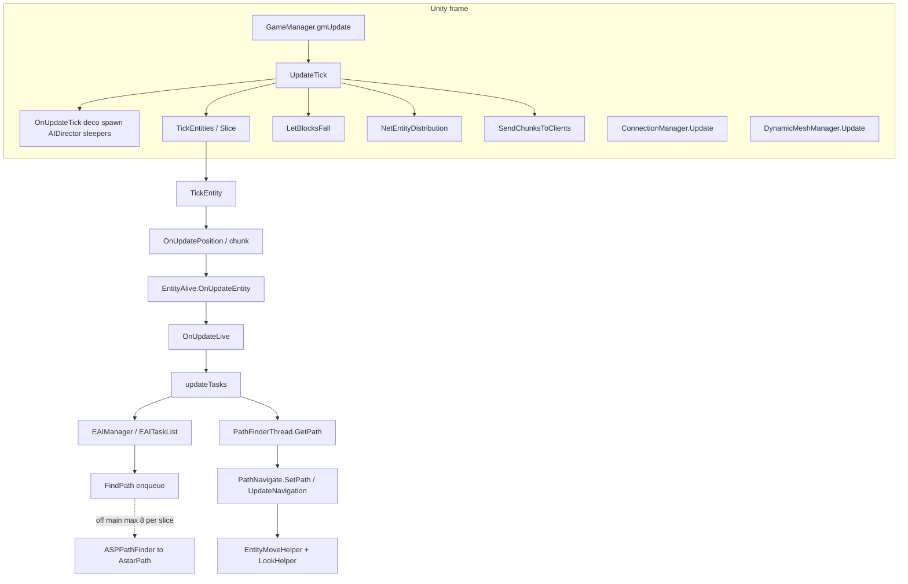
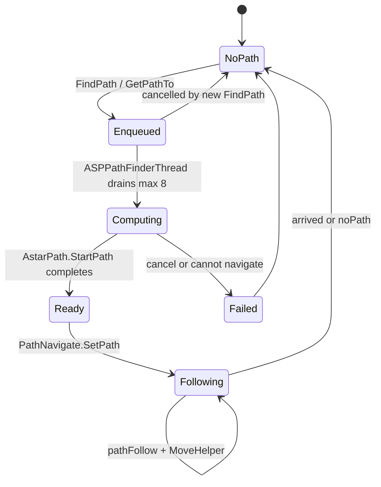
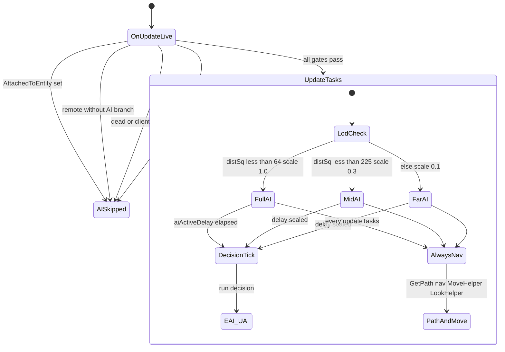

# Entity, AI, and path (dedicated V3.1.0)

**Owns:** authority entity tick chain, AI/path onion, thresholds (merged deep + deeper synthesis).  
**Loop context:** [`loop.md`](loop.md), [`loop-gmupdate.md`](loop-gmupdate.md).  
**Ceiling map:** [`engine-limitations.md`](engine-limitations.md) §4 (AI volume, path ≤8, dual paths).  
**Auto inventory:** [`inventories/deeper.md`](inventories/deeper.md).  
**Dumps:** `il/deep-v3.1.0/`, `il/deeper-v3.1.0/`.  
**Hub:** [`INDEX.md`](INDEX.md).

Do not redistribute game IL.

---

## 1. Call stack from frame to AI (authoritative)



### Path request lifecycle



---

## 2. When AI actually runs (`OnUpdateLive` → `updateTasks`)

### 2.0a `OnEntityUnload` (IL=29)

If not `EntityPlayerLocal`: `OcclusionManager.RemoveEntity`. Clear navigator path
(`SetPath(null,0)`) and null `navigator`, `lookHelper`, `moveHelper`, `seeCache`;
then base `Entity.OnEntityUnload`.

**`World.RemoveEntity(id, reason)` (IL=16):** if entity exists: `MarkToUnload` +
`unloadEntity(entity, reason)`; return entity (or null).

**`NetPackageEntityRemove.ProcessPackage` (IL=24):** log if missing; always
`RemoveEntity(entityId, reason)` (reason is u8 enum).

### 2.0 Parent chain: `OnUpdateEntity` (IL=457) then `OnUpdateLive` (IL=363)

`EntityAlive.OnUpdateEntity` (before Live):

1. Base `Entity.OnUpdateEntity`.
2. Buff cvar / `EntityBuffs.Tick`.
3. Optional weather/biome buffs via `AddBuff` / `SetCVar`.
4. **`OnUpdateLive()`**.
5. `Inventory.OnUpdate`.
6. Health/death paths: radiation / environmental `DamageEntity`, hurt sounds,
   sleeper pose, alert/random sounds, investigate clear, `OnDeathUpdate`,
   revenge target set.

`OnUpdateLive` (AI-relevant):

1. Stat regen zeroing; if not dead: `EntityStats.Tick`.
2. Attack-target net: may send `NetPackageSetAttackTarget` to tracked players.
3. `updateCurrentBlockPosAndValue`.
4. Movement / jump / headed move for non-AI branches.
5. **AI gate** then `updateTasks()` (detail below).
6. Stun clear/set via avatar controller; can-see updates; dynamic ragdoll;
   trader-area teleport check.

From `EntityAlive.OnUpdateLive` IL (gate before `updateTasks`):



Text form of the same gates: `AttachedToEntity` null, not remote (or RootMotion remote without AI), health paths, `!world.IsRemote()`, `!IsDead()`, `!IsClientControlled()`, `hasAI == true`.

Dedicated zombies: typically `hasAI`, not client-controlled, not remote → **`updateTasks` runs** when this entity is ticked by the slice.

**EfficientServer** can still skip `updateTasks` via Harmony for far non-alert (leaf patch). That is coarser than stock `aiActiveScale`.

---

## 3. `EntityAlive.updateTasks` (125 IL): the AI throttle

### 3.1 Early out: “AI disabled” pref

If `GamePrefs.GetBool(enum 46)` and entity is **not** `EntityDrone`:

- zero move forward  
- optional `EAIManager.UpdateDebugName`  
- **`ret`** (no EAI, no path follow)

### 3.2 Always (when not early-out)

1. `CheckDespawn`  
2. `seeCache.ClearIfExpired`  
3. Read `EntityClass.UseAIPackages` → choose **EAI** vs **UAI**

### 3.3 LOD gate (only covers decision AI)

```text
aiActiveDelay -= aiActiveScale
if aiActiveDelay <= 0:
    aiActiveDelay = 1.0
    if !UseAIPackages:  aiManager.Update()      // classic EAI
    else:               UAIBase.Update(context) // utility AI packages
```

| Field | Role |
|---|---|
| `aiActiveScale` | Written in `World.EntityActivityUpdate` from closest-player dist² |
| `aiActiveDelay` | Countdown; full EAI/UAI only when it hits ≤ 0 |

**Critical:** after the delay gate, **path apply + navigation + move + look always run** on every `updateTasks` invocation:

```text
pathInfo = PathFinderThread.Instance.GetPath(entityId)
if path present:
    [EAI] CheckPath(pathInfo) may reject
    navigator.SetPath(pathInfo, speed)
navigator.UpdateNavigation()
moveHelper.UpdateMoveHelper()
lookHelper.onUpdateLook()
// distraction cleanup…
```

So stock LOD **slows how often EAI tasks re-decide**, not how often an entity follows an existing path or updates move helpers when `updateTasks` is entered.

**Implication for optim:**

- Tightening `aiActiveScale` → fewer `EAIManager.Update` / path **requests** from tasks.  
- Skipping entire `updateTasks` (EfficientServer far skip) → also stops path follow / move helper for that tick (stronger than stock).  
- Path **admission** should target `EntityAlive.FindPath` / `PathFinderThread.FindPath` enqueue, not only EAI Update.

---

## 4. `aiActiveScale` bands (EntityActivityUpdate IL)

Per player, build `EntityPlayer.aiClosest` lists via `GetClosestPlayer` + sqr magnitude, sort, then:

| Condition on `aiClosestPlayerDistSq` | `aiActiveScale` | Jiggle |
|---|---|---|
| index in first `N` closest **or** dist² **&lt; 64** (~8 m) | **1.0** | On if dist² **&lt; 36** (~6 m) |
| dist² **&lt; 225** (~15 m) | **0.3** | Off |
| else | **0.1** | Off |

Also cloth sim toggles involving local player attach/distance (constants **625** / **3025** appear earlier in method for cloth radii).

Only **`World.EntityActivityUpdate` stores** `aiActiveScale`; only **`updateTasks` loads** it (plus EfficientServer patches).

---

## 5. EAI stack

### 5.1 `EAIManager.Update` (16 IL)

```text
interestDistance = FastMoveTowards(interestDistance, 10, 0.008333334)  // ease toward 10
targetTasks.OnUpdateTasks()
tasks.OnUpdateTasks()
UpdateDebugName()
```

Two task lists: **target** tasks and **general** tasks. Very thin wrapper.

### 5.1b Attack target + see cache (IL re-pin)

**`SetAttackTarget` (IL=70):** same target only refreshes `attackTargetTime`; else
stash `attackTargetLast`, set `targetAlertChanged` + random `soundDelayTicks`
5..20 when new target, clear investigate ticks; if not remote, send
`NetPackageSetAttackTarget` via `SendPacketToTrackedPlayersAndTrackedEntity`;
store target + time.

**`EntitySeeCache.ClearIfExpired` (IL=17):** every **30** ticks `Clear()` the
see cache (called from OnUpdateLive before AI).

**`IsInFrontOfMe` (IL=28):** angle between head→pos and forward vs
`GetMaxViewAngle() * 0.5` (half-angle cone).

**`CheckDespawn` (IL=198):** if `!CanUpdateEntity` and no closest player →
`MarkToUnload`. Else if `canDespawn`: every **20** ticks sample closest player;
Despawn if none within soft band / within **130** m band rules; also unload if
closest player distSq &gt; **6400** (80 m) with max timer. Called from TickEntity
when area not updateable and from OnUpdateLive paths.

**`canDespawn` (IL=14):** false if client-controlled, or spawner source == **2**
(Dynamic), or sleeping; else true (Biome/static AI may despawn).

**`Despawn` (IL=6):** `IsDespawned = true` then unload path.

**`World.unloadEntity` (IL=216):** set `unloadReason`; `EntityUnloadedDelegates`;
nav-object unregister; `OnEntityUnload`; remove from `Entities` +
`TickEntityRemove` + `EntityAlives`; `RemoveEntityFromMap`; remove from chunk if
added; if not remote, untrack vehicle/drone/turret as applicable; net remove
package fan-out (remainder of method).

**`EntityPlayer.OnUpdateLive` (IL=13):** zero stamina regen amount; base
`EntityAlive.OnUpdateLive`; **force-clear** see cache; `CheckSleeperTriggers`
(player always re-evaluates sleeper volumes).

### 5.1b `EntityAlive.updateTasks` (IL=125) and `EAIManager.Update` (IL=16)

**`updateTasks` order:**

1. If `GamePrefs` bool index **46** and entity is not `EntityDrone`: zero move
   modifiers and return (AI freeze / debug gate; only refresh debug name).
2. `CheckDespawn`; `seeCache.ClearIfExpired`.
3. `aiActiveDelay -= aiActiveScale`; when delay ≤ 0 reset to **1** and run either
   `EAIManager.Update` or `UAIBase.Update` (`UseAIPackages`).
4. `PathFinderThread.GetPath(entityId)`; if path present and EAI `CheckPath`
   (or UAI always) accepts: `navigator.SetPath`.
5. Always: `navigator.UpdateNavigation`, `moveHelper.UpdateMoveHelper`,
   `lookHelper.onUpdateLook`.
6. Clear dead/unloading `distraction` / `pendingDistraction`.

**`EAIManager.Update`:** `interestDistance = FastMoveTowards(interestDistance,
10, 0.008333334)` (~1/120 per call toward 10); then
`targetTasks.OnUpdateTasks()` then `tasks.OnUpdateTasks()`; debug name.

### 5.2 `EAITaskList.OnUpdateTasks` (137 IL)

Classic priority AI list (same shape IceCoffee tried to Parallel.ForEach):

1. Clear `startedTasks`  
2. For each entry in `allTasks`:  
   - If executing: `isBestTask` + `Continue` or remove + `Reset` + re-arm `executeTime = executeDelay * executeDelayScale`  
   - `executeTime -= 0.05`; `executeWaitTime += 0.05`  
   - If `executeTime ≤ 0`: re-arm delay; if `isBestTask` && `CanExecute` → mark start  
3. For started: `Start()`  
4. For executing: **`EAIBase.Update()`**

Mutex/priority via `isBestTask` / `areTasksCompatible` (not fully dumped here; present in type).

**0.05** is a fixed step (independent of `deltaTime` in this method), i.e. assumes ~20 Hz task list cadence when ticked.

Path requests originate inside individual `EAIBase` / UAI task `Update`/`Start` methods via `EntityAlive.FindPath`.

### 5.3 UAI package path (`UAIBase`, when `UseAIPackages`)

Entities with `EntityClass.UseAIPackages` call `UAI.UAIBase.Update(context)` on
the same LOD gate as EAI (not every tick unless `aiActiveDelay` elapsed).

**`UAIBase.Update` (IL=18):**

1. If `context.updateTimer <= 0`: set timer to static `ActionChoiceDelay`, call
   `chooseAction(context)`.
2. Always: `updateAction(context)`.
3. `updateTimer -= Time.deltaTime`.

**`chooseAction` (IL=97):**

1. Clear `ConsiderationData.EntityTargets` and `WaypointTargets`.
2. `addEntityTargetsToConsider` + `addWaypointTargetsToConsider`.
3. For each package name in `context.AIPackages` present in static
   `UAIBase.AIPackages`:
   - `score = package.DecideAction(context, out action, out target) * package.Weight`
   - Keep best score; if new action differs from current, `Stop`/`Reset` current
     task if started/initialized, then install `ActionData.Action`, `Target`,
     `TaskIndex = 0`.

**`updateAction` (IL=63):**

1. No current task -> ret.
2. If not `Initialized`: `CurrentTask.Init(context)`.
3. If not `Started`: `CurrentTask.Start(context)`.
4. If `Executing`: `CurrentTask.Update(context)` and return.
5. Else (task finished): `Reset`; advance `TaskIndex`; if past last task in
   `Action.GetTasks()`, clear `ActionData.Action`.

So UAI is a **utility-scored action chooser** on a timer, then a **linear task
list** inside the chosen action. Path requests still come from individual
`UAITaskBase` Start/Update via `FindPath`, same ASP queue as EAI.

**Concrete UAI task types in V3.1.0 b14** (only these five subclasses exist):
`MoveToTarget`, `Wander`, `AttackTargetEntity`, `AttackTargetBlock`, `FleeFromTarget`.

| Task | Start IL | Update IL | Start behaviour | Update behaviour |
|---|---:|---:|---|---|
| `UAITaskMoveToTarget` | 90 | 12 | Target as EntityAlive: path to entity with speed = walk / aggro if alert / panic if `run`; `shouldBreakWalls` into FindPath. Target as Vector3: same with walk/panic only. Else Stop. | noPathAndNotPlanningOne -> Stop |
| `UAITaskWander` | 19 | 12 | `CalcAround(self, 10, 10)` + `FindPath` at `GetMoveSpeed` | noPathAndNotPlanningOne -> Stop |
| `UAITaskAttackTargetEntity` | 53 | 71 | Convert target; look at head if `CanSee` else zero; `RotateTo` 30/30 if limbs; seed `attackTimeout = GetAttackTimeoutTicks`. Missing target -> Stop. | same look/rotate; countdown timeout; when 0: `Attack(false)` then on success reload timeout + `Attack(true)` + Stop |
| `UAITaskAttackTargetBlock` | 53 | 72 | Target must be Vector3 else Stop; seed timeout; look/rotate at block pos if `CanSee(pos)` | countdown; look/rotate; `Attack(false)` then success path same as entity attack |
| `UAITaskFleeFromTarget` | 41 | 20 | Convert target; `detachHome`; `CalcAway` with `maxFleeDistance` both min/max radii; `FindPath` at `GetMoveSpeedPanic`. Missing target -> `ActionData.Failed = true`. | no path: `setHomeArea(pos, 10)` then Stop |

All pathing still hits `EntityAlive.FindPath` -> ASP queue (same as EAI).

---

## 6. Pathfinding (production path)

### 6.1 Which implementation is live?

`AstarManager.Init` (server, non-empty world):

```text
AddComponent<AstarManager>()
new ASPPathFinderThread()     // sets PathFinderThread.Instance in ctor
StartWorkerThreads()
```

**Live type: `ASPPathFinderThread`**, not `AStarPathFinderThread`.

| Type | Worker model | FindPath |
|---|---|---|
| **ASPPathFinderThread** | `StartCoroutine(FindPaths)` on AstarManager MB | Queue entity id + `PathInfo` into dict/hashset (**no lock** in FindPath IL) |
| AStarPathFinderThread | `ThreadManager.StartThread(..., thread_Pathfinder)` + `AutoResetEvent` | Queue under **Monitor** on `finishedPaths`, pulse wait handle |
| PathFinderThread base | stubs (`ret` / null) | abstract-ish |

Both queue work off the caller; **AStar** is classic OS thread; **ASP** is Unity coroutine driver (`FindPaths` state machine). Admission still matters: unbounded enqueue under blood moon fills `entityWaitQueue` / `finishedPaths`.

### 6.2 `EntityAlive.FindPath` (49 IL)

Verified clamps before enqueue:

1. Horizontal distSq = dx*dx + dz*dz. If **&gt; 1225** (35²):
   - if dy &gt; **45**: clamp target.y to `position.y + 45`
   - if dy &lt; **-45**: clamp target.y to `position.y - 45`
2. Then:

```text
PathFinderThread.Instance.FindPath(this, target, speed, canBreak, aiTask)
```

Base `PathFinderThread.FindPath` is a **no-op** (`ret` IL=1). Production instance
is `ASPPathFinderThread` (or legacy `AStarPathFinderThread`).

### 6.3 Enqueue (`ASPPathFinderThread.FindPath`)

Single-target (IL=17) and start+target (IL=22) both:

```text
entityWaitQueue.Add(entityId)
finishedPaths[entityId] = new PathInfoSingleTarget(entity, target, canBreak, speed, aiTask)
// start+target overload also PathInfo.SetStartPos(start)
```

Same entity id **replaces** any prior `finishedPaths` entry (coalesce). Optional
`FindPath(PathInfo)` overload stores a prebuilt info (multi-target path).

`AStarPathFinderThread.FindPath` (IL=42) is the older worker-queue variant: under
`finishedPaths` lock, add to wait queue if new, set dict entry, pulse
`writerThreadWaitHandle`. Prefer documenting ASP as production
([closed-gaps.md](closed-gaps.md) path narrative).

### 6.4 Dequeue on main (`GetPath` from `updateTasks`)

```text
if finishedPaths.TryGetValue(id) && path ready:
    remove from dict
    return PathInfo
else null
```

**Worker computes** into `PathInfo`; **main applies** via `PathNavigate`.

### 6.5 Who requests paths (sample xref)

EAI: ApproachAndAttack, ApproachDistraction, ApproachSpot, DestroyArea, RunAway, Territorial, Wander, PathTest…  
UAI: FleeFromTarget, MoveToTarget, Wander…  
Also `EntityDrone.GetProjectedPath`.

---

## 7. `TickEntity` body (IL=148)

Ordered when entity spawned and not unload-marked:

1. `SetLastTickPos` / `OnUpdatePosition` / `CheckPosition`.
2. Chunk membership: if chunk coords changed, `RemoveEntityFromChunk` old +
   `AddEntityToChunk` new (via `GetChunkSync` / `toChunkXZ`).
3. If `IsChunkAreaLoaded` and `CanUpdateEntity` → **`OnUpdateEntity()`**
   (buffs/live/AI chain §2.0).
4. Else: `CheckDespawn` (and attack-target clear paths on EntityAlive).
5. If `IsMarkedForUnload` → `unloadEntity(entity, reason)`.

Falling block **entities** go through same `OnUpdateEntity` chain (`EntityFallingBlock` overrides).

### 7.1 Path apply helpers (always after decision AI in updateTasks)

| Method | IL | Behaviour |
|---|---:|---|
| `EntityLookHelper.onUpdateLook` | 32 | Damp pitch (`rotation.x`) toward 0 by **1°/tick** if \|x\| &gt; 1 |
| `ASPPathNavigate.UpdateNavigation` | 21 | if path: `pathFollow()`; then `moveHelper.SetMoveTo(path, speed, canBreak)` |
| `ASPPathNavigate.SetPath` | 46 | Destruct old path; install new; empty path fails; else `ImprovePath()`, store speed/canBreak |
| `EntityMoveHelper.UpdateMoveHelper` | **1236** | Largest common walker cost: stuck checks, jump/elevator, root-motion gates, blocked clear, moveToPos pursuit (full line-level residual) |
| `EntityAlive.GetSpeedModifier` | 3 | returns field `speedModifier` (set by AI/tasks elsewhere) |
| `EntityAlive.MoveEntityHeaded` | 292 | apply headed motion from AI/player direction |

---

## 8. `World.LetBlocksFall` (220 IL)

Called once per full `UpdateTick` after entities.

```text
if fallingBlocks queue empty: ret
if EntityFallingBlocks.Enabled: GroupFallingBlocks()  // IL=292
// process fallingGroups: CreateFallingBlockGroup (IL=107), clear hashset entries
// process fallingBlocks queue: skip if still in hashset pending group
GetBlock / TE canvas clone for signs / OnBlockStartsToFall
DynamicMeshManager.ChunkChanged
if ShowModelOnFall: EntityFactory "fallingBlock" + random motion → spawn
```

**`GroupFallingBlocks` (IL=292):** BFS from each ungrouped falling cell; 6-neighbor
expand while neighbor is falling and not terrain; group size clamped by
`GroupBounds.IsWithinSize`; enqueue finished groups.

**`CreateFallingBlockGroup` (IL=107):** snapshot block values + texture full arrays;
per pos `OnBlockStartsToFall` + `ChunkChanged(-1)`; remove from `groupedBlocks`;
if first block `ShowModelOnFall`: spawn entity class `"fallingBlocks"` at pos +
(0.5, random Y -0.1..0.1, 0.5) with arrays; `SetBlockGroupData`.

**`AddFallingBlock(pos, includeOversized)` (IL=38):** skip if already in
`fallingBlockSet`; skip child / `StabilityIgnore` / air / oversized (unless
includeOversized); `DynamicMeshManager.AddFallingBlockObserver`; enqueue +
hashset add.

**`OnBlockStartsToFall` (IL=6):** `SetBlockRPC(pos, Air)` (tree/composite
overrides may destroy/particles first).

**`EntityFallingBlock.OnUpdateEntity` (IL=344)** (group variant similar IL=302):

1. If dead: ret; else `fallTimeInTicks++`.
2. While falling (`fallTimeInTicks > 1` and velocity): bounds hit test (expand
   0/0.2/0); per entity if hits &lt; **3** and `CanCollideWith` and head below
   faller by 0.8: damage =
   `min(40, massKg * max(0, -vy) * 0.05)` * passive **164**; `DamageEntity`
   with `DamageSource.fallingBlock`; record hit count.
3. Land path (vel sq &lt; **0.0625** or timeout ~60): particle/audio; if not terrain
   and has drop event, `DropItemsOnEvent` with overallProb **1** (and sometimes
   **0.7** second pass); `SetDead`.

**Queue-driven.** Spikes when many blocks lose support (base collapse). Matches ServerTools/IceCoffee fall-to-air trade: empty the problem at `AddFallingBlock` before this method invents entities.

---

## 9. `NetEntityDistribution.OnUpdateEntities` (322 IL)

Server-only from `UpdateTick`. Heavy list/enumerator work:

- Clear working lists; partition distribution entries (`IntHashMap` by entity id) into enemies vs players
- Optional prioritization (`enableNetworkdPrioritization`): airborne enemies get
  `priorityLevel` from nearest-player distSq bands (**25** / **324** / **625**)
  with a **16384** (128^2) view-cone gate; see [network.md](network.md) section 2.1
- Per entry: `updatePlayerList` (motion package state machine, IL=509)
- Per player × entry: `updatePlayerEntity` (interest enter → spawn packet)

Encode: pos `*32+0.5`, rot `*256/360` (network.md). Cost scales with
**players × tracked entities**. Separate from LiteNetLib
`ConnectionManager.Update` package pump.

---

## 10. World systems (sizes)

| Method | IL | Notes |
|---|---:|---|
| `WorldBlockTicker.Tick` | 20 | If not remote: `tickScheduled` + `tickRandom(activeChunks)` |
| `AIDirector.Tick` | 6 | `ComponentsTick` + `DebugTick` |
| `World.TickSleeperVolumes` | 34 | Iterates sleeper volumes |
| `SleeperVolume.Tick` | **137** | MinScript, UpdateSpawn, respawn map, player touch, Despawn |
| `DecoManager.UpdateTick` | **330** | Significant always-on world work before server gate |
| `PowerManager.Update` | 106 | From gmUpdate manager chain |
| `VehicleManager.Update` | **297** | Waypoints etc. |
| `DroneManager.Update` | **305** | Waypoints |
| `TurretTracker.Update` | 45 | |

Deco (330) + vehicle/drone managers are non-trivial even with few players.

---

## 11. Per-entity / per-frame cost model (structure)

Per **ticked** AI entity roughly:

```text
TickEntity fixed overhead (position, chunks)
+ OnUpdateEntity (buffs, inventory hooks, sounds…)
+ OnUpdateLive (stats, movement)
+ updateTasks:
    every time: GetPath + nav + move + look
    every 1/aiActiveScale-ish EAI ticks: full EAITaskList ×2 + possible FindPath enqueue
```

Per **frame** additionally:

```text
gmUpdate manager fan-out (power, vehicles, drones, twitch, …)
+ UpdateTick world (deco 330 IL method, block walk @20, sleepers, block ticker)
+ LetBlocksFall if queue non-empty
+ NetEntityDistribution (player×entity interest)
+ ConnectionManager + DynamicMeshManager peer Updates
+ path workers/coroutines draining queue
```

---

## 12. Interception points and path-queue RE notes

Where a patcher/clone could hook, and what stock already does there, is a
structural fact; which of these is worth a lever (and its measured payoff/risk) is
optimizer-owned: see [`../../7dtd-optimizer/docs/OPTIMIZATION_CANDIDATES.md`](../../7dtd-optimizer/docs/OPTIMIZATION_CANDIDATES.md)
and [`../../7dtd-optimizer/docs/SIM_PARALLELISM.md`](../../7dtd-optimizer/docs/SIM_PARALLELISM.md).

RE facts relevant to any such hook:

**Path queue:** `finishedPaths[entityId] = …` means a repeated FindPath for the same
entity **replaces** pending work (natural coalesce by id). Many distinct entities
each requesting once per EAI pulse still all enqueue.

**ASP vs AStar:** production uses **ASP + coroutine** (`ASPPathFinderThread`). Do not
assume `ThreadManager` path workers unless RE shows AStar installed (mods/old
versions).

---

## 13. IceCoffee parallel EAI vs stock

Stock `EAITaskList.OnUpdateTasks` is exactly the serial loop IceCoffee wrapped in `Parallel.ForEach`. Confirmed structure: shared `executingTasks`, `isBestTask`, `Continue`/`CanExecute`/`Start`/`Update`. Parallelizing this without pure tasks + locks was correctly abandoned open-source.

---

## 14. See also

| Doc | Why |
|---|---|
| [loop.md](loop.md) | Frame / UpdateTick context |
| [closed-gaps.md](closed-gaps.md) | Timer, path ASP, net bands |
| [aidirector.md](aidirector.md) | Component inventory |
| [network.md](network.md) | Entity replication cost |
| [measured-scaling.md](../../7dtd-optimizer/docs/measured-scaling.md) | Live AI vs player exponents |

Graded optim candidates + APM probe list: [`../../7dtd-optimizer/docs/OPTIMIZATION_CANDIDATES.md`](../../7dtd-optimizer/docs/OPTIMIZATION_CANDIDATES.md).

## 15. Regenerate

```bash
cd tools && ./build.sh
mono bin/legacy/DumpDeep.exe "$DS/7DaysToDieServer_Data/Managed/Assembly-CSharp.dll" \
  ../il/deep-v3.1.0
```

Also keep [`../il/loop-complete-v3.1.0/`](../il/loop-complete-v3.1.0) for frame-level dump.

---

## Deeper synthesis (thresholds and scale)

Companion detail formerly in entity-ai. Raw auto: [`inventories/deeper.md`](inventories/deeper.md).


## D1. Per-entity cost onion (when a zombie is ticked)

```text
TickEntity
  OnUpdatePosition (EntityAlive override 107 IL)
  chunk membership
  OnUpdateEntity (417)           // buffs, inventory tick, sounds, death, → OnUpdateLive
    OnUpdateLive (363)           // stats, attack target net, move, gates → updateTasks
      updateTasks (125)
        [gate] aiActiveDelay / scale → EAI or UAI decision
        [always] GetPath + nav + MoveHelper + LookHelper
          ASPPathNavigate.UpdateNavigation → pathFollow (160 IL)
          EntityMoveHelper.UpdateMoveHelper (1236 IL)  ★ largest common AI cost
```

**Interpretation:** for any entity that enters `updateTasks`, the dominant pure-size hotspot is **MoveHelper**, then path follow, then (less often) full EAI. Stock LOD only reduces EAI frequency.

### Entity type outliers (updateTasks / live)

| Type | Method | IL | Note |
|---|---|---:|---|
| **EntityVulture** | updateTasks | **1344** | Flying special case; own world |
| EntityMoveHelper | UpdateMoveHelper | **1236** | Shared by walkers |
| EntityFallingBlock | OnUpdateEntity | 344 | Collapse path |
| EntityFallingBlocks | OnUpdateEntity | 302 | Group fall |
| EntityTrader | OnUpdateLive | 315 | NPC |
| EntityTurret | OnUpdateEntity | 414 | TE-like entity |
| EntityDrone | updateTasks | 139 | Drone AI |
| EntityEnemyAnimal | updateTasks | 26 | thin override |
| EntityBandit | updateTasks | 12 | thin |
| EntityVehicle | updateTasks | 1 | nop-ish |
| EntityZombieDog | OnUpdateLive | 16 | thin |

Most zombies use **base** `EntityAlive` paths (not a fat zombie-specific updateTasks).

---

## D2. EAI task cost ranking (method size)

Top decision tasks (when EAI Update runs):

| IL | Method | Role |
|---:|---|---|
| **846** | `EAIApproachAndAttackTarget.Update` | Primary chase/attack; home/eat; **3× FindPath** (phases below) |
| 317 | `EAIDestroyArea.Continue` | Destroy |
| 281 | `EAISetNearestEntityAsTarget.FindTarget` | See-distance; player noise/breadcrumb 15/24 m; bounds +4 `GetEntitiesInBounds` |
| 184 | `FindTargetPlayer` | Player targeting |
| 172 | `GetMoveToLocation` | Approach helper |
| 166 | `EAIRunawayFromEntity.FindEnemy` | Flee scan |
| 137 | `EAITaskList.OnUpdateTasks` | Scheduler |
| 118 | `EAIBreakBlock.AttackBlock` | Ally boost +0.2/zombie in 1.7 box; Attack + hitDelegate; delay ~15-40 ticks |
| **107** | `EAIRangedAttackTarget.Update` | +0.05 time; look/SeekYaw 30; anim state then `UseHoldingItem` |
| **105** | `EAIRunAway.Update` | path end distSq **1.21** re-pick; pathTicks **60** FindPath; panic speed subclasses |
| **94** | `EAIWander.CanExecute` | sleep/stun/lookTime; no-player 120 ticks; executePercent; CalcInDir 90 |
| **70** | `EAIApproachAndAttackTarget.CanExecute` | sleep/stun/jump-swim; targetClasses + chaseTimeMax |
| **60** | `EAIDestroyArea.Update` | state 6 Attack + hitDelegate |
| **40** | `EAIApproachSpot.Update` | pathCounter 20..40 |
| **27** | `EAIDodge.Update` | look at head if in front |
| **21** | `EAIBreakBlock.Update` | attackDelay then AttackBlock |
| **7** | `EAIWander.Update` / `EAILeap.Update` | thin |

**`EAIApproachAndAttackTarget.Update` (IL=846) phases:**

1. **Home return** (`isGoingHome`): near home (planar sq &lt; 0.16, |dy| &lt; 2)
   snap + `ResumeSleeperPose`; else FindPath home at aggro*0.8, pathCounter 60;
   `homeTimeout -= 0.05` then give-up + clear attack target.
2. **Null target:** abort.
3. **Relocate:** focus moveHelper; target pos/vel EMA 0.7/0.3 (eat uses belly).
4. **Attack/eat timeout:** RotateTo 8/5; on 0: rand delay 10..35; eat path
   DamageEntity **35** + impulse.
5. **Chase:** GetMoveToLocation + FindPath; CanSee head look; moveHelper;
   eat sets `IsEating`.

UAI package path also present (`UAIBase`, considerations, MoveToTarget, etc.).

**Combat path pressure:** ApproachAndAttack alone can enqueue **multiple** FindPaths per EAI pulse per zombie. Admission at `EntityAlive.FindPath` catches all of them.

---

## D3. Documented thresholds (from IL constants)

### D3.1 AI LOD (`EntityActivityUpdate`)

| Constant | Meaning (research interpretation) |
|---|---|
| dist² **64** (~8 m) | Full `aiActiveScale = 1.0` band |
| dist² **225** (~15 m) | Mid band → scale **0.3** |
| else | Far → scale **0.1** |
| dist² **36** (~6 m) | Jiggle on |
| dist² **625** / **3025** | Cloth sim radii (~25 m / ~55 m) |
| ints **20**, **60**, **4** | Related to `aiClosest` list sizing / FastClamp (player-count aware) |

### D3.2 Path request (`EntityAlive.FindPath`)

| Constant | Meaning |
|---|---|
| xz dist² **1225** (~35 m) | Below: skip vertical clamp; **still always enqueues** path |
| **±45** m Y | Clamp target height when far horizontally |

### D3.3 EAI timing

| Constant | Where | Meaning |
|---|---|---|
| **0.05** | `EAITaskList.OnUpdateTasks` | Per-task countdown step when list is updated |
| **1.0** | `updateTasks` | Reset `aiActiveDelay` after EAI/UAI runs |
| **10** / **0.008333334** | `EAIManager.Update` | `interestDistance` ease toward 10 |

### D3.4 Path follow (`ASPPathNavigate.pathFollow`, 160 IL)

Floats seen: **0.04, 0.15, 0.2, 0.33, 0.49, 0.6, 0.7, 0.9, 2** (waypoint / progress thresholds; exact semantics need line-level read of dump).

### D3.5 Net interest (`NetEntityDistributionEntry.updatePlayerList`)

| Constant | Likely role (hypothesis from encode context) |
|---|---|
| **0.04** | Small threshold (velocity/zero compare area) |
| **2**, **16** | Distance bands for package choice |
| **128 / 192 / 256** | Encoded pos/rot quantize ranges |
| Package set | RelPosAndRot, PosAndRot, Teleport, Rotation, Velocity, AliveFlags, PlayerStats, TwitchStats, Equipment |

### D3.6 Spawn (`SpawnUpdate`)

Full cycle narrative: [spawning.md](spawning.md) §2 (IL=441). Re-pin numbers:

| Gate / band | Value |
|---|---|
| `AIDirector.CanSpawn` probe | **1.0** f (enemy path) |
| Blood moon | demotes enemy request to animals-only |
| Player overlap rect | player pos **-40**, size **80x80** vs area rect |
| Enemy placement ring | **28..54** m to players |
| Animal placement ring | **48..70** m to players |
| Anti-stack box | **4 x 2.5 x 4** around spawn pos |
| Groups scanned | `min(5, groupCount)` from random start |
| GameStats / Prefs | int ids **13** and **129** in cap path (see spawning.md) |

### D3.7 Path worker budget (critical)

**Re-pinned V3.1.0 b14** (`DumpMethod` filter `FindPaths>d__8` / `MoveNext`, IL=87).

`GamePath.ASPPathFinderThread/<FindPaths>d__8.MoveNext`:

```text
// state 0 entry:
counter = 0
while counter < 8:                    // IL_00C0..00C2: ldloc.2; ldc.i4.8; blt
  if entityWaitQueue.list.Count == 0: break
  id = entityWaitQueue.list[0]        // FIFO head (index 0), not priority
  entityWaitQueue.Remove(id)
  if !finishedPaths.TryGetValue(id, out pathInfo):
    Log.Warning("{0} path dup id {1}", frameCount, id)
  else:
    pathInfo.entity.navigator.GetPathTo(pathInfo)
    if pathInfo.state == 0: finishedPaths.Remove(id)
  counter++
yield return null                     // <>1__state = 1; next resume loops again
// state 1: reset to state -1 and jump back to counter=0 loop
```

| Fact | Evidence |
|---|---|
| Drain cap | **`ldc.i4.8`** only bound; no distance/priority sort in this method |
| Queue order | **FIFO** via `list[0]` + `HashSetList.Remove` |
| Coalesce | Enqueue path (elsewhere) keys `finishedPaths` by entityId; drain pops wait list |
| Yield | After ≤8 starts, coroutine yields; infinite outer loop |

### D3.8 Investigate position (scout / noise)

| Method | IL | Behaviour |
|---|---:|---|
| `SetInvestigatePosition(pos, ticks, isAlert)` | 10 | store `investigatePos`, `investigatePositionTicks`, `isInvestigateAlert` |
| `get_HasInvestigatePosition` | 5 | `investigatePositionTicks > 0` |
| `ClearInvestigatePosition` | 28 | zero pos/ticks; `ResetDespawnTime`; `SetAlertTicks(Random(20,35)*20)` (entityType 2 zombie halves that) |

Scout path uses ticks **2000** / **6000** (see [aidirector.md](aidirector.md)).

**Production pathfinder drains ≤ 8 path computations per coroutine slice**, then yields.  
Under blood moon, queue depth grows; main still enqueues unbounded FindPaths.  
**Admission on enqueue complements this fixed drain of 8.** There is **no** priority
queue in the drain: combat pathing is preserved only if admission prefixes keep
alert/attack enqueues (or the wait list happens to still hold them when FIFO reaches them).

---

## D4. MoveHelper anatomy (why 1236 IL matters)

Call breakdown themes:

- Stuck detection / `ResetStuckCheck`  
- **Jump** (`StartJump` ×4 sites)  
- **Dig** (`DigStart`, `DigUpdate`)  
- Blocked clearing  
- Attack from move helper (`EntityAlive.Attack` ×2)  
- Angle lerp, sin/cos, random (9× RandomFloat)  
- Sleeping/stun/ragdoll early-outs  

This is full **locomotion + dig + combat assist**, not a thin “apply velocity.”  
Any far entity still running `updateTasks` pays this. Far skip of updateTasks avoids it entirely.

---

## D5. Path system fields (ASP vs AStar)

Both concrete types share:

- `entityWaitQueue` : `HashSetList<int>`  
- `finishedPaths` : `Dictionary<int, PathInfo>`  

ASP also: `coroutine`  
AStar also: `threadInfo`, `writerThreadWaitHandle`  

**Init installs ASP only** (`AstarManager.Init` → `new ASPPathFinderThread` + `StartCoroutine`).

---

## D6. GameTimer (authoritative ticks)

`updateTimer(bool _bServerIsStopped)` (**IL=74**):

- If stopped (gmUpdate idle when no players): `Reset(ticks)` and return.
- Else: `dtMs = ElapsedMilliseconds - lastMillis`;
  `elapsedTicksD += (timeScale * dtMs / 1000) * ticksPerSecond`;
  `elapsedTicks = (int)elapsedTicksD`; fractional remainder kept in
  `elapsedPartialTicks` / `elapsedTicksD`; `ticks += elapsedTicks`;
  `ticksSincePlayfieldLoaded += elapsedTicks`.

`UpdateTick` uses game timer readiness (`elapsedTicks > 0`) to choose **slice-only**
vs **full tick**. Partial ticks feed entity partials.

**`EntityEnemyAnimal.updateTasks` (IL=26):** if electrocuted, zero move + disable
animator and return; else re-enable animator and call base `updateTasks`.

---

## D7. Spatial query surface (optim relevance)

### GetClosestPlayer callers (few but hot)

- `World.EntityActivityUpdate` (primary scale path)  
- `EntityAlive.CheckDespawn`  
- Vulture, AIDirector scouts, quests  

### GetEntitiesInBounds callers (many)

Push physics, turrets, traps, EAI target find, break block, falling entities, spawn, UAI considerations, traders, items distraction, horde spawner, …

**Density cost:** combat + traps + spawn all pile on bounds queries independent of AI LOD.

---

## D8. Falling / sleeper / deco (world systems)

| System | Notes |
|---|---|
| AddFallingBlock | Dedupe hashset, mesh observer, enqueue |
| GroupFallingBlocks | 292 IL |
| LetBlocksFall | Spawn falling entities |
| SleeperVolume.Tick | MinScript, UpdateSpawn, Despawn, player touch (detail below) |
| DecoManager.UpdateTick | Locked lists, Add/Remove deco, starts `UpdateDecorationsCo` |
| WaterSplashCubes | 185 IL always on OnUpdateTick |

### D8.1 `SleeperVolume.Tick` (IL=137, closed 2026-08-07)

Driven from `World.TickSleeperVolumes` each OnUpdateTick. Ordered phases from live IL:

1. **If `isSpawning`:**
   - If `minScript` present and `IsRunning`: walk `respawnMap`; if any key is
     **not** in `pendingSpawnMap` and `GetEntity` is **null** (entity gone),
     clear `respawnMap` + `respawnList` + `groupCountList`, zero `numSpawned`,
     `minScript.Restart()` (wave reset when a mapped sleeper vanished mid-wave).
   - Then `minScript.Tick(this)` when minScript non-null.
   - **Spawn budget:** call `UpdateSpawn` only while static `TickSpawnCount < 2`
     (at most two volume spawn attempts share this global counter per frame
     window; exact reset site is `TickSleeperVolumes` residual).
2. **If still `isSpawning` after that:** return (no touch / despawn work while
   spawning).
3. **Else if `isSpawned`:** if `respawnMap` empty, clear `isSpawned`; else walk
   map and clear `isSpawned` when any non-pending mapped entity is missing.
4. **Player touch:** if `playerTouchedToUpdate != null`, `UpdatePlayerTouched` then
   clear field and **return** (skips despawn same tick).
5. **Despawn timer:** `ticksUntilDespawn--`; when it reaches 0, `Despawn(world)`.

### D8.1b `World.TickSleeperVolumes` (IL=34)

Under `Monitor` on `World.sleeperVolumes`: set static `SleeperVolume.TickSpawnCount = 0`,
then `Tick(world)` every volume value. That is the per-frame reset for the
`TickSpawnCount < 2` gate inside each volume's spawning branch.

### D8.2 `UpdateSpawn` (IL=516)

Per-call spawn pacing and entity create:

1. Decrement `spawnDelay`; when it hits 0 set delay to **2** and continue only if
   `AIDirector.CanSpawn(2.1f)` and game-stat enemy cap (`GameStats.GetInt` index 12)
   allows more.
2. **Respawn list first:** pop last id from `respawnList`; if still pending or live,
   skip; else resolve `RespawnData` (spawnPointIndex + className), `FindSpawnIndex`
   / `CheckSpawnPos`, `EntityClass.FromString`; if enemy and `!EnemySpawnMode`, drop
   from map; else `Spawn(world, entityClassId, spawnPointIndex, BlockSleeper)` and
   remove from `respawnMap` on success. At most **one** spawn attempt per tick path
   before returning in the respawn branch.
3. **Fresh group path:** if `groupCountList` / `spawnsAvailable` remain, pick group
   via `GameStageGroup.TryGet` (fallback name `GroupGenericZombie`), allocate spawn
   points, same `Spawn` helper. `minScript.IsRunning` can force a spawn-allowed flag
   for scripted waves.

**`CheckSpawnPos` (IL=26):** always true when recording/playback; else require a live
chunk that is not internal-culled, not `NeedsCopying`, not `NeedsRegeneration`.

**`FindSpawnIndex` (IL=68):** if `spawnsAvailable` empty, `ResetSpawnsAvailable`;
pick random start index; walk candidates requiring
`World.CanSleeperSpawnAtPos(pos, true)` **and** `SpawnPointIsHidden`; on success
remove from available and return index; if none, `FindFathestSpawnFromPlayers`
(typo in stock method name).

### D8.2b `OnTriggered` (IL=14)

`triggerState = flags & 7`; store `playerTouchedTrigger`; call
`UpdatePlayerTouched(world, player)` (same entry as touch latch).

### D8.3 `UpdatePlayerTouched` (IL=172)

Called once when a player is latched on the volume:

1. If already `isSpawned` and `worldTime` still before `respawnTime` and not
   `wasCleared`: no full reset (still-active volume).
2. Else if `worldTime >= respawnTime` (or cleared): `Reset()`, `CancelPendingSpawns()`,
   clear `isSpawning` / `isSpawned` flags as appropriate, then rebuild.
3. Difficulty: `gameStage = max(GetGameStageAround(player), prefab quest multiplier
   / DifficultyTier path)`; quest `SpawnMultiplier` and prefab refresh tags apply.
4. Build `respawnList` from existing `respawnMap` keys; `ResetSpawnsAvailable()`;
   clear `groupCountList`; set `spawnCountMin/Max` from volume fields; `AddSpawnCount`;
   set `spawnDelay`; start `minScript` if present; mark `isSpawning`.

### D8.4 `Despawn` (IL=48) / `DespawnAndReset` (IL=6)

`Despawn`:

1. `triggerState = 1` (enum), clear `playerTouchedTrigger`.
2. `CompletePendingSpawns()`.
3. For each `respawnMap` entity: if `EntityAlive` still exists **and** `IsSleeping`,
   set `IsDespawned = true` and `MarkToUnload()` (awake entities are left alone).

`DespawnAndReset` = `Despawn` + `Reset()`.

Related S2C packages (wakeup / pose / passive): [protocol-packages.md](protocol-packages.md)
§6.19. Volume graph itself is prefab/world data, not a NetPackage stream.

---

## D9. Manager chain sizes (gmUpdate every frame if instance)

| Manager | Update IL |
|---|---:|
| DroneManager | 305 |
| VehicleManager | 297 |
| QuestEventManager | 127 |
| PowerManager | 106 |
| TurretTracker | 45 |
| FactionManager | 43 |
| GameEventManager.Update | 25 (+ larger Handle* helpers) |

---

## D10. Dynamic mesh server

`DynamicMeshServer.Update` (452): concurrent queues, client count, `NetPackageDynamicMesh`, send, connection map. Separate from entity AI; competes for main frame with gmUpdate peer order.

---

## D11. Chunk load determination

`DetermineChunksToLoad` (448): bucket hash sets, locks, union/except chunk key sets, unload, free chunk GOs. Driven by player positions / view. Ops lever: view distance. Harmony rare.

---

## D12. Optim ideas derived here

Graded candidates and experiment order live in the optimizer project (not under `docs/` or `il/`):  
[`../../7dtd-optimizer/docs/OPTIMIZATION_CANDIDATES.md`](../../7dtd-optimizer/docs/OPTIMIZATION_CANDIDATES.md)

---

## D13. APM / loadgen scenarios to pair with dumps

| Scenario | Expect stacks |
|---|---|
| Blood moon pile | MoveHelper, ApproachAndAttack, FindPath, path queue, EAITaskList |
| Spread players, quiet AI | DetermineChunksToLoad, SendChunks, deco, mesh |
| Base collapse / explosive | LetBlocksFall, GroupFalling, FallingBlock OnUpdateEntity |
| Many turrets/traps | GetEntitiesInBounds from controllers |
| Many vehicles/drones | VehicleManager / DroneManager Update |
| Empty server | updateTimer idle Reset path; reduced chunk work |

---

## D14. File map in this dump

- `inventories/deeper.md`, auto narrative + lists  
- `*_il.txt` / `*_calls.md`, per-method  
- this file  
- Parent index: [`INDEX.md`](INDEX.md)  

Regenerate: `tools/legacy/DumpDeeper.cs` (build via [`../tools/`](../tools/)).

---

## Addendum (2026-07-21): server-side zombie animators

`EModelBase.Init` strips animators on dedicated (`AvatarControllerDummy` + disabled
Animators) ONLY for entities without `RootMotion || HasRagdoll` - all zombies have
both, so every server zombie runs a real `AvatarZombieController` with enabled
animators at `AlwaysAnimate` (plus a forced `SetVisible(true)`). Gameplay reads the
animator three ways (root-motion displacement into `Entity.motion`, attack-cadence
tag-hash in `IsAnimationAttackPlaying`, stun state), so the strip cannot simply be
extended (any mitigation, e.g. animator LOD, is an optimizer lever, not stock RE).
Engine-side cost hides in unsymbolized UnityPlayer.so CPU (~22% all-thread at heavy
load; sized via the optimizer's `es animoff/animon` diagnostic).
Zombie anim params are never netsynced (`SyncAnimParameters` is player-only) -
clients animate zombies locally.

**Measured (2026-07-21):** the animator slice is **19.9 ms/frame (28% of the loaded
frame) at ~380 endgame zombies** (24 players, `es animoff` A/B). At 64 players the
frame is additionally WAIT-bound: the main thread is only ~52% busy at 166 ms
frames (~550 voluntary switch-outs/s = engine job-fence ping-pong), and disabling
animators sends it to 95% busy - the animation jobs' FENCES, not just their
compute, dominate the 64p engine mass. GC stop-the-world is exonerated (179 ms per
120 s window). Lever status (which mitigations help, and when) is optimizer-owned:
see [`../../7dtd-optimizer/docs/RESULTS.md`](../../7dtd-optimizer/docs/RESULTS.md) §3m-3o.

**Per-zombie tick cost, fully attributed (2026-07-21, 8p + ~224z):** OnUpdateLive
is 22.1 us/zombie/tick (vs 36 at 64p - the delta is player-linked fence share):
**MoveEntityHeaded (movement + collision integration) 54%**, updateTasks (EAI +
path follow) 27%, CanSee 6%, block-pos 6%, stats 4%. The largest single piece is the
collision/movement integration. At 8 players there is NO CPU ceiling: frame pinned at 50 ms through ~250
standing zombies (93.7% headroom); the horde caps at spawn equilibrium (exploder
chains), not the server. See RESULTS §3q.

---

## Addendum (2026-07-23): root-motion delivery + the enabled-toggle wedge

Measured live (`es animstate` probe, optimizer RESULTS 3s):

- **Server zombie locomotion is root-motion-driven.** The chain is
  `AvatarRootMotion.OnAnimatorMove` (MonoBehaviour beside the Animator) ->
  `AvatarController.NotifyAnimatorMove` -> `EntityAlive.NotifyRootMotion`
  (`accumulatedRootMotion += animator.deltaPosition`). With the animator dead a
  zombie only shuffles on the supplementary displacement path.
- **`Animator.enabled` off->on permanently kills the delta on these rigs.** The
  state machine resumes (state hash advances, `applyRootMotion=true`, forwarder
  enabled) but `deltaPosition` reads 0.0000 forever (healthy: 0.17-0.28 per
  eval). `Rebind()` + re-pushing one-shot params (`SetAlive`,
  `SetWalkType`/`TurnIntoCrawler`) does not revive it.
- **One-shot animator params:** `WalkType` (per-class 1-8) and `IsAlive` are
  written at spawn only; the AI rewrites `MovementState` continuously. `Rebind`
  wipes all of them; only the one-shots stay wrong afterward.
- **Culling correction:** live healthy zombies sit at `cullingMode =
  CullUpdateTransforms` (the earlier "forced AlwaysAnimate" note is not the
  steady state), and the wight class runs `applyRootMotion=false` entirely.
- **Spawn init (IL, V3.1.0 b14):** `BodyAnimator.initBodyAnimator` stores
  `defaultCullingMode = ldc.i4.0` (**Unity `AnimatorCullingMode.AlwaysAnimate`**)
  and grabs the child `Animator` from `BodyParts.BodyObj`. That is the **stored
  default field**, not proof of the live runtime mode. Three call sites write
  `Animator.set_cullingMode` (Xref): `AvatarController.ResetAnimations`,
  `BodyAnimator.set_RagdollActive`, `EModelBase.StartRagdoll`. Steady-state
  `CullUpdateTransforms` is therefore applied on a **later** path (ragdoll/
  reset/runtime), consistent with live `es animstate` probes. EfficientServer
  CullCompletely enter/exit must save/restore the **live** `animator.cullingMode`,
  not assume AlwaysAnimate from `defaultCullingMode` alone.
- **Corpses stay in `world.Entities.list`** with death-disabled animators -
  any naive animator sweep must skip `IsDead()` entities or dead bodies pose
  back upright as statues.

---

## Focus + target-selection leaves

Small leaf types orbiting the EAI stack, reversed from IL. The `AIFocus*`
structs live in per-priority arrays inside the generic holder `AIFocus<T>`
(`FocusTargets[]` indexed by `FocusPriority`: Highest=0, Gameplay, Move,
Default); the Get methods scan from index 0, so the highest-priority live
entry wins.

- **`AIFocusAim`** (struct in `AIFocus<AIFocusAim>`): resolves a world-space
  **aim point**. `GetActiveFocus` walks the priority slots, skips entries whose
  `Target` is gone or whose distance condition fires, and returns the target's
  belly/chest/head position (or raw `position`) per its `AIAimFocusOffset`
  switch. Consumed only by `EntityBandit` (`GetAimTarget`, `GetHeadLookTarget`,
  `updateTasks`).
- **`AIFocusBody`** (struct in `AIFocus<AIFocusBody>`): resolves a **body yaw**
  (float). `TryGetValue` returns a fixed `TargetYaw` if set, else
  `EntityAlive.YawForTarget(TargetYawEntity)`; `GetActiveFocus` runs the same
  priority scan. Consumed by `EntityBandit.CalcStrafeYawOffset`, set by the
  debug task `EAIPathTest`.
- **`AIFocusConditionDistance`** (struct embedded in both focus entries): an
  expiry condition. `IsFocusDisabled` returns true when the entity is farther
  from the anchor (stored `Vector3`, entity, or `Transform`) than
  `ConditionalDistanceSq` (ctors square the passed distance); 0 disables the
  check, and a dead anchor never disables.
- **`EAIBlockingTargetTask`** (EAIBase, `MutexBits=1`, 16 IL total): a no-op
  latch in the target-task list; `CanExecute`/`Continue` just return its
  `canExecute` field. `EAIApproachAndAttackTarget.Update` sets it true when the
  chase gives up (`homeTimeout` expiry: attack target cleared, give-up sound)
  and false when the target damages the entity again. While latched it holds
  the mutex above `SetNearestEntityAsTarget` (stock lists slot it at
  `AITarget-2`, and `AITarget-3` or a pipe-separated task list on others),
  suppressing instant re-acquisition during the walk home.
- **`EAISetNearestEntityAsTargetSorter`** (`IComparer<Entity>`, 22 IL):
  `Compare` orders candidates ascending by `GetDistanceSq` from the owner, so
  index 0 is nearest. Built in `EAISetNearestEntityAsTarget.Init`,
  `EAISetNearestCorpseAsTarget.Init`, and `EntityVulture.SetSleeper`.

Server relevance: the latch task and the sorter run for every stock
zombie/animal (`entityclasses.xml` wires `BlockingTargetTask` +
`SetNearestEntityAsTarget` into the AITarget lists). The `AIFocus*` trio is
bandit-only (plus `EAIPathTest`), so like UAI ([`uai.md`](uai.md) §9) it is
live code but dormant in stock content; NPC mods exercise it.

---

## Entity net packages (extras)

Also on the wire (see [protocol-packages.md](protocol-packages.md) section 6.21):
`NetPackageEntityRemove`, `NetPackageEntityPhysics`, `NetPackageEntityAttach`,
`NetPackageEntityRagdoll`, `NetPackageEntityCollect`, `NetPackageSetAttackTarget`,
`NetPackageOwnedEntitySync`, `NetPackageEntitySpeeds`, `NetPackageEntityStealth`.


## Activation / grab (V3.1.0)

`EntityAlive.InitLocalActivationCommands` registers `"grab"` / `"hand"` on the
base class (moved up from rabbit-only, which is where V3.0.1 had it). Full held-entity feature:
[items.md](items.md) (held-entity item types).

## Changelog

- **2026-08-07:** AddFallingBlock gates; OnBlockStartsToFall air; FallingBlock
  crush damage mass*vy cap 40 + passive 164; land drop events.
- **2026-08-07:** OnEntityUnload clear path helpers; RemoveEntity MarkToUnload;
  EntityRemove Process; Investigate pos set/clear.
- **2026-08-07:** updateTasks GamePrefs 46 freeze; EAIManager interestDistance
  toward 10; GroupFallingBlocks BFS + CreateFallingBlockGroup spawn.
- **2026-08-07:** EAI leaf re-pins: BreakBlock ally +0.2, RunAway 1.21/pathTicks
  60, Wander 120 ticks, Ranged UseHoldingItem, FindTarget bounds +4.
- **2026-08-07:** EAIApproachAndAttackTarget Update phases (home/relocate/eat/
  chase, FindPath x3, CanExecute gates).
- **2026-08-07:** Full UAI task table (5 concrete types) Start+Update IL for
  Move/Wander/AttackEntity/AttackBlock/Flee.
- **2026-08-07:** Sleeper TickSpawnCount budget + TickSleeperVolumes reset;
  CheckSpawnPos / FindSpawnIndex; Tick phase entity-gone restart correction.
- **2026-08-07:** GameTimer.updateTimer formula; EnemyAnimal electrocute gate;
  canDespawn/unload; CheckDespawn; player OnUpdateLive; EAI leaves.
- **2026-08-07:** OnUpdateEntity IL=457 / OnUpdateLive IL=363 ordered phases;
  UAI task leaves MoveToTarget/Wander/AttackTargetEntity; UAIBase package path.
- **2026-08-07:** SleeperVolume UpdateSpawn/Despawn/UpdatePlayerTouched IL phases;
  Tick phase order (MinScript / UpdateSpawn / player touch / despawn timer).
- **2026-08-07:** Re-pin ASP `<FindPaths>d__8.MoveNext` (FIFO `list[0]`, hard `ldc.i4.8`, no priority); BodyAnimator `defaultCullingMode=AlwaysAnimate` vs live CullUpdateTransforms note.
- **2026-08-02:** V3.1.0 grab activation on EntityAlive base.

- **2026-07-28:** FindPath distSq 1225 / Y ±45 clamps; ASP enqueue coalesce; base FindPath no-op.

- **2026-07-24:** Focus + target-selection leaf narration (`AIFocus*` structs, `EAIBlockingTargetTask` give-up latch, nearest-entity sorter).
- **2026-07-23:** Root-motion delivery chain + enabled-toggle wedge addendum.
- **2026-07-16:** Link opt-scan candidates.
- **2026-07-16:** Deep dump: updateTasks LOD vs always-on nav; EAITaskList; ASPPathFinderThread production path; LetBlocksFall; NetEntityDistribution; manager IL sizes; optim hook table.
- **2026-07-16:** Initial deeper synthesis: onion costs, EAI rank, thresholds, path drain 8, MoveHelper themes, net packages, scenarios.
