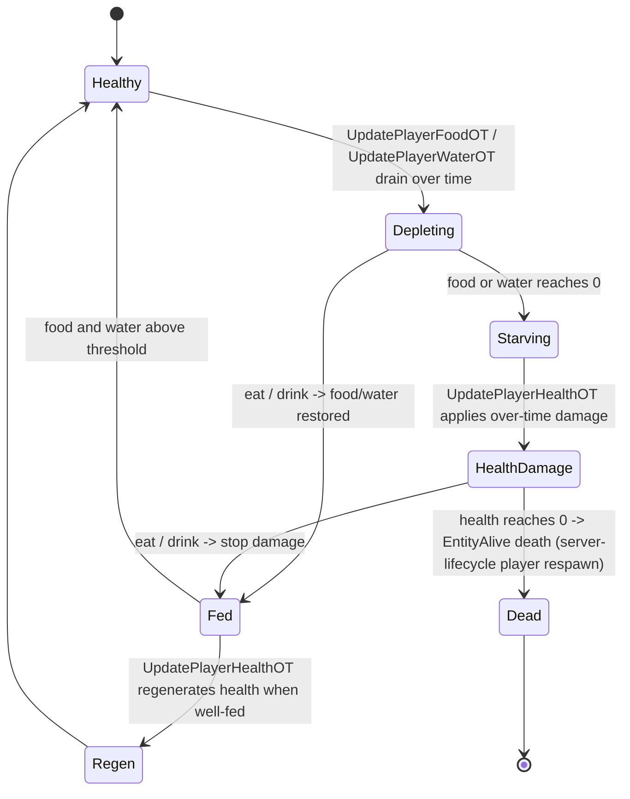

# Entity and survival stats (dedicated V3.1.0)

**Owns:** the stat container and survival tick: `EntityStats` (base entity stats +
`Tick`), `PlayerEntityStats` (food / water / stamina / health over-time), and how
depletion drives damage.
**Not:** the felt-temperature / weather-survival cvar path (that is
[weather-environment.md](weather-environment.md)); the individual stat XML content;
the HUD (client).
**Evidence:** `EntityStats`, `PlayerEntityStats` IL (dump locally with
`tools/src/DumpMethod`, git-ignored). **Hub:** [`INDEX.md`](INDEX.md).
**Method:** [`re-methodology.md`](re-methodology.md).

Health, stamina, food, and water are simulated on the authoritative server entity,
so the survival loop is a per-tick dedicated codepath.

---

## 1. Model

| Type | Role |
|---|---|
| `EntityStats` | Base container on every `EntityAlive`: health and the core stats, `Tick(worldTime)` / `TickWait`, `Read`/`Write`, `UpdateSandboxOptions` (difficulty scaling) |
| `PlayerEntityStats` | Player extension adding the survival stats and their over-time updates (food, water, stamina, health regen) |

`EntityStats.Tick` runs on the server entity each sim step; `TickWait` handles the
throttled (per-`worldTime`) updates. Stats persist with the entity/player profile
([server-lifecycle.md](server-lifecycle.md)) and net-sync to the owning client.

`EntityStats.SimpleClone` (IL=7) copies only `Health`; the
`PlayerEntityStats.SimpleClone` (IL=26) override additionally copies `Stamina`,
`Water`, `Food`, and the `CoreTemp` float. Base `ResetStats` (IL=1) is an
empty virtual (subclass overrides do the work).

### 1.1 `EntityStats.Tick` / `TickWait` phase machine (IL re-pin 2026-08-07)

**`Stat.set_Value(value)` (IL=19):** no-op when unchanged; else clamp
`m_value = FastClamp(value, 0, ModifiedMax)` and
`SetChangedFlag(old, new)` (the change flag that phase 2/5 of `TickWait`
consumes). Entity setters are one-line forwards: `EntityAlive.set_Health(int)`
(IL=7) / `set_Stamina` / `set_Water` (IL=6) call
`Stats.<Stat>.set_Value(...)`.

**Max getters:** `Stat.get_ModifiedMax()` (IL=6) = `m_baseMax + m_maxModifier`;
`get_ModifiedMaxPercent()` (IL=7) = `clamp01(ModifiedMax / Max)`.
`EntityAlive.GetMaxHealth()` (IL=6) = `(int) Stats.Health.get_Max()`.

**`Stat.Tick(dt)` (IL=301)** - the per-phase stat step (`Health.Tick` in
phase 1):

1. `MaxPassive` set → `BaseMax = EffectManager.GetValue(MaxPassive, ...,
   m_originalBaseMax, ...)`.
2. Health/Stamina only, when `|value - lastValue| >= 1`: gain (`value >
   lastValue`, `GainPassive`) → `value = clamp(lastValue + GetValue(GainPassive),
   0, BaseMax)`; loss (`value < lastValue`, `LossPassive`) →
   `value = clamp(lastValue - GetValue(LossPassive), 0, BaseMax)`.
3. **Regen:** cap `regenAmount` so `value + regenAmount <= ModifiedMax`;
   `RegenerationAmountUI = (value - lastValue) + regenAmount/dt`;
   `value += regenAmount`.
4. When `regenAmount > 0`, food/water drain by the gained amount: Stamina
   uses `WaterLossPerStaminaPointGained (127)` and
   `FoodLossPerStaminaPointGained (119)`; Health/others use
   `WaterLossPerHealthPointGained (126)` and
   `FoodLossPerHealthPointGained (120)` (each
   `RegenerationAmount -= regenAmount * GetValue(passive, ...)`).
5. `regenAmount = value - lastValue`; `SetChangedFlag(value, lastValue)`;
   `lastValue = value`.

**`Stat.SetChangedFlag(new, old)` (IL=15):** `m_changed ||= Fastfloor(new) !=
Fastfloor(old)` (a stat is "changed" once it crosses an integer boundary or
was already flagged).

**`Tick` (IL=27):** if entity remote **or** dead, return. Else `waitTicks++`; when
`waitTicks >= 10`, reset to 0. Always call `TickWait(worldTime)`.

**Base `TickWait` (IL=75)** uses `waitTicks` as a 10-phase round-robin (dt=0.5):

| waitTicks | Work |
|---:|---|
| 1 | `UpdateNPCStatsOverTime(0.5)` + `Health.Tick(0.5)` |
| 2 | if `Health.Changed` -> `SendStatChangePacket(Health)` + clear |
| 6 | net-sync wait: every 10 outer cycles, server sends
  `NetPackageEntityStatsBuff` flags **192**; client `SendToServer` |
| other | no-op in base |

**`PlayerEntityStats.TickWait` (IL=133)** expands the phases:

| waitTicks | Work |
|---:|---|
| 1 | `UpdateWeatherStats(0.5, worldTime, IsGodMode)` |
| 2 | `UpdatePlayerFoodOT` + `UpdatePlayerWaterOT` |
| 3 | `UpdatePlayerHealthOT` |
| 4 | `UpdatePlayerStaminaOT` |
| 5 | send changed Health/Stamina/Water/Food packets (`EnumStat` 0/1/8/7) |
| 6 | same `NetPackageEntityStatsBuff` cadence as base |

---

## 2. Survival over-time loop (state machine)

`PlayerEntityStats.TickWait` fans into the per-stat over-time methods:
`UpdatePlayerFoodOT`, `UpdatePlayerWaterOT`, `UpdatePlayerStaminaOT`,
`UpdatePlayerHealthOT`, and `UpdateWeatherStats` (temperature, detailed in
[weather-environment.md](weather-environment.md)). Food and water deplete with
time and activity; when they bottom out, health takes over-time damage; when the
player is fed and hydrated, health regenerates.

- **Stamina** (`UpdatePlayerStaminaOT`): drains on exertion (sprint, attack,
  mining) and regenerates when idle; gates actions that require stamina.
- **Food / water** (`UpdatePlayer{Food,Water}OT`): deplete on a timer plus activity;
  consumables (via [items.md](items.md) / [buffs.md](buffs.md)) restore them.
- **Health** (`UpdatePlayerHealthOT`): regenerates when fed/hydrated, takes damage
  when starving/dehydrated; also the target of combat and environmental damage.
- **Temperature / weather survival:** `UpdateWeatherStats` computes felt
  temperature; the survival-cvar to buff path is documented in
  [weather-environment.md](weather-environment.md).

`UpdateNPCStatsOverTime` is the lighter non-player path (zombies/animals get the
base `EntityStats` tick without the full survival set).

---

## 3. Client / server split (honest)

The **authoritative stat values** (health, and the survival totals that gate death
and damage) live on the server entity and are net-synced. Some **felt-value
computation** (felt temperature, and the survival cvars weather turns into buffs)
runs on the owning client and is fed back, as documented in
[weather-environment.md](weather-environment.md); several felt-temperature helper
getters are stubbed on this dedicated build (see that doc). This doc owns the
server-side stat container and the food/water/stamina/health over-time model.

---

## 4. Dedicated relevance and residuals

- **Per-tick dedicated path:** every player's survival stats tick on the server;
  starvation damage and death are server-authoritative.
- **Residual / content:** the felt-temperature getters stubbed on the dedicated
  binary (weather doc); stat definitions and consumable effects are XML content;
  the HUD is client.

---

## 5. Network sync (verified)

| Package | Role |
|---|---|
| `NetPackageEntityStatChanged` | single stat value/baseMax/maxModifier + instigator |
| `NetPackageEntityStatsBuff` | full `EntityBuffs` blob for one entity |
| `NetPackagePlayerStats` | `EntityNetworkStats` snapshot (NED dirty path) |

Wire bodies: [protocol-packages.md](protocol-packages.md) section 6.16. Server
rebroadcasts stats/buffs/playerstats with bulk flags **192** after accept.

Persisted blob: `EntityStats.Write` (IL=8) writes version **11** (int32) then
`Health`; `PlayerEntityStats.Write` (IL=27) appends `Stamina`, `Water`,
`Food` (each `Stat.Write`) and `CoreTemp` as `sbyte(CoreTemp / 2)`.
Each `Stat` record (`Stat.Write` IL=24 / `Read` IL=32) is version **6** with
`m_value`, `m_maxModifier`, `m_baseMax`, `m_originalBaseMax`,
`m_originalValue` (floats); reads at version <= 5 discard a legacy float.

### 5.1 `NetPackageEntityStatChanged.ProcessPackage` (IL=88)

1. Null world return; skip when target is primary player **and** instigator equals
   target (self echo).
2. `ValidEntityIdForSender(instigatorId, false)` else return.
3. Resolve `EntityAlive`; `GetStat(entity, m_enumStat)` then set `BaseMax`,
   `MaxModifier`, `Value`; clear `Changed`.
4. If entity is **local** and `m_enumStat == 0` (Health): set MinEventContext.Other
   from instigator and `FireEvent(type 9)`.
5. If world not remote: rebroadcast `Setup(entity, instigator, enumStat)` via
   `SendPacketToTrackedPlayersAndTrackedEntity` with exclude-self flag =
   `(enumStat != 0)` (health rebroadcast includes self trackers differently).

### 5.2 `NetPackageEntityStatsBuff.ProcessPackage` (IL=76)

1. Resolve entity; if **remote** entity: pool stream from `data` bytes and
   `EntityBuffs.Read(reader)` (client apply of full buff blob).
2. If **server**: rebroadcast `Setup(entity, data)` via `ConnectionManager.SendPackage`
   to all except entity owner (`entityId` as exclude), flags **192**.

## Related docs

| Doc | Role |
|---|---|
| [weather-environment.md](weather-environment.md) | Temperature / weather-survival cvar to buff path |
| [buffs.md](buffs.md) | Buffs that modify stats and apply survival effects |
| [items.md](items.md) | Consumables that restore food/water/health |
| [entity-ai.md](entity-ai.md) | The entity update that ticks stats |
| [server-lifecycle.md](server-lifecycle.md) | Stats persisted with the profile; death/respawn |

## Changelog

- **2026-08-07:** EntityStatChanged Process IL=88 (self-echo skip, Health FireEvent
  9, rebroadcast); EntityStatsBuff Process IL=76 (remote Buffs.Read + server 192).
- **2026-08-07:** EntityStats/PlayerEntityStats waitTicks phase tables (Tick IL=27,
  TickWait base 75 / player 133).
- **2026-07-28:** Stat/buff/playerstats network package pointers.

- **2026-07-23:** Initial entity/survival stats reversal (EntityStats tick, food/water/stamina/health over-time, client/server split) with state machine.
