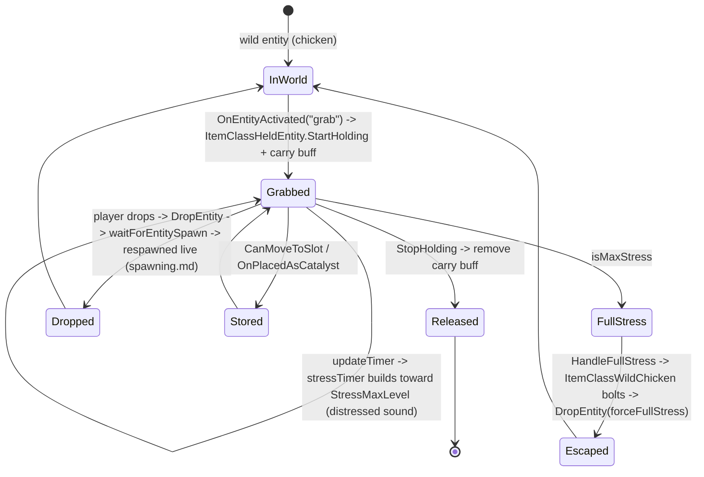

# Experimental build delta (vs V3.0.1) - **SHIPPED as V3.1.0**

**Owns:** the reverse-engineered diff between **V3.0.1 (b4)** and what became
stable **V3.1.0 (b14) Henpocalypse**: wire, new/changed/removed managed code, enums.
**Not:** a re-narration of unchanged systems (their own docs); client-only new UI.
**Evidence:** parity + census + method-level + enum diff (when experimental), then
re-verified on the live V3.1.0 dedicated `Assembly-CSharp.dll` (2026-08-02).
**Hub:** [`INDEX.md`](INDEX.md). **Method:** [`re-methodology.md`](re-methodology.md) §5b.

**Status (2026-08-02):** the former `latest_experimental` surface **shipped as
stable V3.1.0**. Live census matches this doc (types **4414**, SaveLoad IL **926**,
gmUpdate still **631**, 193 wire packages). Version pin: Major=3 Minor=10 Build=14
-> display `V 3.1.0 (b14)`. Official notes:
https://7daystodie.com/v3-1-0-henpocalypse-release-notes/

This file remains the **delta narrative** (3.0.1 -> 3.1.0). Day-to-day stock RE
docs are retargeted to V3.1.0 as current.


---

## 1. How this was diffed (four lenses)

```bash
tools/parity/fetch_version.sh latest_experimental exp    # steamcmd pull + ParitySurface
tools/parity/parity_diff.py parity_v3.0.1.json parity_exp.json   # 1) package wire diff
mono bin/Census.exe "$EXP_ASM"                           # 2) census delta
mono MethodList.exe <asm> out; comm ...                  # 3) per-method signature diff
mono EnumList.exe   <asm> out; comm ...                  # 4) enum member diff
```

**Census delta:** types 4401 -> **4414** (net +13), methods-with-body 43901 ->
**44094** (net +193). Filtered to non-compiler/non-Burst types: ~105 new methods on
existing types and **29 removed** (the remainder of the net is on new types and
compiler-generated code, so the filtered counts do not sum to the net +193). Most
raw "new types" are Burst-job trampolines and compiler closures (ignored). The real
changes are below. **`WorldState.SaveLoad(Stream)` also grew 884 -> 926 IL** (a
save-format change in exp; re-check the save layout in
[save-region.md](save-region.md) when it ships).

---

## 2. Wire change: `NetPackageTileEntity` (only package changed)

Tile-entity replication now carries the block id and a wider payload length.

| Field | V3.0.1 | Experimental |
|---|---|---|
| handle | u8 | u8 |
| teWorldPos | Vector3i | Vector3i |
| **teBlockId** | (absent) | **i32 (new)** |
| payload length | **u16** (`conv.u2`) | **i32** (`conv.i4`) |
| payload | ms bytes | ms bytes |

New fields: `Int32 MaxPackageSize`, `Int32 teBlockId`. A client/clone must read
`teBlockId:i32` then an `i32` length (not `u16`), so tile-entity data can exceed
64 KB. No packages added/removed; no package-wire enum changed. Complements
[tile-entities-power.md](tile-entities-power.md) + [protocol-packages.md](protocol-packages.md).

---

## 3. New feature: "grab" activation and held entities

The headline gameplay change. Entities can now be **grabbed by hand** and carried as
an item; the first content is a catchable wild chicken (the "Henpocalypse").

### 3.1 Activation-command refactor (base class change)

The entity activation-command system moved **up from `EntityAnimalRabbit` to the
`EntityAlive` base** (the rabbit **lost** these methods; they are now inherited by
every entity):

- `EntityAlive.InitLocalActivationCommands` registers commands (the new `"grab"` /
  `"hand"` command), `AllowActivationCommand(ReadOnlySpan, player)` gates it,
  `GetActivationText` is the prompt, `OnEntityActivated(cmd, player)` performs it.
- New **distressed** state: `EntityAlive.ClearDistressed` / `GetSoundDistressed`
  back the held-entity stress feedback.

So "grab any entity" is now a first-class `EntityAlive` capability, not a
rabbit-specific hack.

### 3.2 Held-entity item types

New: `ItemClassHeldEntity` (base `ItemClass`), `ItemClassWildChicken`,
`ItemStackGrid` (2D `ItemStack` grid), `IsHeldItem` (a MinEvent
`TargetedCompareRequirementBase`). `ItemClass` gained `CanMoveToLocation` /
`CanMoveToSlot` / `MaxCount` for held-item slot rules.



`EntitlementSetEnum` inserted `HenpocalypseCosmetic=17` (renumbering the Twitch
cosmetics +1) and `TwitchWatcherCosmetic=20`, confirming the chicken content theme.

---

## 4. cvar SetCustomVar signature (minor)

**Correction:** `CVarOperation` (0 set, 1 setvalue, 2 add, 3 subtract, 4 multiply,
5 divide, 6 percentadd, 7 percentsubtract) and the `CVarOperation _operation`
parameter on `EntityBuffs.SetCustomVar` **already exist in stable V3.0.1** (they are
not new). The only experimental change here is a **new trailing parameter**:
`SetCustomVar(name, value, netSync, CVarOperation, `**`bool _forceSendToClients`**`)`
(IL 126 -> 130), a net-sync control flag. Arithmetic cvar operations are a stock
feature ([buffs.md](buffs.md), [minevents.md](minevents.md)), not an exp addition.

---

## 5. Analytics / telemetry expansion (server-side)

A new player-join analytics event is emitted from the server:

- `Services.Analytics.Events.PlayerJoinServerEventData` (new, 32 methods, 15 fields):
  `ServerId`, `SaveId`, `ServerJoinTimestamp`, `OnlinePlayers`, `ServerJoinSource`,
  `LocalMods`, `HasModifiedXML`, `ElapsedPlayerTime`, `ElapsedWorldSaveTime`,
  `InGameDays`, `CharacterLevel`, `TotalDeaths`, `PersonalGameStage{Modified,Unmodified}`.
- `HeartbeatEventData` (new, periodic heartbeat), `TruncateStringSerializerConverter`,
  and `Helper` in the same namespace.
- `ConnectionManager` gained `LastJoinSource` (get/set); `GameManager` gained
  `LogPlayerJoinServerEventAnalyticsCoroutine` (fires the event on join, tying into
  the [server-lifecycle.md](server-lifecycle.md) / [protocol.md](protocol.md) join
  path). This is telemetry, so a private-server operator should note it; the
  transport is the platform analytics service (residual).

---

## 6. Other changed managed code

| Change | Note |
|---|---|
| `EnumGamePrefs` + `DiscordMuteDmNotifications=315` (`Last` 315 -> 316) | New pref; Discord DM mute |
| new enum `ELogType` { LogOnly=0, Console=1, RemoteConsole=2 } | Log routing for the new command |
| `ConsoleCmdLogEnvironment` (new command) + `ConsoleCmdGetSandboxOptions` changes | [console-commands.md](console-commands.md) registry |
| `Platform.EOS.SessionsClient.matchesFilters(GameServerInfo, filters)` | EOS server-list matchmaking filter (join/browse) |
| `SandboxOptionManager.GetOptionNameValueDictionaryFromPreset(preset)` | Sandbox option presets |
| `EntityGroups.GetRandomEntityFromGroupMaxTier(...)`, `NormalizeWorkingList` | Spawn-group max-tier selection ([spawning.md](spawning.md)) |
| `EntityAnimalRabbit` removed `AllowActivationCommand`/`OnEntityActivated`/`GetActivationText`/`InitLocalActivationCommands` | Moved to `EntityAlive` base (see §3.1) |
| `BiomeSpawnEntityGroupData` ctor signature changed; `BlockShapeNew.CreateMeshFromMeshFilter` removed | Minor refactors (mesh removal is client) |

Full added/removed method lists were computed with the per-method signature diff
(lens 3); the rows above are the dedicated-relevant, non-compiler-noise entries.

---

## 7. Dedicated relevance and residuals

- **Dedicated-relevant:** the `NetPackageTileEntity` wire change, the grab/held-entity
  server logic (drop respawns a live entity), the `SetCustomVar` +forceSendToClients param, the
  join-telemetry event, `EnumGamePrefs`/`ELogType` additions, EOS session filters,
  sandbox presets, and spawn-group max-tier.
- **Residual / client:** held-entity/item-grid UI (`XUiC_*`); Burst-job and compiler
  types; the analytics transport (platform service); mesh-filter removal.
- **Provisional:** re-run the parity + method + enum diff after each experimental push.

---

## Related docs

| Doc | Role |
|---|---|
| [tile-entities-power.md](tile-entities-power.md) | TE model behind the changed package |
| [items.md](items.md) | ItemClass base extended by held entities |
| [buffs.md](buffs.md) / [minevents.md](minevents.md) | cvar operations |
| [spawning.md](spawning.md) | Drop respawns the entity; spawn-group max-tier |
| [server-lifecycle.md](server-lifecycle.md) | Join path that fires the analytics event |
| [re-methodology.md](re-methodology.md) | §5b cross-version parity method |

## Changelog

- **2026-08-02:** Promoted from provisional experimental to **shipped V3.1.0 (b14)**; live census re-check.

- **2026-07-23:** Full V3.0.1 -> experimental delta via four diff lenses (wire, census, per-method signature, enum): NetPackageTileEntity wire widening; grab/held-entity feature (activation-command refactor to EntityAlive + chicken); SetCustomVar +forceSendToClients param; WorldState.SaveLoad 884->926; player-join analytics; GamePrefs/ELogType/entitlement enum changes; EOS session filters. With state machine.
