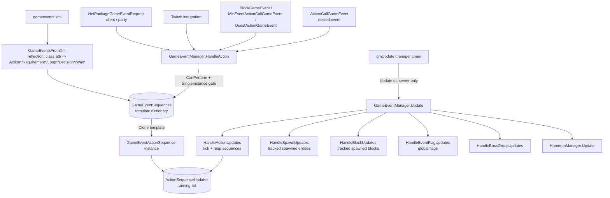
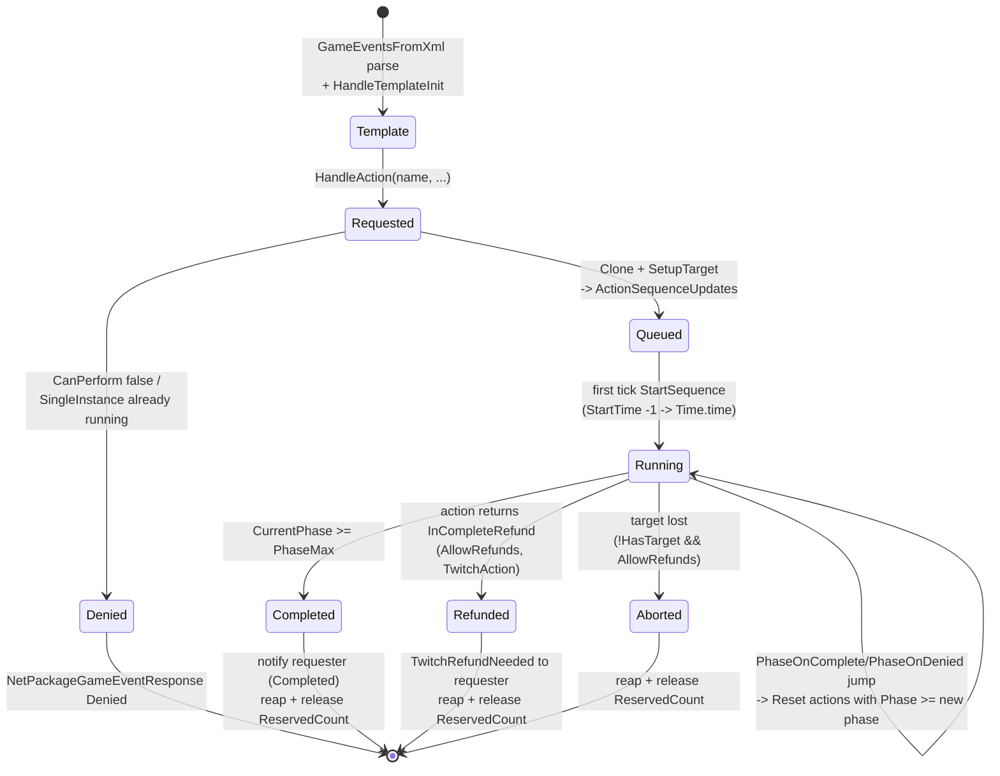
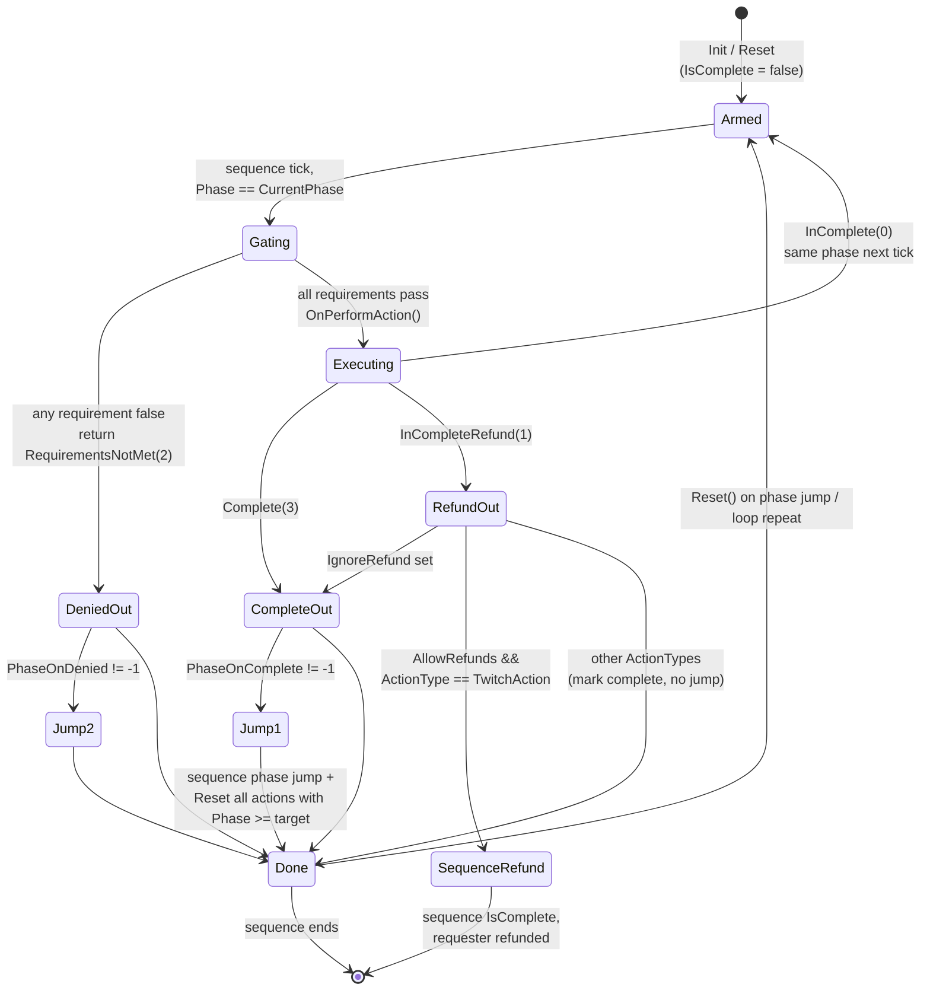
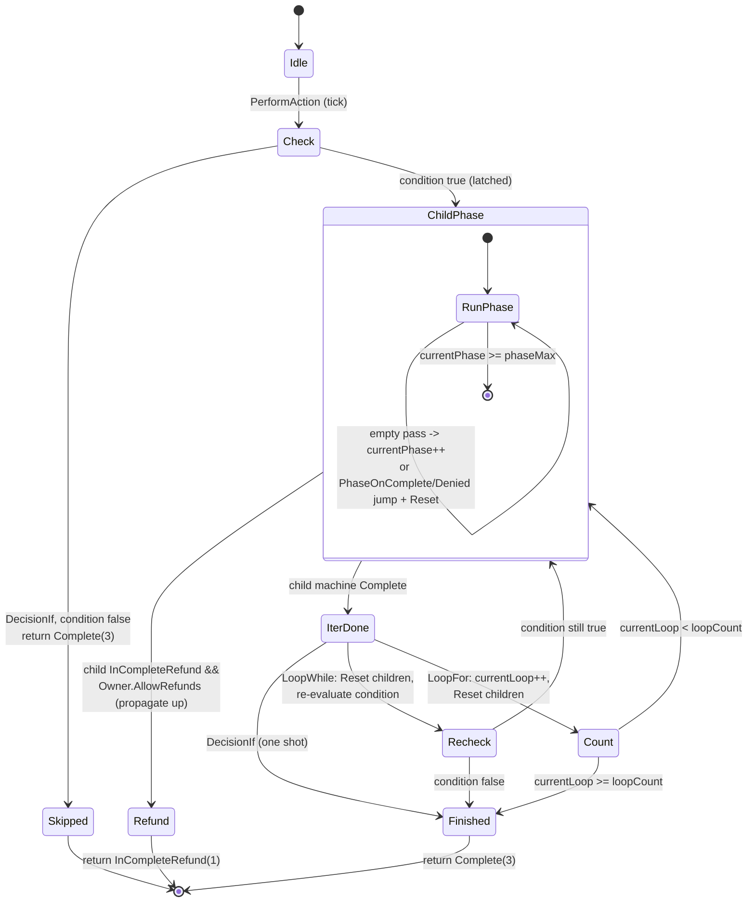
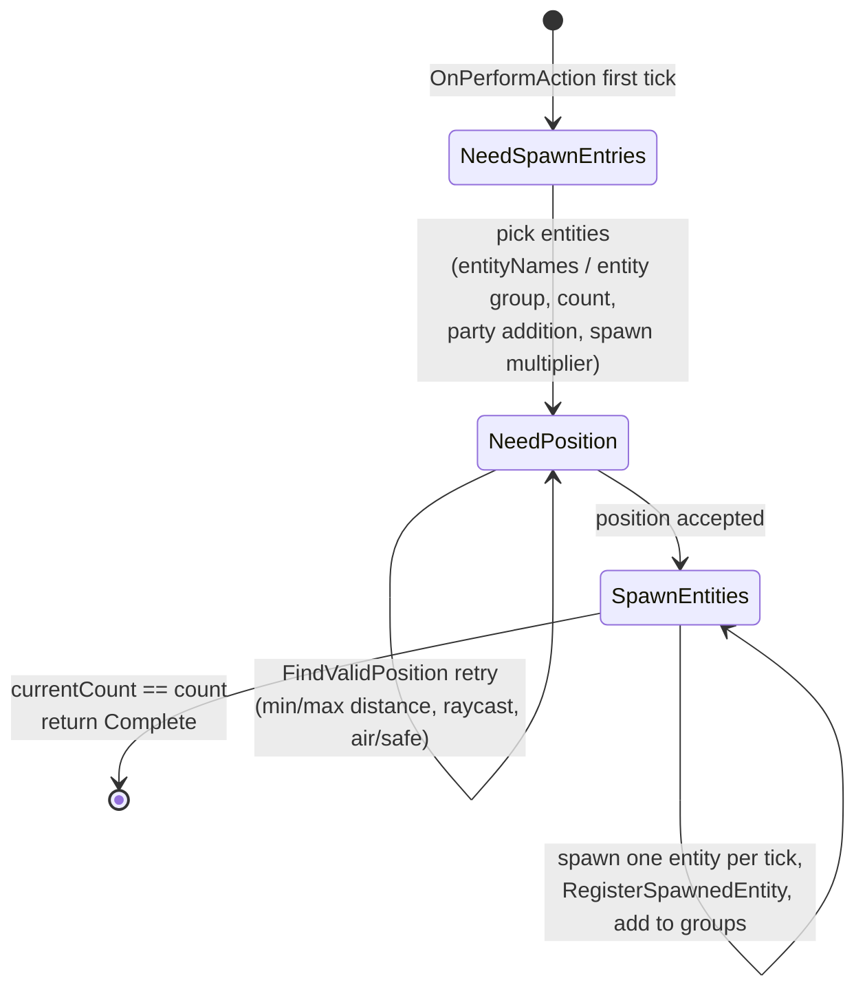
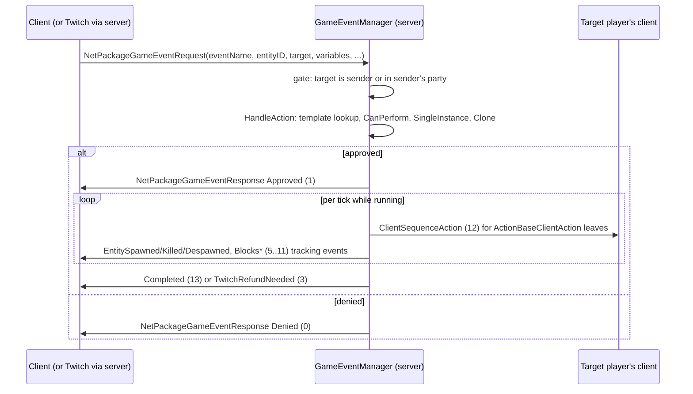

# GameEvent sequence framework (dedicated V3.1.0)

**Owns:** the `GameEvent.*` surface, the server-side scripted-event engine that
runs XML-defined action sequences against players and the world: the
`GameEventManager` driver, the `GameEventActionSequence` phase machine, the
action / requirement / decision / loop contracts, and the net plumbing that
requests, approves, and mirrors events to clients.
**Not:** the XML event definitions themselves (`gameevents.xml` is content, not
IL); the Twitch chat service that fires many of these events (external); the
quest and challenge systems that merely trigger events.
**Evidence:** `GameEvent.*` IL (179 types / 1014 method bodies across five
namespaces, plus the top-level `GameEventManager`, `GameEventActionSequence`,
`GameEventsFromXml`, `GameEventVariables` drivers, 127 more bodies; ~187
`GameEvent` rows in the type surface). Dump locally with
`tools/src/DumpAll GameEvent` + `DumpMethod GameEventManager ""` (git-ignored).
**Hub:** [`INDEX.md`](INDEX.md). **Method:** [`re-methodology.md`](re-methodology.md).

This is the most explicitly state-machine-shaped system in the assembly: a tree
of little interpreters (sequence -> phases -> actions, with decisions and loops
as actions that contain their own phase machines), ticked once per frame from
the main server loop ([`loop-gmupdate.md`](loop-gmupdate.md), manager chain).

---

## 1. Architecture

Five namespaces plus four top-level driver types:

| Namespace / type | Types | Role |
|---|---:|---|
| `GameEventManager` (top-level) | 1 (+nested) | Singleton driver: template registry, running-sequence list, spawn/block/flag/boss bookkeeping, net event fan-out |
| `GameEventActionSequence` (top-level) | 1 | One event: requirement list + action list run as a phase machine |
| `GameEventsFromXml`, `GameEventVariables` (top-level) | 2 | XML -> template parser; runtime variable store |
| `GameEvent.SequenceActions` | 132 | `BaseAction` + concrete verbs (spawn, teleport, items, blocks, UI, ...) |
| `GameEvent.SequenceRequirements` | 39 | `BaseRequirement` + 37 boolean gates |
| `GameEvent.SequenceDecisions` | 2 | `BaseDecision`, `DecisionIf` (conditional block) |
| `GameEvent.SequenceLoops` | 3 | `BaseLoop`, `LoopFor`, `LoopWhile` |
| `GameEvent.GameEventHelpers` | 3 | `HomerunManager` mini-game (boss "homerun" mode) |

`GameEventsFromXml` parses `<action|requirement|loop|wait|decision|variable|property>`
children of each event element, resolving the `class` attribute by reflection
against fixed prefixes (`GameEvent.SequenceActions.Action*`, `...Wait*`,
`GameEvent.SequenceRequirements.Requirement*`, `GameEvent.SequenceLoops.Loop*`,
`GameEvent.SequenceDecisions.Decision*`), supports a `template` attribute for
inheritance, and finishes each template with `HandleTemplateInit()` (variable
substitution into `DynamicProperties`, then `ParseProperties` + `Init` on every
node). Parsed templates land in the static
`Dictionary<string, GameEventActionSequence> GameEventManager.GameEventSequences`.



`GameEventManager.Update(deltaTime)` is a hard no-op unless
`ConnectionManager.IsServer` and `GameManager.World` is non-null: the whole
engine runs server-side; clients only see mirrored effects.

---

## 2. Sequence lifecycle (state machine)

Creation is `GameEventManager.HandleAction(name, requester, target, ...)`.
The IL shows, in order: a comma-separated `name` fans out into one call per
event; on a client the call becomes a `NetPackageGameEventRequest` to the
server (`HandleActionClient`); on the server the template is looked up, any
passed `variables` are written into the template's `EventVariables` store,
`CanPerform(target)` is evaluated (all sequence requirements AND every action's
`CanPerform`, e.g. the spawn budget in §6), `SingleInstance` templates are
denied while a same-name sequence is running, and finally the template is
`Clone()`d, given `Target` / `TargetPosition` / requester context (inherited
from an `OwnerSequence` when a sequence-link or nested call created it), and
appended to `ActionSequenceUpdates`.

**`StartSequence(manager)` (IL=4):** only `StartTime = Time.time` (manager arg
unused in body).

Each tick, `HandleActionUpdates` runs `StartSequence` once (the `StartTime`
sentinel is `-1`; the first tick stamps `Time.time`), then `Update()`, inside a
try/catch that logs `Exception while updating action sequence <name>` and
rethrows. A reverse-order reap pass then aborts sequences whose target vanished
(`!HasTarget() && AllowRefunds`) and removes every `IsComplete` sequence,
returning its `ReservedSpawnCount` to the manager's `ReservedCount` budget.

`HasTarget()` is per `TargetTypes` (`Entity`=0, `POI`=1, `Block`=2): a live (or
`AllowWhileDead`) target entity, a nonzero `POIPosition`, or the recorded
`blockValue` still present in the world.



The phase machine inside `Update()` (287 IL) works like this:

1. Scan all actions; only those with `Phase == CurrentPhase` and not
   `IsComplete` are touched. `PhaseMax` was computed in `Init()` as the highest
   declared phase + 1.
2. Each touched action gets `PerformAction()` (unless the 60-second
   inactivity-refund timer fired: `AllowRefunds && RefundInactivity &&
   Time.time - StartTime > 60` forces the `InCompleteRefund` outcome without
   running the action).
3. The returned `ActionCompleteStates` drives completion and phase jumps (§3).
4. If the pass touched nothing, `CurrentPhase++` (empty phases fall through).
   If an action requested a jump, `CurrentPhase = jump target` and every action
   with `Phase >= new phase` is `Reset()` so a backward jump re-runs them.
5. `CurrentPhase >= PhaseMax` marks the sequence `IsComplete` and notifies the
   requester: a local player via `HandleGameEventCompleted`, a remote one via
   `NetPackageGameEventResponse` `Completed` (13).

---

## 3. Action lifecycle (state machine)

`BaseAction` is the single node contract. Fields that matter: `Phase` (which
phase it belongs to), `PhaseOnComplete` / `PhaseOnDenied` (jump targets, `-1` =
none, XML `phase_on_complete` / `phase_on_denied`), `IgnoreRefund`
(`ignore_refund`), `IsComplete`, `Requirements` (per-action gate list), and an
`actionKey` built by `SetActionKeyData` (`<sequenceName><index>`, nested nodes
`<parentKey>:<index>`) registered in a static `sLookupByKey` dictionary so the
client can address one action inside one sequence (§6, client actions).

The template methods:

| Method | Role |
|---|---|
| `ParseProperties` | XML -> fields (base parses `phase`, jumps, `ignore_refund`; subclasses append) |
| `Init` / `OnInit` | Post-parse setup, clears `IsComplete` |
| `CanPerform(target)` | Approval-time veto (default true), evaluated before the sequence is cloned |
| `PerformAction` | Per-tick entry: requirement gate, then `OnPerformAction` |
| `OnPerformAction` | The actual verb; returns `ActionCompleteStates` |
| `Reset` / `OnReset` | Re-arm after a phase jump or loop iteration |
| `Clone` / `CloneChildSettings` | Deep copy for instantiation from the template |
| `OnClientPerform` | Client-side half of a mirrored action |

`PerformAction()` (39 IL) is exactly: if `UseRequirements` and the list exists,
evaluate each `BaseRequirement.CanPerform(Owner.Target)` and return
`RequirementsNotMet` (2) on the first failure; otherwise return
`OnPerformAction()`. The four-value enum
`BaseAction.ActionCompleteStates` is the whole interpreter protocol:

| Value | Name | Sequence reaction |
|---:|---|---|
| 0 | `InComplete` | Keep the action live; run it again next tick |
| 1 | `InCompleteRefund` | With `IgnoreRefund`: treat as complete. Else, if `AllowRefunds` and the sequence is a `TwitchAction`: refund the requester (local: `HandleTwitchRefundNeeded`; remote: response `TwitchRefundNeeded`) and end the whole sequence. Other action types: just mark the action complete |
| 2 | `RequirementsNotMet` | Mark complete; jump to `PhaseOnDenied` if set |
| 3 | `Complete` | Mark complete; jump to `PhaseOnComplete` if set |



The 60-second inactivity refund (§2, step 2) injects state 1 from the outside,
so a stalled Twitch event gives the viewer their points back instead of
spinning forever.

---

## 4. Requirement gating

`BaseRequirement` is a pure predicate: `Owner` (set to the owning sequence just
before evaluation), `CanPerform(Entity target)` (default true), an `invert`
property parsed at the base and applied by each leaf, plus the same
`ParseProperties` / `Init` / `Clone` template as actions. Requirements gate at
two levels with identical semantics (all must pass):

- **Sequence level** (`GameEventActionSequence.CanPerform`): checked once at
  `HandleAction` approval time, together with every action's `CanPerform`.
- **Action level** (`BaseAction.PerformAction`): checked every tick before
  `OnPerformAction`; failure returns `RequirementsNotMet`.

`BaseOperationRequirement` is the comparison workhorse: subclasses supply
`LeftSide(target)` / `RightSide(target)` objects; the base compares them as
strings or floats under an `operation` property. The `OperationTypes` enum
accepts three spellings per operator (`Equals`/`EQ`/`E`, `NotEquals`/`NEQ`/`NE`,
`Less`/`LessThan`/`LT`, `Greater`/`GreaterThan`/`GT`, `LessOrEqual`/...`/LTE`,
`GreaterOrEqual`/...`/GTE`); the right side resolves through
`GameEventManager.GetIntValue`/`GetFloatValue`, so `value` strings can name
cvars or event variables instead of literals.

The 37 leaves by category:

| Category | Requirements |
|---|---|
| Target entity state | `FullHealth`, `HasBuff`, `HasBuffByTag`, `HasEntityTag`, `HasHeld`, `InVehicle`, `IsIndoors`, `NearbyEntities` |
| Location | `InBiome`, `InPOI`, `InQuestZone`, `InSafeZone`, `InTraderArea`, `IsBlock` |
| Progression / quests | `Gamestage`, `Progression`, `OnQuest` |
| World / settings | `GameStatBool`, `GameStatFloat`, `GameStatInt`, `SandboxBool`, `SandboxFloat`, `SandboxInt`, `IsWeatherGracePeriod`, `EventActive` |
| Sequence state | `GroupLiveCount`, `HasSpawnedEntities`, `HasSequenceLink`, `VarBool`, `VarFloat`, `VarInt`, `VarString` |
| Misc | `CVar`, `RandomRoll`, `HasParty`, `IsTwitchActive`, `IsHomerunActive` |

`RequirementCVar` is representative: `LeftSide` reads the target's buff cvar,
`RightSide` resolves the `value` text, the base compares under `operation`.

---

## 5. Decisions and loops (nested control flow)

`BaseDecision` and `BaseLoop` are themselves `BaseAction`s that contain a child
action list and replicate the sequence phase machine one level down
(`currentPhase` / `phaseMax`, same `ActionCompleteStates` dispatch, same
jump-and-reset rules; a child's `InCompleteRefund` with sequence `AllowRefunds`
propagates straight up). Both disable their own requirement gate
(`UseRequirements` = false) because their `Requirements` list is repurposed as
the **condition** under a `condition_type` property (`Any`=0 / `All`=1,
default `All`).

- **`DecisionIf`**: on first execution latches `runActions = CheckCondition()`.
  False: return `Complete` immediately (the block is skipped). True: run the
  child phase machine each tick until it returns `Complete`, then unlatch and
  return `Complete`.
- **`LoopWhile`**: same latch, but when the child machine completes it resets
  every child and re-evaluates the condition next tick; it only returns
  `Complete` when the condition check comes back false.
- **`LoopFor`**: resolves `loop_count` once at first execution (through
  `GetIntValue`, so it can be a cvar or variable), then runs the child machine;
  each child completion increments `currentLoop`, resets the children, and the
  loop returns `Complete` when `currentLoop >= loopCount`.
- **`BaseWait` / `WaitUntil` / `WaitWhile`** (in `SequenceActions`): degenerate
  loops with no children; they return `InComplete` each tick until their
  requirement condition flips, then `Complete`. `ActionDelay` is the timed
  equivalent.



Because a decision or loop returns `InComplete` while its children run, the
parent sequence keeps re-entering it every tick; the nesting recurses (children
can themselves be decisions/loops), giving a full tree-walking interpreter with
per-node persistent state instead of a call stack.

---

## 6. The action zoo: bases and representative leaves

132 `SequenceActions` types resolve to nine abstract bases plus ~120 verbs. Do
not read them all; the bases carry the behavior:

| Base | Contract | Leaves (examples) |
|---|---|---|
| `BaseAction` | §3 | `ActionKill`, `ActionAddBuff`, `ActionSetDayTime`, `ActionSetWeather`, `ActionSetStorm`, `ActionSetHordeNight`, `ActionSetEventFlag`, `ActionCallGameEvent`, `ActionDelay`, `ActionModifyVarInt/Float/Bool`, group management (`ActionAddPlayerToGroup`, `ActionAddEntitiesToGroup`, `ActionClearGroup`, ...) |
| `ActionBaseSpawn` | Three-state spawn machine (below) | `ActionSpawnEntity`, `ActionSpawnEntitySpawner`, `ActionSpawnContainer` |
| `ActionBaseTargetAction` | Iterate an entity group, one entity per tick | `ActionPlaySound`, `ActionReplaceEntities`, `ActionTeleportToTarget` |
| `ActionBaseClientAction` | Server half + mirrored client half (below) | `ActionShowWindow`, `ActionCloseWindow`, `ActionShowMessageWindow`, `ActionBeltTooltip`, `ActionSetScreenEffect`, `ActionPauseBuff` |
| `ActionBaseItemAction` | Player inventory edits | `ActionAddItems`, `ActionRemoveItems`, `ActionReplaceItems`, `ActionDropItems`, `ActionAddItemDurability`, `ActionUnloadItems` |
| `ActionBaseBlockAction` | Block edits around the target | `ActionBlockUpgrade/Downgrade/Replace/Health/DoorState/AnimateBlock/TriggerFall/TriggerMines/GrowCrops`, `ActionFillArea`, `ActionFillSafeZone` |
| `ActionBaseContainersAction` | Loot container sweeps | `ActionEmptyContainers`, `ActionShuffleContainers`, `ActionReplaceItemsContainers` |
| `ActionBaseTeleport` | Position resolution + teleport | `ActionTeleport`, `ActionTeleportNearby`, `ActionRandomTeleport`, `ActionTeleportToSpecial` |
| `BaseWait` | Condition-holding wait (§5) | `WaitUntil`, `WaitWhile`, plus `ActionWaitForDead` |

Remaining families: progression rewards (`ActionAddXP`, `ActionAddSkillPoints`,
`ActionAddPlayerLevel`, `ActionAddQuest`, `ActionCompleteChallenge`), world
resets (`ActionPOIReset`, `ActionResetRegions`, `ActionResetSleepers`,
`ActionResetMap`, `ActionResetPlayerData`), boss/mini-game glue
(`ActionSetupBossGroup`, `ActionUpdateBossGroup`, `ActionStartHomerun`), and
eight `ActionTwitch*` types (points, cooldowns, votes, channel messages).

**`ActionBaseTargetAction`** shows the incremental style: on first tick it
snapshots `Owner.GetEntityGroup(targetGroup)` into `targetList`, then each tick
applies `PerformTargetAction` to one entity (skipping dead/despawned), returning
`InComplete` until the index runs off the end. Without a `targetGroup` it
applies once to the sequence `Target`.

**`ActionBaseClientAction`** is the server/client split: `PerformTargetAction`
runs `OnServerPerform`, then either calls `OnClientPerform` directly (listen
host) or sends `NetPackageGameEventResponse` with `ClientSequenceAction` (12)
and the action key to the target player; the receiving client resolves the key
through `GameEventManager.HandleGameEventSequenceItemForClient` ->
`BaseAction.FindKey(key).OnClientPerform`. Fire-and-forget: it returns
`Complete` immediately.

**`ActionBaseSpawn`** (48 fields, 829-IL `OnPerformAction`) is the largest
action and carries its own explicit state field `SpawnUpdateTypes CurrentState`:



Its `CanPerform` is the approval-time budget gate: it resolves `count`, then
denies the whole event when `CurrentCount + count > MaxSpawnCount`
(`MaxSpawnCount` = 20 in the ctor; `CurrentCount` = live tracked spawns +
`ReservedCount` held by running sequences) or when the target is dead or the
spawn area cannot accept blocks (for non-safe spawns).

---

## 7. Server driver, tracking, and net plumbing

`GameEventManager.Update` runs in the `gmUpdate` manager chain
([`loop-gmupdate.md`](loop-gmupdate.md), step 5;
[`managers.md`](managers.md)) and fans into five bookkeeping passes plus the
sequence tick of §2:

| Pass | Tracks | Behavior (IL-observed) |
|---|---|---|
| `HandleSpawnUpdates` | `spawnEntries` (spawned entity, requester, owning sequence) | Every 2 s re-issues attack orders for aggressive spawns; removes despawned entries (flags `HasDespawn` on the owning sequence, notifies requester with `EntityDespawned`), removes dead entries (`EntityKilled`), both mirrored via `NetPackageGameEventResponse` |
| `HandleBlockUpdates` | `blockEntries` (`SpawnedBlocksEntry`) | Counts down `TimeAlive` (`-1` = permanent) and bulk-removes expired event blocks (`TryRemoveBlocks`); periodic block-damage sync |
| `HandleEventFlagUpdates` | `GameEventFlags` (`GameEventFlagTypes`: BigHead, Dancing, BucketHead, TinyZombies, ...) | 1 s cadence; timed global flags with buff application on flag change |
| `HandleBossGroupUpdates` | `BossGroups` | 1 s cadence; boss + minion HP groups, client HUD sync (`SetupClientBossGroup` / `SendBossGroups`) |
| `HomerunManager.Update` | mini-game | `GameEvent.GameEventHelpers` |

`Cleanup`/`ClearActions` (game shutdown / XML reload) clear the running list,
the template dictionary, and all tracked entries.

Request/response wire flow (packages annotated in
[`protocol.md`](protocol.md)):



`NetPackageGameEventResponse.ResponseTypes` doubles as the event vocabulary the
manager also raises in-process (C# events `GameEventApproved`, `GameEventDenied`,
`GameEventCompleted`, `TwitchRefundNeeded`, `GameEntitySpawned/Despawned/Killed`,
`GameBlocksAdded/Removed`), which is how the Twitch integration, quest
objectives (`ObjectiveGameEvent`), and the event UI observe outcomes without
polling. Sequence links (`RegisterLink` / `GetSequenceLink`) let a later
`HandleAction` attach a new sequence to a still-running owner sequence by
player + tag, inheriting its requester/refund context.

Variable plumbing has one observed quirk: `HandleAction` writes incoming
`variables` into the **template's** `EventVariables` store before cloning, and
`Clone()` does not copy the `eventVariables` reference, so per-request values
live on the shared template object while `RequirementVar*` / `ActionModifyVar*`
leaves read `Owner.EventVariables` (the clone's lazily created store). Runtime
numeric properties (`loop_count`, spawn counts, comparison values) instead
resolve lazily through `GetIntValue`/`GetFloatValue`, which accept literals,
cvars, or variables at evaluation time.

---

## 8. Dedicated relevance and residuals

- **Runs on dedicated, server-authoritative.** `Update` is gated on
  `IsServer`; clients only send requests and execute mirrored
  `ClientSequenceAction` halves plus HUD/boss-bar sync.
- **Idle cost is near zero:** with no running sequences the five passes iterate
  empty lists ([`entity-ai.md`](entity-ai.md) records the 25-IL `Update` shell
  in the manager-chain cost table). The engine only becomes hot while events
  run, and spawns are capped by the `MaxSpawnCount` budget.
- **Content, not IL:** which sequences exist, their phases, actions, and
  properties are `gameevents.xml` data; this doc covers the interpreter only.
- **External (residuals):** the Twitch chat/PubSub service that triggers
  `TwitchAction` events; XUi widgets rendering event UI client-side. See
  [`residuals.md`](residuals.md).

---


## Boss / request packages (verified)

### `NetPackageBossEvent` (write IL=53)

```text
bossGroupID : i32
eventType : u8
bossGroupType : u8
entityID : i32
bossIcon1 : string
// if eventType == SetupClient (1):
  minionCount : i32
  minionIDs : i32 x count
```

Process switch: SendBossGroups, SetupClientBossGroup, UpdateBossGroupType, remove/add nav, etc.

### `NetPackageGameEventRequest` / `Response`

Request write IL=83, Process IL=211 (server approve/start sequences).
Response write IL=102, Process IL=135 (client sequence/entity spawn feedback).
Full field lists in inventories/netpackage-bodies.md; tick pipeline above.

## Related docs

| Doc | Role |
|---|---|
| [`full-surface.md`](full-surface.md) | Where `GameEvent.*` sits in the whole-assembly map |
| [`loop-gmupdate.md`](loop-gmupdate.md) | The manager chain that ticks `GameEventManager.Update` |
| [`managers.md`](managers.md) | Sibling in-process managers |
| [`protocol.md`](protocol.md) | Wire framing; `NetPackageGameEventRequest`/`Response` context |
| [`entity-ai.md`](entity-ai.md) | Spawned-entity behavior once an event spawns something |
| [`re-methodology.md`](re-methodology.md) | How this was reversed |
| [`residuals.md`](residuals.md) | External/native residuals |

**Leaf catalog:** every instance in [`inventories/sequence-requirements.md`](inventories/sequence-requirements.md) (all 37 concrete requirement leaves).

## Changelog

- **2026-08-07:** StartSequence IL=4 stamps Time.time only.

- **2026-07-28:** BossEvent wire; GameEventRequest/Response pointers.

- **2026-07-23:** Initial `GameEvent.*` reversal: manager driver + template
  registry, sequence phase machine, `ActionCompleteStates` action protocol,
  requirement gating, decision/loop nested interpreters, spawn state machine,
  and request/approval net flow, with state diagrams for each machine.
