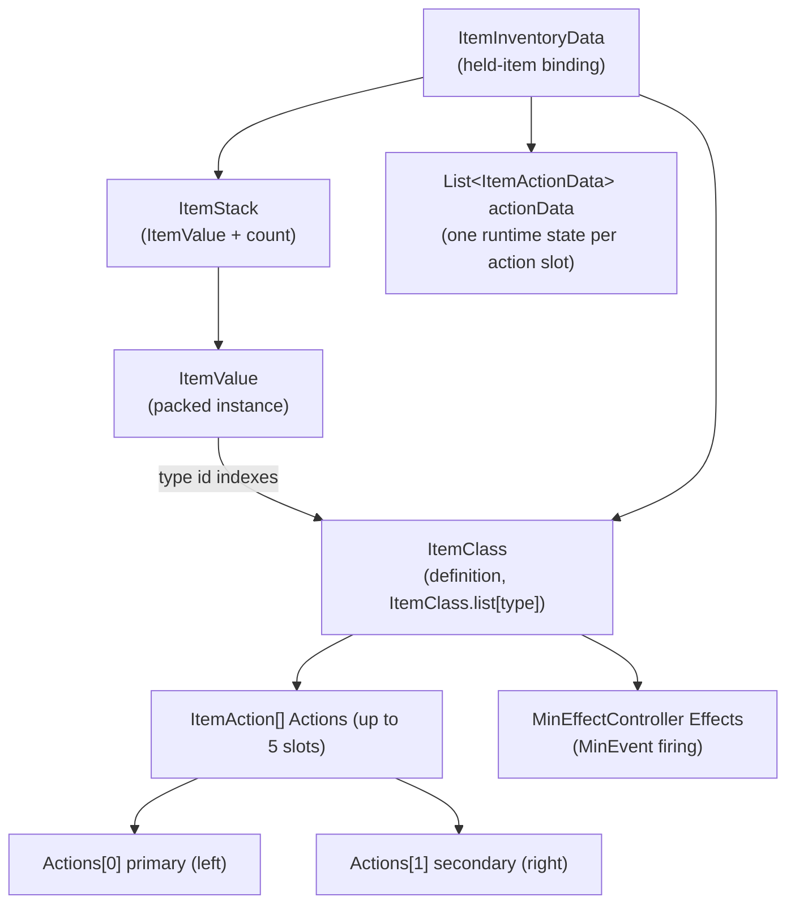
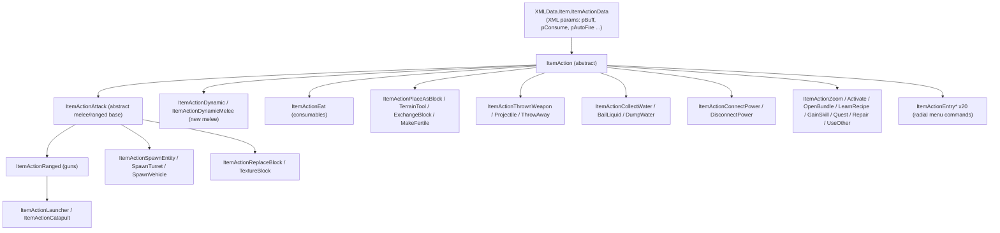
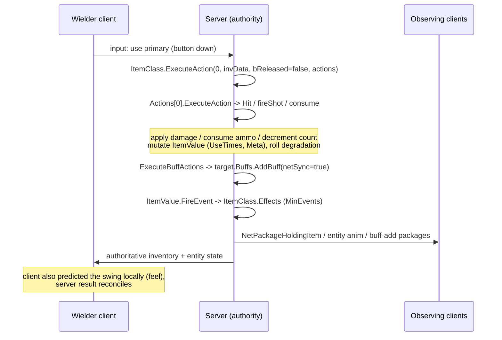
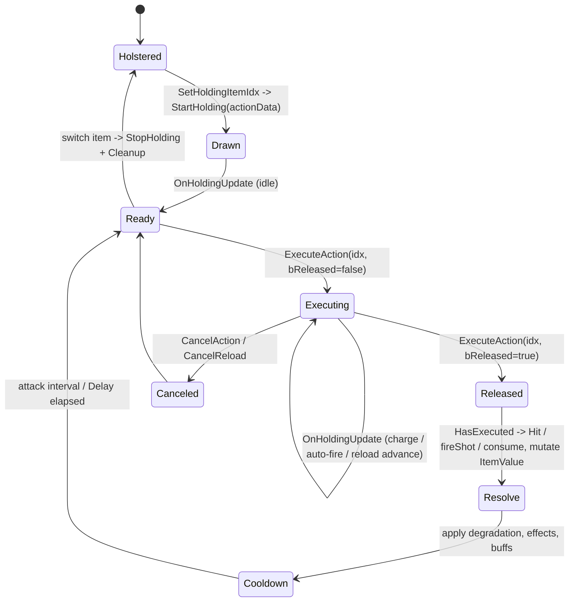
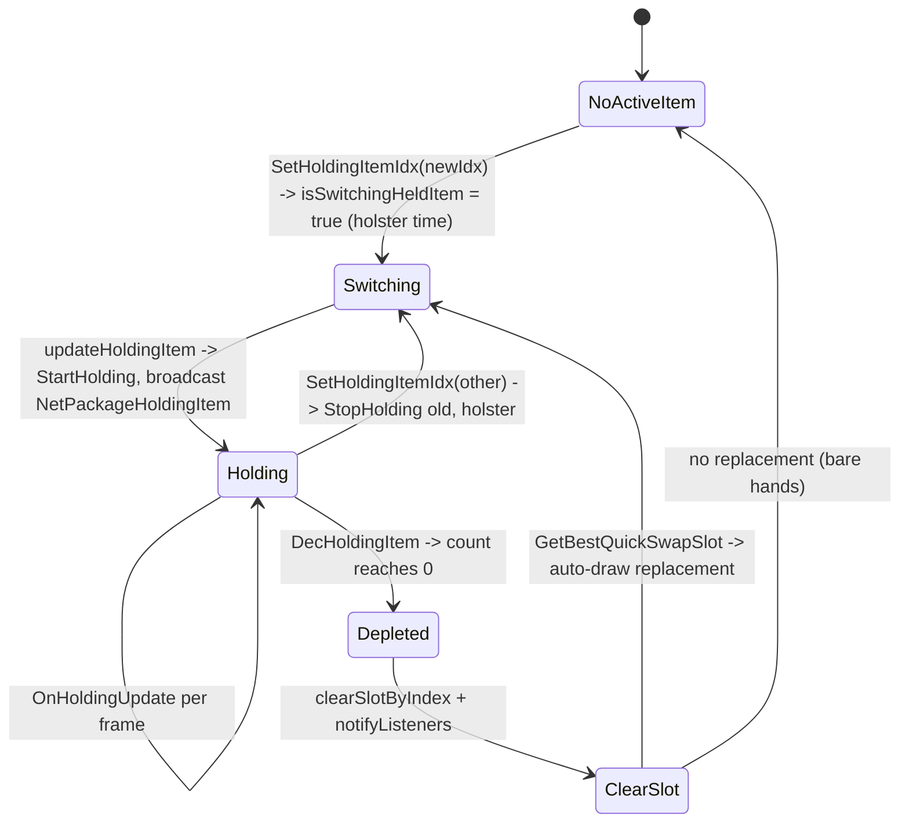
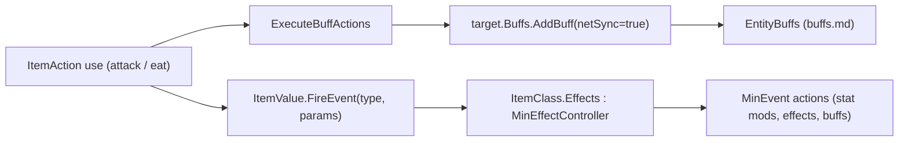

# Item framework (dedicated V3.1.0)

**Owns:** the item system core that runs on the server: `ItemValue` (the packed
item instance), `ItemStack` (value plus count), `ItemClass` (the definition and
its `Actions` array), the `ItemAction` behavior contract
(`ExecuteAction`/`StartHolding`/`OnHoldingUpdate` and the primary/secondary action
convention), the representative action categories (attack, ranged, eat, dynamic),
how holding and using an item runs server-side, the toolbelt/bag/equipment
containers, durability/degradation, and how an item applies buffs and fires
MinEvents.
**Not:** the individual `items.xml` / `item_modifiers.xml` content (data, not IL);
the `Item*` classes and `ItemAction` subclasses one by one (they are enumerated in
[inventories/item-actions.md](inventories/item-actions.md); this doc reverses the
**framework**, with attack/ranged/eat/dynamic as representatives); the
`XUiC_*` inventory windows and item view models / muzzle particles (client UI and
rendering); the `MinEvent` action framework internals (see
[minevents.md](minevents.md); the item side is covered here).
**Evidence:** `ItemValue`, `ItemStack`, `ItemClass`, `ItemAction`,
`ItemActionAttack`, `ItemActionRanged`, `ItemActionEat`, `ItemActionDynamic`,
`Inventory`, `Equipment` IL (dump locally with `tools/src/DumpMethod`,
git-ignored). Type census from `il/surface-v3.1.0/surface-types.md` (103 `Item*`
types; 38 concrete `ItemAction` leaves, see catalog). **Hub:** [`INDEX.md`](INDEX.md).
**Method:** [`re-methodology.md`](re-methodology.md).

Items are a core server codepath: the authority owns every held item's runtime
state, decides damage and consumption, mutates the packed `ItemValue`, and
serializes it into save blobs and net packages. Clients predict and render; the
server is the source of truth.

---

## 1. The four core types

| Type | Base | Role |
|---|---|---|
| `ItemValue` | `Object` | The **packed item instance**: type id, quality, durability (`UseTimes`), `Meta`, installed mods/cosmetics, per-item stats, texture, seed |
| `ItemStack` | `Object` | An `ItemValue` plus an `int count` (one inventory cell) |
| `ItemClass` | `ItemData` | The **definition** loaded from `items.xml`: the `ItemAction[] Actions`, hold type, stack size, repair rules, tags, `MinEffectController Effects` |
| `ItemAction` | `XMLData.Item.ItemActionData` | Abstract **behavior**: what pressing primary/secondary does. `ItemClass.Actions` holds the concrete subclasses |

There is a name collision worth flagging up front: two distinct types are both
called `ItemActionData`.

- `XMLData.Item.ItemActionData` (86 fields): the **XML config model** an
  `ItemAction` derives from. It holds the parsed action parameters (`pBuff`,
  `pConsume`, `pCreateItem`, `pAutoFire`, ...) as `DataItem<T>` bindings. This is
  static per definition, shared by all items of a type.
- `ItemActionData` (top-level, 10 fields, base `Object`): the **runtime state**
  of one running action on one held item (`HasExecuted`, `attackDetails`,
  `invData`, `indexInEntityOfAction`). This is per-instance and mutable.

So an `ItemAction` **is** its own XML parameter bag, and it is **handed** a
runtime `ItemActionData` on every call. Keep the two apart when reading the IL.

**Name resolution:** `ItemClass.GetItemClass(name, caseInsensitive)` (IL=15)
looks up the static `nameToItem` (or `nameToItemCaseInsensitive`) dictionary;
`ItemClass.GetItem(name, ci)` (IL=13) wraps a hit into
`new ItemValue(class.Id, false)` and returns `ItemValue.None` for a miss
(the resolution behind `WorldBiomes.GetBlockValueForName`).

**ItemClass leaves (V3.1.0 b14):** `CreateItemValue(name, quality,
caseInsensitive)` (IL=17) resolves the class and builds a fresh
`ItemValue(id, quality, quality, false, null, 1f)`, `ItemValue.None` on a
miss. `GetForId(id)` (IL=15) indexes the static `list` (null when out of
range or unbuilt). `CanCollect(iv)` is true in the base, but
`ItemClassTimeBomb` (IL=5) refuses while `iv.Meta != 0` (a lit bomb cannot be
picked up). `HasAllTags` resolves the tag source per subclass: `ItemTags`
(base), `Block.Tags` (`ItemClassBlock`), `ModifierTags` (`ItemClassModifier`).
`IsGun` (IL=8) / `IsDynamicMelee` (IL=8) test `Actions[0]` against
`ItemActionAttack` / `ItemActionDynamic` (so `IsGun` is true for melee too);
`IsLightSource` (IL=5) is a non-null `LightSource` DataItem. Pose corrections:
the held-item correction is `(90, 0, 0)` for block classes else zero, and the
dropped-item correction mirrors it (zero for blocks, `(-90, 0, 0)` otherwise).
`GetLocalizedItemName` is the `localizedName` field, with `ItemClassBlock`
delegating to `Block.GetLocalizedBlockName`.

**ItemValue classification:** `get_ItemClassOrMissing` (IL=9) is
`ItemClass ?? ItemClass.MissingItem`; `get_HasQuality` (IL=17) is
`ItemClass.HasQuality || value is ItemClassModifier`; `get_IsMod` (IL=12) is
`value is ItemClassModifier`; `get_IsShapeHelperBlock` (IL=12) is
`value is ItemClassBlock && block.SelectAlternates`.



`ItemClass.list[type]` is the global definition table: an `ItemValue` carries only
the integer `type`, and every property lookup (`get_ItemClass`, `MaxUseTimes`,
`Actions`) resolves through that array. An `ItemValue` with no matching entry logs
`No ItemClass entry for type` and is treated as missing.

---

## 2. ItemValue packing and ItemStack

`ItemValue.Write(BinaryWriter)` is authoritative for byte order (per
[`re-methodology.md`](re-methodology.md) §4). It is a self-describing, mostly
sparse format: a leading marker, a flags byte that gates optional sections, then
recursive nested `ItemValue`s for installed mods.

| Order | Field | Width | Note |
|---|---|---|---|
| 1 | marker | `byte` | `0` = empty sentinel (`IsEmpty` writes just this and returns); otherwise `9` = current format version |
| 2 | flags | `byte` | bit0 = type is an item (`type >= Block.ItemsStartHere`); bit1 = a `Stats[]` array follows |
| 3 | type | `u16` | item/block id; when bit0 is set the id is sent **minus** `Block.ItemsStartHere`, so items and blocks share one id space |
| 4 | `UseTimes` | `f32` | durability consumed so far (see §7) |
| 5 | `Quality` | `u16` | item quality (0..6 tier plus fine grain) |
| 6 | `Meta` | `u16` | general per-item scratch (from an `int`; e.g. current magazine ammo for a gun) |
| 7 | Metadata count | `byte` | number of typed metadata entries |
| 7a | Metadata entries | `string` key + `TypedMetadataValue.Write` | only entries whose `GetValue()` is non-null are written |
| 8 | Stats count | `byte` | only if flags bit1; **per stat: `byte` `PassiveEffects` type, then `i16` value (`0` if boosted), then `i16` boosted value (`0` if not boosted)** (three fields per entry, not two) |
| 9 | Modifications count | `byte` | **skipped entirely if the ItemClass is an `ItemClassModifier`** (a mod cannot itself hold mods, which bounds recursion); note the CosmeticMods rows below are skipped by the same guard |
| 9a | Modifications | per slot: `bool` present + recursive `ItemValue.Write` | installed mods/parts, one nested `ItemValue` each |
| 10 | CosmeticMods count | `byte` | as above (also skipped for `ItemClassModifier`) |
| 10a | CosmeticMods | per slot: `bool` present + recursive `ItemValue.Write` | |
| 11 | `Activated` | `byte` | on/off toggle (flashlight, etc.) |
| 12 | `SelectedAmmoTypeIndex` | `byte` | which ammo type is loaded |
| 13 | `Seed` | `u16` | procedural seed (zeroed when `type == 0`) |
| 14 | TextureFullArray present | `bool` | `!IsDefault`; if present, `TextureFullArray.Write` follows (painted textures) |

Id-space accessors: `ItemValue.GetItemOrBlockId()` (IL=12) returns `type`
below `Block.ItemsStartHere` (block space) and `type - Block.ItemsStartHere`
above (item space); `GetItemId()` (IL=5) unconditionally subtracts
`Block.ItemsStartHere` (the item-space id used by the wire encoding above).

After the body the write does save-id bookkeeping (`NameIdMapping.MarkIdUsed`)
so a save can remap ids on load; that produces no wire bytes. `Read` mirrors the
same order, opposite direction, and reconstructs the nested mods recursively.

The **static** `ItemValue.Write(ItemValue, BinaryWriter)` overload handles a null
reference by emitting a single `0` byte, which is why a null and an empty
`ItemValue` are indistinguishable on the wire (both are the empty sentinel).

`ItemStack` wraps a value with a count and is the unit an inventory cell holds:

| Order | Field | Width | Note |
|---|---|---|---|
| 1 | count | `u16` | clamped to `65535` |
| 2 | itemValue | `ItemValue.Write` | gated on the **raw `count` field being non-zero** (`brfalse` on the field, not on the clamped u16 written above), so a zero-count stack writes no value and reads back `ItemValue.None` |

This packing is shared by the save path and the wire: `ItemStack` and `ItemValue`
appear inside `NetPackageHoldingItem`, `NetPackagePlayerInventory`,
`EntityCreationData`, and the chunk/tile-entity blobs (see
[`protocol-packages.md`](protocol-packages.md) and
[`tile-entities-power.md`](tile-entities-power.md)).

`ItemStack.FromString(s)` (IL=38) parses the `name=count` text form: an `=`
splits the item name (before) from an `int.TryParse` count (after, defaulting
to the empty stack's 0 on failure); without `=` the whole string is the name
with count **1**; the value resolves through `ItemClass.GetItem(name, false)`.

`ItemStack.ReadDelta(reader, last)` (IL=15) / `WriteDelta(writer, last)`
(IL=23) are the inventory-delta wire pair: the full `ItemValue` body is written
both ways and only the count is delta-coded as an `i16` relative to the previous
stack (`count = last.count + ReadInt16`; write sends `count - last.count` and
syncs `last.count` to the new count). `ItemValue.ReadOrNull(reader)` (IL=13)
reads the leading marker byte itself and returns null for the `0` empty
sentinel, otherwise `new ItemValue().ReadData(reader, marker)`.
The legacy readers are near-empty: `ItemValue.ReadOld` (IL=1) reads nothing,
and `ItemStack.ReadOld` (IL=10) is the no-op plus an `i16` count.

**Metadata store:** `Metadata` is a lazy `Dictionary<string, TypedMetadataValue>`.
`HasMetadata(key, typeTag)` (IL=25) tests presence (and the value's `TypeTag`
when one is given); the typed `TryGetMetadata` overloads (int / float / string,
IL=17 each) route through the object core (IL=36) which checks the tag and
returns `GetValue()`. `GetMetadata(key)` (IL=17) returns the value or null -
with the quirk that a **null dict** yields a boxed `false` instead of null.
`RemoveMetaData(name)` (IL=12) is `dict?.Remove(name) ?? false`.
`SetMetadata` (IL=86 core) lazy-creates the dict, updates an existing key via
`TypedMetadataValue.SetValue` (a type mismatch logs a warning with a stack
trace), and `TryCreate`s + `Add`s new keys (the typed overloads carry the tag
1/2/3 for float/int/string).

**Stacking predicates (V3.1.0 b14):** `ItemStack.CanStackWith(other,
allowPartialStack)` (IL=46) requires both stacks non-empty, same `type`, and
for block ids (`type < Block.ItemsStartHere`) an equal `TextureFullArray` -
unless the item is an `IsShapeHelperBlock` (shape helpers stack regardless of
paint). With `allowPartialStack` it answers `CanStackPartly(ref count)` (the
incoming stack can fill the remainder), else `CanStack(count)` (the whole
stack must fit). `ItemStack.CanMoveTo(locationType, slotNumber)` (IL=15)
defaults to true and delegates to `ItemClass.CanMoveToLocation` when the
stack's class resolves (the toolbelt gate behind `Inventory.AddItem`).
The stack-size checks behind `CanStackWith`: `CanStack(count)` (IL=19) is
`count + stack.count <= ItemClass.MaxCount` (empty values always stack);
`CanStackPartly(ref count)` (IL=24) clamps the incoming `count` down to the
room left in the slot (`FastMin(MaxCount - stack.count, count)`) and answers
whether any of it fits; `CanStackPartlyWith(other, ref count)` (IL=15) seeds
the ref from `other.count` and runs the partial path.
`ItemClass.get_MaxCount()` (IL=23) is the cap behind all of it: when
`MaxStackSizeModifier != 1` and the class stacks and has no quality tiers it
returns `FastMin(FastRoundToInt(Stacknumber * MaxStackSizeModifier), 30000)`;
otherwise the raw `Stacknumber` (the 30000 hard cap bounds even scaled stacks).
`ItemClass.CanStack()` (IL=6) is simply `Stacknumber > 1`;
`ItemClassQuest.CanStack()` (IL=2) hard-returns false (quest items never
stack).
`ItemClass.CanMoveToLocation(locationType, slotNumber)` (IL=41) is the
container gate: with `slotNumber >= 0` it first requires
`CanMoveToSlot(locationType, slotNumber)`, and when the class
`bRestrictedMove` is set the location must be one of the `restrictedTo`
`StackLocationTypes` list (a restricted class can only live in its listed
containers - toolbelt, backpack, or equipment); both conditions must hold.

`ItemStack.StackTransferCount(other)` (IL=21) is the partial-stack transfer
count: 0 when the types differ, else `Min(MaxCount - count, other.count)` (how
much of `other` fits into this slot). `ItemValue.EqualsForMerging(other)`
(IL=47) gates stack merging: null or a different `type` fail; with
`ItemAction.RepairType` `CombineOnly` (2) or `Both` (3) the two values must sit
at the same durability extreme, either both pristine (`UseTimes` sum 0) or both
fully used (`UseTimes == MaxUseTimes` on each), and then the `Stats` arrays must
be equal. `ItemValue.CalcModSlotCount()` (IL=29) rolls the mod-slot budget from
`Quality` as `FastMin(255, (int)EffectManager.GetValue(ModSlots, this,
FastMax(0, Quality - 1), ...))`.

`ItemValue.MergeBest(_iv)` (IL=115) merges a donor item into this one (the
repair/combine result). With `ItemAction.RepairType` `CombineOnly`/`Both` it
sums both remaining durabilities against the larger `MaxUseTimes`:
`UseTimes = FastMax(0, maxMax - (myRemaining + otherRemaining))`. Otherwise
(plain repair mode) it adopts the donor only when strictly better, same quality
with more remaining durability or a higher quality; adoption copies the donor's
`Quality`, `MaxDurabilityModifier`, and its own `UseTimes`. Both modes then run
`MergeBestStats(_iv)`, clone the donor's mods and cosmetics when present, and
resize `Modifications` to the recomputed `CalcModSlotCount()`.

`MergeBestStats(_iv)` (IL=109) merges the stat arrays: a null donor array is a
no-op; a missing own array copies the donor's wholesale; otherwise each donor
stat either upgrades the matching entry when it beats the local value (better
direction from `IsStatLowerBetter`) or is appended as a new entry.
`CloneModsTo(_iv)` (IL=34) / `CloneCosmeticModsTo(_iv)` (IL=34) copy the
`Modifications` / `CosmeticMods` arrays into `_iv`, cloning each non-null
entry (null slots stay null). `get_HasModSlots` (IL=6) is
`Modifications.Length > 0` (slot capacity, not occupancy); `HasMods` (IL=30)
and `HasCosmetics` (IL=30) scan for any non-null, non-empty entry.

**`createDefaultModItems(ic, random, modsToInstall, modInstallDescendingChance)`
(IL=187)** rolls the pre-installed mods: for each requested mod name (or tag
via `GetDesiredItemModWithAnyTags`) it rolls `RandomFloat <= chance` to install
- cosmetic mods into `CosmeticMods[0]`, regular mods into the next free
`Modifications` slot, **halving the chance after every regular install** (the
descending chance); remaining `Modifications` are filled with
`ItemValue.None`. When nothing cosmetic was installed and the class lacks
`noPreinstallCosmeticItemTags`, each cosmetic slot rolls
`GetCosmeticItemMod(itemTags, accumulated, random)` (or None).

**`ItemClassModifier` selection primitives (V3.1.0 b14):**
`GetItemModWithAnyTags(tags, installedModTypes, random)` (IL=53) scans
`ItemClass.list` for `ItemClassModifier` entries that are **not** tagged
`installedModTypes` (`HasAnyTags` false), whose `InstallableTags` overlaps
`tags`, and whose `DisallowedTags` is disjoint from `tags`; the surviving ids
collect in the shared static `modIds` scratch list and one is picked uniformly
(`random.RandomRange(count)`); no match returns null. The scratch is cleared
after every call (main-thread use only).
`GetDesiredItemModWithAnyTags(tags, installed, desired, random)` (IL=67) adds
the pre-install bias: a non-empty `desiredModTypes` additionally requires the
mod to `HasAnyTags(desired)` (used by `createDefaultModItems` for tag-requested
mods); `GetCosmeticItemMod` is the cosmetic-pool twin.
`GetPropertyOverride(propertyName, itemName, out value)` (IL=50) resolves a
mod override from `PropertyOverrides : Dictionary<string, DynamicProperties>`
keyed by item name: the exact-name entry first, then the `"*"` wildcard entry
(the `Values` dict of each must contain the property) - the backend of
`ItemValue.GetPropertyOverride` above. `HasAllTags` / `HasAnyTags` (IL=5/7)
are `ModifierTags` subset / overlap tests.

**Stat-value leaves:** `GetStatPercent(type, onlyBoosted)` (IL=12) starts at
**1** and, when stats exist, runs `StatModifyValue`. `StatModifyValue(effect,
ref value, onlyBoosted)` (IL=47) finds the matching stat entry (skipping
unboosted entries under `onlyBoosted`), computes
`multiplier = 1 + statValue * 0.005` (each stat point is 0.5 %) and multiplies
the reference in place. `IsStatLowerBetter(type)` (IL=9) is true for
`StaminaLoss` (112) and `TargetArmor` (163) - the two stats where a smaller
value is better. `HasAnyBoostedStats` (IL=26) is a scan for any `isBoosted`
entry. `HasStats` (IL=5) is `Stats != null`; `ClearStats` (IL=4) nulls the
array; `RemoveUnusedStats` (IL=77) drops zero-value entries (clearing the whole
array when none remain).

### ItemValue metadata and property overrides

**Typed metadata (V3.1.0 b14):** `ItemValue.Metadata :
Dictionary<string, TypedMetadataValue>` is lazy-allocated on the first write.
`TypedMetadataValue` pairs a value with a `TypeTag` (`Float=1`, `Int=2`,
`String=3`). The typed setters box into `SetMetadata(key, value, typeTag)`
(IL=86): an existing key updates through `TypedMetadataValue.SetValue` - a tag
mismatch logs
`Can not update Metadata value '{0}' ... does not match existing TypeTag
({3}). From: {4}` (with a stack trace) and keeps the old value; a new key goes
through `TypedMetadataValue.TryCreate` (creation failure logs
`Can not set Metadata key '{0}' ...`). `SetMetadata(key, tmv)` (IL=55) is the
copy-from-typed-value variant. Reads: `GetMetadata(key)` (IL=17) is
`TryGetValue -> GetValue()` (null on a missing key, `(object)false` when the
whole dictionary is absent); `TryGetMetadata(key, out T)` (IL=17) unboxes with
the matching tag (0 / 0 / null defaults); the 3-arg typed form refuses a
`TypeTag` mismatch. `HasMetadata(key, tag)` / `RemoveMetaData(key)` complete
the surface.

**Mod property overrides:** `GetPropertyOverride(name, original)` (IL=88)
returns `original` when the item has no mods; otherwise the first
`ItemClassModifier` in `Modifications` (then `CosmeticMods`) whose
`GetPropertyOverride(name, itemName, out v)` succeeds wins, else `original` -
a modded item re-resolves a property (e.g. damage) without touching the base
`ItemClass`.

---

## 3. ItemClass and the Actions array

`ItemClass` is the immutable definition. `ItemClass.Init` allocates
`Actions = new ItemAction[5]` and fills it from the XML `<action>` entries; each
`ItemAction` parses its own `p*` parameters via `ReadFrom`. Index conventions,
confirmed from `Inventory.GetHoldingPrimary` (`Actions[0]`) and
`GetHoldingSecondary` (`Actions[1]`):

| Slot | Role |
|---|---|
| `Actions[0]` | **primary** action (left mouse): swing, fire, eat, place |
| `Actions[1]` | **secondary** action (right mouse): aim/zoom, alt-fire, block |
| `Actions[2..4]` | additional slots (reload/utility); `StartHolding` initializes the first three |

The dispatch reads confirm the convention:
`Inventory.GetHoldingPrimary()` (IL=6) is `holdingItem.Actions[0]` and
`GetHoldingSecondary()` (IL=6) is `holdingItem.Actions[1]`.

Beyond `Actions`, the fields that matter server-side:

| Field | Role |
|---|---|
| `bCanHold` / `HoldType` | whether and how the item can be held (`CanHold`/`SetCanHold`) |
| `Stacknumber` | max stack size (`CanStack`, `CreateItemStacks`) |
| `RepairAmount` / `RepairTime` / `RepairTools` / `RepairExpMultiplier` | repair rules |
| `ItemTags` (`FastTags`) | tag set queried by effects, buffs, and recipes |
| `Effects` (`MinEffectController`) | the item's MinEvent controller (§8) |
| `Properties` (`DynamicProperties`) | raw XML property bag for everything else |

`ItemClass` also owns the holding dispatch that the entity calls each time it
draws or uses the item: `StartHolding`, `OnHoldingUpdate`, `StopHolding`,
`ExecuteAction`, `CanExecuteAction`, `IsActionRunning`. These fan out over the
`Actions` array, calling the matching method on each concrete `ItemAction` with
that slot's runtime `ItemActionData` (pulled from
`ItemInventoryData.actionData[slot]`).

**`ItemAction` base gates (V3.1.0 b14):** `CanRepair(item)` (IL=37) returns a
status code: **0** when `ItemMaxDegrationAmount == 0` (no degradation in this
game) or the item has no `DurabilityModifier` metadata; **1** when
`DurabilityModifier - ItemMaxDegrationAmount < ItemMaxDegrationAmount`; **2**
when `(DurabilityModifier - ItemMaxDegrationAmount) * MaxUseTimes <
MaxUseTimes - UseTimes`; else **0**. `CanCancel(data)` (IL=2) is false in the
base; `IsEndDelayed()` is false, `ItemActionEat` overriding to true (eating
holds the action until consumption completes). `IsAimingGunPossible(data)` is
true in the base and `ItemActionRanged` (IL=4) restricts it to
`NotReloading(data)` (no aiming while reloading).

---

## 4. The ItemAction contract

`ItemAction` (abstract) is the behavior interface every held-item action
implements. The contract the server drives:

| Member | Role |
|---|---|
| `ReadFrom` | parse the action's XML `p*` parameters at load |
| `StartHolding(ItemActionData)` | item just drawn: init the runtime state |
| `OnHoldingUpdate(ItemActionData)` | per-frame while held (base is a no-op; ranged/eat override to advance charge, auto-fire, reload) |
| `StopHolding` / `Cleanup` | item holstered: tear down the runtime state |
| `CanExecute` / `CanInteract` | gate before an action runs |
| `ExecuteAction(actionIdx, invData, bReleased, playerActions)` | on `ItemClass`, the entry point; dispatches to `Actions[actionIdx].ExecuteAction` |
| `ExecuteInstantAction` | one-shot variant (eat/use) |
| `IsActionRunning(ItemActionData)` | is this action mid-execution (used to serialize primary vs secondary) |

`ItemActionAttack` damage modifiers (all in §4's attack family):
`difficultyModifier(strength, attacker, target)` (IL=44) returns the strength
unchanged when either side is null or both share the same
`IsClientControlled` state, else scales `RoundToInt(strength *
IncomingDamageModifier)` for server-side attackers and `*
EntityIncomingDamageModifier` for client-side ones.
`DegradationModifier(strength, condition)` (IL=14) is
`Lerp(strength * 0.5, 1, condition < 0.5 ? condition + 0.5 : 1)`.
`calculateHarvestToolDamageBonus(toolBonuses, harvestItems)` (IL=43) returns
the matching `Bonuses.Damage` for the harvest drop list's `toolCategory`, or 1
when no category matches.
`EntityPlayer.GetBlockDamageScale(isTerrain)` (IL=6) is the global damage
pick: `isTerrain ? ItemActionAttack.TerrainDamagePercent :
ItemActionAttack.BlockDamagePercent`.
| `HandleDegradation` / `HandleItemBreak` | durability (§7) |
| `getBuffActions` / `ExecuteBuffActions` | apply buffs to a target (§8) |
| `ItemActionEffects` | fire visual/audio effects and MinEvents (base no-op; mostly client) |

`ItemClass.ExecuteAction` shows the primary/secondary interlock. It fetches
`curAction = Actions[actionIdx]`. For a `ItemActionDynamicMelee` it additionally
checks whether the **other** slot's action is already running
(`Actions[1-actionIdx].IsActionRunning(...)`) and refuses to start if the entity
is mid-swing on the opposite button, so left and right melee cannot execute at
once. `bReleased` distinguishes a press (`false`) from a release (`true`), which
is how charge-up and auto-fire actions know when the button went down versus up.

### 4.1 Category tree

The 38 concrete `ItemAction` leaves group into a handful of families. The 20
`ItemActionEntry*` leaves are **radial/context-menu commands** (Craft, Repair,
Scrap, Sell, Wear, ...), not held-item use actions, which accounts for roughly
half the leaf count.



Each family has a matching runtime-state class in the top-level `ItemActionData`
hierarchy, so the mutable per-shot state grows with the behavior:

```text
ItemActionData
  -> ItemActionAttackData
       -> ItemActionDataRanged
            -> ItemActionDataLauncher
                 -> ItemActionDataCatapult
       -> ItemActionDataSpawnEntity / SpawnTurret / SpawnVehicle
  -> ItemActionDataZoom
  -> MyInventoryData        (ItemActionEat)
```

**Slot action lookups:** `Inventory.GetItemActionInSlot(slotIdx, actionIdx)`
(IL=32) returns `holdingItem.Actions[actionIdx]` for the held slot, else
`slots[slotIdx].item.Actions[actionIdx]` (null for an empty slot).
`GetItemActionDataInSlot(slotIdx, actionIdx)` (IL=18) is the same split over
the runtime `actionData` list (the held path reads
`holdingItemData.actionData[actionIdx]`).

### 4.2 Representative actions

| Category | Class | Server-authoritative work |
|---|---|---|
| Melee | `ItemActionAttack` / `ItemActionDynamic` | `Hit` raycasts, resolves an entity or block, applies `GetDamageEntity` / `GetDamageBlock` (guarded by an `IsServer` check), rolls dismember/crit, degrades the tool |
| Ranged | `ItemActionRanged` (`: ItemActionAttack`) | `fireShot`, `ConsumeAmmo` (decrements `ItemValue.Meta` = rounds in magazine), `CompleteReload`/`loadNewAmmunition`, jam handling, damage |
| Consume | `ItemActionEat` | `consume`: reduces `UseTimes` via `EffectManager`, sets stealth smell, creates a refund item (`CreateItem`, e.g. empty jar), fires quest events, applies buffs |
| Dynamic | `ItemActionDynamicMelee` | the newer melee model: `GrazeCast` for near-misses, `hitTarget`, `harvestOnCompletion`, per-swing crit chance |

**`ItemActionRanged.fireShot` (IL=482) re-pin:** look ray + direction offset ->
`Voxel.Raycast` -> clone `voxelRayHitInfo`; entity hits via
`ItemActionAttack.FindHitEntityNoTagCheck` (drone ally skip); block hits via
`GetBlockHit`; damage scaled by `EffectManager.GetValue` passive effects; server
path applies entity/block damage (same authority model as melee `Hit`).

**Reload leaves:** `ConsumeAmmo(data)` (IL=9) is `iv.Meta -= 1` (one round per
shot). `loadNewAmmunition(gun, ammo, entity)` (IL=20) reads the holding
action slot 0 as `ItemActionDataRanged`, resets `SelectedAmmoTypeIndex` to 0
when it exceeds `MagazineItemNames.Length`, and sets
`isChangingAmmoType = true` (the ammo-type-swap latch consumed by
`CompleteReload`, IL=178).

**The reload gate and cancel (V3.1.0 b14):** `CanReload(data)` (IL=93) is
true only when all of: not already reloading (`NotReloading`), a local
player is not `CancellingInventoryActions`, the magazine is below capacity or
the gun is jammed (`isJammed` forces a reload), and ammo is available - the
selected `MagazineItemNames[SelectedAmmoTypeIndex]` item counted in the
toolbelt (`GetItemCount(ammo, false, -1, -1, true)`) or the bag
(`Bag.GetItemCount(ammo, -1, -1, true)`), or `HasInfiniteAmmo(data)`.
Magazine capacity is passive **9** applied over `BulletsPerMagazine`.
`CancelReload(data, holsterWeapon)` (IL=57): clears the reload anim bool,
sets `isReloadCancelled`, `isWeaponReloadCancelled = item.HasReloadAnim`,
`isChangingAmmoType = false`, and when the firing state was non-idle resets
it and fires `ItemActionEffects(..., 0, ...)` (the cancel effect).

**`ItemActionEat` leaves:** `NeedPrompt(data)` (IL=13) is
`UsePrompt && !bPromptChecked` (the eat-confirmation gate).
`IsValidConditions(data)` (IL=94), with a `ConditionBlockTypes` set, casts a
2.5 m ray (mask 131, model layer temporarily swapped) and requires a
`GameUtils.IsBlockOrTerrain` hit; a block type in the set blocks eating (or,
for the water sentinel 240, a hit with water mass blocks it).
`PercentDone(data)` (IL=24) is 0 until `bEatingStarted`, then
`(time - lastUseTime) / AnimationDelay[item.HoldType].RayCast`.

**Gun spread:** `getDirectionRandomOffset(data, forward)` (IL=86) computes
`spreadH = GetValue(passive 32 SpreadDegreesHorizontal, iv, 45, holder) *
lastAccuracy * (rand.RandomFloat()*2 - 1)` and the vertical twin from passive
**31** plus `spreadVerticalOffset`, then rotates `forward` by
`Euler(spreadV, spreadH, 0)` - the shot cone shrinks with `lastAccuracy`
(the bloom-after-firing accuracy decay).

**Accuracy state machine:** `updateAccuracy(data, isAimingGun,
deltaTickTime)` (IL=175) re-derives the target accuracy factor every tick as
a product of passive-effect multipliers - base passive **26** x 0.1 while
aiming (or **25** x 1 hip); movement: standing still x passive **30** x 0.1,
walking x **28**, running x **27**; crouching x **29** - then multiplies by
passive **13** (Clamp01). `lastAccuracy` eases toward that target through
`AccuracyExpDecay` (IL=29): `target + (last - target) * exp(-decay * dt)`,
snapping to the target once the delta is below 1e-5 (the
`AccuracyUpdateDecayConstant` rate). The result feeds the spread cone in
`getDirectionRandomOffset` above, so aim steadies while aiming/crouching/
still and blooms while moving or right after firing.

**Throw family (V3.1.0 b14):** `ItemActionThrowAway.ExecuteAction`
(IL=137) is the charge/release state machine: press latches
`m_bActivated` + `m_ActivateTime`; release (not in cooldown) sets
`m_bReleased`, fires the avatar `itemThrownAwayTriggerHash` event, and
computes `m_ThrowStrength` - `defaultThrowStrength` for a hold under 0.2 s
or when `maxStrainTime == 0`, else
`maxThrowStrength * min(holdTime, maxStrainTime) / maxStrainTime`. The
avatar throw event then invokes `throwAway(data)` (IL=136): the empty-gate
(`Meta == 0` and passive **177** <= 0 blocks with `m_bActivated = false`), a
local-player `TPCameraCheckPassed` gate, a short obstruction ray (0.28,
mask), and the spawn - `gameManager.ItemDropServer(new ItemStack(
holdingItemValue, 1), pos, Vector3.zero, lookVector * m_ThrowStrength,
entityId, 60, true, -1)` followed by `inventory.DecHoldingItem(1)`; on
failure the avatar `itemThrownAwayTriggerHash` event is cancelled. So
throwing is a **server item drop with velocity** (lifetime 60), not a
projectile entity. `ItemActionThrownWeapon.ExecuteAction` (IL=117) is the
ranged twin: same charge/release but with `WeaponPreFire`/`WeaponFire`
avatar events and `HandleJamSound` on an empty release.

**Catapult (bow) family (V3.1.0 b14):** `ItemActionCatapult.ExecuteAction`
(IL=163) is the draw-and-release state machine over the ranged base. While
reloading it only stamps `m_LastShotTime` (no fire); the rate gate is the
inherited `Delay`. An empty weapon (`!InfiniteAmmo && Meta == 0`) with
`AutoReload && CanReload` runs `ItemReloadServer(entityId)` and sets
`holdingEntitySoundID = -2`. The draw (press) latches `m_bActivated` +
`m_ActivateTime`, sets `SpecialAttack = true`, plays `soundDraw`, and a local
player starts the TP-camera lock timer; the release computes
`strainPercent = (time - m_ActivateTime) / m_MaxStrainTime`, cancels when the
weapon is broken (`MaxUseTimes > 0 && UseTimes >= MaxUseTimes`), when
`UseTimes != 0 && MaxUseTimes == 0`, or when the local player fails
`TPCameraCheckPassed`, then fires by calling
`ItemActionRanged.ExecuteAction(data, false)` followed by
`(data, true)` - the shot runs the ranged fire path with the strain
charged. `GetStrainPercent` (IL=10) reads `lastAttackStrainPercent` off the
launcher data (0 without it); `CanReload` (IL=15) cancels a drawn bow first,
then delegates to the ranged gate.

**Launcher (rocket) family (V3.1.0 b14):** `ItemActionLauncher.fireShot`
(IL=5) is a stub - it sets `hitEntity = true` and returns zero, because the
launcher does not use the hit ray. The projectile is a **GameObject with a
`ProjectileMoveScript`**, not an entity: `instantiateProjectile(data,
positionOffset)` (IL=136) resolves the ammo via
`MagazineItemNames[SelectedAmmoTypeIndex]`, stores `LastProjectileType`,
copies `strainPercent` into `lastAttackStrainPercent`, clones the ammo's
model (`ItemClass.CloneModel`) parented to `projectileJointT` (or the right
hand), and adds `ProjectileMoveScript` wired with `itemProjectile`,
`itemValueProjectile`, `itemValueLauncher` (the launcher value),
`itemActionProjectile` (the ammo class's `Actions[0 or 1]` cast to
`ItemActionProjectile`), `ProjectileOwnerID = holder.entityId`, and the
`actionData`. `ItemActionEffects` (IL=72) runs the base ranged effects, then
for each tracked projectile calls
`ProjectileMoveScript.Fire(startPos, getDirectionOffset(data, direction, i),
holdingEntity, hitmaskOverride, 0, false)` per burst and removes it - the
rocket flies through the projectile script (physics + the ammo's
`ItemActionProjectile`).

**Projectile runtime (`ProjectileMoveScript`, V3.1.0 b14):** the
GameObject script the launcher wires (above) flies and detonates the shot.
`Fire(idealStartPos, dirOrPos, firingEntity, hmOverride, radius,
isBallistic)` (IL=236): `hitMask = hmOverride != 0 ? hmOverride : 80`;
`radius = radius >= 0 ? radius : itemActionProjectile.collisionRadius`;
velocity/gravity from passives **71** / **70** over the projectile action's
`Velocity`/`Gravity` (the `FlyTime < 0` branch computes a ballistic
trajectory from the target offset instead); water-collision particles init;
then detach, layer 0, and `SetState(1 Flying)`.
`FixedUpdate` (IL=196) is the state machine: **Flying (1)** applies gravity
only after `FlyTime` has elapsed, advances `position += velocity * dt` with
`LookAt`, and when off the ideal line lerps toward `idealPosition`
(`Lerp(..., stateTime * 5)` until `stateTime >= 0.2`); `stateTime >=
LifeTime` -> `SetState(4 Dead)`. **Stuck (2)** times out after 180 s
(destroy), but first checks `stickyRay`: a `Voxel.Raycast` that no longer
hits a block/terrain or `E_` entity means the stuck surface is gone and the
arrow `DoRevive()`s. **Dead (4)** destroys after `DeadTime`; `SetState`
(IL=33) resets `stateTime` and, on Dead, hides the `MeshExplode` child and
the light. `checkCollision` (IL=616) runs only in the Flying state: it sweeps
the last segment (skipped under 0.04), feeds `waterCollisionParticles`, reads
the firer's model layer (so the shot does not hit its firer), and raycasts
with `radius + collisionStartBack`. `TryCollect` (IL=40) lets players pick
up `IsSticky` projectiles (arrows): `AddItem(new ItemStack(
itemValueProjectile, 1))` into the local inventory, destroying the shot on
success or showing the `xuiInventoryFullForPickup` tooltip when full.

**Projectile action config (`ItemActionProjectile`, IL=51):** `ReadFrom`
parses the ammo XML that feeds the runtime above - `Explosion` from
`new ExplosionData(Properties, item.Effects)` (the ammo's own explosion
data), `FlyTime` / `LifeTime` / `DeadTime` / `Velocity` / `CollisionRadius`
floats, and `Gravity` defaulting to **-9.81** before the optional override.

**Ranged ammo leaves (V3.1.0 b14):** `GetMaxAmmoCount(data)` (IL=25) is
`GetValue(passive 9 MagazineSize, iv, BulletsPerMagazine, holder, ...)` - the
magazine capacity goes through the `MagazineSize` passive against the class's
base. `checkAmmo` (IL=12) is `InfiniteAmmo || iv.Meta > 0`; `HasInfiniteAmmo`
(IL=24) is `GetValue(passive 188 InfiniteAmmo, iv, 0, holder, ...) > 0`.
`GetBurstCount` (IL=23) is `GetValue(passive 15 BurstRoundCount, iv, 1,
holder, ...)`. `IsAmmoUsableUnderwater(entity)` (IL=19) is true without
`UsesMagazines`, else the selected `MagazineItemNames[SelectedAmmoTypeIndex]`
class's `UsableUnderwater`. `requestReload` (IL=12) sets `isReloadRequested`
and calls `GameManager.ItemReloadServer(entityId)` (server-authoritative
reload). `isJammed(iv)` (IL=5) reads the `scGunIsJammed` metadata key (the jam
flag lives in item metadata).

**`ItemActionThrownWeapon` (V3.1.0 b14):** `instantiateProjectile(data)`
(IL=122) clones the held item's model game object, detaches it, forces material
instances, positions it at the model transform, moves it to layer 0, and adds a
`ThrownWeaponMoveScript` bound to the action / item / value / owner id; it then
hides the original held model and points `MinEventContext` (`Self`,
`Transform`, `Tags`) at the new projectile before firing the `onThrown` event
(82). `throwAway(data)` (IL=96) resolves the look ray origin and, for local
players, subtracts the `StaminaLoss` passive (112) scaled by
`StaminaUsageMultiplier` from Stamina; it then `Fire(origin, look, holder,
hitmaskOverride, m_ThrowStrength)` and `inventory.DecHoldingItem(1)`.

**`ItemActionDynamicMelee.ExecuteAction` (IL=210):** `canStartAttack` gate; clear
`alreadyHitEnts`/`alreadyHitBlocks`; optional harvest path; avatar attack bools /
PowerAttack trigger; `FireEvent` MinEvents; set `Attacking` on data. Per-frame hit
resolution continues in dynamic `Raycast`/`hitTarget` while `Attacking`.

**`ItemActionEat.consume` (IL=154):** `QuestEventManager.UsedItem` + entity
`FireEvent`; increase `UseTimes` via `EffectManager` (durability of food stack);
`Inventory.DecHoldingItem(1)`; `PlayerStealth.SetSmellEat(smellUse)`; if
`CreateItem` set, roll sandbox chance and `AddItem` or `ItemDropServer` for the
empty container refund.

**`GetDamageEntity` (IL=52) / `GetDamageBlock` (IL=70):** build FastTags =
Primary/Secondary action tag | item tags (or MeleeTag) | holder stance/movement
tags (| block tags for block damage). Then
`EffectManager.GetValue(PassiveEffects, itemValue, baseDamage, holder, tags…)`.
Block damage is further capped by `MaterialBlock.MaxIncomingDamage`.

Melee, ranged, and eat all end by mutating the held `ItemValue` (durability, ammo,
or count) and applying effects; that mutation is the server's authority.

---

## 5. Holding and using an item (server flow)

An `EntityAlive` holds one item at a time. The toolbelt is an `Inventory`; its
`m_HoldingItemIdx` / `currActiveItemIndex` name the active slot, and each slot is
an `ItemInventoryData` binding (`item` = `ItemClass`, `itemStack` = `ItemStack`,
`actionData` = the per-action runtime states, `holdingEntity` = the wielder).

Drawing an item runs `SetHoldingItemIdx -> updateHoldingItem ->
ItemClass.StartHolding`, which calls `StartHolding` on each of the first three
`Actions`. The change is broadcast to observers as `NetPackageHoldingItem`
(`entityId`, `holdingItemStack`, `holdingItemIndex`; see
[`protocol-packages.md`](protocol-packages.md) §5.3), so every client renders the
right model in the entity's hands.

**`Inventory.updateHoldingItem()` (IL=172)** - the redraw on a held-slot
change: with the same item value *and* index as last drawn, it just calls
`holdingItem.OnHoldingReset(holdingItemData)` and returns. Otherwise it marks
`entity.bPlayerStatsChanged = !isEntityRemote`, then tears down the old item:
`lastdrawnHoldingItem.StopHolding(lastDrawnHoldingItemData,
lastdrawnHoldingItemTransform)`, fires
`lastDrawnHoldingItemValue.FireEvent(onSelfEquipStop, MinEventContext)` (when
the old item's tags are not in the `ignoreWhenHeld` set), and hides the old
model (`SetParent(inactiveItems, false)` + `SetActive(false)`). The new item:
`QuestEventManager.Current.HeldItem(holdingItemData.itemValue)`,
`holdingItem.StartHolding(holdingItemData, models[holdingItemIdx])`,
MinEventContext gets `ItemValue = value` (with the context seed overwritten by
`value.Seed`) and `Transform = models[idx]`,
`setHoldingItemTransform(models[idx])`, `ShowRightHand(true)`, then fires
`value.FireEvent(onSelfHoldingItemCreated, context)` and (tags not ignored)
`value.FireEvent(onSelfEquipStart, context)`; finally
`entity.OnHoldingItemChanged()` and the `lastDrawn*`/`lastdrawn*` cache fields
are refreshed. `Inventory.ShowHeldItem(waitTime, hideFirst)` (IL=19) is the
delayed re-show helper: it stops any pending `delayedShowHideHeldItemRoutine`
coroutine and starts `delayedShowHideHeldItem(hideFirst, waitTime)` on the
GameManager instance (used by `SetItem` step 1 after a held-slot rewrite).
**`Inventory.HoldingItemHasChanged()` (IL=51)** cancels in-flight action
animations when the held item changes: with entity/emodel/avatar present it
fires `AvatarController.CancelEvent` for `WeaponFire`, `PowerAttack`,
`UseItem`, and `ItemUse`, plus `UpdateBool("Reload", false, true)` - so a slot
switch mid-swing/mid-reload drops the pending action pose.

**`Inventory.setHeldItemByIndex(idx, applyHolsterTime)` (IL=132)** - the slot
switch behind `SetHoldingItemIdx` (IL=5, `applyHolsterTime=true`) and
`SetHoldingItemIdxNoHolsterTime` (IL=5, `false`): after
`BeginSwapHoldingItem()`, the index wraps around `slots.Length` (negative adds,
oversized subtracts). It captures `flashlightWasOn = flashlightOn &&
IsHoldingFlashlight()`, runs `HoldingItemHasChanged()`, triggers the avatar
`itemHasChangedTriggerHash` when the entity/emodel/avatar exist, and stops
every `ItemActionAttack` sound in the *current* holding item's `Actions`
(`Audio.Manager.BroadcastStop(entityId, GetSoundStart())`). Sets
`m_HoldingItemIdx = m_FocusedItemIdx = idx`; a remote entity then goes straight
to `updateHoldingItem()` (no holster choreography), while a local entity calls
`ShowHeldItem(applyHolsterTime ? 0.2 : 0, true)`. Finally, when the flashlight
was on it re-toggles: `SetFlashlight(false)`, `currActiveItemIndex = -1`, and
on success plays the `flashlight_toggle` one-shot.



The primary-action lifecycle for one use, driven by `ExecuteAction` (press then
release) and `OnHoldingUpdate` (per-frame advance):



The equip/hold/unequip state of the toolbelt slot itself (distinct from a single
use) tracks which item is in hand and how switching and depletion move it:



Wire mirror struct: `EntityNetworkHoldingData` carries `m_HoldingItemStack` +
`m_HoldingItemIndex` for the S2C `NetPackageHoldingItem` body (same fields as
[protocol-packages.md](protocol-packages.md) §5.3).

**`updateHoldingItem()` (IL=172)** is the switch body: with the same value and
index as last drawn it runs `holdingItem.OnHoldingReset(data)` and returns
(the re-arm path); otherwise it marks `bPlayerStatsChanged = !isEntityRemote`,
points `MinEventContext` at the old value/transform, runs
`lastdrawnHoldingItem.StopHolding(data, transform)`, then starts the new item
and updates the last-drawn value/index.

**Switch entries:** `SetHoldingItemIdx(idx)` (IL=5) is
`setHeldItemByIndex(idx, true)` (with holster time); the `NoHolsterTime`
variant (IL=5) passes false.

**`DecHoldingItem(count)` (IL=45)** consumes from the held slot (stackable
only): on emptying it runs `HandleTurningOffHoldingFlashlight()` +
`clearSlotByIndex`, then `updateHoldingItem()` + `notifyListeners()`.
**`GetBestQuickSwapSlot()` (IL=50)** prefers the remembered
`quickSwapSlotIdx` when it still holds the same item id, else scans for the
first slot with that id (**-1** when absent or never armed).

**Held-slot accessors (V3.1.0 b14):** `get_holdingItemIdx()` (IL=3) is the raw
`m_HoldingItemIdx`. `get_holdingItem()` (IL=20),
`get_holdingItemItemValue()` (IL=16), `get_holdingItemStack()` (IL=17), and
`get_holdingItemData()` (IL=23) all read `slots[m_HoldingItemIdx]` and fall
back to the bare-hand twin when the held slot is empty: `bareHandItem`,
`bareHandItemValue`, `new ItemStack(bareHandItemValue, 0)`, and
`bareHandItemInventoryData` (with `slotIdx = holdingItemIdx` stamped in),
respectively - an empty toolbelt slot reads as the bare hand everywhere.
`IsHoldingGun()` (IL=9) is `holdingItem != null && holdingItem.IsGun()`
(the guard behind the magnum kill-score flag in
[`combat-damage.md`](combat-damage.md)). Slot-count constants:
`get_INVENTORY_SLOTS()` (IL=5) = `PUBLIC_SLOTS + 1`;
`get_PUBLIC_SLOTS()` (IL=11) = 10 in play, 20 while
`PrefabEditModeManager.IsActive()` (`PREFABEDITOR = 2 * PLAYMODE`);
`get_DUMMY_SLOT_IDX()` (IL=5) = `INVENTORY_SLOTS - 1`, the hidden last slot
used to stow the held item during a vehicle attach
(`SetHoldingItemIdxNoHolsterTime(DUMMY_SLOT_IDX)`, see
[`vehicles-drones-turrets.md`](vehicles-drones-turrets.md) §4.2).

**`ForceHoldingItemUpdate()` (IL=91)** is the forced full rebuild of the held
item: it destroys the current held model, re-creates the model only when the
class `CanHold()` (`createHeldItem`), re-creates the slot's
`ItemInventoryData` when a block-data slot no longer holds a block class,
restores the cloned value + count into the slot, sets
`m_LastDrawnHoldingItemIndex = -1`, and runs `updateHoldingItem()`. Xref
callers (6): `DroneWeapons.HealBeamWeapon.Fire` (the drone heal beam rebuilds
the patient's held item), `EntityAlive.EntityNetworkStats.ToEntity` (stats
restore on entity materialization), `EModelBase.SwitchModelAndView` (x2,
client model swap), the client
`PlayerMoveController.<initializeHoldingItemLater>d__92` coroutine, and the
server-relevant `WorldStaticData.ReloadItemModifiers` (an item-modifier
reload forces every held item to re-resolve).

`DecHoldingItem` is the server-authoritative depletion: it lowers the held
`ItemStack.count`, and when the stack hits zero it clears the slot and quick-swaps
to the best remaining slot (`GetBestQuickSwapSlot`) so a used-up stack of thrown
weapons or blocks auto-replaces from the toolbelt.

---

## 6. Inventory containers

An `EntityAlive` carries three distinct containers, each a different type:

| Container | Type (base) | Role |
|---|---|---|
| Toolbelt | `Inventory` | the held-item bar: `slots` (`ItemInventoryData[]`), `m_HoldingItemIdx`, holding dispatch, quick-swap |
| Backpack | `Bag` (`: InventoryBase`) | main storage grid of `ItemStack`s; not held, just carried |
| Worn gear | `Equipment` | armor and cosmetic slots (`ArmorGroupEquipped`, `m_cosmeticSlots`), keyed by armor group |

`Inventory` is the only one that participates in holding: it resolves the active
`ItemInventoryData`, runs `StartHolding`/`OnHoldingUpdate`, and exposes typed
accessors (`GetHoldingGun`, `GetHoldingBlock`, `GetHoldingDynamicMelee`,
`IsHoldingItemActionRunning`). `Bag` is pure storage. `Equipment` applies worn-gear
stats through its armor groups and tracks cosmetic unlocks; it changes stats but
is never "held".

**`Bag` leaves:** `TryStackItem(startIndex, stack)` (IL=75) is the stack-merge:
it requires `CanMoveTo(Backpack, -1)`, then scans slots from `startIndex`,
merging same-type slots via `CanStackPartly(ref count)` (each merge fires
`onBackpackChanged()`), and returns `(fullyPlaced, changed)`.
`ReadInto(br)` (IL=93) is the bag wire format: version byte, `u16` slot count
(resizing `items` when it differs), per-slot `ItemStack.Read`, a
`LockedSlots` `PackedBoolArray` when flagged (else null), and at version >= 1
`Touched` plus an optional `PreferenceTracker` (a non-`PooledBinaryReader`
here throws `InvalidOperationException`). `get_SlotCount` (IL=10) is
`items?.Length`; the change notification `onBackpackChanged` (IL=8) is a
null-guarded invoke.

All three ride the inventory net packages rather than a per-item packet:
`NetPackagePlayerInventory` carries `toolbelt` (`ItemStack[]`), `bag`
(`Bag.Write`), `equipment`, and the drag-and-drop item; the request/response and
transaction packages (`NetPackageInventoryDataRequest/Response`,
`NetPackageInventoryTransactionRequest/Response`) move container contents and
validate moves on the server. `NetPackagePlayerInventoryForAI` sends a reduced
view for AI. Server validates every transaction; the client requests, the server
approves and echoes the authoritative result.

**`Inventory.SetItem(idx, itemValue, count, notifyListeners)` (IL=166)** (the
server-authoritative slot write; `SetItem(idx, ItemStack)` IL=9 wraps it with
`notifyListeners=true`):

1. **Held re-show:** when writing the held slot and the new item value differs
   from the current one (`EqualsExceptUseTimesAndAmmo`), `ShowHeldItem(0.2,
   true)` re-displays the held item model.
2. **Bounds:** `idx >= slots.Length` returns without touching anything.
3. **Missing-class guard:** a non-zero `ItemValue.type` whose `ItemClass` is
   null logs `Inventory slot {0} {1} missing item class` and clears the value.
4. **Preferred-slot memory:** with `idx < preferredItemSlots.Length`, a
   non-zero new type records `preferredItemSlots[idx] = type` (when notifying);
   otherwise the *old* slot type is remembered before it is overwritten.
5. **Class-change rebuild:** when the incoming class differs from the slot's
   (or the slot is empty), `clearSlotByIndex(idx)` first, then rebuild
   `models[idx]` (`createHeldItem` only when the class `CanHold()`, else null)
   and `slots[idx] = createInventoryData(idx, itemValue)`; `changed` is set.
6. **Store:** `slots[idx].itemStack.itemValue = itemValue.Clone()` and
   `.count = count` (the value is cloned, never aliased).
7. When `changed` and the written slot is the held slot:
   `updateHoldingItem()`; when `notifyListeners`: `notifyListeners()` (the
   network/buff/listener fan-out).

**`Inventory.notifyListeners()` (IL=24):** calls the internal
`onInventoryChanged()` hook, then iterates the `listeners`
(`HashSet<IInventoryChangedListener>`) calling `OnInventoryChanged(this)` on
each - the single fan-out point behind every slot write.

**Read accessors (V3.1.0 b14):** `GetItem(idx)` (IL=6) / `GetItemStack(idx)`
(IL=6) read `slots[idx].itemStack`; `GetItemInSlot` (IL=15) and
`GetItemDataInSlot` (IL=14) fall back to `bareHandItem` /
`bareHandItemInventoryData` when the slot's item class is null (empty slots
read as the bare hand). `GetItemCount()` (IL=5) is just `slots.Length`.
`GetItemCount(ItemValue, bConsiderTexture, seed, meta, ignoreModdedItems)`
(IL=92) sums counts over slots matching: same `type`, texture
(`TextureFullArray` equality) when requested, `seed` when not -1, `meta` when
not -1; with `ignoreModdedItems`, slots whose value `HasModSlots && HasMods`
are skipped. `GetItemCount(FastTags itemTags, seed, meta, ignoreModded)`
(IL=86) is the tag variant: non-empty values whose
`ItemClass.ItemTags.Test_AnySet(itemTags)` match, same seed/meta/mod filters.
The `XUiM_PlayerInventory.GetItemCount` wrappers (IL=19) sum the same query
over backpack + toolbelt (UI-side). `Bag.GetItemCount` mirrors both Inventory
overloads (IL=68 / IL=75) over the backpack's `GetSlots()` array with the same
type-or-tags, seed, meta, and `ignoreModdedItems` filters.

**`Equipment.SetSlotItem(index, value, isLocal)` (IL=191)** (the armor-slot
equip path): with `isLocal` an empty value is treated as null; a no-op when
both old and new are null; wraps the work in `m_entity.IsEquipping = true`.
The **same-value path** stores and fires `onSelfEquipStart` (54) only. The
**changed path** first tears down the old item: for the item and each mod with
an `onSelfItemActivate` (91) trigger and `Activated != 0`, fire
`onSelfItemDeactivate` (92) and clear `Activated`; then fire
`onSelfEquipStop` (57) on the old value. It stores
`preferredItemSlots[index] = value?.type ?? 0`, `m_slots[index] = value`, and
sets the `slotsSetFlags` / `slotsChangedFlags` bit for the index; on a real
change a local entity gets `bPlayerEquipmentChanged = true` plus
`ResetArmorGroups()` and `OnChanged?.Invoke()`; finally
`IsEquipping = false`. `SetSlotItemRaw` (IL=13) is the silent raw store.
**`SetCosmeticSlot`** (IL=50, class variant): only `EquipSlot < 4` cosmetic
slots, gated on `HasCosmeticUnlocked`; skips when the slot already wears the
same `ArmorGroup[0]`; stores and flags `bPlayerEquipmentChanged` for local
entities. The (slotID, id) variant (IL=72) resolves the id through
`CosmeticMappingIDString` into an `ItemClassArmor` (id 0 clears the slot) and
stores into the mapped or generic slot.

**Equipment leaves:** `updateInsulation()` (IL=32) recomputes `waterProof` as
the sum of every equipped slot's `ItemClass.WaterProof`;
`GetTotalInsulation` / `GetTotalWaterproof` (IL=3) read the accumulated
fields. `DropItemOnGround(item)` (IL=21) spawns a 1-count stack via
`IGameManager.ItemDropServer(stack, entity position, velocity (0.5, 0, 0.5),
belongsPlayerId, 60 s lifetime, false)` (the armor drop on death/swap path).
`GetArmorGroupLowestQuality(group)` (IL=13) is
`ArmorGroupEquipped[group].LowestQuality` (0 when not equipped);
`HasAnyItems` (IL=22) is a non-null slot scan.

**Armor-group bookkeeping:** `Equipment.ResetArmorGroups()` (IL=51) clears the
`ArmorGroupEquipped` dictionary and rebuilds it from `m_slots`: every equipped
`ItemClassArmor` registers each of its `ArmorGroup` names via
`AddArmorGroup(name, itemValue.Quality)`. `AddArmorGroup` (IL=36) bumps the
group's `Count` and keeps the running `LowestQuality` (min), or seeds a new
`ArmorGroupInfo { Count = 1, LowestQuality = quality }` - so set bonuses can
scale off the worst piece worn.

**`Inventory.AddItem(stack, out slot)` (IL=121)** (wrapper IL=5): the give-item
path (loot, crafting output, admin `give`). First gate:
`stack.CanMoveTo(StackLocationTypes.Toolbelt, -1)` (the item must be movable
into the toolbelt); a rejection writes `slot = -1` and returns false. Then a
**stack-merge pass** over `slots`: the first slot with the same `type` and
`CanStackWith(stack, false)` gets `count += stack.count`; failing that, an
**empty-slot pass** writes the stack into the first `IsEmpty()` slot via
`SetItem(i, value, count, true)`. Both paths call `notifyListeners()`, set
`entity.bPlayerStatsChanged = !isEntityRemote`, and report the slot index.
`AddItemAtSlot(stack, slot)` (IL=84) targets one slot: it requires
`0 <= slot < PUBLIC_SLOTS`, merges counts when stackable, else writes when the
slot is empty and `CanMoveToSlot(stack, slot)` passes; on any change it
notifies, marks stats changed, and runs `HoldingItemHasChanged()` when the
written slot is the held slot.

**Take / return / lookup leaves:**

- `TryTakeItem(stack)` (IL=83) deposits a stack by scanning `PUBLIC_SLOTS`: an
  empty slot takes the whole clone (notify + `bPlayerStatsChanged =
  !isEntityRemote`, true); a same-type slot takes `CanStackPartly(ref count)`
  and returns true once the request is consumed; false only when nothing fits.
- `CanTakeItem(stack)` (IL=37) is the affordance probe: true when any slot
  (the full `slots` array) `CanStackPartlyWith` it or is empty.
  `CanStackNoEmpty(stack)` (IL=24) is the same scan restricted to partial-stack
  fits over `PUBLIC_SLOTS` (no empty slots).
- `ReturnItem(stack)` (IL=36) walks `PreferredItemSlot(type, slot)` from 0: it
  tries `AddItemAtSlot` into the first slot whose `preferredItemSlots[slot] ==
  type`, scanning forward on failure.
- `PreferredItemSlot(type, start)` (IL=23) is the first index at or after
  `start` with `preferredItemSlots[i] == type`, else **-1**.
- `GetSlotWithItemValue(iv)` (IL=25) is the first slot whose `itemValue`
  `Equals(iv)`, else **-1**. `UsingBareHand` (IL=6) is
  `bareHandItem == holdingItem`; `GetBareHandItemValue` (IL=3) reads the
  `bareHandItemValue` field.

**`Inventory.DecItem(itemValue, count, ignoreModdedItems, removedItems)`
(IL=132)** is the consume/remove path (fuel, ammo, crafting inputs): it scans
slots of the matching `type` (skipping modded values when `ignoreModdedItems`
is set), taking `min(slotCount, remaining)` from stackable slots (recording a
cloned removed stack into `removedItems` when provided, clearing the slot when
empty) and one whole slot at a time for non-stackables; it ends with
`notifyListeners()` and returns the total removed count
(`originalCount - remaining`).

**`clearSlotByIndex(idx)` (IL=41)** empties one slot: a non-empty value is
replaced with `ItemStack.Empty`, and a present model game object triggers
`HoldingItemHasChanged()`, is unparented, deactivated, `Destroy`ed, and the
model slot nulled.

**`SetItem(idx, itemValue, count, notifyListeners)` (IL=166)** is the core
slot write: a held-slot item change redraws via `ShowHeldItem(0.2, true)`;
an out-of-range index returns; a type with no `ItemClass` logs and
`Clear()`s the value; the `preferredItemSlots` array follows the write
(writing a type, or preserving the old type on an empty write). A class change
or empty value runs `clearSlotByIndex` then rebuilds the model
(`createHeldItem` when `CanHold`) and `createInventoryData`; the stack stores
`itemValue.Clone()` plus the count; a changed held slot calls
`updateHoldingItem()` and `notifyListeners()` fires when requested.

**`notifyListeners()` (IL=24)** runs the `onInventoryChanged()` virtual hook
then fans `IInventoryChangedListener.OnInventoryChanged(this)` to every
listener in the `listeners` hash set (a null set skips the fan-out).

---

## 7. Durability and degradation

Durability lives on `ItemValue.UseTimes` (a float counting uses **consumed**),
capped by `ItemClass` derived `MaxUseTimes` (base `MaxUseTimesBase` scaled by
quality and mods through `ModMaxUseTimes`). The exposed fraction is
`PercentUsesLeft = 1 - clamp01(UseTimes / MaxUseTimes)`.

**Chain bodies:** `get_MaxUseTimesBase()` (IL=25) is
`(int)GetValue(passive 8 DegradationMax, this, 0, null, null, itemClass tags)`
(the class's degradation cap through the passive; the `MaxUseTimesUI` read is
the same base without the mod scale). `get_MaxUseTimes()` (IL=5) =
`ModMaxUseTimes(MaxUseTimesBase, this)` (quality + installed mods applied).
`ModMaxUseTimes(value, iv)` (IL=24) multiplies the base by the
`DurabilityModifier` metadata when present (clamped to at least 1, no-op when
the base is ≤ 0). `get_MaxDurabilityModifier()` (IL=9) reads that metadata with
**1.0** as the default; `set_MaxDurabilityModifier(value)` (IL=13) removes the
metadata at exactly **1** and stores it otherwise.

- **Wear:** each qualifying use adds to `UseTimes` (melee/ranged via the attack
  path, consumables via `ItemActionEat.consume` through `EffectManager.GetValue`
  so perks and mods can reduce wear).
- **Break:** `HandleItemBreak` compares `UseTimes` against `MaxUseTimes`; at the
  cap the item is broken (it plays the `itembreak` sound and the tool stops
  functioning until repaired).
- **Repair vs degradation:** repairing resets `UseTimes` toward zero, but
  `HandleDegradation` shrinks the item's **maximum** durability each repair. It
  stores a `DurabilityModifier` in `ItemValue.Metadata`, subtracts
  `ItemMaxDegrationAmount` per repair, and floors it at `0.05`, so a repeatedly
  repaired item permanently loses headroom. When `ItemMaxDegrationAmount` is `0`
  the item never degrades.
- **Sandbox off switch:** `ItemValue.AdjustForSandboxOptions` (IL=7, and the
  null-guarding `ItemStack` wrapper IL=8) strips the `DurabilityModifier`
  metadata when perma-degradation is off
  (`EntityPlayerLocal.get_PermaDegrationOn`, IL=12: `DegradeOnDeathType`
  `MaxDurability`/`Both`, else `ItemAction.ItemMaxDegrationAmount > 0`), so a
  sandbox without degradation keeps every item at full durability headroom.

`Quality` (`u16`) drives `MaxUseTimes` and stat rolls; `Meta` (`u16`) is separate
scratch (magazine ammo for guns, state for other items). Both are packed in the
`ItemValue` body (§2), so durability and quality survive save/load and replicate
on the wire.

---

## 8. Items apply buffs and fire MinEvents

An item reaches two of the game's action frameworks.

**Buffs.** `ItemAction.getBuffActions` returns the action's `BuffActions` list
(buff names from XML), and `ExecuteBuffActions` applies them to a target: for each
name it looks up the `BuffClass`, rolls the proc chance through
`EffectManager.GetValue`, and on success calls
`target.Buffs.AddBuff(name, instigatorId, netSync=true, ..., duration=-1)`. That
is exactly the `EntityBuffs.AddBuff` entry point in
[`buffs.md`](buffs.md): the item is the instigator, and the add is network-synced
so observers see the buff. Consumables (`ItemActionEat`) apply their buffs the
same way on completion.

**MinEvents.** `ItemValue.FireEvent` (**IL=107**): base `ItemClass.Effects` (unless
the class is an `ItemClassModifier`), then magazine ammo `FireEvent` for the
selected ammo type on attack actions, then quality `Modifications[]` and
`CosmeticMods[]` recursion. Eat/attack paths populate
`EntityAlive.MinEventContext` with the acting `ItemValue` first. Controller and
trigger vocabulary: [`minevents.md`](minevents.md) (including
`EffectManager.GetValue` stack order in §7.0).



---

## 9. Dedicated relevance and residuals

- **Server-authoritative:** the packed `ItemValue` and its mutations (durability,
  ammo, quality, mods), damage resolution (`Hit`/`fireShot` behind `IsServer`),
  consumption (`ItemActionEat.consume`, `DecHoldingItem`), inventory transactions,
  and buff/MinEvent application all run on the authority. The held `ItemValue`,
  toolbelt, bag, and equipment serialize into the player profile
  ([`server-lifecycle.md`](server-lifecycle.md)) and replicate through the
  inventory and holding-item packages.
- **Client prediction:** the wielder client predicts the swing/shot locally for
  feel and renders muzzle flash, tracers, and the view model, then reconciles
  against the server result. On a headless server those render paths are skipped;
  the effect firing that is purely cosmetic (`ItemActionEffects`) is largely a
  client concern while the damage and state changes are not.
- **Content (residual):** `items.xml` and `item_modifiers.xml` (item definitions,
  action parameters, stack sizes, repair and degradation amounts, buff and ammo
  lists) are data parsed into `ItemClass`/`ItemAction`, not method-body IL.
- **Client-only (residual):** the `XUiC_*` inventory and character windows, item
  view models, icon generation, and the `ItemActionEntry*` radial UI commands are
  UI and rendering; the server never draws them.

---

## Inventory transactions (server-authoritative)

Item moves between containers go through `TransactionalInventory`: the server
validates each transaction (source/destination slots, counts) before applying it,
which is the anti-dupe / anti-cheat gate for inventory. Requests arrive as
`NetPackageInventoryTransactionRequest` whose body is
`InventoryTransaction.Write` (per-inventory Guid + initial/final hash + ops).
Server `TransactionRequestServer` (**IL=46**): must be server (else throw);
`tx.Apply(secretToken)` then on success `ValidateFinalHashes`; on failure log +
`LockManager.ForceUnlockByPlayer` (**IL=11** -> `UnlockRequestServer`); on
success for non-primary player send `NetPackageInventoryTransactionResponse`
flags **192** (minimal ack).

**`InventoryTransaction.Apply` (IL=126):** for each inventory op data: require
`TransactionalInventory.Hash == InitialHash` else warn/fail; `StartTransaction`;
`ProcessOperation` each op; `FinalizeTransaction`; store `FinalHash`.

Force-unlocks the player on failure, and acks remote
clients via `NetPackageInventoryTransactionResponse` (see
[protocol-packages.md](protocol-packages.md) section 6.13).

## Item net packages (extras)

`NetPackageItemDrop`, `NetPackageDropItemsContainer`, `NetPackageItemActionEffects`,
`NetPackageItemReload`, `NetPackagePickupBlock` ([protocol-packages.md](protocol-packages.md) 6.21).


## Held entities (V3.1.0 Henpocalypse)

New item classes: `ItemClassHeldEntity` (base), `ItemClassWildChicken`, plus
`ItemStackGrid` for 2D stacks. Grab activation lives on `EntityAlive`
(`InitLocalActivationCommands` / `OnEntityActivated("grab")`). Full feature
state machine: [items.md](items.md) (held-entity item types).

## ItemStack.Clone call-site triage (V3.1.0 b14)

**Owns:** stock IL census of who calls `ItemStack.Clone` (instance + array overloads),
so alloc work is attributed to real owners. Not an EfficientServer lever list
(that lives in optimizer docs).

**Method:** `ItemStack.Clone()` IL=15 always allocates a new `ItemStack` and, when
`itemValue != null`, also `ItemValue.Clone()`. Array overload IL=35 allocates a new
array and clones each non-null entry (null → `ItemStack.Empty`).

**Xref (live ASM, 2026-08-06):** **162** call sites total.

| Bucket | Sites (approx) | Role |
|---|---:|---|
| Client UI (`XUi*` / `XUiC_*` / `XUiM_*`) | **56** | Stack widgets, equipment UI, craft queues; **not** headless dedi cost |
| Tile entities / TE features | Workstation 9, Collector 7, Forge 7, TEFeatureStorage 4, PowerRangedTrap 1, … | Server TE inventory mutations and stack moves |
| Inventory / bag / transactional | TransactionalInventory 6, Inventory 3, InventoryOperation 3, Bag 2 | Server inventory ops and absolute/relative sets |
| Net packages | NetPackagePlayerInventory 3, NetPackageItemDrop 1 | Wire setup copies before send |
| Loot / trader / quest / rewards | LootManager 2, TraderData 2-3, Quest 2, Reward* 2+2 | Loot open, trader copy, quest turn-in |
| Game events / actions | SequenceActions drop/remove/unload, ItemAction* entries | Scripted and use-item paths |
| Misc | GameManager 3, PlayerDataFile 2, Entity* drops, PreferenceTracker 4 | Save/load and entity drop content |

**Implications (stock facts for optim evidence):**

1. Roughly **one third** of Clone sites are client UI; Harmony on XUi will not move
   dedicated tick STW.
2. The dedicated-relevant mass is **TE storage + TransactionalInventory + bag/inventory
   ops + a few net Setup paths**, not a single hot loop.
3. Any clone-elimination lever must preserve identity semantics: many callers treat
   Clone as a defensive copy before mutate/send. Wrong sharing breaks TE and wire.
4. Pathfinder admission remains separate ([closed-gaps.md](closed-gaps.md) §3);
   Clone is not on the path enqueue path.

## ItemClass stack defaults, recipe sentinels, fuel time and the transaction wire (2026-08-06)

Status: **verified** against a full V3.1.0 b14 disassembly (2026-08-05 dump; line
numbers are from that dump; the tracked `il/` sets are the V3.1.0 corpus).

### Stack size

When an `<item>` has no `Stacknumber` property the stock default is **0x1f4 = 500**
(749087-749091, the else branch of the `DynamicProperties.ContainsKey("Stacknumber")`
test). `ItemClassBlock`'s ctor sets the same 500 default (682393).

`ItemClass::get_MaxCount` (674830-674858): if `HasQuality` **or** `!CanStack` it
returns `Stacknumber.Value` raw; otherwise it returns
`FastMin(FastRoundToInt(Stacknumber.Value * ItemClass::MaxStackSizeModifier),
0x7530 = 30000)`. `MaxStackSizeModifier` is a static float (674733) and the 30000
hard cap applies to every stackable item.

In the shipped `items.xml`: 1413 items, 254 with a direct `Stacknumber`, 1144 using
`Extends` (so the effective value is inherited, not absent).

### Recipe craft time sentinel

`Recipe` XML parse (1392695-1392710): when a `<recipe>` has no `craft_time`
attribute, `Recipe::craftingTime` is set to **-1**, a sentinel, not to any positive
default. 506 of the 630 stock recipes hit this branch.

### Workstation fuel

`TileEntityWorkstation::GetFuelTime` (1332283-1332301) returns
`ItemClass::GetFuelValue(itemStack.itemValue)` directly, i.e. the `items.xml`
`FuelValue` **is the burn time in seconds per fuel item**. It is called from
`HandleFuel` at 1331999.

### Item repair goes through the crafting queue

The UI path at 1413451 sets `Recipe::craftingTime = ItemClass.RepairTime.Value *
count`, re-runs it through `EffectManager::GetValue` with `PassiveEffects 90`
(crafting time) and `PassiveEffects 101` for the count, and finally calls
`XUiC_CraftingWindowGroup::AddRepairItemToQueue(craftingTime, itemValue.Clone(),
count)`. That is what fills a `RecipeQueueItem`'s `RepairItem` slot.

### NetPackageInventoryTransactionRequest has no body of its own

`NetPackageInventoryTransactionRequest` (823005-823102): `read()` is
`InventoryTransaction::Read(BinaryReader)` and `write()` is
`InventoryTransaction::Write`. `PackageDirection` = 1 (ToServer). `ProcessPackage`
calls `InventoryManager::TransactionRequestServer(tx, sender.entityId)`.

`InventoryTransaction::Write` (614000-614087) emits:

```text
i32 inventoryOps count
  per entry:
    Guid TransactionalInventory.Key   (StreamUtils::Write)
    i32  InitialHash
    i32  FinalHash
    i32  opCount
    opCount x InventoryOperation::Write
```

`NetPackageInventoryTransactionResponse::read` (823186+) is
`bool success | i32 count | per entry: Guid (StreamUtils::ReadGuid) |
bool hasStacks | ItemStack::ReadArray`.

The client half of the loop: `InventoryManager::TransactionRequestLocal`
(612874-612917) applies the transaction locally with the `secretToken`, and on
success sends `NetPackageInventoryTransactionRequest` to the server; on failure it
closes the window. Callers are `TransactionalInventory::TrySetItem` /
`TryRemoveItem` (624627, 624667, 624779).
`InventoryManager::RequestInventoryFromServer` (613064) is client-only and takes a
`TransactionalInventory` / KeyHashPair; `ReadInventory` (613124-613223) refuses on
the server while the target is locked (`LockManager::IsLockedServer`) and refuses a
client-supplied token, then calls `TransactionalInventory::UpdateInventory` and
`CreateInventory`.

---

## Related docs

| Doc | Role |
|---|---|
| [buffs.md](buffs.md) | `EntityBuffs.AddBuff`, the target of an item's `ExecuteBuffActions` |
| [minevents.md](minevents.md) | The MinEvent controller and action contract an item fires via `ItemValue.FireEvent` |
| [protocol-packages.md](protocol-packages.md) | `NetPackageHoldingItem`, `NetPackagePlayerInventory`, and `ItemStack`/`ItemValue` on the wire |
| [tile-entities-power.md](tile-entities-power.md) | Workstations and forges that craft items and hold item inventories |
| [game-events.md](game-events.md) | The scripted-event engine (distinct from the item-side MinEvent controller) |
| [server-lifecycle.md](server-lifecycle.md) | Where a player's items (toolbelt, bag, equipment) persist |
| [full-surface.md](full-surface.md) | Where the item family sits in the whole-assembly map |
| [re-methodology.md](re-methodology.md) | How this was reversed |

**Leaf catalog:** every instance is enumerated in [`inventories/item-actions.md`](inventories/item-actions.md) (the 38 `ItemAction` leaves).

## Item leaf types (action-data, armor, world)

Per-leaf narration for the remaining item-family leaves: four concrete
runtime-state (`ItemActionData`) subclasses from section 4.1, the armor item
class, and two small support types. Each action-data leaf is nested inside its
owning action and instantiated by that action's
`CreateModifierData(ItemInventoryData, actionIdx)` (section 4).

| Leaf | Base | Owner | Extra runtime state and role |
|---|---|---|---|
| `ItemActionDataVomit` | `ItemActionDataLauncher` | `ItemActionVomit` | The AI vomit/spit projectile attack (cop-style). Adds telegraph state: `warningTime`, `numWarningsPlayed`, `numVomits`, `bAttackStarted`, `isActive`. `ExecuteAction` plays randomized warning sounds (`Entity.PlayOneShot`, `GameRandom` timing) before flagging the attack started, then counts vomits until `resetAttack`. Runs server-side for AI wielders. |
| `ItemActionDynamicData` | `ItemActionAttackData` | `ItemActionDynamic` | Animation-driven melee sweep state: the cast `ray`/`rayStartPos`, `alreadyHitEnts`/`alreadyHitBlocks`/`alreadyHitProps` dedupe lists so one swing damages each target once, `lastWeaponHeadPosition` for the sweep trace, `IsHarvesting`, `attackTime`, plus a `CollisionParticleController` for water splashes (client cosmetic). Animator states (`AnimatorMeleeAttackState`, `AnimatorStateRaycast`) feed it into `ItemActionDynamic.Raycast`/`GrazeCast`. |
| `ItemActionDynamicMeleeData` | `ItemActionDynamicData` | `ItemActionDynamicMelee` | Adds the player swing phase machine: `StaminaUsage`, `Attacking`, `HasReleased`, `HasFinished`; consumed by `canStartAttack`, `hitTarget`, and `harvestOnCompletion` (section 4.2's dynamic melee). |
| `ItemActionReplaceBlockData` | `ItemActionDataRanged` | `ItemActionReplaceBlock` | Block replace/paint tool state: a `Nullable<BlockValue>` target block, `TextureFullArray PaintTextures`, `Density`, and `EnumReplaceMode`/`EnumReplacePaintMode`. `fireShotLater`/`replace` walk the `ChunkCluster` and emit one `BlockChangeInfo` per block via `replaceSingleBlock`, so the world edit itself is server-authoritative. |

The non-action leaves:

- **`ItemClassArmor`** (base `ItemClass`): the armor/clothing item class. `Init`
  parses `EquipSlot` (an `EquipmentSlots` enum via `EnumUtils.Parse`),
  `ArmorGroup`, `IsCosmetic` (with a `CosmeticID`), `KeepOnDeath`,
  `AllowUnEquip`, `AutoEquip`, and `ReplaceByTag` from the item's
  `DynamicProperties`; `CanEquip` and `KeepOnDeath` gate slot placement in the
  `Equipment` container (section 6) and death-drop behavior.
- **`ItemId`** (struct, nested `AIDirectorPlayerInventory/ItemId`): a compact
  `(id, count)` pair whose `Read`/`Write` serialize both fields as `Int16`
  (`kNetworkSize`). It is the AI director's tracked-item record, built by
  `TrackedItemsFromBag`/`TrackedItemsFromInventory` and compared
  order-independently to detect inventory changes
  ([aidirector.md](aidirector.md)). Not the general item id, which lives in
  `ItemValue.type` (section 2).
- **`ItemWorldData`** (base `Object`): the context object for an item dropped
  into the world; holds `gameManager`, `world`, the backing `EntityItem`, and
  `belongsEntityId` (the dropper). Created by `ItemClass.CreateWorldData` in
  `EntityItem.PostInit` and threaded through the `ItemClass.OnDroppedUpdate`,
  `OnDamagedByExplosion`, and `OnMeshCreated` hooks, letting an `ItemClass`
  customize its dropped-entity behavior.

## Changelog

- **2026-08-08:** ItemActionProjectile.ReadFrom IL=51: ExplosionData from
  props+effects, FlyTime/LifeTime/DeadTime/Velocity/CollisionRadius,
  Gravity default -9.81 - the config behind the projectile runtime.
- **2026-08-08:** ProjectileMoveScript runtime: Fire IL=236 (hitMask 80
  default, passives 71/70 velocity/gravity, ballistic FlyTime<0 branch,
  water particles, SetState Flying); FixedUpdate IL=196 state machine
  (gravity after FlyTime, ideal-position lerp, LifeTime/DeadTime timeouts,
  sticky-ray revive via Voxel.Raycast); SetState IL=33 (Dead hides
  MeshExplode + light); checkCollision IL=616 segment sweep + firer layer
  exclusion + water particles; TryCollect IL=40 sticky-arrow pickup.
- **2026-08-08:** Launcher (rocket) family: fireShot IL=5 stub (no hit ray);
  instantiateProjectile IL=136 ammo resolve + model clone +
  ProjectileMoveScript wiring (owner, actions, launcher value); ItemActionEffects
  IL=72 per-burst ProjectileMoveScript.Fire with direction offset + hitmask.
- **2026-08-08:** Catapult (bow) family: ExecuteAction IL=163 draw/release
  (strainPercent = hold/m_MaxStrainTime, reload-block, auto-reload
  ItemReloadServer, break/TP-camera cancel, fire via ranged ExecuteAction
  press+release); GetStrainPercent IL=10 lastAttackStrainPercent;
  CanReload IL=15 cancels drawn bow then ranged gate.
- **2026-08-08:** Throw family: ItemActionThrowAway.ExecuteAction IL=137
  charge/release + m_ThrowStrength (default vs maxThrowStrength*hold/max
  strain), avatar itemThrownAwayTriggerHash event; throwAway IL=136 empty
  gate (passive 177) + TP camera gate + obstruction ray +
  ItemDropServer(stack, look*strength, 60, true, -1) + DecHoldingItem(1) -
  throwing is an item drop with velocity; ItemActionThrownWeapon IL=117
  WeaponPreFire/WeaponFire + jam sound variant.
- **2026-08-08:** ItemActionRanged reload/accuracy: CanReload IL=93 gate
  (not reloading, no cancel, jammed or below capacity, ammo in toolbelt/bag
  or infinite, passive 9 magazine); CancelReload IL=57 flags + cancel effect;
  updateAccuracy IL=175 target factor (passives 25/26/27/28/29/30/13) +
  AccuracyExpDecay exponential ease into the spread cone.
- **2026-08-08:** ItemClassModifier selection: GetItemModWithAnyTags IL=53
  (installable/disallowed tag filter + shared modIds scratch + uniform pick),
  GetDesiredItemModWithAnyTags IL=67 desired bias, GetCosmeticItemMod twin,
  GetPropertyOverride IL=50 exact-name then "*" wildcard entry,
  HasAllTags/HasAnyTags ModifierTags tests.
- **2026-08-08:** ItemValue metadata: lazy Metadata dict +
  TypedMetadataValue TypeTag (Float=1/Int=2/String=3); SetMetadata IL=86
  update-vs-create with tag-mismatch warnings; GetMetadata IL=17 /
  TryGetMetadata typed unbox; GetPropertyOverride IL=88 first
  ItemClassModifier wins over Modifications then CosmeticMods.
- **2026-08-08:** Inventory held-slot accessors (get_holdingItem/ItemValue/
  Stack/Data) bare-hand fallbacks + slot-count constants
  (INVENTORY_SLOTS = PUBLIC_SLOTS + 1, PUBLIC_SLOTS 10 vs 20 prefab editor,
  DUMMY_SLOT_IDX last slot); IsHoldingGun (IL=9);
  ForceHoldingItemUpdate (IL=91) forced held-item rebuild with 6 xref
  callers (drone heal beam, EntityNetworkStats.ToEntity, EModelBase model
  swap, client initialize-holding coroutine, WorldStaticData.ReloadItemModifiers).
- **2026-08-07:** Inventory.HoldingItemHasChanged (IL=51): cancels avatar
  WeaponFire/PowerAttack/UseItem/ItemUse events + Reload=false on held-item
  change.
- **2026-08-07:** ItemClass.CanStack (IL=6) = Stacknumber > 1;
  ItemClassQuest.CanStack (IL=2) always false (quest items never stack).
- **2026-08-07:** ItemClass.get_MaxCount (IL=23): stack cap =
  min(round(Stacknumber*MaxStackSizeModifier), 30000) when modifier != 1 +
  stacks + no quality, else raw Stacknumber.
- **2026-08-07:** Equipment armor-group bookkeeping: ResetArmorGroups (IL=51)
  rebuild from m_slots per ArmorGroup name; AddArmorGroup (IL=36) Count++ +
  LowestQuality min, seeds Count=1.
- **2026-08-07:** Equipment family: SetSlotItem (IL=191) equip path (IsEquipping
  wrap, same-value equip-start only, teardown onSelfItemDeactivate 92 for
  activated items+mods then onSelfEquipStop 57, preferredItemSlots + set/changed
  flags, ResetArmorGroups + OnChanged); SetSlotItemRaw (IL=13);
  SetCosmeticSlot class (IL=50) EquipSlot<4 + unlock + armor-group dedupe and
  id (IL=72) CosmeticMappingIDString resolve.
- **2026-08-07:** ItemStack size checks: CanStack (IL=19) sum <= MaxCount,
  CanStackPartly (IL=24) FastMin clamp to room + >0, CanStackPartlyWith
  (IL=15) seed from other.count.
- **2026-08-07:** ItemClass.CanMoveToLocation (IL=41): CanMoveToSlot gate for
  slot >= 0 + bRestrictedMove restrictedTo container list check.
- **2026-08-07:** ItemStack predicates: CanStackWith (IL=46) same-type +
  block texture equality (shape-helper exemption) + whole/partial stack;
  CanMoveTo (IL=15) delegates to ItemClass.CanMoveToLocation.
- **2026-08-07:** Inventory.AddItem (IL=121) give path: CanMoveTo(Toolbelt,-1)
  gate, stack-merge pass then empty-slot pass, notifyListeners + stats-changed;
  AddItemAtSlot (IL=84) slot-targeted with PUBLIC_SLOTS bound,
  CanMoveToSlot gate, HoldingItemHasChanged on held slot.
- **2026-08-07:** Inventory.setHeldItemByIndex (IL=132) slot switch:
  wrap-around, avatar itemHasChangedTriggerHash, ItemActionAttack sound stop,
  m_HoldingItemIdx/FocusedItemIdx, remote vs local holster (0.2 s), flashlight
  re-toggle with flashlight_toggle one-shot; SetHoldingItemIdx wrappers (IL=5).
- **2026-08-07:** Inventory.updateHoldingItem (IL=172) redraw chain: same-item
  OnHoldingReset shortcut, StopHolding + onSelfEquipStop + model hide, HeldItem
  quest hook, StartHolding + onSelfHoldingItemCreated + onSelfEquipStart
  (ignoreWhenHeld gate), OnHoldingItemChanged + lastDrawn cache; ShowHeldItem
  (IL=19) coroutine scheduling.
- **2026-08-07:** Inventory notifyListeners (IL=24) fan-out + read accessors:
  bare-hand fallback in GetItemInSlot/GetItemDataInSlot, GetItemCount type/tag
  overloads (IL=92/86) with texture/seed/meta/mod filters, XUiM wrappers.
- **2026-08-07:** Inventory.SetItem (IL=166) slot-write flow: held re-show
  ShowHeldItem(0.2), bounds guard, missing-item-class warning + clear,
  preferredItemSlots memory, class-change rebuild (clearSlotByIndex +
  createHeldItem/createInventoryData), clone-store, updateHoldingItem +
  notifyListeners; IL=9 wrapper.
- **2026-08-07:** ItemValue.FireEvent IL=107 ammo + mod + cosmetic recursion.
- **2026-08-07:** InventoryTransaction.Apply IL=126 + TransactionRequestServer
  force-unlock path; GetDamageEntity/Block; Eat/fireShot/melee re-pins.
- **2026-08-06:** ItemClass Stacknumber default 500 and get_MaxCount's
  MaxStackSizeModifier plus 30000 cap; Recipe craftingTime -1 sentinel when
  craft_time is absent; TileEntityWorkstation::GetFuelTime is items.xml FuelValue
  in seconds; item repair enters the crafting queue via
  AddRepairItemToQueue(RepairTime * count); NetPackageInventoryTransaction
  Request/Response bodies are InventoryTransaction::Read/Write with the
  Guid/InitialHash/FinalHash/op-list layout, plus the client
  TransactionRequestLocal / RequestInventoryFromServer / ReadInventory loop.

- **2026-07-28:** InventoryTransaction hash-validated server apply path.

- **2026-07-24:** Leaf narration: the four concrete `ItemActionData` leaves (vomit, dynamic, dynamic melee, replace block), `ItemClassArmor`, the AI director's `ItemId`, and `ItemWorldData`.
- **2026-07-23:** Initial item-framework reversal (ItemValue packing + ItemStack, ItemClass and the Actions array, the ItemAction contract and category tree, holding/use flow with primary/secondary interlock, toolbelt/bag/equipment containers, durability and permanent degradation, item to buff/MinEvent linkage) with state machines.
