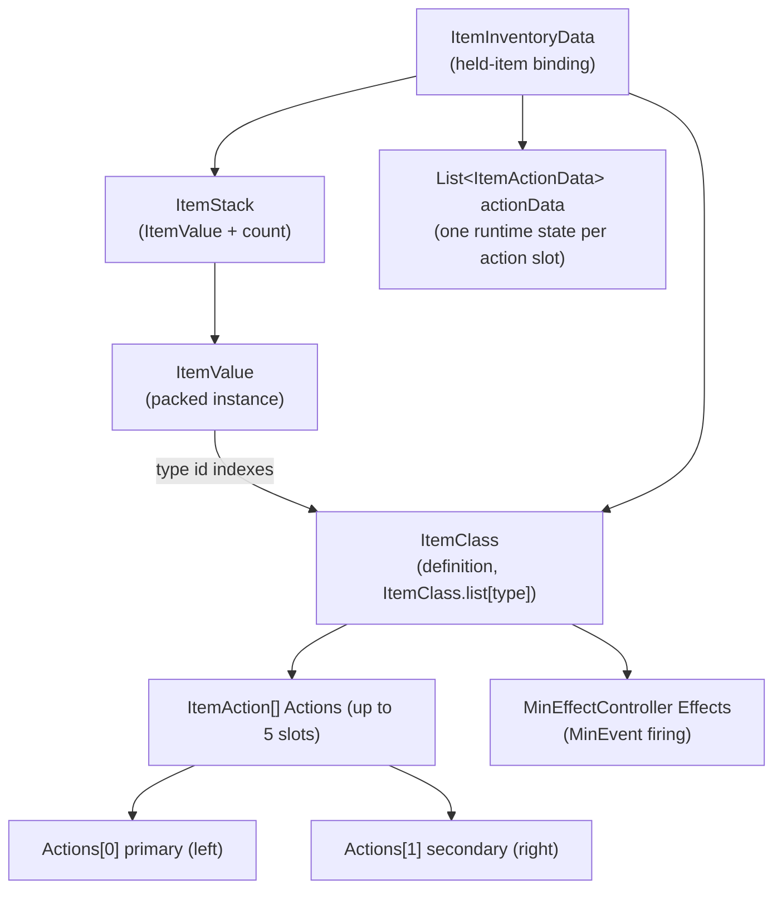
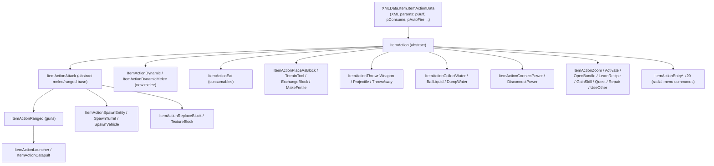
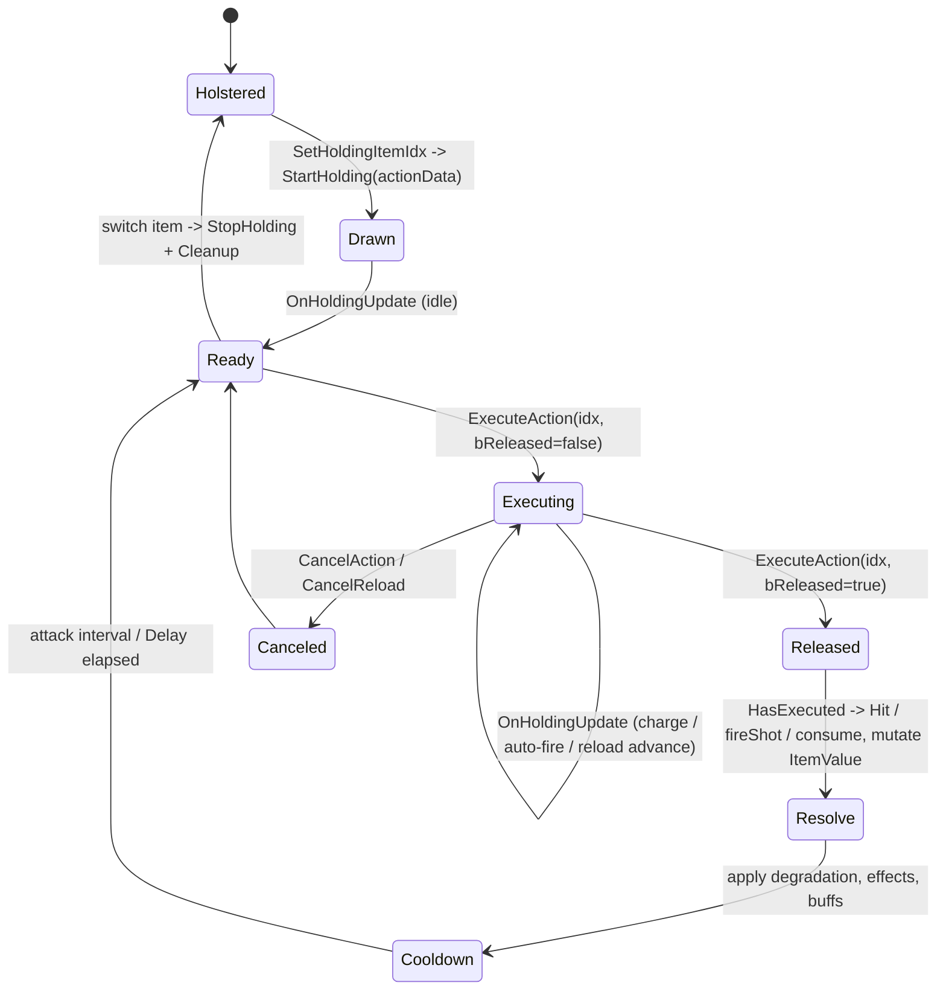
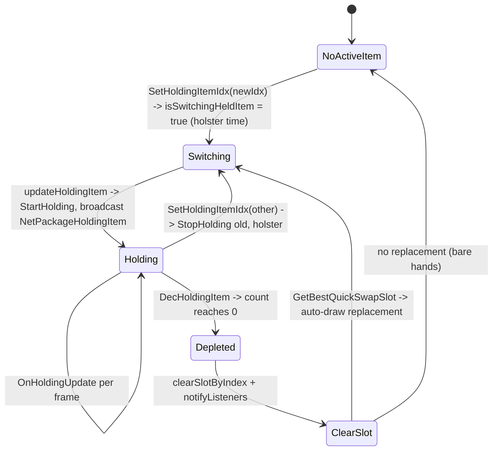
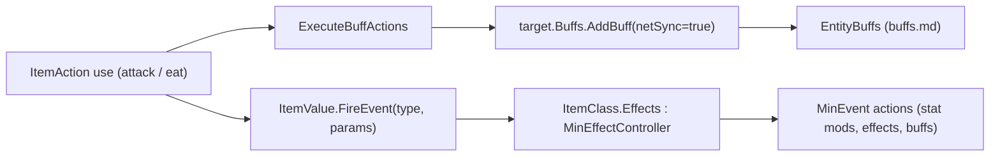

# Item framework (dedicated V3.0.1)

**Owns:** the item system core that runs on the server: `ItemValue` (the packed
item instance), `ItemStack` (value plus count), `ItemClass` (the definition and
its `Actions` array), the `ItemAction` behavior contract
(`ExecuteAction`/`StartHolding`/`OnHoldingUpdate` and the primary/secondary action
convention), the representative action categories (attack, ranged, eat, dynamic),
how holding and using an item runs server-side, the toolbelt/bag/equipment
containers, durability/degradation, and how an item applies buffs and fires
MinEvents.
**Not:** the individual `items.xml` / `item_modifiers.xml` content (data, not IL);
the `Item*` classes and `ItemAction` subclasses one by one (they are enumerated in
[inventories/item-actions.md](inventories/item-actions.md); this doc reverses the
**framework**, with attack/ranged/eat/dynamic as representatives); the
`XUiC_*` inventory windows and item view models / muzzle particles (client UI and
rendering); the `MinEvent` action framework internals (see
[minevents.md](minevents.md); the item side is covered here).
**Evidence:** `ItemValue`, `ItemStack`, `ItemClass`, `ItemAction`,
`ItemActionAttack`, `ItemActionRanged`, `ItemActionEat`, `ItemActionDynamic`,
`Inventory`, `Equipment` IL (dump locally with `tools/src/DumpMethod`,
git-ignored). Type census from `il/surface-v3.0.1/surface-types.md` (103 `Item*`
types; 38 concrete `ItemAction` leaves, see catalog). **Hub:** [`INDEX.md`](INDEX.md).
**Method:** [`re-methodology.md`](re-methodology.md).

Items are a core server codepath: the authority owns every held item's runtime
state, decides damage and consumption, mutates the packed `ItemValue`, and
serializes it into save blobs and net packages. Clients predict and render; the
server is the source of truth.

---

## 1. The four core types

| Type | Base | Role |
|---|---|---|
| `ItemValue` | `Object` | The **packed item instance**: type id, quality, durability (`UseTimes`), `Meta`, installed mods/cosmetics, per-item stats, texture, seed |
| `ItemStack` | `Object` | An `ItemValue` plus an `int count` (one inventory cell) |
| `ItemClass` | `ItemData` | The **definition** loaded from `items.xml`: the `ItemAction[] Actions`, hold type, stack size, repair rules, tags, `MinEffectController Effects` |
| `ItemAction` | `XMLData.Item.ItemActionData` | Abstract **behavior**: what pressing primary/secondary does. `ItemClass.Actions` holds the concrete subclasses |

There is a name collision worth flagging up front: two distinct types are both
called `ItemActionData`.

- `XMLData.Item.ItemActionData` (86 fields): the **XML config model** an
  `ItemAction` derives from. It holds the parsed action parameters (`pBuff`,
  `pConsume`, `pCreateItem`, `pAutoFire`, ...) as `DataItem<T>` bindings. This is
  static per definition, shared by all items of a type.
- `ItemActionData` (top-level, 10 fields, base `Object`): the **runtime state**
  of one running action on one held item (`HasExecuted`, `attackDetails`,
  `invData`, `indexInEntityOfAction`). This is per-instance and mutable.

So an `ItemAction` **is** its own XML parameter bag, and it is **handed** a
runtime `ItemActionData` on every call. Keep the two apart when reading the IL.



`ItemClass.list[type]` is the global definition table: an `ItemValue` carries only
the integer `type`, and every property lookup (`get_ItemClass`, `MaxUseTimes`,
`Actions`) resolves through that array. An `ItemValue` with no matching entry logs
`No ItemClass entry for type` and is treated as missing.

---

## 2. ItemValue packing and ItemStack

`ItemValue.Write(BinaryWriter)` is authoritative for byte order (per
[`re-methodology.md`](re-methodology.md) §4). It is a self-describing, mostly
sparse format: a leading marker, a flags byte that gates optional sections, then
recursive nested `ItemValue`s for installed mods.

| Order | Field | Width | Note |
|---|---|---|---|
| 1 | marker | `byte` | `0` = empty sentinel (`IsEmpty` writes just this and returns); otherwise `9` = current format version |
| 2 | flags | `byte` | bit0 = type is an item (`type >= Block.ItemsStartHere`); bit1 = a `Stats[]` array follows |
| 3 | type | `u16` | item/block id; when bit0 is set the id is sent **minus** `Block.ItemsStartHere`, so items and blocks share one id space |
| 4 | `UseTimes` | `f32` | durability consumed so far (see §7) |
| 5 | `Quality` | `u16` | item quality (0..6 tier plus fine grain) |
| 6 | `Meta` | `u16` | general per-item scratch (from an `int`; e.g. current magazine ammo for a gun) |
| 7 | Metadata count | `byte` | number of typed metadata entries |
| 7a | Metadata entries | `string` key + `TypedMetadataValue.Write` | only entries whose `GetValue()` is non-null are written |
| 8 | Stats count | `byte` | only if flags bit1; **per stat: `byte` `PassiveEffects` type, then `i16` value (`0` if boosted), then `i16` boosted value (`0` if not boosted)** (three fields per entry, not two) |
| 9 | Modifications count | `byte` | **skipped entirely if the ItemClass is an `ItemClassModifier`** (a mod cannot itself hold mods, which bounds recursion); note the CosmeticMods rows below are skipped by the same guard |
| 9a | Modifications | per slot: `bool` present + recursive `ItemValue.Write` | installed mods/parts, one nested `ItemValue` each |
| 10 | CosmeticMods count | `byte` | as above (also skipped for `ItemClassModifier`) |
| 10a | CosmeticMods | per slot: `bool` present + recursive `ItemValue.Write` | |
| 11 | `Activated` | `byte` | on/off toggle (flashlight, etc.) |
| 12 | `SelectedAmmoTypeIndex` | `byte` | which ammo type is loaded |
| 13 | `Seed` | `u16` | procedural seed (zeroed when `type == 0`) |
| 14 | TextureFullArray present | `bool` | `!IsDefault`; if present, `TextureFullArray.Write` follows (painted textures) |

After the body the write does save-id bookkeeping (`NameIdMapping.MarkIdUsed`)
so a save can remap ids on load; that produces no wire bytes. `Read` mirrors the
same order, opposite direction, and reconstructs the nested mods recursively.

The **static** `ItemValue.Write(ItemValue, BinaryWriter)` overload handles a null
reference by emitting a single `0` byte, which is why a null and an empty
`ItemValue` are indistinguishable on the wire (both are the empty sentinel).

`ItemStack` wraps a value with a count and is the unit an inventory cell holds:

| Order | Field | Width | Note |
|---|---|---|---|
| 1 | count | `u16` | clamped to `65535` |
| 2 | itemValue | `ItemValue.Write` | gated on the **raw `count` field being non-zero** (`brfalse` on the field, not on the clamped u16 written above), so a zero-count stack writes no value and reads back `ItemValue.None` |

This packing is shared by the save path and the wire: `ItemStack` and `ItemValue`
appear inside `NetPackageHoldingItem`, `NetPackagePlayerInventory`,
`EntityCreationData`, and the chunk/tile-entity blobs (see
[`protocol-packages.md`](protocol-packages.md) and
[`tile-entities-power.md`](tile-entities-power.md)).

---

## 3. ItemClass and the Actions array

`ItemClass` is the immutable definition. `ItemClass.Init` allocates
`Actions = new ItemAction[5]` and fills it from the XML `<action>` entries; each
`ItemAction` parses its own `p*` parameters via `ReadFrom`. Index conventions,
confirmed from `Inventory.GetHoldingPrimary` (`Actions[0]`) and
`GetHoldingSecondary` (`Actions[1]`):

| Slot | Role |
|---|---|
| `Actions[0]` | **primary** action (left mouse): swing, fire, eat, place |
| `Actions[1]` | **secondary** action (right mouse): aim/zoom, alt-fire, block |
| `Actions[2..4]` | additional slots (reload/utility); `StartHolding` initializes the first three |

Beyond `Actions`, the fields that matter server-side:

| Field | Role |
|---|---|
| `bCanHold` / `HoldType` | whether and how the item can be held (`CanHold`/`SetCanHold`) |
| `Stacknumber` | max stack size (`CanStack`, `CreateItemStacks`) |
| `RepairAmount` / `RepairTime` / `RepairTools` / `RepairExpMultiplier` | repair rules |
| `ItemTags` (`FastTags`) | tag set queried by effects, buffs, and recipes |
| `Effects` (`MinEffectController`) | the item's MinEvent controller (§8) |
| `Properties` (`DynamicProperties`) | raw XML property bag for everything else |

`ItemClass` also owns the holding dispatch that the entity calls each time it
draws or uses the item: `StartHolding`, `OnHoldingUpdate`, `StopHolding`,
`ExecuteAction`, `CanExecuteAction`, `IsActionRunning`. These fan out over the
`Actions` array, calling the matching method on each concrete `ItemAction` with
that slot's runtime `ItemActionData` (pulled from
`ItemInventoryData.actionData[slot]`).

---

## 4. The ItemAction contract

`ItemAction` (abstract) is the behavior interface every held-item action
implements. The contract the server drives:

| Member | Role |
|---|---|
| `ReadFrom` | parse the action's XML `p*` parameters at load |
| `StartHolding(ItemActionData)` | item just drawn: init the runtime state |
| `OnHoldingUpdate(ItemActionData)` | per-frame while held (base is a no-op; ranged/eat override to advance charge, auto-fire, reload) |
| `StopHolding` / `Cleanup` | item holstered: tear down the runtime state |
| `CanExecute` / `CanInteract` | gate before an action runs |
| `ExecuteAction(actionIdx, invData, bReleased, playerActions)` | on `ItemClass`, the entry point; dispatches to `Actions[actionIdx].ExecuteAction` |
| `ExecuteInstantAction` | one-shot variant (eat/use) |
| `IsActionRunning(ItemActionData)` | is this action mid-execution (used to serialize primary vs secondary) |
| `HandleDegradation` / `HandleItemBreak` | durability (§7) |
| `getBuffActions` / `ExecuteBuffActions` | apply buffs to a target (§8) |
| `ItemActionEffects` | fire visual/audio effects and MinEvents (base no-op; mostly client) |

`ItemClass.ExecuteAction` shows the primary/secondary interlock. It fetches
`curAction = Actions[actionIdx]`. For a `ItemActionDynamicMelee` it additionally
checks whether the **other** slot's action is already running
(`Actions[1-actionIdx].IsActionRunning(...)`) and refuses to start if the entity
is mid-swing on the opposite button, so left and right melee cannot execute at
once. `bReleased` distinguishes a press (`false`) from a release (`true`), which
is how charge-up and auto-fire actions know when the button went down versus up.

### 4.1 Category tree

The 38 concrete `ItemAction` leaves group into a handful of families. The 20
`ItemActionEntry*` leaves are **radial/context-menu commands** (Craft, Repair,
Scrap, Sell, Wear, ...), not held-item use actions, which accounts for roughly
half the leaf count.



Each family has a matching runtime-state class in the top-level `ItemActionData`
hierarchy, so the mutable per-shot state grows with the behavior:

```text
ItemActionData
  -> ItemActionAttackData
       -> ItemActionDataRanged
            -> ItemActionDataLauncher
                 -> ItemActionDataCatapult
       -> ItemActionDataSpawnEntity / SpawnTurret / SpawnVehicle
  -> ItemActionDataZoom
  -> MyInventoryData        (ItemActionEat)
```

### 4.2 Representative actions

| Category | Class | Server-authoritative work |
|---|---|---|
| Melee | `ItemActionAttack` / `ItemActionDynamic` | `Hit` raycasts, resolves an entity or block, applies `GetDamageEntity` / `GetDamageBlock` (guarded by an `IsServer` check), rolls dismember/crit, degrades the tool |
| Ranged | `ItemActionRanged` (`: ItemActionAttack`) | `fireShot`, `ConsumeAmmo` (decrements `ItemValue.Meta` = rounds in magazine), `CompleteReload`/`loadNewAmmunition`, jam handling, damage |
| Consume | `ItemActionEat` | `consume`: reduces `UseTimes` via `EffectManager`, sets stealth smell, creates a refund item (`CreateItem`, e.g. empty jar), fires quest events, applies buffs |
| Dynamic | `ItemActionDynamicMelee` | the newer melee model: `GrazeCast` for near-misses, `hitTarget`, `harvestOnCompletion`, per-swing crit chance |

Melee, ranged, and eat all end by mutating the held `ItemValue` (durability, ammo,
or count) and applying effects; that mutation is the server's authority.

---

## 5. Holding and using an item (server flow)

An `EntityAlive` holds one item at a time. The toolbelt is an `Inventory`; its
`m_HoldingItemIdx` / `currActiveItemIndex` name the active slot, and each slot is
an `ItemInventoryData` binding (`item` = `ItemClass`, `itemStack` = `ItemStack`,
`actionData` = the per-action runtime states, `holdingEntity` = the wielder).

Drawing an item runs `SetHoldingItemIdx -> updateHoldingItem ->
ItemClass.StartHolding`, which calls `StartHolding` on each of the first three
`Actions`. The change is broadcast to observers as `NetPackageHoldingItem`
(`entityId`, `holdingItemStack`, `holdingItemIndex`; see
[`protocol-packages.md`](protocol-packages.md) §5.3), so every client renders the
right model in the entity's hands.

```mermaid
sequenceDiagram
  participant CL as Wielder client
  participant SV as Server (authority)
  participant OBS as Observing clients
  CL->>SV: input: use primary (button down)
  SV->>SV: ItemClass.ExecuteAction(0, invData, bReleased=false, actions)
  SV->>SV: Actions[0].ExecuteAction -> Hit / fireShot / consume
  Note over SV: apply damage / consume ammo / decrement count<br/>mutate ItemValue (UseTimes, Meta), roll degradation
  SV->>SV: ExecuteBuffActions -> target.Buffs.AddBuff(netSync=true)
  SV->>SV: ItemValue.FireEvent -> ItemClass.Effects (MinEvents)
  SV->>OBS: NetPackageHoldingItem / entity anim / buff-add packages
  SV->>CL: authoritative inventory + entity state
  Note over CL: client also predicted the swing locally (feel);<br/>server result reconciles
```

The primary-action lifecycle for one use, driven by `ExecuteAction` (press then
release) and `OnHoldingUpdate` (per-frame advance):



The equip/hold/unequip state of the toolbelt slot itself (distinct from a single
use) tracks which item is in hand and how switching and depletion move it:



`DecHoldingItem` is the server-authoritative depletion: it lowers the held
`ItemStack.count`, and when the stack hits zero it clears the slot and quick-swaps
to the best remaining slot (`GetBestQuickSwapSlot`) so a used-up stack of thrown
weapons or blocks auto-replaces from the toolbelt.

---

## 6. Inventory containers

An `EntityAlive` carries three distinct containers, each a different type:

| Container | Type (base) | Role |
|---|---|---|
| Toolbelt | `Inventory` | the held-item bar: `slots` (`ItemInventoryData[]`), `m_HoldingItemIdx`, holding dispatch, quick-swap |
| Backpack | `Bag` (`: InventoryBase`) | main storage grid of `ItemStack`s; not held, just carried |
| Worn gear | `Equipment` | armor and cosmetic slots (`ArmorGroupEquipped`, `m_cosmeticSlots`), keyed by armor group |

`Inventory` is the only one that participates in holding: it resolves the active
`ItemInventoryData`, runs `StartHolding`/`OnHoldingUpdate`, and exposes typed
accessors (`GetHoldingGun`, `GetHoldingBlock`, `GetHoldingDynamicMelee`,
`IsHoldingItemActionRunning`). `Bag` is pure storage. `Equipment` applies worn-gear
stats through its armor groups and tracks cosmetic unlocks; it changes stats but
is never "held".

All three ride the inventory net packages rather than a per-item packet:
`NetPackagePlayerInventory` carries `toolbelt` (`ItemStack[]`), `bag`
(`Bag.Write`), `equipment`, and the drag-and-drop item; the request/response and
transaction packages (`NetPackageInventoryDataRequest/Response`,
`NetPackageInventoryTransactionRequest/Response`) move container contents and
validate moves on the server. `NetPackagePlayerInventoryForAI` sends a reduced
view for AI. Server validates every transaction; the client requests, the server
approves and echoes the authoritative result.

---

## 7. Durability and degradation

Durability lives on `ItemValue.UseTimes` (a float counting uses **consumed**),
capped by `ItemClass` derived `MaxUseTimes` (base `MaxUseTimesBase` scaled by
quality and mods through `ModMaxUseTimes`). The exposed fraction is
`PercentUsesLeft = 1 - clamp01(UseTimes / MaxUseTimes)`.

- **Wear:** each qualifying use adds to `UseTimes` (melee/ranged via the attack
  path, consumables via `ItemActionEat.consume` through `EffectManager.GetValue`
  so perks and mods can reduce wear).
- **Break:** `HandleItemBreak` compares `UseTimes` against `MaxUseTimes`; at the
  cap the item is broken (it plays the `itembreak` sound and the tool stops
  functioning until repaired).
- **Repair vs degradation:** repairing resets `UseTimes` toward zero, but
  `HandleDegradation` shrinks the item's **maximum** durability each repair. It
  stores a `DurabilityModifier` in `ItemValue.Metadata`, subtracts
  `ItemMaxDegrationAmount` per repair, and floors it at `0.05`, so a repeatedly
  repaired item permanently loses headroom. When `ItemMaxDegrationAmount` is `0`
  the item never degrades.

`Quality` (`u16`) drives `MaxUseTimes` and stat rolls; `Meta` (`u16`) is separate
scratch (magazine ammo for guns, state for other items). Both are packed in the
`ItemValue` body (§2), so durability and quality survive save/load and replicate
on the wire.

---

## 8. Items apply buffs and fire MinEvents

An item reaches two of the game's action frameworks.

**Buffs.** `ItemAction.getBuffActions` returns the action's `BuffActions` list
(buff names from XML), and `ExecuteBuffActions` applies them to a target: for each
name it looks up the `BuffClass`, rolls the proc chance through
`EffectManager.GetValue`, and on success calls
`target.Buffs.AddBuff(name, instigatorId, netSync=true, ..., duration=-1)`. That
is exactly the `EntityBuffs.AddBuff` entry point in
[`buffs.md`](buffs.md): the item is the instigator, and the add is network-synced
so observers see the buff. Consumables (`ItemActionEat`) apply their buffs the
same way on completion.

**MinEvents.** `ItemValue.FireEvent(MinEventTypes, MinEventParams)` routes to the
item's `ItemClass.Effects` (a `MinEffectController`) and calls its `FireEvent`,
which runs the XML-declared MinEvent actions (stat mods, particle/sound triggers,
further buffs). The eat/attack paths populate `EntityAlive.MinEventContext` (the
`MinEventParams`) with the acting `ItemValue` before firing, so the MinEvent
actions see which item triggered them. This is the item side of the MinEvent
framework; the controller, trigger vocabulary, and action contract are covered in
[`minevents.md`](minevents.md).



---

## 9. Dedicated relevance and residuals

- **Server-authoritative:** the packed `ItemValue` and its mutations (durability,
  ammo, quality, mods), damage resolution (`Hit`/`fireShot` behind `IsServer`),
  consumption (`ItemActionEat.consume`, `DecHoldingItem`), inventory transactions,
  and buff/MinEvent application all run on the authority. The held `ItemValue`,
  toolbelt, bag, and equipment serialize into the player profile
  ([`server-lifecycle.md`](server-lifecycle.md)) and replicate through the
  inventory and holding-item packages.
- **Client prediction:** the wielder client predicts the swing/shot locally for
  feel and renders muzzle flash, tracers, and the view model, then reconciles
  against the server result. On a headless server those render paths are skipped;
  the effect firing that is purely cosmetic (`ItemActionEffects`) is largely a
  client concern while the damage and state changes are not.
- **Content (residual):** `items.xml` and `item_modifiers.xml` (item definitions,
  action parameters, stack sizes, repair and degradation amounts, buff and ammo
  lists) are data parsed into `ItemClass`/`ItemAction`, not method-body IL.
- **Client-only (residual):** the `XUiC_*` inventory and character windows, item
  view models, icon generation, and the `ItemActionEntry*` radial UI commands are
  UI and rendering; the server never draws them.

---

## Inventory transactions (server-authoritative)

Item moves between containers go through `TransactionalInventory`: the server
validates each transaction (source/destination slots, counts) before applying it,
which is the anti-dupe / anti-cheat gate for inventory. Requests arrive as
`NetPackageInventoryTransactionRequest` and are answered with
`NetPackageInventoryTransactionResponse` (see [protocol-packages.md](protocol-packages.md)).

## Related docs

| Doc | Role |
|---|---|
| [buffs.md](buffs.md) | `EntityBuffs.AddBuff`, the target of an item's `ExecuteBuffActions` |
| [minevents.md](minevents.md) | The MinEvent controller and action contract an item fires via `ItemValue.FireEvent` |
| [protocol-packages.md](protocol-packages.md) | `NetPackageHoldingItem`, `NetPackagePlayerInventory`, and `ItemStack`/`ItemValue` on the wire |
| [tile-entities-power.md](tile-entities-power.md) | Workstations and forges that craft items and hold item inventories |
| [game-events.md](game-events.md) | The scripted-event engine (distinct from the item-side MinEvent controller) |
| [server-lifecycle.md](server-lifecycle.md) | Where a player's items (toolbelt, bag, equipment) persist |
| [full-surface.md](full-surface.md) | Where the item family sits in the whole-assembly map |
| [re-methodology.md](re-methodology.md) | How this was reversed |

**Leaf catalog:** every instance is enumerated in [`inventories/item-actions.md`](inventories/item-actions.md) (the 38 `ItemAction` leaves).

## Item leaf types (action-data, armor, world)

Per-leaf narration for the remaining item-family leaves: four concrete
runtime-state (`ItemActionData`) subclasses from section 4.1, the armor item
class, and two small support types. Each action-data leaf is nested inside its
owning action and instantiated by that action's
`CreateModifierData(ItemInventoryData, actionIdx)` (section 4).

| Leaf | Base | Owner | Extra runtime state and role |
|---|---|---|---|
| `ItemActionDataVomit` | `ItemActionDataLauncher` | `ItemActionVomit` | The AI vomit/spit projectile attack (cop-style). Adds telegraph state: `warningTime`, `numWarningsPlayed`, `numVomits`, `bAttackStarted`, `isActive`. `ExecuteAction` plays randomized warning sounds (`Entity.PlayOneShot`, `GameRandom` timing) before flagging the attack started, then counts vomits until `resetAttack`. Runs server-side for AI wielders. |
| `ItemActionDynamicData` | `ItemActionAttackData` | `ItemActionDynamic` | Animation-driven melee sweep state: the cast `ray`/`rayStartPos`, `alreadyHitEnts`/`alreadyHitBlocks`/`alreadyHitProps` dedupe lists so one swing damages each target once, `lastWeaponHeadPosition` for the sweep trace, `IsHarvesting`, `attackTime`, plus a `CollisionParticleController` for water splashes (client cosmetic). Animator states (`AnimatorMeleeAttackState`, `AnimatorStateRaycast`) feed it into `ItemActionDynamic.Raycast`/`GrazeCast`. |
| `ItemActionDynamicMeleeData` | `ItemActionDynamicData` | `ItemActionDynamicMelee` | Adds the player swing phase machine: `StaminaUsage`, `Attacking`, `HasReleased`, `HasFinished`; consumed by `canStartAttack`, `hitTarget`, and `harvestOnCompletion` (section 4.2's dynamic melee). |
| `ItemActionReplaceBlockData` | `ItemActionDataRanged` | `ItemActionReplaceBlock` | Block replace/paint tool state: a `Nullable<BlockValue>` target block, `TextureFullArray PaintTextures`, `Density`, and `EnumReplaceMode`/`EnumReplacePaintMode`. `fireShotLater`/`replace` walk the `ChunkCluster` and emit one `BlockChangeInfo` per block via `replaceSingleBlock`, so the world edit itself is server-authoritative. |

The non-action leaves:

- **`ItemClassArmor`** (base `ItemClass`): the armor/clothing item class. `Init`
  parses `EquipSlot` (an `EquipmentSlots` enum via `EnumUtils.Parse`),
  `ArmorGroup`, `IsCosmetic` (with a `CosmeticID`), `KeepOnDeath`,
  `AllowUnEquip`, `AutoEquip`, and `ReplaceByTag` from the item's
  `DynamicProperties`; `CanEquip` and `KeepOnDeath` gate slot placement in the
  `Equipment` container (section 6) and death-drop behavior.
- **`ItemId`** (struct, nested `AIDirectorPlayerInventory/ItemId`): a compact
  `(id, count)` pair whose `Read`/`Write` serialize both fields as `Int16`
  (`kNetworkSize`). It is the AI director's tracked-item record, built by
  `TrackedItemsFromBag`/`TrackedItemsFromInventory` and compared
  order-independently to detect inventory changes
  ([aidirector.md](aidirector.md)). Not the general item id, which lives in
  `ItemValue.type` (section 2).
- **`ItemWorldData`** (base `Object`): the context object for an item dropped
  into the world; holds `gameManager`, `world`, the backing `EntityItem`, and
  `belongsEntityId` (the dropper). Created by `ItemClass.CreateWorldData` in
  `EntityItem.PostInit` and threaded through the `ItemClass.OnDroppedUpdate`,
  `OnDamagedByExplosion`, and `OnMeshCreated` hooks, letting an `ItemClass`
  customize its dropped-entity behavior.

## Changelog

- **2026-07-24:** Leaf narration: the four concrete `ItemActionData` leaves (vomit, dynamic, dynamic melee, replace block), `ItemClassArmor`, the AI director's `ItemId`, and `ItemWorldData`.
- **2026-07-23:** Initial item-framework reversal (ItemValue packing + ItemStack, ItemClass and the Actions array, the ItemAction contract and category tree, holding/use flow with primary/secondary interlock, toolbelt/bag/equipment containers, durability and permanent degradation, item to buff/MinEvent linkage) with state machines.
