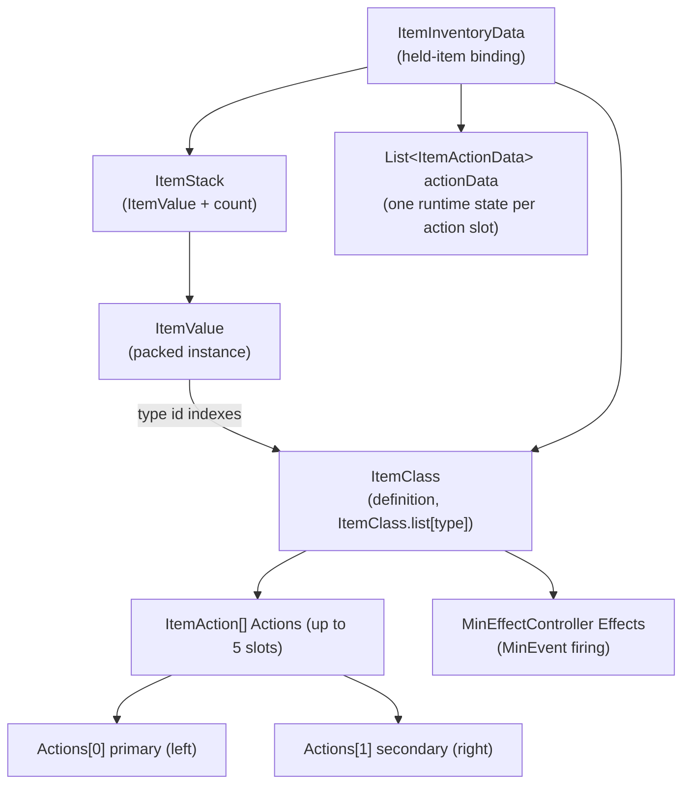
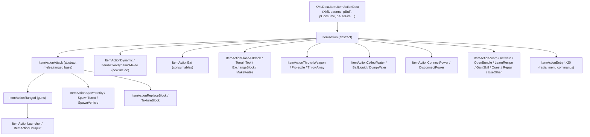
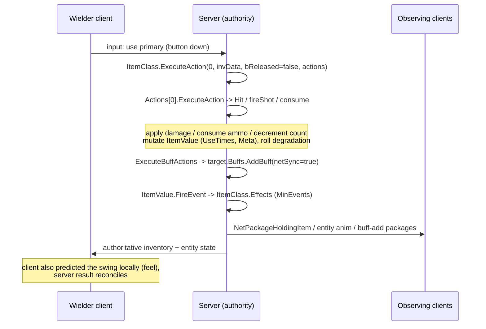
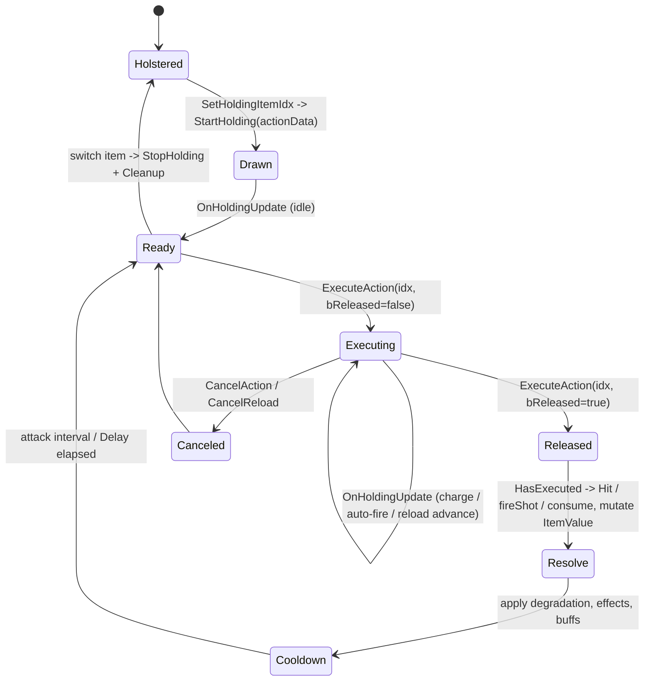
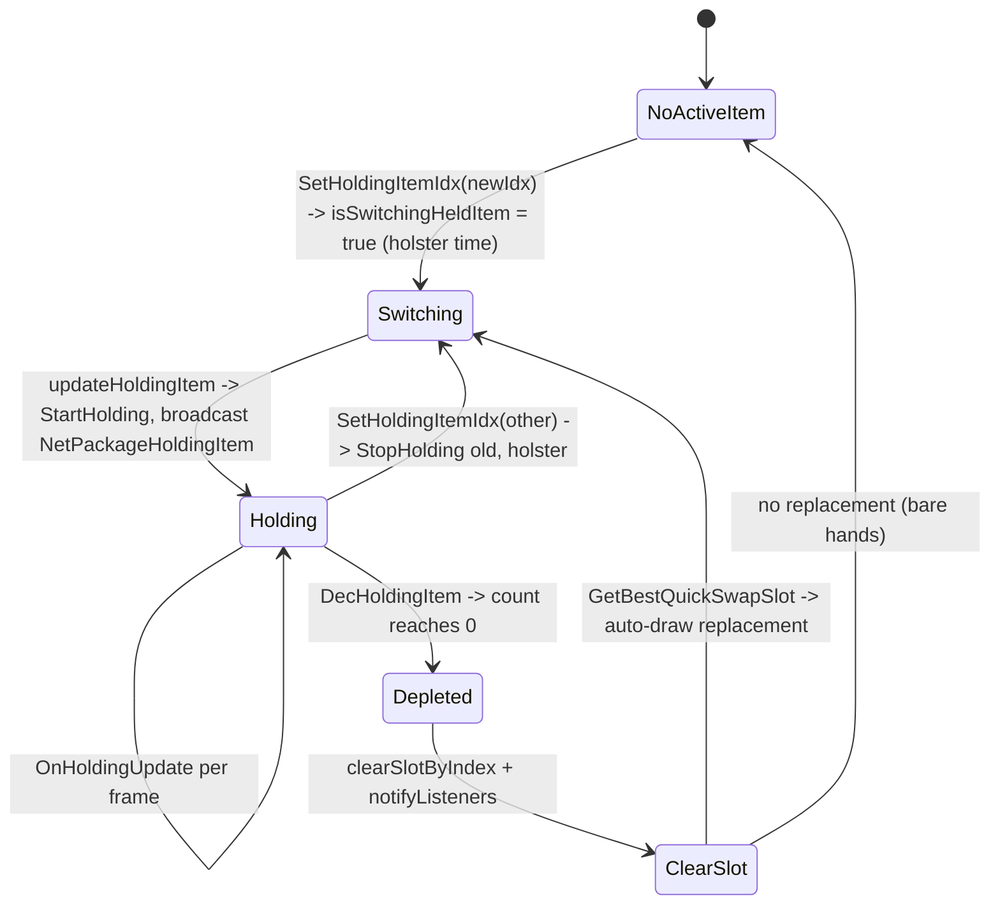
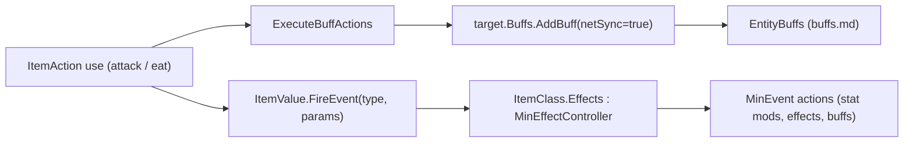

# Item framework (dedicated V3.1.0)

**Owns:** the item system core that runs on the server: `ItemValue` (the packed
item instance), `ItemStack` (value plus count), `ItemClass` (the definition and
its `Actions` array), the `ItemAction` behavior contract
(`ExecuteAction`/`StartHolding`/`OnHoldingUpdate` and the primary/secondary action
convention), the representative action categories (attack, ranged, eat, dynamic),
how holding and using an item runs server-side, the toolbelt/bag/equipment
containers, durability/degradation, and how an item applies buffs and fires
MinEvents.
**Not:** the individual `items.xml` / `item_modifiers.xml` content (data, not IL);
the `Item*` classes and `ItemAction` subclasses one by one (they are enumerated in
[inventories/item-actions.md](inventories/item-actions.md); this doc reverses the
**framework**, with attack/ranged/eat/dynamic as representatives); the
`XUiC_*` inventory windows and item view models / muzzle particles (client UI and
rendering); the `MinEvent` action framework internals (see
[minevents.md](minevents.md); the item side is covered here).
**Evidence:** `ItemValue`, `ItemStack`, `ItemClass`, `ItemAction`,
`ItemActionAttack`, `ItemActionRanged`, `ItemActionEat`, `ItemActionDynamic`,
`Inventory`, `Equipment` IL (dump locally with `tools/src/DumpMethod`,
git-ignored). Type census from `il/surface-v3.1.0/surface-types.md` (103 `Item*`
types; 38 concrete `ItemAction` leaves, see catalog). **Hub:** [`INDEX.md`](INDEX.md).
**Method:** [`re-methodology.md`](re-methodology.md).

Items are a core server codepath: the authority owns every held item's runtime
state, decides damage and consumption, mutates the packed `ItemValue`, and
serializes it into save blobs and net packages. Clients predict and render; the
server is the source of truth.

---

## 1. The four core types

| Type | Base | Role |
|---|---|---|
| `ItemValue` | `Object` | The **packed item instance**: type id, quality, durability (`UseTimes`), `Meta`, installed mods/cosmetics, per-item stats, texture, seed |
| `ItemStack` | `Object` | An `ItemValue` plus an `int count` (one inventory cell) |
| `ItemClass` | `ItemData` | The **definition** loaded from `items.xml`: the `ItemAction[] Actions`, hold type, stack size, repair rules, tags, `MinEffectController Effects` |
| `ItemAction` | `XMLData.Item.ItemActionData` | Abstract **behavior**: what pressing primary/secondary does. `ItemClass.Actions` holds the concrete subclasses |

There is a name collision worth flagging up front: two distinct types are both
called `ItemActionData`.

- `XMLData.Item.ItemActionData` (86 fields): the **XML config model** an
  `ItemAction` derives from. It holds the parsed action parameters (`pBuff`,
  `pConsume`, `pCreateItem`, `pAutoFire`, ...) as `DataItem<T>` bindings. This is
  static per definition, shared by all items of a type.
- `ItemActionData` (top-level, 10 fields, base `Object`): the **runtime state**
  of one running action on one held item (`HasExecuted`, `attackDetails`,
  `invData`, `indexInEntityOfAction`). This is per-instance and mutable.

So an `ItemAction` **is** its own XML parameter bag, and it is **handed** a
runtime `ItemActionData` on every call. Keep the two apart when reading the IL.



`ItemClass.list[type]` is the global definition table: an `ItemValue` carries only
the integer `type`, and every property lookup (`get_ItemClass`, `MaxUseTimes`,
`Actions`) resolves through that array. An `ItemValue` with no matching entry logs
`No ItemClass entry for type` and is treated as missing.

---

## 2. ItemValue packing and ItemStack

`ItemValue.Write(BinaryWriter)` is authoritative for byte order (per
[`re-methodology.md`](re-methodology.md) §4). It is a self-describing, mostly
sparse format: a leading marker, a flags byte that gates optional sections, then
recursive nested `ItemValue`s for installed mods.

| Order | Field | Width | Note |
|---|---|---|---|
| 1 | marker | `byte` | `0` = empty sentinel (`IsEmpty` writes just this and returns); otherwise `9` = current format version |
| 2 | flags | `byte` | bit0 = type is an item (`type >= Block.ItemsStartHere`); bit1 = a `Stats[]` array follows |
| 3 | type | `u16` | item/block id; when bit0 is set the id is sent **minus** `Block.ItemsStartHere`, so items and blocks share one id space |
| 4 | `UseTimes` | `f32` | durability consumed so far (see §7) |
| 5 | `Quality` | `u16` | item quality (0..6 tier plus fine grain) |
| 6 | `Meta` | `u16` | general per-item scratch (from an `int`; e.g. current magazine ammo for a gun) |
| 7 | Metadata count | `byte` | number of typed metadata entries |
| 7a | Metadata entries | `string` key + `TypedMetadataValue.Write` | only entries whose `GetValue()` is non-null are written |
| 8 | Stats count | `byte` | only if flags bit1; **per stat: `byte` `PassiveEffects` type, then `i16` value (`0` if boosted), then `i16` boosted value (`0` if not boosted)** (three fields per entry, not two) |
| 9 | Modifications count | `byte` | **skipped entirely if the ItemClass is an `ItemClassModifier`** (a mod cannot itself hold mods, which bounds recursion); note the CosmeticMods rows below are skipped by the same guard |
| 9a | Modifications | per slot: `bool` present + recursive `ItemValue.Write` | installed mods/parts, one nested `ItemValue` each |
| 10 | CosmeticMods count | `byte` | as above (also skipped for `ItemClassModifier`) |
| 10a | CosmeticMods | per slot: `bool` present + recursive `ItemValue.Write` | |
| 11 | `Activated` | `byte` | on/off toggle (flashlight, etc.) |
| 12 | `SelectedAmmoTypeIndex` | `byte` | which ammo type is loaded |
| 13 | `Seed` | `u16` | procedural seed (zeroed when `type == 0`) |
| 14 | TextureFullArray present | `bool` | `!IsDefault`; if present, `TextureFullArray.Write` follows (painted textures) |

After the body the write does save-id bookkeeping (`NameIdMapping.MarkIdUsed`)
so a save can remap ids on load; that produces no wire bytes. `Read` mirrors the
same order, opposite direction, and reconstructs the nested mods recursively.

The **static** `ItemValue.Write(ItemValue, BinaryWriter)` overload handles a null
reference by emitting a single `0` byte, which is why a null and an empty
`ItemValue` are indistinguishable on the wire (both are the empty sentinel).

`ItemStack` wraps a value with a count and is the unit an inventory cell holds:

| Order | Field | Width | Note |
|---|---|---|---|
| 1 | count | `u16` | clamped to `65535` |
| 2 | itemValue | `ItemValue.Write` | gated on the **raw `count` field being non-zero** (`brfalse` on the field, not on the clamped u16 written above), so a zero-count stack writes no value and reads back `ItemValue.None` |

This packing is shared by the save path and the wire: `ItemStack` and `ItemValue`
appear inside `NetPackageHoldingItem`, `NetPackagePlayerInventory`,
`EntityCreationData`, and the chunk/tile-entity blobs (see
[`protocol-packages.md`](protocol-packages.md) and
[`tile-entities-power.md`](tile-entities-power.md)).

---

## 3. ItemClass and the Actions array

`ItemClass` is the immutable definition. `ItemClass.Init` allocates
`Actions = new ItemAction[5]` and fills it from the XML `<action>` entries; each
`ItemAction` parses its own `p*` parameters via `ReadFrom`. Index conventions,
confirmed from `Inventory.GetHoldingPrimary` (`Actions[0]`) and
`GetHoldingSecondary` (`Actions[1]`):

| Slot | Role |
|---|---|
| `Actions[0]` | **primary** action (left mouse): swing, fire, eat, place |
| `Actions[1]` | **secondary** action (right mouse): aim/zoom, alt-fire, block |
| `Actions[2..4]` | additional slots (reload/utility); `StartHolding` initializes the first three |

Beyond `Actions`, the fields that matter server-side:

| Field | Role |
|---|---|
| `bCanHold` / `HoldType` | whether and how the item can be held (`CanHold`/`SetCanHold`) |
| `Stacknumber` | max stack size (`CanStack`, `CreateItemStacks`) |
| `RepairAmount` / `RepairTime` / `RepairTools` / `RepairExpMultiplier` | repair rules |
| `ItemTags` (`FastTags`) | tag set queried by effects, buffs, and recipes |
| `Effects` (`MinEffectController`) | the item's MinEvent controller (§8) |
| `Properties` (`DynamicProperties`) | raw XML property bag for everything else |

`ItemClass` also owns the holding dispatch that the entity calls each time it
draws or uses the item: `StartHolding`, `OnHoldingUpdate`, `StopHolding`,
`ExecuteAction`, `CanExecuteAction`, `IsActionRunning`. These fan out over the
`Actions` array, calling the matching method on each concrete `ItemAction` with
that slot's runtime `ItemActionData` (pulled from
`ItemInventoryData.actionData[slot]`).

---

## 4. The ItemAction contract

`ItemAction` (abstract) is the behavior interface every held-item action
implements. The contract the server drives:

| Member | Role |
|---|---|
| `ReadFrom` | parse the action's XML `p*` parameters at load |
| `StartHolding(ItemActionData)` | item just drawn: init the runtime state |
| `OnHoldingUpdate(ItemActionData)` | per-frame while held (base is a no-op; ranged/eat override to advance charge, auto-fire, reload) |
| `StopHolding` / `Cleanup` | item holstered: tear down the runtime state |
| `CanExecute` / `CanInteract` | gate before an action runs |
| `ExecuteAction(actionIdx, invData, bReleased, playerActions)` | on `ItemClass`, the entry point; dispatches to `Actions[actionIdx].ExecuteAction` |
| `ExecuteInstantAction` | one-shot variant (eat/use) |
| `IsActionRunning(ItemActionData)` | is this action mid-execution (used to serialize primary vs secondary) |
| `HandleDegradation` / `HandleItemBreak` | durability (§7) |
| `getBuffActions` / `ExecuteBuffActions` | apply buffs to a target (§8) |
| `ItemActionEffects` | fire visual/audio effects and MinEvents (base no-op; mostly client) |

`ItemClass.ExecuteAction` shows the primary/secondary interlock. It fetches
`curAction = Actions[actionIdx]`. For a `ItemActionDynamicMelee` it additionally
checks whether the **other** slot's action is already running
(`Actions[1-actionIdx].IsActionRunning(...)`) and refuses to start if the entity
is mid-swing on the opposite button, so left and right melee cannot execute at
once. `bReleased` distinguishes a press (`false`) from a release (`true`), which
is how charge-up and auto-fire actions know when the button went down versus up.

### 4.1 Category tree

The 38 concrete `ItemAction` leaves group into a handful of families. The 20
`ItemActionEntry*` leaves are **radial/context-menu commands** (Craft, Repair,
Scrap, Sell, Wear, ...), not held-item use actions, which accounts for roughly
half the leaf count.



Each family has a matching runtime-state class in the top-level `ItemActionData`
hierarchy, so the mutable per-shot state grows with the behavior:

```text
ItemActionData
  -> ItemActionAttackData
       -> ItemActionDataRanged
            -> ItemActionDataLauncher
                 -> ItemActionDataCatapult
       -> ItemActionDataSpawnEntity / SpawnTurret / SpawnVehicle
  -> ItemActionDataZoom
  -> MyInventoryData        (ItemActionEat)
```

### 4.2 Representative actions

| Category | Class | Server-authoritative work |
|---|---|---|
| Melee | `ItemActionAttack` / `ItemActionDynamic` | `Hit` raycasts, resolves an entity or block, applies `GetDamageEntity` / `GetDamageBlock` (guarded by an `IsServer` check), rolls dismember/crit, degrades the tool |
| Ranged | `ItemActionRanged` (`: ItemActionAttack`) | `fireShot`, `ConsumeAmmo` (decrements `ItemValue.Meta` = rounds in magazine), `CompleteReload`/`loadNewAmmunition`, jam handling, damage |
| Consume | `ItemActionEat` | `consume`: reduces `UseTimes` via `EffectManager`, sets stealth smell, creates a refund item (`CreateItem`, e.g. empty jar), fires quest events, applies buffs |
| Dynamic | `ItemActionDynamicMelee` | the newer melee model: `GrazeCast` for near-misses, `hitTarget`, `harvestOnCompletion`, per-swing crit chance |

**`ItemActionRanged.fireShot` (IL=482) re-pin:** look ray + direction offset ->
`Voxel.Raycast` -> clone `voxelRayHitInfo`; entity hits via
`ItemActionAttack.FindHitEntityNoTagCheck` (drone ally skip); block hits via
`GetBlockHit`; damage scaled by `EffectManager.GetValue` passive effects; server
path applies entity/block damage (same authority model as melee `Hit`).

**`ItemActionDynamicMelee.ExecuteAction` (IL=210):** `canStartAttack` gate; clear
`alreadyHitEnts`/`alreadyHitBlocks`; optional harvest path; avatar attack bools /
PowerAttack trigger; `FireEvent` MinEvents; set `Attacking` on data. Per-frame hit
resolution continues in dynamic `Raycast`/`hitTarget` while `Attacking`.

**`ItemActionEat.consume` (IL=154):** `QuestEventManager.UsedItem` + entity
`FireEvent`; increase `UseTimes` via `EffectManager` (durability of food stack);
`Inventory.DecHoldingItem(1)`; `PlayerStealth.SetSmellEat(smellUse)`; if
`CreateItem` set, roll sandbox chance and `AddItem` or `ItemDropServer` for the
empty container refund.

**`GetDamageEntity` (IL=52) / `GetDamageBlock` (IL=70):** build FastTags =
Primary/Secondary action tag | item tags (or MeleeTag) | holder stance/movement
tags (| block tags for block damage). Then
`EffectManager.GetValue(PassiveEffects, itemValue, baseDamage, holder, tags…)`.
Block damage is further capped by `MaterialBlock.MaxIncomingDamage`.

Melee, ranged, and eat all end by mutating the held `ItemValue` (durability, ammo,
or count) and applying effects; that mutation is the server's authority.

---

## 5. Holding and using an item (server flow)

An `EntityAlive` holds one item at a time. The toolbelt is an `Inventory`; its
`m_HoldingItemIdx` / `currActiveItemIndex` name the active slot, and each slot is
an `ItemInventoryData` binding (`item` = `ItemClass`, `itemStack` = `ItemStack`,
`actionData` = the per-action runtime states, `holdingEntity` = the wielder).

Drawing an item runs `SetHoldingItemIdx -> updateHoldingItem ->
ItemClass.StartHolding`, which calls `StartHolding` on each of the first three
`Actions`. The change is broadcast to observers as `NetPackageHoldingItem`
(`entityId`, `holdingItemStack`, `holdingItemIndex`; see
[`protocol-packages.md`](protocol-packages.md) §5.3), so every client renders the
right model in the entity's hands.

**`Inventory.updateHoldingItem()` (IL=172)** - the redraw on a held-slot
change: with the same item value *and* index as last drawn, it just calls
`holdingItem.OnHoldingReset(holdingItemData)` and returns. Otherwise it marks
`entity.bPlayerStatsChanged = !isEntityRemote`, then tears down the old item:
`lastdrawnHoldingItem.StopHolding(lastDrawnHoldingItemData,
lastdrawnHoldingItemTransform)`, fires
`lastDrawnHoldingItemValue.FireEvent(onSelfEquipStop, MinEventContext)` (when
the old item's tags are not in the `ignoreWhenHeld` set), and hides the old
model (`SetParent(inactiveItems, false)` + `SetActive(false)`). The new item:
`QuestEventManager.Current.HeldItem(holdingItemData.itemValue)`,
`holdingItem.StartHolding(holdingItemData, models[holdingItemIdx])`,
MinEventContext gets `ItemValue = value` (with the context seed overwritten by
`value.Seed`) and `Transform = models[idx]`,
`setHoldingItemTransform(models[idx])`, `ShowRightHand(true)`, then fires
`value.FireEvent(onSelfHoldingItemCreated, context)` and (tags not ignored)
`value.FireEvent(onSelfEquipStart, context)`; finally
`entity.OnHoldingItemChanged()` and the `lastDrawn*`/`lastdrawn*` cache fields
are refreshed. `Inventory.ShowHeldItem(waitTime, hideFirst)` (IL=19) is the
delayed re-show helper: it stops any pending `delayedShowHideHeldItemRoutine`
coroutine and starts `delayedShowHideHeldItem(hideFirst, waitTime)` on the
GameManager instance (used by `SetItem` step 1 after a held-slot rewrite).

**`Inventory.setHeldItemByIndex(idx, applyHolsterTime)` (IL=132)** - the slot
switch behind `SetHoldingItemIdx` (IL=5, `applyHolsterTime=true`) and
`SetHoldingItemIdxNoHolsterTime` (IL=5, `false`): after
`BeginSwapHoldingItem()`, the index wraps around `slots.Length` (negative adds,
oversized subtracts). It captures `flashlightWasOn = flashlightOn &&
IsHoldingFlashlight()`, runs `HoldingItemHasChanged()`, triggers the avatar
`itemHasChangedTriggerHash` when the entity/emodel/avatar exist, and stops
every `ItemActionAttack` sound in the *current* holding item's `Actions`
(`Audio.Manager.BroadcastStop(entityId, GetSoundStart())`). Sets
`m_HoldingItemIdx = m_FocusedItemIdx = idx`; a remote entity then goes straight
to `updateHoldingItem()` (no holster choreography), while a local entity calls
`ShowHeldItem(applyHolsterTime ? 0.2 : 0, true)`. Finally, when the flashlight
was on it re-toggles: `SetFlashlight(false)`, `currActiveItemIndex = -1`, and
on success plays the `flashlight_toggle` one-shot.



The primary-action lifecycle for one use, driven by `ExecuteAction` (press then
release) and `OnHoldingUpdate` (per-frame advance):



The equip/hold/unequip state of the toolbelt slot itself (distinct from a single
use) tracks which item is in hand and how switching and depletion move it:



Wire mirror struct: `EntityNetworkHoldingData` carries `m_HoldingItemStack` +
`m_HoldingItemIndex` for the S2C `NetPackageHoldingItem` body (same fields as
[protocol-packages.md](protocol-packages.md) §5.3).

`DecHoldingItem` is the server-authoritative depletion: it lowers the held
`ItemStack.count`, and when the stack hits zero it clears the slot and quick-swaps
to the best remaining slot (`GetBestQuickSwapSlot`) so a used-up stack of thrown
weapons or blocks auto-replaces from the toolbelt.

---

## 6. Inventory containers

An `EntityAlive` carries three distinct containers, each a different type:

| Container | Type (base) | Role |
|---|---|---|
| Toolbelt | `Inventory` | the held-item bar: `slots` (`ItemInventoryData[]`), `m_HoldingItemIdx`, holding dispatch, quick-swap |
| Backpack | `Bag` (`: InventoryBase`) | main storage grid of `ItemStack`s; not held, just carried |
| Worn gear | `Equipment` | armor and cosmetic slots (`ArmorGroupEquipped`, `m_cosmeticSlots`), keyed by armor group |

`Inventory` is the only one that participates in holding: it resolves the active
`ItemInventoryData`, runs `StartHolding`/`OnHoldingUpdate`, and exposes typed
accessors (`GetHoldingGun`, `GetHoldingBlock`, `GetHoldingDynamicMelee`,
`IsHoldingItemActionRunning`). `Bag` is pure storage. `Equipment` applies worn-gear
stats through its armor groups and tracks cosmetic unlocks; it changes stats but
is never "held".

All three ride the inventory net packages rather than a per-item packet:
`NetPackagePlayerInventory` carries `toolbelt` (`ItemStack[]`), `bag`
(`Bag.Write`), `equipment`, and the drag-and-drop item; the request/response and
transaction packages (`NetPackageInventoryDataRequest/Response`,
`NetPackageInventoryTransactionRequest/Response`) move container contents and
validate moves on the server. `NetPackagePlayerInventoryForAI` sends a reduced
view for AI. Server validates every transaction; the client requests, the server
approves and echoes the authoritative result.

**`Inventory.SetItem(idx, itemValue, count, notifyListeners)` (IL=166)** (the
server-authoritative slot write; `SetItem(idx, ItemStack)` IL=9 wraps it with
`notifyListeners=true`):

1. **Held re-show:** when writing the held slot and the new item value differs
   from the current one (`EqualsExceptUseTimesAndAmmo`), `ShowHeldItem(0.2,
   true)` re-displays the held item model.
2. **Bounds:** `idx >= slots.Length` returns without touching anything.
3. **Missing-class guard:** a non-zero `ItemValue.type` whose `ItemClass` is
   null logs `Inventory slot {0} {1} missing item class` and clears the value.
4. **Preferred-slot memory:** with `idx < preferredItemSlots.Length`, a
   non-zero new type records `preferredItemSlots[idx] = type` (when notifying);
   otherwise the *old* slot type is remembered before it is overwritten.
5. **Class-change rebuild:** when the incoming class differs from the slot's
   (or the slot is empty), `clearSlotByIndex(idx)` first, then rebuild
   `models[idx]` (`createHeldItem` only when the class `CanHold()`, else null)
   and `slots[idx] = createInventoryData(idx, itemValue)`; `changed` is set.
6. **Store:** `slots[idx].itemStack.itemValue = itemValue.Clone()` and
   `.count = count` (the value is cloned, never aliased).
7. When `changed` and the written slot is the held slot:
   `updateHoldingItem()`; when `notifyListeners`: `notifyListeners()` (the
   network/buff/listener fan-out).

**`Inventory.notifyListeners()` (IL=24):** calls the internal
`onInventoryChanged()` hook, then iterates the `listeners`
(`HashSet<IInventoryChangedListener>`) calling `OnInventoryChanged(this)` on
each - the single fan-out point behind every slot write.

**Read accessors (V3.1.0 b14):** `GetItem(idx)` (IL=6) / `GetItemStack(idx)`
(IL=6) read `slots[idx].itemStack`; `GetItemInSlot` (IL=15) and
`GetItemDataInSlot` (IL=14) fall back to `bareHandItem` /
`bareHandItemInventoryData` when the slot's item class is null (empty slots
read as the bare hand). `GetItemCount()` (IL=5) is just `slots.Length`.
`GetItemCount(ItemValue, bConsiderTexture, seed, meta, ignoreModdedItems)`
(IL=92) sums counts over slots matching: same `type`, texture
(`TextureFullArray` equality) when requested, `seed` when not -1, `meta` when
not -1; with `ignoreModdedItems`, slots whose value `HasModSlots && HasMods`
are skipped. `GetItemCount(FastTags itemTags, seed, meta, ignoreModded)`
(IL=86) is the tag variant: non-empty values whose
`ItemClass.ItemTags.Test_AnySet(itemTags)` match, same seed/meta/mod filters.
The `XUiM_PlayerInventory.GetItemCount` wrappers (IL=19) sum the same query
over backpack + toolbelt (UI-side).

**`Inventory.AddItem(stack, out slot)` (IL=121)** (wrapper IL=5): the give-item
path (loot, crafting output, admin `give`). First gate:
`stack.CanMoveTo(StackLocationTypes.Toolbelt, -1)` (the item must be movable
into the toolbelt); a rejection writes `slot = -1` and returns false. Then a
**stack-merge pass** over `slots`: the first slot with the same `type` and
`CanStackWith(stack, false)` gets `count += stack.count`; failing that, an
**empty-slot pass** writes the stack into the first `IsEmpty()` slot via
`SetItem(i, value, count, true)`. Both paths call `notifyListeners()`, set
`entity.bPlayerStatsChanged = !isEntityRemote`, and report the slot index.
`AddItemAtSlot(stack, slot)` (IL=84) targets one slot: it requires
`0 <= slot < PUBLIC_SLOTS`, merges counts when stackable, else writes when the
slot is empty and `CanMoveToSlot(stack, slot)` passes; on any change it
notifies, marks stats changed, and runs `HoldingItemHasChanged()` when the
written slot is the held slot.

---

## 7. Durability and degradation

Durability lives on `ItemValue.UseTimes` (a float counting uses **consumed**),
capped by `ItemClass` derived `MaxUseTimes` (base `MaxUseTimesBase` scaled by
quality and mods through `ModMaxUseTimes`). The exposed fraction is
`PercentUsesLeft = 1 - clamp01(UseTimes / MaxUseTimes)`.

- **Wear:** each qualifying use adds to `UseTimes` (melee/ranged via the attack
  path, consumables via `ItemActionEat.consume` through `EffectManager.GetValue`
  so perks and mods can reduce wear).
- **Break:** `HandleItemBreak` compares `UseTimes` against `MaxUseTimes`; at the
  cap the item is broken (it plays the `itembreak` sound and the tool stops
  functioning until repaired).
- **Repair vs degradation:** repairing resets `UseTimes` toward zero, but
  `HandleDegradation` shrinks the item's **maximum** durability each repair. It
  stores a `DurabilityModifier` in `ItemValue.Metadata`, subtracts
  `ItemMaxDegrationAmount` per repair, and floors it at `0.05`, so a repeatedly
  repaired item permanently loses headroom. When `ItemMaxDegrationAmount` is `0`
  the item never degrades.

`Quality` (`u16`) drives `MaxUseTimes` and stat rolls; `Meta` (`u16`) is separate
scratch (magazine ammo for guns, state for other items). Both are packed in the
`ItemValue` body (§2), so durability and quality survive save/load and replicate
on the wire.

---

## 8. Items apply buffs and fire MinEvents

An item reaches two of the game's action frameworks.

**Buffs.** `ItemAction.getBuffActions` returns the action's `BuffActions` list
(buff names from XML), and `ExecuteBuffActions` applies them to a target: for each
name it looks up the `BuffClass`, rolls the proc chance through
`EffectManager.GetValue`, and on success calls
`target.Buffs.AddBuff(name, instigatorId, netSync=true, ..., duration=-1)`. That
is exactly the `EntityBuffs.AddBuff` entry point in
[`buffs.md`](buffs.md): the item is the instigator, and the add is network-synced
so observers see the buff. Consumables (`ItemActionEat`) apply their buffs the
same way on completion.

**MinEvents.** `ItemValue.FireEvent` (**IL=107**): base `ItemClass.Effects` (unless
the class is an `ItemClassModifier`), then magazine ammo `FireEvent` for the
selected ammo type on attack actions, then quality `Modifications[]` and
`CosmeticMods[]` recursion. Eat/attack paths populate
`EntityAlive.MinEventContext` with the acting `ItemValue` first. Controller and
trigger vocabulary: [`minevents.md`](minevents.md) (including
`EffectManager.GetValue` stack order in §7.0).



---

## 9. Dedicated relevance and residuals

- **Server-authoritative:** the packed `ItemValue` and its mutations (durability,
  ammo, quality, mods), damage resolution (`Hit`/`fireShot` behind `IsServer`),
  consumption (`ItemActionEat.consume`, `DecHoldingItem`), inventory transactions,
  and buff/MinEvent application all run on the authority. The held `ItemValue`,
  toolbelt, bag, and equipment serialize into the player profile
  ([`server-lifecycle.md`](server-lifecycle.md)) and replicate through the
  inventory and holding-item packages.
- **Client prediction:** the wielder client predicts the swing/shot locally for
  feel and renders muzzle flash, tracers, and the view model, then reconciles
  against the server result. On a headless server those render paths are skipped;
  the effect firing that is purely cosmetic (`ItemActionEffects`) is largely a
  client concern while the damage and state changes are not.
- **Content (residual):** `items.xml` and `item_modifiers.xml` (item definitions,
  action parameters, stack sizes, repair and degradation amounts, buff and ammo
  lists) are data parsed into `ItemClass`/`ItemAction`, not method-body IL.
- **Client-only (residual):** the `XUiC_*` inventory and character windows, item
  view models, icon generation, and the `ItemActionEntry*` radial UI commands are
  UI and rendering; the server never draws them.

---

## Inventory transactions (server-authoritative)

Item moves between containers go through `TransactionalInventory`: the server
validates each transaction (source/destination slots, counts) before applying it,
which is the anti-dupe / anti-cheat gate for inventory. Requests arrive as
`NetPackageInventoryTransactionRequest` whose body is
`InventoryTransaction.Write` (per-inventory Guid + initial/final hash + ops).
Server `TransactionRequestServer` (**IL=46**): must be server (else throw);
`tx.Apply(secretToken)` then on success `ValidateFinalHashes`; on failure log +
`LockManager.ForceUnlockByPlayer` (**IL=11** -> `UnlockRequestServer`); on
success for non-primary player send `NetPackageInventoryTransactionResponse`
flags **192** (minimal ack).

**`InventoryTransaction.Apply` (IL=126):** for each inventory op data: require
`TransactionalInventory.Hash == InitialHash` else warn/fail; `StartTransaction`;
`ProcessOperation` each op; `FinalizeTransaction`; store `FinalHash`.

Force-unlocks the player on failure, and acks remote
clients via `NetPackageInventoryTransactionResponse` (see
[protocol-packages.md](protocol-packages.md) section 6.13).

## Item net packages (extras)

`NetPackageItemDrop`, `NetPackageDropItemsContainer`, `NetPackageItemActionEffects`,
`NetPackageItemReload`, `NetPackagePickupBlock` ([protocol-packages.md](protocol-packages.md) 6.21).


## Held entities (V3.1.0 Henpocalypse)

New item classes: `ItemClassHeldEntity` (base), `ItemClassWildChicken`, plus
`ItemStackGrid` for 2D stacks. Grab activation lives on `EntityAlive`
(`InitLocalActivationCommands` / `OnEntityActivated("grab")`). Full feature
state machine: [items.md](items.md) (held-entity item types).

## ItemStack.Clone call-site triage (V3.1.0 b14)

**Owns:** stock IL census of who calls `ItemStack.Clone` (instance + array overloads),
so alloc work is attributed to real owners. Not an EfficientServer lever list
(that lives in optimizer docs).

**Method:** `ItemStack.Clone()` IL=15 always allocates a new `ItemStack` and, when
`itemValue != null`, also `ItemValue.Clone()`. Array overload IL=35 allocates a new
array and clones each non-null entry (null → `ItemStack.Empty`).

**Xref (live ASM, 2026-08-06):** **162** call sites total.

| Bucket | Sites (approx) | Role |
|---|---:|---|
| Client UI (`XUi*` / `XUiC_*` / `XUiM_*`) | **56** | Stack widgets, equipment UI, craft queues; **not** headless dedi cost |
| Tile entities / TE features | Workstation 9, Collector 7, Forge 7, TEFeatureStorage 4, PowerRangedTrap 1, … | Server TE inventory mutations and stack moves |
| Inventory / bag / transactional | TransactionalInventory 6, Inventory 3, InventoryOperation 3, Bag 2 | Server inventory ops and absolute/relative sets |
| Net packages | NetPackagePlayerInventory 3, NetPackageItemDrop 1 | Wire setup copies before send |
| Loot / trader / quest / rewards | LootManager 2, TraderData 2-3, Quest 2, Reward* 2+2 | Loot open, trader copy, quest turn-in |
| Game events / actions | SequenceActions drop/remove/unload, ItemAction* entries | Scripted and use-item paths |
| Misc | GameManager 3, PlayerDataFile 2, Entity* drops, PreferenceTracker 4 | Save/load and entity drop content |

**Implications (stock facts for optim evidence):**

1. Roughly **one third** of Clone sites are client UI; Harmony on XUi will not move
   dedicated tick STW.
2. The dedicated-relevant mass is **TE storage + TransactionalInventory + bag/inventory
   ops + a few net Setup paths**, not a single hot loop.
3. Any clone-elimination lever must preserve identity semantics: many callers treat
   Clone as a defensive copy before mutate/send. Wrong sharing breaks TE and wire.
4. Pathfinder admission remains separate ([closed-gaps.md](closed-gaps.md) §3);
   Clone is not on the path enqueue path.

## ItemClass stack defaults, recipe sentinels, fuel time and the transaction wire (2026-08-06)

Status: **verified** against a full V3.1.0 b14 disassembly (2026-08-05 dump; line
numbers are from that dump; the tracked `il/` sets are the V3.1.0 corpus).

### Stack size

When an `<item>` has no `Stacknumber` property the stock default is **0x1f4 = 500**
(749087-749091, the else branch of the `DynamicProperties.ContainsKey("Stacknumber")`
test). `ItemClassBlock`'s ctor sets the same 500 default (682393).

`ItemClass::get_MaxCount` (674830-674858): if `HasQuality` **or** `!CanStack` it
returns `Stacknumber.Value` raw; otherwise it returns
`FastMin(FastRoundToInt(Stacknumber.Value * ItemClass::MaxStackSizeModifier),
0x7530 = 30000)`. `MaxStackSizeModifier` is a static float (674733) and the 30000
hard cap applies to every stackable item.

In the shipped `items.xml`: 1413 items, 254 with a direct `Stacknumber`, 1144 using
`Extends` (so the effective value is inherited, not absent).

### Recipe craft time sentinel

`Recipe` XML parse (1392695-1392710): when a `<recipe>` has no `craft_time`
attribute, `Recipe::craftingTime` is set to **-1**, a sentinel, not to any positive
default. 506 of the 630 stock recipes hit this branch.

### Workstation fuel

`TileEntityWorkstation::GetFuelTime` (1332283-1332301) returns
`ItemClass::GetFuelValue(itemStack.itemValue)` directly, i.e. the `items.xml`
`FuelValue` **is the burn time in seconds per fuel item**. It is called from
`HandleFuel` at 1331999.

### Item repair goes through the crafting queue

The UI path at 1413451 sets `Recipe::craftingTime = ItemClass.RepairTime.Value *
count`, re-runs it through `EffectManager::GetValue` with `PassiveEffects 90`
(crafting time) and `PassiveEffects 101` for the count, and finally calls
`XUiC_CraftingWindowGroup::AddRepairItemToQueue(craftingTime, itemValue.Clone(),
count)`. That is what fills a `RecipeQueueItem`'s `RepairItem` slot.

### NetPackageInventoryTransactionRequest has no body of its own

`NetPackageInventoryTransactionRequest` (823005-823102): `read()` is
`InventoryTransaction::Read(BinaryReader)` and `write()` is
`InventoryTransaction::Write`. `PackageDirection` = 1 (ToServer). `ProcessPackage`
calls `InventoryManager::TransactionRequestServer(tx, sender.entityId)`.

`InventoryTransaction::Write` (614000-614087) emits:

```text
i32 inventoryOps count
  per entry:
    Guid TransactionalInventory.Key   (StreamUtils::Write)
    i32  InitialHash
    i32  FinalHash
    i32  opCount
    opCount x InventoryOperation::Write
```

`NetPackageInventoryTransactionResponse::read` (823186+) is
`bool success | i32 count | per entry: Guid (StreamUtils::ReadGuid) |
bool hasStacks | ItemStack::ReadArray`.

The client half of the loop: `InventoryManager::TransactionRequestLocal`
(612874-612917) applies the transaction locally with the `secretToken`, and on
success sends `NetPackageInventoryTransactionRequest` to the server; on failure it
closes the window. Callers are `TransactionalInventory::TrySetItem` /
`TryRemoveItem` (624627, 624667, 624779).
`InventoryManager::RequestInventoryFromServer` (613064) is client-only and takes a
`TransactionalInventory` / KeyHashPair; `ReadInventory` (613124-613223) refuses on
the server while the target is locked (`LockManager::IsLockedServer`) and refuses a
client-supplied token, then calls `TransactionalInventory::UpdateInventory` and
`CreateInventory`.

---

## Related docs

| Doc | Role |
|---|---|
| [buffs.md](buffs.md) | `EntityBuffs.AddBuff`, the target of an item's `ExecuteBuffActions` |
| [minevents.md](minevents.md) | The MinEvent controller and action contract an item fires via `ItemValue.FireEvent` |
| [protocol-packages.md](protocol-packages.md) | `NetPackageHoldingItem`, `NetPackagePlayerInventory`, and `ItemStack`/`ItemValue` on the wire |
| [tile-entities-power.md](tile-entities-power.md) | Workstations and forges that craft items and hold item inventories |
| [game-events.md](game-events.md) | The scripted-event engine (distinct from the item-side MinEvent controller) |
| [server-lifecycle.md](server-lifecycle.md) | Where a player's items (toolbelt, bag, equipment) persist |
| [full-surface.md](full-surface.md) | Where the item family sits in the whole-assembly map |
| [re-methodology.md](re-methodology.md) | How this was reversed |

**Leaf catalog:** every instance is enumerated in [`inventories/item-actions.md`](inventories/item-actions.md) (the 38 `ItemAction` leaves).

## Item leaf types (action-data, armor, world)

Per-leaf narration for the remaining item-family leaves: four concrete
runtime-state (`ItemActionData`) subclasses from section 4.1, the armor item
class, and two small support types. Each action-data leaf is nested inside its
owning action and instantiated by that action's
`CreateModifierData(ItemInventoryData, actionIdx)` (section 4).

| Leaf | Base | Owner | Extra runtime state and role |
|---|---|---|---|
| `ItemActionDataVomit` | `ItemActionDataLauncher` | `ItemActionVomit` | The AI vomit/spit projectile attack (cop-style). Adds telegraph state: `warningTime`, `numWarningsPlayed`, `numVomits`, `bAttackStarted`, `isActive`. `ExecuteAction` plays randomized warning sounds (`Entity.PlayOneShot`, `GameRandom` timing) before flagging the attack started, then counts vomits until `resetAttack`. Runs server-side for AI wielders. |
| `ItemActionDynamicData` | `ItemActionAttackData` | `ItemActionDynamic` | Animation-driven melee sweep state: the cast `ray`/`rayStartPos`, `alreadyHitEnts`/`alreadyHitBlocks`/`alreadyHitProps` dedupe lists so one swing damages each target once, `lastWeaponHeadPosition` for the sweep trace, `IsHarvesting`, `attackTime`, plus a `CollisionParticleController` for water splashes (client cosmetic). Animator states (`AnimatorMeleeAttackState`, `AnimatorStateRaycast`) feed it into `ItemActionDynamic.Raycast`/`GrazeCast`. |
| `ItemActionDynamicMeleeData` | `ItemActionDynamicData` | `ItemActionDynamicMelee` | Adds the player swing phase machine: `StaminaUsage`, `Attacking`, `HasReleased`, `HasFinished`; consumed by `canStartAttack`, `hitTarget`, and `harvestOnCompletion` (section 4.2's dynamic melee). |
| `ItemActionReplaceBlockData` | `ItemActionDataRanged` | `ItemActionReplaceBlock` | Block replace/paint tool state: a `Nullable<BlockValue>` target block, `TextureFullArray PaintTextures`, `Density`, and `EnumReplaceMode`/`EnumReplacePaintMode`. `fireShotLater`/`replace` walk the `ChunkCluster` and emit one `BlockChangeInfo` per block via `replaceSingleBlock`, so the world edit itself is server-authoritative. |

The non-action leaves:

- **`ItemClassArmor`** (base `ItemClass`): the armor/clothing item class. `Init`
  parses `EquipSlot` (an `EquipmentSlots` enum via `EnumUtils.Parse`),
  `ArmorGroup`, `IsCosmetic` (with a `CosmeticID`), `KeepOnDeath`,
  `AllowUnEquip`, `AutoEquip`, and `ReplaceByTag` from the item's
  `DynamicProperties`; `CanEquip` and `KeepOnDeath` gate slot placement in the
  `Equipment` container (section 6) and death-drop behavior.
- **`ItemId`** (struct, nested `AIDirectorPlayerInventory/ItemId`): a compact
  `(id, count)` pair whose `Read`/`Write` serialize both fields as `Int16`
  (`kNetworkSize`). It is the AI director's tracked-item record, built by
  `TrackedItemsFromBag`/`TrackedItemsFromInventory` and compared
  order-independently to detect inventory changes
  ([aidirector.md](aidirector.md)). Not the general item id, which lives in
  `ItemValue.type` (section 2).
- **`ItemWorldData`** (base `Object`): the context object for an item dropped
  into the world; holds `gameManager`, `world`, the backing `EntityItem`, and
  `belongsEntityId` (the dropper). Created by `ItemClass.CreateWorldData` in
  `EntityItem.PostInit` and threaded through the `ItemClass.OnDroppedUpdate`,
  `OnDamagedByExplosion`, and `OnMeshCreated` hooks, letting an `ItemClass`
  customize its dropped-entity behavior.

## Changelog

- **2026-08-07:** Inventory.AddItem (IL=121) give path: CanMoveTo(Toolbelt,-1)
  gate, stack-merge pass then empty-slot pass, notifyListeners + stats-changed;
  AddItemAtSlot (IL=84) slot-targeted with PUBLIC_SLOTS bound,
  CanMoveToSlot gate, HoldingItemHasChanged on held slot.
- **2026-08-07:** Inventory.setHeldItemByIndex (IL=132) slot switch:
  wrap-around, avatar itemHasChangedTriggerHash, ItemActionAttack sound stop,
  m_HoldingItemIdx/FocusedItemIdx, remote vs local holster (0.2 s), flashlight
  re-toggle with flashlight_toggle one-shot; SetHoldingItemIdx wrappers (IL=5).
- **2026-08-07:** Inventory.updateHoldingItem (IL=172) redraw chain: same-item
  OnHoldingReset shortcut, StopHolding + onSelfEquipStop + model hide, HeldItem
  quest hook, StartHolding + onSelfHoldingItemCreated + onSelfEquipStart
  (ignoreWhenHeld gate), OnHoldingItemChanged + lastDrawn cache; ShowHeldItem
  (IL=19) coroutine scheduling.
- **2026-08-07:** Inventory notifyListeners (IL=24) fan-out + read accessors:
  bare-hand fallback in GetItemInSlot/GetItemDataInSlot, GetItemCount type/tag
  overloads (IL=92/86) with texture/seed/meta/mod filters, XUiM wrappers.
- **2026-08-07:** Inventory.SetItem (IL=166) slot-write flow: held re-show
  ShowHeldItem(0.2), bounds guard, missing-item-class warning + clear,
  preferredItemSlots memory, class-change rebuild (clearSlotByIndex +
  createHeldItem/createInventoryData), clone-store, updateHoldingItem +
  notifyListeners; IL=9 wrapper.
- **2026-08-07:** ItemValue.FireEvent IL=107 ammo + mod + cosmetic recursion.
- **2026-08-07:** InventoryTransaction.Apply IL=126 + TransactionRequestServer
  force-unlock path; GetDamageEntity/Block; Eat/fireShot/melee re-pins.
- **2026-08-06:** ItemClass Stacknumber default 500 and get_MaxCount's
  MaxStackSizeModifier plus 30000 cap; Recipe craftingTime -1 sentinel when
  craft_time is absent; TileEntityWorkstation::GetFuelTime is items.xml FuelValue
  in seconds; item repair enters the crafting queue via
  AddRepairItemToQueue(RepairTime * count); NetPackageInventoryTransaction
  Request/Response bodies are InventoryTransaction::Read/Write with the
  Guid/InitialHash/FinalHash/op-list layout, plus the client
  TransactionRequestLocal / RequestInventoryFromServer / ReadInventory loop.

- **2026-07-28:** InventoryTransaction hash-validated server apply path.

- **2026-07-24:** Leaf narration: the four concrete `ItemActionData` leaves (vomit, dynamic, dynamic melee, replace block), `ItemClassArmor`, the AI director's `ItemId`, and `ItemWorldData`.
- **2026-07-23:** Initial item-framework reversal (ItemValue packing + ItemStack, ItemClass and the Actions array, the ItemAction contract and category tree, holding/use flow with primary/secondary interlock, toolbelt/bag/equipment containers, durability and permanent degradation, item to buff/MinEvent linkage) with state machines.
