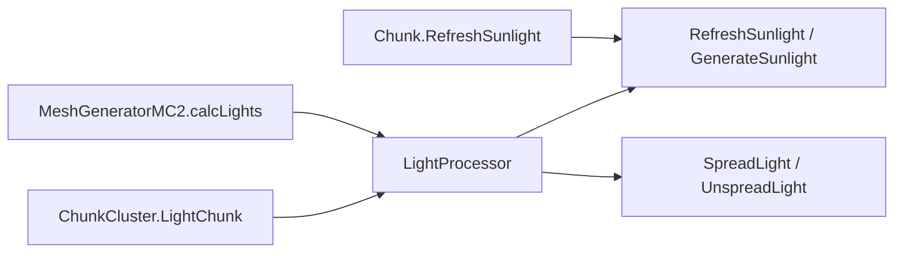
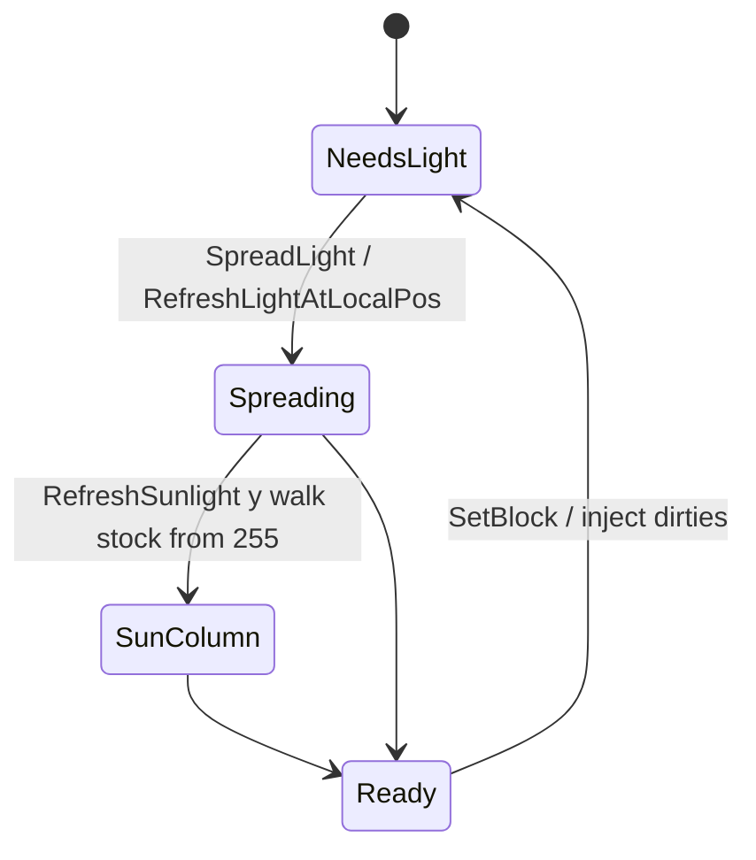

# Light, stability, mesh, water, deco (dedicated V3.0.1)

**Owns:** light/stability/mesh/water/deco method maps + stock 255 ceilings (generic engine).  
**Product expand checklist:** [`../../7days-realworld/docs/realearth-surfaces.md`](../../7days-realworld/docs/realearth-surfaces.md) §7.1.  
**Dumps:** `../il/dedi-complete-v3.0.1/` §7, `../il/realearth-surfaces-v3.0.1/` SAVE_LIGHT.  
**Hub:** [`INDEX.md`](INDEX.md).

---

## 1. Light

| Type | Key methods | IL |
|---|---|---:|
| `LightProcessor` | `LightChunk` | 53 |
| | `RefreshSunlightAtLocalPos` | 107 |
| | `RefreshLightAtLocalPos` | 128 |
| | `SpreadLight` / `UnspreadLight` | 116 / 125 |
| | `GenerateSunlight` | 27 |
| `Chunk.RefreshSunlight` | column walk | 112 |
| `GameLightManager` | `UpdateLightFrameUpdate` | 159 |
| | `FrameUpdate` | 175 |
| `MeshGeneratorMC2.calcLights` | mesh light sample | 289 |

### Hardcoded stock Y ceilings (expand risk)

| Site | Literal |
|---|---|
| `Chunk.RefreshSunlight` | starts y=**255** downward |
| `World.toBlockY` | `y & 255` |
| `LightProcessor.Refresh*` / Spread* | 255 / 256 |
| `MeshGeneratorMC2` light helpers | 255 |
| `Chunk.ResetStability*` | 256 |

Full scan list: `../../7days-realworld/docs/realearth-surfaces.md` §7.1.

---

## 2. Stability

| Type | Method | IL |
|---|---|---:|
| `StabilityCalculator` | `GetBlockStability` | 293 |
| | `CalcPhysicsStabilityToFall` | 266 |
| | `GetBlockStabilityIfPlaced` | 216 |
| | `BlockRemovedAt` / `physicsIsolation` | 126 / 125 |
| `StabilityInitializer` | `spreadVertical` / `unspreadVertical` | 152 / 154 |
| | `spreadHorizontal` / `unspreadHorizontal` | 127 / 136 |
| | `DistributeStability` | 72 |
| `ChunkCluster.CalcStability` | entry | - |
| `MultiBlockManager` | `UpdateOversizedStability` / alignment | from loop-complete |

---

## 3. Mesh

| Type | Method | IL | Dedi note |
|---|---|---:|---|
| `DynamicMeshManager.Update` | peer MB | **404** | Server queues |
| `DynamicMeshServer.Update` | | **452** | `NetPackageDynamicMesh` |
| `MeshDataManager.LateUpdate` | | 5 | From GM LateUpdate |
| `MeshGeneratorMC2.CreateMesh` | | 606 | |
| `ChunkCluster.RegenerateChunk` | | - | After dirty |
| `doCopyChunksToUnity` | | 252 | **Skipped on dedicated** |

---

## 4. Water

| Type | Method | IL |
|---|---|---:|
| `WaterSimulationNative.Update` | | **229** |
| | `InitializeChunk` / `Step` | 51 / 16 |
| `WaterEvaporationManager.UpdateEvaporation` | | **317** |
| `WaterSplashCubes.Update` | | **185** (always-path OnUpdateTick; skip candidate) |

---

## 5. Decoration

| Type | Method | IL |
|---|---|---:|
| `DecoManager.UpdateTick` | | **330** |
| `ChunkProviderGenerateWorld.updateDecosAllowedForChunk` | | 306 |
| `UpdateDecorations` / `updateDecorationsWherePossible` | | 4 / 42 |

## Changelog

- **2026-07-18:** Light/stability/mesh/water family from dedi-complete dump.
## Related docs

| Doc | Role |
|---|---|
| [realearth-surfaces.md](../../7days-realworld/docs/realearth-surfaces.md) | Expand checklist |
| [terrain-height.md](terrain-height.md) | YDim context |

## Changelog

- **2026-07-19:** Related docs table.
