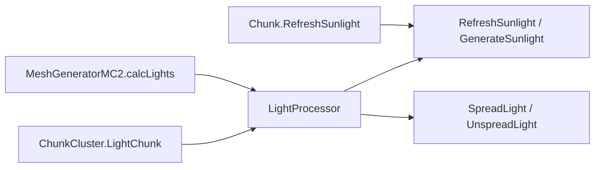
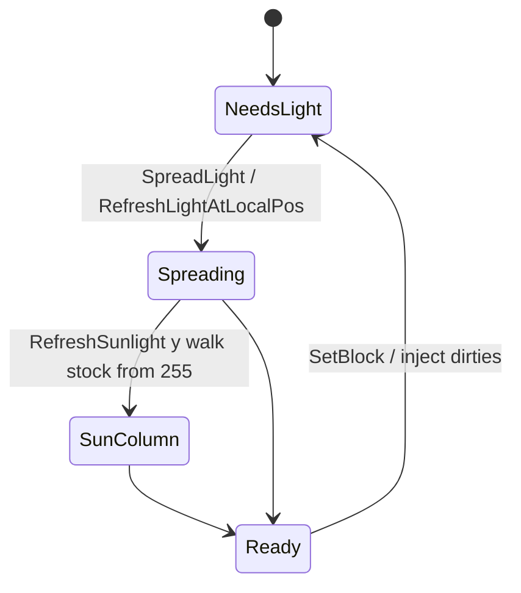
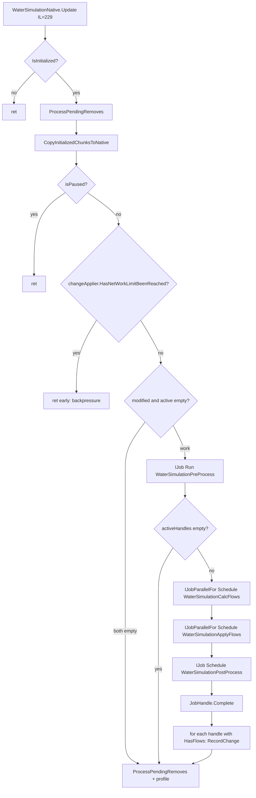
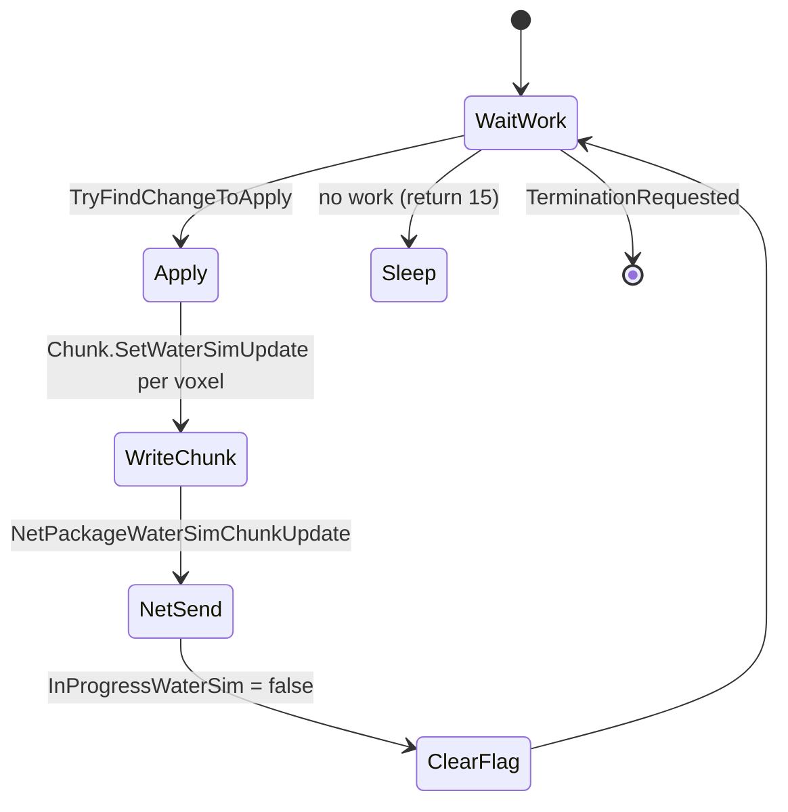

# Light, stability, mesh, water, deco (dedicated V3.1.0)

**Owns:** light/stability/mesh/water/deco method maps + stock 255 ceilings (generic engine); water section includes the jobified sim pipeline.  
**Product expand checklist:** `7days-realworld/docs/realearth-surfaces.md` §7.1.  
**Dumps:** `../il/dedi-complete-v3.1.0/` §7, `../il/realearth-surfaces-v3.1.0/` SAVE_LIGHT.  
**Hub:** [`INDEX.md`](INDEX.md).

---

## 1. Light





| Type | Key methods | IL |
|---|---|---:|
| `LightProcessor` | `LightChunk` | 53 |
| | `RefreshSunlightAtLocalPos` | 107 |
| | `RefreshLightAtLocalPos` | 128 |
| | `SpreadLight` / `UnspreadLight` | 116 / 125 |
| | `GenerateSunlight` | 27 |
| `Chunk.RefreshSunlight` | column walk | 112 |
| `GameLightManager` | `UpdateLightFrameUpdate` | 159 |
| | `FrameUpdate` | 175 |
| `MeshGeneratorMC2.calcLights` | mesh light sample | 289 |

**`World.GetLightBrightness(pos)` (IL=32)** (the query used by particle spawns
and turret fires): resolves the chunk via `GetChunkFromWorldPos` and, when it
exists, returns `chunk.GetLightBrightness(toBlockXZ(x), toBlockY(y),
toBlockXZ(z), 0)`; when the chunk is missing (unloaded area) it falls back to
the ambient constant `IsDaytime() ? 0.65 : 0.1`. The chunk half:
`Chunk.GetLightBrightness` (IL=10) is `GetLightValue / 15` (0-15 light grid
normalized), and `Chunk.GetLightValue(x, y, z, darknessValue)` (IL=30) is
`max(sun - darknessValue, blockLight)`: it reads the Sun channel, subtracts
the caller's darkness term, returns it when it is not 15, else returns the
max of that and the Block channel (`PrefabChunk` stubs both as constant 15 /
1.0). The channel read: `Chunk.GetLight(x, y, z, type)` (IL=28) masks x/z to
chunk-local coords (`& 15`), reads one byte from the `chnLight` channel, and
splits the **nibbles**: `Sun` is the low 4 bits (`light & 15`), `Block` the
high 4 bits (`light >> 4`). `ChunkCluster.GetLight(pos, type)` (IL=21) is the
world-coordinate wrapper: chunk lookup, `0` when the chunk is null, else
delegate.

**World query leaves:** `World.IsOpenSkyAbove(x, y, z)` (IL=23) is true when
the `ChunkCache` is null, else
`GetChunkSync(x >> 4, z >> 4).IsOpenSkyAbove(x & 15, y, z & 15)`.
`Chunk.IsOpenSkyAbove(x, y, z)` (IL=9) is `y >= GetHeight(x, z)` (at or above
the terrain height for that column).
`World.IsWaterInBounds(aabb)` (IL=74) walks the integer cell range
`[floor(min), floor(max) + 1)` per axis and returns true when any
`WorldBase.IsWater(x, y, z)` cell is water.

**`Chunk.IsNeighbourChunksLit(neighbours)` (IL=26)** is the light-completion
gate: true only when every non-null neighbour chunk has cleared its volatile
`NeedsLightCalculation` flag (a null neighbour fails the test). The decoration
twin `IsNeighbourChunksDecorated` (IL=26) tests the same pattern against
`NeedsDecoration`. `Chunk.CheckSameLight` (IL=4) runs the light channel's
`CheckSameValue` fast-path compaction check.

**Light-block state bits (V3.1.0 b14):** `BlockLight.IsLightOn(bv)` (IL=7)
is `(meta & 2) != 0` - bit 1 of the block's meta is the light-on flag;
`BlockLight.SetLightState(world, pos, bv, isOn)` (IL=15) writes it with
`meta = (meta & ~3) | (isOn ? 2 : 0)` (the trigger and light state share the
low meta bits).

### Hardcoded stock Y ceilings (expand risk)

| Site | Literal |
|---|---|
| `Chunk.RefreshSunlight` | starts y=**255** downward |
| `World.toBlockY` | `y & 255` |
| `LightProcessor.Refresh*` / Spread* | 255 / 256 |
| `MeshGeneratorMC2` light helpers | 255 |
| `Chunk.ResetStability*` | 256 |

Full scan list: `7days-realworld/docs/realearth-surfaces.md` §7.1.

---

## 2. Stability

| Type | Method | IL |
|---|---|---:|
| `StabilityCalculator` | `GetBlockStability` | 293 |
| | `CalcPhysicsStabilityToFall` | 266 |
| | `GetBlockStabilityIfPlaced` | 216 |
| | `BlockRemovedAt` / `physicsIsolation` | 126 / 125 |
| `StabilityInitializer` | `spreadVertical` / `unspreadVertical` | 152 / 154 |
| | `spreadHorizontal` / `unspreadHorizontal` | 127 / 136 |
| | `DistributeStability` | 72 |
| `ChunkCluster.CalcStability` | entry | - |
| `MultiBlockManager` | `UpdateOversizedStability` / alignment | from loop-complete |

---

## 3. Mesh

| Type | Method | IL | Dedi note |
|---|---|---:|---|
| `DynamicMeshManager.Update` | peer MB | **404** | Server queues |
| `DynamicMeshServer.Update` | | **452** | `NetPackageDynamicMesh` |
| `MeshDataManager.LateUpdate` | | 5 | From GM LateUpdate |
| `MeshGeneratorMC2.CreateMesh` | | 606 | |
| `ChunkCluster.RegenerateChunk` | | - | After dirty |
| `doCopyChunksToUnity` | | 252 | **Skipped on dedicated** |

---

## 4. Water

Server water is a **jobified mass-flow sim** owned by singleton `WaterSimulationNative`,
not a per-block script. The apply stage runs on a **worker thread** and ships
`NetPackageWaterSimChunkUpdate` to nearby clients under a byte budget. Evaporation
is a separate scheduled-block path. Splash cubes are client-facing particles.

### 4.1 Call sites (verified)

| Caller | Callee | Notes |
|---|---|---|
| `GameManager.gmUpdate` | `WaterSimulationNative.Step` | IL offset in gmUpdate ~0x3F9 (`tools/src/Xref`) |
| `GameManager.gmUpdate` | `WaterEvaporationManager.UpdateEvaporation` | IL ~0x408 |
| `WaterSimulationNative.Step` | `WaterSimulationNative.Update` | only when currently paused (single-step) |
| `WaterSimulationApplyChanges.ThreadLoop` | `ApplyChanges` | worker thread |

`Step` is a pause toggle helper: if not paused, set paused and return; if paused,
clear pause, run one `Update`, re-pause. The steady dedicated path is the
gmUpdate call into `Step`/`Update` depending on pause state (live server is
normally unpaused, so `Update` runs from the same peer path as other managers;
see [loop-gmupdate.md](loop-gmupdate.md)).

### 4.2 Data model

| Type | Kind | Role |
|---|---|---|
| `WaterValue` | struct | one `UInt16 mass`; wire `Write`/`Read` as u16 |
| `WaterDataHandle` | struct (native-ish) | per-chunk sim state: mass grid, solid flags, active bits, flow map, cross-chunk queues |
| `WaterVoxelState` | struct | `Byte stateBits` solid faces (Y+/Y-/XZ) |
| `WaterNeighborCacheNative` | helper | resolve neighbor chunk handles by `int2` offset |
| `WaterConstants` | static | mass thresholds (`MIN_MASS`, `MAX_MASS`, `OVERFULL_MAX`, `MIN_FLOW`, `FLOW_SPEED`, `MIN_MASS_SIDE_SPREAD`) |
| `WaterSimulationNative/ChunkHandle` | nested | `Chunk.AssignWaterSimHandle` facade: `SetVoxelSolid`, `SetWaterMass`, `WakeNeighbours` |
| `WaterSimulationApplyChanges` | class | change queue + **ThreadLoop** write-back + net send |
| `NetPackageWaterSimChunkUpdate` | wire | per-chunk packed voxel mass updates |

**Mass semantics (from `WaterValue` / `WaterUtils` IL):**

- Storage is `UInt16 mass` (field).
- `GetMass()` returns that field.
- Display/level: `GetMassPercent` treats mass `<= 195` as empty (0%), `>= 15600` as full (1%), else `(mass - 195) / 15405`.
- `WaterUtils.GetWaterLevel` is a binary "has visible water" gate: mass `> 195` -> 1 else 0.
- Column stability helper `WaterConstants.GetStableMassBelow(mass, massBelow)` = `min(mass + massBelow, 19500)`.
- Flow "full cell" constant used in calc/overfull paths: **19500** (same scale as stable max).

**World water query:** `World.GetWaterPercent(pos)` (IL=14) returns `0` when
the `ChunkCache` is null, else `ChunkCluster.GetWater(pos).GetMassPercent()`.

**Cluster water accessors:** `ChunkCluster.GetWater(pos)` (IL=23) returns
`WaterValue.Empty` for `y >= 256` or a missing chunk, else
`chunk.GetWater(toBlockXZ(x), y, toBlockXZ(z))`. `SetWater(pos, water)`
(IL=34) writes `Chunk.SetWater(lx, ly, lz, water)` (no-op on a missing chunk)
and flags `chunkPosNeedsRegeneration` for the cell.

**Water leaves:** `WaterValue.HasMass()` (IL=5) is `mass > 195` (the same
empty boundary as `GetMassPercent`). `WaterUtils.GetVoxelKey2D(x, z)` (IL=8)
is `x * 8976890 + z * 981131` (the 2D voxel key). `IsVoxelOutsideChunk(nx, nz)`
(IL=15) is a neighbor local coord outside `[0, 15]`;
`IsChunkSafeToUpdate(chunk)` (IL=16) requires the chunk non-null with
`!NeedsDecoration && !NeedsCopying && !IsLocked`.

**Water queries:** `World.IsWater(x, y, z)` (IL=31) is false for `y >= 256`
or a missing chunk, else `chunk.IsWater(x & 15, y & 255, z & 15)`; the
`Vector3i` (IL=9) and `Vector3` (IL=5) overloads forward through it.

**`Chunk.SetWaterRaw(x, y, z, data)` (IL=55)** is the silent channel write:
a cell whose block `!CanWaterFlowThrough` has its mass zeroed first, then
`chnWater.Set(...)` with the raw value, the dirty flags
(`bEmptyDirty`/`bMapDirty`/`isModified`) set, `waterSimHandle.SetWaterMass`
mirrors the value into the native sim, and a mass-bearing cell above the
heightmap raises `m_HeightMap` at that column.
`Chunk.SetWater` (IL=13) is `SetWaterRaw` plus
`waterSimHandle.WakeNeighbours(x, y, z)` (the full write wakes the sim);
`ResetWaterSimHandle` (IL=4) resets the sim handle.
`Chunk.GetWater(x, y, z)` (IL=8) is `WaterValue.FromRawData(chnWater.Get(...))`
(`PrefabChunk` routes through the prefab after a coordinate check).
`World.GetWaterAt(worldX, worldZ)` (IL=53) is the RWG water-grid probe: it
requires the `ChunkProviderGenerateWorldFromRaw` `poiFromImage` grid to
contain the point, resolves the byte via
`Biomes.getPoiForColor`, and answers `m_BlockValue.type == 240` (the water
block). `WorldBiomes.getPoiForColor` (IL=10) is the `m_PoiMap`
color-to-element dictionary lookup (null on miss).

**Flow-through gate:** `WaterUtils.CanWaterFlowThrough(BlockValue)` is false for air/null block; true when `Block.WaterFlowMask != 63` (63 = all six faces blocked).

**`WaterDataHandle` fields (metadata):** `voxelData` (mass), `voxelState`, `groundWaterHeights`, `activeVoxels`, `flowVoxels`, `flowsFromOtherChunks`, `activationsFromOtherChunks`, `voxelsToWakeup`.

### 4.3 Pipeline (one `WaterSimulationNative.Update`)



**Early exits (verified in Update IL):**

1. Not initialized.
2. `isPaused`.
3. `WaterSimulationApplyChanges.HasNetWorkLimitBeenReached` (server, clients present, `networkMeasure.totalSent > networkMaxBytesPerSecond`).
4. Both `modifiedChunks` and `activeHandles` empty (still runs trailing remove/profile path).

**Job chain (verified):**

| Stage | Job API | Type | IL | Work |
|---|---|---|---:|---|
| Pre | `IJobExtensions.Run` (main, sync) | `WaterSimulationPreProcess` | 173 | promote wakeups into `activeHandles`, `TryTrackChunk` for 4-neighbors of modified set, clear `modifiedChunks` |
| Calc | `IJobParallelFor.Schedule` | `WaterSimulationCalcFlows` | Execute 26 / ProcessFlows **265** | per active chunk, for each active voxel: gravity below, overfull up, 4-side spread, groundwater sides |
| Apply | `IJobParallelFor.Schedule` (depends on Calc) | `WaterSimulationApplyFlows` | 133 | `ApplyEnqueuedFlows`, wake neighbors, mark non-flowing chunks |
| Post | `IJob.Schedule` (depends on Apply) | `WaterSimulationPostProcess` | 67 | drop non-flowing from active set; apply cross-chunk activations |

Batch size for parallel jobs: `chunkCount / JobWorkerCount + 1`.

After jobs complete, main thread walks every `waterDataHandles` entry with `HasFlows`, builds a `ChangesForChunk.Writer` via `changeApplier.GetChangeWriter(MakeChunkKey)`, and `RecordChange(voxelIndex, WaterValue(mass))` for each flow voxel, then clears `flowVoxels`.

### 4.4 Flow rules (`WaterSimulationCalcFlows.ProcessFlows`)

Per active voxel (active bitset enumerator):

1. Read mass; if solid (`WaterVoxelState.IsSolid`) -> deactivate.
2. If in groundwater column (`IsInGroundWater`): four `ProcessGroundWaterFlowSide` calls, then maybe deactivate.
3. Else surface/free water:
   - `ProcessFlowBelow` (IL=105): blocked by solid Y- / neighbor solid Y+; uses `GetStableMassBelow`; applies mass delta via `ApplyFlow`.
   - `ProcessOverfull` (IL=85): if mass above **19500**, push excess upward when Y+ free (const 255 appears as a face/level helper in the same method).
   - Four `ProcessFlowSide` (IL=168): XZ solid mask, `WaterNeighborCacheNative.TryGetNeighbor` for cross-chunk, may `EnqueueFlow` into neighbor handle when `ChunkKey` differs.

Cross-chunk mass moves are deferred through `flowsFromOtherChunks` / `EnqueueFlow` and applied in the ApplyFlows stage (`ApplyEnqueuedFlows` drains the fixed buffer into `ApplyFlow`).

### 4.5 Chunk registration

`InitializeChunk` / `Init` (IL=51 / long init path):

1. Require initialized + chunk in world bounds.
2. Reuse or `WaterDataHandle.AllocateNew`.
3. `InitializeFromChunk(Chunk, GroundWaterHeightMap)` (IL=154): walk **16x16x256** local voxels, `GetBlockNoDamage` -> solid flags, `GetWater` -> mass, optional groundwater column bounds via `GroundWaterHeightMap.TryGetWaterHeightAt` + `FindGroundWaterBottom`.
4. Queue handle init, `Chunk.AssignWaterSimHandle(ChunkHandle)`.
5. If handle has active water, add chunk key to `activeHandles`.

### 4.6 Apply thread and wire

`WaterSimulationApplyChanges` owns a dedicated **ThreadLoop** (server only for net measure):



`ApplyChanges` (IL=254):

1. `SetupForSend(Chunk)` -> package.
2. For each changed voxel: decode coords, `Chunk.SetWaterSimUpdate` (writes channel, may `World.HandleWaterLevelChanged`, respects `CanWaterFlowThrough`), `NetPackageWaterSimChunkUpdate.AddChange(UInt16, WaterValue)`.
3. `FinalizeSend` + `SendUpdateToClients` (register queue, send to `clientsNearChunkBuffer`, sum lengths, `SendQueueHandled`).
4. Mark this chunk and 4-neighbors `NeedsRegenerationOrBits`.
5. `NetPackageMeasure.AddSample`.

`Chunk.SetWaterSimUpdate` (IL=75): refuses flow into non-flow-through blocks; stores via `ChunkBlockChannel.GetSet` of `WaterValue.RawData`; fires `HandleWaterLevelChanged` when mass changes.

**Client/listen apply path:** `NetPackageWaterSimChunkUpdate.ProcessPackage` re-enters the same `GetChangeWriter`/`RecordChange` path on the local `WaterSimulationNative.Instance` (so remote updates merge into the same apply queue). Package `read` copies a length-prefixed blob into a pooled memory stream; `ProcessPackage` then decodes the **inner** layout:

```text
// outer write: sendLength:i32 + sendBytes
// inner (sendBytes):
chunkX:i32, chunkZ:i32, count:i32
count x { voxelIndex:u16, mass:u16 }
```

`WaterValue` on the wire is **mass only** (`Write`/`Read` = u16). Full wire note:
[protocol-packages.md](protocol-packages.md) section 6.9.

**Related packages:** `NetPackageWaterSet` (manual/console): `senderEntityId` +
u16 count of `{ worldPos, WaterValue }`; server rebroadcasts (flags 192) then
`SetWater` + `HandleWaterLevelChanged` (section 6.10).

`GameManager.SetWaterRPC(package)` (IL=41) is the server entry for that
package: `NetPackageWaterSet.ApplyChanges(ChunkCache)` when world and cache
exist, stamps `SetSenderId` (dedicated ? -1 : myPlayerId), then either
`ConnectionManager.SendPackage(package, false, -1, -1, -1, null, **192**, false)`
on the server or `SendToServer(package, false)` on a client.

### 4.7 Evaporation and splash

| Type | Method | IL | Role |
|---|---|---:|---|
| `WaterEvaporationManager.UpdateEvaporation` | from gmUpdate | **317** | locked walk of evap + rest lists; schedules `WorldBlockTicker.AddScheduledBlockUpdate` when timers elapse |
| `WaterSplashCubes.Update` | OnUpdateTick path | **185** | particle placements; always-path cost on dedicated (skip candidate for optim, not a sim correctness path) |

Evaporation does **not** call into `WaterSimulationNative` jobs directly; it schedules block updates that eventually change water/block state through the normal ticker.

### 4.8 Method map (this pass)

| Type | Method | IL | Status |
|---|---|---:|---|
| `WaterSimulationNative` | `Update` | **229** | verified job graph + harvest |
| `WaterSimulationNative` | `Step` | 16 | verified pause single-step |
| `WaterSimulationNative` | `InitializeChunk` | 51 | verified |
| `WaterSimulationNative` | `Init` | (large) | handle map setup |
| `WaterSimulationPreProcess` | `Execute` | 173 | verified |
| `WaterSimulationCalcFlows` | `ProcessFlows` | **265** | verified order of rules |
| `WaterSimulationCalcFlows` | `ProcessFlowBelow` / `Side` / `Overfull` | 105 / 168 / 85 | verified callees |
| `WaterSimulationApplyFlows` | `Execute` | 133 | verified |
| `WaterSimulationPostProcess` | `Execute` | 67 | verified |
| `WaterSimulationApplyChanges` | `ThreadLoop` / `ApplyChanges` / `SendUpdateToClients` | 56 / **254** / 30 | verified |
| `WaterSimulationApplyChanges` | `HasNetWorkLimitBeenReached` | 37 | verified backpressure |
| `WaterDataHandle` | `InitializeFromChunk` / `ApplyEnqueuedFlows` | 154 / 29 | verified |
| `WaterValue` | mass u16 + percent | 3 / 20 | verified |
| `WaterUtils` | `CanWaterFlowThrough` / `GetWaterLevel` | 14 / 8 | verified |
| `WaterConstants` | `GetStableMassBelow` | 6 | verified min(..., 19500) |
| `WaterEvaporationManager` | `UpdateEvaporation` | **317** | verified ticker scheduling |
| `WaterSplashCubes` | `Update` | 185 | mapped (client particles) |

Apply-stage prose also in [dedicated-misc-systems.md](dedicated-misc-systems.md) (`WaterSimulationApplyChanges`, `WaterUtils`, `ChunkHandle`). Leaves for the job structs are in [inventories/dedicated-leaves.md](inventories/dedicated-leaves.md) (light-mesh-water group).

### 4.9 Residuals / not closed here

| Item | Why |
|---|---|
| Exact numeric values of all `WaterConstants` static fields beyond 19500 / 195 / 15600 | need static ctor / literal dump per field (only `GetStableMassBelow` and percent math closed) |
| Full bit layout of `WaterVoxelState.stateBits` | methods `IsSolidYNeg` etc. named; bit indices not fully tabulated this pass |
| Native Burst/job safety details | Unity Jobs black box below managed schedule calls |
| `WaterSplashCubes` particle content | client VFX |

---

## 5. Decoration

| Type | Method | IL |
|---|---|---:|
| `DecoManager.UpdateTick` | | **330** |
| `BlockLiquidv2.Emissions` | | **9** | if rotation==8 use meta2 else `MAX_EMISSIONS` |
| `BlockLiquidv2.ChangeToAir` | | **33** | splash remove; SetBlockRPC Air; reschedule WBT |
| `BlockLiquidv2.ChangeThis` | | **69** | pack liquid word (below) |
| `BlockLiquidv2.CheckUpdate` | | **22** | rate limit: blockUpdates &gt; blockUpdatesPerSecond/2 → false |
| `BlockLiquidv2.CheckDeepWater_Expensive` | | **51** | true if ≥6 water cells stacked above |
| `BlockLiquidv2.HasHoles` | | **89** | faces-drawn bitfield vs 255/63 water hole test |
| `BlockLiquidv2.UpdateTick` | | **1106** | hole/air/plant/emission/deep-water → ChangeThis/ChangeToAir |

**`ChangeThis` full pack (IL=69):** if rotation != 8 force emissions to
`MAX_EMISSIONS`; clamp emissions; write `blockID` into rawData; `SetBlockState`;
`meta2 = emissions`; `rotation = 8`; `damage = evaporation + (flowDir ? 50+flowDir : 0)`;
`SetBlockRPC`. WBT schedule delay: state 0 → **60** ticks, state 2 → **1** tick,
else **1000** ticks.

**Damage packing helpers:**

- `Evap` (IL=9): if `damage <= 45` return damage else 0 (evap lives in 0..45).
- `Flow` (IL=11): if `damage > 50` return `damage - 50` else 0 (flow enum in
  residual above 50).
- `IncEvap`: if damage &gt; 45 reset to 0 then `damage++`.
- `GetFlowDirection`: 1=+Z, 2=+X, 3=-Z, 4=-X.
| `ChunkProviderGenerateWorld.updateDecosAllowedForChunk` | | 306 |
| `UpdateDecorations` / `updateDecorationsWherePossible` | | 4 / 42 |

## Related docs

| Doc | Role |
|---|---|
| `realearth-surfaces.md` | Expand checklist |
| [terrain-height.md](terrain-height.md) | YDim context |
| [dedicated-misc-systems.md](dedicated-misc-systems.md) | ApplyChanges / ChunkHandle short form |
| [loop-gmupdate.md](loop-gmupdate.md) | gmUpdate call order |
| [inventories/netpackage-bodies.md](inventories/netpackage-bodies.md) | `NetPackageWaterSimChunkUpdate` / `WaterValue` wire |
| [inventories/dedicated-leaves.md](inventories/dedicated-leaves.md) | job struct leaf rows |

## Changelog

- **2026-08-07:** BlockLight state bits: IsLightOn (IL=7) meta & 2;
  SetLightState (IL=15) (meta & ~3) | (isOn?2:0) - trigger/light share low
  meta bits.
- **2026-08-07:** Chunk.GetLight (IL=28) nibble packing: Sun = low 4 bits,
  Block = high 4 bits of the chnLight byte, x/z masked to chunk-local;
  ChunkCluster.GetLight (IL=21) world wrapper with null -> 0.
- **2026-08-07:** Light query chain: Chunk.GetLightBrightness (IL=10) =
  GetLightValue/15; GetLightValue (IL=30) = max(sun - darkness, blockLight),
  sun channel returned unless 15; PrefabChunk stubs constant 15/1.
- **2026-08-07:** World.GetLightBrightness (IL=32): chunk lookup +
  chunk.GetLightBrightness(...,0) or unloaded fallback IsDaytime()?0.65:0.1.
- **2026-08-07:** Evap ≤45 / Flow damage-50; GetFlowDirection axes; ChangeThis pack
  (meta2/rotation 8, WBT 60/1/1000); CheckUpdate; CheckDeepWater ≥6.
- **2026-08-07:** BlockLiquidv2 Emissions (rotation 8 / meta2), ChangeToAir +
  WBT reschedule, HasHoles faces bitfield, UpdateTick IL size.
- **2026-07-28:** WaterSimChunkUpdate outer/inner wire; WaterValue mass-only; WaterSet rebroadcast.

- **2026-07-28:** Full water-sim pipeline from IL (`WaterSimulationNative.Update` job graph, flow rules, apply thread, mass constants, net backpressure).
- **2026-07-19:** Related docs table.
- **2026-07-18:** Light/stability/mesh/water family from dedi-complete dump.
