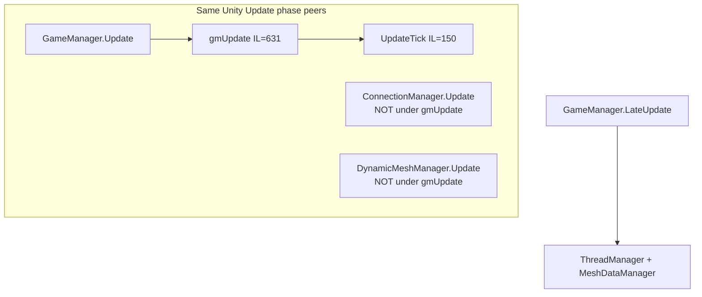

# `gmUpdate` structure (V3.1.0 dedicated RE)

**Owns:** gmUpdate phase narrative (detail under [`loop.md`](loop.md) §2).  
**Call list:** [`inventories/gmupdate-calls.md`](inventories/gmupdate-calls.md).  
**Dump set:** [`../il/loop-complete-v3.1.0/`](../il/loop-complete-v3.1.0) (historical path name; IL size still 631 on V3.1.0).  
**Hub:** [`INDEX.md`](INDEX.md).

**Assembly:** dedicated `Assembly-CSharp.dll` V **3.1.0 (b14)** (gmUpdate IL=631 unchanged from V3.0.1)  
**Tool:** `tools/legacy/DumpGmUpdate.cs` (pre-corrupted; use `tools/src/DumpMethod` instead, see §10)  
**Optim summary:** [`../../7dtd-optimizer/docs/ARCHITECTURE.md`](../../7dtd-optimizer/docs/ARCHITECTURE.md)

---

## 1. Entry points (Unity player loop)

Stock does **not** put all work in one method. Multiple `MonoBehaviour.Update` / `LateUpdate` run per frame:

| Component | Base | Method | IL | Role |
|---|---|---|---:|---|
| **GameManager** | `MonoBehaviour` | `Update` | 3 | **Only** calls `gmUpdate()` |
| **GameManager** | | `gmUpdate` | **631** | Main orchestration (managers, timer, `UpdateTick`, GC/save side paths) |
| **GameManager** | | `UpdateTick` | 150 | **Sim core:** world tick, entities, fall, server net distribute/chunks |
| **GameManager** | | `FixedUpdate` | 5 | Increments `fixedUpdateCount` only |
| **GameManager** | | `LateUpdate` | 18 | `ThreadManager.LateUpdate`, platform late, AIDirector debug, multiplayer services, **`MeshDataManager.LateUpdate`** |
| **ConnectionManager** | `SingletonMonoBehaviour<>` | `Update` | 215 | **Separate** from `gmUpdate`: protocol, package process, flush, pings |
| **DynamicMeshManager** | `MonoBehaviour` | `Update` | 404 | **Separate** mesh/region/coroutine pipeline; server branch calls `DynamicMeshServer.Update` |



**Conductor implication:** hijacking only `gmUpdate` does **not** own net or dynamic mesh. Those are peer MonoBehaviours on the same player loop.

---

## 2. `GameManager.gmUpdate` phases (ordered)

IL count **631**, **14** locals, **1** exception handler (destroy queue lock).  
`get_IsDedicatedServer()` appears **6** times.

### Phase A: Frame prologue

| Order | Call | Notes |
|---:|---|---|
| 1 | `Time.frameCount` / `Time.time` | Frame identity |
| 2 | `updatePauseState` | Pause |
| 3 | `GameOptionsManager.CheckResolution` | Client-ish |
| 4 | `ModEvents.SUnityUpdateData.Invoke` | Early mod hook |
| 5 | `handleGlobalActions` | Console/global actions |
| 6 | `ReportUnusedAssets` | May early-`ret` on some path |
| 7 | If `timeScale <= 0`: `Physics.SyncTransforms` | Paused physics sync |
| 8 | `LoadManager.Update` | Async loads |
| 9 | `PlatformManager.Update` | Platform |
| 10 | `InviteManager` / `LockManager` Update | Optional singletons |
| 11 | FPS stopwatch restart + `FPS.Update` | FPS counter |
| 12 | `BlockLiquidv2.UpdateTime` | Liquid time |

#### Phase A2: `updatePauseState` (IL=94)

`Pause(bool)` (IL=5) only stores `requestedPauseState`; the apply happens here
every frame (also reachable from `Disconnect`):

1. No pending request → return.
2. Clear `requestedPauseState`; if the new state equals `gamePaused` → return.
3. **Force-unpause override:** if `ConnectionManager.IsSinglePlayer()` and
   gamemode != `GameModeEditWorld` and `GameStats.GetInt(0) != 0` → state = false
   (single-player cannot pause mid-save/round; not applicable on dedicated).
4. `SetPauseWindowEffects(state)`: when pausing and not
   `GameModeSurvivalSP`: clear `AimingGun` on every local player (client-only;
   no local players on dedicated).
5. **Pause:** `GameStats.Set(0, 2)`; if `IsServer()` →
   `SaveLocalPlayerData()` + `SaveWorld()` (a pause triggers a world save);
   `Time.timeScale = 0`; stop gamepad vibration if primary player exists.
6. **Unpause:** if `GameStats.GetInt(0) != 0` → `GameStats.Set(0, 1)` (round
   becomes active); `Time.timeScale = 1`.
7. If `gamePaused` actually flips and world exists: pause → audio
   `PauseGameplayAudio` + `EnvironmentAudioManager.Pause` +
   `dmsConductor.OnPauseGame`; unpause → matching `UnPause*`. Store `gamePaused`.

`IsPaused()` (IL=3) reads `gamePaused`. `SetToolTipPause` (IL=10) early-returns
on dedicated (client UI only).

### Phase B: Optional singleton managers (null-checked chain)

Rough order (each guarded `brfalse` if instance missing):

1. `QuestEventManager.Update`  
2. `TriggerManager.Update`  
3. `TwitchVoteScheduler.Update(deltaTime)`  
4. `TwitchManager.Update(unscaledDeltaTime)`  
5. `GameEventManager.Update(deltaTime)`  
6. **`PowerManager.Update`**  
7. `PartyManager.Update`  
8. **`VehicleManager.Update`**  
9. **`DroneManager.Update`**  
10. `DismembermentManager.Update`  
11. **`TurretTracker.Update`**  
12. `RaycastPathManager.Update`  
13. `TokenManager.Update`  
14. `TrajectorySimulation.UpdateSimulationQueue`  
15. `FactionManager.Update` (conditional)  
16. `NavObjectManager.Update`  
17. `BlockedPlayerList.Update`  
18. `PrefabEditModeManager.Update` (edit mode)  
19. `TriggerEffectManager.Update`  
20. `SpeedTreeWindHistoryBufferManager.Update`  
21. **`ThreadManager.UpdateMainThreadTasks()`** (**IL=64**): fire `UpdateEv`;
    `MainThreadScheduler.ProcessTasks()`; under lock swap `mainThreadTasks` with
    `mainThreadTasksCopy` (double-buffer); invoke each `taskDelegate(parameter)`;
    clear copy.  

**Dedicated:** many of these still run if instances exist. Twitch/edit/nav/speedtree are often no-ops or waste if constructed.

### Phase C: Client-only UI / EAC / cursor (skipped when dedicated)

At `IL_01F0`: `get_IsDedicatedServer()` → **`brtrue` jump over** large client block (~ to `IL_0337`):

- AntiCheat client violation message UI  
- Cursor enable / focus / input style  
- `UpdateFPSCap` sits after that block’s non-dedicated path  

Exact skip target: dedicated jumps to destroy-list / game-started region (see `GameManager_gmUpdate_flow.md`).

### Phase D: Destroy queue (locked)

`Monitor.Enter` on list sync root → destroy queued `GameObject`s → `finally` `Monitor.Exit`.  
One of the few explicit locks in this method.

### Phase E: Game-started gate

If `!GameStateManager.IsGameStarted()`:

- `GameTimer.Reset`  
- **`ret`** (no world sim this frame)

### Phase F: Pre-sim world-adjacent work

| Call | Notes |
|---|---|
| **`EntityAsyncManager.Update`** | Drain completed async entity-create handles (queue peek/dequeue). Small (22 IL). Stock already uses async creation completion on main. |
| `GameTimer.updateTimer(bool)` | Dedicated path uses **player count == 0** as part of the bool (idle-ish timer behavior) |
| `updateBlockParticles` | Particles |
| `updateTimeOfDay` | TOD |
| `Audio.Manager.FrameUpdate` | Audio |
| `WaterSimulationNative.Update` | Water |
| `SignTextureManager.MainThreadUpdate` | Signs |
| `WaterEvaporationManager.UpdateEvaporation` | Evap |

Chunk load gating (simplified from flow):

- May call `ChunkManager.DetermineChunksToLoad` when force-update or player-count conditions say so  
- Dedicated + **zero players** has special branches (idle server less chunk work / early paths)

Optional idle cleanup:

- Log + `MemoryPools.Cleanup` + `World.ClearCaches` under deltaTime / player-count gates  

### Phase G: **`UpdateTick()`** (sim core)

Single call: `GameManager.UpdateTick()`, see §3.  
If it signals abort (`brtrue` / early ret patterns in caller), `gmUpdate` can return before post-tick work.

### Phase H: Post-tick presentation / chunks / explode

| Call | Dedicated? |
|---|---|
| `ChunkManager.GroundAlignFrameUpdate` | Yes if world running |
| `ChunkManager.CopyChunksToUnity` (budgeted micros loop) | **Skipped when dedicated** (`IsDedicatedServer` brtrue over copy loop) |
| `PrefabLODManager.FrameUpdate` | Conditional |
| `ExplodeGroupFrameUpdate` | Yes |

### Phase I: Memory / GC / save / packages (server branches)

Several **deltaTime-gated** sections:

- Memory log via `ConsoleCmdMem.GetStats` when client count conditions hit  
- **Server only** (`ConnectionManager.IsServer`):  
  - `IChunkProvider.Update`  
  - Possible `World.SaveWorldState`, `NameIdMapping.SaveIfDirty`, `EventPrefabs.Save`  
  - Possible `NetPackagePersistentPlayerPositions` broadcast when clients &gt; 0 and timers allow  
- **Dedicated-only** path can call **`GC.Collect()`** under a deltaTime gate (explicit hitch risk)  
- Non-dedicated: GameSense, local player save countdown, `Resources.UnloadUnusedAssets` with stopwatch log  

### Phase J: Epilogue

- `StabilityViewer.Update` (optional)  
- **`ModEvents.SGameUpdateData.Invoke`**, late mod hook  
- `GameObjectPool.FrameUpdate`  
- `ret`

---

## 3. `GameManager.UpdateTick` (sim core, 150 IL)

Called **only** from `gmUpdate` (among scanned callers).

### 3.1 Entity slice-only path (when game timer not ready)

```text
GameTimer.Instance  (ticks comparison)
  if timer says "not a full tick" AND players.Count > 0:
       World.TickEntitiesSlice()   // continue draining prior list
       ret
  else:
       World.TickEntitiesFlush()   // finish remaining entities first
       ... full tick path ...
```

**Meaning:** entity work is intentionally **spread across Unity frames** between authoritative game ticks. A conductor must preserve this or change fidelity of “who ticks when.”

### 3.2 Full tick path (ordered)

| # | Call | Server? | Role |
|---:|---|---|---|
| 1 | `TickEntitiesFlush` | | Finish leftover entity slices from previous frames |
| 2 | `World.OnUpdateTick(dt, activeChunkSet)` | | World systems + server spawn/AIDirector/sleepers |
| 3 | `GameStateManager.OnUpdateTick` | server only | Can abort tick (`ret`) |
| 4 | **`World.TickEntities(dt)`** | | Build list, activity, set slice budget (may not tick all this frame) |
| 5 | **`World.LetBlocksFall()`** | | Falling blocks |
| 6 | `SetEntitiesVisibleNearToLocalPlayer` | **not dedicated** | Client visibility |
| 7 | **`NetEntityDistribution.OnUpdateEntities`** | server | Relevance / entity net |
| 8 | **`ChunkManager.SendChunksToClients`** | server | Chunk streaming to clients |
| 9 | Optional `ChunkProviderGenerateWorld.MainThreadCacheProtectedPositions` | server | |
| 10 | Optional `IChunkProvider.SaveRandomChunks` | server | Streaming save |
| 11 | Optional `World.SaveDecorations` / `EventPrefabs.Save` | server | Periodic |
| 12 | `updateSendClientPlayerPositionToServer` | client path | |
| 13 | Rich presence update | platform | |

---

## 4. `World.OnUpdateTick` (189 IL)

Always (before server gate):

1. `updateChunkAddedRemovedCallbacks`  
2. `WorldEventUpdateTime`  
3. **`WaterSplashCubes.Update`**  
4. **`DecoManager.UpdateTick(World)`**  
5. **`MultiBlockManager.MainThreadUpdate`**  
6. If not editor: **`DynamicMusic.Conductor.Update`**  
7. `checkPOIUnculling` / `updateChunksToUncull`  

If `!ConnectionManager.IsServer` → **`ret`** (client stops here).

**Server continuation:**

8. **`WorldBlockTicker.Tick(activeChunks, …)`**, scheduled block updates  
9. **Every 20 game ticks** (timer modulo): walk **area-master** chunks in active set:  
   - biome spawn data checks  
   - `SpawnManagerAbstract.Update(...)` for biome spawning  
10. Optional second spawn manager path from game prefs string  
11. **`AIDirector.Tick(double)`**  
12. **`TickSleeperVolumes()`**  

**Lag levers:** deco, music, splash, full area-master spawn walk, sleepers, block ticker. EfficientServer already targets some presentation; spawn walk is a **candidate** to scope.

---

## 5. Entity pipeline

### 5.1 `World.TickEntities(dt)` (117 IL)

1. Update frame-count EMA:  
   `framesSince = max(1, frameCount - tickEntityFrameCount)`  
   `tickEntityFrameCountAverage = avg*0.8 + framesSince*0.2`  
2. `tickEntityPartialTicks = dt`  
3. `tickEntityIndex = 0`  
4. **Clear** `tickEntityList`  
5. Copy all `Entities.list` except primary local player into `tickEntityList`  
6. If local player exists: **`TickEntity(localPlayer, dt)` immediately**  
7. **`EntityActivityUpdate()`**, sets `aiActiveScale`, cloth/jiggle  
8. Compute slice budget from EMA (exact IL):  
   ```text
   span = (int)(tickEntityFrameCountAverage + 0.4) - 1
   if span <= 0:
       TickEntitiesFlush()   // tick entire list now
       return
   // V7 = max(0, (listCount - 25) / (span + 1))  // "25 immediate" accounting
   tickEntitySliceCount = (listCount - V7) / span + 1
   return                  // no bulk TickEntity this call
   ```

**Important:** on a full game tick, `TickEntities` often **only prepares** the list and activity; the bulk of `TickEntity` runs via **`TickEntitiesSlice`** on this and following Unity frames until flush. The **25** constant is the baseline “batch” reserved in the division, not a hard per-frame tick cap.

### 5.2 `TickEntitiesSlice` / `Flush`

- Parameterless `TickEntitiesSlice()` → `TickEntitiesSlice(tickEntitySliceCount)`  
- Slice loop: for index in `[tickEntityIndex, min(index+count, list.Count))` call **`TickEntity`**, advance index  
- `TickEntitiesFlush()` → slice with **full remaining count**

### 5.3 `World.TickEntity(entity, dt)` (148 IL)

Ordered work when spawned and not unload-marked:

1. `SetLastTickPos` / `OnUpdatePosition` / `CheckPosition`  
2. Chunk membership: adjust/remove/add entity on chunk  
3. If area loaded and `CanUpdateEntity`: **`OnUpdateEntity()`** (leads to live/AI path)  
4. Else `EntityAlive.CheckDespawn` paths  
5. Unload if marked  

AI task cadence (`updateTasks` / `aiActiveScale`) is inside entity live update, not this method.

### 5.4 `EntityActivityUpdate` (229 IL): AI scale + cloth

When any players online:

- Per-entity-ish work uses **`GetClosestPlayer`** and sqr magnitude  
- **`aiActiveScale` stores (from IL constants):**  
  - If closest dist² **&lt; 64** (~8 m): scale **`1.0`**  
  - Else if dist² **&lt; 225** (~15 m): scale **`0.3`**; else **`0.1`**  
  - (Matches prior ARCHITECTURE band story; EfficientServer tightens further)  
- Cloth / jiggle toggles at larger radii (IL uses **625** and **3025** among other constants), presentation cost on non-dedicated; still walks structures on dedicated unless skipped downstream  

---

## 6. Net and mesh (outside `gmUpdate`)

### 6.1 `ConnectionManager.Update` (215 IL)

Own MonoBehaviour update:

- `ProtocolManager.Update`  
- **Server:** per-client disconnect / bad packet kick / **`ProcessPackages`** (both channels) / **`FlushClientSendQueues`**  
- Periodic **`UpdatePings`** + `NetPackageClientInfo`  
- Client branch: process + flush local connections  
- Non-dedicated analytics heartbeat  

**Not** invoked from `gmUpdate`. Frame order vs `GameManager.Update` is Unity script order dependent unless project settings force it.

### 6.2 `DynamicMeshManager.Update` (404 IL)

Own MonoBehaviour:

- Region load / unload queues (`ConcurrentQueue`)  
- Coroutines: `ProcessItemMeshGeneration`, `ProcessChunkRegionRequests`  
- If server: **`DynamicMeshServer.Update`**  
- Observer start/stop, prefab show/hide, collect ready mesh data from `DynamicMeshThread`  

EfficientServer budgets settings consumed here; full skip is higher risk than budget tuning.

---

## 7. Dedicated-specific behaviors (confirmed in IL)

| Behavior | Where |
|---|---|
| Skip large UI/EAC/cursor block | `gmUpdate` after first dedicated check |
| Skip `CopyChunksToUnity` budget loop | `gmUpdate` post-`UpdateTick` |
| Timer idle uses player count | `GameTimer.updateTimer` args region |
| Zero-player chunk / cleanup branches | `gmUpdate` mid section |
| Optional **`GC.Collect`** on dedicated under dt gate | `gmUpdate` late dedicated branch |
| Skip `SetEntitiesVisibleNearToLocalPlayer` | `UpdateTick` |
| Mesh/net still run as separate behaviours | `DynamicMeshManager`, `ConnectionManager` |

---

## 8. Mod hooks inside the frame

| Hook | When |
|---|---|
| `ModEvents.SUnityUpdateData` | Very early in `gmUpdate` |
| `ModEvents.SGameUpdateData` | Very late in `gmUpdate` (after sim/save/GC sections) |

Harmony `Prefix` on `gmUpdate` runs **before** both.  
`Prefix` on `UpdateTick` is closer to **sim-only** interception (still misses ConnectionManager / DynamicMeshManager).

---

## 9. Interception points (what each covers)

A structural fact useful to any patcher or clone: where you hook determines what
you intercept. Lever *selection* and patch strategy are optimizer-owned
([`../../7dtd-optimizer/docs/ARCHITECTURE.md`](../../7dtd-optimizer/docs/ARCHITECTURE.md),
[`../../7dtd-optimizer/docs/SIM_PARALLELISM.md`](../../7dtd-optimizer/docs/SIM_PARALLELISM.md) §5.6.1);
this table is only the RE-derived coverage of each interception point.

| Interception point | Covers |
|---|---|
| Leaf (`updateTasks`, mesh settings, deco) | Local sub-steps only |
| Prefix **`UpdateTick`** | Entity + world tick + fall + server entity/chunk distribute |
| Prefix **`gmUpdate`** | Managers + timer + UpdateTick + GC/save side; **not** ConnectionManager/DynamicMesh |
| Full frame | Also needs **`ConnectionManager.Update`** + **`DynamicMeshManager.Update`** (separate Unity Update order) |
| Worker threads on `TickEntity`/`OnUpdateEntity` | Shared mutable world state; not safe without snapshot/intents |

**Slice model (RE fact):** the entity tick is amortized across frames (EMA +
sliceCount + flush), not parallel; a "run all entities every frame" change fights
stock design.

---

## 10. Regenerate dump

The legacy `tools/legacy/DumpGmUpdate.cs` is pre-corrupted and does not build; use
the general `DumpMethod` (see [`../tools/README.md`](../tools/README.md)):

```bash
cd tools && ./build.sh
ASM="$HOME/.local/share/Steam/steamapps/common/7 Days to Die Dedicated Server/7DaysToDieServer_Data/Managed/Assembly-CSharp.dll"
mono bin/DumpMethod.exe "$ASM" GameManager gmUpdate   # + gmUpdate call ordering
```

After every game update, re-dump and diff the ordered `gmUpdate` call sequence
(inventory in [`inventories/gmupdate-calls.md`](inventories/gmupdate-calls.md)).

---

## See also

Entity → AI → path → fall → net interest deep dive: [`entity-ai.md`](entity-ai.md).

## Changelog

- **2026-08-07:** ThreadManager main-thread double-buffer drain; TickEntities
  slice formula exact IL (EMA 0.8/0.2, +0.4 span, 25 accounting).
- **2026-07-16:** Link entity-ai for entity/AI/path.
- **2026-07-16:** Initial V3.0.1 dump + structured phase map for gmUpdate, UpdateTick, World tick/entities, peer Update behaviours.
