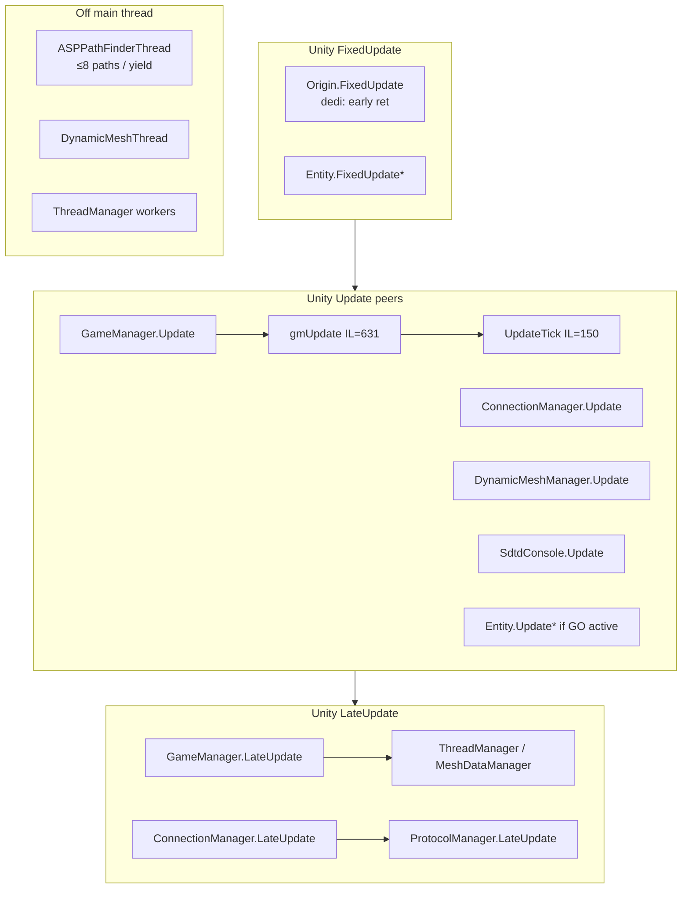
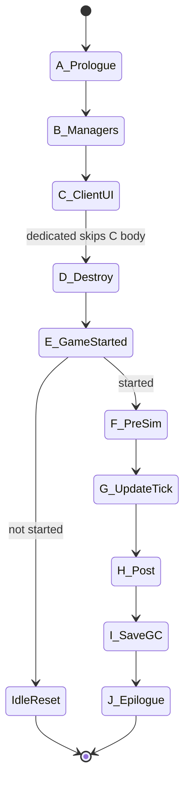
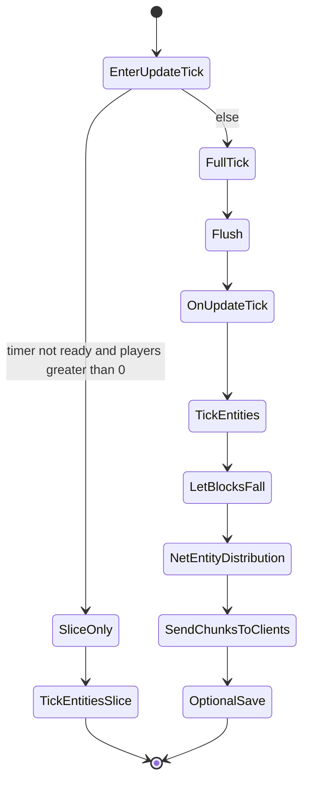
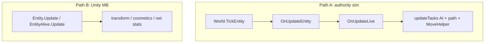
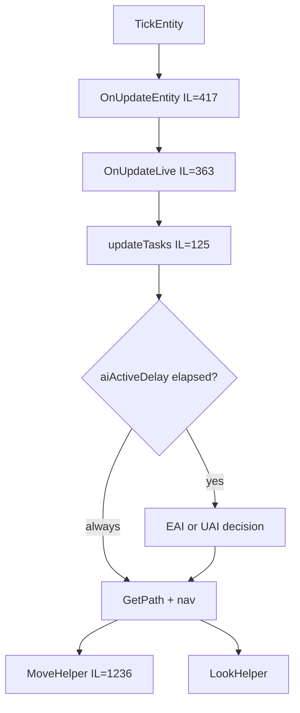

# Dedicated server game / sim loop (V3.1.0)

**Owns:** dedicated frame/sim loop narrative (peers, phases, subsystem scale).  
**Coverage map:** [`coverage.md`](coverage.md).  
**Residuals:** [`residuals.md`](residuals.md).  
**Hub:** [`INDEX.md`](INDEX.md).  
**Host topology (ops):** [`../../7dtd-optimizer/docs/HOST_TUNING.md`](../../7dtd-optimizer/docs/HOST_TUNING.md).  
**Live scale:** [`measured-scaling.md`](../../7dtd-optimizer/docs/measured-scaling.md).  
**Ceiling map:** [`engine-limitations.md`](engine-limitations.md).  
**Zig clone redesign:** [`zig-clone.md`](../../zdtd/docs/zig-clone.md).

**Scope:** headless dedicated tick under `-dedicated -batchmode -nographics`.  
**Not in scope:** client-only UI/camera/rendering (unless proven on dedi); RealEarth product status.  
**Pin:** Steam dedicated `Assembly-CSharp.dll` V3.1.0 (b14).

**Optim product (not this folder):**  
[`../../7dtd-optimizer/docs/OPTIMIZATION_CANDIDATES.md`](../../7dtd-optimizer/docs/OPTIMIZATION_CANDIDATES.md) · [`../../7dtd-optimizer/docs/ARCHITECTURE.md`](../../7dtd-optimizer/docs/ARCHITECTURE.md)

---

## 0. How to read this document

| Section | Contents |
|---|---|
| §1 | Unity frame skeleton (peers + order constraints) |
| §2 | `gmUpdate` phase table (authoritative orchestration) |
| §3 | `UpdateTick` / world / entity dual paths |
| §4-12 | Subsystem families (phases, thresholds, hot callees, scale) |
| §13 | Optimization understanding (pointers only) |
| §14 | Residuals (non-IL only; full list in residuals.md) |
| §15 | Regeneration (see also INDEX Tools) |

---

## 1. Unity frame skeleton (dedicated)

Unity runs **all enabled MonoBehaviour** `FixedUpdate` → `Update` → `LateUpdate` on active objects. The sim authority for zombies is **not** “only Entity.Update”; it is **`World.TickEntity` from `GameManager.UpdateTick`**, with a **parallel Unity path** for transform/network cosmetics.

### 1.1 Peer MonoBehaviours that matter on dedicated

Confirmed **server-relevant** peers (have `Update`/`LateUpdate`/`FixedUpdate` and either called from gmUpdate or known dedicated services):

| Component | Method | IL | Role on dedicated |
|---|---|---:|---|
| **GameManager** | Update → **gmUpdate** | 3 → **631** | Main orchestration |
| GameManager | UpdateTick | 150 | Sim core (called from gmUpdate) |
| GameManager | LateUpdate | 18 | ThreadManager late, MeshDataManager, multiplayer services |
| GameManager | FixedUpdate | 5 | `fixedUpdateCount++` only |
| **ConnectionManager** | Update | **215** | LiteNetLib / packages / flush / pings (**not** called from gmUpdate) |
| ConnectionManager | LateUpdate | 4 | `ProtocolManager.LateUpdate` |
| **DynamicMeshManager** | Update | **404** | Mesh region/item pipeline; server calls DynamicMeshServer |
| **SdtdConsole** | Update | 60 | Console command pump |
| **Origin** | FixedUpdate | 256 | **No-op on pure dedicated** (`IsDedicatedServer` → early ret); client/listen floating origin |
| **WorldEnvironment** | Update | 83 | Environment (runs if component present) |
| **AstarManager** | (graphs) | - | MB; Init installs pathfinder; UpdateGraphs separate |
| Entity* hierarchy | Update / FixedUpdate | various | Transform / physics cosmetics if GO active (see §3.3) |
| Turret / trap controllers | Update | 100-467 | If powered TE entities present in world |

**Hundreds** of other MonoBehaviour Updates exist (avatars, UI, vp_*, NGUI, lights, demos). Treat as **client/editor/test** unless a dedicated world spawns those components. Full inventory: [`inventories/frame-entries.md`](inventories/frame-entries.md) (242 MB methods).

### 1.2 Frame order (logical, not Unity script-order absolute)



**Unknown absolute order** among GameManager / ConnectionManager / DynamicMeshManager depends on Unity script execution order (not hard-coded in these methods). Treat them as **peers in the same player-loop phase**.

---

## 2. `gmUpdate` phases (631 IL, 6× IsDedicatedServer)

Full ordered call list: [`inventories/gmupdate-calls.md`](inventories/gmupdate-calls.md) (182 calls).  
Detailed phase narrative: [`loop-gmupdate.md`](loop-gmupdate.md).

| Phase | Work | Dedicated notes | Cost scale |
|---|---|---|---|
| A Prologue | time, pause, ModEvents SUnityUpdate, global actions, Physics.SyncTransforms if paused, LoadManager, PlatformManager, Invite/Lock, FPS, liquid time | UI/resolution noise small | O(1) |
| B Manager chain | Quest, Trigger, Twitch×2, GameEvent, **Power**, Party, **Vehicle**, **Drone**, Dismember, **Turret**, RaycastPath, Token, Trajectory, Faction, NavObject, BlockedPlayer, PrefabEdit, TriggerEffect, SpeedTree, **ThreadManager.UpdateMainThreadTasks** | Null-instance skips | O(managers present); Vehicle 297 / Drone 305 IL methods |
| C Client UI/EAC/cursor | AntiCheat UI, cursor, FPS cap | **Skipped** when dedicated | 0 on dedi |
| D Destroy queue | Monitor-locked GameObject destroy | Burst on unload | O(queue) |
| E Game started? | else GameTimer.Reset + **ret** | No sim | - |
| F Pre-sim | EntityAsyncManager, GameTimer.updateTimer, particles, TOD, Audio.FrameUpdate, water, signs, evaporation, chunk determine, optional ClearCaches | Zero-player idle branches | O(chunks) if load |
| **G Sim** | **UpdateTick()** | Core | See §3 |
| H Post | GroundAlign; CopyChunksToUnity | **CopyChunks skipped** on dedi | - |
| I Save/GC/net | provider Update, SaveWorldState, NameIdMapping, EventPrefabs, persistent player positions package, **GC.Collect** (dt-gated), client unload | GC hitch risk | O(world/save) |
| J Epilogue | StabilityViewer?, **ModEvents SGameUpdate**, GameObjectPool | Late mod hook | O(1) |



---

## 3. `UpdateTick` and dual entity paths

**Measured confirmation (2026-07-21):** the dual-path structure below was verified
live - `UpdateTick` runs once per Unity FRAME (calls/s follow `settargetfps`:
19.9/59.7 at fps 20/60), while the FULL tick fires on the internal game timer at a
fixed ~20 Hz regardless of frame rate (`TickEntities` and
`NetEntityDistribution.OnUpdateEntities` both stayed at 19.9 calls/s at fps 60).
The world clock is fps-invariant. Consequently the server frame rate is a
housekeeping/slice cadence only - it does not raise TPS, and network I/O is paced
by dedicated LiteNetLib threads (recv ~1,200/s, send ~1,600/s, 86-96% of gaps
< 2 ms under 24-client load), not by frames. Full evidence:
`7dtd-optimizer/docs/RESULTS.md` §3k.

### 3.1 UpdateTick (150 IL)

| Branch | Condition | Work |
|---|---|---|
| Slice-only | Game timer not ready for full tick **and** players &gt; 0 | `TickEntitiesSlice()` only → **ret** |
| Full tick | else | Flush → OnUpdateTick → TickEntities → LetBlocksFall → (not dedi) visibility → **NetEntityDistribution.OnUpdateEntities** → **SendChunksToClients** → optional SaveRandomChunks / decorations |



### 3.2 World.OnUpdateTick (189 IL)

**Always (order from IL):** `updateChunkAddedRemovedCallbacks` ->
`WorldEventUpdateTime` -> `WaterSplashCubes.Update` -> `DecoManager.UpdateTick`
-> `MultiBlockManager.MainThreadUpdate` -> (non-editor) DynamicMusic.Conductor
-> `checkPOIUnculling` / `updateChunksToUncull`.

**If !IsServer:** return.

**Server:** `WorldBlockTicker.Tick(activeChunks, player, random)` -> walk active
chunks: if `NeedsTicking`, `Chunk.UpdateTick` (TE path); area-master biome spawn
data delay/clear + `biomeSpawnManager.Update` / `SpawnUpdate` when due ->
(if dynamic spawn pref set) `dynamicSpawnManager.Update` -> (elsewhere in
full-tick path) `AIDirector.Tick` / sleepers as documented in §3.1 and
[spawning.md](spawning.md).

### 3.3 Dual entity simulation paths

| Path | Driver | Typical content |
|---|---|---|
| **A. Authority tick** | `World.TickEntity` from slice/flush | Position checks, chunk membership, **OnUpdateEntity → OnUpdateLive → updateTasks (AI)** |
| **B. Unity MB Update** | `Entity.Update` / `EntityAlive.Update` if GO enabled | animateYaw, updateTransform, network stats, progression, model fade/visible |



AI decisions and path requests live on **path A**. Path B is still main-thread cost if entities remain active MonoBehaviours on dedicated.

Slice model (EMA frame gaps, ~25 base, `tickEntitySliceCount`): [`entity-ai.md`](entity-ai.md).

### 3.4 AI / path onion (authority path)



| Threshold | Value |
|---|---|
| Full AI dist² | &lt; 64 (~8 m) → scale 1.0 |
| Mid | &lt; 225 (~15 m) → 0.3 |
| Far | else → 0.1 |
| FindPath | always enqueues; Y clamp if xz dist² &gt; 1225 (~35 m) |
| ASP path drain | **≤ 8** computations per coroutine slice |
| Path compute | `ASPPathFinder.Calculate` → **`AstarPath.StartPath`** (AB/X/Multi/Flee/Random) |
| EAI task step | 0.05 per OnUpdateTasks |
| Combat FindPath | ApproachAndAttack up to **3×** per EAI Update |
| Game ticks | **20 / second** (`GameTimer.ticksPerSecond`) |

Deep detail: [`entity-ai.md`](entity-ai.md), path/net gaps: [`closed-gaps.md`](closed-gaps.md).

---

## 4. Falling blocks

| Stage | Method | IL | Notes |
|---|---|---:|---|
| Enqueue | AddFallingBlock | 38 | Hashset dedupe, mesh observer, queue |
| Group | GroupFallingBlocks | 292 | Optional group mode |
| Drain | LetBlocksFall | 220 | Spawn EntityFallingBlock* |
| Entity | FallingBlock OnUpdateEntity | 344 / 302 | Physics-ish entity cost |

**Scale:** collapse storms → queue depth × entity factory.  
**Optim:** optional air-swap at AddFallingBlock (OSS precedent).

---

## 5. Spawn / sleeper / `AIDirector`

| Piece | Method | IL | Scale |
|---|---|---:|---|
| Biome spawn | SpawnManagerBiomes.SpawnUpdate | **441** | Every ~20 ticks × area-master chunks |
| Sleeper | SleeperVolume.Tick | 137 | All volumes |
| Sleeper touch | UpdatePlayerTouched / CheckTouching | 172 / 165 | Players near POI |
| `AIDirector` | ComponentsTick | 21 | Always-on components (see below) |
| Blood moon | AIDirectorBloodMoonComponent.Tick | **170** | Start/End BM, parties.Tick, KillPartyZombies |
| Wandering/scout horde | AI*HordeSpawner Update* | 100-229 | When active |

**`AIDirector`.CreateComponents always installs (fixed order):** MarkerManagement, PlayerManagement, WanderingHorde, AirDrop, ChunkEvent, BloodMoon. Constructed from `WorldState.SetFrom` → `new `AIDirector`()`.

**Scale:** spawn ∝ active area-master chunks × prefs; BM ∝ parties × enemy counts (GameStats).

---

## 6. Networking

### 6.1 ConnectionManager.Update (215 IL): peer

ProtocolManager.Update → server: ProcessPackages (× clients × channels), FlushClientSendQueues, periodic UpdatePings + NetPackageClientInfo.

### 6.2 NetEntityDistribution (from UpdateTick)

| Method | IL | Notes |
|---|---:|---|
| OnUpdateEntities | 322 | Interest sets; distance + view angle |
| updatePlayerList | **509** | Package selection (below) |
| updatePlayerEntity | 222 | Per-player entity sync helpers |

**Package selection (decoded IL):** interest list refresh if last-pos distSq &gt; **16**; move if encoded Δ abs ≥ **2**; **Teleport** if Δ outside ±**256**; full **PosAndRot** if outside ±**128** or full-update age &gt; **100** ticks; else **RelPosAndRot** / rotation; **Velocity** if motion Δ² &gt; **0.04**; plus AliveFlags / PlayerStats / equipment when dirty. Detail: [`closed-gaps.md`](closed-gaps.md) §4.

**Scale:** ≈ players × tracked entities × package rate bands.

---

## 7. Chunks

| Method | IL | Notes |
|---|---:|---|
| DetermineChunksToLoad | **448** | gmUpdate: hollow rings viewDim+2, load/remove diffs, cull (world-chunks 4.0.1) |
| SendChunksToClients | 216 | Server streaming |
| doCopyChunksToUnity | 252 | **Skipped on dedicated** via gmUpdate branch |
| SaveRandomChunks | 99 | Optional in UpdateTick |

**Scale:** player spread × view distance (unique chunk union).

---

## 8. Dynamic mesh

| Method | IL | Role |
|---|---:|---|
| DynamicMeshManager.Update | 404 | Peer MB; queues, coroutines, observers |
| DynamicMeshServer.Update | **452** | Server send NetPackageDynamicMesh |
| MeshDataManager.LateUpdate | 5 | From GameManager.LateUpdate |
| Settings | - | MaxRegionLoadMsPerFrame, OnlyPlayerAreas, … (ES budgets) |

**Scale:** observers × dirty regions × clients.

---

## 9. World services on OnUpdateTick always-path

| System | IL | Optim note |
|---|---:|---|
| DecoManager.UpdateTick | **330** | Locks + coroutine; dedi skip candidate |
| WaterSplashCubes.Update | **185** | Dedi skip candidate |
| MultiBlockManager.MainThreadUpdate | 5 | Thin; stability helpers larger |
| DynamicMusic.Conductor | - | ES optional skip |
| `WorldBlockTicker`.tickScheduled / tickRandom | 151 / 97 | Block schedules + random chunk ticks |
| BlockLiquidv2.UpdateTime | - | From gmUpdate |

---

## 10. gmUpdate manager chain (if instance non-null)

| Manager | Update IL | Notes |
|---|---:|---|
| DroneManager | 305 | Waypoints |
| VehicleManager | 297 | Waypoints |
| QuestEventManager | 127 | Objectives |
| PowerManager | 106 | TE power; content can explode (OCB) |
| DismembermentManager | 60 | |
| TurretTracker | 45 | |
| FactionManager | 43 | |
| GameEventManager.Update | 25 | + HandleSpawnUpdates 148 etc. |
| PartyManager | - | thin |
| Twitch* | - | waste if constructed |
| ThreadManager.UpdateMainThreadTasks | 64 | Drains main queue |

Full manager Update inventory: [`inventories/manager-updates.md`](inventories/manager-updates.md).

---

## 11. Timer, GC, save side paths

| System | Notes |
|---|---|
| GameTimer.updateTimer | **ticksPerSecond = 20** (stock); elapsed from stopwatch × timeScale; idle dedicated may Reset |
| GC.Collect | gmUpdate dedicated dt-gated path; also Cleanup/console |
| SaveWorldState / NameIdMapping / EventPrefabs | Gated in gmUpdate / UpdateTick |
| PlayerDataFile.Save / GameManager.SavePlayerData | Session/player |
| WorldState.SaveLoad | **884 IL** large serializer |
| RegionFile* / ChunkProvider.Save* | Disk; host NVMe matters |
| MemoryPools.Cleanup | Idle cache clear path |

---

## 12. Other dedicated-touched peers

| System | IL | Note |
|---|---:|---|
| Origin.FixedUpdate | 256 | **Dedicated no-op** (`IsDedicatedServer` → ret); client/listen reposition + raycast |
| SkyManager.Update | 456 | Present if component exists; mostly visual |
| WorldEnvironment.Update | 83 | Environment |
| GameLightManager.UpdateLightFrameUpdate | 159 | Lights |
| AstarManager.UpdateGraphs | 185 | Per player `Merge(pos.xz, size=76)`; decay timed `locations`; mark graphs dirty; top CPU + heap at load (`AstarVoxelGrid.InitScan`), see [measured-scaling.md](../../7dtd-optimizer/docs/measured-scaling.md) §1/§4b |
| LoadManager.Update | 56 | Async loads |
| PlatformManager.Update | - | Platform |
| SdtdConsole.Update | 60 | Admin console |
| ProtocolManager.Update | 35 | From ConnectionManager |
| FPS.Update | - | Counter |
| EntityAsyncManager.Update | 22 | Async entity create completion |
| WaterSimulationNative / evaporation / signs | - | Pre-sim in gmUpdate |

---

## 13. Optimization understanding

Optim research is maintained under the **EfficientServer project**, not under `il/` (dumps only):

- Graded candidates, APM probes, experiment order: [`../../7dtd-optimizer/docs/OPTIMIZATION_CANDIDATES.md`](../../7dtd-optimizer/docs/OPTIMIZATION_CANDIDATES.md)  
- Idea map / threading / OSS: [`../../7dtd-optimizer/docs/OPTIMIZATION_IDEAS.md`](../../7dtd-optimizer/docs/OPTIMIZATION_IDEAS.md)  
- Host ops: [`../../7dtd-optimizer/docs/HOST_TUNING.md`](../../7dtd-optimizer/docs/HOST_TUNING.md)  

This file stays a **loop RE map**. IL dumps here are evidence only.

---

## 14. Residuals (non-IL only)

Canonical list (only place that owns permanent opens): [`residuals.md`](residuals.md).  
Coverage of managed families: [`coverage.md`](coverage.md).

**Short pointer list** (see residuals for reasons):

| Residual class | One line |
|---|---|
| Unity script order | peers not ordered in IL |
| Entity GO enabled on dedi | runtime observation |
| LiteNetLib native | below managed wrappers |
| EAC protocol | types only |
| A* library body | black box after StartPath |
| ModEvents subscribers | content-dependent |
| Dump drift after patches | regenerate |

Managed closures worth remembering: GameTimer 20 Hz, `AIDirector` install list, ASP→AstarPath, net package bands, Origin **no-op on dedicated**, chunk save layer loop **64**, WorldState.SaveLoad field set.

---

## 15. Regeneration

Canonical tool list and commands: [`INDEX.md`](INDEX.md) (Tools section).  
Do not redistribute `Assembly-CSharp.dll` or treat bulk IL as a ship artifact.

---

## Appendix: key Update caller edges

```text
GameManager.LateUpdate
  ├─ ThreadManager.LateUpdate
  └─ MeshDataManager.LateUpdate
```

Peer MBs (not under gmUpdate): `ConnectionManager.Update`, `DynamicMeshManager.Update`, `SdtdConsole.Update`, … See loop and [`inventories/frame-entries.md`](inventories/frame-entries.md).

## Related docs

| Doc | Role |
|---|---|
| [loop-gmupdate.md](loop-gmupdate.md) | gmUpdate phase narrative |
| [entity-ai.md](entity-ai.md) | TickEntity / AI |
| [network.md](network.md) | ConnectionManager / packages |
| [measured-scaling.md](../../7dtd-optimizer/docs/measured-scaling.md) | Live scale laws |
| [runtime-tuning.md](../../7dtd-optimizer/docs/runtime-tuning.md) | GC / FPS knobs |
| [HOST_TUNING.md](../../7dtd-optimizer/docs/HOST_TUNING.md) | Host topology |
| [ARCHITECTURE.md](../../7dtd-optimizer/docs/ARCHITECTURE.md) | Optim-oriented hot path |

## Changelog

- **2026-08-07:** OnUpdateTick IL order re-pin (chunk callbacks, splash, deco,
  multiblock, biome spawn walk).
- **2026-07-19:** Related docs table.
- **2026-07-18:** §14 residuals-only; managed gaps closed into coverage hub + family docs.
- **2026-07-18:** Origin + region type map partially closed via RealEarth surfaces dump; link new research docs.
- **2026-07-16:** Relocated with other research narratives to `docs/` (IL dumps stay in `il/`).
- **2026-07-16:** Optim narrative moved to `7dtd-optimizer/docs/OPTIMIZATION_CANDIDATES.md`; §13 is a pointer only.
- **2026-07-16:** Gap-close pass: ticks/sec=20, `AIDirector` CreateComponents list, ASP→AstarPath, net package thresholds, MB classification; update §14.
- **2026-07-16:** Initial complete dedicated loop map: peers, phases, dual entity paths, all subsystem families, optim anchors, open gaps.
