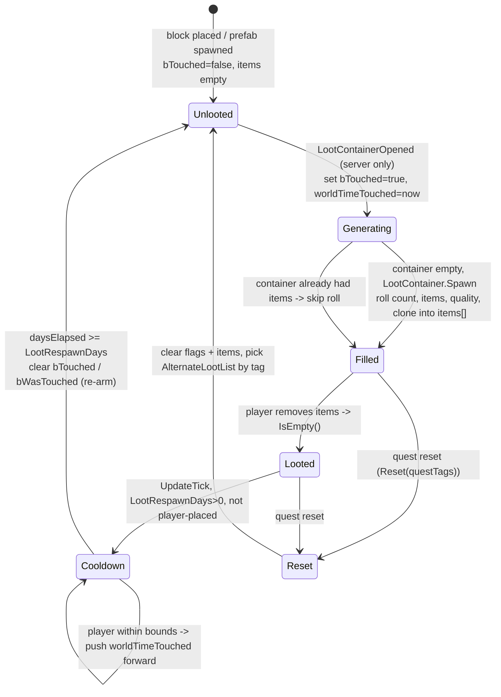
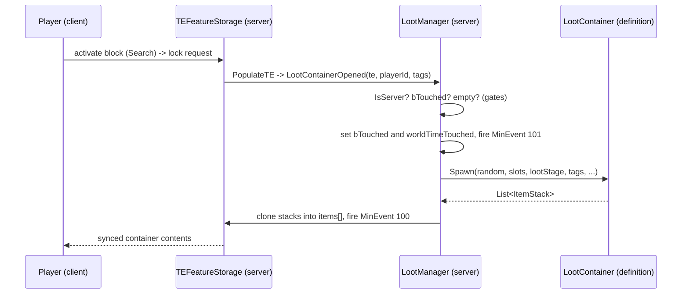
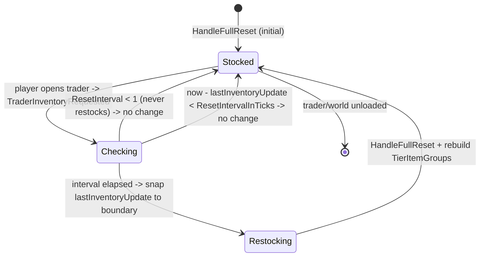
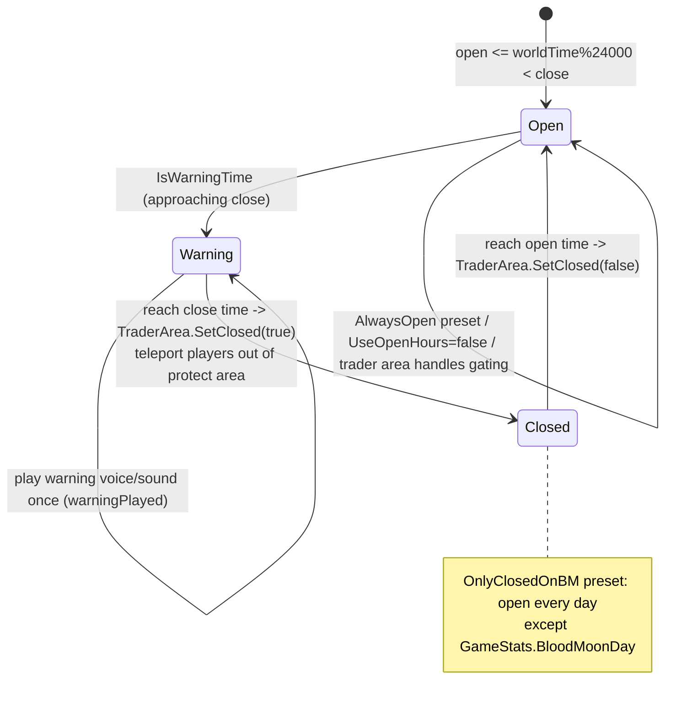
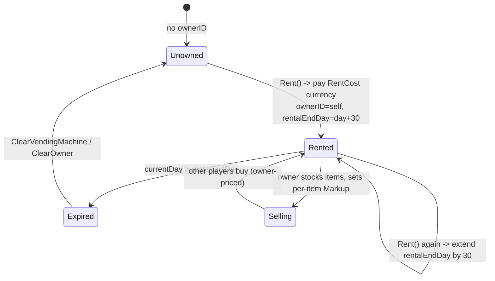

# Loot, traders and economy (dedicated V3.0.1)

**Owns:** the server-authoritative loot and trade subsystem: how a placed container
rolls its contents on first open (`LootContainer` definitions + `TEFeatureStorage`
storage feature + `LootManager`), how a trader restocks and prices its inventory
(`TraderInfo` / `TraderData` / `TraderManager` / `EntityTrader`), trader open hours
and the physical `TraderArea`, and rentable player vending machines
(`TileEntityVendingMachine`).
**Not:** the loot/trader XML content itself (`loot.xml`, `traders.xml`: data, a
residual); the client trade window widgets (`XUiC_Trader*`, `XUiC_Loot*`); the
`MinEvent` framework that fires loot buffs (own residual); the item/economic-value
math primitives (`ItemValue`, `Block.EconomicValue`).
**Evidence:** `LootContainer`, `LootManager`, `TEFeatureStorage`, `TraderInfo`,
`TraderData`, `TraderManager`, `EntityTrader`, `TraderArea`,
`TileEntityVendingMachine`, `XUiM_Trader` IL (dump locally with `tools/src/DumpMethod`,
git-ignored). **Hub:** [`INDEX.md`](INDEX.md). **Method:** [`re-methodology.md`](re-methodology.md).

Loot generation and trader restock/hours are gated behind `ConnectionManager.IsServer`
and run inside the `TraderManager` / `LootManager` singletons, so both are dedicated
codepaths. Price display is computed in a shared UI model on the client, but every
container mutation and currency transfer is a net package the server applies.

---

## 1. Model

There is no `TileEntityLootContainer` class in V3.0.1: placed-block loot storage was
folded into the composite tile-entity feature system. A lootable block is a
`TileEntityComposite` carrying a `TEFeatureStorage` feature that implements
`ITileEntityLootable`.

| Type | Role |
|---|---|
| `LootContainer` | A named loot-list **definition** (registry `lootContainers`, keyed by name), plus the nested `LootGroup` / `LootItem` / `LootEntry` / `LootQualityTemplate` / `LootProbabilityTemplate`. Loaded from `loot.xml` by `LootFromXml` (the `<LoadLootContainers>` coroutine). Owns the roll: `Spawn`, `SpawnLootItemsFromList`, `getProbability`, `RandomSpawnCount` |
| `TEFeatureStorage` | The placed **runtime container** (a feature on `TileEntityComposite`). Holds `items[]`, the loot-list name (`lootListName`), the touched flags (`internalTouched`/`bTouched`, `bWasTouched`, `worldTimeTouched`), `LootStageMod`/`LootStageBonus`, `bPlayerStorage`, and the quest `AlternateLootList` |
| `LootManager` | World singleton. `LootContainerOpened(ITileEntityLootable, playerId, tags)` is the server generation entry point; `LootBagOpened(Bag, owner, playerId)` handles dropped bags |
| `EntityLootContainer` | A **dropped** loot bag/backpack (an `EntityItem`), separate from block storage |
| `TraderInfo` | A trader **definition** from `traders.xml` (`TradersFromXml`); `traderInfoList[]` indexed by `TraderID`. Markups, quality mods, currency item, reset interval, open/close/warning times, hour preset, rent config, tier item groups |
| `TraderData` | Per-trader **runtime** state: `PrimaryInventory` (`List<Entry>`), `TierItemGroups`, and `lastInventoryUpdate` (world time of last restock). An `Entry` is `{ ItemStack Item, sbyte Markup, bool addedByPlayer }` |
| `TraderManager` | World singleton. `TraderInventoryRequested` decides whether to restock; `HandleFullReset` rebuilds the inventory |
| `EntityTrader` | The trader **NPC** (`EntityNPC`). Owns a `TraderData`, drives open/close in `OnUpdateLive`, and steps the per-player trade window (`TraderWindowState`) |
| `TraderArea` | The physical trader **compound**: protect/teleport volumes, `SetClosed`, `HandleWarning`. When trader areas are enabled, this teleports players out at closing time |
| `TileEntityVendingMachine` | A rentable player-facing vending machine (`TileEntity`). Wraps a `TraderData`, plus owner identity, password, and a `rentalEndDay` |
| `XUiM_Trader` | Shared UI model that computes `GetBuyPrice` / `GetSellPrice` from the synced definition and economic values |

---

## 2. Loot container generation lifecycle (state machine)

A world-placed loot block starts **unlooted**. The client `TEFeatureStorage.ShowUI`
opens the loot window; on the server, opening the container drives `PopulateTE`, which
calls `LootManager.LootContainerOpened`. That method is the single authority for
rolling contents, and it is idempotent: the `bTouched` flag guarantees a container
generates its loot exactly once until it is re-armed by the respawn timer.



**Generation gate (`LootManager.LootContainerOpened`).** Returns immediately unless
`ConnectionManager.IsServer` and the world is not an editor. If `bTouched` is already
set it returns (already rolled). Otherwise it sets `bTouched` and stamps
`worldTimeTouched = world.GetWorldTime()`, resolves the `LootContainer` by
`lootListName`, and rolls **only if the container is currently empty**. It fires
`MinEvent` 101 on the opening player (remote players via `NetPackageMinEventFire`, local
via `FireEvent`) before the roll and `MinEvent` 100 after.

**The roll (`LootContainer.Spawn`).** Item count is
`RandomSpawnCount(minCount, maxCount, abundance)` clamped to the container slot count,
where `abundance` comes from the static `GlobalCountModifier` (the `LootAbundance`
sandbox setting, `EnumGamePrefs.LootAbundance` = 87; there are also per-category
`Food`/`Drink`/`AmmoCountModifier`). `SpawnLootItemsFromList` then walks the loot
entries, applying:

- **Loot stage:** the effective loot stage is
  `player.GetHighestPartyLootStage(LootStageMod, LootStageBonus)` unless the container
  sets `useUnmodifiedLootstage`, in which case the player unmodified game stage is used.
  Loot stage feeds `getProbability` against the `LootProbabilityTemplate`, so higher
  stages shift the odds toward better entries.
- **Quality:** the `LootQualityTemplate` picks item quality tiers by loot stage.
- **Sandbox modifiers:** `RandomCountFromSandbox` / abundance scale the counts.
- **Loot buffs:** any buffs the loot list attaches are applied to the opening player
  via `EntityBuffs.AddBuff` (see [buffs.md](buffs.md)).

Rolled stacks are cloned into the tile entity `items[]` and synced to the opening
client. Server authority is total: the client never decides what spawns.



**Respawn (`TEFeatureStorage.UpdateTick`).** Player-placed storage never respawns and
is always treated as touched (`bPlayerStorage` short-circuits `bTouched` to true).
For a world container, once it is touched, not player storage, empty, and
`LootRespawnDays` (`EnumGamePrefs.LootRespawnDays` = 88) is greater than zero, the tick
computes `daysElapsed = (WorldTimeToTotalHours(now) - WorldTimeToTotalHours(worldTimeTouched)) / 24`.
When `daysElapsed >= LootRespawnDays` it clears `bWasTouched` and `bTouched`, re-arming
the container so the next open regenerates fresh loot. If the interval has not elapsed
and a player is currently inside the sampled bounds around the container, it pushes
`worldTimeTouched` forward to now: an anti-grief delay so loot does not respawn under a
player's feet.

**Quest reset (`TEFeatureStorage.Reset`).** Clears `bTouched`/`bWasTouched`, empties
every stack, and if the container has an `AlternateLootList`, selects the loot entry
whose tags match the active quest tags. This is how cleared/fetch quests re-seed rally
point containers with quest-appropriate loot.

---

## 3. Trader inventory restock (state machine)

Trader restock is **lazy and interval-based**. When a player opens a trader,
`TraderManager.TraderInventoryRequested(trader, playerId)` runs on the server and
decides whether enough world time has passed to rebuild the stock.



**Interval decision (`TraderInventoryRequested`).** Looks up
`TraderInfo.traderInfoList[TraderID]`. If `ResetInterval < 1` it returns without
restocking (traders and player vending machines with no auto-reset). It clamps a
backwards clock (`lastInventoryUpdate = 1` if `now < lastInventoryUpdate`), then if
`now - lastInventoryUpdate < ResetIntervalInTicks` (and the trader has stocked at least
once) it returns unchanged. Otherwise it snaps `lastInventoryUpdate` to the interval
boundary (`(now / interval) * interval + 1`), calls `HandleFullReset`, and rebuilds
each tier item group via `TraderInfo.SpawnTierGroup`.

**Rebuild (`HandleFullReset`).** Clears `PrimaryInventory`, spawns a fresh item set from
the trader item groups (`TraderInfo.Spawn`), then for each spawned stack: stackable
(non-quality) items are consolidated into existing entries up to `Stacknumber`, quality
items get `MaxDurabilityModifier` reset to 1, and non-empty stacks are appended as new
`TraderData.Entry` records. If `ResetInterval == -1` the reset produces an empty
inventory (used by player-owned vending machines, which are stocked by their owner, not
generated).

**Which interval applies (`TraderInfo.get_ResetInterval`).**

| Trader kind | Interval source |
|---|---|
| NPC trader | `GlobalResetInterval` if set, else per-trader `resetInterval` |
| Vending machine (system) | `VendingResetInterval` if set, else per-trader `resetInterval` |
| Vending machine (player owned) | `-1` (never auto-restocks) |

---

## 4. Trader open hours and the physical area (state machine)

Whether a trader will trade depends on the in-game clock. A full day is 24000 time
units, so `worldTime % 24000` is the time of day compared against the open, close and
warning marks. `EntityTrader.OnUpdateLive` samples `TraderInfo.IsOpen` /
`IsWarningTime` each update and, when a `TraderArea` is active, drives
`TraderArea.HandleWarning` and `TraderArea.SetClosed`.



**Hour presets (`TraderInfo.TraderHourPresets`).** The preset selects which open/close
times apply and can override the window entirely:

| Preset | Value | Behaviour |
|---|---:|---|
| `Default` | 0 | per-trader `OpenTime` / `CloseTime` / `WarningTime` |
| `MorningOnly` / `MidDayOnly` / `EveningOnly` / `NightOnly` | 1-4 | global time window (`GlobalOpenTime` / `GlobalCloseTime` / `GlobalWarningTime`) |
| `OnlyClosedOnBM` | 5 | open every day except the blood-moon day (`GameStats.BloodMoonDay` = 58) |
| `AlwaysOpen` | 6 | always open |

`get_IsOpen` also short-circuits to open when `UseOpenHours` is false, or when the
`SandboxUseTraderArea` sandbox state is set (the door reads as open and the physical
`TraderArea` teleport handles keeping players out after hours). `GetOpenTime` /
`GetCloseTime` / `GetWarningTime` return the global fields for any non-Default preset and
the per-trader fields for Default.

**Per-player trade session (`EntityTrader.TraderWindowState`).** Independent of open
hours, one player at a time trades (a `LockManager` shared lock, `IsSharedLock`). The
client window steps `Dialog(0)` to `Trade(1)` to `QuestComplete(2)` to `Close(3)` via
`TransitionToNextWindow`; entering `Trade` takes the trade lock and entering `Close`
releases it.

---

## 5. Pricing

Buy and sell prices are computed in the shared `XUiM_Trader` UI model from the synced
definition and item economic values. The formulas are symmetric.

**Buy (player buys from trader), `GetBuyPrice`:**

1. Base value: for blocks, `Block.EconomicValue` with bundle size
   `Block.EconomicBundleSize`; for items, `ItemClass.EconomicValue` passed through
   `EffectManager.GetValue(PassiveEffects.EconomicValue = 76, ...)`, so an item's base
   value is itself perk/effect modifiable. A base value of 0 means not purchasable.
2. Markup: `TraderInfo.BuyMarkup`, unless `OverrideBuyMarkup` is set, or for a rentable /
   player-owned trader with a valid slot the markup is `1 + Entry.Markup * 0.2` (the
   owner's per-item price setting).
3. Quality items multiply by `Lerp(QualityMinMod, QualityMaxMod, (Quality-1)/5)` (using
   the item's `TraderQualityMinMod`/`MaxMod` when set, else the trader's) and by
   `PercentUsesLeft` (durability). Items with sub-items (mods) are priced recursively.
4. Perk discount: unless owner-priced, subtract the `BarteringBuying` (148) passive
   effect.
5. Scale by `count / bundleSize`, `CeilToInt`, then multiply by
   `SandboxOptions.TraderBuyPrices` (131).

**Sell (player sells to trader), `GetSellPrice`:** same shape, but the base is
`EconomicValue * EconomicSellScale` (the sell scale marks the value down), the multiplier
is `SellMarkdown` / `OverrideSellMarkdown`, the perk term **adds** the `BarteringSelling`
(149) effect, and the final scale is `SandboxOptions.TraderSellPrices` (130).

Currency is the trader's XML-configured `CurrencyItem`. The price is a display value;
the actual purchase removes currency from the player inventory and the inventory delta
is carried by `NetPackageTraderData` (which `Setup`s from an `EntityTrader` or a
`TileEntityVendingMachine`), keeping the server authoritative over stock.

**`NetPackageTraderData` wire (write IL=38, ToServer):**

```text
isEntity : bool              // true if entityId != -1
if isEntity: entityId : i32
else: tePosition : Vector3i
hasTraderData : bool
if hasTraderData: TraderData.Write
```

`ProcessPackage` (IL=50, server only): `TraderData.CopyFrom` onto the live
`EntityTrader` or `TileEntityVendingMachine` at that key; vending also
`NotifyListeners`.

---

## 6. Vending machines

A `TileEntityVendingMachine` is a `TileEntity` wrapping its own `TraderData`, plus owner
identity (`ownerID`, a `PlatformUserIdentifierAbs`), an optional password hash, and a
`rentalEndDay`. It reuses the trader pricing and inventory model but is stocked by its
renter, not generated (its `ResetInterval` is `-1` when player owned).



**Rent (`Rent`).** Allowed only when the machine is unowned (or owned by the local
player) and `TraderInfo.Rentable`. It checks the player currency against
`TraderInfo.RentCost`, removes that many `CurrencyItem`, and sets
`rentalEndDay = WorldTimeToDays(now) + 30` (a 30 in-game-day term; re-renting adds
another 30). `CanRent` returns a status code: another owner blocks (1), already renting a
different machine blocks (2, one machine per player via `checkAlreadyRentingVM`),
insufficient currency blocks (3), else rentable (0). `RentTimeRemaining` is
`rentalEndDay - currentDay`. The nominal rent duration in real seconds is
`RentTimeInDays * 60 * DayNightLength` (`EnumGamePrefs.DayNightLength` = 60, real
minutes per in-game day).

While rented, the owner stocks the machine and sets a per-item `Entry.Markup`; other
players buy at the owner-priced rate (§5). Buying and selling flow through the same net
package as NPC traders, so the server stays authoritative over the machine's inventory.

---

## 7. Dedicated relevance and residuals

- **Server codepaths:** `LootManager.LootContainerOpened`, `TEFeatureStorage.UpdateTick`
  (loot respawn), `TraderManager.TraderInventoryRequested` / `HandleFullReset` (restock),
  and `EntityTrader.OnUpdateLive` (open/close) all run on the dedicated server inside the
  world singletons and are gated on `IsServer`. Container mutations and currency transfers
  are net packages the server validates.
- **Client-side (still evidence, not authority):** `XUiM_Trader.GetBuyPrice` /
  `GetSellPrice` compute display prices; `TEFeatureStorage.ShowUI` and
  `EntityTrader.TransitionToNextWindow` drive the local trade UI. These read synced data;
  they do not decide stock.
- **Content residuals (XML, data not IL):** `loot.xml` (loot lists, groups, quality and
  probability templates, per-container item sets and buffs) loaded by `LootFromXml`;
  `traders.xml` (trader definitions, markups, quality mods, currency item, reset intervals,
  open hours, tier item groups, rent config) loaded by `TradersFromXml`. Numeric knobs live
  in game prefs / sandbox options: `LootAbundance` (87), `LootRespawnDays` (88),
  `TraderBuyPrices` (131), `TraderSellPrices` (130), `DayNightLength` (60).
- **Framework residuals:** the `MinEvent` action framework that loot open/close events and
  loot buffs hook into (own doc candidate); the `ItemValue` / `Block.EconomicValue` and
  `EffectManager` passive-effect math these formulas call into.

---

## Loot-entry requirement + trader-stage leaves

Per-entry `<requirement class="...">` elements in `loot.xml` attach a
`List<BaseLootEntryRequirement>` to a `LootContainer.LootEntry`:
`LootFromXml.ParseLootEntryRequirement` resolves the type from the prefix
`"LootEntryRequirement"` + class and calls its `Init(XElement)`. At roll time
`LootEntry.HasRequirements(EntityPlayer)` ANDs every `CheckRequirement(player)`; it is
called from `LootContainer.SpawnAllItemsFromList` and `getProbability`, i.e. inside the
server-side generation path of section 2, so these predicates run on the dedicated
server with the opening player as input. The base `CheckRequirement` defaults to true.
Numeric leaves derive from the intermediate `BaseOperationLootEntryRequirement`, whose
`CheckRequirement` compares `LeftSide(player)` against `RightSide(player)` under an
`operation` attribute (enum with `Equals`/`NotEquals`/`Less`/`Greater`/`LTE`/`GTE`
aliases; an unrecognized operation passes). A sixth sibling,
`LootEntryRequirementSandboxOption`, exists in the same family but is outside this
doc's scope.

| Leaf | Predicate (key method, from IL) |
|---|---|
| `LootEntryRequirementBiome` | `CheckRequirement`: the comma-split `biomes` attribute contains `player.biomeStandingOn.m_sBiomeName` (case-insensitive `ContainsCaseInsensitive`). Missing attribute means an empty array, so it never passes |
| `LootEntryRequirementCVar` | `LeftSide` = `player.Buffs.GetCustomVar(cvar)` (0 if player is null); `RightSide` = float-parsed `value`. Compared via `operation` |
| `LootEntryRequirementProgression` | `LeftSide` = `player.Progression.GetProgressionValue(name).GetCalculatedLevel(player)` (0 if player or value missing); `RightSide` = float-parsed `value` |
| `LootEntryRequirementQuestTags` | `CheckRequirement`: false with no `QuestJournal.ActiveQuest`, else `ActiveQuest.QuestTags.Test_AnySet(quest_tags)` (any-overlap, not all) |
| `LootEntryRequirementRandomRoll` | `LeftSide` = `Mathf.Lerp(minMax.x, minMax.y, GameEventManager.Current.Random.RandomFloat)`; `RightSide` = `GameEventManager.GetFloatValue(player, value, 0)`, so the threshold can reference game-event variables |

**Trader stage templates.** `TraderStageTemplate` is a plain `{Min, Max, Quality}`
record whose `IsWithin(traderStage, quality)` passes when the stage sits inside
`[Min, Max]` and the quality equals `Quality`, with `-1` meaning "unbounded/any" for
each field. `TraderStageTemplateGroup` is a named list of those records; its
`IsWithin` is a plain OR over members. `TradersFromXml.ParseTraderStageTemplate` loads
`<traderstage_template name="...">` with `<entry min/max/quality>` children from
`traders.xml` into the static `Dictionary<string, TraderStageTemplateGroup>
TraderManager.TraderStageTemplates`. **Client-only in practice:** the only evaluators
are `XUiC_TraderWindow.FilterByName` and `XUiC_CategoryList.SetupCategoriesBasedOnItems`,
which filter the displayed trader stock by the player's trader stage and item quality.
The dedicated server parses the templates but never calls `IsWithin`; they do not gate
what `TraderManager.HandleFullReset` puts in stock.

---

## Related docs

| Doc | Role |
|---|---|
| [full-surface.md](full-surface.md) | Where loot/trader types sit in the whole-assembly map |
| [buffs.md](buffs.md) | The buff system loot lists add to the opening player |
| [server-lifecycle.md](server-lifecycle.md) | World save/load that persists container `items[]` and `TraderData` |
| [protocol-packages.md](protocol-packages.md) | `NetPackageTraderData` and the container/lock packages on the wire |
| [managers.md](managers.md) | The world singletons (`LootManager`, `TraderManager`) alongside the others |
| [re-methodology.md](re-methodology.md) | How this was reversed |
| [residuals.md](residuals.md) | XML content and native/framework residuals |

## Changelog

- **2026-07-28:** NetPackageTraderData wire (entity vs TE key) + server CopyFrom.

- **2026-07-23:** Initial loot/trader/economy reversal: server loot generation lifecycle (`LootContainer` + `TEFeatureStorage` + `LootManager`, touched flags, respawn timer, quest reset), trader restock interval and pricing (`TraderManager`, `XUiM_Trader`), open-hour presets and the physical `TraderArea`, and rentable vending machines, with state machines.
- **2026-07-24:** Added leaf narration for the `BaseLootEntryRequirement` family (biome,
  cvar, progression, quest-tag, random-roll predicates gating `LootEntry` rolls) and the
  `TraderStageTemplate` / `TraderStageTemplateGroup` stock-filter records (client-only
  evaluation).
