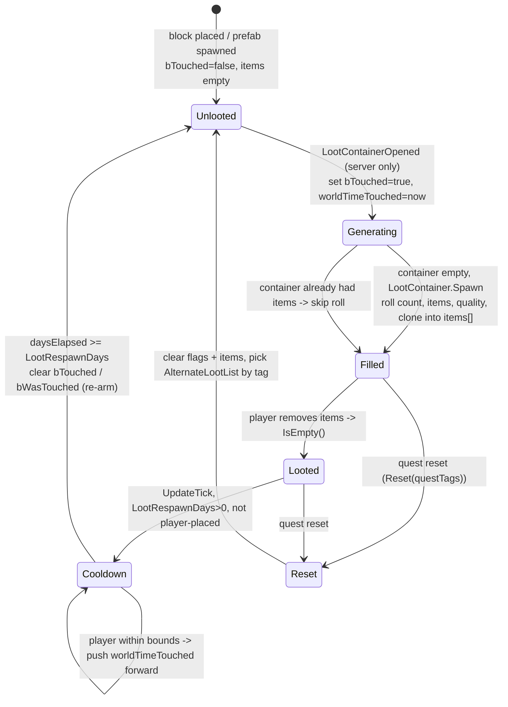
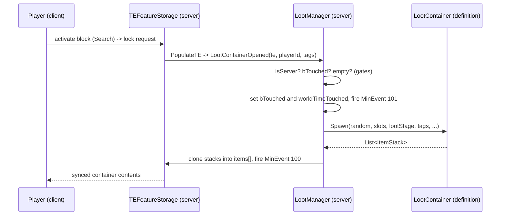
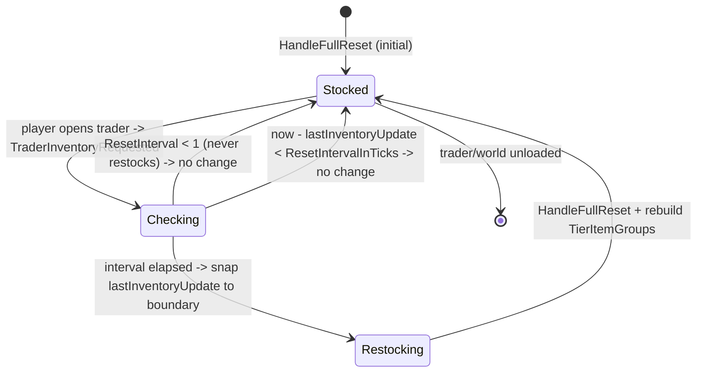
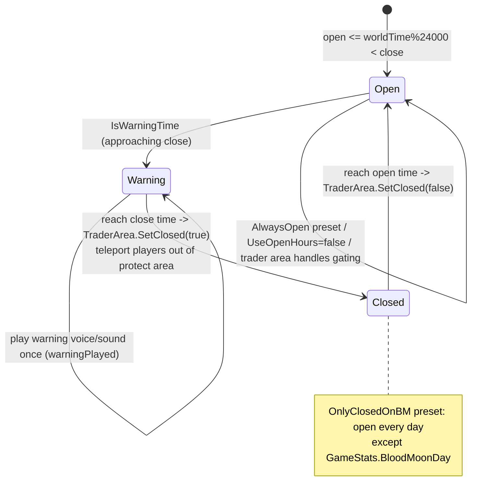
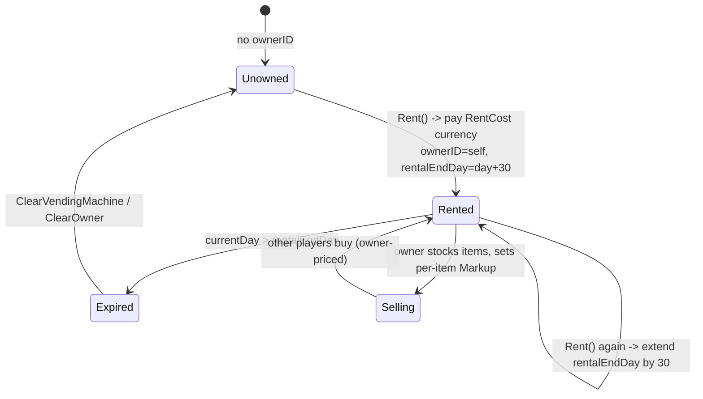

# Loot, traders and economy (dedicated V3.1.0)

**Owns:** the server-authoritative loot and trade subsystem: how a placed container
rolls its contents on first open (`LootContainer` definitions + `TEFeatureStorage`
storage feature + `LootManager`), how a trader restocks and prices its inventory
(`TraderInfo` / `TraderData` / `TraderManager` / `EntityTrader`), trader open hours
and the physical `TraderArea`, and rentable player vending machines
(`TileEntityVendingMachine`).
**Not:** the loot/trader XML content itself (`loot.xml`, `traders.xml`: data, a
residual); the client trade window widgets (`XUiC_Trader*`, `XUiC_Loot*`); the
`MinEvent` framework that fires loot buffs (own residual); the item/economic-value
math primitives (`ItemValue`, `Block.EconomicValue`).
**Evidence:** `LootContainer`, `LootManager`, `TEFeatureStorage`, `TraderInfo`,
`TraderData`, `TraderManager`, `EntityTrader`, `TraderArea`,
`TileEntityVendingMachine`, `XUiM_Trader` IL (dump locally with `tools/src/DumpMethod`,
git-ignored). **Hub:** [`INDEX.md`](INDEX.md). **Method:** [`re-methodology.md`](re-methodology.md).

Loot generation and trader restock/hours are gated behind `ConnectionManager.IsServer`
and run inside the `TraderManager` / `LootManager` singletons, so both are dedicated
codepaths. Price display is computed in a shared UI model on the client, but every
container mutation and currency transfer is a net package the server applies.

---

## 1. Model

There is no `TileEntityLootContainer` class in V3.0.1: placed-block loot storage was
folded into the composite tile-entity feature system. A lootable block is a
`TileEntityComposite` carrying a `TEFeatureStorage` feature that implements
`ITileEntityLootable`.

| Type | Role |
|---|---|
| `LootContainer` | A named loot-list **definition** (registry `lootContainers`, keyed by name), plus the nested `LootGroup` / `LootItem` / `LootEntry` / `LootQualityTemplate` / `LootProbabilityTemplate`. Loaded from `loot.xml` by `LootFromXml` (the `<LoadLootContainers>` coroutine). Owns the roll: `Spawn`, `SpawnLootItemsFromList`, `getProbability`, `RandomSpawnCount` |
| `TEFeatureStorage` | The placed **runtime container** (a feature on `TileEntityComposite`). Holds `items[]`, the loot-list name (`lootListName`), the touched flags (`internalTouched`/`bTouched`, `bWasTouched`, `worldTimeTouched`), `LootStageMod`/`LootStageBonus`, `bPlayerStorage`, and the quest `AlternateLootList` |
| `LootManager` | World singleton. `LootContainerOpened(ITileEntityLootable, playerId, tags)` is the server generation entry point; `LootBagOpened(Bag, owner, playerId)` handles dropped bags |
| `EntityLootContainer` | A **dropped** loot bag/backpack (an `EntityItem`), separate from block storage |
| `TraderInfo` | A trader **definition** from `traders.xml` (`TradersFromXml`); `traderInfoList[]` indexed by `TraderID`. Markups, quality mods, currency item, reset interval, open/close/warning times, hour preset, rent config, tier item groups |
| `TraderData` | Per-trader **runtime** state: `PrimaryInventory` (`List<Entry>`), `TierItemGroups`, and `lastInventoryUpdate` (world time of last restock). An `Entry` is `{ ItemStack Item, sbyte Markup, bool addedByPlayer }` |
| `TraderManager` | World singleton. `TraderInventoryRequested` decides whether to restock; `HandleFullReset` rebuilds the inventory |
| `EntityTrader` | The trader **NPC** (`EntityNPC`). Owns a `TraderData`, drives open/close in `OnUpdateLive`, and steps the per-player trade window (`TraderWindowState`) |
| `TraderArea` | The physical trader **compound**: protect/teleport volumes, `SetClosed`, `HandleWarning`. When trader areas are enabled, this teleports players out at closing time |
| `TileEntityVendingMachine` | A rentable player-facing vending machine (`TileEntity`). Wraps a `TraderData`, plus owner identity, password, and a `rentalEndDay` |
| `XUiM_Trader` | Shared UI model that computes `GetBuyPrice` / `GetSellPrice` from the synced definition and economic values |

---

## 2. Loot container generation lifecycle (state machine)

A world-placed loot block starts **unlooted**. The client `TEFeatureStorage.ShowUI`
opens the loot window; on the server, opening the container drives `PopulateTE`, which
calls `LootManager.LootContainerOpened`. That method is the single authority for
rolling contents, and it is idempotent: the `bTouched` flag guarantees a container
generates its loot exactly once until it is re-armed by the respawn timer.



**Generation gate (`LootManager.LootContainerOpened`).** Returns immediately unless
`ConnectionManager.IsServer` and the world is not an editor. If `bTouched` is already
set it returns (already rolled). Otherwise it sets `bTouched` and stamps
`worldTimeTouched = world.GetWorldTime()`, resolves the `LootContainer` by
`lootListName`, and rolls **only if the container is currently empty**. It fires
`MinEvent` 101 on the opening player (remote players via `NetPackageMinEventFire`, local
via `FireEvent`) before the roll and `MinEvent` 100 after.

**The roll (`LootContainer.Spawn`).** Item count is
`RandomSpawnCount(minCount, maxCount, abundance)` clamped to the container slot count,
where `abundance` comes from the static `GlobalCountModifier` (the `LootAbundance`
sandbox setting, `EnumGamePrefs.LootAbundance` = 87; there are also per-category
`Food`/`Drink`/`AmmoCountModifier`). `SpawnLootItemsFromList` then walks the loot
entries, applying:

- **Loot stage:** the effective loot stage is
  `player.GetHighestPartyLootStage(LootStageMod, LootStageBonus)` unless the container
  sets `useUnmodifiedLootstage`, in which case the player unmodified game stage is used.
  Loot stage feeds `getProbability` against the `LootProbabilityTemplate`, so higher
  stages shift the odds toward better entries.
- **Quality:** the `LootQualityTemplate` picks item quality tiers by loot stage.
- **Sandbox modifiers:** `RandomCountFromSandbox` / abundance scale the counts.
- **Loot buffs:** any buffs the loot list attaches are applied to the opening player
  via `EntityBuffs.AddBuff` (see [buffs.md](buffs.md)).

Rolled stacks are cloned into the tile entity `items[]` and synced to the opening
client. Server authority is total: the client never decides what spawns.



**Respawn (`TEFeatureStorage.UpdateTick`).** Player-placed storage never respawns and
is always treated as touched (`bPlayerStorage` short-circuits `bTouched` to true).
For a world container, once it is touched, not player storage, empty, and
`LootRespawnDays` (`EnumGamePrefs.LootRespawnDays` = 88) is greater than zero, the tick
computes `daysElapsed = (WorldTimeToTotalHours(now) - WorldTimeToTotalHours(worldTimeTouched)) / 24`.
When `daysElapsed >= LootRespawnDays` it clears `bWasTouched` and `bTouched`, re-arming
the container so the next open regenerates fresh loot. If the interval has not elapsed
and a player is currently inside the sampled bounds around the container, it pushes
`worldTimeTouched` forward to now: an anti-grief delay so loot does not respawn under a
player's feet.

**Quest reset (`TEFeatureStorage.Reset`).** Clears `bTouched`/`bWasTouched`, empties
every stack, and if the container has an `AlternateLootList`, selects the loot entry
whose tags match the active quest tags. This is how cleared/fetch quests re-seed rally
point containers with quest-appropriate loot.

---

## 3. Trader inventory restock (state machine)

Trader restock is **lazy and interval-based**. When a player opens a trader,
`TraderManager.TraderInventoryRequested(trader, playerId)` runs on the server and
decides whether enough world time has passed to rebuild the stock.



**Interval decision (`TraderInventoryRequested`).** Looks up
`TraderInfo.traderInfoList[TraderID]`. If `ResetInterval < 1` it returns without
restocking (traders and player vending machines with no auto-reset). It clamps a
backwards clock (`lastInventoryUpdate = 1` if `now < lastInventoryUpdate`), then if
`now - lastInventoryUpdate < ResetIntervalInTicks` (and the trader has stocked at least
once) it returns unchanged. Otherwise it snaps `lastInventoryUpdate` to the interval
boundary (`(now / interval) * interval + 1`), calls `HandleFullReset`, and rebuilds
each tier item group via `TraderInfo.SpawnTierGroup`.

**Rebuild (`HandleFullReset`).** Clears `PrimaryInventory`, spawns a fresh item set from
the trader item groups (`TraderInfo.Spawn`), then for each spawned stack: stackable
(non-quality) items are consolidated into existing entries up to `Stacknumber`, quality
items get `MaxDurabilityModifier` reset to 1, and non-empty stacks are appended as new
`TraderData.Entry` records. If `ResetInterval == -1` the reset produces an empty
inventory (used by player-owned vending machines, which are stocked by their owner, not
generated).

**Which interval applies (`TraderInfo.get_ResetInterval`).**

| Trader kind | Interval source |
|---|---|
| NPC trader | `GlobalResetInterval` if set, else per-trader `resetInterval` |
| Vending machine (system) | `VendingResetInterval` if set, else per-trader `resetInterval` |
| Vending machine (player owned) | `-1` (never auto-restocks) |

---

## 4. Trader open hours and the physical area (state machine)

Whether a trader will trade depends on the in-game clock. A full day is 24000 time
units, so `worldTime % 24000` is the time of day compared against the open, close and
warning marks. `EntityTrader.OnUpdateLive` samples `TraderInfo.IsOpen` /
`IsWarningTime` each update and, when a `TraderArea` is active, drives
`TraderArea.HandleWarning` and `TraderArea.SetClosed`.

**Trader-area queries:** `World.get_TraderAreas` (IL=12) is the decorator's
`GetTraderAreas()` list (null without the decorator); `GetTraderAreaAt(pos)`
(IL=14) is `GetTraderAtPosition(pos, 0)` or null.
`IsWithinTraderPlacingProtection(pos)` (IL=20) is false when the world flag
`SandboxUseTraderArea` is set, else `GetTraderAtPosition(pos, 2) != null`; the
`Bounds` overload (IL=29) expands the bounds by **4** and asks
`IsWithinTraderArea(min, max)` under the same sandbox gate.
`World.IsWithinTraderArea(pos)` (IL=6) is `GetTraderAreaAt(pos) != null`; the
2-pos overload (IL=19) is false in sandbox mode, else
`DynamicPrefabDecorator.IsWithinTraderArea(min, max)` (the point queries
behind the placement/repair/dump-water gates).
`DynamicPrefabDecorator.GetTraderAtPosition(pos, padding)` (IL=68) is the
lookup core: a `TraderBinarySearch(x - padding)` over the X-sorted
`traderAreas`, then an X/Z containment test against
`[ProtectPosition - padding, ProtectPosition + ProtectSize + padding)`
(Y unchecked) - the first matching `TraderArea`, else null.
`TraderArea.IsWithinProtectArea(pos)` (IL=47) is the full 3D containment
against the cached `ProtectBounds`; `GetProtectPadding()` (IL=22) is
`ProtectSize - PrefabSize` with x/z minus 2 - the protection margin around
the prefab footprint.



**Hour presets (`TraderInfo.TraderHourPresets`).** The preset selects which open/close
times apply and can override the window entirely:

| Preset | Value | Behaviour |
|---|---:|---|
| `Default` | 0 | per-trader `OpenTime` / `CloseTime` / `WarningTime` |
| `MorningOnly` / `MidDayOnly` / `EveningOnly` / `NightOnly` | 1-4 | global time window (`GlobalOpenTime` / `GlobalCloseTime` / `GlobalWarningTime`) |
| `OnlyClosedOnBM` | 5 | open every day except the blood-moon day (`GameStats.BloodMoonDay` = 58) |
| `AlwaysOpen` | 6 | always open |

`get_IsOpen` also short-circuits to open when `UseOpenHours` is false, or when the
`SandboxUseTraderArea` sandbox state is set (the door reads as open and the physical
`TraderArea` teleport handles keeping players out after hours). `GetOpenTime` /
`GetCloseTime` / `GetWarningTime` return the global fields for any non-Default preset and
the per-trader fields for Default.

### 4.1 Player eject: `EntityAlive.checkForTeleportOutOfTraderArea` (IL=241)

Server-only, not edit mode, not god mode, entity is `EntityPlayer`. Rate-limited to
once per **0.1 s** (`lastTimeTraderStationChecked`). Sample at player pos **y+0.5**;
`World.GetTraderAreaAt`. Need initialized area.

**Protect-path (world event):** if `TraderHourPresets != AlwaysOpen (6)` and
`World.IsWorldEvent(0)` and `IsWithinProtectArea(pos)`: eject center =
`ProtectPosition + ProtectSize*0.5`; radius half-max of protect xz.

**Teleport-volume path:** else if `IsWithinTeleportArea` and (`IsClosed` **or**
passive **191** == 1): center from POI `boundingBoxPosition + PrefabSize*0.5`;
radius half-max of prefab xz. Missing POI → return.

If radius ≤ 0 skip. Else radius += `traderTeleportStreak` and streak++.
`GetRandomSpawnPositionMinMaxToPosition(center, r, r+1, …, landClaimOwner=2)`;
on failure log and keep position. Delivery:

- remote player: `NetPackageTeleportPlayer` to client
- local `EntityPlayer`: `Teleport(pos, -inf)`
- else attached entity or self `SetPosition`

Then `GameEventManager.HandleAction("game_on_trader_teleport", player, …)`.
If not inside any eject region this tick: reset `traderTeleportStreak = 1`.

**Per-player trade session (`EntityTrader.TraderWindowState`).** Independent of open
hours, one player at a time trades (a `LockManager` shared lock, `IsSharedLock`). The
client window steps `Dialog(0)` to `Trade(1)` to `QuestComplete(2)` to `Close(3)` via
`TransitionToNextWindow`; entering `Trade` takes the trade lock and entering `Close`
releases it.

---

## 5. Pricing

Buy and sell prices are computed in the shared `XUiM_Trader` UI model from the synced
definition and item economic values. The formulas are symmetric.

**Buy (player buys from trader), `GetBuyPrice`:**

1. Base value: for blocks, `Block.EconomicValue` with bundle size
   `Block.EconomicBundleSize`; for items, `ItemClass.EconomicValue` passed through
   `EffectManager.GetValue(PassiveEffects.EconomicValue = 76, ...)`, so an item's base
   value is itself perk/effect modifiable. A base value of 0 means not purchasable.
2. Markup: `TraderInfo.BuyMarkup`, unless `OverrideBuyMarkup` is set, or for a rentable /
   player-owned trader with a valid slot the markup is `1 + Entry.Markup * 0.2` (the
   owner's per-item price setting).
3. Quality items multiply by `Lerp(QualityMinMod, QualityMaxMod, (Quality-1)/5)` (using
   the item's `TraderQualityMinMod`/`MaxMod` when set, else the trader's) and by
   `PercentUsesLeft` (durability). Items with sub-items (mods) are priced recursively.
4. Perk discount: unless owner-priced, subtract the `BarteringBuying` (148) passive
   effect.
5. Scale by `count / bundleSize`, `CeilToInt`, then multiply by
   `SandboxOptions.TraderBuyPrices` (131).

**Sell (player sells to trader), `GetSellPrice`:** same shape, but the base is
`EconomicValue * EconomicSellScale` (the sell scale marks the value down), the multiplier
is `SellMarkdown` / `OverrideSellMarkdown`, the perk term **adds** the `BarteringSelling`
(149) effect, and the final scale is `SandboxOptions.TraderSellPrices` (130).

Currency is the trader's XML-configured `CurrencyItem`. The price is a display value;
the actual purchase removes currency from the player inventory and the inventory delta
is carried by `NetPackageTraderData` (which `Setup`s from an `EntityTrader` or a
`TileEntityVendingMachine`), keeping the server authoritative over stock.

**`NetPackageTraderData` wire (write IL=38, ToServer):**

```text
isEntity : bool              // true if entityId != -1
if isEntity: entityId : i32
else: tePosition : Vector3i
hasTraderData : bool
if hasTraderData: TraderData.Write
```

`ProcessPackage` (IL=50, server only): `TraderData.CopyFrom` onto the live
`EntityTrader` or `TileEntityVendingMachine` at that key; vending also
`NotifyListeners`.

---

## 6. Vending machines

A `TileEntityVendingMachine` is a `TileEntity` wrapping its own `TraderData`, plus owner
identity (`ownerID`, a `PlatformUserIdentifierAbs`), an optional password hash, and a
`rentalEndDay`. It reuses the trader pricing and inventory model but is stocked by its
renter, not generated (its `ResetInterval` is `-1` when player owned).



**Rent (`Rent`).** Allowed only when the machine is unowned (or owned by the local
player) and `TraderInfo.Rentable`. It checks the player currency against
`TraderInfo.RentCost`, removes that many `CurrencyItem`, and sets
`rentalEndDay = WorldTimeToDays(now) + 30` (a 30 in-game-day term; re-renting adds
another 30). `CanRent` returns a status code: another owner blocks (1), already renting a
different machine blocks (2, one machine per player via `checkAlreadyRentingVM`),
insufficient currency blocks (3), else rentable (0). `RentTimeRemaining` is
`rentalEndDay - currentDay`. The nominal rent duration in real seconds is
`RentTimeInDays * 60 * DayNightLength` (`EnumGamePrefs.DayNightLength` = 60, real
minutes per in-game day).

While rented, the owner stocks the machine and sets a per-item `Entry.Markup`; other
players buy at the owner-priced rate (§5). Buying and selling flow through the same net
package as NPC traders, so the server stays authoritative over the machine's inventory.

**Autobuy timer:** `SetAutoBuyTime(isInitial)` (IL=21) advances the
`nextAutoBuy` timestamp by **24000** world ticks (one in-game day), from
`worldTime` on the initial call or from the previous `nextAutoBuy` value on
renewal. Accessors: `get_IsRentable` (IL=5) = `TraderData.TraderInfo.Rentable`;
`get_RentTimeRemaining` (IL=9) = `rentalEndDay - WorldTimeToDays(worldTime)`
as a float day count; `get_RentalEndDay` (IL=3), `GetUsers` (IL=3), and
`GetPasswordHash` (IL=3) are field reads.

**`TryAutoBuy(isInitial)` (IL=227)** is the machine's simulated-customer
restock, driven by the client opening the machine (`XUiC_TraderWindow.OnOpen`)
plus its own one-day re-entry. It initializes `nextAutoBuy` on first run and,
before the timer fires, returns `!isInitial` (a later non-initial call
proceeds). At the due time, a roll `rand.RandomFloat() < autoBuyThreshold`
plus `PrimaryInventory.Count > minimumAutoBuyCount` triggers a purchase of
`RandomRange(1, Max(1, count / 10))` entries (logging `Items Purchased:`):
each round counts the eligible entries (`Markup <= 0`, economic value > 0,
`SellableToTrader`), picks a random one, computes `XUiM_Trader.GetBuyPrice`,
removes the entry, and adds the price to `TraderData.AvailableMoney`.
Afterwards `autoBuyThreshold` resets to `autoBuyThresholdStep` on a
successful purchase or ramps up by the step on a failed roll (a machine that
keeps failing to roll becomes more likely to buy), `SetAutoBuyTime(false)`
schedules the next day, and the call recurses once. This keeps a rented
machine's stock turning over and its cash growing while no player is
present. The vending `UpdateTick` (IL=25) is separate: it clears the machine
(`ClearVendingMachine`) once `rentalEndDay <= WorldTimeToDays(worldTime)`
for a rented, owner-set machine.

---

## 6b. World item drops and bag containers (IL re-pin 2026-08-07)

**`GameManager.ItemDropServer` (full IL=268):** client may only `SendToServer`
`NetPackageItemDrop` unless local physics master; server builds
`EntityCreationData` class `item`, assigns id (`EntityFactory.nextEntityID` or
client id), clones stack, pos/rot/lifetime/`belongsPlayerId`, optional velocity;
`EntityFactory.CreateEntity` → `EntityItem`; `SpawnEntityInWorld`. **Per-chunk
cap:** collect `EntityItem`s in the target chunk; if count &gt; **50**, sort by
`EntityItemLifetimeComparer` and `MarkToUnload` oldest until ≤ 50.

**`DropContentInLootContainerServer` (IL=104):** if empty and skip, ret; client
forwards `NetPackageDropItemsContainer`. Server: lift pos.y by **0.25**; resolve
container entity class hash -> `PropLootList` -> `LootContainer.size` (slot
capacity = x*y). While items remain: `CreateEntity` as `EntityLootContainer`,
optional position `increment` between bags, `SetContent(Clone slice)`,
`spawnById = droppedByID`, `SpawnEntityInWorld`. Multiple bags when inventory
exceeds one container size.

Death path calls these via `dropItemOnDeath` ([combat-damage.md](combat-damage.md)
§3.1).

**`DropContentOfLootContainerServer(bvOld, worldPos, teOld)` (IL=99):** server-only
(client logs warning). Resolve lootable TE (`teOld` or world TE feature). If
`LockManager.IsLockedServer` → return. Drop pos = world + **(0.5, 0.75, 0.5)**.
Default entity class `DroppedLootContainer`; override via block prop
`DroppedEntityClass`. If `!bTouched`, force `LootContainerOpened(-1, block.Tags)`.
If not empty: `CreateEntity` as `EntityLootContainer`, `SetContent(Clone items)`,
`SpawnEntityInWorld`. Always `SetEmpty()` on the TE.

**`EntityLootContainer.OnUnlockedServer(playerId, channel)` (IL=7):** an empty
`bag` dies on unlock: `IsEmpty()` → `KillLootContainer()`, so a loot bag that
was picked clean despawns the moment a player opens it.

**`EntityLootContainer.OnUpdateEntity` (IL=46)** is the unattended despawn:
after the base `EntityItem` update it skips while the bag is locked (channel
0, local or server), and otherwise removes the bag when
`bag.Touched && bag.IsEmpty()` (emptied by someone who touched it) or when
`deathUpdateTime >= timeStayAfterDeath - 1` (the timed expiry), else
increments `deathUpdateTime`. `removeBackpack` (IL=10) sets
`deathUpdateTime = timeStayAfterDeath`, `bRemoved = true` and
`MarkToUnload()`; `IsMarkedForUnload` (IL=8) is the base flag OR `bRemoved`;
`GetLootList` (IL=11) prefers `OverrideLootList` when set, else the base
`lootList`.

**`EntityClass.AddDroppedId(event, name, minCount, maxCount, prob,
stickChance, toolCategory, tag)` (IL=33)** registers a corpse/entity drop: it
lazy-creates the `itemsToDrop[event]` list and appends a
`Block.SItemDropProb(name, min, max, prob, 1f, stickChance, toolCategory, tag)`
row (the harvest/tool-category drops a looter rolls from an entity corpse).

**`CheckDestroyTileEntity(te, blockPos)` (IL=37):** require `ITileEntityLootable`
and `ShouldDestroyOnClose`. Call `DropContentOfLootContainerServer` then
`Block.DamageBlock(..., MaxDamage, ...)` to destroy the block.

**`EntityItem.OnCollectServer` (IL=8):** `World.RemoveEntity(id, reason=2)` only
(inventory add is elsewhere on the collect package path).

**Init leaves:** `EntityItem.Init` (IL=10) = base + `itemRB =
GetComponent<Rigidbody>()`. `PostInit` (IL=37): base, `PhysicsSetRB(itemRB)`,
`transform.eulerAngles = rotation`; from the item class
`stickPercent = Properties.GetFloat("StickPercent")` (the thrown-item stick
chance); `itemWorldData = itemClass.CreateWorldData(gm, this, itemValue,
belongsPlayerId)` (the on-world context, see
[dedicated-leftovers.md](dedicated-leftovers.md) `ItemWorldData`).
`InitLocalActivationCommands` (IL=15) adds `take`/`hand` and `search`/`search`.

**`EntityItem.CheckStick(collision)` (IL=93)** implements the throw-stick: with
`stickPercent <= 0` it returns; otherwise it damps the rigidbody velocity and
angular velocity by `(1 - stickPercent)`; at `stickPercent >= 1` with no
`stickT` yet it records the hit transform (`stickT`, local `stickRelativePos`,
`stickRot`), moves every child collider to layer 0, reapplies gravity, and
plays `itemClass.SoundStick`. `get_IsDistractionActive` (IL=5) is
`distractionLifetime > 0`; `PhysicsMasterBecome` (IL=6) calls
`checkGravitySetting(true)` before the base.

**`EntityItem.SetItemStack(stack)` (IL=115)** computes the dropped-item
distraction config (the zombie-bait values `tickDistraction` consumes): it
null-guards the stack (defaulting to `ItemStack.Empty`), caches a clone as
`lastCachedItemStack`, stores the stack, resolves `itemClass`, then reads
the four distraction passives off the item: `DistractionRadius` (**66**)
stored **squared** (`distractionRadiusSq`), `DistractionLifetime` (**67**)
-> `distractionLifetime`, `DistractionStrength` (**68**) ->
`distractionStrength`, and `DistractionEatTicks` (**69**) ->
`distractionEatTicks` (both last two floored). `CanCollect()` (IL=12) is
`itemClass != null && itemClass.CanCollect(itemValue)` - the pick-up gate the
collect action consults.

**`EntityItem.tickDistraction()` (IL=147)** is the zombie-bait scan: it runs
while `distractionLifetime > 0`, requires the item to be grounded when
`IsRequireContactDistraction`, and throttles to once per **20** ticks
(`nextDistractionTick`). It queries
`GetEntitiesInBounds(typeof(EntityAlive), Bounds(position, r), ...)` and,
per candidate, skips sleepers and entities that already track a
`distraction`; when the item's `DistractionTags` are set the entity class
must `Test_AnySet` them; the entity must be within `distractionRadiusSq`; a
`pendingDistraction` only loses to a strictly closer item; and the resistance
gate is `distractionResistance - distractionStrength` - when positive the
attraction succeeds only on `rand.RandomFloat() * 100 < delta` (probabilistic
when the bait is weaker than the entity's resistance), otherwise always. A
successful candidate stores `pendingDistraction` + `pendingDistractionDistanceSq`
on the entity, and the lifetime counter decrements each pass.

**`EntityItem.OnUpdateEntity` (IL=114):** base update; create mesh if needed;
`ItemClass.OnDroppedUpdate`; if |dy| &lt; 0.1 for **10** ticks set `onGround`;
physics-master client odd ticks `PhysicsMasterSendToServer`;
`checkGravitySetting`; non-remote: if no transform force `lifetime=0`; else
`lifetime -= 0.05` and `SetDead` when ≤ 0; eat-distraction items also die when
`distractionTime > 0` and `distractionEatTicks <= 0`; die if world Y + Origin.y
&lt; 0; if not dead `tickDistraction()`.

## 7. Dedicated relevance and residuals

- **Server codepaths:** `LootManager.LootContainerOpened`, `TEFeatureStorage.UpdateTick`
  (loot respawn), `TraderManager.TraderInventoryRequested` / `HandleFullReset` (restock),
  and `EntityTrader.OnUpdateLive` (open/close) all run on the dedicated server inside the
  world singletons and are gated on `IsServer`. Container mutations and currency transfers
  are net packages the server validates.
- **Client-side (still evidence, not authority):** `XUiM_Trader.GetBuyPrice` /
  `GetSellPrice` compute display prices; `TEFeatureStorage.ShowUI` and
  `EntityTrader.TransitionToNextWindow` drive the local trade UI. These read synced data;
  they do not decide stock.
- **Content residuals (XML, data not IL):** `loot.xml` (loot lists, groups, quality and
  probability templates, per-container item sets and buffs) loaded by `LootFromXml`;
  `traders.xml` (trader definitions, markups, quality mods, currency item, reset intervals,
  open hours, tier item groups, rent config) loaded by `TradersFromXml`. Numeric knobs live
  in game prefs / sandbox options: `LootAbundance` (87), `LootRespawnDays` (88),
  `TraderBuyPrices` (131), `TraderSellPrices` (130), `DayNightLength` (60).
- **Framework residuals:** the `MinEvent` action framework that loot open/close events and
  loot buffs hook into (own doc candidate); the `ItemValue` / `Block.EconomicValue` and
  `EffectManager` passive-effect math these formulas call into.

---

## Loot-entry requirement + trader-stage leaves

Per-entry `<requirement class="...">` elements in `loot.xml` attach a
`List<BaseLootEntryRequirement>` to a `LootContainer.LootEntry`:
`LootFromXml.ParseLootEntryRequirement` resolves the type from the prefix
`"LootEntryRequirement"` + class and calls its `Init(XElement)`. At roll time
`LootEntry.HasRequirements(EntityPlayer)` ANDs every `CheckRequirement(player)`; it is
called from `LootContainer.SpawnAllItemsFromList` and `getProbability`, i.e. inside the
server-side generation path of section 2, so these predicates run on the dedicated
server with the opening player as input. The base `CheckRequirement` defaults to true.
Numeric leaves derive from the intermediate `BaseOperationLootEntryRequirement`, whose
`CheckRequirement` compares `LeftSide(player)` against `RightSide(player)` under an
`operation` attribute (enum with `Equals`/`NotEquals`/`Less`/`Greater`/`LTE`/`GTE`
aliases; an unrecognized operation passes). A sixth sibling,
`LootEntryRequirementSandboxOption`, exists in the same family but is outside this
doc's scope.

| Leaf | Predicate (key method, from IL) |
|---|---|
| `LootEntryRequirementBiome` | `CheckRequirement`: the comma-split `biomes` attribute contains `player.biomeStandingOn.m_sBiomeName` (case-insensitive `ContainsCaseInsensitive`). Missing attribute means an empty array, so it never passes |
| `LootEntryRequirementCVar` | `LeftSide` = `player.Buffs.GetCustomVar(cvar)` (0 if player is null); `RightSide` = float-parsed `value`. Compared via `operation` |
| `LootEntryRequirementProgression` | `LeftSide` = `player.Progression.GetProgressionValue(name).GetCalculatedLevel(player)` (0 if player or value missing); `RightSide` = float-parsed `value` |
| `LootEntryRequirementQuestTags` | `CheckRequirement`: false with no `QuestJournal.ActiveQuest`, else `ActiveQuest.QuestTags.Test_AnySet(quest_tags)` (any-overlap, not all) |
| `LootEntryRequirementRandomRoll` | `LeftSide` = `Mathf.Lerp(minMax.x, minMax.y, GameEventManager.Current.Random.RandomFloat)`; `RightSide` = `GameEventManager.GetFloatValue(player, value, 0)`, so the threshold can reference game-event variables |

**Trader stage templates.** `TraderStageTemplate` is a plain `{Min, Max, Quality}`
record whose `IsWithin(traderStage, quality)` passes when the stage sits inside
`[Min, Max]` and the quality equals `Quality`, with `-1` meaning "unbounded/any" for
each field. `TraderStageTemplateGroup` is a named list of those records; its
`IsWithin` is a plain OR over members. `TradersFromXml.ParseTraderStageTemplate` loads
`<traderstage_template name="...">` with `<entry min/max/quality>` children from
`traders.xml` into the static `Dictionary<string, TraderStageTemplateGroup>
TraderManager.TraderStageTemplates`. **Client-only in practice:** the only evaluators
are `XUiC_TraderWindow.FilterByName` and `XUiC_CategoryList.SetupCategoriesBasedOnItems`,
which filter the displayed trader stock by the player's trader stage and item quality.
The dedicated server parses the templates but never calls `IsWithin`; they do not gate
what `TraderManager.HandleFullReset` puts in stock.

**`TradersFromXml.ParseTraderInfo` (IL=320) is the per-`<trader>` definition
parse.** `id` is required (throws `trader must have an id attribute`, rejects
duplicates with `Duplicate lootlist entry with id`), then the numeric
knobs: `reset_interval` (also stored as `ResetIntervalInTicks`),
`override_buy_markup` / `override_sell_markup`, `rent_cost` (RentCost) /
`rent_time` (RentTimeInDays), and the booleans `is_vending`,
`player_owned`, `rentable`. Quirk: **both `allow_buy` and `allow_sell` write
the single `AllowSell` field** - there is no separate allow-buy boolean on
`TraderInfo`. `open_time` / `close_time` parse `HH:mm` via
`GameUtils.DayTimeToWorldTime(h, m, 0)` into `OpenTime` / `CloseTime` and set
`UseOpenHours`; the `WarningTime` is `CloseTime - 300` (ticks). Child
elements dispatch to the item / tier / group / stage-template parsers
(`trader_items`, `tier_items`, `trader_item_groups`,
`traderstage_templates`; anything else logs `Unrecognized xml element`).

---

## Trader delivery paths, package direction and TEFeatureStorage (2026-08-06)

Status: **verified** against a full V3.1.0 b14 disassembly (2026-08-05 dump; line
numbers are from that dump; the tracked `il/` sets are the V3.1.0 corpus).

**`NetPackageTraderData` is client-to-server only.** `get_PackageDirection` returns
1 = `ToServer` (843057-843064) and its `ProcessPackage` early-returns unless
`ConnectionManager.IsServer` (843277-843285). Its only emitter is
`TraderData::SetModified` (860724-860742), which itself returns early on the
server. A server that sends this package to a client gets it dropped by the
direction gate (see [network.md](network.md)), so it is **not** a viable way to
push trader inventory to a client.

**The real S2C paths are two.**

1. **`EntityCreationData`.** After the entityData blob it writes
   `bool traderData != null` then `TraderData::Write` (472732-472745). The read side
   gates on file version > 23 for the bool and >= 34 for the modern
   `TraderData::Read`, falling back to
   `TileEntityLegacyUtils::ReadLegacyTileEntityTraderData` below 34 (472303-472332).
   `EntityCreationData` then does `EntityTrader::set_TraderData(traderData.Clone())`
   (471328-471340). `EntityTrader` has no Read/Write override and its `TraderData`
   field is `notserialized`, so ECD is the only entity-level carrier.
2. **The LockManager handshake.** `EntityTrader::OnEntityActivated` (531397-531465)
   first gates on `TraderInfo.IsTraderActivitiesOpen` (showing the
   `GetNextTimeMessage` tooltip with `ui_denied` when closed), then calls
   `LockManager::LockRequestLocal(this, new EntityTraderLockContext(commandId,
   TraderData), channel 0)`. Picking "trade" does `UnlockRequestLocal` then
   `LockRequestLocal(..., "trade", channel 1)` (533816-533838).
   `EntityTrader::OnLockedServer` (533420-533474) is where the server does the
   work: it fetches the quest list, calls
   `NetPackageNPCQuestList::SendQuestPacketsToPlayer` for non-primary players, and
   **only when `_channel == 1`** runs
   `GameManager.traderManager.TraderInventoryRequested(TraderData, playerId)` and
   stores `TraderData.Clone()` into the lock context. That context is serialised
   back in `NetPackageLockResponse`, so **the lock response is the packet that
   actually carries trader inventory to the opening client.**

`EntityTraderLockContext` wire layout (530836-530893): `string Command`,
`bool hasTraderData`, then `TraderData::Write`. `NetPackageLockResponse::write`
(825720-825912): `bool locking`, `bool success`, `string error`,
`bool isForceUnlocked`, `u16 channel`, `i32 targetCount`, targets, then the context
type-name string, then `ILockContext::Write`.

**Restock is lazy, not timed.** `TraderManager::TraderInventoryRequested`
(863657-863767) bails when `TraderInfo.ResetInterval < 1`, clamps
`lastInventoryUpdate`, and only rerolls when
`worldTime - lastInventoryUpdate >= ResetIntervalInTicks`; it then snaps
`lastInventoryUpdate` to `(worldTime / interval) * interval + 1`, calls
`HandleFullReset` (863770-863910), clears `TierItemGroups` and refills them from
`TraderInfo::SpawnTierGroup` per tier. The trigger is the channel-1 open, not a
background timer.

**Open hours.** `TraderInfo::get_IsOpen` (862122-862230) computes
`World.worldTime % 0x5dc0` (24000 ticks/day) and compares against
`GetOpenTime()`/`GetCloseTime()`. There is also a preset branch: when
`traderHoursPreset == 5` it uses GameStats int 58 as a target day plus
`WorldTimeToDays`, and when `UseOpenHours` is false, `preset == 6`, or
`World.SandboxUseTraderArea` is 0 it returns always-open.
`EntityTrader.OnUpdateLive` (**IL=315**) ordered server path (after base
`EntityAlive.OnUpdateLive`):

1. If `questDictionary` empty: `PopulateQuestList()`.
2. Client collider/look-at presentation (skip relevance on pure dedi).
3. Server: bind `traderArea` via `World.GetTraderAreaAt` if missing.
4. Throttle: when `updateTime` elapsed, set next to `time + 3` (or +1 after fire);
   inside throttle window: `GetEntitiesInBounds` radius **10** around trader.
   - Non-player entities with certain class flags: `MarkToUnload` (clear strays
     in trader protect volume).
   - Players `CanSee`: manage `GreetingDictionary` with
     `traderTalkDelayTime`; `PlayVoiceSetEntry` + `SendAnimReaction(1)`.
5. Open/close: at `IsWarningTime` fire `TraderArea.HandleWarning` once
   (`warningPlayed` latch); when `!IsOpen` vs `TraderArea.IsClosed` differ,
   `SetClosed`; on close, `LockManager.ForceUnlockLockTarget` if locked;
   optional open/close sound via `ShouldPlayOpenSound` / `ShouldPlayCloseSound`.

**`NetPackageWorldAreas` (847341-847513)** is the ToClient package that ships
TraderAreas: `byte cVersion=1`, `i16 count`, then `TraderArea::Write` each;
`ProcessPackage` calls `World::SetWorldAreas`. `TraderArea` carries `Position`,
`PrefabSize`, `ProtectPosition`/`ProtectSize`/`ProtectBounds`, `IsClosed`, a
`PrefabTeleportVolumeList` and `owningTrader` (1207080+). `TraderAreaStates` is
`Default=0, Claimable=1, NotClaimable=2` (1207071-1207078).

**Prices are computed entirely client-side** in
`XUiM_Trader::GetBuyPrice`/`GetSellPrice` (1830470-1830700):
`EffectManager.GetValue(PassiveEffects…)` over the item, times
`TraderInfo.BuyMarkup` (or `OverrideBuyMarkup`, or for Rentable/PlayerOwned traders
`1 + Entry.Markup * 0.2`), times a `Mathf.Lerp` between
`ItemClass.TraderQualityMinMod`/`MaxMod` (falling back to
`TraderInfo.QualityMinMod`/`MaxMod`) over `(Quality-1)/5`, times
`ItemValue.PercentUsesLeft`; `EconomicBundleSize` divides. **No price is ever on
the wire**, so a server must match this formula for its own charge to agree with
the displayed number.

**`NetPackageNPCQuestList` has no direction override** (so it is Both), but its
`ProcessPackage` resolves both the player and the NPC by entity id and casts the
NPC to `EntityTrader` before acting (827745-827975). Offers addressed to an entity
id that is not a live `EntityTrader` on the receiving side are silently discarded.

**Per-trader fields the XML exposes** (`TraderInfo`, 861363-861700): `Id`,
`SalesMarkup`, `resetInterval`/`resetIntervalInTicks`, `MaxItems`,
`minCount`/`maxCount`, `AllowBuy`, `AllowSell`, `IsVendingMachine`,
`OverrideBuyMarkup`, `OverrideSellMarkdown`, `UseOpenHours`, `OpenTime`,
`CloseTime`, `WarningTime`, `PlayerOwned`, `Rentable`, `RentCost`,
`RentTimeInDays`, plus statics `buyMarkup`, `sellMarkdown`,
`qualityMinMod`/`MaxMod`, `CurrencyItem`, `GlobalResetInterval`,
`VendingResetInterval`, `TraderMaxTier`, `TraderBuyLimit`, `TraderItemAbundance`,
`VendingItemAbundance`, `traderHoursPreset`, `TraderDayPreset`.

**`npc.xml` is the NPCID to trader-identity table**:
`<npc_info id="traderjen" trader_id="2" dialog_id="trader" quest_faction="1"
quest_list="trader_jen_quests"/>`. `EntityTrader::PostInit` (531098-531180) reads
`NPCInfo.TraderID` into `TraderData.TraderID` and sets IsGodMode when it is > 0;
`TraderData::get_TraderInfo` (860747-860770) indexes `TraderInfo.traderInfoList` by
`TraderID`, returning null for -1. That is what ties a trader entity to its
`traders.xml` `<trader_info>`.

### TEFeatureStorage surface

`TEFeatureStorage` (156979) declares `Version = 0x12` (18) and the property names
`PropLootList`, `PropAlternateLootList`, `PropLootStageMod`, `PropLootStageBonus`,
`PropIsJammed`, `PropIsQuestLoot`, plus `lockFeature` / `lockpickFeature`
sub-features, an `AlternateLootList` of `(FastTags tag, string lootEntry)` and a
`Vector2i containerSize`. Its `Write` (158970+) order is: base
`TEFeatureAbs::Write`, `u16 version` (skipped in network mode),
`bool lootListName-present` plus optional string, `u16 containerSize.x`,
`u16 containerSize.y`, `bool bTouched`, `u32 worldTimeTouched`,
`bool bPlayerStorage`, `i16 items.Length`, `ItemStack*`, then a preferences bool
and the locked-slot bit array.

**`migrateItemsFromOtherContainer(other)` (IL=94)** is the storage-upgrade
handoff: it clones the other container's items clamped to this size, and when
the source held more than fits, drops the overflow as a `DroppedLootContainer`
at `ToWorldCenterPos() + (0, 0.9, 0)` through
`GameManager.DropContentInLootContainerServer`. Slot locks follow the source:
cloned and resized to this size when the source supports them, else a fresh
all-empty `PackedBoolArray`.

**Storage leaves:** `SetContainerSize(size, clearItems)` (IL=48) writes the
size and, when clearing, either rebuilds `items` at the new capacity or empties
the existing array. `HasItem(item)` (IL=26) scans for a matching `type`;
`UpdateSlot(idx, item)` (IL=10) stores a clone and `NotifyListeners()`;
`GetContainerSize` (IL=3) and the `LootStageMod`/`LootStageBonus` accessors
are field reads.

---

## 7b. The loader (`LootFromXml`)

`LoadLootContainers(xmlFile)` (IL=6) is the `<LoadLootContainers>` coroutine
entry (a state-0 iterator); the `MoveNext` walks the document's
`lootcontainer` elements and calls the per-element loaders below. V3.1.0 b14
IL:

**`LoadLootContainer(element)` (IL=275):** `new LootContainer`; `name` is
required (`XmlException: Attribute 'name' missing on container`) and a
duplicate throws `Duplicate lootlist entry with name`. Attributes:
`count` -> `StringParsers.ParseMinMaxCount` into `minCount`/`maxCount`
(default 1/1); `size` -> `ParseVector2i(v, ',')` (zero -> default 3,3);
`buff` -> comma-split into `BuffActions` (executed by
`ExecuteBuffActions`); `sound_open` / `sound_close`; the bools
`ignore_loot_abundance`, `unique_items`, `ignore_loot_prob`,
`unmodified_lootstage`; `destroy_on_close` ->
`EnumUtils.Parse<DestroyOnClose>`; `on_open_event`; `open_time` (default 1).
`loot_quality_template` must already exist in
`LootContainer.lootQualityTemplates` (else
`Log.Error: LootContainer {0} uses an unknown loot_quality_template "{1}"`).
The `<item>` children go to
`ParseItemList(name, elements, itemsToSpawn, -1, -1)`, then
`LootContainer.Init()` finalizes the definition.

**`ParseItemList(containerId, childNodes, list, minQualityBase,
maxQualityBase)` (IL=334)** - the shared item-entry parser (containers and
groups both use it). Per `<item>`: `prob` defaults 1 and a bad float throws
`Parsing error prob '...'`; `force_prob` sets `forceProb`; a `group`
attribute resolves through `LootContainer.lootGroups` (missing throws
`lootgroup '...' does not exist or has not been defined before being
reference by lootcontainer/lootgroup name=...`); otherwise `name` builds
`new LootItem` with `ItemClass.GetItem(name, false)` (empty result throws
`Item with name '...' not found!`); neither attribute throws
`Attribute 'name' or 'group' missing on item in lootcontainer/lootgroup
name=...`. `tags` parses via `FastTags<Global>.Parse`; `count` (only for a
`CanStack()` item class) fills `minCount`/`maxCount` via
`ParseMinMaxCount`; `minQuality`/`maxQuality` start at the caller's
`minQualityBase`/`maxQualityBase` and a `quality` attribute overrides them;
`loot_prob_template` (default empty), `mods` (`modsToInstall`),
`mod_chance`, `loot_stage_count_mod`, `requirement` (the
`LootEntryRequirement` list), `buffs` (`buffsToAdd`), and
`random_durability` finish the entry before it is appended.

**`LoadLootGroup(element)` (IL=197):** `name` required and unique
(`lootgroup '...' is defined multiple times`); `loot_quality_template`;
`count` where the literal `all` means -1 (every item); min/max quality from
`min_quality`/`max_quality`; `<item>` children via `ParseItemList` with the
group's quality range; every entry gets `parentGroup = this`;
`abundance_type` -> `Enum.TryParse<AbundanceLootModTypes>`; registered in
`lootGroups`.

**`LoadLootQualityTemplate(root)` (IL=231):** iterates
`<lootqualitytemplate>` elements; `name` required (throw) and unique; the
`<qualitytemplate>` children build the level table registered in
`lootQualityTemplates`.

**`LoadLootSetting(root)` (IL=142):** the global `<lootsetting>` config -
`poi_tier_count` sizes `LootManager.POITierMod` / `POITierBonus` (default
5), and `poi_tier_mod` (comma floats) / `poi_tier_bonus` fill them - the POI
tier modifiers that feed the loot-stage math below.

**Buff application:** `LootContainer.ExecuteBuffActions(instigatorId,
target)` (IL=28) walks `BuffActions` (null list -> no-op) and, per name,
`target.Buffs.AddBuff(name, -1, true, false, -1)` - the loot-entry buffs
land on the container opener with net-sync on.

**Registry accessor:** `LootContainer.GetLootContainer(name, errorOnMiss)`
(IL=21) is the lookup every runtime path uses (loot bundles, TE loot lists):
null for an empty name, `lootContainers.TryGetValue` on the dictionary, and
`Log.Error("LootContainer '{name}' unknown")` + null on a miss with
`errorOnMiss` (the loader's duplicate check passes false).

`ParseLootEntryRequirement` (the `LootEntryRequirement*` family) is covered
in the Loot-entry requirement section above.

---

## 8. Player loot stage (`EntityPlayer.GetLootStage`, IL=184)

Container open path uses party max of this (see `GetHighestPartyLootStage`).

```text
poiMod/Bonus = 0
if prefab.DifficultyTier > 0:
  idx = clamp(tier-1, 0, POITierMod.Length-1)
  poiMod   = POITierMod[idx]   * POITierLootStageModifier
  poiBonus = POITierBonus[idx] * POITierLootStageModifier

if biomeStandingOn:
  biomeMod   = biome.LootStageMod   * BiomeLootStageModifier
  biomeBonus = biome.LootStageBonus * BiomeLootStageModifier
  raw = EffectManager(passive 159,
          Level * (1 + poiMod + biomeMod + containerMod)
          + poiBonus + biomeBonus + containerBonus)
  stage = floor(raw)
  if biome.LootStageMin != -1: stage = max(stage, LootStageMin)
  if GameStats 66 and biome.LootStageMax != -1:
    stage = min(stage, floor(EffectManager(passive 160, LootStageMax)))
  return max(1, floor(stage * GlobalLootStageModifier))
else:
  raw = EffectManager(passive 159,
          Level * (1 + poiMod + containerMod) + poiBonus + containerBonus)
  return max(1, floor(raw * GlobalLootStageModifier))
```

Passive **159** scales loot stage; **160** scales biome max when GameStats **66**
(loot stage clamp) is on.

**`EntityPlayer.GetHighestPartyLootStage` (IL=14):** if in party,
`Party.GetHighestLootStage(containerMod, containerBonus)`; else own
`GetLootStage`.

**`Party.GetHighestLootStage` (IL=28):** max of each member's
`GetLootStage(containerMod, containerBonus)`.

**`EntityPlayer.GetTraderStage(tier)` (IL=46):** the quest-tier-modified
trader loot stage. `mod = TraderManager.QuestTierMod[clamp(max(0, tier - 1),
0, len - 1)]`; the result is
`FastMax(1, FloorToInt(EffectManager.GetValue(158, null, Level * (1 + mod),
player, ...) * GlobalTraderStageModifier))`. Passive **158** scales the
player's level, multiplied by `(1 + mod)`.

### 8.1 `LootContainer.getProbability` (IL=192)

1. If player non-null and `!HasRequirements(player)` → **0**.
2. If `lootProbTemplate` set and registered: walk template entries whose
   `[minLevel, maxLevel]` contains `lootStage`; first match wins:
   - item with tags: `GetSandboxProb(itemClass)` then either raw
     `template.prob * sandbox` (`_ignoreLootProb`) or
     `EffectManager(passive **79**, template.prob, item tags) * sandbox`.
   - else entry tags: raw `template.prob` or passive **79** on entry tags.
3. No template: same item/tags branches using **entry** `prob` (not template).

### 8.2 `SpawnLootItemsFromList` (IL=270)

- `numToSpawn < 1`: if `-1`, `SpawnAllItemsFromList`; else false.
- Else sum `getProbability` over non-`forceProb` entries; zero sum → fail.
- Loop `numToSpawn` times: weighted pick via cumulative `RandomFloat * totalProb`
  (skip already-picked indices when `uniqueItems`); spawn group or item;
  sandbox count via `RandomCountFromSandbox` / `RandomCountFromSandboxTags` when
  `_sandboxModifierUsed`.

### 8.3 Count and sandbox helpers

**`GetSandboxProb(ItemClass)` (IL=9):** if item tags intersect
`LootContainer.treasureTags` return static `TreasureMapChance`; else **1**.

**`RandomSpawnCount(random, min, max, abundance)` (IL=52):** if `min < 0` return
**-1**. Else sample `RandomRange(min-0.49, max+0.49)`, clamp to `[min,max]`,
multiply by `abundance`, then probabilistic ceil of fractional part
(`RandomFloat < frac` → +1). Integer result.

**`RandomCountFromSandboxTags` (IL=97):** pick category multiplier by first
matching item tags (else leave **1**):

| Tags field | Modifier field |
|---|---|
| `foodTags` | `FoodCountModifier` |
| `drinksTags` | `DrinkCountModifier` |
| `ammoTags` | `AmmoCountModifier` |
| `medicalTags` | `MedicalCountModifier` |
| `junkTags` | `ResourceCountModifier` |
| `armorTags` | `ArmorCountModifier` |
| `meleeTags` | `MeleeCountModifier` |
| `rangedTags` | `RangedCountModifier` |
| `dukesTags` | `DukesCountModifier` |
| `magazineTags` | `MagazinesCountModifier` |
| `booksTags` | `BookCountModifier` |

If mod **0** return 0; if **1** return `itemSpawnCount` unchanged; else
`RandomSpawnCount(count, count, mod)`.

**`RandomCountFromSandbox(group, min, max, abundance)` (IL=27):**
`GetCountMultiplierFromSandbox(group.abundanceType)` (null group → 0 type); if
mult ≥ 0, `abundance *= mult`; then `RandomSpawnCount(min, max, abundance)`.

**`GetCountMultiplierFromSandbox(AbundanceLootModTypes)` (IL=29):** switch on
`type-1` → Food/Drink/Ammo/Medical/Resource/Armor/Melee/Ranged/Dukes/Magazines/
Book count modifiers (enum values **1..11**). Unknown / **0** returns **-1**
(caller treats negative as "do not scale abundance").

### 8.4 Group roll entry points

**`SpawnItemsFromGroup(random, group, numToSpawn, abundance, spawnedItems, ref
slotsLeft, gameStage, rareLootChance, lootQualityTemplate, player,
containerTags, uniqueItems, ignoreLootProb, _forceStacking,
_ignoreLootAbundance, _buffsToAdd, _sandboxModifierUsed)` (IL=84)** is the
outer group roll: loop up to `numToSpawn` times while `*slotsLeft > 0`, each
pass rolling the entry count and calling `SpawnLootItemsFromList` (§8.2). The
count comes from `RandomSpawnCount(random, group.items, minCount, maxCount, 1)`
when the caller already applied sandbox modifiers (`_sandboxModifierUsed`),
else from `RandomCountFromSandbox(group, minCount, maxCount, 1)`, whose
`sandboxApplied` flag feeds back into `SpawnLootItemsFromList`; the pass results
OR together across the loop.

**`GetRewardItem(lootGroup, questDifficulty)` (IL=45)** is the quest-reward
probe: unknown group → `ItemStack.Empty`. Else spawns a single stack with
`numToSpawn=1`, `abundance=1`, `gameStage=questDifficulty`, `rareLootChance=0`,
the group's own `lootQualityTemplate`, no player, `FastTags.none`, with
`uniqueItems`, `ignoreLootProb`, `_ignoreLootAbundance` and
`_sandboxModifierUsed` all on, and one slot. Returns the first spawned stack,
or `ItemStack.Empty` when nothing rolled.

## Related docs

| Doc | Role |
|---|---|
| [full-surface.md](full-surface.md) | Where loot/trader types sit in the whole-assembly map |
| [buffs.md](buffs.md) | The buff system loot lists add to the opening player |
| [server-lifecycle.md](server-lifecycle.md) | World save/load that persists container `items[]` and `TraderData` |
| [protocol-packages.md](protocol-packages.md) | `NetPackageTraderData` and the container/lock packages on the wire |
| [managers.md](managers.md) | The world singletons (`LootManager`, `TraderManager`) alongside the others |
| [re-methodology.md](re-methodology.md) | How this was reversed |
| [residuals.md](residuals.md) | XML content and native/framework residuals |

## Changelog

- **2026-08-08:** EntityLootContainer.OnUpdateEntity (IL=46): lock-skip,
  touched-and-empty / timeStayAfterDeath-1 despawn, removeBackpack (IL=10)
  MarkToUnload + bRemoved; GetLootList OverrideLootList preference.
## Changelog

- **2026-08-08:** TradersFromXml.ParseTraderInfo (IL=320): id required +
  duplicate check, reset_interval -> ticks, allow_buy AND allow_sell both
  write AllowSell, open/close HH:mm -> OpenTime/CloseTime + UseOpenHours,
  WarningTime = CloseTime - 300, rent knobs, child element dispatch.
## Changelog

- **2026-08-08:** TileEntityVendingMachine.TryAutoBuy (IL=227): customer
  restock roll on XUiC_TraderWindow.OnOpen, eligible-entry buy + AvailableMoney,
  threshold reset/ramp, one-day re-entry; UpdateTick (IL=25) rental-expiry
  ClearVendingMachine.
## Changelog

- **2026-08-08:** EntityItem.tickDistraction (IL=147): 20-tick throttle,
  contact gate, DistractionTags filter, pendingDistraction takeover only
  when closer, resistance-strength probability gate.
## Changelog

- **2026-08-08:** EntityItem.SetItemStack (IL=115): distraction config from
  passives 66 DistractionRadius (squared) / 67 Lifetime / 68 Strength / 69
  EatTicks; CanCollect (IL=12) itemClass gate.
## Changelog

- **2026-08-08:** TraderArea leaves: IsWithinProtectArea IL=47 full 3D
  ProtectBounds test; GetProtectPadding IL=22 ProtectSize - PrefabSize with
  x/z minus 2.
- **2026-08-08:** DynamicPrefabDecorator.GetTraderAtPosition IL=68:
  TraderBinarySearch + X/Z containment against padded Protect rect (Y
  unchecked).
- **2026-08-08:** World.IsWithinTraderArea: IL=6 GetTraderAreaAt != null;
  IL=19 sandbox gate + DynamicPrefabDecorator.IsWithinTraderArea.
- **2026-08-08:** LootContainer.ExecuteBuffActions IL=28: per BuffActions
  name target.Buffs.AddBuff(name, -1, true, false, -1) on the opener.
- **2026-08-08:** LootContainer.GetLootContainer IL=21: null on empty name,
  TryGetValue, Log.Error + null on miss with errorOnMiss.
- **2026-08-08:** LootFromXml loader (7b): coroutine entry IL=6;
  LoadLootContainer IL=275 (name/count/size/buff/sounds/flag bools/
  destroy_on_close/on_open_event/open_time, quality template check,
  ParseItemList + Init); ParseItemList IL=334 (prob/force_prob/group/name/
  tags, count only for stackable, quality override, mods/mod_chance/
  requirement/buffs/random_durability); LoadLootGroup IL=197 (all -> -1,
  parentGroup, abundance_type); LoadLootQualityTemplate IL=231;
  LoadLootSetting IL=142 (POITierMod/POITierBonus).
- **2026-08-07:** DropContentOfLootContainerServer IL=99; CheckDestroyTileEntity IL=37.

- **2026-08-07:** GetCountMultiplierFromSandbox enum 1..11 / -1; RandomCountFrom
  SandboxTags table; GetSandboxProb; RandomSpawnCount ±0.49.
- **2026-08-07:** EntityItem.OnUpdateEntity lifetime 0.05/tick, ground counter 10,
  distraction death, Y&lt;0 death; OnCollectServer RemoveEntity reason 2.
- **2026-08-07:** EntityTrader.OnUpdateLive IL=315 (quest populate, 10 m bounds
  unload/greet, open-close/warning/lock unlock); DropContent multi-bag slice.

- **2026-08-07:** ItemDropServer IL=268 (50 EntityItem/chunk cap);
  DropContentInLootContainerServer IL=104.

- **2026-08-06:** NetPackageTraderData is ToServer-only (direction gate drops a
  server-sent one); the two real S2C delivery paths (EntityCreationData
  hasTraderData, and the channel-1 LockResponse carrying EntityTraderLockContext);
  OnLockedServer as the restock trigger; TraderInventoryRequested lazy reset;
  get_IsOpen presets and OnUpdateLive close cycle; NetPackageWorldAreas /
  TraderArea layout; XUiM_Trader client-side price formula (no price on the wire);
  NPCQuestList requires a live EntityTrader on the receiver; full TraderInfo field
  list; npc.xml trader_id binding; TEFeatureStorage v18 Write order.

- **2026-08-07:** checkForTeleportOutOfTraderArea IL=241 protect vs closed
  teleport volumes, streak, NetPackageTeleportPlayer, game_on_trader_teleport.
- **2026-07-28:** NetPackageTraderData wire (entity vs TE key) + server CopyFrom.

- **2026-07-23:** Initial loot/trader/economy reversal: server loot generation lifecycle (`LootContainer` + `TEFeatureStorage` + `LootManager`, touched flags, respawn timer, quest reset), trader restock interval and pricing (`TraderManager`, `XUiM_Trader`), open-hour presets and the physical `TraderArea`, and rentable vending machines, with state machines.
- **2026-07-24:** Added leaf narration for the `BaseLootEntryRequirement` family (biome,
  cvar, progression, quest-tag, random-roll predicates gating `LootEntry` rolls) and the
  `TraderStageTemplate` / `TraderStageTemplateGroup` stock-filter records (client-only
  evaluation).
