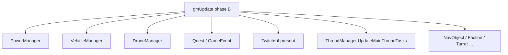
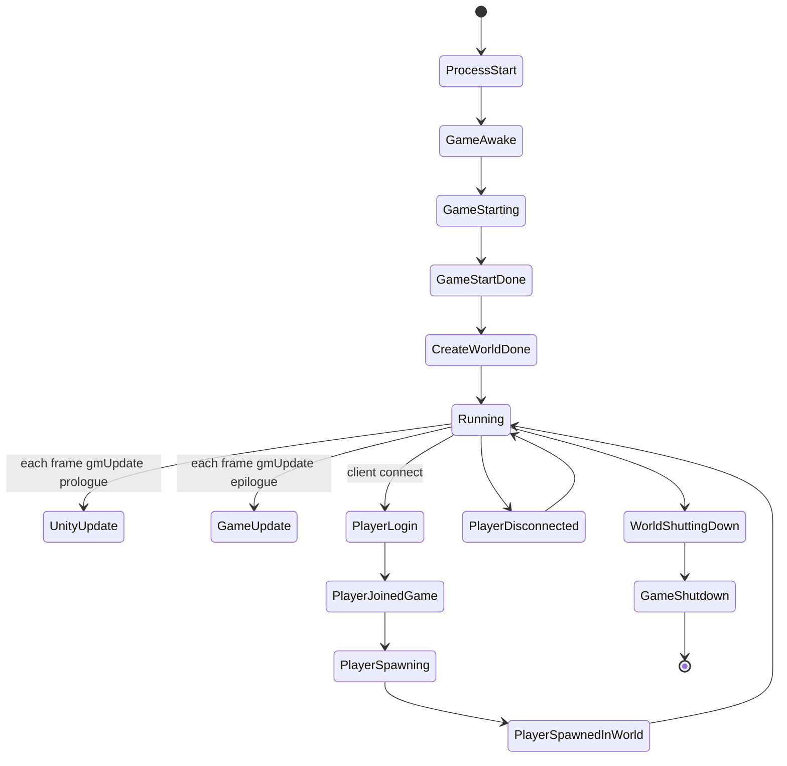

# Managers and ModEvents (dedicated V3.0.1)

**Owns:** gmUpdate-relevant manager Update ILs + full `ModEvents` field list.  
**Raw inventory (all Update* names):** [`inventory-manager-updates.md`](inventory-manager-updates.md).  
**Dumps:** [`../il/dedi-complete-v3.0.1/`](../il/dedi-complete-v3.0.1/) §2, §11; [`../il/loop-complete-v3.0.1/`](../il/loop-complete-v3.0.1/).  
**Loop context:** [`loop.md`](loop.md) §10.

---

## 1. gmUpdate manager chain (measured Update IL)

Called when instance non-null (null skip). Live sizes:

| Manager | Update IL | Notes |
|---|---:|---|
| `TwitchManager` | **1585** (IL=1585) | Large; waste if constructed without Twitch |
| `DroneManager` | **305** | Waypoints |
| `VehicleManager` | **297** | Waypoints |
| `TriggerEffectManager` | 216 | |
| `QuestEventManager` | 127 | |
| `TokenManager` | 121 | |
| `PowerManager` | **106** | Tile-entity power; content can explode |
| `DismembermentManager` | 60 | |
| `BlockedPlayerList` | 59 | |
| `TurretTracker` | 45 | |
| `FactionManager` | 43 | |
| `NavObjectManager` | 42 | Map/claim pins |
| `GameEventManager` | 25 | + HandleSpawnUpdates 148 etc. |
| `TriggerManager` | 23 | |
| `EntityAsyncManager` | 22 | Async entity create complete |
| `RaycastPathManager` | 5 | |
| `PartyManager` | 4 | |
| `ThreadManager.UpdateMainThreadTasks` | 64 | Main queue drain (name may not be bare `Update`) |

Also from peers / LateUpdate: `MeshDataManager`, `ConnectionManager`, `DynamicMeshManager`, `SdtdConsole`, `LoadManager`, `PlatformManager`, `AstarManager.UpdateGraphs` (185). The last is player-following and the top measured CPU + heap allocator at load: [`measured-scaling.md`](measured-scaling.md) §1/§4b.

---

## 2. ModEvents (managed hook surface)

Type `ModEvents` static fields (complete inventory from dump):

| Event field | Kind | Typical fire point |
|---|---|---|
| `GameAwake` | ModEvent | Startup |
| `GameStarting` | ModEvent | |
| `GameStartDone` | ModEvent | |
| `GameFocus` | ModEvent | |
| `MainMenuOpening` | Interruptible | Client menu |
| `MainMenuOpened` | ModEvent | Client |
| `CreateWorldDone` | ModEvent | World create |
| `UnityUpdate` | ModEvent | gmUpdate prologue (`SUnityUpdate`) |
| `GameUpdate` | ModEvent | gmUpdate epilogue (`SGameUpdate`) |
| `WorldShuttingDown` | ModEvent | |
| `GameShutdown` | ModEvent | |
| `ServerRegistered` | ModEvent | Dedicated register |
| `PlayerLogin` | Interruptible | Auth path |
| `PlayerJoinedGame` | ModEvent | |
| `PlayerSpawning` | ModEvent | |
| `PlayerSpawnedInWorld` | ModEvent | |
| `PlayerDisconnected` | ModEvent | |
| `SavePlayerData` | ModEvent | |
| `GameMessage` | Interruptible | |
| `ChatMessage` | Interruptible | |
| `CalcChunkColorsDone` | ModEvent | |
| `EntityKilled` | ModEvent | |

**Residual:** *who* subscribes is content/mod dependent (cannot be closed from DLL alone). The **hook surface names** are closed.

---

## 3. Console / ops peers

| Type | Update IL | Role |
|---|---:|---|
| `SdtdConsole` | 60 | Command pump |
| `LoadManager` | 56 | Async loads |
| `FPS` | - | Counter |
| `GameObjectPool.FrameUpdate` | - | Pool |

## Changelog

- **2026-07-18:** Managers + full ModEvents field inventory from dedi-complete dump.
## Related docs

| Doc | Role |
|---|---|
| [loop.md](loop.md) | Frame peers |
| [residuals.md](residuals.md) | ModEvents subscribers residual |

## Changelog

- **2026-07-19:** Related docs table.
