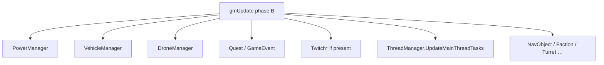
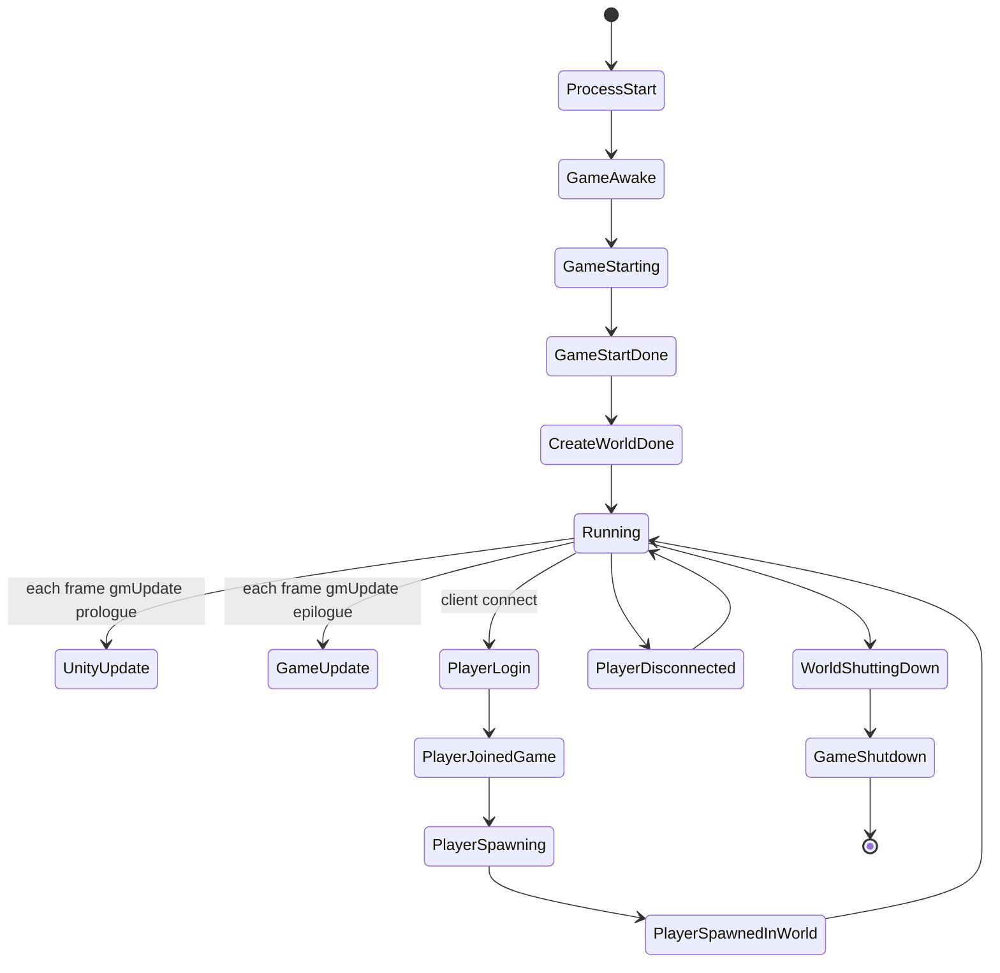

# Managers and ModEvents (dedicated V3.1.0)

**Owns:** gmUpdate-relevant manager Update ILs + full `ModEvents` field list.  
**Hub:** [`INDEX.md`](INDEX.md).  
**Raw inventory (all Update* names):** [`inventories/manager-updates.md`](inventories/manager-updates.md).  
**Dumps:** [`../il/dedi-complete-v3.1.0/`](../il/dedi-complete-v3.1.0) §2, §11; [`../il/loop-complete-v3.1.0/`](../il/loop-complete-v3.1.0).  
**Loop context:** [`loop.md`](loop.md) §10.

---

## 1. gmUpdate manager chain (measured Update IL)

Called when instance non-null (null skip). The **Update IL** column is each
manager's `Update`/`UpdateTick` method instruction count from the dump (e.g.
`TwitchManager` IL=1585, the largest):

| Manager | Update IL | Notes |
|---|---:|---|
| `TwitchManager` | **1585** | Large; waste if constructed without Twitch |
| `DroneManager` | **305** | Server + game started + players: reconcile `dronesUnloaded` ECD list vs live entities (near-identical vehicle pattern) |
| `VehicleManager` | **297** | Server + game started + players: reconcile `vehiclesUnloaded` ECD vs live; spawn/unload vehicle persistence path |
| `TriggerEffectManager` | 216 | |
| `QuestEventManager` | 127 | Each frame: `ObjectiveRallyPoint.SetupFlags`; walk `objectivesToUpdate` / `challengeObjectivesToUpdate` `HandleUpdate(dt)`; prune dead `questTrackersToUpdate` |
| `TokenManager` | 121 | |
| `PowerManager` | **106** | Server + players + game started: every **0.16 s** sources then triggers; every **120 s** threaded save; every frame flush `ClientUpdateList` ([tile-entities-power.md](tile-entities-power.md) §3) |
| `DismembermentManager` | 60 | |
| `BlockedPlayerList` | 59 | |
| `TurretTracker` | 45 | Server + started: **120 s** threaded `Save` when prior save thread done |
| `FactionManager` | 43 | Server + started: **60 s** threaded faction data save |
| `NavObjectManager` | 42 | Map/claim pins |
| `GameEventManager` | 25 | Server: `HandleSpawnUpdates` (attack timer **2 s**), `HandleActionUpdates`, block/flag/boss-group updates, HomerunManager |
| `TriggerManager` | 23 | |
| `EntityAsyncManager` | 22 | Async entity create complete (**phase F**: called after the game-started gate, not the phase-B chain; see [loop-gmupdate.md](loop-gmupdate.md) §2) |
| `RaycastPathManager` | 5 | |
| `PartyManager` | 4 | |
| `ThreadManager.UpdateMainThreadTasks` | 64 | Main queue drain (name may not be bare `Update`) |

### 1.1 Related non-gmUpdate sim managers (re-pin 2026-08-07)

| Manager / method | IL | Behaviour |
|---|---:|---|
| `WorldBlockTicker.Tick` | 20 | If `bTickingActive` and not remote: `tickScheduled` then `tickRandom(activeChunks)` |
| `WorldBlockTicker.tickScheduled` | 151 | Under lock, drain due entries from `scheduledTicksSorted` (batch cap **100**) |
| `ChunkManager.SendChunksToClients` | 216 | Per observer: queue `NetPackageChunkRemove` for `chunksToRemove`, then reload/send packages from observer load sets; clear remove set |
| `DecoManager.UpdateTick` | 330 | See §1.1 (OnUpdateTick always-path) |

### 1.1b `DecoManager.UpdateTick` (IL=330)

1. If `!IsEnabled`: ret.
2. `checkDelayTicks--` (field used as throttle counter).
3. If `updateCoroutine` is null, drain thread-side queues under lock (each non-empty
   queue resets `checkDelayTicks` to 0):
   - `addDecosFromThread` → `AddDecorationAt` each, clear.
   - `removeDecosFromThread` → `RemoveDecorationAt` each, clear.
   - `resetDecosInWorldRectFromThread` → `ResetDecosInWorldRect` each, clear.
   - chunk-key list → `ResetDecosForWorldChunk` each, clear.
4. When `checkDelayTicks <= 0`: set to **20**; rebuild `playersToCheck` (server:
   all players; client: primary local or clear); for each player, mark deco-chunk
   keys around block pos using view distance GamePrefs **173** into
   `chunksAroundPlayers`.
5. Start `UpdateDecorationsCo` via `ThreadManager.StartCoroutine` (assigns
   `updateCoroutine`).

Always-path cost on dedicated (optim skip candidate; not sim correctness).

Also from peers / LateUpdate: `MeshDataManager`, `ConnectionManager`, `DynamicMeshManager`, `SdtdConsole`, `LoadManager`, `PlatformManager`, `AstarManager.UpdateGraphs` (185). The last is player-following and the top measured CPU + heap allocator at load: [`measured-scaling.md`](../../7dtd-optimizer/docs/measured-scaling.md) §1/§4b.

---

## 2. ModEvents (managed hook surface)

Type `ModEvents` static fields (complete inventory from dump):

| Event field | Kind | Typical fire point |
|---|---|---|
| `GameAwake` | ModEvent | Startup |
| `GameStarting` | ModEvent | |
| `GameStartDone` | ModEvent | |
| `GameFocus` | ModEvent | |
| `MainMenuOpening` | Interruptible | Client menu |
| `MainMenuOpened` | ModEvent | Client |
| `CreateWorldDone` | ModEvent | World create |
| `UnityUpdate` | ModEvent | gmUpdate prologue (`SUnityUpdate`) |
| `GameUpdate` | ModEvent | gmUpdate epilogue (`SGameUpdate`) |
| `WorldShuttingDown` | ModEvent | |
| `GameShutdown` | ModEvent | |
| `ServerRegistered` | ModEvent | Dedicated register |
| `PlayerLogin` | Interruptible | Auth path |
| `PlayerJoinedGame` | ModEvent | |
| `PlayerSpawning` | ModEvent | |
| `PlayerSpawnedInWorld` | ModEvent | |
| `PlayerDisconnected` | ModEvent | |
| `SavePlayerData` | ModEvent | |
| `GameMessage` | Interruptible | |
| `ChatMessage` | Interruptible | |
| `CalcChunkColorsDone` | ModEvent | |
| `EntityKilled` | ModEvent | |

**Residual:** *who* subscribes is content/mod dependent (cannot be closed from DLL alone). The **hook surface names** are closed.

---

## 3. Console / ops peers

| Type | Update IL | Role |
|---|---:|---|
| `SdtdConsole` | 60 | Command pump |
| `LoadManager` | 56 | Async loads |
| `FPS` | - | Counter |
| `GameObjectPool.FrameUpdate` | - | Pool |

Core types include `GameEventManager` and `GameEventAction` sequences (content-driven).

## Related docs

| Doc | Role |
|---|---|
| [loop.md](loop.md) | Frame peers |
| [residuals.md](residuals.md) | ModEvents subscribers residual |

## Changelog

- **2026-08-07:** DecoManager.UpdateTick IL=330 (thread queues, checkDelay 20,
  player deco-chunk ring GamePrefs 173, UpdateDecorationsCo).
- **2026-08-07:** Manager Update behaviour re-pins (Vehicle/Drone unload lists,
  Quest objectives, Turret/Faction save timers, GameEvent handles, Power 0.16/120,
  WorldBlockTicker, SendChunksToClients).
- **2026-07-19:** Related docs table.
- **2026-07-18:** Managers + full ModEvents field inventory from dedi-complete dump.
