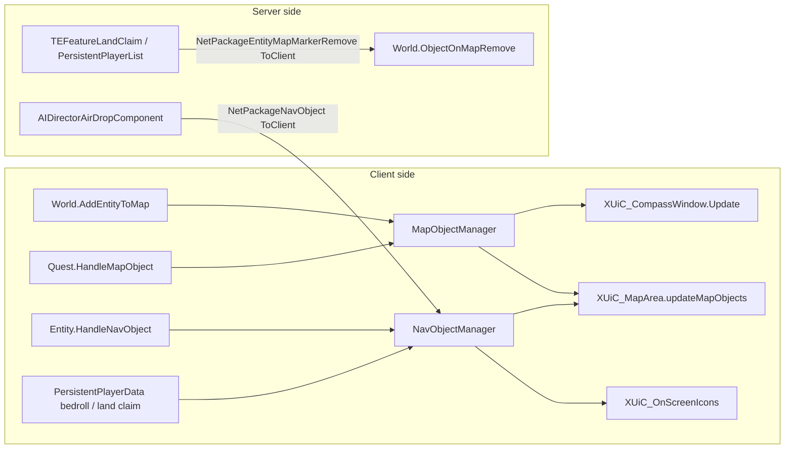

# Map objects and nav objects (dedicated V3.1.0)

**Owns:** the two map/compass marker registries: the legacy `MapObject` family
(`MapObject` + 16 subclasses, `MapObjectManager`, `EnumMapObjectType`) and the
XML-driven `NavObject` system (`NavObject`, `NavObjectClass`,
`NavObjectClassesFromXml`, `NavObjectManager`), plus the net packages that let
the server push marker add/remove to clients
(`NetPackageNavObject`, `NetPackageEntityMapMarkerRemove`).
**Not:** the quest state machine that decides *when* a quest marker exists
([`quests-challenges.md`](quests-challenges.md)); the gmUpdate scheduling of
`NavObjectManager.Update` ([`managers.md`](managers.md)); map chunk/fog-of-war
sync (`NetPackageMapChunks`, [`protocol-packages.md`](protocol-packages.md));
UI widget layout.
**Evidence:** `MapObject`, `MapObject*` subclasses, `MapObjectManager`,
`NavObject`, `NavObjectClass`, `NavObjectClassesFromXml`, `NavObjectManager`,
`NetPackageNavObject`, `NetPackageEntityMapMarkerRemove`, `World`
(`AddEntityToMap`, `ObjectOnMapAdd`), `Quest.HandleMapObject` IL (global
namespace; dump locally with `tools/src/DumpMethod`, git-ignored).
**Hub:** [`INDEX.md`](INDEX.md). **Method:** [`re-methodology.md`](re-methodology.md).

Headline: **markers are client-derived, not server-authoritative.** The server
never renders or streams a marker list. Clients build their own map/compass
markers from state they already have (entities in view, quest state, persistent
player data). The server's only marker-specific traffic is a handful of
ToClient "nudge" packages for things only it knows about (air-drop crates, land
claim deactivation, bedroll clears). `MapObjectManager` is never even
constructed on a dedicated server.

---

## 1. Two registries, one purpose

A marker on the map or compass is a world position (or tracked entity) plus
icon styling. Two generations of the system coexist:

- **`MapObject`** (legacy): one C# subclass per marker kind, styling hardcoded
  in virtual methods (`GetMapIcon`, `GetCompassIcon`, min/max compass
  distances, blink, color). Held by `MapObjectManager`, bucketed by
  `EnumMapObjectType`. Populated by gameplay code (`World.AddEntityToMap`,
  `Quest.HandleMapObject`, `ObjectiveClearSleepers`).
- **`NavObject`** (current): data-driven. A `NavObject` tracks an entity,
  transform, or position and carries a list of `NavObjectClass` entries parsed
  from `nav_objects.xml` (registered under the loader key `nav_objects` in the
  `WorldStaticData` cctor). Each class bundles per-context settings
  (`NavObjectMapSettings`, `NavObjectCompassSettings`,
  `NavObjectScreenSettings`) plus a requirement filter. Held by the
  `NavObjectManager` singleton.

Both registries feed the same UI consumers: `XUiC_MapArea.updateMapObjects`
walks `MapObject` lists *and* a `keyToNavObject` dictionary;
`XUiC_CompassWindow.Update` polls `World.GetObjectOnMapList` per type (13 call
sites); `XUiC_OnScreenIcons` subscribes to `NavObjectManager.OnNavObjectAdded`.
All three are client-only UI (present in the dedi DLL but unreachable).

## 2. MapObject base

`MapObject..ctor(EnumMapObjectType, Vector3, Int64 key, Entity, bool
selectable)` stores exactly five fields: `type`, `position`, `key`,
`bSelectable`, `entity`. Everything else is a virtual styling surface the
subclasses override: `GetMapIcon` / `GetCompassIcon` (+ up/down variants),
`GetMapIconColor`, `GetMinCompassDistance` / `GetMaxCompassDistance`, icon
scale methods, `IsOnCompass`, `IsMapIconEnabled`, `IsMapIconBlinking`,
`NearbyCompassBlink`, `IsShowName` / `GetName`, `IsTracked`, `RefreshData`.

The `key` is the per-type dictionary key. Entity-backed markers use
`entityId`; positional markers use a static auto-increment counter per subclass
(e.g. `MapObjectQuest::newID`, `MapObjectLandClaim::MapObjectLandCLaimKeys`,
typo in the original field name).

## 3. Subclass family

`EnumMapObjectType` (18 values, `Last = 17`) indexes the manager's buckets.
Constructor IL pins each subclass to its enum value; caller lists are from
`FindCallers` against the dedi assembly.

| Subclass | Enum (value) | Represents | Key source | Constructed by (dedi DLL) |
|---|---|---|---|---|
| `MapObjectZombie` | `Entity` (0) | hostile enemy blip | entityId | `World.AddEntityToMap` (`isinst EntityEnemy`/`EntityEnemyAnimal`) |
| `MapObjectAnimal` | `Entity` (0) | animal blip | entityId | `World.AddEntityToMap` (`isinst EntityAnimal`) |
| `MapObjectVehicle` | `Entity` (0) | vehicle icon w/ rotation | entityId | copy-ctor only, in `MapObjectManager..ctor` restore |
| `MapObjectSleepingBag` | `SleepingBag` (1) | bedroll | entityId | none (superseded by `NavObject`) |
| `MapObjectBackpack` | `Backpack` (3) | dropped backpack | int key | none (superseded by `NavObject`) |
| `MapObjectWaypoint` | `MapMarker` (6) | player waypoint (`Waypoint`) | static counter | `DynamicMeshConsoleCmd.Execute` (debug) only |
| `MapObjectMarker` | `MapQuickMarker` (7) | temporary quick pin | caller key | none (client UI path absent) |
| `MapObjectTreasureChest` | `TreasureChest` (8) | treasure radius circle (`DefaultRadius`, quest code as key) | quest code | `Quest.HandleMapObject` |
| `MapObjectQuest` | `Quest` (9) | generic quest marker, icon string (`ui_game_symbol_quest`) | static counter | `Quest.HandleMapObject` |
| `MapObjectFetchItem` | `FetchItem` (10) | fetch-quest satchel | static counter | `Quest.HandleMapObject` |
| `MapObjectHiddenCache` | `HiddenCache` (11) | buried-cache search area | static counter | `Quest.HandleMapObject` |
| `MapObjectSleeperVolume` | `SleeperVolume` (12) | clear-quest sleeper hint | static counter | `ObjectiveClearSleepers.Current_SleeperVolumePositionAdd` |
| `MapObjectSupplyDrop` | `SupplyDrop` (13) | air-drop crate | entityId (param) | none (superseded by `NavObject`) |
| `MapObjectVendingMachine` | `VendingMachine` (14) | rented vending machine | entityId | none (superseded by `NavObject`) |
| `MapObjectLandClaim` | `LandClaim` (15) | land claim block | static counter | none (superseded by `NavObject`) |
| `MapObjectRestorePower` | `RestorePower` (16) | restore-power quest target | static counter | none |

Unused enum values `StartPoint` (2), `Prefab` (4), `EntitySpawner` (5) have no
subclass in this build. The "none" rows are vestigial: the classes survive but
nothing news them up; their roles moved to `NavObject` registrations (e.g.
`EntityPlayerLocal.HandleMapObjects` registers a `land_claim` nav object,
`PersistentPlayerData.ShowBedrollOnMap` registers the bedroll,
`EntitySupplyCrate.HandleNavObject` the crate).

`World.AddEntityToMap` gates everything on `Entity.HasUIIcon()`, and routes
vehicles and drones away from the MapObject path entirely: they get a
`NavObject`-driven tracking toggle tied to the `mapArea` XUi window, with the
generic `MapObject` Entity fallback only for other icon-bearing entities.

## 4. MapObjectManager (client-only in practice)

- Storage: `List<DictionaryList<int, MapObject>>` with one bucket per enum
  value (`ldc.i4.s 17` loop in the ctor), so lookups are `mapObjects[(int)type]`
  keyed by `(int)key`. `Add` displaces an existing key
  (`ContainsKey -> Remove -> Add`) and fires the `ChangedDelegates` event
  (`MapObjectListChangedDelegate(type, mapObject, added)`); `Remove`,
  `RemoveByPosition` (x/z compare), `RemoveByType` mirror it.
- A **static** `entityList` shadows every type-0 (Entity) marker. The ctor
  re-adds its contents to the new instance (cloning `MapObjectVehicle`
  specially), which is how entity blips survive the manager being rebuilt on
  local-player respawn (`PlayerMoveController.updateRespawn ->
  World.RefreshEntitiesOnMap`).
- Lifecycle: the **only** constructor call site is `World.AddLocalPlayer`. A
  dedicated server has no local player, so `World.objectsOnMap` stays null and
  the wrappers `World.ObjectOnMapAdd/ObjectOnMapRemove/GetObjectOnMapList`
  null-check and no-op. Server-reachable callers of `ObjectOnMapAdd`
  (`Quest.HandleMapObject`, `ObjectiveClearSleepers`,
  `DynamicMeshConsoleCmd`) therefore only have effect on clients.
- In this dedi build `ChangedDelegates` has **zero subscribers**; the map
  window polls `updateMapObjects` per frame instead.

## 5. NavObjectClass: the XML registry

`NavObjectClassesFromXml.Load` (registered for the `nav_objects` XML in the
`WorldStaticData` cctor, next to `NavObjectClass.Reset` as the reload hook)
parses each class into a static registry queried by name via
`NavObjectClass.GetNavObjectClass(string)`. `HandleExtends` supports
`extends`-style inheritance between classes. Per class:

- Three settings blocks, each with an active and an inactive variant:
  `GetMapSettings(bool)`, `GetCompassSettings(bool)`,
  `GetOnScreenSettings(bool)` (map icon, compass icon with hot-zone settings,
  on-screen 3D sprite).
- `Init` parses `requirement_type` into `NavObjectClass/RequirementTypes`
  (all **14** members: `None=0, CVar=1, QuestBounds=2, Tracking=3, NoTag=4,
  InParty=5, IsAlly=6, IsPlayer=7, IsVehicleOwner=8, IsOwner=9, NoActiveQuests=10,
  MinimumTreasureRadius=11, IsTwitchSpawnedSelf=12, IsTwitchSpawnedOther=13`), plus
  `requirement_name`, `tag`, `use_override_icon`. `NavObject.IsValidEntity` switches
  over 13 of them (the Twitch cases match on `spawnByName`).

## 6. NavObject: a tracked thing wearing classes

A `NavObject` tracks exactly one of: an `Entity` (`TrackedEntity`), a
`Transform`, or a fixed `Vector3` (`TrackedPosition`), plus optional
`OwnerEntity`, `EntityID`, `OverrideSpriteName`, and `hiddenOnCompass`.
`SetupNavObjectClass` accepts a comma-separated class-name list, resolves each
via the registry, and records whether any class has on-screen settings
(`HasOnScreen`).

Per-player filtering happens at display time, not registration time:
`HandleActiveNavClass(EntityPlayerLocal)` walks the class list and promotes the
first class for which `IsValidPlayer`/`IsValidEntity` passes to
`NavObject.NavObjectClass` (the active one whose settings the UI reads).
`IsValidEntity` implements the requirement types against the *local* player:
alive/sleeper checks, `CVar` lookup (`GetCVar(RequirementName)`),
`QuestBounds` (`Rect.Contains`), party/ally/spectator checks for `InParty` and
`IsAlly`, `IsVehicleOwner` via `EntityAlive.HasOwnedEntity`, turret/NPC
special cases, and `Entity.spawnByName` matching. This is why marker
visibility (ally pins, owned-vehicle icons, tracked-quest icons) needs no
server round trip.

## 7. NavObjectManager

Lazy singleton (`get_Instance` constructs on demand), so it exists on both
sides. Registry is a flat `List<NavObject> NavObjectList` plus a
`removedNavObjectPool` free list (register pulls from the pool and `Reset`s
before allocating) and a tag set (`AddNavObjectTag`/`HasNavObjectTag`, used by
the `NoTag` requirement). Three `RegisterNavObject` overloads (transform,
position + entityId/owner, entity) dedupe against existing entries
(`IsTrackedTransform` / same-class + owner/entityId/position match) and fire
`OnNavObjectAdded`; unregister variants (`ByClass`, `ByEntityID`,
`ByOwnerEntity`, `ByPosition`) funnel through a predicate-driven
`unRegisterNavObjects` and fire `OnNavObjectRemoved`.

`Update()` is called from `GameManager.gmUpdate` (see
[`managers.md`](managers.md), 42 IL): it prunes entries whose `IsValid()` went
false (dead tracked entity etc.) and, **only if `GetPrimaryPlayer()` is
non-null**, runs `HandleActiveNavClass` per entry. On a dedicated server the
primary player is always null, so the server's `NavObjectManager` degrades to a
self-cleaning list.

## 8. Server vs client: who is authoritative

| Flow | Direction | Mechanism |
|---|---|---|
| Enemy/animal blips | client-derived | `World.AddEntityToMap` on locally spawned entities; no marker traffic |
| Quest markers (quest, treasure, fetch, cache, sleepers) | client-derived | `Quest.HandleMapObject` / `ObjectiveClearSleepers` on the quest owner's client; see [`quests-challenges.md`](quests-challenges.md) |
| Bedroll, land claim, backpack, vehicle, drone, trader | client-derived from synced state | `PersistentPlayerData.ShowBedrollOnMap`, `PersistentPlayerList.PlaceLandProtectionBlock`, `Entity*.HandleNavObject` register nav objects locally once the underlying data replicates |
| Air-drop crate | server push | `AIDirectorAirDropComponent.RefreshCrates` registers locally *and* sends `NetPackageNavObject` (`PackageDirection = ToClient`); removal via `Setup(int)` |
| Game-event displays (e.g. Homerun score) | server push | `NetPackageNavObject` color overload |
| Land claim deactivate/destroy, bedroll clear, crate death | server push (remove) | `NetPackageEntityMapMarkerRemove` (`ToClient`): `removeByType` i32, entityId **or** Vector3, `EnumMapObjectType` i32; `World.ObjectOnMapRemove` |
| Waypoints | client-owned, server-relayed | `Waypoint`/`WaypointCollection` persist in the player profile (`Read`/`Write`); invites relay through `GameManager.WaypointInviteServer` -> `NetPackageWaypoint`; POI waypoints via `NetPackagePOIWaypoint` (`ToClient`; op Set/Remove/ClearAll + prefab id); drone/vehicle waypoint lists pushed by `DroneManager`/`VehicleManager` via `NetPackageEntityWaypointList` |

`NetPackageNavObject.ProcessPackage` opens with `WorldBase.IsRemote()` and
returns immediately when false, so even a misdirected package cannot mutate
server state: the marker registries accept remote input only on clients.

**Client-only parts** (present in the dedi DLL, unreachable on the server):
`MapObjectManager` and every `MapObject` subclass construction path except the
debug console command, `XUiC_MapArea` / `XUiC_CompassWindow` /
`XUiC_OnScreenIcons` consumers, `NavObject.HandleActiveNavClass` per-player
class selection, and `EntityPlayerLocal.HandleMapObjects`. Server-side surface
is limited to the `NavObjectManager` prune loop in gmUpdate, server
registrations feeding the two ToClient packages, and the persistent-data hooks
listed above.

## Related docs

- [managers.md](managers.md): `NavObjectManager.Update` in the gmUpdate chain.
- [quests-challenges.md](quests-challenges.md): quest state driving `Quest.HandleMapObject`.
- [protocol-packages.md](protocol-packages.md): NetPackage wire formats.
- [aidirector.md](aidirector.md): air-drop component that pushes crate markers.
- [dynamic-mesh.md](dynamic-mesh.md): `DynamicMeshConsoleCmd` debug waypoint.

## NavObject package

`NetPackageNavObject` (protocol-packages 6.22): class name, display name, position,
add/remove, override color, localization flag, entityId.

## Changelog

- **2026-07-28:** NetPackageNavObject field list.

- **2026-07-28:** MapMarkerRemove / POIWaypoint wire fields.

- 2026-07-24: initial RE of MapObject/NavObject marker system from V3.0.1 dedi
  IL: subclass/enum table, manager lifecycles, nav_objects.xml registry,
  requirement filtering, server-vs-client authority and the two ToClient
  marker packages.
