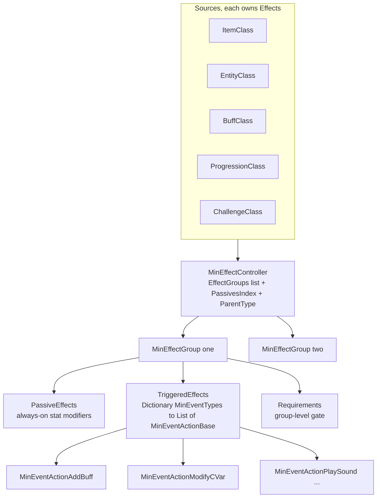
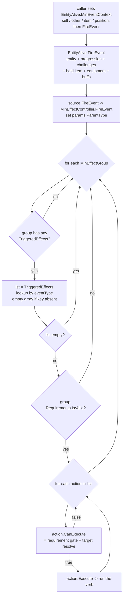
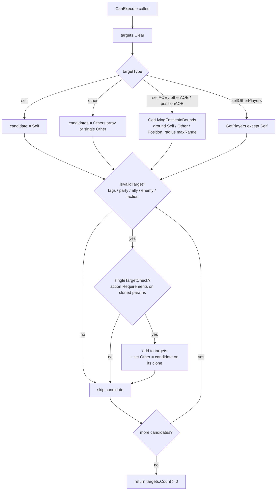

# MinEvent triggered-effect framework (dedicated V3.1.0)

**Owns:** the `MinEvent*` surface, the data-driven trigger/effect engine that lets
items, entities, buffs, progression, and challenges react to named in-game
events: the `MinEffectController` / `MinEffectGroup` handler containers, the
`MinEventTypes` trigger vocabulary, the `MinEventActionBase` action contract, the
`MinEventActionTargetedBase` target resolver, requirement gating, and the
`MinEventParams` context bag that carries self/other/item/block/position through
a fired event.
**Not:** the XML effect content itself (`items.xml`, `buffs.xml`,
`entityclasses.xml`, `progression.xml` define which triggers fire which actions:
data, not IL); the `EntityBuffs` runtime that one action family drives
([`buffs.md`](buffs.md)); the separate `GameEvent.*` scripted-sequence engine
([`game-events.md`](game-events.md), contrasted in §8); client-only presentation
(particles, sound, animator, camera).
**Evidence:** `MinEffectController`, `MinEffectGroup`, `MinEventActionBase`,
`MinEventActionTargetedBase`, `MinEventActionBuffModifierBase`, `MinEventParams`
IL plus the `MinEventTypes` / `TargetTypes` / `SourceParentType` enums and the
`MinEventAction*` leaves (transitive subclasses; see catalog) in the V3.1.0 b14 type surface (73 matches). Dump locally with
`tools/src/DumpMethod` (git-ignored). **Hub:** [`INDEX.md`](INDEX.md).
**Method:** [`re-methodology.md`](re-methodology.md).

Unlike `GameEvent.*` (a stateful phase-machine interpreter ticked from the main
loop), MinEvent is a **stateless fan-out**: a source holds, per trigger name, a
list of actions, and when something fires that trigger the actions run once,
top to bottom, gated by requirements and a resolved target set. There is no
per-node state, no phases, no scheduler in the dispatch itself.

---

## 1. Architecture

A **source** owns one `MinEffectController` (field `Effects`). Six source kinds
carry effects, tagged by the `SourceParentType` the controller stamps onto every
fired event:

| `SourceParentType` | Owner type | Field |
|---:|---|---|
| 1 `ItemClass` | `ItemClass` | `ItemClass.Effects` |
| 2 `ItemModifierClass` | `ItemClassModifier` (mod) | `ItemClass.Effects` on the modifier |
| 3 `EntityClass` | `EntityClass` | `EntityClass.Effects` |
| 4 `ProgressionClass` | `ProgressionClass` | `ProgressionClass.Effects` |
| 5 `BuffClass` | `BuffClass` | `BuffClass.Effects` |
| 6 `ChallengeClass` / 7 `ChallengeGroup` | challenge defs | challenge `Effects` |

`Block` has **no** controller: block interactions surface as triggers fired on
the acting entity (§7), with the `BlockValue` passed in the params.

Each controller holds an ordered `List<MinEffectGroup>` (`EffectGroups`), a
`PassivesIndex` (`HashSet<PassiveEffects>`) for the stat-modifier fast path, and
`ParentType` / `ParentPointer` back-references. A `MinEffectGroup` is the unit
parsed from one `<effect_group>` element and holds four things:

| `MinEffectGroup` member | Type | Role |
|---|---|---|
| `Requirements` | `RequirementGroup` | group-level gate (`<effect_group>` requirement list) |
| `PassiveEffects` | `List<PassiveEffect>` | the always-on stat modifiers (`<passive_effect>`), queried by `ModifyValue` / `GetModifiedValueData` |
| `TriggeredEffects` | `Dictionary<MinEventTypes, List<MinEventActionBase>>` | the event handlers (`<triggered_effect>`), keyed by trigger |
| `EffectDescriptions` / `EffectDisplayValues` | lists / dict | UI text (content) |

So a group is both the passive (stat math) and reactive (trigger) half of an
effect. This doc covers the reactive half; the passive half feeds
[`buffs.md`](buffs.md) and the stat system through `GetModifiedValueData`.

---

## 2. The trigger vocabulary: `MinEventTypes`

`MinEventTypes` is a flat `enum` of 111 named triggers (0 to 110) plus `COUNT`
(111). XML `trigger="onSelfBuffStart"` etc parse straight to the enum value
(`EnumUtils.Parse`), and that value is the dictionary key an action registers
under (`MinEffectGroup.AddTriggeredEffect` reads `action.EventType`). The names
partition into families:

| Family | Representative triggers (enum order) |
|---|---|
| Buff lifecycle | `onSelfBuffStart` (0), `onSelfBuffUpdate`, `onSelfBuffFinish`, `onSelfBuffRemove`, `onSelfBuffStack` |
| Combat, given / taken | `onOtherDamagedSelf` (7), `onOtherAttackedSelf`, `onSelfDamagedOther`, `onSelfAttackedOther`, `onSelfVehicleAttackedOther`, `onSelfExplosion*` (14 to 16), `onSelfDamagedSelf`, `onSelfHealed*` |
| Kills / death | `onSelfKilledOther` (19), `onOtherKilledSelf`, `onBlockKilledSelf`, `onSelfKilledSelf`, `onSelfDied`, `onDismember` (105) |
| Item action (primary / secondary / action2) | `onSelfPrimaryActionStart` (24) through `onSelfAction2End` (42): start / rayHit / rayMiss / grazeHit / grazeMiss / end / update / missEntity |
| Block interaction | `onSelfRepairBlock` (43), `onSelfPlaceBlock`, `onSelfUpgradedBlock`, `onSelfDamagedBlock`, `onSelfDestroyedBlock`, `onSelfHarvestBlock` |
| Ranged / equip / reload | `onSelfRangedBurstShot*`, `onSelfEquipStart` (54) to `onSelfEquipStop`, `onReloadStart` (58) to `onReloadStop` |
| Spawn / session / movement | `onSelfFirstSpawn` (61), `onSelfRespawn`, `onSelfEnteredGame`, `onSelfTeleported`, `onSelfJump`, `onSelfRun` / `Walk` / `Crouch` / `Swim*` / `Aiming*` (66 to 81) |
| Item economy | `onSelfHoldingItemThrown` (82), `onSelfItemCrafted`, `onSelfItemRepaired`, `onSelfItem{Looted,Lost,Gained,Sold,Bought,Activate,Deactivate}` (86 to 92) |
| Projectile / perk / world | `onProjectilePreImpact` (96), `onProjectileImpact`, `onPerkLevelChanged`, `onSelfEnteredBiome`, `onSelf*LootContainer`, `onCombatEntered`, `onTreasureRadius*` (108 to 110) |

The `onSelf*` / `onOther*` prefix is a naming convention for whose perspective
the trigger is raised from; the actual actor bindings live in `MinEventParams`
(§5), so an action reads `Self` / `Other` rather than trusting the name.

---

## 3. Dispatch: `FireEvent` fan-out

`EntityAlive.FireEvent(eventType, useInventory)` (**IL=57**) is the aggregator. It
reuses the entity's single `MinEventContext` (a `MinEventParams` the caller has
already populated with self/other/item/position) and fans it to every controller
the entity currently exposes, in a fixed order:

1. `EntityClass.Effects` (the entity definition's own effects)
2. `Progression` (perk-driven effects)
3. `challengeJournal` (challenge effects)
4. `inventory` held item, only when `useInventory` is set
5. `equipment` (worn items; always if present)
6. `EntityBuffs` (every active buff's `BuffClass.Effects`)

Each of those is itself a `FireEvent` that either wraps one `MinEffectController`
(`BuffClass`, `ItemClass`, `ProgressionClass`: with a `canRun` pre-gate on
buffs) or iterates a collection (`EntityBuffs` over active buffs,
`Inventory` / `Equipment` over items, and `ItemValue.FireEvent` additionally
recurses into the item's ammo magazine item and its quality modifiers so a mod's
own effects fire too).

`MinEffectController.FireEvent` stamps `params.ParentType` and walks its groups.
`MinEffectGroup.FireEvent` does the actual work: skip if the group has no
triggered effects at all, look up the action list for this trigger
(`GetTriggeredEffects`, an empty array when the key is absent so a miss is
allocation-free), skip if empty, then check the group-level requirement
(`canRun` = `Requirements.IsValid(params)`), then for each action run
`CanExecute` and, if it passes, `Execute`.

---

## 4. The action contract

`MinEventActionBase` is the single node contract, parsed from one
`<triggered_effect trigger="..." action="...">` element. `ParseAction` resolves
the `action` attribute to a type by reflection with the fixed prefix
`MinEventAction` (so `action="AddBuff"` becomes `MinEventActionAddBuff`),
instantiates it, feeds every XML attribute through `ParseXmlAttribute`, then
parses a `RequirementGroup` from the element's requirement children.

| Member | Role |
|---|---|
| `EventType` (`MinEventTypes`) | which trigger this action registers under (`trigger` attribute) |
| `Delay` (`Single`) | `delay` attribute; parsed on the base but consumed only by specific verbs (e.g. `MinEventActionModifyStats` uses it as the temporary-modifier duration), not a general scheduler |
| `Requirements` (`RequirementGroup`) | per-action gate |
| `CanExecute(eventType, params)` | approval: returns `Requirements.IsValid(params)`, or `true` when there is no requirement group |
| `Execute(params)` | the verb; a no-op on the base, overridden by every leaf |
| `ParseXmlAttribute` / `ParseXMLPostProcess` | XML to fields; subclasses chain up |

`CanExecute` and `Execute` are the whole runtime protocol: `CanExecute` is a
pure boolean gate, `Execute` returns nothing and has side effects. Contrast this
with `GameEvent`'s `PerformAction`, which returns a four-state
`ActionCompleteStates` because it drives a phase machine; MinEvent has no
completion states because it never re-enters an action.

### Action categories

The leaves group by side effect. The abstract bases (`MinEventActionTargetedBase`,
`MinEventActionBuffModifierBase`, `MinEventActionSoundBase`) carry the shared
machinery; do not read all leaves.

```mermaid
flowchart TB
  ROOT[MinEventActionBase] --> TGT[MinEventActionTargetedBase<br/>resolves an entity target set]
  ROOT --> NT[non-targeted verbs]
  TGT --> BUFF[MinEventActionBuffModifierBase<br/>AddBuff / RemoveBuff / AddOrRemoveBuff /<br/>RemoveAllNegativeBuffs / GetBuffDuration]
  TGT --> HEALTH[health / stat<br/>AddHealth, ModifyStat, ModifyStats,<br/>Rage, Ragdoll]
  TGT --> EXPL[Explode]
  NT --> CVAR[cvar<br/>ModifyCVar, RemoveCVar, CVarLogValue]
  NT --> PROG[progression / xp<br/>AddProgressionLevel, SetProgressionLevel,<br/>ResetProgression, RefreshPerks,<br/>GiveExp, GiveSkillExp, AddProgressionLevel]
  NT --> QC[quest / challenge / twitch / events<br/>AwardChallenge, AwardQuestStat,<br/>CallGameEvent, UnregisterSequenceLink,<br/>SetTwitchCooldown, SetTwitchProgressionDisabled]
  NT --> ITEM[item state<br/>SetItemInSlot, SetItemMetaFloat,<br/>SetHeldItemJammed, ResetHeldItem,<br/>SetOverrideLoot, LogItemData]
  NT --> SND[sound, client-side<br/>PlaySound, StopSound, FadeOutSound,<br/>AltSounds, SetPitch, SetAudioMixerState]
  NT --> VIS[visual / prefab / part, client-side<br/>Attach/RemoveParticleEffect, Attach/RemovePrefab,<br/>Add/Remove/SetPart*, SetTransform*,<br/>ModifyScreenEffect, ShakeCamera, SetScale,<br/>SetHeadSize, SetBigHead]
  NT --> ANIM[animator, client-side<br/>AnimatorFireTrigger/ResetTrigger,<br/>AnimatorSetBool/Float/Int/WalkType]
  NT --> UI[UI / chat / toolbelt<br/>AddChatMessage, Show/Remove/PinToolbeltMessage,<br/>LogMessage]
  NT --> MISC[misc<br/>SetDancing, SetNavObject]
```

---

## 5. `MinEventParams`: the context bag

Every fired event carries one `MinEventParams`. It is the shared vocabulary
actions read from and the reason the `onSelf` / `onOther` naming is only a
convention: an action binds to fields, not names. The fields (`CopyTo` copies
them all):

| Field group | Fields |
|---|---|
| Actors | `Self`, `Other`, `Instigator`, `Others[]` (all `EntityAlive`) |
| Item context | `ItemValue`, `ItemActionData`, `ItemInventoryData` |
| World context | `TileEntity`, `BlockValue`, `POI`, `Area` (`Bounds`), `Biome` |
| Position | `Position`, `StartPosition`, `Transform` |
| Effect context | `Buff` (`BuffValue`), `ProgressionValue`, `PropRef`, `PropValue`, `DamageResponse`, `Tags`, `Seed` |
| Dispatch | `ParentType` (stamped by the controller), `IsLocal` |

Two reuse patterns matter for cost and correctness. Each `EntityAlive` owns one
long-lived `MinEventContext`, and `MinEventParams` also exposes a static
`CachedEventParam` used by the stat-modifier path when there is no live entity.
For AOE fan-out (§6) the resolver allocates a **fresh** `MinEventParams`,
`CopyTo`s the source into it, and overwrites `Other` per candidate, so each
targeted entity sees itself as `Other` without mutating the shared context.

---

## 6. Target resolution

`MinEventActionTargetedBase` sits between the base contract and every entity
verb. It overrides `CanExecute` to build a `targets` list (returning
`targets.Count > 0` as the gate) so `Execute` can then iterate the resolved
entities. XML attributes: `target` (a `TargetTypes`), `range` (`maxRange`),
`target_tags` (a `FastTags` filter). The six `TargetTypes`:

| `TargetTypes` | Resolves to |
|---:|---|
| 0 `self` | `params.Self` (single) |
| 1 `other` | `params.Others[]` if present (one cloned params per element), else `params.Other` |
| 2 `selfAOE` | living entities in a `maxRange`-sized bounds around `Self` (`World.GetLivingEntitiesInBounds`) |
| 3 `otherAOE` | living entities in a bounds around `Other` |
| 4 `positionAOE` | living entities around `params.Position`, then a precise `maxRange` sphere test for players |
| 5 `selfOtherPlayers` | all `World.GetPlayers()` except `Self` |

Every candidate passes two filters before it joins `targets`: `isValidTarget`
(the tag / relationship predicate below) and `singleTargetCheck` (the action's
own `Requirements` re-evaluated against the per-candidate cloned params, so a
requirement can veto individual AOE victims).

`isValidTarget(self, other)` is the friend-or-foe logic. With no `target_tags`
it always passes. Otherwise it matches when the candidate carries one of the
requested tags directly, or when a relationship tag is requested and the pair
satisfies it: `party` (same `Party.ContainsMember`), `ally`
(`EntityPlayer.IsFriendsWith`, shared `EntityEnemy` faction, or
`FactionManager.GetRelationshipTier` at the ally / love tiers 600 / 800),
`enemy` (opposing entity kinds or the hate / dislike tiers). This is why a
grenade buff can hit "enemies within 5m" or a support aura only "party members".

---

## 7. Requirement gating, and how items / buffs / blocks tie in

Requirements gate at **three** levels, all `RequirementGroup.IsValid(params)`
with identical semantics (a group of `RequirementBase` leaves that all must
pass):

- **Group level** (`MinEffectGroup.canRun`): once per fired trigger, before any
  action in the group runs.
- **Action level** (`MinEventActionBase.CanExecute`): per action, before it
  executes or resolves targets.
- **Per-target level** (`MinEventActionTargetedBase.singleTargetCheck`): the same
  action requirement list re-run against each candidate's cloned params during
  target resolution.

**Buffs** are both a source and an action target. As a source, `EntityBuffs`
fires each active `BuffClass.Effects` on every trigger, so buff-defined
`<triggered_effect>`s react to combat, movement, and their own lifecycle
(`onSelfBuffStart` / `Update` / `Finish`). As a target, the
`MinEventActionBuffModifierBase` family (`AddBuff`, `RemoveBuff`,
`AddOrRemoveBuff`, `RemoveAllNegativeBuffs`) applies buffs to the resolved
targets. `AddBuff.Execute` reads `buffNames[]` / `buffWeights[]` /
`fireOneBuff`: with `fireOneBuff` it weighted-random-picks one buff, otherwise it
probability-rolls each, then calls `EntityBuffs.AddBuff(name, instigatorId,
netSync, false, duration)` per target. Duration is the `duration` attribute,
either a literal or an `@cvarName` reference resolved from the target's buff
cvars at execution time. `RemoveBuff` calls `EntityBuffs.RemoveBuff`. Both derive
the net-sync flag from `!Self.isEntityRemote || params.IsLocal`, so the server is
authoritative and remote entities do not re-apply. See [`buffs.md`](buffs.md) for
the `EntityBuffs` runtime these actions drive.

**Items** are sources through `ItemClass.Effects` and, for equipped or held
items, are fired by `Inventory` / `Equipment` inside the entity fan-out.
`ItemValue.FireEvent` (**IL=107**) order:

1. If `ItemClass` is not an `ItemClassModifier` and has `Effects`: fire controller.
2. Walk `ItemClass.Actions`; for `ItemActionAttack` with magazine names, fire
   selected ammo `ItemValue.FireEvent` then ammo `ItemClass.FireEvent`.
3. If `HasQuality`: recurse `Modifications[]` then `CosmeticMods[]` via
   `ItemValue.FireEvent` on each non-null entry.

Item action triggers (`onSelfPrimaryActionStart`, `onReloadStop`, etc) are raised
by the item-action code with the item bound in `params.ItemValue`.

### 7.0a Requirement framework: `RequirementBase` and the leaves

`RequirementGroup.IsValid` fans out to a flat list of `RequirementBase` leaves
(all must pass unless the group's `op` is `or`). The base contract:

- **`RequirementBase.IsValid` (IL=13):** resolves an `@cvar` reference into
  `value` (`value = params.Self.Buffs.GetCustomVar(cvarName)`) and returns
  true; the actual predicates live in the subclasses.
- **`RequirementBase.ParseXAttribute` (IL=64):** `operation` parses the
  `OperationTypes` enum; `value` either becomes `cvarName` when it starts
  with `@` (char 64) or is parsed as a float into `value`; `invert` parses
  a bool. Unknown attributes return false (so subclasses can extend).
- **`RequirementBase.ParseRequirement` (IL=76):** `name` (a leading `!`
  sets `invert`) resolves a type via `Type.GetType` +
  `Activator.CreateInstance`; `desc_key` becomes the localized `Description`;
  every attribute on the element then goes through `ParseXAttribute`.
- **`RequirementBase.ParseRequirementGroup` (IL=148):** `op` or
  `compare_type` equal to `or` (case-insensitive) selects
  `RequirementGroup.Op.Or`, else And. It collects `<requirement>` children
  into an `IRequirement` list and `<requirement_group>` / `<requirements>`
  children into a group list, returning the sole group when only one exists,
  else `new RequirementGroup(op, requirements, groups)`.
- **`RequirementBase.compareValues` (IL=37):** the operation switch over two
  floats (`OperationTypes`: 1 Equals, 2 NotEquals, 3 Less, 4 Greater,
  5 LessOrEqual, 6 GreaterOrEqual; the switch on `op - 1` has three
  duplicated targets per group, all landing on the same compare).
- **`TargetedCompareRequirementBase`** adds a `target` attribute
  (`TargetTypes`): `IsValid` (IL=51) resolves `params.Other` (1),
  `params.Instigator` (2), else `params.Self`, and passes only when that
  target exists; `ParseXAttribute` (IL=22) delegates to the base first.

Nearly every leaf's `IsValid` is then
`invert XOR compareValues(measured, operation, value)` against the resolved
target - the one shared predicate shape (the XOR appears as
`invert == (compareResult == false)` in the IL). The leaves:

- **`CVarCompare`** (IL=23): measured is `target.Buffs.GetCustomVar(cvar)`
  (the `cvar` attribute, `ParseXAttribute` IL=20).
- **`IsStatAtMax`** (IL=100): stat enum 1 Health, 2 Stamina, 3 Food,
  4 Water; true when `Max - Value < 0.1` (the 0.1 tolerance), inverted via
  `invert`; other stat values fail.
- **`StatCompareAbs`** (IL=10) delegates to an abstract `Compare`; the six
  implementations all read `stat` (same 1..4 mapping, plus 5 = durability
  in `StatCompareCurrent`) from `get_Stats` (`StatSample`: 0 = live
  `EntityStats`, 1 = `StartOfFrameStats`):
  - `StatCompareCurrent` (IL=52): the stat `Value`; stat 5 reads
    `Equipment.CurrentLowestDurability`.
  - `StatCompareMax` (IL=46): `Stat.Max`; `StatCompareModMax` (IL=46):
    `Stat.ModifiedMax`.
  - `StatComparePercCurrentToMax` (IL=120): `Value / Max`, failing when
    max is <= 0; `StatComparePercCurrentToModMax` (IL=66):
    `Value / ModifiedMax` (Health / Stamina only);
    `StatComparePercModMaxToMax` (IL=42): `Stat.ModifiedMaxPercent`
    (Health / Stamina only).
- **`NotHasBuff`** (IL=25): `!target.Buffs.HasBuff(buffName)`.
- **`RequirementItemTier`** (IL=36): a plain `RequirementBase` leaf (no
  `target` attribute): needs a non-empty `params.ItemValue` and compares
  `ItemValue.Quality` with `compareValues` (invert-aware). **0 external
  references on b14** (never instantiated; the live item-quality gates are
  the `RequirementItemModTier` and `ItemHasTags` leaves above).
- **`BlockStandingOn`** (IL=37): `target.blockValueStandingOn.Block`
  matches `blockTags` with `HasAllFastTags` (`has_all_tags`) or
  `HasAnyFastTags`.
- **`IsLookingAtBlock.IsValid` (IL=8)** runs the base and returns true; the
  class's `raycast()` helper is an empty stub (IL=1), so the "looking at"
  check itself is done by the caller, not the requirement.
  `IsLookingAtEntity` inherits that `IsValid`; both parse `tags` and
  `has_all_tags` (ParseXAttribute IL=38 each).
- **`PerksUnlocked`** (IL=68): sums the perk's own level and the levels of
  every `ProgressionClass.Children` entry
  (`Progression.GetProgressionValue(skill_name)`) and compares the total.
- **`PlayerItemCount`** (IL=67): lazily resolves `item_name` to an
  `ItemValue`, then `inventory.GetItemCount(item, false, -1, -1, true)` +
  `bag.GetItemCount(item, -1, -1, true)`. `PlayerItemCountByTags` (IL=49)
  is the same sum over `Inventory.GetItemCount(item_tags, ...)` /
  `Bag.GetItemCount(item_tags, ...)` (`item_tags` attribute).
- **`ArmorGroupCount`** (IL=34) / **`ArmorGroupLowestQuality`** (IL=34):
  `equipment.GetArmorGroupCount(name)` /
  `equipment.GetArmorGroupLowestQuality(name)` compared.
- **`WornItems`** (IL=54): counts equipment slots whose item class
  `HasAnyTags(equipmentTags)`. **`WornItemMods`** (IL=80): counts the mods
  (`ItemValue.Modifications`) of worn items whose class matches `tags`.
- **`RecipeUnlocked`** (IL=48): true when any
  `CraftingManager.GetNonScrapableRecipes(item_name)` has
  `IsUnlocked(target as EntityPlayer)`.
- **`ProgressionLevel`** (IL=50): `Progression.GetProgressionValue(id).
  GetCalculatedLevel(target)` compared (`progressionId` attribute).
- **`RequirementItemModTier`** (IL=84): needs `params.ItemValue` with
  `HasModSlots`; scans `Modifications[]` for the mod whose class name equals
  `modName` (case-insensitive) and compares that mod's `Quality`.
- **Tag predicates:** `ItemHasTags` (IL=43, on `params.ItemValue`'s class),
  `HoldingItemHasTags` (IL=37, `target.inventory.holdingItem`),
  `BlockHasTags` (IL=45, `params.BlockValue`'s `Block.Tags`, non-air only),
  `TriggerHasTags` (IL=33, `params.Tags`), `ProjectileHasTags` (IL=45,
  `params.ItemValue`'s class) - each `HasAnyTags` / `HasAllTags` on
  `has_all_tags`. `EntityHasMovementTag` / `EntityHasStanceTag` (IL=47 each)
  test `target.CurrentMovementTag` / `CurrentStanceTag` via
  `Test_AnySet` / `Test_AllSet`; `EntityTagCompare` (IL=43) tests
  `target.HasAnyTags` / `HasAllTags`. All are invert-aware.
- **`HasAttachedPrefab`** (IL=53): finds the `Self.RootTransform` deep child
  at `parent_transform_path` (when set) and looks for the attached prefab
  transform named `"tempPrefab_" + prefabName` under it (or under the root),
  passing when the prefab child exists.
- **`HitLocation`** (IL=27): tests the hit body part: valid when
  `(bodyParts & params.DamageResponse.HitBodyPart) != 0`, inverted by
  `invert`. `ParseXAttribute` (IL=48) splits the `body_parts` attribute on
  commas and ORs each `EnumBodyPartHit` parse into the flag mask (the
  "only on head hit" style trigger gate).
- **`CompareItemMetaFloat`** (IL=44): reads `params.ItemValue.
  TryGetMetadata(metaKey, out float)` and compares it with `compareValues`
  (`key` attribute, `ParseXAttribute` IL=20); fails when the item or the
  metadata key is missing.
- **`IsDay`** (IL=19) / **`IsNight`** (IL=19): `World.IsDaytime()` / its
  negation, inverted by `invert` (the pure day/night gate).
- **`IsDayNumber`** (IL=32): `compareValues(GameUtils.WorldTimeToDays(
  world.worldTime), operation, value)`.
- **`PlayerLevel`** (IL=38): `compareValues(target.Progression.GetLevel(),
  operation, value)` (null progression fails).
- **`IsFPV`** (IL=34): target is an `EntityPlayerLocal` with
  `bFirstPersonView` set (inverted).
- **`IsSheltered`** (IL=24): target is an `EntityPlayerLocal` with
  `shelterPercent > 0` (inverted XOR; a non-player target fails).
- **`IsInstigator`** (IL=17): `target == params.Instigator`.
- **`IsAttachedToEntity`** (IL=23): `target.AttachedToEntity != null`.
- **`IsOnLadder`** (IL=19): despite the name, tests `target.IsInElevator()`
  (inverted); the elevator flag is the "on ladder" signal.
- **`NPCIsAlert`** (IL=25): `target.IsAlive() && target.IsAlert` (inverted).
- **`IsHeldItem`** (IL=24): `target.inventory.holdingItemStack.itemValue ==
  params.ItemValue`.
- **`IsEquipped`** (IL=97): for a mod item, scans `target.equipment.
  GetItems()` for it; otherwise tests the held item (equipped-or-held
  gate, invert-aware).
- **`IsItemActive`** (IL=30): `params.ItemValue.Activated > 0`.
- **`HoldingItemBroken`** (IL=32):
  `target.inventory.holdingItemItemValue.PercentUsesLeft <= 0` (inverted).
- **`IsPrimaryAttack`** / **`IsSecondaryAttack`** (IL=65 each): the held
  item's `ItemClass.Actions[0]` / `Actions[1]` is an `ItemActionAttack`
  (attack-in-hand gate; null target fails).
- **`RoundsInMagazine`** (IL=45): the held item's first action is an
  `ItemActionRanged`; compares its magazine state with `compareValues`
  (empty item or non-ranged action fails).
- **`CatapultStrainAmount`** (IL=~50): the held item's first action is an
  `ItemActionCatapult`; compares `GetStrainPercent(actionData[0])` with
  `compareValues`.
- **`CompareLightLevel`** (IL=36): `compareValues(target.
  GetLightBrightness(), operation, value)`.
- **`TargetRange`** (IL=59): requires a non-empty `params.ItemValue` plus
  both `params.Self` and `params.Other`; `compareValues(Self.GetDistance(
  Other), operation, value)`.
- **`HasTrackedEntity`** (IL=93): target is an `EntityPlayerLocal`; scans
  the world's entity list for any entity matching `trackerTags`
  (`HasAnyTags`), invert-aware.
- **`IsSDCS`** (IL=~15): target is an `EModelSDCS` avatar (the SDCS
  character system present check).
- **`IsMale`** (IL=~25): `target.IsMale` field, invert-aware.
- **`IsCorpse`** (IL=~25): `target.IsCorpse()`.
- **`IsLocalPlayer`** (IL=~30): target is an `EntityPlayerLocal`.
- **`IsSleeping`** (IL=~30): target is an `EntityEnemy` with `IsSleeping`
  set (non-enemy fails).
- **`WasAlive`** (IL=~30): `target.WasAlive()`.
- **`IsBloodMoon`** (IL=11): `SkyManager.IsBloodMoonVisible()` XOR `invert`
  (the blood-moon sky state, not the game-stage check).
- **`IsIndoors`** (IL=~30): `target.Stats.AmountEnclosed > 0` (the enclosure
  amount from the survival stats).
- **`InSafeZone`** (IL=~40): despite the name, the check is
  `target is EntityPlayer && TwitchSafe` (the Twitch-safe flag), not a
  land-claim zone test.
- **`IsAlly`** (IL=~46): `target is EntityPlayer && IsFriendOfLocalPlayer()`
  with a local-player refinement (friend-of-local-player, not the
  `PersistentPlayerList` ally store; see [parties-factions.md](parties-factions.md)).
- **`InBiome`** (IL=30): `biomeID == params.Biome.m_Id` (needs a non-null
  `params.Biome`).
- **`GameStatFloat`** / **`GameStatInt`** (IL=~30 each):
  `compareValues(GameStats.GetFloat / GetInt(GameStat), operation, value)`
  against a configured `EnumGameStats`.
- **`SandboxOptionFloat`** / **`SandboxOptionInt`** (IL=~30 each):
  `compareValues(SandboxOptionManager.GetFloat / GetInt(Option),
  operation, value)` against a configured `SandboxOptions`.
- **`TimeOfDay`** (IL=~85): lazily converts the configured `value`
  (hours*100 + minutes) via `GameUtils.DayTimeToWorldTime(h, m, 0)` into
  `timeValue`, then `compareValues(world.worldTime % 24000, operation,
  timeValue)`.
- **`RandomRoll`** (IL=71): `value` first resolves an `@cvar` to
  `target.Buffs.GetCustomVar(cvarName)`; then a seeded `GameRandom`
  (`GameRandomManager.CreateGameRandom`, seed per `SeedType` - cvar-derived
  or `Environment.TickCount`) rolls within `minMax` and the result is
  compared with `compareValues`.
- **`HasParticle`** (IL=23): `params.Self.HasParticle(particleName)` (reads
  `params.Self`, not the resolved target).
- **`BurstRoundCount`** (IL=61): the held item's first action is an
  `ItemActionRanged`; `compareValues(GetBurstCount(holdingItemData.
  actionData[0]), operation, value)`.

### 7.0b Catalogued MinEventAction / Requirement leaves

The remaining `MinEventAction*` and `Requirement*` leaves are catalogued in
[inventories/minevent-actions.md](inventories/minevent-actions.md); this index names
them for the coverage census with their base and key methods.

| Leaf | base | key methods |
|---|---|---|
| `MinEventActionAddChatMessage` | MinEventActionTargetedBase | ParseXmlAttribute, Execute, CanExecute |
| `MinEventActionAddOrRemoveBuff` | MinEventActionAddBuff | Execute, CanExecute |
| `MinEventActionAddPart` | MinEventActionTargetedBase | Execute, ParseXmlAttribute, CanExecute |
| `MinEventActionAddPartFPV` | MinEventActionAddPart | CanExecute |
| `MinEventActionAddPartTPV` | MinEventActionAddPart | CanExecute |
| `MinEventActionAltSounds` | MinEventActionTargetedBase | Execute, ParseXmlAttribute |
| `MinEventActionAnimatorFireTrigger` | MinEventActionTargetedBase | Execute, ParseXmlAttribute |
| `MinEventActionAnimatorResetTrigger` | MinEventActionTargetedBase | Execute, ParseXmlAttribute |
| `MinEventActionAnimatorSetBool` | MinEventActionTargetedBase | Execute, ParseXmlAttribute |
| `MinEventActionAnimatorSetFloat` | MinEventActionTargetedBase | Execute, ParseXmlAttribute |
| `MinEventActionAnimatorSetInt` | MinEventActionTargetedBase | Execute, ParseXmlAttribute |
| `MinEventActionAnimatorSetWalkType` | MinEventActionTargetedBase | Execute, ParseXmlAttribute |
| `MinEventActionAttachParticleEffectToEntity` | MinEventActionTargetedBase | Execute, ParseXmlAttribute, CanExecute |
| `MinEventActionAttachPrefabToEntity` | MinEventActionTargetedBase | Execute, ParseXmlAttribute, CanExecute |
| `MinEventActionAttachPrefabToHeldItem` | MinEventActionBase | Execute, ParseXmlAttribute, CanExecute |
| `MinEventActionAwardQuestStat` | MinEventActionTargetedBase | ParseXmlAttribute, Execute, CanExecute |
| `MinEventActionCVarLogValue` | MinEventActionTargetedBase | Execute, ParseXmlAttribute |
| `MinEventActionFadeOutSound` | MinEventActionSoundBase | Execute |
| `MinEventActionGetBuffDuration` | MinEventActionTargetedBase | Execute, CanExecute, ParseXmlAttribute |
| `MinEventActionLogItemData` | MinEventActionBase | Execute |
| `MinEventActionLogMessage` | MinEventActionBase | ParseXmlAttribute, Execute |
| `MinEventActionModifyScreenEffect` | MinEventActionBase | ParseXmlAttribute, Execute, CanExecute |
| `MinEventActionPinToolbeltMessage` | MinEventActionBase | Execute, ParseXmlAttribute |
| `MinEventActionPlaySound` | MinEventActionSoundBase | Execute |
| `MinEventActionRefreshPerks` | MinEventActionBase | ParseXmlAttribute, Execute |
| `MinEventActionRemoveAllNegativeBuffs` | MinEventActionTargetedBase | Execute |
| `MinEventActionRemoveCVar` | MinEventActionTargetedBase | Execute, ParseXmlAttribute |
| `MinEventActionRemovePart` | MinEventActionTargetedBase | ParseXmlAttribute, CanExecute, Execute |
| `MinEventActionRemoveParticleEffectFromEntity` | MinEventActionTargetedBase | ParseXmlAttribute, CanExecute, Execute |
| `MinEventActionRemovePrefabFromEntity` | MinEventActionTargetedBase | ParseXmlAttribute, Execute, CanExecute |
| `MinEventActionRemoveToolbeltMessage` | MinEventActionBase | ParseXmlAttribute, Execute |
| `MinEventActionResetProgression` | MinEventActionTargetedBase | Execute, ParseXmlAttribute |
| `MinEventActionSetAudioMixerState` | MinEventActionTargetedBase | Execute, ParseXmlAttribute, set_Value, set_State |
| `MinEventActionSetBigHead` | MinEventActionTargetedBase | ParseXmlAttribute, Execute |
| `MinEventActionSetDancing` | MinEventActionTargetedBase | ParseXmlAttribute, Execute |
| `MinEventActionSetHeadSize` | MinEventActionTargetedBase | ParseXmlAttribute, Execute |
| `MinEventActionSetItemMetaFloat` | MinEventActionBase | Execute, ParseXmlAttribute, CanExecute |
| `MinEventActionSetPartActive` | MinEventActionBase | ParseXmlAttribute, Execute, CanExecute |
| `MinEventActionSetPitch` | MinEventActionTargetedBase | ParseXmlAttribute, Execute |
| `MinEventActionSetScale` | MinEventActionTargetedBase | ParseXmlAttribute, Execute |
| `MinEventActionSetTransformActive` | MinEventActionBase | Execute, ParseXmlAttribute, CanExecute |
| `MinEventActionSetTransformChildrenActive` | MinEventActionBase | Execute, ParseXmlAttribute, CanExecute |
| `MinEventActionSetTwitchCooldown` | MinEventActionTargetedBase | Execute, ParseXmlAttribute, set_state, get_state |
| `MinEventActionSetTwitchProgressionDisabled` | MinEventActionTargetedBase | Execute, ParseXmlAttribute, set_disabled, get_disabled |
| `MinEventActionShakeCamera` | MinEventActionTargetedBase | Execute, ParseXmlAttribute, stopShaking, CanExecute |
| `MinEventActionStopSound` | MinEventActionSoundBase | Execute |
| `RequirementFullHealth` |  |  |
| `RequirementGameStatBool` |  |  |
| `RequirementGameStatFloat` |  |  |
| `RequirementGameStatInt` |  |  |
| `RequirementGamestage` |  |  |
| `RequirementGroupLiveCount` |  |  |
| `RequirementHasBuff` |  |  |
| `RequirementHasBuffByTag` |  |  |
| `RequirementHasEntityTag` |  |  |
| `RequirementHasHeld` |  |  |
| `RequirementHasParty` |  |  |
| `RequirementHasSpawnedEntities` |  |  |
| `RequirementInBiome` |  |  |
| `RequirementInPOI` |  |  |
| `RequirementInQuestZone` |  |  |
| `RequirementInSafeZone` |  |  |
| `RequirementInTraderArea` |  |  |
| `RequirementInVehicle` |  |  |
| `RequirementIsBlock` |  |  |
| `RequirementIsHomerunActive` |  |  |
| `RequirementIsIndoors` |  |  |
| `RequirementIsTwitchActive` |  |  |
| `RequirementIsWeatherGracePeriod` |  |  |
| `RequirementNearbyEntities` |  |  |
| `RequirementObjectiveGroupBlockUpgrade` |  |  |
| `RequirementObjectiveGroupHold` |  |  |
| `RequirementObjectiveGroupWindowOpen` |  |  |
| `RequirementOnQuest` |  |  |
| `RequirementProgression` |  |  |
| `RequirementRandomRoll` |  |  |
| `RequirementSandboxBool` |  |  |
| `RequirementSandboxFloat` |  |  |
| `RequirementSandboxInt` |  |  |
| `RequirementVarBool` |  |  |
| `RequirementVarFloat` |  |  |
| `RequirementVarInt` |  |  |
| `RequirementVarString` |  |  |

### 7.0 `EffectManager.GetValue` (IL=372) passive stack

Signature (bool flags control which layers run):
`GetValue(PassiveEffects, ItemValue original, float originalValue, EntityAlive,
Recipe, FastTags, calcEquipment, calcHoldingItem, calcProgression, calcBuffs,
calcChallenges, craftingTier, useMods, useDurability)`.

Live accumulation order (starts `_perc = 1`, mutates value/perc by ref):

1. Copy entity `MinEventContext` into working params when entity present.
2. Recipe `ModifyValue` early if recipe arg set.
3. Original item `ItemValue.ModifyValue` (with durability flag path).
4. EntityClass `MinEffectController.ModifyValue` when game started and class found.
5. Second item `ModifyValue` pass with `useMods`.
6. Attached vehicle item value `ModifyValue` when entity is in a vehicle.
7. Holding item: skip if holding is a mod item; else `Inventory.ModifyValue`.
8. Equipment `ModifyValue` when `calcEquipment`.
9. Progression / ChallengeJournal when their flags are set.
10. Recipe again (tier-aware) if still present.
11. **Client-only** workstation tool-grid slot cache (frame + entity keyed):
    each non-empty tool `ItemValue.ModifyValue` (`EntityPlayerLocal` only).
12. Buffs `EntityBuffs.ModifyValue` when `calcBuffs`.
13. Quality mods: when original has Quality > 0 and `useMods`, each
    `ItemClassModifier` in `Modifications[]` applies parent item Effects via
    `MinEffectController.ModifyValue` with quality as seed and passive name tag.

Final return is the combined modified scalar (value * perc pattern inside
`ModifyValue` leaves). Dedicated combat/loot paths typically set equipment +
holding + progression + buffs; workstation tools do not affect dedicated.

**Source-tracking twin (`GetValuesAndSources`, IL=208):** same layers but each
`ModifyValue` is replaced by its `GetModifiedValueData` twin, appending
`ModifierValuesAndSources` records with a `ValueSourceType` code: **1** item,
**2** holding item, **3** equipment, **10** buffs, **11** progression, **12**
entity class, **14** quality-mod pass. The no-entity path runs only the original
item's sources; the entity path requires `IsGameStarted()` before the class
controller, and the quality-mod tail (original `Quality > 0`) runs each
installed `ItemClassModifier`'s parent-item `Effects` with `Quality` as the
level and the passive-effect name parsed as the tag.

**Display twin (`GetDisplayValues`, IL=216):** runs the same ordered layers
(recipe → item → entity class → item → holding → equipment → progression →
recipe → buffs) but returns only the accumulated `baseValueChange` /
`percValueMultiplier` deltas for tooltip math.

**Blocks** own no controller. Block interactions are triggers raised on the
acting entity (`onSelfRepairBlock`, `onSelfPlaceBlock`, `onSelfUpgradedBlock`,
`onSelfDamagedBlock`, `onSelfDestroyedBlock`, `onSelfHarvestBlock`) with the
`BlockValue` in `params.BlockValue`; the actions then run against the entity's
own item and buff effects. So "a block fired an effect" is really "the entity
that touched the block fired a block-context trigger".

### 7.1 High-value action leaves (IL re-pin 2026-08-07)

#### `MinEventActionAddBuff.Execute` (IL=211)

1. Local-authority gate: run when `!Self.isEntityRemote || params.IsLocal`.
2. Instigator id from `params.Buff.InstigatorId` if present, else `Self.entityId`.
3. Buff name selection via `buffNames[]` / `buffWeights[]` / `buffOneOnly`
   (weighted one-of or per-name probability using target `Entity.rand`).
4. Duration: if `durationAltered`, optional `cvarRef` ->
   `targets[i].Buffs.GetCustomVar(refCvarName)`, else
   `BuffClass.InitialDurationMax` when not literal.
5. Per target: `EntityBuffs.AddBuff(name, instigatorId, netSync, ..., duration)`.

#### `MinEventActionRemoveBuff.Execute` (IL=4)

Thin remove path over the buff-modifier base (inherits target walk).

#### `MinEventActionModifyCVar.Execute` (IL=154)

1. Scale `valueList` by item quality or progression level when `ParentType` is
   item/progression.
2. Value from fixed list, `cvarRef` (`GetCustomVar`), or `RandomRollTypes`
   int/float `GameRandom.RandomRange` clamped to min/max.
3. Apply on each target through the same cvar op surface as
   `NetPackageModifyCVar` / `EntityBuffs.SetCustomVar`.

#### `MinEventActionExplode.Execute` (IL=83)

**Server only** (`ConnectionManager.IsServer`). Builds `ExplosionData` from
action fields (`blastPower`, `blockDamage`, `blockRadius`, `blockTags`,
`entityDamage`, `entityRadius`, `damageType`) and calls
`GameManager.ExplosionServer(headPos, blockPos, qrotation, data, entityId, ...)`.
Same explosion pipeline as `NetPackageExplosionInitiate`.

#### `MinEventActionCallGameEvent.Execute` (IL=46)

Server only unless `allowClientCall`. Per target:
`GameEventManager.HandleAction(eventName, player, entity, ..., sequenceLink)`.
Bridge into [game-events.md](game-events.md).

#### `MinEventActionAddHealth.Execute` (IL=55)

Amount from literal `health` or `cvarRef` via `GetCustomVar`. Per target
`EntityAlive.AddHealth(amount)`; optional local `ForceBloodSplatter`.

#### `MinEventActionRagdoll.Execute` (IL=130)

Duration/force from fields or cvar; per target `Detach` then ragdoll impulse
from look vector * force * scaleY (presentation + physics on owning client).

#### `MinEventActionAddProgressionLevel.Execute` (IL=143)

Per target: resolve `Progression.GetProgressionValue(name)`; add `level`
clamped by sandbox max and class max; `ProgressionValue.set_Level`.

#### `MinEventActionModifyStat.Execute` (IL=117)

Stat name switch includes `health` / `stamina` / `water` (and siblings); amount
from cvar or literal; writes through `EntityStats` stat objects.

#### `MinEventActionGiveExp.Execute` (IL=63)

Per target with `Progression`: amount = `cvarRef` ?
`Buffs.GetCustomVar(refCvarName)` : `exp`. Calls
`Progression.AddLevelExp(amount, "_xpOther", XPTypes=8, notify=true, ..., -1,
null)`. Sets `bProgressionStatsChanged` / `bPlayerStatsChanged` when entity is
local (`!isEntityRemote`).

#### `MinEventActionGiveSkillExp.Execute` (IL=112)

Per target: if `exp != -1`, same `AddLevelExp` path as GiveExp with fixed
`exp`. Else if `level_percent != -1`, IL still calls `AddLevelExp` with the
`exp` field (stock does not convert percent in this method body; treat as
residual / content-authoring quirk). Same dirty flags as GiveExp.

#### `MinEventActionSetProgressionLevel.Execute` (IL=104)

Per target: `GetProgressionValue(progressionName)`; if `level != -1` set that
level, else set `ProgressionClass.MaxLevel`. Marks progression/player stats
changed for local entities.

#### `MinEventActionAwardChallenge.Execute` (IL=41) /
`AwardQuestStat` (IL=41)

**Local player only** (`isinst EntityPlayerLocal`). Count from cvar or literal.
`QuestEventManager.ChallengeAwardCredited(stat, count)` /
`QuestAwardCredited(stat, count)`. No-op on pure dedicated targets (no local
player).

#### `MinEventActionSetItemInSlot.Execute` (IL=39)

`ItemClass.GetItem(itemName)`; requires `ItemClassArmor` whose `EquipSlot`
matches action `slot`; then `Equipment.SetSlotItem(slot, item, true)` per target.

#### `MinEventActionResetHeldItem.Execute` (IL=13)

If `params.ItemActionData` present:
`item.OnHoldingReset(invData)`.

#### `MinEventActionSetHeldItemJammed.Execute` (IL=13)

If `params.ItemValue` non-empty: `SetMetadata(ItemActionRanged.scGunIsJammed, 1)`.

#### `MinEventActionRage.Execute` (IL=38)

Per target as `EntityHuman`: if `enabled`,
`StartRage(speedPercent, rageTime + 1)`; else `StopRage()`.

#### `MinEventActionSetOverrideLoot.Execute` (IL=56)

**Server only.** Per `EntityPlayer` target: empty `altLoot` removes from
`LootContainer.OverrideItems`; else split `altLoot` on `,` and set/add string[]
override list for that player.

#### `MinEventActionShowToolbeltMessage.Execute` (IL=53)

Local player only: `GameManager.ShowTooltip` variants (presentation).

#### `MinEventActionSetNavObject` (Execute IL=53 / ParseXmlAttribute IL=67)

Per targeted `EntityAlive`: with `add` (default true), calls
`target.AddNavObject(navObjectName, overrideSprite, cvarToText != ""
? target.GetCVar(cvarToText).ToString() : overrideText)`; with `add` false,
`target.RemoveNavObject(navObjectName)`. Attributes: `nav_object`, `sprite`,
`text`, `cvar_to_text` (strings, all default empty), `add` (bool). This is the
quest/event "show a tracker marker" verb.

Entity side: `AddNavObject` (IL=24) registers a fresh `NavObject` via
`NavObjectManager.RegisterNavObject(className, this, sprite, false)` when the
entity has none yet (the sprite is the override, the text the display name), or
stacks an extra `NavObjectClass` onto the existing nav object; `RemoveNavObject`
(IL=15) drops the class and clears `Entity.NavObject` when the last one is
removed.

#### Presentation leaves (dedi residual)

`PlaySound` (IL=101), `AttachPrefabToEntity` (IL=90), `SetTransformActive`
(IL=56), and other particle/animator/camera verbs are presentation. Dedicated
sim does not depend on them; clients get FX through separate packages when the
server path emits them.

---

## 8. Contrast with `GameEvent.*`

MinEvent and [`GameEvent`](game-events.md) are sibling data-driven effect
systems that solve different problems, and one action bridges them
(`MinEventActionCallGameEvent`).

| Axis | MinEvent (this doc) | GameEvent ([`game-events.md`](game-events.md)) |
|---|---|---|
| Shape | stateless fan-out: fire a list of actions once | stateful interpreter: phases, decisions, loops, per-node state |
| Trigger | a `MinEventTypes` enum key raised inline by game code | `HandleAction(name)` from a client request, Twitch, quest, or block |
| Dispatch | dictionary lookup, run matching actions immediately | template clone appended to a running-sequence list, ticked each frame |
| Action return | `CanExecute` bool gate, `Execute` void | `PerformAction` returns 4-state `ActionCompleteStates` driving phase jumps |
| Scope | per-entity / per-item / per-buff effects | server-wide scripted scenarios (spawns, world resets, boss groups) |
| Bridge | `MinEventActionCallGameEvent` starts a GameEvent | `ActionAddBuff` etc apply buffs the MinEvent system also touches |

Both gate with a requirement list and both resolve entity targets, but MinEvent's
target resolution is inline per action while GameEvent maintains persistent entity
groups across ticks.

---

## 9. Dedicated relevance and residuals

- **Server-authoritative and per-tick adjacent.** MinEvent dispatch runs wherever
  the triggering code runs, which for combat, buffs, movement, and item actions
  is the server entity update ([`entity-ai.md`](entity-ai.md),
  [`buffs.md`](buffs.md)). Buff, cvar, stat, progression, and damage actions
  change authoritative server state; the buff-net-sync flag fans results to
  clients.
- **Cheap on a miss.** A trigger with no registered actions costs a dictionary
  probe (or an empty-array return) and a group-count check; the fan-out only does
  work when a source has actually registered that trigger.
- **Client-only actions (residual on a headless server).** The sound, particle,
  prefab / part, animator, camera, and screen-effect verbs are presentation:
  they matter on the rendering client and are effectively inert on a dedicated
  server except where they touch synced state. Treat them as visual residuals,
  not server logic.
- **Content, not IL.** Which triggers fire which actions, with which
  requirements and targets, is XML in `items.xml`, `buffs.xml`,
  `entityclasses.xml`, and `progression.xml`. This doc covers the engine; the
  effect catalog is data. See [`residuals.md`](residuals.md).

---

## Related docs

| Doc | Role |
|---|---|
| [`buffs.md`](buffs.md) | The `EntityBuffs` runtime that buff-source triggers and buff-modifier actions drive |
| [`game-events.md`](game-events.md) | The sibling scripted-sequence engine (contrasted in §8) |
| [`entity-ai.md`](entity-ai.md) | The entity update that raises most combat / movement triggers |
| [`full-surface.md`](full-surface.md) | Where the `MinEvent*` types sit in the whole-assembly map |
| [`re-methodology.md`](re-methodology.md) | How this was reversed |
| [`residuals.md`](residuals.md) | Client-only and content residuals |
| [`INDEX.md`](INDEX.md) | Hub |

An items doc, when written, will own the `ItemClass` / `ItemValue` / item-action
side that raises the item and reload triggers.

**Leaf catalog:** every instance is enumerated in [`inventories/minevent-actions.md`](inventories/minevent-actions.md) (all 71 triggered-effect leaves).

## Changelog

- **2026-08-11:** Requirement leaves IL re-verified (31): PlayerItemCount IL=67, PlayerItemCountByTags IL=49, ArmorGroupCount/ArmorGroupLowestQuality IL=34, WornItems IL=54, WornItemMods IL=80, RecipeUnlocked IL=48, ProgressionLevel IL=50, RequirementItemModTier IL=84, ItemHasTags IL=43, HoldingItemHasTags IL=37, BlockHasTags IL=45, TriggerHasTags IL=33, ProjectileHasTags IL=45, EntityHasMovementTag/EntityHasStanceTag IL=47, EntityTagCompare IL=43, HasAttachedPrefab IL=53, HitLocation IL=27 + ParseXAttribute IL=48, CompareItemMetaFloat IL=44 + ParseXAttribute IL=20, IsDay/IsNight IL=19, IsDayNumber IL=32, PlayerLevel IL=38, IsFPV IL=34, IsSheltered IL=24, IsInstigator IL=17, IsAttachedToEntity IL=23 (corrected from stale 19), IsOnLadder IL=19, NPCIsAlert IL=25, IsHeldItem IL=24, IsEquipped IL=97 (exact).
- **2026-08-11:** Requirement IL re-verified: RequirementBase.IsValid IL=13, ParseXAttribute IL=64, ParseRequirement IL=76, ParseRequirementGroup IL=148, compareValues IL=37, TargetedCompareRequirementBase.IsValid IL=51 / ParseXAttribute IL=22, CVarCompare IL=23/20, IsStatAtMax IL=100, StatCompareAbs IL=10, Current IL=52, Max/ModMax IL=46, PercCurrentToMax IL=120, PercCurrentToModMax IL=66, PercModMaxToMax IL=42, NotHasBuff IL=25, RequirementItemTier IL=36, BlockStandingOn IL=37, IsLookingAtBlock.IsValid IL=8 / raycast IL=1, IsLookingAtBlock/Entity ParseXAttribute IL=38, PerksUnlocked IL=68 (exact).
- **2026-08-11:** Requirement IL re-verified: CVarCompare.IsValid IL=23 / ParseXAttribute IL=20, IsStatAtMax.IsValid IL=100 (exact).
- **2026-08-10:** MinEvent IL sizes re-verified: EntityAlive.FireEvent IL=57, ItemValue.FireEvent IL=107, RequirementBase.IsValid IL=13, ParseXAttribute IL=64, ParseRequirement IL=76 (exact).
- **2026-08-08:** Catalogued MinEventAction/Requirement leaf index (7.0b) - 83 leaves
  narrated for the coverage census.

- **2026-08-08:** Requirement-leaf catalog completed: all 67
  `TargetedCompareRequirementBase` leaves named in §7.0a (IsDay/IsNight,
  TimeOfDay, RandomRoll, GameStat/SandboxOption compares, IsBloodMoon =
  SkyManager.IsBloodMoonVisible, InSafeZone = TwitchSafe, IsAlly =
  IsFriendOfLocalPlayer, IsOnLadder = IsInElevator, ...).
- **2026-08-08:** EffectManager twins: GetValuesAndSources (IL=208) with
  ValueSourceType codes 1/2/3/10/11/12/14 + quality-mod tail; GetDisplayValues
  (IL=216) base/perc deltas over the same layers.
- **2026-08-08:** Entity.AddNavObject (IL=24) fresh register + name from text,
  or class stack on existing; RemoveNavObject (IL=15) class drop + null when
  last. Complements the SetNavObject minevent.
- **2026-08-08:** MinEventActionSetNavObject (Execute IL=53): AddNavObject
  with sprite + cvar_to_text/overrideText resolution, RemoveNavObject on
  add=false; nav_object/sprite/text/cvar_to_text/add attributes.
- **2026-08-07:** GiveExp/GiveSkillExp/SetProgressionLevel; AwardChallenge/QuestStat
  local-only; SetItemInSlot armor gate; jam/reset held; Rage; SetOverrideLoot.
- **2026-08-07:** EffectManager.GetValue IL=372 stack order; ItemValue.FireEvent
  IL=107 ammo/mod recursion; MinEffectController/Group FireEvent IL sizes.

- **2026-08-07:** FireEvent IL=57 fan-out includes equipment + buffs; §7.1 action
  leaves (CallGameEvent/AddHealth/Ragdoll/progression/ModifyStat/etc).
- **2026-07-23:** Initial `MinEvent*` reversal: source-owned `MinEffectController`
  / `MinEffectGroup` handler containers, the `MinEventTypes` trigger vocabulary,
  the `FireEvent` fan-out, the `CanExecute` / `Execute` action contract and
  category tree, `MinEventParams` context bag, six-way target resolution,
  three-level requirement gating, and the buff / item / block ties, with flow
  diagrams for dispatch and target resolution.
