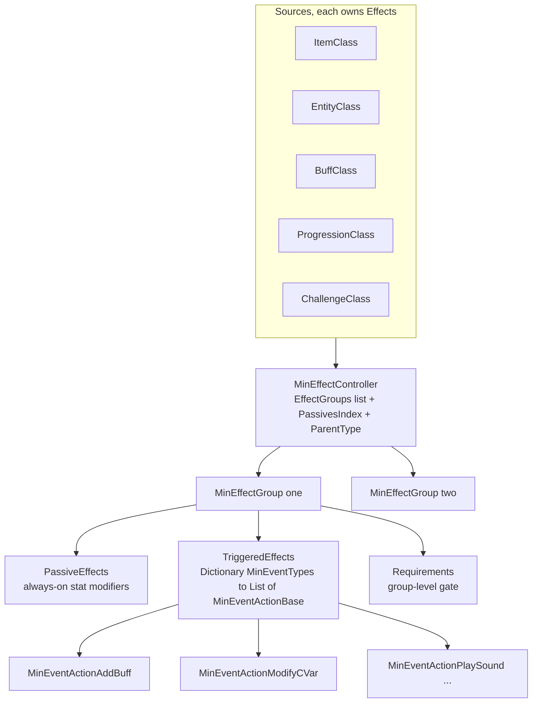
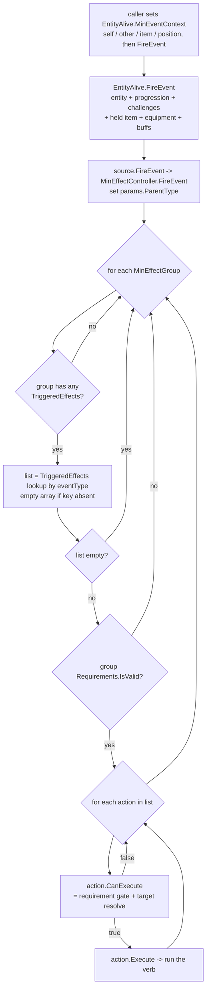
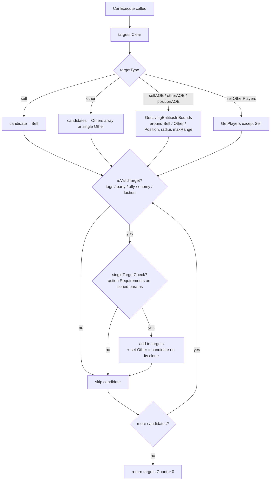

# MinEvent triggered-effect framework (dedicated V3.1.0)

**Owns:** the `MinEvent*` surface, the data-driven trigger/effect engine that lets
items, entities, buffs, progression, and challenges react to named in-game
events: the `MinEffectController` / `MinEffectGroup` handler containers, the
`MinEventTypes` trigger vocabulary, the `MinEventActionBase` action contract, the
`MinEventActionTargetedBase` target resolver, requirement gating, and the
`MinEventParams` context bag that carries self/other/item/block/position through
a fired event.
**Not:** the XML effect content itself (`items.xml`, `buffs.xml`,
`entityclasses.xml`, `progression.xml` define which triggers fire which actions:
data, not IL); the `EntityBuffs` runtime that one action family drives
([`buffs.md`](buffs.md)); the separate `GameEvent.*` scripted-sequence engine
([`game-events.md`](game-events.md), contrasted in §8); client-only presentation
(particles, sound, animator, camera).
**Evidence:** `MinEffectController`, `MinEffectGroup`, `MinEventActionBase`,
`MinEventActionTargetedBase`, `MinEventActionBuffModifierBase`, `MinEventParams`
IL plus the `MinEventTypes` / `TargetTypes` / `SourceParentType` enums and the
`MinEventAction*` leaves (transitive subclasses; see catalog) in the V3.0.1 type surface. Dump locally with
`tools/src/DumpMethod` (git-ignored). **Hub:** [`INDEX.md`](INDEX.md).
**Method:** [`re-methodology.md`](re-methodology.md).

Unlike `GameEvent.*` (a stateful phase-machine interpreter ticked from the main
loop), MinEvent is a **stateless fan-out**: a source holds, per trigger name, a
list of actions, and when something fires that trigger the actions run once,
top to bottom, gated by requirements and a resolved target set. There is no
per-node state, no phases, no scheduler in the dispatch itself.

---

## 1. Architecture

A **source** owns one `MinEffectController` (field `Effects`). Six source kinds
carry effects, tagged by the `SourceParentType` the controller stamps onto every
fired event:

| `SourceParentType` | Owner type | Field |
|---:|---|---|
| 1 `ItemClass` | `ItemClass` | `ItemClass.Effects` |
| 2 `ItemModifierClass` | `ItemClassModifier` (mod) | `ItemClass.Effects` on the modifier |
| 3 `EntityClass` | `EntityClass` | `EntityClass.Effects` |
| 4 `ProgressionClass` | `ProgressionClass` | `ProgressionClass.Effects` |
| 5 `BuffClass` | `BuffClass` | `BuffClass.Effects` |
| 6 `ChallengeClass` / 7 `ChallengeGroup` | challenge defs | challenge `Effects` |

`Block` has **no** controller: block interactions surface as triggers fired on
the acting entity (§7), with the `BlockValue` passed in the params.

Each controller holds an ordered `List<MinEffectGroup>` (`EffectGroups`), a
`PassivesIndex` (`HashSet<PassiveEffects>`) for the stat-modifier fast path, and
`ParentType` / `ParentPointer` back-references. A `MinEffectGroup` is the unit
parsed from one `<effect_group>` element and holds four things:

| `MinEffectGroup` member | Type | Role |
|---|---|---|
| `Requirements` | `RequirementGroup` | group-level gate (`<effect_group>` requirement list) |
| `PassiveEffects` | `List<PassiveEffect>` | the always-on stat modifiers (`<passive_effect>`), queried by `ModifyValue` / `GetModifiedValueData` |
| `TriggeredEffects` | `Dictionary<MinEventTypes, List<MinEventActionBase>>` | the event handlers (`<triggered_effect>`), keyed by trigger |
| `EffectDescriptions` / `EffectDisplayValues` | lists / dict | UI text (content) |

So a group is both the passive (stat math) and reactive (trigger) half of an
effect. This doc covers the reactive half; the passive half feeds
[`buffs.md`](buffs.md) and the stat system through `GetModifiedValueData`.

---

## 2. The trigger vocabulary: `MinEventTypes`

`MinEventTypes` is a flat `enum` of 111 named triggers (0 to 110) plus `COUNT`
(111). XML `trigger="onSelfBuffStart"` etc parse straight to the enum value
(`EnumUtils.Parse`), and that value is the dictionary key an action registers
under (`MinEffectGroup.AddTriggeredEffect` reads `action.EventType`). The names
partition into families:

| Family | Representative triggers (enum order) |
|---|---|
| Buff lifecycle | `onSelfBuffStart` (0), `onSelfBuffUpdate`, `onSelfBuffFinish`, `onSelfBuffRemove`, `onSelfBuffStack` |
| Combat, given / taken | `onOtherDamagedSelf` (7), `onOtherAttackedSelf`, `onSelfDamagedOther`, `onSelfAttackedOther`, `onSelfVehicleAttackedOther`, `onSelfExplosion*` (14 to 16), `onSelfDamagedSelf`, `onSelfHealed*` |
| Kills / death | `onSelfKilledOther` (19), `onOtherKilledSelf`, `onBlockKilledSelf`, `onSelfKilledSelf`, `onSelfDied`, `onDismember` (105) |
| Item action (primary / secondary / action2) | `onSelfPrimaryActionStart` (24) through `onSelfAction2End` (42): start / rayHit / rayMiss / grazeHit / grazeMiss / end / update / missEntity |
| Block interaction | `onSelfRepairBlock` (43), `onSelfPlaceBlock`, `onSelfUpgradedBlock`, `onSelfDamagedBlock`, `onSelfDestroyedBlock`, `onSelfHarvestBlock` |
| Ranged / equip / reload | `onSelfRangedBurstShot*`, `onSelfEquipStart` (54) to `onSelfEquipStop`, `onReloadStart` (58) to `onReloadStop` |
| Spawn / session / movement | `onSelfFirstSpawn` (61), `onSelfRespawn`, `onSelfEnteredGame`, `onSelfTeleported`, `onSelfJump`, `onSelfRun` / `Walk` / `Crouch` / `Swim*` / `Aiming*` (66 to 81) |
| Item economy | `onSelfHoldingItemThrown` (82), `onSelfItemCrafted`, `onSelfItemRepaired`, `onSelfItem{Looted,Lost,Gained,Sold,Bought,Activate,Deactivate}` (86 to 92) |
| Projectile / perk / world | `onProjectilePreImpact` (96), `onProjectileImpact`, `onPerkLevelChanged`, `onSelfEnteredBiome`, `onSelf*LootContainer`, `onCombatEntered`, `onTreasureRadius*` (108 to 110) |

The `onSelf*` / `onOther*` prefix is a naming convention for whose perspective
the trigger is raised from; the actual actor bindings live in `MinEventParams`
(§5), so an action reads `Self` / `Other` rather than trusting the name.

---

## 3. Dispatch: `FireEvent` fan-out

`EntityAlive.FireEvent(eventType, useInventory)` is the aggregator. It reuses the
entity's single `MinEventContext` (a `MinEventParams` the caller has already
populated with self/other/item/position) and fans it to every controller the
entity currently exposes, in a fixed order:

1. `EntityClass.Effects` (the entity definition's own effects)
2. `Progression` (perk-driven effects)
3. `challengeJournal` (challenge effects)
4. `inventory` held item, only when `useInventory` is set
5. `equipment` (worn items)
6. `Buffs` (every active buff's `BuffClass.Effects`)

Each of those is itself a `FireEvent` that either wraps one `MinEffectController`
(`BuffClass`, `ItemClass`, `ProgressionClass`: with a `canRun` pre-gate on
buffs) or iterates a collection (`EntityBuffs` over active buffs,
`Inventory` / `Equipment` over items, and `ItemValue.FireEvent` additionally
recurses into the item's ammo magazine item and its quality modifiers so a mod's
own effects fire too).

`MinEffectController.FireEvent` stamps `params.ParentType` and walks its groups.
`MinEffectGroup.FireEvent` does the actual work: skip if the group has no
triggered effects at all, look up the action list for this trigger
(`GetTriggeredEffects`, an empty array when the key is absent so a miss is
allocation-free), skip if empty, then check the group-level requirement
(`canRun` = `Requirements.IsValid(params)`), then for each action run
`CanExecute` and, if it passes, `Execute`.

---

## 4. The action contract

`MinEventActionBase` is the single node contract, parsed from one
`<triggered_effect trigger="..." action="...">` element. `ParseAction` resolves
the `action` attribute to a type by reflection with the fixed prefix
`MinEventAction` (so `action="AddBuff"` becomes `MinEventActionAddBuff`),
instantiates it, feeds every XML attribute through `ParseXmlAttribute`, then
parses a `RequirementGroup` from the element's requirement children.

| Member | Role |
|---|---|
| `EventType` (`MinEventTypes`) | which trigger this action registers under (`trigger` attribute) |
| `Delay` (`Single`) | `delay` attribute; parsed on the base but consumed only by specific verbs (e.g. `MinEventActionModifyStats` uses it as the temporary-modifier duration), not a general scheduler |
| `Requirements` (`RequirementGroup`) | per-action gate |
| `CanExecute(eventType, params)` | approval: returns `Requirements.IsValid(params)`, or `true` when there is no requirement group |
| `Execute(params)` | the verb; a no-op on the base, overridden by every leaf |
| `ParseXmlAttribute` / `ParseXMLPostProcess` | XML to fields; subclasses chain up |

`CanExecute` and `Execute` are the whole runtime protocol: `CanExecute` is a
pure boolean gate, `Execute` returns nothing and has side effects. Contrast this
with `GameEvent`'s `PerformAction`, which returns a four-state
`ActionCompleteStates` because it drives a phase machine; MinEvent has no
completion states because it never re-enters an action.

### Action categories

The leaves group by side effect. The abstract bases (`MinEventActionTargetedBase`,
`MinEventActionBuffModifierBase`, `MinEventActionSoundBase`) carry the shared
machinery; do not read all leaves.

```mermaid
flowchart TB
  ROOT[MinEventActionBase] --> TGT[MinEventActionTargetedBase<br/>resolves an entity target set]
  ROOT --> NT[non-targeted verbs]
  TGT --> BUFF[MinEventActionBuffModifierBase<br/>AddBuff / RemoveBuff / AddOrRemoveBuff /<br/>RemoveAllNegativeBuffs / GetBuffDuration]
  TGT --> HEALTH[health / stat<br/>AddHealth, ModifyStat, ModifyStats,<br/>Rage, Ragdoll]
  TGT --> EXPL[Explode]
  NT --> CVAR[cvar<br/>ModifyCVar, RemoveCVar, CVarLogValue]
  NT --> PROG[progression / xp<br/>AddProgressionLevel, SetProgressionLevel,<br/>ResetProgression, RefreshPerks,<br/>GiveExp, GiveSkillExp, AddProgressionLevel]
  NT --> QC[quest / challenge / twitch / events<br/>AwardChallenge, AwardQuestStat,<br/>CallGameEvent, UnregisterSequenceLink,<br/>SetTwitchCooldown, SetTwitchProgressionDisabled]
  NT --> ITEM[item state<br/>SetItemInSlot, SetItemMetaFloat,<br/>SetHeldItemJammed, ResetHeldItem,<br/>SetOverrideLoot, LogItemData]
  NT --> SND[sound, client-side<br/>PlaySound, StopSound, FadeOutSound,<br/>AltSounds, SetPitch, SetAudioMixerState]
  NT --> VIS[visual / prefab / part, client-side<br/>Attach/RemoveParticleEffect, Attach/RemovePrefab,<br/>Add/Remove/SetPart*, SetTransform*,<br/>ModifyScreenEffect, ShakeCamera, SetScale,<br/>SetHeadSize, SetBigHead]
  NT --> ANIM[animator, client-side<br/>AnimatorFireTrigger/ResetTrigger,<br/>AnimatorSetBool/Float/Int/WalkType]
  NT --> UI[UI / chat / toolbelt<br/>AddChatMessage, Show/Remove/PinToolbeltMessage,<br/>LogMessage]
  NT --> MISC[misc<br/>SetDancing, SetNavObject]
```

---

## 5. `MinEventParams`: the context bag

Every fired event carries one `MinEventParams`. It is the shared vocabulary
actions read from and the reason the `onSelf` / `onOther` naming is only a
convention: an action binds to fields, not names. The fields (`CopyTo` copies
them all):

| Field group | Fields |
|---|---|
| Actors | `Self`, `Other`, `Instigator`, `Others[]` (all `EntityAlive`) |
| Item context | `ItemValue`, `ItemActionData`, `ItemInventoryData` |
| World context | `TileEntity`, `BlockValue`, `POI`, `Area` (`Bounds`), `Biome` |
| Position | `Position`, `StartPosition`, `Transform` |
| Effect context | `Buff` (`BuffValue`), `ProgressionValue`, `PropRef`, `PropValue`, `DamageResponse`, `Tags`, `Seed` |
| Dispatch | `ParentType` (stamped by the controller), `IsLocal` |

Two reuse patterns matter for cost and correctness. Each `EntityAlive` owns one
long-lived `MinEventContext`, and `MinEventParams` also exposes a static
`CachedEventParam` used by the stat-modifier path when there is no live entity.
For AOE fan-out (§6) the resolver allocates a **fresh** `MinEventParams`,
`CopyTo`s the source into it, and overwrites `Other` per candidate, so each
targeted entity sees itself as `Other` without mutating the shared context.

---

## 6. Target resolution

`MinEventActionTargetedBase` sits between the base contract and every entity
verb. It overrides `CanExecute` to build a `targets` list (returning
`targets.Count > 0` as the gate) so `Execute` can then iterate the resolved
entities. XML attributes: `target` (a `TargetTypes`), `range` (`maxRange`),
`target_tags` (a `FastTags` filter). The six `TargetTypes`:

| `TargetTypes` | Resolves to |
|---:|---|
| 0 `self` | `params.Self` (single) |
| 1 `other` | `params.Others[]` if present (one cloned params per element), else `params.Other` |
| 2 `selfAOE` | living entities in a `maxRange`-sized bounds around `Self` (`World.GetLivingEntitiesInBounds`) |
| 3 `otherAOE` | living entities in a bounds around `Other` |
| 4 `positionAOE` | living entities around `params.Position`, then a precise `maxRange` sphere test for players |
| 5 `selfOtherPlayers` | all `World.GetPlayers()` except `Self` |

Every candidate passes two filters before it joins `targets`: `isValidTarget`
(the tag / relationship predicate below) and `singleTargetCheck` (the action's
own `Requirements` re-evaluated against the per-candidate cloned params, so a
requirement can veto individual AOE victims).

`isValidTarget(self, other)` is the friend-or-foe logic. With no `target_tags`
it always passes. Otherwise it matches when the candidate carries one of the
requested tags directly, or when a relationship tag is requested and the pair
satisfies it: `party` (same `Party.ContainsMember`), `ally`
(`EntityPlayer.IsFriendsWith`, shared `EntityEnemy` faction, or
`FactionManager.GetRelationshipTier` at the ally / love tiers 600 / 800),
`enemy` (opposing entity kinds or the hate / dislike tiers). This is why a
grenade buff can hit "enemies within 5m" or a support aura only "party members".

---

## 7. Requirement gating, and how items / buffs / blocks tie in

Requirements gate at **three** levels, all `RequirementGroup.IsValid(params)`
with identical semantics (a group of `RequirementBase` leaves that all must
pass):

- **Group level** (`MinEffectGroup.canRun`): once per fired trigger, before any
  action in the group runs.
- **Action level** (`MinEventActionBase.CanExecute`): per action, before it
  executes or resolves targets.
- **Per-target level** (`MinEventActionTargetedBase.singleTargetCheck`): the same
  action requirement list re-run against each candidate's cloned params during
  target resolution.

**Buffs** are both a source and an action target. As a source, `EntityBuffs`
fires each active `BuffClass.Effects` on every trigger, so buff-defined
`<triggered_effect>`s react to combat, movement, and their own lifecycle
(`onSelfBuffStart` / `Update` / `Finish`). As a target, the
`MinEventActionBuffModifierBase` family (`AddBuff`, `RemoveBuff`,
`AddOrRemoveBuff`, `RemoveAllNegativeBuffs`) applies buffs to the resolved
targets. `AddBuff.Execute` reads `buffNames[]` / `buffWeights[]` /
`fireOneBuff`: with `fireOneBuff` it weighted-random-picks one buff, otherwise it
probability-rolls each, then calls `EntityBuffs.AddBuff(name, instigatorId,
netSync, false, duration)` per target. Duration is the `duration` attribute,
either a literal or an `@cvarName` reference resolved from the target's buff
cvars at execution time. `RemoveBuff` calls `EntityBuffs.RemoveBuff`. Both derive
the net-sync flag from `!Self.isEntityRemote || params.IsLocal`, so the server is
authoritative and remote entities do not re-apply. See [`buffs.md`](buffs.md) for
the `EntityBuffs` runtime these actions drive.

**Items** are sources through `ItemClass.Effects` and, for equipped or held
items, are fired by `Inventory` / `Equipment` inside the entity fan-out.
`ItemValue.FireEvent` also recurses into ammo and quality modifiers, so a mod's
own triggered effects fire alongside the base item's. Item action triggers
(`onSelfPrimaryActionStart`, `onReloadStop`, etc) are raised by the item-action
code with the item bound in `params.ItemValue`.

**Blocks** own no controller. Block interactions are triggers raised on the
acting entity (`onSelfRepairBlock`, `onSelfPlaceBlock`, `onSelfUpgradedBlock`,
`onSelfDamagedBlock`, `onSelfDestroyedBlock`, `onSelfHarvestBlock`) with the
`BlockValue` in `params.BlockValue`; the actions then run against the entity's
own item and buff effects. So "a block fired an effect" is really "the entity
that touched the block fired a block-context trigger".

---

## 8. Contrast with `GameEvent.*`

MinEvent and [`GameEvent`](game-events.md) are sibling data-driven effect
systems that solve different problems, and one action bridges them
(`MinEventActionCallGameEvent`).

| Axis | MinEvent (this doc) | GameEvent ([`game-events.md`](game-events.md)) |
|---|---|---|
| Shape | stateless fan-out: fire a list of actions once | stateful interpreter: phases, decisions, loops, per-node state |
| Trigger | a `MinEventTypes` enum key raised inline by game code | `HandleAction(name)` from a client request, Twitch, quest, or block |
| Dispatch | dictionary lookup, run matching actions immediately | template clone appended to a running-sequence list, ticked each frame |
| Action return | `CanExecute` bool gate, `Execute` void | `PerformAction` returns 4-state `ActionCompleteStates` driving phase jumps |
| Scope | per-entity / per-item / per-buff effects | server-wide scripted scenarios (spawns, world resets, boss groups) |
| Bridge | `MinEventActionCallGameEvent` starts a GameEvent | `ActionAddBuff` etc apply buffs the MinEvent system also touches |

Both gate with a requirement list and both resolve entity targets, but MinEvent's
target resolution is inline per action while GameEvent maintains persistent entity
groups across ticks.

---

## 9. Dedicated relevance and residuals

- **Server-authoritative and per-tick adjacent.** MinEvent dispatch runs wherever
  the triggering code runs, which for combat, buffs, movement, and item actions
  is the server entity update ([`entity-ai.md`](entity-ai.md),
  [`buffs.md`](buffs.md)). Buff, cvar, stat, progression, and damage actions
  change authoritative server state; the buff-net-sync flag fans results to
  clients.
- **Cheap on a miss.** A trigger with no registered actions costs a dictionary
  probe (or an empty-array return) and a group-count check; the fan-out only does
  work when a source has actually registered that trigger.
- **Client-only actions (residual on a headless server).** The sound, particle,
  prefab / part, animator, camera, and screen-effect verbs are presentation:
  they matter on the rendering client and are effectively inert on a dedicated
  server except where they touch synced state. Treat them as visual residuals,
  not server logic.
- **Content, not IL.** Which triggers fire which actions, with which
  requirements and targets, is XML in `items.xml`, `buffs.xml`,
  `entityclasses.xml`, and `progression.xml`. This doc covers the engine; the
  effect catalog is data. See [`residuals.md`](residuals.md).

---

## Related docs

| Doc | Role |
|---|---|
| [`buffs.md`](buffs.md) | The `EntityBuffs` runtime that buff-source triggers and buff-modifier actions drive |
| [`game-events.md`](game-events.md) | The sibling scripted-sequence engine (contrasted in §8) |
| [`entity-ai.md`](entity-ai.md) | The entity update that raises most combat / movement triggers |
| [`full-surface.md`](full-surface.md) | Where the `MinEvent*` types sit in the whole-assembly map |
| [`re-methodology.md`](re-methodology.md) | How this was reversed |
| [`residuals.md`](residuals.md) | Client-only and content residuals |
| [`INDEX.md`](INDEX.md) | Hub |

An items doc, when written, will own the `ItemClass` / `ItemValue` / item-action
side that raises the item and reload triggers.

**Leaf catalog:** every instance is enumerated in [`inventories/minevent-actions.md`](inventories/minevent-actions.md) (all 71 triggered-effect leaves).

## Changelog

- **2026-07-23:** Initial `MinEvent*` reversal: source-owned `MinEffectController`
  / `MinEffectGroup` handler containers, the `MinEventTypes` trigger vocabulary,
  the `FireEvent` fan-out, the `CanExecute` / `Execute` action contract and
  category tree, `MinEventParams` context bag, six-way target resolution,
  three-level requirement gating, and the buff / item / block ties, with flow
  diagrams for dispatch and target resolution.
