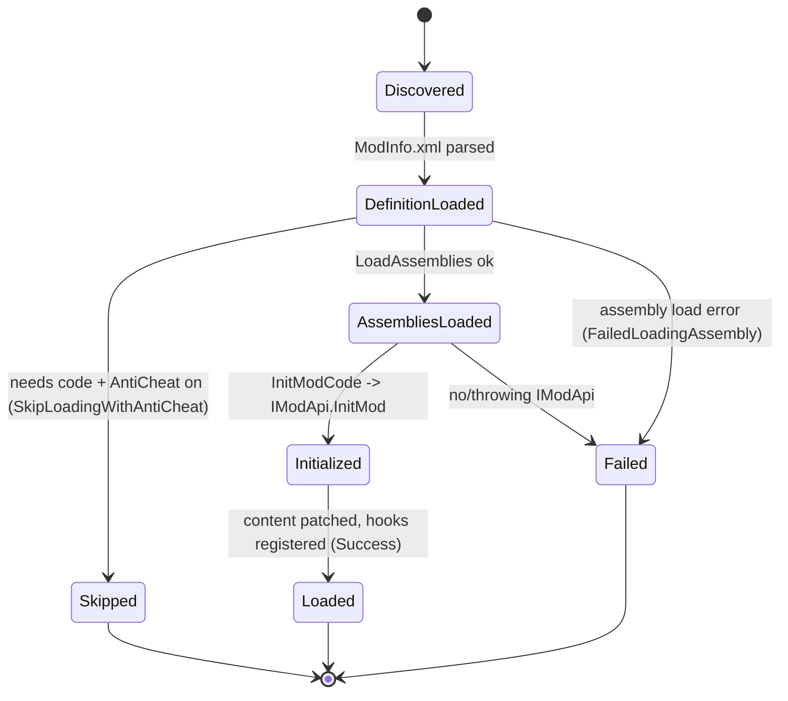
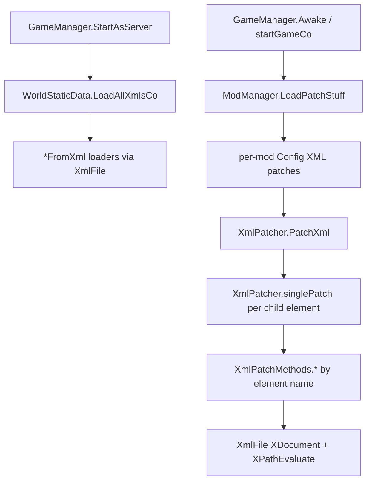
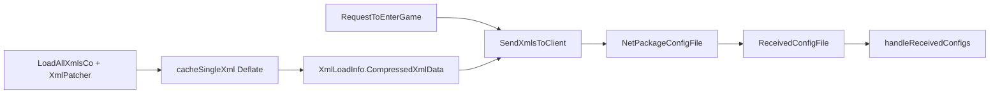

# Mod loading and ModEvents lifecycle (dedicated V3.1.0)

**Owns:** how the dedicated server discovers and loads mods at boot: `ModManager`
(scan + load pipeline), `Mod` (per-mod load state, assembly load, `InitModCode`),
the EAC gate for code mods, the `ModEvents` hook lifecycle, and the stock/mod
XML load+xpath patch pipeline (`WorldStaticData`, `XmlFile`, `XmlPatcher`).
**Not:** the `ModEvents` field inventory ([managers.md](managers.md) owns that);
individual mod behavior; the semantics of each game XML (blocks/items/loot/...).
**Evidence:** `ModManager`, `Mod`, `ModInfo` IL (dump locally with
`tools/src/DumpMethod`, git-ignored). **Hub:** [`INDEX.md`](INDEX.md).
**Method:** [`re-methodology.md`](re-methodology.md).

Mod loading runs on the dedicated server at startup (the optimization and RealEarth
companion mods load through exactly this path), so it is a core dedicated codepath.

---

## 1. The load pipeline

`ModManager.LoadMods` (IL=71) drives loading in **two ordered passes**, not per-mod
end-to-end. First it calls `loadModsFromFolder` for each mods folder; that reads
each mod's `ModInfo.xml` (`Mod.LoadDefinitionFromFolder`) and calls `Mod.LoadMod`
(IL=69), which runs only `LoadAssemblies` (load each DLL via `loadAssembly`). Then,
**after every mod's assemblies are loaded**, `LoadMods` runs a second pass (IL_00C7,
over all mods via the `<LoadMods>b__6_0` lambda) that calls `Mod.InitModCode()` on
each (reflect over the loaded assemblies for an `IModApi` and call `InitMod(mod)`).
The two-pass order lets a mod's `InitMod` safely reference types from other mods'
already-loaded assemblies.

Content patching (`LoadPatchStuff`, `LoadUiAtlases`, `LoadLocalizations`) is **not**
part of the `LoadMods` pipeline: it runs later from the game-startup path
(`GameManager.Awake` / `startGameCo`) that merges XML, atlases, and localization.

```mermaid
flowchart TB
  LM[ModManager.LoadMods] --> SCAN[loadModsFromFolder: scan Mods/ per folder]
  SCAN --> DEF[Mod.LoadDefinitionFromFolder: ModInfo.xml]
  DEF --> EAC{code mod + AntiCheat on?}
  EAC -->|yes| SKIP[SkipLoadingWithAntiCheat -> not loaded]
  EAC -->|no| ASM[Mod.LoadMod -> LoadAssemblies: load DLLs]
  ASM --> BARRIER[[all mods' assemblies loaded]]
  BARRIER --> INIT[LoadMods 2nd pass: Mod.InitModCode per mod -> IModApi.InitMod]
  INIT --> DONE[mod Loaded]
  ASM -->|load error| FAIL[GetFailedMods: failure reason]
  INIT -->|init throw| FAIL
  DONE -.later, from GameManager.Awake/startGameCo.-> PATCH[LoadPatchStuff / UiAtlases / Localizations: content merge]
```

`GetLoadedMods` / `GetLoadedAssemblies` / `GetModForAssembly` expose the result;
`GetFailedMods(reason)` records failures. `ModManager.GameEnded` and per-mod cleanup
run on shutdown ([server-lifecycle.md](server-lifecycle.md)).

**`Mod` ModInfo parsing leaves (all IL-verified):**
`parseModInfoV2(modPath, folderName, xmlRoot)` (IL=148) is the V2 loader:
the `Name` element must exist, be non-empty and match `nameValidationRegex`
(each failure logs `[MODS]{folder}/ModInfo.xml does not ...` and returns
null), `Version` runs `System.Version.TryParse` (a missing / invalid value
warns `does not define a valid Version. Please consider updating it for
future compatibility.`), `DisplayName` must be non-empty, and
`Description` / `Author` / `Website` are optional; `SkipWithAntiCheat` is
parsed as a bool (warning + assumed false on a bad value). The result is a
new `Mod` with Path / FolderName / Name / DisplayName / Description /
Author / Version / VersionString / Website / SkipLoadingWithAntiCheat.
`parseModInfoV1` (IL=7) always errors `[MODS]{folder}/ModInfo.xml in legacy
format. V2 required to load mod` and returns null (V1 unsupported).
`getElementAttributeValue(folderName, xmlParent, elementName, logNonExisting)`
(IL=76) requires exactly one child element of that name carrying a `value`
attribute (both violations log and return null). `DetectContents()` (IL=46)
scans `{Path}/Config` and sets `GameConfigMod = true` when any entry other
than `XUi_Menu` / `loadingscreen.xml` / `Localization.csv` exists (the
config-mod marker); `ContainsAssembly(assembly)` (IL=5) is the
`allAssemblies` containment test.

---

## 2. Mod load-state (state machine)

Each `Mod` carries an `EModLoadState` (the persisted terminal result); a code mod
that requires EAC-off is skipped when AntiCheat is enabled
(`SkipLoadingWithAntiCheat`), which is why running any C# mod forces the server
EAC-off ([platform-auth.md](platform-auth.md)). The real enum values are:

| `EModLoadState` | Meaning |
|---|---|
| `LoadNotRequested=0` | not selected for load |
| `Success=1` | loaded and initialized |
| `NotAntiCheatCompatible=2` | code mod incompatible with EAC |
| `SkippedDueToAntiCheat=3` | skipped because AntiCheat is on |
| `DuplicateModName=4` | rejected: name collision |
| `FailedLoadingAssembly=5` | DLL load threw |
| `Failed=6` | init/other failure |

The diagram below traces the **load pipeline phases** (not the enum members
one-to-one): its terminal `Loaded` maps to `Success=1`, `Skipped` to
`SkippedDueToAntiCheat=3`/`NotAntiCheatCompatible=2`, and `Failed` to
`FailedLoadingAssembly=5`/`Failed=6`/`DuplicateModName=4`.



XML-only mods (no DLL) skip the assembly/init steps and only patch content, so they
run even under EAC; code mods do not.

---

## 3. ModEvents lifecycle

A loaded mod's `IModApi.InitMod` typically subscribes to `ModEvents` hooks (the
game's C# event surface: `GameAwake`, `GameStartDone`, `PlayerSpawnedInWorld`,
`EntityKilled`, `ChatMessage`, `GameShutdown`, ...). The **hook field inventory is
owned by [managers.md](managers.md)**; this doc owns the loading that lets a mod
register them. The game fires these hooks from the corresponding server codepaths
(e.g. `ChatMessage` from [chat.md](chat.md), `PlayerSpawnedInWorld` from
[server-lifecycle.md](server-lifecycle.md)), so ModEvents is the sanctioned
extension surface across the dedicated systems.

---

## 4. Dedicated relevance and residuals

- **Dedicated boot path:** the server loads mods at startup and fires ModEvents
  hooks throughout its runtime.
- **EAC coupling:** code mods force EAC-off; XML-only mods do not.
- **Residual / content:** per-mod behavior and the *gameplay meaning* of each
  `Data/Config/*.xml` live with their subsystem docs; this section owns the
  load/patch *machinery*.

---

## 5. Config XML load and xpath patching

Stock config and mod XML patches share one managed pipeline.

### 5.1 Call graph (verified)

| Caller | Callee | Role |
|---|---|---|
| `GameManager.StartAsServer` coroutine | `WorldStaticData.LoadAllXmlsCo` | full stock config table at dedi boot |
| `WorldStaticData.Init` / `ReloadAllXmlsSync` | `LoadAllXmlsCo` | init + admin reload |
| `GameManager.Awake` / `startGameCo` | `ModManager.LoadPatchStuff` | mod Config XML merge (coroutine, IL=6 state-machine entry) |
| `XmlPatcher.LoadAndPatchConfig` / `XmlPatchMethods.Conditional` / `Include` | `XmlPatcher.PatchXml` | apply a patch file's child elements |



### 5.2 `XmlFile`

Thin owner of one loaded config document.

**Fields:** `Directory`, `Filename`, `Loaded`, `XmlDoc` (`XDocument`),
`tempXpathMatchList`.

| Method | IL | Behavior |
|---|---:|---|
| `load(directory,file)` | 35 | `GameIO.GetDirectory` `*.xml`, `SdFile.OpenRead`, stream load |
| `load(stream,name)` | 38 | `XDocument.Load(TextReader)`; sets `Loaded` |
| `toXml(string)` | 28 | `XDocument.Parse` |
| `GetXpathResultsInList` | 29 | `XPathEvaluate` on `XmlDoc`, cast to `XObject`, fill list |
| `SerializeToString` / `SerializeToStream` | 32 / 23 | write `XmlDoc` via `XmlWriter` |

Default ctor path uses directory **`Data/Config`** and appends `.xml`.

Every `*FromXml` loader (blocks, items, loot, buffs, entity classes, dialogs,
game stages, ...) takes or constructs `XmlFile` instances (RefScan: 60+ outer
types). That is the stock config surface the dedicated always runs.

### 5.3 `XmlPatcher`

Static-ish registry of named patch operations + apply loop.

**Fields:** `Dictionary<String, PatchMethodDefinition> XpathPatchMethods`.

**Registration:** cctor reflection discovers methods tagged with
`XmlPatchMethodAttribute` whose signature matches `XpathDelegate`
`(XmlFile, String xpath, XElement, XmlFile patchFile, Mod) -> int`, then
`addXmlFilePatchMethod`. Redeclarations log a warning.

**`PatchXml` (IL=71):** foreach child `XElement` of the patch container, call
`singlePatch`; on failure log mod name, element string, line/pos.

**`singlePatch` (IL=120):**

1. Look up element **local name** in `XpathPatchMethods` (unknown name -> error).
2. If the method requires xpath, demand attribute `xpath`.
3. Invoke the registered `XpathDelegate` with target `XmlFile`, xpath string,
   patch element, patch file, patching `Mod`.
4. XPath failures become structured log lines (`XML.Patch (...): XPath evaluation failed`).

**Built-in operations (`XmlPatchMethods`, verified method list):**

| Element name (method) | Effect class |
|---|---|
| `SetByXPath` / `SetAttributeByXPath` | replace node or attribute text |
| `AppendByXPath` / `PrependByXPath` | insert children |
| `InsertAfterByXPath` / `InsertBeforeByXPath` | sibling insert |
| `RemoveByXPath` / `RemoveAttributeByXPath` | delete |
| `CsvOperationsByXPath` | list-field edits |
| `Conditional` | nested `PatchXml` when condition holds |
| `Include` | pull another patch file (`@modfolder:` path rewrite via `ReadPatchXmlWithFixedModFolders`) |

`ReadPatchXmlWithFixedModFolders` rewrites `@modfolder:` / `@modfolder(Name):`
tokens to the patching mod's path before load.

`XmlPatchException.buildMessage` formats patch element + method + message for
throw sites.


### 5.5 Stock load table (`WorldStaticData.xmlsToLoad`)

The dedicated boot path does not hard-code each XML file at the call site. It
walks a static table of **49** `XmlLoadInfo` records built in
`WorldStaticData..cctor` (IL=**871**). Full flag/delegate census:
[inventories/xmlsToLoad.md](inventories/xmlsToLoad.md).

**`XmlLoadInfo` fields (metadata):** `XmlName`, `LoadStepLocalizationKey`,
`LoadAtStartup`, `SendToClients`, `IgnoreMissingFile`, `AllowReloadDuringGame`,
`LoadMethod`, `CleanupMethod`, `ExecuteAfterLoad`, `ReloadDuringGameMethod`,
`CompressedXmlData`, `LoadClientFile`, `WasReceivedFromServer`.

| Flag | Dedi meaning |
|---|---|
| `LoadAtStartup` | early boot subset (`events`, `rwgmixer`, `archetypes`, loading UI, `sandbox_overrides`, ...) |
| `SendToClients` | eligible for compressed S2C config shipping after join |
| `AllowReloadDuringGame` | `ReloadInGameXML` / console-style reload without full restart |
| `LoadClientFile` | dual client-file semantics (only `archetypes` in this build) |

Notable **server-loaded, not S2C** rows: `gamestages`, `spawning`, `signs`
(flags all false for send/startup except they still load in the full pass).
`rwgmixer` is **boot** but not S2C (worldgen mixer stays server-local).

`ExecuteAfterLoad` hooks used on stock: materials → `LoadTextureAtlases`;
item_modifiers → `LateInitItems`.

**Reload lifecycle (the `Reload*` family, all IL=5):** each in-game reload
first tears down the target registry then re-runs the load synchronously on
the main thread: `ReloadItems` = `ItemClass.Cleanup()` +
`RunCoroutineSync(LoadItems)`; `ReloadItemsAppend` skips the cleanup
(mods append); `ReloadRecipes` = `CraftingManager.ClearAllRecipes()` +
`LoadRecipes`; `ReloadLoot` = `LootContainer.Cleanup()` + `LoadLoot`.
The per-family `Load*` entries themselves (LoadBlocks, LoadItems,
LoadRecipes, LoadTraders, ...) are 6-IL coroutine factories whose parse
bodies live in the compiler-generated `MoveNext` of each iterator
(`<LoadBlocks>d__16` etc.), invoked through the `XmlLoadInfo` table above.

**The `Cleanup*` family** mirrors the loads on teardown/XML-reload:
`CleanupBlocks` (IL=4) = `AIDirectorData.Cleanup` + `Block.Cleanup` +
`TileEntityCompositeData.Cleanup`; `CleanupGamestages` (IL=3) =
`GameStageDefinition.Clear` + `GameStageGroup.Clear`;
`CleanupSpawning` (IL=3) = `EntitySpawnerClass.Cleanup` +
`BiomeSpawningClass.Cleanup`; `CleanupChallenges` (IL=2) =
`ChallengeClass.Cleanup`; `CleanupTwitch` (IL=5) /
`CleanupTwitchEvents` (IL=5) guard on the `TwitchActionManager` /
`TwitchManager` singletons before their `Cleanup` / `CleanupEventData`.


### 5.6 Config S2C (`SendXmlsToClient` / `NetPackageConfigFile`)

After stock load + mod xpath patch, the server keeps a **Deflate-compressed**
byte cache per table row and ships S2C-eligible configs during join.

**Cache build (server only):**

| Step | Method | IL | Behavior |
|---|---|---:|---|
| Entry | `CachePatchedXml` | 21 | coroutine wrapper; no-op if not `ConnectionManager.IsServer` |
| Compress | `cacheSingleXml` MoveNext | **65** | `XmlFile.SerializeToStream` into `DeflateOutputStream` (minified=`true`); respects `Constants.cMaxLoadTimePerFrameMillis` yield; stores `MemoryStream.ToArray()` into `XmlLoadInfo.CompressedXmlData` |

**Send (join path):**

Caller: `GameManager.RequestToEnterGame` coroutine (Xref=1), **after**
`NetPackageLocalization.StartSendingPacketsToClient` and **before**
`NetPackageWorldInfo` / chunk-cluster / spawn points.

`SendXmlsToClient(ClientInfo)` IL=41 walks `xmlsToLoad`:

1. Skip unless `SendToClients`.
2. If not `LoadClientFile` and `CompressedXmlData` is null, skip.
3. `NetPackageConfigFile.Setup(XmlName, data)` where `data` is
   `CompressedXmlData`, or **null** when `LoadClientFile` (client loads its own
   file; only the name is signalled).
4. `ClientInfo.SendPackage`.

**Wire (`NetPackageConfigFile`):**

| Property | Value (IL) |
|---|---|
| `PackageDirection` | **2** = `ToClient` |
| `Compress` | **true** (package-level compress flag; payload is already Deflate-cached) |

| write order | Field |
|---|---|
| 1 | base `NetPackage.write` |
| 2 | `name` : string (`XmlName`) |
| 3 | `data` : Int32 length + bytes, or length **`-1`** for null |

`ProcessPackage` (client): `WorldStaticData.ReceivedConfigFile(name, data)`.

**Client receive (`ReceivedConfigFile` IL=42):**

1. Log length or "from local files" if data null.
2. `getLoadInfoForName`; unknown name → warning return.
3. Store `CompressedXmlData`; set `WasReceivedFromServer` to
   `EClientFileState.Received` (1) if bytes present, else `LoadLocal` (2).
4. Bump `highestReceivedIndex`.

`handleReceivedConfigs` is a coroutine entry (IL=3) that applies the received
cache into live tables once the join batch is complete (`WaitForConfigsFromServer`
gates client progress).



Ties to the S2C column in [inventories/xmlsToLoad.md](inventories/xmlsToLoad.md):
only rows with **S2C** are candidates; `LoadClientFile` rows send name-only.

### 5.4 `MapVisitor` (console AABB walk)

Not part of mod load, but it is the other high-method "visitor" leaf that was
only catalogued. **Sole external referrer:** `ConsoleCmdVisitMap`.

**Fields:** `OnVisitChunk` / `OnVisitMapDone` delegates, coroutine, `ChunkObserver`,
chunk AABB (`chunkPos1`/`chunkPos2`), `hasBeenStarted`.

| Method | IL | Behavior |
|---|---:|---|
| ctor(worldPos1, worldPos2) | 51 | convert corners with `World.toChunkXZ` |
| `Start` | 12 | `ThreadManager.StartCoroutine(visitCo)` |
| `Stop` | 20 | stop coroutine; `GameManager.RemoveChunkObserver` |
| `chunkXZtoBlockXZ` / pos getters | small | coordinate helpers |

Used by admins/tools to force-load and iterate a world rectangle (e.g. pregen /
scan), not by the steady sim loop.

---

## Related docs

| Doc | Role |
|---|---|
| [managers.md](managers.md) | `ModEvents` hook field inventory |
| [server-lifecycle.md](server-lifecycle.md) | Boot (mods load) + shutdown (mods cleanup) |
| [platform-auth.md](platform-auth.md) | EAC gate that code mods force off |
| [full-surface.md](full-surface.md) | Whole-assembly map |
| [dedicated-misc-systems.md](dedicated-misc-systems.md) | Individual *FromXml loaders (entity classes, events, ...) |
| [console-commands.md](console-commands.md) | `visitmap` host for MapVisitor |
| [inventories/xmlsToLoad.md](inventories/xmlsToLoad.md) | 49-entry stock config table |

## Changelog

- **2026-08-11:** Mod-load IL re-verified: LoadMods IL=71, LoadMod IL=69, parseModInfoV2 IL=148, parseModInfoV1 IL=7, DetectContents IL=46, ContainsAssembly IL=5, LoadPatchStuff IL=6, WorldStaticData.cctor IL=871, XmlPatcher.PatchXml IL=71 / singlePatch IL=120, CleanupBlocks IL=4, CleanupGamestages IL=3, CleanupSpawning IL=3, CleanupChallenges IL=2, CleanupTwitch/CleanupTwitchEvents IL=5, SendXmlsToClient IL=41, ReceivedConfigFile IL=42, handleReceivedConfigs IL=3 (exact).
- **2026-08-10:** Mod IL re-verified: parseModInfoV1 IL=7, DetectContents IL=46, ContainsAssembly IL=5 (exact).
- **2026-08-10:** ModManager.LoadMods IL=71, Mod.parseModInfoV2 IL=148 re-verified (exact).
- **2026-07-28:** Config S2C path (`SendXmlsToClient`, Deflate cache, `NetPackageConfigFile`).
- **2026-07-28:** `xmlsToLoad` 49-entry census (flags + load/cleanup/reload delegates).
- **2026-07-28:** XmlFile/XmlPatcher xpath pipeline, XmlPatchMethods catalog, WorldStaticData/LoadPatchStuff callers, MapVisitor console visitor.
- **2026-07-23:** Initial mod-loading reversal (ModManager pipeline, Mod load-state, EAC gate, ModEvents lifecycle) with state machines.
