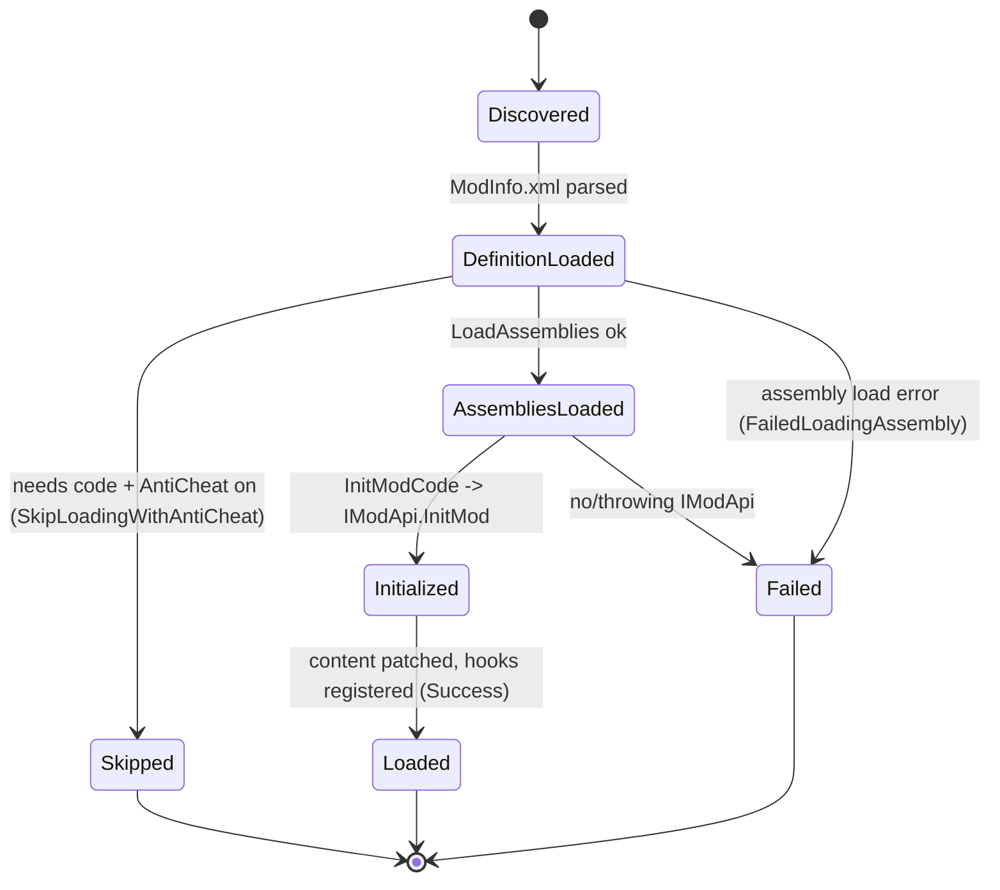

# Mod loading and ModEvents lifecycle (dedicated V3.0.1)

**Owns:** how the dedicated server discovers and loads mods at boot: `ModManager`
(scan + load pipeline), `Mod` (per-mod load state, assembly load, `InitModCode`),
the EAC gate for code mods, and the `ModEvents` hook lifecycle.
**Not:** the `ModEvents` field inventory ([managers.md](managers.md) owns that);
individual mod behavior; XML/atlas/localization content patched by mods.
**Evidence:** `ModManager`, `Mod`, `ModInfo` IL (dump locally with
`tools/src/DumpMethod`, git-ignored). **Hub:** [`INDEX.md`](INDEX.md).
**Method:** [`re-methodology.md`](re-methodology.md).

Mod loading runs on the dedicated server at startup (the optimization and RealEarth
companion mods load through exactly this path), so it is a core dedicated codepath.

---

## 1. The load pipeline

`ModManager.LoadMods` (IL=71) drives loading in **two ordered passes**, not per-mod
end-to-end. First it calls `loadModsFromFolder` for each mods folder; that reads
each mod's `ModInfo.xml` (`Mod.LoadDefinitionFromFolder`) and calls `Mod.LoadMod`
(IL=69), which runs only `LoadAssemblies` (load each DLL via `loadAssembly`). Then,
**after every mod's assemblies are loaded**, `LoadMods` runs a second pass (IL_00C7,
over all mods via the `<LoadMods>b__6_0` lambda) that calls `Mod.InitModCode()` on
each (reflect over the loaded assemblies for an `IModApi` and call `InitMod(mod)`).
The two-pass order lets a mod's `InitMod` safely reference types from other mods'
already-loaded assemblies.

Content patching (`LoadPatchStuff`, `LoadUiAtlases`, `LoadLocalizations`) is **not**
part of the `LoadMods` pipeline: it runs later from the game-startup path
(`GameManager.Awake` / `startGameCo`) that merges XML, atlases, and localization.

```mermaid
flowchart TB
  LM[ModManager.LoadMods] --> SCAN[loadModsFromFolder: scan Mods/ per folder]
  SCAN --> DEF[Mod.LoadDefinitionFromFolder: ModInfo.xml]
  DEF --> EAC{code mod + AntiCheat on?}
  EAC -->|yes| SKIP[SkipLoadingWithAntiCheat -> not loaded]
  EAC -->|no| ASM[Mod.LoadMod -> LoadAssemblies: load DLLs]
  ASM --> BARRIER[[all mods' assemblies loaded]]
  BARRIER --> INIT[LoadMods 2nd pass: Mod.InitModCode per mod -> IModApi.InitMod]
  INIT --> DONE[mod Loaded]
  ASM -->|load error| FAIL[GetFailedMods: failure reason]
  INIT -->|init throw| FAIL
  DONE -.later, from GameManager.Awake/startGameCo.-> PATCH[LoadPatchStuff / UiAtlases / Localizations: content merge]
```

`GetLoadedMods` / `GetLoadedAssemblies` / `GetModForAssembly` expose the result;
`GetFailedMods(reason)` records failures. `ModManager.GameEnded` and per-mod cleanup
run on shutdown ([server-lifecycle.md](server-lifecycle.md)).

---

## 2. Mod load-state (state machine)

Each `Mod` carries an `EModLoadState` (the persisted terminal result); a code mod
that requires EAC-off is skipped when AntiCheat is enabled
(`SkipLoadingWithAntiCheat`), which is why running any C# mod forces the server
EAC-off ([platform-auth.md](platform-auth.md)). The real enum values are:

| `EModLoadState` | Meaning |
|---|---|
| `LoadNotRequested=0` | not selected for load |
| `Success=1` | loaded and initialized |
| `NotAntiCheatCompatible=2` | code mod incompatible with EAC |
| `SkippedDueToAntiCheat=3` | skipped because AntiCheat is on |
| `DuplicateModName=4` | rejected: name collision |
| `FailedLoadingAssembly=5` | DLL load threw |
| `Failed=6` | init/other failure |

The diagram below traces the **load pipeline phases** (not the enum members
one-to-one): its terminal `Loaded` maps to `Success=1`, `Skipped` to
`SkippedDueToAntiCheat=3`/`NotAntiCheatCompatible=2`, and `Failed` to
`FailedLoadingAssembly=5`/`Failed=6`/`DuplicateModName=4`.



XML-only mods (no DLL) skip the assembly/init steps and only patch content, so they
run even under EAC; code mods do not.

---

## 3. ModEvents lifecycle

A loaded mod's `IModApi.InitMod` typically subscribes to `ModEvents` hooks (the
game's C# event surface: `GameAwake`, `GameStartDone`, `PlayerSpawnedInWorld`,
`EntityKilled`, `ChatMessage`, `GameShutdown`, ...). The **hook field inventory is
owned by [managers.md](managers.md)**; this doc owns the loading that lets a mod
register them. The game fires these hooks from the corresponding server codepaths
(e.g. `ChatMessage` from [chat.md](chat.md), `PlayerSpawnedInWorld` from
[server-lifecycle.md](server-lifecycle.md)), so ModEvents is the sanctioned
extension surface across the dedicated systems.

---

## 4. Dedicated relevance and residuals

- **Dedicated boot path:** the server loads mods at startup and fires ModEvents
  hooks throughout its runtime.
- **EAC coupling:** code mods force EAC-off; XML-only mods do not.
- **Residual / content:** `ModInfo.xml`, XML/atlas/localization patches, and each
  mod's own behavior are outside this repo (the companion optimizer/RealEarth mods
  document themselves).

---

## Related docs

| Doc | Role |
|---|---|
| [managers.md](managers.md) | `ModEvents` hook field inventory |
| [server-lifecycle.md](server-lifecycle.md) | Boot (mods load) + shutdown (mods cleanup) |
| [platform-auth.md](platform-auth.md) | EAC gate that code mods force off |
| [full-surface.md](full-surface.md) | Whole-assembly map |

## Changelog

- **2026-07-23:** Initial mod-loading reversal (ModManager pipeline, Mod load-state, EAC gate, ModEvents lifecycle) with state machines.
