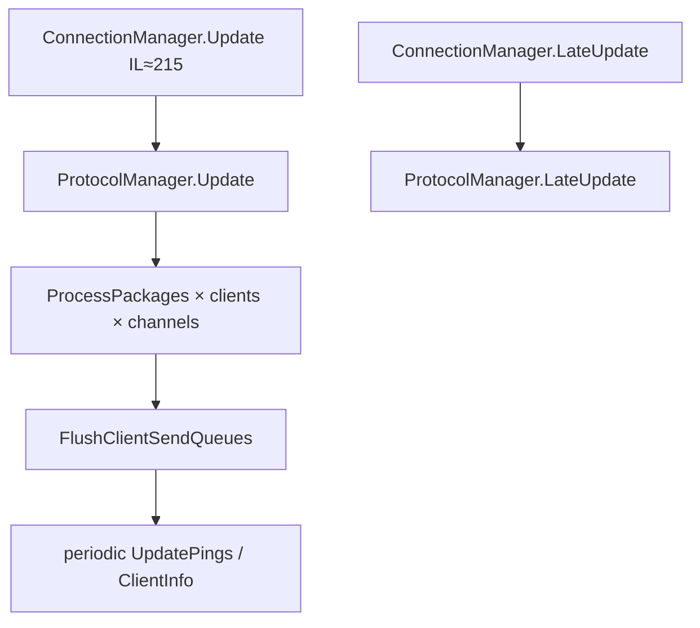
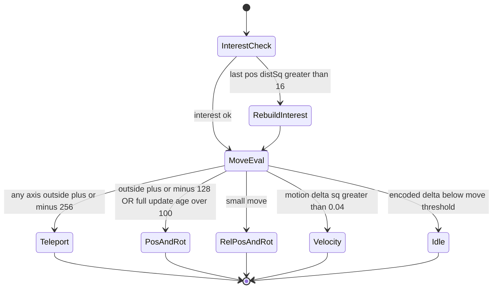
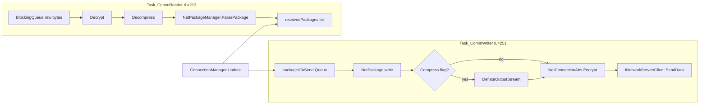

# Dedicated networking (V3.0.1 managed)

**Owns:** ConnectionManager peer pump, per-connection reader/writer threads, encrypt/compress framing, NetEntity package bands, NetPackage census.  
**Wire framing / join / golden bodies:** [`protocol.md`](protocol.md).  
**Visual frames:** [`protocol-frames.md`](protocol-frames.md).  
**Companion:** [`closed-gaps.md`](closed-gaps.md) §4 (threshold decode).  
**Ceiling map:** [`engine-limitations.md`](engine-limitations.md) §2-3 (player O(N²), packages).  
**Clone design:** [`zig-clone.md`](../../zdtd/docs/zig-clone.md).  
**Loop:** [`loop.md`](loop.md) §6.  
**Dumps:** `il/gaps-v3.0.1/`, `il/dedi-complete-v3.0.1/` §3-4.

---

## 1. Peer pump (not under gmUpdate)



These run as **peer MonoBehaviours** relative to `GameManager.Update` (script order = Unity residual).

---

## 2. Entity replication (from UpdateTick)

Replication runs after `TickEntities` in UpdateTick (`OnUpdateEntities` IL=322, then per-entity `updatePlayerList` IL=509). Package choice is a small state machine over encoded deltas:



Also: `SendChunksToClients` (IL=216) after entity packages.

### Package selection thresholds (decoded IL)

| Condition | Package |
|---|---|
| Interest last-pos distSq &gt; **16** | rebuild interested player list |
| Encoded Δ any axis abs ≥ **2** | consider move package |
| Δ outside ±**256** | `NetPackageEntityTeleport` |
| Else outside ±**128** or full-update age &gt; **100** ticks | `NetPackageEntityPosAndRot` |
| Else small move | `NetPackageEntityRelPosAndRot` / rotation |
| Motion Δ² &gt; **0.04** | velocity package |
| Dirty flags | AliveFlags / PlayerStats / equipment |

Encode helpers: `NetEntityDistributionEntry.EncodePos` / `EncodeRot`.

---

## 3. NetPackage type inventory

Live census (tools/bin/Census.exe): **194** types with the `NetPackage*` name prefix = **193 + `NetPackageManager`**. Of those 193, the **189** in the live id-map are the actual registered wire packages; the remaining ~4-6 are name-prefixed helpers (e.g. `NetPackageDirection` [enum], `Logger`, `Metrics`), not wire packages.

Representative dedi-relevant packages (from inventory dump):

| Package | Notes |
|---|---|
| `NetPackageChunk` / `ChunkRemove` / `ChunkRemoveAll` | Terrain streaming |
| `NetPackageEntityTeleport` / `PosAndRot` / `RelPosAndRot` / `Rotation` | Entity motion |
| `NetPackageEntityAliveFlags` | Flags |
| `NetPackageDamageEntity` | Combat |
| `NetPackageDynamicMesh` | Dynamic mesh server |
| `NetPackageEAC` | Anti-cheat envelope (protocol residual) |
| `NetPackageChat` / `ConsoleCmd*` | Admin/chat |
| `NetPackageClientInfo` | Client info / pings path |
| `NetPackagePlayer*` family | Player data |
| Encryption packages | Auth handshake |

Full name list: `il/dedi-complete-v3.0.1/DEDI_COMPLETE_auto.md` §3.  
Join + envelope + golden entity package bodies: [protocol.md](protocol.md).

---

## 3b. Join path (summary)

Loadgen-proven against live V3.0.1 dedi:

```text
LiteNet connect → challenge 0xCA+Guid echo → PackageIds (dynamic name→u16)
  → PlayerLogin → PlayerLoginAnswer → PlayerId → RequestToSpawnPlayer → in world
```

Port: LiteNet often **ServerPort+2** (26902). Details and binary layouts: [protocol.md](protocol.md).

---

## 4. Transport stack

| Layer | Managed? | Status |
|---|---|---|
| NetPackage process/serialize | Yes | Inventoried |
| ConnectionManager / ProtocolManager | Yes | Update graphs dumped |
| `NetConnectionAbs` + Simple/Steam | Yes | reader/writer threads, compress, encrypt (this section) |
| `AesEncryptAndMac` (`IEncryptionModule`) | Yes (AES + HMACSHA256) | stream layout below; handshake packages in [protocol-packages.md](protocol-packages.md) §2 |
| LiteNetLib **managed** wrappers | Partial type map | Present where named |
| LiteNetLib **native** plugin | No | **Residual** ([`residuals.md`](residuals.md)) |

### 4.1 Connection hierarchy

```text
NetConnectionAbs
  ├─ NetConnectionSimple   // UNET-style / generic INetworkClient path
  └─ NetConnectionSteam    // Steam / platform path used on stock dedi often
```

Both start **two worker threads** in the ctor (`ThreadManager.StartThread`):

| Impl | Reader thread name | Writer thread name | Inbound queue | Outbound queue |
|---|---|---|---|---|
| Steam | `NCSteam_Reader_*` | `NCSteam_Writer_*` | `BlockingQueue<ArrayListMP<byte>>` | `Queue<NetPackage>` + `ManualResetEvent` |
| Simple | `NCS_Reader_*` | `NCS_Writer_*` | `Queue<RecvBuffer>` | double-buffer lists `writerListFilling` / `writerListProcessing` |

`InitStreams` (Steam IL=131, Simple IL=190) allocates large memory streams (capacity literal **2097152**) plus Deflate zip streams and pooled binary writers/readers. Copy buffers are **4096** bytes.

`ConnectionManager.Update` (IL=215, peer MB) drains each connection via `GetPackages` → `ProcessPackages` (IL=116) and flushes send queues. Xref: `ProcessPackages` is only called from that Update path (4 sites).

### 4.2 Steam path (`NetConnectionSteam`)



**Writer order (verified):** package body write → optional compress (`NetPackage.Compress`) → `Encrypt` → stats (`RegisterSentPackage` / `RegisterSentData`) → platform `SendData` with `ReliableDelivery` flag → `SendQueueHandled`.

**Reader order (verified):** wait on trigger → dequeue raw buffer → stats received data → optional `Decrypt` → optional `Decompress` → `ParsePackage` → lock + append `receivedPackages`. Unknown package id logs and drops.

`AddToSendQueue` enqueues under monitor and `Set`s the writer event. `AppendToReaderStream` is what the platform receive callback uses to feed the reader queue.

### 4.3 Simple path (`NetConnectionSimple`)

Heavier framing and batching (this is the path named in the O(N) serialize note below).

**Serialize (`taskSerialize` IL=392):**

1. Wait on writer event (timeout **500** ms appears in backoff paths).
2. Swap filling/processing package lists under lock.
3. Batch packages into reliable vs unreliable streams via `WriteToStream` (IL=435): writes **Int32** length prefix, `NetPackage.write`, rewrites length, registers stats, may requeue on failure.
4. `StreamToBuffer` (IL=194): compress (optional) → encrypt → build wire buffer with header fields written as `Int32` + two `Byte` flags + `UInt16` + payload copy.
5. `sendBuffersFromQueue` / `splitSendBuffer` respect `maxPacketSize` / `INetworkServer.GetMaximumPacketSize`.

**Deserialize (`taskDeserialize` IL=437):**

1. Dequeue `RecvBuffer`.
2. Read framed header (`ReadInt32` size, flag bytes, `UInt16`).
3. Decrypt → decompress → loop `ParsePackage` until stream consumed.
4. Size mismatch between parsed and expected length is logged; packages still registered in stats.

Double-buffer detail: main/sim thread only touches `writerListFilling`; the writer thread drains `writerListProcessing`. That is why broadcast packages are still **serialized once per connection** off the sim thread.

### 4.4 Encrypt / compress module (`NetConnectionAbs`)

| Method | IL | Behavior |
|---|---:|---|
| `Compress` | 59 | copy uncompressed → `DeflateOutputStream.Restart` + write; fails if compressed capacity too small |
| `Decompress` | 22 | `DeflateInputStream.Restart` + copy into target |
| `EnableEncryptData` | 12 | gate used by send path once module armed |
| `ExpectEncryptedData` | 14 | gate used by recv path after login |
| `Encrypt` | 16 | if enabled, `IEncryptionModule.EncryptStream(cInfo, stream)` |
| `Decrypt` | 65 | if expecting encryption and packet unmarked encrypted: **drop** with log `Client logged in but sent unencrypted message`; else `DecryptStream` |
| `SetEncryptionModule` | 4 | install per-client module (from handshake) |

**Send transform order:** package bytes → **compress** → **encrypt**.  
**Recv transform order:** raw → **decrypt** → **decompress** → parse.

### 4.5 `AesEncryptAndMac` stream layout (managed)

Implements `IEncryptionModule` for the post-handshake session (constructed in `AntiCheatEncryptionAuthServer.SendSharedKey` with the two key blobs from `NetPackageEncryptionSharedKey`; see [dedicated-leftovers.md](dedicated-leftovers.md) §7 and [protocol-packages.md](protocol-packages.md) §2).

| Direction | IL | Layout / steps |
|---|---:|---|
| `EncryptStream` | 102 | under lock: random IV via `RandomNumberGenerator` → write IV → write payload length → AES transform of plaintext → write ciphertext → HMAC over protected region → rewrite stream with MAC+body |
| `DecryptStream` | 148 | under lock: read IV / lengths → HMAC verify (fail logs `MAC did not match` / length mismatch) → AES decrypt into stream |

Uses `System.Security.Cryptography.Aes` + `HMAC` (integrity key). **Not** a native cipher residual anymore for the session transform; what remains residual is anything below this managed module (platform transport, and any OS crypto providers Aes may call).

### 4.6 Stats

`NetConnectionStatistics` (on every connection): volatile byte/package counters, per-type histograms, `RingBuffer` of recent packages, and `GetStats(interval, ...)` derived rates. Writer/reader paths call `RegisterSent*` / `RegisterReceived*` around each package and bulk buffer.

## 4b. Replication send path (RE 2026-07-18): the O(players×entities) allocation

`NetEntityDistribution.OnUpdateEntities` (IL 322) → per tracked entity
`NetEntityDistributionEntry.updatePlayerList` (IL 509):

- **Broadcast (build-once, send-many):** player-independent state is built once and
  fanned out via `SendToPlayers(NetPackage, channel, ...)` - e.g.
  `Entity.PhysicsMasterSetupBroadcast()` → `SendToPlayers(...)`. This is the
  serialize-once pattern the game *already* uses for physics.
**CORRECTION (RE 2026-07-20):** an earlier draft here claimed the player-independent
packages (`PlayerStats`, `PlayerEquipment`, `EntityAliveFlags`, `PlayerTwitchStats`)
are re-built and re-sent **per player** inside `updatePlayerEntity`. That is **wrong**.
`updatePlayerList` (IL 509) **builds each package once** and fans it out via
`SendToPlayers`, and the player-independent ones are **change-gated**
(`bPlayerStatsChanged` / `bPlayerEquipmentChanged` / `bEntityAliveFlagsChanged`, sent
only on change). So the game already does build-once + broadcast + dirty-flagging -
there is no per-player package-build loop to hoist. `updatePlayerEntity` (IL 222) is
the separate, lighter per-(player,entity) **interest add/remove** pass (distSq +
`HashSet<EntityPlayer>.Contains`, early-return in steady state).

**How broadcast serialization scales (RE fact):** the same broadcast package is
enqueued to each recipient connection, and each connection's **writer thread**
(`NetConnectionSimple.taskSerialize`, double-buffered `writerListFilling`/`Processing`)
**serializes it independently** into that connection's byte stream. So it is
serialized N times, but **off the main sim thread** (does not cost `ms_per_tick`).
A serialize-once (encode once, memcpy per connection) would need a thread-safe
shared buffer across N writer threads. `SendPackage` signature:
`ConnectionManager.SendPackage(NetPackage, bool, int, int, int, Vector3?, int, bool)`.

The measured egress share (bytes/s at load), the allocator ranking, and whether
any of this is worth a lever are optimizer-owned measurements/decisions:
[`measured-scaling.md`](../../7dtd-optimizer/docs/measured-scaling.md),
[`bottlenecks.md`](../../7dtd-optimizer/docs/bottlenecks.md).

## 5. See also

| Doc | Why |
|---|---|
| [loop.md](loop.md) | UpdateTick placement of replication; frame peers |
| [closed-gaps.md](closed-gaps.md) | Distance-band threshold decode evidence |
| [entity-ai.md](entity-ai.md) | What is being replicated |
| [measured-scaling.md](../../7dtd-optimizer/docs/measured-scaling.md) | Super-linear player-axis cost (optimizer) |
| [protocol-packages.md](protocol-packages.md) | Encryption handshake package bodies |
| [dedicated-leftovers.md](dedicated-leftovers.md) | AesEncryptAndMac install from SendSharedKey |

## Changelog

- **2026-07-28:** NetConnectionSteam/Simple reader-writer pipelines, compress-then-encrypt order, Simple framing, AesEncryptAndMac stream layout.
- **2026-07-19:** Related docs table.
- **2026-07-18:** Package-band state machine; see also.  
- **2026-07-18:** Network family narrative + package census link.
